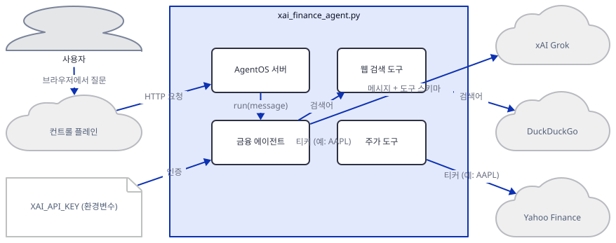
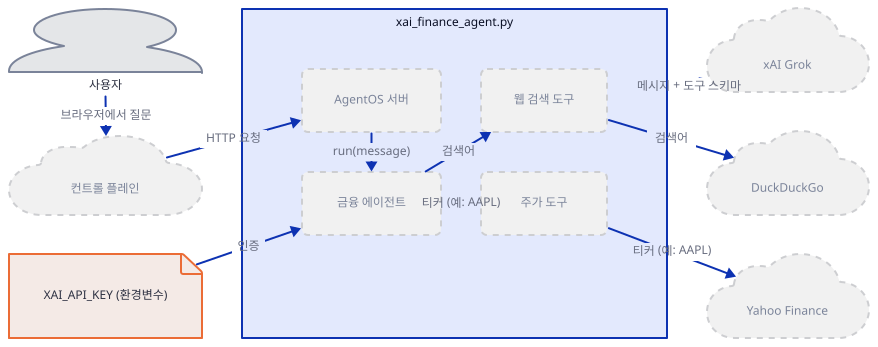
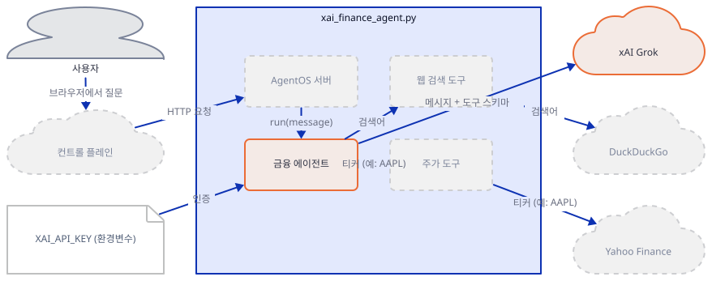
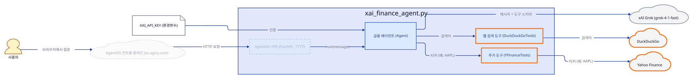
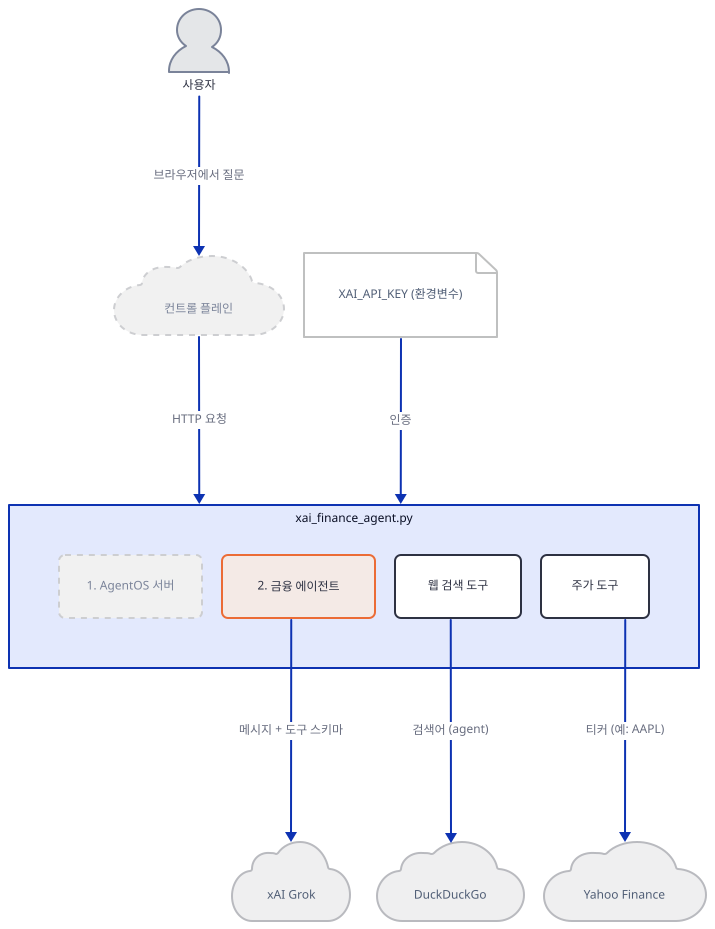
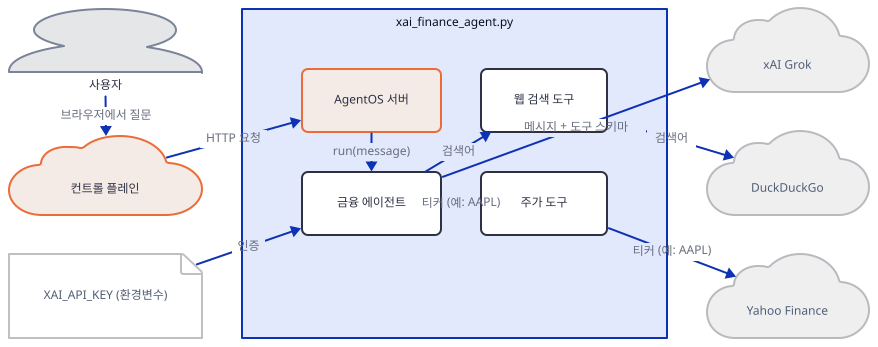
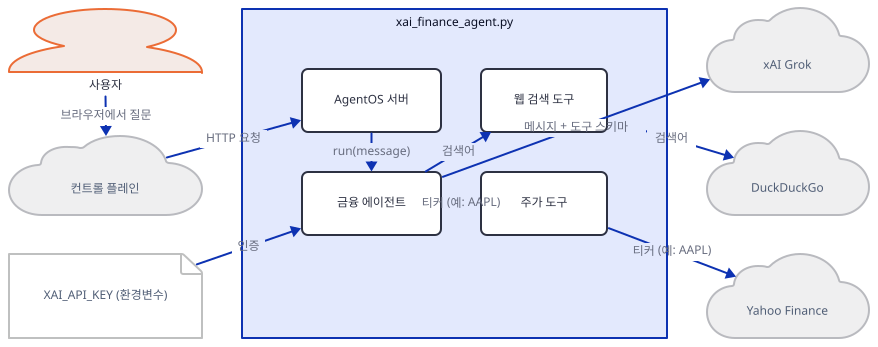
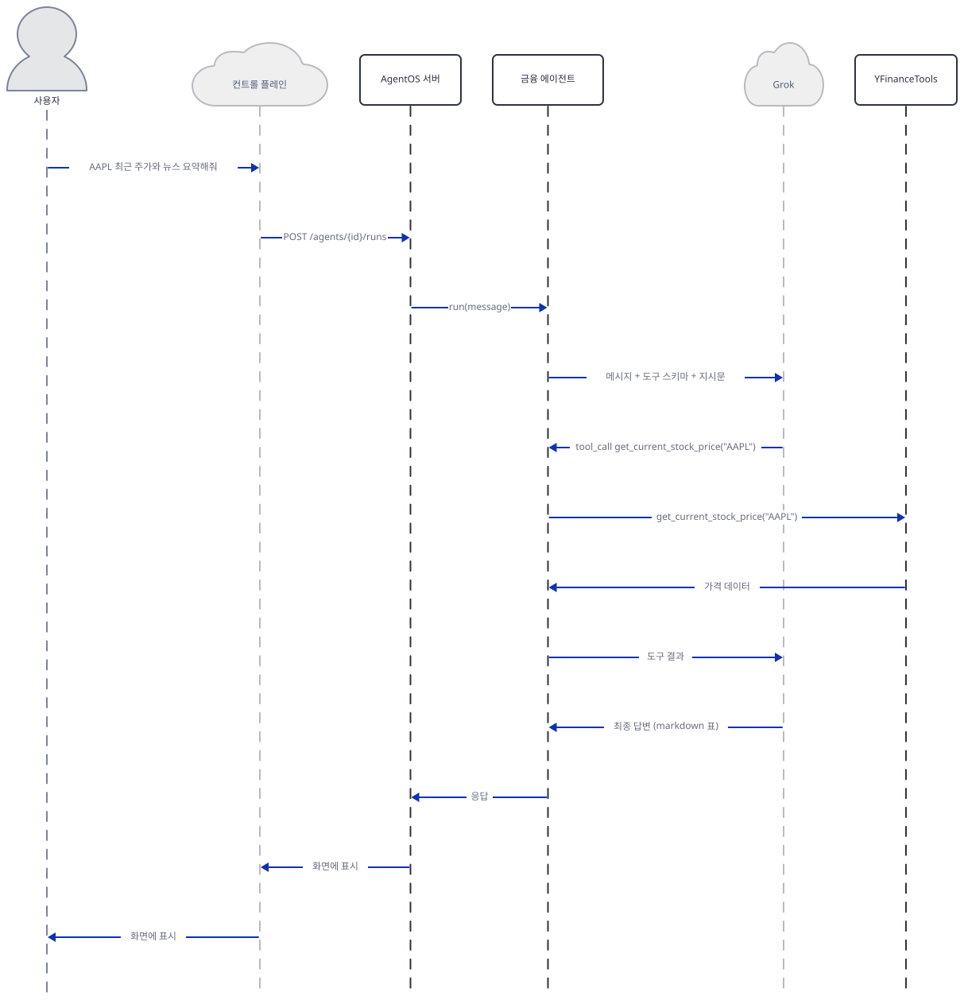

# Day 001 · 📊 xAI Finance Agent

> 볼륨 1 🌱 Starter AI Agents · 난이도 ★☆☆ · 예상 소요 60분 · API 비용 대략 질문 10개에 수십 원 이하 (xAI 콘솔 요금표 기준, 대략치) · 원본 앱: `starter_ai_agents/xai_finance_agent`

## 오늘 만들 것

이번 튜토리얼에서는 코드 23줄짜리 파일 하나(`xai_finance_agent.py`)로 완전한 형태의 AI 에이전트를 만듭니다. "에이전트"라고 부르려면 최소 세 가지가 필요합니다. 질문에 답할 **LLM**(xAI의 Grok), LLM 혼자서는 할 수 없는 일을 대신해 줄 **도구**(실시간 주가 조회, 웹 검색), 그리고 이 둘을 브라우저에서 쓸 수 있도록 감싸는 **서버**(AgentOS)입니다. 모델·도구·서비스 계층으로 이어지는 이 3요소 구조는 이 리포에 있는 agno 기반 앱 대부분이 그대로 재사용하는 뼈대이므로, Day 1에서 이 패턴에 익숙해지면 이후 132일 동안 코드를 읽는 속도가 크게 빨라집니다. 완성하면 로컬에서 띄운 서버를 AgentOS의 웹 컨트롤 플레인에 연결해 "AAPL 최근 주가와 뉴스를 표로 정리해줘" 같은 질문을 던지고, 에이전트가 필요에 따라 두 도구를 호출해 답을 만드는 과정을 터미널 로그로 직접 볼 수 있습니다. 아래는 완성된 아키텍처입니다.



## 사전 준비

| 서비스/도구 | 용도 | 발급·설치 |
|---|---|---|
| xAI API 키 | Grok 모델(`grok-4-1-fast`) 호출 인증 | https://console.x.ai/ 가입 후 발급, `XAI_API_KEY` 환경변수로 설정 |
| uv | 가상환경 생성과 패키지 설치 | [공통 사전 준비](../README.md#공통-사전-준비-한-번만) 절 참고 |
| 인터넷 연결 | Yahoo Finance(주가)·DuckDuckGo(웹 검색) API 접속 | 별도 설치 없음. 사내망이면 두 도메인에 대한 접속 허용 필요 |

## 아키텍처 한눈에 보기

| 컴포넌트 | 역할 | 코드 위치 |
|---|---|---|
| 사용자 / 컨트롤 플레인 | 브라우저에서 질문을 보내고 답을 확인 (AgentOS 컨트롤 플레인 UI, os.agno.com) | 코드 없음 (외부 UI) |
| AgentOS 서버 | 에이전트를 FastAPI 앱으로 감싸 uvicorn으로 서비스, 로컬 REST API 제공 | `starter_ai_agents/xai_finance_agent/xai_finance_agent.py:19-23` |
| 금융 에이전트 (Agent) | 지시문에 따라 모델과 도구를 조합해 질문에 답함 | `starter_ai_agents/xai_finance_agent/xai_finance_agent.py:9-16` |
| 모델 (xAI Grok) | 실제 추론을 수행하는 LLM, 도구 호출 여부를 판단 | `starter_ai_agents/xai_finance_agent/xai_finance_agent.py:3`, `starter_ai_agents/xai_finance_agent/xai_finance_agent.py:11` |
| 도구 (DuckDuckGoTools, YFinanceTools) | 웹 검색·주가 조회를 함수로 노출해 에이전트가 대신 실행 | `starter_ai_agents/xai_finance_agent/xai_finance_agent.py:4-5`, `starter_ai_agents/xai_finance_agent/xai_finance_agent.py:12` |
| 외부 API (xAI, DuckDuckGo, Yahoo Finance) | 실제 LLM 추론·검색 결과·주가 데이터를 제공하는 서드파티 서비스 3곳 | 코드 없음 (외부 서비스) |

## 단계별 진행

### Step 1. 환경 만들기

**목적.** 에이전트를 실행할 격리된 파이썬 가상환경을 만들고 의존성을 설치한 뒤 xAI API 키를 환경변수로 설정합니다.

**할 일.**

```bash
cd starter_ai_agents/xai_finance_agent
uv venv
uv pip install -r requirements.txt
uv pip install ddgs openai fastapi python-multipart uvicorn
```

(pip을 쓴다면 `python -m venv .venv && source .venv/bin/activate && pip install -r requirements.txt && pip install ddgs openai fastapi python-multipart uvicorn`.)

두 번째 설치 명령이 필요한 이유를 미리 짚습니다. `requirements.txt`는 `agno`, `duckduckgo-search`, `yfinance`만 나열하지만, 코드가 실제로 쓰는 `agno.tools.duckduckgo` 모듈은 내부적으로 `duckduckgo-search`가 아니라 `ddgs`라는 별도 패키지를 가져오고, xAI 모델과 AgentOS도 각각 `openai`, `fastapi`·`python-multipart`·`uvicorn`을 추가로 요구합니다 — 다섯 개 모두 직접 하나씩 설치해 가며 확인한 사실입니다. 이 명령 없이 `requirements.txt`만 설치하면 이후 단계에서 순서대로 다른 `ModuleNotFoundError`/`ImportError`를 만나게 되며, 정확한 증상과 원인은 "문제 해결"에 정리했습니다. 참고로 `requirements.txt`의 `agno>=2.2.10`은 버전 상한이 없어서, 이 문서를 작성하며 설치했을 때는 **agno 3.0.9**가 받아졌습니다. 여러분이 설치한 시점의 최신 버전이 다르면 이후 확인 명령의 출력도 조금 다를 수 있습니다.

키는 셸에 환경변수로 둡니다.

```bash
# macOS/Linux, Git Bash
export XAI_API_KEY="여러분의-키"
```

```powershell
# Windows PowerShell
$env:XAI_API_KEY="여러분의-키"
```



**확인.**

```bash
uv run python -c "import agno; print('ok')"
```

```
ok
```

(pip 환경이면 venv를 활성화한 뒤 `python -c "import agno; print('ok')"`로 동일하게 확인합니다.)

### Step 2. 모델 연결

**목적.** 에이전트의 "두뇌"가 될 LLM을 정의합니다. `Agent`는 agno가 제공하는 에이전트 클래스이고, `model`은 그 에이전트가 실제 추론에 사용할 LLM 클라이언트입니다.

**할 일.** 모델을 가져와 지정하는 부분을 봅니다.

`starter_ai_agents/xai_finance_agent/xai_finance_agent.py:2-3`

```python
from agno.agent import Agent
from agno.models.xai import xAI
```

`starter_ai_agents/xai_finance_agent/xai_finance_agent.py:9-11`

```python
agent = Agent(
    name="xAI Finance Agent",
    model = xAI(id="grok-4-1-fast"),
```

`Agent`는 이름·모델·도구·지시문을 한데 묶는 컨테이너이고, `xAI(id="grok-4-1-fast")`는 xAI의 Grok 4.1 Fast 모델을 가리키는 얇은 래퍼입니다. 이 시점에는 아직 xAI 서버에 접속하지 않으므로 `XAI_API_KEY`가 없어도 이 객체 생성 자체는 성공합니다 — 키 없이 직접 실행해 확인했습니다.



**확인.**

```bash
uv run python -c "from agno.models.xai import xAI; m = xAI(id='grok-4-1-fast'); print(m.id, m.provider)"
```

```
grok-4-1-fast xAI
```

### Step 3. 도구 연결

**목적.** LLM이 스스로 할 수 없는 일 — 실시간 주가 조회, 웹 검색 — 을 대신 실행해 줄 도구를 에이전트에 연결합니다.

**할 일.**

`starter_ai_agents/xai_finance_agent/xai_finance_agent.py:4-5`

```python
from agno.tools.yfinance import YFinanceTools
from agno.tools.duckduckgo import DuckDuckGoTools
```

`starter_ai_agents/xai_finance_agent/xai_finance_agent.py:12`

```python
    tools=[DuckDuckGoTools(), YFinanceTools()],
```

도구는 파이썬 함수 하나하나가 이름·설명·파라미터 스키마로 LLM에 전달되는 방식으로 동작합니다. LLM은 도구를 직접 실행하지 못하고 "이 함수를 이 인자로 불러 달라"는 tool_call만 돌려줍니다. 실제 실행은 에이전트가 로컬에서 하고, 그 결과를 다시 메시지로 만들어 LLM에 넘겨 답을 잇게 합니다. 직접 확인한 바로 `YFinanceTools()`가 기본으로 노출하는 함수는 `get_current_stock_price` 하나뿐이고, `DuckDuckGoTools()`는 `search_news`와 `web_search` 두 개입니다. 이 두 클래스는 최신 agno에서 내부적으로 `WebSearchTools`를 상속하는 얇은 래퍼로 재구성되어 있어서 함수 이름도 그쪽 기준을 따릅니다.



**확인.**

```bash
uv run python -c "from agno.tools.yfinance import YFinanceTools; print(sorted(YFinanceTools().functions))"
```

```
['get_current_stock_price']
```

### Step 4. 지시문과 출력 형식

**목적.** 에이전트가 어떤 스타일로 답할지(지시문), 마크다운을 쓸지, 내부 동작을 로그로 볼지를 정합니다.

**할 일.**

`starter_ai_agents/xai_finance_agent/xai_finance_agent.py:13-16`

```python
    instructions = ["Always use tables to display financial/numerical data. For text data use bullet points and small paragraphs."],
    debug_mode = True,
    markdown = True,
    )
```

`instructions`는 시스템 프롬프트에 그대로 들어가 답변 스타일을 지정하는 문자열 리스트입니다. 여기서는 "숫자는 표로, 텍스트는 불릿과 짧은 문단으로"라고 못박아 둡니다. `markdown=True`는 응답을 마크다운으로 렌더링하도록 지시하고, `debug_mode=True`는 에이전트가 모델에 보내는 메시지와 도구 호출을 터미널에 `DEBUG` 로그로 출력합니다. 이 옵션들은 모듈을 임포트하는 순간 `Agent(...)`가 실행되며 곧바로 적용되지만, 서버 자체는 아직 뜨지 않습니다. 파일 맨 아래의 `if __name__ == "__main__":` 가드(`starter_ai_agents/xai_finance_agent/xai_finance_agent.py:22-23`) 덕분에 `agent_os.serve(...)`는 이 파일을 직접 실행할 때만 호출됩니다.



**확인.**

```bash
uv run python -c "import xai_finance_agent as m; print(m.agent.name, len(m.agent.tools))"
```

```
xAI Finance Agent 2
```

(이 확인은 `requirements.txt`에 없는 `openai`, `ddgs`, `fastapi`, `python-multipart`가 추가로 설치돼 있어야 통과합니다. 이유는 "문제 해결"에 있습니다.)

### Step 5. AgentOS로 서비스

**목적.** 완성된 에이전트를 로컬 REST API 서버로 띄워 브라우저에서 접근할 수 있게 합니다.

**할 일.**

`starter_ai_agents/xai_finance_agent/xai_finance_agent.py:6`

```python
from agno.os import AgentOS
```

`starter_ai_agents/xai_finance_agent/xai_finance_agent.py:19-23`

```python
agent_os = AgentOS(agents=[agent])
app = agent_os.get_app()

if __name__ == "__main__":
    agent_os.serve(app="xai_finance_agent:app", reload=True)
```

`AgentOS(agents=[agent])`는 에이전트 하나 이상을 감싸는 서비스 계층이고, `get_app()`이 실제 FastAPI 애플리케이션 객체를 만들어 돌려줍니다. `serve(app="xai_finance_agent:app", reload=True)`는 uvicorn으로 그 앱을 띄우는데, 문자열 `"xai_finance_agent:app"`은 "`xai_finance_agent` 모듈의 `app` 변수"라는 뜻이라 반드시 이 파일이 있는 폴더에서 실행해야 하고, `reload=True`이므로 코드를 고치면 자동으로 재시작됩니다.



**확인.** `XAI_API_KEY` 없이도 서버 자체는 뜹니다(직접 실행해 확인). 앱 폴더에서:

```bash
uv run python xai_finance_agent.py
```

직접 확인한 로그(발췌):

```
+--------------- AgentOS ----------------+
|          https://os.agno.com/          |
|  OS running on: http://localhost:7777  |
+----------------------------------------+
INFO:     Uvicorn running on http://localhost:7777 (Press CTRL+C to quit)
INFO:     Application startup complete.
```

이어서 다른 터미널에서 자동 생성된 API 문서가 응답하는지 확인합니다.

```bash
curl -s -o /dev/null -w "%{http_code}\n" http://localhost:7777/docs
```

```
200
```

### Step 6. 첫 질문 실행

**목적.** AgentOS 컨트롤 플레인에서 실제로 질문을 던지고 에이전트가 도구를 호출하는 과정을 눈으로 봅니다.

**할 일.** 이 단계는 xAI API 키가 있어야 끝까지 진행할 수 있습니다. 브라우저에서 https://os.agno.com 에 접속해 로컬 AgentOS(`http://localhost:7777`)를 연결한 뒤, 채팅창에 "AAPL 최근 주가와 관련 뉴스를 표로 정리해줘" 같은 질문을 입력합니다. `debug_mode=True`이므로 서버를 띄운 터미널에 모델에게 보낸 메시지와 도구 호출 로그가 그대로 찍히는 것을 함께 보세요.



**확인.** 키가 없어 이 단계의 최종 화면은 재현하지 못했습니다. 대신 같은 경로를 키 없이 직접 호출해 실제로 무슨 일이 일어나는지 확인합니다.

```bash
uv run python -c "import xai_finance_agent as m; m.agent.run('hello')"
```

파이썬 예외가 밖으로 튀어나오지 않고, 터미널에

```
ERROR   Model authentication error from OpenAI API: XAI_API_KEY not set. Please set the XAI_API_KEY environment variable.
ERROR   Error in Agent run: XAI_API_KEY not set. Please set the XAI_API_KEY environment variable.
```

가 찍힙니다. 반환된 응답 객체를 직접 보려면 `m.agent.run('hello')`를 `print(m.agent.run('hello'))`로 바꿔 실행하면 되며, 이때 `status=RunStatus.error`, `content`가 위와 같은 문구를 담고 있습니다. 키를 넣으면 이 자리에서 대신 마크다운 표 형식의 실제 답변이 오고, 터미널에는 `web_search`·`search_news`·`get_current_stock_price` 중 필요한 도구가 호출되는 `DEBUG` 로그가 찍힙니다.

## 요청 한 건이 흐르는 과정



사용자가 컨트롤 플레인에 입력한 질문은 HTTP POST로 AgentOS 서버에 도착하고, 서버는 이를 `agent.run(message)` 호출로 바꿔 에이전트에 넘깁니다. 에이전트는 지시문과 두 도구의 함수 스키마를 메시지에 얹어 Grok에 보냅니다. 여기서 핵심은 **도구 호출 루프**입니다. Grok은 스스로 주가를 조회하거나 웹을 검색할 수 없으므로, 필요하다고 판단하면 최종 답 대신 "이 함수를 이 인자로 실행해 달라"는 tool_call(예: `get_current_stock_price("AAPL")`)을 돌려줍니다. 에이전트는 이 요청을 받아 실제 파이썬 함수를 로컬에서 실행하고, 그 결과(가격 데이터, 검색 결과)를 다시 메시지로 만들어 Grok에 재전송합니다. Grok은 이 도구 결과를 근거로 최종 답을 마크다운 표로 작성하고, 그 답이 AgentOS를 거쳐 컨트롤 플레인 화면에 그대로 표시됩니다. 질문 하나에 이 왕복이 도구별로, 또는 같은 도구를 다른 인자로 여러 번 반복될 수 있다는 점이 단순 챗봇과 에이전트의 차이입니다.

## 실행 체크리스트

- [ ] `XAI_API_KEY`를 환경변수로 설정했다
- [ ] `uv venv && uv pip install -r requirements.txt`로 기본 의존성을, `uv pip install ddgs openai fastapi python-multipart uvicorn`으로 추가 의존성을 설치했다
- [ ] `uv run python xai_finance_agent.py`로 서버를 띄우고 로그에서 `http://localhost:7777` 배너를 확인했다
- [ ] https://os.agno.com 컨트롤 플레인에서 로컬 AgentOS에 연결했다
- [ ] "AAPL 최근 주가와 관련 뉴스를 표로 정리해줘" 같은 질문을 보내고 표 형식 응답을 확인했다
- [ ] 터미널 로그에서 `web_search`·`search_news`·`get_current_stock_price` 중 하나 이상의 도구 호출을 확인했다

## 문제 해결

| 증상 | 원인 | 해결 |
|---|---|---|
| `from agno.tools.duckduckgo import DuckDuckGoTools` 시 ``ImportError: `ddgs` not installed. Please install using `pip install ddgs` `` (traceback 위쪽에는 `ModuleNotFoundError: No module named 'ddgs'`도 함께 보임) | `requirements.txt`는 `duckduckgo-search`를 설치하지만, 최신 agno의 `agno.tools.duckduckgo`는 `agno.tools.websearch`를 상속하며 그 안에서 `ddgs` 패키지를 가져온다(직접 확인) | `uv pip install ddgs` 실행 |
| `from agno.models.xai import xAI`, `from agno.os import AgentOS`, `agent_os.get_app()`, `agent_os.serve(...)` 단계에서 차례로 `ImportError`(`openai` 없음), `ModuleNotFoundError`(`fastapi`, `uvicorn` 없음), `RuntimeError`(`python-multipart` 없음) | `requirements.txt`는 `agno`, `duckduckgo-search`, `yfinance`만 나열하지만, xAI 모델(OpenAI 호환 클라이언트)과 AgentOS(FastAPI + uvicorn, 폼 라우트)가 이 패키지들을 필요로 한다(직접 설치해 하나씩 확인) | `uv pip install openai fastapi python-multipart uvicorn` 추가 실행 |
| 질문을 보내면 무한 대기 없이 바로 에러 답변이 오고, 터미널에 `ERROR Error in Agent run: XAI_API_KEY not set. Please set the XAI_API_KEY environment variable.` | `XAI_API_KEY` 미설정. 다만 `xAI(...)` 객체 생성과 서버 기동 자체는 키 없이도 성공한다(직접 확인) — 키 확인은 실제로 모델을 호출하는 시점에 일어난다 | `export XAI_API_KEY=...`(PowerShell `$env:XAI_API_KEY="..."`) 설정 후 서버 재시작 |
| 서버 기동 시 포트 관련 오류, 또는 브라우저에 다른 화면이 뜸 | 이미 7777 포트를 쓰는 프로세스가 떠 있음. 포트가 코드에 하드코딩돼 있어 `serve(port=...)`로 바꾸려면 앱 코드 수정이 필요 | 기존 프로세스 종료 후 재시작 (Windows: `netstat -ano \| findstr :7777`로 PID 확인 후 `taskkill /F /PID <PID>`) |
| https://os.agno.com 컨트롤 플레인이 `http://localhost:7777`에 연결하지 못함 | 브라우저가 HTTPS 페이지에서 HTTP localhost로 가는 요청을 혼합 콘텐츠로 차단했거나, 서버가 떠 있지 않음 | 먼저 `curl -s -o /dev/null -w "%{http_code}\n" http://localhost:7777/docs`로 서버 응답 코드(직접 확인: `200`)를 본다(`curl` 없이 URL만 열면 HTML 문서가 그대로 보임). 브라우저가 차단하면 사이트 설정에서 안전하지 않은 콘텐츠를 허용 |
| 앱 `README.md`의 3단계가 "Get your OpenAI API Key"라고 안내 | 문서 오탈자. 코드는 `xAI(id="grok-4-1-fast")`(`starter_ai_agents/xai_finance_agent/xai_finance_agent.py:11`)만 쓰고 OpenAI를 호출하지 않는다 | 그 문구는 무시하고 실제로는 xAI 키(`XAI_API_KEY`, https://console.x.ai/)를 발급받는다 |

## 더 해보기

- `instructions`에 "반드시 한국어로 답하라"를 추가해 응답 언어를 강제해보기 (`starter_ai_agents/xai_finance_agent/xai_finance_agent.py:13`)
- "AAPL과 MSFT의 최근 주가를 비교해줘"처럼 종목 두 개를 묻는 질문을 넣어 `get_current_stock_price`가 두 번 호출되는지 로그로 확인하기
- `debug_mode=True`를 `False`로 바꿔 재시작한 뒤 터미널 로그가 얼마나 줄어드는지 비교하기

## 다음 날 예고

[Day 002 · 🕸️ Web Scraping AI Agent](../day002-web-scraping-ai-agent/README.md) — 웹 페이지를 LLM으로 구조화해서 긁어오는 에이전트를 만듭니다.
