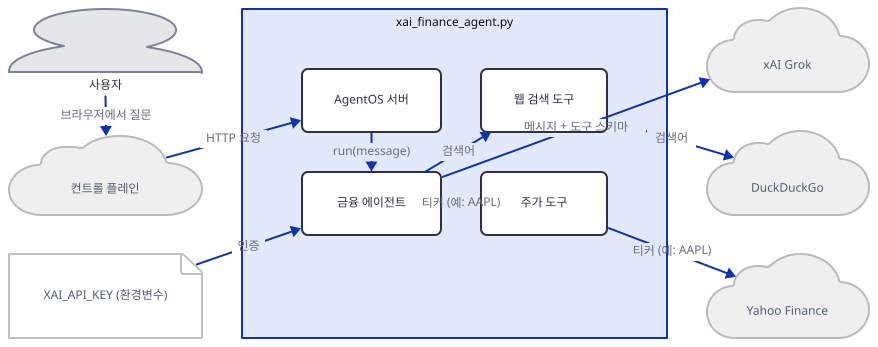
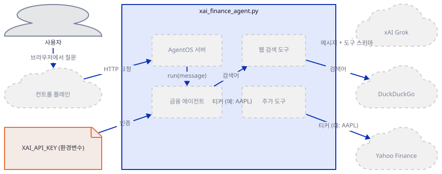
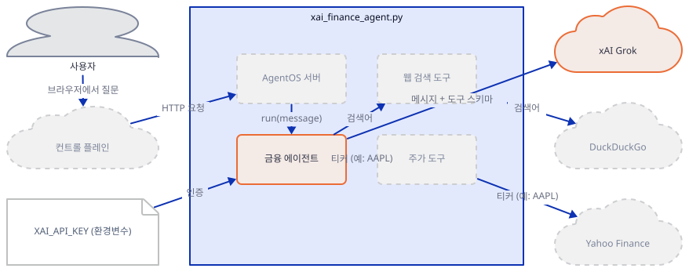
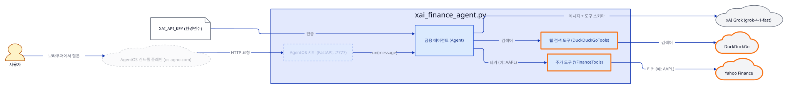
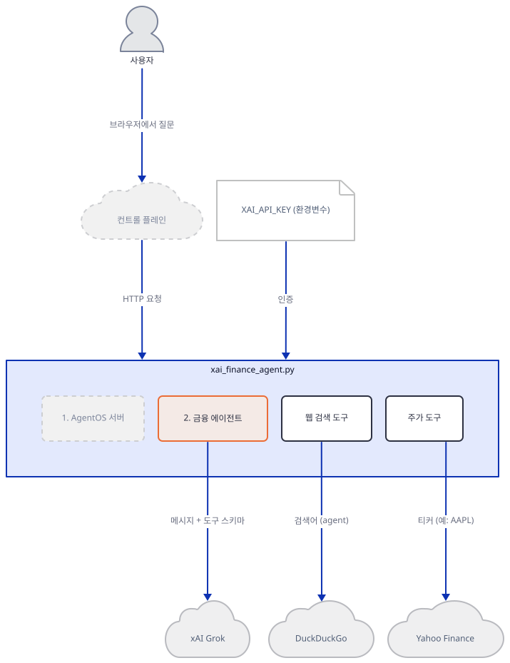
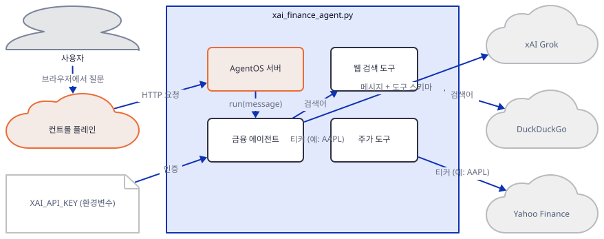
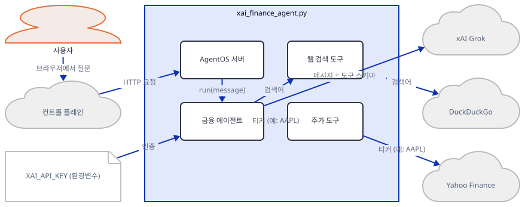
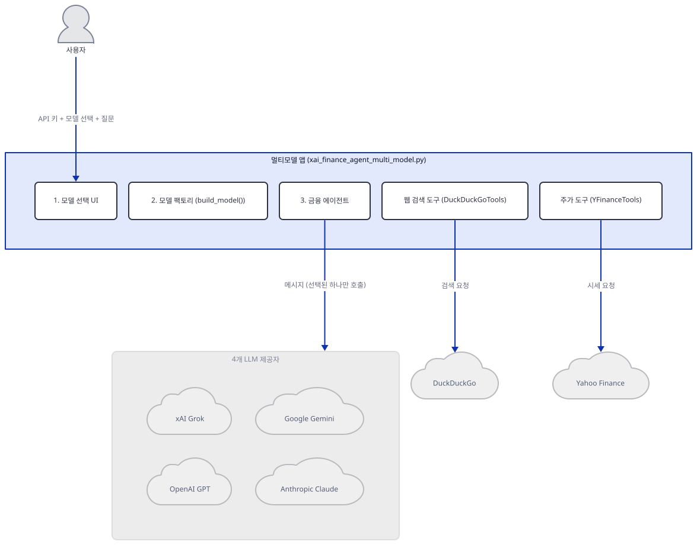
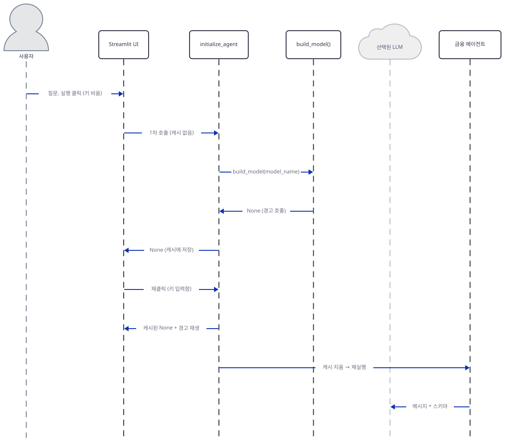
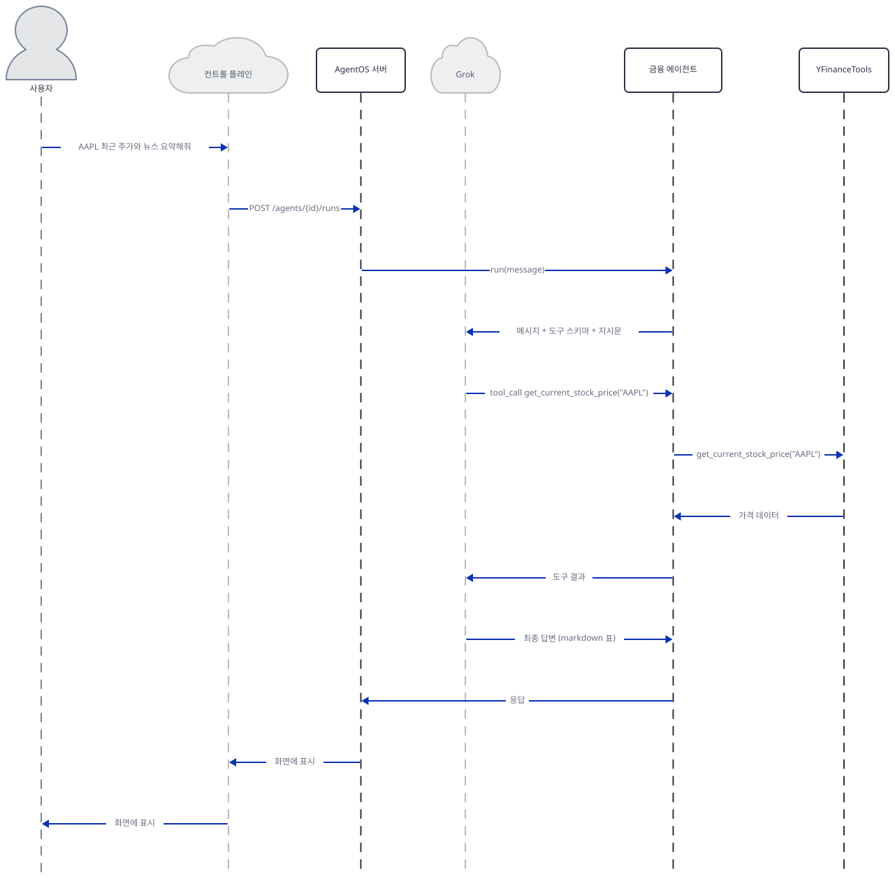

# Day 001 · 📊 xAI Finance Agent

> 볼륨 1 🌱 Starter AI Agents · 난이도 ★☆☆ · 예상 소요 75분(Step 7에서 멀티모델 변형 앱까지 설치·실행해 늘었습니다) · API 비용 대략 질문 10개에 수십 원 이하 (xAI 콘솔 요금표 기준, 대략치) · 원본 앱: `starter_ai_agents/xai_finance_agent`

## 오늘 만들 것

이번 튜토리얼에서는 코드 23줄짜리 파일 하나(`xai_finance_agent.py`)로 완전한 형태의 AI 에이전트를 만듭니다. "에이전트"라고 부르려면 최소 세 가지가 필요합니다. 질문에 답할 **LLM**(xAI의 Grok), LLM 혼자서는 할 수 없는 일을 대신해 줄 **도구**(실시간 주가 조회, 웹 검색), 그리고 이 둘을 브라우저에서 쓸 수 있도록 감싸는 **서버**(AgentOS)입니다. 모델·도구·서비스 계층으로 이어지는 이 3요소 구조는 이 리포에 있는 agno 기반 앱 대부분이 그대로 재사용하는 뼈대이므로, Day 1에서 이 패턴에 익숙해지면 이후 132일 동안 코드를 읽는 속도가 크게 빨라집니다. 완성하면 로컬에서 띄운 서버를 AgentOS의 웹 컨트롤 플레인에 연결해 "AAPL 최근 주가와 뉴스를 표로 정리해줘" 같은 질문을 던지고, 에이전트가 필요에 따라 두 도구를 호출해 답을 만드는 과정을 터미널 로그로 직접 볼 수 있습니다. 아래는 완성된 아키텍처입니다.



이 폴더에는 같은 도구 조합(DuckDuckGoTools, YFinanceTools)을 그대로 쓰면서 모델 제공자만 바꿔 낄 수 있게 만든 두 번째 진입점 `xai_finance_agent_multi_model.py`도 있습니다. AgentOS 서버 대신 Streamlit UI 하나로 xAI Grok·OpenAI GPT·Gemini·Anthropic Claude 네 모델 중 하나를 골라 같은 질문에 답하게 하는 변형이며, Step 7에서 다룹니다.

## 사전 준비

| 서비스/도구 | 용도 | 발급·설치 |
|---|---|---|
| xAI API 키 | Grok 모델(`grok-4-1-fast`) 호출 인증 | https://console.x.ai/ 가입 후 발급, `XAI_API_KEY` 환경변수로 설정 |
| (선택) OpenAI·Google·Anthropic API 키 | Step 7의 멀티모델 앱에서 xAI 대신 다른 모델을 써볼 때만 필요. 하나도 없어도 화면 동작과 키 없을 때의 경고는 확인할 수 있다 | https://platform.openai.com/ , https://aistudio.google.com/ , https://console.anthropic.com/ 에서 각각 발급 |
| uv | 가상환경 생성과 패키지 설치 | [공통 사전 준비](../README.md#공통-사전-준비-한-번만) 절 참고 |
| 인터넷 연결 | Yahoo Finance(주가)·DuckDuckGo(웹 검색) API 접속 | 별도 설치 없음. 사내망이면 두 도메인에 대한 접속 허용 필요 |

## 아키텍처 한눈에 보기

| 컴포넌트 | 역할 | 코드 위치 |
|---|---|---|
| 사용자 / 컨트롤 플레인 | 브라우저에서 질문을 보내고 답을 확인 (AgentOS 컨트롤 플레인 UI, os.agno.com) | 코드 없음 (외부 UI) |
| AgentOS 서버 | 에이전트를 FastAPI 앱으로 감싸 uvicorn으로 서비스, 로컬 REST API 제공 | `starter_ai_agents/xai_finance_agent/xai_finance_agent.py:19-23` |
| 금융 에이전트 (Agent) | 지시문에 따라 모델과 도구를 조합해 질문에 답함 | `starter_ai_agents/xai_finance_agent/xai_finance_agent.py:9-16` |
| 모델 (xAI Grok) | 실제 추론을 수행하는 LLM, 도구 호출 여부를 판단 | `starter_ai_agents/xai_finance_agent/xai_finance_agent.py:3`, `starter_ai_agents/xai_finance_agent/xai_finance_agent.py:11` |
| 도구 (DuckDuckGoTools, YFinanceTools) | 웹 검색·주가 조회를 함수로 노출해 에이전트가 대신 실행 | `starter_ai_agents/xai_finance_agent/xai_finance_agent.py:4-5`, `starter_ai_agents/xai_finance_agent/xai_finance_agent.py:12` |
| 외부 API (xAI, DuckDuckGo, Yahoo Finance) | 실제 LLM 추론·검색 결과·주가 데이터를 제공하는 서드파티 서비스 3곳 | 코드 없음 (외부 서비스) |
| Streamlit UI (멀티모델 변형) | 모델 선택 셀렉트박스, 제공자별 키 입력창 4개, 질문 입력창과 실행 버튼을 제공 | `starter_ai_agents/xai_finance_agent/xai_finance_agent_multi_model.py:21-36`, `starter_ai_agents/xai_finance_agent/xai_finance_agent_multi_model.py:92-111` |
| 모델 팩토리 (`build_model`) | 선택된 모델 이름에 따라 xAI·OpenAI·Gemini·Anthropic 중 하나의 모델 객체를 생성 | `starter_ai_agents/xai_finance_agent/xai_finance_agent_multi_model.py:39-69` |
| 캐시된 에이전트 생성 (`initialize_agent`) | 원본과 같은 도구·지시문으로 에이전트를 만들고 `model_name`별로 재사용 | `starter_ai_agents/xai_finance_agent/xai_finance_agent_multi_model.py:72-89` |
| 4개 LLM 제공자 (xAI, OpenAI, Gemini, Anthropic) | `build_model`이 고른 하나가 실제 추론을 수행 (도구·지시문은 원본과 동일) | 코드 없음 (외부 서비스) |

## 단계별 진행

### Step 1. 환경 만들기

**목적.** 에이전트를 실행할 격리된 파이썬 가상환경을 만들고 의존성을 설치한 뒤 xAI API 키를 환경변수로 설정합니다.

**할 일.**

```bash
cd starter_ai_agents/xai_finance_agent
uv venv
uv pip install -r requirements.txt
uv pip install ddgs openai fastapi python-multipart uvicorn
```

(pip을 쓴다면 `python -m venv .venv && source .venv/bin/activate && pip install -r requirements.txt && pip install ddgs openai fastapi python-multipart uvicorn`.)

이 저장소는 루트에 `pyproject.toml`이 있어 `uv run`이 방금 만든 환경 대신 루트의 `.venv`를 쓰므로, 이후 `uv run` 명령에는 모두 `--no-project`를 붙입니다.

두 번째 설치 명령이 필요한 이유를 미리 짚습니다. `requirements.txt`는 `agno`, `duckduckgo-search`, `yfinance`만 나열하지만, 코드가 실제로 쓰는 `agno.tools.duckduckgo` 모듈은 내부적으로 `duckduckgo-search`가 아니라 `ddgs`라는 별도 패키지를 가져오고, xAI 모델과 AgentOS도 각각 `openai`, `fastapi`·`python-multipart`·`uvicorn`을 추가로 요구합니다 — 다섯 개 모두 직접 하나씩 설치해 가며 확인한 사실입니다. 이 명령 없이 `requirements.txt`만 설치하면 이후 단계에서 순서대로 다른 `ModuleNotFoundError`/`ImportError`를 만나게 되며, 정확한 증상과 원인은 "문제 해결"에 정리했습니다. 참고로 `requirements.txt`의 `agno>=2.2.10`은 버전 상한이 없어서, 이 문서를 작성하며 설치했을 때는 **agno 3.0.9**가 받아졌습니다. 여러분이 설치한 시점의 최신 버전이 다르면 이후 확인 명령의 출력도 조금 다를 수 있습니다.

키는 셸에 환경변수로 둡니다.

```bash
# macOS/Linux, Git Bash
export XAI_API_KEY="여러분의-키"
```

```powershell
# Windows PowerShell
$env:XAI_API_KEY="여러분의-키"
```



**확인.**

```bash
uv run --no-project python -c "import agno; print('ok')"
```

```
ok
```

(pip 환경이면 venv를 활성화한 뒤 `python -c "import agno; print('ok')"`로 동일하게 확인합니다.)

### Step 2. 모델 연결

**목적.** 에이전트의 "두뇌"가 될 LLM을 정의합니다. `Agent`는 agno가 제공하는 에이전트 클래스이고, `model`은 그 에이전트가 실제 추론에 사용할 LLM 클라이언트입니다.

**할 일.** 모델을 가져와 지정하는 부분을 봅니다.

`starter_ai_agents/xai_finance_agent/xai_finance_agent.py:2-3`

```python
from agno.agent import Agent
from agno.models.xai import xAI
```

`starter_ai_agents/xai_finance_agent/xai_finance_agent.py:9-11`

```python
agent = Agent(
    name="xAI Finance Agent",
    model = xAI(id="grok-4-1-fast"),
```

`Agent`는 이름·모델·도구·지시문을 한데 묶는 컨테이너이고, `xAI(id="grok-4-1-fast")`는 xAI의 Grok 4.1 Fast 모델을 가리키는 얇은 래퍼입니다. 이 시점에는 아직 xAI 서버에 접속하지 않으므로 `XAI_API_KEY`가 없어도 이 객체 생성 자체는 성공합니다 — 키 없이 직접 실행해 확인했습니다. 다만 xAI 공식 문서 기준으로 `grok-4-1-fast` 계열은 이미 퇴역했고, 그 자리로 가는 요청은 실패하지 않은 채 다른 모델로 자동 전환되어 다른 요금이 매겨집니다 — 출처와 자세한 내용은 "문제 해결"에 있습니다.



**확인.**

```bash
uv run --no-project python -c "from agno.models.xai import xAI; m = xAI(id='grok-4-1-fast'); print(m.id, m.provider)"
```

```
grok-4-1-fast xAI
```

### Step 3. 도구 연결

**목적.** LLM이 스스로 할 수 없는 일 — 실시간 주가 조회, 웹 검색 — 을 대신 실행해 줄 도구를 에이전트에 연결합니다.

**할 일.**

`starter_ai_agents/xai_finance_agent/xai_finance_agent.py:4-5`

```python
from agno.tools.yfinance import YFinanceTools
from agno.tools.duckduckgo import DuckDuckGoTools
```

`starter_ai_agents/xai_finance_agent/xai_finance_agent.py:12`

```python
    tools=[DuckDuckGoTools(), YFinanceTools()],
```

도구는 파이썬 함수 하나하나가 이름·설명·파라미터 스키마로 LLM에 전달되는 방식으로 동작합니다. LLM은 도구를 직접 실행하지 못하고 "이 함수를 이 인자로 불러 달라"는 tool_call만 돌려줍니다. 실제 실행은 에이전트가 로컬에서 하고, 그 결과를 다시 메시지로 만들어 LLM에 넘겨 답을 잇게 합니다. 직접 확인한 바로 `YFinanceTools()`가 기본으로 노출하는 함수는 `get_current_stock_price` 하나뿐이고, `DuckDuckGoTools()`는 `search_news`와 `web_search` 두 개입니다. 이 두 클래스는 최신 agno에서 내부적으로 `WebSearchTools`를 상속하는 얇은 래퍼로 재구성되어 있어서 함수 이름도 그쪽 기준을 따릅니다.



**확인.**

```bash
uv run --no-project python -c "from agno.tools.yfinance import YFinanceTools; print(sorted(YFinanceTools().functions))"
```

```
['get_current_stock_price']
```

### Step 4. 지시문과 출력 형식

**목적.** 에이전트가 어떤 스타일로 답할지(지시문), 마크다운을 쓸지, 내부 동작을 로그로 볼지를 정합니다.

**할 일.**

`starter_ai_agents/xai_finance_agent/xai_finance_agent.py:13-16`

```python
    instructions = ["Always use tables to display financial/numerical data. For text data use bullet points and small paragraphs."],
    debug_mode = True,
    markdown = True,
    )
```

`instructions`는 시스템 프롬프트에 그대로 들어가 답변 스타일을 지정하는 문자열 리스트입니다. 여기서는 "숫자는 표로, 텍스트는 불릿과 짧은 문단으로"라고 못박아 둡니다. `markdown=True`는 응답을 마크다운으로 렌더링하도록 지시하고, `debug_mode=True`는 에이전트가 모델에 보내는 메시지와 도구 호출을 터미널에 `DEBUG` 로그로 출력합니다. 이 옵션들은 모듈을 임포트하는 순간 `Agent(...)`가 실행되며 곧바로 적용되지만, 서버 자체는 아직 뜨지 않습니다. 파일 맨 아래의 `if __name__ == "__main__":` 가드(`starter_ai_agents/xai_finance_agent/xai_finance_agent.py:22-23`) 덕분에 `agent_os.serve(...)`는 이 파일을 직접 실행할 때만 호출됩니다.



**확인.**

```bash
uv run --no-project python -c "import xai_finance_agent as m; print(m.agent.name, len(m.agent.tools))"
```

```
xAI Finance Agent 2
```

(이 확인은 `requirements.txt`에 없는 `openai`, `ddgs`, `fastapi`, `python-multipart`가 추가로 설치돼 있어야 통과합니다. 이유는 "문제 해결"에 있습니다.)

### Step 5. AgentOS로 서비스

**목적.** 완성된 에이전트를 로컬 REST API 서버로 띄워 브라우저에서 접근할 수 있게 합니다.

**할 일.**

`starter_ai_agents/xai_finance_agent/xai_finance_agent.py:6`

```python
from agno.os import AgentOS
```

`starter_ai_agents/xai_finance_agent/xai_finance_agent.py:19-23`

```python
agent_os = AgentOS(agents=[agent])
app = agent_os.get_app()

if __name__ == "__main__":
    agent_os.serve(app="xai_finance_agent:app", reload=True)
```

`AgentOS(agents=[agent])`는 에이전트 하나 이상을 감싸는 서비스 계층이고, `get_app()`이 실제 FastAPI 애플리케이션 객체를 만들어 돌려줍니다. `serve(app="xai_finance_agent:app", reload=True)`는 uvicorn으로 그 앱을 띄우는데, 문자열 `"xai_finance_agent:app"`은 "`xai_finance_agent` 모듈의 `app` 변수"라는 뜻이라 반드시 이 파일이 있는 폴더에서 실행해야 하고, `reload=True`이므로 코드를 고치면 자동으로 재시작됩니다.



**확인.** `XAI_API_KEY` 없이도 서버 자체는 뜹니다(직접 실행해 확인). 앱 폴더에서:

```bash
uv run --no-project python xai_finance_agent.py
```

직접 확인한 로그(발췌):

```
+--------------- AgentOS ----------------+
|          https://os.agno.com/          |
|  OS running on: http://localhost:7777  |
+----------------------------------------+
INFO:     Uvicorn running on http://localhost:7777 (Press CTRL+C to quit)
INFO:     Application startup complete.
```

이어서 다른 터미널에서 자동 생성된 API 문서가 응답하는지 확인합니다.

```bash
curl -s -o /dev/null -w "%{http_code}\n" http://localhost:7777/docs
```

```
200
```

### Step 6. 첫 질문 실행

**목적.** AgentOS 컨트롤 플레인에서 실제로 질문을 던지고 에이전트가 도구를 호출하는 과정을 눈으로 봅니다.

**할 일.** 이 단계는 xAI API 키가 있어야 끝까지 진행할 수 있습니다. 브라우저에서 https://os.agno.com 에 접속해 로컬 AgentOS(`http://localhost:7777`)를 연결한 뒤, 채팅창에 "AAPL 최근 주가와 관련 뉴스를 표로 정리해줘" 같은 질문을 입력합니다. `debug_mode=True`이므로 서버를 띄운 터미널에 모델에게 보낸 메시지와 도구 호출 로그가 그대로 찍히는 것을 함께 보세요.



**확인.** 키가 없어 이 단계의 최종 화면은 재현하지 못했습니다. 대신 같은 경로를 키 없이 직접 호출해 실제로 무슨 일이 일어나는지 확인합니다.

```bash
uv run --no-project python -c "import xai_finance_agent as m; m.agent.run('hello')"
```

파이썬 예외가 밖으로 튀어나오지 않고, 터미널에

```
ERROR   Model authentication error from OpenAI API: XAI_API_KEY not set. Please set the XAI_API_KEY environment variable.
ERROR   Error in Agent run: XAI_API_KEY not set. Please set the XAI_API_KEY environment variable.
```

가 찍힙니다. 반환된 응답 객체를 직접 보려면 `m.agent.run('hello')`를 `print(m.agent.run('hello'))`로 바꿔 실행하면 되며, 이때 `status=RunStatus.error`, `content`가 위와 같은 문구를 담고 있습니다. 키를 넣으면 이 자리에서 대신 마크다운 표 형식의 실제 답변이 오고, 터미널에는 `web_search`·`search_news`·`get_current_stock_price` 중 필요한 도구가 호출되는 `DEBUG` 로그가 찍힙니다.

### Step 7. 같은 에이전트를 멀티모델로 확장하기 (Streamlit)

**목적.** 지금까지 만든 에이전트(도구 2개 + 지시문)를 그대로 두고 모델만 바꿔 끼울 수 있다는 것을 실제 코드로 확인합니다. 같은 폴더의 `xai_finance_agent_multi_model.py`는 AgentOS 대신 Streamlit UI 하나로 xAI Grok·OpenAI GPT·Gemini·Anthropic Claude 네 모델 중 하나를 고르게 하고, 고른 모델에 맞는 API 키를 화면에서 직접 입력받습니다.

**할 일.** 새 진입점은 같은 폴더에 있으므로 Step 1의 가상환경을 그대로 씁니다. `requirements.txt`에 없는 패키지가 다섯 개 더 필요한데, `ddgs`와 `openai`는 Step 1에서 이미 설치했으므로 이번에 새로 설치할 것은 Streamlit과 두 모델 SDK뿐입니다(하나씩 설치해 가며 직접 확인).

```bash
cd starter_ai_agents/xai_finance_agent
uv pip install streamlit google-genai anthropic
```

(pip이면 `pip install streamlit google-genai anthropic`. Step 1을 건너뛰고 이 파일부터 바로 시작했다면 가상환경도 없으므로 `uv venv` 후 `uv pip install -r requirements.txt ddgs openai streamlit google-genai anthropic`까지 한 번에 설치합니다.)

임포트는 4개 모델 클래스를 나란히 가져옵니다.

`starter_ai_agents/xai_finance_agent/xai_finance_agent_multi_model.py:1-10`

```python
import os

import streamlit as st
from agno.agent import Agent
from agno.models.anthropic import Claude
from agno.models.google import Gemini
from agno.models.openai import OpenAIChat
from agno.models.xai import xAI
from agno.tools.duckduckgo import DuckDuckGoTools
from agno.tools.yfinance import YFinanceTools
```

사이드바는 제공자별 키 입력창 4개와 모델 선택 셀렉트박스를 만듭니다. `index=1`이 기본값이라 처음 열면 "OpenAI GPT"가 이미 선택돼 있습니다(직접 확인: `streamlit.testing.v1.AppTest`로 렌더링해 `selectbox[0].value`를 읽음).

`starter_ai_agents/xai_finance_agent/xai_finance_agent_multi_model.py:21-36`

```python
with st.sidebar:
    st.header("🔐 API Keys")
    st.write("각 키는 로컬 세션에만 저장됩니다.")
    st.caption("Google Gemini는 Google AI Studio에서 발급한 키를 사용해야 하며, 최신 모델 ID를 사용해야 합니다.")

    xai_api_key = st.text_input("xAI API Key", type="password", key="xai_finance_key")
    openai_api_key = st.text_input("OpenAI API Key", type="password", key="openai_finance_key")
    google_api_key = st.text_input("Google API Key", type="password", key="google_finance_key")
    anthropic_api_key = st.text_input("Anthropic API Key", type="password", key="anthropic_finance_key")

    st.markdown("---")
    model_choice = st.selectbox(
        "Select LLM",
        ["xAI Grok", "OpenAI GPT", "Gemini", "Anthropic Claude"],
        index=1,
    )
```

`build_model`은 선택된 이름에 따라 넷 중 하나의 모델 객체를 만듭니다. 네 분기는 같은 모양입니다 — 키가 비어 있으면 경고를 띄우고 `None`을 돌려주고, 있으면 `os.environ`에 심어 둔 뒤 모델을 생성합니다.

`starter_ai_agents/xai_finance_agent/xai_finance_agent_multi_model.py:39-69`

```python
def build_model(model_name: str):
    if model_name == "xAI Grok":
        if not xai_api_key:
            st.warning("xAI API 키를 입력하세요.")
            return None
        os.environ["XAI_API_KEY"] = xai_api_key
        return xAI(id="grok-4-1-fast", api_key=xai_api_key)

    if model_name == "OpenAI GPT":
        if not openai_api_key:
            st.warning("OpenAI API 키를 입력하세요.")
            return None
        os.environ["OPENAI_API_KEY"] = openai_api_key
        return OpenAIChat(id="gpt-4o", api_key=openai_api_key)

    if model_name == "Gemini":
        if not google_api_key:
            st.warning("Google API 키를 입력하세요.")
            return None
        os.environ["GOOGLE_API_KEY"] = google_api_key
        os.environ["GEMINI_API_KEY"] = google_api_key
        return Gemini(id="gemini-3.6-flash", api_key=google_api_key)

    if model_name == "Anthropic Claude":
        if not anthropic_api_key:
            st.warning("Anthropic API 키를 입력하세요.")
            return None
        os.environ["ANTHROPIC_API_KEY"] = anthropic_api_key
        return Claude(id="claude-3-5-sonnet-20241022", api_key=anthropic_api_key)

    return None
```

네 생성자 모두 키만 있으면 네트워크 없이 즉시 객체를 돌려줍니다 — 직접 확인: 가짜 키로 네 클래스를 모두 만들어 `.id`·`.provider`를 출력해도 예외 없이 끝납니다(아래 "확인" 참고). 다만 모델 id 네 개 중 둘(45행의 `grok-4-1-fast`, 67행의 `claude-3-5-sonnet-20241022`)은 실제로 호출하는 시점에 문제가 됩니다 — 하나는 조용히 다른 모델로 바뀌고, 하나는 아예 실패합니다. "문제 해결"에 적었습니다.

이렇게 만든 모델은 `initialize_agent`가 원본과 같은 도구·지시문으로 에이전트를 감싸고, `@st.cache_resource`로 같은 `model_name`에 대해 재사용합니다.

`starter_ai_agents/xai_finance_agent/xai_finance_agent_multi_model.py:72-89`

```python
@st.cache_resource

def initialize_agent(model_name: str):
    model = build_model(model_name)
    if model is None:
        return None

    return Agent(
        name=f"{model_name} Finance Agent",
        model=model,
        tools=[DuckDuckGoTools(), YFinanceTools()],
        instructions=[
            "Always use tables to display financial and numerical data.",
            "For text, use bullet points and short paragraphs.",
            "When giving stock information, explain assumptions clearly and cite the source when possible.",
        ],
        markdown=True,
    )
```

여기서 캐시 키가 `model_name` 문자열 하나뿐이라는 점이 문제를 만듭니다. 키를 입력하지 않은 채 실행을 눌러 `None`이 한 번 캐시되면, 이후 같은 모델을 고른 채 키를 채워 넣고 다시 눌러도 `initialize_agent`는 함수 본문을 다시 실행하지 않고 캐시된 `None`을 그대로 돌려줍니다. Streamlit의 `cache_resource`는 캐시된 함수 안에서 부른 `st.warning` 같은 요소(element)도 함께 저장했다가 캐시가 맞을 때 그대로 다시 그리므로(소스로 확인: streamlit 1.64.0 `runtime/caching/cached_message_replay.py`의 `replay_cached_messages`), 화면에는 `build_model`이 다시 실행된 것처럼 "OpenAI API 키를 입력하세요." 경고까지 똑같이 다시 뜹니다 — 이번엔 키가 있는데도 뜨는 것이라 원인을 착각하기 쉽습니다. 이 캐시는 세션이 아니라 **프로세스 전역**이라서, 다른 브라우저 세션에서 같은 모델에 처음 키를 넣어도 똑같은 경고를 봅니다. 화면 오른쪽 위 메뉴의 "Clear cache"(단축키 `C`)를 눌러야 지워지는데, 이 역시 전역이라 접속한 모든 사용자의 캐시와 세션 상태를 함께 지웁니다(소스로 확인: streamlit 1.64.0 `runtime/app_session.py` 1146-1154행, docstring "cleared for all users"). 실제 브라우저 클릭 없이 `streamlit.testing.v1.AppTest`로 재현했습니다.

편집기로 같은 폴더에 아래 내용의 `cache_repro.py`를 만들어 실행합니다(`AppTest`의 기본 제한 시간은 3초인데, 방금 설치한 패키지들을 처음 import하면 바이트코드 캐시가 없어 그보다 오래 걸리므로 `default_timeout=30`을 명시합니다).

```python
from streamlit.testing.v1 import AppTest

at = AppTest.from_file("xai_finance_agent_multi_model.py", default_timeout=30)
at.run()
at.button[0].click().run()
print("1st click (no key):", [w.value for w in at.warning])

at.sidebar.text_input(key="openai_finance_key").set_value("sk-fake-not-a-real-key")
at.run()
at.button[0].click().run()
print("2nd click (key entered, cache not cleared):", [w.value for w in at.warning])
```

```bash
uv run --no-project python cache_repro.py
```

(다 확인했으면 `cache_repro.py`는 지웁니다 — 앱 코드가 아니라 재현용 스크립트라 저장소에 남길 필요가 없습니다.)

직접 확인한 출력(설치 직후 첫 실행, `default_timeout=30` 덕분에 제한 시간 없이 끝까지 돔):

```
1st click (no key): ['OpenAI API 키를 입력하세요.', '선택한 모델에 맞는 API 키를 입력해주세요.']
2nd click (key entered, cache not cleared): ['OpenAI API 키를 입력하세요.', '선택한 모델에 맞는 API 키를 입력해주세요.']
```

버튼을 누르면 캐시된(또는 새로 만든) 에이전트로 실제 실행이 이어집니다.

`starter_ai_agents/xai_finance_agent/xai_finance_agent_multi_model.py:98-111`

```python
if st.button("실행"):
    agent = initialize_agent(model_choice)
    if agent is None:
        st.warning("선택한 모델에 맞는 API 키를 입력해주세요.")
    elif user_question.strip():
        with st.spinner(f"{model_choice} 모델로 분석 중..."):
            try:
                result = agent.run(user_question)
                st.subheader("결과")
                st.markdown(result.content)
            except Exception as e:
                st.error(f"실행 중 오류가 발생했습니다: {e}")
else:
    st.info("사이드바에서 API 키와 모델을 선택한 뒤 실행 버튼을 누르세요.")
```



위 그림은 파일 안 구성 요소를 번호로만 보여 주고 호출 순서는 담지 않습니다 — 그 순서, 특히 방금 설명한 캐시 재생 버그는 아래 시퀀스가 대신 보여 줍니다. 첫 클릭(키 비움)이 `build_model`을 거쳐 `None`을 캐시에 남기고, 재클릭(키 입력함)은 `build_model`을 다시 부르지 않은 채 그 `None`과 경고를 그대로 재생하며, 캐시를 지운 뒤에야 실제로 에이전트가 만들어져 선택된 LLM까지 메시지가 갑니다.



**확인.** 키 없이 네 모델 생성자만 직접 호출해 봅니다(네트워크 요청이 아니라 객체 생성만).

```bash
uv run --no-project python -c "from agno.models.xai import xAI; from agno.models.openai import OpenAIChat; from agno.models.google import Gemini; from agno.models.anthropic import Claude; ms = [xAI(id='grok-4-1-fast', api_key='fake'), OpenAIChat(id='gpt-4o', api_key='fake'), Gemini(id='gemini-3.6-flash', api_key='fake'), Claude(id='claude-3-5-sonnet-20241022', api_key='fake')]; [print(type(m).__name__, m.id, m.provider) for m in ms]"
```

직접 확인한 출력:

```
xAI grok-4-1-fast xAI
OpenAIChat gpt-4o OpenAI
Gemini gemini-3.6-flash Google
Claude claude-3-5-sonnet-20241022 Anthropic
```

앱을 직접 띄워 보려면 다음 명령을 씁니다.

```bash
uv run --no-project streamlit run xai_finance_agent_multi_model.py --server.headless true --server.address localhost
```

브라우저에서 `http://localhost:8501`을 열면 사이드바 셀렉트박스가 "OpenAI GPT"로 이미 선택돼 있고, 키 없이 "실행"을 누르면 "OpenAI API 키를 입력하세요."와 "선택한 모델에 맞는 API 키를 입력해주세요." 경고 두 개가 뜹니다(직접 확인: 위 AppTest 재현과 같은 동작).

## 요청 한 건이 흐르는 과정



사용자가 컨트롤 플레인에 입력한 질문은 HTTP POST로 AgentOS 서버에 도착하고, 서버는 이를 `agent.run(message)` 호출로 바꿔 에이전트에 넘깁니다. 에이전트는 지시문과 두 도구의 함수 스키마를 메시지에 얹어 Grok에 보냅니다. 여기서 핵심은 **도구 호출 루프**입니다. Grok은 스스로 주가를 조회하거나 웹을 검색할 수 없으므로, 필요하다고 판단하면 최종 답 대신 "이 함수를 이 인자로 실행해 달라"는 tool_call(예: `get_current_stock_price("AAPL")`)을 돌려줍니다. 에이전트는 이 요청을 받아 실제 파이썬 함수를 로컬에서 실행하고, 그 결과(가격 데이터, 검색 결과)를 다시 메시지로 만들어 Grok에 재전송합니다. Grok은 이 도구 결과를 근거로 최종 답을 마크다운 표로 작성하고, 그 답이 AgentOS를 거쳐 컨트롤 플레인 화면에 그대로 표시됩니다. 질문 하나에 이 왕복이 도구별로, 또는 같은 도구를 다른 인자로 여러 번 반복될 수 있다는 점이 단순 챗봇과 에이전트의 차이입니다.

## 실행 체크리스트

- [ ] `XAI_API_KEY`를 환경변수로 설정했다
- [ ] `uv venv && uv pip install -r requirements.txt`로 기본 의존성을, `uv pip install ddgs openai fastapi python-multipart uvicorn`으로 추가 의존성을 설치했다
- [ ] `uv run python xai_finance_agent.py`로 서버를 띄우고 로그에서 `http://localhost:7777` 배너를 확인했다
- [ ] https://os.agno.com 컨트롤 플레인에서 로컬 AgentOS에 연결했다
- [ ] "AAPL 최근 주가와 관련 뉴스를 표로 정리해줘" 같은 질문을 보내고 표 형식 응답을 확인했다
- [ ] 터미널 로그에서 `web_search`·`search_news`·`get_current_stock_price` 중 하나 이상의 도구 호출을 확인했다
- [ ] `uv pip install streamlit google-genai anthropic`로 멀티모델 앱의 추가 의존성을 설치했다
- [ ] `uv run --no-project streamlit run xai_finance_agent_multi_model.py --server.headless true --server.address localhost`로 멀티모델 앱을 띄우고 기본 선택된 모델이 "OpenAI GPT"인 것을 확인했다
- [ ] 키 없이 "실행"을 눌러 경고 두 개를 본 뒤, 키를 입력하고 다시 눌러도 같은 경고가 뜨면 Streamlit 메뉴(단축키 `C`)에서 캐시를 지웠다

## 문제 해결

| 증상 | 원인 | 해결 |
|---|---|---|
| `from agno.tools.duckduckgo import DuckDuckGoTools` 시 ``ImportError: `ddgs` not installed. Please install using `pip install ddgs` `` (traceback 위쪽에는 `ModuleNotFoundError: No module named 'ddgs'`도 함께 보임) | `requirements.txt`는 `duckduckgo-search`를 설치하지만, 최신 agno의 `agno.tools.duckduckgo`는 `agno.tools.websearch`를 상속하며 그 안에서 `ddgs` 패키지를 가져온다(직접 확인) | `uv pip install ddgs` 실행 |
| `from agno.models.xai import xAI`, `from agno.os import AgentOS`, `agent_os.get_app()`, `agent_os.serve(...)` 단계에서 차례로 `ImportError`(`openai` 없음), `ModuleNotFoundError`(`fastapi`, `uvicorn` 없음), `RuntimeError`(`python-multipart` 없음) | `requirements.txt`는 `agno`, `duckduckgo-search`, `yfinance`만 나열하지만, xAI 모델(OpenAI 호환 클라이언트)과 AgentOS(FastAPI + uvicorn, 폼 라우트)가 이 패키지들을 필요로 한다(직접 설치해 하나씩 확인) | `uv pip install openai fastapi python-multipart uvicorn` 추가 실행 |
| 질문을 보내면 무한 대기 없이 바로 에러 답변이 오고, 터미널에 `ERROR Error in Agent run: XAI_API_KEY not set. Please set the XAI_API_KEY environment variable.` | `XAI_API_KEY` 미설정. 다만 `xAI(...)` 객체 생성과 서버 기동 자체는 키 없이도 성공한다(직접 확인) — 키 확인은 실제로 모델을 호출하는 시점에 일어난다 | `export XAI_API_KEY=...`(PowerShell `$env:XAI_API_KEY="..."`) 설정 후 서버 재시작 |
| 서버 기동 시 포트 관련 오류, 또는 브라우저에 다른 화면이 뜸 | 이미 7777 포트를 쓰는 프로세스가 떠 있음. 포트가 코드에 하드코딩돼 있어 `serve(port=...)`로 바꾸려면 앱 코드 수정이 필요 | 기존 프로세스 종료 후 재시작 (Windows: `netstat -ano \| findstr :7777`로 PID 확인 후 `taskkill /F /PID <PID>`) |
| https://os.agno.com 컨트롤 플레인이 `http://localhost:7777`에 연결하지 못함 | 브라우저가 HTTPS 페이지에서 HTTP localhost로 가는 요청을 혼합 콘텐츠로 차단했거나, 서버가 떠 있지 않음 | 먼저 `curl -s -o /dev/null -w "%{http_code}\n" http://localhost:7777/docs`로 서버 응답 코드(직접 확인: `200`)를 본다(`curl` 없이 URL만 열면 HTML 문서가 그대로 보임). 브라우저가 차단하면 사이트 설정에서 안전하지 않은 콘텐츠를 허용 |
| 앱 `README.md`의 3단계가 "Get your OpenAI API Key"라고 안내 | 문서 오탈자. 코드는 `xAI(id="grok-4-1-fast")`(`starter_ai_agents/xai_finance_agent/xai_finance_agent.py:11`)만 쓰고 OpenAI를 호출하지 않는다 | 그 문구는 무시하고 실제로는 xAI 키(`XAI_API_KEY`, https://console.x.ai/)를 발급받는다 |
| (Step 7) `xai_finance_agent_multi_model.py` 임포트 시 `ModuleNotFoundError: No module named 'streamlit'`, 또는 (streamlit은 있는데) `ImportError: \`anthropic\` not installed. Please install it with \`pip install anthropic\``, 또는 `ImportError: \`google-genai\` not installed. Please install it using \`pip install google-genai\`` | `requirements.txt`에 없는 패키지. Step 1에서 이미 설치한 `ddgs`·`openai`와 달리 `streamlit`·`google-genai`·`anthropic` 셋은 이 스텝에서 처음 필요해진다. streamlit이 없으면 파이썬이 바로 `ModuleNotFoundError`를 내지만, `anthropic`·`google-genai`가 없을 때는 agno가 감싸서 각각 다른 문구의 `ImportError`로 나온다(agno 3.0.11의 `agno/models/anthropic/claude.py` 62행, `agno/utils/gemini.py` 20행, 하나씩 설치해 가며 직접 확인) | `uv pip install streamlit google-genai anthropic` |
| (Step 7) 모델 하나를 고르고 키 없이 "실행"을 누른 뒤, 키를 채우고 다시 눌러도 "OpenAI API 키를 입력하세요." 경고가 그대로 다시 뜸 | `initialize_agent`가 `@st.cache_resource`로 `model_name` 문자열만 캐시 키로 쓴다(`starter_ai_agents/xai_finance_agent/xai_finance_agent_multi_model.py:72-74`). 키 없이 한 번 호출돼 `None`이 캐시되면, Streamlit은 그 안에서 부른 `st.warning`까지 함께 캐시했다가 다음 캐시 히트 때 그대로 재생한다(직접 `streamlit.testing.v1.AppTest`로 재현, Step 7 참고) | Streamlit 앱 메뉴(오른쪽 위 ⋮, 단축키 `C`)에서 "Clear cache"를 누르거나 서버를 재시작한다. 다른 모델을 골랐다가 되돌아오는 것으로는 고쳐지지 않는다 — 캐시 키가 다시 같아지면 같은 `None`을 또 돌려준다 |
| (Step 7) "Anthropic Claude"를 고르고 실제 키를 넣어도 요청 실패 | 코드가 쓰는 `claude-3-5-sonnet-20241022`(`starter_ai_agents/xai_finance_agent/xai_finance_agent_multi_model.py:67`)는 Anthropic 공식 모델 폐기 목록 기준 2025-08-13에 폐기 공지되고 2025-10-28에 퇴역(retired)됐다 — https://platform.claude.com/docs/en/about-claude/model-deprecations (2026-09-28 확인). 같은 문서에 "퇴역 모델로 보낸 요청은 실패한다"고 적혀 있다 | 앱 코드의 `id=`를 살아 있는 모델(같은 문서가 권고하는 `claude-sonnet-4-6` 등)로 바꿔야 하며, 코드 수정 없이는 고칠 수 없다 |
| "xAI Grok"(Step 7)이나 원본 `xai_finance_agent.py`(Step 2) 둘 다 `grok-4-1-fast`를 쓰는데, 실행해도 에러 없이 답이 온다 — 그런데 Grok 4.1 Fast가 아니다 | xAI 공식 퇴역 페이지에 따르면 `grok-4-1-fast-reasoning`·`grok-4-1-fast-non-reasoning`이 2026-05-15 12:00 PT부로 퇴역했다 — https://docs.x.ai/developers/migration/may-15-retirement (2026-09-28 확인). 인용: "requests to the retired model slugs above will automatically redirect to `grok-4.3`"(reasoning 계열은 `low`, non-reasoning은 `none` reasoning effort로), 요금도 grok-4.3 기준(입력 100만 토큰당 $1.25, 출력 100만 토큰당 $2.50)으로 매겨진다. 즉 요청이 실패하는 게 아니라 **조용히 다른 모델로 바뀌고 더 비싸게 청구**된다. 접미사 없는 `grok-4-1-fast`(두 파일이 실제로 쓰는 문자열)는 이 페이지에 이름이 없어 같은 자동 전환을 받는지는 키 없이 확인하지 못했다 — `docs.x.ai/docs/models`의 현재 목록에도 grok-4-1-fast 계열은 없다(작성자 확인과 일치) | 두 파일의 `id=`를 `grok-4.3`으로 명시해, 실제로 청구되는 모델·요금을 코드에서도 알 수 있게 바꾼다 |

## 더 해보기

- `instructions`에 "반드시 한국어로 답하라"를 추가해 응답 언어를 강제해보기 (`starter_ai_agents/xai_finance_agent/xai_finance_agent.py:13`)
- "AAPL과 MSFT의 최근 주가를 비교해줘"처럼 종목 두 개를 묻는 질문을 넣어 `get_current_stock_price`가 두 번 호출되는지 로그로 확인하기
- `debug_mode=True`를 `False`로 바꿔 재시작한 뒤 터미널 로그가 얼마나 줄어드는지 비교하기
- 멀티모델 앱에서 Gemini 선택 시 `gemini-3.6-flash` 대신 더 최신 Flash 모델 id(예: `gemini-3.8-flash`, https://ai.google.dev/gemini-api/docs/models 2026-09-28 기준)로 바꿔 응답을 비교해보기 (`starter_ai_agents/xai_finance_agent/xai_finance_agent_multi_model.py:60`)
- `build_model`에 다섯 번째 분기를 추가해 로컬 Ollama 모델도 선택지에 넣어보기 (`starter_ai_agents/xai_finance_agent/xai_finance_agent_multi_model.py:39-69`)

## 다음 날 예고

[Day 002 · 🕸️ Web Scraping AI Agent](../day002-web-scraping-ai-agent/README.md) — 웹 페이지를 LLM으로 구조화해서 긁어오는 에이전트를 만듭니다.
