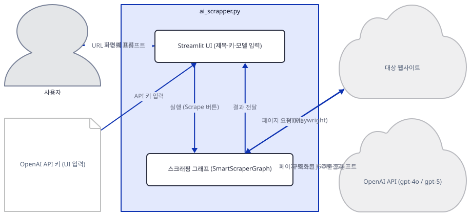
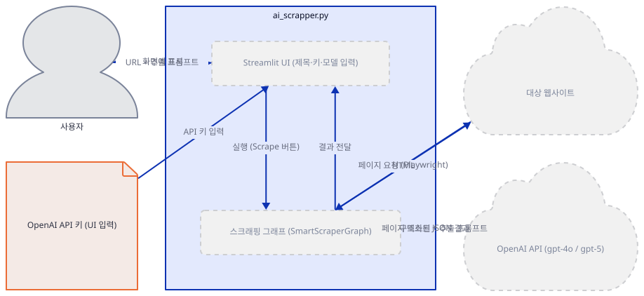
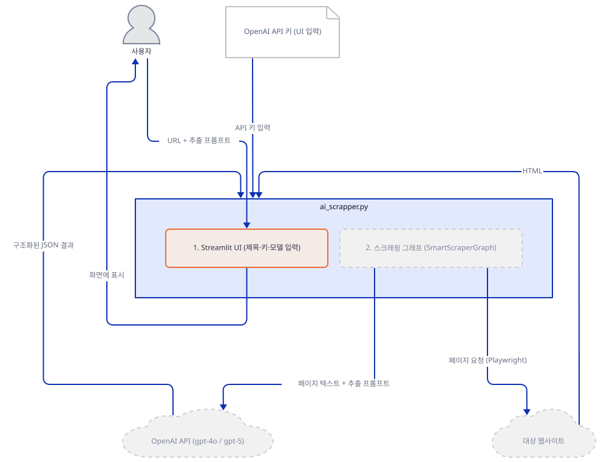
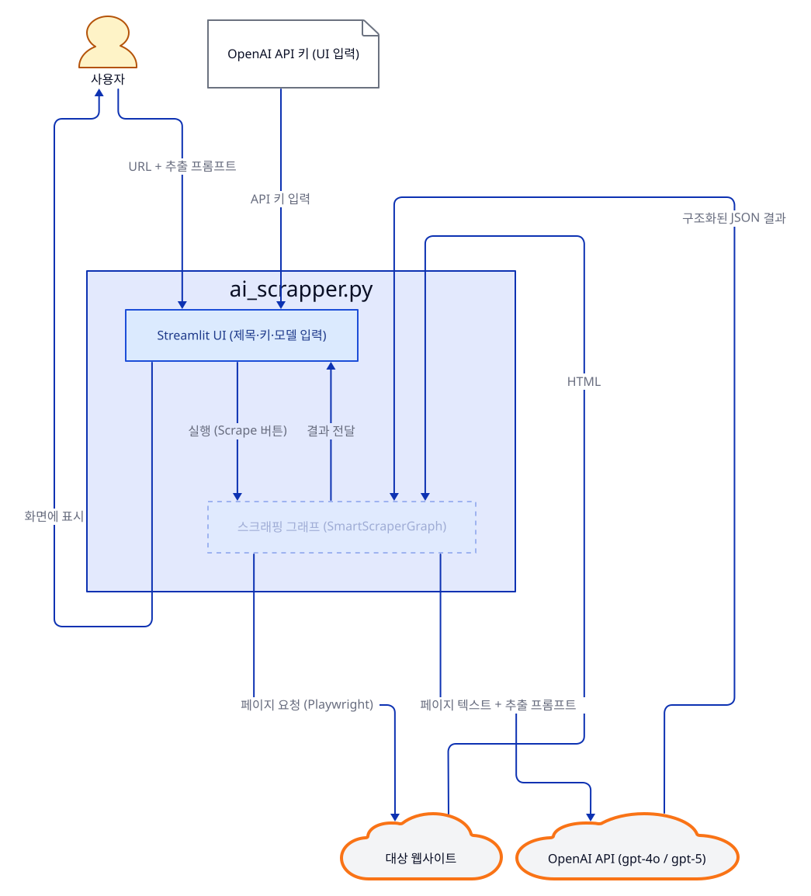
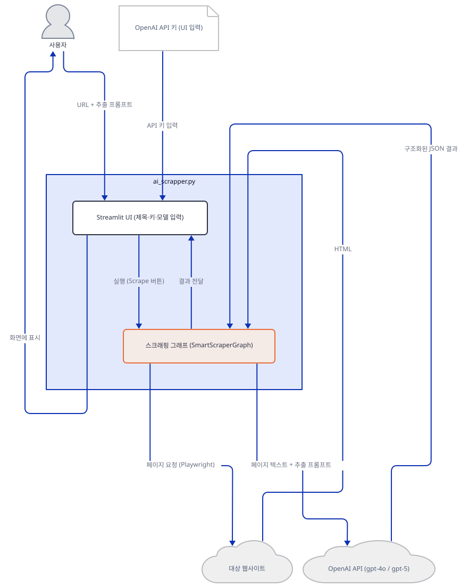
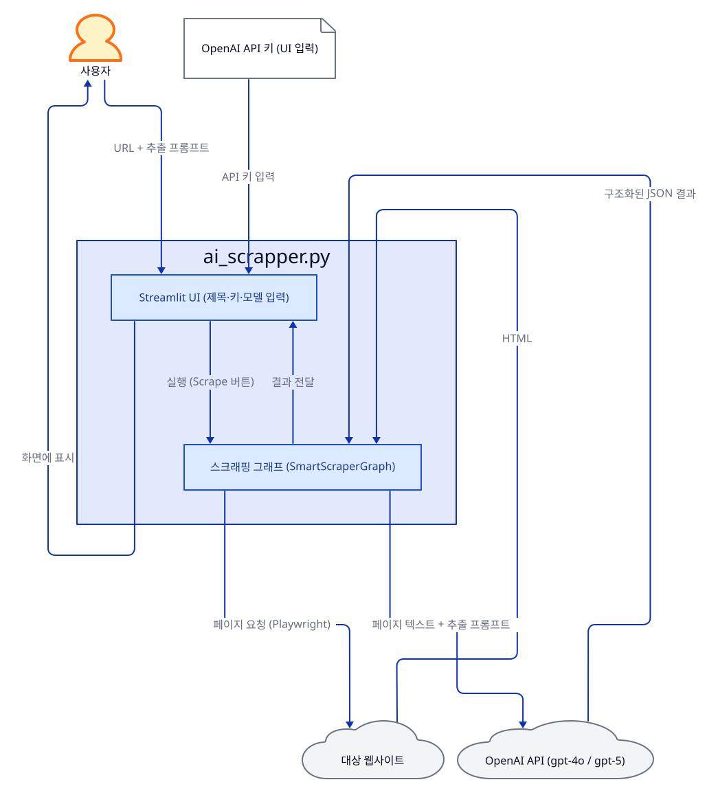
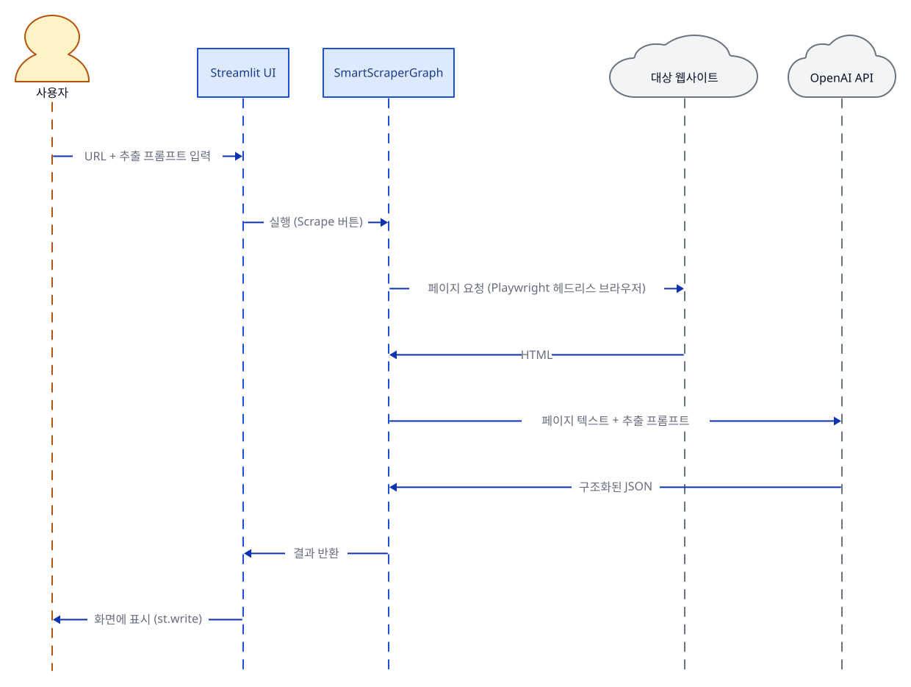

# Day 002 · 🕸️ Web Scraping AI Agent

> 볼륨 1 🌱 Starter AI Agents · 난이도 ★☆☆ · 예상 소요 60분 · API 비용 대략 스크래핑 10건에 수백 원 이하 (OpenAI 요금표 기준, 대략치 — 키가 없어 실제 과금은 확인 못함) · 원본 앱: `starter_ai_agents/web_scraping_ai_agent`

## 오늘 만들 것

이번 튜토리얼에서는 CSS 셀렉터나 XPath를 한 줄도 쓰지 않고, 자연어 프롬프트만으로 웹페이지에서 원하는 데이터를 뽑아내는 스크래핑 에이전트를 만듭니다. 핵심은 오픈소스 라이브러리 ScrapeGraphAI가 제공하는 `SmartScraperGraph` 객체 하나뿐입니다. "상품명과 가격을 추출해줘"처럼 원하는 것을 문장으로 주면, 이 객체가 내부적으로 (1) Playwright로 헤드리스 브라우저를 띄워 대상 페이지를 실제로 로드하고, (2) 받아온 HTML을 텍스트로 정리해 프롬프트와 함께 LLM(OpenAI GPT-4o 또는 GPT-5)에 보내고, (3) 그 응답을 구조화된 결과로 돌려주는 3단계 파이프라인을 그래프 형태로 실행합니다. Day 1의 에이전트가 "질문 → 필요하면 도구 호출 → 답변"을 스스로 오가는 되묻기 루프였다면, 이 앱은 정해진 순서대로만 흐르는 단방향 파이프라인이라는 점에서 대비되는 두 번째 패턴입니다. 이 폴더에는 실행 방식이 다른 진입점이 세 개 있습니다 — OpenAI 키로 클라우드 모델을 쓰는 `ai_scrapper.py`, 로컬에 설치한 Ollama의 Llama 3.2로 완전히 무료로 돌리는 `local_ai_scrapper.py`, 그리고 같은 파이프라인을 구글의 최신 Gemini 3.6 Flash로 돌리는 `gemini_ai_scrapper.py`입니다. 이 문서는 앱 자체 README가 기본으로 안내하는 `ai_scrapper.py`를 Step 1~5로 따라가고, Gemini 버전은 그 뒤 "[변형: Gemini 3.6 Flash로 돌리기](#변형-gemini-36-flash로-돌리기)" 절에서 통째로 다룹니다. 로컬 버전은 "더 해보기"에서 짧게 언급합니다. 완성하면 브라우저에 URL과 추출 프롬프트를 입력해 즉시 결과를 받는 화면을 로컬에서 띄우게 됩니다. 아래는 완성된 아키텍처입니다.



## 사전 준비

| 서비스/도구 | 용도 | 발급·설치 |
|---|---|---|
| OpenAI API 키 | `ai_scrapper.py`가 스크래핑 결과 추출에 쓰는 gpt-4o/gpt-5 모델 호출 인증. Day 1과 달리 환경변수가 아니라 앱 실행 후 화면의 입력창에 직접 붙여넣는다 | https://platform.openai.com/ 가입 후 발급 |
| Playwright 브라우저 바이너리 | ScrapeGraphAI가 페이지를 실제로 렌더링할 헤드리스 Chromium. pip 패키지 설치와 별도로 받아야 한다(Step 1) | `playwright install chromium` |
| uv | 가상환경 생성과 패키지 설치 | [공통 사전 준비](../README.md#공통-사전-준비-한-번만) 절 참고 |
| (선택) Gemini API 키 | `gemini_ai_scrapper.py`가 `gemini-3.6-flash` 호출에 쓰는 인증. OpenAI 키와 마찬가지로 앱 화면 입력창에 붙여넣거나, `GEMINI_API_KEY` 환경변수로 미리 넣어두면 입력창에 자동으로 채워진다 | https://aistudio.google.com/apikey 에서 발급 |
| (선택) Ollama | 키 없이 로컬 Llama 3.2로 돌리고 싶다면(`local_ai_scrapper.py`) 필요. 이 문서의 기본 경로에는 필요 없음 | https://ollama.com/ 설치 후 `ollama pull llama3.2`, `ollama pull nomic-embed-text` |

## 아키텍처 한눈에 보기

| 컴포넌트 | 역할 | 코드 위치 |
|---|---|---|
| 사용자 | 브라우저에서 OpenAI 키·모델·URL·추출 프롬프트 입력 | 코드 없음 (브라우저) |
| Streamlit UI | 입력을 받고 SmartScraperGraph를 실행해 결과를 표시 | `starter_ai_agents/web_scraping_ai_agent/ai_scrapper.py:17-45` |
| 스크래핑 그래프 (SmartScraperGraph) | 페이지 로드 → 텍스트 정리 → LLM 추출까지 파이프라인 실행 | `starter_ai_agents/web_scraping_ai_agent/ai_scrapper.py:48-83` |
| 대상 웹사이트 | 실제로 스크래핑할 페이지 | 코드 없음 (외부 사이트) |
| OpenAI API (gpt-4o / gpt-5) | 페이지 텍스트에서 프롬프트에 맞는 정보를 구조화해 추출 | 코드 없음 (외부 서비스). 모델 선택은 `starter_ai_agents/web_scraping_ai_agent/ai_scrapper.py:24-28` |

## 단계별 진행

### Step 1. 환경 만들기

**목적.** 격리된 가상환경에 이 앱이 쓰는 세 패키지(streamlit, scrapegraphai, playwright)를 설치하고, ScrapeGraphAI가 페이지를 실제로 렌더링할 때 쓰는 헤드리스 브라우저까지 받아둡니다.

**할 일.**

```bash
cd starter_ai_agents/web_scraping_ai_agent
uv venv
uv pip install -r requirements.txt
uv run playwright install chromium
```

(pip을 쓴다면 `python -m venv .venv && source .venv/bin/activate && pip install -r requirements.txt && playwright install chromium`.)

세 번째 명령이 필요한 이유를 미리 짚습니다. `requirements.txt`가 설치하는 `playwright` 패키지는 브라우저를 제어하는 **파이썬 바인딩**일 뿐, 실제로 페이지를 띄울 Chromium 실행 파일은 들어있지 않습니다. 이 실행 파일은 `playwright install`로 따로 받아야 합니다. 원래 앱 자체 `README.md`에는 이 단계가 빠져 있어 건너뛰기 십상이었고(그때 만나는 에러는 "문제 해결"에 실제로 재현해 정리해 두었습니다), 이 튜토리얼을 쓰면서 앱 README의 설치 단계에도 `playwright install chromium`을 추가했습니다. 참고로 `requirements.txt`는 `streamlit`, `scrapegraphai`, `playwright`, 그리고 Gemini 버전을 위해 추가한 `langchain-google-genai` 네 줄뿐이고 버전 고정이 없어서, 이 문서를 작성하며 설치했을 때는 **scrapegraphai 2.2.4**, **playwright 1.62.0**, **streamlit 1.63.0**이 받아졌습니다(직접 확인). 이 네 줄만으로 나머지 import는 모두 성공했으므로, Day 1과 달리 이 앱은 `requirements.txt`에 없는 패키지를 추가로 설치할 필요는 없습니다.

OpenAI 키는 이 단계에서 당장 쓰지 않습니다. 이 앱은 키를 환경변수가 아니라 Step 2에서 볼 Streamlit 입력창에 직접 붙여넣는 방식이라, 앱을 띄운 뒤에 입력해도 됩니다. 미리 https://platform.openai.com/ 에서 발급받아 두세요.



**확인.**

```bash
uv run python -c "from scrapegraphai.graphs import SmartScraperGraph; print('ok')"
```

```
ok
```

### Step 2. Streamlit 뼈대와 키 입력

**목적.** 앱 제목을 띄우고, OpenAI 키를 받는 입력창을 만듭니다. Day 1의 `XAI_API_KEY` 환경변수 방식과 달리, 이 앱은 키를 Streamlit의 비밀번호 입력창에서 직접 받습니다.

**할 일.**

`starter_ai_agents/web_scraping_ai_agent/ai_scrapper.py:5-6`

```python
import streamlit as st
from scrapegraphai.graphs import SmartScraperGraph
```

> 파일을 열어보면 이 두 줄 위아래에 `asyncio`·`sys` import와 `WindowsProactorEventLoopPolicy` 블록이 함께 들어있습니다(`ai_scrapper.py:2-14`). Windows에서만 필요한 코드이고 이유는 "[Windows에서 Playwright가 죽는 이유](#windows에서-playwright가-죽는-이유)"에서 다룹니다 — 지금은 넘어가도 됩니다.

`starter_ai_agents/web_scraping_ai_agent/ai_scrapper.py:17-21`

```python
st.title("Web Scrapping AI Agent 🕵️‍♂️")
st.caption("This app allows you to scrape a website using OpenAI API")

# Get OpenAI API key from user
openai_access_token = st.text_input("OpenAI API Key", type="password")
```

`st.text_input(..., type="password")`는 화면에는 입력값을 점으로 가리지만 평범한 파이썬 문자열 변수(`openai_access_token`)에 그대로 담깁니다. 이후 코드 전체가 `starter_ai_agents/web_scraping_ai_agent/ai_scrapper.py:23`의 `if openai_access_token:` 안에 들어있다는 점이 이 파일의 구조를 이해하는 열쇠입니다 — 키를 넣기 전까지는 모델 선택도, URL 입력도, 스크래핑 버튼도 화면에 나타나지 않습니다.



**확인.** 앱 폴더에서 서버를 headless로 띄웁니다.

```bash
uv run streamlit run ai_scrapper.py --server.headless true
```

다른 터미널에서:

```bash
curl -s -o /dev/null -w "%{http_code}\n" http://localhost:8501
```

```
200
```

(HTTP 200은 직접 확인. 제목·설명·키 입력창만 보이고 그 아래는 비어 있으리라는 것은 `if openai_access_token:` 가드 로직으로 추론한 것이며, 화면을 직접 열어 확인하지는 못했습니다.)

### Step 3. 모델 선택과 스크래핑 대상 입력

**목적.** 키를 넣은 뒤에 나타나는 나머지 입력 — 모델 선택, 스크래핑 설정, URL, 추출 프롬프트 — 을 봅니다.

**할 일.**

`starter_ai_agents/web_scraping_ai_agent/ai_scrapper.py:23-41`

```python
if openai_access_token:
    model = st.radio(
        "Select the model",
        ["gpt-4o", "gpt-5"],
        index=0,
    )    
    graph_config = {
        "llm": {
            "api_key": openai_access_token,
            "model": model,
        },
        # Without this ScrapeGraphAI drops its own logger to WARNING
        # (scrapegraphai/graphs/abstract_graph.py:84-89). Every progress line it
        # writes -- `--- Executing FetchNode ---`, `Content scraped`,
        # `--- Executing GenerateAnswerNode ---` -- is an INFO record, so the
        # console stays completely silent while the graph runs and there is no way
        # to tell how far it got or whether it failed.
        "verbose": True,
    }
```

`starter_ai_agents/web_scraping_ai_agent/ai_scrapper.py:42-45`

```python
    # Get the URL of the website to scrape
    url = st.text_input("Enter the URL of the website you want to scrape")
    # Get the user prompt
    user_prompt = st.text_input("What you want the AI agent to scrape from the website?")
```

`graph_config`는 뒤에서 만들 `SmartScraperGraph`가 요구하는 형식 그대로입니다 — `llm` 키 아래에 `api_key`와 `model`을 중첩해 넣고, `verbose`처럼 그래프 전체에 걸리는 설정은 최상위에 둡니다. `st.radio`의 두 선택지는 코드에 하드코딩되어 있어 다른 모델(예: gpt-4o-mini)을 쓰려면 이 리스트 자체를 고쳐야 합니다.



**확인.** 이 코드가 실제로 만드는 딕셔너리 구조를 그대로 재현해봅니다.

```bash
uv run python -c "
openai_access_token = 'sk-...'
model = 'gpt-4o'
graph_config = {
    'llm': {
        'api_key': openai_access_token,
        'model': model,
    },
    'verbose': True,
}
print(graph_config)
"
```

```
{'llm': {'api_key': 'sk-...', 'model': 'gpt-4o'}, 'verbose': True}
```

### Step 4. SmartScraperGraph 생성

**목적.** 앞서 모은 프롬프트·URL·설정으로 실제 스크래핑 파이프라인 객체를 만듭니다.

**할 일.**

`starter_ai_agents/web_scraping_ai_agent/ai_scrapper.py:48-52`

```python
    smart_scraper_graph = SmartScraperGraph(
        prompt=user_prompt,
        source=url,
        config=graph_config
    )
```

`SmartScraperGraph`는 이 시점에는 아직 아무것도 실행하지 않습니다. `prompt`(무엇을 추출할지), `source`(어디서, URL 또는 로컬 HTML), `config`(어떤 LLM으로)를 묶어 들고 있다가, 다음 Step에서 `.run()`을 호출해야 실제로 페이지를 열고 LLM을 부릅니다. 객체 생성 자체는 네트워크를 타지 않으므로 키가 유효한지도 이 시점에는 확인되지 않습니다(직접 확인: 가짜 키로도 생성 자체는 성공).



**확인.**

```bash
uv run python -c "
from scrapegraphai.graphs import SmartScraperGraph
g = SmartScraperGraph(
    prompt='Extract the page title',
    source='https://example.com',
    config={'llm': {'api_key': 'sk-...', 'model': 'gpt-4o'}}
)
print(type(g).__name__, g.prompt)
"
```

```
SmartScraperGraph Extract the page title
```

### Step 5. 실행과 결과 표시

**목적.** "Scrape" 버튼을 누르면 실제로 파이프라인이 도는 과정을 보고, 키 없이는 어디서 멈추는지 확인합니다.

**할 일.**

`starter_ai_agents/web_scraping_ai_agent/ai_scrapper.py:53-57`

```python
    # Scrape the website
    if st.button("Scrape"):
        with st.spinner("Fetching the page, then asking the model..."):
            result = smart_scraper_graph.run()
        st.write(result)
```

`.run()`은 (1) Playwright로 `source` URL을 로드하고 (2) 받아온 HTML을 텍스트로 정리해 (3) `prompt`와 함께 설정된 LLM에 보내는 세 단계를 순서대로 실행하고, 최종 결과를 돌려줍니다. 이 코드에는 `try/except`가 없으므로 도중에 예외가 나면 Streamlit이 화면에 빨간 트레이스백을 그대로 보여줍니다.

그 뒤 `ai_scrapper.py:59-83`에는 **답이 엉뚱할 때 쓸 진단 블록**이 붙어 있습니다. `.run()`이 성공하면 `smart_scraper_graph.final_state`에 노드별 중간값이 그대로 남으므로, 가져온 HTML 길이와 모델에게 실제로 넘어간 텍스트(`parsed_doc`)의 길이·청크 수, 그 텍스트 미리보기, `get_execution_info()`의 노드별 시간·토큰 표를 펼쳐 볼 수 있습니다. 파싱된 텍스트가 0자에 가까우면 모델이 아니라 **입력**이 잘못된 것입니다 — 본문을 JavaScript로 그리는 페이지이거나 에러 페이지를 받아온 경우입니다. 반대로 `.run()`이 예외로 끝나면 scrapegraphai가 `final_state`를 채우지 않으므로 이 패널은 뜨지 않고, 그때는 콘솔 진행 로그와 Streamlit 트레이스백으로 어디서 멈췄는지 봅니다(직접 확인: 잘못된 키로 돌려 콘솔 4줄 + 401 트레이스백까지 확인).

> **Windows 사용자는 여기서 (1)단계부터 막힙니다.** `streamlit run`이 바꿔놓은 asyncio 이벤트 루프 정책 때문에 Playwright가 드라이버 프로세스를 띄우지 못해 `NotImplementedError`가 납니다. 원인과 두 줄짜리 해법은 "[Windows에서 Playwright가 죽는 이유](#windows에서-playwright가-죽는-이유)"에 정리해 두었습니다 — 이 파일에도 그대로 적용됩니다.



**확인.** 키가 없어 화면의 최종 결과는 재현하지 못했습니다. 대신 같은 파이프라인을 유효하지 않은 키로 직접 호출해, 실제로 어디서 멈추는지 확인합니다(Step 1에서 `playwright install chromium`을 마쳤다는 전제입니다).

```bash
uv run python -c "
from scrapegraphai.graphs import SmartScraperGraph
smart_scraper_graph = SmartScraperGraph(
    prompt='Extract the page title',
    source='https://example.com',
    config={'llm': {'api_key': 'sk-invalid', 'model': 'gpt-4o'}}
)
try:
    result = smart_scraper_graph.run()
    print(result)
except Exception as e:
    print(f'{type(e).__name__}: {e}')
"
```

직접 확인한 출력(발췌):

```
None of the requested terms ['title'] appear in the parsed content (167 chars). The source may be an error page, may render its content with JavaScript, or the relevant section may have been dropped while parsing; the model will most likely answer NA.
OpenAIAuthenticationError: Error code: 401 - {'error': {'message': 'Incorrect API key provided: sk-invalid. You can find your API key at https://platform.openai.com/account/api-keys.', 'type': 'invalid_request_error', 'code': 'invalid_api_key', 'param': None}, 'status': 401}
```

Playwright로 `https://example.com`을 실제로 로드하는 데는 성공했고(파싱된 본문 167자), LLM 호출 단계에서 키가 거부되며 멈춘 것을 알 수 있습니다. 유효한 키를 넣으면 이 자리에서 대신 추출된 결과(리스트나 딕셔너리 형태)가 `st.write()`로 화면에 그대로 출력됩니다.

## 요청 한 건이 흐르는 과정



사용자가 화면에 입력한 URL과 추출 프롬프트는 "Scrape" 버튼 클릭과 함께, 이미 만들어져 있던 `SmartScraperGraph` 객체의 `.run()` 호출로 이어집니다. 이 지점부터는 Day 1의 도구 호출 루프와 달리 되묻는 과정 없이 정해진 순서로만 흐릅니다. 먼저 ScrapeGraphAI는 Playwright로 헤드리스 Chromium을 띄워 `source` URL을 실제로 로드합니다 — 자바스크립트로 렌더링되는 페이지도 이 단계에서 처리됩니다. 로드된 HTML은 텍스트로 정리되어 사용자의 추출 프롬프트, 그리고 `graph_config`에 지정된 모델 이름과 함께 OpenAI API로 전송됩니다. LLM은 이 텍스트에서 프롬프트가 요구한 정보만 골라 구조화된 형태로 답하고, 이 결과가 그대로 `SmartScraperGraph.run()`의 반환값이 되어 `st.write()`를 통해 화면에 표시됩니다. Day 1의 에이전트가 "도구를 부를지 말지"를 LLM이 스스로 판단했다면, 이 파이프라인은 페이지를 가져오는 것도 LLM에 보내는 것도 모두 코드에 고정된 순서라는 점이 다릅니다.

## 변형: Gemini 3.6 Flash로 돌리기

지금까지 만든 파이프라인에서 LLM만 갈아끼우면 OpenAI 대신 구글의 최신 Gemini 3.6 Flash로도 같은 스크래핑을 할 수 있습니다. `SmartScraperGraph`는 `graph_config["llm"]["model"]` 문자열 하나로 공급자를 고르는 구조라, 페이지를 가져오고 파싱하는 앞 두 단계는 손댈 필요가 없습니다. 원본 `ai_scrapper.py`를 건드리지 않도록 별도 파일 `starter_ai_agents/web_scraping_ai_agent/gemini_ai_scrapper.py`로 만들었습니다.

### 왜 한 줄만 바꾸면 안 되는가

`"model": "gpt-4o"`를 `"model": "gemini-3.6-flash"`로 바꾸는 것만으로는 동작하지 않습니다. 실제로 확인한 걸림돌이 세 가지 있습니다.

**(1) 공급자 접두사가 필요하다.** `scrapegraphai/graphs/abstract_graph.py`의 `_create_llm()`은 모델 이름에 `/`가 있으면 앞부분을 공급자로 쓰고, 없으면 라이브러리 내장 표 `models_tokens`를 뒤져 공급자를 추론합니다. `gemini-3.6-flash`는 그 표에 없으므로 추론에 실패합니다. 이때 나오는 에러가 좀 얄궂은데, 라이브러리는 "지원하지 않는 공급자"라는 `ValueError`를 던지려 하지만 **그 에러 메시지를 만드는 과정에서 존재하지 않는 `llm_params["model_provider"]`를 읽다가 먼저 터져** `KeyError: 'model_provider'`가 올라옵니다(직접 확인, scrapegraphai 2.2.4). 원인을 짐작하기 어려운 메시지이니 기억해 두세요. 해법은 `google_genai/gemini-3.6-flash`처럼 접두사를 붙여 공급자를 못 박는 것입니다.

**(2) 컨텍스트 창을 직접 알려줘야 한다.** 접두사를 붙여도 `models_tokens["google_genai"]`에는 gemini-2.5 세대까지만 들어있습니다(scrapegraphai 2.2.4 기준, 직접 확인). 표에 없는 모델을 만나면 이 라이브러리는 **에러를 내지 않고 조용히 8192 토큰으로 가정**한 뒤 경고 한 줄만 로그에 남깁니다 — 긴 페이지가 잘려나가도 결과만 보면 알 수 없는 조용한 실패입니다. 직접 재현한 출력입니다.

```
Max input tokens for model google_genai/gemini-3.6-flash not found, please specify the model_tokens parameter in the llm section of the graph configuration. Using default token size: 8192
model_token: 8192
defaulted: True
```

그래서 새 파일은 `model_tokens`를 명시적으로 넘깁니다. Gemini 3.6 Flash의 입력 한도는 1,048,576 토큰(출력 65,536)입니다([공식 모델 문서](https://ai.google.dev/gemini-api/docs/models/gemini-3.6-flash) 확인).

**(3) 의존성 패키지가 하나 더 필요하다.** scrapegraphai는 내부적으로 LangChain의 `init_chat_model()`을 불러 `ChatGoogleGenerativeAI` 인스턴스를 만드는데, 이 클래스가 든 `langchain-google-genai` 패키지는 scrapegraphai의 의존성에 들어있지 않습니다(직접 확인: `importlib.metadata.requires("scrapegraphai")`에 google 관련 항목 없음). 그래서 `requirements.txt`에 `langchain-google-genai` 한 줄을 추가했습니다.

### 전체 코드

`starter_ai_agents/web_scraping_ai_agent/gemini_ai_scrapper.py:1-33`

```python
# Import the required libraries
import asyncio
import os
import sys

import streamlit as st
from scrapegraphai.graphs import SmartScraperGraph

# On Windows `streamlit run` swaps the asyncio policy to WindowsSelectorEventLoopPolicy
# for Tornado's sake (streamlit/web/bootstrap.py::_fix_tornado_crash), and a selector
# loop cannot spawn subprocesses -- so Playwright fails to start its driver with
# NotImplementedError. Streamlit sets that policy early precisely so scripts can
# override it; Tornado's server loop already exists and keeps the loop it was built on.
if sys.platform == "win32":
    asyncio.set_event_loop_policy(asyncio.WindowsProactorEventLoopPolicy())

# ScrapeGraphAI 2.2.4 only knows the context window of models that are listed in
# its own `models_tokens` table. Gemini 3.x is not in that table yet, so without
# an explicit `model_tokens` the library silently falls back to 8192 tokens and
# truncates long pages. Declare the real input limits here.
MODEL_TOKENS = {
    "gemini-3.6-flash": 1048576,
    "gemini-2.5-flash": 1048576,
}

# Set up the Streamlit app
st.title("Web Scrapping AI Agent 🕵️‍♂️")
st.caption("This app allows you to scrape a website using the Gemini API")

# Get Gemini API key from user (pre-filled from GEMINI_API_KEY if it is set)
gemini_api_key = st.text_input(
    "Gemini API Key", type="password", value=os.getenv("GEMINI_API_KEY", "")
)
```

맨 위의 `sys.platform == "win32"` 블록은 Gemini와 무관하게 **Windows에서 Streamlit으로 이 앱을 돌릴 때 반드시 필요한** 부분입니다. 자세한 내용은 바로 아래 "[Windows에서 Playwright가 죽는 이유](#windows에서-playwright가-죽는-이유)"에서 다룹니다.

`starter_ai_agents/web_scraping_ai_agent/gemini_ai_scrapper.py:35-72`

```python
if gemini_api_key:
    model = st.radio(
        "Select the model",
        list(MODEL_TOKENS),
        index=0,
    )
    graph_config = {
        "llm": {
            "api_key": gemini_api_key,
            # The `google_genai/` prefix tells ScrapeGraphAI which provider to
            # build the chat model from; without it the model name would have to
            # be present in `models_tokens` for the provider to be inferred.
            "model": f"google_genai/{model}",
            "model_tokens": MODEL_TOKENS[model],
            # ScrapeGraphAI forces real JSON output only for Ollama
            # (generate_answer_node.py:63-67 sets `llm_model.format`); every other
            # provider is merely *asked* for JSON inside the prompt. Gemini has a
            # native JSON mode that nothing wires up, and langchain-google-genai
            # defaults `temperature` to 0.7 -- extraction is not a creative task,
            # so pin both. (ChatOpenAI, by contrast, sends no temperature at all.)
            "temperature": 0,
            "response_mime_type": "application/json",
            # Gemini 3.x thinks by default, and thinking shares the response
            # budget -- which is how a long extraction comes back truncated or
            # hollow. Left unset, no ThinkingConfig is sent at all and the model's
            # own default depth applies. `thinking_level` is the Gemini 3+ knob
            # (`thinking_budget` is deprecated there, see langchain_google_genai
            # chat_models.py:3058-3086); pulling a list off a page needs little of it.
            "thinking_level": "low",
        },
        # Without this ScrapeGraphAI drops its own logger to WARNING
        # (scrapegraphai/graphs/abstract_graph.py:84-89). Every progress line it
        # writes -- `--- Executing FetchNode ---`, `Content scraped`,
        # `--- Executing GenerateAnswerNode ---` -- is an INFO record, so the
        # console stays completely silent while the graph runs and there is no way
        # to tell how far it got or whether it failed.
        "verbose": True,
    }
```

`"verbose": True`가 없으면 `abstract_graph.py:84-89`가 scrapegraphai 자신의 로거를 `WARNING`으로 내려버립니다. 진행 로그(`--- Executing Fetch Node ---`, `--- (Fetching HTML from: ...) ---`, `--- Executing ParseNode Node ---`, `--- Executing GenerateAnswer Node ---`)는 전부 INFO 레벨이라 통째로 사라지고, 그래프가 돌는 중인지 어디서 멈췄는지 콘솔만 봐서는 알 수 없습니다(직접 확인: 켜기 전 네 줄 모두 미출력 → 켠 뒤 모두 출력). 참고로 켜면 scrapegraphai의 이모지 배너까지 같이 나오는데, cp949 콘솔에서도 `✨`로 이스케이프될 뿐 죽지는 않습니다(직접 확인).

`gemini_ai_scrapper.py:73-114`의 나머지(URL 입력 → 프롬프트 입력 → `SmartScraperGraph` 생성 → Scrape 버튼)는 `ai_scrapper.py`와 거의 같습니다. Step 4·5의 설명이 그대로 적용되고, Scrape 블록에만 진행 스피너와 진단 정보가 더 붙어 있습니다 — 가져온 HTML 길이, **모델에게 실제로 넘어간 텍스트**와 청크 수, 그리고 `get_execution_info()`의 노드별 시간·토큰 표입니다. 답이 엉뚱할 때는 모델을 의심하기 전에 이 숫자부터 봅니다. 파싱된 텍스트가 0자에 가깝다면 그 페이지는 본문을 JavaScript로 그리는 것이고, `loader_kwargs`로 넘어가는 `requires_js_support` 같은 옵션을 봐야 합니다(`abstract_graph.py:73`).

`ai_scrapper.py`와의 차이를 표로 정리하면 이렇습니다.

| | `ai_scrapper.py` | `gemini_ai_scrapper.py` |
|---|---|---|
| 키 입력 | 화면 입력창만 | 화면 입력창 + `GEMINI_API_KEY` 환경변수 자동 채움 (`:30-33`) |
| 모델 문자열 | `"gpt-4o"` / `"gpt-5"` (공급자 추론) | `"google_genai/gemini-3.6-flash"` (공급자 명시, `:47`) |
| 컨텍스트 창 | `models_tokens` 표에서 자동 | `model_tokens`로 직접 지정 (`:48`) |
| 추가 패키지 | 없음 | `langchain-google-genai` |
| Windows 대응 | 없음 (그래서 Windows에서 Playwright가 죽는다) | 이벤트 루프 정책 복구 (`:14-15`) |

### Windows에서 Playwright가 죽는 이유

Windows에서 `streamlit run`으로 이 앱을 띄우고 Scrape를 누르면, 위의 이벤트 루프 블록이 없을 경우 페이지를 가져오는 첫 단계부터 무너집니다. 실제로 겪고 고친 문제라 원인까지 적어 둡니다. 화면에는 빨간 트레이스백과 함께 다음이 뜹니다.

```
Task exception was never retrieved
future: <Task finished name='Task-686' coro=<Connection.run() ...> exception=NotImplementedError()>
  ...
  File "...\asyncio\base_events.py", line 533, in _make_subprocess_transport
    raise NotImplementedError
NotImplementedError
Attempt 1 failed:
...
RuntimeError: Failed to scrape after 1 attempts:
```

에러 메시지만 보면 Playwright나 scrapegraphai 문제 같지만, 범인은 **Streamlit**입니다. `streamlit run`은 Windows에서 Tornado 호환을 위해 프로세스 전역 asyncio 정책을 바꿉니다.

`.venv/Lib/site-packages/streamlit/web/bootstrap.py:87-90` (streamlit 1.51.0, 직접 확인)

```python
if type(asyncio.get_event_loop_policy()) is WindowsProactorEventLoopPolicy:
    # WindowsProactorEventLoopPolicy is not compatible with
    # Tornado 6 fallback to the pre-3.8 default of Selector
    asyncio.set_event_loop_policy(WindowsSelectorEventLoopPolicy())
```

그런데 Windows의 selector 루프는 **서브프로세스를 만들 수 없습니다** — `BaseEventLoop._make_subprocess_transport`가 그대로 `NotImplementedError`를 던집니다. Playwright는 브라우저를 띄우기 전에 Node로 된 드라이버 프로세스를 먼저 띄워야 하므로, 여기서 끝납니다. 앞의 "확인 ③"처럼 터미널에서 `python -c ...`로 직접 돌렸을 때는 기본 Proactor 정책이라 멀쩡히 통과하는 탓에, **Streamlit 안에서만 재현되는** 함정입니다.

해법은 스크립트 맨 위에서 정책을 되돌리는 것입니다(`gemini_ai_scrapper.py:14-15`). 위 `bootstrap.py`의 독스트링이 "This has to happen as early as possible to make it a low priority and **overridable**"이라고 적어 둔 대로, 사용자 스크립트가 덮어쓰는 것이 원래 의도된 사용법입니다. 이 시점이면 Tornado 서버 루프는 이미 만들어져 돌고 있으므로 정책을 바꿔도 영향을 받지 않고, 이후 scrapegraphai가 `asyncio.run()`으로 새로 만드는 루프만 Proactor가 됩니다.

```python
if sys.platform == "win32":
    asyncio.set_event_loop_policy(asyncio.WindowsProactorEventLoopPolicy())
```

고친 뒤 브라우저에서 직접 확인한 결과: Playwright가 정상적으로 떠서 페이지를 8043자까지 파싱했고, 파이프라인은 `NotImplementedError` 없이 LLM 호출 단계까지 진행해 (일부러 넣은 잘못된 키 때문에) `400 API_KEY_INVALID`로 끝났습니다. 즉 실패 지점이 "브라우저를 못 띄움"에서 "키가 틀림"으로 옮겨졌습니다.

> **`ai_scrapper.py`와 `local_ai_scrapper.py`도 같은 문제를 겪습니다.** 처음에는 두 파일을 원본 저장소 코드 그대로 두었지만, Windows에서 `streamlit run ai_scrapper.py`를 돌리면 이 에러를 그대로 만나므로 같은 블록(`import asyncio`, `import sys` 포함)을 두 파일 맨 위에도 넣어 두었습니다 — `ai_scrapper.py:2-14`, `local_ai_scrapper.py:2-14`. macOS·Linux에서는 `sys.platform` 가드에 걸려 아무 일도 하지 않으므로 무해합니다.

### 실행

`requirements.txt`에 `langchain-google-genai`가 추가되었으므로 Step 1을 이미 마쳤더라도 설치를 한 번 더 돌려야 합니다.

```bash
cd starter_ai_agents/web_scraping_ai_agent
uv pip install -r requirements.txt
streamlit run gemini_ai_scrapper.py
```

(가상환경을 활성화하지 않았다면 `.venv/Scripts/python.exe -m streamlit run gemini_ai_scrapper.py`처럼 venv의 파이썬을 직접 지정하는 편이 확실합니다. 이 저장소 루트에는 `pyproject.toml`과 `uv.lock`이 있어서, 앱 폴더 안에서 `uv run`이나 `uv pip install`을 실행해도 uv가 **앱 폴더의 `.venv`가 아니라 저장소 루트의 `.venv`를 대상으로 잡습니다** — 직접 확인했고, 아래 "문제 해결"에 정리했습니다.)

**확인 ①  화면.** 브라우저에서 `http://localhost:8501`을 열면 제목과 "This app allows you to scrape a website using the Gemini API" 캡션, 그리고 Gemini API Key 입력창 하나만 보입니다. 키를 입력하는 순간 `if gemini_api_key:` 가드가 열리며 모델 선택 라디오(`gemini-3.6-flash` 기본 선택, `gemini-2.5-flash`), URL 입력창, 프롬프트 입력창, Scrape 버튼이 한꺼번에 나타납니다. (브라우저로 직접 확인. 여기까지는 아무 문자열이나 넣어도 가드가 열리므로 유효한 키가 없어도 재현됩니다.)

**확인 ②  파이프라인.** 그래프가 실제로 Gemini 클라이언트로 조립되는지 봅니다.

```bash
python -c "
from scrapegraphai.graphs import SmartScraperGraph
g = SmartScraperGraph(
    prompt='Extract the page title',
    source='https://example.com',
    config={'llm': {'api_key': 'AIza-invalid',
                    'model': 'google_genai/gemini-3.6-flash',
                    'model_tokens': 1048576}},
)
print('llm:', type(g.llm_model).__name__)
print('model attr:', g.llm_model.model)
print('model_token:', g.model_token)
print('nodes:', [type(n).__name__ for n in g.graph.nodes])
"
```

직접 확인한 출력입니다.

```
llm: ChatGoogleGenerativeAI
model attr: gemini-3.6-flash
model_token: 1048576
nodes: ['FetchNode', 'ParseNode', 'GenerateAnswerNode']
```

`model_token`이 8192가 아니라 우리가 넘긴 1048576으로 찍혔다는 점이 (2)에서 짚은 조용한 잘림을 막았다는 증거입니다. 노드가 `FetchNode → ParseNode → GenerateAnswerNode` 셋뿐이라는 점도 눈여겨볼 만합니다. 이 버전의 `SmartScraperGraph`에는 임베딩/RAG 노드가 없어서, Ollama 버전(`local_ai_scrapper.py`)처럼 `embeddings` 설정을 따로 넣을 필요가 없습니다.

**확인 ③  끝까지 도는지.** 잘못된 키로 전체 파이프라인을 돌려, 어느 단계까지 성공하는지 봅니다(Step 1의 `playwright install chromium`이 끝났다는 전제).

```bash
PYTHONIOENCODING=utf-8 python -c "
from scrapegraphai.graphs import SmartScraperGraph
g = SmartScraperGraph(
    prompt='Extract the page title',
    source='https://example.com',
    config={'llm': {'api_key': 'AIzaSy-invalid',
                    'model': 'google_genai/gemini-3.6-flash',
                    'model_tokens': 1048576}},
)
try:
    print(g.run())
except Exception as e:
    print(f'{type(e).__name__}: {str(e)[:300]}')
"
```

직접 확인한 출력(발췌):

```
None of the requested terms ['title'] appear in the parsed content (169 chars). ...
GoogleInvalidRequestError: Error calling model 'gemini-3.6-flash' (INVALID_ARGUMENT): 400 INVALID_ARGUMENT. {'error': {'code': 400, 'message': 'API key not valid. Please pass a valid API key.', 'status': 'INVALID_ARGUMENT', ...
```

Playwright가 페이지를 실제로 열어 169자를 파싱했고(1·2단계 성공), 요청이 `generativelanguage.googleapis.com`까지 도달해 키 때문에 거부됐습니다(3단계). Step 5에서 OpenAI 키로 본 401과 같은 자리, 같은 성격의 실패입니다 — 즉 파이프라인 배선은 끝까지 맞물려 있고 남은 것은 유효한 키뿐입니다. **유효한 Gemini 키가 없어 최종 추출 결과 화면은 재현하지 못했습니다.**

## 실행 체크리스트

- [ ] OpenAI API 키를 발급받아 두었다 (환경변수가 아니라 앱 화면에 입력)
- [ ] `uv venv && uv pip install -r requirements.txt`로 기본 의존성을 설치했다
- [ ] `uv run playwright install chromium`으로 헤드리스 브라우저를 받았다
- [ ] `uv run streamlit run ai_scrapper.py`로 서버를 띄우고 `http://localhost:8501`에서 화면을 확인했다
- [ ] OpenAI 키를 입력하자 모델 선택·URL·프롬프트 입력창이 나타나는 것을 확인했다
- [ ] URL과 프롬프트를 입력하고 "Scrape" 버튼을 눌러 결과를 확인했다

Gemini 버전까지 해본다면:

- [ ] https://aistudio.google.com/apikey 에서 Gemini API 키를 발급받았다
- [ ] `uv pip install -r requirements.txt`를 다시 돌려 `langchain-google-genai`를 설치했다
- [ ] `streamlit run gemini_ai_scrapper.py`로 서버를 띄우고, 키를 입력하자 `gemini-3.6-flash`가 기본 선택된 모델 라디오가 나타나는 것을 확인했다
- [ ] `graph_config`의 모델 문자열에 `google_genai/` 접두사와 `model_tokens`가 모두 들어있는지 확인했다 (둘 중 하나라도 빠지면 각각 `KeyError`, 조용한 8192 잘림)
- [ ] (Windows) 스크립트 맨 위의 `WindowsProactorEventLoopPolicy` 블록이 살아있는지 확인했다 — 없으면 Scrape에서 `NotImplementedError`

## 문제 해결

| 증상 | 원인 | 해결 |
|---|---|---|
| "Scrape" 실행 시 `RuntimeError: Failed to scrape after 1 attempts: BrowserType.launch: Executable doesn't exist at ...\ms-playwright\chromium_headless_shell-1234\chrome-headless-shell-win64\chrome-headless-shell.exe`(폴더 번호 `1234`는 설치된 playwright 버전마다 다를 수 있음)와 함께 Playwright가 `playwright install` 실행을 안내하는 배너가 뜸 | `requirements.txt`의 `playwright`는 파이썬 바인딩만 설치하고, 실제 브라우저 실행 파일은 별도 다운로드가 필요하다. 앱 자체 README에 이 단계가 빠져 있어 재현되던 문제로, Step 1에 적은 대로 앱 README에도 이 명령을 추가해 두었다(직접 재현) | `uv run playwright install chromium` 실행 후 재시도 |
| 위 에러 메시지를 콘솔에 출력하는 도중 `UnicodeEncodeError: 'cp949' codec can't encode character '╔'...`까지 추가로 발생해 진짜 원인이 가려짐 | Playwright의 안내 배너가 상자 그리기 유니코드 문자(╔ 등)를 쓰는데, 한국어 Windows의 기본 콘솔 코드페이지(cp949)가 이 문자를 인코딩하지 못한다(직접 확인, 출력을 파이프로 받을 때 재현됨) | 진짜 원인(`RuntimeError`, 브라우저 없음)은 이미 나온 뒤이므로 그 줄을 찾아 위 해결을 따른다. `PYTHONIOENCODING=utf-8` 환경변수를 설정하고 재실행하면 배너까지 깨지지 않고 보인다(직접 확인) |
| "Scrape"를 눌러도 무한 대기 없이 바로 에러가 뜨고, 페이지 로드 자체는 된 것처럼 보임 | OpenAI 키가 없거나 잘못됨. `SmartScraperGraph` 생성 시점에는 키를 검증하지 않고, 실제 LLM 호출 시점(`.run()` 내부)에야 인증을 확인한다(직접 확인: 페이지는 167자를 정상 파싱한 뒤 LLM 단계에서 401로 실패) | 유효한 OpenAI 키를 앱 화면 입력창에 다시 입력 |
| Scrape를 눌러도 **콘솔에 아무 로그가 없어서** 도는 중인지, 멈춘 건지, 어디까지 갔는지 알 수 없음 | `graph_config`에 `"verbose": True`가 없으면 `abstract_graph.py:84-89`가 scrapegraphai 자신의 로거를 `WARNING`으로 내려버린다. 진행 로그 네 줄(`--- Executing Fetch Node ---`, `--- (Fetching HTML from: ...) ---`, `--- Executing ParseNode Node ---`, `--- Executing GenerateAnswer Node ---`)은 전부 INFO라 통째로 사라진다. 반면 에러는 `logger.error`라 원래 보이므로, **아무것도 안 나왔다는 건 에러 없이 끝까지 돌았다는 뜻**이다(직접 재현·수정: 켜기 전 0줄 → 켠 뒤 4줄) | `graph_config`에 `"verbose": True`를 넣는다 — 세 파일 모두에 적용해 두었다. 화면에서 보려면 Scrape 블록의 진단 패널을 펼친다(`ai_scrapper.py:59-83`). 켜면 scrapegraphai 이모지 배너까지 같이 나오지만 cp949 콘솔에서도 `✨`로 이스케이프될 뿐 죽지 않는다(직접 확인) |
| 예전 버전의 앱 README를 봤다면, "Getting Started"가 로컬 버전(`local_ai_scrapper.py`)을 쓸 때도 OpenAI 키가 필요한 것처럼 순서대로 안내 | 문서 구성 오류였다. `local_ai_scrapper.py`는 OpenAI를 전혀 쓰지 않고 `ollama/llama3.2`(`starter_ai_agents/web_scraping_ai_agent/local_ai_scrapper.py:23`)만 호출한다(직접 확인: 파일에 OpenAI 관련 import 없음) | 로컬 버전을 쓸 때는 OpenAI 키 없이 Ollama만 설치하면 된다. 현재 앱 README는 OpenAI·Gemini·로컬 세 갈래로 나눠 안내하도록 고쳐 두었다 |
| 앱 폴더에서 `uv venv`로 `.venv`를 만들고 `uv pip install -r requirements.txt`를 돌렸는데, 정작 `.venv/Lib/site-packages`에는 `_virtualenv.pth`만 있고 패키지가 하나도 없음. `uv run`은 뜬금없이 수십 개 패키지를 uninstall/install 함 | 이 저장소는 루트(`awesome-llm-apps/`)에 `pyproject.toml`과 `uv.lock`이 있어 uv가 여기를 프로젝트 루트로 인식한다. 앱 하위 폴더에서 실행해도 uv는 루트 프로젝트의 `.venv`를 대상으로 잡고, `uv run`은 그 환경을 `uv.lock`에 맞춰 동기화한다(직접 확인) | 하위 폴더의 venv를 확실히 쓰려면 `uv venv` 후 활성화하거나(`source .venv/Scripts/activate`) `.venv/Scripts/python.exe -m ...`로 직접 호출한다. 루트 `.venv`를 그냥 써도 무방하다 — `uv.lock`에 scrapegraphai·streamlit·playwright·langchain-google-genai가 모두 들어있다(직접 확인) |
| **Windows에서** `streamlit run ...` 후 Scrape를 누르면 `NotImplementedError` + `RuntimeError: Failed to scrape after 1 attempts:` (뒤에 아무 이유도 붙지 않은 빈 메시지). 터미널에서 `python -c`로 같은 코드를 돌리면 멀쩡함 | `streamlit run`이 Tornado 호환을 위해 전역 asyncio 정책을 `WindowsSelectorEventLoopPolicy`로 바꾸는데(`.venv/Lib/site-packages/streamlit/web/bootstrap.py:87-90`), Windows의 selector 루프는 서브프로세스를 만들지 못해 Playwright 드라이버가 뜨지 못한다(직접 재현·수정) | 스크립트 맨 위에 `if sys.platform == "win32": asyncio.set_event_loop_policy(asyncio.WindowsProactorEventLoopPolicy())`를 넣는다. 세 파일 모두에 이미 들어있다(`ai_scrapper.py:13-14`, `gemini_ai_scrapper.py:14-15`, `local_ai_scrapper.py:13-14`) — 이 에러가 다시 보인다면 그 블록이 지워졌는지 확인한다. 자세한 설명은 "[Windows에서 Playwright가 죽는 이유](#windows에서-playwright가-죽는-이유)" |
| Gemini 버전에서 `KeyError: 'model_provider'` (원인을 전혀 알려주지 않는 메시지) | 모델 문자열에 `google_genai/` 접두사가 없다. scrapegraphai는 `/`가 없으면 내장 `models_tokens` 표에서 공급자를 추론하는데, `gemini-3.6-flash`는 그 표에 없어 실패한다. 그러면 "지원하지 않는 공급자" `ValueError`를 만들려다 그 메시지 안의 `llm_params["model_provider"]`를 읽으며 `KeyError`가 먼저 터진다(직접 확인, scrapegraphai 2.2.4의 버그) | `"model": "google_genai/gemini-3.6-flash"`로 접두사를 붙인다 (`starter_ai_agents/web_scraping_ai_agent/gemini_ai_scrapper.py:47`) |
| Gemini 버전에서 `ImportError` 또는 `Error instancing model: ...`이 나며 `ChatGoogleGenerativeAI`를 만들지 못함 | `langchain-google-genai`가 설치되지 않았다. scrapegraphai의 의존성에 포함되어 있지 않다(직접 확인) | `uv pip install langchain-google-genai` (또는 갱신된 `requirements.txt`로 재설치) |
| Gemini 버전이 긴 페이지에서 앞부분만 보고 답하는 것 같은데 에러는 안 남 | `model_tokens`를 넘기지 않아 scrapegraphai가 조용히 8192 토큰으로 가정하고 본문을 잘라냈다. 경고는 로그에만 남고 예외는 발생하지 않는다(직접 확인: `model_token: 8192`, `model_tokens_defaulted: True`) | `graph_config["llm"]["model_tokens"]`에 실제 한도(gemini-3.6-flash는 1048576)를 명시한다 (`starter_ai_agents/web_scraping_ai_agent/gemini_ai_scrapper.py:21-24`) |
| 에러는 안 나고 끝까지 도는데 추출 결과가 얕거나 엉뚱함 | 진단 패널에서 **모델에게 넘어간 텍스트 길이**부터 본다. 0자에 가까우면 LLM이 아니라 입력이 문제다 — 본문을 JavaScript로 그리는 페이지이거나 에러 페이지를 받아온 것이다. 길이가 정상이면 입력은 멀쩡하니 LLM 단계를 본다(아래 행) | 페이지가 JS 렌더링이면 `loader_kwargs`로 넘어가는 `requires_js_support`를 검토한다(`abstract_graph.py:73`) |
| 같은 URL·프롬프트인데 `ai_scrapper.py`(OpenAI)는 잘 나오고 **`gemini_ai_scrapper.py`만 결과가 엉망** | 두 앱의 scrapegraphai 경로는 완전히 동일하다 — 둘 다 `schema`를 넘기지 않으므로 같은 `TolerantJsonOutputParser`와 같은 `TEMPLATE_NO_CHUNKS_MD` 프롬프트를 쓴다. 다른 것은 모델 객체와 `model_token` 값뿐이고, 거기서 셋이 갈린다(모두 직접 확인). ① scrapegraphai는 **JSON 출력을 Ollama에만 강제**한다(`generate_answer_node.py:63-67`이 `llm_model.format`을 설정) — 나머지 공급자는 프롬프트에서 *"백틱 세 개로 시작하지 마세요"* 하고 부탁만 받는다. Gemini는 자체 JSON 모드(`response_mime_type`)가 있는데도 연결돼 있지 않았다. ② `langchain-google-genai`의 `temperature` 기본값은 **0.7**인데 `ChatOpenAI`는 온도를 아예 보내지 않는다(모델 객체를 직접 찍어 확인). ③ `model_token`이 청크 수를 바꾸지만, 실제로 재보면 페이지 텍스트가 **약 30만 자를 넘어야** 갈린다 — 60만 자에서 gpt-4o(128k)는 3청크로 쪼개 map-reduce 경로를 타고 Gemini(1048576 선언)는 1청크 단일 프롬프트로 간다(직접 측정). 그 아래 크기에서는 둘 다 1청크라 청크는 원인이 될 수 없다. ④ **Gemini 3.x는 thinking이 기본 동작**인데 아무 설정도 주지 않으면 `ThinkingConfig` 자체가 요청에 실리지 않아 모델 기본 깊이로 추론하고, 그 추론이 응답 예산을 함께 쓴다 — 긴 추출이 잘리거나 속 빈 답으로 돌아오는 경로다(`.venv/Lib/site-packages/langchain_google_genai/chat_models.py:3058-3086`. Gemini 3+에서는 `thinking_budget`이 폐기되고 `thinking_level`이 우선한다) | `graph_config["llm"]`에 `"temperature": 0`, `"response_mime_type": "application/json"`, `"thinking_level": "low"` 셋을 넣는다 — `gemini_ai_scrapper.py:55-63`에 적용해 두었다. 앞의 둘은 모델 객체에 꽂히는 것을, 셋째는 실제 요청에 `ThinkingConfig(thinking_level=LOW)`로 실리는 것을 확인했고, 가짜 키 실행이 `API key not valid`에서만 멈추므로 요청 구성 자체는 정상이다. 다만 **답 품질이 실제로 좋아지는지는 Gemini 키가 없어 미검증**이다. 그래도 이상하면 ⑴ 진단 패널의 청크 수를 보며 `model_tokens`를 128000 정도로 낮춰 OpenAI와 같은 청크 경로로 비교하고, ⑵ 형식이 계속 흔들리면 `SmartScraperGraph(..., schema=...)`로 pydantic 스키마를 넘겨 `get_pydantic_output_parser` 경로를 타게 한다(`generate_answer_node.py:138-151`) |
| Gemini 버전에서 `400 INVALID_ARGUMENT` / `API key not valid. Please pass a valid API key.` | Gemini 키가 없거나 잘못됐다. OpenAI 버전의 401과 같은 자리(LLM 호출 단계)에서 발생하며, 페이지 로드·파싱은 이미 성공한 뒤다(직접 확인) | https://aistudio.google.com/apikey 에서 발급한 키를 앱 화면에 다시 입력하거나 `GEMINI_API_KEY` 환경변수를 설정한다 |

## 더 해보기

- `local_ai_scrapper.py`로 전환해 Ollama의 로컬 Llama 3.2로 완전히 무료로 돌려보기 (`ollama pull llama3.2`, `ollama pull nomic-embed-text` 필요, 설정은 `starter_ai_agents/web_scraping_ai_agent/local_ai_scrapper.py:21-33`)
- `st.radio`의 모델 목록에 `"gpt-4o-mini"`를 추가해 더 저렴한 모델로 스크래핑해보기 (`starter_ai_agents/web_scraping_ai_agent/ai_scrapper.py:26`)
- 여러 페이지를 한 번에 스크래핑하려면 `url`을 리스트로 바꾸고 `SmartScraperGraph`를 반복 생성하는 코드를 직접 추가해보기
- `gemini_ai_scrapper.py`의 `MODEL_TOKENS`에 새 모델을 한 줄 추가해 라디오 선택지를 늘려보기 — 이 딕셔너리가 곧 화면의 선택지이므로(`starter_ai_agents/web_scraping_ai_agent/gemini_ai_scrapper.py:38`) 모델 이름과 컨텍스트 한도만 알면 된다. 구글은 3.6 Flash 이후로도 Flash 계열을 계속 내고 있으니 [모델 목록 문서](https://ai.google.dev/gemini-api/docs/models)에서 최신 API ID와 입력 한도를 확인해 넣어보자
- 같은 URL·같은 프롬프트를 `ai_scrapper.py`(gpt-4o)와 `gemini_ai_scrapper.py`(gemini-3.6-flash)로 각각 돌려, 추출 결과의 구조와 누락 항목을 나란히 비교해보기

## 다음 날 예고

[Day 003 · 🎙️ AI Blog to Podcast Agent](../day003-ai-blog-to-podcast-agent/README.md) — 블로그 글 하나를 요약해 팟캐스트 오디오로 바꾸는 에이전트를 만듭니다.
