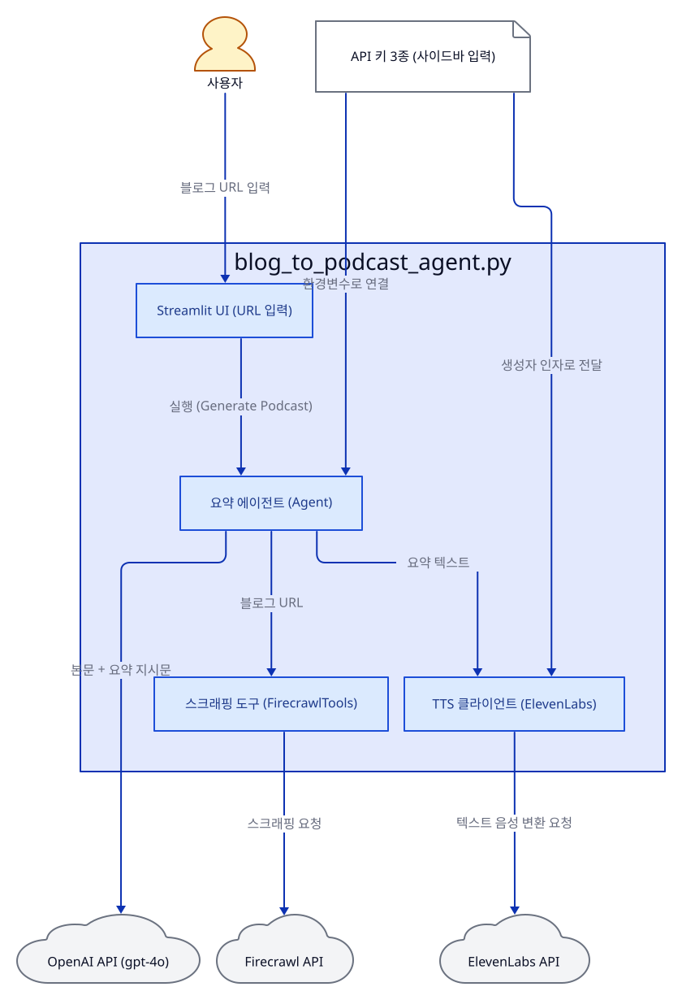
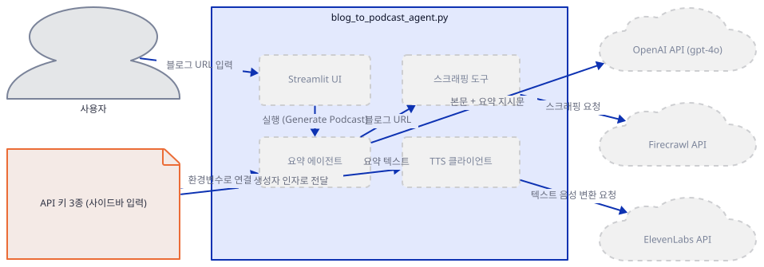
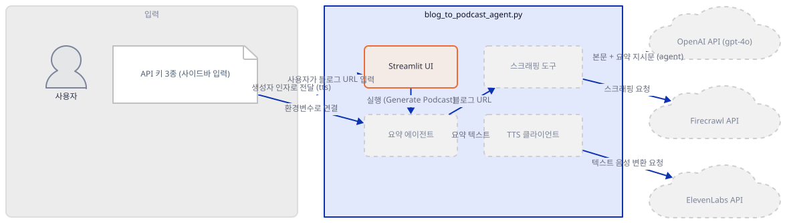
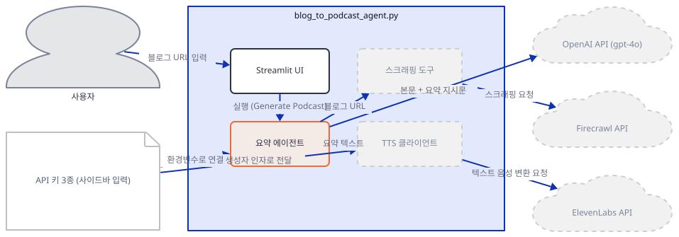
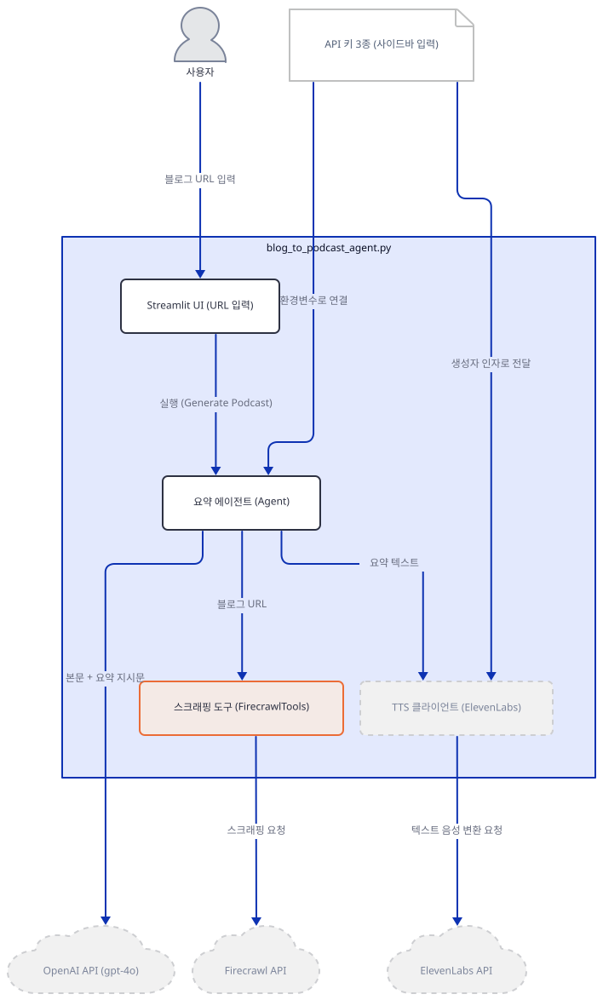
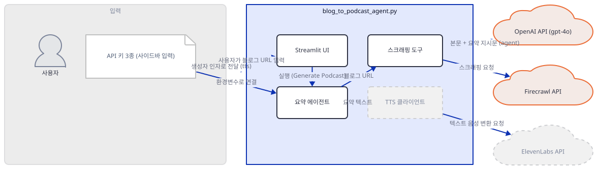
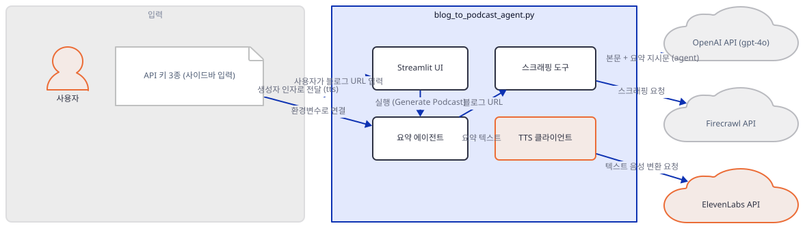
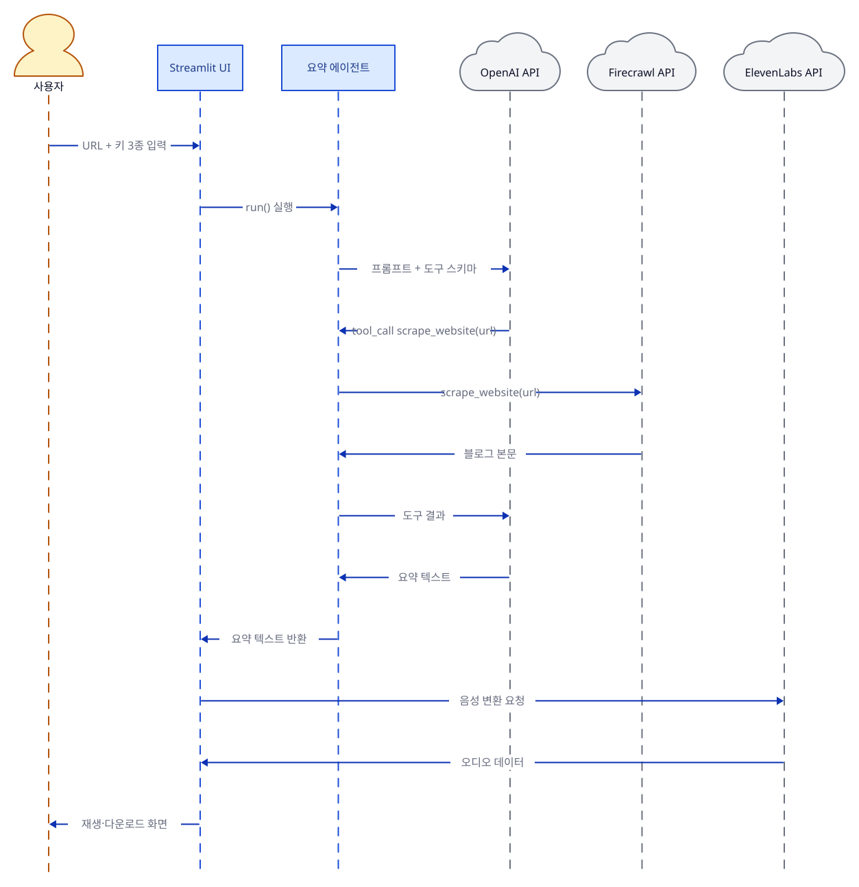

# Day 003 · 🎙️ AI Blog to Podcast Agent

> 볼륨 1 🌱 Starter AI Agents · 난이도 ★★☆ · 예상 소요 75분 · API 비용 대략 팟캐스트 1건 변환에 OpenAI+Firecrawl+ElevenLabs 요금표 기준 수백 원 이상, 대략치 (키가 없어 실제 과금은 확인 못함, ElevenLabs는 글자 수 기준 과금 비중이 클 수 있음) · 원본 앱: `starter_ai_agents/ai_blog_to_podcast_agent`

## 오늘 만들 것

이번 튜토리얼에서는 블로그 URL 하나를 입력받아 요약하고, 그 요약을 사람 목소리로 읽어주는 팟캐스트 오디오까지 만들어내는 파이프라인을 만듭니다. Day 1의 에이전트가 스스로 도구 호출 여부를 판단하는 되묻기 루프였고 Day 2가 정해진 순서로만 흐르는 단방향 파이프라인이었다면, 이 앱은 그 둘을 이어붙인 형태입니다 — 앞부분(블로그 스크래핑과 요약)은 agno의 `Agent`가 `FirecrawlTools`를 도구로 들고 Day 1과 같은 방식으로 동작하고, 뒷부분(텍스트를 오디오로 바꾸는 일)은 에이전트의 도구가 아니라 `agent.run()`이 끝난 뒤 앱 코드가 직접 ElevenLabs SDK를 호출하는, 에이전트 밖의 별도 단계입니다. 이 구분이 이 앱의 코드를 읽는 열쇠입니다 — 요약까지는 에이전트가 책임지고, 그 이후 "텍스트를 목소리로" 바꾸는 일은 순수한 애플리케이션 코드가 처리합니다. 이 앱은 지금까지와 달리 키를 3개(OpenAI, Firecrawl, ElevenLabs) 요구하고, 셋 중 하나라도 비어 있으면 생성 버튼 자체가 눌리지 않도록 막아둔 점도 눈여겨볼 만합니다. 완성하면 블로그 URL을 넣고 버튼을 눌러 요약과 함께 재생·다운로드 가능한 mp3 오디오를 받는 화면을 로컬에서 띄우게 됩니다. 아래는 완성된 아키텍처입니다.



## 사전 준비

| 서비스/도구 | 용도 | 발급·설치 |
|---|---|---|
| OpenAI API 키 | 요약 에이전트가 쓰는 gpt-4o 모델 호출 인증. 사이드바 입력창에 붙여넣으면 코드가 환경변수 `OPENAI_API_KEY`로 옮겨 담는다 | https://platform.openai.com/ 가입 후 발급 |
| Firecrawl API 키 | 블로그 URL의 본문을 실제로 긁어오는 Firecrawl 서비스 인증 | https://www.firecrawl.dev/ 가입 후 발급 |
| ElevenLabs API 키 | 요약 텍스트를 음성으로 합성하는 ElevenLabs 서비스 인증 | https://elevenlabs.io/ 가입 후 발급 |
| uv | 가상환경 생성과 패키지 설치 | [공통 사전 준비](../README.md#공통-사전-준비-한-번만) 절 참고 |

## 아키텍처 한눈에 보기

| 컴포넌트 | 역할 | 코드 위치 |
|---|---|---|
| 사용자 | 블로그 URL과 키 3종을 입력 | 코드 없음 (브라우저) |
| Streamlit UI | 입력을 받고 요약·오디오 결과를 표시 | `starter_ai_agents/ai_blog_to_podcast_agent/blog_to_podcast_agent.py:11-24` |
| 요약 에이전트 (Agent) | FirecrawlTools로 블로그를 긁어와 OpenAI로 요약 | `starter_ai_agents/ai_blog_to_podcast_agent/blog_to_podcast_agent.py:35-43` |
| 스크래핑 도구 (FirecrawlTools) | 에이전트가 호출하는 블로그 본문 수집 함수(`scrape_website`) | `starter_ai_agents/ai_blog_to_podcast_agent/blog_to_podcast_agent.py:38` |
| TTS 클라이언트 (ElevenLabs) | 요약 텍스트를 오디오로 변환. 에이전트의 도구가 아니라 앱 코드가 `run()` 이후 직접 호출 | `starter_ai_agents/ai_blog_to_podcast_agent/blog_to_podcast_agent.py:51-58` |
| OpenAI / Firecrawl / ElevenLabs API | 실제 요약·스크래핑·음성 합성을 수행하는 서드파티 서비스 3곳 | 코드 없음 (외부 서비스) |

## 단계별 진행

### Step 1. 환경 만들기

**목적.** 격리된 가상환경에 의존성을 설치하고, 이 앱이 요구하는 3개의 키(OpenAI, Firecrawl, ElevenLabs)를 미리 발급받아 둡니다.

**할 일.**

```bash
cd starter_ai_agents/ai_blog_to_podcast_agent
uv venv
uv pip install -r requirements.txt
```

(pip을 쓴다면 `python -m venv .venv && source .venv/bin/activate && pip install -r requirements.txt`.)

Day 1·2와 달리 이 앱은 `requirements.txt`(`agno>=2.2.10`, `streamlit>=1.40.2`, `openai>=1.102.0`, `requests`, `firecrawl-py>=4.6.0`, `elevenlabs>=1.0.0`)만 설치해도 이후 모든 import가 성공합니다(직접 확인 — 추가 설치 불필요). 이 문서를 작성하며 설치했을 때는 **agno 3.0.9**, **firecrawl-py 4.42.0**, **elevenlabs 2.68.0**이 받아졌습니다.

OpenAI·Firecrawl·ElevenLabs 키 세 개를 미리 발급받아 두세요 — 이 앱은 세 키를 모두 사이드바 입력창에 붙여넣어야 버튼이 눌립니다(Step 2에서 확인합니다).



**확인.**

```bash
uv run python -c "from agno.agent import Agent; from agno.models.openai import OpenAIChat; from agno.tools.firecrawl import FirecrawlTools; from elevenlabs import ElevenLabs; print('ok')"
```

```
ok
```

### Step 2. Streamlit 뼈대: 키와 URL 입력

**목적.** 화면 제목과 3개의 키 입력창, 블로그 URL 입력, 생성 버튼을 만듭니다. 버튼은 키 3개가 모두 채워지기 전까지 눌리지 않도록 막혀 있다는 점을 확인합니다.

**할 일.**

`starter_ai_agents/ai_blog_to_podcast_agent/blog_to_podcast_agent.py:1-8`

```python
import os
from uuid import uuid4
from agno.agent import Agent
from agno.run.agent import RunOutput
from agno.models.openai import OpenAIChat
from agno.tools.firecrawl import FirecrawlTools
from elevenlabs import ElevenLabs
import streamlit as st
```

`starter_ai_agents/ai_blog_to_podcast_agent/blog_to_podcast_agent.py:11-24`

```python
st.set_page_config(page_title="📰 ➡️ 🎙️ Blog to Podcast", page_icon="🎙️")
st.title("📰 ➡️ 🎙️ Blog to Podcast Agent")

# API Keys (Runtime Input)
st.sidebar.header("🔑 API Keys")
openai_key = st.sidebar.text_input("OpenAI API Key", type="password")
elevenlabs_key = st.sidebar.text_input("ElevenLabs API Key", type="password")
firecrawl_key = st.sidebar.text_input("Firecrawl API Key", type="password")

# Blog URL Input
url = st.text_input("Enter Blog URL:", "")

# Generate Button
if st.button("🎙️ Generate Podcast", disabled=not all([openai_key, elevenlabs_key, firecrawl_key])):
```

2번째 줄의 `uuid4`는 파일 어디에서도 실제로 쓰이지 않는 죽은 import입니다(직접 확인) — 실행에는 지장이 없습니다. `starter_ai_agents/ai_blog_to_podcast_agent/blog_to_podcast_agent.py:24`의 `disabled=not all([openai_key, elevenlabs_key, firecrawl_key])`가 이 앱의 안전장치입니다. 파이썬에서 빈 문자열은 거짓으로 취급되므로, `all(...)`은 세 입력값이 전부 비어 있지 않을 때만 참이 되고, 그래야 `not all(...)`이 거짓이 되어 버튼이 활성화됩니다 — 즉 키를 하나라도 비워두면 버튼 자체가 눌리지 않습니다(코드 로직으로 확인. 화면에서 버튼이 회색으로 보이는 것까지는 키가 없어 재현하지 못했습니다).



**확인.** 앱 폴더에서 서버를 headless로 띄웁니다.

```bash
uv run streamlit run blog_to_podcast_agent.py --server.headless true
```

다른 터미널에서:

```bash
curl -s -o /dev/null -w "%{http_code}\n" http://localhost:8501
```

```
200
```

### Step 3. 환경변수 연결과 모델 지정

**목적.** 사이드바에서 받은 키를 실제 SDK가 읽는 환경변수로 옮기고, 요약에 쓸 LLM을 지정합니다.

**할 일.**

`starter_ai_agents/ai_blog_to_podcast_agent/blog_to_podcast_agent.py:30-32`

```python
                # Set API keys
                os.environ["OPENAI_API_KEY"] = openai_key
                os.environ["FIRECRAWL_API_KEY"] = firecrawl_key
```

`starter_ai_agents/ai_blog_to_podcast_agent/blog_to_podcast_agent.py:35-37`

```python
                agent = Agent(
                    name="Blog Summarizer",
                    model=OpenAIChat(id="gpt-4o"),
```

`OpenAIChat`은 생성자에 `api_key`를 직접 받을 수도 있지만(직접 확인: 시그니처에 `api_key` 파라미터가 있고 기본값은 `None`), 이 코드는 인자를 넘기지 않고 위에서 미리 설정한 환경변수에 맡깁니다. 직접 확인해보면 `OpenAIChat(id="gpt-4o")`를 만든 직후에도 `api_key`는 여전히 `None`입니다 — agno 소스를 보면 `_get_client_params()`에서 `if not self.api_key: self.api_key = getenv("OPENAI_API_KEY")`로, 실제 API를 호출하려는 순간에야 환경변수를 읽습니다(직접 확인). Day 1의 `xAI(...)`가 키 없이도 객체 생성에 성공했던 것과 같은 패턴입니다.



**확인.**

```bash
uv run python -c "
from agno.models.openai import OpenAIChat
m = OpenAIChat(id='gpt-4o')
print(m.id, m.api_key)
"
```

```
gpt-4o None
```

### Step 4. 도구 연결과 지시문

**목적.** 에이전트에 블로그를 긁어올 도구(FirecrawlTools)와 요약 스타일을 지정하는 지시문을 연결합니다.

**할 일.**

`starter_ai_agents/ai_blog_to_podcast_agent/blog_to_podcast_agent.py:38-43`

```python
                    tools=[FirecrawlTools()],
                    instructions=[
                        "Scrape the blog URL and create a concise, engaging summary (max 2000 characters) suitable for a podcast.",
                        "The summary should be conversational and capture the main points."
                    ],
                )
```

`FirecrawlTools()`는 `OpenAIChat`과 반대로 생성 시점에 즉시 키를 확인합니다 — `FIRECRAWL_API_KEY`가 없으면 객체를 만드는 순간 `ValueError: No API key provided`가 납니다(직접 확인). 다만 Step 2의 `disabled` 조건 덕분에 실제 앱에서는 `firecrawl_key`가 빈 문자열일 때 이 코드 자체가 실행되지 않으므로, 사용자가 이 예외를 직접 볼 일은 없습니다. `FirecrawlTools`가 에이전트에 노출하는 함수는 `scrape_website` 하나뿐입니다(직접 확인).



**확인.**

```bash
# macOS/Linux, Git Bash
FIRECRAWL_API_KEY=dummy uv run python -c "from agno.tools.firecrawl import FirecrawlTools; print(sorted(FirecrawlTools().functions))"
```

```powershell
# Windows PowerShell
$env:FIRECRAWL_API_KEY="dummy"
uv run python -c "from agno.tools.firecrawl import FirecrawlTools; print(sorted(FirecrawlTools().functions))"
```

```
['scrape_website']
```

### Step 5. 요약 실행

**목적.** `agent.run()`을 호출해 실제로 스크래핑+요약이 이어지는 과정을 보고, 키가 잘못됐을 때 무엇이 반환되는지 확인합니다.

**할 일.**

`starter_ai_agents/ai_blog_to_podcast_agent/blog_to_podcast_agent.py:45-47`

```python
                # Get summary
                response: RunOutput = agent.run(f"Scrape and summarize this blog for a podcast: {url}")
                summary = response.content if hasattr(response, 'content') else str(response)
```

agno의 `agent.run()`은 Day 1에서 확인했듯 실패해도 파이썬 예외를 던지지 않고, `status`가 `RunStatus.error`인 `RunOutput`을 돌려줍니다. 이 코드는 `response.status`를 확인하지 않고 `response.content`를 곧바로 `summary`로 씁니다 — 즉 OpenAI 키가 잘못되면 에러 문구 자체가 "요약"으로 취급되어 다음 Step에서 그대로 음성으로 변환될 수 있습니다(직접 확인). 실제 앱의 이런 동작은 "문제 해결"에 정리했습니다.



**확인.** 키가 없어 화면의 최종 요약은 재현하지 못했습니다. 대신 같은 호출을 잘못된 키로 직접 실행해 반환값을 확인합니다.

```bash
uv run python -c "
import os
os.environ['OPENAI_API_KEY'] = 'sk-invalid'
os.environ['FIRECRAWL_API_KEY'] = 'fc-invalid'
from agno.agent import Agent
from agno.models.openai import OpenAIChat
from agno.tools.firecrawl import FirecrawlTools
agent = Agent(
    name='Blog Summarizer',
    model=OpenAIChat(id='gpt-4o'),
    tools=[FirecrawlTools()],
    instructions=['Scrape the blog URL and create a concise, engaging summary (max 2000 characters) suitable for a podcast.'],
)
response = agent.run('Scrape and summarize this blog for a podcast: https://example.com')
print('status:', response.status)
print('content:', response.content)
"
```

직접 확인한 출력:

```
status: RunStatus.error
content: Incorrect API key provided: sk-invalid. You can find your API key at https://platform.openai.com/account/api-keys.
```

이 호출이 실제로 도구를 부르는 tool_call 루프까지 가는지는 유효한 키가 없어 직접 관찰하지 못했습니다 — Day 1에서 확인한 agno의 표준 도구 호출 구조(모델이 tool_call을 돌려주면 에이전트가 로컬에서 실행하고 결과를 다시 모델에 넘기는 방식)와 같을 것으로 예상하지만, 이 앱 자체로 재현한 사실은 아닙니다. 유효한 키를 넣으면 이 자리에서 대신 `status=RunStatus.completed`와 함께 실제 요약 텍스트가 `content`에 담겨 돌아옵니다.

### Step 6. 팟캐스트 오디오 생성과 재생

**목적.** 요약 텍스트를 ElevenLabs로 음성 변환해 화면에 재생·다운로드로 표시하는 마지막 단계를 봅니다. 파일을 디스크에 쓰지 않는다는 점도 확인합니다.

**할 일.**

`starter_ai_agents/ai_blog_to_podcast_agent/blog_to_podcast_agent.py:51-58`

```python
                    client = ElevenLabs(api_key=elevenlabs_key)
                    
                    # Generate audio using text_to_speech.convert
                    audio_generator = client.text_to_speech.convert(
                        text=summary,
                        voice_id="JBFqnCBsd6RMkjVDRZzb",
                        model_id="eleven_multilingual_v2"
                    )
```

`starter_ai_agents/ai_blog_to_podcast_agent/blog_to_podcast_agent.py:60-77`

```python
                    # Collect audio chunks if it's a generator
                    audio_chunks = []
                    for chunk in audio_generator:
                        if chunk:
                            audio_chunks.append(chunk)
                    audio_bytes = b"".join(audio_chunks)
                    
                    # Display audio
                    st.success("Podcast generated! 🎧")
                    st.audio(audio_bytes, format="audio/mp3")
                    
                    # Download button
                    st.download_button(
                        "Download Podcast",
                        audio_bytes,
                        "podcast.mp3",
                        "audio/mp3"
                    )
```

`ElevenLabs(api_key=...)`는 앞서의 `OpenAIChat`/`FirecrawlTools`와 달리 키를 생성자 인자로 직접 받습니다(환경변수를 쓰지 않음). `convert()`가 돌려주는 것은 오디오 바이트 조각들의 제너레이터이고, 코드는 이를 순회해 하나의 `bytes`로 합칩니다. 이 앱은 오디오 파일을 디스크에 저장하지 않습니다 — `audio_bytes`는 메모리 위에서 바로 `st.audio`(재생)와 `st.download_button`(다운로드)에 전달됩니다(직접 확인: 파일을 여는 코드가 없음). 별도의 쓰기 가능한 출력 폴더가 필요 없는 이유입니다.



**확인.** 키가 없어 실제 오디오는 재현하지 못했습니다. 대신 유효하지 않은 ElevenLabs 키로 같은 호출을 실행해 실제로 어떤 예외가 나는지 확인합니다.

```bash
uv run python -c "
from elevenlabs import ElevenLabs
client = ElevenLabs(api_key='invalid-test-key')
try:
    list(client.text_to_speech.convert(text='hello world', voice_id='JBFqnCBsd6RMkjVDRZzb', model_id='eleven_multilingual_v2'))
except Exception as e:
    print(type(e).__name__)
    print(str(e)[:200])
"
```

직접 확인한 출력(발췌):

```
ApiError
headers: {...}, status_code: 401, body: {'detail': {'type': 'authentication_error', 'code': 'unauthorized', 'message': 'Invalid API key', ...
```

실제 앱에서는 이 예외가 `except Exception as e: st.error(f"Error: {e}")`(`starter_ai_agents/ai_blog_to_podcast_agent/blog_to_podcast_agent.py:85-86`)에 잡혀 위 문구가 그대로 화면에 표시됩니다. 유효한 키를 넣으면 이 자리에서 대신 재생 가능한 오디오와 다운로드 버튼이 나타납니다.

## 요청 한 건이 흐르는 과정



사용자가 블로그 URL과 키 3종을 입력하고 "Generate Podcast"를 누르면, 먼저 요약 에이전트의 `run()`이 호출됩니다. 여기서부터는 Day 1과 같은 도구 호출 루프로 설계되어 있습니다 — OpenAI 모델이 프롬프트와 `scrape_website` 함수 스키마를 받아, 필요하다고 판단하면 이 함수를 호출해 달라는 tool_call을 돌려주고, 에이전트가 이를 받아 실제로 Firecrawl API를 불러 블로그 본문을 가져온 뒤, 그 결과를 다시 모델에 넘겨 최종 요약문을 받는 구조입니다(다만 키가 없어 이 tool_call 왕복 자체를 직접 관찰하지는 못했습니다 — Day 1에서 확인한 agno의 표준 동작에 근거한 설명입니다). 요약이 완성되면 `agent.run()`은 그 자리에서 끝나고 제어권이 다시 앱 코드로 돌아옵니다 — 이 지점이 중요한데, 이후의 ElevenLabs 호출은 에이전트의 도구가 아니라 순수한 애플리케이션 코드입니다. 앱은 받은 요약 텍스트를 그대로 ElevenLabs의 음성 합성 API로 보내고, 돌아온 오디오 바이트를 디스크에 저장하지 않은 채 곧바로 화면의 재생 위젯과 다운로드 버튼에 전달합니다.

## 실행 체크리스트

- [ ] OpenAI, Firecrawl, ElevenLabs API 키를 모두 발급받아 두었다
- [ ] `uv venv && uv pip install -r requirements.txt`로 의존성을 설치했다(추가 설치 불필요)
- [ ] `uv run streamlit run blog_to_podcast_agent.py`로 서버를 띄우고 `http://localhost:8501`에서 화면을 확인했다
- [ ] 키를 하나라도 비워두면 "Generate Podcast" 버튼이 비활성화된다는 것을 코드로 확인했다
- [ ] 블로그 URL과 키 3개를 모두 입력하고 버튼을 눌러 요약과 오디오를 확인했다
- [ ] 생성된 오디오를 재생하거나 "Download Podcast"로 mp3를 내려받아봤다

## 문제 해결

| 증상 | 원인 | 해결 |
|---|---|---|
| 키를 하나도 입력하지 않으면 "Generate Podcast" 버튼 자체가 비활성화됨 | `disabled=not all([openai_key, elevenlabs_key, firecrawl_key])`(`starter_ai_agents/ai_blog_to_podcast_agent/blog_to_podcast_agent.py:24`)가 세 값 중 하나라도 빈 문자열이면 버튼을 비활성화한다(직접 확인: 코드 로직) | 키 3개를 모두 입력 |
| `FirecrawlTools()`를 키 없이 생성하면 `ValueError: No API key provided` (직전에 `ERROR FIRECRAWL_API_KEY not set...` 로그도 함께 출력) | `FirecrawlTools`는 생성 시점에 즉시 `FIRECRAWL_API_KEY`를 확인해 없으면 바로 예외를 던진다(직접 확인). 실제 앱에서는 위 버튼 비활성화 덕분에 이 코드가 빈 키로 실행될 일이 없다 | 정상적인 사용에서는 발생하지 않음. 코드를 직접 갖고 실험할 때만 유의 |
| OpenAI 키가 잘못되면 화면에 명확한 에러 대신, 인증 오류 문구가 마치 요약인 것처럼 그대로 오디오로 변환될 수 있음 | `starter_ai_agents/ai_blog_to_podcast_agent/blog_to_podcast_agent.py:47`의 `summary = response.content if hasattr(response, 'content') else str(response)`는 `response.status`를 확인하지 않는다. `agent.run()`이 실패해도 예외를 던지지 않고 `content`에 에러 문구를 담은 `RunOutput`을 돌려주므로(직접 확인: `status=RunStatus.error`), 그 문구가 그대로 "요약"으로 취급되어 이후 ElevenLabs로 넘어간다 | 유효한 OpenAI 키인지 다시 확인. 코드를 고친다면 `response.status`가 정상인지 검사하는 분기를 추가 |
| ElevenLabs 키가 잘못되면 `st.error(f"Error: {e}")`에 `headers: {...}, status_code: 401, body: {'detail': {'type': 'authentication_error', ...}}`처럼 원시 예외 문구가 그대로 표시됨 | `client.text_to_speech.convert()`의 결과 제너레이터를 순회하는 시점에 `ApiError`가 발생하고(직접 확인), 코드는 이를 `except Exception as e:`로만 잡아 다듬지 않은 문구를 그대로 보여준다 | 유효한 ElevenLabs 키인지 확인. 화면의 에러 문구에서 `status_code: 401`을 보면 키 문제로 좁혀서 판단 |

## 더 해보기

- `response.status`를 확인해 실패 시 `st.error()`로 명확히 알리도록 `starter_ai_agents/ai_blog_to_podcast_agent/blog_to_podcast_agent.py:46-47` 부분을 고쳐보기(현재는 실패 문구가 그대로 요약 취급됨)
- `voice_id`(`starter_ai_agents/ai_blog_to_podcast_agent/blog_to_podcast_agent.py:56`)를 ElevenLabs 콘솔에서 다른 목소리 ID로 바꿔 다른 음성으로 들어보기
- 죽은 import인 `uuid4`(`starter_ai_agents/ai_blog_to_podcast_agent/blog_to_podcast_agent.py:2`)를 실제로 활용해, 다운로드 파일명이 매번 겹치지 않도록 `podcast.mp3` 대신 고유 이름을 붙여보기

## 다음 날 예고

Day 004 · 🎵 AI Music Generator Agent — OpenAI GPT-4o와 ModelsLab API로 프롬프트에서 음악을 생성하는 에이전트를 만듭니다. (Day 004 폴더가 만들어지면 링크로 바뀝니다.)
