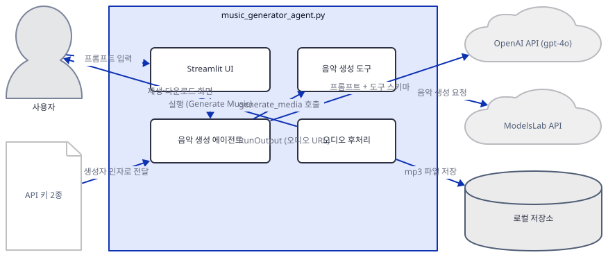
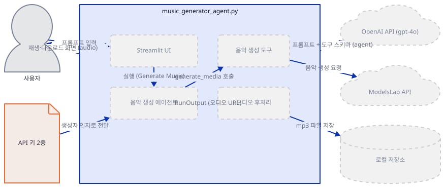
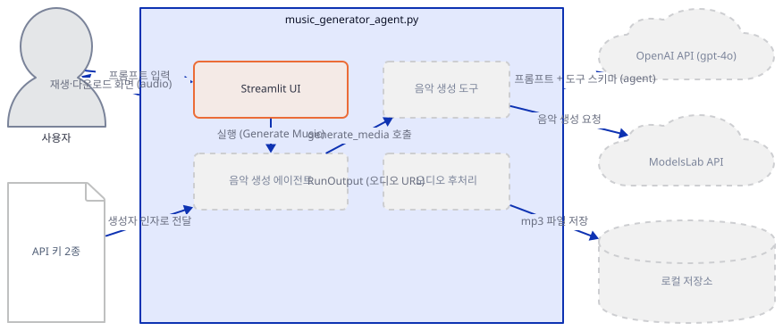
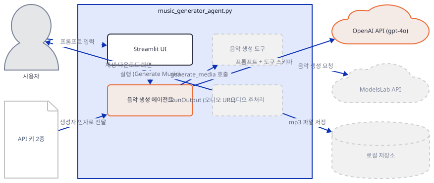
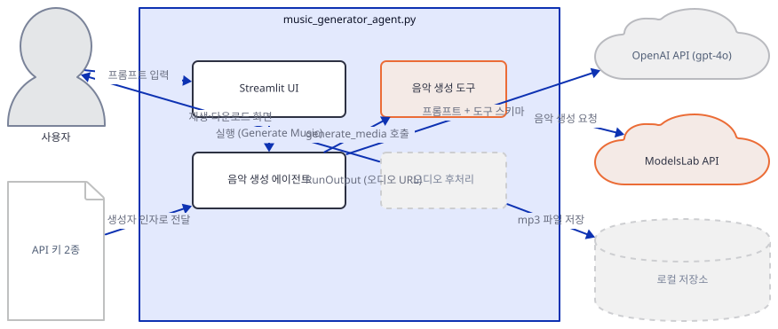
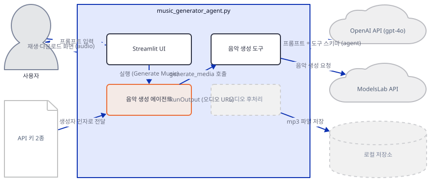
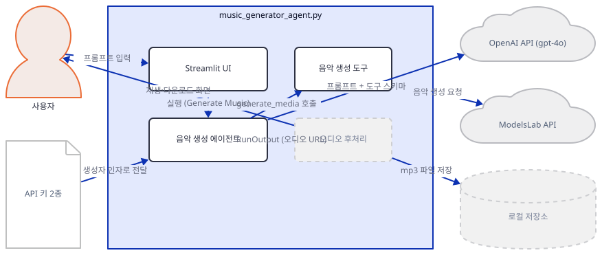
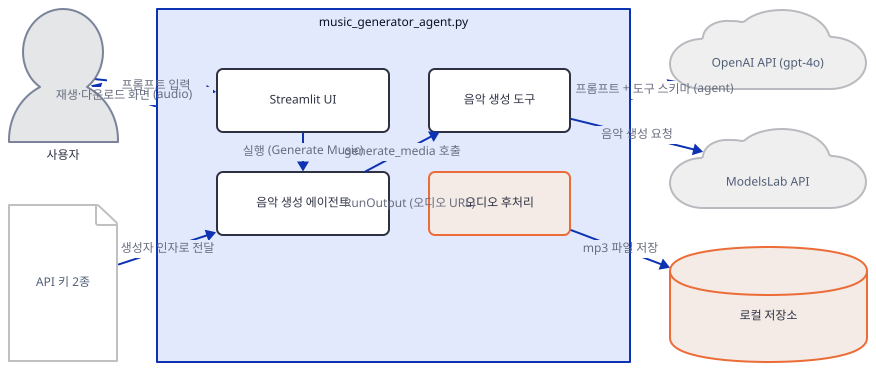
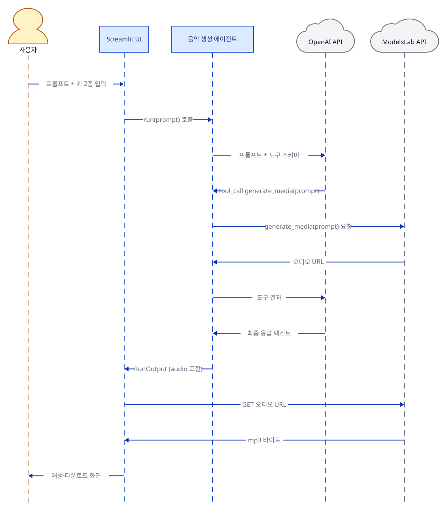

# Day 004 · 🎵 AI Music Generator Agent

> 볼륨 1 🌱 Starter AI Agents · 난이도 ★★☆ ⚠ · 예상 소요 70분 · API 비용 대략 음악 1건 생성에 OpenAI(gpt-4o 소량 호출)와 ModelsLab(음악 생성 요청) 요금표 기준 수백 원 이상, 대략치 (키가 없어 실제 과금은 확인 못함) · 원본 앱: `starter_ai_agents/ai_music_generator_agent`

## 오늘 만들 것

이번 튜토리얼에서는 텍스트 프롬프트 한 줄로 음악을 생성하는 에이전트를 만듭니다. 구조는 Day 3와 닮았습니다 — 앞부분(프롬프트를 해석하고 도구 호출 여부를 판단하는 일)은 agno의 `Agent`가 OpenAI GPT-4o를 모델로, `ModelsLabTools`를 도구로 들고 Day 1과 같은 도구 호출 루프로 동작하고, 뒷부분(생성된 오디오 URL을 실제 mp3 파일로 내려받아 로컬에 저장하고 재생·다운로드 위젯으로 보여주는 일)은 에이전트의 도구가 아니라 `agent.run()`이 끝난 뒤 앱 코드가 직접 처리하는, 에이전트 밖의 단계입니다. Day 3와 다른 점이 둘 있습니다. 첫째, 이 앱은 오디오를 메모리에서 바로 재생 위젯으로 넘기지 않고 `audio_generations/` 폴더에 실제 mp3 파일로 저장합니다. 둘째 — 이 문서에서 가장 먼저 짚어야 할 점인데 — 리포에 있는 코드를 그대로 설치해 실행하면 키 2개를 모두 입력하는 순간 곧바로 처리되지 않은 예외가 뜨며 멈춥니다. `Agent(agent_id="ml_music_agent", ...)`가 지금 설치되는 agno의 **어떤 버전에서도** — 리포가 못박은 최저 버전 `agno==2.2.10`에서도, 버전 상한이 없어 실제로 받아지는 `agno 3.0.9`에서도 똑같이 — 더 이상 존재하지 않는 인자 이름을 쓰고 있기 때문입니다(직접 확인). 이 문제는 키가 유효한지와 무관하게 일어나므로, 이 문서는 그 지점까지는 리포 코드를 그대로 따라가고, 그 지점을 넘어서는 부분은 어떤 코드가 왜 실행되지 않는지를 정확히 밝히는 방식으로 진행합니다. 완성하면(그리고 이 한 줄을 우회하면) 프롬프트를 입력해 생성된 음악을 로컬 폴더에 저장하고 브라우저에서 재생·다운로드하는 화면을 띄우게 됩니다. 아래는 완성된 아키텍처입니다.



## 사전 준비

| 서비스/도구 | 용도 | 발급·설치 |
|---|---|---|
| OpenAI API 키 | 음악 생성 에이전트가 프롬프트를 해석하고 도구 호출 여부를 판단하는 gpt-4o 모델 호출 인증. 사이드바 입력창에 직접 붙여넣는다(환경변수 아님) | https://platform.openai.com/ 가입 후 발급 |
| ModelsLab API 키 | 실제 음악을 만드는 ModelsLab 음악 생성 API(`music_gen`) 호출 인증. 역시 사이드바 입력창에 직접 붙여넣는다 | https://modelslab.com/dashboard/api-keys 가입 후 발급 |
| uv | 가상환경 생성과 패키지 설치 | [공통 사전 준비](../README.md#공통-사전-준비-한-번만) 절 참고 |
| 인터넷 연결 | OpenAI·ModelsLab API 접속 | 별도 설치 없음. 사내망이면 두 도메인에 대한 접속 허용 필요 |

## 아키텍처 한눈에 보기

| 컴포넌트 | 역할 | 코드 위치 |
|---|---|---|
| 사용자 | 사이드바에 키 2종, 본문에 프롬프트 입력 | 코드 없음 (브라우저) |
| Streamlit UI | 키·프롬프트 입력을 받고 버튼과 결과(재생·다운로드)를 표시 | `starter_ai_agents/ai_music_generator_agent/music_generator_agent.py:11-19` |
| 음악 생성 에이전트 (Agent) | 지시문에 따라 모델과 도구를 조합해 프롬프트를 음악 생성 요청으로 바꿈 | `starter_ai_agents/ai_music_generator_agent/music_generator_agent.py:23-40` |
| 모델 (OpenAI gpt-4o) | 실제 추론을 수행하는 LLM, 도구 호출 여부를 판단 | `starter_ai_agents/ai_music_generator_agent/music_generator_agent.py:6`, `starter_ai_agents/ai_music_generator_agent/music_generator_agent.py:26` |
| 도구 (ModelsLabTools) | ModelsLab 음악 생성 API 호출을 `generate_media` 함수 하나로 노출 | `starter_ai_agents/ai_music_generator_agent/music_generator_agent.py:7`, `starter_ai_agents/ai_music_generator_agent/music_generator_agent.py:27` |
| 오디오 후처리 (앱 코드) | 생성된 오디오 URL을 내려받아 로컬에 저장하고 재생·다운로드 위젯으로 표시 | `starter_ai_agents/ai_music_generator_agent/music_generator_agent.py:50-86` |
| 외부 API (OpenAI, ModelsLab) | 실제 추론과 음악 생성을 수행하는 서드파티 서비스 2곳 | 코드 없음 (외부 서비스) |

## 단계별 진행

### Step 1. 환경 만들기

**목적.** 격리된 가상환경에 이 앱의 의존성을 설치하고, OpenAI·ModelsLab 키를 미리 발급받아 둡니다.

**할 일.**

```bash
cd starter_ai_agents/ai_music_generator_agent
uv venv
uv pip install -r requirements.txt
```

(pip을 쓴다면 `python -m venv .venv && source .venv/bin/activate && pip install -r requirements.txt`.)

Day 1과 달리 이 앱은 `requirements.txt`(`agno>=2.2.10`, `Requests==2.32.3`, `streamlit==1.44.1`, `openai==2.8.1`)만 설치해도 파일이 쓰는 모든 모듈의 import가 성공합니다(직접 확인 — 추가 설치 불필요). `Requests`(대문자로 시작)와 코드의 `import requests`는 PyPI 배포명과 import명이 다를 뿐 같은 패키지입니다. `agno`는 버전 상한이 없어서, 이 문서를 작성하며 설치했을 때는 **agno 3.0.9**가 받아졌습니다(직접 확인: `uv run python -c "import agno; print(agno.__version__)"` → `3.0.9`) — Day 1에서도 같은 일이 있었습니다. 다만 이번에는 받아지는 버전이 무엇이든 Step 3에서 실제 문제가 하나 남아 있으니 미리 염두에 두세요.

두 키는 이 단계에서 당장 쓰지 않습니다. Day 2·3처럼 환경변수가 아니라 Step 2에서 볼 Streamlit 사이드바 입력창에 직접 붙여넣는 방식이라, 앱을 띄운 뒤에 입력해도 됩니다. 미리 두 사이트에서 발급받아 두세요.



**확인.**

```bash
uv run python -c "import os; from uuid import uuid4; import requests; from agno.agent import Agent; from agno.run.agent import RunOutput; from agno.models.openai import OpenAIChat; from agno.tools.models_labs import FileType, ModelsLabTools; from agno.utils.log import logger; import streamlit as st; print('ok')"
```

```
ok
```

### Step 2. Streamlit 뼈대: 키 입력과 프롬프트

**목적.** 사이드바에 키 2종 입력창을, 본문에 제목과 프롬프트 입력창을 만듭니다. 프롬프트 입력창은 키 유무와 무관하게 항상 보인다는 점, 그리고 그 아래 전체가 하나의 `if`로 감싸여 있다는 점을 확인합니다.

**할 일.**

`starter_ai_agents/ai_music_generator_agent/music_generator_agent.py:11-19`

```python
# Sidebar: User enters the API keys
st.sidebar.title("API Key Configuration")

openai_api_key = st.sidebar.text_input("Enter your OpenAI API Key", type="password")
models_lab_api_key = st.sidebar.text_input("Enter your ModelsLab API Key", type="password")

# Streamlit App UI
st.title("🎶 ModelsLab Music Generator")
prompt = st.text_area("Enter a music generation prompt:", "Generate a 30 second classical music piece", height=100)
```

`starter_ai_agents/ai_music_generator_agent/music_generator_agent.py:22`

```python
if openai_api_key and models_lab_api_key:
```

`starter_ai_agents/ai_music_generator_agent/music_generator_agent.py:92-93`

```python
else:
    st.sidebar.warning("Please enter both the OpenAI and ModelsLab API keys to use the app.")
```

`prompt`는 기본값("Generate a 30 second classical music piece")이 이미 채워진 채로 키와 무관하게 항상 표시됩니다. 반면 에이전트 생성부터 버튼, 결과 표시까지는 전부 `if openai_api_key and models_lab_api_key:` 블록 안에 있고, 빠지면 `else`의 사이드바 경고만 뜹니다. Day 3가 버튼에 `disabled=` 속성을 걸어 항상 그려두고 눌리지만 않게 막은 것과 달리, 이 앱은 조건을 만족하기 전에는 버튼 자체를 화면에 그리지 않습니다 — 코드 구조로 보면 더 단순하지만, Step 3에서 볼 문제도 이 블록에 함께 들어 있어 키를 채우는 순간 같이 실행됩니다.



**확인.** 앱 폴더에서 서버를 headless로 띄웁니다.

```bash
uv run streamlit run music_generator_agent.py --server.headless true
```

다른 터미널에서:

```bash
curl -s -o /dev/null -w "%{http_code}\n" http://localhost:8501
```

```
200
```

(HTTP 200은 직접 확인. 제목·사이드바 키 입력창·프롬프트 입력창만 보이고 버튼은 아직 없으리라는 것은 `if` 가드 구조로 추론한 것이며, 화면을 직접 열어 확인하지는 못했습니다.)

### Step 3. 모델과 에이전트 정의 — 그리고 여기서 멈추는 이유

**목적.** 에이전트의 두뇌가 될 모델(OpenAIChat)을 정의하고 `Agent`로 감쌉니다. 이 지점에서 리포 코드가 지금 agno와 맞지 않아 곧바로 예외를 던진다는 것을 실제로 확인합니다.

**할 일.**

`starter_ai_agents/ai_music_generator_agent/music_generator_agent.py:6`

```python
from agno.models.openai import OpenAIChat
```

`starter_ai_agents/ai_music_generator_agent/music_generator_agent.py:23-26`

```python
    agent = Agent(
        name="ModelsLab Music Agent",
        agent_id="ml_music_agent",
        model=OpenAIChat(id="gpt-4o", api_key=openai_api_key),
```

`OpenAIChat(id="gpt-4o", api_key=openai_api_key)`는 Day 3의 환경변수 방식과 달리 사이드바에서 받은 키를 생성자 인자로 바로 넘깁니다. 이 객체 하나만 놓고 보면 아무 키로나 문제없이 만들어집니다.

**확인 (모델만 단독으로).**

```bash
uv run python -c "
from agno.models.openai import OpenAIChat
m = OpenAIChat(id='gpt-4o', api_key='sk-test')
print(m.id, m.api_key)
"
```

```
gpt-4o sk-test
```

문제는 그다음 줄입니다. `agent_id="ml_music_agent"`는 agno 3.0.9의 `Agent.__init__()`에 더 이상 없는 인자 이름입니다 — 인자 이름이 `id`로 바뀌었습니다(직접 확인: `inspect.signature(Agent.__init__)`에 `id`는 있고 `agent_id`는 없음). 리포 코드를 그대로 재현해 직접 실행해봅니다.

```bash
uv run python -c "
from agno.agent import Agent
from agno.models.openai import OpenAIChat
agent = Agent(
    name='ModelsLab Music Agent',
    agent_id='ml_music_agent',
    model=OpenAIChat(id='gpt-4o', api_key='sk-test'),
)
"
```

직접 확인한 출력(발췌):

```
TypeError: Agent.__init__() got an unexpected keyword argument 'agent_id'
```

이 예외는 두 키의 유효성과 무관하게 일어납니다. 더 중요한 사실은, `requirements.txt`가 못박은 최저 버전 `agno==2.2.10`으로 낮춰 같은 코드를 실행해도 똑같이 실패한다는 것입니다(직접 확인) — 즉 Day 1의 ddgs/openai 사례처럼 "버전이 표류해 최신 릴리스에서 깨졌다"는 이야기가 아니라, `requirements.txt`가 지원한다고 선언한 버전 범위 전체에서 애초에 존재한 적 없는 인자를 쓰고 있다는 뜻입니다. 앱 코드를 고치는 것은 이 튜토리얼의 범위 밖이므로, 이후 Step에서는 이 한 인자만 `id`로 바꾼 별도 스크립트로 "나머지 설정이 정상 조립되는지"를 검증합니다. 정확한 증상은 "문제 해결"에도 정리했습니다.



### Step 4. 도구 연결 (ModelsLabTools)

**목적.** LLM이 직접 할 수 없는 일 — 실제 음악 파일 생성 — 을 대신할 도구를 연결합니다. 이 도구가 무슨 함수를 노출하는지, 어떤 이름의 키를 읽는지, 키가 없거나 잘못됐을 때 실제로 무엇이 돌아오는지 확인합니다.

**할 일.**

`starter_ai_agents/ai_music_generator_agent/music_generator_agent.py:7`

```python
from agno.tools.models_labs import FileType, ModelsLabTools
```

`starter_ai_agents/ai_music_generator_agent/music_generator_agent.py:27`

```python
        tools=[ModelsLabTools(api_key=models_lab_api_key, wait_for_completion=True, file_type=FileType.MP3)],
```

`ModelsLabTools`의 생성자는 `api_key`를 직접 받지 못하면 `MODELS_LAB_API_KEY` 환경변수로 대신합니다(직접 확인: agno 소스의 `self.api_key = api_key or getenv("MODELS_LAB_API_KEY")`). 이 앱은 두 경우 다 아니고 사이드바에서 받은 문자열을 그대로 넘깁니다. `wait_for_completion=True`는 생성이 끝날 때까지 폴링하게 하고, `file_type=FileType.MP3`는 호출할 ModelsLab 엔드포인트를 음악 생성용(`voice/music_gen`)으로 고정합니다. 이 도구가 에이전트에 노출하는 함수는 `generate_media` 하나뿐입니다(직접 확인).

**확인 (키가 아예 없을 때).**

```bash
uv run python -c "
from agno.tools.models_labs import FileType, ModelsLabTools
t = ModelsLabTools(api_key=None, wait_for_completion=True, file_type=FileType.MP3)
print(sorted(t.functions))
print(t.generate_media('test').content)
"
```

직접 확인한 출력:

```
ERROR   MODELS_LAB_API_KEY not set. Please set the MODELS_LAB_API_KEY environment variable.
['generate_media']
Please set the MODELS_LAB_API_KEY
```

키가 없으면 네트워크 요청 자체가 나가지 않고 이 문구만 돌아옵니다. 유효하지 않은 키를 주면 실제로 ModelsLab 서버까지 요청이 나갑니다.

**확인 (키는 있지만 유효하지 않을 때).**

```bash
uv run python -c "
from agno.tools.models_labs import FileType, ModelsLabTools
t = ModelsLabTools(api_key='invalid-test-key', wait_for_completion=False, file_type=FileType.MP3)
result = t.generate_media('Generate a 10 second classical music piece')
print(result.content)
"
```

직접 확인한 출력:

```
ERROR   Error in response: Invalid API Key. Get API key from: https://modelslab.com/dashboard/api-keys
Error: Invalid API Key. Get API key from: https://modelslab.com/dashboard/api-keys
```



### Step 5. 지시문 설정

**목적.** 에이전트가 어떤 프롬프트를 만들어 도구에 넘겨야 하는지 지시문으로 못박고, 마크다운·디버그 로그 여부를 정합니다. Step 3의 한 인자만 고치면 이 설정 전체가 정상적으로 조립된다는 것도 확인합니다.

**할 일.**

`starter_ai_agents/ai_music_generator_agent/music_generator_agent.py:28-40`

```python
        description="You are an AI agent that can generate music using the ModelsLabs API.",
        instructions=[
            "When generating music, use the `generate_media` tool with detailed prompts that specify:",
            "- The genre and style of music (e.g., classical, jazz, electronic)",
            "- The instruments and sounds to include",
            "- The tempo, mood and emotional qualities",
            "- The structure (intro, verses, chorus, bridge, etc.)",
            "Create rich, descriptive prompts that capture the desired musical elements.",
            "Focus on generating high-quality, complete instrumental pieces.",
        ],
        markdown=True,
        debug_mode=True,
    )
```

이전 세 날의 `instructions`는 모델이 사람에게 보여줄 **답변**의 형식을 지정했습니다(표로, 불릿으로 등). 이 앱의 지시문은 다릅니다 — 모델이 최종 답을 어떻게 쓸지가 아니라, `generate_media` 도구에 넘길 프롬프트를 장르·악기·템포·구조까지 채워 얼마나 상세하게 지어낼지를 코치합니다. `debug_mode=True`는 Day 1처럼 메시지와 도구 호출을 터미널에 로그로 남깁니다.

**확인.** 아래는 리포 코드를 그대로 실행한 것이 아니라, Step 3에서 본 `agent_id`만 `id`로 바꿔 나머지 설정(모델·도구·description·instructions·markdown·debug_mode)이 모두 정상 조립되는지 따로 검증한 것입니다(문제를 한 곳으로 좁히기 위함).

```bash
uv run python -c "
from agno.agent import Agent
from agno.models.openai import OpenAIChat
from agno.tools.models_labs import FileType, ModelsLabTools
agent = Agent(
    name='ModelsLab Music Agent',
    id='ml_music_agent',
    model=OpenAIChat(id='gpt-4o', api_key='sk-test'),
    tools=[ModelsLabTools(api_key='invalid-test-key', wait_for_completion=True, file_type=FileType.MP3)],
    description='You are an AI agent that can generate music using the ModelsLabs API.',
    instructions=[
        'When generating music, use the generate_media tool with detailed prompts that specify:',
        '- The genre and style of music (e.g., classical, jazz, electronic)',
        '- The instruments and sounds to include',
        '- The tempo, mood and emotional qualities',
        '- The structure (intro, verses, chorus, bridge, etc.)',
        'Create rich, descriptive prompts that capture the desired musical elements.',
        'Focus on generating high-quality, complete instrumental pieces.',
    ],
    markdown=True,
    debug_mode=True,
)
print(agent.name, len(agent.tools), len(agent.instructions))
"
```

직접 확인한 출력:

```
ModelsLab Music Agent 1 7
```



### Step 6. 실행 흐름: 버튼과 agent.run()

**목적.** "Generate Music" 버튼을 누르면 무슨 일이 벌어지도록 설계되어 있는지 보고, 실제 리포에서는 이 지점에 도달하기도 전에 멈춘다는 것을 다시 확인합니다.

**할 일.**

`starter_ai_agents/ai_music_generator_agent/music_generator_agent.py:42-48`

```python
    if st.button("Generate Music"):
        if prompt.strip() == "":
            st.warning("Please enter a prompt first.")
        else:
            with st.spinner("Generating music... 🎵"):
                try:
                    music: RunOutput = agent.run(prompt)
```

이 버튼과 그 아래 코드 전부가 Step 3에서 본 `agent = Agent(...)`와 같은 `if openai_api_key and models_lab_api_key:` 블록 안에 있습니다. Streamlit은 위젯 값이 바뀔 때마다 스크립트를 처음부터 다시 실행하므로, 두 키를 채우는 순간 이 버튼이 그려지기도 전에 `Agent(agent_id=...)`에서 먼저 멈춥니다. `try/except`(47번째 줄부터)는 `agent.run(prompt)`부터만 감싸고 있어서, `Agent(...)` 생성 자체의 실패는 이 `try`로 잡히지 않고 Streamlit의 미처리 예외 화면으로 그대로 튀어나옵니다.

**확인.** Step 5에서 만든, `id`로 고친 에이전트에 실제로 `run()`을 호출해 다음 단계에서 무엇을 받는지 봅니다(가짜 OpenAI 키 사용).

```bash
uv run python -c "
from agno.agent import Agent
from agno.models.openai import OpenAIChat
from agno.tools.models_labs import FileType, ModelsLabTools
agent = Agent(
    name='ModelsLab Music Agent',
    id='ml_music_agent',
    model=OpenAIChat(id='gpt-4o', api_key='sk-invalid'),
    tools=[ModelsLabTools(api_key='invalid-test-key', wait_for_completion=True, file_type=FileType.MP3)],
    instructions=['test'],
    markdown=True,
)
response = agent.run('Generate a 10 second classical music piece')
print('status:', response.status)
print('content:', response.content)
print('audio:', response.audio)
"
```

직접 확인한 출력(발췌):

```
status: RunStatus.error
content: Incorrect API key provided: sk-invalid. You can find your API key at https://platform.openai.com/account/api-keys.
audio: None
```

Day 1·3에서 본 것과 같은 패턴입니다 — `agent.run()`은 실패해도 예외를 던지지 않고 `status=RunStatus.error`인 `RunOutput`을 돌려주며, `music.audio`는 `None`입니다. 유효한 키 2개가 모두 있으면 이 자리에서 대신 `status=RunStatus.completed`와 함께 `RunOutput.audio`에 ModelsLab이 만든 오디오의 URL이 담겨 돌아옵니다.



### Step 7. 오디오 후처리: 다운로드·저장·재생

**목적.** `run()`이 성공했을 때 오디오 URL을 실제 파일로 내려받아 로컬에 저장하고, 재생·다운로드 위젯으로 보여주는 나머지 로직을 봅니다. 실패 분기와 예외 처리도 함께 봅니다.

**할 일.**

`starter_ai_agents/ai_music_generator_agent/music_generator_agent.py:50-55`

```python
                    if music.audio and len(music.audio) > 0:
                        save_dir = "audio_generations"
                        os.makedirs(save_dir, exist_ok=True)

                        url = music.audio[0].url
                        response = requests.get(url)
```

`starter_ai_agents/ai_music_generator_agent/music_generator_agent.py:57-67`

```python
                        # 🛡️ Validate response
                        if not response.ok:
                            st.error(f"Failed to download audio. Status code: {response.status_code}")
                            st.stop()

                        content_type = response.headers.get("Content-Type", "")
                        if "audio" not in content_type:
                            st.error(f"Invalid file type returned: {content_type}")
                            st.write("🔍 Debug: Downloaded content was not an audio file.")
                            st.write("🔗 URL:", url)
                            st.stop()
```

`starter_ai_agents/ai_music_generator_agent/music_generator_agent.py:69-86`

```python
                        # ✅ Save audio
                        filename = f"{save_dir}/music_{uuid4()}.mp3"
                        with open(filename, "wb") as f:
                            f.write(response.content)

                        # 🎧 Play audio
                        st.success("Music generated successfully! 🎶")
                        audio_bytes = open(filename, "rb").read()
                        st.audio(audio_bytes, format="audio/mp3")

                        st.download_button(
                            label="Download Music",
                            data=audio_bytes,
                            file_name="generated_music.mp3",
                            mime="audio/mp3"
                        )
                    else:
                        st.error("No audio generated. Please try again.")
```

`starter_ai_agents/ai_music_generator_agent/music_generator_agent.py:88-90`

```python
                except Exception as e:
                    st.error(f"An error occurred: {e}")
                    logger.error(f"Streamlit app error: {e}")
```

이 앱은 Day 3의 ElevenLabs 단계와 달리 오디오를 메모리에서 바로 위젯에 넘기지 않고, `music.audio[0].url`이 가리키는 주소로 다시 `requests.get()`을 보내 받은 바이트를 `audio_generations/music_<uuid>.mp3`라는 이름으로 디스크에 저장한 다음(직접 확인: `uuid4`가 이 파일에서 유일하게 실제로 쓰이는 곳입니다 — Day 3의 죽은 import와 대비됩니다), 그 파일을 다시 읽어 재생 위젯과 다운로드 버튼에 넘깁니다. 저장 전에 `response.ok`와 `Content-Type`에 `"audio"`가 들어 있는지 검증하는 점은 Day 3의 ElevenLabs 처리보다 한 단계 더 방어적입니다. `music.audio`가 비어 있으면(도구가 URL을 못 받았거나 타임아웃한 경우) "No audio generated" 문구만 뜨고, 그 위에서 나는 예외는 전부 `except Exception`이 잡아 화면과 로그에 함께 남깁니다.

**확인.** 유효한 오디오 URL이 있어야 실행되는 `response.ok`/`Content-Type` 검증까지는 키가 없어 도달하지 못했습니다. 대신 파일 시스템에 관련된 부분 — 폴더 생성과 파일명 생성 — 만 코드 그대로 실행해 확인합니다.

```bash
uv run python -c "
import os
from uuid import uuid4
save_dir = 'audio_generations'
os.makedirs(save_dir, exist_ok=True)
filename = f'{save_dir}/music_{uuid4()}.mp3'
print(os.path.isdir(save_dir), filename)
os.rmdir(save_dir)
"
```

직접 확인한 출력(UUID 부분은 실행마다 달라집니다):

```
True audio_generations/music_09c90a12-cffb-4b6d-bc02-ade93e96b5ec.mp3
```

`save_dir`가 상대경로이므로 이 폴더는 Streamlit을 실행한 위치를 기준으로 생성됩니다 — 앱 폴더에서 실행했다면 `starter_ai_agents/ai_music_generator_agent/audio_generations/`입니다.



## 요청 한 건이 흐르는 과정



사용자가 프롬프트와 키 2종을 입력하고 "Generate Music"을 누르면 — 다만 Step 3에서 본 것처럼 실제 리포 코드는 이 지점에 도달하기 전에 `Agent(agent_id=...)`에서 이미 멈춥니다. 아래는 그 한 인자만 고쳤다고 가정했을 때 코드가 설계된 대로 흘렀을 경우입니다. `agent.run(prompt)`가 호출되면 에이전트는 지시문과 `generate_media` 함수 스키마를 프롬프트에 얹어 OpenAI GPT-4o에 보냅니다. Day 1에서 본 것과 같은 도구 호출 루프입니다 — GPT-4o는 스스로 음악을 만들 수 없으므로, 지시문이 코치한 대로 장르·악기·템포·구조를 채운 상세 프롬프트와 함께 `generate_media` tool_call을 돌려줍니다. 에이전트는 이를 받아 `ModelsLabTools.generate_media()`를 로컬에서 실행하고, ModelsLab의 `music_gen` 엔드포인트에 실제 생성 요청을 보냅니다. ModelsLab이 오디오 URL을 돌려주면 그 결과가 다시 GPT-4o에 전달되고, GPT-4o는 이를 근거로 최종 텍스트 응답을 만들어 `RunOutput`에 담아 돌려줍니다. 여기서부터는 Day 3와 같은 구조입니다 — 이후의 다운로드는 에이전트의 도구가 아니라 앱 코드가 직접 처리합니다. 앱은 `RunOutput.audio[0].url`을 꺼내 그 주소로 다시 `requests.get()`을 보내 mp3 바이트를 받고, 응답 코드와 Content-Type을 검증한 뒤 `audio_generations/`에 파일로 저장하고, 같은 바이트를 재생 위젯과 다운로드 버튼에 그대로 넘깁니다. 이 tool_call 왕복과 최종 응답 구조는 Day 1·3에서 확인한 agno의 표준 동작에 근거한 설명이며, 이 앱 자체로 끝까지 재현한 사실은 아닙니다 — 직접 확인한 것은 `ModelsLabTools` 단독 호출(Step 4)과 OpenAI 인증 실패 시 `RunOutput`의 모양(Step 6)까지입니다.

## 실행 체크리스트

- [ ] OpenAI, ModelsLab API 키를 모두 발급받아 두었다
- [ ] `uv venv && uv pip install -r requirements.txt`로 의존성을 설치했다(추가 설치 불필요)
- [ ] `uv run streamlit run music_generator_agent.py`로 서버를 띄우고 `http://localhost:8501`에서 화면을 확인했다
- [ ] 두 키를 모두 입력하면 `Agent(agent_id=...)`가 `TypeError`로 실패한다는 것을 코드로 확인했다
- [ ] `agent_id`를 `id`로 바꾼 별도 스크립트로 나머지 설정(모델·도구·지시문)이 정상 조립됨을 확인했다
- [ ] (버그를 우회해) 프롬프트를 입력하고 생성된 음악을 재생하거나 다운로드해봤다
- [ ] `audio_generations/` 폴더에 mp3 파일이 저장되는지 확인했다

## 문제 해결

| 증상 | 원인 | 해결 |
|---|---|---|
| 두 키를 모두 입력하는 순간(버튼을 누르기도 전에) Streamlit이 미처리 예외 화면을 띄움 — `TypeError: Agent.__init__() got an unexpected keyword argument 'agent_id'` | `starter_ai_agents/ai_music_generator_agent/music_generator_agent.py:25`의 `agent_id="ml_music_agent"`가 agno 3.0.9에서 `id`로 이름이 바뀐 인자다(직접 확인). `requirements.txt`가 못박은 최저 버전 `agno==2.2.10`에서도 동일하게 실패한다(직접 확인) — 버전 표류가 아니라 앱 코드 자체의 문제 | 리포 코드는 고치지 않음. 로컬에서 직접 시험하려면 그 줄의 `agent_id=`를 `id=`로 바꿔서 실행 |
| `ModelsLabTools(api_key=None)`으로 `generate_media()`를 호출하면 네트워크 요청 없이 `Please set the MODELS_LAB_API_KEY` 반환, 터미널에 `ERROR MODELS_LAB_API_KEY not set...` | 생성자가 `api_key or getenv("MODELS_LAB_API_KEY")`로 키를 정하고, 함수 시작부에서 `if not self.api_key`를 먼저 검사해 네트워크를 타지 않는다(직접 확인) | 앱에서는 사이드바 입력이 비어 있으면 바깥쪽 `if openai_api_key and models_lab_api_key:`에 막혀 이 상태 자체에 도달하지 않음. 직접 실험할 때만 유의 |
| 유효하지 않은 ModelsLab 키로 `generate_media()`를 호출하면 `Error: Invalid API Key. Get API key from: https://modelslab.com/dashboard/api-keys` | ModelsLab의 `music_gen` 엔드포인트가 실제로 키를 검사해 에러 JSON을 돌려주고, 코드가 이를 `Error: {message}` 형태로 감싼다(직접 확인) | 유효한 ModelsLab 키로 교체 |
| 생성된 mp3가 어디 있는지 못 찾음 | `save_dir = "audio_generations"`(`starter_ai_agents/ai_music_generator_agent/music_generator_agent.py:51`)가 상대경로라 Streamlit을 실행한 현재 작업 디렉터리 기준으로 폴더가 생긴다(직접 확인) | 앱 폴더(`starter_ai_agents/ai_music_generator_agent/`)에서 `streamlit run`을 실행했는지 확인하고 그 아래 `audio_generations/`를 찾는다 |

## 더 해보기

- `agent_id="ml_music_agent"`를 `id="ml_music_agent"`로 고쳐 실제로 두 키를 넣었을 때 화면이 정상적으로 버튼까지 그려지는지 확인해보기 (`starter_ai_agents/ai_music_generator_agent/music_generator_agent.py:25`)
- `file_type=FileType.MP3`(`starter_ai_agents/ai_music_generator_agent/music_generator_agent.py:27`)를 `FileType.WAV`로 바꿔 다른 ModelsLab 엔드포인트(`voice/sfx`)를 호출해보기 — 단, 이후 저장 로직은 mp3 확장자를 가정하므로 함께 손봐야 함
- `wait_for_completion=True`(같은 줄)를 `False`로 바꿔 즉시 반환되는 응답에서 `music.audio`가 비어 있는지, 그래서 "No audio generated" 분기를 타는지 확인해보기

## 다음 날 예고

[Day 005 · 🔄 Mixture of Agents](../day005-mixture-of-agents/README.md) — 여러 오픈소스 LLM의 답을 하나로 합성하는 Mixture-of-Agents 패턴을 다룹니다.
