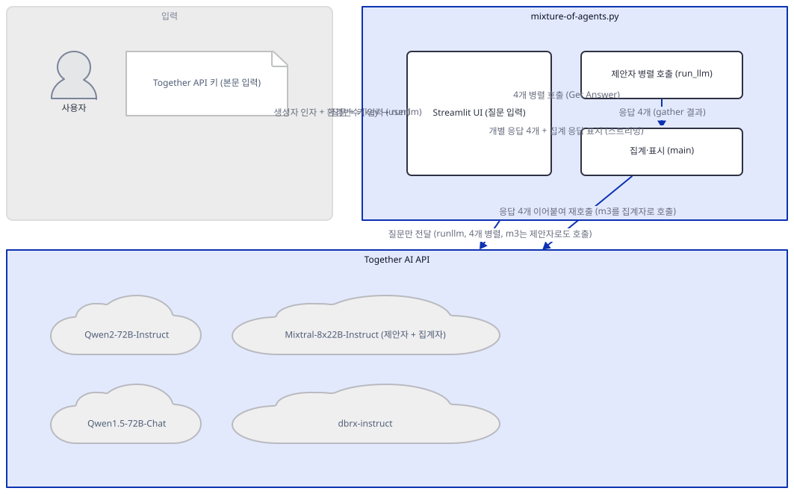
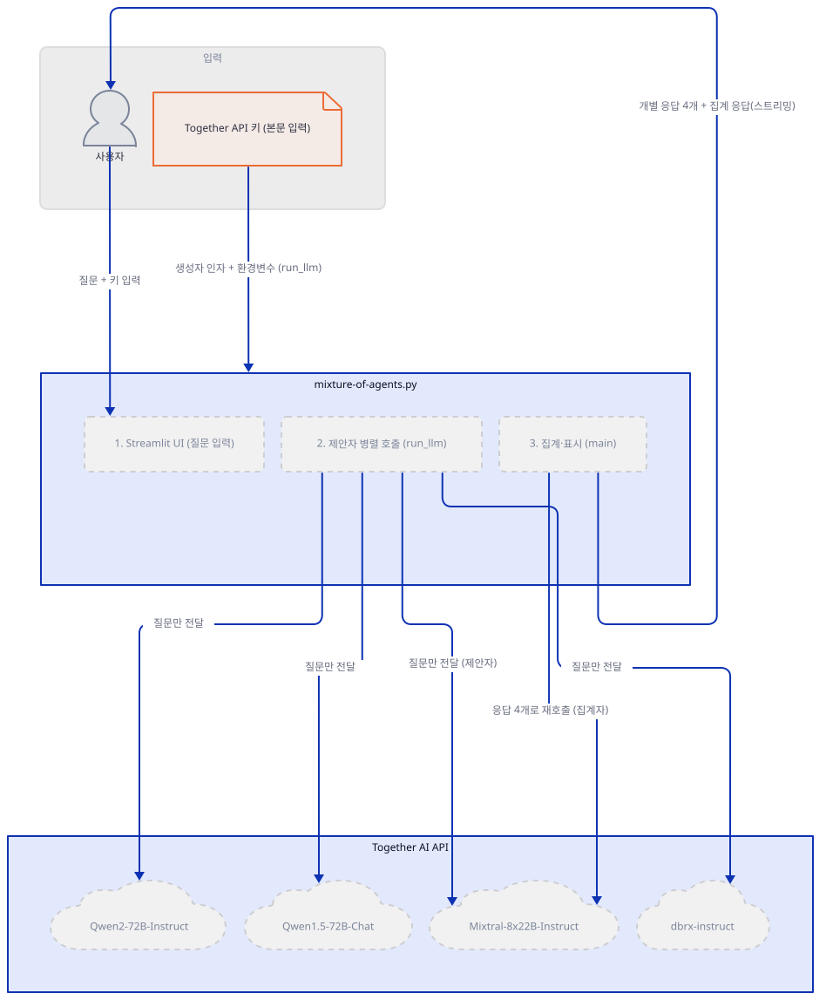
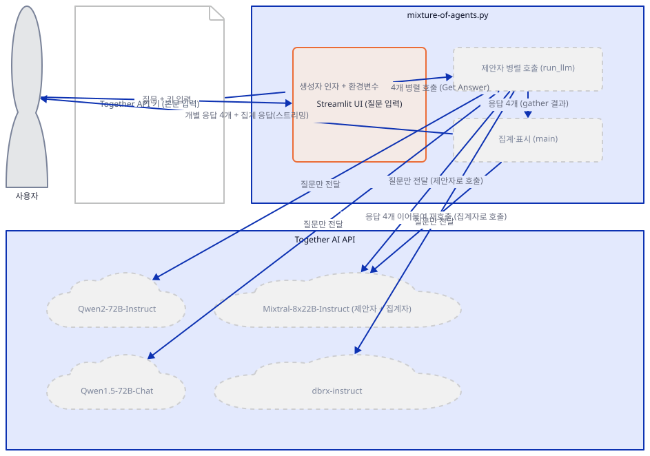
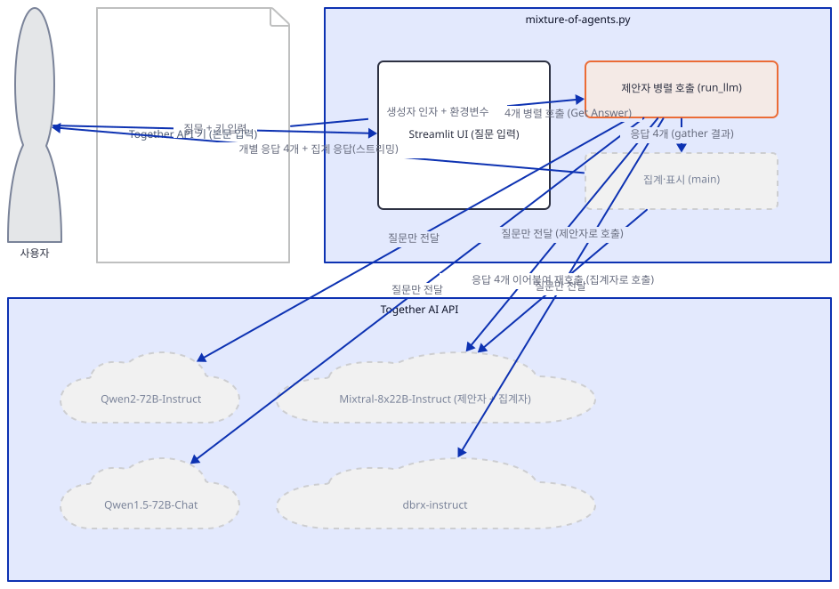
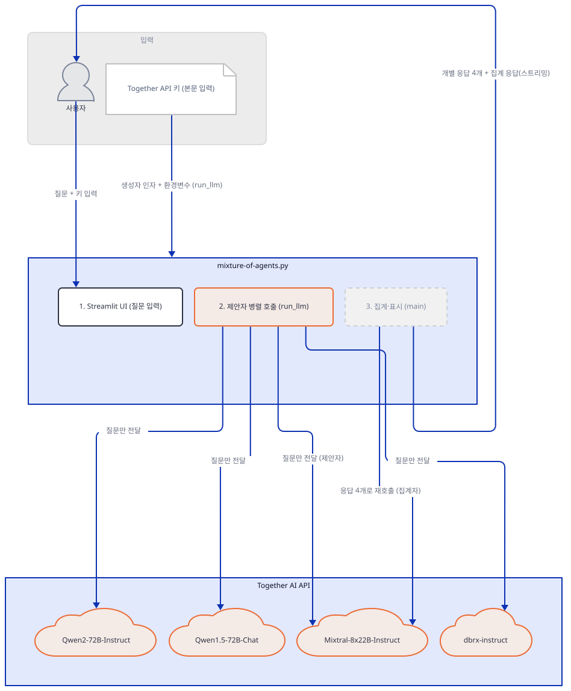
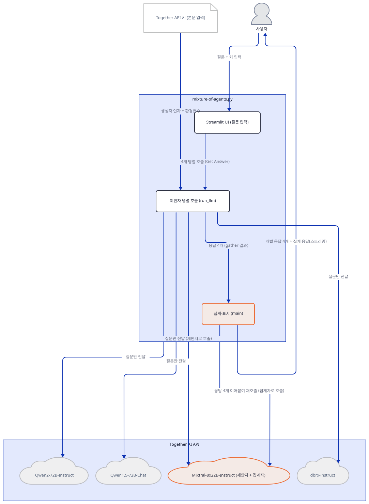
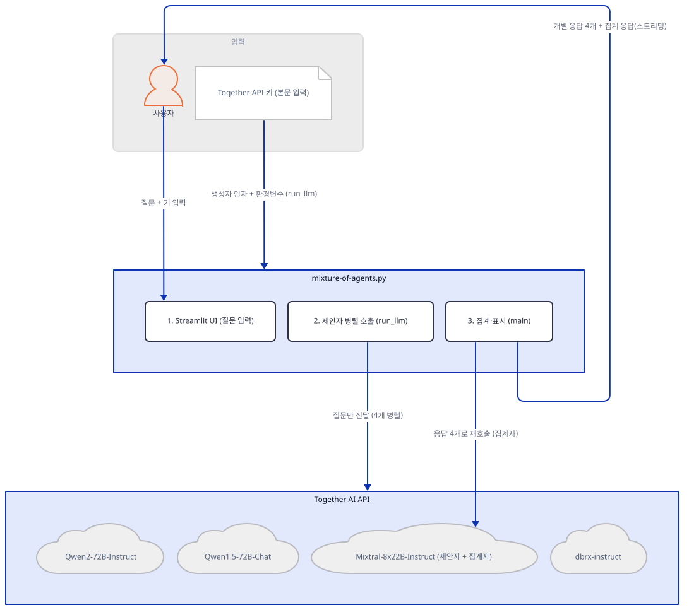
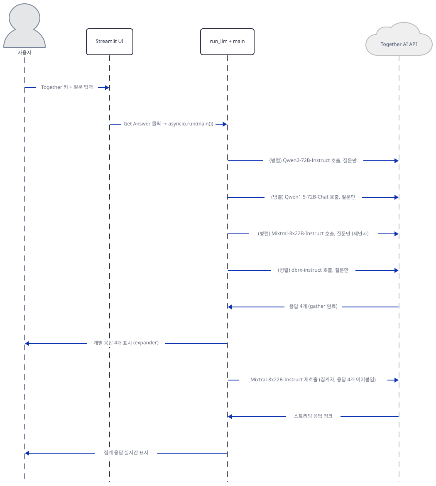

# Day 005 · 🔄 Mixture of Agents

> 볼륨 1 🌱 Starter AI Agents · 난이도 ★★☆ · 예상 소요 65분 · API 비용 대략 질문 1건에 Together AI 모델 호출 5회(제안자 4 + 집계자 1) 요금표 기준 수십~수백 원, 대략치 (키가 없어 실제 과금은 확인 못함) · 원본 앱: `starter_ai_agents/mixture_of_agents`

## 오늘 만들 것

이번 튜토리얼은 지금까지와 완전히 다른 패턴입니다 — agno도, `Agent`도, 도구 호출 루프도 없습니다. 대신 파이썬 표준 라이브러리 `asyncio`만으로 "여러 모델에게 같은 질문을 동시에 던지고, 그 답들을 다시 한 모델에게 모아서 합성시키는" **Mixture-of-Agents** 패턴을 직접 조립합니다. 서로 다른 오픈소스 모델 4개(Qwen2-72B-Instruct, Qwen1.5-72B-Chat, Mixtral-8x22B-Instruct-v0.1, dbrx-instruct) — 이 문서는 이들을 **제안자**라고 부릅니다 — 가 Together AI의 `AsyncTogether` 클라이언트로 동시에 호출되어 각자 원래 질문에만 답하고, 서로의 답은 전혀 보지 못합니다(단일 레이어 구성 — 레이어를 여러 겹 쌓아 다음 레이어가 이전 레이어의 답까지 보는 원 논문의 다층 구조를 이 앱이 그대로 구현하지는 않습니다). 이 4개 답은 쉼표로 이어붙여져 **집계자** 역할의 모델에게 다시 전달되고, 집계자는 "여러 모델의 답을 종합해 정제된 답 하나를 만들라"는 시스템 프롬프트와 함께 이를 받아 최종 답을 스트리밍으로 만들어냅니다. 이 앱의 핵심 반전은, 집계자로 쓰이는 모델(`mistralai/Mixtral-8x22B-Instruct-v0.1`)이 다름 아닌 4개 제안자 중 하나와 정확히 같은 모델이라는 점입니다(직접 확인) — 같은 모델이 한 번은 "네 명 중 한 명"으로, 한 번은 "심사위원"으로 두 번 불립니다. 이 폴더는 다른 4일과 달리 앱 자체 `README.md`가 없고, 엔트리 파일 이름도 `mixture-of-agents.py`로 하이픈이 들어 있어 `import`로 불러올 수 있는 유효한 파이썬 모듈명이 아닙니다(직접 확인) — 이 문서의 확인 명령들은 파일을 경로로 직접 실행하는 방식으로 이를 우회합니다. 완성하면 질문 하나를 넣어 4개 모델의 개별 답과, 그것을 합성한 최종 답을 함께 보는 화면을 로컬에서 띄우게 됩니다. 아래는 완성된 아키텍처입니다.



## 사전 준비

| 서비스/도구 | 용도 | 발급·설치 |
|---|---|---|
| Together AI API 키 | 제안자 모델 4개와 집계자 모델 1개 호출 인증. 본문 입력창에 직접 붙여넣는다(환경변수 아님 — 다만 입력 즉시 코드가 `TOGETHER_API_KEY` 환경변수로도 복사한다) | https://api.together.ai/settings/api-keys 가입 후 발급 |
| uv | 가상환경 생성과 패키지 설치 | [공통 사전 준비](../README.md#공통-사전-준비-한-번만) 절 참고 |
| 인터넷 연결 | Together AI API 접속 | 별도 설치 없음. 사내망이면 도메인 접속 허용 필요 |

## 아키텍처 한눈에 보기

| 컴포넌트 | 역할 | 코드 위치 |
|---|---|---|
| 사용자 | 키와 질문 입력 | 코드 없음 (브라우저) |
| Streamlit UI | 키·질문 입력을 받고 버튼과 결과를 표시 | `starter_ai_agents/mixture_of_agents/mixture-of-agents.py:7-10`, `starter_ai_agents/mixture_of_agents/mixture-of-agents.py:30` |
| 제안자 병렬 호출 (`run_llm`) | 4개 모델에 같은 질문을 동시에 보내 각자 답을 받음 | `starter_ai_agents/mixture_of_agents/mixture-of-agents.py:18-23`, `starter_ai_agents/mixture_of_agents/mixture-of-agents.py:32-40` |
| 집계·표시 (`main`) | 4개 답을 모아 보여주고, 그중 한 모델에 다시 합성을 요청해 스트리밍으로 표시 | `starter_ai_agents/mixture_of_agents/mixture-of-agents.py:42-69` |
| 외부 API (Together AI) | 오픈소스 모델 4개의 추론(제안)과, 그중 1개 모델의 재호출(집계)을 수행 | 코드 없음 (외부 서비스) |

## 단계별 진행

### Step 1. 환경 만들기

**목적.** 격리된 가상환경에 이 앱의 의존성을 설치하고, Together AI 키를 미리 발급받아 둡니다. 엔트리 파일을 평범한 `import`로 불러올 수 없다는 것도 미리 확인해 둡니다.

**할 일.**

```bash
cd starter_ai_agents/mixture_of_agents
uv venv
uv pip install -r requirements.txt
```

(pip을 쓴다면 `python -m venv .venv && source .venv/bin/activate && pip install -r requirements.txt`.)

`requirements.txt`는 `streamlit`과 `together` 두 줄뿐이고 지금까지 중 가장 느슨하게 버전 고정이 전혀 없습니다. 이 문서를 작성하며 설치했을 때는 **streamlit 1.63.0**, **together 2.33.2**가 받아졌습니다(직접 확인). 이 두 줄만으로 파일이 쓰는 모든 import가 성공합니다(추가 설치 불필요).

이 폴더에는 앱 자체 `README.md`가 없습니다. 그리고 엔트리 파일 이름 `mixture-of-agents.py`는 하이픈이 들어 있어 파이썬 식별자 규칙에 어긋납니다 — `import mixture-of-agents`는 `SyntaxError`입니다(직접 확인). `streamlit run`은 파일을 경로로 실행하므로 이 문제와 무관하지만, 이 문서의 나머지 확인 명령처럼 파일 내부 값을 파이썬에서 직접 들여다보려면 `runpy.run_path("mixture-of-agents.py")`로 파일을 경로째로 실행해 결과 네임스페이스를 얻는 방식을 씁니다.



**확인.**

```bash
uv run python -m py_compile mixture-of-agents.py && echo compiled
```

```
compiled
```

```bash
uv run python -c "import streamlit as st; import asyncio; import os; from together import AsyncTogether, Together; print('ok')"
```

```
ok
```

### Step 2. Streamlit 뼈대: 키 입력과 사이드바 설명

**목적.** 제목과 Together 키 입력창을 만들고, 화면 사이드바에 이 앱이 무엇을 하는지 설명하는 정적 텍스트를 채웁니다. 키가 없을 때의 안내 문구도 확인합니다.

**할 일.**

`starter_ai_agents/mixture_of_agents/mixture-of-agents.py:6-10`

```python
# Set up the Streamlit app
st.title("Mixture-of-Agents LLM App")

# Get API key from the user
together_api_key = st.text_input("Enter your Together API Key:", type="password")
```

`starter_ai_agents/mixture_of_agents/mixture-of-agents.py:77-78`

```python
else:
    st.warning("Please enter your Together API key to use the app.")
```

`starter_ai_agents/mixture_of_agents/mixture-of-agents.py:80-85`

```python
# Add some information about the app
st.sidebar.title("About this app")
st.sidebar.write(
    "This app demonstrates a Mixture-of-Agents approach using multiple Language Models (LLMs) "
    "to answer a single question."
)
```

Day 1~4와 달리 이 키는 사이드바가 아니라 본문에 있는 `st.text_input`(`starter_ai_agents/mixture_of_agents/mixture-of-agents.py:10`)으로 받습니다. 이 앱의 거의 모든 로직 — 클라이언트 생성부터 결과 표시까지 — 은 `if together_api_key:` 블록(`starter_ai_agents/mixture_of_agents/mixture-of-agents.py:12`) 안에 있고, 키가 비어 있으면 `starter_ai_agents/mixture_of_agents/mixture-of-agents.py:77-78`의 경고만 뜹니다. 사이드바(`starter_ai_agents/mixture_of_agents/mixture-of-agents.py:80-99`, 위 발췌는 그중 앞부분)는 이 흐름과 무관하게 항상 그려지는 순수한 설명용 정적 텍스트입니다.



**확인.** 앱 폴더에서 서버를 headless로 띄웁니다.

```bash
uv run streamlit run mixture-of-agents.py --server.headless true
```

다른 터미널에서:

```bash
curl -s -o /dev/null -w "%{http_code}\n" http://localhost:8501
```

```
200
```

(HTTP 200은 직접 확인. 제목·키 입력창·사이드바 설명만 보이고 질문 입력창은 아직 없으리라는 것은 `if` 가드 구조로 추론한 것이며, 화면을 직접 열어 확인하지는 못했습니다.)

### Step 3. 제안자 모델 4개와 클라이언트 정의

**목적.** 키가 들어오면 Together의 동기·비동기 클라이언트를 만들고, 실제로 호출할 제안자 모델 4개와 집계에 쓸 모델을 정의합니다. 집계 모델이 제안자 중 하나와 같다는 것을 실제로 확인합니다.

**할 일.**

`starter_ai_agents/mixture_of_agents/mixture-of-agents.py:12-15`

```python
if together_api_key:
    os.environ["TOGETHER_API_KEY"] = together_api_key
    client = Together(api_key=together_api_key)
    async_client = AsyncTogether(api_key=together_api_key)
```

`starter_ai_agents/mixture_of_agents/mixture-of-agents.py:17-24`

```python
    # Define the models
    reference_models = [
        "Qwen/Qwen2-72B-Instruct",
        "Qwen/Qwen1.5-72B-Chat",
        "mistralai/Mixtral-8x22B-Instruct-v0.1",
        "databricks/dbrx-instruct",
    ]
    aggregator_model = "mistralai/Mixtral-8x22B-Instruct-v0.1"
```

이 앱은 키를 환경변수(`os.environ["TOGETHER_API_KEY"]`)로도 설정하고, 동시에 `Together(api_key=...)`/`AsyncTogether(api_key=...)` 생성자 인자로도 직접 넘깁니다 — 지금까지 4일 중 두 방식을 한꺼번에 쓰는 유일한 경우입니다(실질적으로는 같은 값이라 차이가 없습니다). `Together`/`AsyncTogether` 생성자는 Day 1·3·4의 다른 클라이언트들처럼 이 시점에는 키를 검증하지 않습니다(직접 확인). `aggregator_model`은 `reference_models`의 세 번째 항목과 글자 그대로 같은 문자열입니다.



**확인.** 하이픈이 든 파일명을 `runpy`로 우회해서, 두 리스트가 실제로 겹치는지 파일 자체에서 직접 확인합니다.

```bash
uv run python -c "
import logging
logging.disable(logging.WARNING)
import streamlit as st
st.text_input = lambda *a, **k: 'fake-together-key'
st.button = lambda *a, **k: False
import runpy
ns = runpy.run_path('mixture-of-agents.py')
print(ns['reference_models'])
print(ns['aggregator_model'])
print(ns['aggregator_model'] in ns['reference_models'])
"
```

직접 확인한 출력:

```
['Qwen/Qwen2-72B-Instruct', 'Qwen/Qwen1.5-72B-Chat', 'mistralai/Mixtral-8x22B-Instruct-v0.1', 'databricks/dbrx-instruct']
mistralai/Mixtral-8x22B-Instruct-v0.1
True
```

(`st.text_input`을 가짜 키를 돌려주는 함수로 바꿔치기해 `if together_api_key:` 블록에 진입시킨 뒤, 파일을 경로로 실행해 실제 값을 그대로 읽었습니다 — 값을 다시 타이핑한 것이 아니라 파일 자체를 실행한 결과입니다.)

### Step 4. 제안자 병렬 호출 (`run_llm`)

**목적.** 각 제안자에게 실제로 무엇이 전달되는지 — 원래 질문뿐이고 서로의 답은 절대 보지 못한다는 것 — 와, `asyncio.gather`로 4개를 동시에 보내는 구조를 확인합니다.

**할 일.**

`starter_ai_agents/mixture_of_agents/mixture-of-agents.py:32-40`

```python
    async def run_llm(model):
        """Run a single LLM call with a reference model."""
        response = await async_client.chat.completions.create(
            model=model,
            messages=[{"role": "user", "content": user_prompt}],
            temperature=0.7,
            max_tokens=512,
        )
        return model, response.choices[0].message.content
```

`starter_ai_agents/mixture_of_agents/mixture-of-agents.py:43`

```python
        results = await asyncio.gather(*[run_llm(model) for model in reference_models])
```

`run_llm`이 보내는 `messages`는 `[{"role": "user", "content": user_prompt}]` 하나뿐입니다 — 다른 모델 이름도, 다른 모델의 답도 들어 있지 않습니다(직접 확인: 소스 어디에도 다른 모델의 응답을 참조하는 코드가 없음). 즉 4개 제안자는 서로의 존재를 모른 채 원래 질문에만 각자 답합니다. `asyncio.gather(*[run_llm(model) for model in reference_models])`는 4개의 코루틴을 동시에 스케줄링해 가장 느린 응답이 끝날 때까지만 기다립니다 — 하나씩 순서대로 호출하는 것이 아닙니다.



**확인.** 키가 없어 실제 응답은 재현하지 못했습니다. 대신 `run_llm`과 같은 호출을 유효하지 않은 키로 직접 실행해, 제안자 호출 하나가 실패하면 무엇이 돌아오는지 확인합니다.

```bash
uv run python -c "
import asyncio
from together import AsyncTogether
async_client = AsyncTogether(api_key='test-invalid-key')
async def run_llm(model, prompt):
    response = await async_client.chat.completions.create(
        model=model,
        messages=[{'role': 'user', 'content': prompt}],
        temperature=0.7,
        max_tokens=512,
    )
    return model, response.choices[0].message.content
try:
    print(asyncio.run(run_llm('Qwen/Qwen2-72B-Instruct', 'hello')))
except Exception as e:
    print(type(e).__name__)
    print(str(e)[:200])
"
```

직접 확인한 출력(발췌):

```
AuthenticationError
Error code: 401 - {'id': 'ozvKFa4-2kFHot-a39b0ac629d2ea9b', 'error': {'message': 'Invalid API key provided. You can find your API key at https://api.together.ai/settings/api-keys.', 'type': 'invalid_r
```

(`id` 값은 요청마다 무작위로 발급되는 것이라 실행마다 달라집니다.)

이 예외는 `try/except` 없이 그대로 위로 튀어 오릅니다. 앱 코드에는 `run_llm`이나 `asyncio.gather`를 감싸는 예외 처리가 전혀 없다는 점을 Step 6에서 다시 확인합니다.

### Step 5. 집계자 모델과 프롬프트 구성

**목적.** 4개 답을 어떻게 하나로 합치는지, 집계 모델에 실제로 무엇이 전달되는지를 정확히 확인합니다.

**할 일.**

`starter_ai_agents/mixture_of_agents/mixture-of-agents.py:26-27`

```python
    # Define the aggregator system prompt
    aggregator_system_prompt = """You have been provided with a set of responses from various open-source models to the latest user query. Your task is to synthesize these responses into a single, high-quality response. It is crucial to critically evaluate the information provided in these responses, recognizing that some of it may be biased or incorrect. Your response should not simply replicate the given answers but should offer a refined, accurate, and comprehensive reply to the instruction. Ensure your response is well-structured, coherent, and adheres to the highest standards of accuracy and reliability. Responses from models:"""
```

`starter_ai_agents/mixture_of_agents/mixture-of-agents.py:51-60`

```python
        # Aggregate responses
        st.subheader("Aggregated Response:")
        finalStream = client.chat.completions.create(
            model=aggregator_model,
            messages=[
                {"role": "system", "content": aggregator_system_prompt},
                {"role": "user", "content": ",".join(response for _, response in results)},
            ],
            stream=True,
        )
```

집계 모델에 실제로 전달되는 "user" 메시지는 `",".join(response for _, response in results)` — 즉 4개 답을 콤마로 이어붙인 텍스트뿐입니다. 원래 질문 텍스트도, 어느 모델이 무슨 답을 했는지도 이 메시지에는 없습니다(직접 확인: 소스 어디에도 `user_prompt`를 집계 호출에 다시 넣는 코드가 없음). 집계 모델은 `aggregator_system_prompt`가 설명하는 상황("여러 모델이 최신 사용자 질의에 답했다")과 답 4개만 보고, 원래 질문이 무엇이었는지는 답변 내용에서 스스로 짐작해야 합니다. 그리고 이 호출은 제안자 호출과 달리 비동기 `async_client`가 아니라 동기 `client`로 이루어집니다 — `main()`이 `async def`여도 이 한 줄에는 `await`가 없으므로(직접 확인), 스트림을 받는 동안 이벤트 루프가 그대로 블로킹됩니다.



**확인.** 키가 없어 실제 스트리밍 응답은 재현하지 못했습니다. 대신 같은 호출을 유효하지 않은 키와 가짜 응답 2개로 직접 실행해 확인합니다.

```bash
uv run python -c "
from together import Together
client = Together(api_key='test-invalid-key')
aggregator_system_prompt = 'You have been provided with a set of responses from various open-source models to the latest user query.'
results = [('Qwen/Qwen2-72B-Instruct', 'answer one'), ('databricks/dbrx-instruct', 'answer two')]
try:
    s = client.chat.completions.create(
        model='mistralai/Mixtral-8x22B-Instruct-v0.1',
        messages=[
            {'role': 'system', 'content': aggregator_system_prompt},
            {'role': 'user', 'content': ','.join(r for _, r in results)},
        ],
        stream=True,
    )
    for chunk in s:
        pass
except Exception as e:
    print(type(e).__name__)
    print(str(e)[:200])
"
```

직접 확인한 출력(발췌):

```
AuthenticationError
Error code: 401 - {'id': 'ozvKUDo-2kFHot-a39b0bd08f6cf45e', 'error': {'message': 'Invalid API key provided. You can find your API key at https://api.together.ai/settings/api-keys.', 'type': 'invalid_r
```

(`id` 값은 실행마다 달라집니다.)

제안자 호출(Step 4)과 집계자 호출 모두 같은 종류의 인증 오류를 그대로 돌려받는다는 것을 알 수 있습니다 — 두 호출 다 같은 Together API를 향하기 때문입니다.

### Step 6. 실행과 결과 표시

**목적.** "Get Answer"를 누르면 무슨 일이 벌어지는지 전체 흐름을 보고, 이 앱에는 예외 처리가 전혀 없어서 호출 5개(제안자 4 + 집계자 1) 중 하나라도 실패하면 화면 전체가 처리되지 않은 예외로 멈춘다는 것을 실제로 확인합니다.

**할 일.**

`starter_ai_agents/mixture_of_agents/mixture-of-agents.py:71-75`

```python
    if st.button("Get Answer"):
        if user_prompt:
            asyncio.run(main())
        else:
            st.warning("Please enter a question.")
```

버튼을 누르면 `asyncio.run(main())`이 전부입니다 — `try/except`가 어디에도 없습니다. `main()` 내부의 `asyncio.gather`는 `return_exceptions=True`를 주지 않았으므로(직접 확인), 4개 제안자 호출 중 하나라도 실패하면 나머지를 기다리지 않고 그 예외를 즉시 밖으로 던집니다. 그 예외는 `main()`을 거쳐 `asyncio.run(main())`까지, 그리고 그 위를 감싸는 코드가 없으므로 Streamlit의 미처리 예외 화면까지 그대로 올라갑니다. 개별 응답을 표시하는 `st.expander` 루프(`starter_ai_agents/mixture_of_agents/mixture-of-agents.py:47-49`)와 집계 스트리밍(`starter_ai_agents/mixture_of_agents/mixture-of-agents.py:51-69`)은 `results`를 무사히 받은 뒤에만 실행됩니다.



**확인.** 실제 화면은 키가 없어 재현하지 못했습니다. 대신 `mixture-of-agents.py`를 `runpy`로 직접 실행해 `main()` 전체를 유효하지 않은 키로 호출하고, 정말 예외가 그대로 튀어나오는지 확인합니다.

```bash
uv run python -c "
import logging
logging.disable(logging.WARNING)
import streamlit as st
answers = iter(['fake-together-key', 'What is 2+2?'])
st.text_input = lambda *a, **k: next(answers)
st.button = lambda *a, **k: False
st.subheader = lambda *a, **k: None
st.write = lambda *a, **k: None
st.expander = __import__('contextlib').nullcontext
st.empty = lambda *a, **k: type('X', (), {'markdown': lambda self, *a, **k: None})()
import runpy
ns = runpy.run_path('mixture-of-agents.py')
import asyncio
try:
    asyncio.run(ns['main']())
except Exception as e:
    print('EXCEPTION TYPE:', type(e).__name__)
    print('EXCEPTION TEXT:', str(e)[:200])
"
```

직접 확인한 출력:

```
EXCEPTION TYPE: AuthenticationError
EXCEPTION TEXT: Error code: 401 - {'id': 'ozvKs5Z-2kFHot-a39b0db28ac4f3ef', 'error': {'message': 'Invalid API key provided. You can find your API key at https://api.together.ai/settings/api-keys.', 'type': 'invalid_r
```

(`id` 값은 실행마다 달라집니다. `st.text_input`을 첫 호출엔 가짜 키를, 두 번째 호출엔 질문 문자열을 돌려주도록 바꿔치기하고, 화면 출력 계열 함수는 아무 것도 하지 않도록 비워 실제 `main()` 함수 객체를 그대로 호출했습니다. `except`로 감싼 것은 이 확인 스크립트이지, 리포 코드가 아닙니다 — 실제 앱이라면 이 지점에서 화면 전체가 멈춥니다.) 유효한 키가 있으면 이 자리에서 대신 4개의 `st.expander`와 실시간으로 채워지는 집계 응답이 표시됩니다.

## 요청 한 건이 흐르는 과정



사용자가 Together 키와 질문을 입력하고 "Get Answer"를 누르면 `asyncio.run(main())`이 호출됩니다. `main()`은 먼저 4개 제안자 모델에 **동시에** 요청을 보냅니다 — 그림에서는 순서대로 그려져 있지만 `asyncio.gather`가 실제로 스케줄링하는 것은 병렬 실행이며, 각 요청에는 원래 질문만 담기고 다른 모델의 존재나 답은 전혀 섞이지 않습니다. 네 응답이 모두 도착하면(`asyncio.gather`는 가장 느린 것까지 기다립니다) `main()`은 먼저 그 네 응답을 화면에 개별 `st.expander`로 보여준 다음, 그중 하나와 정확히 같은 모델(Mixtral-8x22B-Instruct-v0.1)에게 두 번째로 요청을 보냅니다 — 이번에는 "여러 모델의 답을 종합하라"는 시스템 프롬프트와, 원래 질문 없이 네 답을 콤마로 이어붙인 텍스트만 담아서입니다. 이 두 번째 요청은 비동기 클라이언트가 아니라 동기 클라이언트로 스트리밍 모드로 이루어지고, 도착하는 조각마다 화면의 같은 자리(`st.empty()`)에 이어 붙여 실시간으로 채워지는 것처럼 보여줍니다. 이 다섯 번의 호출 중 어느 하나라도 실패하면 — Step 4·5·6에서 직접 확인했듯 — 예외가 `try/except` 없이 그대로 위로 올라가 화면 전체가 멈춥니다. 이 시퀀스 자체(제안자 4개 병렬 호출과 그중 하나의 모델을 집계자로 재호출하는 구조)는 소스 코드를 그대로 실행해 각 구간을 개별적으로 확인한 것이며, 유효한 키가 없어 처음부터 끝까지 한 번에 이어지는 것을 직접 보지는 못했습니다.

## 실행 체크리스트

- [ ] Together AI API 키를 발급받아 두었다
- [ ] `uv venv && uv pip install -r requirements.txt`로 의존성을 설치했다(추가 설치 불필요)
- [ ] `import mixture-of-agents`가 `SyntaxError`가 난다는 것과, `runpy.run_path()`로 우회할 수 있다는 것을 확인했다
- [ ] `uv run streamlit run mixture-of-agents.py`로 서버를 띄우고 `http://localhost:8501`에서 화면을 확인했다
- [ ] `aggregator_model`이 `reference_models`의 세 번째 항목과 같다는 것을 코드로 확인했다
- [ ] 질문을 입력하고 "Get Answer"를 눌러 4개 개별 응답과 집계된 최종 응답을 확인했다
- [ ] 예외 처리가 없어 API 키가 잘못되면 화면 전체가 멈춘다는 것을 이해했다

## 문제 해결

| 증상 | 원인 | 해결 |
|---|---|---|
| `import mixture-of-agents`가 `SyntaxError: invalid syntax`로 실패 | 파일명에 하이픈이 있어 파이썬의 유효한 식별자가 아니다(직접 확인) | `streamlit run mixture-of-agents.py`처럼 경로로 실행하거나, 파이썬에서 내용을 확인해야 한다면 `runpy.run_path("mixture-of-agents.py")` 사용 |
| Together 키가 잘못되면 친절한 오류 메시지 대신 화면 전체가 처리되지 않은 예외로 멈춤(`AuthenticationError`, HTTP 401) | 버튼 클릭부터 `asyncio.run(main())`까지 `try/except`가 전혀 없고, `asyncio.gather`도 `return_exceptions=True` 없이 호출돼 제안자·집계자 호출 5개 중 하나만 실패해도 예외가 그대로 위로 전파된다(직접 확인) | 유효한 Together 키인지 다시 확인. 코드를 고친다면 버튼 블록 전체를 `try/except`로 감싸는 것을 고려 |
| 클라이언트 생성까지는 아무 오류 없이 성공해 키가 맞는 줄 알았는데, 정작 `run_llm`/집계 호출에서야 401 인증 오류가 남 | `Together`/`AsyncTogether`는 생성 시점에는 키를 검증하지 않는다(직접 확인, Step 3) — 실제 검증은 `chat.completions.create()` 호출 시점에 서버가 응답할 때 일어남 | 클라이언트 생성 성공을 키가 유효하다는 근거로 삼지 말고, Step 4·5의 방식대로 실제 호출까지 해봐야 함 |

## 더 해보기

- 실행 전에 https://api.together.ai/models 카탈로그에서 `reference_models`(`starter_ai_agents/mixture_of_agents/mixture-of-agents.py:18-23`)와 `aggregator_model`(`starter_ai_agents/mixture_of_agents/mixture-of-agents.py:24`)의 모델명 5개가 아직 서비스되는지 확인해보기 — Together는 종종 모델 슬러그를 폐지·교체하는데, 유효한 키가 없어 이 문서를 작성하는 시점에는 확인하지 못했다
- 버튼 블록(`starter_ai_agents/mixture_of_agents/mixture-of-agents.py:71-75`)을 `try/except`로 감싸 API 호출이 실패해도 `st.error()`로 우아하게 알리도록 고쳐보기
- `reference_models`(`starter_ai_agents/mixture_of_agents/mixture-of-agents.py:18-23`)에 다섯 번째 모델을 추가해 제안자를 5개로 늘리고, 집계 응답이 어떻게 달라지는지 비교해보기
- 집계자에게 원래 질문도 함께 보이도록 `starter_ai_agents/mixture_of_agents/mixture-of-agents.py:57`의 `",".join(...)` 부분을 "질문: {user_prompt}\n\n답변들: ..." 형태로 바꿔, 집계 응답의 품질이 달라지는지 실험해보기

## 다음 날 예고

Day 006 · 📊 AI Data Analysis Agent — CSV 파일을 업로드하면 판다스 코드를 직접 짜서 분석하는 에이전트를 다룹니다.
