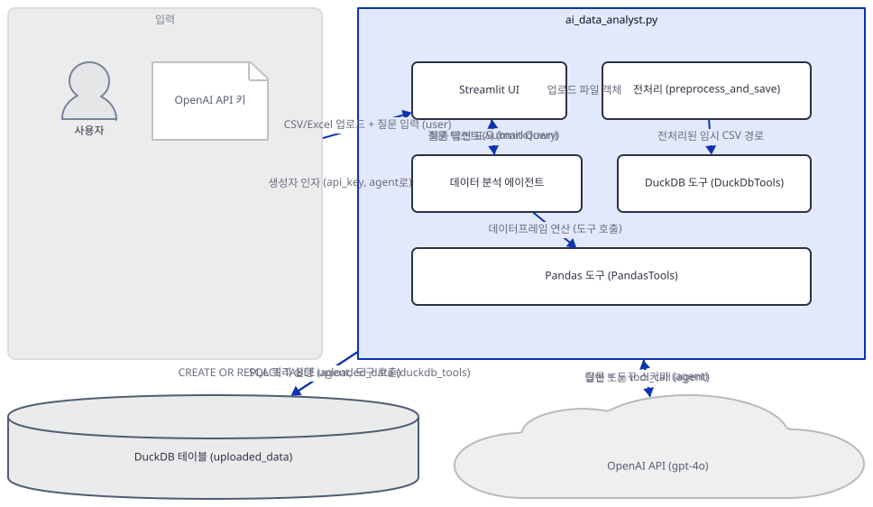
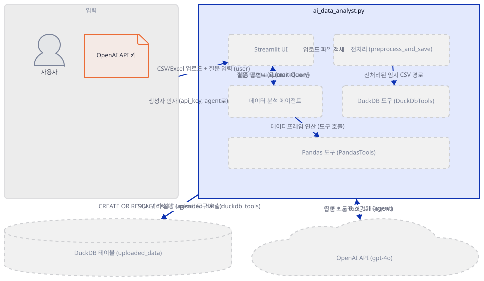
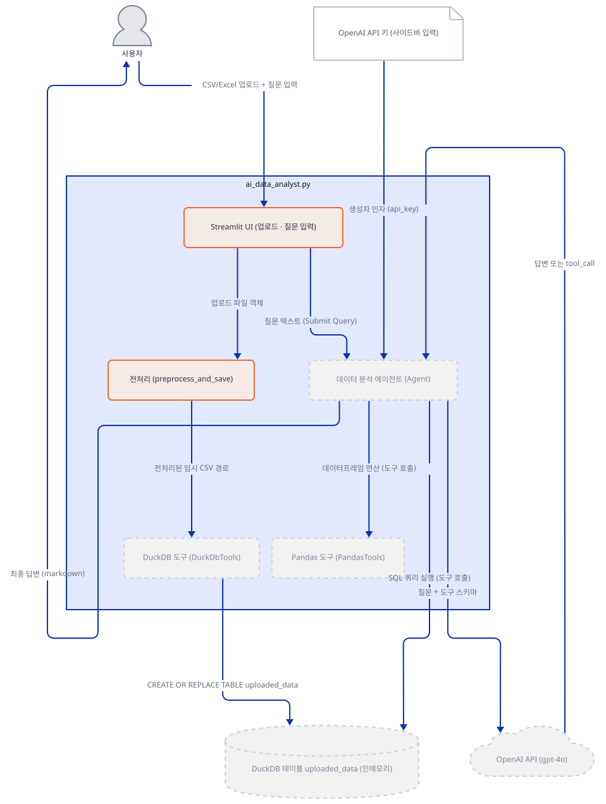
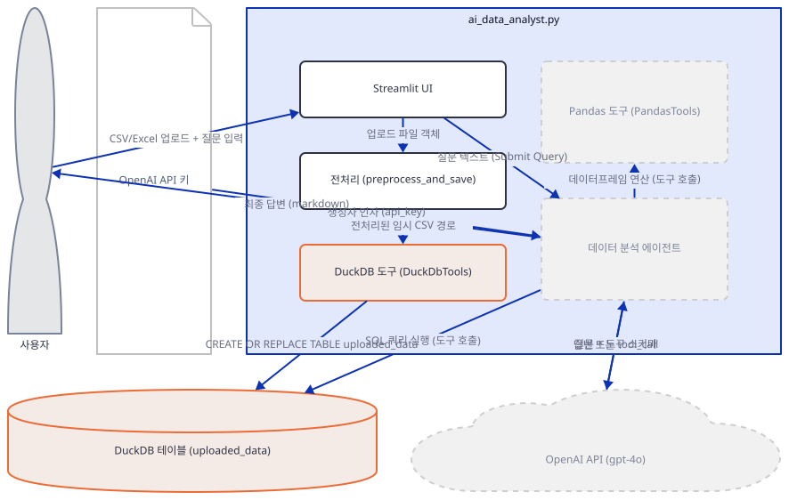
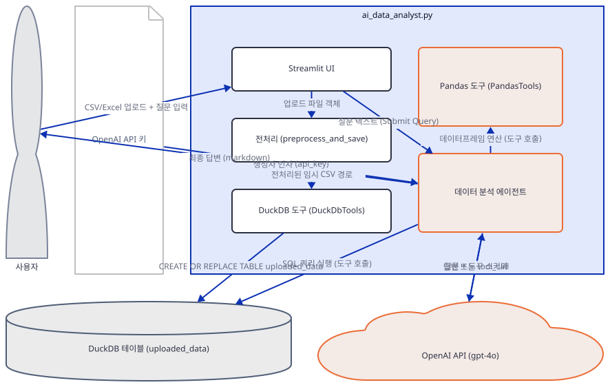
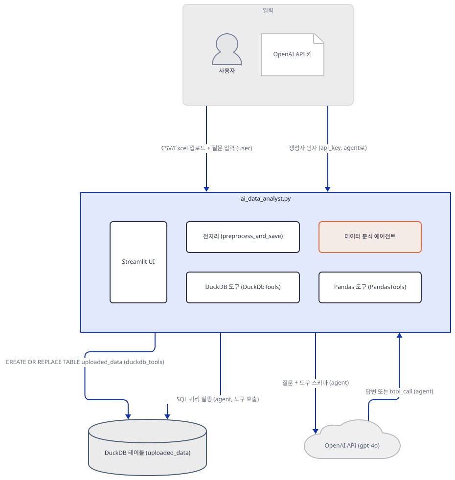
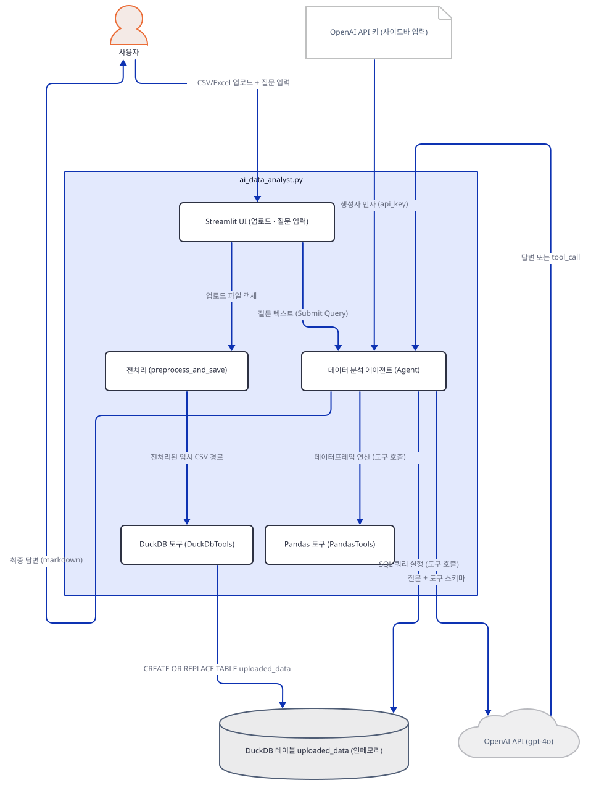
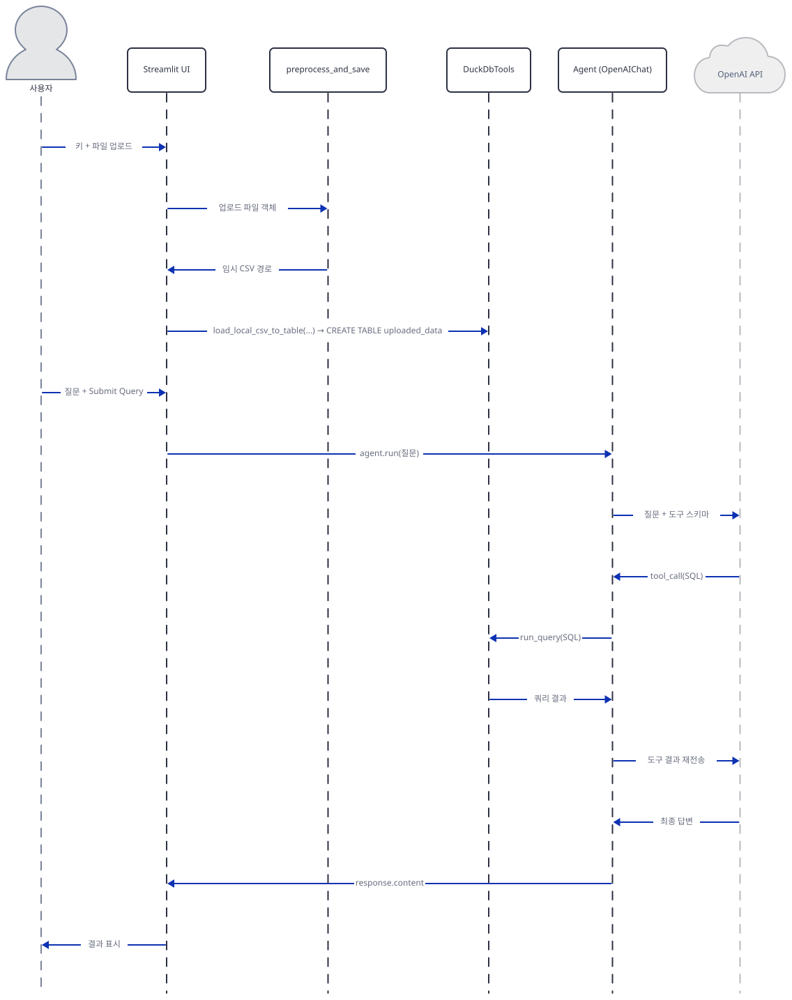

# Day 006 · 📊 AI Data Analysis Agent

> 볼륨 1 🌱 Starter AI Agents · 난이도 ★★☆ · 예상 소요 65분 · API 비용 대략 질문 1건에 OpenAI gpt-4o 요금표 기준 수십~수백 원 수준, 대략치 (키가 없어 실제 과금은 확인 못함) · 원본 앱: `starter_ai_agents/ai_data_analysis_agent`

## 오늘 만들 것

Day 1에서 만든 "모델 + 도구 + 서버" 3요소 구조(`starter_ai_agents/xai_finance_agent/xai_finance_agent.py`)를 다시 씁니다. 다만 이번 도구는 웹 검색이나 주가 조회가 아니라, LLM이 SQL을 직접 짜서 실행하게 해주는 **DuckDB**와 데이터프레임을 조작하는 **Pandas**입니다. CSV나 Excel 파일을 업로드하면, 에이전트가 자연어 질문을 SQL 질의로 바꿔 실행하고 결과를 요약해 돌려주는 "데이터 분석가"가 되는 셈입니다. 이 앱에서 가장 흥미로운 부분은 업로드된 파일이 DuckDB에 닿기까지의 경로입니다 — 업로드 파일이 곧바로 DuckDB로 들어가지 않고, 먼저 판다스가 읽어 날짜·숫자형 컬럼을 정리한 뒤 **완전히 새로운 임시 CSV 파일로 다시 저장**하고, DuckDB는 그 임시 CSV를 자기 방식대로 다시 파싱해 인메모리 테이블 `uploaded_data`를 만듭니다(직접 확인). 즉 원본 파일 한 번, 재작성한 CSV 한 번, 총 두 번의 파싱을 거칩니다. 키가 없어 실제 gpt-4o 응답은 볼 수 없었지만, 전처리부터 DuckDB 적재까지의 데이터 경로와 에이전트·도구 연결은 코드를 직접 실행해 전부 확인했습니다. 아래는 완성된 아키텍처입니다.



## 사전 준비

| 서비스/도구 | 용도 | 발급·설치 |
|---|---|---|
| OpenAI API 키 | gpt-4o 모델 호출 인증. 사이드바 입력창에 직접 붙여넣는다(환경변수 아님) | https://platform.openai.com/api-keys 가입 후 발급 |
| uv | 가상환경 생성과 패키지 설치 | [공통 사전 준비](../README.md#공통-사전-준비-한-번만) 절 참고 |
| 분석할 CSV/Excel 파일 | 업로드해 자연어로 질의할 원본 데이터 | 직접 준비하거나, Step 2 확인에서 쓰는 것과 같은 몇 줄짜리 CSV로도 충분 |
| 인터넷 연결 | OpenAI API 접속 | 별도 설치 없음. 사내망이면 도메인 접속 허용 필요 |

## 아키텍처 한눈에 보기

| 컴포넌트 | 역할 | 코드 위치 |
|---|---|---|
| 사용자 | OpenAI 키 입력, 파일 업로드, 질문 입력 | 코드 없음 (브라우저) |
| Streamlit UI | 제목·사이드바 키 입력·파일 업로더·질문 입력창·버튼 | `starter_ai_agents/ai_data_analysis_agent/ai_data_analyst.py:44-58`, `starter_ai_agents/ai_data_analysis_agent/ai_data_analyst.py:94`, `starter_ai_agents/ai_data_analysis_agent/ai_data_analyst.py:99` |
| 전처리 (preprocess_and_save) | 업로드 파일을 판다스로 읽어 날짜·숫자형 컬럼을 정리하고 새 임시 CSV로 다시 저장 | `starter_ai_agents/ai_data_analysis_agent/ai_data_analyst.py:11-42` |
| DuckDB 도구 (DuckDbTools) | 전처리된 CSV를 인메모리 DuckDB 테이블 `uploaded_data`로 적재하고, SQL 실행 함수 13개를 에이전트에 노출 | `starter_ai_agents/ai_data_analysis_agent/ai_data_analyst.py:72-79` |
| Pandas 도구 (PandasTools) | 데이터프레임 연산 함수 2개를 에이전트에 노출 | `starter_ai_agents/ai_data_analysis_agent/ai_data_analyst.py:8`, `starter_ai_agents/ai_data_analysis_agent/ai_data_analyst.py:84` |
| 데이터 분석 에이전트 (Agent) | 지시문에 따라 모델과 두 도구를 조합해 질문에 답함 | `starter_ai_agents/ai_data_analysis_agent/ai_data_analyst.py:82-87` |
| 외부 API (OpenAI gpt-4o) | 실제 추론과 SQL·Pandas 도구 호출 여부 판단을 수행하는 서드파티 서비스 | 코드 없음 (외부 서비스) |

## 단계별 진행

### Step 1. 환경 만들기

**목적.** 격리된 가상환경에 의존성을 설치하고, `requirements.txt`의 낡은 버전 고정 때문에 생기는 임포트 오류를 미리 없애 둡니다.

**할 일.**

```bash
cd starter_ai_agents/ai_data_analysis_agent
uv venv
uv pip install -r requirements.txt
uv pip install -U openai
```

(pip을 쓴다면 `python -m venv .venv && source .venv/bin/activate && pip install -r requirements.txt && pip install -U openai`.)

세 번째 설치 명령이 핵심입니다. `requirements.txt`는 `openai==1.58.1`로 고정하지만 `agno>=2.2.10`은 상한이 없어 최신 agno(이 문서를 쓰며 설치했을 때는 **agno 3.0.9**)를 받아오고, 이 버전의 `agno.models.openai`는 OpenAI의 Responses API 타입(`openai.types.responses`)을 임포트합니다 — 1.58.1에는 이 모듈이 없습니다(직접 확인). 그 결과 `from agno.models.openai import OpenAIChat`가 `ImportError`로 실패하며, 정확한 예외 문구는 "문제 해결"에 있습니다. `uv pip install -U openai`로 갱신하면(이 문서를 쓰며 설치했을 때는 **openai 3.13.0**) 해결됩니다. 나머지 패키지 중 `numpy==1.26.4`는 Python 3.12에는 사전 빌드된 wheel이 있어 순식간에 설치되지만, Python 3.13용 wheel은 PyPI에 없어 uv가 소스 배포판을 내려받아 로컬에서 직접 빌드합니다(uv 캐시에 `cp313` wheel이 방금 만들어진 것으로 직접 확인) — 실패하지는 않지만 몇 분 더 걸립니다. 이 문서의 나머지 확인은 모두 Python 3.12 가상환경에서 실행했습니다.



**확인.**

```bash
uv run python -c "import agno; print('ok')"
```

```
ok
```

### Step 2. Streamlit 뼈대와 업로드 전처리

**목적.** 제목·사이드바 키 입력·파일 업로더로 이루어진 화면 뼈대를 확인하고, 업로드된 파일이 어떻게 판다스 DataFrame으로, 다시 새 임시 CSV로 바뀌는지 봅니다.

**할 일.** 화면 뼈대부터 봅니다.

`starter_ai_agents/ai_data_analysis_agent/ai_data_analyst.py:48-55`

```python
with st.sidebar:
    st.header("API Keys")
    openai_key = st.text_input("Enter your OpenAI API key:", type="password")
    if openai_key:
        st.session_state.openai_key = openai_key
        st.success("API key saved!")
    else:
        st.warning("Please enter your OpenAI API key to proceed.")
```

제목(`ai_data_analyst.py:45`)과 파일 업로더(`ai_data_analyst.py:58`)는 사이드바 바깥에 있고, 이후 모든 로직은 `if uploaded_file is not None and "openai_key" in st.session_state:`(`ai_data_analyst.py:60`) 안에 있어 파일과 키가 둘 다 있어야 실행됩니다. 파일이 들어오면 `preprocess_and_save`가 형식을 나눠 읽습니다.

`starter_ai_agents/ai_data_analysis_agent/ai_data_analyst.py:14-20`

```python
        if file.name.endswith('.csv'):
            df = pd.read_csv(file, encoding='utf-8', na_values=['NA', 'N/A', 'missing'])
        elif file.name.endswith('.xlsx'):
            df = pd.read_excel(file, na_values=['NA', 'N/A', 'missing'])
        else:
            st.error("Unsupported file format. Please upload a CSV or Excel file.")
            return None, None, None
```

이어서 컬럼 이름에 "date"가 들어가면 날짜로, 그 외 문자열 컬럼은 숫자 변환을 시도합니다(`ai_data_analyst.py:23-31`, 변환에 실패하면 원래 값을 그대로 둠). 마지막으로 이 DataFrame을 **새 임시 파일**에 다시 씁니다.

`starter_ai_agents/ai_data_analysis_agent/ai_data_analyst.py:33-39`

```python
        # Create a temporary file to save the preprocessed data
        with tempfile.NamedTemporaryFile(delete=False, suffix=".csv") as temp_file:
            temp_path = temp_file.name
            # Save the DataFrame to the temporary CSV file with quotes around string fields
            df.to_csv(temp_path, index=False, quoting=csv.QUOTE_ALL)
        
        return temp_path, df.columns.tolist(), df  # Return the DataFrame as well
```

원본 업로드 파일은 여기서 쓰임을 다하고, 이후 모든 단계는 이 새 임시 CSV 경로(`temp_path`)를 씁니다. 원본 파일과 재작성된 CSV의 내용은 사실상 같지만, 모든 값이 문자열로 따옴표에 감싸여(`quoting=csv.QUOTE_ALL`) 저장되므로 다음 단계(DuckDB)는 이 텍스트를 처음부터 다시 해석해야 합니다.



**확인.** 먼저 서버 자체가 키 없이도 뜨는지 봅니다.

```bash
uv run streamlit run ai_data_analyst.py --server.headless true
```

다른 터미널에서:

```bash
curl -s -o /dev/null -w "%{http_code}\n" http://localhost:8501
```

```
200
```

다음으로 `preprocess_and_save`를 실제 파일 대신 이름만 흉내 낸 메모리 버퍼로 직접 호출해, 반환되는 컬럼과 타입을 확인합니다.

```bash
uv run python -c "
import io
from ai_data_analyst import preprocess_and_save
buf = io.BytesIO(b'name,age,score\nAlice,30,88.5\nBob,25,92.1\n')
buf.name = 'sample.csv'
temp_path, columns, df = preprocess_and_save(buf)
print(columns)
print(df.dtypes.to_dict())
"
```

Streamlit이 bare 모드 경고를 여러 줄 함께 출력하지만(무시해도 됨, 이 문서에서는 생략), 표준 출력 마지막 두 줄은 직접 확인한 아래 내용입니다.

```
['name', 'age', 'score']
{'name': dtype('O'), 'age': dtype('int64'), 'score': dtype('float64')}
```

### Step 3. DuckDB에 적재

**목적.** 전처리된 임시 CSV가 실제로 DuckDB 테이블이 되는 과정과, 이 DuckDB가 파일이 아니라 인메모리 데이터베이스라는 것을 직접 확인합니다.

**할 일.**

`starter_ai_agents/ai_data_analysis_agent/ai_data_analyst.py:72-79`

```python
        # Initialize DuckDbTools
        duckdb_tools = DuckDbTools()
        
        # Load the CSV file into DuckDB as a table
        duckdb_tools.load_local_csv_to_table(
            path=temp_path,
            table="uploaded_data",
        )
```

`DuckDbTools()`는 `db_path`를 지정하지 않으므로, 실제 연결은 첫 사용 시점에 `duckdb.connect()`를 인자 없이 호출해 만들어집니다(agno 소스 `agno/tools/duckdb.py`의 `connection` 프로퍼티 확인) — 이는 디스크 파일이 아니라 **프로세스 메모리 안에서만 존재하는 데이터베이스**입니다. `load_local_csv_to_table`은 `CREATE OR REPLACE TABLE uploaded_data AS SELECT * FROM read_csv(...)`를 실행해, Step 2에서 만든 임시 CSV를 DuckDB 자신의 CSV 파서(`auto_detect=true`)로 다시 읽어 들입니다. 즉 판다스가 한 번 정리한 타입 정보는 버려지고, DuckDB가 텍스트에서 타입을 새로 추론합니다.



**확인.** Step 2의 전처리 결과를 이어서 DuckDB에 적재하고, 실제로 쿼리되는지, 그리고 메모리 DB인지 확인합니다.

```bash
uv run python -c "
import io
from ai_data_analyst import preprocess_and_save
from agno.tools.duckdb import DuckDbTools
buf = io.BytesIO(b'name,age,score\nAlice,30,88.5\nBob,25,92.1\n')
buf.name = 'sample.csv'
temp_path, columns, df = preprocess_and_save(buf)
duckdb_tools = DuckDbTools()
duckdb_tools.load_local_csv_to_table(path=temp_path, table='uploaded_data')
print(duckdb_tools.run_query('SELECT * FROM uploaded_data'))
print([row[1] for row in duckdb_tools.connection.execute('PRAGMA database_list').fetchall()])
"
```

직접 확인한 출력(Streamlit 경고 생략):

```
INFO    Running: CREATE OR REPLACE TABLE uploaded_data AS SELECT * FROM read_csv('...', ignore_errors=false, auto_detect=true)
INFO    Running: SELECT * FROM uploaded_data
name,age,score
Alice,30,88.5
Bob,25,92.1
['memory']
```

(`CREATE OR REPLACE TABLE` 로그의 파일 경로는 `tempfile`이 매번 무작위 이름으로 만들므로 실행마다 달라집니다. 마지막 줄 `['memory']`가 인메모리 데이터베이스라는 증거입니다.)

### Step 4. 에이전트 정의: 모델과 도구

**목적.** 실제 추론을 맡을 모델과, 그 모델이 호출할 두 도구(DuckDB, Pandas)를 에이전트 하나로 묶습니다.

**할 일.**

`starter_ai_agents/ai_data_analysis_agent/ai_data_analyst.py:5-8`

```python
from agno.agent import Agent
from agno.models.openai import OpenAIChat
from agno.tools.duckdb import DuckDbTools
from agno.tools.pandas import PandasTools
```

`starter_ai_agents/ai_data_analysis_agent/ai_data_analyst.py:82-83`

```python
        data_analyst_agent = Agent(
            model=OpenAIChat(id="gpt-4o", api_key=st.session_state.openai_key),
```

도구는 `tools=[duckdb_tools, PandasTools()]`(`ai_data_analyst.py:84`)로 전달됩니다. `PandasTools()`가 노출하는 함수는 `create_pandas_dataframe`, `run_dataframe_operation` 두 개뿐이고(직접 확인), Step 3에서 확인한 `DuckDbTools()`의 13개 함수(`show_tables`, `describe_table`, `run_query` 등)와 합쳐 총 15개 함수의 이름·설명·파라미터 스키마가 모델에 전달됩니다. `OpenAIChat(...)` 생성 자체는 Day 1의 `xAI(...)`처럼 이 시점에는 키를 검증하지 않습니다(직접 확인).



**확인.**

```bash
uv run python -c "
from agno.models.openai import OpenAIChat
from agno.tools.duckdb import DuckDbTools
from agno.tools.pandas import PandasTools
from agno.agent import Agent
m = OpenAIChat(id='gpt-4o', api_key='fake-key-not-real')
print(m.id, m.provider)
print(sorted(PandasTools().functions))
agent = Agent(model=m, tools=[DuckDbTools(), PandasTools()])
print(len(agent.tools))
"
```

```
gpt-4o OpenAI
['create_pandas_dataframe', 'run_dataframe_operation']
2
```

### Step 5. 지시문과 출력 형식

**목적.** 에이전트가 어떤 테이블을 어떻게 다뤄야 하는지 알려주는 지시문과, 응답을 마크다운으로 렌더링할지를 정합니다.

**할 일.**

`starter_ai_agents/ai_data_analysis_agent/ai_data_analyst.py:85-87`

```python
            system_message="You are an expert data analyst. Use the 'uploaded_data' table to answer user queries. Generate SQL queries using DuckDB tools to solve the user's query. Provide clear and concise answers with the results.",
            markdown=True,
        )
```

이 `system_message`는 테이블 이름(`uploaded_data`)만 알려줄 뿐 컬럼 목록이나 타입은 담고 있지 않습니다(직접 확인: 문자열 어디에도 스키마 정보 없음). Day 1의 `instructions`가 리스트였던 것과 달리 여기서는 문자열 하나를 `system_message` 인자로 바로 받습니다. `markdown=True`는 Day 1과 동일하게 응답을 마크다운으로 렌더링하도록 지시합니다.



**확인.**

```bash
uv run python -c "
from agno.agent import Agent
from agno.models.openai import OpenAIChat
from agno.tools.duckdb import DuckDbTools
from agno.tools.pandas import PandasTools
agent = Agent(
    model=OpenAIChat(id='gpt-4o', api_key='fake-key-not-real'),
    tools=[DuckDbTools(), PandasTools()],
    system_message=\"You are an expert data analyst. Use the 'uploaded_data' table to answer user queries. Generate SQL queries using DuckDB tools to solve the user's query. Provide clear and concise answers with the results.\",
    markdown=True,
)
print(agent.name, len(agent.tools), agent.markdown)
"
```

```
None 2 True
```

(Day 1과 달리 이 `Agent(...)`에는 `name=` 인자가 없어 이름이 `None`입니다.)

### Step 6. 질문 입력과 실행

**목적.** "Submit Query"를 누르면 실제로 무슨 일이 벌어지는지, 그리고 키가 잘못되었을 때 이 앱의 예외 처리가 실제로는 작동하지 않는다는 것을 직접 확인합니다.

**할 일.**

`starter_ai_agents/ai_data_analysis_agent/ai_data_analyst.py:99-107`

```python
        if st.button("Submit Query"):
            if user_query.strip() == "":
                st.warning("Please enter a query.")
            else:
                try:
                    # Show loading spinner while processing
                    with st.spinner('Processing your query...'):
                        # Get the response from the agent
                        response = data_analyst_agent.run(user_query)
```

응답에 `content` 속성이 있으면 그 값을, 없으면 문자열로 바꾼 값을 `st.markdown()`으로 표시합니다(`ai_data_analyst.py:110-116`). 문제는 그 아래 예외 처리입니다.

`starter_ai_agents/ai_data_analysis_agent/ai_data_analyst.py:119-121`

```python
                except Exception as e:
                    st.error(f"Error generating response from the agent: {e}")
                    st.error("Please try rephrasing your query or check if the data format is correct.")
```

키가 잘못돼도 `agent.run()`은 파이썬 예외를 던지지 않고 `RunStatus.error` 상태의 응답 객체를 반환합니다(직접 확인, 아래) — 이 객체에도 `content` 속성이 있으므로, 위 `except` 블록은 전혀 실행되지 않고 OpenAI의 원본 오류 문구가 `st.error()`의 빨간 박스가 아니라 **평범한 마크다운 텍스트로 그대로 화면에 표시**됩니다.



**확인.** 실제 화면은 키가 없어 재현하지 못했습니다. 대신 Step 5의 에이전트를 유효하지 않은 키로 그대로 실행합니다.

```bash
uv run python -c "
from agno.agent import Agent
from agno.models.openai import OpenAIChat
from agno.tools.duckdb import DuckDbTools
from agno.tools.pandas import PandasTools
agent = Agent(
    model=OpenAIChat(id='gpt-4o', api_key='sk-fake-not-a-real-key'),
    tools=[DuckDbTools(), PandasTools()],
    system_message=\"You are an expert data analyst. Use the 'uploaded_data' table to answer user queries. Generate SQL queries using DuckDB tools to solve the user's query. Provide clear and concise answers with the results.\",
    markdown=True,
)
resp = agent.run('hello')
print('status:', resp.status)
print('has content attr:', hasattr(resp, 'content'))
print('content:', resp.content)
"
```

직접 확인한 출력:

```
ERROR   API status error from OpenAI API: Error code: 401 - {'error': {'message': 'Incorrect API key provided: sk-fake-**********-key. You can find your API key at https://platform.openai.com/account/api-keys.', 'type': 'invalid_request_error', 'code': 'invalid_api_key', 'param': None}, 'status': 401}
ERROR   Non-retryable model provider error: Incorrect API key provided: sk-fake-**********-key. You can find your API key at https://platform.openai.com/account/api-keys.
ERROR   Error in Agent run: Incorrect API key provided: sk-fake-**********-key. You can find your API key at https://platform.openai.com/account/api-keys.
status: RunStatus.error
has content attr: True
content: Incorrect API key provided: sk-fake-**********-key. You can find your API key at https://platform.openai.com/account/api-keys.
```

파이썬 예외(traceback)는 전혀 발생하지 않고, `ERROR` 로그 세 줄은 agno 내부 로거가 남긴 것입니다. 유효한 키가 있으면 이 자리에서 대신 실제 SQL 실행 로그와 함께 분석 결과가 마크다운으로 표시됩니다.

## 요청 한 건이 흐르는 과정



파일 업로드와 질문 실행은 시점이 다른 두 흐름입니다. 파일을 올리는 순간 `preprocess_and_save`와 `load_local_csv_to_table`이 곧바로 실행되어, 질문을 입력하기도 전에 `uploaded_data` 테이블이 인메모리 DuckDB에 만들어집니다. 이후 사용자가 질문을 넣고 "Submit Query"를 누르면 `agent.run(질문)`이 호출되고, 에이전트는 시스템 메시지와 15개 도구 함수의 스키마를 gpt-4o에 함께 보냅니다. 시스템 메시지에는 테이블 이름만 있고 컬럼 구성이 없으므로, 모델이 곧바로 분석 SQL을 만들기보다 `show_tables`나 `describe_table` 같은 도구를 먼저 호출해 스키마를 알아낼 가능성이 높습니다 — 이 부분은 도구 목록과 시스템 메시지 문구로부터 추론한 것이며, 키가 없어 실제 호출 순서까지 확인하지는 못했습니다. 스키마를 파악한 뒤에는 `run_query`로 실제 SQL을 실행해 결과를 받고, 그 결과를 근거로 gpt-4o가 최종 답을 마크다운으로 작성해 돌려줍니다. Day 1의 도구 호출 루프와 같은 구조이지만, 도구가 고정된 API 하나가 아니라 SQL이라는 범용 언어라서 왕복 횟수를 예측하기 더 어렵다는 점이 다릅니다.

## 실행 체크리스트

- [ ] OpenAI API 키를 발급받아 두었다
- [ ] `uv venv && uv pip install -r requirements.txt`로 기본 의존성을, `uv pip install -U openai`로 openai를 최신으로 갱신했다
- [ ] `uv run streamlit run ai_data_analyst.py`로 서버를 띄우고 `http://localhost:8501`에서 화면을 확인했다
- [ ] 사이드바에 OpenAI 키를 입력하고 CSV 또는 Excel 파일을 업로드했다
- [ ] 업로드된 데이터가 표로 표시되고 컬럼 목록이 나오는 것을 확인했다
- [ ] 질문을 입력하고 "Submit Query"를 눌러 응답을 확인했다
- [ ] 터미널 로그에서 `run_query` 등 DuckDB 도구가 실행한 SQL을 확인했다

## 문제 해결

| 증상 | 원인 | 해결 |
|---|---|---|
| `from agno.models.openai import OpenAIChat` 시 `ModuleNotFoundError: No module named 'openai.types.responses'`에 이어 ``ImportError: `openai` not installed. Please install using `pip install openai -U`` `` | `requirements.txt`가 `openai==1.58.1`로 고정하지만 `agno>=2.2.10`은 상한이 없어 최신 agno(직접 설치 시점 3.0.9)를 받으며, 이 버전의 OpenAI 연동이 `openai.types.responses`(Responses API 타입)를 요구한다 — 1.58.1에는 없음(직접 확인) | `uv pip install -U openai` 실행(직접 설치 시점 openai 3.13.0으로 갱신됨) |
| Python 3.13 가상환경에서 `uv pip install -r requirements.txt`가 몇 분간 멈춘 것처럼 보임 | `numpy==1.26.4`는 PyPI에 Python 3.13용 사전 빌드 wheel이 없다(3.11·3.12용은 있음). uv가 소스 배포판을 내려받아 로컬에서 빌드하느라 시간이 걸린다(uv 캐시에서 방금 빌드된 cp313 wheel을 직접 확인) | 실패는 아니므로 기다리면 끝난다. 시간을 아끼려면 `uv venv --python 3.12` 사용 |
| OpenAI 키가 틀려도 화면에 `st.error()`의 빨간 오류 상자 대신 평범한 텍스트로 인증 오류 문구가 그대로 표시됨 | `agent.run()`이 모델 인증 오류를 파이썬 예외로 던지지 않고 `RunStatus.error` 응답 객체로 감싸 반환한다(직접 확인, Step 6) — `ai_data_analyst.py:119-121`의 `except Exception`은 이 경우 실행되지 않는다 | 화면에 뜬 텍스트가 정상 답변인지 오류 메시지인지 내용을 읽고 판단해야 함 |
| 앱 `README.md`의 Features/Usage에 "데이터 시각화 생성"·"생성된 시각화 보기"라고 안내됨 | 실제 코드에는 시각화 관련 코드가 전혀 없다 — `plot`/`chart`/`matplotlib`/`plotly` 문자열이 소스에 한 번도 나오지 않음(직접 확인). 에이전트 응답은 `st.markdown()`으로 텍스트만 표시된다(`ai_data_analyst.py:116`) | 그 문구는 무시. 차트가 필요하면 별도로 시각화 코드를 직접 추가해야 함 |

## 더 해보기

- `system_message`(`starter_ai_agents/ai_data_analysis_agent/ai_data_analyst.py:85`)에 "반드시 한국어로 답하라"를 추가해 응답 언어가 바뀌는지 확인해보기
- 컬럼명을 `date`가 들어가지 않는 이름(예: `created_at`)으로 바꿔, 날짜 자동 변환 로직(`ai_data_analyst.py:24-25`)이 이를 놓치고 문자열로 남겨두는지 실험해보기
- Step 3의 확인 스크립트에 이어 `duckdb_tools.summarize_table("uploaded_data")`나 `duckdb_tools.describe_table("uploaded_data")`를 직접 호출해, 에이전트 없이도 어떤 요약이 나오는지 비교해보기

## 다음 날 예고

[Day 007 · 😂 AI Meme Generator Agent (Browser)](../day007-ai-meme-generator-agent-browseruse/README.md) — browser-use로 실제 브라우저를 조작해 밈을 만드는 에이전트를 다룹니다.
