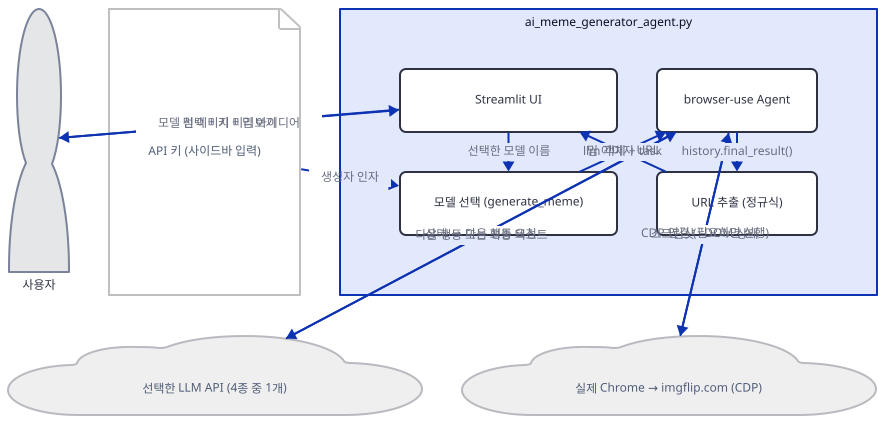
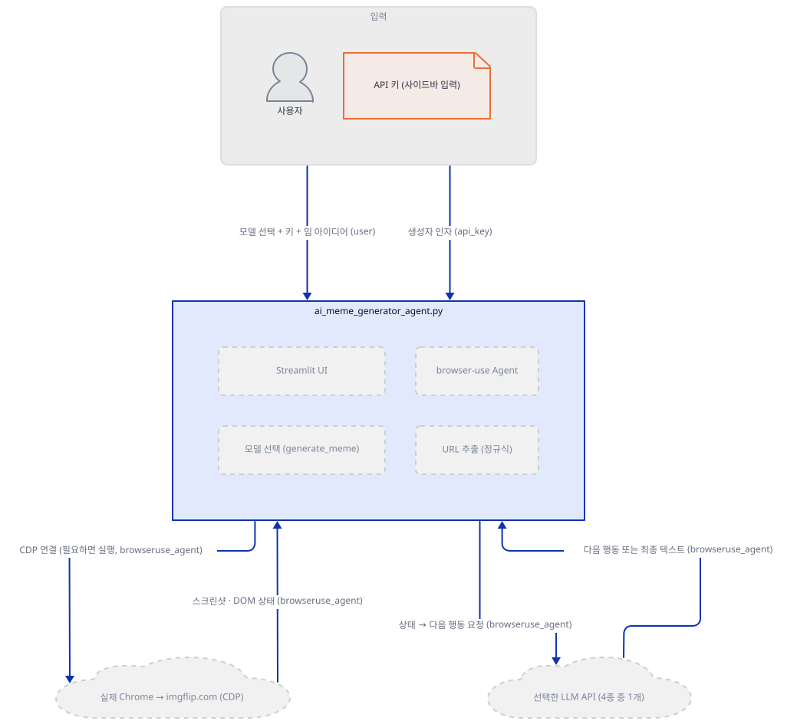
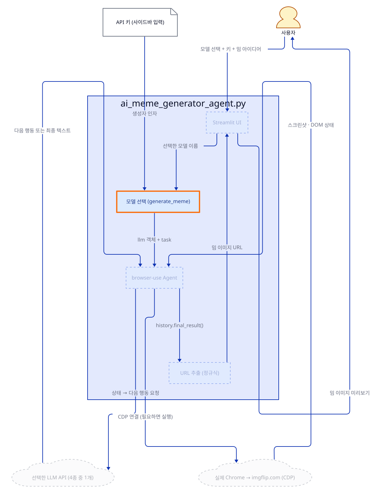
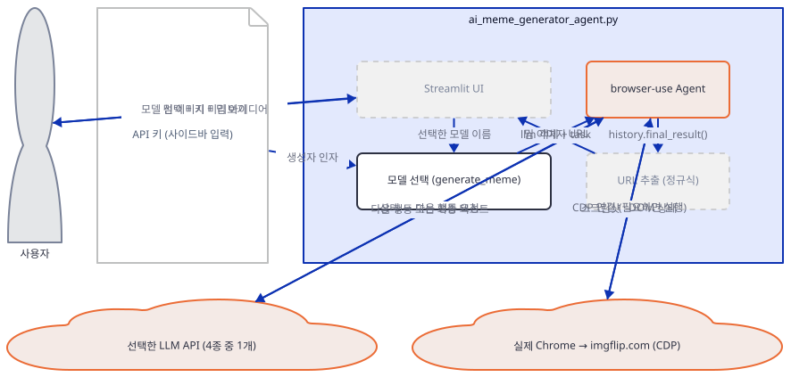
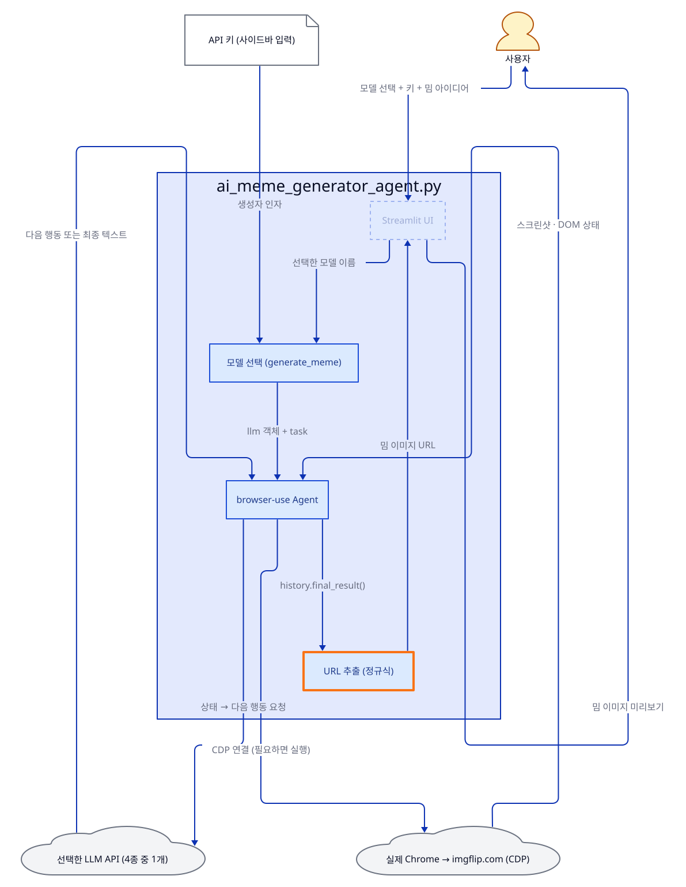
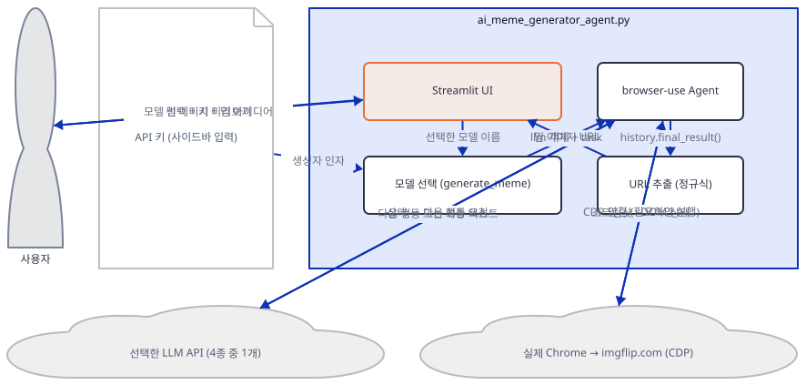
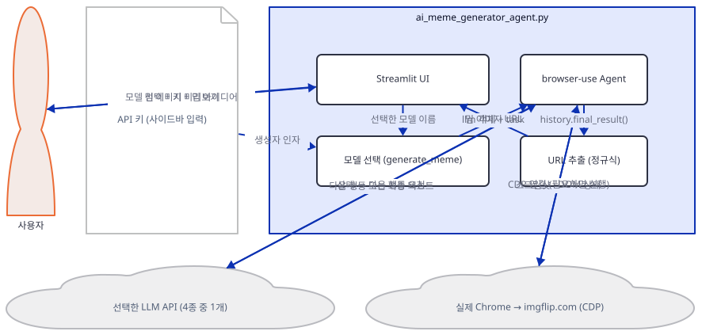
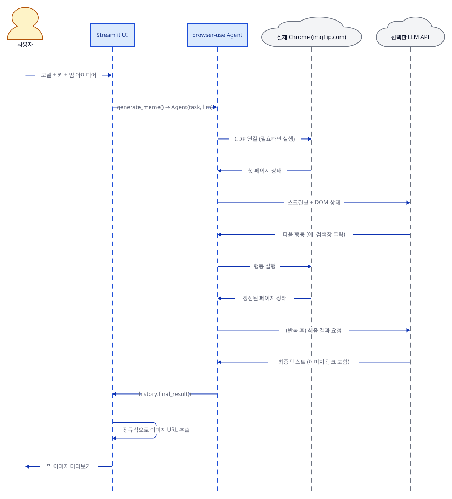

# Day 007 · 😂 AI Meme Generator Agent (Browser)

> 볼륨 1 🌱 Starter AI Agents · 난이도 ★★☆ · 예상 소요 70분 · API 비용 대략 선택한 모델(Claude/GPT-4o/Deepseek/Gemini) 1건당 화면 스크린샷을 여러 차례 주고받으므로 텍스트 전용 챗봇보다 비쌈, 대략치 (키가 없어 실제 과금은 확인 못함) · 원본 앱: `starter_ai_agents/ai_meme_generator_agent_browseruse`

## 오늘 만들 것

지금까지 6일은 모두 agno의 `Agent`였습니다. 오늘은 완전히 다른 프레임워크인 **browser-use**의 `Agent`를 씁니다 — 도구 목록을 선언하는 대신, "imgflip.com에 가서 검색하고, 템플릿을 고르고, 텍스트를 넣고, 생성 버튼을 눌러라"는 자연어 지시문 하나를 주면 에이전트가 실제 브라우저 화면을 스크린샷으로 보며 클릭·타이핑을 스스로 결정합니다. 이 앱은 Claude, GPT-4o, Deepseek, Gemini 네 모델 중 하나를 골라 쓸 수 있고, 이 문서에서 가장 중요하게 다루는 사실은 따로 있습니다: 앱 자체 `README.md`는 `playwright install`로 브라우저를 설치하라고 안내하지만, `pyproject.toml`이 고정한 **browser-use 0.13.8은 Playwright에 전혀 의존하지 않습니다**(직접 확인: `uv.lock`에 `playwright` 패키지가 아예 없음) — 대신 `browser-harness`라는 자체 도구가 CDP(Chrome DevTools Protocol)로 **여러분이 실제로 쓰는 Chrome**에 곧바로 연결하거나 필요하면 그 Chrome을 직접 실행합니다(직접 확인, 아래 Step 1). 이 문서의 확인 명령들은 이 사실 때문에 한 가지를 의도적으로 하지 않습니다 — 실제 `agent.run()` 호출입니다. 유효하지 않은 키로도 이 호출은 실제로 여러분의 Chrome을 열거나 전환해 imgflip.com으로 이동시키므로, 이 문서에서는 그 앞뒤 구성 요소(모델 생성, 에이전트 생성, 결과 파싱, 화면 흐름)만 직접 실행해 확인하고 전체 실행은 코드와 `--doctor` 진단 결과로 설명합니다. 아래는 완성된 아키텍처입니다.



## 사전 준비

| 서비스/도구 | 용도 | 발급·설치 |
|---|---|---|
| API 키 (Claude/Deepseek/OpenAI/Gemini 중 1개) | 사이드바에서 고른 모델 호출 인증. 해당 서비스 키 입력창만 나타남(환경변수 아님) | Claude → https://console.anthropic.com, Deepseek → https://platform.deepseek.com, OpenAI → https://platform.openai.com, Gemini → https://aistudio.google.com/app/api-keys |
| Google Chrome(또는 Chromium) | browser-use 0.13.8이 CDP로 직접 연결·조작하는 실제 브라우저. Playwright 같은 별도 브라우저 바이너리 설치가 필요 없음(직접 확인) | 이미 설치돼 있지 않다면 https://www.google.com/chrome/ 에서 설치 |
| uv | 프로젝트 동기화(`uv sync`)와 실행 | [공통 사전 준비](../README.md#공통-사전-준비-한-번만) 절 참고 |
| 인터넷 연결 | 선택한 LLM API와 imgflip.com 접속 | 별도 설치 없음 |

⚠️ 실제로 "Generate Meme"을 누르면 **진짜 Chrome 창**이 열리거나 전환되어 imgflip.com을 자동으로 조작합니다. 다른 작업 중인 탭이 있다면 미리 저장해 두세요.

## 아키텍처 한눈에 보기

| 컴포넌트 | 역할 | 코드 위치 |
|---|---|---|
| 사용자 | 모델 선택, API 키 입력, 밈 아이디어 입력 | 코드 없음 (브라우저) |
| Streamlit UI | 제목·모델 선택·키 입력·아이디어 입력·버튼 | `starter_ai_agents/ai_meme_generator_agent_browseruse/ai_meme_generator_agent.py:72-100`, `starter_ai_agents/ai_meme_generator_agent_browseruse/ai_meme_generator_agent.py:105-117` |
| 모델 선택 (generate_meme) | `model_choice`에 따라 4개 LLM 클라이언트 중 하나를 생성 | `starter_ai_agents/ai_meme_generator_agent_browseruse/ai_meme_generator_agent.py:6-33` |
| browser-use Agent | 자연어 과제 설명을 실제 브라우저 조작(클릭·타이핑·스크린샷)으로 바꿔 실행 | `starter_ai_agents/ai_meme_generator_agent_browseruse/ai_meme_generator_agent.py:48-56` |
| URL 추출 (정규식) | 에이전트의 최종 텍스트에서 imgflip 이미지 링크를 정규식으로 뽑아냄 | `starter_ai_agents/ai_meme_generator_agent_browseruse/ai_meme_generator_agent.py:58-66` |
| 선택한 LLM API (Anthropic·OpenAI·Deepseek·Gemini 중 1개) | 스크린샷과 페이지 상태를 보고 다음 브라우저 행동을 결정 | 코드 없음 (외부 서비스) |
| 실제 Chrome (CDP) | browser-use가 CDP로 직접 연결·조작하는 로컬 브라우저, imgflip.com 접속 | 코드 없음 (로컬 실행 프로그램) |

## 단계별 진행

### Step 1. 환경 만들기

**목적.** 이 앱이 처음으로 갖게 된 `pyproject.toml`/`uv.lock`/`.python-version`으로 의존성을 재현 가능하게 설치하고, 앱 README의 브라우저 설치 안내가 낡았다는 것을 직접 확인합니다.

**할 일.**

```bash
cd starter_ai_agents/ai_meme_generator_agent_browseruse
uv sync
```

(pip을 쓴다면 `pip install -r requirements.txt`이지만, 아래 이유로 `uv sync`를 권합니다.)

`pyproject.toml`은 `requires-python = "==3.11.*"`로 **정확히 3.11**만 허용하고, `.python-version`도 `3.11`입니다. `uv sync`는 이 둘과 `uv.lock`을 함께 읽어 Python 3.11 가상환경(`.venv`)을 만들고 잠긴 버전 그대로 설치합니다(로컬에 3.11이 없으면 uv가 자동으로 내려받음). 반면 `requirements.txt`(`streamlit`, `browser-use==0.13.8` 두 줄뿐)를 아무 버전에 `uv pip install -r requirements.txt`로 설치하면 `==3.11.*` 제약이 전혀 적용되지 않아 — 직접 확인한 바로 **Python 3.12에서도 그냥 설치되고 잘 임포트됩니다** — 다만 `uv.lock`이 고정한 것과 다른 버전(예: streamlit)이 잡힐 수 있습니다. 이 문서의 나머지 확인은 모두 `uv sync`가 만든 Python 3.11 환경에서 실행했습니다.

앱 `README.md`의 "Running with uv" 절은 그다음으로 `uv run playwright install --with-deps`를 안내합니다. 실행해 보면:

```
error: Failed to spawn: `playwright`
  Caused by: program not found
```

`uv.lock`을 직접 확인하면 `browser-use`(0.13.8)의 의존성 목록에 `playwright`가 아예 없고, 대신 `browser-harness`·`cdp-use`라는 패키지가 있습니다. 즉 이 버전의 browser-use는 Playwright로 브라우저를 내려받아 관리하던 예전 방식을 버리고, CDP로 **여러분의 로컬 Chrome에 직접 연결**하는 방식으로 바뀌었습니다 — 별도 설치 명령의 필요 여부를 `browser-use` 자체의 진단 도구로 확인합니다.

```bash
uv run browser-use --doctor
```

이 문서를 쓴 컴퓨터에서 직접 확인한 출력(실행 환경마다, 특히 Chrome이 이미 떠 있는지에 따라 달라짐):

```
browser-harness doctor
  platform          Windows 10
  python            3.11.12
  version           0.1.9 (pypi)
  latest release    0.1.13 (update available)
  [ok  ] chrome running
  [FAIL] daemon alive — see install.md
  [FAIL] active browser connections — 0
  [FAIL] Browser Use cloud auth — optional: browser-harness auth login
```

`chrome running`이 `ok`인 것은 이 컴퓨터에 이미 Chrome이 떠 있어서이고, `browser-harness`의 `SKILL.md`(패키지에 동봉)에는 "Chrome이 전혀 떠 있지 않으면 harness가 자동으로 실행한다"고 적혀 있습니다(직접 확인: 파일 내용). 즉 `playwright install` 같은 다운로드 단계 없이, 설치된 실제 Chrome만 있으면 됩니다.



**확인.**

```bash
uv run python -c "import browser_use; print('ok')"
```

```
ok
```

### Step 2. 모델 정의: 4개 LLM 중 선택

**목적.** `model_choice` 값에 따라 네 가지 LLM 클라이언트 중 하나를 만드는 분기를 봅니다. 앱 README는 Claude·Deepseek·GPT-4o 세 개만 "필요한 키"로 안내하지만, 실제 선택지는 네 개입니다.

**할 일.**

`starter_ai_agents/ai_meme_generator_agent_browseruse/ai_meme_generator_agent.py:1-4`

```python
import asyncio
import streamlit as st
from browser_use import Agent, ChatAnthropic, ChatGoogle, ChatOpenAI
import re
```

`starter_ai_agents/ai_meme_generator_agent_browseruse/ai_meme_generator_agent.py:8-13`

```python
    if model_choice == "Claude":
        llm = ChatAnthropic(
            model="claude-sonnet-4-5",
            api_key=api_key,
            temperature=0.3,
        )
```

`starter_ai_agents/ai_meme_generator_agent_browseruse/ai_meme_generator_agent.py:14-21`

```python
    elif model_choice == "Deepseek":
        llm = ChatOpenAI(
            base_url='https://api.deepseek.com/v1',
            model='deepseek-chat',
            api_key=api_key,
            temperature=0.3,
            reasoning_effort=None,
        )
```

Deepseek은 전용 클라이언트가 아니라 `ChatOpenAI`에 `base_url`만 바꿔 쓴다는 점이 핵심입니다 — Deepseek의 API가 OpenAI 호환이기 때문입니다. 나머지 두 분기(`ai_meme_generator_agent.py:22-26`의 Gemini는 `ChatGoogle`, `ai_meme_generator_agent.py:28-33`의 OpenAI는 `ChatOpenAI(model="gpt-4o", ...)`)도 같은 모양입니다. 앱 README의 "API keys required" 목록에는 Gemini가 없지만 코드에는 이렇게 온전한 네 번째 선택지로 들어 있습니다(직접 확인). 네 생성자 모두 Day 1의 `xAI(...)`처럼 이 시점에는 키를 검증하지 않습니다.



**확인.**

```bash
uv run python -c "
from browser_use import ChatAnthropic, ChatOpenAI, ChatGoogle
claude = ChatAnthropic(model='claude-sonnet-4-5', api_key='fake', temperature=0.3)
deepseek = ChatOpenAI(base_url='https://api.deepseek.com/v1', model='deepseek-chat', api_key='fake', temperature=0.3, reasoning_effort=None)
gemini = ChatGoogle(model='gemini-3-flash-preview', api_key='fake', temperature=0.3)
openai_ = ChatOpenAI(model='gpt-4o', api_key='fake', temperature=0.0)
for llm in (claude, deepseek, gemini, openai_):
    print(type(llm).__name__, llm.model)
"
```

```
ChatAnthropic claude-sonnet-4-5
ChatOpenAI deepseek-chat
ChatGoogle gemini-3-flash-preview
ChatOpenAI gpt-4o
```

(앱 README는 Claude 모델을 "Claude 3.5 Sonnet"이라 안내하지만 코드가 실제로 쓰는 것은 `claude-sonnet-4-5`입니다 — 위 출력에서도 그대로 보입니다.)

### Step 3. 과제 설명과 에이전트 정의·실행

**목적.** agno의 "지시문 + 도구 목록" 대신, browser-use는 할 일 전체를 자연어 문단 하나로 받는다는 것과, 그 문단이 실제로 무엇을 담고 있는지 봅니다.

**할 일.**

`starter_ai_agents/ai_meme_generator_agent_browseruse/ai_meme_generator_agent.py:35-46`

```python
    task_description = (
        "You are a meme generator expert. You are given a query and you need to generate a meme for it.\n"
        "1. Go to https://imgflip.com/memetemplates \n"
        "2. Click on the Search bar in the middle and search for ONLY ONE MAIN ACTION VERB (like 'bully', 'laugh', 'cry') in this query: '{0}'\n"
        "3. Choose any meme template that metaphorically fits the meme topic: '{0}'\n"
        "   by clicking on the 'Add Caption' button below it\n"
        "4. Write a Top Text (setup/context) and Bottom Text (punchline/outcome) related to '{0}'.\n" 
        "5. Check the preview making sure it is funny and a meaningful meme. Adjust text directly if needed. \n"
        "6. Look at the meme and text on it, if it doesnt make sense, PLEASE retry by filling the text boxes with different text. \n"
        "7. Click on the Generate meme button to generate the meme\n"
        "8. Copy the image link and give it as the output\n"
    ).format(query)
```

`{0}`은 `.format(query)`로 세 번 모두 사용자의 밈 아이디어로 치환됩니다. 도구 함수 선언이 하나도 없는데도 "검색창을 클릭하라", "Add Caption 버튼을 클릭하라"처럼 구체적인 화면 조작을 지시할 수 있는 이유는, browser-use의 `Agent`가 매 단계 실제 화면 스크린샷과 DOM 구조를 모델에 보여주고 모델이 좌표·요소를 골라 행동하게 만드는 별도의 실행 루프를 갖고 있기 때문입니다(agno의 tool_call과는 다른 메커니즘).

`starter_ai_agents/ai_meme_generator_agent_browseruse/ai_meme_generator_agent.py:48-56`

```python
    agent = Agent(
        task=task_description,
        llm=llm,
        max_actions_per_step=5,
        max_failures=25,
        use_vision=(model_choice != "Deepseek")
    )

    history = await agent.run()
```

`max_failures=25`는 browser-use 기본값의 5배입니다(기본값 5는 설치된 `browser_use/agent/service.py`의 `Agent.__init__` 시그니처를 소스로 확인한 것이며, 실행해서 본 것은 아닙니다) — 실제 웹사이트를 상대하는 만큼 재시도를 넉넉히 준 것으로 보입니다. `use_vision`은 Deepseek을 고르면 꺼지는데, 이 문서에서는 그 이유(비전 입력 미지원 여부)까지는 확인하지 못했습니다.



**확인.** `agent.run()`은 실제 Chrome을 조작하므로 실행하지 않습니다. 대신 `Agent(...)` 생성까지만 직접 실행해, 이 시점에는 브라우저에 전혀 연결하지 않는다는 것을 확인합니다.

```bash
uv run python -c "
from browser_use import Agent, ChatOpenAI
llm = ChatOpenAI(model='gpt-4o', api_key='fake-key-not-real', temperature=0.0)
agent = Agent(task='say hello', llm=llm, max_actions_per_step=5, max_failures=25, use_vision=True)
print(type(agent.browser_session).__name__)
print(agent.settings.max_failures, agent.settings.max_actions_per_step, agent.settings.use_vision)
"
```

```
BrowserSession
25 5 True
```

(첫 줄에 agno와 무관한 `INFO [service] Using anonymized telemetry, ...` 로그가 함께 나오는데, browser-use가 기본으로 익명 사용 통계를 전송하기 때문입니다 — `ANONYMIZED_TELEMETRY=false` 환경변수로 끌 수 있습니다(소스 `browser_use/config.py` 확인). `browser_session`이 이미 객체로 존재하지만, 실제 CDP 연결은 `.run()`을 호출해야 시작됩니다.)

### Step 4. 결과 추출

**목적.** 에이전트가 끝난 뒤 최종 텍스트에서 이미지 링크를 어떻게 뽑아내는지, 그리고 실패 시 무엇이 반환되는지 확인합니다.

**할 일.**

`starter_ai_agents/ai_meme_generator_agent_browseruse/ai_meme_generator_agent.py:58-66`

```python
    # Extract final result from agent history
    final_result = history.final_result()
    
    # Use regex to find the meme URL in the result
    url_match = re.search(r'https://imgflip\.com/i/(\w+)', final_result)
    if url_match:
        meme_id = url_match.group(1)
        return f"https://i.imgflip.com/{meme_id}.jpg"
    return None
```

`history.final_result()`는 browser-use 소스(`browser_use/agent/views.py`)에 `-> None | str`로 선언돼 있어, 에이전트가 끝내 답을 내지 못하면 `None`을 반환할 수 있습니다(직접 확인: 타입 시그니처). 이 코드는 그 경우를 대비하지 않고 `re.search(패턴, None)`을 그대로 호출합니다.



**확인.** 세 가지 입력(정상 텍스트, 링크 없는 텍스트, `None`)으로 이 로직만 직접 실행합니다.

```bash
uv run python -c "
import re
ok = 'Here is your meme: https://imgflip.com/i/abc123 enjoy!'
m = re.search(r'https://imgflip\.com/i/(\w+)', ok)
print('match:', m.group(1) if m else None)
no_link = 'Sorry, I could not finish the task.'
m2 = re.search(r'https://imgflip\.com/i/(\w+)', no_link)
print('no match:', m2.group(1) if m2 else None)
try:
    re.search(r'https://imgflip\.com/i/(\w+)', None)
except Exception as e:
    print(type(e).__name__, str(e))
"
```

```
match: abc123
no match: None
TypeError expected string or bytes-like object, got 'NoneType'
```

(`final_result()`가 `None`을 반환하는 경우는 이 정규식 로직만으로 재현한 것으로, 실제 에이전트를 실패시켜 확인한 것은 아닙니다.)

### Step 5. Streamlit UI 뼈대: 모델 선택과 키 입력

**목적.** 사이드바에서 모델을 고르면 그 모델에 맞는 키 입력창만 나타나는 조건부 UI를 봅니다.

**할 일.**

`starter_ai_agents/ai_meme_generator_agent_browseruse/ai_meme_generator_agent.py:76-85`

```python
    with st.sidebar:
        st.markdown('<p class="sidebar-header">⚙️ Model Configuration</p>', unsafe_allow_html=True)
        
        # Model selection
        model_choice = st.selectbox(
            "Select AI Model",
            ["Claude", "Deepseek", "OpenAI", "Gemini"],
            index=0,
            help="Choose which LLM to use for meme generation"
        )
```

`starter_ai_agents/ai_meme_generator_agent_browseruse/ai_meme_generator_agent.py:89-91`

```python
        if model_choice == "Claude":
            api_key = st.text_input("Claude API Key", type="password", 
                                  help="Get your API key from https://console.anthropic.com")
```

나머지 세 서비스(`ai_meme_generator_agent.py:92-100`)도 같은 모양으로 `elif`가 이어집니다. `unsafe_allow_html=True`로 `class="sidebar-header"`를 주지만, 파일 어디에도 이 클래스를 정의하는 `<style>` 블록이 없습니다(직접 확인: `<style` 문자열 검색 결과 0건) — 즉 이 속성은 아무 스타일 효과 없이 평범한 문단으로 표시됩니다.



**확인.**

```bash
uv run streamlit run ai_meme_generator_agent.py --server.headless true
```

다른 터미널에서:

```bash
curl -s -o /dev/null -w "%{http_code}\n" http://localhost:8501
```

```
200
```

### Step 6. 질문 입력과 실행

**목적.** "Generate Meme"을 누른 뒤의 전체 흐름과, `final_result()`가 `None`일 때 사용자가 실제로 무슨 메시지를 보게 되는지 안전하게 재현합니다.

**할 일.**

`starter_ai_agents/ai_meme_generator_agent_browseruse/ai_meme_generator_agent.py:111-117`

```python
    if st.button("Generate Meme 🚀"):
        if not api_key:
            st.warning(f"Please provide the {model_choice} API key")
            st.stop()
        if not query:
            st.warning("Please enter a meme idea")
            st.stop()
```

`starter_ai_agents/ai_meme_generator_agent_browseruse/ai_meme_generator_agent.py:133-135`

```python
            except Exception as e:
                st.error(f"Error: {str(e)}")
                st.info("💡 If using OpenAI, ensure your account has GPT-4o access")
```

Step 4에서 본 `TypeError`가 실제로 발생하면 이 `except`가 그대로 잡아 `st.error(f"Error: {e}")`로 표시합니다. 문제는 이 메시지가 "밈 생성 실패" 같은 안내가 아니라 `Error: expected string or bytes-like object, got 'NoneType'`라는, 원인을 짐작하기 어려운 파이썬 예외 문구 그대로라는 점입니다.



**확인.** 실제 브라우저 실행 없이, `generate_meme`을 Step 4의 실패 상황을 그대로 반환하는 함수로 바꿔 끼워 `main()`의 버튼 처리 로직만 실행합니다.

```bash
uv run python -c "
import logging
logging.disable(logging.WARNING)
import streamlit as st
answers = iter(['Claude', 'fake-claude-key', 'a cat coding in python'])
st.selectbox = lambda *a, **k: next(answers)
st.text_input = lambda *a, **k: next(answers)
st.button = lambda *a, **k: True
st.spinner = __import__('contextlib').nullcontext
st.success = lambda *a, **k: None
st.warning = lambda *a, **k: print('ST.WARNING:', *a)
st.error = lambda *a, **k: print('ST.ERROR:', *a)
st.info = lambda *a, **k: None
st.image = lambda *a, **k: None
st.markdown = lambda *a, **k: None
st.title = lambda *a, **k: None
import ai_meme_generator_agent as m
async def fake_generate_meme(query, model_choice, api_key):
    import re
    final_result = None
    url_match = re.search(r'https://imgflip\.com/i/(\w+)', final_result)
    return None
m.generate_meme = fake_generate_meme
m.main()
"
```

직접 확인한 출력:

```
ST.ERROR: Error: expected string or bytes-like object, got 'NoneType'
```

(`st.selectbox`·`st.text_input`을 순서대로 값을 돌려주는 함수로, `st.button`을 항상 `True`로 바꿔치기해 `main()`이 실제 화면 없이 버튼이 눌린 것처럼 동작하게 했습니다. `generate_meme`만 실패 상황을 재현하는 가짜로 바꿨을 뿐, `except`부터는 `ai_meme_generator_agent.py`의 실제 코드가 그대로 실행된 것입니다. 유효한 키와 정상 브라우저 환경이면 이 자리에서 대신 `st.success`와 밈 이미지 미리보기가 표시됩니다.)

## 요청 한 건이 흐르는 과정



사용자가 모델·키·아이디어를 입력하고 "Generate Meme"을 누르면 `asyncio.run(generate_meme(...))`이 호출됩니다. `generate_meme`은 먼저 고른 모델의 클라이언트를 만들고, `task_description`과 함께 browser-use `Agent`를 만들어 `await agent.run()`을 호출합니다. 이 호출이 Day 1~6의 도구 호출 루프와 결정적으로 다른 지점입니다 — 설치된 소스(`browser_use/agent/service.py`, `browser-harness`의 `SKILL.md`)를 읽어 확인한 것이지 실제로 실행해서 본 것은 아니지만, 에이전트는 REST API 하나를 부르는 대신 CDP로 연결된 실제 Chrome에서 imgflip.com의 스크린샷과 DOM 상태를 얻어 LLM에 보내고, LLM은 한 단계당 최대 `max_actions_per_step=5`개까지 묶어 "검색창 클릭", "템플릿 선택", "텍스트 입력" 같은 다음 행동들을 돌려줍니다. 이 왕복이 과제 설명의 8단계를 따라 여러 차례 반복된 뒤(최대 `max_failures=25`회까지 재시도), 에이전트는 마지막으로 이미지 링크가 담긴 텍스트를 답으로 냅니다. `generate_meme`은 이 텍스트에서 정규식으로 URL을 뽑아 Streamlit에 돌려주고, UI는 이를 `st.image()`로 미리보기합니다. 이 스크린샷↔행동 왕복의 내부 동작 방식, 실제 왕복 횟수, 클릭 좌표는 모두 키와 실제 브라우저 세션이 있어야 직접 실행해 확인할 수 있어, 이 문서에서는 실행 대신 위 소스 파일과 `--doctor` 진단 도구로만 흐름을 확인했습니다.

## 실행 체크리스트

- [ ] Claude/Deepseek/OpenAI/Gemini 중 하나의 API 키를 발급받아 두었다
- [ ] Google Chrome이 설치돼 있는지 확인했다
- [ ] `uv sync`로 Python 3.11 환경을 만들었다 (`playwright install`은 필요 없음을 확인했다)
- [ ] `uv run streamlit run ai_meme_generator_agent.py`로 서버를 띄우고 `http://localhost:8501`에서 화면을 확인했다
- [ ] 사이드바에서 모델을 바꿔가며 키 입력창 라벨이 바뀌는 것을 확인했다
- [ ] 밈 아이디어를 입력하고 "Generate Meme 🚀"를 눌러, 실제 Chrome이 열리고 imgflip.com으로 이동하는 것을 확인했다
- [ ] 생성된 밈 이미지 미리보기와 "Embed URL"을 확인했다

## 문제 해결

| 증상 | 원인 | 해결 |
|---|---|---|
| 앱 README의 안내대로 `uv run playwright install --with-deps`를 실행하면 ``error: Failed to spawn: `playwright` `` / `Caused by: program not found` | `pyproject.toml`이 고정한 browser-use==0.13.8은 Playwright에 의존하지 않는다(직접 확인: `uv.lock`에 `playwright` 패키지 없음) — 대신 `browser-harness`가 CDP로 로컬 Chrome에 직접 연결한다 | 이 설치 단계를 건너뛰고, 대신 Google Chrome이 설치돼 있는지만 확인. 연결 상태는 `uv run browser-use --doctor`로 진단 |
| `uv sync --python 3.12`처럼 다른 버전을 지정하면 ``error: The requested interpreter resolved to Python 3.12.10, which is incompatible with the project's Python requirement: `==3.11.*` `` | `pyproject.toml`의 `requires-python = "==3.11.*"`를 `uv sync`가 엄격히 검사한다(직접 확인) — 단, 이 검사는 `uv sync`/`uv run` 같은 프로젝트 인식 명령에만 적용되고, `uv pip install -r requirements.txt`는 이 제약과 무관하게 아무 Python에나 설치된다(직접 확인: 3.12에서도 설치·임포트 성공) | `--python` 지정 없이 `uv sync`만 실행(로컬에 3.11이 없으면 uv가 자동 설치) |
| 밈 생성이 실패하면 "밈 생성 실패" 대신 `Error: expected string or bytes-like object, got 'NoneType'`처럼 원인을 알기 어려운 오류가 표시됨 | `history.final_result()`가 `None`을 반환할 수 있는데(browser-use 소스에 `-> None | str`로 명시, 직접 확인) `ai_meme_generator_agent.py:62`의 `re.search(패턴, final_result)`가 `None`을 그대로 받으면 `TypeError`가 나고, 이를 감싸는 `except Exception`(`ai_meme_generator_agent.py:133`)이 이 예외 문구를 그대로 화면에 띄운다(직접 확인, Step 6) | 화면의 오류 문구가 이 패턴이면 실제로는 "에이전트가 끝내 답을 못 찾음"으로 이해하고 다른 프롬프트로 재시도 |
| 앱 README의 Features에는 "Claude 3.5 Sonnet"이라 적혀 있지만 실제로는 다른 모델이 호출됨 | 코드는 `model="claude-sonnet-4-5"`를 쓴다(`ai_meme_generator_agent.py:10`, 직접 확인) — README가 갱신되지 않음. Gemini 선택지도 README의 기능 목록·필요 키 목록 어디에도 없지만 코드에는 있다(직접 확인) | README 문구는 무시하고 코드의 모델 이름을 기준으로 삼기 |

## 더 해보기

- `ANONYMIZED_TELEMETRY=false` 환경변수(PowerShell: `$env:ANONYMIZED_TELEMETRY="false"`)를 설정하고 다시 실행해, `INFO ... Using anonymized telemetry` 로그가 사라지는지 확인해보기
- `task_description`(`starter_ai_agents/ai_meme_generator_agent_browseruse/ai_meme_generator_agent.py:36-45`)의 8단계 지시문 중 하나를 바꿔(예: "Top Text와 Bottom Text를 반드시 한국어로 작성하라" 추가) 결과가 어떻게 달라지는지 실험해보기
- `except Exception as e:`(`ai_meme_generator_agent.py:133`) 블록을 고쳐, `final_result`가 `None`일 때는 원본 `TypeError` 대신 "에이전트가 밈을 완성하지 못했습니다" 같은 친절한 메시지를 보여주도록 만들어보기

## 다음 날 예고

[Day 008 · 🩻 AI Medical Imaging Agent](../day008-ai-medical-imaging-agent/README.md) — X-ray·MRI·CT 같은 의료 영상을 업로드하면 소견을 설명해 주는 에이전트를 다룹니다.
