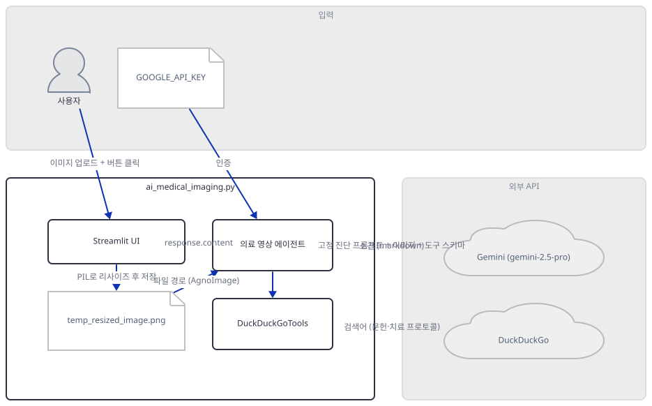
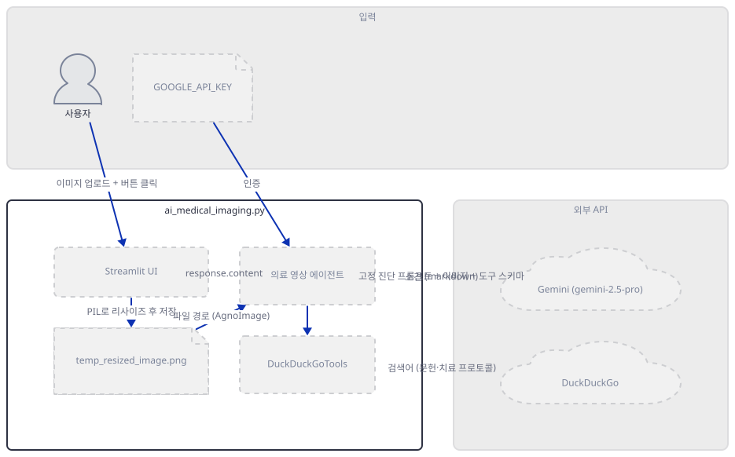
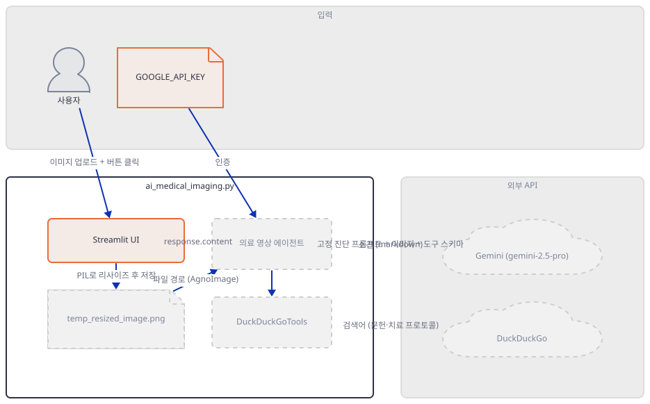
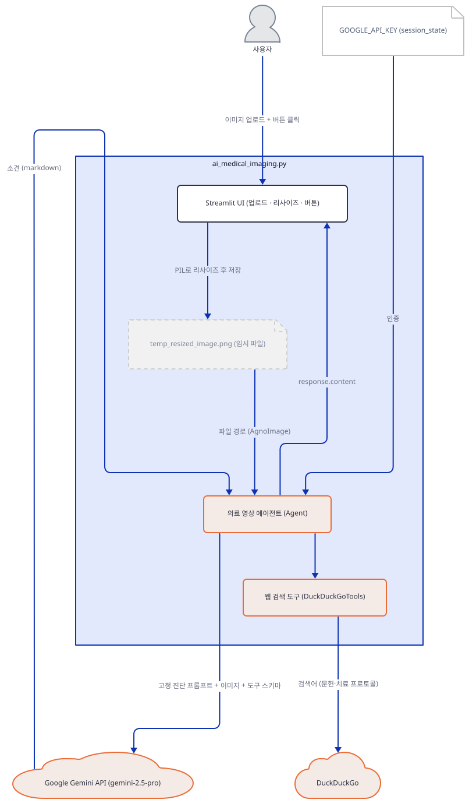
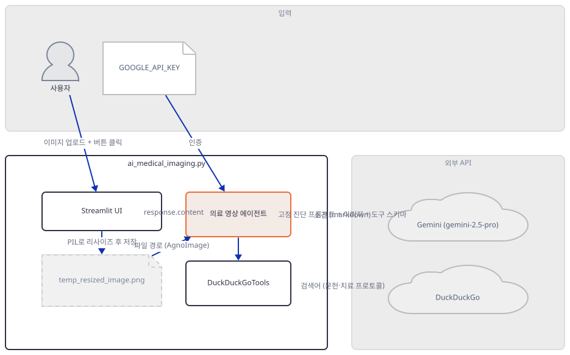
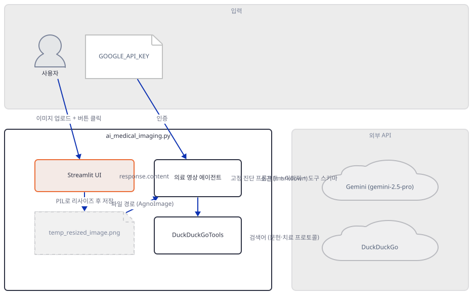
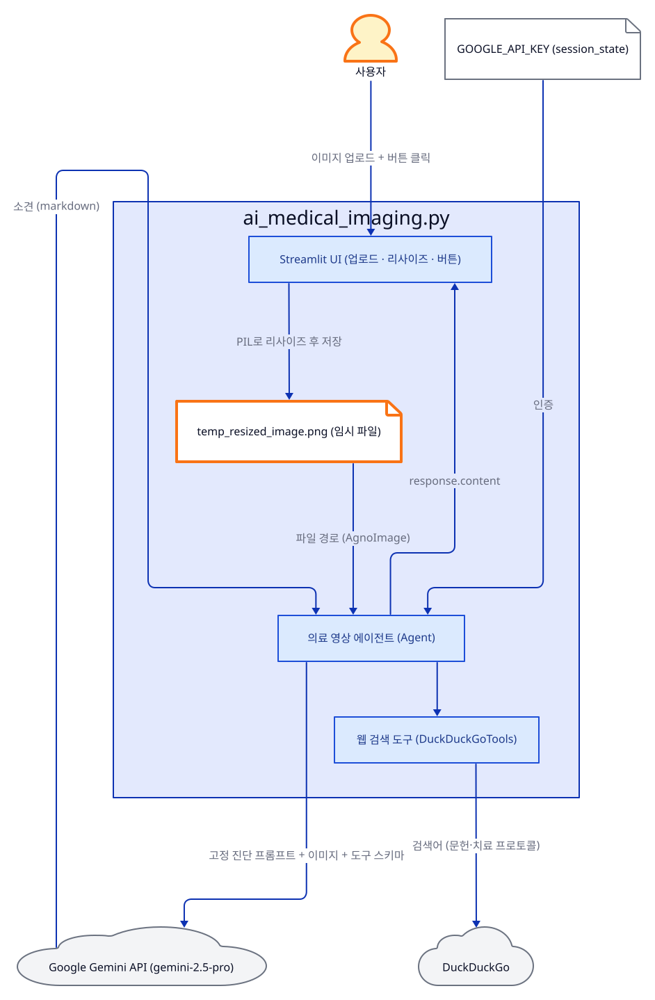
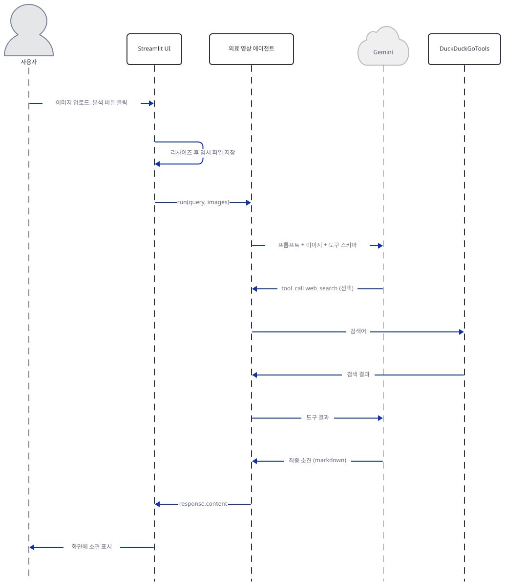

# Day 008 · 🩻 AI Medical Imaging Agent

> 볼륨 1 🌱 Starter AI Agents · 난이도 ★★☆ · 예상 소요 60분 · API 비용 대략 이미지 분석 1건에 Gemini 2.5 Pro 요금표 기준 수백 원 이하, 대략치 (키가 없어 실제 과금은 확인 못함) · 원본 앱: `starter_ai_agents/ai_medical_imaging_agent`

## 오늘 만들 것

이번 튜토리얼은 Day 1의 "모델 + 도구" 골격을 그대로 재사용하지만, 입력이 자유 텍스트 질문이 아니라 **이미지**라는 점에서 처음으로 다른 종류의 에이전트를 만듭니다. 사용자는 X-ray·MRI·CT 같은 의료 이미지를 올리고 버튼 하나만 누르며, 실제로 무엇을 물을지는 파일에 미리 박혀 있는 37줄짜리 고정 프롬프트(`query`, `starter_ai_agents/ai_medical_imaging_agent/ai_medical_imaging.py:58-94`)가 대신 정합니다 — Day 1·5·6·7이 모두 자유 텍스트 질문창을 뒀던 것과 다른 지점입니다. 이 프롬프트는 이미지 종류·주요 소견·진단·환자용 설명·참고 문헌의 5개 섹션을 요구하고, 마지막 섹션에서 명시적으로 `DuckDuckGoTools`(Day 1에서 이미 다룬 바로 그 클래스)를 호출해 최신 문헌을 찾으라고 지시합니다. 이 문서에서 가장 공들여 확인한 것은 업로드된 이미지가 모델까지 가는 경로입니다 — 업로드 파일은 Pillow로 열려 가로 500px로 리사이즈된 뒤, `tempfile` 모듈 없이 `temp_resized_image.png`라는 고정된 이름으로 앱 실행 폴더에 그대로 저장되고(정리되지 않음, 소스로 확인), 이 경로가 `AgnoImage`로 감싸져서야 비로소 에이전트에 전달됩니다. 모델은 `agno.models.google.Gemini`가 감싼 `gemini-2.5-pro`인데, `requirements.txt`가 고정한 `google-generativeai==0.8.3`(Google이 이미 폐기를 선언한 옛 SDK)은 실제로는 설치된 agno 어디에서도 import되지 않는 죽은 의존성입니다 — 진짜로 필요한 것은 신규 SDK `google-genai`이며, 이를 설치하지 않으면 `Gemini`를 import하는 순간 바로 실패합니다(직접 확인). 완성하면 이미지를 올리고 분석 버튼을 눌러 5개 섹션짜리 소견을 받는 화면을 로컬에서 띄우게 됩니다. 아래는 완성된 아키텍처입니다.



## 사전 준비

| 서비스/도구 | 용도 | 발급·설치 |
|---|---|---|
| Google API 키 (Gemini) | `gemini-2.5-pro` 모델 호출 인증. 사이드바 입력창에 붙여넣으면 `st.session_state`에 저장된다(환경변수 아님) | https://aistudio.google.com/apikey 발급 |
| uv | 가상환경 생성과 패키지 설치 | [공통 사전 준비](../README.md#공통-사전-준비-한-번만) 절 참고 |
| 분석할 의료 이미지 (JPG/PNG) | 업로드해 분석할 원본 이미지. 업로더는 DICOM도 받는다고 표시하지만 실제로는 열리지 않는다(Step 5에서 확인) | 직접 준비하거나 공개 샘플 X-ray/CT 이미지 사용 |
| 인터넷 연결 | Google Gemini API·DuckDuckGo 접속 | 별도 설치 없음. 사내망이면 두 도메인에 대한 접속 허용 필요 |

## 아키텍처 한눈에 보기

| 컴포넌트 | 역할 | 코드 위치 |
|---|---|---|
| 사용자 | 이미지 업로드와 분석 버튼 클릭(자유 텍스트 질문 없음) | 코드 없음 (브라우저) |
| Streamlit UI | 사이드바 키 입력·disclaimer, 이미지 업로더·리사이즈 미리보기·분석 버튼 | `starter_ai_agents/ai_medical_imaging_agent/ai_medical_imaging.py:13-43`, `starter_ai_agents/ai_medical_imaging_agent/ai_medical_imaging.py:104-132` |
| 임시 이미지 파일 (temp_resized_image.png) | 리사이즈된 이미지를 디스크에 저장해 `AgnoImage`가 읽을 경로를 제공(정리되지 않음) | `starter_ai_agents/ai_medical_imaging_agent/ai_medical_imaging.py:138-142` |
| 의료 영상 에이전트 (Agent) | 고정 진단 프롬프트와 이미지를 모델에 전달하고, 필요하면 검색 도구를 호출 | `starter_ai_agents/ai_medical_imaging_agent/ai_medical_imaging.py:45-52` |
| 모델 (Gemini, gemini-2.5-pro) | 이미지+텍스트를 해석해 5개 섹션 소견을 작성하고 도구 호출 여부를 판단 | `starter_ai_agents/ai_medical_imaging_agent/ai_medical_imaging.py:46-49` |
| 도구 (DuckDuckGoTools) | 최신 의료 문헌·치료 프로토콜 검색(Day 1과 동일한 클래스) | `starter_ai_agents/ai_medical_imaging_agent/ai_medical_imaging.py:50` |
| 외부 API (Google Gemini, DuckDuckGo) | 실제 추론과 검색을 수행하는 서드파티 서비스 | 코드 없음 (외부 서비스) |

## 단계별 진행

### Step 1. 환경 만들기

**목적.** 격리된 가상환경에 `requirements.txt`를 설치하고, 버전 고정이 실제로 무엇을 깨뜨리는지 직접 설치해 확인합니다.

**할 일.**

```bash
cd starter_ai_agents/ai_medical_imaging_agent
uv venv
uv pip install -r requirements.txt
uv pip install google-genai ddgs
```

(pip을 쓴다면 `python -m venv .venv && source .venv/bin/activate && pip install -r requirements.txt && pip install google-genai ddgs`.)

이 저장소는 루트에 `pyproject.toml`이 있어 `uv run`이 방금 만든 환경 대신 루트의 `.venv`를 쓰므로, 이후 `uv run` 명령에는 모두 `--no-project`를 붙입니다.

`requirements.txt`의 다섯 줄(`streamlit==1.40.2`, `agno>=2.2.10`, `Pillow==10.0.0`, `duckduckgo-search>=6.4.2,<9`, `google-generativeai==0.8.3`)은 Python 3.12에 오류 없이 설치됩니다 — 2023년에 나온 `Pillow==10.0.0`도 Python 3.12에서 별다른 오류나 빌드 지연 없이 설치되었습니다(직접 확인). 문제는 설치가 끝난 **뒤**입니다. `agno>=2.2.10`은 상한이 없어 이 문서를 쓰며 설치했을 때 **agno 3.0.9**(Day 1·6과 같은 버전)를 받았는데, 이 버전의 `agno.models.google.Gemini`는 내부적으로 `google.genai`(신규 SDK)의 타입을 가져오며 이 패키지는 `requirements.txt`에 없습니다. 대신 설치된 것은 Google이 이미 폐기(deprecated)를 선언한 옛 SDK `google-generativeai==0.8.3`뿐이라, `from agno.models.google import Gemini`를 실행하는 순간 `ModuleNotFoundError: No module named 'google.genai'`에 이어 ``ImportError: `google-genai` not installed. Please install it using `pip install google-genai` ``가 그대로 발생합니다(직접 확인). 설치된 agno 패키지 전체에서 "generativeai" 문자열을 검색해도 한 건도 나오지 않아(소스로 확인), `google-generativeai==0.8.3`은 이 버전의 agno에서는 완전히 죽은 의존성입니다. 두 번째 문제는 Day 1과 원인이 정확히 같습니다 — `agno.tools.duckduckgo`가 `ddgs` 패키지를 요구하는데 `requirements.txt`는 `duckduckgo-search`만 설치하므로 같은 `ImportError`가 남습니다(`day001-xai-finance-agent/README.md` 문제 해결 참고, 원인이 동일해 여기서는 다시 재현하지 않습니다). 위 네 번째 명령으로 두 패키지를 마저 설치합니다.



**확인.**

```bash
uv run --no-project python -c "from agno.models.google import Gemini; from agno.tools.duckduckgo import DuckDuckGoTools; print('ok')"
```

```
ok
```

### Step 2. 사이드바: 세션 상태로 키 관리

**목적.** API 키를 세션에 저장해 재사용하는 패턴과, 화면에 항상 떠 있는 의료 정보 disclaimer를 확인합니다.

**할 일.**

`starter_ai_agents/ai_medical_imaging_agent/ai_medical_imaging.py:10-11`

```python
if "GOOGLE_API_KEY" not in st.session_state:
    st.session_state.GOOGLE_API_KEY = None
```

`starter_ai_agents/ai_medical_imaging_agent/ai_medical_imaging.py:16-20`

```python
    if not st.session_state.GOOGLE_API_KEY:
        api_key = st.text_input(
            "Enter your Google API Key:",
            type="password"
        )
```

`starter_ai_agents/ai_medical_imaging_agent/ai_medical_imaging.py:25-28`

```python
        if api_key:
            st.session_state.GOOGLE_API_KEY = api_key
            st.success("API Key saved!")
            st.rerun()
```

키를 입력하면 `st.session_state.GOOGLE_API_KEY`에 저장하고 `st.rerun()`으로 스크립트를 처음부터 다시 실행합니다 — 재실행된 화면에서는 `if not st.session_state.GOOGLE_API_KEY:`가 거짓이 되어 입력창 대신 "API Key is configured"와 초기화 버튼이 나타납니다(`ai_medical_imaging.py:29-33`). 이 패턴 덕분에 여러 장을 분석해도 키를 반복 입력하지 않습니다. 사이드바 아래쪽에는 이 도구가 교육·정보 제공 목적이며 의료 결정에 단독으로 쓰지 말라는 경고문이 고정으로 표시됩니다(`ai_medical_imaging.py:39-43`).



**확인.** 앱 폴더에서 모듈을 직접 임포트해, 키를 입력하지 않은 초기 상태를 확인합니다.

```bash
uv run --no-project python -c "import ai_medical_imaging as m; print(m.st.session_state.GOOGLE_API_KEY, m.medical_agent)"
```

Streamlit이 bare 모드 경고를 44줄 함께 출력하지만(무시해도 됨, 이 문서에서는 생략), 마지막 줄은 직접 확인한 아래 내용입니다.

```
None None
```

(bare 모드에서는 `st.text_input`이 빈 문자열을 돌려주므로 `api_key`가 거짓이 되어 25-28행에 들어가지 않고 `GOOGLE_API_KEY`는 `None`으로 남습니다. 그 결과 `medical_agent`도 Step 3의 조건부 생성에서 `None`이 됩니다.)

### Step 3. 모델과 도구 정의

**목적.** 실제 추론을 맡을 Gemini 모델과 검색을 대신해줄 `DuckDuckGoTools`를 하나의 `Agent`로 묶습니다. 이 앱은 이 둘을 키가 있을 때만 조건부로 만듭니다.

**할 일.**

`starter_ai_agents/ai_medical_imaging_agent/ai_medical_imaging.py:45-52`

```python
medical_agent = Agent(
    model=Gemini(
        id="gemini-2.5-pro",
        api_key=st.session_state.GOOGLE_API_KEY
    ),
    tools=[DuckDuckGoTools()],
    markdown=True
) if st.session_state.GOOGLE_API_KEY else None
```

`starter_ai_agents/ai_medical_imaging_agent/ai_medical_imaging.py:54-55`

```python
if not medical_agent:
    st.warning("Please configure your API key in the sidebar to continue")
```

`Agent(...) if ... else None`은 파이썬 삼항 표현식으로, 모듈이 로드되는 시점에 딱 한 번 평가됩니다 — Day 5·6의 `if together_api_key:`/`if openai_key:`처럼 이후 코드 전체를 감싸는 블록이 아니라, `medical_agent`라는 이름에 `Agent` 객체 또는 `None` 중 하나를 확정해 담아두는 방식입니다. `DuckDuckGoTools()`는 Day 1에서 이미 다룬 바로 그 클래스이고 노출하는 함수도 `search_news`·`web_search` 그대로입니다(직접 확인, 아래) — 자세한 내용은 `day001-xai-finance-agent/README.md`를 참고하세요. `Gemini(id="gemini-2.5-pro", ...)` 생성 자체는 앞선 날들의 `xAI(...)`·`OpenAIChat(...)`과 똑같이 이 시점에는 키를 검증하지 않습니다(직접 확인).



**확인.**

```bash
uv run --no-project python -c "
from agno.agent import Agent
from agno.models.google import Gemini
from agno.tools.duckduckgo import DuckDuckGoTools
print(sorted(DuckDuckGoTools().functions))
m = Gemini(id='gemini-2.5-pro', api_key='fake-key-not-real')
print(m.id, m.provider)
agent = Agent(model=m, tools=[DuckDuckGoTools()], markdown=True)
print(len(agent.tools), agent.markdown)
"
```

```
['search_news', 'web_search']
gemini-2.5-pro Google
1 True
```

### Step 4. 진단 프롬프트 설계

**목적.** 사용자가 직접 질문을 입력하지 않고, 파일에 미리 고정된 프롬프트가 무엇을 요구하는지 확인합니다.

**할 일.**

`starter_ai_agents/ai_medical_imaging_agent/ai_medical_imaging.py:58-61`

```python
query = """
You are a highly skilled medical imaging expert with extensive knowledge in radiology and diagnostic imaging. Analyze the patient's medical image and structure your response as follows:

### 1. Image Type & Region
```

`starter_ai_agents/ai_medical_imaging_agent/ai_medical_imaging.py:85-93`

```python
### 5. Research Context
IMPORTANT: Use the DuckDuckGo search tool to:
- Find recent medical literature about similar cases
- Search for standard treatment protocols
- Provide a list of relevant medical links of them too
- Research any relevant technological advances
- Include 2-3 key references to support your analysis

Format your response using clear markdown headers and bullet points. Be concise yet thorough.
```

이 `query`는 157줄 파일 중 37줄(58-94행)을 차지하는 하나의 긴 삼중따옴표 문자열로, 이미지 종류·주요 소견·진단·환자용 설명·참고 문헌 5개 섹션(`###` 헤더 5개, 직접 확인)을 강제합니다. Day 1·5·6·7은 모두 사용자가 그때그때 입력한 문장을 프롬프트에 실어 보냈지만, 이 앱은 업로드된 이미지만 바뀔 뿐 텍스트 프롬프트는 항상 이 문자열 그대로입니다 — 다른 것을 묻고 싶다면 코드를 직접 고쳐야 합니다. 5번 섹션은 `DuckDuckGoTools`를 쓰라고 대문자로 강조해 지시하지만, 실제로 도구를 호출할지는 Day 1과 마찬가지로 Gemini가 스스로 판단합니다.



**확인.**

```bash
uv run --no-project python -c "import ai_medical_imaging as m; print(m.query.count('###'), 'DuckDuckGo' in m.query)"
```

```
5 True
```

### Step 5. 이미지 업로드와 리사이즈

**목적.** 파일 업로더가 실제로 어떤 형식을 받는다고 광고하는지, 업로드된 이미지가 어떻게 가로 500px로 리사이즈되는지, 그리고 DICOM을 실제로 열 수 있는지를 직접 확인합니다.

**할 일.**

`starter_ai_agents/ai_medical_imaging_agent/ai_medical_imaging.py:104-109`

```python
with upload_container:
    uploaded_file = st.file_uploader(
        "Upload Medical Image",
        type=["jpg", "jpeg", "png", "dicom"],
        help="Supported formats: JPG, JPEG, PNG, DICOM"
    )
```

`starter_ai_agents/ai_medical_imaging_agent/ai_medical_imaging.py:115-120`

```python
            image = PILImage.open(uploaded_file)
            width, height = image.size
            aspect_ratio = width / height
            new_width = 500
            new_height = int(new_width / aspect_ratio)
            resized_image = image.resize((new_width, new_height))
```

업로더는 `dicom`도 받는다고 안내하지만, Pillow에는 DICOM 디코더가 내장돼 있지 않습니다 — 실제로 열리는지는 아래 확인에서 봅니다.



**확인.** 먼저 128바이트 프리앰블과 `DICM` 매직 헤더만 있는 최소 DICOM 흉내 파일로 직접 열어봅니다.

```bash
uv run --no-project python -c "
from PIL import Image as PILImage
import io
buf = io.BytesIO(b'\x00' * 128 + b'DICM' + b'\x00' * 100)
buf.name = 'sample.dicom'
try:
    PILImage.open(buf)
except Exception as e:
    print(type(e).__name__, str(e)[:60])
print(PILImage.registered_extensions().get('.dcm'), PILImage.registered_extensions().get('.dicom'))
"
```

직접 확인한 출력(메모리 주소 부분은 실행마다 달라집니다):

```
UnidentifiedImageError cannot identify image file <_io.BytesIO object at 0x...>
None None
```

`registered_extensions()`에 `.dcm`·`.dicom` 둘 다 없다는 것은 Pillow가 이 확장자용 플러그인을 하나도 등록하지 않았다는 뜻입니다 — 실제 방사선 장비가 내보내는 DICOM 파일을 그대로 올리면 이 지점에서 예외로 멈춥니다. 이어서 정상적인 이미지로 리사이즈 로직만 따로 확인합니다.

```bash
uv run --no-project python -c "
from PIL import Image as PILImage
img = PILImage.new('RGB', (800, 400), color='red')
width, height = img.size
aspect_ratio = width / height
new_width = 500
new_height = int(new_width / aspect_ratio)
resized = img.resize((new_width, new_height))
print(resized.size)
"
```

```
(500, 250)
```

### Step 6. 분석 실행과 결과 표시

**목적.** "Analyze Image"를 누른 뒤 이미지가 실제로 어떤 경로를 거쳐 저장되고 모델에 전달되는지, 그리고 키가 잘못됐을 때 이 앱이 예외를 실제로 잡는지 확인합니다.

**할 일.**

`starter_ai_agents/ai_medical_imaging_agent/ai_medical_imaging.py:134-145`

```python
    with analysis_container:
        if analyze_button:
            with st.spinner("🔄 Analyzing image... Please wait."):
                try:
                    temp_path = "temp_resized_image.png"
                    resized_image.save(temp_path)
                    
                    # Create AgnoImage object
                    agno_image = AgnoImage(filepath=temp_path)
                    
                    # Run analysis
                    response: RunOutput = medical_agent.run(query, images=[agno_image])
```

`starter_ai_agents/ai_medical_imaging_agent/ai_medical_imaging.py:154-155`

```python
                except Exception as e:
                    st.error(f"Analysis error: {e}")
```

`temp_path`는 `tempfile` 모듈을 전혀 쓰지 않는 고정 문자열 `"temp_resized_image.png"`입니다 — 앱을 실행한 폴더에 매번 같은 이름으로 저장되고, 파일 어디에도 이를 지우는 코드가 없습니다(소스로 확인: `unlink`·`os.remove`·`tempfile` 문자열 검색 결과 0건). 이 경로가 `AgnoImage(filepath=temp_path)`로 감싸져야만 `medical_agent.run(query, images=[agno_image])`에 넘어갑니다. 키가 잘못되면 어떻게 되는지 직접 실행해 확인했습니다 — Day 1(xAI)·Day 6(OpenAI)과 마찬가지로 `agent.run()`은 파이썬 예외를 던지지 않고 `RunStatus.error` 응답 객체를 돌려주므로, 154행의 `except Exception`은 이 경우 실행되지 않습니다. 다만 Google 쪽은 다른 점이 하나 있습니다 — xAI·OpenAI는 형식이 잘못된 키에도 즉시 401을 돌려줬지만, Gemini는 실제로 키를 서버까지 보내 검증한 뒤 `400 INVALID_ARGUMENT`를 돌려주며 응답이 오기까지 다른 날들보다 오래 걸렸습니다(직접 확인).



**확인.** 실제 화면은 키가 없어 재현하지 못했습니다. 대신 Step 3의 에이전트를 유효하지 않은 키로 그대로 실행합니다.

```bash
uv run --no-project python -c "
from agno.agent import Agent
from agno.models.google import Gemini
from agno.tools.duckduckgo import DuckDuckGoTools
agent = Agent(model=Gemini(id='gemini-2.5-pro', api_key='fake-key-not-real'), tools=[DuckDuckGoTools()], markdown=True)
resp = agent.run('hello')
print('status:', resp.status)
print('has content attr:', hasattr(resp, 'content'))
print('content:', str(resp.content)[:300])
"
```

직접 확인한 출력(에이전트 내부 `ERROR` 로그는 생략):

```
status: RunStatus.error
has content attr: True
content: {
  "error": {
    "code": 400,
    "message": "API key not valid. Please pass a valid API key.",
    "status": "INVALID_ARGUMENT",
    "details": [
      {
        "@type": "type.googleapis.com/google.rpc.ErrorInfo",
        "reason": "API_KEY_INVALID",
        "domain": "googleapis.com",
        "
```

유효한 키가 있으면 이 자리에서 대신 5개 섹션으로 구성된 실제 소견이 `st.markdown()`으로 표시됩니다.

## 요청 한 건이 흐르는 과정



사용자가 이미지를 업로드하고 "Analyze Image"를 누르면, 화면에 이미 리사이즈되어 있던 이미지가 `temp_resized_image.png`로 먼저 디스크에 저장됩니다. 이 경로는 `AgnoImage(filepath=temp_path)`로 감싸져 `medical_agent.run(query, images=[agno_image])` 호출에 함께 들어가는데, `query`는 사용자가 그때그때 입력한 질문이 아니라 파일에 고정된 37줄짜리 진단 프롬프트 그대로입니다. 에이전트는 이 프롬프트와 이미지, `DuckDuckGoTools`의 함수 스키마를 함께 Gemini에 보냅니다. 프롬프트의 5번 섹션이 명시적으로 검색 도구를 쓰라고 지시하므로, Gemini가 필요하다고 판단하면 Day 1에서 이미 본 것과 같은 도구 호출 루프로 `web_search`나 `search_news`를 요청하고, 에이전트가 이를 로컬에서 실행해 결과를 다시 Gemini에 돌려줍니다. Gemini는 최종적으로 5개 섹션을 갖춘 마크다운 소견을 작성하고, 이 텍스트가 `response.content`로 화면에 그대로 표시됩니다. 이 전체 왕복은 유효한 키가 있어야만 끝까지 이어지며, 이 문서에서는 각 구간을 개별적으로 직접 실행해 확인했을 뿐 처음부터 끝까지 한 번에 이어지는 것은 보지 못했습니다.

## 실행 체크리스트

- [ ] Google API 키(Gemini)를 발급받아 두었다
- [ ] `uv venv && uv pip install -r requirements.txt`로 기본 의존성을, `uv pip install google-genai ddgs`로 누락된 의존성을 설치했다
- [ ] `uv run streamlit run ai_medical_imaging.py`로 서버를 띄우고 `http://localhost:8501`에서 화면을 확인했다
- [ ] 사이드바에 Google API 키를 입력해 "API Key saved!"와 disclaimer 문구를 확인했다
- [ ] JPG/PNG 의료 이미지를 업로드하고 리사이즈된 미리보기를 확인했다
- [ ] "Analyze Image"를 눌러 5개 섹션(이미지 종류, 주요 소견, 진단, 환자용 설명, 참고 문헌) 형식의 분석 결과를 확인했다
- [ ] 터미널 로그에서 `web_search`·`search_news` 도구 호출 여부를 확인했다

## 문제 해결

| 증상 | 원인 | 해결 |
|---|---|---|
| `from agno.models.google import Gemini` 시 `ModuleNotFoundError: No module named 'google.genai'`에 이어 ``ImportError: `google-genai` not installed. Please install it using `pip install google-genai` `` | `requirements.txt`가 고정한 `google-generativeai==0.8.3`은 Google이 폐기한 옛 SDK이고, 설치된 agno 3.0.9는 신규 SDK `google-genai`만 가져온다 — agno 패키지 전체에 "generativeai" 문자열이 한 번도 없음(소스로 확인) | `uv pip install google-genai` 실행 |
| `from agno.tools.duckduckgo import DuckDuckGoTools` 시 ``ImportError: `ddgs` not installed. Please install using `pip install ddgs` `` | Day 1과 원인이 같다 — `agno.tools.duckduckgo`가 내부적으로 `ddgs`를 가져오는데 `requirements.txt`는 `duckduckgo-search`만 설치한다(`day001-xai-finance-agent/README.md` 문제 해결 참고) | `uv pip install ddgs` 실행 |
| 업로더가 `dicom`도 받는다고 안내하지만, 실제 DICOM 바이트열을 열면 `PIL.UnidentifiedImageError: cannot identify image file ...` | Pillow에는 DICOM 디코더가 없다 — `PILImage.registered_extensions()`에 `.dcm`·`.dicom` 항목이 없음(직접 확인) | 실제 DICOM 파일이라면 `pydicom` 등으로 먼저 PNG/JPG로 변환한 뒤 업로드 |
| 분석을 여러 번 실행해도 `temp_resized_image.png` 하나만 계속 덮어써지고 지워지지 않음 | `tempfile` 모듈을 쓰지 않고 고정 파일명을 앱 실행 폴더에 그대로 저장하며, 정리 코드가 없다(소스로 확인: `unlink`·`os.remove`·`tempfile` 검색 결과 0건) | 필요하면 분석 후 직접 파일을 지우거나, `ai_medical_imaging.py:145` 뒤에 `os.remove(temp_path)`를 추가 |
| 앱 자체 `README.md`의 Notes에 "Uses Gemini 2.0 Flash"라고 적혀 있음 | 실제 코드는 `gemini-2.5-pro`를 쓴다(`ai_medical_imaging.py:47`, 소스로 확인) — 문서가 갱신되지 않음 | 그 문구는 무시하고 코드의 모델 이름을 기준으로 삼기 |

## 더 해보기

- `analysis_container` 블록 끝에 `os.remove(temp_path)`를 추가해, 분석 후 임시 파일이 남지 않도록 고쳐보기 (`ai_medical_imaging.py:145` 근처)
- `pydicom`으로 실제 `.dcm` 파일을 읽어 PNG로 변환한 뒤 업로드해, 진짜 방사선 이미지로 분석이 되는지 확인해보기
- `query`(`ai_medical_imaging.py:58-94`) 아래에 자유 텍스트 질문 입력창을 추가해, 고정된 5개 섹션 외에 추가 질문도 함께 보낼 수 있게 확장해보기

## 다음 날 예고

[Day 009 · ✨ Gemini Multimodal Agent](../day009-multimodal-ai-agent/README.md) — 같은 Gemini 스택으로 이미지 대신 영상을 분석하고, 두 번째 진입점에서 추론 전용 이미지 분석을 다룹니다.
