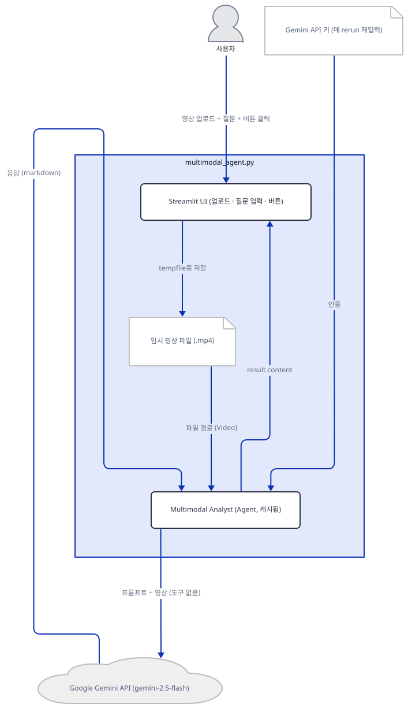
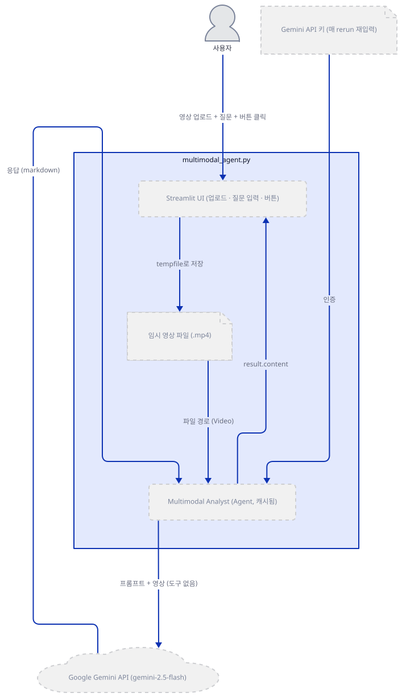
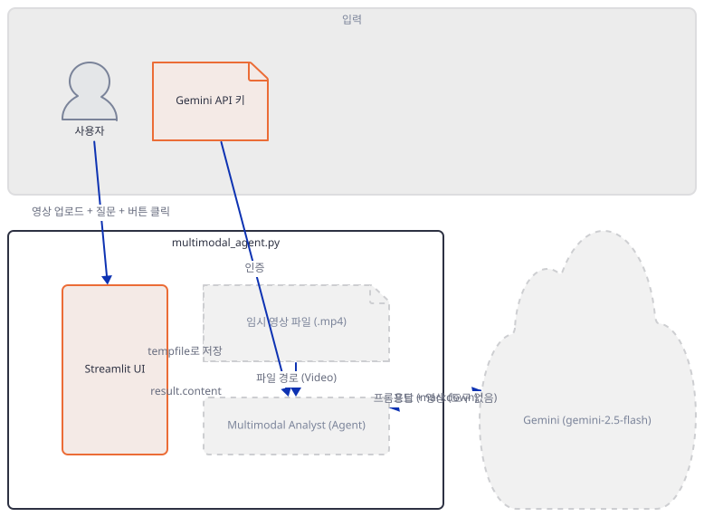
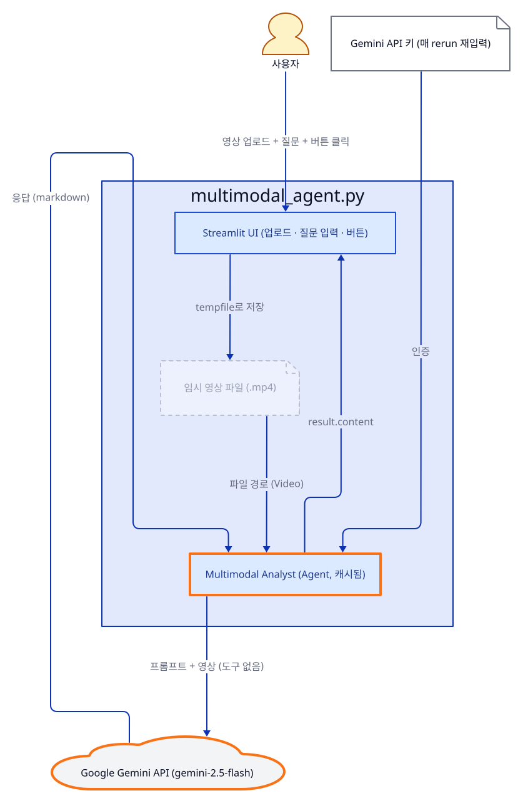
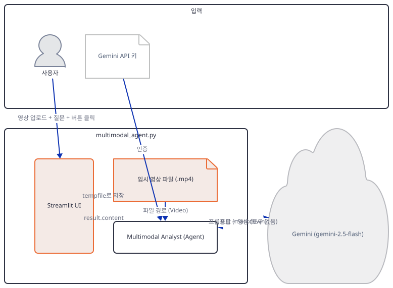
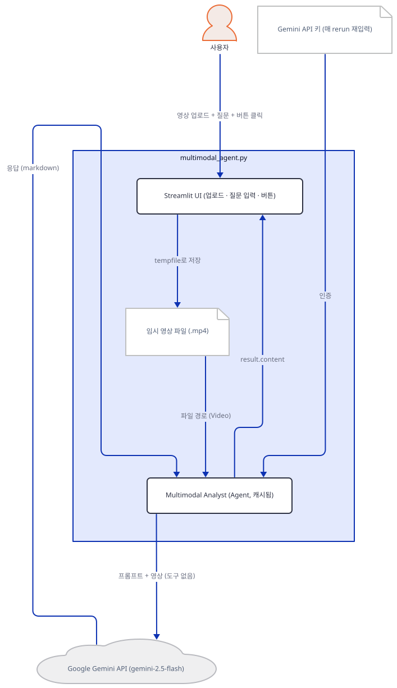
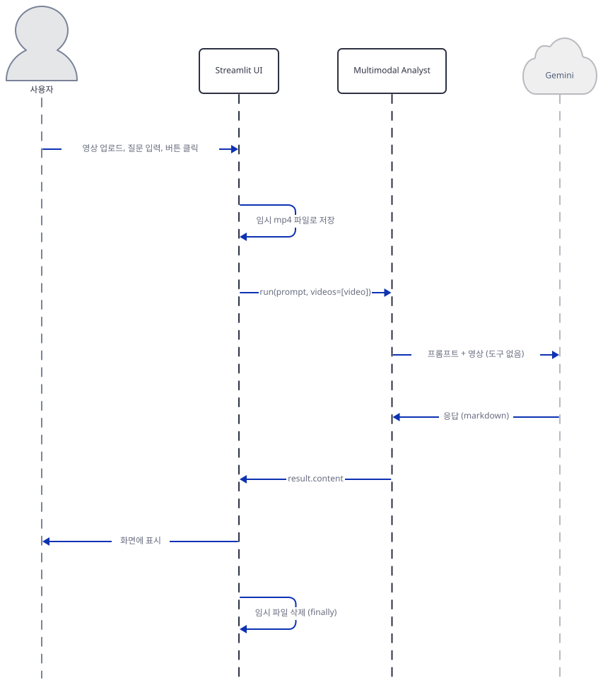

# Day 009 · ✨ Gemini Multimodal Agent

> 볼륨 1 🌱 Starter AI Agents · 난이도 ★☆☆ · 예상 소요 50분 · API 비용 대략 영상 분석 1건에 Gemini 2.5 Flash 요금표 기준 수백 원 이하, 대략치 (키가 없어 실제 과금은 확인 못함) · 원본 앱: `starter_ai_agents/multimodal_ai_agent`

## 오늘 만들 것

이 폴더는 지금까지와 달리 진입점이 두 개입니다 — 영상을 분석하는 `multimodal_agent.py`(90줄)와 이미지를 분석하는 `multimodal_reasoning_agent.py`(77줄)입니다. 이 문서는 앱 자체 README가 유일하게 실행 명령으로 안내하는 `multimodal_agent.py`를 따라갑니다(Day 2의 `ai_scrapper.py`/`local_ai_scrapper.py`와 같은 선택 기준입니다) — `multimodal_reasoning_agent.py`는 앱 README 어디에도 등장하지 않습니다(소스로 확인: `starter_ai_agents/multimodal_ai_agent/README.md`). 두 파일의 차이는 이름이 암시하는 것 이상입니다. `multimodal_agent.py`는 **영상**(mp4/mov/avi)을 `gemini-2.5-flash`로 분석하며 사용자 질문을 고정된 프롬프트 틀에 끼워 넣고, `multimodal_reasoning_agent.py`는 **이미지**를 더 무거운 추론 모델 `gemini-2.5-pro`로 분석하며 사용자가 입력한 임의의 과제 문장을 그대로 전달합니다 — 그리고 전체 로직이 `def main():` 안에 있고 `if __name__ == "__main__":`으로 감싸져 있어, 이 파일은 **모듈로 임포트해도 아무 코드도 실행되지 않습니다**(직접 확인: 임포트 시 bare 모드 경고 0줄, 아래 Step 2와 대비). Day 8과 같은 Gemini 스택을 쓰므로 설치 문제도 동일합니다 — `requirements.txt`의 `google-generativeai==0.8.3`은 여기서도 죽은 의존성이고 실제로는 `google-genai`가 필요합니다(직접 확인, 원인은 `day008-ai-medical-imaging-agent/README.md` 참고). 이 문서에서 가장 중요하게 확인한 사실은 따로 있습니다 — 앱 자체 README는 "Web research integration via DuckDuckGo"를 기능으로 내세우고 실행 시 프롬프트도 "web research"를 명시적으로 요청하지만, `multimodal_agent.py`의 `Agent(...)`에는 `tools`가 아예 없고(직접 확인: `agent.tools == []`) `Gemini(...)`의 내장 검색 플래그 `search`·`grounding`도 둘 다 기본값 `False`인 채 켜지지 않습니다(직접 확인). 즉 이 앱은 웹을 전혀 검색하지 못하며 "web research"는 Gemini에게 그렇게 해달라고 부탁하는 텍스트일 뿐입니다. 완성하면 영상을 올리고 질문을 입력해 Gemini의 답변을 받는 화면을 로컬에서 띄우게 됩니다. 아래는 완성된 아키텍처입니다.



## 사전 준비

| 서비스/도구 | 용도 | 발급·설치 |
|---|---|---|
| Google API 키 (Gemini) | `gemini-2.5-flash` 모델 호출 인증. 사이드바 입력창에 붙여넣는다. Day 8과 달리 `st.session_state`에 저장하지 않고 매 rerun마다 새로 읽는다 | https://aistudio.google.com/apikey 발급 |
| uv | 가상환경 생성과 패키지 설치 | [공통 사전 준비](../README.md#공통-사전-준비-한-번만) 절 참고 |
| 분석할 영상 파일 (MP4/MOV/AVI) | 업로드해 분석할 원본 영상 | 직접 준비 |
| 인터넷 연결 | Google Gemini API 접속(DuckDuckGo 등 다른 외부 서비스는 쓰지 않는다) | 별도 설치 없음 |

## 아키텍처 한눈에 보기

| 컴포넌트 | 역할 | 코드 위치 |
|---|---|---|
| 사용자 | 영상 업로드, 질문 입력, 버튼 클릭 | 코드 없음 (브라우저) |
| Streamlit UI | 키 입력, 파일 업로더, 질문 입력창, 버튼 | `starter_ai_agents/multimodal_ai_agent/multimodal_agent.py:19-25`, `starter_ai_agents/multimodal_ai_agent/multimodal_agent.py:39-55` |
| 임시 영상 파일 (.mp4) | `tempfile`로 저장하고, 성공·실패와 무관하게 `finally`에서 삭제 | `starter_ai_agents/multimodal_ai_agent/multimodal_agent.py:43-45`, `starter_ai_agents/multimodal_ai_agent/multimodal_agent.py:77-78` |
| Multimodal Analyst (Agent, 캐시됨) | 프롬프트와 영상을 모델에 전달 | `starter_ai_agents/multimodal_ai_agent/multimodal_agent.py:27-34` |
| 모델 (Gemini, gemini-2.5-flash) | 영상+텍스트를 해석해 답변 작성 | `starter_ai_agents/multimodal_ai_agent/multimodal_agent.py:32` |
| (없음) 웹 검색 | 프롬프트는 요청하지만 `tools`도 `search=True`도 없어 실제로는 검색하지 않는다 | 코드 없음 (프롬프트만 요청) |

## 단계별 진행

### Step 1. 환경 만들기

**목적.** 의존성을 설치하고, Day 8과 같은 Gemini 관련 설치 문제가 여기서도 그대로 재현되는지 짧게 확인합니다.

**할 일.**

```bash
cd starter_ai_agents/multimodal_ai_agent
uv venv
uv pip install -r requirements.txt
uv pip install google-genai
```

(pip을 쓴다면 `python -m venv .venv && source .venv/bin/activate && pip install -r requirements.txt && pip install google-genai`.)

`requirements.txt`(`agno>=2.2.10`, `google-generativeai==0.8.3`, `streamlit==1.40.2`)는 Day 8과 Gemini 관련 두 줄이 정확히 같습니다. 실제로 설치하면 여기서도 agno 3.0.9를 받아 같은 문제가 그대로 재현됩니다 — `from agno.models.google import Gemini`가 `ModuleNotFoundError: No module named 'google.genai'`로 실패합니다(직접 확인). 원인과 배경은 Day 8 Step 1에서 이미 다뤘으므로 반복하지 않고, 위 네 번째 명령으로 바로 해결합니다. 이 앱은 Day 8과 달리 `duckduckgo-search`/`ddgs`를 아예 설치하지 않는데, 뒤에서 보듯 실제로 검색 도구를 쓰지 않기 때문입니다.



**확인.**

```bash
uv run python -c "from agno.models.google import Gemini; print('ok')"
```

```
ok
```

### Step 2. 사이드바: 매번 새로 읽는 키

**목적.** Day 8의 `session_state` 패턴과 달리 이 앱이 키를 어떻게 다루는지, 그리고 임포트만으로는 아무 일도 일어나지 않는 두 번째 파일과 무엇이 다른지 확인합니다.

**할 일.**

`starter_ai_agents/multimodal_ai_agent/multimodal_agent.py:19-25`

```python
with st.sidebar:
    st.header("🔑 Configuration")
    gemini_api_key = st.text_input("Enter your Gemini API Key", type="password")
    st.caption(
        "Get your API key from [Google AI Studio]"
        "(https://aistudio.google.com/apikey) 🔑"
    )
```

`starter_ai_agents/multimodal_ai_agent/multimodal_agent.py:36-37`

```python
if gemini_api_key:
    agent = initialize_agent(gemini_api_key)
```

`gemini_api_key`는 `st.session_state`를 전혀 거치지 않는 평범한 지역 변수입니다 — Day 8이 키를 세션에 저장해 재사용한 것과 달리, 스크립트가 다시 실행될 때마다 사이드바에 남아있는 값을 매번 그대로 다시 읽습니다. `if gemini_api_key:`는 Day 2·5·6과 같은 얕은 가드입니다. 이 파일은 이 코드가 모듈 최상단에 있어 임포트하는 순간 그대로 실행되지만, 곧 볼 `multimodal_reasoning_agent.py`는 전체가 `def main():` 안에 있어 임포트만으로는 실행되지 않습니다.



**확인.** 앱 폴더에서 모듈을 직접 임포트해, 키를 입력하지 않은 초기 상태를 확인합니다.

```bash
uv run python -c "import multimodal_agent as m; print(repr(m.gemini_api_key))"
```

Streamlit이 bare 모드 경고를 23줄 함께 출력하지만(무시해도 됨, 이 문서에서는 생략), 마지막 줄은 직접 확인한 아래 내용입니다.

```
''
```

### Step 3. 에이전트 초기화와 캐싱 — 그리고 없는 도구

**목적.** `@st.cache_resource`가 이 시리즈에 처음 등장하는 지점을 보고, 이 에이전트가 실제로는 어떤 도구도 갖지 않는다는 것을 직접 확인합니다.

**할 일.**

`starter_ai_agents/multimodal_ai_agent/multimodal_agent.py:27-34`

```python
# Initialize single agent with both capabilities
@st.cache_resource
def initialize_agent(api_key):
    return Agent(
        name="Multimodal Analyst",
        model=Gemini(id="gemini-2.5-flash", api_key=api_key),
        markdown=True,
    )
```

`@st.cache_resource`는 Streamlit이 재실행될 때마다 `Agent`(와 그 안의 Gemini 클라이언트)를 새로 만드는 대신, 같은 `api_key` 인자에 대해 처음 만든 객체를 재사용하게 합니다 — 지금까지 8일간 봐온 "매번 새로 만드는" 패턴과 다른 첫 캐싱 예입니다. 앱 자체 README는 "Web research integration via DuckDuckGo"를 기능으로 내세우지만, 위 8줄 어디에도 `tools=`가 없습니다. `Gemini(...)`도 `id`와 `api_key`만 받을 뿐, 검색을 켜는 `search=True`나 `grounding=True`를 넘기지 않습니다.



**확인.**

```bash
uv run python -c "
from agno.agent import Agent
from agno.models.google import Gemini
m = Gemini(id='gemini-2.5-flash', api_key='fake-key-not-real')
print('search:', m.search, 'grounding:', m.grounding)
agent = Agent(name='Multimodal Analyst', model=m, markdown=True)
print('tools:', agent.tools)
"
```

```
search: False grounding: False
tools: []
```

### Step 4. 영상 업로드와 임시 파일

**목적.** 업로드된 영상이 어떻게 임시 mp4 파일로 저장되는지, 그리고 Day 8과 달리 분석이 끝나면 실제로 지워지는지 확인합니다.

**할 일.**

`starter_ai_agents/multimodal_ai_agent/multimodal_agent.py:39-47`

```python
    # File uploader
    uploaded_file = st.file_uploader("Upload a video file", type=['mp4', 'mov', 'avi'])

    if uploaded_file:
        with tempfile.NamedTemporaryFile(delete=False, suffix='.mp4') as tmp_file:
            tmp_file.write(uploaded_file.read())
            video_path = tmp_file.name
        
        st.video(video_path)
```

`starter_ai_agents/multimodal_ai_agent/multimodal_agent.py:77-78`

```python
                finally:
                    Path(video_path).unlink(missing_ok=True)
```

`tempfile.NamedTemporaryFile(delete=False, ...)`은 Day 8의 하드코딩된 `temp_resized_image.png`와 달리 매번 시스템이 골라주는 고유 경로에 저장하고, `finally` 블록의 `Path(video_path).unlink(missing_ok=True)`가 분석 성공·실패와 무관하게 항상 이 파일을 지웁니다 — Day 8에서 지적한 "정리 안 됨" 문제가 이 앱에는 없습니다. 업로드 확장자는 `.mp4`/`.mov`/`.avi` 셋을 허용하지만, 실제로 디스크에 쓰는 임시 파일은 원본 확장자와 무관하게 항상 `.mp4` 접미사로 저장됩니다(`suffix='.mp4'`, 직접 확인).



**확인.** 위 로직만 따로 재현해, 저장과 삭제가 실제로 일어나는지 확인합니다.

```bash
uv run python -c "
import tempfile, os
from pathlib import Path
with tempfile.NamedTemporaryFile(delete=False, suffix='.mp4') as tmp_file:
    tmp_file.write(b'fake video bytes')
    video_path = tmp_file.name
print(os.path.exists(video_path), video_path.endswith('.mp4'))
Path(video_path).unlink(missing_ok=True)
print(os.path.exists(video_path))
"
```

```
True True
False
```

### Step 5. 질문 입력과 실행

**목적.** 버튼을 누른 뒤 실제로 어떤 프롬프트가 Gemini에 전달되는지, 그리고 키가 잘못됐을 때 무슨 일이 일어나는지 확인합니다.

**할 일.**

`starter_ai_agents/multimodal_ai_agent/multimodal_agent.py:55-61`

```python
        if st.button("Analyze & Research"):
            if not user_prompt:
                st.warning("Please enter your question.")
            else:
                try:
                    with st.spinner("Processing video and researching..."):
                        video = Video(filepath=video_path)
```

`starter_ai_agents/multimodal_ai_agent/multimodal_agent.py:63-70`

```python
                        prompt = f"""
                        First analyze this video and then answer the following question using both 
                        the video analysis and web research: {user_prompt}
                        
                        Provide a comprehensive response focusing on practical, actionable information.
                        """
                        
                        result: RunOutput = agent.run(prompt, videos=[video])
```

프롬프트는 사용자의 질문(`user_prompt`)을 "영상과 웹 리서치를 모두 활용해 답하라"는 고정 문구 안에 끼워 넣습니다 — Step 3에서 확인했듯 이 문장은 지시일 뿐, 실제로 웹을 검색할 수단은 어디에도 없습니다. `agent.run(prompt, videos=[video])`는 Day 8의 `images=[agno_image]`와 같은 자리에 `videos=`를 씁니다.



**확인.** 실제 화면은 키가 없어 재현하지 못했습니다. 대신 Step 3의 에이전트를 유효하지 않은 키와 존재하지 않는 영상 경로로 그대로 실행합니다.

```bash
uv run python -c "
from agno.agent import Agent
from agno.models.google import Gemini
from agno.media import Video
agent = Agent(name='Multimodal Analyst', model=Gemini(id='gemini-2.5-flash', api_key='fake-key-not-real'), markdown=True)
resp = agent.run('hello', videos=[Video(filepath='nonexistent_video.mp4')])
print('status:', resp.status)
print('content:', str(resp.content)[:200])
"
```

직접 확인한 출력(에이전트 내부 `ERROR` 로그는 생략, Day 8과 같은 Gemini 인증 오류 형식):

```
status: RunStatus.error
content: {
  "error": {
    "code": 400,
    "message": "API key not valid. Please pass a valid API key.",
    "status": "INVALID_ARGUMENT",
    "details": [
      {
        "@type": "type.googleapis.com/googl
```

유효한 키가 있으면 이 자리에서 대신 영상 분석 결과가 `st.markdown()`으로 표시됩니다(웹 리서치 없이 Gemini 자체 지식만으로).

## 요청 한 건이 흐르는 과정



영상을 올리고 질문을 입력한 뒤 "Analyze & Research"를 누르면, 업로드된 바이트가 먼저 `tempfile.NamedTemporaryFile`로 임시 mp4 파일에 저장됩니다. 이 경로는 `Video(filepath=video_path)`로 감싸져, 사용자 질문을 고정 문구에 끼워 넣은 프롬프트와 함께 `agent.run(prompt, videos=[video])`로 전달됩니다. `initialize_agent`가 `@st.cache_resource`로 캐시해 둔 `Multimodal Analyst` 에이전트에는 도구가 하나도 없고 `Gemini`의 내장 검색 플래그도 꺼져 있으므로, Gemini는 영상 내용과 자기 자신의 학습 지식만으로 답을 만듭니다 — 프롬프트가 요청한 "웹 리서치"는 실제로는 일어나지 않습니다. 응답은 `result.content`로 화면에 표시되고, 성공하든 실패하든 `finally` 블록이 임시 파일을 삭제합니다. 이 전체 왕복은 유효한 키가 있어야 끝까지 이어지며, 이 문서에서는 각 구간을 개별적으로 직접 실행해 확인했을 뿐입니다.

## 실행 체크리스트

- [ ] Google API 키(Gemini)를 발급받아 두었다
- [ ] `uv venv && uv pip install -r requirements.txt`로 기본 의존성을, `uv pip install google-genai`로 누락된 의존성을 설치했다
- [ ] `uv run streamlit run multimodal_agent.py`로 서버를 띄우고 `http://localhost:8501`에서 화면을 확인했다
- [ ] 영상 파일(MP4/MOV/AVI)을 업로드하고 미리보기를 확인했다
- [ ] 질문을 입력하고 "Analyze & Research"를 눌러 응답을 확인했다
- [ ] 이 에이전트에 `tools`가 없고 Gemini의 `search`·`grounding`도 꺼져 있어 실제로는 웹을 검색하지 않는다는 것을 코드로 확인했다
- [ ] (선택) `multimodal_reasoning_agent.py`를 실행해 이미지+자유 추론 진입점도 확인했다

## 문제 해결

| 증상 | 원인 | 해결 |
|---|---|---|
| `from agno.models.google import Gemini` 시 `ModuleNotFoundError: No module named 'google.genai'` | Day 8과 같은 원인 — `requirements.txt`의 `google-generativeai==0.8.3`은 죽은 의존성이고 agno 3.0.9는 `google-genai`만 가져온다(`day008-ai-medical-imaging-agent/README.md` 문제 해결 참고) | `uv pip install google-genai` 실행 |
| 화면에 "web research"를 수행한다고 나오지만 실제 검색 결과나 출처 링크가 전혀 없음 | `Agent(...)`(`multimodal_agent.py:30-34`)에 `tools`가 없고 `Gemini(...)`도 `search`·`grounding`을 켜지 않는다(직접 확인: 둘 다 기본값 `False`) — 프롬프트의 "web research" 요청은 실행할 수단이 없는 지시일 뿐이다 | Gemini 자체 지식 기반 답변으로 이해하고, 실제 웹 검색이 필요하면 Day 1처럼 `DuckDuckGoTools()`를 `tools=[]`에 직접 추가 |
| `multimodal_reasoning_agent.py`가 폴더에 있는데 실행법을 모르겠음 | 앱 자체 `README.md`가 이 파일을 전혀 언급하지 않는다(소스로 확인: `starter_ai_agents/multimodal_ai_agent/README.md`) | `uv run streamlit run multimodal_reasoning_agent.py`로 직접 실행 |

## 더 해보기

- `multimodal_reasoning_agent.py`를 직접 실행해 이미지+자유 추론 진입점을 시험해보기: `uv run streamlit run multimodal_reasoning_agent.py`. Day 8의 다섯 섹션 고정 프롬프트와 달리 `task_input`(`multimodal_reasoning_agent.py:52-54`)에 원하는 질문을 자유롭게 적을 수 있고 `gemini-2.5-pro`가 이를 처리하며, 파일 전체가 `if __name__ == "__main__":`(`multimodal_reasoning_agent.py:76-77`)로 감싸여 있어 임포트만으로는 아무 코드도 실행되지 않는다는 것을 이 문서에서 직접 확인했습니다(bare 모드 경고 0줄 — Step 2에서 확인한 `multimodal_agent.py`의 23줄과 대비)
- `Gemini(id="gemini-2.5-flash", api_key=api_key)`에 `search=True`를 직접 추가해(`multimodal_agent.py:32`) 재시작한 뒤, 응답에 실제 검색 인용이 붙는지 비교해보기
- `initialize_agent`(`multimodal_agent.py:27-34`)의 `@st.cache_resource`를 지운 뒤, 매 rerun마다 Gemini 클라이언트가 새로 생성되는지 로그로 비교해보기

## 다음 날 예고

Day 010 · 💸 AI x402 Paying Agent — 에이전트가 x402 프로토콜로 직접 결제하며 API를 호출하는 과정을 다룹니다.
