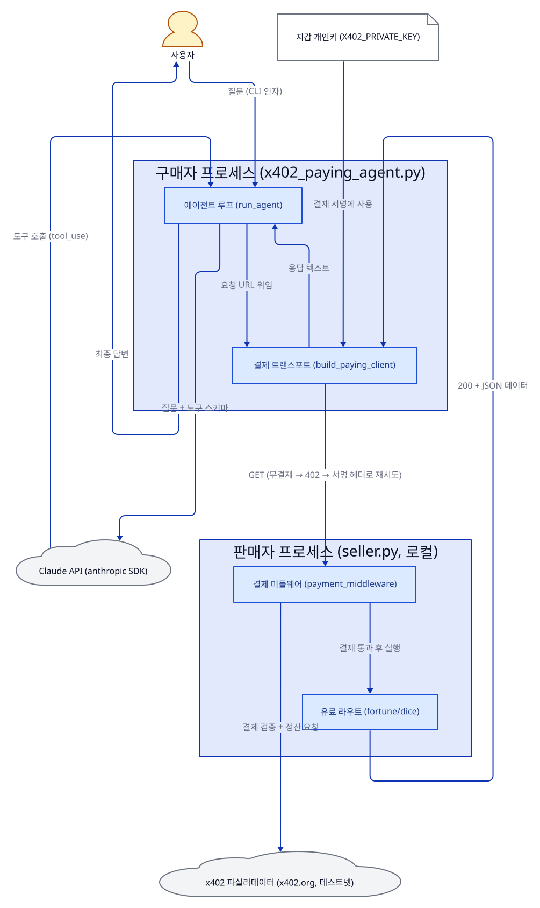
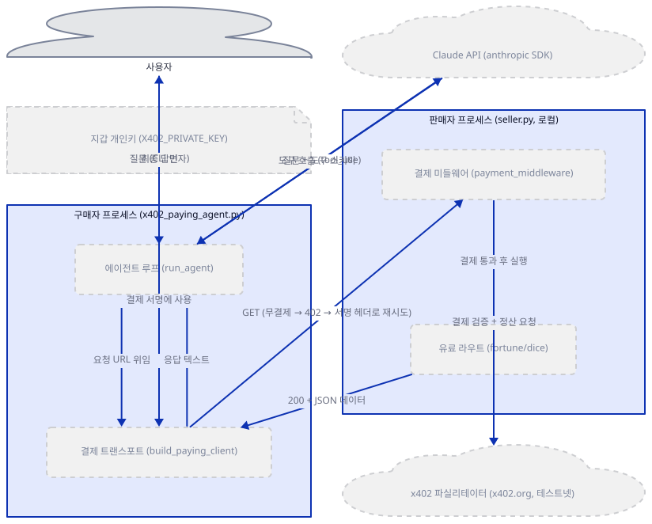
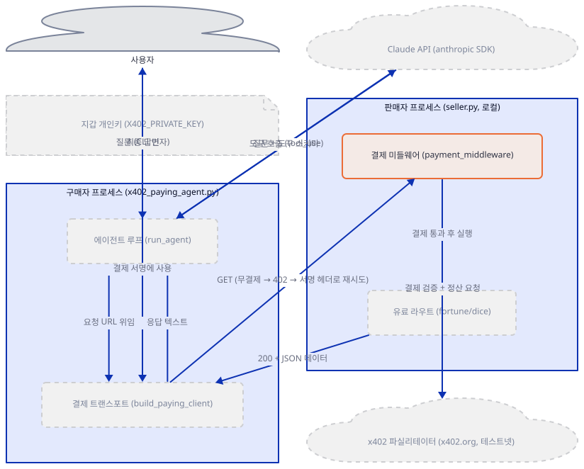
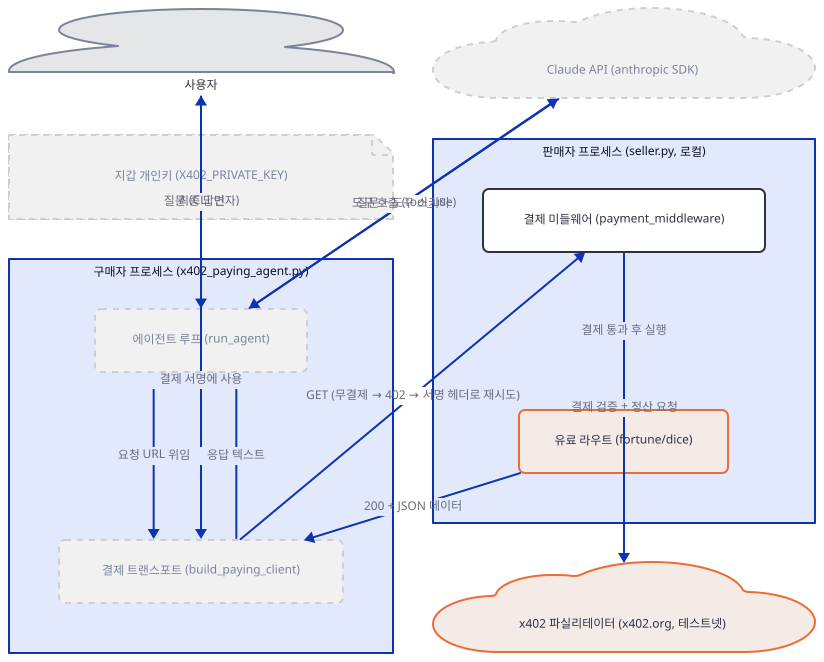
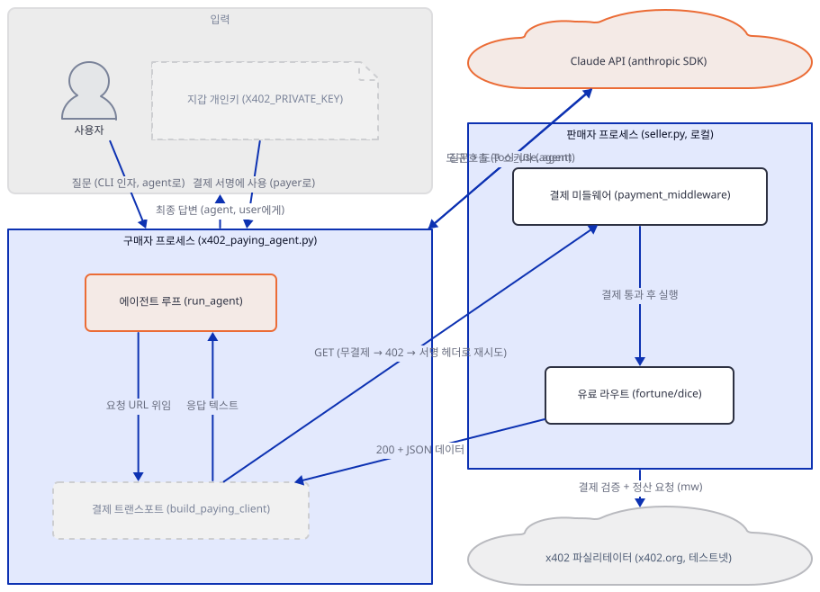
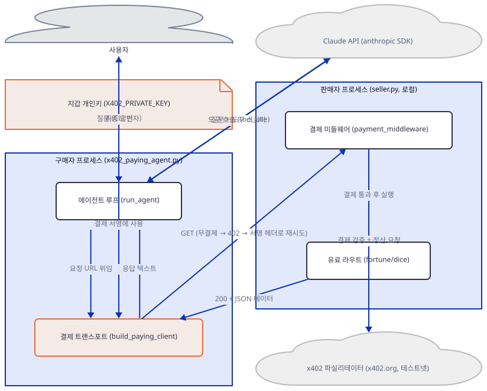
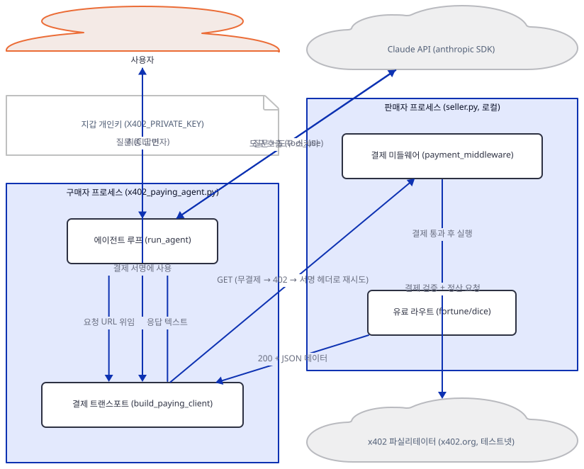
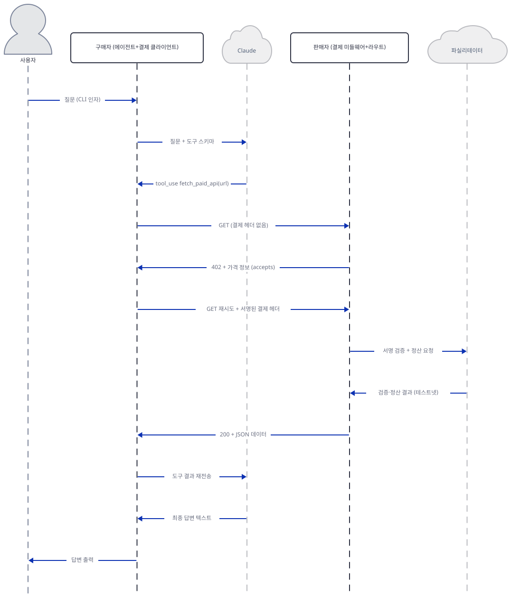

# Day 010 · 💸 AI x402 Paying Agent

> 볼륨 1 🌱 Starter AI Agents · 난이도 ★★☆ · 예상 소요 70분 · API 비용 대략 무료(테스트넷 전용; 전체 에이전트 모드의 Anthropic 호출 비용은 별도이며 이 문서에서는 호출하지 않음) · 원본 앱: `starter_ai_agents/ai_x402_paying_agent`

## 오늘 만들 것

지금까지 아홉 날은 모두 Streamlit으로 띄운 화면 하나였습니다. 오늘은 다릅니다 — 화면이 없고, 터미널에서 따로 띄우는 **두 개의 독립된 프로세스**로 이루어집니다. 여러분이 직접 값을 매겨 띄우는 유료 API `seller.py`(71줄)와, 그 API가 필요할 때마다 스스로 결제하고 불러 쓰는 구매자 `x402_paying_agent.py`(184줄)입니다. 둘을 잇는 것은 오랫동안 방치돼 있던 HTTP 상태 코드 **402 Payment Required**를 실제로 살려 쓰는 **x402** 프로토콜(현재 Linux Foundation 산하)입니다. 사용자가 질문하면 Claude가 어떤 유료 API로 답할지 고르고 도구를 호출합니다. 그 API가 결제 없이 오면 402와 가격을 돌려주고, 에이전트는 자신의 지갑에서 USDC로 그 값을 지불한 뒤 같은 요청을 재시도해 데이터를 받습니다. API 키도, 가입도, 구독도 없이 지갑 하나로 데이터를 사는 구조입니다.

Step 1보다 먼저 분명히 해 둘 것이 있습니다. **이 튜토리얼은 어떤 단계에서도 실제 돈을 움직이지 않습니다.** 결제는 Base Sepolia라는 테스트넷 위의, 시장 가치가 없는 테스트용 USDC로만 정산되도록 앱 자체 `README.md`가 설계해 두었고, 여러분은 구매자와 판매자를 동시에 맡아 성공한 결제조차 여러분의 테스트 지갑에서 나와 여러분이 만든 다른 주소로 들어갈 뿐입니다. 이 문서는 실제 결제 한 건을 끝까지 실행하지 않습니다 — 파우셋에서 테스트 자금을 받는 절차를 밟지 않았기 때문이며, 이는 이 시리즈가 API 키를 환경에 두지 않는 것과 같은 원칙입니다. 대신 결제 없이 오가는 402 교환은 실제로 실행해 그 응답을 그대로 실었고, 서명·재시도·정산 로직은 소스를 읽어 설명하되 실행하지 않았다고 분명히 표시합니다 — Day 7이 실제 브라우저를 여는 호출을 의도적으로 실행하지 않은 것과 같은 방식입니다. 실제로 지갑을 마련해 끝까지 따라 하더라도 반드시 테스트 전용 지갑만 쓰고, 메인넷 자금이 있는 지갑은 이 코드 근처에도 두지 마세요.

완성하면 로컬에 값을 매긴 API(운세, 주사위 눈)를 하나 띄우고, 별도 터미널의 에이전트에게 "주사위를 굴리고 운세를 알려줘" 같은 질문을 던져 그 답이 결제 시도를 거쳐 돌아오는 구조를 코드 수준에서 완전히 이해하게 됩니다. 아래는 완성된 아키텍처입니다.



## 사전 준비

| 서비스/도구 | 용도 | 발급·설치 |
|---|---|---|
| EVM 지갑 두 개(구매자 개인키·판매자 주소) | 구매자는 결제에 서명하고 판매자는 그 결제를 받음(둘 다 자금이 없어도 생성 자체는 가능) | `python -c "from eth_account import Account; a=Account.create(); print(a.address, a.key.hex())"`로 즉석에서 생성(앱 README와 동일한 방법). 반드시 새 테스트 전용 지갑만 사용 |
| Base Sepolia 테스트넷 USDC (선택, 이 문서는 받지 않음) | 구매자 지갑에 결제 자금을 채워야 실제 결제가 끝까지 성공함 | https://faucet.circle.com 에서 Base Sepolia 선택 후 구매자 주소에 무료 발급(가스 토큰 불필요) |
| Anthropic API 키 (선택, 전체 에이전트 모드에만 필요) | Claude가 질문을 해석하고 도구를 호출하도록 인증. `--direct` 모드는 필요 없음 | https://console.anthropic.com |
| uv | 가상환경 생성과 패키지 설치 | [공통 사전 준비](../README.md#공통-사전-준비-한-번만) 절 참고 |
| 인터넷 연결 | 로컬 판매자조차 x402.org 파실리테이터에 접속해 결제 조건을 동기화하므로, 결제 없는 402 확인에도 필요 | 별도 설치 없음 |

## 아키텍처 한눈에 보기

| 컴포넌트 | 역할 | 코드 위치 |
|---|---|---|
| 사용자 | 터미널에서 질문을 CLI 인자로 실행 | 코드 없음 (터미널) |
| 지갑 개인키 (`X402_PRIVATE_KEY`) | 구매자가 결제에 서명할 때 쓰는 자격증명, 환경변수로 전달 | 코드 없음 (환경변수) |
| 에이전트 루프 (`run_agent`) | Claude에게 질문과 도구 스키마를 보내고, 도구 호출이 오면 결제 트랜스포트에 위임한 뒤 결과를 되돌려 최종 답을 받음 | `starter_ai_agents/ai_x402_paying_agent/x402_paying_agent.py:116-150` |
| 결제 트랜스포트 (`build_paying_client`) | 402 응답을 받으면 EIP-712로 결제를 서명해 같은 요청을 재시도하는 httpx 클라이언트를 조립하고, 예산 상한을 강제 | `starter_ai_agents/ai_x402_paying_agent/x402_paying_agent.py:84-105` |
| Claude API | 질문을 해석해 어떤 유료 엔드포인트를 부를지 결정하고, 도구 결과로 최종 답을 작성 | 코드 없음 (외부 서비스, Anthropic) |
| 결제 미들웨어 (`payment_middleware`) | 결제 없는 요청에 402와 가격을 돌려주고, 결제 있는 요청은 파실리테이터로 검증·정산한 뒤에만 라우트를 실행 | `starter_ai_agents/ai_x402_paying_agent/seller.py:21-42` |
| 유료 라우트 (`fortune`/`dice`) | 결제가 통과된 요청에만 실제 데이터(운세, 주사위 눈)를 반환 | `starter_ai_agents/ai_x402_paying_agent/seller.py:44-71` |
| x402 파실리테이터 | 서명을 검증하고 Base Sepolia 테스트넷에 정산 트랜잭션을 대신 제출 | 코드 없음 (외부 서비스, x402.org) |

## 단계별 진행

### Step 1. 환경 만들기

**목적.** 이 앱의 의존성을 설치하고, 두 파일이 각각 71줄·184줄이라는 것과 `requirements.txt`가 고정한 여섯 패키지가 실제로 그대로 설치되는지 확인합니다. 특히 `anthropic==1.2.0`처럼 낮아 보이는 버전 고정이 실제로 존재하고 설치되는 버전인지를 직접 확인합니다.

**할 일.**

```bash
cd starter_ai_agents/ai_x402_paying_agent
uv venv
uv pip install -r requirements.txt
```

(pip을 쓴다면 `python -m venv .venv && source .venv/bin/activate && pip install -r requirements.txt`.)

이 저장소는 루트에 `pyproject.toml`이 있어 `uv run`이 방금 만든 환경 대신 루트의 `.venv`를 쓰므로, 이후 `uv run` 명령에는 모두 `--no-project`를 붙입니다.

`starter_ai_agents/ai_x402_paying_agent/requirements.txt:1-6`

```text
anthropic==1.2.0
x402[evm,httpx,fastapi]==2.21.0
eth-account==0.14.0
httpx==0.28.1
fastapi==0.141.1
uvicorn==0.52.4
```

여섯 줄 모두 정확히 이 버전대로 설치됩니다(직접 확인, Python 3.12). `anthropic==1.2.0`은 낮아 보이지만 실제로 PyPI에 존재하며 설치도 깨끗이 되고, 직접 확인한 최신 버전(1.5.0)과 비교해도 몇 마이너 버전 뒤처졌을 뿐 폐기된 버전은 아닙니다. `x402[evm,httpx,fastapi]`의 대괄호 extras는 EVM 서명·httpx 클라이언트·FastAPI 미들웨어에 필요한 패키지(`eth-account`, `web3`, `starlette` 등)를 함께 설치하라는 표시이며, 실제로 84개 패키지가 한 번에 딸려 옵니다(직접 확인) — 암호화 라이브러리가 섞여 있어 설치가 다소 오래 걸릴 수 있습니다.



**확인.**

```bash
uv run --no-project python -m py_compile seller.py x402_paying_agent.py && echo compiled
```

```
compiled
```

```bash
uv run --no-project python -c "import anthropic; print(anthropic.__version__)"
```

```
1.2.0
```

```bash
uv pip install anthropic --upgrade --dry-run
```

직접 확인한 출력(마지막 4줄, 최신 버전이 1.5.0임을 보여줍니다):

```
 - anthropic==1.2.0
 + anthropic==1.5.0
```

### Step 2. 판매자: 가격표와 결제 미들웨어

**목적.** `seller.py`가 무엇을 얼마에 파는지 선언하고, 결제 없는 요청과 결제 있는 요청을 가르는 미들웨어를 한 줄로 앱에 붙이는 부분을 봅니다. 여기서 `NETWORK` 상수가 이 앱 전체에서 유일한 "테스트넷 경계"라는 것도 확인합니다.

**할 일.**

`starter_ai_agents/ai_x402_paying_agent/seller.py:21-25`

```python
from fastapi import FastAPI
from x402 import x402ResourceServer
from x402.http import HTTPFacilitatorClient  # defaults to https://x402.org/facilitator (testnet)
from x402.http.middleware.fastapi import payment_middleware
from x402.mechanisms.evm.exact.server import ExactEvmScheme
```

`starter_ai_agents/ai_x402_paying_agent/seller.py:27-42`

```python
PAY_TO = os.environ.get("SELLER_ADDRESS")
if not PAY_TO:
    sys.exit("Set SELLER_ADDRESS to an EVM address that should receive the (testnet) payments.")

NETWORK = "eip155:84532"  # Base Sepolia; the facilitator settles testnet USDC for free

server = x402ResourceServer(HTTPFacilitatorClient())
server.register(NETWORK, ExactEvmScheme())

ROUTES = {
    "GET /api/fortune": {"accepts": {"scheme": "exact", "network": NETWORK, "payTo": PAY_TO, "price": "$0.001"}},
    "GET /api/dice": {"accepts": {"scheme": "exact", "network": NETWORK, "payTo": PAY_TO, "price": "$0.002"}},
}

app = FastAPI(title="x402 demo seller")
app.middleware("http")(payment_middleware(ROUTES, server))
```

`"eip155:84532"`는 CAIP-2 형식의 체인 식별자로, `84532`는 Base Sepolia의 체인 ID입니다 — 이 한 줄이 이 앱에서 "테스트넷"과 "메인넷"을 가르는 유일한 경계입니다. `HTTPFacilitatorClient()`는 인자 없이 만들면 `https://x402.org/facilitator`(23행 주석)를 가리키며, 테스트넷·메인넷을 모두 처리하는 공용 서비스라 실제로 어느 쪽에서 검증·정산할지는 오직 `NETWORK` 값이 정합니다. `payment_middleware(ROUTES, server)`는 FastAPI의 모든 요청을 가로채 `ROUTES`에 등록된 경로(`GET /api/fortune`, `GET /api/dice`)만 결제를 요구하고, 나머지는 그냥 통과시키는 함수형 미들웨어입니다. `price": "$0.001"`처럼 사람이 읽는 달러 문자열을 적어 두면, 미들웨어가 이를 USDC의 최소 단위(10⁻⁶ USDC)로 환산해 실제 402 응답에 넣습니다.



**확인.** `SELLER_ADDRESS`를 설정하지 않은 상태에서 모듈을 임포트만 해 봅니다.

```bash
uv run --no-project python -c "import seller"
```

```
Set SELLER_ADDRESS to an EVM address that should receive the (testnet) payments.
```

(직접 확인. 종료 코드 1 — 29행의 `sys.exit`가 임포트 시점에 바로 실행되기 때문입니다.)

### Step 3. 판매자 실행과 402 확인

**목적.** 실제로 서버를 띄우고, 결제 없이 요청을 보내면 무엇이 돌아오는지 직접 눈으로 봅니다. 이 요청 한 번으로 유료 라우트 코드와, 판매자가 파실리테이터에 접속해 조건을 동기화하는 과정이 함께 드러납니다.

**할 일.**

`starter_ai_agents/ai_x402_paying_agent/seller.py:44-71`

```python
FORTUNES = [
    "The bug you are hunting is in the file you refuse to reopen.",
    "A small refactor today prevents a large rewrite in December.",
    "Your next deploy will be boring. This is the highest compliment.",
    "Trust the failing test; it is the only one telling the truth.",
    "You will receive a pull request you actually enjoy reviewing.",
    "An agent that can pay for data never has to beg for API keys.",
]


@app.get("/api/fortune")
def fortune():
    return {
        "fortune": random.choice(FORTUNES),
        "issued_at": datetime.now(timezone.utc).isoformat(),
        "paid": True,
    }


@app.get("/api/dice")
def dice(sides: int = 20):
    sides = max(2, min(sides, 1000))
    return {
        "roll": random.randint(1, sides),
        "sides": sides,
        "rolled_at": datetime.now(timezone.utc).isoformat(),
        "paid": True,
    }
```

두 함수 다 평범한 FastAPI 라우트일 뿐, 결제 관련 코드가 전혀 없습니다 — 402 판단과 검증은 전부 Step 2의 미들웨어가 대신 처리하고, 이 함수들은 결제가 통과된 뒤에야 호출됩니다. 판매자 주소는 받기만 하면 되므로 자금이 전혀 없어도 됩니다 — 아래 확인에서 방금 생성한, 잔액이 0인 주소를 그대로 판매자 주소로 씁니다(직접 확인).



**확인.** 자금 없는 주소를 판매자 주소로 쓰고, 결제 헤더 없이 호출합니다.

```bash
uv run --no-project python -c "from eth_account import Account; a = Account.create(); print(a.address)"
```

직접 확인한 출력(주소는 실행마다 무작위로 새로 생성되며, 아래는 실제로 나온 값입니다):

```
0x3B70C3F31AbE6eA6d49C1e7DAe32DB5491C13269
```

```bash
export SELLER_ADDRESS="0x3B70C3F31AbE6eA6d49C1e7DAe32DB5491C13269"
uv run --no-project uvicorn seller:app --port 4021
```

(PowerShell: `$env:SELLER_ADDRESS="0x3B70C3F31AbE6eA6d49C1e7DAe32DB5491C13269"`)

다른 터미널에서:

```bash
curl -i http://localhost:4021/api/fortune
```

직접 확인한 출력(발췌):

```
HTTP/1.1 402 Payment Required
content-type: application/json
payment-required: eyJ4NDAyVmVyc2lvbiI6MiwiZXJyb3IiOiJQYXltZW50IHJlcXVpcmVkIiwicmVzb3VyY2UiOnsidXJsIjoiaHR0cDovL2xvY2FsaG9zdDo0MDIxL2FwaS9mb3J0dW5lIiwiZGVzY3JpcHRpb24iOiIiLCJtaW1lVHlwZSI6IiJ9LCJhY2NlcHRzIjpbeyJzY2hlbWUiOiJleGFjdCIsIm5ldHdvcmsiOiJlaXAxNTU6ODQ1MzIiLCJhc3NldCI6IjB4MDM2Q2JENTM4NDJjNTQyNjYzNGU3OTI5NTQxZUMyMzE4ZjNkQ0Y3ZSIsImFtb3VudCI6IjEwMDAiLCJwYXlUbyI6IjB4M0I3MEMzRjMxQWJFNmVBNmQ0OUMxZTdEQWUzMkRCNTQ5MUMxMzI2OSIsIm1heFRpbWVvdXRTZWNvbmRzIjozMDAsImV4dHJhIjp7Im5hbWUiOiJVU0RDIiwidmVyc2lvbiI6IjIifX1dfQ==
cache-control: no-store
content-length: 2

{}
```

`payment-required` 헤더는 base64로 인코딩돼 있습니다. 그대로 디코딩하면:

```bash
echo "eyJ4NDAyVmVyc2lvbiI6MiwiZXJyb3IiOiJQYXltZW50IHJlcXVpcmVkIiwicmVzb3VyY2UiOnsidXJsIjoiaHR0cDovL2xvY2FsaG9zdDo0MDIxL2FwaS9mb3J0dW5lIiwiZGVzY3JpcHRpb24iOiIiLCJtaW1lVHlwZSI6IiJ9LCJhY2NlcHRzIjpbeyJzY2hlbWUiOiJleGFjdCIsIm5ldHdvcmsiOiJlaXAxNTU6ODQ1MzIiLCJhc3NldCI6IjB4MDM2Q2JENTM4NDJjNTQyNjYzNGU3OTI5NTQxZUMyMzE4ZjNkQ0Y3ZSIsImFtb3VudCI6IjEwMDAiLCJwYXlUbyI6IjB4M0I3MEMzRjMxQWJFNmVBNmQ0OUMxZTdEQWUzMkRCNTQ5MUMxMzI2OSIsIm1heFRpbWVvdXRTZWNvbmRzIjozMDAsImV4dHJhIjp7Im5hbWUiOiJVU0RDIiwidmVyc2lvbiI6IjIifX1dfQ==" | base64 -d
```

```
{"x402Version":2,"error":"Payment required","resource":{"url":"http://localhost:4021/api/fortune","description":"","mimeType":""},"accepts":[{"scheme":"exact","network":"eip155:84532","asset":"0x036CbD53842c5426634e7929541eC2318f3dCF7e","amount":"1000","payTo":"0x3B70C3F31AbE6eA6d49C1e7DAe32DB5491C13269","maxTimeoutSeconds":300,"extra":{"name":"USDC","version":"2"}}]}
```

`amount`가 `"1000"`인 것은 `$0.001`을 USDC의 6자리 소수(10⁻⁶ 단위)로 나타낸 값이고, `network`가 `"eip155:84532"`, `payTo`가 방금 만든 그 주소인 것도 그대로 확인됩니다 — 판매자가 자금 없이도 정확한 가격 정보를 돌려준다는 뜻입니다. 이 응답 하나가 나오기까지 판매자 프로세스는 실제로 x402.org 파실리테이터에 접속해 지원하는 결제 방식을 동기화합니다(설치된 `x402` 패키지의 FastAPI 미들웨어 소스로 확인) — 이 환경에서는 인터넷이 있어 바로 성공했습니다. `/api/dice`도 같은 방식으로 402를 돌려줍니다(가격만 `$0.002`로 다름, 직접 확인).

### Step 4. 구매자: 도구와 지시문

**목적.** Claude가 "어떤 API가 있고 얼마인지"를 어디서 알게 되는지, 그리고 Claude가 실제로 호출할 수 있는 도구가 몇 개인지 정확히 봅니다.

**할 일.**

`starter_ai_agents/ai_x402_paying_agent/x402_paying_agent.py:34-38`

```python
USDC_DECIMALS = 6  # 1 USDC = 10**6 atomic units; x402 amounts are atomic strings

# Demo catalog: the paid API you run yourself with seller.py (testnet USDC on Base
# Sepolia, fractions of a cent). The payment code is generic — swap in any x402 API.
SELLER = os.environ.get("SELLER_URL", "http://localhost:4021")
```

`starter_ai_agents/ai_x402_paying_agent/x402_paying_agent.py:40-60`

```python
DEMO_ENDPOINTS = f"""
Available paid data endpoints (x402, USDC on Base Sepolia testnet):

1. Fortune of the day — $0.001/call
   GET {SELLER}/api/fortune
   A paid fortune with an issue timestamp.

2. Certified dice roll — $0.002/call
   GET {SELLER}/api/dice?sides=<n>
   A random roll of an n-sided die (default 20).
"""

SYSTEM_PROMPT = f"""You are a data agent with a crypto wallet. You can call paid APIs — when one
responds with HTTP 402 Payment Required, your fetch tool automatically pays the quoted price
in USDC and retrieves the data.

{DEMO_ENDPOINTS}

When the user's question maps to one of these endpoints, call fetch_paid_api with the full URL
(including query parameters). Answer from the returned data only — quote the key numbers.
If the question doesn't match any endpoint, say so instead of guessing."""
```

`starter_ai_agents/ai_x402_paying_agent/x402_paying_agent.py:62-81`

```python
TOOLS = [
    {
        "name": "fetch_paid_api",
        "description": (
            "Fetch a URL, automatically paying an x402 HTTP 402 challenge in USDC if the API "
            "requires payment. Call this when the user's question requires paid data. "
            "Returns the response body as JSON text."
        ),
        "input_schema": {
            "type": "object",
            "properties": {
                "url": {
                    "type": "string",
                    "description": "Full URL to fetch, including any query parameters.",
                }
            },
            "required": ["url"],
        },
    }
]
```

Claude가 아는 가격은 딱 두 군데뿐입니다 — `DEMO_ENDPOINTS`에 하드코딩된 "$0.001/call", "$0.002/call"이라는 문자열입니다. 이건 프롬프트에 박힌 안내일 뿐 실시간 값이 아니라서, 판매자가 가격을 바꿔도 Claude는 재배포 전까지 옛 가격을 그대로 믿습니다. 실제로 얼마를 낼지 강제하는 권위 있는 값은 따로 있습니다 — Step 3에서 직접 받은 402 응답의 `accepts[].amount`입니다. 이 앱에서는 둘이 우연히 같지만($0.001 = 1000/10⁶), 이 둘이 서로 다른 경로로 정해진다는 것이 핵심입니다. 도구는 `fetch_paid_api` 단 하나뿐이고 파라미터도 `url` 하나뿐입니다 — Day 1의 `YFinanceTools`처럼 기능별 함수가 여럿 있는 게 아니라, "URL을 가져와라"는 범용 도구 하나에 결제 로직을 통째로 숨겨 둔 구조입니다. 이 시점에는 아직 `anthropic.Anthropic()` 클라이언트를 만들지 않으므로 `ANTHROPIC_API_KEY`가 없어도 모듈 임포트 자체는 성공합니다(직접 확인).



**확인.**

```bash
uv run --no-project python -c "import x402_paying_agent as m; print([t['name'] for t in m.TOOLS]); print(m.SELLER)"
```

```
['fetch_paid_api']
http://localhost:4021
```

### Step 5. 구매자: 결제 클라이언트와 예산 상한

**목적.** 402를 받았을 때 실제로 무엇이 서명을 만드는지, 그리고 그 서명이 개인키를 언제 사용하는지 — 클라이언트를 "만드는 것"과 "요청을 보내는 것"이 코드에서 분리돼 있다는 것 — 을 정확히 확인합니다.

**할 일.**

`starter_ai_agents/ai_x402_paying_agent/x402_paying_agent.py:84-105`

```python
def build_paying_client(private_key: str, max_price_usdc: Decimal) -> httpx.AsyncClient:
    """httpx client that auto-pays 402 challenges, refusing anything above max_price_usdc."""
    signer = EthAccountSigner(Account.from_key(private_key))
    client = x402Client()
    cap_atomic = int(max_price_usdc * (10**USDC_DECIMALS))

    def _budget_cap(version, accepts):
        allowed = [
            a
            for a in accepts
            if int(getattr(a, "amount", None) or getattr(a, "max_amount_required", 0) or 0) <= cap_atomic
        ]
        if not allowed:
            raise ValueError(
                f"Refusing to pay: cheapest payment option exceeds the ${max_price_usdc} per-call cap. "
                "Raise MAX_PRICE_USDC if this is intentional."
            )
        return allowed

    client.register_policy(_budget_cap)
    client.register("eip155:*", ExactEvmScheme(signer))
    return x402HttpxClient(client, follow_redirects=True, timeout=60.0)
```

`Account.from_key(private_key)`는 개인키 문자열을 eth-account의 로컬 계정 객체로 바꾸고, `EthAccountSigner`는 그 계정으로 서명하는 x402 SDK 쪽 어댑터입니다. 설치된 `x402` 패키지 소스로 확인하면, 실제 서명은 EIP-3009(`transferWithAuthorization`) 메시지를 EIP-712로 **로컬에서, 네트워크 접속 없이** 만드는 것이 전부입니다 — 잔액·가스비·논스 조회가 필요 없는 오프라인 연산으로, 앱 README의 "x402 payments are gasless for both sides"와 일치합니다. `_budget_cap`은 402 응답의 `accepts` 목록 중 `amount`가 `cap_atomic`(=`MAX_PRICE_USDC` × 10⁶) 이하인 것만 통과시키고, 하나도 없으면 `ValueError`를 던져 결제 자체를 막습니다 — Step 3에서 받은 `amount: "1000"`은 기본 상한 `$0.05`(=50000 atomic) 이하이므로 통과됩니다. `client.register("eip155:*", ExactEvmScheme(signer))`의 와일드카드가 중요합니다 — 구매자 코드 어디에도 `84532`나 "테스트넷" 같은 문자열이 없습니다. 이 함수는 세 객체를 조립할 뿐 아직 아무 요청도 보내지 않으므로, 개인키가 있어도 이 시점까지는 네트워크에 아무것도 나가지 않습니다(직접 확인 — 아래처럼 실제 요청 없이 만들고 곧바로 닫아도 오류가 없습니다).



**확인.** 실제 요청은 보내지 않고, 클라이언트 조립까지만 직접 실행합니다.

```bash
uv run --no-project python -c "
from eth_account import Account
from decimal import Decimal
import x402_paying_agent as m
throwaway = Account.create()
client = m.build_paying_client(throwaway.key.hex(), Decimal('0.05'))
print(type(client).__name__)
import asyncio
asyncio.run(client.aclose())
print('no request made')
"
```

```
x402HttpxClient
no request made
```

(`throwaway`는 이 확인만을 위해 그 자리에서 새로 만든, 자금이 전혀 없는 키입니다 — 실제 결제는 여기서 시도하지 않았습니다.)

### Step 6. 결제 재시도, 지갑 자금, 실행 모드

**목적.** 402 이후 재시도가 실제로 어떻게 일어나는지, 지갑에 자금이 없으면 어디서 막히는지, 그리고 `--direct`와 전체 에이전트 두 실행 모드가 오류를 다르게 다룬다는 것을 확인합니다. 이 단계에서 이 문서가 실제 결제를 실행하지 않는 지점도 다시 짚습니다.

**할 일.**

`starter_ai_agents/ai_x402_paying_agent/x402_paying_agent.py:108-113`

```python
async def paid_fetch(url: str, private_key: str, max_price_usdc: Decimal) -> str:
    async with build_paying_client(private_key, max_price_usdc) as client:
        resp = await client.get(url)
        if resp.status_code != 200:
            return f"Request failed: HTTP {resp.status_code}: {resp.text[:300]}"
        return resp.text
```

`starter_ai_agents/ai_x402_paying_agent/x402_paying_agent.py:123-149`

```python
    while True:
        response = client.messages.create(
            model=model,
            max_tokens=2048,
            system=SYSTEM_PROMPT,
            tools=TOOLS,
            messages=messages,
        )
        if response.stop_reason != "tool_use":
            for block in response.content:
                if block.type == "text":
                    print(block.text)
            return

        messages.append({"role": "assistant", "content": response.content})
        tool_results = []
        for block in response.content:
            if block.type == "tool_use":
                url = block.input["url"]
                print(f"→ fetching (paying if challenged): {url}", file=sys.stderr)
                try:
                    result = asyncio.run(paid_fetch(url, private_key, max_price_usdc))
                except Exception as exc:  # payment refused, network error, etc.
                    result = f"Error: {exc}"
                tool_results.append(
                    {"type": "tool_result", "tool_use_id": block.id, "content": result}
                )
```

`starter_ai_agents/ai_x402_paying_agent/x402_paying_agent.py:163-180`

```python
    private_key = os.environ.get("X402_PRIVATE_KEY")
    if not private_key:
        sys.exit("Set X402_PRIVATE_KEY to a wallet private key holding testnet USDC on Base Sepolia (free from https://faucet.circle.com).")
    max_price = Decimal(os.environ.get("MAX_PRICE_USDC", "0.05"))

    if args.direct:
        body = asyncio.run(paid_fetch(args.direct, private_key, max_price))
        try:
            print(json.dumps(json.loads(body), indent=2))
        except json.JSONDecodeError:
            print(body)
        return

    if not args.question:
        parser.error("Provide a question, or use --direct <URL>")
    if not os.environ.get("ANTHROPIC_API_KEY"):
        sys.exit("Set ANTHROPIC_API_KEY (or use --direct <URL> for the no-LLM payment demo).")
    run_agent(args.question, private_key, max_price)
```

`paid_fetch`는 `build_paying_client`가 돌려주는 클라이언트로 URL 하나를 `GET`할 뿐입니다 — 첫 요청이 402로 돌아오면(Step 3에서 본 그 응답), 클라이언트 내부의 전송 계층이 자동으로 Step 5의 서명을 만들어 **같은 URL에 결제 헤더를 얹어 재시도**합니다. 이 재시도는 구매자가 직접 파실리테이터에 접속하는 것이 아니라 판매자에게만 다시 보내는 것이고, 서명을 검증해 Base Sepolia에 정산을 제출하는 것은 판매자 프로세스 안의 미들웨어입니다(설치된 x402 패키지 소스로 확인) — 구매자와 파실리테이터 사이에는 직접 연결이 없습니다. `run_agent`의 `while True` 루프는 agno의 `Agent.run()`이 감춰 왔던 도구 호출 왕복을 그대로 드러냅니다: Claude가 `tool_use`를 돌려주지 않으면(131행) 텍스트를 출력하고 끝나고, `tool_use`면 `paid_fetch`를 호출해 결과를 `tool_result`로 묶어 다시 `messages`에 넣고 루프 맨 위로 돌아갑니다(150행, 별도 인용 생략). 여기서 도구 호출 하나마다 `try/except`(145-146행)로 감싸 실패를 `Error: ...` 문자열로 바꿔 Claude에게 넘긴다는 점이 중요합니다 — 반면 168-174행의 `--direct` 분기에는 이런 보호가 없어, `paid_fetch`가 실패하면(예산 상한 초과, 잔액 부족 등) 예외가 그대로 터미널까지 올라갑니다.

정리하면, 결제 없는 앞부분(402까지)과 서명이 실린 재시도부터 정산까지의 전체 흐름은 아래 시퀀스 섹션에서 확인합니다.



**확인.**

```bash
uv run --no-project python x402_paying_agent.py --help
```

```
usage: x402_paying_agent.py [-h] [--direct URL] [question]

AI agent that pays for its own data via x402

positional arguments:
  question      Question for the agent

options:
  -h, --help    show this help message and exit
  --direct URL  Skip the LLM: pay-and-fetch this URL directly and print the
                JSON (wallet only, no Anthropic key needed)
```

```bash
uv run --no-project python x402_paying_agent.py
```

```
Set X402_PRIVATE_KEY to a wallet private key holding testnet USDC on Base Sepolia (free from https://faucet.circle.com).
```

(`--direct "http://localhost:4021/api/fortune"`로 실행해도 같은 메시지가 뜹니다 — 163-165행의 검사가 두 모드보다 먼저 실행되기 때문입니다, 직접 확인.)

`run_agent`의 첫 호출이 키가 틀렸을 때 실제로 무엇을 돌려주는지, 같은 호출을 직접 실행해 확인합니다.

```bash
uv run --no-project python -c "
import anthropic
client = anthropic.Anthropic(api_key='fake-key-not-real')
try:
    client.messages.create(model='claude-opus-4-8', max_tokens=16, messages=[{'role':'user','content':'hi'}])
except Exception as e:
    print(type(e).__name__)
    print(str(e)[:200])
"
```

직접 확인한 출력:

```
AuthenticationError
Error code: 401 - {'type': 'error', 'error': {'type': 'authentication_error', 'message': 'invalid x-api-key'}, 'request_id': 'req_011CezHuaZ3F2jWF5FcszpD7'}
```

(`request_id`는 요청마다 무작위로 발급되어 실행마다 달라집니다.)

## 요청 한 건이 흐르는 과정



사용자가 CLI로 질문을 넣으면 `run_agent`가 질문과 `TOOLS` 스키마, `SYSTEM_PROMPT`를 Claude에 보냅니다. Claude가 `fetch_paid_api`를 골라 `tool_use`로 URL을 돌려주면, 에이전트는 그 URL을 `paid_fetch`에 위임합니다. 여기서부터는 구매자와 판매자 사이의 왕복입니다 — 먼저 결제 헤더 없이 `GET`을 보내 402와 가격(`accepts`)을 받고(Step 3에서 실제로 실행), 결제 트랜스포트가 그 가격을 예산 상한과 대조한 뒤 EIP-712로 로컬 서명을 만들어 같은 `GET`을 결제 헤더와 함께 재시도합니다(Step 5·6에서 소스로 확인, 실행하지 않음). 판매자의 미들웨어는 이 서명을 파실리테이터에 보내 검증·정산을 맡기고, 성공해야만 `fortune`/`dice` 라우트를 실제로 실행해 데이터를 돌려줍니다 — 구매자는 파실리테이터와 한 번도 직접 통신하지 않습니다. 이 데이터는 `tool_result`로 다시 Claude에게 전달되고, Claude는 그 값만 근거로 최종 답을 작성해 사용자에게 출력됩니다. 이 그림에서 결제 없는 앞부분(질문부터 402까지, 그리고 402 응답 자체)은 이 문서가 실제로 실행해 얻은 값이고, 서명이 실린 재시도부터 정산까지는 소스를 읽어 재구성한 것이며 실행하지 않았습니다.

## 실행 체크리스트

- [ ] `uv venv && uv pip install -r requirements.txt`로 여섯 패키지를 설치하고 `anthropic==1.2.0`이 그대로 깔리는 것을 확인했다
- [ ] 자금 없는 임시 EVM 주소를 `SELLER_ADDRESS`로 써서 `uv run uvicorn seller:app --port 4021`을 띄웠다
- [ ] `curl -i http://localhost:4021/api/fortune`로 402 응답을 받고 `payment-required` 헤더를 base64로 디코딩해 가격·네트워크·수신 주소를 확인했다
- [ ] `x402_paying_agent.py --help`로 `--direct`와 질문 모드 두 실행 방식을 확인했다
- [ ] `X402_PRIVATE_KEY`/`ANTHROPIC_API_KEY` 없이 실행했을 때 각각 어떤 안내 메시지가 뜨는지 확인했다
- [ ] `build_paying_client`가 조립 시점에는 서명하지 않고, 실제 서명은 오프라인 EIP-712 연산이라는 것을 이해했다
- [ ] 이 문서가 실제 결제(서명이 실린 재시도, 정산)를 실행하지 않았다는 것과 그 이유를 이해했다

## 문제 해결

| 증상 | 원인 | 해결 |
|---|---|---|
| `SELLER_ADDRESS`를 설정하지 않고 `uv run python -c "import seller"`나 `uvicorn seller:app`을 실행하면 `Set SELLER_ADDRESS to an EVM address that should receive the (testnet) payments.` 메시지와 함께 즉시 종료(exit 1) | `starter_ai_agents/ai_x402_paying_agent/seller.py:28-29`의 모듈 최상단 가드가 임포트 시점에 바로 `sys.exit`를 호출한다(직접 확인) | 받을 주소(자금 불필요)를 `export SELLER_ADDRESS=0x...`(PowerShell `$env:SELLER_ADDRESS="0x..."`)로 설정 후 재실행 |
| `x402_paying_agent.py`를 질문과 함께 실행하든 `--direct <URL>`로 실행하든 `X402_PRIVATE_KEY`가 없으면 똑같이 `Set X402_PRIVATE_KEY to a wallet private key ...` 메시지와 함께 종료 | `main()`의 개인키 검사(163-165행)가 `args.direct` 분기보다 먼저 실행되어, "지갑만 있으면 되는" `--direct` 모드도 예외 없이 이 검사를 통과해야 한다(직접 확인) | 유효한 형식의 개인키를 `export X402_PRIVATE_KEY=0x...`(PowerShell `$env:X402_PRIVATE_KEY="0x..."`)로 설정. 실제 결제까지 성공하려면 그 지갑에 테스트 USDC가 있어야 함(이 문서는 여기까지 실행하지 않음) |
| 전체 에이전트 모드(질문 실행)에서 `ANTHROPIC_API_KEY`가 없으면 `Set ANTHROPIC_API_KEY (or use --direct <URL> for the no-LLM payment demo).` 메시지와 함께 종료 | 178-179행이 `args.direct`가 없을 때만 이 검사를 추가로 실행한다(직접 확인) — `anthropic.Anthropic()` 자체는 키 없이도 생성에 성공하지만(직접 확인) 이 앱은 그보다 먼저 걸러 낸다 | `--direct <URL>`로 결제 흐름만 볼 것이 아니라면 `export ANTHROPIC_API_KEY=...`(PowerShell `$env:ANTHROPIC_API_KEY="..."`)로 설정 |
| 로컬 판매자를 방금 띄우고 결제 없이 호출했을 뿐인데도 첫 요청이 느리거나, 방화벽·오프라인 환경에서는 402 대신 다른 오류가 옴 | `payment_middleware`는 기본값(`sync_facilitator_on_start=True`)으로 최초의 보호된 요청에서 실제로 x402.org 파실리테이터에 접속해 지원 스킴을 동기화한다(설치된 `x402` 패키지의 FastAPI 미들웨어 소스로 확인) — 이 문서를 쓴 환경은 인터넷이 있어 바로 성공했다(Step 3) | 인터넷 연결을 확인. 동기화가 실패하면 미들웨어가 502(`{"error": "..."}`)를 대신 돌려준다(소스로 확인, 재현하지 않음) |
| `--direct` 모드에서 결제 자체가 실패하면(예산 상한 초과, 잔액 부족 등) 친절한 안내 대신 파이썬 트레이스백이 그대로 출력됨 | `main()`의 `--direct` 분기(168-174행)에는 `try/except`가 없다(직접 확인, 소스). 반면 전체 에이전트 모드의 도구 호출 루프(145-146행)는 같은 종류의 실패를 `try/except`로 잡아 `Error: ...` 문자열로 Claude에 돌려준다 | 화면에 파이썬 트레이스백이 뜨면 결제 자체(잔액 부족 등)를 의심하고, `--direct`를 스크립트에 쓴다면 호출부를 `try/except`로 감싸는 것을 고려 |

## 더 해보기

- `seller.py`의 `ROUTES`(`starter_ai_agents/ai_x402_paying_agent/seller.py:36-39`)에 세 번째 유료 엔드포인트를 추가하고, `x402_paying_agent.py`의 `DEMO_ENDPOINTS`(`starter_ai_agents/ai_x402_paying_agent/x402_paying_agent.py:40-50`)도 함께 갱신해 Claude가 새 엔드포인트를 골라 쓰는지 확인해보기
- `MAX_PRICE_USDC`를 `$0.0005`처럼 `fortune`의 실제 가격(`$0.001`)보다 낮게 설정해 두고, `_budget_cap`(`starter_ai_agents/ai_x402_paying_agent/x402_paying_agent.py:90-101`)이 던지는 `ValueError` 문구를 실제 자금 없는 키로 재현해보기(파실리테이터 접속은 필요하지만 서명·정산까지는 가지 않음)
- 실제로 https://faucet.circle.com 에서 Base Sepolia 테스트 USDC를 받아 이 문서가 실행하지 않은 마지막 한 걸음 — 서명이 실린 재시도와 실제 정산 — 을 완주해보고, 이번에는 판매자 터미널 로그에 결제 검증이 찍히는지 비교해보기

## 다음 날 예고

[Day 011 · ❤️‍🩹 AI Breakup Recovery Agent](../day011-ai-breakup-recovery-agent/README.md) — 이별을 겪은 사용자에게 여러 에이전트가 각자 다른 방식으로 위로와 조언을 건네는 멀티 에이전트 앱을 다룹니다.
