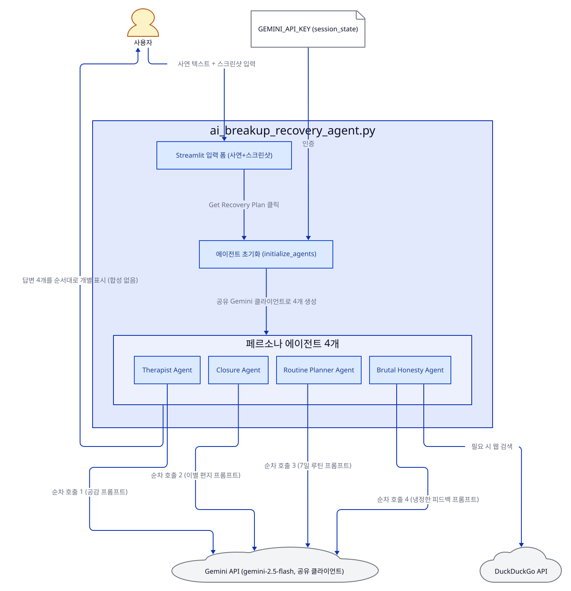
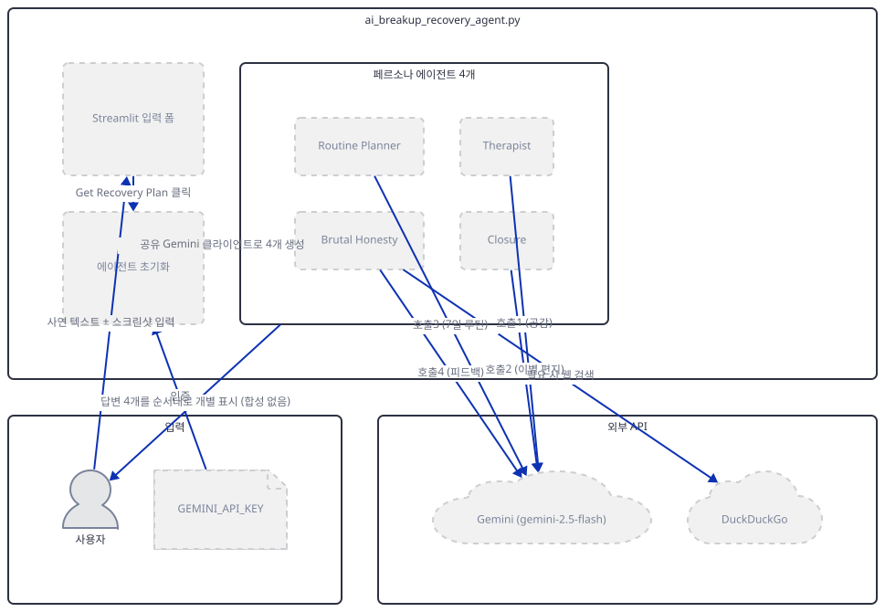
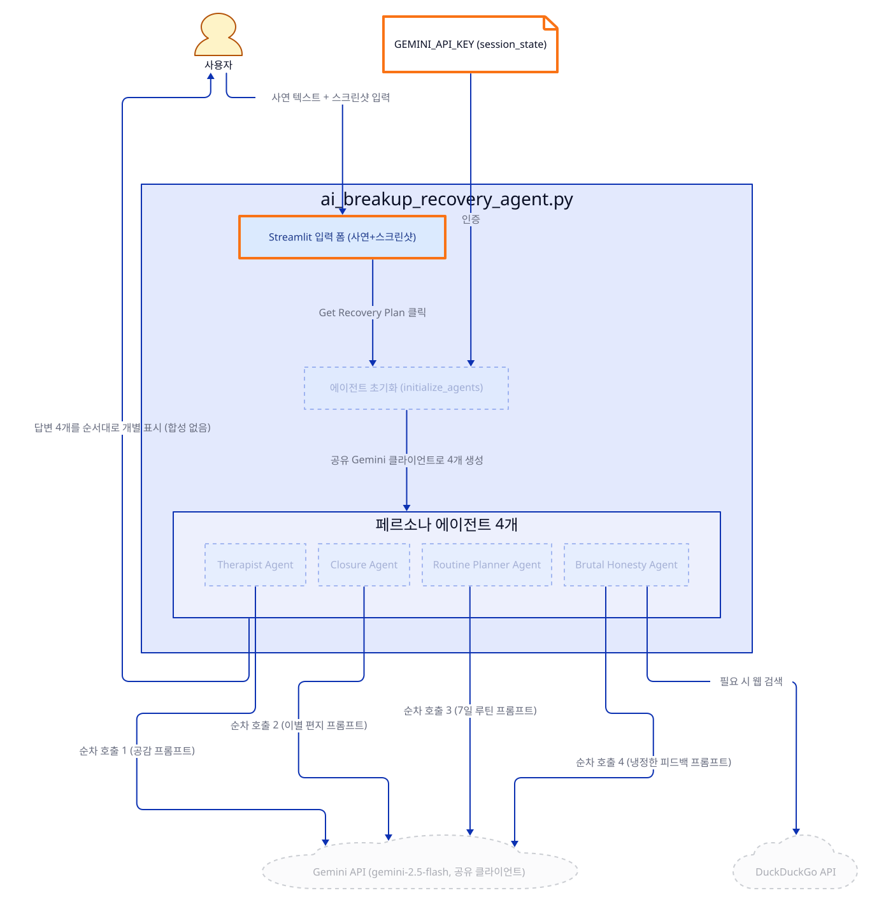
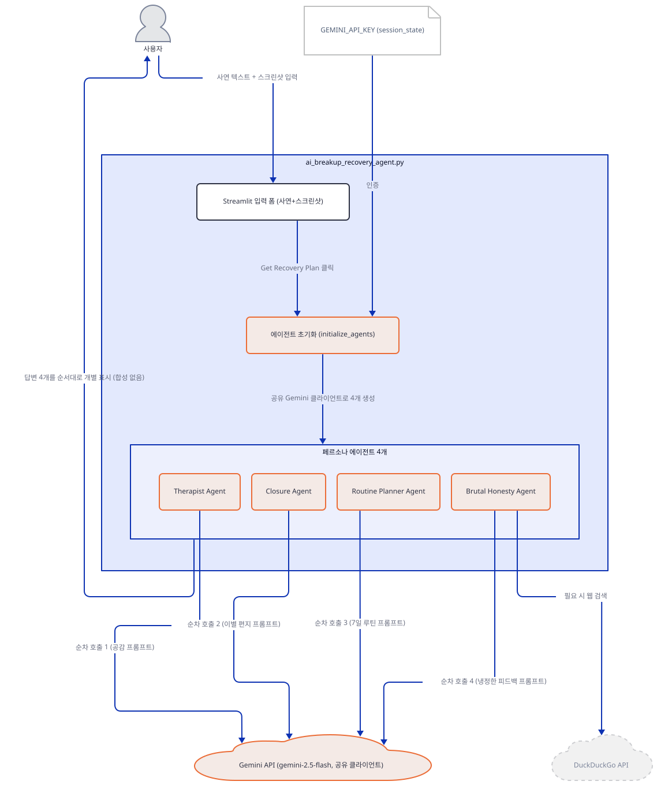
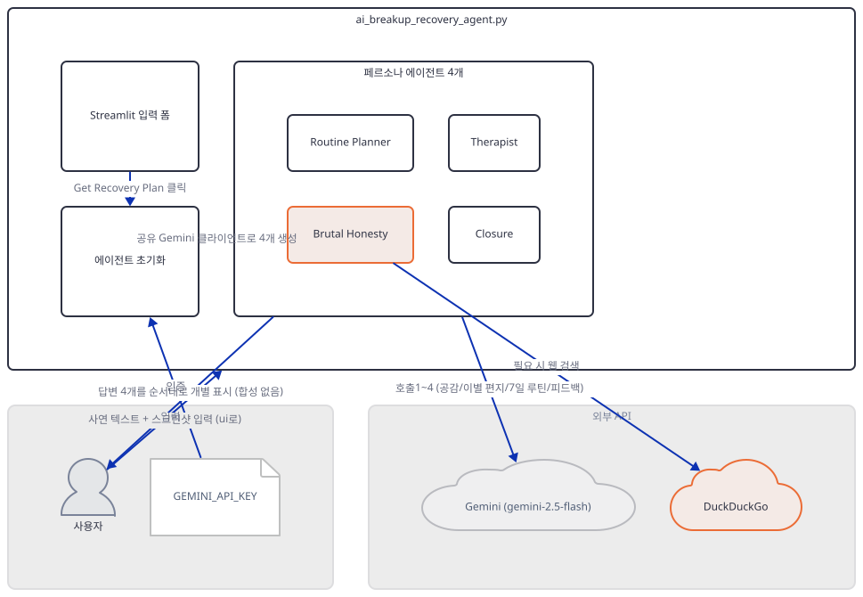
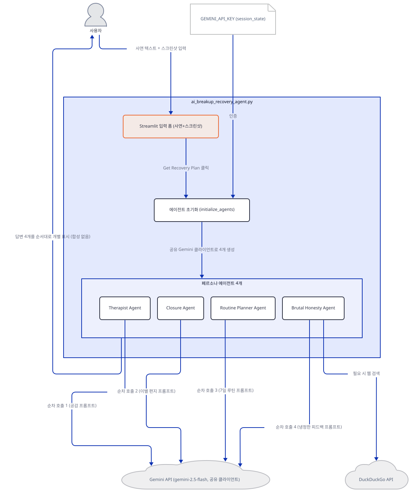
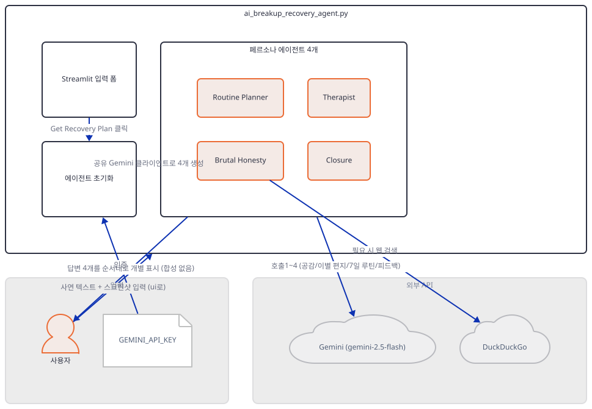
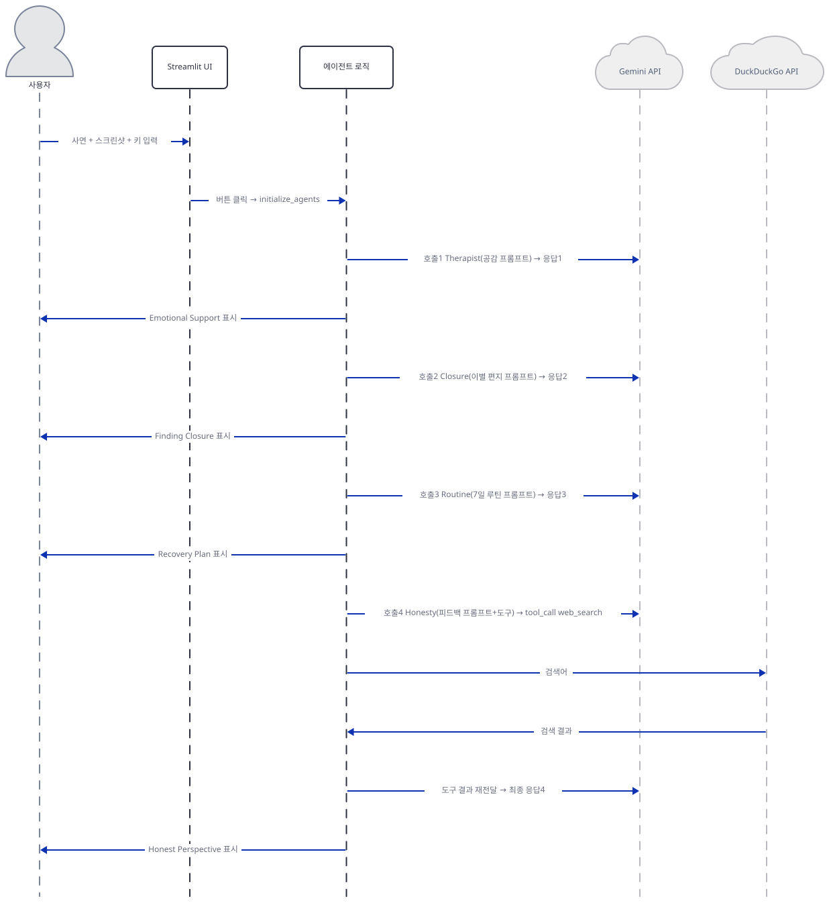

# Day 011 · ❤️‍🩹 AI Breakup Recovery Agent

> 볼륨 1 🌱 Starter AI Agents · 난이도 ★★★ · 예상 소요 65분 · API 비용 대략 실행 1회(에이전트 4개 순차 호출)에 Gemini 2.5 Flash 요금표 기준 수백 원 이하, 대략치 (키가 없어 실제 과금은 확인 못함) · 원본 앱: `starter_ai_agents/ai_breakup_recovery_agent`

## 오늘 만들 것

이번 튜토리얼은 볼륨 1에서 처음 나오는 **멀티 에이전트** Streamlit 앱입니다 — 코드 282줄짜리 파일 하나(`ai_breakup_recovery_agent.py`, 마지막 줄에 개행이 없어 `wc -l`은 281로 세지만 편집기·GitHub에서는 282줄로 보입니다) 안에 이름과 지시문이 다른 `Agent` 4개가 들어 있습니다. `initialize_agents(api_key)`는 `Gemini(id="gemini-2.5-flash", ...)` 모델 객체를 딱 한 번만 만들고, 이 같은 객체를 Therapist·Closure·Routine Planner·Brutal Honesty 네 `Agent`에 그대로 나눠 줍니다 — 네 에이전트의 `.model`이 파이썬 `is` 비교로도 같은 객체라는 것을 직접 확인했습니다. 네 페르소나 중 도구를 받는 것은 Brutal Honesty 하나뿐으로, Day 1과 같은 클래스인 `DuckDuckGoTools()`가 붙어 있습니다. 여러 모델(또는 페르소나)을 한 화면에서 조합하는 구조는 Day 5(Mixture of Agents)가 먼저 다뤘지만, 이 앱의 조합 방식은 그것과 정반대에 가깝습니다 — Day 5는 서로 다른 모델 4개를 병렬로 불러 그 답을 다시 한 모델에게 합성시켰지만, 이 앱은 같은 모델 하나를 순차적으로 4번 부르고 그 4개 답을 합성하지 않은 채 받는 즉시 하나씩 그대로 화면에 얹습니다(직접 확인, Step 6). `initialize_agents`는 캐싱되지 않아 버튼을 누를 때마다 공유 모델과 4개 에이전트를 처음부터 새로 만듭니다(Day 9의 `@st.cache_resource`와 대비). `requirements.txt`(5줄, 역시 마지막 줄 개행 없음)는 Days 8·9를 막았던 죽은 SDK `google-generativeai` 대신 현재 SDK `google-genai==1.9.0`을 정확히 짚어 고정하지만, 직접 설치해 보면 이 버전은 agno 3.0.9가 요구하는 `google.genai.types.FileSearch`보다 낮은 버전이라 여전히 import에 실패합니다 — Days 8·9와 증상은 다르지만(패키지가 아예 없는 것이 아니라 버전이 낡은 것) 결국 업그레이드가 필요하다는 결론은 같습니다. 완성하면 사연과 채팅 스크린샷을 넣고 버튼 하나로 네 가지 다른 관점의 답변을 순서대로 받는 화면을 로컬에서 띄우게 됩니다. 아래는 완성된 아키텍처입니다.



## 사전 준비

| 서비스/도구 | 용도 | 발급·설치 |
|---|---|---|
| Google API 키 (Gemini) | `gemini-2.5-flash` 모델을 4번 호출하는 인증. 사이드바에 입력하면 `st.session_state`에 저장(환경변수 아님) | https://aistudio.google.com/apikey 발급 |
| uv | 가상환경 생성과 패키지 설치 | [공통 사전 준비](../README.md#공통-사전-준비-한-번만) 절 참고 |
| 채팅 스크린샷 (선택, JPG/PNG) | 사연에 감정 맥락을 보태는 선택 입력 | 직접 준비하거나 생략(텍스트만으로도 실행됨) |
| 인터넷 연결 | Google Gemini API·DuckDuckGo 접속 | 별도 설치 없음. 사내망이면 두 도메인 접속 허용 필요 |

## 아키텍처 한눈에 보기

| 컴포넌트 | 역할 | 코드 위치 |
|---|---|---|
| 사용자 | 사연 텍스트 입력, 스크린샷 업로드, 버튼 클릭 | 코드 없음 (브라우저) |
| Streamlit UI | 사이드바 키 입력, 사연·스크린샷 입력 폼, 실행 버튼 | `starter_ai_agents/ai_breakup_recovery_agent/ai_breakup_recovery_agent.py:93-118`, `starter_ai_agents/ai_breakup_recovery_agent/ai_breakup_recovery_agent.py:128-152` |
| 에이전트 초기화 (initialize_agents) | 공유 Gemini 클라이언트 하나를 만들고 페르소나 4개(Agent)를 구성 | `starter_ai_agents/ai_breakup_recovery_agent/ai_breakup_recovery_agent.py:16-81` |
| 페르소나 에이전트 4개 (Therapist·Closure·Routine Planner·Brutal Honesty) | 같은 모델을 각자 다른 지시문·프롬프트로 순차 호출해 서로 다른 관점의 답을 만듦 | `starter_ai_agents/ai_breakup_recovery_agent/ai_breakup_recovery_agent.py:20-76` |
| 도구 (DuckDuckGoTools, Brutal Honesty 전용) | 필요 시 웹 검색으로 근거를 보강(Day 1과 같은 클래스) | `starter_ai_agents/ai_breakup_recovery_agent/ai_breakup_recovery_agent.py:66` |
| 외부 API (Google Gemini, DuckDuckGo) | 실제 추론과 검색을 수행하는 서드파티 서비스 | 코드 없음 (외부 서비스) |

## 단계별 진행

### Step 1. 환경 만들기

**목적.** 의존성을 설치하고, `google-genai==1.9.0` 고정이 실제로 무엇을 깨뜨리는지, `ddgs` 누락 문제가 여기서도 재현되는지 직접 확인합니다.

**할 일.**

```bash
cd starter_ai_agents/ai_breakup_recovery_agent
uv venv
uv pip install -r requirements.txt
```

(pip을 쓴다면 `python -m venv .venv && source .venv/bin/activate && pip install -r requirements.txt`.)

이 저장소는 루트에 `pyproject.toml`이 있어 `uv run`이 방금 만든 환경 대신 루트의 `.venv`를 쓰므로, 이후 `uv run` 명령에는 모두 `--no-project`를 붙입니다.

`starter_ai_agents/ai_breakup_recovery_agent/requirements.txt:1-5`

```text
streamlit==1.44.1
pillow==11.1.0
agno>=2.2.10
google-genai==1.9.0
duckduckgo-search
```

`agno>=2.2.10`은 상한이 없어 이 문서를 쓰며 설치했을 때도 **agno 3.0.9**(Day 1·6·8·9와 같은 버전)를 받았습니다. 이 버전의 `agno.models.google.gemini`는 최상단에서 `google.genai.types.FileSearch`를 가져오는데, 고정된 `google-genai==1.9.0`에는 이 타입이 없어 `from agno.models.google import Gemini`가 곧바로 실패합니다(직접 확인). Days 8·9는 아예 다른(폐기된) 패키지가 깔려서 막혔지만, 여기서는 올바른 패키지가 설치되고도 버전이 낮아 막힙니다 — 증상은 다르지만 해결책의 모양은 같습니다.

```bash
uv pip install -U google-genai ddgs
```

`google-genai`를 업그레이드해야 하는 이유는 위와 같고, `ddgs`는 `agno.tools.duckduckgo`가 `requirements.txt`의 `duckduckgo-search`가 아니라 별도 패키지 `ddgs`를 가져오기 때문입니다(Day 1·8과 동일한 원인, `day001-xai-finance-agent/README.md` 문제 해결 참고).



**확인.**

```bash
uv run --no-project python -c "from agno.models.google import Gemini; from agno.tools.duckduckgo import DuckDuckGoTools; print('ok')"
```

```
ok
```

### Step 2. 사이드바: 세션 상태로 키 관리

**목적.** API 키를 `st.session_state`에 저장해 재사용하는 방식과, Day 8과 달리 `st.rerun()`이 없다는 것을 확인합니다.

**할 일.**

`starter_ai_agents/ai_breakup_recovery_agent/ai_breakup_recovery_agent.py:93-118`

```python
with st.sidebar:
    st.header("🔑 API Configuration")

    if "api_key_input" not in st.session_state:
        st.session_state.api_key_input = ""
        
    api_key = st.text_input(
        "Enter your Gemini API Key",
        value=st.session_state.api_key_input,
        type="password",
        help="Get your API key from Google AI Studio",
        key="api_key_widget"  
    )

    if api_key != st.session_state.api_key_input:
        st.session_state.api_key_input = api_key
    
    if api_key:
        st.success("API Key provided! ✅")
    else:
        st.warning("Please enter your API key to proceed")
        st.markdown("""
        To get your API key:
        1. Go to [Google AI Studio](https://makersuite.google.com/app/apikey)
        2. Enable the Generative Language API in your [Google Cloud Console](https://console.developers.google.com/apis/api/generativelanguage.googleapis.com)
        """)
```

`text_input`의 위젯 키는 `"api_key_widget"`이고 값 동기화는 별도의 `st.session_state.api_key_input`로 이루어집니다 — 즉 두 개의 서로 다른 세션 상태 키가 관여합니다. Day 8은 키 저장 후 `st.rerun()`으로 화면을 통째로 다시 그려 입력창을 "저장됨" 뷰로 바꿨지만, 이 앱은 rerun 없이 같은 실행에서 입력창과 성공/경고 메시지를 함께 그립니다(소스로 확인: 파일 전체에 `rerun` 문자열 0건) — 그래서 키를 저장한 뒤에도 입력창이 그대로 남아 있습니다.



**확인.** 앱 폴더에서 모듈을 직접 임포트해 초기 상태를 확인합니다.

```bash
uv run --no-project python -c "import ai_breakup_recovery_agent as m; print(repr(m.st.session_state.api_key_input))"
```

Streamlit이 bare 모드 경고를 56줄 함께 출력하지만(무시해도 됨, 이 문서에서는 생략), 마지막 줄은 직접 확인한 아래 내용입니다.

```
''
```

### Step 3. 공유 모델과 4개 에이전트 초기화

**목적.** `initialize_agents`가 모델 하나로 페르소나 4개를 만드는 구조와, 이 함수가 캐싱되지 않는다는 것을 확인합니다.

**할 일.**

`starter_ai_agents/ai_breakup_recovery_agent/ai_breakup_recovery_agent.py:16-18`

```python
def initialize_agents(api_key: str) -> tuple[Agent, Agent, Agent, Agent]:
    try:
        model = Gemini(id="gemini-2.5-flash", api_key=api_key)
```

`starter_ai_agents/ai_breakup_recovery_agent/ai_breakup_recovery_agent.py:20-33`

```python
        therapist_agent = Agent(
            model=model,
            name="Therapist Agent",
            instructions=[
                "You are an empathetic therapist that:",
                "1. Listens with empathy and validates feelings",
                "2. Uses gentle humor to lighten the mood",
                "3. Shares relatable breakup experiences",
                "4. Offers comforting words and encouragement",
                "5. Analyzes both text and image inputs for emotional context",
                "Be supportive and understanding in your responses"
            ],
            markdown=True
        )
```

`starter_ai_agents/ai_breakup_recovery_agent/ai_breakup_recovery_agent.py:78-81`

```python
        return therapist_agent, closure_agent, routine_planner_agent, brutal_honesty_agent
    except Exception as e:
        st.error(f"Error initializing agents: {str(e)}")
        return None, None, None, None
```

`model` 변수 하나가 네 `Agent(model=model, ...)` 호출에 그대로 재사용됩니다. Closure(35-47행)·Routine Planner(49-61행)·Brutal Honesty(63-76행)는 `name`과 `instructions`만 다를 뿐 모양은 이 발췌와 같습니다. `Gemini(...)`와 `Agent(...)` 생성은 앞선 날들과 마찬가지로 이 시점에 키를 검증하지 않으므로(직접 확인), 79행의 `except`는 잘못된 키가 아니라 구조적 오류에만 반응합니다. 이 함수에는 Day 9의 `@st.cache_resource`가 없어, 버튼을 누를 때마다 모델과 에이전트 4개를 처음부터 새로 만듭니다(소스로 확인: 파일 전체에 `cache_resource` 문자열 0건).



**확인.**

```bash
uv run --no-project python -c "
import logging; logging.disable(logging.WARNING)
import ai_breakup_recovery_agent as m
agents = m.initialize_agents('fake-key-not-real')
print([a.name for a in agents])
print('same model instance:', agents[0].model is agents[1].model is agents[2].model is agents[3].model)
print('tools per agent:', [len(a.tools) for a in agents])
"
```

직접 확인한 출력:

```
['Therapist Agent', 'Closure Agent', 'Routine Planner Agent', 'Brutal Honesty Agent']
same model instance: True
tools per agent: [0, 0, 0, 1]
```

### Step 4. Brutal Honesty 에이전트만의 웹 검색 도구

**목적.** 네 페르소나 중 Brutal Honesty에만 도구가 붙는 이유와, 그 도구가 실제로 무엇을 노출하는지 확인합니다.

**할 일.**

`starter_ai_agents/ai_breakup_recovery_agent/ai_breakup_recovery_agent.py:63-76`

```python
        brutal_honesty_agent = Agent(
            model=model,
            name="Brutal Honesty Agent",
            tools=[DuckDuckGoTools()],
            instructions=[
                "You are a direct feedback specialist that:",
                "1. Gives raw, objective feedback about breakups",
                "2. Explains relationship failures clearly",
                "3. Uses blunt, factual language",
                "4. Provides reasons to move forward",
                "Focus on honest insights without sugar-coating"
            ],
            markdown=True
        )
```

`tools=[DuckDuckGoTools()]`은 Step 3에서 살펴본 4개 정의 중 이 에이전트에만 있습니다 — Therapist·Closure·Routine Planner는 지시문만으로 답합니다. `DuckDuckGoTools()`는 Day 1에서 이미 다룬 바로 그 클래스이고, 노출하는 함수도 그대로입니다(자세한 내용은 `day001-xai-finance-agent/README.md` 참고).



**확인.**

```bash
uv run --no-project python -c "from agno.tools.duckduckgo import DuckDuckGoTools; print(sorted(DuckDuckGoTools().functions))"
```

```
['search_news', 'web_search']
```

### Step 5. 입력 폼과 이미지 전처리

**목적.** 사연·스크린샷 입력 폼의 구조와, 업로드된 이미지가 임시 파일로 바뀌어 모델에 전달되는 경로를 확인합니다.

**할 일.**

`starter_ai_agents/ai_breakup_recovery_agent/ai_breakup_recovery_agent.py:128-149`

```python
col1, col2 = st.columns(2)

with col1:
    st.subheader("Share Your Feelings")
    user_input = st.text_area(
        "How are you feeling? What happened?",
        height=150,
        placeholder="Tell us your story..."
    )
    
with col2:
    st.subheader("Upload Chat Screenshots")
    uploaded_files = st.file_uploader(
        "Upload screenshots of your chats (optional)",
        type=["jpg", "jpeg", "png"],
        accept_multiple_files=True,
        key="screenshots"
    )
    
    if uploaded_files:
        for file in uploaded_files:
            st.image(file, caption=file.name, use_container_width=True)
```

`starter_ai_agents/ai_breakup_recovery_agent/ai_breakup_recovery_agent.py:163-181`

```python
                    def process_images(files):
                        processed_images = []
                        for file in files:
                            try:
                                temp_dir = tempfile.gettempdir()
                                temp_path = os.path.join(temp_dir, f"temp_{file.name}")
                                
                                with open(temp_path, "wb") as f:
                                    f.write(file.getvalue())
                                
                                agno_image = AgnoImage(filepath=Path(temp_path))
                                processed_images.append(agno_image)
                                
                            except Exception as e:
                                logger.error(f"Error processing image {file.name}: {str(e)}")
                                continue
                        return processed_images
                    
                    all_images = process_images(uploaded_files) if uploaded_files else []
```

`accept_multiple_files=True`라 Day 8(단일 이미지)과 달리 스크린샷을 여러 장 올릴 수 있습니다. 각 파일은 `tempfile.gettempdir()`(OS 임시 폴더) 아래에 원본 파일명을 붙인 `temp_{file.name}`으로 저장됩니다 — Day 8의 실행 폴더 고정 이름, Day 9의 `NamedTemporaryFile` 무작위 이름과는 또 다른 세 번째 방식입니다. 파일당 `try/except`가 있어 한 장이 실패해도 나머지는 계속 처리되지만, 저장된 파일을 지우는 코드는 파일 전체에 없습니다(소스로 확인: `unlink`·`os.remove` 검색 결과 0건) — Day 8과 같은 "정리 안 됨"입니다.



**확인.** 임시 경로 규칙만 따로 재현합니다.

```bash
uv run --no-project python -c "
import tempfile, os
temp_dir = tempfile.gettempdir()
temp_path = os.path.join(temp_dir, f'temp_{\"chat1.png\"}')
print(temp_path)
print(temp_path.startswith(temp_dir))
"
```

```
C:\Users\...\Temp\temp_chat1.png
True
```

(경로 앞부분은 실행 환경마다 달라집니다.)

### Step 6. 순차 실행과 개별 결과 표시

**목적.** 버튼을 누른 뒤 4번의 `.run()` 호출이 순서대로 실행되고, 그 결과가 합성 없이 하나씩 곧바로 표시된다는 것을 실제로 확인합니다.

**할 일.**

`starter_ai_agents/ai_breakup_recovery_agent/ai_breakup_recovery_agent.py:152-159`

```python
if st.button("Get Recovery Plan 💝", type="primary"):
    if not st.session_state.api_key_input:
        st.warning("Please enter your API key in the sidebar first!")
    else:
        therapist_agent, closure_agent, routine_planner_agent, brutal_honesty_agent = initialize_agents(st.session_state.api_key_input)
        
        if all([therapist_agent, closure_agent, routine_planner_agent, brutal_honesty_agent]):
            if user_input or uploaded_files:
```

`starter_ai_agents/ai_breakup_recovery_agent/ai_breakup_recovery_agent.py:183-202`

```python
                    # Therapist Analysis
                    with st.spinner("🤗 Getting empathetic support..."):
                        therapist_prompt = f"""
                        Analyze the emotional state and provide empathetic support based on:
                        User's message: {user_input}
                        
                        Please provide a compassionate response with:
                        1. Validation of feelings
                        2. Gentle words of comfort
                        3. Relatable experiences
                        4. Words of encouragement
                        """
                        
                        response = therapist_agent.run(
                            therapist_prompt,
                            images=all_images
                        )
                        
                        st.subheader("🤗 Emotional Support")
                        st.markdown(response.content)
```

`starter_ai_agents/ai_breakup_recovery_agent/ai_breakup_recovery_agent.py:267-273`

```python
                except Exception as e:
                    logger.error(f"Error during analysis: {str(e)}")
                    st.error("An error occurred during analysis. Please check the logs for details.")
            else:
                st.warning("Please share your feelings or upload screenshots to get help.")
        else:
            st.error("Failed to initialize agents. Please check your API key.")
```

Closure(206-223행)·Routine Planner(227-244행)·Brutal Honesty(248-265행)는 `{user_input}`을 각자 다른 문구에 끼워 넣을 뿐 모양은 이 발췌와 같습니다 — 196·217·238·259행의 `.run()` 4개가 이 순서 그대로, 하나가 끝나야 다음이 시작하는 블로킹 호출입니다(소스로 확인: `asyncio`·`gather` 0건). 267행의 `except Exception`은 `agent.run()`이 인증 실패 시에도 예외 대신 `RunStatus.error` 응답을 정상적으로 돌려주므로(Day 8·9와 같은 패턴) 잘못된 키로는 사실상 발동하지 않습니다.



**확인.** 실제 화면은 키가 없어 재현하지 못했습니다. 대신 `st.*` 호출을 가짜 함수로 바꿔치기하고 파일 전체를 `runpy`로 실행해, 진짜 버튼 핸들러가 끝까지 도는지 확인합니다.

```bash
uv run --no-project python -c "
import sys; sys.stdout.reconfigure(encoding='utf-8')
import logging; logging.disable(logging.WARNING)
import contextlib, runpy
import streamlit as st

subheaders = []
markdown_calls = []

class FakeUpload:
    def __init__(self, name, data): self.name, self._data = name, data
    def getvalue(self): return self._data

st.set_page_config = lambda *a, **k: None
st.sidebar = contextlib.nullcontext()
st.header = st.title = st.success = st.warning = lambda *a, **k: None
st.markdown = lambda *a, **k: markdown_calls.append(1)
st.subheader = lambda *a, **k: subheaders.append(a[0] if a else None)
st.text_input = lambda *a, **k: 'fake-key-not-real'
st.columns = lambda *a, **k: (contextlib.nullcontext(), contextlib.nullcontext())
st.text_area = lambda *a, **k: 'breakup test message'
st.file_uploader = lambda *a, **k: [FakeUpload('chat1.png', b'fake png bytes')]
st.image = lambda *a, **k: None
st.button = lambda *a, **k: True
st.spinner = lambda *a, **k: contextlib.nullcontext()

runpy.run_path('ai_breakup_recovery_agent.py')
print('subheaders:', subheaders)
print('markdown call count:', len(markdown_calls))
"
```

직접 확인한 출력(agno가 찍는 4개 에이전트분의 `ERROR ... API key not valid` 로그는 생략):

```
subheaders: ['Share Your Feelings', 'Upload Chat Screenshots', '🤗 Emotional Support', '✍️ Finding Closure', '📅 Your Recovery Plan', '💪 Honest Perspective']
markdown call count: 7
```

`subheaders`가 두 입력창 제목 다음에 네 에이전트의 제목을 소스 코드 순서 그대로 담고 있습니다 — 병렬 처리나 순서 뒤섞임이 없습니다. `markdown call count: 7`은 인트로 문구 1 + 에이전트 응답 4(모두 `RunStatus.error`의 JSON 원문) + 구분선 1 + 푸터 1입니다. 유효한 키가 있으면 이 자리에서 대신 네 섹션에 실제 조언 텍스트가 순서대로 채워집니다.

## 요청 한 건이 흐르는 과정



사연과 스크린샷을 넣고 "Get Recovery Plan 💝"를 누르면 `initialize_agents`가 공유 Gemini 클라이언트 하나와 페르소나 4개를 만듭니다. 이후 Therapist → Closure → Routine Planner → Brutal Honesty 순서로 `.run()`이 하나씩 블로킹 호출되며, 각 호출은 같은 `user_input`을 서로 다른 문구에 끼워 넣은 프롬프트와 업로드된 이미지들을 함께 보냅니다. Brutal Honesty 차례에서만 Gemini가 `DuckDuckGoTools`의 tool_call을 돌려줄 수 있고, 그러면 Day 1과 같은 도구 호출 루프(로컬 실행 → 결과 재전송 → 최종 답)가 한 번 더 얹힙니다. 이 앱의 핵심은 여기서 갈립니다 — Day 5(Mixture of Agents)는 4개 응답을 다 모은 뒤 하나의 집계 호출로 다시 합성했지만, 이 앱은 합성 호출이 아예 없습니다. 각 `.run()`이 끝나는 즉시 그 결과가 `st.subheader`와 `st.markdown(response.content)`로 화면에 얹히고, 다음 에이전트로 넘어갑니다. Step 6에서 `runpy`로 직접 실행해 확인했듯, 키가 잘못돼도 예외가 위로 튀지 않고 각 섹션에 Gemini의 원본 오류 JSON이 그대로 나타납니다. 이 전체 흐름은 가짜 키로 각 구간을 직접 실행해 확인한 것이며, 유효한 키로 처음부터 끝까지 실제 조언이 채워지는 화면은 보지 못했습니다.

## 실행 체크리스트

- [ ] Google API 키(Gemini)를 발급받아 두었다
- [ ] `uv venv && uv pip install -r requirements.txt`로 기본 의존성을, `uv pip install -U google-genai ddgs`로 버전 문제를 해결했다
- [ ] `uv run streamlit run ai_breakup_recovery_agent.py`로 서버를 띄우고 `http://localhost:8501`에서 화면을 확인했다
- [ ] 사이드바에 Gemini API 키를 입력해 "API Key provided! ✅"를 확인했다
- [ ] 사연을 입력하고 채팅 스크린샷(선택)을 업로드했다
- [ ] "Get Recovery Plan 💝"를 눌러 네 섹션(Emotional Support, Finding Closure, Recovery Plan, Honest Perspective)이 순서대로 표시되는 것을 확인했다
- [ ] 네 에이전트가 하나의 공유 Gemini 클라이언트를 쓰고, 그중 Brutal Honesty만 `DuckDuckGoTools`를 갖는다는 것을 코드로 확인했다

## 문제 해결

| 증상 | 원인 | 해결 |
|---|---|---|
| `from agno.models.google import Gemini` 시 ``ImportError: `google-genai` not installed or not at the latest version. Please install it using `pip install -U google-genai` `` (직전에 `ImportError: cannot import name 'FileSearch' from 'google.genai.types'`) | `requirements.txt`가 고정한 `google-genai==1.9.0`은 실제로 설치되지만, agno 3.0.9의 `agno.models.google.gemini`가 가져오는 `FileSearch`가 이 버전의 `google.genai.types`에 없다(직접 확인) — Days 8·9의 "패키지 자체가 없음"과 달리 "설치는 됐지만 버전이 낮음"이 원인 | `uv pip install -U google-genai` 실행(직접 확인 시 2.23.0으로 갱신되며 해결) |
| `from agno.tools.duckduckgo import DuckDuckGoTools` 시 ``ImportError: `ddgs` not installed. Please install using `pip install ddgs` `` | Day 1·8과 원인이 같다 — `requirements.txt`의 `duckduckgo-search`는 설치되지만 agno가 실제로 가져오는 것은 `ddgs`다(`day001-xai-finance-agent/README.md` 문제 해결 참고) | `uv pip install ddgs` 실행 |
| 앱 자체 `README.md`가 "⚡ Parallel Execution"과 "병렬 실행"을 기능으로 내세움 | 실제 코드에는 `asyncio`나 `gather`가 전혀 없고(소스로 확인), 4개 에이전트의 `.run()`은 196·217·238·259행에서 하나씩 순서대로 블로킹 호출된다 | "병렬"이 아니라 "4번의 순차 호출"로 이해. 진짜 병렬화는 "더 해보기" 참고 |
| 앱 자체 `README.md` Usage 4단계가 "팀장(Team Leader)이 최종 요약을 제공한다"고 안내 | 코드에는 `Team` 클래스나 집계·요약 단계가 없다(소스로 확인: `Team` 문자열 0건) — 네 에이전트의 답은 합성되지 않고 받은 순서 그대로 표시된다 | 요약이 필요하면 Day 5처럼 다섯 번째 호출을 직접 추가해야 함 |
| 키가 잘못돼도 화면이 멈추지 않고, 네 섹션 각각에 Gemini의 원본 오류 JSON(`API key not valid...`)이 그대로 표시됨 | `agent.run()`은 인증 실패 시 예외 대신 `RunStatus.error`와 오류 JSON을 `content`에 담아 정상 반환한다(Day 8·9와 동일 패턴, 직접 확인) — 267행의 `except Exception`은 이 경우 실행되지 않는다 | 표시 전에 `response.status`를 확인하는 코드를 추가하거나, 유효한 키인지 먼저 점검 |

## 더 해보기

- `initialize_agents`(`starter_ai_agents/ai_breakup_recovery_agent/ai_breakup_recovery_agent.py:16-81`)에 `@st.cache_resource`를 붙여, 버튼을 여러 번 눌러도 공유 모델과 4개 에이전트를 매번 새로 만들지 않도록 고쳐보기(Day 9의 `initialize_agent`와 비교)
- 4개의 `.run()` 호출(`starter_ai_agents/ai_breakup_recovery_agent/ai_breakup_recovery_agent.py:196-259`)을 Day 5처럼 비동기로 바꿔 동시에 실행되게 만들어보고, 전체 대기 시간이 얼마나 줄어드는지 비교해보기
- 네 응답을 다 받은 뒤 Day 5의 집계자처럼 다섯 번째 Gemini 호출로 "네 관점을 한 문단으로 종합해줘"를 요청하는 단계를 추가해보기

## 다음 날 예고

[Day 012 · 🛫 AI Travel Agent (Local & Cloud)](../day012-ai-travel-agent/README.md) — 로컬 모델과 클라우드 API 중 하나를 골라 여행 일정을 짜는 에이전트를 다룹니다.
