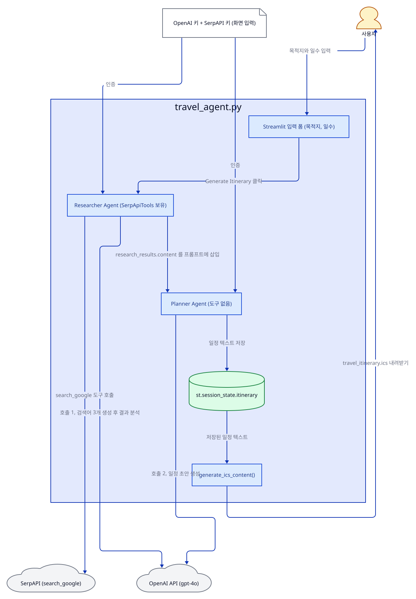
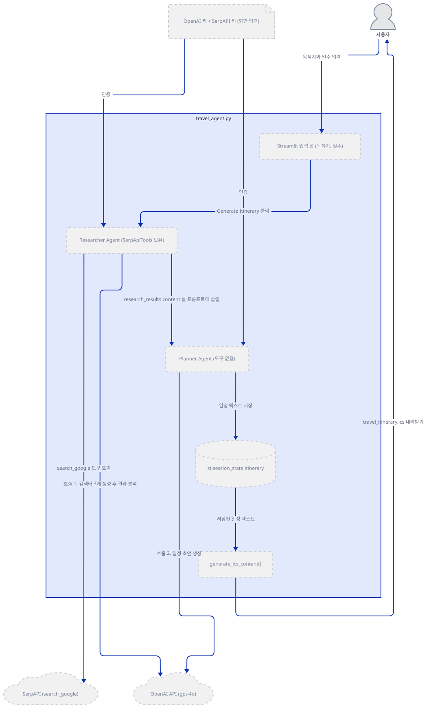
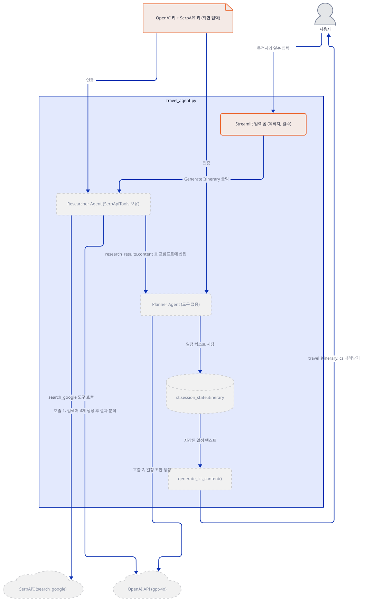
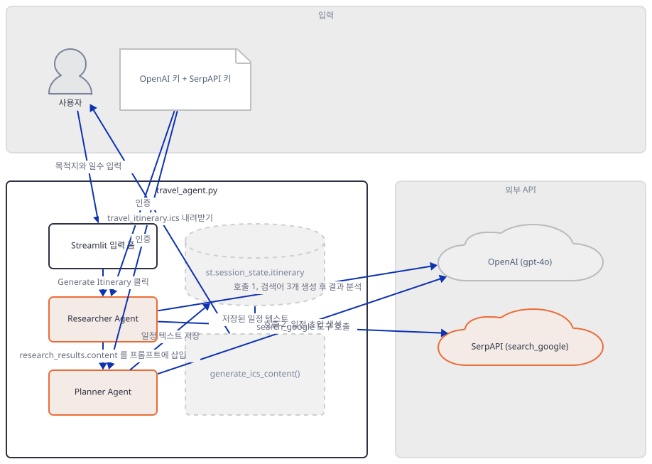
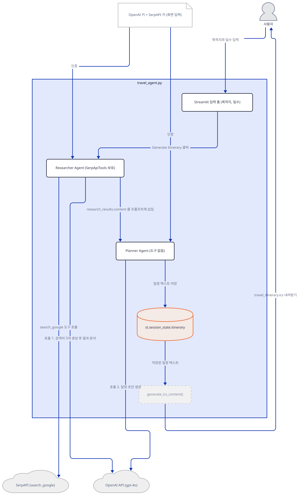
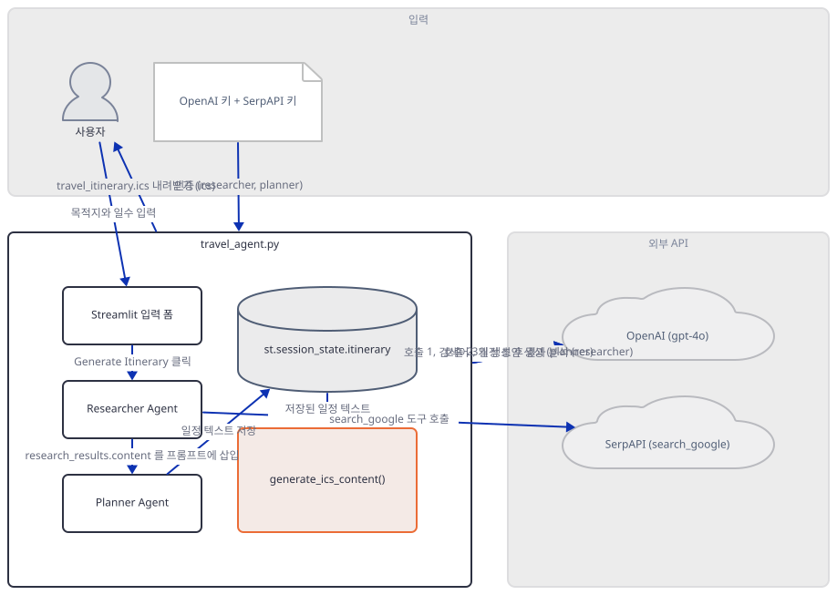
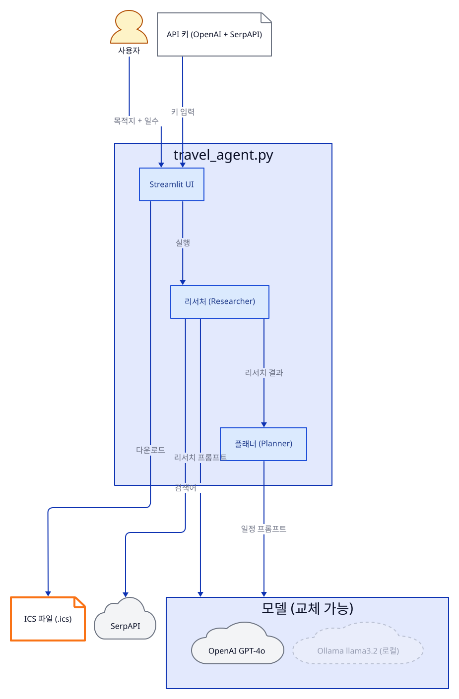
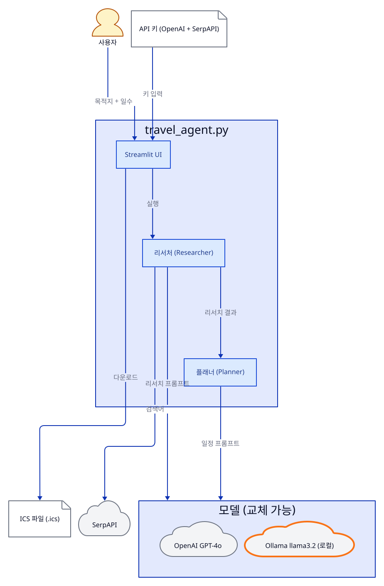
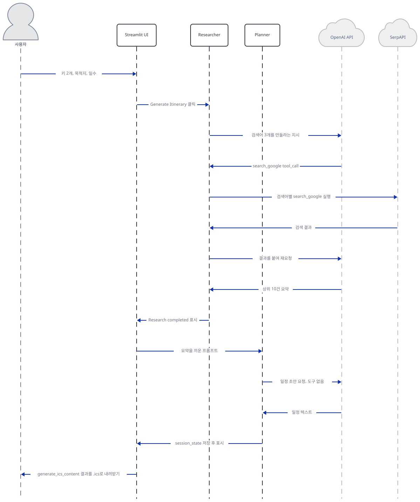

# Day 012 · 🛫 AI Travel Agent (Local & Cloud)

> 볼륨 1 🌱 Starter AI Agents · 난이도 ★★☆ · 예상 소요 70분 · API 비용 대략 일정 1건에 GPT-4o 호출 2회 + SerpAPI 검색 몇 건, 수백 원 이하 (OpenAI·SerpAPI 요금표 기준, 대략치 — 키가 없어 실제 과금은 확인 못함) · 원본 앱: `starter_ai_agents/ai_travel_agent`

## 오늘 만들 것

오늘은 서로 다른 곳에서 모델이 도는 진입점 두 개를 가진 앱을 다룹니다. `travel_agent.py`(158줄)는 OpenAI GPT-4o를 화면에서 입력받은 키로 호출하는 클라우드 버전이고, `local_travel_agent.py`(154줄)는 같은 화면·같은 두 에이전트·같은 도구를 그대로 두고 모델만 로컬 Ollama의 Llama 3.2로 바꿔치기한 버전입니다. 두 파일을 줄 단위로 비교하면(직접 확인, Step 7) 실제로 달라지는 곳은 임포트 한 줄, 제목·설명 문구, 키 입력 개수(2개 → 1개), 그리고 에이전트 생성 코드의 `model=` 줄 두 곳뿐입니다 — 도구, 지시문, 출력 처리(캘린더 변환, 다운로드 버튼)는 완전히 동일합니다. 이 리포에서 로컬에 떠 있는 모델 서버를 처음 등장시키는 앱이기도 합니다. 앱 자체 `README.MD`(대문자 확장자로 저장돼 있습니다)도 `travel_agent.py`를 먼저 안내하므로, 이 문서는 그 순서를 따라 클라우드 버전을 중심으로 진행하고 로컬 버전은 소스로만 확인하는 전용 Step 7에서 다룹니다. 검색으로 후보를 모으는 **Researcher**와 그것으로 일정을 짜는 **Planner**, 두 에이전트가 순서대로 이어지는 2단계 파이프라인이라는 점도 지금까지의 단일 에이전트 앱들과 다르고, 완성된 일정을 `.ics` 캘린더 파일로 내려받는 기능(`generate_ics_content`)은 이 시리즈에서 처음 등장하는 출력 형식입니다. 완성하면 목적지와 여행 일수를 입력해 리서치→일정 생성이 이어지는 화면과, 그 결과를 캘린더 앱으로 가져갈 수 있는 다운로드 버튼을 로컬에서 확인하게 됩니다. 아래는 완성된 아키텍처입니다.



## 사전 준비

| 서비스/도구 | 용도 | 발급·설치 |
|---|---|---|
| OpenAI API 키 | `travel_agent.py`에서 Researcher·Planner 두 에이전트의 모델(GPT-4o) 호출 인증. 환경변수가 아니라 앱 화면의 입력창에 직접 붙여넣는다 | https://platform.openai.com/ 가입 후 발급 |
| SerpAPI 키 | 두 진입점 모두에서 Researcher의 검색 도구(SerpApiTools)가 구글 검색 결과를 가져오는 데 씀. 마찬가지로 화면 입력창에 붙여넣는다 | https://serpapi.com/ 가입 후 발급 |
| (선택) Ollama | 키 없이 로컬 Llama 3.2로 돌리고 싶다면(`local_travel_agent.py`) 필요. 이 문서의 기본 경로에는 필요 없고 Step 7에서 소스로만 다룬다 | https://ollama.com/ 설치 후 `ollama pull llama3.2` |
| uv | 가상환경 생성과 패키지 설치 | [공통 사전 준비](../README.md#공통-사전-준비-한-번만) 절 참고 |
| 인터넷 연결 | OpenAI·SerpAPI 접속 | 별도 설치 없음 |

## 아키텍처 한눈에 보기

| 컴포넌트 | 역할 | 코드 위치 |
|---|---|---|
| 사용자 | 브라우저에서 키·목적지·여행 일수 입력 | 코드 없음 (브라우저) |
| Streamlit UI | 키 입력을 받고 게이트를 열어 나머지 입력·버튼·결과를 표시 | `starter_ai_agents/ai_travel_agent/travel_agent.py:61-75` |
| 리서처 에이전트 (Researcher) | 목적지·일수로 검색어를 만들고 SerpApiTools로 웹을 검색해 관련 결과를 정리 | `starter_ai_agents/ai_travel_agent/travel_agent.py:76-95` |
| 플래너 에이전트 (Planner) | 리서치 결과를 받아 일자별 draft 일정을 작성 | `starter_ai_agents/ai_travel_agent/travel_agent.py:96-115` |
| 검색 도구 (SerpApiTools) | `search_google` 함수 하나를 Researcher에 노출 | `starter_ai_agents/ai_travel_agent/travel_agent.py:93` |
| 모델 (OpenAI GPT-4o / Ollama llama3.2) | 실제 추론 수행. 어느 쪽을 쓰는지는 진입점 파일이 결정 | `starter_ai_agents/ai_travel_agent/travel_agent.py:79`, `starter_ai_agents/ai_travel_agent/local_travel_agent.py:77` |
| 캘린더 변환 (`generate_ics_content`) | 완성된 일정 텍스트를 정규식으로 날짜별로 쪼개 ICS 캘린더 파일로 변환 | `starter_ai_agents/ai_travel_agent/travel_agent.py:12-59` |
| 외부 API (OpenAI, SerpAPI) | LLM 추론과 구글 검색 결과를 제공하는 서드파티 서비스 | 코드 없음 (외부 서비스) |

## 단계별 진행

### Step 1. 환경 만들기

**목적.** 이 앱이 실제로 요구하는 의존성 6개를 설치해 보고, `requirements.txt`에 최근 추가된 `ollama` 줄이 지금은 클린 설치를 통과시키는지, 그리고 낯선 이름의 `icalendar`가 실제로 쓰이는 패키지인지를 직접 확인합니다. OpenAI·SerpAPI 키는 이 단계에서 미리 발급만 해 두면 됩니다 — 둘 다 환경변수가 아니라 Step 2의 화면 입력창에 넣습니다.

**할 일.**

```bash
cd starter_ai_agents/ai_travel_agent
uv venv
uv pip install -r requirements.txt
```

(pip을 쓴다면 `python -m venv .venv && source .venv/bin/activate && pip install -r requirements.txt`.)

`starter_ai_agents/ai_travel_agent/requirements.txt:1-6`

```text
streamlit 
agno>=2.2.10
openai
ollama
google-search-results
icalendar
```

여섯 줄 다 버전 고정이 없고(`agno`만 하한선 `>=2.2.10`), 이 문서를 작성하며 설치했을 때 실제로 받아진 버전은 아래 확인에 그대로 적었습니다. `google-search-results`는 이름만 봐서는 낯설지만, 실제로 임포트되는 모듈 이름은 `serpapi`입니다 — 설치된 `agno/tools/serpapi.py`를 열어 보면 ``try: import serpapi except ImportError: raise ImportError("`google-search-results` not installed.")``로 이 관계가 그대로 드러납니다(소스로 확인, 이 파일은 리포가 아니라 설치된 패키지 안에 있어 줄 번호를 인용하지 않았습니다). `icalendar`도 이름과 달리 안 쓰이는 패키지가 아닙니다 — 두 진입점 모두 파일 맨 위에서 `from icalendar import Calendar, Event`를 가져와 `generate_ics_content`(Step 6) 안에서 실제로 씁니다(직접 확인, Step 6). `ollama` 줄은 커밋 `da8bdb1`("add ollama to requirements for local_travel_agent")에서 추가됐습니다(직접 확인: `git show da8bdb1`로 diff를 그대로 봄) — 커밋 메시지 자체가 "클린 설치 후 `local_travel_agent.py`를 실행하면 `ImportError`가 난다"고 밝히고 있어, 이 한 줄이 빠졌던 버전은 실제로 동작하지 않았을 것입니다(그 이전 버전을 직접 재현하지는 않았습니다). 지금 버전은 두 진입점의 임포트가 모두 통과합니다(직접 확인, 아래).



**확인.**

```bash
uv run python -m py_compile travel_agent.py local_travel_agent.py && echo compiled
```

```
compiled
```

```bash
uv run python -c "from agno.agent import Agent; from agno.tools.serpapi import SerpApiTools; from agno.models.openai import OpenAIChat; from agno.models.ollama import Ollama; from icalendar import Calendar, Event; import streamlit as st; print('ok')"
```

```
ok
```

```bash
uv run python -c "
import importlib.metadata as im
for pkg in ['agno', 'streamlit', 'openai', 'ollama', 'google-search-results', 'icalendar']:
    print(pkg, im.version(pkg))
"
```

직접 확인한 출력(Python 3.12 throwaway venv, 버전 고정이 없으므로 여러분이 설치하는 시점에는 다를 수 있습니다):

```
agno 3.0.10
streamlit 1.64.0
openai 3.16.2
ollama 0.6.2
google-search-results 2.4.2
icalendar 7.3.0
```

### Step 2. Streamlit 뼈대와 두 키 입력

**목적.** 제목·설명과 두 키 입력창을 만들고, 이 앱은 Day 2·5와 달리 키가 없을 때 보여줄 안내 문구가 아예 없다는 것을 확인합니다.

**할 일.**

`starter_ai_agents/ai_travel_agent/travel_agent.py:61-75`

```python
# Set up the Streamlit app
st.title("AI Travel Planner ")
st.caption("Plan your next adventure with AI Travel Planner by researching and planning a personalized itinerary on autopilot using GPT-4o")

# Initialize session state to store the generated itinerary
if 'itinerary' not in st.session_state:
    st.session_state.itinerary = None

# Get OpenAI API key from user
openai_api_key = st.text_input("Enter OpenAI API Key to access GPT-4o", type="password")

# Get SerpAPI key from the user
serp_api_key = st.text_input("Enter Serp API Key for Search functionality", type="password")

if openai_api_key and serp_api_key:
```

`if openai_api_key and serp_api_key:` 가드가 76행부터 파일 끝(158행)까지를 통째로 감쌉니다 — Day 2의 `ai_scrapper.py`와 같은 구조입니다. 다른 점은 가드 뒤에 아무것도 없다는 것입니다: 파일 전체에서 유일한 `else`는 `generate_ics_content`의 날짜-분기 로직(`starter_ai_agents/ai_travel_agent/travel_agent.py:42`)뿐이고, 이 키 가드에는 대응하는 `else`가 없습니다(소스로 확인, grep 결과). Day 2·5가 `st.warning("...")`으로 키 없음을 알리는 것과 달리, 이 앱은 키를 하나만 넣거나 둘 다 비워 두면 제목·설명·입력창 두 개만 보이고 화면이 그냥 조용히 멈춥니다.



**확인.** 앱 폴더에서 서버를 headless로 띄웁니다.

```bash
uv run streamlit run travel_agent.py --server.headless true
```

다른 터미널에서:

```bash
curl -s -o /dev/null -w "%{http_code}\n" http://localhost:8501
```

```
200
```

(HTTP 200은 직접 확인. 제목·설명·키 입력창 두 개만 보이고 그 아래는 비어 있으리라는 것은 위 `if` 가드 구조로 추론한 것이며, 화면을 직접 열어 확인하지는 못했습니다.)

### Step 3. 리서처 에이전트와 검색 도구

**목적.** Researcher가 실제로 어떤 모델·도구·지시문으로 만들어지는지 객체 수준에서 확인합니다.

**할 일.**

`starter_ai_agents/ai_travel_agent/travel_agent.py:76-95`

```python
    researcher = Agent(
        name="Researcher",
        role="Searches for travel destinations, activities, and accommodations based on user preferences",
        model=OpenAIChat(id="gpt-4o", api_key=openai_api_key),
        description=dedent(
            """\
        You are a world-class travel researcher. Given a travel destination and the number of days the user wants to travel for,
        generate a list of search terms for finding relevant travel activities and accommodations.
        Then search the web for each term, analyze the results, and return the 10 most relevant results.
        """
        ),
        instructions=[
            "Given a travel destination and the number of days the user wants to travel for, first generate a list of 3 search terms related to that destination and the number of days.",
            "For each search term, `search_google` and analyze the results.",
            "From the results of all searches, return the 10 most relevant results to the user's preferences.",
            "Remember: the quality of the results is important.",
        ],
        tools=[SerpApiTools(api_key=serp_api_key)],
        add_datetime_to_context=True,
    )
```

`role`과 `description`은 이 에이전트가 무엇을 하는 존재인지 알려주는 자기소개이고, `instructions` 4줄이 실제 절차(검색어 3개 생성 → 각각 검색 → 결과 10개로 추림)를 강제합니다. `tools=[SerpApiTools(api_key=serp_api_key)]`가 이 단계의 핵심입니다 — `SerpApiTools()`는 기본값(`enable_search_google=True`, `enable_search_youtube=False`)으로 만들면 `search_google` 함수 하나만 노출합니다(직접 확인, 아래). `add_datetime_to_context=True`는 "다음 달", "이번 주말" 같은 상대적 표현을 오늘 날짜 기준으로 해석하도록 현재 시각을 컨텍스트에 넣어 줍니다.



**확인.**

```bash
uv run python -c "
from agno.tools.serpapi import SerpApiTools
print(sorted(SerpApiTools(api_key='fake-key-not-real').functions))
"
```

```
['search_google']
```

```bash
uv run python -c "
from agno.models.openai import OpenAIChat
m = OpenAIChat(id='gpt-4o', api_key='fake-key-not-real')
print(m.id, m.provider)
"
```

```
gpt-4o OpenAI
```

(두 확인 모두 네트워크를 타지 않고 성공합니다 — 키 검증은 실제 호출 시점에 일어납니다, Step 5에서 확인.)

### Step 4. 플래너 에이전트

**목적.** Planner가 Researcher와 무엇이 다른지 — 도구가 없고 지시문이 더 많다는 것 — 를 확인합니다.

**할 일.**

`starter_ai_agents/ai_travel_agent/travel_agent.py:96-115`

```python
    planner = Agent(
        name="Planner",
        role="Generates a draft itinerary based on user preferences and research results",
        model=OpenAIChat(id="gpt-4o", api_key=openai_api_key),
        description=dedent(
            """\
        You are a senior travel planner. Given a travel destination, the number of days the user wants to travel for, and a list of research results,
        your goal is to generate a draft itinerary that meets the user's needs and preferences.
        """
        ),
        instructions=[
            "Given a travel destination, the number of days the user wants to travel for, and a list of research results, generate a draft itinerary that includes suggested activities and accommodations.",
            "Ensure the itinerary is well-structured, informative, and engaging.",
            "Ensure you provide a nuanced and balanced itinerary, quoting facts where possible.",
            "Remember: the quality of the itinerary is important.",
            "Focus on clarity, coherence, and overall quality.",
            "Never make up facts or plagiarize. Always provide proper attribution.",
        ],
        add_datetime_to_context=True,
    )
```

Planner는 같은 모델(`OpenAIChat(id="gpt-4o", ...)`, 같은 `openai_api_key`)을 다시 쓰지만 `tools` 인자가 아예 없습니다 — 검색은 Researcher만 하고, Planner는 넘겨받은 텍스트만으로 판단합니다. 지시문은 6줄로 Researcher보다 많고, 사실 왜곡·표절 금지("Never make up facts or plagiarize")를 명시한다는 점이 Researcher의 지시문에는 없던 내용입니다.



**확인.** 두 에이전트를 실제로 만들어 도구·지시문 개수를 비교합니다. `st.text_input`을 가짜 키를 돌려주는 함수로 바꿔치기해 76행의 게이트를 연 뒤 파일을 경로로 실행합니다(Day 5와 같은 방식).

```bash
uv run python -c "
import streamlit as st
st.text_input = lambda *a, **k: 'fake-key-not-real'
import runpy
ns = runpy.run_path('travel_agent.py')
r, p = ns['researcher'], ns['planner']
print('researcher tools:', [type(t).__name__ for t in r.tools], 'instructions:', len(r.instructions))
print('planner tools:', p.tools, 'instructions:', len(p.instructions))
"
```

직접 확인한 출력:

```
researcher tools: ['SerpApiTools'] instructions: 4
planner tools: [] instructions: 6
```

### Step 5. 실행 파이프라인 (리서치 → 플래닝)

**목적.** "Generate Itinerary"를 누르면 두 에이전트가 어떤 프롬프트로 이어지는지, 그리고 키가 잘못됐을 때 화면에 실제로 무엇이 뜨는지 확인합니다.

**할 일.**

`starter_ai_agents/ai_travel_agent/travel_agent.py:117-144`

```python
    # Input fields for the user's destination and the number of days they want to travel for
    destination = st.text_input("Where do you want to go?")
    num_days = st.number_input("How many days do you want to travel for?", min_value=1, max_value=30, value=7)

    col1, col2 = st.columns(2)

    with col1:
        if st.button("Generate Itinerary"):
            with st.spinner("Researching your destination..."):
                # First get research results
                research_results: RunOutput = researcher.run(f"Research {destination} for a {num_days} day trip", stream=False)

                # Show research progress
                st.write(" Research completed")
                
            with st.spinner("Creating your personalized itinerary..."):
                # Pass research results to planner
                prompt = f"""
                Destination: {destination}
                Duration: {num_days} days
                Research Results: {research_results.content}
                
                Please create a detailed itinerary based on this research.
                """
                response: RunOutput = planner.run(prompt, stream=False)
                # Store the response in session state
                st.session_state.itinerary = response.content
                st.write(response.content)
```

버튼을 누르면 `researcher.run(...)`이 먼저 끝나야 `research_results.content`가 생기고, 이 텍스트가 그대로 `prompt` f-string에 박혀 `planner.run(prompt, ...)`으로 넘어갑니다 — Day 1의 도구 호출 루프와 달리 정해진 순서 두 단계짜리 파이프라인입니다. 이 블록에는 `try/except`도, `research_results.status`를 확인하는 코드도 없습니다(소스로 확인: 두 파일 전체에 `status`·`try`·`except` 문자열이 0건). agno의 `Agent.run()`은 인증 실패 시 예외 대신 `RunStatus.error`와 오류 문구를 `content`에 담아 정상 반환하므로(Day 8·11과 같은 패턴), 이 코드는 그 오류 문구를 진짜 리서치 결과인 양 그대로 Planner에 넘기고, Planner 호출도 같은 키로 실패해 같은 종류의 오류 문구를 반환하면 그것이 다시 "완성된 일정"으로 화면에 표시됩니다.



**확인.** 키가 없어 실제 화면은 재현하지 못했습니다. 대신 잘못된 키로 Researcher를 직접 호출해 무엇이 반환되는지 확인합니다.

```bash
uv run python -c "
import streamlit as st
st.text_input = lambda *a, **k: 'sk-invalid-not-real'
import runpy
ns = runpy.run_path('travel_agent.py')
result = ns['researcher'].run('Research Paris for a 3 day trip', stream=False)
print('status:', result.status)
print('content:', str(result.content)[:200])
"
```

직접 확인한 출력:

```
status: RunStatus.error
content: Incorrect API key provided: sk-inval*******real. You can find your API key at https://platform.openai.com/account/api-keys.
```

실제 화면에서도 이 문자열이 그대로 다음 단계로 흘러 결국 일정처럼 표시됩니다 — 위에서 설명한 흐름 그대로입니다.

### Step 6. 캘린더 내보내기 (.ics 다운로드)

**목적.** 완성된 일정 텍스트를 실제 캘린더 파일로 바꾸는 `generate_ics_content`의 날짜 분리 로직을 보고, 직접 실행해 결과를 확인합니다.

**할 일.**

`starter_ai_agents/ai_travel_agent/travel_agent.py:30-32`

```python
    # Split the plan into days
    day_pattern = re.compile(r'Day (\d+)[:\s]+(.*?)(?=Day \d+|$)', re.DOTALL)
    days = day_pattern.findall(plan_text)
```

`starter_ai_agents/ai_travel_agent/travel_agent.py:42-57`

```python
    else:
        # Process each day
        for day_num, day_content in days:
            day_num = int(day_num)
            current_date = start_date + timedelta(days=day_num - 1)
            
            # Create a single event for the entire day
            event = Event()
            event.add('summary', f"Day {day_num} Itinerary")
            event.add('description', day_content.strip())
            
            # Make it an all-day event
            event.add('dtstart', current_date.date())
            event.add('dtend', current_date.date())
            event.add("dtstamp", datetime.now())
            cal.add_component(event)
```

정규식 `Day (\d+)[:\s]+(.*?)(?=Day \d+|$)`는 Planner가 만든 자유 텍스트에서 "Day 1", "Day 2" 같은 표기를 찾아 그 뒤 내용을 다음 "Day N"이 나오기 전까지 통째로 묶습니다. 매칭되는 날이 하나도 없으면 34-41행의 분기가 전체 텍스트를 하루짜리 이벤트 하나로 담고, 매칭되면 위 42-57행처럼 날짜별로 `Event()`를 만들어 `start_date`(기본값 오늘)에 `day_num - 1`일을 더한 날짜를 종일 일정으로 붙입니다. 이 함수는 Streamlit 위젯을 전혀 쓰지 않는 순수 함수라 화면 밖에서도 그대로 실행해 볼 수 있습니다.



**확인.**

```bash
uv run python -c "
import travel_agent as m
from datetime import datetime
sample = '''Day 1: Arrive in Paris and check into hotel. Visit Eiffel Tower in the evening.
Day 2: Louvre Museum in the morning, Seine river cruise in the afternoon.
Day 3: Day trip to Versailles.'''
print(m.generate_ics_content(sample, start_date=datetime(2026, 10, 1)).decode('utf-8'))
"
```

직접 확인한 출력(발췌, `DTSTAMP`는 실행 시각이라 매번 달라짐):

```
BEGIN:VCALENDAR
VERSION:2.0
PRODID:-//AI Travel Planner//github.com//
BEGIN:VEVENT
SUMMARY:Day 1 Itinerary
DTSTART;VALUE=DATE:20261001
DTEND;VALUE=DATE:20261001
DTSTAMP:20260921T135130Z
DESCRIPTION:Arrive in Paris and check into hotel. Visit Eiffel Tower in th
 e evening.
END:VEVENT
```

(전체 출력은 Day 2·Day 3 이벤트까지 이어서 3개입니다. `DESCRIPTION` 줄이 자동으로 접히는 것은 이 코드가 아니라 `icalendar` 라이브러리의 ICS 인코딩 규칙입니다.)

### Step 7. 로컬 버전(Ollama)으로 전환

**목적.** `local_travel_agent.py`가 클라우드 버전과 정확히 어디서만 다른지 diff로 확인하고, Ollama 백엔드가 문제없이 만들어지는 지점까지만 확인한 뒤, 왜 이 문서가 더 나아가지 않는지 밝힙니다.

**할 일.**

`starter_ai_agents/ai_travel_agent/local_travel_agent.py:62-73`

```python
# Set up the Streamlit app
st.title("AI Travel Planner using Llama-3.2 ")
st.caption("Plan your next adventure with AI Travel Planner by researching and planning a personalized itinerary on autopilot using local Llama-3")

# Initialize session state to store the generated itinerary
if 'itinerary' not in st.session_state:
    st.session_state.itinerary = None

# Get SerpAPI key from the user
serp_api_key = st.text_input("Enter Serp API Key for Search functionality", type="password")

if serp_api_key:
```

Step 2의 15줄짜리 게이트(OpenAI 키 + SerpAPI 키)와 비교하면 OpenAI 키 입력 두 줄이 통째로 빠지고 가드도 `if serp_api_key:`로 줄어든 12줄입니다 — 클라우드 버전보다 입력창이 하나 적습니다. 나머지 차이는 두 파일을 직접 diff해 전부 확인했습니다.

```bash
diff -u travel_agent.py local_travel_agent.py
```

직접 확인한 출력(요약 — import문, 제목·설명 문구, 키 가드, `model=` 줄 두 곳, 그리고 사소한 공백·주석 차이 외에는 변경분이 없습니다):

```
-from agno.models.openai import OpenAIChat
+from agno.models.ollama import Ollama
...
-        model=OpenAIChat(id="gpt-4o", api_key=openai_api_key),
+        model=Ollama(id="llama3.2"),
...
-        model=OpenAIChat(id="gpt-4o", api_key=openai_api_key),
+        model=Ollama(id="llama3.2"),
```

Researcher·Planner의 `role`·`description`·`instructions`·`tools`(SerpApiTools는 로컬 버전에도 그대로 있습니다) 블록에는 diff가 단 한 줄도 없습니다 — 정말로 모델 두 줄만 바뀝니다. `generate_ics_content`와 다운로드 버튼(Step 6)도 두 파일에서 100% 동일합니다. `Ollama(id="llama3.2")`는 서버 없이도 객체 생성 자체는 성공합니다(아래 확인) — 다만 이 문서는 여기까지만 실행합니다. 실제로 `.run()`을 호출하려면 Ollama 서버가 기본 포트(11434)에서 떠 있고 `llama3.2` 모델이 미리 받아져 있어야 하는데, 이 환경에는 그중 아무것도 없고 이 작업 범위 밖이라 설치하지 않았습니다. 끝까지 실행하려면 https://ollama.com 설치 후 아래를 실행하면 됩니다(이 문서는 실행하지 않습니다).

```bash
ollama pull llama3.2
uv run streamlit run local_travel_agent.py
```



**확인.** 서버 없이 성공하는 지점(모델 객체 생성)까지만 직접 실행합니다.

```bash
uv run python -c "
from agno.models.ollama import Ollama
o = Ollama(id='llama3.2')
print(o.id, o.provider)
"
```

```
llama3.2 Ollama
```

## 요청 한 건이 흐르는 과정



사용자가 목적지·여행 일수를 입력하고 "Generate Itinerary"를 누르면(Step 5), UI는 `researcher.run(...)`을 호출합니다. Researcher는 지시문과 `search_google` 도구 스키마를 OpenAI에 보내고(Step 3), OpenAI가 `tool_call`로 검색어를 돌려주면 Researcher가 실제로 SerpAPI를 호출해 결과를 받은 뒤 다시 OpenAI에 넘겨 최종 리서치 텍스트를 완성합니다 — Day 1에서 본 도구 호출 왕복과 같은 구조입니다. 이 텍스트가 `research_results.content`로 UI에 돌아오면, UI는 목적지·일수와 함께 그대로 Planner의 프롬프트에 박아 두 번째 `run(...)`을 호출합니다(Step 4·5). Planner는 도구 없이 OpenAI만으로 완성된 일정을 만들어 돌려주고, UI는 이를 화면에 표시하는 동시에 `st.session_state.itinerary`에 저장해 `generate_ics_content`(Step 6)로 넘길 수 있게 합니다. 로컬 버전(Step 7)에서는 이 그림의 OpenAI 자리에 Ollama가 들어갈 뿐, 요청이 흐르는 순서와 두 번의 `run()` 호출 구조는 동일합니다. 이 시퀀스는 각 구간을 Step 1~6에서 개별적으로 직접 실행해 확인한 것을 이어붙인 것이며, 유효한 키가 없어 처음부터 끝까지 한 번에 흐르는 것을 실제로 보지는 못했습니다.

## 실행 체크리스트

- [ ] OpenAI API 키와 SerpAPI 키를 발급받아 두었다 (둘 다 화면 입력창에 붙여넣는 용도, 환경변수 아님)
- [ ] `uv venv && uv pip install -r requirements.txt`로 6개 의존성을 설치했다
- [ ] `uv run python -m py_compile travel_agent.py local_travel_agent.py`로 두 진입점이 모두 컴파일되는 것을 확인했다
- [ ] `uv run streamlit run travel_agent.py`로 서버를 띄우고 `http://localhost:8501`에서 HTTP 200을 확인했다
- [ ] Researcher(`SerpApiTools` 1개, 지시문 4개)와 Planner(도구 없음, 지시문 6개)의 실제 구성을 코드로 확인했다
- [ ] 잘못된 키로 `researcher.run()`을 호출하면 예외 대신 `RunStatus.error`와 오류 문자열이 반환된다는 것을 확인했다
- [ ] `generate_ics_content`를 직접 실행해 "Day N" 패턴이 날짜별 이벤트로 쪼개지는 것을 확인했다
- [ ] `local_travel_agent.py`가 클라우드 버전과 모델·안내 문구·키 개수에서만 다르다는 것을 diff로 확인했다 (실제 Ollama 실행은 하지 않음)

## 문제 해결

| 증상 | 원인 | 해결 |
|---|---|---|
| 키를 하나만 넣거나 둘 다 비워 둬도 화면에 아무 경고 없이 제목·입력창만 보이고 멈춰 있음 | `if openai_api_key and serp_api_key:` 가드에 대응하는 `else`가 파일 전체에 없다(소스로 확인 — 유일한 `else`는 `generate_ics_content`의 날짜-분기용, `starter_ai_agents/ai_travel_agent/travel_agent.py:42`) | Day 2·5처럼 경고 문구를 기다리지 말고, 두 입력창을 모두 채우면 나머지 화면이 나타남 |
| 키가 잘못됐는데 예외로 화면이 멈추는 대신 "Incorrect API key..." 같은 문구가 리서치 결과·최종 일정인 것처럼 화면에 그대로 표시됨 | 두 파일 모두 `research_results.status`나 `try/except`를 확인하지 않는다(직접 확인, Step 5) — agno `Agent.run()`은 인증 실패를 예외 대신 `RunStatus.error`로 반환하고 이 코드는 그 값을 그대로 다음 단계에 넘긴다 | 화면에 뜬 텍스트가 일정처럼 안 보이고 "API key" 같은 문구를 담고 있다면 오류이니 키를 다시 확인 |
| 리눅스(대소문자 구분 파일시스템)에서 `cat starter_ai_agents/ai_travel_agent/README.md`가 "No such file or directory" | 이 앱 폴더의 안내 파일은 `README.md`가 아니라 `README.MD`(대문자 확장자)로 저장돼 있다(소스로 확인, 폴더 목록) | 정확한 대소문자로 `README.MD`를 참조. Windows·macOS 기본 파일시스템은 대소문자를 구분하지 않아 이 문제가 드러나지 않을 수 있음 |
| 앱 자체 `README.MD`가 로컬 버전을 "without sending data to external APIs"라고 설명 | 검색 도구(SerpApiTools)는 두 진입점에서 완전히 동일하게 SerpAPI라는 외부 클라우드 서비스를 호출한다(소스로 확인: `starter_ai_agents/ai_travel_agent/local_travel_agent.py:91`이 `starter_ai_agents/ai_travel_agent/travel_agent.py:93`과 동일) — 로컬로 도는 것은 LLM 추론뿐이고 검색어는 여전히 SerpAPI로 나간다 | 완전한 오프라인 동작이 필요하면 검색 도구도 로컬 대안으로 바꿔야 함(이 문서 범위 밖) |

## 더 해보기

- Researcher의 `tools=[SerpApiTools(api_key=serp_api_key)]`(`starter_ai_agents/ai_travel_agent/travel_agent.py:93`)에 `enable_search_youtube=True`를 추가해 도구를 2개로 늘리고, Step 3의 확인 명령으로 `functions` 목록이 어떻게 늘어나는지 다시 확인해보기
- 실행 파이프라인(`starter_ai_agents/ai_travel_agent/travel_agent.py:117-144`)을 `try/except`로 감싸 `research_results.status`가 오류일 때는 Planner를 아예 호출하지 않고 `st.error()`로 안내하도록 고쳐, Step 5에서 확인한 "오류가 일정처럼 보이는" 문제를 직접 고쳐보기
- `generate_ics_content`의 정규식(`starter_ai_agents/ai_travel_agent/travel_agent.py:31`)을 손봐 "1일차"처럼 다른 표기도 인식하게 만들고, Step 6의 확인 명령으로 직접 실행해 결과가 달라지는지 비교해보기

## 다음 날 예고

Day 013 · 🔍 OpenAI Research Agent — 트리아지·리서치·편집 세 에이전트가 협업해 주제 하나를 조사하고 출처를 갖춘 보고서로 정리하는 앱을 다룹니다.
