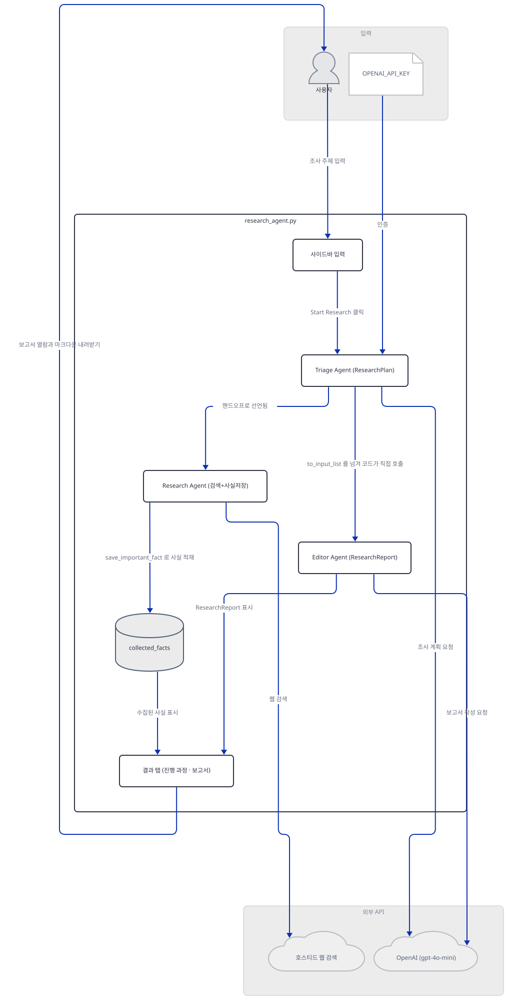
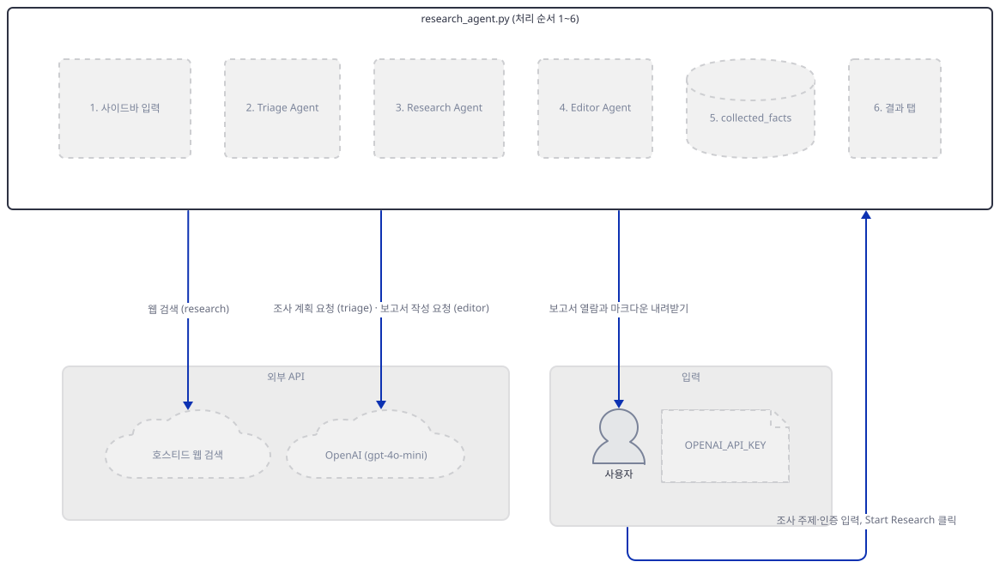
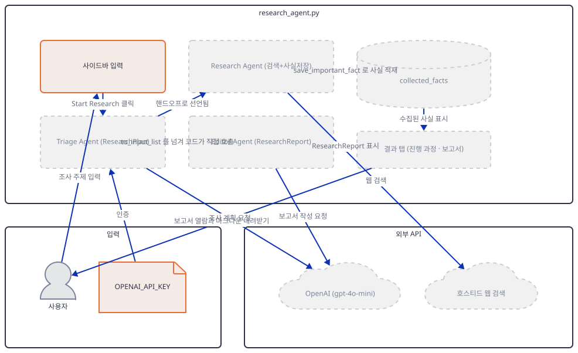
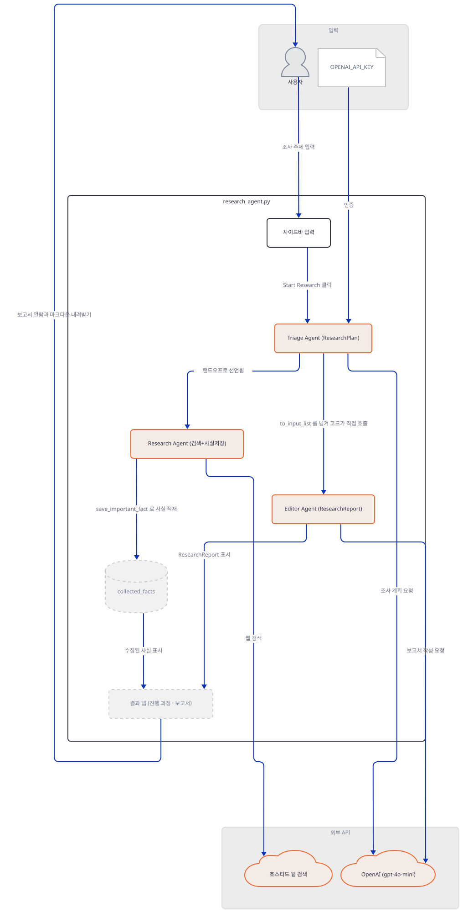
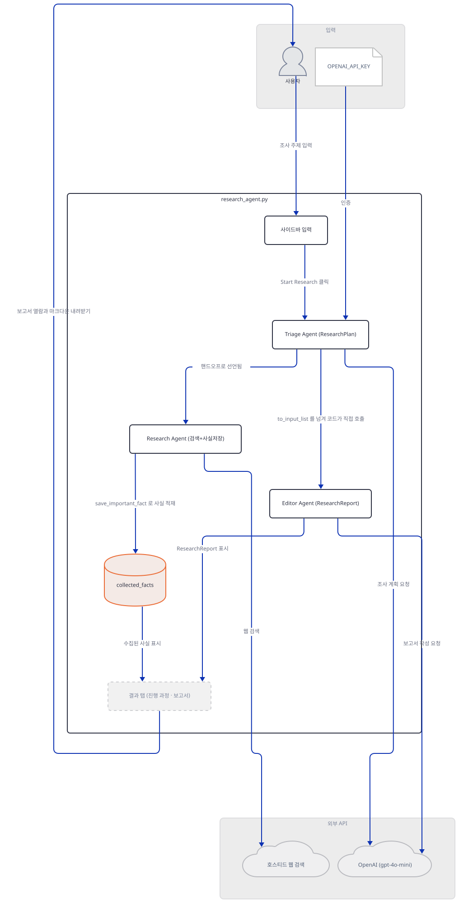
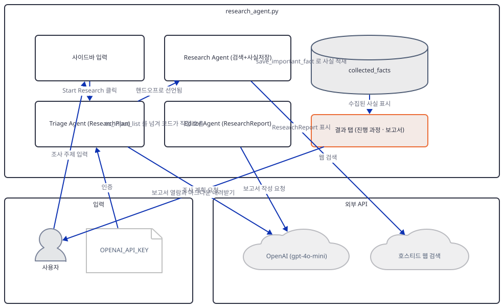
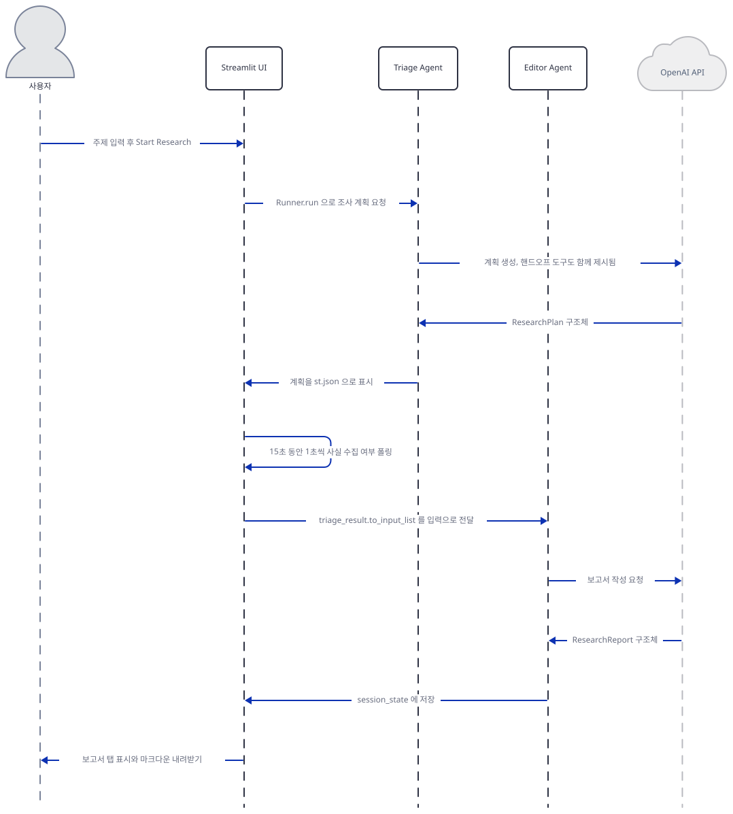

# Day 013 · 🔍 OpenAI Research Agent

> 볼륨 1 🌱 Starter AI Agents · 난이도 ★★★ · 예상 소요 70분 · API 비용 대략 조사 1회에 gpt-4o-mini 호출 2회 + 호스티드 웹 검색, 요금표 기준 수백 원 이하 (키가 없어 실제 과금은 확인 못함) · 원본 앱: `starter_ai_agents/openai_research_agent`

## 오늘 만들 것

볼륨 1의 마지막 날이자, **agno가 아닌 프레임워크가 처음 등장하는 날**입니다. Day 1부터 12까지의 앱은 모두 agno의 `Agent`를 썼지만 이 앱은 OpenAI가 직접 내는 **Agents SDK**(`openai-agents` 패키지, import 이름은 `agents`)를 씁니다. 그래서 어휘가 통째로 바뀝니다 — `Agent`는 같은 이름이지만 실행은 `agent.run()`이 아니라 `Runner.run(agent, ...)`이고, 도구는 `@function_tool` 데코레이터로 만들며, 에이전트 사이의 제어 이전은 `handoff()`라는 일급 개념으로 선언합니다. 출력 형식은 pydantic 모델을 `output_type=`에 넘겨 강제하고, 실행 전체를 `trace()`로 감싸 OpenAI 대시보드에서 추적할 수 있습니다(`research_agent.py:1-17`).

에이전트는 셋입니다. Triage가 조사 계획을 세우고, Research가 웹을 뒤져 사실을 모으고, Editor가 보고서를 씁니다. 셋의 성격은 코드에서 이렇게 갈립니다(직접 객체를 찍어 확인).

| 에이전트 | 모델 | `output_type` | 도구 | 핸드오프 |
|---|---|---|---|---|
| Triage Agent | gpt-4o-mini | `ResearchPlan` | 없음 | Research Agent, Editor Agent |
| Research Agent | gpt-4o-mini | 없음 | `WebSearchTool`, `FunctionTool` | 없음 |
| Editor Agent | gpt-4o-mini | `ResearchReport` | 없음 | 없음 |

여기서 이 앱의 가장 중요한 구조적 특징이 드러납니다. Triage는 두 에이전트로의 **핸드오프를 선언해 두었지만**, 실제 실행 코드는 그 핸드오프 사슬에 의존하지 않고 Editor를 **직접 한 번 더 호출합니다**(`research_agent.py:230-233`). 게다가 두 호출 사이에는 조건과 무관하게 **15초를 세는 폴링 루프**가 들어 있습니다(215-223행). 이 둘이 합쳐지면 "핸드오프로 흐르는 멀티 에이전트"라는 겉모습과 실제 실행이 어긋날 수 있는데, 그 어긋남이 어떤 모습인지는 키가 없어 실행으로 확인하지 못했습니다 — 코드에서 확인할 수 있는 사실만 아래에 정리했습니다.

키를 받는 방식도 바뀝니다. Day 2·11·12는 화면 입력창에 키를 붙여넣었지만 이 앱은 **환경변수 `OPENAI_API_KEY`**를 요구하고, 없으면 첫 화면에서 `st.stop()`으로 즉시 멈춥니다(30-33행). 완성하면 사이드바에 주제를 넣고 진행 과정 탭과 보고서 탭을 오가며 마크다운 보고서를 내려받는 화면을 로컬에서 띄우게 됩니다. 아래는 완성된 아키텍처입니다.



## 사전 준비

| 서비스/도구 | 용도 | 발급·설치 |
|---|---|---|
| OpenAI API 키 | 세 에이전트의 gpt-4o-mini 호출과 호스티드 웹 검색에 쓴다. **환경변수 `OPENAI_API_KEY`로** 넣어야 한다 | https://platform.openai.com/ 가입 후 발급 |
| uv | 가상환경 생성과 패키지 설치 | [공통 사전 준비](../README.md#공통-사전-준비-한-번만) 절 참고 |
| (선택) `.env` 파일 | `load_dotenv()`가 20행에서 불리므로 앱 폴더에 `.env`를 두고 키를 적어도 된다 | `OPENAI_API_KEY=sk-...` 한 줄 |

## 아키텍처 한눈에 보기

| 컴포넌트 | 역할 | 코드 위치 |
|---|---|---|
| 사용자 | 사이드바에서 조사 주제 입력 또는 예시 주제 클릭 | 코드 없음 (브라우저) |
| 데이터 모델 | 계획과 보고서의 출력 형식을 pydantic으로 고정 | `starter_ai_agents/openai_research_agent/research_agent.py:43-54` |
| 사실 저장 도구 | 조사 중 발견한 사실을 세션 상태에 적재 | `starter_ai_agents/openai_research_agent/research_agent.py:56-77` |
| Research Agent | 웹 검색과 사실 저장 도구를 들고 요약을 생성 | `starter_ai_agents/openai_research_agent/research_agent.py:80-93` |
| Editor Agent | 보고서를 `ResearchReport` 구조로 작성 | `starter_ai_agents/openai_research_agent/research_agent.py:95-107` |
| Triage Agent | 조사 계획을 세우고 두 에이전트로의 핸드오프를 선언 | `starter_ai_agents/openai_research_agent/research_agent.py:109-128` |
| 실행 루틴 | 트레이스 안에서 Triage → 폴링 → Editor 순으로 실행 | `starter_ai_agents/openai_research_agent/research_agent.py:166-263` |
| 결과 화면 | 보고서 탭에 개요·본문·출처를 표시하고 내려받기 제공 | `starter_ai_agents/openai_research_agent/research_agent.py:277-330` |
| OpenAI API | gpt-4o-mini 추론과 호스티드 웹 검색 | 코드 없음 (외부 서비스) |

## 단계별 진행

### Step 1. 환경 만들기

**목적.** agno가 아닌 OpenAI Agents SDK를 설치하고, import 이름이 패키지 이름과 다르다는 점을 확인합니다.

**할 일.**

```bash
cd starter_ai_agents/openai_research_agent
uv venv
uv pip install -r requirements.txt
```

`requirements.txt`는 5줄(`openai-agents`, `openai`, `streamlit`, `pydantic`, `python-dotenv`)이고 마지막 줄에 개행이 없습니다. 버전 고정은 하나도 없습니다.

여기서 주의할 점이 둘 있습니다. 첫째, **설치하는 패키지 이름은 `openai-agents`인데 코드에서 가져오는 이름은 `agents`입니다**(8행). 이름이 달라서 `pip install agents`로 잘못 설치하면 전혀 다른 패키지가 들어옵니다. 둘째, 이 저장소 루트 `.venv`에는 `openai-agents`가 들어 있지 않습니다(직접 확인: `PackageNotFoundError`). 이 문서를 쓰며 별도 가상환경에 설치해 확인한 버전은 **openai-agents 0.22.3, openai 3.16.2, pydantic 2.13.5**였습니다. 다만 아래 `uv run` 명령에는 모두 `--no-project`를 붙여 방금 만든 로컬 가상환경을 쓰게 했으므로, 이 문제는 실제로 만나지 않습니다.



**확인.** 앱이 8-15행에서 가져오는 여섯 이름을 그대로 확인합니다.

```bash
uv run --no-project python -c "
from agents import Agent, Runner, WebSearchTool, function_tool, handoff, trace
print('ok')
"
```

```
ok
```

### Step 2. 환경변수로 받는 키와 pydantic 출력 형식

**목적.** 이 앱이 키를 화면이 아니라 환경변수에서 읽는다는 점과, 출력 형식을 pydantic으로 고정한다는 점을 봅니다.

**할 일.**

`starter_ai_agents/openai_research_agent/research_agent.py:30-33`

```python
# Make sure API key is set
if not os.environ.get("OPENAI_API_KEY"):
    st.error("Please set your OPENAI_API_KEY environment variable")
    st.stop()
```

Day 2·11·12와 달리 키 입력창이 없습니다. 20행의 `load_dotenv()` 덕분에 앱 폴더의 `.env`도 읽히므로, 셸에 `export`하거나 `.env`에 적는 두 방법 중 하나를 써야 합니다. 키가 없으면 `st.stop()`이 스크립트를 그 자리에서 끝내 사이드바조차 그려지지 않습니다.

`starter_ai_agents/openai_research_agent/research_agent.py:43-54`

```python
# Define data models
class ResearchPlan(BaseModel):
    topic: str
    search_queries: list[str]
    focus_areas: list[str]

class ResearchReport(BaseModel):
    title: str
    outline: list[str]
    report: str
    sources: list[str]
    word_count: int
```

이 두 모델이 Agents SDK의 `output_type=`에 그대로 들어갑니다. agno에서는 프롬프트로 "JSON으로 답하라"고 부탁하는 경우가 많았지만(Day 2에서 본 ScrapeGraphAI가 그랬습니다), 여기서는 SDK가 스키마를 모델에 직접 전달해 구조를 강제합니다. 필드 이름은 나중에 화면 코드가 `hasattr(report, 'title')`처럼 하나씩 확인하며 쓰는 이름과 같습니다(282-308행).



**확인.** 두 모델의 필드를 직접 찍어 봅니다.

```bash
uv run --no-project python -c "
from pydantic import BaseModel
class ResearchPlan(BaseModel):
    topic: str
    search_queries: list[str]
    focus_areas: list[str]
print(list(ResearchPlan.model_fields))
"
```

```
['topic', 'search_queries', 'focus_areas']
```

### Step 3. 도구, 핸드오프, 그리고 세 에이전트

**목적.** `@function_tool`이 평범한 함수를 무엇으로 바꾸는지, 그리고 `handoff()`가 어떻게 선언되는지 봅니다.

**할 일.** 먼저 도구입니다. 57행의 `@function_tool` 데코레이터가 붙은 `save_important_fact`는 더 이상 평범한 함수가 아니라 **`FunctionTool` 객체**입니다(직접 확인). 함수 본문은 `st.session_state.collected_facts`에 사실을 추가하는데(68-75행), 즉 **모델이 호출하는 도구가 Streamlit의 세션 상태를 직접 건드립니다**. 화면 갱신과 에이전트 실행이 한 프로세스 안에서 얽히는 구조라, Step 4의 폴링 루프가 이 리스트를 들여다보게 됩니다.

다음은 세 에이전트 중 조정자입니다.

`starter_ai_agents/openai_research_agent/research_agent.py:109-128`

```python
triage_agent = Agent(
    name="Triage Agent",
    instructions="""You are the coordinator of this research operation. Your job is to:
    1. Understand the user's research topic
    2. Create a research plan with the following elements:
       - topic: A clear statement of the research topic
       - search_queries: A list of 3-5 specific search queries that will help gather information
       - focus_areas: A list of 3-5 key aspects of the topic to investigate
    3. Hand off to the Research Agent to collect information
    4. After research is complete, hand off to the Editor Agent who will write a comprehensive report

    Make sure to return your plan in the expected structured format with topic, search_queries, and focus_areas.
    """,
    handoffs=[
        handoff(research_agent),
        handoff(editor_agent)
    ],
    model="gpt-4o-mini",
    output_type=ResearchPlan,
)
```

지시문은 "3번에서 Research Agent로 넘기고 4번에서 Editor Agent로 넘겨라"라고 말하지만, 동시에 마지막 줄은 "계획을 기대하는 구조로 **반환하라**"고 말합니다. 그리고 `output_type=ResearchPlan`이 붙어 있습니다. 즉 이 에이전트에게는 서로 다른 두 가지 끝내는 방법이 동시에 주어져 있습니다 — 핸드오프 도구를 부르거나, `ResearchPlan`을 최종 출력으로 내놓거나. 어느 쪽이 실제로 일어나는지는 모델의 선택이며, 키가 없어 실행으로 확인하지는 못했습니다.



**확인.** 세 에이전트의 성격을 객체에서 직접 읽습니다. 구성 단계는 네트워크를 타지 않으므로 가짜 키로도 됩니다.

```bash
OPENAI_API_KEY=sk-not-a-real-key uv run --no-project python -c "
import sys
sys.path.insert(0, 'starter_ai_agents/openai_research_agent')
import research_agent as ra
for name in ('triage_agent', 'research_agent', 'editor_agent'):
    a = getattr(ra, name)
    print(name, '| output_type:', getattr(a.output_type, '__name__', None),
          '| tools:', [type(t).__name__ for t in (a.tools or [])],
          '| handoffs:', [h.agent_name for h in (a.handoffs or [])])
"
```

```
triage_agent | output_type: ResearchPlan | tools: [] | handoffs: ['Research Agent', 'Editor Agent']
research_agent | output_type: None | tools: ['WebSearchTool', 'FunctionTool'] | handoffs: []
editor_agent | output_type: ResearchReport | tools: [] | handoffs: []
```

### Step 4. 트레이스 안에서의 실행과 15초 폴링

**목적.** 실행 루틴이 핸드오프 사슬을 어떻게 다루는지, 그리고 중간의 대기 루프가 무엇을 기다리는지 봅니다.

**할 일.** 실행 전체는 `with trace("News Research", group_id=...)`(179행)로 감싸여 있습니다. `group_id`는 세션 상태에 저장된 16자리 난수(157행)라, 같은 브라우저 세션의 실행들이 대시보드에서 한 묶음으로 보입니다.

그 안에서 먼저 Triage가 실행됩니다(184-187행). 결과가 `ResearchPlan`인지 확인하는 방식이 `hasattr(triage_result.final_output, 'topic')`(190행)인데, 아니면 주제만 담은 딕셔너리로 대체합니다(199-203행) — 구조화 출력이 실패해도 화면은 계속 그려지게 만든 방어 코드입니다.

문제는 그다음입니다.

`starter_ai_agents/openai_research_agent/research_agent.py:210-223`

```python
        # Display facts as they're collected
        fact_placeholder = message_container.empty()

        # Check for new facts periodically
        previous_fact_count = 0
        for i in range(15):  # Check more times to allow for more comprehensive research
            current_facts = len(st.session_state.collected_facts)
            if current_facts > previous_fact_count:
                with fact_placeholder.container():
                    st.write("📚 **Collected Facts**:")
                    for fact in st.session_state.collected_facts:
                        st.info(f"**Fact**: {fact['fact']}\n\n**Source**: {fact['source']}")
                previous_fact_count = current_facts
            await asyncio.sleep(1)
```

이 루프는 조건 없이 **항상 15번 돌며 매번 1초를 잡니다**. 즉 어떤 경우에도 최소 15초가 흐릅니다. 그런데 이 루프가 들여다보는 `st.session_state.collected_facts`는 Research Agent가 `save_important_fact`를 불러야만 채워지는 값입니다. Triage가 핸드오프 대신 `ResearchPlan`을 최종 출력으로 내놓고 끝났다면 Research Agent는 실행되지 않았을 테니 이 리스트는 계속 비어 있고, 루프는 아무것도 표시하지 못한 채 15초를 소비합니다. 코드만으로 확인할 수 있는 것은 여기까지이고, 실제로 어느 쪽으로 흐르는지는 키가 없어 확인하지 못했습니다.

루프가 끝나면 Editor를 **코드가 직접** 호출합니다(230-233행). 입력은 `triage_result.to_input_list()` — Triage 실행에서 오간 메시지 전체를 그대로 다음 에이전트의 입력으로 넘기는 Agents SDK의 관용구입니다. Day 12가 앞 에이전트의 결과를 f-string으로 문자열 보간했던 것과 대비되는, 한 단계 더 구조화된 연결 방식입니다.



**확인.** 폴링 루프가 실제로 15초를 소비한다는 것만 따로 재현해 봅니다.

```bash
uv run --no-project python -c "
import asyncio, time
async def poll():
    for i in range(15):
        await asyncio.sleep(1)
t0 = time.time(); asyncio.run(poll()); print(f'{time.time()-t0:.1f}s')
"
```

```
15.2s
```

### Step 5. 두 개의 탭과 결과 표시

**목적.** 결과를 두 탭으로 나눠 보여주고, 구조화 출력이 왔을 때와 아닐 때를 모두 처리하는 화면 코드를 봅니다.

**할 일.** 화면은 153행에서 `tab1, tab2 = st.tabs(["Research Process", "Report"])`로 둘로 나뉩니다. 진행 과정은 `tab1` 안의 컨테이너에 순서대로 쌓이고(172-173행), 완성된 보고서는 `tab2`에서 그려집니다(277행 이하).

보고서 표시 코드는 전부 `hasattr` 검사로 되어 있습니다 — `hasattr(report, 'title')`(282행)이 참이면 `ResearchReport` 객체로 보고 개요·단어 수·본문·출처를 차례로 그리고(287-308행), 아니면 문자열로 간주해 통째로 마크다운으로 출력합니다(317-323행). 두 경로 모두 마지막에 `st.download_button`으로 `.md` 파일을 내려받게 합니다. 파일 이름은 제목의 공백을 밑줄로 바꾼 것입니다(314행, 329행).

`asyncio.run(run_research(user_topic))`(269행)은 Day 2에서 다룬 Windows asyncio 문제와 맞닿는 지점입니다. 다만 이 앱은 Playwright처럼 **서브프로세스를 띄우지 않으므로** selector 이벤트 루프에서도 문제없이 돕니다 — Day 2의 `NotImplementedError`는 서브프로세스 생성에서만 나는 현상이었습니다.



**확인.** 서버를 띄웁니다. 키가 없으면 30-33행의 가드에 걸려 오류 문구만 보이는 것까지가 정상 동작입니다.

```bash
OPENAI_API_KEY=sk-not-a-real-key uv run --no-project streamlit run research_agent.py --server.headless true
```

```bash
curl -s -o /dev/null -w "%{http_code}\n" http://localhost:8501
```

```
200
```

## 요청 한 건이 흐르는 과정



사이드바에 주제를 넣고 "Start Research"를 누르면 `asyncio.run(run_research(topic))`이 돌기 시작합니다. 먼저 세션 상태의 세 값이 초기화되고(168-170행), 실행 전체가 `trace("News Research")`로 감싸집니다. Triage가 gpt-4o-mini에게 조사 계획을 요청하는데, 이때 SDK는 `ResearchPlan` 스키마와 **핸드오프 도구 두 개를 함께** 모델에 제시합니다. 모델이 계획을 최종 출력으로 내놓으면 그 자리에서 실행이 끝나고, 핸드오프 도구를 부르면 해당 에이전트로 제어가 넘어갑니다.

돌아온 결과는 `st.json`으로 화면에 찍히고(207-208행), 이어서 15초짜리 폴링 루프가 `collected_facts`를 들여다봅니다. 그 뒤 코드가 Editor를 직접 호출해 `to_input_list()`로 앞선 대화를 통째로 넘기고, Editor는 `ResearchReport` 구조로 보고서를 반환합니다. 실패하면 250-261행의 `except`가 Triage의 원본 메시지를 긁어 보고서 자리에 대신 채웁니다. 마지막으로 `research_done`이 참이 되어 보고서 탭이 활성화됩니다.

이 흐름에서 **에이전트 구성과 폴링 루프의 대기 시간은 직접 확인했고**(Step 3·Step 4의 확인), OpenAI 호출·호스티드 웹 검색·핸드오프의 실제 동작은 키가 없어 실행하지 못했습니다 — 코드와 SDK의 개념을 읽고 정리한 것입니다.

## 실행 체크리스트

- [ ] OpenAI 키를 발급받아 **환경변수 `OPENAI_API_KEY`** 또는 앱 폴더의 `.env`에 넣었다
- [ ] `uv pip install -r requirements.txt`로 `openai-agents`를 설치했다 (import 이름은 `agents`)
- [ ] `uv run streamlit run research_agent.py`로 서버를 띄우고 `http://localhost:8501`을 열었다
- [ ] 키가 없을 때 사이드바조차 그려지지 않고 오류 문구만 보이는 것을 확인했다
- [ ] 사이드바에 주제를 넣거나 예시 주제 버튼을 눌러 조사를 시작했다
- [ ] 진행 과정 탭에서 조사 계획이 `st.json`으로 표시되는 것을 확인했다
- [ ] 보고서 탭에서 개요·단어 수·본문·출처가 표시되고 `.md` 내려받기가 되는 것을 확인했다
- [ ] 세 에이전트의 `output_type`·도구·핸드오프가 위 표와 같은지 코드로 확인했다

## 문제 해결

| 증상 | 원인 | 해결 |
|---|---|---|
| 앱을 띄우자마자 "Please set your OPENAI_API_KEY environment variable"만 보이고 아무것도 없음 | 30-33행이 환경변수를 검사해 없으면 `st.stop()`으로 스크립트를 끝낸다. Day 2·11·12처럼 화면에서 키를 받는 구조가 아니다 | 셸에서 `export OPENAI_API_KEY=sk-...` 하거나 앱 폴더에 `.env`를 만든다(20행의 `load_dotenv()`가 읽는다) |
| `ModuleNotFoundError: No module named 'agents'` | 설치 패키지 이름은 `openai-agents`이고 import 이름이 `agents`라 헷갈리기 쉽다. 이 저장소 루트 `.venv`에는 설치돼 있지 않다(직접 확인) | `uv pip install openai-agents` (직접 확인 시 0.22.3). `pip install agents`는 전혀 다른 패키지이므로 주의 |
| 조사를 시작했는데 "Collected Facts"가 끝내 비어 있고 15초쯤 멈춘 것처럼 보임 | 215-223행의 루프는 조건과 무관하게 항상 15회, 매회 1초를 잔다(직접 확인: 재현 시 15.2초). 이 루프가 보는 리스트는 Research Agent가 `save_important_fact`를 불러야만 채워지는데, Triage가 핸드오프 대신 `ResearchPlan`을 최종 출력으로 내면 Research Agent 자체가 실행되지 않는다(코드로 확인, 실제 분기는 미검증) | 대기가 끝날 때까지 기다린다. 구조를 고치려면 "더 해보기"의 첫 항목처럼 Research Agent를 명시적으로 한 번 더 `Runner.run` 하도록 바꾼다 |
| 보고서 탭에 개요·출처 없이 긴 문자열만 표시됨 | 282행의 `hasattr(report, 'title')`이 거짓이어서 문자열 분기(317-323행)로 갔다는 뜻이다. Editor가 `ResearchReport` 구조를 내지 못했거나, 250행의 `except`가 원본 메시지를 대신 채운 경우다 | 진행 과정 탭에 "issue generating the structured report" 문구가 있었는지 확인한다. 있으면 Editor 호출이 실패한 것이다 |
| `asyncio.run(...)`이 Windows에서 Day 2처럼 `NotImplementedError`를 낼까 걱정됨 | Day 2의 문제는 selector 루프가 **서브프로세스**를 만들지 못해서 생긴 것이다. 이 앱은 서브프로세스를 띄우지 않고 HTTP 호출만 하므로 해당되지 않는다(Day 2의 "[Windows에서 Playwright가 죽는 이유](../day002-web-scraping-ai-agent/README.md#windows에서-playwright가-죽는-이유)" 참고) | 조치 불필요 |
| OpenAI 대시보드에서 실행 기록을 찾고 싶음 | 179행이 `trace("News Research", group_id=...)`로 감싸 두었고 `group_id`는 157행의 세션별 난수다 | 대시보드의 Traces에서 "News Research"로 찾는다. 같은 브라우저 세션의 실행은 같은 `group_id`로 묶인다 |

## 더 해보기

- `starter_ai_agents/openai_research_agent/research_agent.py:184-233` 사이에 `Runner.run(research_agent, ...)`를 명시적으로 한 번 넣어, Triage의 계획에 담긴 `search_queries`를 실제로 Research Agent에 넘겨 보기. 그러면 `collected_facts`가 채워져 15초 루프가 비로소 의미를 갖는다
- `starter_ai_agents/openai_research_agent/research_agent.py:215`의 `for i in range(15)`를 없애고, 대신 Research Agent 실행이 끝난 뒤에 사실 목록을 한 번만 그리도록 바꿔 전체 소요 시간이 얼마나 줄어드는지 비교해보기
- `ResearchReport`에 `confidence: float` 같은 필드를 추가하고, Editor의 지시문은 그대로 둔 채 `output_type`만 바꿨을 때 모델이 그 필드를 채우는지 확인해보기
- `WebSearchTool()`을 Day 12의 `SerpApiTools`처럼 외부 검색 API로 바꿔, 호스티드 도구와 직접 붙인 도구의 차이를 비교해보기

## 다음 날 예고

[Day 014 · Google ADK Crash Course · 1_starter_agent](../day014-adk-1-starter-agent/README.md) — 볼륨 2로 넘어가 구글의 Agent Development Kit을 처음부터 훑습니다.
