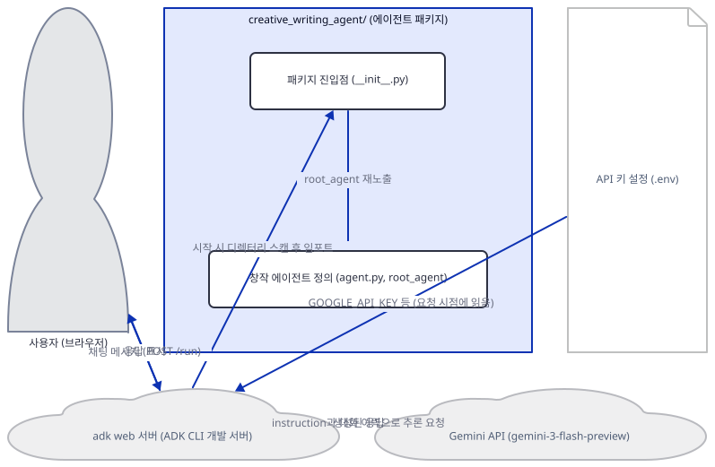
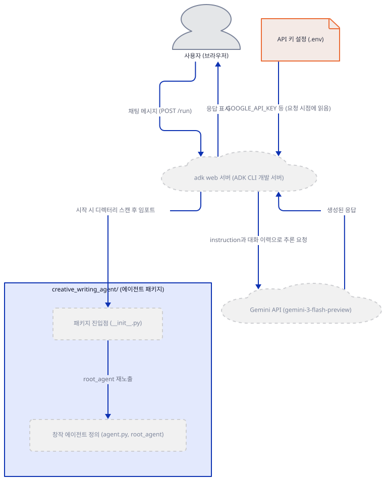
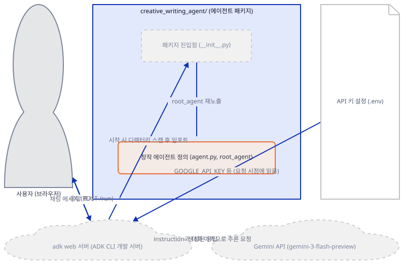
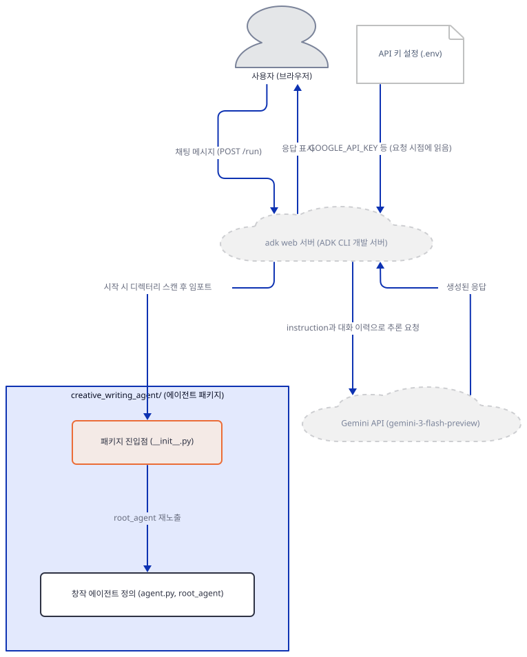
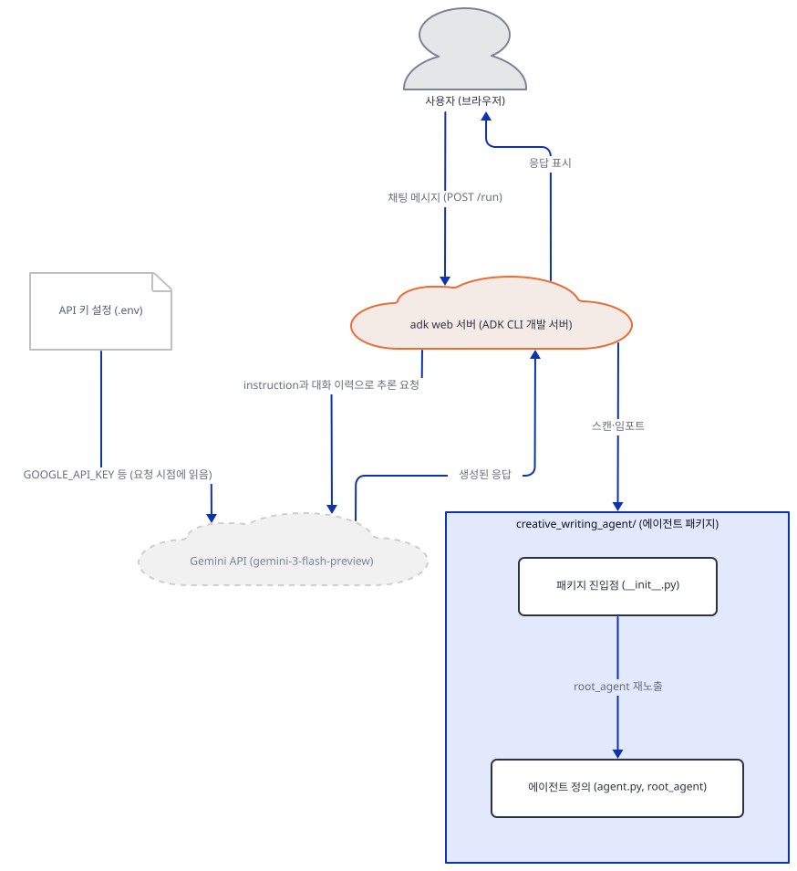
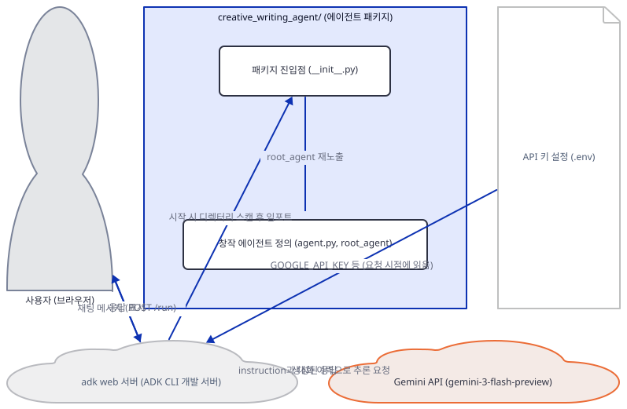
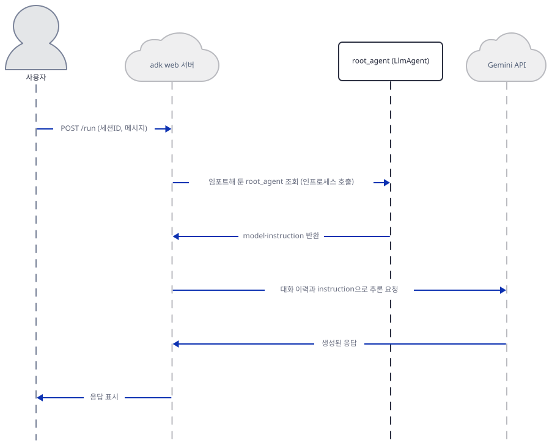

# Day 014 · Google ADK Crash Course · 1_starter_agent

> 볼륨 2 🧑‍🏫 Crash Courses · 난이도 ★☆☆ · 예상 소요 45분 · API 비용 $0 (API 키 없이 진행 — 실제 모델 호출은 하지 않습니다) · 원본 앱: `ai_agent_framework_crash_course/google_adk_crash_course/1_starter_agent`

## 오늘 만들 것

볼륨 2부터는 완성된 서비스 하나를 밑바닥부터 조립하는 볼륨 1의 방식 대신, 프레임워크가 요구하는 개념 단위를 하나씩 훑는 크래시 코스로 형식이 바뀝니다. 오늘 다루는 `1_starter_agent`는 그 첫 단위이자 이 시리즈를 통틀어 가장 짧은 앱입니다 — 실제 로직은 `creative_writing_agent/agent.py` 단 26줄이 전부이고, 그 안에는 `if`도, 함수 정의도, 반복문도 하나 없습니다. 있는 것은 `LlmAgent(...)` 생성자 호출 한 번뿐입니다: 이름, 모델, 설명, 그리고 통째로 하나의 문자열인 지시문. 볼륨 1의 모든 앱이 따르던 환경 → 모델 → 도구 → 프롬프트 → UI → 실행이라는 계단은 여기서 힘을 잃습니다 — 도구도, UI 코드도, `main()`도, 요청을 받는 반복문도 이 앱에는 없기 때문입니다. 그래서 오늘 배울 것은 코드 자체가 아니라 **Google ADK(Agent Development Kit)가 이 코드를 실행하는 방식**입니다. 이 앱은 `python agent.py`로 실행하지 않습니다. ADK가 제공하는 CLI `adk web`을 실행하면, ADK가 현재 폴더를 스캔해 `creative_writing_agent/`라는 하위 폴더를 하나의 "에이전트"로 인식하고, 그 안에서 `root_agent`라는 이름의 객체를 찾아 임포트한 뒤, 자기 자신의 FastAPI 서버와 채팅 UI를 통째로 띄웁니다. 볼륨 1에서는 매일 `agent_os.serve(...)`나 `streamlit run`처럼 호스트를 직접 코드로 작성했지만, 오늘은 호스트를 전혀 작성하지 않습니다 — 프레임워크가 호스트를 제공하고, 우리 코드는 그 호스트가 찾아갈 선언 하나만 남깁니다. 이 문서는 API 키 없이 이 과정이 정확히 어디까지 실제로 진행되는지 — 설치, 임포트, 서버 기동, `/list-apps`를 통한 패키지 탐색, 그리고 실제 채팅 요청이 정확히 어느 지점에서 예외를 던지는지 — 를 전부 직접 실행해 확인합니다. 완성 아키텍처는 다음과 같습니다.



## 사전 준비

| 서비스/도구 | 용도 | 발급·설치 |
|---|---|---|
| Google AI Studio API 키 (`GOOGLE_API_KEY`) | Gemini 모델(`gemini-3-flash-preview`) 호출 인증. 이 문서는 키를 발급하지 않고, 키가 없을 때 정확히 어디서 멈추는지만 확인합니다 | https://aistudio.google.com/ 에서 발급 후 `.env`의 `GOOGLE_API_KEY`에 설정 (이 실습에서는 생략 가능) |
| uv | 가상환경 생성과 패키지 설치 | [공통 사전 준비](../README.md#공통-사전-준비-한-번만) 절 참고 |
| 인터넷 연결 | PyPI에서 `google-adk` 설치, 키가 있다면 Gemini API 접속 | 별도 설치 없음 |

## 아키텍처 한눈에 보기

| 컴포넌트 | 역할 | 코드 위치 |
|---|---|---|
| 사용자 (브라우저) | ADK 개발자 웹 UI 또는 `curl`로 채팅 메시지 전송 | 코드 없음 (외부 UI) |
| `adk web` 서버 | 에이전트 패키지를 스캔·임포트해 FastAPI 앱과 채팅 UI를 자체 구동. 우리가 작성한 코드가 아님 | 코드 없음 (google-adk 2.9.2 CLI — 직접 확인) |
| 패키지 진입점 (`__init__.py`) | `root_agent`를 재노출해 ADK가 임포트로 찾을 수 있게 함 | `ai_agent_framework_crash_course/google_adk_crash_course/1_starter_agent/creative_writing_agent/__init__.py:1-1` |
| 창작 에이전트 정의 (`agent.py`, `root_agent`) | `LlmAgent` 하나로 이름·모델·설명·지시문을 선언 | `ai_agent_framework_crash_course/google_adk_crash_course/1_starter_agent/creative_writing_agent/agent.py:1-26` |
| 환경 설정 (`.env.example`) | Gemini 인증 정보의 틀(`GOOGLE_GENAI_USE_VERTEXAI`, `GOOGLE_API_KEY`) | `ai_agent_framework_crash_course/google_adk_crash_course/1_starter_agent/creative_writing_agent/.env.example:1-3` |
| Gemini API (`gemini-3-flash-preview`) | 실제 추론 수행 | 코드 없음 (외부 서비스) |

## 단계별 진행

### Step 1. 환경 만들기와 의존성 설치

**목적.** 격리된 가상환경에 `google-adk`를 설치하고, Gemini 인증에 쓰이는 `.env` 필드가 무엇인지 확인합니다. 이 문서 전체에서 실제 API 키는 발급하거나 사용하지 않습니다.

**할 일.**

```bash
cd ai_agent_framework_crash_course/google_adk_crash_course/1_starter_agent
uv venv
uv pip install -r requirements.txt
```

(pip 대안: `python -m venv .venv && source .venv/bin/activate && pip install -r requirements.txt`. Windows PowerShell은 활성화만 `.venv\Scripts\Activate.ps1`로 바꿉니다.)

`requirements.txt`는 18바이트, 단 한 줄입니다.

`ai_agent_framework_crash_course/google_adk_crash_course/1_starter_agent/requirements.txt:1-1`

```text
google-adk>=1.5.0
```

레슨 자신의 `README.md`는 이 파일을 그대로 `pip install -r requirements.txt`로 설치하라고 안내합니다. 직접 실행해 보면 이 한 줄만으로 `google-adk`와 그 의존성까지 총 48개 패키지가 PyPI에서 정상 설치됩니다(직접 확인: `uv pip install -r requirements.txt` → `google-adk==2.9.2` 포함 48개 설치. Python 3.12와 3.13 양쪽에서 동일하게 성공했습니다). 즉 파일 내용 자체는 멀쩡합니다 — 문제는 레슨이 안내하는 명령 쪽에 있습니다. `uv venv`로 새로 만든 가상환경에는 `pip`이 기본으로 들어 있지 않으므로, 레슨 말대로 `pip install -r requirements.txt`를 그대로 치면 `No module named pip`으로 실패합니다(직접 확인). 위처럼 `uv pip install -r requirements.txt`를 쓰면 이 실패 자체가 일어나지 않습니다 — 이 문서의 Step 1 명령이 그렇게 되어 있는 이유입니다.

`ai_agent_framework_crash_course/google_adk_crash_course/1_starter_agent/creative_writing_agent/.env.example:1-3`

```text
# If using Gemini via Google AI Studio
GOOGLE_GENAI_USE_VERTEXAI=False
GOOGLE_API_KEY="your-api-key"
```

`GOOGLE_GENAI_USE_VERTEXAI=False`는 Vertex AI가 아니라 Google AI Studio 경로로 Gemini를 호출하겠다는 뜻이고, `GOOGLE_API_KEY`가 그 인증값입니다. 키를 발급받았다면 이 내용을 같은 폴더에 `.env`로 복사해 채우면 되지만, 이 문서는 키를 발급하지 않으므로 `.env.example`만 그대로 두고 진행합니다.



**확인.**

```bash
uv run python -c "import google.adk; print(google.adk.__version__)"
```

```
2.9.2
```

(설치 시점에 따라 버전은 다를 수 있습니다 — 위 값은 이 문서를 작성하며 직접 확인한 값입니다.)

### Step 2. 에이전트 선언 — 코드가 아니라 constructor 호출 하나

**목적.** ADK에서 "에이전트"가 무엇을 뜻하는지 — 실행 흐름이 아니라 하나의 선언이라는 것 — 를 파일 전체를 통해 확인합니다.

**할 일.** 26줄짜리 파일 전체를 봅니다.

`ai_agent_framework_crash_course/google_adk_crash_course/1_starter_agent/creative_writing_agent/agent.py:1-26`

```python
from google.adk.agents import LlmAgent

# Create a creative writing agent
root_agent = LlmAgent(
    name="creative_writing_agent",
    model="gemini-3-flash-preview",
    description="A creative writing assistant that helps with stories, poems, and creative content",
    instruction="""
    You are a creative writing assistant.
    
    Your role is to:
    - Help users develop story ideas
    - Assist with character development
    - Provide writing prompts and inspiration
    - Help with plot structure and pacing
    - Offer feedback on creative writing
    
    When users want to write creatively:
    - Ask engaging questions to develop ideas
    - Suggest creative elements and themes
    - Help structure stories and narratives
    - Provide constructive feedback
    
    Keep responses creative, inspiring, and supportive of artistic expression.
    """
)
```

위 26줄 전체에서 실행 가능한 문장은 첫 줄의 임포트와 4번째 줄의 생성자 호출 한 번뿐입니다. `name`은 ADK가 이 에이전트를 가리킬 때 쓰는 식별자이고, `model`은 실제 클래스 인스턴스가 아니라 `"gemini-3-flash-preview"`라는 문자열 하나입니다 — 이 문자열을 보고 실제 Gemini 클라이언트를 언제, 어떻게 만드는지는 Step 5에서 실행으로 확인합니다. `description`은 다중 에이전트 구성에서 다른 에이전트가 이 에이전트를 고를 때 참고하는 한 줄 요약이고, `instruction`은 시스템 프롬프트 전체입니다. 볼륨 1의 agno 앱들이 `instructions`(리스트)로 짧은 규칙 몇 개만 얹었던 것과 달리, 여기서는 역할·규칙·어조를 문단 단위로 담은 긴 문자열 하나가 이 에이전트의 행동을 통째로 정의합니다 — 조건문도 함수도 없으니, 동작을 바꾸는 유일한 방법은 이 문자열을 고치는 것뿐입니다.



**확인.**

```bash
uv run python -c "from creative_writing_agent.agent import root_agent; print(root_agent.name, '|', root_agent.model, '|', type(root_agent).__name__)"
```

```
creative_writing_agent | gemini-3-flash-preview | LlmAgent
```

(`1_starter_agent` 폴더, 즉 `creative_writing_agent`의 부모 폴더에서 실행해야 합니다 — 직접 확인.)

### Step 3. 패키지로 묶기 — ADK가 폴더를 찾는 규칙

**목적.** ADK가 이 폴더를 "에이전트"로 인식하는 정확한 규칙을 확인하고, `__init__.py`가 실제로 무엇을 위해 있는지 직접 실험으로 검증합니다.

**할 일.**

`ai_agent_framework_crash_course/google_adk_crash_course/1_starter_agent/creative_writing_agent/__init__.py:1-1`

```python
from .agent import root_agent
```

`adk web --help`는 대상 디렉터리를 이렇게 설명합니다(직접 확인, google-adk 2.9.2): `AGENTS_DIR: The directory of agents (where each subdirectory is a single agent containing agent.py, __init__.py, or root_agent.yaml)`. 레슨 자신의 README도 이 파일의 역할을 "Makes it a Python package"라는 주석 한 줄로 적어 둡니다(`ai_agent_framework_crash_course/google_adk_crash_course/1_starter_agent/README.md:56`). 그래서 처음에는 `__init__.py`가 없으면 ADK가 이 폴더를 아예 찾지 못할 것이라고 예상했지만, 직접 실험해 보니 그렇지 않았습니다: 저장소 밖 임시 폴더에 `__init__.py` 없이 `agent.py`만 복사해 두고 `adk web`을 띄워도 `/list-apps`는 여전히 `["creative_writing_agent"]`를 돌려줬고, 세션을 만들어 `/run`을 호출해도 Step 5와 정확히 같은 지점(`ValueError: No API key was provided...`)까지 도달했습니다(직접 확인 — 리포 안 파일은 건드리지 않고 임시 폴더에서만 재현). 즉 `--help` 문구의 "agent.py, __init__.py, or root_agent.yaml"은 글자 그대로 **OR**입니다: 파이썬 3의 암묵적 네임스페이스 패키지(PEP 420) 덕분에 `__init__.py`가 없는 폴더도 `agent.py` 하나만으로 임포트할 수 있는 대상이 됩니다. `__init__.py`가 하는 실질적인 일은 "이 폴더는 진짜 패키지"라는 걸 명시하고 `root_agent`를 재노출을 통해 한곳에서 임포트할 수 있게 정리하는 것이지, 이 버전의 ADK CLI가 강제하는 필수 조건은 아닙니다.



**확인.**

```bash
uv run python -c "import creative_writing_agent as m; print(m.root_agent.name)"
```

```
creative_writing_agent
```

### Step 4. `adk web`으로 띄우기 — 우리가 쓰지 않은 서버

**목적.** 서버 코드를 한 줄도 쓰지 않았는데 무엇이 뜨는지, 그리고 ADK가 패키지를 실제로 어떻게 찾아 목록에 올리는지 확인합니다.

**할 일.** `1_starter_agent` 폴더(즉 `creative_writing_agent`의 부모 폴더)에서 실행합니다.

```bash
uv run adk web --port 8987 --no_use_local_storage .
```

`adk` 계열 명령을 이 컴퓨터에서 처음 실행하면 텔레메트리 수집 동의를 묻는 프롬프트가 먼저 뜨고, 답하기 전까지는 서버가 시작되지 않습니다 — 문제 해결에 정리했습니다. 서버가 뜨면 ADK는 `.` 아래 하위 폴더를 스캔해 `creative_writing_agent`를 찾아 임포트해 두고, FastAPI 앱과 채팅 웹 UI를 같은 프로세스에서 서비스합니다. 이 앱 어디에도 `uvicorn.run`이나 `app = FastAPI()` 같은 코드가 없다는 점이 볼륨 1과의 핵심 차이입니다 — 서버는 전적으로 `google-adk` 패키지가 제공합니다.



**확인.** 서버가 뜨면 이런 배너가 찍힙니다(직접 확인).

```
+-----------------------------------------------------------------------------+
| ADK Web Server started                                                      |
|                                                                             |
| For local testing, access at http://127.0.0.1:8987.                         |
+-----------------------------------------------------------------------------+
```

다른 터미널에서 ADK가 실제로 무엇을 찾았는지 확인합니다.

```bash
curl -s http://127.0.0.1:8987/list-apps
```

```
["creative_writing_agent"]
```

(배너의 정렬과 포트 번호는 실행 환경·터미널 폭에 따라 달라질 수 있습니다. 위 출력은 이 문서를 작성하며 실제로 받은 것입니다.)

### Step 5. 첫 요청 — 정확히 어디서 멈추는가

**목적.** 키 없이 채팅 메시지를 보내면 정확히 어느 코드 경로에서, 어떤 예외로 멈추는지 실제 HTTP 요청으로 확인합니다.

**할 일.** 세션을 만들고 메시지를 보냅니다.

```bash
curl -s -X POST http://127.0.0.1:8987/apps/creative_writing_agent/users/u1/sessions/s1 -H "Content-Type: application/json" -d "{}"
```

```
{"id":"s1","appName":"creative_writing_agent","userId":"u1","state":{},"events":[],"lastUpdateTime":1789969600.5278697}
```

(`lastUpdateTime`은 실행마다 다른 타임스탬프입니다.)

```bash
curl -s -X POST http://127.0.0.1:8987/run -H "Content-Type: application/json" -d '{"appName":"creative_writing_agent","userId":"u1","sessionId":"s1","newMessage":{"role":"user","parts":[{"text":"hello"}]}}'
```

```
Internal Server Error
```

HTTP 상태는 500이고, 응답 본문은 이 한 줄뿐입니다. 진짜 원인은 서버를 띄운 터미널에만 찍힙니다(직접 확인, 발췌 — 가상환경 경로는 설치 위치에 따라 다릅니다).

```
  File "...\site-packages\google\genai\_api_client.py", line 834, in __init__
    raise ValueError(
ValueError: No API key was provided. Please pass a valid API key. Learn how to create an API key at https://ai.google.dev/gemini-api/docs/api-key.
```

`root_agent` 조회, `instruction` 조립까지는 전부 성공하고, ADK가 `model="gemini-3-flash-preview"`를 실제로 호출하려고 `google-genai`의 `Client`를 생성하는 바로 그 순간에만 예외가 납니다 — Day 1의 xAI 클라이언트와 같은 패턴으로, 키 확인은 객체 생성이 아니라 실제 호출 시점에 일어납니다. 즉 이 앱은 설치·선언·서버 기동·패키지 탐색까지 전부 키 없이 성공하고, 오직 이 마지막 한 걸음에서만 막힙니다.



**확인.**

```bash
curl -s -o /dev/null -w "%{http_code}\n" -X POST http://127.0.0.1:8987/run -H "Content-Type: application/json" -d '{"appName":"creative_writing_agent","userId":"u1","sessionId":"s1","newMessage":{"role":"user","parts":[{"text":"hello"}]}}'
```

```
500
```

## 요청 한 건이 흐르는 과정



사용자가 ADK 개발자 웹 UI(또는 이 문서처럼 `curl`)로 메시지를 보내면 `POST /run`으로 `adk web` 서버에 도착합니다. 서버는 시작할 때 이미 임포트해 둔 `root_agent`를 찾아 그 `model`과 `instruction`을 그대로 사용합니다 — 이 시점까지는 순수한 인프로세스 파이썬 객체 조회이고, 아직 네트워크 호출이 없습니다. 실제 네트워크 경계는 ADK가 `google-genai` 클라이언트를 생성해 Gemini에 추론을 요청하는 순간에만 열리고, `GOOGLE_API_KEY`도 바로 이 시점에 처음 읽힙니다. 키가 있다면 Gemini가 `instruction`에 따라 생성한 텍스트가 그대로 `adk web`을 거쳐 사용자에게 표시되지만, 이 문서처럼 키가 없는 환경에서는 이 사슬이 정확히 그 경계에서 끊깁니다 — Step 5에서 직접 확인했듯 클라이언트 생성자가 `ValueError`를 던지고, `adk web`은 이를 그대로 HTTP 500과 "Internal Server Error"로만 반환합니다.

## 실행 체크리스트

- [ ] `uv venv && uv pip install -r requirements.txt`로 `google-adk`를 설치했다 (레슨의 `pip install -r requirements.txt`가 아니라 `uv pip install`을 썼다)
- [ ] `.env.example`의 `GOOGLE_GENAI_USE_VERTEXAI`/`GOOGLE_API_KEY` 역할을 이해했다
- [ ] `creative_writing_agent/agent.py`가 `LlmAgent` 생성자 호출 하나뿐이라는 것을 직접 읽었다
- [ ] `adk web --help`로 디렉터리 탐색 규칙(`agent.py`, `__init__.py`, `root_agent.yaml` 중 하나)을 확인했다
- [ ] `adk telemetry disable`을 실행하거나 최초 실행 프롬프트에 답했다
- [ ] `uv run adk web`로 서버를 띄우고 `curl .../list-apps`에서 `creative_writing_agent`를 확인했다
- [ ] 키 없이 세션을 만들고 `/run`을 호출해 HTTP 500과 `ValueError: No API key was provided...`를 직접 봤다

## 문제 해결

| 증상 | 원인 | 해결 |
|---|---|---|
| 레슨 안내대로 `pip install -r requirements.txt`를 실행하면 `No module named pip` | `uv venv`로 새로 만든 가상환경에는 `pip`이 기본으로 설치되지 않는다(직접 확인) | `uv pip install -r requirements.txt`를 대신 사용 (또는 `uv venv --seed`로 pip까지 함께 설치) |
| `adk` 계열 명령을 처음 실행하면 `Enable telemetry? [Y/n]:`에서 멈추고, 비대화형 셸에서는 응답을 받지 못해 그대로 대기 | google-adk 2.9.2가 최초 실행 시 텔레메트리 동의를 대화형으로 묻는다(직접 확인) | `adk telemetry disable`을 먼저 실행하거나, 대화형 터미널에서 Y/n으로 답한다 |
| `/run`에 메시지를 보내면 응답 본문이 `Internal Server Error`뿐이고, 진짜 원인은 응답에 없다 | `GOOGLE_API_KEY`가 없으면 `google-genai`의 `Client` 생성자가 `ValueError`를 던지고, ADK는 이를 HTTP 500으로만 반환한다(직접 확인) | `.env`에 `GOOGLE_API_KEY`를 설정하고 서버를 재시작. 실패 원인은 응답이 아니라 서버 터미널 로그에서 확인 |
| 기본 옵션으로 `adk web`을 띄우고 세션을 하나만 만들어도 `creative_writing_agent/.adk/session.db`가 생긴다 | `--no_use_local_storage`를 주지 않으면 ADK가 에이전트 디렉터리 밑에 세션·아티팩트를 로컬 파일로 저장하는 것이 기본값이다(직접 확인). 이 문서의 확인 명령은 저장소를 건드리지 않으려고 이 옵션을 붙였다 | 리포 폴더 안에서 그대로 실습한다면 `--no_use_local_storage`를 붙이거나, 생긴 `.adk/`를 커밋하지 않도록 유의 |
| Windows PowerShell에서 이 문서의 `curl` 명령이 매개변수 오류를 낸다 | PowerShell은 `curl`을 `Invoke-WebRequest`의 별칭으로 미리 정의해 두므로, `-s`·`-X`·`-d` 같은 실제 curl 옵션을 받지 못한다 | `curl.exe`처럼 확장자를 붙여 Windows에 내장된 실제 curl 실행 파일을 직접 호출 (같은 인자 그대로 사용 가능) |

## 더 해보기

- `instruction`(`ai_agent_framework_crash_course/google_adk_crash_course/1_starter_agent/creative_writing_agent/agent.py:8-25`)을 다른 페르소나(예: 기술 문서 리뷰어)로 바꿔보고, `name`·`description`도 함께 바꿔 `/list-apps`와 개발자 웹 UI 목록에 어떻게 반영되는지 확인해보기
- `creative_writing_agent` 옆에 `agent.py`(`root_agent` 포함)만 있는 두 번째 폴더를 만들어, `adk web`이 정말 폴더 단위로 에이전트를 셈하는지 `/list-apps`로 확인해보기
- 실제 `GOOGLE_API_KEY`를 발급받아 `.env`에 넣고 Step 5의 `curl` 요청을 다시 실행해, 500 대신 어떤 창작 조언 응답이 오는지 비교해보기
- ADK 문서에서 `root_agent.yaml` 방식(코드 없이 YAML만으로 에이전트를 선언하는 대안 경로)을 찾아보고, 오늘의 `agent.py`와 무엇이 같고 다른지 비교해보기

## 다음 날 예고

[Day 015 · Google ADK Crash Course · 2_model_agnostic_agent](../day015-adk-2-model-agnostic-agent/README.md) — OpenRouter API 키 하나로 OpenAI·Anthropic 모델을 갈아 끼우는 두 개의 에이전트를 비교합니다.
