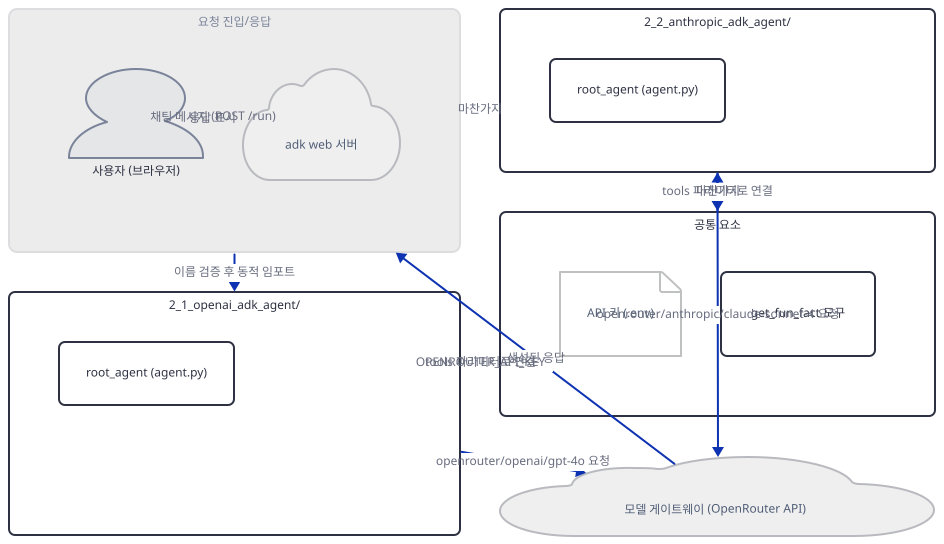
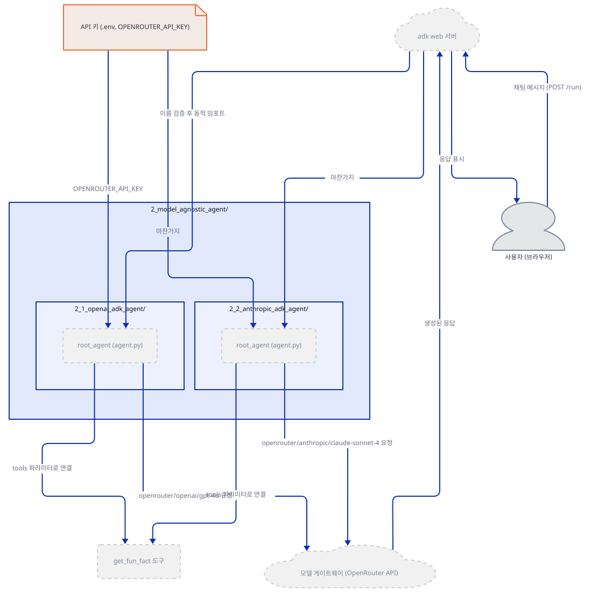
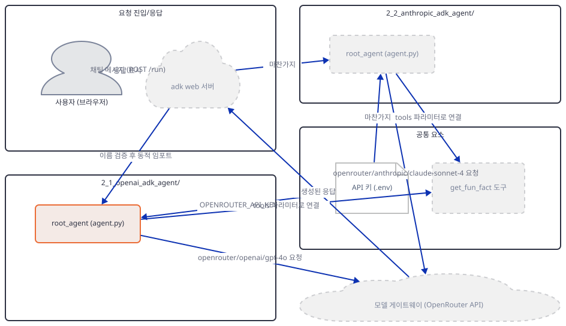
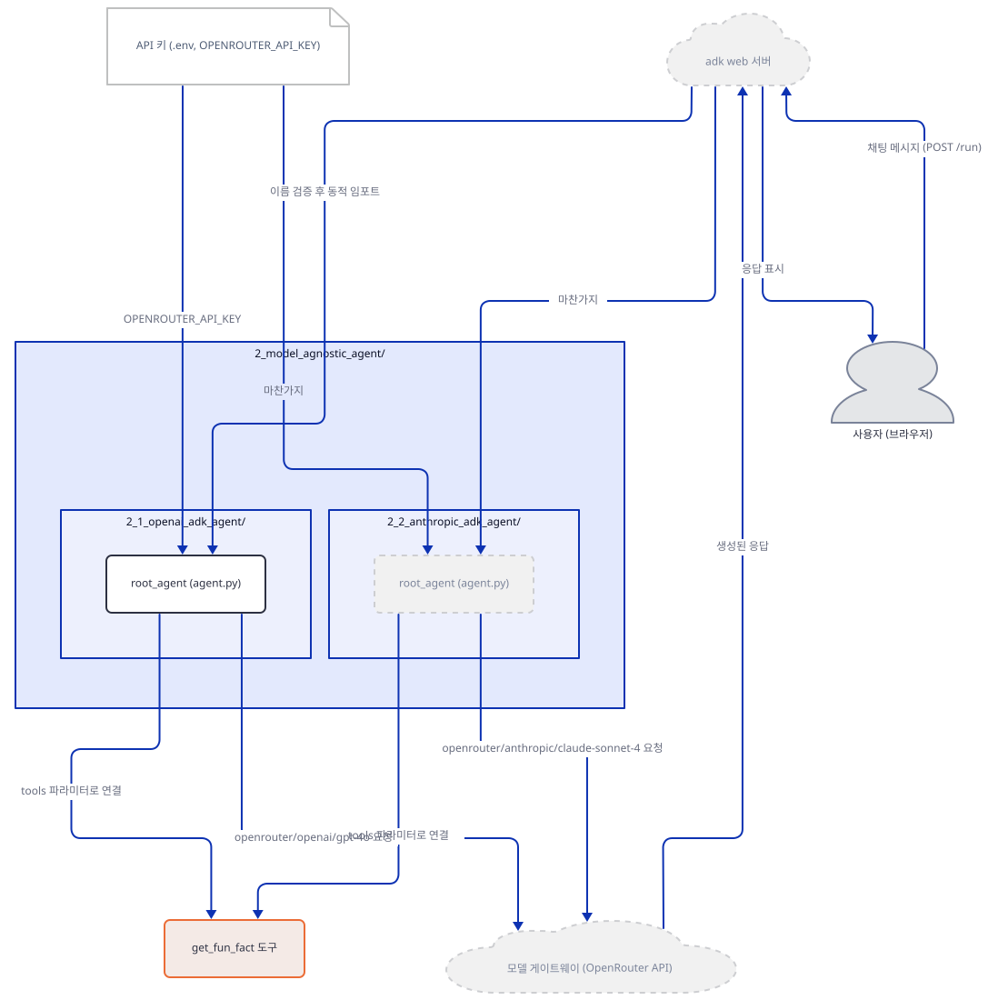
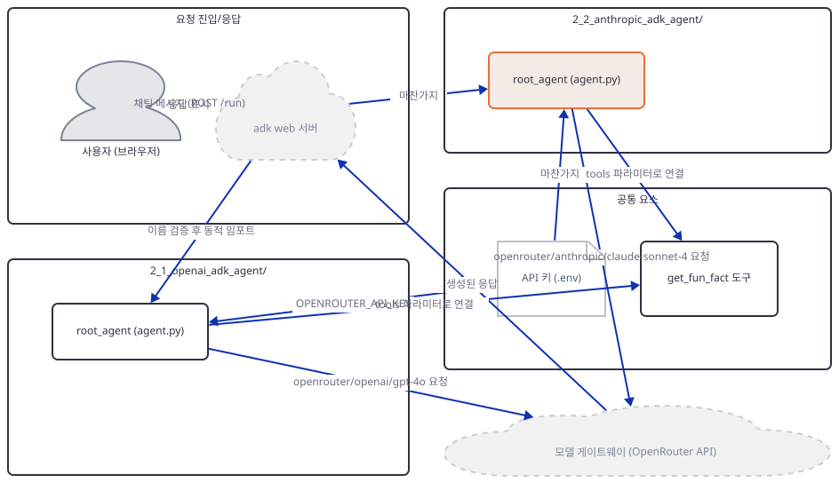
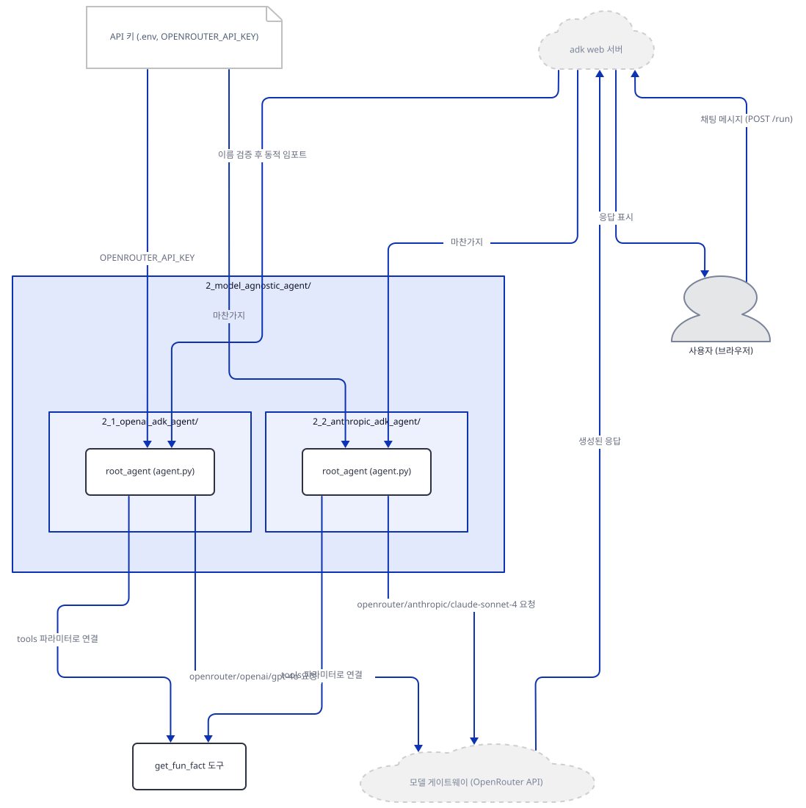
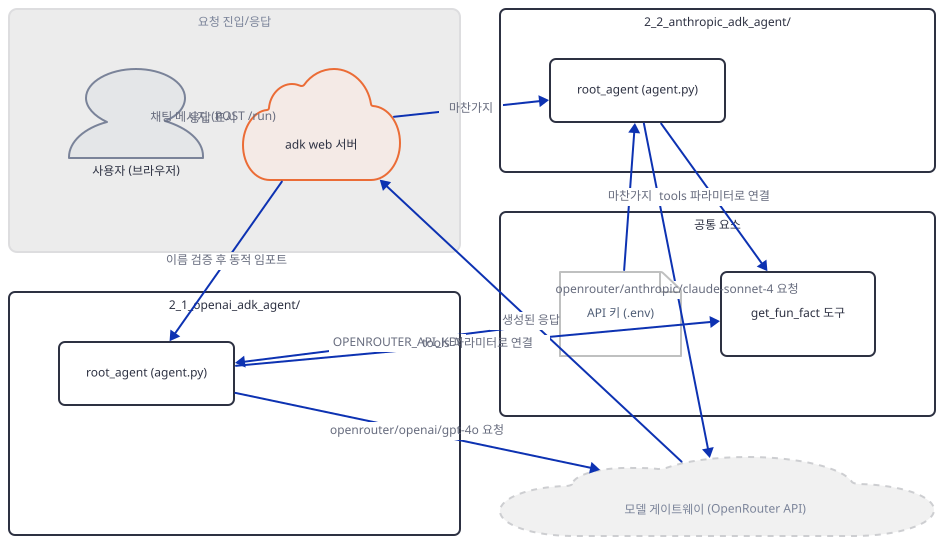
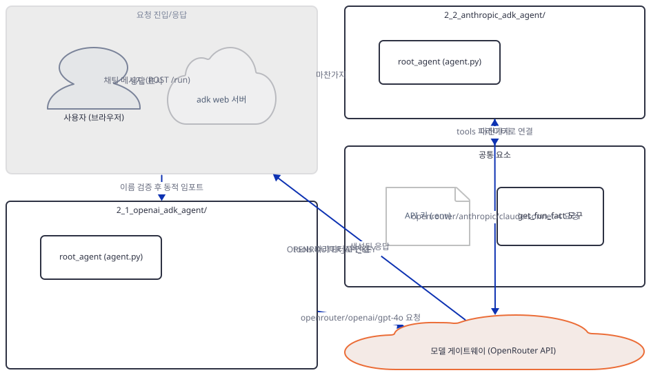
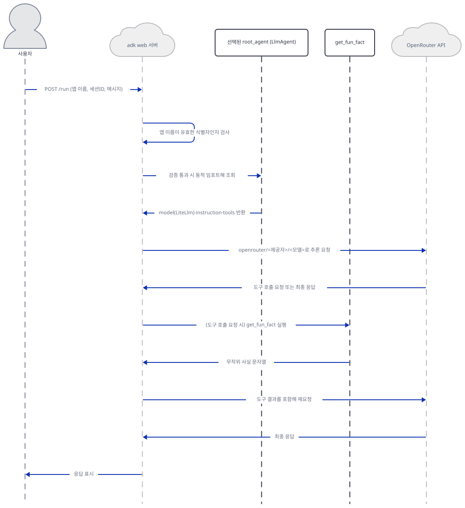

# Day 015 · Google ADK Crash Course · 2_model_agnostic_agent

> 볼륨 2 🧑‍🏫 Crash Courses · 난이도 ★★☆ · 예상 소요 60분 · API 비용 $0 (API 키 없이 진행 — OpenRouter 키가 없어 실제 모델 호출은 하지 않습니다) · 원본 앱: `ai_agent_framework_crash_course/google_adk_crash_course/2_model_agnostic_agent`

## 오늘 만들 것

Day 14가 ADK의 최소 단위 — `LlmAgent` 생성자 호출 하나 — 를 보여줬다면, 오늘의 `2_model_agnostic_agent`는 그 최소 단위를 그대로 유지한 채 **모델만 갈아 끼우는 법**을 보여줍니다. 이 폴더에는 구조가 완전히 같은 에이전트 패키지 두 개, `2_1_openai_adk_agent`와 `2_2_anthropic_adk_agent`가 나란히 있습니다. 두 `agent.py`는 각각 37줄(레슨 README는 36줄이라 적었지만, 개행 없는 마지막 줄 때문에 `wc -l`이 하나 적게 셉니다)이고, 실제로 다른 곳은 모델 문자열과 이름·설명·지시문의 브랜드명 등 6줄뿐입니다(Step 4에서 diff로 확인). Day 14의 `LlmAgent(model="gemini-3-flash-preview", ...)`는 `model`에 문자열 하나를 넘겼지만, 오늘의 `Agent(model=LiteLlm(...), ...)`는 **객체**를 넘깁니다 — 이 `LiteLlm` 래퍼가 ADK를 구글 바깥의 모델과 잇는 다리입니다. 두 파일 모두 각자의 API 키 대신 [OpenRouter](https://openrouter.ai/)라는 단일 게이트웨이를 거치므로, 필요한 환경변수도 `OPENAI_API_KEY`·`ANTHROPIC_API_KEY`가 아니라 `OPENROUTER_API_KEY` 하나뿐입니다. 오늘 이 시리즈에 처음으로 **도구**(`get_fun_fact`, 데코레이터 없는 평범한 함수)도 등장합니다. 그런데 두 폴더를 실제로 `adk web`에 태워 끝까지 밀어붙이면 진짜 반전이 드러납니다 — 막히는 지점은 API 키가 아니라 **폴더 이름 그 자체**입니다. `2_1_openai_adk_agent`처럼 숫자로 시작하는 이름은 유효한 파이썬 식별자가 아니고, google-adk 2.9.2는 이 규칙으로 `/run` 요청을 걸러냅니다. 이 문서는 그 벽을 만나고, 이름만 고치면 무엇이 기다리는지까지 리포 밖 사본으로 확인합니다. 완성 아키텍처는 다음과 같습니다.



## 사전 준비

| 서비스/도구 | 용도 | 발급·설치 |
|---|---|---|
| OpenRouter API 키 (`OPENROUTER_API_KEY`) | `2_1_openai_adk_agent`는 `openrouter/openai/gpt-4o`를, `2_2_anthropic_adk_agent`는 `openrouter/anthropic/claude-sonnet-4-20250514`를 호출하는 유일한 인증 값(둘 다 같은 키 하나). 이 문서는 키를 발급하지 않고, 키가 없을 때 정확히 어디서 멈추는지만 확인합니다 | https://openrouter.ai/keys 에서 발급 후 각 에이전트 폴더의 `.env`에 `OPENROUTER_API_KEY`로 설정 (이 실습에서는 생략 가능) |
| uv | 가상환경 생성과 패키지 설치 | [공통 사전 준비](../README.md#공통-사전-준비-한-번만) 절 참고 |
| 인터넷 연결 | PyPI에서 `google-adk`·`litellm` 설치, 키가 있다면 OpenRouter 접속 | 별도 설치 없음 |

## 아키텍처 한눈에 보기

| 컴포넌트 | 역할 | 코드 위치 |
|---|---|---|
| 사용자 (브라우저) | ADK 개발자 웹 UI 또는 curl로 채팅 메시지 전송 | 코드 없음 (외부 UI) |
| `adk web` 서버 | 두 에이전트 폴더를 스캔하고, 이름이 유효한 식별자인지 검증한 뒤 임포트 (Day 14와 같은 CLI) | 코드 없음 (google-adk 2.9.2 CLI — 소스로 확인) |
| OpenAI 경로 (`2_1_openai_adk_agent`) | `LiteLlm`로 `openrouter/openai/gpt-4o`를 감싼 `root_agent` | `ai_agent_framework_crash_course/google_adk_crash_course/2_model_agnostic_agent/2_1_openai_adk_agent/agent.py:1-37` |
| Anthropic 경로 (`2_2_anthropic_adk_agent`) | `LiteLlm`로 `openrouter/anthropic/claude-sonnet-4-20250514`를 감싼 `root_agent` | `ai_agent_framework_crash_course/google_adk_crash_course/2_model_agnostic_agent/2_2_anthropic_adk_agent/agent.py:1-37` |
| 재미있는 사실 도구 (`get_fun_fact`) | 인자 없이 무작위 사실 문자열 하나를 반환하는 평범한 함수. 두 파일에 각자 정의되어 있고 내용은 같음 | `ai_agent_framework_crash_course/google_adk_crash_course/2_model_agnostic_agent/2_1_openai_adk_agent/agent.py:6-18` |
| OpenRouter API | 두 모델 문자열을 각자의 실제 제공자로 라우팅해 추론 수행 | 코드 없음 (외부 서비스) |

## 단계별 진행

### Step 1. 환경 만들기와 의존성 확인

**목적.** 격리된 가상환경에 이 레슨의 의존성을 설치하고, `requirements.txt`가 실제로 충분한지, `.env.example`이 무엇을 요구하는지 확인합니다.

**할 일.**

```bash
cd ai_agent_framework_crash_course/google_adk_crash_course/2_model_agnostic_agent
uv venv
uv pip install -r requirements.txt
```

(pip 대안: `python -m venv .venv && source .venv/bin/activate && pip install -r requirements.txt`. Windows PowerShell은 활성화만 `.venv\Scripts\Activate.ps1`로 바꿉니다. `uv venv`가 만든 가상환경에는 pip이 없어 `pip install`이 바로 실패한다는 것은 Day 14에서 이미 확인했으므로, 위 명령은 처음부터 `uv pip install`을 씁니다.)

`requirements.txt`는 3줄입니다(마지막 줄에 개행이 없어 `wc -l`은 2로 셉니다).

`ai_agent_framework_crash_course/google_adk_crash_course/2_model_agnostic_agent/requirements.txt:1-3`

```text
google-adk>=1.5.0
litellm>=1.65.1
python-dotenv>=1.0.1
```

Day 14는 크래시 코스의 `requirements.txt`가 부실할 수 있다고 경고했지만, 이 세 줄은 그 자체로 충분했습니다(직접 확인: 설치 후 두 `agent.py`의 모든 import 성공). 설치된 버전은 **google-adk 2.9.2**(Day 14와 동일), **litellm 1.102.0**, **python-dotenv 1.2.3**, 그리고 litellm이 끌어온 **openai 2.54.0**입니다 — 두 에이전트 다 OpenRouter를 거치는데, OpenRouter가 OpenAI 호환 API라서 litellm이 Anthropic 쪽 요청까지 이 경로로 처리하기 때문입니다(`anthropic` 패키지는 설치되지 않습니다 — 직접 확인: `importlib.metadata.version("anthropic")` → `PackageNotFoundError`).

각 에이전트 폴더에 `.env.example`이 있습니다.

`ai_agent_framework_crash_course/google_adk_crash_course/2_model_agnostic_agent/2_1_openai_adk_agent/.env.example:1-1`

```text
OPENROUTER_API_KEY="your-api-key"
```

`2_2_anthropic_adk_agent/.env.example`도 내용이 같습니다(직접 확인) — 두 에이전트가 정말 같은 값 하나만 요구한다는 뜻입니다. 폴더가 나뉜 이유는 `adk web`이 선택된 에이전트 폴더의 `.env`만 그 폴더 기준으로 읽기 때문입니다(소스로 확인, google-adk 2.9.2의 `google/adk/cli/cli.py`가 부르는 `envs.load_dotenv_for_agent` — `python-dotenv`가 의존성에 있는 이유이기도 합니다).



**확인.**

```bash
uv run python -c "import google.adk, litellm, dotenv; print(google.adk.__version__)"
```

```
2.9.2
```

(Python 3.12.10으로 확인했습니다 — `uv venv --python 3.12`로 만든 throwaway 가상환경 기준이며, 시스템 기본 Python은 3.13.12였습니다.)

### Step 2. LiteLlm로 모델 감싸기 — `Agent`의 정체는 `LlmAgent`

**목적.** `model` 파라미터가 문자열이 아니라 객체를 받을 수 있다는 것과, `LiteLlm`이 정확히 무엇을 감싸는지 확인합니다. `Agent`라는 낯선 이름도 등장하므로 Day 14의 `LlmAgent`와 같은 것인지 직접 확인합니다.

**할 일.**

`ai_agent_framework_crash_course/google_adk_crash_course/2_model_agnostic_agent/2_1_openai_adk_agent/agent.py:1-4`

```python
import os
import random
from google.adk.agents import Agent
from google.adk.models.lite_llm import LiteLlm
```

`ai_agent_framework_crash_course/google_adk_crash_course/2_model_agnostic_agent/2_1_openai_adk_agent/agent.py:20-29`

```python
# OpenAI model via OpenRouter
model = LiteLlm(
    model="openrouter/openai/gpt-4o",
    api_key=os.getenv("OPENROUTER_API_KEY")
)

root_agent = Agent(
    name="openai_adk_agent",
    model=model,
    description="Fun fact agent using OpenAI GPT-4 via OpenRouter",
```

`LiteLlm`은 LiteLLM 라이브러리가 이해하는 `"<게이트웨이>/<제공자>/<모델>"` 형식의 문자열을 감싸는 어댑터 객체입니다. `openrouter/openai/gpt-4o`는 OpenRouter를 거쳐 OpenAI의 `gpt-4o`를 부르라는 뜻이고, `api_key`는 `OPENROUTER_API_KEY` 하나뿐입니다. `os.getenv(...)`는 모듈이 임포트되는 순간 한 번만 읽힙니다 — 요청 시점에야 키를 확인하던 Day 14의 Gemini 클라이언트와는 다른 지점입니다. `LiteLlm(...)` 생성 자체는 이 값이 `None`이어도 실패하지 않습니다(직접 확인). `root_agent`를 만드는 `Agent(...)`는 Day 14의 `LlmAgent(...)`와 이름이 다르지만, google-adk 2.9.2 소스를 보면(`google/adk/agents/llm_agent.py`) `Agent`는 `LlmAgent`의 타입 별칭일 뿐 완전히 같은 클래스입니다.



**확인.**

```bash
uv run python -c "from google.adk.agents import Agent, LlmAgent; print(Agent is LlmAgent)"
```

```
True
```

`2_1_openai_adk_agent` 폴더 이름은 숫자로 시작해 보통의 `import` 문으로는 불러올 수 없습니다 — 이유와 실제 실행 결과는 Step 5·6에서 다룹니다. 지금은 `importlib`로 우회해 실제 값을 확인합니다(`2_model_agnostic_agent` 폴더에서 실행).

```bash
uv run python -c "
import sys; sys.path.insert(0, '.')
import importlib
m = importlib.import_module('2_1_openai_adk_agent.agent')
print(m.root_agent.name, '|', type(m.root_agent.model).__name__, '|', m.root_agent.model.model, '|', type(m.root_agent).__name__)
"
```

```
openai_adk_agent | LiteLlm | openrouter/openai/gpt-4o | LlmAgent
```

`type(m.root_agent).__name__`이 `Agent`가 아니라 `LlmAgent`로 찍힌다는 점이 둘이 같은 클래스라는 증거입니다.

### Step 3. 함수를 도구로 쓰기 — `get_fun_fact`

**목적.** 이 시리즈에 처음 등장하는 ADK 도구가 얼마나 평범한 코드인지, `tools=[...]`가 실제로 무엇을 저장하는지 확인합니다.

**할 일.**

`ai_agent_framework_crash_course/google_adk_crash_course/2_model_agnostic_agent/2_1_openai_adk_agent/agent.py:6-18`

```python
def get_fun_fact():
    """Return a random fun fact"""
    facts = [
        "Honey never spoils. Archaeologists have found pots of honey in ancient Egyptian tombs that are over 3,000 years old and still perfectly edible.",
        "Octopuses have three hearts and blue blood.",
        "A group of flamingos is called a 'flamboyance'.",
        "Bananas are berries, but strawberries aren't.",
        "A day on Venus is longer than its year.",
        "Wombat poop is cube-shaped.",
        "There are more possible games of chess than atoms in the observable universe.",
        "Dolphins have names for each other.",
    ]
    return random.choice(facts)
```

`ai_agent_framework_crash_course/google_adk_crash_course/2_model_agnostic_agent/2_1_openai_adk_agent/agent.py:36-36`

```python
    tools=[get_fun_fact],
```

데코레이터도 스키마 선언도 없습니다 — 인자 없는 함수 하나를 `Agent(...)`의 `tools` 리스트에 넣은 것이 전부입니다. `root_agent.tools`를 찍어보면 이 시점엔 감싸지 않은 함수 객체 그대로입니다 — 도구 스키마로 바꾸는 `FunctionTool`(소스로 확인, google-adk 2.9.2의 `google/adk/tools/function_tool.py`)은 생성자 호출이 아니라 이후 요청 처리 단계에서 관여합니다. `get_fun_fact` 자신은 네트워크를 타지 않는 순수 로컬 함수라, 모델이 호출을 결정해도 실행은 OpenRouter와 무관하게 즉시 끝납니다.



**확인.**

```bash
uv run python -c "
import sys; sys.path.insert(0, '.')
import importlib
m = importlib.import_module('2_1_openai_adk_agent.agent')
print('tools:', m.root_agent.tools)
print('call:', m.get_fun_fact())
"
```

```
tools: [<function get_fun_fact at 0x00000268C69A37E0>]
call: A day on Venus is longer than its year.
```

(메모리 주소와 뽑히는 문장은 실행마다 달라집니다 — `facts` 리스트 8개 중 무작위 하나입니다.)

### Step 4. 두 에이전트 비교 — 여섯 줄만 다르다

**목적.** `2_1_openai_adk_agent`와 `2_2_anthropic_adk_agent`가 정말로 거의 같은 파일인지 diff로 직접 증명하고, 이 문서가 왜 하나를 편애하지 않고 둘을 나란히 보는지 정리합니다.

**할 일.** 두 `agent.py`를 직접 비교합니다.

```bash
cd ai_agent_framework_crash_course/google_adk_crash_course/2_model_agnostic_agent
diff -u 2_1_openai_adk_agent/agent.py 2_2_anthropic_adk_agent/agent.py
```

직접 확인한 출력입니다(양쪽 다 37줄 중 31줄은 완전히 같고, 아래 6줄만 다릅니다 — 주석 1줄, 모델 문자열 1줄, `name`·`description` 각 1줄, `instruction` 안의 브랜드명 2줄):

```diff
--- 2_1_openai_adk_agent/agent.py
+++ 2_2_anthropic_adk_agent/agent.py
@@ -17,21 +17,21 @@
     ]
     return random.choice(facts)
 
-# OpenAI model via OpenRouter
+# Anthropic model via OpenRouter
 model = LiteLlm(
-    model="openrouter/openai/gpt-4o",
+    model="openrouter/anthropic/claude-sonnet-4-20250514",
     api_key=os.getenv("OPENROUTER_API_KEY")
 )
 
 root_agent = Agent(
-    name="openai_adk_agent",
+    name="anthropic_adk_agent",
     model=model,
-    description="Fun fact agent using OpenAI GPT-4 via OpenRouter",
+    description="Fun fact agent using Anthropic Claude 4 Sonnet via OpenRouter",
     instruction="""
-    You are a helpful assistant powered by OpenAI GPT-4 that shares interesting fun facts. 
+    You are a helpful assistant powered by Anthropic Claude 4 Sonnet that shares interesting fun facts. 
     Use the `get_fun_fact` tool when users ask for a fun fact or interesting information.
     Be enthusiastic and friendly in your responses.
-    Always mention that you're powered by OpenAI GPT-4 when introducing yourself.
+    Always mention that you're powered by Anthropic Claude when introducing yourself.
     """,
     tools=[get_fun_fact],
 ) 
```

바뀌는 것은 주석 하나, 모델 문자열, `name`, `description`, 그리고 `instruction` 문자열 안의 브랜드명 두 군데뿐입니다. `get_fun_fact` 함수, import, `tools=[get_fun_fact]`, 들여쓰기까지 나머지는 글자 하나 다르지 않습니다. 차이가 이 정도로 사소하다 보니, 이 문서는 Day 2처럼 하나를 본편으로 삼고 다른 하나를 "더 해보기"로 미루는 대신 Step 1~3을 `2_1_openai_adk_agent`로 진행하고 이 Step의 diff로 둘의 관계를 한 번에 못 박는 쪽을 택했습니다 — 파일이 사실상 하나라 "본편" 선정 자체가 인위적이기 때문입니다. Step 5~7은 두 폴더에 동시에 적용됩니다(`adk web`이 둘 다 함께 스캔).



**확인.** `diff`는 차이가 있으면 종료 코드 1을 돌려줍니다.

```bash
diff -u 2_1_openai_adk_agent/agent.py 2_2_anthropic_adk_agent/agent.py > /dev/null; echo $?
```

```
1
```

### Step 5. 패키지 진입점과 이름 규칙

**목적.** `__init__.py`가 Day 14와 다른 방식으로 쓰였다는 것을 확인하고, 두 폴더 이름이 왜 보통의 `import` 문으로는 불러올 수 없는지 직접 재현합니다.

**할 일.**

`ai_agent_framework_crash_course/google_adk_crash_course/2_model_agnostic_agent/2_1_openai_adk_agent/__init__.py:1-1`

```python
from . import agent
```

Day 14의 `creative_writing_agent/__init__.py`는 `from .agent import root_agent`로 `root_agent`를 패키지 최상위까지 끌어올렸지만, 오늘의 두 `__init__.py`(내용 동일)는 `agent` 서브모듈만 노출합니다 — `root_agent`는 패키지 최상위가 아니라 `패키지.agent.root_agent`에만 있습니다. Day 14 Step 3에서 `__init__.py`를 통째로 지워도 `adk web`이 여전히 `agent.py`만으로 에이전트를 찾아냈던 것을 떠올리면, 이 차이는 `adk web`의 동작에 아무 영향이 없습니다 — ADK 자신이 항상 `<폴더>.agent` 서브모듈에서 `root_agent`를 찾기 때문입니다.

폴더 이름 `2_1_openai_adk_agent`는 숫자로 시작해 파이썬의 유효한 식별자가 아닙니다. 보통의 `import` 문은 이 자리에서 바로 실패합니다.

```bash
uv run python -c "import 2_1_openai_adk_agent"
```

직접 확인한 출력입니다.

```
  File "<string>", line 1
    import 2_1_openai_adk_agent
              ^
SyntaxError: invalid decimal literal
```

`2_1`이 밑줄 구분 정수 리터럴(21)로 먼저 읽히고 그 뒤에 `_openai_adk_agent`가 이어 붙어 토큰이 깨지는 것입니다. `importlib.import_module("2_1_openai_adk_agent")`처럼 문자열로 넘기면 식별자 규칙과 무관하게 동작합니다(Step 2·3에서 이미 썼습니다) — Day 5의 하이픈 파일명(`mixture-of-agents.py`)과 같은 종류의 함정이지만, 이번엔 **폴더** 이름이라 다음 Step에서 보듯 `adk web` 자신에도 영향을 줍니다.



**확인.** `__init__.py`의 노출 방식 차이를 값으로 직접 확인합니다.

```bash
uv run python -c "
import sys; sys.path.insert(0, '.')
import importlib
m = importlib.import_module('2_1_openai_adk_agent')
print(hasattr(m, 'agent'), m.agent.root_agent.name)
try:
    m.root_agent
except AttributeError as e:
    print('AttributeError:', e)
"
```

```
True openai_adk_agent
AttributeError: module '2_1_openai_adk_agent' has no attribute 'root_agent'
```

### Step 6. `adk web`으로 띄우기 — 이름이 막는 지점

**목적.** 두 에이전트가 정말 `adk web`의 목록에 오르는지, 그리고 실제 채팅 요청을 보내면 어디서 멈추는지 확인합니다.

**할 일.** `2_model_agnostic_agent` 폴더(두 에이전트 폴더의 부모)에서 실행합니다.

```bash
uv run adk web --port 8988 --no_use_local_storage .
```

`adk web --help`가 설명하는 디렉터리 탐색 규칙과 최초 실행 시 텔레메트리 동의 절차는 Day 14에서 이미 확인했으므로 그대로 적용됩니다.



**확인.** 다른 터미널에서 목록부터 봅니다.

```bash
curl.exe -s http://127.0.0.1:8988/list-apps
```

```
["2_1_openai_adk_agent","2_2_anthropic_adk_agent"]
```

둘 다 목록에 올랐습니다. 세션도 만들어집니다.

```bash
curl.exe -s -X POST http://127.0.0.1:8988/apps/2_1_openai_adk_agent/users/u1/sessions/s1 -H "Content-Type: application/json" -d "{}"
```

```
{"id":"s1","appName":"2_1_openai_adk_agent","userId":"u1","state":{},"events":[],"lastUpdateTime":1789971727.2230794}
```

(`lastUpdateTime`은 실행마다 다른 타임스탬프입니다.) 그런데 이 세션으로 메시지를 보내면, 키 문제가 아니라 전혀 다른 곳에서 막힙니다.

```bash
curl.exe -s -X POST http://127.0.0.1:8988/run -H "Content-Type: application/json" -d "{\"appName\":\"2_1_openai_adk_agent\",\"userId\":\"u1\",\"sessionId\":\"s1\",\"newMessage\":{\"role\":\"user\",\"parts\":[{\"text\":\"hi\"}]}}"
```

PowerShell에서는 바깥을 작은따옴표로 감싸면 큰따옴표를 이스케이프할 필요가 없습니다.

```powershell
curl.exe -s -X POST http://127.0.0.1:8988/run -H "Content-Type: application/json" -d '{"appName":"2_1_openai_adk_agent","userId":"u1","sessionId":"s1","newMessage":{"role":"user","parts":[{"text":"hi"}]}}'
```

직접 확인한 출력입니다.

```
{"detail":"Invalid agent name: '2_1_openai_adk_agent'. Agent names must be valid Python identifiers or paths separated by dots (letters, digits, underscores, and dots)."}
```

HTTP 상태는 404입니다. google-adk 2.9.2 소스를 보면(`google/adk/cli/utils/agent_loader.py`) `/run`이 에이전트를 로드하기 직전 `_validate_agent_name`이 이름을 정규식으로 검사합니다 — 클라이언트가 보낸 앱 이름을 그대로 모듈 경로로 임포트하므로, 임의 모듈 임포트를 막는 보안 장치입니다(소스로 확인). `/list-apps`와 세션 생성은 이 검사를 거치지 않아 통과했지만 실제 로드가 필요한 `/run`에서만 걸립니다 — 이 레슨의 두 폴더는 **API 키와 무관하게** 이 버전의 `adk web`에서 끝까지 실행되지 않습니다.

### Step 7. 이름을 고치면 어디까지 가는가 — OpenRouter 인증 경계

**목적.** Step 6의 벽이 코드 로직이 아니라 정말 "이름" 하나 때문임을 증명하고, 그 벽을 넘으면 남는 진짜 마지막 경계 — `OPENROUTER_API_KEY` — 를 확인합니다.

**할 일.** 리포 파일은 건드리지 않고, 리포 밖 임시 폴더에 `agent.py`·`__init__.py`를 내용 그대로 복사한 뒤 폴더 이름만 유효한 식별자로 바꿉니다(Day 14 Step 3와 같은 방식의 외부 실험).

```bash
mkdir -p "$TEMP/day015-experiment/openai_adk_agent"
cp 2_1_openai_adk_agent/agent.py "$TEMP/day015-experiment/openai_adk_agent/"
cp 2_1_openai_adk_agent/__init__.py "$TEMP/day015-experiment/openai_adk_agent/"
cd "$TEMP/day015-experiment"
uv run adk web --port 8989 --no_use_local_storage .
```

(Linux·macOS에서는 `$TEMP` 대신 `/tmp` 등 원하는 임시 경로를 쓰면 됩니다.)



**확인.**

```bash
curl.exe -s http://127.0.0.1:8989/list-apps
```

```
["openai_adk_agent"]
```

```bash
curl.exe -s -X POST http://127.0.0.1:8989/apps/openai_adk_agent/users/u1/sessions/s1 -H "Content-Type: application/json" -d "{}"
```

```
{"id":"s1","appName":"openai_adk_agent","userId":"u1","state":{},"events":[],"lastUpdateTime":1789971791.5078864}
```

```bash
curl.exe -s -X POST http://127.0.0.1:8989/run -H "Content-Type: application/json" -d "{\"appName\":\"openai_adk_agent\",\"userId\":\"u1\",\"sessionId\":\"s1\",\"newMessage\":{\"role\":\"user\",\"parts\":[{\"text\":\"Tell me a fun fact!\"}]}}"
```

```powershell
curl.exe -s -X POST http://127.0.0.1:8989/run -H "Content-Type: application/json" -d '{"appName":"openai_adk_agent","userId":"u1","sessionId":"s1","newMessage":{"role":"user","parts":[{"text":"Tell me a fun fact!"}]}}'
```

이번에는 이름 검증을 통과해 응답 본문이 Day 14와 같은 모양으로 바뀝니다.

```
Internal Server Error
```

HTTP 상태는 500입니다. 진짜 원인은 서버를 띄운 터미널에만 찍힙니다(직접 확인, 발췌).

```
litellm.exceptions.AuthenticationError: litellm.AuthenticationError: AuthenticationError: OpenrouterException - {"error":{"message":"No cookie auth credentials found","code":401}}
```

트레이스백을 따라가면 `LiteLlm.generate_content_async`가 `litellm.acompletion`을 호출하고, OpenRouter가 돌려준 401을 litellm이 `AuthenticationError`로 바꿔 던진 것입니다(소스로 확인, google-adk 2.9.2 + litellm 1.102.0). 이름만 유효했다면 임포트·도구 연결·`LiteLlm` 호출까지 나머지 배선은 모두 정상 작동하고, 막히는 자리는 정확히 `OPENROUTER_API_KEY`가 필요한 마지막 한 걸음입니다.

```bash
curl.exe -s -o /dev/null -w "%{http_code}\n" -X POST http://127.0.0.1:8989/run -H "Content-Type: application/json" -d "{\"appName\":\"openai_adk_agent\",\"userId\":\"u1\",\"sessionId\":\"s1\",\"newMessage\":{\"role\":\"user\",\"parts\":[{\"text\":\"hi\"}]}}"
```

```
500
```

## 요청 한 건이 흐르는 과정



사용자가 채팅 메시지를 보내면 `POST /run`으로 `adk web` 서버에 도착합니다. 서버는 먼저 요청에 실린 앱 이름이 유효한 파이썬 식별자인지 검사합니다 — Step 6에서 본 것처럼 이 레슨의 두 폴더 이름은 이 자리에서 이미 걸러집니다. 통과했다고 가정하면, 서버는 스캔해 둔 패키지에서 `<폴더>.agent.root_agent`를 조회해 `model`(`LiteLlm` 인스턴스)과 `instruction`, `tools`를 가져옵니다 — 여기까지는 인프로세스 조회입니다. 그다음 `LiteLlm`이 `openrouter/<제공자>/<모델>` 문자열로 OpenRouter에 추론을 요청합니다. 모델이 사실을 요청하는 것으로 판단하면 도구 호출 응답이 먼저 오고, 서버는 로컬의 `get_fun_fact()`를 실행해 결과를 다시 OpenRouter로 보냅니다. 최종 응답이 오면 서버가 그대로 사용자에게 표시합니다. 키가 없어 이 왕복 전체를 실제로 관찰하지는 못했습니다 — Step 3에서 도구 자체는, Step 7에서 OpenRouter 요청은 각각 인증 단계까지 정상 도달함을 확인했습니다.

## 실행 체크리스트

- [ ] `uv venv && uv pip install -r requirements.txt`로 `google-adk`·`litellm`·`python-dotenv`를 설치했다
- [ ] 두 `.env.example`이 요구하는 값이 `OPENROUTER_API_KEY` 하나뿐이라는 것을 확인했다 (`OPENAI_API_KEY`·`ANTHROPIC_API_KEY`가 아님)
- [ ] `agent.py`에서 `model=LiteLlm(...)`처럼 `model`이 문자열이 아니라 객체일 수 있다는 것을 확인했다
- [ ] `Agent is LlmAgent`가 `True`라는 것을 직접 확인했다
- [ ] `get_fun_fact`가 데코레이터 없는 평범한 함수이고, `root_agent.tools`에 감싸지지 않은 채 저장된다는 것을 확인했다
- [ ] `diff`로 두 `agent.py`가 6줄만 다르다는 것을 직접 봤다
- [ ] `2_1_openai_adk_agent` 같은 폴더 이름이 `import` 문으로는 `SyntaxError`가 난다는 것과 `importlib.import_module`로 우회하는 법을 확인했다
- [ ] `adk web`을 띄워 `/list-apps`에 두 에이전트가 모두 오르는 것을 확인했다
- [ ] `/run`이 폴더 이름 때문에 HTTP 404 `Invalid agent name`으로 막힌다는 것을 직접 봤다
- [ ] 이름을 유효한 식별자로 바꾼 사본에서는 `/run`이 HTTP 500과 `litellm.exceptions.AuthenticationError`까지 나아간다는 것을 확인했다

## 문제 해결

| 증상 | 원인 | 해결 |
|---|---|---|
| `uv run python -c "import 2_1_openai_adk_agent"`가 `SyntaxError: invalid decimal literal` | 폴더 이름이 숫자로 시작해 파이썬 식별자 규칙에 어긋난다. `2_1`이 밑줄 구분 정수 리터럴로 먼저 토큰화된다(직접 확인) | `importlib.import_module("2_1_openai_adk_agent")`처럼 문자열로 임포트한다 |
| 리포에 있는 폴더 이름 그대로 `adk web`을 띄우고 `/run`을 호출하면 키를 넣기도 전에 HTTP 404 `Invalid agent name: '2_1_openai_adk_agent'. Agent names must be valid Python identifiers...` | google-adk 2.9.2의 `_validate_agent_name`이 클라이언트가 보낸 앱 이름을 그대로 모듈 경로로 쓰기 전에 파이썬 식별자 규칙으로 검사한다 — 임의 모듈 임포트를 막는 보안 장치다(소스로 확인). `/list-apps`와 세션 생성은 이 검사를 거치지 않아 정상 동작하므로 착각하기 쉽다(직접 확인) | 이 레슨을 실제로 실행해 보려면 폴더 이름을 유효한 식별자로 바꿔야 한다(이 문서는 리포 코드를 고치지 않으므로 리포 밖 사본에서만 확인했다) |
| 이름을 유효한 식별자로 바꾼 뒤 `/run`을 호출하면 여전히 `Internal Server Error`(HTTP 500), 서버 로그에 `litellm.exceptions.AuthenticationError: ... "No cookie auth credentials found"` | `OPENROUTER_API_KEY`가 없거나 비어 있다. `LiteLlm(...)` 생성 자체는 키가 `None`이어도 성공하고, 실제 검증은 OpenRouter가 요청을 받는 순간 일어난다(직접 확인) | https://openrouter.ai/keys 에서 발급한 키를 해당 에이전트 폴더의 `.env`에 `OPENROUTER_API_KEY`로 설정 |
| Windows PowerShell에서 이 문서의 `curl` 명령이 매개변수 오류를 낸다 | PowerShell이 `curl`을 `Invoke-WebRequest`의 별칭으로 미리 정의해 두어 `-s`·`-X`·`-d` 같은 실제 curl 옵션을 받지 못한다(Day 14에서 이미 확인) | `curl.exe`처럼 확장자를 붙여 호출하고, JSON 본문은 큰따옴표를 이스케이프하는 대신 작은따옴표로 감싼다(Step 6·7 참고) |

## 더 해보기

- 실제 `OPENROUTER_API_KEY`를 발급받아 두 `.env`에 각각 넣고, Step 7처럼 유효한 식별자 이름의 사본으로 `2_1_openai_adk_agent`와 `2_2_anthropic_adk_agent`를 각각 띄워 같은 "Tell me a fun fact!"에 두 페르소나가 실제로 다르게 응답하는지 비교해보기
- `2_2_anthropic_adk_agent/agent.py`(`ai_agent_framework_crash_course/google_adk_crash_course/2_model_agnostic_agent/2_2_anthropic_adk_agent/agent.py:31-34`)에서 "Anthropic Claude 4 Sonnet"과 "Anthropic Claude"가 섞인 것을 찾아 통일해보기
- `get_fun_fact`에 인자를 하나 추가(예: 카테고리 문자열)하고 타입 힌트를 붙여, ADK가 만드는 도구 스키마에 그 인자가 어떻게 반영되는지 확인해보기

## 다음 날 예고

Day 016 · Google ADK Crash Course · 3_structured_output_agent — Pydantic 스키마로 출력 형식을 강제하는 고객 지원 티켓·이메일 생성 에이전트 두 개를 다룹니다.
