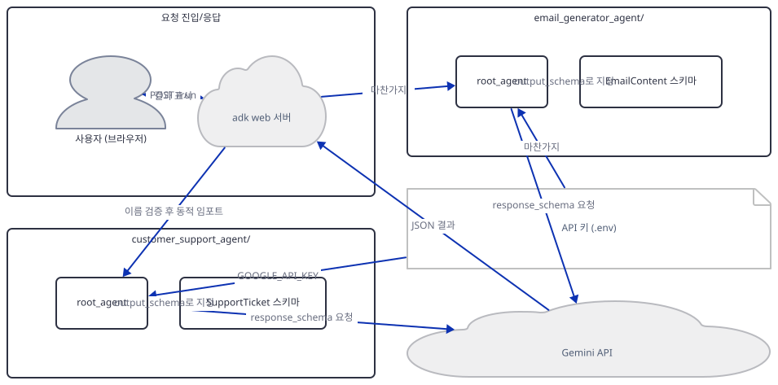
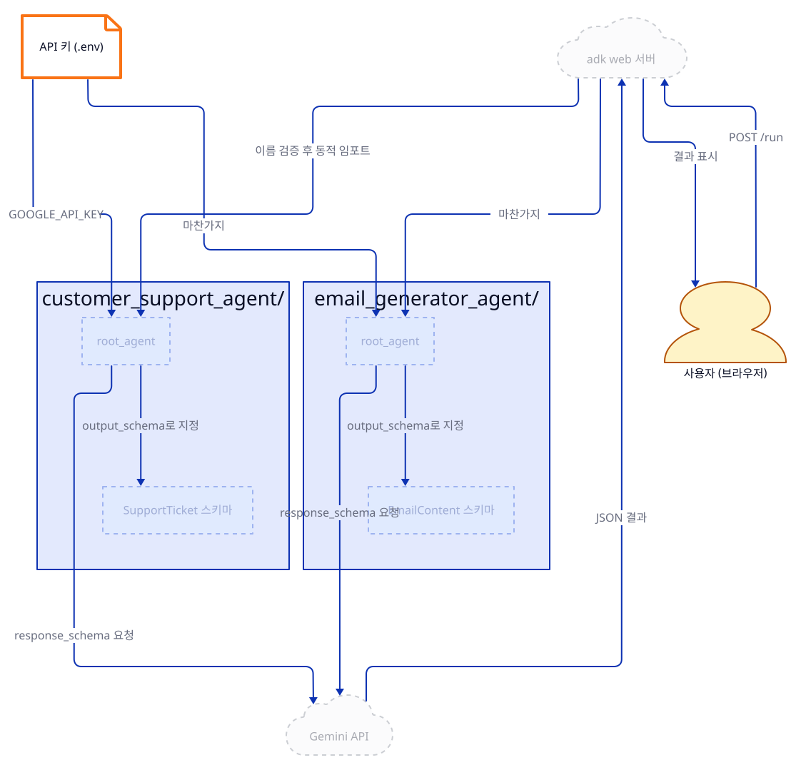
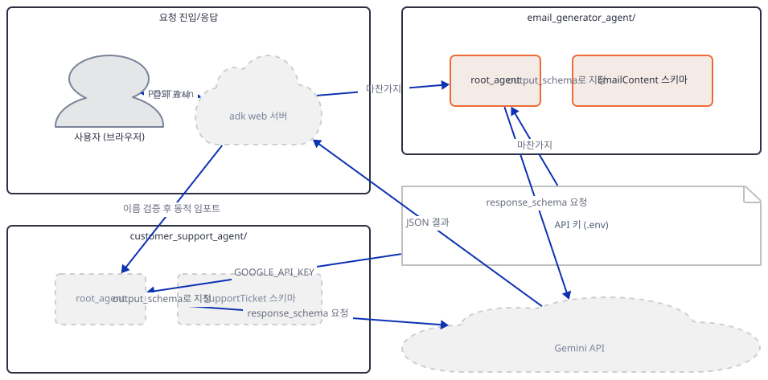
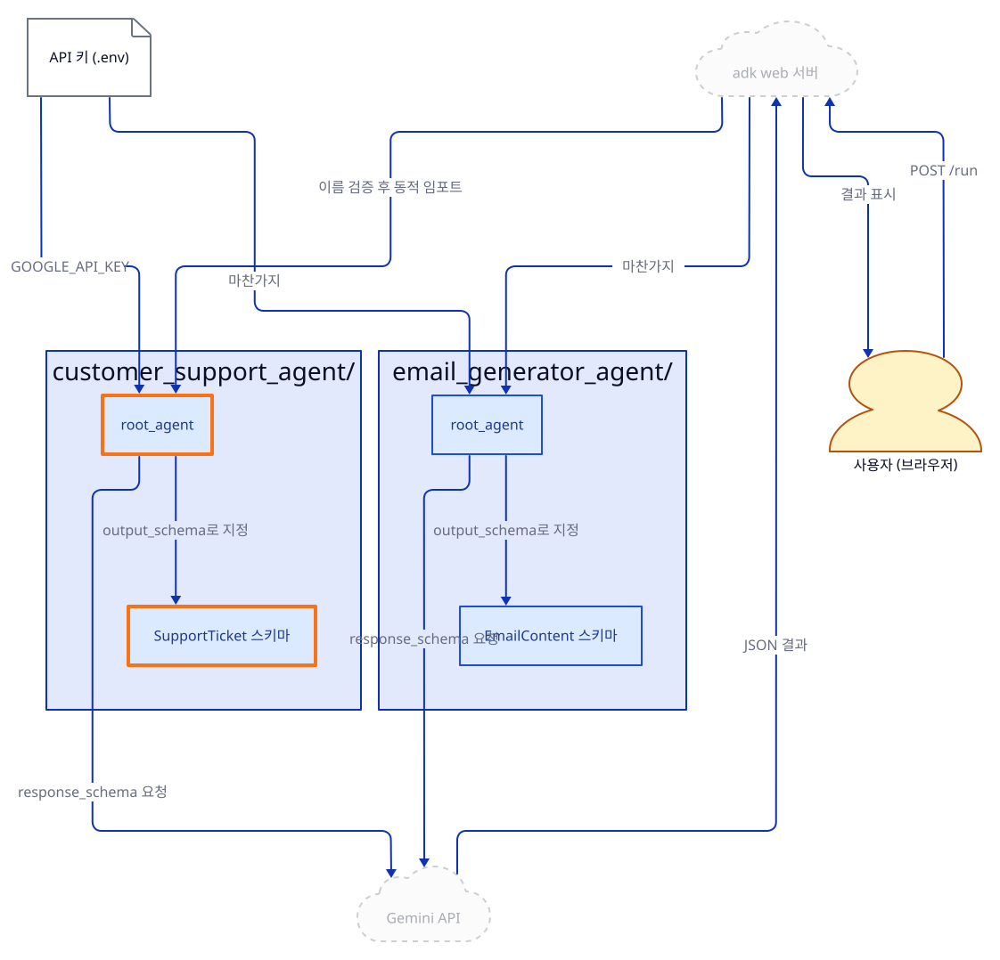
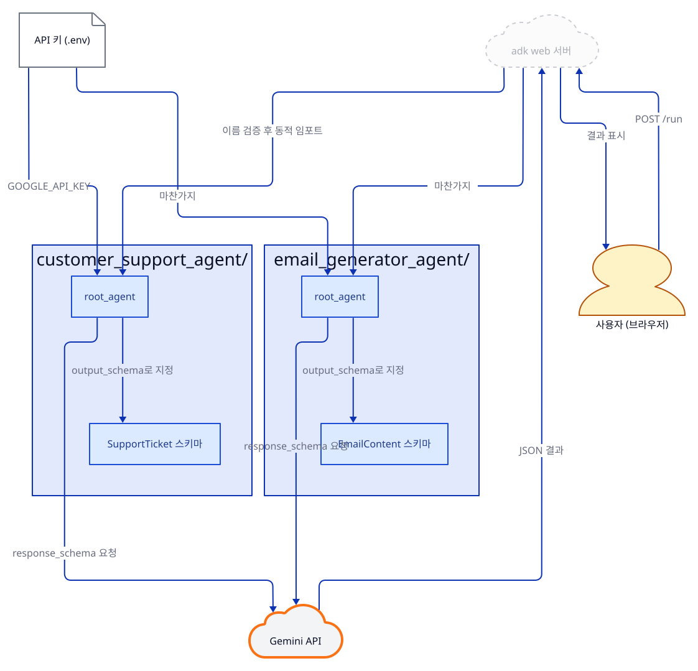
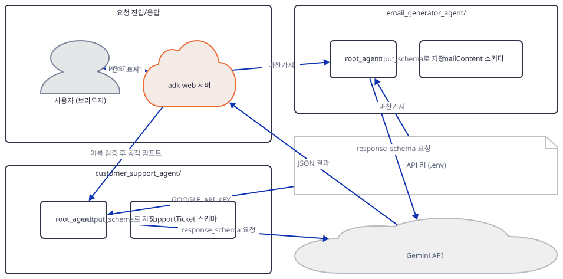
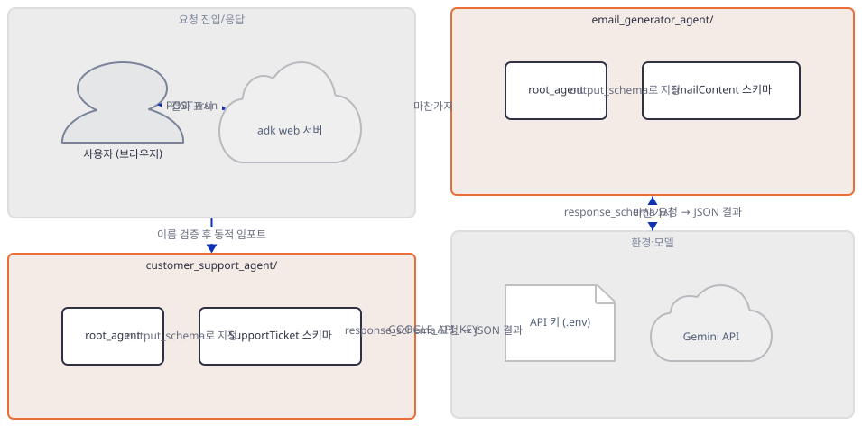
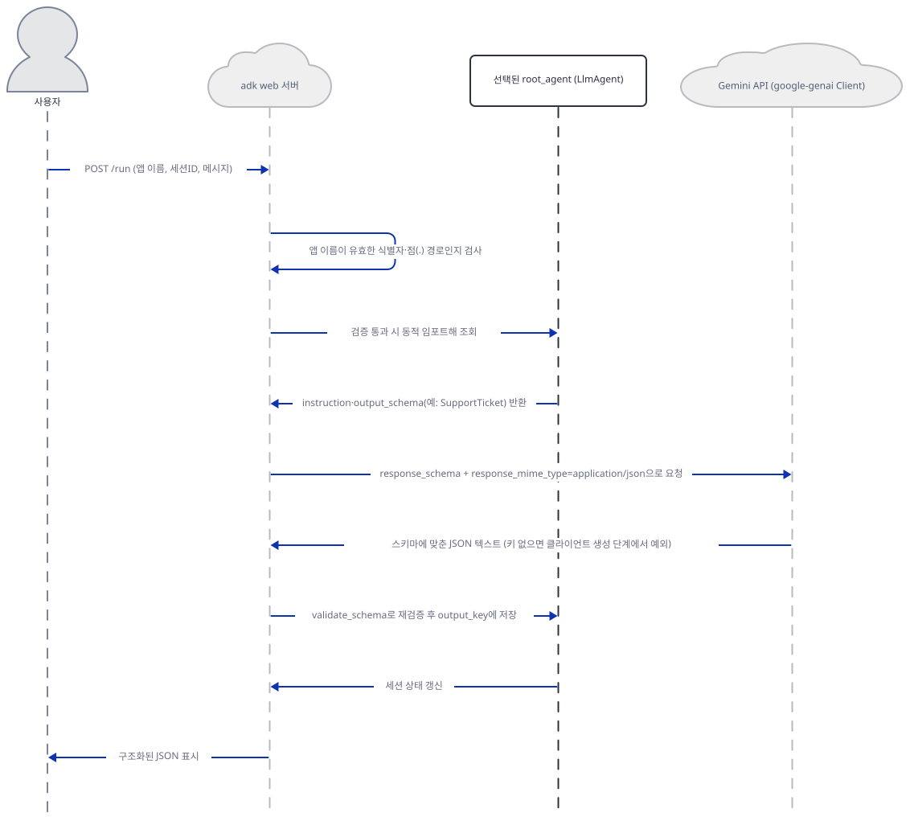

# Day 016 · Google ADK Crash Course · 3_structured_output_agent

> 볼륨 2 🧑‍🏫 Crash Courses · 난이도 ★★☆ · 예상 소요 60분 · API 비용 $0 (API 키 없이 진행 — 실제 모델 호출은 하지 않습니다) · 원본 앱: `ai_agent_framework_crash_course/google_adk_crash_course/3_structured_output_agent`

## 오늘 만들 것

Day 14의 `LlmAgent`는 자유 형식 텍스트만 돌려줬고, Day 15는 그 안의 `model`을 다른 제공자로 갈아 끼우는 법을 보여줬습니다. 오늘의 `3_structured_output_agent`는 세 번째 축, 모델이 돌려주는 **형식**을 다룹니다. 이 폴더에는 스키마 복잡도가 전혀 다른 두 하위 레슨이 나란히 있습니다 — `3_1_customer_support_ticket_agent`는 `Priority`라는 4단계 `Enum`과 `Optional[List[str]]`을 포함한 6개 필드짜리 `SupportTicket`을, `3_2_email_agent`는 `subject`·`body` 두 필드뿐인 `EmailContent`를 강제합니다. 두 파일의 핵심은 정확히 같은 한 줄, `LlmAgent(..., output_schema=<Pydantic 모델>, output_key=<상태 키>)`입니다 — Day 13이 OpenAI Agents SDK의 `output_type=`으로 본 것과 같은 발상을 ADK는 이 두 파라미터로 구현합니다(한 문장 비교는 Step 4에서). Day 15의 두 하위 레슨은 6줄만 다른 사실상 같은 파일이라 diff 한 번으로 관계를 못 박았지만, 오늘의 두 파일은 스키마 자체가 완전히 다른 별개 예제이면서도 `LlmAgent(...)` 생성자는 같은 파라미터 6개를 같은 순서로 씁니다(Step 3에서 diff로 확인) — 그래서 더 단순한 `EmailContent`로 `output_schema`를 먼저 확인한 뒤, 더 복잡한 `SupportTicket`으로 `Enum`·`Optional`이 스키마에 어떻게 반영되는지 보는 순서를 택했습니다. 두 하위 폴더 이름(`3_1_...`, `3_2_...`)도 Day 15처럼 숫자로 시작하지만, 이번엔 그 폴더 자체가 아니라 그 **안**의 패키지(`customer_support_agent/`, `email_generator_agent/`)가 `adk web`이 찾는 진짜 이름이라, Day 15의 404가 재현되는지는 어떻게 띄우느냐에 달려 있습니다 — Step 5·6에서 두 경우를 모두 직접 실행해 확인합니다. 완성 아키텍처는 다음과 같습니다.



## 사전 준비

| 서비스/도구 | 용도 | 발급·설치 |
|---|---|---|
| Google AI Studio API 키 (`GOOGLE_API_KEY`) | 두 하위 레슨 모두 `gemini-3-flash-preview` 호출 인증(동일한 키 하나). 이 문서는 키를 발급하지 않고, 키가 없을 때 정확히 어디서 멈추는지만 확인합니다 | https://aistudio.google.com/ 에서 발급 후 각 하위 폴더의 `.env`에 `GOOGLE_API_KEY`로 설정 (이 실습에서는 생략 가능) |
| uv | 가상환경 생성과 패키지 설치 | [공통 사전 준비](../README.md#공통-사전-준비-한-번만) 절 참고 |
| 인터넷 연결 | PyPI에서 `google-adk`·`pydantic` 설치, 키가 있다면 Gemini API 접속 | 별도 설치 없음 |

## 아키텍처 한눈에 보기

| 컴포넌트 | 역할 | 코드 위치 |
|---|---|---|
| 사용자 (브라우저) | ADK 개발자 웹 UI 또는 `curl`로 채팅 메시지 전송 | 코드 없음 (외부 UI) |
| `adk web` 서버 | 두 에이전트 패키지를 스캔·임포트하고 이름을 검증(Day 14·15와 같은 CLI) | 코드 없음 (google-adk 2.9.2 CLI — 소스로 확인) |
| 고객 지원 에이전트 (`customer_support_agent`) | `SupportTicket`을 강제하는 `root_agent` | `ai_agent_framework_crash_course/google_adk_crash_course/3_structured_output_agent/3_1_customer_support_ticket_agent/customer_support_agent/agent.py:25-46` |
| 지원 티켓 스키마 (`SupportTicket`, `Priority`) | 6개 필드·4단계 `Enum`·`Optional[List[str]]`로 된 Pydantic 모델 | `ai_agent_framework_crash_course/google_adk_crash_course/3_structured_output_agent/3_1_customer_support_ticket_agent/customer_support_agent/agent.py:1-23` |
| 이메일 생성 에이전트 (`email_generator_agent`) | `EmailContent`를 강제하는 `root_agent` | `ai_agent_framework_crash_course/google_adk_crash_course/3_structured_output_agent/3_2_email_agent/email_generator_agent/agent.py:14-29` |
| 이메일 스키마 (`EmailContent`) | `subject`·`body` 두 필드짜리 Pydantic 모델 | `ai_agent_framework_crash_course/google_adk_crash_course/3_structured_output_agent/3_2_email_agent/email_generator_agent/agent.py:1-12` |
| 환경 설정 (`.env.example`, 두 폴더 동일) | Gemini 인증 정보의 틀(`GOOGLE_GENAI_USE_VERTEXAI`, `GOOGLE_API_KEY`) | `ai_agent_framework_crash_course/google_adk_crash_course/3_structured_output_agent/3_1_customer_support_ticket_agent/customer_support_agent/.env.example:1-3` |
| Gemini API (`gemini-3-flash-preview`) | `response_schema`에 맞춘 JSON 생성 | 코드 없음 (외부 서비스) |

## 단계별 진행

### Step 1. 환경 만들기와 의존성 확인

**목적.** 두 하위 레슨의 의존성과 `.env` 틀이 완전히 같다는 것을 확인하고, 두 레슨 README의 설치 안내 결함 두 가지를 미리 짚어 둡니다.

**할 일.**

```bash
cd ai_agent_framework_crash_course/google_adk_crash_course/3_structured_output_agent/3_1_customer_support_ticket_agent
uv venv
uv pip install -r requirements.txt
```

(pip 대안: `python -m venv .venv && source .venv/bin/activate && pip install -r requirements.txt`. Windows PowerShell은 활성화만 `.venv\Scripts\Activate.ps1`로 바꿉니다. `uv venv`가 만든 가상환경에는 pip이 없어 레슨이 안내하는 `pip install`이 그대로는 실패한다는 것은 Day 14의 문제 해결에서 이미 확인했으므로, 위 명령은 처음부터 `uv pip install`을 씁니다.)

`requirements.txt`는 두 하위 폴더 모두 2줄이고 내용이 완전히 같습니다(직접 확인: `diff` 종료 코드 0).

`ai_agent_framework_crash_course/google_adk_crash_course/3_structured_output_agent/3_1_customer_support_ticket_agent/requirements.txt:1-2`

```text
google-adk>=1.5.0
pydantic>=2.0.0
```

`.env.example`도 두 폴더가 바이트 단위로 같습니다.

`ai_agent_framework_crash_course/google_adk_crash_course/3_structured_output_agent/3_1_customer_support_ticket_agent/customer_support_agent/.env.example:1-3`

```text
# If using Gemini via Google AI Studio
GOOGLE_GENAI_USE_VERTEXAI=0
GOOGLE_API_KEY="your-api-key"
```

`GOOGLE_GENAI_USE_VERTEXAI=0`은 Day 14의 `False` 대신 정수 `0`을 쓰지만 뜻은 같습니다 — Vertex AI가 아니라 Google AI Studio 경로로 Gemini를 호출하겠다는 선언입니다. 두 하위 레슨 자신의 README는 여기서 같은 실수를 각각 반복합니다. `cp env.example .env`라고 안내하지만 실제 파일명은 점이 붙은 `.env.example`이라 `cp: cannot stat 'env.example': No such file or directory`가 나고(직접 확인), "Install dependencies" 단계의 `cd .. && pip install -r requirements.txt`는 `requirements.txt`가 없는 `3_structured_output_agent/`로 이동시켜 버려 `ERROR: Could not open requirements file: ... 'requirements.txt'`로 실패합니다(직접 확인). 설치는 하위 레슨 폴더 **안**에서 그대로 실행해야 합니다.



**확인.**

```bash
uv run python -c "import google.adk, pydantic; print(google.adk.__version__, pydantic.VERSION)"
```

```
2.9.2 2.13.5
```

(Python 3.12.10으로 확인했습니다 — `uv venv --python 3.12`로 만든 throwaway 가상환경 기준입니다. 시스템 기본 Python은 3.13.12였습니다.)

### Step 2. 최소 스키마로 걷기 — EmailContent와 output_schema

**목적.** 가장 단순한 스키마로 `output_schema`가 `LlmAgent`에 실제로 어떻게 붙는지, `output_key`는 무엇을 위한 것인지 확인합니다.

**할 일.** `email_generator_agent/agent.py` 29줄짜리 파일 전체를 봅니다(마지막 줄에 개행이 없어 `wc -l`은 28로 셉니다).

`ai_agent_framework_crash_course/google_adk_crash_course/3_structured_output_agent/3_2_email_agent/email_generator_agent/agent.py:1-29`

```python
from google.adk.agents import LlmAgent
from pydantic import BaseModel, Field

class EmailContent(BaseModel):
    """Schema for email content with subject and body."""
    
    subject: str = Field(
        description="The subject line of the email. Should be concise and descriptive."
    )
    body: str = Field(
        description="The main content of the email. Should be well-formatted with proper greeting, paragraphs, and signature."
    )

root_agent = LlmAgent(
    name="email_generator_agent",
    model="gemini-3-flash-preview",
    description="Professional email generator that creates structured email content",
    instruction="""
    You are a professional email writing assistant. 
    
    IMPORTANT: Your response must be a JSON object with exactly these fields:
    - "subject": A concise, relevant subject line
    - "body": Well-formatted email content with greeting, main content, and closing
    
    Format your response as valid JSON only.
    """,
    output_schema=EmailContent,  # This is where the magic happens
    output_key="generated_email"  
)
```

`EmailContent`는 `BaseModel`을 상속한 평범한 Pydantic 클래스이고, `subject`·`body` 각 필드에 `Field(description=...)`로 사람이 읽을 설명을 달았습니다. 27번째 줄의 주석 "This is where the magic happens"이 가리키는 `output_schema=EmailContent`가 이 문서의 주제입니다 — `LlmAgent`에게 "이 클래스 형태로만 답하라"고 강제하는 파라미터입니다. `output_key="generated_email"`은 결과를 어디에 두는지를 정합니다 — 소스로 확인해 보면(google-adk 2.9.2의 `google/adk/agents/llm_agent.py`) 모델 응답이 끝나는 즉시 `event.actions.state_delta[self.output_key]`에 값이 들어갑니다. `output_schema`는 "무엇을 반환할지", `output_key`는 "어디에 둘지"를 답하는 서로 다른 질문입니다.



**확인.**

```bash
uv run python -c "from email_generator_agent.agent import root_agent, EmailContent; print(root_agent.output_schema is EmailContent, '|', root_agent.output_key)"
```

```
True | generated_email
```

(`3_2_email_agent` 폴더, 즉 `email_generator_agent`의 부모 폴더에서 실행해야 합니다 — 직접 확인.)

### Step 3. 심화 스키마 — SupportTicket의 Enum·Optional과 동일한 생성자 뼈대

**목적.** 더 복잡한 스키마(`Enum`, `Optional[List[str]]`)가 어떻게 표현되는지 보고, 두 `LlmAgent(...)` 생성자가 스키마 복잡도와 무관하게 같은 파라미터 집합을 쓴다는 것을 diff로 증명합니다.

**할 일.**

`ai_agent_framework_crash_course/google_adk_crash_course/3_structured_output_agent/3_1_customer_support_ticket_agent/customer_support_agent/agent.py:6-16`

```python
class Priority(str, Enum):
    LOW = "low"
    MEDIUM = "medium" 
    HIGH = "high"
    CRITICAL = "critical"

class SupportTicket(BaseModel):
    title: str = Field(description="A concise summary of the issue")
    description: str = Field(description="Detailed description of the problem")
    priority: Priority = Field(description="The ticket priority level")
    category: str = Field(description="The department this ticket belongs to")
```

`ai_agent_framework_crash_course/google_adk_crash_course/3_structured_output_agent/3_1_customer_support_ticket_agent/customer_support_agent/agent.py:17-23`

```python
    steps_to_reproduce: Optional[List[str]] = Field(
        description="Steps to reproduce the issue (for technical problems)",
        default=None
    )
    estimated_resolution_time: str = Field(
        description="Estimated time to resolve this issue"
    )
```

`Priority`는 `str`과 `Enum`을 함께 상속해 네 값만 허용하고, `steps_to_reproduce`는 `Optional[List[str]]`에 `default=None`을 더해 "리스트이거나 아예 없어도 됨"을 표현합니다. 필드는 6개로 늘었지만 `root_agent`를 만드는 자리는 `EmailContent` 때와 글자 하나 다르지 않습니다.

`ai_agent_framework_crash_course/google_adk_crash_course/3_structured_output_agent/3_1_customer_support_ticket_agent/customer_support_agent/agent.py:44-46`

```python
    output_schema=SupportTicket,
    output_key="support_ticket"
)
```

실제로 두 `LlmAgent(...)` 호출에서 최상위 키워드 인자 이름만 뽑아 비교하면 완전히 같습니다.



**확인.**

```bash
cd ai_agent_framework_crash_course/google_adk_crash_course/3_structured_output_agent
diff <(grep -oE '^ {4}[a-z_]+=' 3_1_customer_support_ticket_agent/customer_support_agent/agent.py) \
     <(grep -oE '^ {4}[a-z_]+=' 3_2_email_agent/email_generator_agent/agent.py)
echo "exit: $?"
```

```
exit: 0
```

두 파일 모두 `name=`·`model=`·`description=`·`instruction=`·`output_schema=`·`output_key=` 여섯 개를 같은 순서로 씁니다 — 스키마가 2개 필드짜리든, `Enum`·`Optional`이 섞인 6개 필드짜리든 `LlmAgent`에게 전달하는 "인터페이스 모양"은 바뀌지 않습니다.

### Step 4. output_schema가 실제로 만드는 요청 — response_schema와 tools 제약

**목적.** `output_schema`가 ADK 내부에서 실제로 무엇으로 바뀌어 Gemini에 전달되는지, `Field(description=...)`가 그 과정에서 사라지지 않는지, 그리고 ADK가 명시하는 `output_schema`+`tools` 제약이 이 두 에이전트에 해당하는지 직접 계산으로 확인합니다.

**할 일.** 소스를 보면(소스로 확인, google-adk 2.9.2의 `google/adk/models/llm_request.py`가 정의하는 `set_output_schema`) `output_schema`는 요청 설정의 두 필드를 채우는 것으로 끝입니다 — 요지는 다음 두 줄입니다.

```python
self.config.response_schema = schema
self.config.response_mime_type = "application/json"
```

`schema` 자리에는 `SupportTicket`/`EmailContent` 클래스가 그대로 들어갑니다. 이를 Gemini가 이해하는 스키마로 바꾸는 일은 ADK가 아니라 그 아래 `google-genai` 라이브러리가 합니다(소스로 확인, google-genai 2.24.0의 `google/genai/_transformers.py`가 정의하는 `t_schema()`) — 내부적으로 Pydantic의 `model_json_schema()`를 호출해 얻은 JSON 스키마를 Gemini용 `Schema` 객체로 다시 씁니다. 돌려보면 `Field(description=...)`의 문장이 사라지지 않고 각 필드의 `description`으로 살아남습니다.

이 강제에는 ADK가 명시하는 제약이 있습니다. 소스를 보면(소스로 확인, google-adk 2.9.2의 `google/adk/flows/llm_flows/basic.py`) "as of now, model don't support output_schema and tools together"라는 주석과 함께, `agent.tools`가 있는데 모델이 `output_schema_and_tools` 능력(Vertex AI + Gemini 조합에서만 참 — 소스로 확인, `google/adk/models/_capabilities.py`)을 보고하지 않으면 `output_schema`를 요청에 싣지 않는 코드가 있습니다. Gemini API가 구조화 출력과 함수 호출 도구를 한 요청에 같이 쓰지 못하던 제약이 근본 원인이고, ADK는 `set_model_response`라는 우회 도구로 이를 메꿉니다(소스로 확인, `google/adk/flows/llm_flows/_output_schema_processor.py`). 이 제약은 오늘의 두 에이전트엔 걸리지 않습니다 — 둘 다 `tools`를 쓰지 않기 때문입니다(Step 2·3의 생성자 어디에도 `tools=`가 없습니다). Day 13의 `output_type=<Pydantic 모델>`과 오늘의 `output_schema=<Pydantic 모델>`은 같은 발상이지만, ADK 쪽은 결과를 세션 상태 어디에 둘지 정하는 `output_key`가 항상 따라붙습니다.



**확인.**

```bash
uv run python -c "
from customer_support_agent.agent import SupportTicket
from google.genai._transformers import t_schema
print(t_schema(None, SupportTicket).model_dump_json(indent=2, exclude_none=True))
"
```

```json
{
  "properties": {
    "title": {
      "description": "A concise summary of the issue",
      "title": "Title",
      "type": "STRING"
    },
    "description": {
      "description": "Detailed description of the problem",
      "title": "Description",
      "type": "STRING"
    },
    "priority": {
      "enum": [
        "low",
        "medium",
        "high",
        "critical"
      ],
      "title": "Priority",
      "type": "STRING"
    },
    "category": {
      "description": "The department this ticket belongs to",
      "title": "Category",
      "type": "STRING"
    },
    "steps_to_reproduce": {
      "description": "Steps to reproduce the issue (for technical problems)",
      "items": {
        "type": "STRING"
      },
      "nullable": true,
      "title": "Steps To Reproduce",
      "type": "ARRAY"
    },
    "estimated_resolution_time": {
      "description": "Estimated time to resolve this issue",
      "title": "Estimated Resolution Time",
      "type": "STRING"
    }
  },
  "property_ordering": [
    "title",
    "description",
    "priority",
    "category",
    "steps_to_reproduce",
    "estimated_resolution_time"
  ],
  "required": [
    "title",
    "description",
    "priority",
    "category",
    "estimated_resolution_time"
  ],
  "title": "SupportTicket",
  "type": "OBJECT"
}
```

(`3_1_customer_support_ticket_agent` 폴더에서 실행해야 합니다 — 직접 확인. `Priority` 열거값은 `$ref`로 분리되지 않고 `enum`으로 바로 펼쳐지고, `Optional[List[str]]`은 `anyOf`가 아니라 `nullable: true`가 붙은 `ARRAY` 하나로 바뀝니다.)

### Step 5. adk web으로 각각 띄우기 — 이름 규칙과 API 키 벽

**목적.** 각 하위 레슨 폴더 **안에서** `adk web`을 띄우면 어떤 이름으로 에이전트가 인식되는지, 키 없이 요청을 보내면 Day 14·15와 같은 지점에서 멈추는지 실제 HTTP 요청으로 확인합니다.

**할 일.** 최초 실행 시 텔레메트리 동의 절차는 Day 14에서 이미 확인했으므로 그대로 적용됩니다. 각 하위 레슨 폴더 **안에서** 서버를 띄웁니다.

```bash
cd ai_agent_framework_crash_course/google_adk_crash_course/3_structured_output_agent/3_1_customer_support_ticket_agent
uv run adk web --port 8990 --no_use_local_storage .
```

이 폴더 이름(`3_1_customer_support_ticket_agent`) 자체는 숫자로 시작하지만, `adk web`에게 넘긴 경로가 바로 이 폴더이므로 스캔 대상은 그 **안**의 하위 폴더 하나, 즉 `customer_support_agent/`뿐입니다 — 유효한 식별자입니다. `3_2_email_agent`도 같은 방식으로 자신의 폴더 안에서 띄우면 `email_generator_agent`만 스캔됩니다.



**확인.** 다른 터미널에서 목록부터 봅니다.

```bash
curl.exe -s http://127.0.0.1:8990/list-apps
```

```
["customer_support_agent"]
```

세션을 만들고 메시지를 보내면 이름 검증은 통과하고, Day 14·15와 정확히 같은 지점에서 막힙니다. PowerShell에서 `curl`이 `Invoke-WebRequest`의 별칭이라는 점은 Day 14의 문제 해결에서 이미 확인했으므로 아래도 `curl.exe`를 쓰고, JSON 본문은 큰따옴표를 이스케이프하는 대신 작은따옴표로 감쌉니다.

```bash
curl.exe -s -X POST http://127.0.0.1:8990/apps/customer_support_agent/users/u1/sessions/s1 -H "Content-Type: application/json" -d "{}"
```

```
{"id":"s1","appName":"customer_support_agent","userId":"u1","state":{},"events":[],"lastUpdateTime":1789974641.401688}
```

(`lastUpdateTime`은 실행마다 다른 타임스탬프입니다.)

```bash
curl.exe -s -o /dev/null -w "%{http_code}\n" -X POST http://127.0.0.1:8990/run -H "Content-Type: application/json" -d '{"appName":"customer_support_agent","userId":"u1","sessionId":"s1","newMessage":{"role":"user","parts":[{"text":"I cannot log into my account"}]}}'
```

```
500
```

서버 터미널에는 Day 14·15와 글자 하나 다르지 않은 예외가 찍힙니다(직접 확인, 발췌).

```
ValueError: No API key was provided. Please pass a valid API key. Learn how to create an API key at https://ai.google.dev/gemini-api/docs/api-key.
```

`email_generator_agent`도 같은 방식으로 같은 지점(HTTP 500, 같은 `ValueError`)까지 갑니다(직접 확인). Step 4의 `validate_schema` 재검증은 모델 응답이 와야 실행되는데, 클라이언트 생성 자체가 이 지점에서 실패해 거기까지 가지도 못합니다. `3_1_customer_support_ticket_agent`의 README는 "Select the 'support_ticket_creator' agent"라고 안내하지만, 실제 이름은 `/list-apps`가 보여준 `customer_support_agent`입니다.

### Step 6. 두 폴더를 함께 띄우면 — 중첩 이름과 Day 15 재현

**목적.** 두 하위 레슨을 공유 상위 폴더에서 함께 띄우면(각자 따로 띄운 Step 5와 달리) 무슨 일이 벌어지는지 확인하고, Day 15가 찾은 404가 여기서도 재현되는지 직접 실행으로 판단합니다.

**할 일.** `3_structured_output_agent` 폴더(두 하위 레슨의 공통 부모)에서 띄웁니다.

```bash
cd ai_agent_framework_crash_course/google_adk_crash_course/3_structured_output_agent
uv run adk web --port 8992 --no_use_local_storage .
```

`adk web`은 `web=True`일 때 `NestedAgentLoader`라는 로더를 쓰는데(소스로 확인, google-adk 2.9.2의 `google/adk/cli/fast_api.py`), 이 로더는 하위 폴더를 최대 5단계까지 재귀적으로 훑어 `agent.py`가 있는 폴더를 모두 찾고 상대 경로 구분자를 점(`.`)으로 바꿔 이름 짓습니다(소스로 확인, `google/adk/cli/utils/_nested_agent_loader.py`). 그 결과 두 에이전트는 각각 `3_1_customer_support_ticket_agent.customer_support_agent`, `3_2_email_agent.email_generator_agent`라는 점 포함 이름으로 잡힙니다.



**확인.**

```bash
curl.exe -s http://127.0.0.1:8992/list-apps
```

```
["3_1_customer_support_ticket_agent.customer_support_agent","3_2_email_agent.email_generator_agent"]
```

세션 생성까지는 이 이름으로도 성공합니다(직접 확인, `lastUpdateTime`은 실행마다 다른 타임스탬프입니다).

```bash
curl.exe -s -X POST "http://127.0.0.1:8992/apps/3_1_customer_support_ticket_agent.customer_support_agent/users/u1/sessions/s1" -H "Content-Type: application/json" -d "{}"
```

```
{"id":"s1","appName":"3_1_customer_support_ticket_agent.customer_support_agent","userId":"u1","state":{},"events":[],"lastUpdateTime":1789974709.2375283}
```

하지만 `/run`을 호출하면 Day 15와 글자까지 같은 오류가 돌아옵니다.

```bash
curl.exe -s -X POST http://127.0.0.1:8992/run -H "Content-Type: application/json" -d '{"appName":"3_1_customer_support_ticket_agent.customer_support_agent","userId":"u1","sessionId":"s1","newMessage":{"role":"user","parts":[{"text":"hi"}]}}'
```

```
{"detail":"Invalid agent name: '3_1_customer_support_ticket_agent.customer_support_agent'. Agent names must be valid Python identifiers or paths separated by dots (letters, digits, underscores, and dots)."}
```

HTTP 상태는 404입니다. 점으로 구분된 각 조각이 `str.isidentifier()`를 통과해야 하는데(소스로 확인), `3_1_customer_support_ticket_agent`는 숫자로 시작해 걸립니다 — Day 15가 찾은 바로 그 검사입니다. 이 레슨의 폴더 이름이 문제를 일으키는지는 전적으로 **띄우는 방법**에 달려 있습니다: Step 5처럼 하위 레슨 폴더 안에서 각자 따로 띄우면 폴더 이름이 스캔 대상 밖이라 걸리지 않고, 공유 상위 폴더에서 함께 띄워야만 재귀 스캔이 그 이름을 끌어옵니다.

## 요청 한 건이 흐르는 과정



사용자가 채팅 메시지를 보내면 `POST /run`으로 `adk web` 서버에 도착합니다. 서버는 먼저 앱 이름이 유효한 식별자(또는 점 경로)인지 검사합니다 — 걸리면 모델을 부르기도 전에 HTTP 404로 끝납니다(Step 6). 통과하면 서버는 스캔해 둔 패키지에서 `root_agent`를 조회해 `instruction`과 `output_schema`를 가져옵니다 — 여기까지는 순수한 인프로세스 조회입니다. 그다음 ADK는 `output_schema`를 `response_schema`로, JSON 강제를 `response_mime_type=application/json`으로 요청 설정에 채우고 `google-genai` 클라이언트를 생성해 Gemini에 보냅니다 — 키가 없는 이 문서의 환경에서는 클라이언트 생성 자체가 `ValueError`를 던져 사슬이 여기서 끊깁니다(Step 5). 키가 있었다면 Gemini는 스키마에 맞춘 JSON 텍스트를 돌려주고, ADK는 그 텍스트를 `validate_schema`로 다시 Pydantic에 통과시켜(Step 4) 딕셔너리로 만든 뒤 `output_key`가 가리키는 세션 상태 키에 저장하고 사용자에게 표시합니다.

## 실행 체크리스트

- [ ] `uv venv && uv pip install -r requirements.txt`로 두 하위 레슨 모두 같은 두 패키지(`google-adk`, `pydantic`)만 필요하다는 것을 확인했다
- [ ] 두 레슨 README의 `cp env.example .env`, `cd .. && pip install -r requirements.txt`가 각각 왜 실패하는지 직접 재현했다
- [ ] `EmailContent`(2개 필드)와 `SupportTicket`(6개 필드, `Enum`, `Optional[List[str]]`) 두 스키마를 직접 읽었다
- [ ] 두 `LlmAgent(...)` 생성자의 키워드 인자 이름이 diff로 완전히 같다는 것을 확인했다
- [ ] `t_schema()`로 `Field(description=...)`가 실제 Gemini 스키마에 살아남는다는 것과, `Optional[List[str]]`이 `nullable: true`인 `ARRAY`로 바뀐다는 것을 확인했다
- [ ] `output_schema`+`tools` 제약의 근거를 소스에서 찾았고, 이 두 에이전트에는 `tools`가 없어 해당하지 않는다는 것을 이해했다
- [ ] 하위 레슨 폴더 안에서 각각 `adk web`을 띄우면 이름이 깨끗하고 Day 14·15와 같은 `ValueError`까지 간다는 것을 확인했다
- [ ] 공유 상위 폴더에서 함께 띄우면 점(.) 포함 이름이 되고 `/run`이 Day 15와 같은 404로 막힌다는 것을 확인했다

## 문제 해결

| 증상 | 원인 | 해결 |
|---|---|---|
| 레슨 README대로 `cp env.example .env`를 실행하면 `cp: cannot stat 'env.example': No such file or directory` | 실제 파일명은 앞에 점이 붙은 `.env.example`이다(직접 확인, 두 하위 레슨 모두 동일) | `cp .env.example .env`로 점을 붙여 실행 |
| 레슨 README대로 `cd ..` 후 `pip install -r requirements.txt`를 실행하면 `ERROR: Could not open requirements file: ... 'requirements.txt'` | `cd ..`가 `requirements.txt`가 있는 하위 레슨 폴더가 아니라 그 위인 `3_structured_output_agent/`로 이동시킨다(직접 확인) — 그 폴더엔 `requirements.txt`가 없다 | `cd ..`를 생략하고 하위 레슨 폴더 안에서 그대로 설치 |
| 최상위 `3_structured_output_agent/README.md`의 "Basic Structured Output Pattern" 예시를 그대로 쓰면 `pydantic.ValidationError`가 나며 `response_format` 필드가 `Extra inputs are not permitted`로 거부됨 | 그 예시가 존재하지 않는 `response_format=` 파라미터를 씀(직접 확인) — 실제 ADK 파라미터는 `output_schema=`다 | 실제 두 `agent.py`처럼 `output_schema=<Pydantic 모델>`을 사용 |
| 공유 상위 폴더에서 `adk web`을 띄우고 점(.) 포함 이름으로 `/run`을 호출하면 키를 넣기도 전에 HTTP 404 `Invalid agent name` | `NestedAgentLoader`가 만든 점 경로의 첫 조각(`3_1_...`, `3_2_...`)이 숫자로 시작해 식별자 검사에 걸린다 — Day 15가 찾은 것과 같은 검사이고, 이번엔 재귀 스캔이 만든 점 경로로 재현된다(소스로 확인) | 하위 레슨 폴더 **안에서** 각각 `adk web`을 띄우면 이 검사에 걸리지 않는다(Step 5) |
| 키 없이 `/run`을 호출하면 두 에이전트 모두 `Internal Server Error`(HTTP 500) | `GOOGLE_API_KEY`가 없으면 `google-genai`의 `Client` 생성자가 `ValueError`를 던지고 ADK는 이를 HTTP 500으로만 반환한다 — Day 14·15와 같은 지점(직접 확인) | `.env`에 `GOOGLE_API_KEY`를 설정하고 서버 재시작 |

## 더 해보기

- 실제 `GOOGLE_API_KEY`를 발급받아 두 `.env`에 채우고, Step 5·6의 `/run` 요청을 다시 실행해 `SupportTicket`·`EmailContent`가 실제로 어떤 JSON으로 채워지는지 비교해보기
- `SupportTicket`(`ai_agent_framework_crash_course/google_adk_crash_course/3_structured_output_agent/3_1_customer_support_ticket_agent/customer_support_agent/agent.py:12-23`)에 필드를 하나 추가하고, Step 4의 `t_schema()` 확인 명령을 다시 돌려 새 필드가 Gemini 스키마에 어떻게 반영되는지 확인해보기
- `email_generator_agent/agent.py`(`ai_agent_framework_crash_course/google_adk_crash_course/3_structured_output_agent/3_2_email_agent/email_generator_agent/agent.py:14-29`)에 인자 없는 더미 함수를 만들어 `tools=[...]`로 추가해보고, Step 4에서 확인한 `output_schema_and_tools` 제약이 Google AI Studio 백엔드에서는 여전히 꺼져 있는지 확인해보기

## 다음 날 예고

[Day 017 · Google ADK Crash Course · 4_tool_using_agent](../day017-adk-4-tool-using-agent/README.md) — 내장 도구·함수 도구·서드파티 도구(CrewAI·LangChain)·MCP 도구까지 네 갈래로 나뉜 도구 사용 에이전트를 다룹니다.
