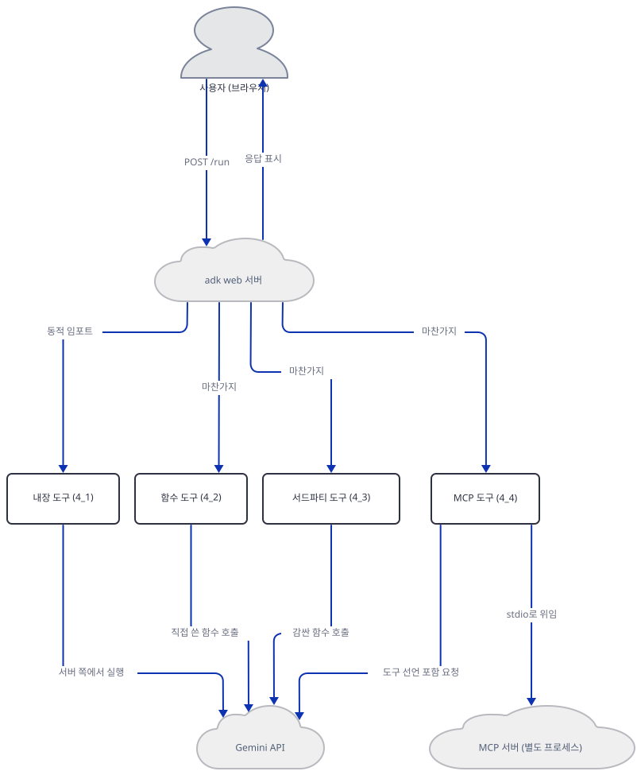
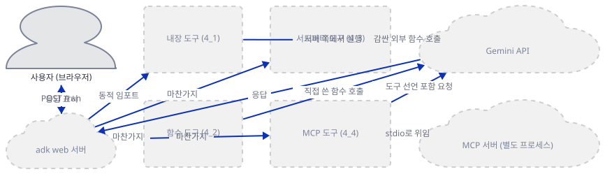
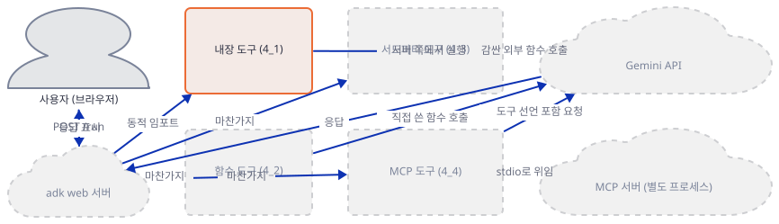
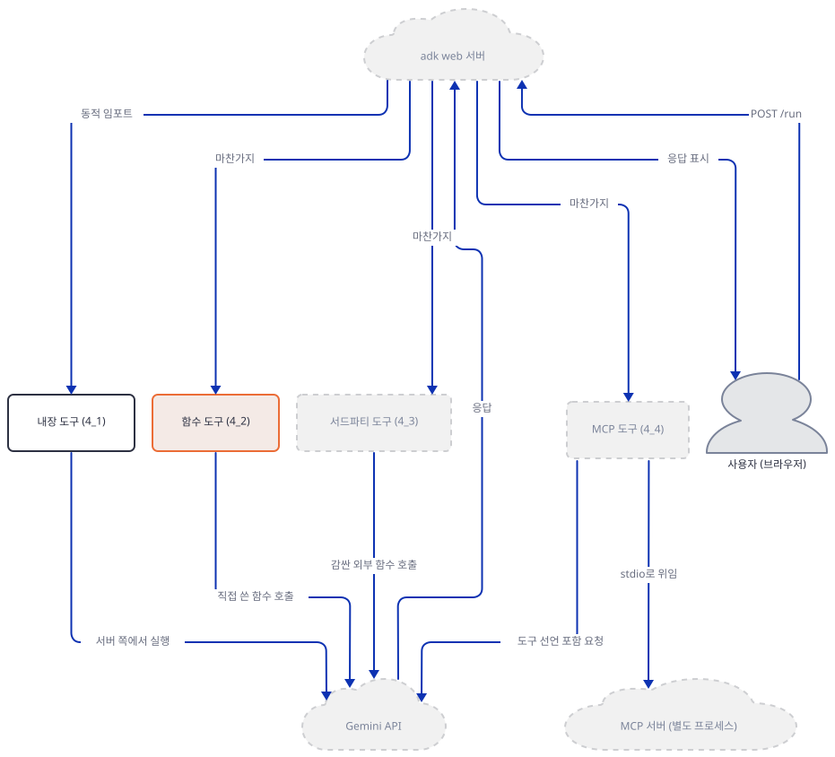
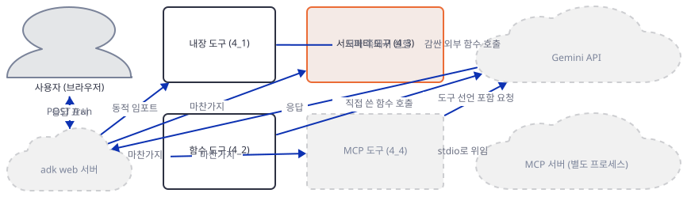
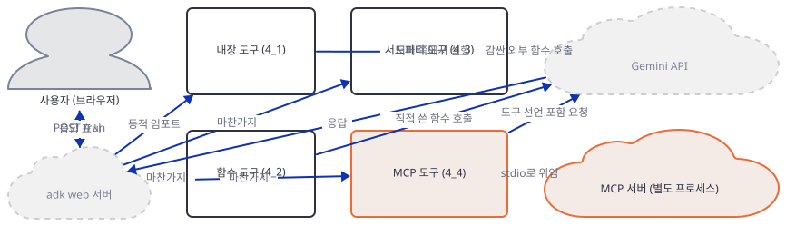
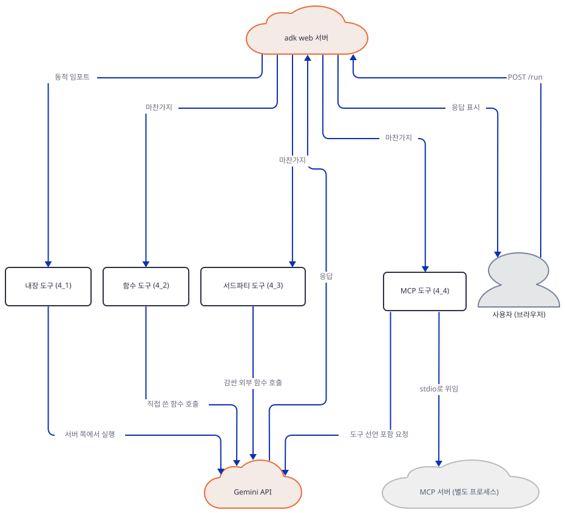
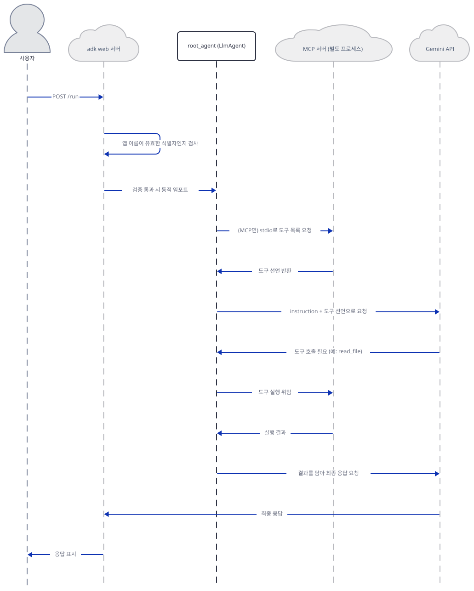

# Day 017 · Google ADK Crash Course · 4_tool_using_agent

> 볼륨 2 🧑‍🏫 Crash Courses · 난이도 ★★★ · 예상 소요 100분(하위 레슨 네 개를 모두 다루어 다른 크래시 코스 날보다 깁니다) · API 비용 $0 (API 키 없이 진행 — Gemini·Firecrawl 등 실제 모델·유료 API 호출은 하지 않았습니다) · 원본 앱: `ai_agent_framework_crash_course/google_adk_crash_course/4_tool_using_agent`

## 오늘 만들 것

Day 14~16은 ADK의 최소 단위(`LlmAgent` 생성자 하나), 모델 교체(`LiteLlm` 객체), 출력 형식 강제(`output_schema`)를 각각 한 축씩 다뤘습니다. 오늘의 `4_tool_using_agent`는 그 세 축과 나란한 네 번째 축 — **에이전트에게 도구를 쥐어주는 네 가지 서로 다른 방법** — 을 한꺼번에 다룹니다. 이 폴더의 `.py` 파일 줄 수를 모두 더하면 1,349줄(`wc -l` 기준, 직접 확인)로, 같은 방식으로 잰 `6_callbacks`의 884줄보다 커서 이 크래시 코스에서 가장 큰 레슨입니다. 그 이유는 하나의 큰 앱이 아니라 **네 개의 완전히 독립된 하위 레슨**이 나란히 있기 때문입니다: `4_1_builtin_tools`(ADK·Gemini가 이미 만들어 둔 도구), `4_2_function_tools`(내가 직접 쓴 파이썬 함수), `4_3_thirdparty_tools`(LangChain·CrewAI의 도구를 어댑터로 감싸기), `4_4_mcp_tools`(별도 프로세스로 떠 있는 MCP 서버와 통신). 이 넷을 가르는 진짜 기준은 코드의 생김새가 아니라 **도구의 코드가 어디에 있고, 누가 그것을 실행하며, 에이전트가 그것에 대해 무엇을 알아야 하는가**입니다. 내장 도구는 Gemini 서버 쪽에서 실행되어 우리 프로세스에는 아예 들어오지 않고, 함수 도구는 우리가 쓴 코드가 같은 파이썬 프로세스 안에서 실행되며, 서드파티 도구는 설치한 남의 라이브러리 코드가 같은 프로세스에서 실행되고, MCP 도구는 `npx`로 띄운 완전히 별도의 OS 프로세스가 stdio로 실행 결과를 돌려줍니다. 이 문서는 네 갈래를 전부 걷되, 실제로 손에 익혀야 하는 기술인 함수 도구(`4_2`)를 가장 구체적으로 다루고, 나머지 셋은 각자의 새로움 — 내장 도구의 "섞어 쓸 수 없다"는 제약이 실제로는 자동 우회 로직이라는 점, 서드파티 어댑터가 실제로 겪는 설치·설정 함정, MCP가 여는 진짜 프로세스 경계 — 에 맞는 만큼만 다룹니다. API 키 없이 각 갈래가 정확히 어디까지 실제로 동작하는지, 그리고 그 경계에서 무엇이 실패하는지를 전부 직접 실행해 확인했습니다. 완성 아키텍처는 다음과 같습니다.



## 사전 준비

| 서비스/도구 | 용도 | 발급·설치 |
|---|---|---|
| uv | 네 하위 레슨 모두의 가상환경 생성과 패키지 설치 | [공통 사전 준비](../README.md#공통-사전-준비-한-번만) 참고 |
| Google AI Studio API 키 (`GOOGLE_API_KEY`) | 여덟 에이전트 모두 `gemini-3-flash-preview` 호출에 필요(도구 자체가 아니라 에이전트 본체가 요구). 이 문서는 키를 발급하지 않고, 각 갈래가 키 없이 정확히 어디까지 가는지만 확인합니다 | https://aistudio.google.com/ 에서 발급 후 각 하위 폴더의 `.env`에 설정 (이 실습에서는 생략 가능) |
| Node.js / npx | `4_4_mcp_tools`의 두 에이전트가 각자 MCP 서버를 `npx`로 띄우는 데 필요 | https://nodejs.org/ 설치 후 `npx --version`으로 확인 |
| Firecrawl API 키 (`FIRECRAWL_API_KEY`) | `4_4_mcp_tools/firecrawl_agent`만 필요. 유료 서비스라 이 문서는 발급·호출 모두 하지 않고 임포트까지만 확인합니다 | https://firecrawl.dev 에서 발급 (이 실습에서는 생략) |

## 아키텍처 한눈에 보기

| 컴포넌트 | 역할 | 코드 위치 |
|---|---|---|
| 사용자 (브라우저) | ADK 개발자 웹 UI 또는 `curl`로 채팅 메시지 전송 | 코드 없음 (외부 UI) |
| `adk web` 서버 | 네 하위 레슨 폴더를 스캔·임포트하고 앱 이름을 검증 (Day 14~16과 같은 CLI) | 코드 없음 (google-adk 2.9.2 CLI — 소스로 확인) |
| 검색 에이전트 (`search_agent`) | 내장 `google_search` 도구로 웹 검색 | `ai_agent_framework_crash_course/google_adk_crash_course/4_tool_using_agent/4_1_builtin_tools/search_agent/agent.py:1-37` |
| 코드 실행 에이전트 (`code_exec_agent`) | 내장 `BuiltInCodeExecutor`로 Gemini 서버 쪽에서 코드 실행 | `ai_agent_framework_crash_course/google_adk_crash_course/4_tool_using_agent/4_1_builtin_tools/code_exec_agent/agent.py:1-48` |
| 계산기 에이전트 (`calculator_agent`) | 직접 쓴 함수 6개로 사칙연산·통계·환산을 수행 | `ai_agent_framework_crash_course/google_adk_crash_course/4_tool_using_agent/4_2_function_tools/calculator_agent/agent.py:1-77` |
| 계산기 함수들 (`tools.py`) | `calculate_basic_math` 등 6개 함수, 각각 구조화된 dict를 반환 | `ai_agent_framework_crash_course/google_adk_crash_course/4_tool_using_agent/4_2_function_tools/calculator_agent/tools.py:1-289` |
| 유틸리티 에이전트 (`utility_agent`) | 직접 쓴 함수 8개로 텍스트·날짜·해시를 처리 | `ai_agent_framework_crash_course/google_adk_crash_course/4_tool_using_agent/4_2_function_tools/utility_agent/agent.py:1-106` |
| 유틸리티 함수들 (`tools.py`) | `process_text`·`hash_text` 등 8개 함수 | `ai_agent_framework_crash_course/google_adk_crash_course/4_tool_using_agent/4_2_function_tools/utility_agent/tools.py:1-423` |
| LangChain 에이전트 (`langchain_agent`) | `LangchainTool`로 DuckDuckGo·Wikipedia 검색 도구를 감쌈 | `ai_agent_framework_crash_course/google_adk_crash_course/4_tool_using_agent/4_3_thirdparty_tools/langchain_agent/agent.py:1-57` |
| CrewAI 에이전트 (`crewai_agent`) | `CrewaiTool`로 웹 스크레이핑·디렉터리 검색·파일 읽기 도구 3개를 감쌈 | `ai_agent_framework_crash_course/google_adk_crash_course/4_tool_using_agent/4_3_thirdparty_tools/crewai_agent/agent.py:1-127` |
| 파일시스템 MCP 에이전트 (`filesystem_agent`) | `MCPToolset`으로 별도 프로세스의 파일시스템 도구에 연결 | `ai_agent_framework_crash_course/google_adk_crash_course/4_tool_using_agent/4_4_mcp_tools/filesystem_agent/agent.py:1-76` |
| Firecrawl MCP 에이전트 (`firecrawl_agent`) | `MCPToolset`으로 별도 프로세스의 Firecrawl 웹 스크레이핑 도구 10개에 연결 | `ai_agent_framework_crash_course/google_adk_crash_course/4_tool_using_agent/4_4_mcp_tools/firecrawl_agent/agent.py:1-119` |
| Gemini API | 여덟 에이전트 모두의 실제 추론 수행 | 코드 없음 (외부 서비스) |
| MCP 서버 프로세스 (`npx`) | `filesystem_agent`·`firecrawl_agent`가 각자 띄우는 별도 Node.js 프로세스 | 코드 없음 (외부 프로세스) |

## 단계별 진행

### Step 1. 환경 준비 — 네 벌의 의존성

**목적.** 이 날은 하위 레슨마다 `requirements.txt`가 따로 있습니다. 어떤 갈래에 무엇이 필요한지 먼저 표로 정리하고, 가벼운 세 벌을 미리 설치해 둡니다. `4_3`은 설치가 무겁고 느려서 Step 4에서 따로 설치합니다.

**할 일.**

| 하위 레슨 | requirements.txt | 핵심 패키지 | 비고 |
|---|---|---|---|
| `4_1_builtin_tools` | `ai_agent_framework_crash_course/google_adk_crash_course/4_tool_using_agent/4_1_builtin_tools/requirements.txt` | `google-adk` | 4_2와 내용이 완전히 같음(직접 확인, 둘 다 한 줄) |
| `4_2_function_tools` | `ai_agent_framework_crash_course/google_adk_crash_course/4_tool_using_agent/4_2_function_tools/requirements.txt` | `google-adk` | 추가 설치 불필요 |
| `4_3_thirdparty_tools` | `ai_agent_framework_crash_course/google_adk_crash_course/4_tool_using_agent/4_3_thirdparty_tools/requirements.txt` | `langchain-community`, `crewai-tools`, `duckduckgo-search`, `wikipedia` | 설치가 무겁고 느림 — Step 4에서 별도 설치 |
| `4_4_mcp_tools` | `ai_agent_framework_crash_course/google_adk_crash_course/4_tool_using_agent/4_4_mcp_tools/requirements.txt` | `mcp`, `firecrawl-py` | 파이썬 설치와 별개로 Node.js/`npx`가 필요 |

```bash
cd ai_agent_framework_crash_course/google_adk_crash_course/4_tool_using_agent
uv venv
uv pip install -r 4_1_builtin_tools/requirements.txt
uv pip install -r 4_2_function_tools/requirements.txt
uv pip install -r 4_4_mcp_tools/requirements.txt
```

(pip 대안과 `uv venv`가 만든 가상환경엔 pip이 없다는 점은 Day 14에서 이미 확인했으므로 위 명령은 처음부터 `uv pip install`을 씁니다.)

이 저장소는 루트에 `pyproject.toml`이 있어 `uv run`이 방금 만든 환경 대신 루트의 `.venv`를 쓰므로, 이후 `uv run` 명령에는 모두 `--no-project`를 붙입니다.

`4_4_mcp_tools/requirements.txt`는 10줄입니다.

`ai_agent_framework_crash_course/google_adk_crash_course/4_tool_using_agent/4_4_mcp_tools/requirements.txt:1-10`

```text
google-adk>=1.5.0
mcp>=1.5.0
requests>=2.25.0
beautifulsoup4>=4.12.0
html2text>=2024.2.26
python-dotenv>=1.0.0
# Firecrawl MCP agent dependencies
# Note: The main Firecrawl MCP server runs via npx (Node.js)
# These are additional Python packages that may be useful
firecrawl-py>=1.0.0
```

네 하위 레슨의 README는 전부 `cp env.example .env`를 안내하지만 실제 파일명은 점이 붙은 `.env.example`입니다 — Day 16에서 이미 본 것과 같은 종류의 오타이므로(직접 확인, 네 폴더 모두 재현) 여기서는 그렇다는 사실만 적고 넘어갑니다. 이 throwaway 환경은 Python 3.12로 만들었습니다(`uv venv --python 3.12`) — 시스템 기본 Python은 3.13.3이었습니다.



**확인.**

```bash
uv run --no-project python -c "import google.adk, mcp, firecrawl, bs4, html2text, dotenv; import importlib.metadata as md; print('google-adk', google.adk.__version__); print('mcp', md.version('mcp')); print('firecrawl-py', md.version('firecrawl-py'))"
```

```
google-adk 2.9.2
mcp 2.2.0
firecrawl-py 4.44.0
```

(google-adk 버전은 Day 14~16과 동일합니다. `mcp`는 이 시점엔 2.2.0이었지만, Step 4에서 `4_3`의 무거운 의존성을 같은 환경에 더 설치하면 값이 달라집니다 — 그 이유는 Step 4에서 다룹니다.)

### Step 2. 내장 도구 — ADK가 이미 준비해 둔 도구

**목적.** `4_1_builtin_tools`의 두 에이전트가 도구를 얻는 방식이 서로 다르다는 것 — 하나는 `tools=[...]`에, 다른 하나는 완전히 별도 파라미터에 — 을 확인하고, "내장 도구는 다른 도구와 섞을 수 없다"는 레슨 README의 경고가 실제로 무엇을 뜻하는지 실행으로 검증합니다.

**할 일.**

`ai_agent_framework_crash_course/google_adk_crash_course/4_tool_using_agent/4_1_builtin_tools/search_agent/agent.py:1-8`

```python
from google.adk.agents import LlmAgent
from google.adk.tools import google_search

# Create a web search agent using Google ADK's built-in Search Tool
root_agent = LlmAgent(
    name="search_agent",
    model="gemini-3-flash-preview",
    description="A research agent that can search the web for real-time information",
```

`ai_agent_framework_crash_course/google_adk_crash_course/4_tool_using_agent/4_1_builtin_tools/code_exec_agent/agent.py:1-8`

```python
from google.adk.agents import LlmAgent
from google.adk.code_executors import BuiltInCodeExecutor

# Create a code execution agent using Google ADK's built-in Code Execution Tool
root_agent = LlmAgent(
    name="code_exec_agent",
    model="gemini-3-flash-preview",
    description="A computational agent that can execute Python code safely",
```

`search_agent`는 `google_search`를 `tools=[google_search]`(`ai_agent_framework_crash_course/google_adk_crash_course/4_tool_using_agent/4_1_builtin_tools/search_agent/agent.py:36`)로 다른 함수 도구와 같은 자리에 넣지만, `code_exec_agent`는 `BuiltInCodeExecutor()`를 `tools=`가 아니라 `code_executor=`(`ai_agent_framework_crash_course/google_adk_crash_course/4_tool_using_agent/4_1_builtin_tools/code_exec_agent/agent.py:47`)라는 완전히 다른 생성자 파라미터로 넘깁니다 — 직접 확인해 보면 `code_exec_agent.tools`는 빈 리스트입니다. 즉 ADK 관점에서 "내장 도구"는 한 가지 메커니즘이 아니라 최소 두 가지입니다: `tools=[...]`에 들어가는 사전 제작 `Tool` 객체(`google_search`, 실제로는 `GoogleSearchTool` 인스턴스)와, 아예 별도 슬롯을 쓰는 코드 실행기. 레슨 자신의 README(`ai_agent_framework_crash_course/google_adk_crash_course/4_tool_using_agent/4_1_builtin_tools/README.md:22`)는 "⚠️ Single Tool Type: Cannot mix built-in and custom tools in same agent"라고 적었지만, 직접 `LlmAgent(tools=[google_search, my_custom_tool])`을 만들어 보면 예외 없이 그대로 생성됩니다(직접 확인). 소스를 보면(소스로 확인, google-adk 2.9.2의 `google/adk/agents/llm_agent.py`) 도구가 여러 개이고 `google_search`가 포함되면 `bypass_multi_tools_limit=True`로 설정했을 때만 이를 `AgentTool`로 자동으로 감싸 우회하는 로직이 있고 — 기본값은 `False`라 이 레슨의 코드처럼 그대로 두면 이 우회는 일어나지 않습니다. 즉 README의 "섞을 수 없다"는 생성 시점의 하드 에러가 아니라, 뒤에서 자동 우회되거나(옵션을 켰을 때) 실제 모델 호출 단계에서만 드러나는 제약입니다 — 키가 없어 그 마지막 단계까지는 확인하지 못했습니다.



**확인.**

```bash
uv run --no-project python -c "
from google.adk.tools import google_search
from code_exec_agent.agent import root_agent as code_agent
print('google_search:', type(google_search).__name__)
print('code_exec_agent.tools:', code_agent.tools)
print('code_exec_agent.code_executor:', type(code_agent.code_executor).__name__)
"
```

(`4_1_builtin_tools` 폴더에서 실행해야 합니다.)

```
google_search: GoogleSearchTool
code_exec_agent.tools: []
code_exec_agent.code_executor: BuiltInCodeExecutor
```

```bash
uv run --no-project python -c "
from google.adk.agents import LlmAgent
from google.adk.tools import google_search
def my_tool(x: str) -> dict:
    '''A custom tool.'''
    return {'x': x}
a = LlmAgent(name='mix_test', model='gemini-3-flash-preview', tools=[google_search, my_tool])
print('construction succeeded, tool count:', len(a.tools))
print([type(t).__name__ for t in a.tools])
"
```

```
construction succeeded, tool count: 2
['GoogleSearchTool', 'function']
```

### Step 3. 함수 도구로 직접 만들기 — calculator_agent와 utility_agent

**목적.** 이 시리즈에서 가장 자주 손으로 하게 될 일 — 평범한 파이썬 함수를 도구로 등록하는 것 — 을 두 개의 완전한 함수로 직접 확인하고, 이 하위 레슨 README의 "기본값 파라미터는 지원하지 않는다"는 주장이 실제로 맞는지 스키마를 직접 뽑아 검증합니다.

**할 일.** `calculator_agent/tools.py`(289줄)와 `utility_agent/tools.py`(423줄)는 각각 6개·8개 함수로 이뤄져 있고 전부 같은 뼈대 — 설명이 풍부한 독스트링, 타입 힌트, `try/except`로 감싼 뒤 `status` 필드가 있는 dict 반환 — 를 씁니다. 대표로 각 파일에서 하나씩만 전체를 봅니다.

`ai_agent_framework_crash_course/google_adk_crash_course/4_tool_using_agent/4_2_function_tools/calculator_agent/tools.py:4-49`

```python
def calculate_basic_math(expression: str) -> Dict[str, Union[float, str]]:
    """
    Calculate basic mathematical expressions safely.
    
    Use this function when users ask for basic arithmetic calculations
    like addition, subtraction, multiplication, division, or expressions
    with parentheses.
    
    Args:
        expression: A mathematical expression as a string (e.g., "2 + 3 * 4")
    
    Returns:
        Dictionary containing the result and operation details
    """
    try:
        # Remove any potentially dangerous characters and keep only safe ones
        allowed_chars = "0123456789+-*/.() "
        safe_expression = ''.join(c for c in expression if c in allowed_chars)
        
        if not safe_expression.strip():
            return {
                "error": "Empty or invalid expression",
                "status": "error"
            }
        
        # Evaluate the expression
        result = eval(safe_expression)
        
        return {
            "result": float(result),
            "expression": expression,
            "safe_expression": safe_expression,
            "status": "success"
        }
    except ZeroDivisionError:
        return {
            "error": "Division by zero",
            "expression": expression,
            "status": "error"
        }
    except Exception as e:
        return {
            "error": f"Error calculating expression: {str(e)}",
            "expression": expression,
            "status": "error"
        }
```

`calculate_basic_math`는 문자열을 안전 문자 화이트리스트로 거른 뒤 `eval()`로 계산합니다 — 괄호·사칙연산만 허용해 임의 코드 실행까지는 막지만, `eval` 자체를 쓰는 선택은 (더 해보기에서 다룹니다) 이상적이지는 않습니다. 나머지 5개 함수(`convert_temperature`, `calculate_compound_interest`, `calculate_percentage`, `calculate_statistics`, `round_number`)는 같은 표에 정리되어 있고, 이 함수들은 `agent.py`의 `tools=[...]`에 그대로 나열됩니다.

`ai_agent_framework_crash_course/google_adk_crash_course/4_tool_using_agent/4_2_function_tools/calculator_agent/agent.py:69-76`

```python
    tools=[
        calculate_basic_math,
        convert_temperature,
        calculate_compound_interest,
        calculate_percentage,
        calculate_statistics,
        round_number
    ]
```

Day 15에서 이미 확인했듯 이 시점의 `root_agent.tools`는 감싸지 않은 평범한 함수 객체 그대로입니다(직접 확인으로 재확인: 여섯 개 다 `type().__name__`이 `function`). `utility_agent`도 같은 모양이고, 대표로 기본값 파라미터가 있는 함수 하나를 봅니다.

`ai_agent_framework_crash_course/google_adk_crash_course/4_tool_using_agent/4_2_function_tools/utility_agent/tools.py:215-262`

```python
def hash_text(text: str, algorithm: str = "sha256") -> Dict[str, Union[str, Dict]]:
    """
    Generate hash values for text using various algorithms.
    
    Use this function when users need to hash passwords, create checksums,
    or generate unique fingerprints for text.
    
    Args:
        text: Text to hash
        algorithm: Hash algorithm (md5, sha1, sha256, sha512)
    
    Returns:
        Dictionary with hash results
    """
    try:
        if not text:
            return {"error": "Empty text provided", "status": "error"}
        
        algorithms = {
            "md5": hashlib.md5,
            "sha1": hashlib.sha1,
            "sha256": hashlib.sha256,
            "sha512": hashlib.sha512
        }
        
        if algorithm not in algorithms:
            return {
                "error": f"Invalid algorithm. Available: {', '.join(algorithms.keys())}", 
                "status": "error"
            }
        
        hash_object = algorithms[algorithm]()
        hash_object.update(text.encode('utf-8'))
        hash_hex = hash_object.hexdigest()
        
        return {
            "hash": hash_hex,
            "algorithm": algorithm,
            "text_length": len(text),
            "hash_length": len(hash_hex),
            "status": "success"
        }
        
    except Exception as e:
        return {
            "error": f"Error hashing text: {str(e)}",
            "status": "error"
        }
```

`algorithm: str = "sha256"`은 기본값이 있는 파라미터입니다. 그런데 이 하위 레슨의 README는 이렇게 적습니다.

`ai_agent_framework_crash_course/google_adk_crash_course/4_tool_using_agent/4_2_function_tools/README.md:209-209`

```text
- **No Default Parameters**: ADK doesn't support default parameters
```

실제로 `google.adk.tools.FunctionTool`이 `hash_text`에서 뽑아내는 스키마를 직접 찍어 보면, `algorithm`은 `required` 목록에서 빠지고 스키마 안에 `default: "sha256"`가 그대로 남습니다 — 즉 google-adk 2.9.2는 기본값 파라미터를 지원할 뿐 아니라 올바르게 선택 사항으로 반영합니다. README의 이 문장은 이 버전 기준으로는 틀렸습니다.



**확인.** 두 함수를 직접 호출해 구조화된 반환값을 봅니다.

```bash
uv run --no-project python -c "
from tools import calculate_basic_math, calculate_statistics
print(calculate_basic_math('2 + 3 * 4'))
print(calculate_statistics([1,2,3,4,5]))
"
```

(`calculator_agent` 폴더에서 실행합니다.)

```
{'result': 14.0, 'expression': '2 + 3 * 4', 'safe_expression': '2 + 3 * 4', 'status': 'success'}
{'count': 5, 'mean': 3.0, 'median': 3.0, 'mode': [1.0, 2.0, 3.0, 4.0, 5.0], 'min': 1.0, 'max': 5.0, 'range': 4.0, 'standard_deviation': 1.41, 'sum': 15.0, 'status': 'success'}
```

(값이 모두 같은 빈도로 1번씩 나와 `mode`가 하나로 좁혀지지 못하고 전체 리스트가 그대로 돌아왔습니다 — `calculate_statistics`의 최빈값 로직이 동점일 때 하는 동작입니다.)

이어서 `hash_text`의 실제 스키마를 뽑아 기본값 주장을 검증합니다.

```bash
uv run --no-project python -c "
from google.adk.tools import FunctionTool
from tools import hash_text
t = FunctionTool(hash_text)
decl = t._get_declaration()
print('required:', decl.parameters_json_schema['required'])
print('algorithm schema:', decl.parameters_json_schema['properties']['algorithm'])
"
```

(`utility_agent` 폴더에서 실행합니다.)

```
required: ['text']
algorithm schema: {'default': 'sha256', 'title': 'Algorithm', 'type': 'string'}
```

### Step 4. 서드파티 도구 — 다른 프레임워크의 도구를 감싸기

**목적.** `LangchainTool`·`CrewaiTool`이라는 두 어댑터가 정확히 무엇을 감싸는지 확인하고, 이 하위 레슨의 무거운 설치를 실제로 진행하면서 마주친 실제 설치·설정 문제 두 가지를 직접 확인합니다. 설치에 시간이 제법 걸리므로 미리 알아 둡니다.

**할 일.**

```bash
cd ai_agent_framework_crash_course/google_adk_crash_course/4_tool_using_agent
uv pip install -r 4_3_thirdparty_tools/requirements.txt
```

`ai_agent_framework_crash_course/google_adk_crash_course/4_tool_using_agent/4_3_thirdparty_tools/requirements.txt:1-6`

```text
google-adk>=1.5.0
langchain-community>=0.2.0
crewai-tools>=0.1.0
duckduckgo-search>=6.0.0
wikipedia>=0.6.0
requests>=2.25.0
```

직접 확인한 설치 결과는 **langchain-community 0.4.2**, **crewai-tools 1.15.22**, **crewai 1.15.22**, **duckduckgo-search 8.1.1**, **wikipedia 1.4.0**이었고, 완료까지 체감상 수 분이 걸렸습니다(정확한 시간은 재지 못했습니다 — 크고 무거운 패키지 여러 개를 새로 받기 때문입니다).

`ai_agent_framework_crash_course/google_adk_crash_course/4_tool_using_agent/4_3_thirdparty_tools/langchain_agent/agent.py:1-8`

```python
from google.adk.agents import LlmAgent
from google.adk.tools.langchain_tool import LangchainTool
from langchain_community.tools import DuckDuckGoSearchRun, WikipediaQueryRun
from langchain_community.utilities import WikipediaAPIWrapper

# Create LangChain tools
search_tool = LangchainTool(DuckDuckGoSearchRun())
wiki_tool = LangchainTool(WikipediaQueryRun(api_wrapper=WikipediaAPIWrapper()))
```

`LangchainTool(...)`은 LangChain의 `BaseTool` 인스턴스를 통째로 감싸는 얇은 어댑터입니다 — 함수 도구처럼 우리가 로직을 쓰는 게 아니라, 이미 완성된 남의 객체를 그대로 건네줍니다. 그런데 이 두 줄은 **모듈이 임포트되는 순간 즉시 실행**됩니다(함수 정의가 아니라 모듈 최상위 코드). 직접 실행해 보면 이 시점에 바로 실패합니다.

```
ImportError: Could not import ddgs python package. Please install it with `pip install -U ddgs`.
```

원인은 `requirements.txt`가 고정한 `duckduckgo-search>=6.0.0`이 아니라, 설치된 `langchain-community` 0.4.2가 내부적으로 `ddgs`라는 후속 패키지를 요구하기 때문입니다(직접 확인). `uv pip install ddgs`로 설치하면 임포트가 통과합니다(네트워크 검색 자체는 호출하지 않고 임포트만 확인했습니다).

CrewAI 쪽은 다른 종류의 함정이 있습니다.

`ai_agent_framework_crash_course/google_adk_crash_course/4_tool_using_agent/4_3_thirdparty_tools/crewai_agent/agent.py:9-27`

```python
scrape_website_tool = CrewaiTool(
    name="scrape_website",
    description="Scrape and extract content from websites",
    tool=ScrapeWebsiteTool(
        config=dict(
            llm=dict(
                provider="google",
                config=dict(model="gemini-3-flash-preview"),
            ),
            embedder=dict(
                provider="google",
                config=dict(
                    model="gemini-embedding-001",
                    task_type="retrieval_document",
                ),
            ),
        )
    )
)
```

`CrewaiTool(name=, description=, tool=)`은 이름·설명을 우리가 다시 붙여 CrewAI 도구 인스턴스를 감싸는 어댑터입니다. 이 레슨의 최상위 README는 "`provider="google"`로 설정하면 OpenAI 기본값을 피할 수 있다"고 못 박습니다(`ai_agent_framework_crash_course/google_adk_crash_course/4_tool_using_agent/4_3_thirdparty_tools/README.md:229`, "✅ Correct configuration"). 직접 세 도구를 하나씩 같은 설정으로 만들어 보면 결과가 갈립니다: `ScrapeWebsiteTool`과 `FileReadTool`은 `OPENAI_API_KEY` 없이 성공하지만, `DirectorySearchTool`은 `provider="google"` 설정을 그대로 줬는데도 실패합니다.

```
ValidationError: 1 validation error for DirectorySearchTool
  Value error, The OPENAI_API_KEY environment variable is not set.
```

즉 README의 "google 설정이면 충분하다"는 주장은 의미 기반 검색이 필요 없는 도구(`ScrapeWebsiteTool`, `FileReadTool`)에서만 맞고, 임베딩 기반 검색을 쓰는 `DirectorySearchTool`(crewai-tools 1.15.22 기준)은 여전히 `OPENAI_API_KEY`를 요구합니다.



**확인.** `ddgs` 설치 후 `langchain_agent`가 임포트에 성공하는지 확인합니다.

```bash
uv pip install ddgs
uv run --no-project python -c "
from agent import root_agent
print([type(t).__name__ for t in root_agent.tools])
"
```

(`langchain_agent` 폴더에서 실행합니다.)

```
['LangchainTool', 'LangchainTool']
```

세 CrewAI 도구를 개별적으로 생성해 어느 것이 `OPENAI_API_KEY` 없이도 되는지 확인합니다.

```bash
uv run --no-project python -c "
import os
os.environ.pop('OPENAI_API_KEY', None)
from crewai_tools import ScrapeWebsiteTool, DirectorySearchTool, FileReadTool
cfg = dict(llm=dict(provider='google', config=dict(model='gemini-3-flash-preview')), embedder=dict(provider='google', config=dict(model='gemini-embedding-001', task_type='retrieval_document')))
for name, cls, conf in [('ScrapeWebsiteTool', ScrapeWebsiteTool, cfg), ('FileReadTool', FileReadTool, None), ('DirectorySearchTool', DirectorySearchTool, cfg)]:
    try:
        t = cls(config=conf) if conf is not None else cls()
        print(name, 'OK')
    except Exception as e:
        print(name, 'FAILED:', type(e).__name__)
"
```

```
ScrapeWebsiteTool OK
FileReadTool OK
DirectorySearchTool FAILED: ValidationError
```

(`crewai_agent` 폴더에서 실행합니다. 이 환경엔 애초에 `OPENAI_API_KEY`가 없으므로 `os.environ.pop`은 방어적 코드입니다.)

또한 이 설치 이후 `4_4`에서 쓰는 `mcp` 패키지 버전이 달라진다는 것도 함께 확인됩니다 — Step 6에서 다룹니다.

### Step 5. MCP 도구 — 별도 프로세스에 있는 도구

**목적.** MCP 도구가 다른 세 갈래와 구조적으로 다른 지점 — 도구의 실행이 완전히 별도의 OS 프로세스에서 일어난다는 것 — 을 직접 확인합니다. 그 전에, `filesystem_agent`를 리포 안에서 그대로 임포트하면 안 되는 이유부터 짚습니다.

**할 일.**

`ai_agent_framework_crash_course/google_adk_crash_course/4_tool_using_agent/4_4_mcp_tools/filesystem_agent/agent.py:13-24`

```python
# Create a temporary directory for demonstration
# In a real application, you would use a specific folder path
DEMO_FOLDER = os.path.join(os.path.dirname(__file__), "..")

# Ensure the demo folder exists
os.makedirs(DEMO_FOLDER, exist_ok=True)

# Create a sample file for demonstration
sample_file_path = os.path.join(DEMO_FOLDER, "sample.txt")
with open(sample_file_path, "w") as f:
    f.write("This is a sample file for the MCP filesystem agent demonstration.\n")
    f.write("You can read, write, and list files using MCP tools.\n")
```

이 코드는 함수 안이 아니라 **모듈 최상위**에 있어서, `import`하는 순간 곧바로 실행됩니다. `DEMO_FOLDER`는 `agent.py`가 있는 폴더의 부모, 즉 `4_4_mcp_tools/` 그 자체입니다 — 이 파일을 리포 경로 그대로 `import`하면 `ai_agent_framework_crash_course/.../4_4_mcp_tools/sample.txt`가 실제로 생성됩니다(리포를 건드리지 않기 위해, 이 문서는 `agent.py`·`__init__.py`를 리포 밖 임시 폴더에 복사해 그 사본에서만 실행했습니다 — Day 15의 외부 사본 기법과 같은 방식입니다). 복사한 사본에서는 `DEMO_FOLDER`가 임시 폴더 자신으로 resolve되어 안전합니다(직접 확인: 임포트 후 `sample.txt`가 임시 폴더 안에만 생겼고, 실제 리포의 `4_4_mcp_tools/`는 그대로였습니다).

`ai_agent_framework_crash_course/google_adk_crash_course/4_tool_using_agent/4_4_mcp_tools/filesystem_agent/agent.py:45-58`

```python
    tools=[
        MCPToolset(
            connection_params=StdioServerParameters(
                command='npx',
                args=[
                    "-y",  # Auto-confirm npm package installation
                    "@modelcontextprotocol/server-filesystem",
                    DEMO_FOLDER,  # The directory path the MCP server can access
                ],
            ),
            # Optional: Filter which tools from the MCP server to expose
            # tool_filter=['list_directory', 'read_file', 'write_file']
        )
    ],
```

`MCPToolset`은 `tools=[...]`에 들어간다는 점에서는 함수 도구·서드파티 도구와 같은 자리를 씁니다. 하지만 이것이 실제로 감싸는 것은 파이썬 객체가 아니라 **`command='npx', args=[...]`로 실행할 별도 프로세스**입니다. 생성 시점엔 이 명령을 실제로 실행하지 않습니다(직접 확인) — 실제 연결은 `get_tools()`를 호출하는 순간 이뤄집니다. 이 구성을 만들면 google-adk 2.9.2가 경고를 하나 냅니다: `StdioServerParameters is not recommended. Please use StdioConnectionParams.`(직접 확인) — 이 레슨의 두 `agent.py` 모두 권장되지 않는 이전 이름을 그대로 씁니다.



**확인.** ADK나 Gemini를 거치지 않고, `MCPToolset.get_tools()`만 직접 호출해 별도 프로세스가 진짜로 뜨는지 확인합니다. `agent.py`·`__init__.py`를 위에서 설명한 대로 리포 밖 임시 폴더에 복사합니다 — 이 사본에는 `.venv`가 없으므로, 복사 전에 이 레슨의 인터프리터 경로를 변수에 저장해 두고 `--python`으로 직접 넘깁니다.

```bash
LESSON_PY="$(pwd)/.venv/Scripts/python.exe"
mkdir -p "$TEMP/day017-mcp-experiment/filesystem_agent"
cp 4_4_mcp_tools/filesystem_agent/agent.py "$TEMP/day017-mcp-experiment/filesystem_agent/"
cp 4_4_mcp_tools/filesystem_agent/__init__.py "$TEMP/day017-mcp-experiment/filesystem_agent/"
cd "$TEMP/day017-mcp-experiment"
uv run --no-project --python "$LESSON_PY" python -c "
import asyncio
from filesystem_agent.agent import root_agent

async def main():
    toolset = root_agent.tools[0]
    tools = await toolset.get_tools()
    for t in tools:
        print('TOOL:', t.name)
    await toolset.close()

asyncio.run(main())
"
```

(리포 밖으로 복사한 사본 폴더에서, 그 폴더를 작업 디렉터리로 실행합니다. 가상환경 자체는 복사하지 않고 `--python`으로 이 레슨의 인터프리터만 가리킵니다 — Windows 콘솔 스크립트는 절대경로를 담고 있어 가상환경을 옮기면 깨지기 쉽습니다. Windows PowerShell에서는 `$LESSON_PY = "$PWD\.venv\Scripts\python.exe"`처럼 할당하고, `$TEMP` 대신 `$env:TEMP`를 씁니다.)

```
Secure MCP Filesystem Server running on stdio
Client does not support MCP Roots, using allowed directories set from server args: [ '<임시 폴더 경로>' ]
TOOL: create_directory
TOOL: directory_tree
TOOL: edit_file
TOOL: get_file_info
TOOL: list_allowed_directories
TOOL: list_directory
TOOL: list_directory_with_sizes
TOOL: move_file
TOOL: read_file
TOOL: read_media_file
TOOL: read_multiple_files
TOOL: read_text_file
TOOL: search_files
TOOL: write_file
```

(`npx`가 처음 패키지를 받는 시점에 따라 몇 초~1분 정도 걸릴 수 있습니다. 이 실행에서는 `npx` 캐시가 꼬여 있으면 `ERR_MODULE_NOT_FOUND`로 서버 자체가 뜨지 못하는 문제를 한 번 만났습니다 — 문제 해결에 정리했습니다. 14개 도구는 실제로 뜬 `@modelcontextprotocol/server-filesystem`이 이 시점에 배포한 버전의 목록이며, 서버가 버전을 올리면 달라질 수 있습니다 — 실제로 이 레슨 자신의 `ai_agent_framework_crash_course/google_adk_crash_course/4_tool_using_agent/4_4_mcp_tools/filesystem_agent/README.md:16-19`는 4개(`list_directory`, `read_file`, `write_file`, `create_directory`)만 나열해 두었는데, 지금 뜨는 서버는 그보다 훨씬 많습니다.)

### Step 6. 네 갈래를 한 서버에서 — 발견과 실행의 순서

**목적.** 네 가지 도구 갈래가 정말로 `adk web` 하나에 동시에 얹히는지 확인하고, MCP 에이전트의 `/run`이 실패할 때 그 순서가 어떻게 되는지 — Gemini 키 확인이 먼저인지, MCP 서버 연결이 먼저인지 — 를 직접 실행으로 가려냅니다. Firecrawl 에이전트는 유료 API 앞에 있어 이 마지막 실행에서 제외한 이유도 설명합니다.

**할 일.** 리포를 건드리지 않도록, `4_tool_using_agent` 전체를 리포 밖 임시 폴더로 복사한 뒤 그 사본에서 띄웁니다(Step 5와 같은 이유 — `filesystem_agent`가 그 안에 있습니다). 이 사본에도 `.venv`가 없으므로, 복사 전에 저장해 둔 이 레슨의 인터프리터 경로를 다시 `--python`으로 넘깁니다(가상환경 자체는 복사하지 않습니다).

```bash
LESSON_PY="$(pwd)/.venv/Scripts/python.exe"
mkdir -p "$TEMP/day017-adk-web-test"
cp -r 4_1_builtin_tools 4_2_function_tools 4_3_thirdparty_tools 4_4_mcp_tools "$TEMP/day017-adk-web-test/"
cd "$TEMP/day017-adk-web-test"
uv run --no-project --python "$LESSON_PY" adk telemetry disable
uv run --no-project --python "$LESSON_PY" adk web --port 8993 --no_use_local_storage .
```

(Windows PowerShell은 `$TEMP` 대신 `$env:TEMP`를 쓰고, 변수 할당은 `$LESSON_PY = "$PWD\.venv\Scripts\python.exe"`처럼 `$`와 공백이 필요합니다. `adk telemetry disable`과 최초 실행 시 동의 프롬프트는 Day 14에서 이미 확인했습니다.)



**확인.** 다른 터미널에서 목록부터 봅니다.

```bash
curl.exe -s http://127.0.0.1:8993/list-apps
```

```
["4_1_builtin_tools.code_exec_agent","4_1_builtin_tools.search_agent","4_2_function_tools.calculator_agent","4_2_function_tools.utility_agent","4_3_thirdparty_tools.crewai_agent","4_3_thirdparty_tools.langchain_agent","4_4_mcp_tools.filesystem_agent","4_4_mcp_tools.firecrawl_agent"]
```

여덟 에이전트, 즉 네 갈래 전부가 하나의 `adk web`에 동시에 잡힙니다. 이 이름들은 전부 숫자로 시작하는 조각(`4_1_builtin_tools` 등)을 포함하므로, Day 15·16에서 이미 확인한 것과 같은 이유로 `/run`은 앱 이름 검사에서 HTTP 404로 막힙니다(재확인은 생략합니다). 이 검사를 우회해 실제로 무엇이 먼저 실패하는지 보려면, `4_4_mcp_tools` 폴더 **안에서** 다시 띄워 폴더 이름 자체를 유효한 식별자(`filesystem_agent`)로 만들면 됩니다. `$LESSON_PY`는 위에서 정의한 값을 그대로 재사용합니다.

```bash
cd "$TEMP/day017-adk-web-test/4_4_mcp_tools"
uv run --no-project --python "$LESSON_PY" adk web --port 8994 --no_use_local_storage .
```

```bash
curl.exe -s -X POST "http://127.0.0.1:8994/apps/filesystem_agent/users/u1/sessions/s1" -H "Content-Type: application/json" -d "{}"
curl.exe -s -o /dev/null -w "HTTP %{http_code}\n" -X POST http://127.0.0.1:8994/run -H "Content-Type: application/json" -d '{"appName":"filesystem_agent","userId":"u1","sessionId":"s1","newMessage":{"role":"user","parts":[{"text":"list files"}]}}'
```

```
HTTP 500
```

서버 터미널에는 이번엔 Day 14~16과 순서가 다른 로그가 찍힙니다(직접 확인, 발췌).

```
Secure MCP Filesystem Server running on stdio
Client does not support MCP Roots, using allowed directories set from server args: [...]
...
ValueError: No API key was provided. Please pass a valid API key.
```

즉 실행 순서는 **MCP 서버 연결 → 도구 선언 조회 → Gemini 클라이언트 생성(여기서 키 없음 예외)** 입니다. MCP 연결 자체는 키 없이도 끝까지 성공하고, 이 환경에서 항상 마지막에 걸리는 것은 Day 14부터 봐 온 바로 그 Gemini 키 확인입니다 — 다만 MCP 에이전트는 그 지점에 도달하기 **전에** Node.js가 있어야 하고 별도 프로세스 연결이 성공해야 한다는 조건이 하나 더 붙습니다. `firecrawl_agent`는 이 문서에서 이 마지막 실행에 올리지 않았습니다 — `firecrawl-mcp` 서버를 띄우면 도구 목록 조회만으로도 Firecrawl의 실제 서비스에 닿을 가능성을 배제할 수 없어(파이어크롤은 유료 API), 이번 환경 규칙상 시도하지 않았습니다. 대신 `firecrawl_agent.agent`를 임포트해 `root_agent` 생성 자체는 `FIRECRAWL_API_KEY` 없이도 성공한다는 것만 확인했습니다(직접 확인) — 검증은 여기까지입니다.

## 요청 한 건이 흐르는 과정



네 갈래 모두 `adk web`에 도착하기까지는 완전히 같은 길을 걷습니다 — `POST /run`으로 들어와 앱 이름이 유효한 식별자인지 검사받고(Day 15·16에서 이미 확인), 통과하면 해당 `root_agent`가 동적 임포트로 조회됩니다. 여기서부터 갈립니다: MCP 도구가 있는 에이전트(`filesystem_agent`, `firecrawl_agent`)는 Gemini를 부르기 **전에** 먼저 stdio로 MCP 서버 프로세스에 연결해 도구 선언 목록을 받아 옵니다 — Step 6에서 직접 확인했듯 이 절차는 API 키와 무관하게 성공합니다. 나머지 세 갈래(내장·함수·서드파티)는 이 왕복이 없고, 도구 선언이 이미 프로세스 안에 있으므로 곧바로 Gemini 요청 조립으로 넘어갑니다. 어느 갈래든 다음 단계는 같습니다: instruction과 도구 선언을 담아 Gemini에 요청하고(이 문서 환경에서는 키가 없어 클라이언트 생성 시점에 `ValueError`로 끊깁니다), 키가 있었다면 Gemini가 도구 호출이 필요하다고 응답하는 경우 실제 실행이 다시 갈립니다 — 함수·서드파티 도구는 같은 파이썬 프로세스 안에서, MCP 도구는 다시 그 별도 프로세스에 위임해서, 내장 도구는 (API 키가 없어 직접 관찰하지는 못했지만 ADK·Gemini의 설계상) 우리 프로세스를 거치지 않고 Gemini 서버 쪽에서 실행됩니다. 결과가 모이면 Gemini가 최종 응답을 만들고, `adk web`이 이를 그대로 사용자에게 표시합니다. 이 그림은 가장 새로운 경로인 MCP 왕복을 중심으로 그렸고, 도구 호출 이후 구간(7번째 메시지부터)은 유효한 키가 없어 직접 관찰하지 못한 채 ADK 소스와 MCP 프로토콜 문서에 근거해 그렸습니다.

## 실행 체크리스트

- [ ] 네 하위 레슨의 `requirements.txt`가 서로 다르다는 것을 표로 정리하고, 가벼운 세 벌을 `uv pip install`로 설치했다
- [ ] `google_search`가 함수가 아니라 `GoogleSearchTool` 인스턴스라는 것과, `BuiltInCodeExecutor`는 `tools=`가 아니라 `code_executor=`로 들어간다는 것을 확인했다
- [ ] 내장 도구와 커스텀 도구를 섞은 `LlmAgent`가 생성 시점에는 예외 없이 만들어진다는 것을 직접 확인했다
- [ ] `calculate_basic_math`·`hash_text` 전체를 읽고, 두 함수를 직접 호출해 구조화된 dict 반환값을 봤다
- [ ] `FunctionTool`이 뽑는 스키마에서 `hash_text`의 기본값 파라미터가 `required`에서 빠지고 `default`가 남는다는 것을 확인해, 레슨 README의 "기본값 미지원" 주장이 틀렸음을 검증했다
- [ ] `4_3`의 무거운 설치를 진행하고, `ddgs` 누락과 CrewAI `DirectorySearchTool`의 `OPENAI_API_KEY` 요구를 직접 재현했다
- [ ] `filesystem_agent`를 리포 밖 사본에서만 임포트해, `sample.txt`가 임시 폴더에만 생기고 리포는 그대로라는 것을 확인했다
- [ ] `MCPToolset.get_tools()`를 직접 호출해 별도 프로세스로 뜬 MCP 서버가 실제 도구 14개를 돌려주는 것을 봤다
- [ ] 네 갈래 여덟 에이전트가 하나의 `adk web`에서 `/list-apps`로 함께 잡힌다는 것을 확인했다
- [ ] `filesystem_agent`의 `/run`에서 MCP 연결이 Gemini 키 확인보다 먼저 성공한다는 순서를 직접 확인했다

## 문제 해결

| 증상 | 원인 | 해결 |
|---|---|---|
| `langchain_agent`를 임포트하면 `ImportError: Could not import ddgs python package` | `requirements.txt`가 고정한 `duckduckgo-search`와 별개로, 설치된 langchain-community 0.4.2가 내부적으로 `ddgs` 패키지를 요구한다(직접 확인) | `uv pip install ddgs` 추가 설치 |
| `crewai_agent`의 `directory_search_tool` 생성이 `provider="google"` 설정에도 `ValidationError: ... OPENAI_API_KEY environment variable is not set`로 실패 | crewai-tools 1.15.22의 `DirectorySearchTool`은 임베딩 기반 검색을 쓰며, google 프로바이더 설정과 무관하게 `OPENAI_API_KEY`를 요구한다(직접 확인). `ScrapeWebsiteTool`·`FileReadTool`은 이 문제가 없다 | `OPENAI_API_KEY`를 더미 값으로라도 설정하거나, 이 도구만 빼고 사용 |
| `filesystem_agent/agent.py`를 리포 경로 그대로 임포트하면 `4_4_mcp_tools/` 안에 `sample.txt`가 생김 | `DEMO_FOLDER`(agent.py가 있는 폴더의 부모)에 모듈 최상위 코드가 파일을 쓴다(직접 확인) | `agent.py`·`__init__.py`를 리포 밖 임시 폴더로 복사한 뒤 그 사본에서만 임포트·실행 |
| `MCPToolset(connection_params=StdioServerParameters(...))`를 만들면 `StdioServerParameters is not recommended. Please use StdioConnectionParams.` 경고가 뜸 | google-adk 2.9.2가 이 파라미터 클래스를 사용 중단 예정으로 표시했다(직접 확인). 이 레슨의 두 에이전트 모두 이전 이름을 그대로 쓴다 | 동작에는 지장이 없으나, 새 코드라면 `StdioConnectionParams`로 바꾸는 것을 고려 |
| `npx -y @modelcontextprotocol/server-filesystem <폴더>`를 실행하면 `Error [ERR_MODULE_NOT_FOUND]: ... node_modules/zod/v3/index.js` | npx가 이 실행에 새로 받은 `zod`가 MCP SDK의 호환 셈이 기대하는 하위 경로(`v3/`)를 더 이상 제공하지 않는 버전으로 해석됐다(직접 확인, 이번 실행에서만 재현) | npx 캐시(`%LOCALAPPDATA%/npm-cache/_npx`)를 지우고 다시 실행하면 다른 버전 조합으로 재해석되어 정상 기동했다(직접 확인) |
| 같은 가상환경에 `4_4`와 `4_3`의 `requirements.txt`를 차례로 설치하면 `mcp` 패키지 버전이 처음 받은 것(2.2.0)보다 낮은 버전(1.28.1)으로 바뀜 | crewai 계열 패키지가 `mcp`에 더 좁은 버전 제약을 걸어, 같은 환경에 나중에 설치하면 그 제약에 맞춰 다운그레이드된다(직접 확인) | 이 레슨처럼 서로 다른 하위 레슨을 섞어 쓴다면 각자 별도 가상환경을 쓰는 것이 안전하다. 이번엔 다운그레이드 후에도 `MCPToolset.get_tools()`가 정상 동작해 실제로 깨지지는 않았다(직접 확인) |
| Windows PowerShell에서 이 문서의 `curl` 명령이 매개변수 오류를 낸다 | PowerShell이 `curl`을 `Invoke-WebRequest`의 별칭으로 미리 정의해 둔다(Day 14에서 이미 확인) | `curl.exe`처럼 확장자를 붙여 호출 |

## 더 해보기

- `calculate_basic_math`(`ai_agent_framework_crash_course/google_adk_crash_course/4_tool_using_agent/4_2_function_tools/calculator_agent/tools.py:4-49`)의 `eval()` 기반 계산을 `ast.literal_eval`이나 전용 파서로 바꿔보고, 기존 확인 명령이 여전히 같은 값을 내는지 비교해보기
- 실제 `OPENAI_API_KEY`를 하나 발급해 `crewai_agent`의 `directory_search_tool`(`ai_agent_framework_crash_course/google_adk_crash_course/4_tool_using_agent/4_3_thirdparty_tools/crewai_agent/agent.py:29-47`)에 설정해보고, 그것만으로 충분한지 아니면 embedchain 쪽에 다른 설정이 더 필요한지 직접 진단해보기
- `google_search`에 `bypass_multi_tools_limit=True`를 주고 다른 함수 도구와 함께 `LlmAgent`를 만들어, `AgentTool`로 자동으로 감싸지는지 `root_agent.tools`로 직접 확인해보기
- 실제 `GOOGLE_API_KEY`와 `FIRECRAWL_API_KEY`를 발급받아 `firecrawl_agent`를 띄워보고, `firecrawl_scrape`가 실제로 어떤 형식의 결과를 돌려주는지 확인해보기

## 다음 날 예고

[Day 018 · Google ADK Crash Course · 5_memory_agent](../day018-adk-5-memory-agent/README.md) — 세션을 넘어 정보를 기억하는 메모리 서비스를 에이전트에 붙이는 법을 다룹니다.
