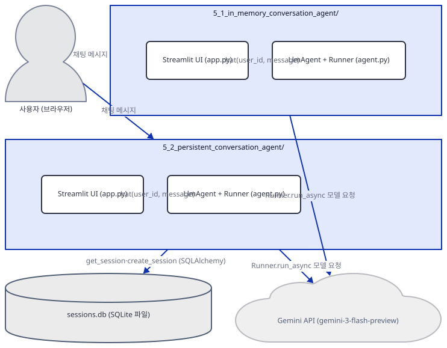
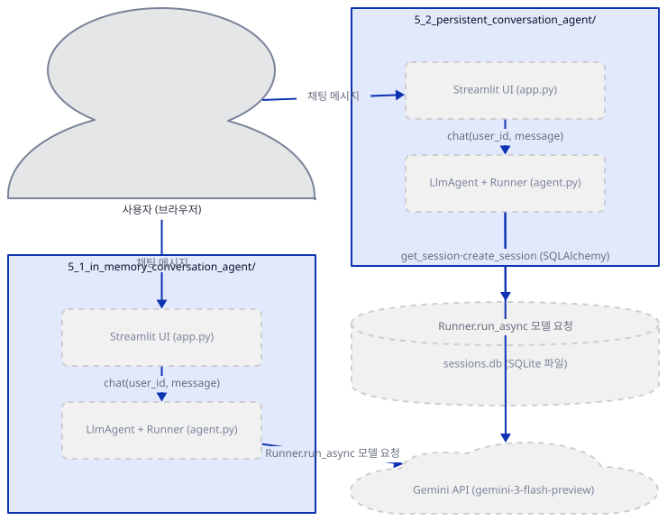
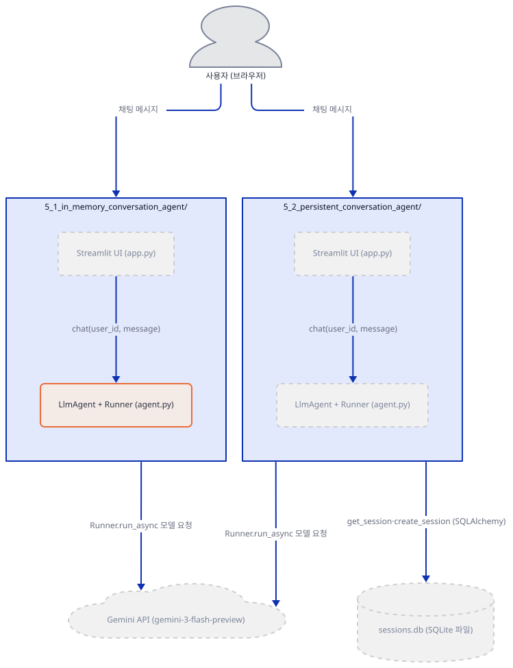
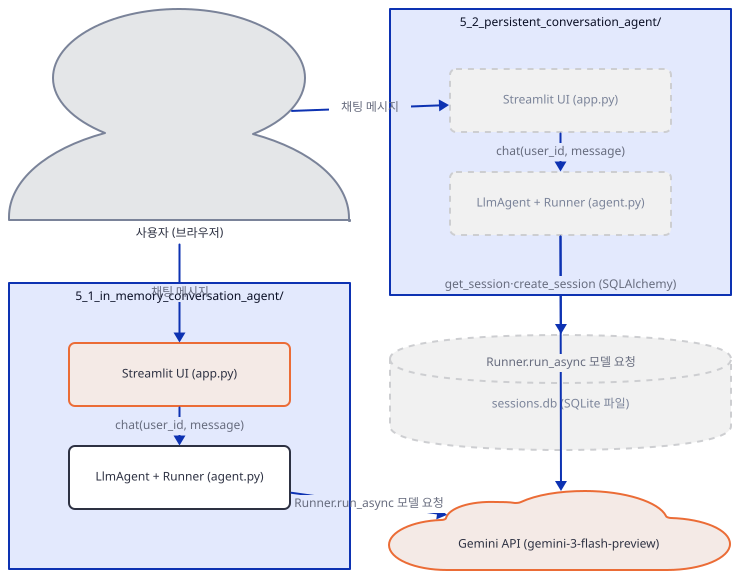
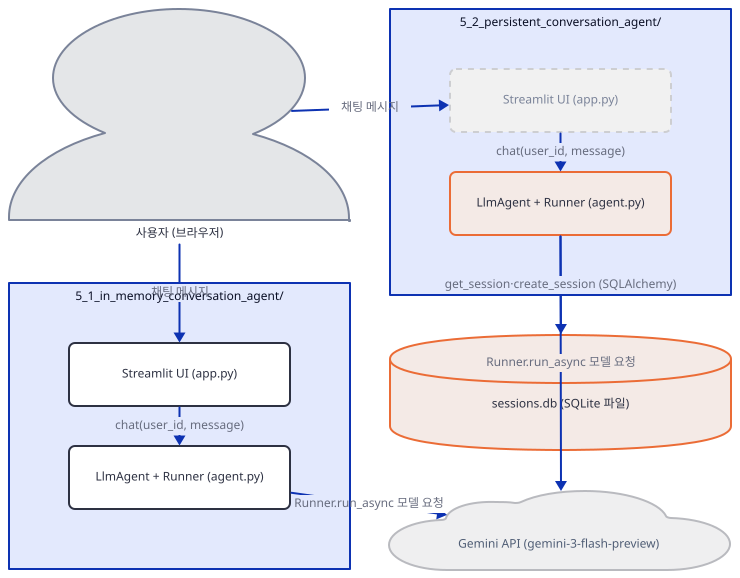
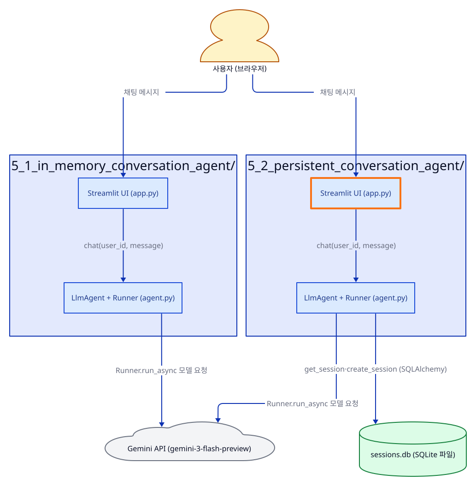
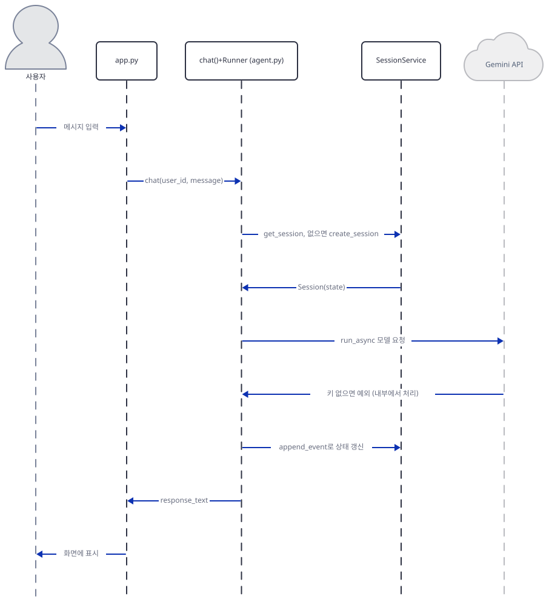

# Day 018 · Google ADK Crash Course · 5_memory_agent

> 볼륨 2 🧑‍🏫 Crash Courses · 난이도 ★★☆ · 예상 소요 75분 · API 비용 $0 (API 키 없이 진행 — 실제 모델 호출은 하지 않습니다) · 원본 앱: `ai_agent_framework_crash_course/google_adk_crash_course/5_memory_agent`

## 오늘 만들 것

지난 나흘의 ADK 크래시 코스는 매번 `adk web`에 실행을 통째로 맡겼고, `Runner`도 `SessionService`도 코드 표면에는 등장하지 않았습니다. 오늘의 `5_memory_agent`는 그 틀을 깹니다. 이 폴더에는 구조가 거의 같은 두 하위 레슨 — `5_1_in_memory_conversation_agent`와 `5_2_persistent_conversation_agent` — 이 나란히 있고, 둘 다 `agent.py`에 `LlmAgent`·`SessionService`·`Runner`·`chat()` 함수를 직접 선언한 뒤, `app.py`라는 자체 Streamlit UI로 그것을 구동합니다. `adk web`이 대신 해 주던 일 — 패키지를 찾고, 세션을 만들고, 이벤트 루프를 돌리는 일 — 을 이번에는 우리가 쓴 코드가 직접 합니다. 두 파일이 정확히 무엇을 나누어 맡는지는 Step 2에서 코드와 실행으로 확인합니다. 두 하위 레슨의 차이는 생성자 한 줄뿐입니다 — `5_1`은 `InMemorySessionService()`를, `5_2`는 `DatabaseSessionService(db_url=...)`를 씁니다 — 이지만 그 결과는 극단적입니다. `5_1`의 대화는 프로세스가 끝나는 순간 통째로 사라지고(직접 확인, Step 3), `5_2`의 대화는 SQLite 파일에 남아 새 프로세스로도 그대로 이어집니다(직접 확인, Step 4·5). 다만 `5_2`의 `agent.py`가 실제로 쓰는 `db_url="sqlite:///sessions.db"`는 비동기 드라이버 접두사가 빠져 있어 생성자 단계에서 곧바로 `ValueError`를 던집니다(직접 확인) — 이 문서는 그 지점을 정확히 짚고, URL만 고친 같은 클래스로 실제 동작을 확인합니다. API 키 없이 두 앱을 끝까지 밀어붙이면 `adk web`과는 다른 실패 방식도 드러납니다: 지난 나흘은 `adk web` 서버가 그 예외를 잡아 HTTP 500과 서버 로그로 바꿔 보여줬지만, 이번엔 그 서버가 없으므로 예외가 `Runner` 내부의 워크플로 실행기에서 표준에러 로그로만 남고, 우리가 직접 쓴 `chat()`에는 아예 도달하지 않은 채 빈 문자열만 돌아와 스크립트가 종료 코드 0으로 끝납니다(직접 확인, Step 3) — 프레임워크의 host를 쓰는 것과 host가 되는 것의 차이가 오류 처리에서부터 드러나는 지점입니다. 완성 아키텍처는 다음과 같습니다.



## 사전 준비

| 서비스/도구 | 용도 | 발급·설치 |
|---|---|---|
| Google AI Studio API 키 (`GOOGLE_API_KEY`) | Gemini 모델(`gemini-3-flash-preview`) 호출 인증. 이 문서는 키를 발급하지 않고, 키 없이 세션·상태·DB가 어디까지 동작하는지만 확인합니다 | https://aistudio.google.com/ 에서 발급 후 각 하위 폴더의 `.env`에 설정 (이 실습에서는 생략 가능) |
| uv | 가상환경 생성과 패키지 설치 | [공통 사전 준비](../README.md#공통-사전-준비-한-번만) 절 참고 |
| 인터넷 연결 | PyPI에서 `google-adk`·`sqlalchemy` 등 설치 | 별도 설치 없음 |

## 아키텍처 한눈에 보기

| 컴포넌트 | 역할 | 코드 위치 |
|---|---|---|
| 사용자 (브라우저) | Streamlit 채팅 UI에 메시지 입력 | 코드 없음 (외부 UI) |
| `5_1` Streamlit UI (`app.py`) | 채팅 입력을 받아 `chat()`을 호출하고 응답을 표시 | `ai_agent_framework_crash_course/google_adk_crash_course/5_memory_agent/5_1_in_memory_conversation_agent/app.py:1-52` |
| `5_1` `LlmAgent`+`Runner` (`agent.py`) | `InMemorySessionService`로 세션을 만들고 `Runner.run_async`로 대화를 진행 | `ai_agent_framework_crash_course/google_adk_crash_course/5_memory_agent/5_1_in_memory_conversation_agent/agent.py:1-75` |
| `5_2` Streamlit UI (`app.py`) | `5_1`과 같은 구조의 채팅 UI | `ai_agent_framework_crash_course/google_adk_crash_course/5_memory_agent/5_2_persistent_conversation_agent/app.py:1-63` |
| `5_2` `LlmAgent`+`Runner` (`agent.py`) | `DatabaseSessionService`로 세션을 만들고 동일한 `Runner.run_async`로 진행 | `ai_agent_framework_crash_course/google_adk_crash_course/5_memory_agent/5_2_persistent_conversation_agent/agent.py:1-86` |
| `sessions.db` (SQLite 파일) | `5_2`의 세션·상태·이벤트를 프로세스 밖에 저장 | 코드 없음 (실행 중 생성되는 데이터 파일) |
| Gemini API (`gemini-3-flash-preview`) | 실제 추론 수행 | 코드 없음 (외부 서비스) |

## 단계별 진행

### Step 1. 환경 만들기 — 의존성 차이와 `uv run`의 함정

**목적.** 두 하위 레슨의 의존성 차이를 직접 설치로 확인하고, 이 저장소에서 `uv run`이 예상과 다르게 동작하는 지점을 미리 짚어 둡니다.

**할 일.**

```bash
cd ai_agent_framework_crash_course/google_adk_crash_course/5_memory_agent/5_1_in_memory_conversation_agent
uv venv
uv pip install -r requirements.txt
```

(pip 대안: `python -m venv .venv && source .venv/bin/activate && pip install -r requirements.txt`. Windows PowerShell은 활성화만 `.venv\Scripts\Activate.ps1`로 바꿉니다. `uv venv`가 만든 가상환경에 `pip`이 없다는 것은 Day 14에서 이미 확인했으므로 위 명령은 처음부터 `uv pip install`을 씁니다.)

두 폴더의 `requirements.txt`는 서로 다릅니다(직접 확인).

`ai_agent_framework_crash_course/google_adk_crash_course/5_memory_agent/5_1_in_memory_conversation_agent/requirements.txt:1-3`

```text
google-adk>=1.9.0
streamlit>=1.47.1
python-dotenv>=1.1.1
```

`ai_agent_framework_crash_course/google_adk_crash_course/5_memory_agent/5_2_persistent_conversation_agent/requirements.txt:1-4`

```text
google-adk>=1.9.0
streamlit>=1.47.1
python-dotenv>=1.1.1
sqlalchemy>=2.0.0
```

이 차이가 실제로 의미가 있는지 직접 설치로 확인했습니다. `5_1`의 세 줄만 설치한 환경에는 `sqlalchemy`가 전혀 들어오지 않고 `import sqlalchemy`는 `ModuleNotFoundError`로 실패합니다(직접 확인 — `google-adk` 2.9.2 자신도 이를 끌어오지 않습니다). `5_2`의 네 번째 줄을 마저 설치하면 `sqlalchemy`와 `greenlet`만 새로 받아지고, 비동기 SQLite 드라이버인 `aiosqlite`는 `google-adk` 설치 시점에 이미 함께 들어와 있었습니다(직접 확인) — 이 드라이버가 왜 필요한지는 Step 4에서 다시 나옵니다.

이 저장소는 루트(`awesome-llm-apps/`)에 `pyproject.toml`이 있습니다. 레슨 폴더 안에서 방금 만든 로컬 가상환경에 곧바로 `uv run python -c "..."`을 실행하면, `uv`는 그 로컬 가상환경 대신 저장소 루트의 `pyproject.toml`을 프로젝트로 인식해 루트의 `.venv`를 대신 씁니다(직접 확인) — 그 `.venv`에는 `google-adk`가 없으므로 다음처럼 실패합니다.

```
uv run python -c "import google.adk; print(google.adk.__version__)"
...
ModuleNotFoundError: No module named 'google.adk'
```

`--no-project`를 붙이면 프로젝트 탐색 자체를 건너뛰고 방금 만든 로컬 가상환경이 그대로 쓰입니다(직접 확인). 이 문서의 나머지 `uv run` 명령은 모두 이 플래그를 붙입니다.



**확인.**

```bash
uv run --no-project python -c "import google.adk; print(google.adk.__version__)"
```

```
2.9.2
```

### Step 2. `agent.py`와 `app.py` — 이번엔 우리가 host가 된다

**목적.** `adk web`이 대신 해 주던 일을 두 파일이 어떻게 나누어 맡는지 확인합니다.

**할 일.**

`ai_agent_framework_crash_course/google_adk_crash_course/5_memory_agent/5_1_in_memory_conversation_agent/agent.py:13-27`

```python
# Create session service and agent
session_service = InMemorySessionService()
agent = LlmAgent(
    name="memory_agent",
    model="gemini-3-flash-preview",
    description="A simple agent that remembers conversations",
    instruction="You are a helpful assistant. Remember what users tell you and reference it in future conversations."
)

# Create runner with session service
runner = Runner(
    agent=agent,
    app_name="demo",
    session_service=session_service
)
```

`agent.py`는 지난 나흘처럼 `LlmAgent`만 선언하는 것이 아니라, `SessionService`와 `Runner`까지 모듈이 임포트되는 즉시 만들어 둡니다. google-adk 2.9.2 소스를 보면(`google/adk/runners.py`) `Runner` 클래스 독스트링의 첫 줄은 "The Runner class is used to run agents."이고, `agent`·`session_service` 등을 속성으로 들고 있다가 `run_async`가 호출되면 그 세션을 갱신해 가며 대화를 진행합니다(소스로 확인). 이 세 객체를 실제로 부르는 것은 `chat()` 함수입니다.

`ai_agent_framework_crash_course/google_adk_crash_course/5_memory_agent/5_1_in_memory_conversation_agent/agent.py:29-42`

```python
async def chat(user_id: str, message: str) -> str:
    """Simple chat function with memory using Runner"""
    session_id = f"session_{user_id}"
    
    # Create or get session
    session = await session_service.get_session(app_name="demo", user_id=user_id, session_id=session_id)
    if not session:
        # Create new session with initial state
        session = await session_service.create_session(
            app_name="demo",
            user_id=user_id,
            session_id=session_id,
            state={"conversation_history": []}
        )
```

`app.py`에는 이런 코드가 전혀 없습니다 — `chat`만 임포트해 그대로 부릅니다.

`ai_agent_framework_crash_course/google_adk_crash_course/5_memory_agent/5_1_in_memory_conversation_agent/app.py:22-32`

```python
if prompt := st.chat_input("Say something..."):
    # Add user message
    st.session_state.messages.append({"role": "user", "content": prompt})
    with st.chat_message("user"):
        st.markdown(prompt)
    
    # Get response
    with st.chat_message("assistant"):
        with st.spinner("Thinking..."):
            response = asyncio.run(chat("demo_user", prompt))
            st.markdown(response)
```

즉 `agent.py`가 `LlmAgent`·`SessionService`·`Runner`를 조립해 `chat()` 하나로 감싸는 "host" 역할을 맡고, `app.py`는 그 `chat()`을 부르는 얇은 화면일 뿐입니다. `5_2`의 `app.py`도 같은 구조이지만 `from agent import chat, session_service`로 `session_service`까지 임포트합니다 — 그런데 이 이름은 파일 전체에서 다시 등장하지 않습니다(소스로 확인, `5_2_persistent_conversation_agent/app.py`). 두 `agent.py`가 실제로 만드는 `runner`와 `session_service`가 같은 객체인지도 직접 확인했습니다.



**확인.**

```bash
uv run --no-project python -c "import agent; print(type(agent.runner).__name__, type(agent.session_service).__name__, agent.runner.session_service is agent.session_service)"
```

```
Runner InMemorySessionService True
```

### Step 3. `InMemorySessionService` — 사라지는 메모리와 삼켜지는 예외

**목적.** `app.py`까지 마무리해 전체 그림을 완성하고, 세션이 새 프로세스에서는 사라진다는 것과 API 키 없이 실행했을 때 정확히 무엇이 일어나는지 확인합니다.

**할 일.** `app.py`는 headless로 띄워 화면이 실제로 뜨는지 확인합니다.

```bash
uv run --no-project streamlit run app.py --server.headless true --server.port 8988
```

```bash
curl -s -o /dev/null -w "%{http_code}\n" http://localhost:8988
```

```
200
```

(정적 HTML 뼈대만 확인한 것입니다 — 실제 채팅 화면은 브라우저 자바스크립트가 그리므로 이 환경에서는 직접 보지 못했습니다.)

`session_service = InMemorySessionService()`는 google-adk 2.9.2 소스를 보면(`google/adk/sessions/in_memory_session_service.py`) 생성자에서 `self.sessions = {}`처럼 평범한 파이썬 dict 세 개를 만들 뿐입니다(소스로 확인) — 디스크도, 네트워크도 없습니다. 그래서 한 프로세스가 세션을 만들어도, 새 프로세스에서 같은 `app_name`·`user_id`·`session_id`로 조회하면 아무것도 없습니다.

```bash
uv run --no-project python -c "
import asyncio
from google.adk.sessions import InMemorySessionService
async def main():
    s = InMemorySessionService()
    created = await s.create_session(app_name='demo', user_id='u1', session_id='sess_u1', state={'conversation_history': ['My name is Alice']})
    print('created ->', created.id, created.state)
asyncio.run(main())
"
```

```
created -> sess_u1 {'conversation_history': ['My name is Alice']}
```

```bash
uv run --no-project python -c "
import asyncio
from google.adk.sessions import InMemorySessionService
async def main():
    s = InMemorySessionService()
    fetched = await s.get_session(app_name='demo', user_id='u1', session_id='sess_u1')
    print('new process ->', fetched)
asyncio.run(main())
"
```

```
new process -> None
```

API 키 없이 `agent.py`를 직접 실행하면(4개 메시지를 순서대로 `chat()`에 넘기는 `if __name__ == "__main__":` 블록) 지난 나흘과는 다른 실패 방식이 나타납니다. `Runner`가 `google-genai` 클라이언트를 만드는 순간 Day 14와 같은 `ValueError: No API key was provided...`가 나는 것은 같지만(직접 확인), 이번에는 이 예외가 `chat()`까지 올라오지 않습니다. `google-adk`의 워크플로 실행기가 예외를 표준에러 로그로 남기고 삼켜, `chat()`은 매번 빈 문자열을 반환합니다.

```bash
uv run --no-project python agent.py
```

```
Node execution failed with exception
Traceback (most recent call last):
  ⋮
  File "...\site-packages\google\genai\_api_client.py", line 834, in __init__
    raise ValueError(
ValueError: No API key was provided. Please pass a valid API key. Learn how to create an API key at https://ai.google.dev/gemini-api/docs/api-key.
...
User: My name is Alice
Assistant: 

User: What's my name?
Assistant: 
```

이 블록이 메시지 4개마다 한 번씩 총 4번 표준에러에 찍히고(직접 확인, 두 번 반복 실행해 재현성도 확인), `chat()`은 예외를 한 번도 받지 못한 채 매번 `response_text=""`를 돌려줘 스크립트는 종료 코드 0으로 끝납니다. `adk web`이었다면 Day 14처럼 HTTP 500과 서버 로그로 남았을 예외가, 우리가 직접 `Runner`를 호출하는 이 구조에서는 화면에 아무 흔적도 남기지 않는 빈 응답이 됩니다 — 트레이스백 안의 부수적인 예외 종류나 객체 주소는 실행마다 달라질 수 있지만, "Node execution failed" 4회와 빈 응답이라는 결과는 두 번 모두 같았습니다.



**확인.**

```bash
uv run --no-project python agent.py 2>agent_stderr.log 1>/dev/null
echo "exit=$?"
grep -c "Node execution failed with exception" agent_stderr.log
```

```
exit=0
4
```

(PowerShell에는 `/dev/null`과 `grep`이 없습니다 — 각각 `$null`과 `Select-String`으로 바꿉니다: `uv run --no-project python agent.py 2>agent_stderr.log 1>$null` 다음 `Select-String -Path agent_stderr.log -Pattern "Node execution failed" | Measure-Object | Select-Object -ExpandProperty Count`.)

### Step 4. `DatabaseSessionService` — 버그, 그리고 지연 생성

**목적.** 레슨이 실제로 쓰는 `db_url`이 왜 생성자에서부터 실패하는지, 그리고 테이블이 정말 생성자에서 만들어지는지 확인합니다.

**할 일.**

`ai_agent_framework_crash_course/google_adk_crash_course/5_memory_agent/5_2_persistent_conversation_agent/agent.py:12-15`

```python
# Create database session service for persistent storage
session_service = DatabaseSessionService(
    db_url="sqlite:///sessions.db"
)
```

이 폴더에서 그대로 `import agent`만 해도 생성자 단계에서 실패합니다.

```bash
cd ../5_2_persistent_conversation_agent
uv venv && uv pip install -r requirements.txt
uv run --no-project python -c "import agent"
```

```
ValueError: Database URL 'sqlite:///sessions.db' resolves to a synchronous driver, but this service requires an asynchronous one. Use a 'sqlite+aiosqlite://' URL instead.
```

`sqlite:///`는 동기 드라이버 `pysqlite`로 해석되는데 `DatabaseSessionService`는 비동기 엔진을 요구합니다 — 예외 메시지가 그대로 해법을 알려 줍니다. 이 저장소의 `agent.py`를 그대로 실행하는 한 이 지점을 넘어설 수 없으므로, 이후 확인은 `db_url="sqlite+aiosqlite:///sessions.db"`로 고친 같은 클래스를 직접 구성해 진행합니다.

`agent.py`의 마지막 블록에는 이런 주석이 있습니다.

`ai_agent_framework_crash_course/google_adk_crash_course/5_memory_agent/5_2_persistent_conversation_agent/agent.py:73-76`

```python
    async def test():
        # DatabaseSessionService creates its tables in the constructor;
        # no explicit initialization call is needed.
        print("✅ Database ready")
```

직접 확인해보니 이 주석은 틀렸습니다. google-adk 2.9.2 소스(`google/adk/sessions/database_session_service.py`)의 생성자는 `self._tables_created = False`만 남기고, 실제 테이블 생성은 `create_session`·`get_session`이 호출될 때마다 맨 먼저 부르는 `prepare_tables()`가 지연 수행합니다(소스로 확인) — 이 메서드의 독스트링도 "This method is called lazily before each database operation."이라고 명시합니다. 직접 실행해 이 순서를 확인했습니다.

```bash
uv run --no-project python -c "
import asyncio, os
from google.adk.sessions import DatabaseSessionService
async def main():
    print('before construction:', os.path.exists('sessions.db'))
    s = DatabaseSessionService(db_url='sqlite+aiosqlite:///sessions.db')
    print('right after constructor:', os.path.exists('sessions.db'))
    await s.get_session(app_name='demo', user_id='u1', session_id='sess_u1')
    print('after first get_session:', os.path.exists('sessions.db'))
asyncio.run(main())
"
```

```
before construction: False
right after constructor: False
after first get_session: True
```

만들어진 파일을 파이썬 표준 라이브러리 `sqlite3`로 직접 열어 보면(이 환경에는 `sqlite3` CLI 자체가 없어 모듈로 확인했습니다) 레슨 README의 SESSIONS/STATE/EVENTS 3개 표 그림과 달리 실제 테이블은 5개입니다(직접 확인).

```bash
uv run --no-project python -c "
import sqlite3
con = sqlite3.connect('sessions.db')
cur = con.execute(\"SELECT name FROM sqlite_master WHERE type='table' ORDER BY name\")
print([r[0] for r in cur.fetchall()])
"
```

```
['adk_internal_metadata', 'app_states', 'events', 'sessions', 'user_states']
```



**확인.**

```bash
uv run --no-project python -c "
import asyncio, os
from google.adk.sessions import DatabaseSessionService
async def main():
    s = DatabaseSessionService(db_url='sqlite+aiosqlite:///sessions.db')
    print(os.path.exists('sessions.db'))
    await s.get_session(app_name='demo', user_id='x', session_id='y')
    print(os.path.exists('sessions.db'))
asyncio.run(main())
"
```

```
False
True
```

### Step 5. 재시작해도 남는 것

**목적.** `5_2`의 `app.py`까지 마무리하고, 프로세스를 두 번 나눠 실행해 상태가 실제로 재시작을 버티는지 증명합니다.

**할 일.** `5_2`의 `app.py`는 `5_1`과 코드 구조가 같으므로(Step 2), 여기서는 그 밑을 받치는 `DatabaseSessionService`가 실제로 재시작에도 살아남는지만 확인합니다. 첫 번째 프로세스에서 세션을 만들고, 완전히 새로운 프로세스(= "재시작")에서 같은 파일을 다시 열어 조회합니다.

```bash
uv run --no-project python -c "
import asyncio
from google.adk.sessions import DatabaseSessionService
async def main():
    s = DatabaseSessionService(db_url='sqlite+aiosqlite:///sessions.db')
    created = await s.create_session(app_name='demo', user_id='u1', session_id='sess_u1', state={'conversation_history': ['My name is Alice']})
    print('created ->', created.id, created.state)
asyncio.run(main())
"
```

```
created -> sess_u1 {'conversation_history': ['My name is Alice']}
```

```bash
uv run --no-project python -c "
import asyncio
from google.adk.sessions import DatabaseSessionService
async def main():
    s = DatabaseSessionService(db_url='sqlite+aiosqlite:///sessions.db')
    fetched = await s.get_session(app_name='demo', user_id='u1', session_id='sess_u1')
    print('after restart ->', fetched.id, fetched.state)
asyncio.run(main())
"
```

```
after restart -> sess_u1 {'conversation_history': ['My name is Alice']}
```

Step 3에서 `InMemorySessionService`는 같은 실험에서 `None`을 돌려줬습니다 — 두 서비스가 정확히 같은 `chat()` 코드 아래에서 상태의 생사만 다르게 만든다는 것이 오늘의 핵심입니다. 모델 호출 경계도 동일합니다: 고친 URL로 `chat()` 전체를 직접 실행해 보면 Step 3과 똑같이 `Node execution failed with exception` 로그 한 번과 빈 문자열 응답으로 끝났습니다(직접 확인) — DB든 메모리든 `Runner`가 예외를 삼키는 지점은 바뀌지 않습니다.



**확인.** 위 두 명령을 그대로 순서대로 실행하면 두 번째 명령이 첫 번째가 저장한 `state`를 그대로 돌려줍니다(위 출력 참고).

## 요청 한 건이 흐르는 과정



사용자가 Streamlit 채팅창에 메시지를 입력하면 `app.py`는 그 문자열을 그대로 `chat(user_id, message)`에 넘깁니다. `chat()`은 먼저 `session_service.get_session(...)`으로 기존 세션을 찾고, 없으면 `create_session(...)`으로 새로 만듭니다 — `5_1`이면 이 호출이 파이썬 dict를 갱신하는 인프로세스 연산이고, `5_2`면 `prepare_tables()`를 거쳐 SQLite에 실제 행을 씁니다(Step 4). 이후 `runner.run_async(...)`가 `LlmAgent`를 통해 Gemini에 추론을 요청하고, 응답 이벤트가 도착할 때마다 `session_service.append_event(...)`로 세션 상태를 갱신합니다. API 키가 없는 이 문서의 환경에서는 이 추론 요청이 클라이언트 생성 단계에서 예외를 내지만(Day 14와 같은 지점), 그 예외는 `Runner` 내부에서 로그로만 남고 `chat()`에는 빈 문자열을 담은 `is_final_response` 이벤트만 도착합니다(Step 3). `app.py`는 그 문자열을 그대로 화면에 표시할 뿐이라 성공이든 실패든 겉보기에는 같은 모양입니다 — 실제로 무슨 일이 있었는지는 서버를 띄운 터미널의 표준에러를 봐야 합니다.

## 실행 체크리스트

- [ ] `5_1`과 `5_2`의 `requirements.txt` 차이(`sqlalchemy`)를 직접 설치로 확인했다
- [ ] 이 저장소에서 `uv run`이 `--no-project` 없이는 저장소 루트의 가상환경을 잡는다는 것을 직접 확인했다
- [ ] `agent.py`가 `LlmAgent`·`SessionService`·`Runner`·`chat()`을 선언하고 `app.py`는 그것을 부르기만 한다는 역할 분담을 코드로 확인했다
- [ ] `InMemorySessionService`로 만든 세션이 새 프로세스에서는 사라진다는 것을 두 프로세스로 직접 확인했다
- [ ] API 키 없이 `agent.py`를 실행하면 예외가 우리 코드까지 올라오지 않고 빈 응답과 종료 코드 0으로 끝난다는 것을 직접 확인했다
- [ ] `5_2`의 `db_url="sqlite:///sessions.db"`가 생성자에서 바로 실패하는 이유와 `+aiosqlite` 수정을 이해했다
- [ ] `DatabaseSessionService`가 생성자가 아니라 첫 DB 작업에서 테이블을 만든다는 것과, 그 상태가 새 프로세스에서도 그대로 읽힌다는 것을 직접 확인했다

## 문제 해결

| 증상 | 원인 | 해결 |
|---|---|---|
| 레슨 폴더에서 `uv venv`·`uv pip install`까지 정상 실행한 뒤 `uv run python -c "import google.adk"`가 `ModuleNotFoundError: No module named 'google.adk'` | 저장소 루트에 `pyproject.toml`이 있어 `uv run`이 방금 만든 로컬 가상환경 대신 저장소 루트의 `.venv`를 프로젝트 환경으로 잡는다(직접 확인) | `uv run --no-project python -c "..."`을 쓰거나 `.venv/Scripts/python.exe`(맥·리눅스는 `.venv/bin/python`)를 직접 호출 |
| `5_2_persistent_conversation_agent`를 그대로 실행(또는 `import agent`)하면 생성자 단계에서 `ValueError: Database URL 'sqlite:///sessions.db' resolves to a synchronous driver...` | `db_url`에 비동기 드라이버 접두사가 빠져 있다(직접 확인, `agent.py:13-15`) | `sqlite+aiosqlite:///sessions.db`로 바꾼다(Step 4) |
| API 키 없이 `agent.py`를 실행해도 예외 없이 조용히 빈 응답만 나와 무엇이 잘못됐는지 화면에 안 보임 | `Runner`의 내부 워크플로 실행기가 모델 호출 예외를 표준에러 로그로만 남기고 빈 최종 응답을 돌려준다(직접 확인) | 표준출력이 아니라 표준에러에서 `Node execution failed with exception`을 찾는다 |
| Windows PowerShell에서 Step 3의 `curl` 명령이 매개변수 오류를 낸다 | PowerShell이 `curl`을 `Invoke-WebRequest`의 별칭으로 미리 정의해 둔다(Day 14에서 이미 확인) | `curl.exe`처럼 확장자를 붙여 호출 |

## 더 해보기

- `5_2_persistent_conversation_agent/agent.py`의 `db_url`(`ai_agent_framework_crash_course/google_adk_crash_course/5_memory_agent/5_2_persistent_conversation_agent/agent.py:14`)을 실제로 `sqlite+aiosqlite:///sessions.db`로 고쳐 `uv run --no-project streamlit run app.py`로 띄우고, 대화 후 서버를 껐다 다시 켜도 화면에서 실제로 이어지는지 브라우저로 확인해보기
- 실제 `GOOGLE_API_KEY`를 두 폴더의 `.env`에 채운 뒤 Step 3·5의 확인 명령을 다시 실행해, "Node execution failed" 로그 대신 진짜 응답이 오는지, `conversation_history` state가 대화가 늘수록 실제로 쌓이는지 비교해보기
- google-adk 2.9.2의 `google/adk/sessions/sqlite_session_service.py`에는 `DatabaseSessionService`와 별개로 `SqliteSessionService`라는 클래스가 따로 있다(소스로 확인) — 무엇이 다른지 소스나 공식 문서로 찾아 비교해보기

## 다음 날 예고

[Day 019 · Google ADK Crash Course · 6_callbacks](../day019-adk-6-callbacks/README.md) — 에이전트 생명주기·LLM 요청·도구 실행 세 지점에 콜백을 붙여 실행 중간에 관찰하고 개입하는 법을 다룹니다.
