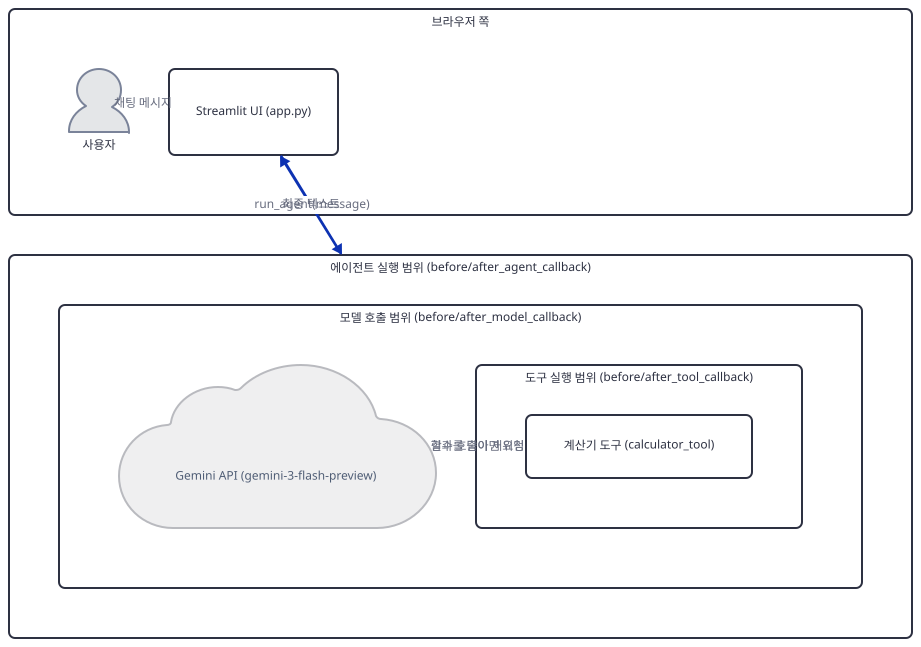
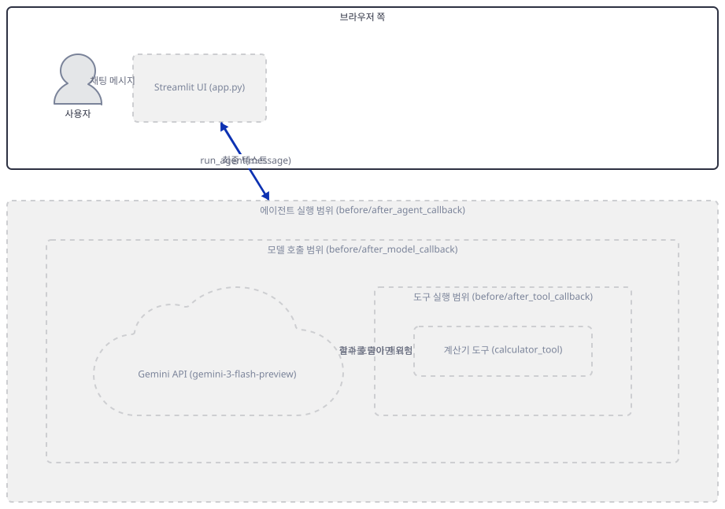
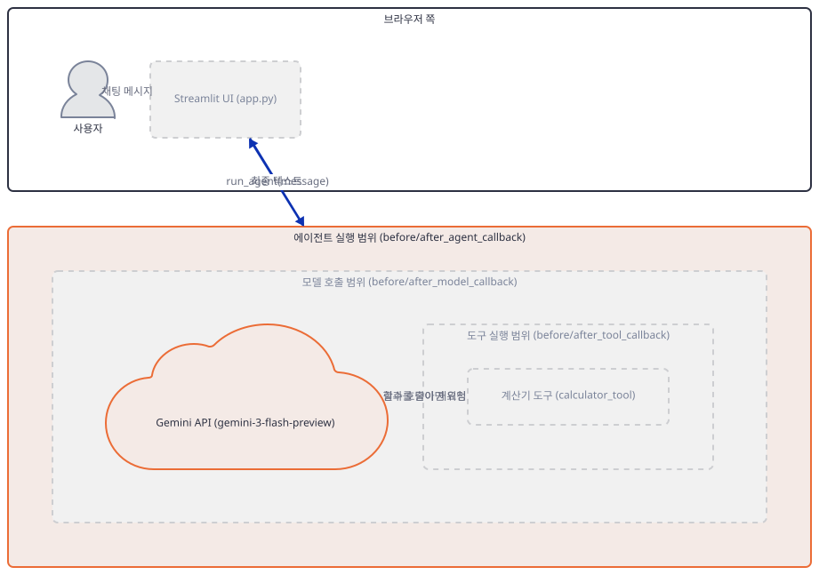
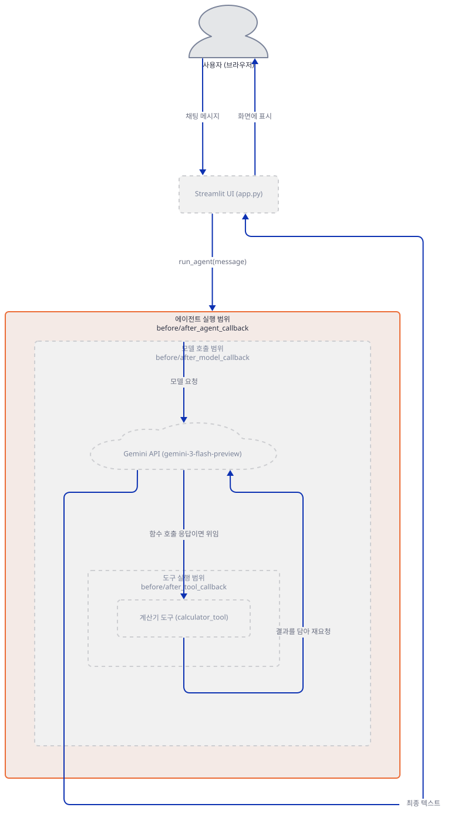
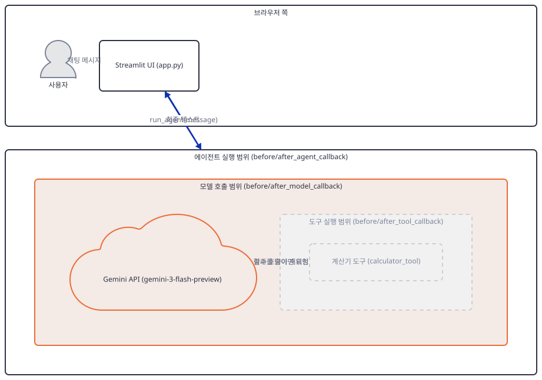
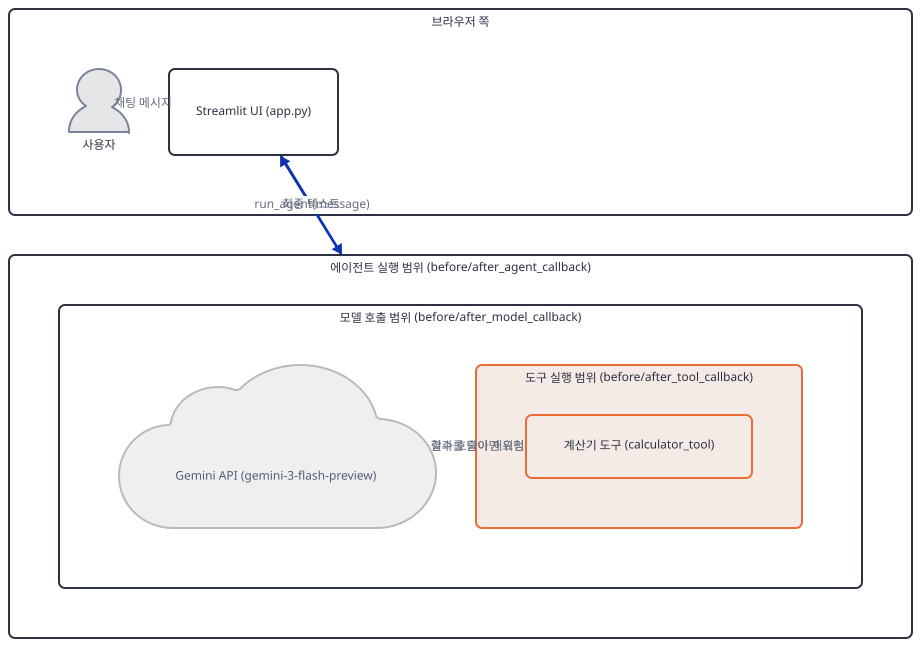
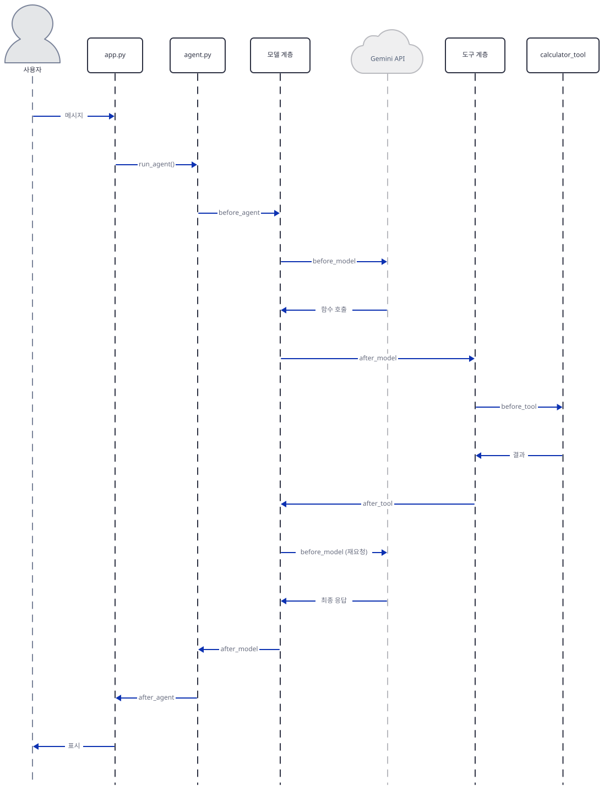

# Day 019 · Google ADK Crash Course · 6_callbacks

> 볼륨 2 🧑‍🏫 Crash Courses · 난이도 ★★☆ · 예상 소요 110분(세 하위 레슨의 콜백 쌍과 가로채기까지 모두 다루어 다른 크래시 코스 날보다 깁니다) · API 비용 $0 (API 키 없이 진행 — 실제 모델 호출은 하지 않습니다) · 원본 앱: `ai_agent_framework_crash_course/google_adk_crash_course/6_callbacks`

## 오늘 만들 것

Day 018은 `adk web`에 맡기던 실행을 우리 코드가 직접 `Runner`로 구동하는 전환점이었습니다. 오늘의 `6_callbacks`는 그 전환을 그대로 물려받고(가상환경 구성과 `uv run --no-project`, `adk web`이 아예 등장하지 않는다는 점까지 같습니다 — 자세한 배경은 Day 018을 참고), 이번엔 `Runner`가 에이전트를 굴리는 동안 벌어지는 세 지점에 후크를 붙입니다. 이 폴더에는 나란히 놓인 세 하위 레슨 `6_1_agent_lifecycle_callbacks`, `6_2_llm_interaction_callbacks`, `6_3_tool_execution_callbacks`가 있고, 각각 `before_agent_callback`/`after_agent_callback`, `before_model_callback`/`after_model_callback`, `before_tool_callback`/`after_tool_callback`을 하나씩 다룹니다. 세 폴더의 `agent.py`·`app.py` 여섯 파일 모두 마지막 줄에 개행이 없어 `wc -l`은 실제보다 하나씩 적게 셉니다(직접 확인) — 편집기·GitHub 기준 줄 수는 `agent.py`가 순서대로 122·179·150줄, `app.py`가 165·127·147줄이고, 합치면 890줄로 로드맵이 집계한 코드 규모와 정확히 일치합니다.

이 날의 진짜 주제는 세 콜백 쌍을 따로따로 아는 것이 아니라 **이들이 겹쳐 있다는 것**입니다: 에이전트 한 번의 실행 안에 모델 호출이 있고, 그 모델 호출 하나가 다시 도구 호출을 낳을 수 있습니다. `before_agent → before_model → (필요하면) before_tool → after_tool → before_model(다음 턴) → after_model → after_agent`라는 하나의 중첩된 순서가 세 하위 레슨을 관통합니다. 두 번째 주제는 **가로채기**입니다: 여섯 콜백 모두 무언가를 반환할 수 있는데, 이 문서는 그 반환값이 정말 감싸는 단계를 건너뛰는지, 건너뛸 때 반대편의 다른 콜백까지 함께 건너뛰는지, 그리고 호출자가 최종적으로 무엇을 받는지를 소스와 실행 양쪽으로 확인합니다 — 그 답은 세 계층이 서로 다릅니다.

세 하위 레슨은 이렇게 나누어 다룹니다. `6_1`(에이전트 레벨)은 가장 단순해 코드 워크스루와 키 없는 실행의 실패 양상을 확인하는 데 1스텝, 가로채기 실험에 1스텝을 씁니다. `6_2`(모델 레벨)는 이 문서에서 새로 배우는 내용이 가장 많은 지점이라 — 레슨 자신의 타입 힌트가 실제 ADK 요구사항과 다르다는 발견까지 포함해 — 워크스루·실패 양상·타입 불일치·가로채기를 한 스텝에 몰아 깊게 다룹니다. `6_3`(도구 레벨)은 워크스루에 1스텝을 쓰지만, 키 없이는 이 레슨의 콜백이 단 한 번도 실행되지 않는다는 사실을 확인하는 것으로 끝납니다 — 진짜 관찰은 마지막 통합 스텝으로 미룹니다. 세 계층을 하나의 실행 안에서 실제로 함께 작동시키는 이 마지막 스텝이 이 문서가 도달하는 지점이자, 완성 아키텍처가 그리는 그림입니다.



## 사전 준비

| 서비스/도구 | 용도 | 발급·설치 |
|---|---|---|
| Google AI Studio API 키 (`GOOGLE_API_KEY`) | 세 하위 레슨 모두 `gemini-3-flash-preview` 호출에 필요(동일한 키 하나). 이 문서는 키를 발급하지 않고, 키가 없을 때 각 콜백이 어디까지 실행되는지만 확인합니다 | https://aistudio.google.com/ 에서 발급 후 각 하위 폴더의 `.env`에 `GOOGLE_API_KEY`로 설정 (이 실습에서는 생략 가능) |
| uv | 가상환경 생성과 패키지 설치 | [공통 사전 준비](../README.md#공통-사전-준비-한-번만) 절 참고 |
| 인터넷 연결 | PyPI에서 `google-adk` 등 설치, 키가 있다면 Gemini API 접속 | 별도 설치 없음 |

## 아키텍처 한눈에 보기

| 컴포넌트 | 역할 | 코드 위치 |
|---|---|---|
| 사용자 (브라우저) | Streamlit 채팅 UI에 메시지 입력 | 코드 없음 (외부 UI) |
| Streamlit UI (`app.py`, 세 폴더 동일 구조) | 채팅 입력을 받아 `run_agent()`를 호출하고 응답을 표시. 콜백의 `print` 출력은 여기 아니라 서버 터미널에만 찍힘 | `ai_agent_framework_crash_course/google_adk_crash_course/6_callbacks/6_1_agent_lifecycle_callbacks/app.py:6-10` |
| 에이전트 레벨 콜백 (`6_1`, `before_agent_callback`/`after_agent_callback`) | 에이전트 실행 전체를 감싸며 시작·종료 시각과 소요 시간을 세션 상태로 주고받음 | `ai_agent_framework_crash_course/google_adk_crash_course/6_callbacks/6_1_agent_lifecycle_callbacks/agent.py:16-51` |
| 모델 레벨 콜백 (`6_2`, `before_model_callback`/`after_model_callback`) | 모델 호출 한 번 한 번을 감싸며 요청·응답·토큰 수·추정 비용을 기록 | `ai_agent_framework_crash_course/google_adk_crash_course/6_callbacks/6_2_llm_interaction_callbacks/agent.py:19-89` |
| 도구 레벨 콜백 (`6_3`, `before_tool_callback`/`after_tool_callback`) | 도구 호출 한 번 한 번을 감싸며 인자·결과·소요 시간을 기록 | `ai_agent_framework_crash_course/google_adk_crash_course/6_callbacks/6_3_tool_execution_callbacks/agent.py:34-75` |
| 계산기 도구 (`calculator_tool`, `6_3`) | 사칙연산 문자열을 돌려주는 평범한 함수. `FunctionTool`로 감싸 `tools=[...]`에 등록 | `ai_agent_framework_crash_course/google_adk_crash_course/6_callbacks/6_3_tool_execution_callbacks/agent.py:16-32` |
| `InMemoryRunner` (세 폴더 공통) | `LlmAgent`와 `InMemorySessionService`를 함께 묶어 `run_async`로 실행을 구동. Day 018의 `Runner`+`InMemorySessionService` 수동 조합과 달리 한 생성자로 끝남 | `ai_agent_framework_crash_course/google_adk_crash_course/6_callbacks/6_1_agent_lifecycle_callbacks/agent.py:64` |
| Gemini API (`gemini-3-flash-preview`) | 실제 추론과 함수 호출 결정을 수행 | 코드 없음 (외부 서비스) |

## 단계별 진행

### Step 1. 환경 만들기 — 세 폴더가 요구하는 의존성은 하나뿐

**목적.** 세 하위 레슨의 의존성이 정말 동일한지 확인하고, 이후 모든 Step에서 재사용할 가상환경을 각 폴더에 만들어 둡니다. 이 저장소의 관례대로 의존성부터 먼저 설치합니다.

**할 일.**

```bash
cd ai_agent_framework_crash_course/google_adk_crash_course/6_callbacks/6_1_agent_lifecycle_callbacks
uv venv
uv pip install -r requirements.txt
```

(pip 대안: `python -m venv .venv && source .venv/bin/activate && pip install -r requirements.txt`. Windows PowerShell은 활성화만 `.venv\Scripts\Activate.ps1`로 바꿉니다. `uv venv`가 만든 가상환경엔 pip이 없어 레슨 자신이 안내하는 `pip install -r requirements.txt`가 그대로는 실패한다는 것은 Day 014에서 이미 확인했으므로, 위 명령은 처음부터 `uv pip install`을 씁니다.)

이 저장소는 루트에 `pyproject.toml`이 있어 `uv run`이 방금 만든 환경 대신 루트의 `.venv`를 쓰므로, 이후 `uv run` 명령에는 모두 `--no-project`를 붙입니다.

`requirements.txt`는 세 폴더 모두 3줄이고 내용이 완전히 같습니다(직접 확인: `diff` 세 쌍 모두 종료 코드 0. 마지막 줄에 개행이 없어 `wc -l`은 2로 셉니다).

`ai_agent_framework_crash_course/google_adk_crash_course/6_callbacks/6_1_agent_lifecycle_callbacks/requirements.txt:1-3`

```text
google-adk>=1.9.0
streamlit>=1.47.1
python-dotenv>=1.1.1
```

`6_2_llm_interaction_callbacks`·`6_3_tool_execution_callbacks`의 `requirements.txt`도 바이트 단위로 같으므로 나머지 두 폴더에서는 설치를 반복하지 않고 이 폴더의 결과를 그대로 씁니다(각 폴더에서 같은 두 명령을 실행해도 결과는 동일합니다 — Step 4·5·6에서 실제로 그렇게 했습니다).



**확인.**

```bash
uv run --no-project python -c "import google.adk, streamlit, dotenv, importlib.metadata as md; print('google-adk', google.adk.__version__); print('streamlit', md.version('streamlit')); print('python-dotenv', md.version('python-dotenv'))"
```

```
google-adk 2.9.2
streamlit 1.64.0
python-dotenv 1.2.3
```

(Python 3.12.10으로 확인했습니다 — `uv venv --python 3.12`로 만든 throwaway 가상환경 기준이며, 시스템 기본 Python은 3.13.3이었습니다. 설치 자체는 `uv pip install -r requirements.txt` → `Resolved 65 packages` · `Installed 65 packages`였습니다 — 정확한 소요 시간은 실행마다 다릅니다.)

### Step 2. 에이전트 레벨 — `before_agent_callback`/`after_agent_callback`, 그리고 키 없이 실행하면 벌어지는 일

**목적.** 가장 바깥 계층의 콜백이 무엇을 주고받는지 코드로 확인하고, API 키 없이 `agent.py`를 그대로 실행하면 어느 콜백까지 실제로 도달하는지 직접 실행으로 확인합니다.

**할 일.**

`ai_agent_framework_crash_course/google_adk_crash_course/6_callbacks/6_1_agent_lifecycle_callbacks/agent.py:16-30`

```python
def before_agent_callback(callback_context: CallbackContext) -> Optional[types.Content]:
    """Callback before agent execution starts"""
    agent_name = callback_context.agent_name
    start_time = datetime.now()
    
    print(f"🚀 Agent {agent_name} started at {start_time.strftime('%H:%M:%S')}")
    print(f"⏰ Start time: {start_time.strftime('%Y-%m-%d %H:%M:%S')}")
    print()  # Add spacing
    
    # Store start time in state for after callback
    current_state = callback_context.state.to_dict()
    current_state["start_time"] = start_time.isoformat()
    callback_context.state.update(current_state)
    
    return None
```

`ai_agent_framework_crash_course/google_adk_crash_course/6_callbacks/6_1_agent_lifecycle_callbacks/agent.py:32-51`

```python
def after_agent_callback(callback_context: CallbackContext) -> Optional[types.Content]:
    """Callback after agent execution completes"""
    agent_name = callback_context.agent_name
    current_state = callback_context.state.to_dict()
    
    # Get start time from state
    start_time_str = current_state.get("start_time")
    if start_time_str:
        start_time = datetime.fromisoformat(start_time_str)
        end_time = datetime.now()
        duration = end_time - start_time
        duration_seconds = duration.total_seconds()
        
        print(f"✅ Agent {agent_name} completed")
        print(f"⏱️ Duration: {duration_seconds:.2f}s")
        print(f"⏰ End time: {end_time.strftime('%Y-%m-%d %H:%M:%S')}")
        print(f"📊 Performance: {duration_seconds:.2f}s | {agent_name}")
        print()  # Add spacing
    
    return None
```

두 함수 모두 `CallbackContext` 하나만 받습니다. `agent_name`은 어느 에이전트인지 알려주고, `state.to_dict()`/`state.update()`는 두 콜백 사이에 값을 넘기는 통로입니다 — `before_agent_callback`이 `start_time`을 세션 상태에 적어 두면 `after_agent_callback`이 같은 키로 꺼내 소요 시간을 계산합니다. 두 함수 다 마지막에 `return None`을 씁니다. `LlmAgent`에 이 둘을 등록하는 자리는 다음과 같습니다.

`ai_agent_framework_crash_course/google_adk_crash_course/6_callbacks/6_1_agent_lifecycle_callbacks/agent.py:54-61`

```python
llm_agent_with_callbacks = LlmAgent(
    name="agent_lifecycle_demo_agent",
    model="gemini-3-flash-preview",
    instruction="You are a helpful assistant. Respond to user questions clearly and concisely.",
    description="An LLM agent demonstrating lifecycle callbacks for monitoring",
    before_agent_callback=before_agent_callback,
    after_agent_callback=after_agent_callback
)
```

`runner = InMemoryRunner(agent=llm_agent_with_callbacks, app_name="agent_lifecycle_callback_demo")`(`ai_agent_framework_crash_course/google_adk_crash_course/6_callbacks/6_1_agent_lifecycle_callbacks/agent.py:64`)가 Day 018의 `Runner(agent=..., app_name=..., session_service=InMemorySessionService())` 세 줄을 한 생성자로 대신합니다 — 직접 확인해 보면 `runner.session_service`가 여전히 `InMemorySessionService` 인스턴스입니다.

이제 키 없이 `agent.py`를 그대로 실행하면 이 저장소가 한국어 Windows 환경(코드페이지 `cp949`)이라는 사실이 API 키보다 먼저 문제를 일으킵니다 — `before_agent_callback`의 `print(f"🚀 ...")`가 이모지를 콘솔 인코딩으로 쓰지 못해 `UnicodeEncodeError`가 먼저 납니다(직접 확인, 문제 해결에 정리). 이 콜백 자신의 예외는 Day 018에서 본 "삼켜지는 예외"와 달리 조용히 사라지지 않고 스크립트 전체를 종료 코드 1로 끝냅니다 — 그 이유는 시퀀스 절에서 다룹니다. 콘솔을 UTF-8로 바꾸면 그 너머의 진짜 경계가 드러납니다.



**확인.**

```bash
PYTHONIOENCODING=utf-8 uv run --no-project python agent.py
```

```powershell
$env:PYTHONIOENCODING="utf-8"; uv run --no-project python agent.py
```

표준출력에는 `before_agent_callback`의 로그만 찍힙니다(직접 확인, 발췌 — 시각은 실행마다 다릅니다).

```
🚀 Agent agent_lifecycle_demo_agent started at 19:18:05
⏰ Start time: 2026-09-21 19:18:05
```

`✅ Agent ... completed`로 시작하는 `after_agent_callback`의 로그는 끝까지 나오지 않습니다. 서버(터미널)의 표준에러에는 Day 014부터 봐 온 것과 같은 예외가 찍히고(직접 확인, 발췌), 스크립트는 종료 코드 1로 끝납니다.

```
ValueError: No API key was provided. Please pass a valid API key. Learn how to create an API key at https://ai.google.dev/gemini-api/docs/api-key.
```

```bash
PYTHONIOENCODING=utf-8 uv run --no-project python agent.py; echo "exit=$?"
```

```
exit=1
```

### Step 3. 에이전트 레벨 가로채기 — 반환값이 정말 실행을 건너뛰는가

**목적.** `before_agent_callback`이 `None`이 아닌 값을 반환하면 실제로 무슨 일이 일어나는지 — 모델 호출 자체를 건너뛰는지, 건너뛸 때 `after_agent_callback`도 함께 건너뛰는지 — 를 소스와 실행 양쪽으로 확인합니다. 이 실험은 리포의 파일을 고치지 않고, 같은 모양의 코드를 별도로 구성해 확인합니다.

**할 일.** google-adk 2.9.2 소스를 보면(소스로 확인, `google/adk/agents/base_agent.py`가 정의하는 `run_async`와 `_handle_before_agent_callback`) `before_agent_callback`이 참(truthy)값을 반환하면 `ctx.end_invocation = True`가 설정되고, 그 값이 담긴 이벤트 하나만 돌려준 뒤 `run_async`는 `_run_async_impl`(실제 모델·도구 호출 루프)에 들어가지도 않고 즉시 반환합니다 — `after_agent_callback`을 부르는 줄 자체가 이 반환 뒤에 있어 실행되지 않습니다. 판정 함수는 `google/adk/utils/_callback_pipeline.py`의 `_stop_on_truthy`로, 여러 콜백을 리스트로 등록했을 때도 "참을 반환하는 콜백이 나올 때까지"라는 규칙을 그대로 씁니다. 이 규칙이 맞다면, `before_agent_callback`이 `Content`를 반환하는 순간 이후로는 `model="gemini-3-flash-preview"`가 한 번도 실제로 호출되지 않아야 하므로 — API 키가 없어도 이 실행은 끝까지 성공해야 합니다.



**확인.** `6_1_agent_lifecycle_callbacks` 폴더의 가상환경에서, 실제 `agent.py`의 모양을 그대로 따르되 `before_agent_callback`이 값을 반환하도록만 바꾼 코드를 즉석에서 실행합니다.

```bash
uv run --no-project python -c "
import asyncio
from typing import Optional
from google.adk.agents import LlmAgent
from google.adk.agents.callback_context import CallbackContext
from google.adk.runners import InMemoryRunner
from google.genai import types

def before(ctx: CallbackContext):
    print('before_agent_callback fired')
    return types.Content(role='model', parts=[types.Part(text='intercepted-before-agent')])

def after(ctx: CallbackContext):
    print('after_agent_callback fired')
    return None

test_agent = LlmAgent(name='intercept_demo', model='gemini-3-flash-preview', instruction='unused', before_agent_callback=before, after_agent_callback=after)
runner = InMemoryRunner(agent=test_agent, app_name='intercept_demo')

async def main():
    await runner.session_service.create_session(app_name='intercept_demo', user_id='u', session_id='s')
    msg = types.Content(role='user', parts=[types.Part(text='hello')])
    final = None
    async for event in runner.run_async(user_id='u', session_id='s', new_message=msg):
        if event.is_final_response() and event.content:
            final = event.content.parts[0].text
    print('final response:', repr(final))

asyncio.run(main())
"
```

```
before_agent_callback fired
final response: 'intercepted-before-agent'
```

API 키가 없는데도 예외 없이 끝까지 성공하고(직접 확인), `after_agent_callback fired`는 한 번도 찍히지 않습니다 — 소스가 말한 그대로입니다. `model="gemini-3-flash-preview"`라는 실제 모델 문자열을 그대로 남겨 두었는데도 `google-genai` 클라이언트가 아예 생성되지 않는다는 뜻이고, 이는 로깅 훅과 제어점의 차이를 보여주는 첫 증거입니다 — 아무 값도 반환하지 않으면(Step 2) 요청은 계속 진행되어 결국 키 없음 예외를 만나지만, 값을 반환하면 그 요청 자체가 발생하지 않습니다.

### Step 4. 모델 레벨 — `before_model_callback`/`after_model_callback`, 그리고 반환 타입이 실제로는 다르다는 것

**목적.** 모델 콜백은 에이전트 콜백과 달리 인자가 두 개(`CallbackContext`와 `llm_request`/`llm_response`)라는 것을 확인하고, 키 없이 실행했을 때의 실패 지점, 레슨 자신의 타입 힌트가 틀렸다는 사실, 그리고 올바른 타입으로 가로챘을 때의 성공까지 한 번에 다룹니다.

**할 일.**

`ai_agent_framework_crash_course/google_adk_crash_course/6_callbacks/6_2_llm_interaction_callbacks/agent.py:19-52`

```python
def before_model_callback(callback_context: CallbackContext, llm_request) -> Optional[types.Content]:
    """Callback before LLM request is made"""
    agent_name = callback_context.agent_name
    request_time = datetime.now()
    
    # Extract model and prompt from llm_request
    model = getattr(llm_request, 'model', 'unknown')
    
    # Extract full prompt text from llm_request contents
    prompt_text = "unknown"
    if hasattr(llm_request, 'contents') and llm_request.contents:
        for content in llm_request.contents:
            if hasattr(content, 'parts') and content.parts:
                for part in content.parts:
                    if hasattr(part, 'text') and part.text:
                        prompt_text = part.text
                        break
                if prompt_text != "unknown":
                    break
    
    print(f"🤖 LLM Request to {model}")
    print(f"⏰ Request time: {request_time.strftime('%H:%M:%S')}")
    print(f"📋 Agent: {agent_name}")
    print()  # Add spacing
    
    # Store request info in state for after callback
    current_state = callback_context.state.to_dict()
    current_state["llm_request_time"] = request_time.isoformat()
    current_state["llm_model"] = model
    current_state["llm_prompt_length"] = len(prompt_text)
    callback_context.state.update(current_state)
    
    # Return None to allow normal execution
    return None
```

`ai_agent_framework_crash_course/google_adk_crash_course/6_callbacks/6_2_llm_interaction_callbacks/agent.py:54-89`

```python
def after_model_callback(callback_context: CallbackContext, llm_response) -> Optional[types.Content]:
    """Callback after LLM response is received"""
    agent_name = callback_context.agent_name
    current_state = callback_context.state.to_dict()
    
    # Extract response info
    response_text = str(llm_response) if llm_response else 'unknown'
    model = current_state.get("llm_model", "unknown")
    
    # Extract token count from usage_metadata
    tokens = 0
    if llm_response and hasattr(llm_response, 'usage_metadata') and llm_response.usage_metadata:
        tokens = getattr(llm_response.usage_metadata, 'total_token_count', 0)
    
    # Get request time from state
    request_time_str = current_state.get("llm_request_time")
    if request_time_str:
        request_time = datetime.fromisoformat(request_time_str)
        duration = datetime.now() - request_time
        duration_seconds = duration.total_seconds()
    else:
        duration_seconds = 0
    
    print(f"📝 LLM Response from {model}")
    print(f"⏱️ Duration: {duration_seconds:.2f}s")
    print(f"🔢 Tokens: {tokens}")
    
    # Calculate estimated cost for Gemini 3 Flash
    # Pricing: $2.50 per 1M output tokens (including thinking tokens)
    cost_per_1k_output = 0.0025  # $2.50 per 1M = $0.0025 per 1K
    estimated_cost = (tokens / 1000) * cost_per_1k_output
    print(f"💰 Estimated cost: ${estimated_cost:.4f}")
    print()  # Add spacing
    
    # Return None to use the original response
    return None
```

`before_model_callback`은 `llm_request`에서 `model`과 실제 프롬프트 텍스트를 뽑고, `after_model_callback`은 `llm_response.usage_metadata.total_token_count`로 토큰 수를 얻어 1000토큰당 0.0025달러로 어림한 비용을 찍습니다. 세 번째 줄의 `response_text = str(llm_response) if llm_response else 'unknown'`은 계산만 되고 이후 어떤 `print`에도 쓰이지 않습니다 — 죽은 코드입니다(직접 확인: 함수 나머지에서 `response_text`를 다시 찾아봐도 없음). 두 함수를 등록하는 자리는 6_1과 같은 모양입니다.

`ai_agent_framework_crash_course/google_adk_crash_course/6_callbacks/6_2_llm_interaction_callbacks/agent.py:92-113`

```python
root_agent = LlmAgent(
    name="llm_monitor_agent",
    model="gemini-3-flash-preview",
    description="Agent with LLM interaction monitoring",
    instruction="""
    You are a helpful assistant with LLM monitoring.
    
    Your role is to:
    - Provide clear, informative responses
    - Keep responses concise but comprehensive
    - Demonstrate the LLM callback system
    
    The system will automatically track:
    - Your requests to the LLM model
    - Response times and token usage
    - Estimated API costs
    
    Focus on being helpful while showing the monitoring capabilities.
    """,
    before_model_callback=before_model_callback,
    after_model_callback=after_model_callback
)
```

키 없이 `python agent.py`를 실행하면 `before_model_callback`의 로그까지는 정상 출력됩니다.



**확인.** 먼저 키 없는 실제 실행입니다.

```bash
PYTHONIOENCODING=utf-8 uv run --no-project python agent.py
```

```powershell
$env:PYTHONIOENCODING="utf-8"; uv run --no-project python agent.py
```

```
🤖 User: Explain quantum computing in simple terms
🤖 LLM Request to gemini-3-flash-preview
⏰ Request time: 19:35:26
📋 Agent: llm_monitor_agent
```

(시각은 실행마다 다릅니다.) `📝 LLM Response from ...`으로 시작하는 `after_model_callback`의 로그는 나오지 않고, 서버 로그에는 Step 2와 같은 `ValueError: No API key was provided...`가 찍히며 종료 코드는 1입니다(직접 확인).

이 함수의 타입 힌트는 `Optional[types.Content]`이지만, google-adk 2.9.2 소스가 선언한 실제 타입은 다릅니다(소스로 확인, `google/adk/agents/llm_agent.py`가 정의하는 `_SingleBeforeModelCallback`) — `Callable[[CallbackContext, LlmRequest], Optional[LlmResponse]]`, 즉 `Content`가 아니라 `LlmResponse`를 요구합니다. 실제로 레슨의 타입 힌트를 그대로 따라 `Content`를 반환해 보면 크래시가 납니다.

```bash
uv run --no-project python -c "
import asyncio
from typing import Optional
from google.adk.agents import LlmAgent
from google.adk.agents.callback_context import CallbackContext
from google.adk.runners import InMemoryRunner
from google.genai import types

def before_model(ctx: CallbackContext, llm_request) -> Optional[types.Content]:
    print('before_model_callback fired (returning types.Content, as the lesson type-hints it)')
    return types.Content(role='model', parts=[types.Part(text='a Content, not an LlmResponse')])

test_agent = LlmAgent(name='wrongtype_demo', model='gemini-3-flash-preview', instruction='unused', before_model_callback=before_model)
runner = InMemoryRunner(agent=test_agent, app_name='wrongtype_demo')

async def main():
    await runner.session_service.create_session(app_name='wrongtype_demo', user_id='u', session_id='s')
    msg = types.Content(role='user', parts=[types.Part(text='hello')])
    async for event in runner.run_async(user_id='u', session_id='s', new_message=msg):
        pass

asyncio.run(main())
"
```

```
before_model_callback fired (returning types.Content, as the lesson type-hints it)
...
AttributeError: 'Content' object has no attribute 'partial'
```

(전체 트레이스백은 `base_llm_flow.py`의 `_postprocess_async`가 `llm_response.partial`을 읽으려는 지점에서 끊깁니다 — 직접 확인.) 타입을 바로잡아 `LlmResponse`를 반환하면, 이번엔 실제 Gemini 클라이언트가 전혀 생성되지 않고 키 없이도 끝까지 성공합니다.

```bash
uv run --no-project python -c "
import asyncio
from typing import Optional
from google.adk.agents import LlmAgent
from google.adk.agents.callback_context import CallbackContext
from google.adk.runners import InMemoryRunner
from google.adk.models.llm_response import LlmResponse
from google.genai import types

def before_model(ctx: CallbackContext, llm_request) -> Optional[LlmResponse]:
    print('before_model_callback fired, requested model:', llm_request.model)
    text = 'intercepted-before-model (no real Gemini call happened)'
    return LlmResponse(content=types.Content(role='model', parts=[types.Part(text=text)]))

def after_model(ctx: CallbackContext, llm_response) -> Optional[LlmResponse]:
    print('after_model_callback fired')
    return None

test_agent = LlmAgent(name='intercept_model_demo', model='gemini-3-flash-preview', instruction='unused', before_model_callback=before_model, after_model_callback=after_model)
runner = InMemoryRunner(agent=test_agent, app_name='intercept_model_demo')

async def main():
    await runner.session_service.create_session(app_name='intercept_model_demo', user_id='u', session_id='s')
    msg = types.Content(role='user', parts=[types.Part(text='hello')])
    final = None
    async for event in runner.run_async(user_id='u', session_id='s', new_message=msg):
        if event.is_final_response() and event.content:
            final = event.content.parts[0].text
    print('final response:', repr(final))

asyncio.run(main())
"
```

```
before_model_callback fired, requested model: gemini-3-flash-preview
final response: 'intercepted-before-model (no real Gemini call happened)'
```

`after_model_callback fired`는 이번에도 찍히지 않습니다(직접 확인) — google-adk 2.9.2의 `base_llm_flow.py`가 정의하는 `_call_llm_with_tracing`을 보면(소스로 확인) `before_model_callback`이 참값을 반환하는 즉시 그 값을 그대로 내보내고 함수가 끝나, 실제 모델 호출과 `after_model_callback` 호출부 자체에 도달하지 않습니다. 이 문서에서 처음으로, 키 없이도 의미 있는(비어 있지 않은) 최종 응답 텍스트를 받은 순간입니다.

### Step 5. 도구 레벨 — `before_tool_callback`/`after_tool_callback`, 그리고 키 없이는 단 한 번도 실행되지 않는다는 것

**목적.** 도구 콜백의 시그니처가 앞의 두 계층과 또 다르다는 것(`BaseTool`, 인자 dict, `ToolContext`)을 확인하고, 왜 이 레슨만은 `python agent.py`를 그대로 실행해서는 콜백이 존재하는지조차 관찰할 수 없는지 밝힙니다.

**할 일.**

`ai_agent_framework_crash_course/google_adk_crash_course/6_callbacks/6_3_tool_execution_callbacks/agent.py:16-32`

```python
def calculator_tool(operation: str, a: float, b: float) -> str:
    """Simple calculator tool with basic operations"""
    if operation == "add":
        return f"{a} + {b} = {a + b}"
    elif operation == "subtract":
        return f"{a} - {b} = {a - b}"
    elif operation == "multiply":
        return f"{a} × {b} = {a * b}"
    elif operation == "divide":
        if b == 0:
            return "Error: Division by zero"
        return f"{a} ÷ {b} = {a / b}"
    else:
        return f"Unknown operation: {operation}"

# Create FunctionTool from the calculator function
calculator_function_tool = FunctionTool(func=calculator_tool)
```

`ai_agent_framework_crash_course/google_adk_crash_course/6_callbacks/6_3_tool_execution_callbacks/agent.py:34-51`

```python
def before_tool_callback(tool: BaseTool, args: Dict[str, Any], tool_context: ToolContext) -> Optional[Dict[str, Any]]:
    """Callback before tool execution starts"""
    agent_name = tool_context.agent_name
    tool_name = tool.name
    start_time = time.time()
    
    print(f"🔧 Tool {tool_name} started")
    print(f"📝 Parameters: {args}")
    print(f"📋 Agent: {agent_name}")
    print()  # Add spacing
    
    # Store start time in tool_context state for after callback
    current_state = tool_context.state.to_dict()
    current_state["tool_start_time"] = start_time
    tool_context.state.update(current_state)
    
    # Return None to allow normal execution
    return None
```

`ai_agent_framework_crash_course/google_adk_crash_course/6_callbacks/6_3_tool_execution_callbacks/agent.py:53-75`

```python
def after_tool_callback(tool: BaseTool, args: Dict[str, Any], tool_context: ToolContext, tool_response: Any) -> Optional[Any]:
    """Callback after tool execution completes"""
    agent_name = tool_context.agent_name
    tool_name = tool.name
    current_state = tool_context.state.to_dict()
    
    # Get start time from state and calculate duration
    start_time = current_state.get("tool_start_time")
    if start_time:
        end_time = time.time()
        duration_seconds = end_time - start_time
        
        print(f"✅ Tool {tool_name} completed")
        print(f"⏱️ Duration: {duration_seconds:.4f}s")
        print(f"📄 Result: {tool_response}")
        print()  # Add spacing
    else:
        print(f"✅ Tool {tool_name} completed")
        print(f"📄 Result: {tool_response}")
        print()  # Add spacing
    
    # Return None to use the original tool response
    return None
```

앞의 두 계층은 `CallbackContext` 하나 또는 `CallbackContext`+`llm_request`/`llm_response`를 받았지만, 도구 콜백은 `tool`(어떤 도구인지), `args`(모델이 채운 인자 dict), `tool_context`(도구 실행용 컨텍스트) 세 가지, `after_tool_callback`은 실행 결과 `tool_response`까지 네 가지를 받습니다. `calculator_tool`은 데코레이터 없는 평범한 함수이고 `FunctionTool(func=calculator_tool)`로 감싸 도구가 됩니다 — 등록된 이름은 함수 이름 그대로 `calculator_tool`입니다(직접 확인: `[t.name for t in a.tools]` → `['calculator_tool']`).

`ai_agent_framework_crash_course/google_adk_crash_course/6_callbacks/6_3_tool_execution_callbacks/agent.py:78-86`

```python
llm_agent_with_tool_callbacks = LlmAgent(
    name="tool_execution_demo_agent",
    model="gemini-3-flash-preview",
    instruction="You are a helpful assistant with calculator tools. When users ask for calculations, use the calculator_tool with appropriate parameters and provide clear explanations of the results.",
    description="An LLM agent demonstrating tool execution callbacks for monitoring",
    tools=[calculator_function_tool],
    before_tool_callback=before_tool_callback,
    after_tool_callback=after_tool_callback
)
```

도구 콜백이 실행되려면 모델이 먼저 "이 도구를 부르겠다"고 응답해야 합니다. 그런데 키가 없으면 모델 호출 자체가 Step 2·4와 같은 지점에서 실패하므로, 모델은 도구를 부르겠다고 답할 기회조차 갖지 못합니다 — 즉 이 레슨의 주인공인 두 콜백은 `python agent.py`를 그대로 돌리는 방법으로는 원리적으로 관찰할 수 없습니다.



**확인.**

```bash
PYTHONIOENCODING=utf-8 uv run --no-project python agent.py
```

```powershell
$env:PYTHONIOENCODING="utf-8"; uv run --no-project python agent.py
```

```
================================================== Tool Execution Callbacks Demo ==================================================

--- Test 1: Calculate 15 + 27 ---
```

표준출력은 배너와 첫 테스트 메시지뿐이고, `🔧 Tool ... started`·`✅ Tool ... completed` 어느 쪽도 찍히지 않습니다. `grep`으로 세어 보면 둘 다 0번입니다(직접 확인).

```bash
PYTHONIOENCODING=utf-8 uv run --no-project python agent.py > out.log 2> err.log
grep -c "Tool calculator_tool started" out.log
grep -c "Tool calculator_tool completed" out.log
```

```powershell
$env:PYTHONIOENCODING="utf-8"; uv run --no-project python agent.py > out.log 2> err.log
(Select-String -Path out.log -Pattern "Tool calculator_tool started" | Measure-Object).Count
(Select-String -Path out.log -Pattern "Tool calculator_tool completed" | Measure-Object).Count
```

```
0
0
```

이 두 콜백을 실제로 실행되는 모습으로 보려면, 도구 호출을 요청하는 모델 응답을 대신 마련해 주어야 합니다 — Step 6에서 합니다.

### Step 6. 세 계층을 한 실행 안에서 — 중첩 순서와 가로채기의 비대칭

**목적.** 에이전트·모델·도구 세 계층의 콜백이 요청 한 건 안에서 실제로 어떤 순서로 실행되는지, 그리고 도구 레벨의 가로채기가 앞의 두 계층과 다르게 동작하는지를 직접 실행으로 확인합니다. 실제 모델을 대신할 방법이 없으므로, `before_model_callback`으로 "모델이 계산기 도구를 부르기로 했다"는 응답과 "최종 답을 냈다"는 응답을 순서대로 흉내 내어 왕복 전체를 오프라인으로 재현합니다. 이때 도구 쪽 콜백(`before_tool_callback`/`after_tool_callback`)과 `calculator_tool`은 6_3의 `agent.py`를 그대로 임포트해 씁니다 — 이 부분만은 리포의 실제 코드가 그대로 실행됩니다.

**할 일.** `6_3_tool_execution_callbacks` 폴더 안에서, 같은 폴더의 `agent` 모듈을 임포트해 실제 `before_tool_callback`·`after_tool_callback`·`calculator_function_tool`을 가져오고, 여기에만 새로 만든 에이전트·모델 콜백을 얹습니다.


**확인.** 먼저 도구를 가로채지 않는 경우입니다.

```bash
PYTHONIOENCODING=utf-8 uv run --no-project python -c "
import asyncio
from typing import Optional
import agent as real
from google.adk.agents import LlmAgent
from google.adk.agents.callback_context import CallbackContext
from google.adk.runners import InMemoryRunner
from google.adk.models.llm_response import LlmResponse
from google.genai import types

order = []
model_calls = {'n': 0}

def before_agent(ctx: CallbackContext):
    order.append('before_agent'); return None

def after_agent(ctx: CallbackContext):
    order.append('after_agent'); return None

def before_model(ctx: CallbackContext, llm_request) -> Optional[LlmResponse]:
    model_calls['n'] += 1
    order.append(f\"before_model#{model_calls['n']}\")
    if model_calls['n'] == 1:
        part = types.Part(function_call=types.FunctionCall(name='calculator_tool', args={'operation': 'add', 'a': 2, 'b': 3}))
        return LlmResponse(content=types.Content(role='model', parts=[part]))
    return LlmResponse(content=types.Content(role='model', parts=[types.Part(text='Fake final answer: 2 + 3 = 5')]))

def after_model(ctx: CallbackContext, llm_response):
    order.append('after_model')
    return None

def before_tool(tool, args, tool_context):
    order.append('before_tool')
    return real.before_tool_callback(tool, args, tool_context)  # 실제(리포) 콜백을 그대로 호출

def after_tool(tool, args, tool_context, tool_response):
    order.append(f'after_tool(saw={tool_response!r})')
    return real.after_tool_callback(tool, args, tool_context, tool_response)  # 실제(리포) 콜백을 그대로 호출

nested_agent = LlmAgent(
    name='nesting_demo_agent', model='gemini-3-flash-preview', instruction='unused',
    tools=[real.calculator_function_tool],  # 실제(리포) FunctionTool
    before_agent_callback=before_agent, after_agent_callback=after_agent,
    before_model_callback=before_model, after_model_callback=after_model,
    before_tool_callback=before_tool, after_tool_callback=after_tool,
)
runner = InMemoryRunner(agent=nested_agent, app_name='nesting_demo')

async def main():
    await runner.session_service.create_session(app_name='nesting_demo', user_id='u', session_id='s')
    msg = types.Content(role='user', parts=[types.Part(text='add 2 and 3')])
    final = None
    async for event in runner.run_async(user_id='u', session_id='s', new_message=msg):
        if event.is_final_response() and event.content:
            final = event.content.parts[0].text
    print('ORDER:', order)
    print('FINAL:', repr(final))

asyncio.run(main())
" 2>/dev/null
```

```powershell
$env:PYTHONIOENCODING="utf-8"; uv run --no-project python -c "<위와 같은 코드>" 2>$null
```

```
🔧 Tool calculator_tool started
📝 Parameters: {'operation': 'add', 'a': 2, 'b': 3}
📋 Agent: nesting_demo_agent

✅ Tool calculator_tool completed
⏱️ Duration: 0.0000s
📄 Result: 2 + 3 = 5

ORDER: ['before_agent', 'before_model#1', 'before_tool', "after_tool(saw='2 + 3 = 5')", 'before_model#2', 'after_agent']
FINAL: 'Fake final answer: 2 + 3 = 5'
```

(실제 리포의 `before_tool_callback`·`after_tool_callback`·`calculator_tool`이 그대로 실행된 로그입니다 — 소요 시간 `0.0000s`은 실행마다 다릅니다.) `ORDER`가 정확히 이 문서가 처음부터 말한 중첩 순서입니다: `before_agent → before_model#1 → before_tool → after_tool → before_model#2 → after_agent`. `after_model`은 리스트 어디에도 없습니다 — 두 번의 모델 호출 모두 `before_model_callback`이 가로챘기 때문입니다(Step 4에서 확인한 규칙 그대로).

이제 `before_tool_callback`이 값을 반환하도록만 바꿔, 도구 레벨의 가로채기가 앞의 두 계층과 같은 규칙을 따르는지 확인합니다.

```bash
PYTHONIOENCODING=utf-8 uv run --no-project python -c "
import asyncio
from typing import Optional
import agent as real
from google.adk.agents import LlmAgent
from google.adk.agents.callback_context import CallbackContext
from google.adk.runners import InMemoryRunner
from google.adk.models.llm_response import LlmResponse
from google.genai import types

order = []
model_calls = {'n': 0}

def before_agent(ctx: CallbackContext):
    order.append('before_agent'); return None

def after_agent(ctx: CallbackContext):
    order.append('after_agent'); return None

def before_model(ctx: CallbackContext, llm_request) -> Optional[LlmResponse]:
    model_calls['n'] += 1
    order.append(f\"before_model#{model_calls['n']}\")
    if model_calls['n'] == 1:
        part = types.Part(function_call=types.FunctionCall(name='calculator_tool', args={'operation': 'add', 'a': 2, 'b': 3}))
        return LlmResponse(content=types.Content(role='model', parts=[part]))
    return LlmResponse(content=types.Content(role='model', parts=[types.Part(text='Fake final answer: 2 + 3 = 5')]))

def after_model(ctx: CallbackContext, llm_response):
    order.append('after_model')
    return None

def before_tool(tool, args, tool_context):
    order.append('before_tool')
    real.before_tool_callback(tool, args, tool_context)  # 로그만 남기고
    return {'result': 'INTERCEPTED-BEFORE-TOOL'}  # None이 아닌 값 -> 실제 calculator_tool 본문은 실행되지 않음

def after_tool(tool, args, tool_context, tool_response):
    order.append(f'after_tool(saw={tool_response!r})')
    return real.after_tool_callback(tool, args, tool_context, tool_response)  # 실제(리포) 콜백을 그대로 호출

nested_agent = LlmAgent(
    name='nesting_demo_agent', model='gemini-3-flash-preview', instruction='unused',
    tools=[real.calculator_function_tool],
    before_agent_callback=before_agent, after_agent_callback=after_agent,
    before_model_callback=before_model, after_model_callback=after_model,
    before_tool_callback=before_tool, after_tool_callback=after_tool,
)
runner = InMemoryRunner(agent=nested_agent, app_name='nesting_demo')

async def main():
    await runner.session_service.create_session(app_name='nesting_demo', user_id='u', session_id='s')
    msg = types.Content(role='user', parts=[types.Part(text='add 2 and 3')])
    final = None
    async for event in runner.run_async(user_id='u', session_id='s', new_message=msg):
        if event.is_final_response() and event.content:
            final = event.content.parts[0].text
    print('ORDER:', order)
    print('FINAL:', repr(final))

asyncio.run(main())
" 2>/dev/null
```

```powershell
$env:PYTHONIOENCODING="utf-8"; uv run --no-project python -c "<위와 같은 코드, before_tool만 교체>" 2>$null
```

```
🔧 Tool calculator_tool started
📝 Parameters: {'operation': 'add', 'a': 2, 'b': 3}
📋 Agent: nesting_demo_agent

✅ Tool calculator_tool completed
⏱️ Duration: 0.0000s
📄 Result: {'result': 'INTERCEPTED-BEFORE-TOOL'}

ORDER: ['before_agent', 'before_model#1', 'before_tool', "after_tool(saw={'result': 'INTERCEPTED-BEFORE-TOOL'})", 'before_model#2', 'after_agent']
FINAL: 'Fake final answer: 2 + 3 = 5'
```

`✅ Tool ... completed` 다음에 찍힌 `📄 Result`가 실제 계산값 `2 + 3 = 5`가 아니라 우리가 만든 `{'result': 'INTERCEPTED-BEFORE-TOOL'}`입니다 — `calculator_tool`의 진짜 본문(`return f"{a} + {b} = {a + b}"`)은 이번엔 한 번도 실행되지 않았다는 뜻입니다. 그런데 `ORDER`를 보면 `after_tool`은 이번에도 실행되었고, 가로채진 값을 `tool_response`로 그대로 받았습니다. 이것이 도구 레벨과 앞의 두 계층의 결정적 차이입니다: 에이전트·모델 레벨은 `before_*`가 가로채면 `after_*`까지 함께 건너뛰지만(Step 3·4), 도구 레벨은 `before_tool_callback`이 가로채도 `after_tool_callback`은 항상 실행됩니다. google-adk 2.9.2 소스를 보면(소스로 확인, `google/adk/flows/llm_flows/_tool_caller.py`가 정의하는 `_execute_single_prepared_call`) 그 이유가 판정 함수 자체에 있습니다 — 에이전트·모델 레벨은 "참값이 나올 때까지"를 뜻하는 `_stop_on_truthy`를 쓰지만, 도구 레벨은 "`None`이 아닐 때까지"를 뜻하는 `_stop_on_non_none`을 씁니다(둘 다 `google/adk/utils/_callback_pipeline.py`에 정의). `before_tool_callback`이 반환한 값은 실제 도구 실행을 건너뛰는 데만 쓰이고, 그 뒤에 오는 `after_tool_callback` 호출 자체는 무조건 실행되어 그 값을 다시 다듬거나 덮어쓸 기회를 가집니다.

이 여섯 개의 실행을 모두 합쳐 보면 콜백은 로깅 훅과 제어점 그 사이 어딘가가 아니라, 정확히 둘 다입니다 — 아무것도 반환하지 않으면 관찰만 하는 로깅 훅이고, 값을 반환하면 그 반환값의 타입과 계층에 따라 각기 다른 강도로 실행을 대신하는 제어점이 됩니다.

지금까지 다섯 스텝 모두 `python agent.py`로 콜백만 직접 확인했고, `아키텍처 한눈에 보기`가 가리키는 `app.py`(Streamlit UI, 세 폴더 동일 구조)는 한 번도 실행하지 않았습니다. 이 폴더(`6_3_tool_execution_callbacks`)를 벗어나지 않고 마지막으로, 그 UI가 실제로 뜨는지만 헤드리스로 확인합니다 — 채팅 메시지를 보내지 않으므로 `run_agent()`는 호출되지 않고, 페이지 골격을 그리는 데는 `GOOGLE_API_KEY`가 필요 없습니다.

```bash
uv run --no-project streamlit run app.py --server.headless true --server.port 8989
```

(bash·PowerShell 공통 — 환경변수를 쓰지 않는 명령입니다.) 다른 터미널에서:

```bash
curl -s -o /dev/null -w "%{http_code}\n" http://localhost:8989
```

```
200
```

(직접 확인. Day 018 Step 3과 같은 방식 — 정적 HTML 뼈대만 확인한 것이고, 실제 채팅 화면은 브라우저 자바스크립트가 그리므로 이 환경에서는 직접 보지 못했습니다. 확인 후 서버는 종료했습니다.)

## 요청 한 건이 흐르는 과정



사용자가 채팅 메시지를 보내면 `app.py`가 `run_agent(message)`를 부르고, 그 안에서 `runner.run_async(...)`가 실제 실행을 시작합니다. 가장 바깥에서 `before_agent_callback`이 먼저 실행되고, 아무것도 가로채지 않으면 `before_model_callback`이 첫 모델 요청 직전에 실행됩니다. 모델이 도구 호출을 요청하는 응답을 내면 — Step 6에서 흉내 낸 그 지점 — `after_model_callback`이 그 응답을 확정 짓고, 이어서 `before_tool_callback`이 실제 도구 실행 직전에, `after_tool_callback`이 그 직후에 실행됩니다. 도구 결과를 실은 다음 모델 요청이 다시 `before_model_callback`을 거치고, 이번엔 최종 텍스트가 나오므로 `after_model_callback`이 한 번 더 실행된 뒤 `after_agent_callback`으로 전체 실행이 마무리됩니다. 여섯 콜백 모두 등장하는 이 흐름이 정상 경로이고, Step 3·4·6에서 확인했듯 `before_*`가 값을 반환하면 이 사슬의 일부가 실제로 잘려 나갑니다.

이 흐름에서 실패가 나면 무엇이 보이는지는 이 문서가 Day 018과 다르게 답하는 지점입니다. Day 018의 `agent.py`는 `Runner.run_async`의 이벤트를 받아 `is_final_response()`가 참이면 곧바로 `break`했고, 그 결과 키 없음 예외가 매번 조용히 삼켜져 빈 문자열과 종료 코드 0으로 끝났습니다(Day 018에서 확인, 이 문서에서 그 파일을 다시 실행해 재확인). 오늘의 세 `agent.py`는 반대로 "`after_agent_callback`이 반드시 실행되도록 루프를 끝까지 돌린다"는 각 레슨 자신의 주석대로 `break`를 쓰지 않습니다. 직접 실행해 비교해 보면, 이 차이가 실패의 겉모습 자체를 바꿔 놓습니다 — 같은 `LlmAgent`·같은 콜백 유무 조합에서 `break`가 있으면 예외가 삼켜져 종료 코드 0, 루프를 끝까지 돌리면(오늘의 세 파일처럼) 종료 코드 1로 스크립트 전체가 죽습니다(직접 확인, 네 가지 조합을 각각 실행해 교차 검증했습니다: `Runner`+`break`+콜백 있음/없음 모두 종료 코드 0, `Runner`+`break` 없음+콜백 있음/없음 모두 종료 코드 1). 즉 삼켜짐과 크래시를 가르는 것은 `Runner`냐 `InMemoryRunner`냐도, 콜백이 있느냐도 아니라 **소비하는 루프가 언제 멈추는가**였습니다 — 다만 왜 이 차이가 비동기 제너레이터의 내부 정리 경로를 바꾸는지, 그 정확한 asyncio 메커니즘까지는 소스를 더 추적하지 못했습니다. 이 발견은 이 작업의 원래 전제("Day 018과 같은 삼켜짐을 예상하라")를 뒤집은 것이라 있는 그대로 적어 둡니다.

## 실행 체크리스트

- [ ] 세 폴더의 `requirements.txt`가 모두 같은 세 줄(`google-adk`, `streamlit`, `python-dotenv`)임을 확인했다
- [ ] `6_1`의 `before_agent_callback`/`after_agent_callback`이 `callback_context.state`로 값을 주고받는 방식을 읽었다
- [ ] 한국어 Windows 콘솔(`cp949`)에서는 API 키 예외보다 `UnicodeEncodeError`가 먼저 난다는 것을 확인했다
- [ ] `PYTHONIOENCODING=utf-8`로 진짜 경계(`ValueError: No API key...`)까지 도달했고, 세 레슨 모두 종료 코드 1로 죽는다는 것을 확인했다(Day 018의 "삼켜짐"과 다름)
- [ ] `before_agent_callback`이 `Content`를 반환하면 모델 호출과 `after_agent_callback`이 모두 건너뛰어진다는 것을 키 없이 확인했다
- [ ] `before_model_callback`의 실제 타입은 `Content`가 아니라 `LlmResponse`이고, `Content`를 반환하면 `AttributeError`로 죽는다는 것을 확인했다
- [ ] 올바른 타입으로 `before_model_callback`을 가로채면 키 없이도 의미 있는 최종 응답을 받는다는 것을 확인했다
- [ ] `6_3`을 그대로 실행하면 도구 콜백 둘 다 한 번도 실행되지 않는다는 것을 확인했다
- [ ] 통합 실행에서 실제(리포) 도구 콜백이 `before_agent → before_model → before_tool → after_tool → before_model → after_agent` 순서로 실행됨을 확인했다
- [ ] `before_tool_callback`이 가로채도 `after_tool_callback`은 항상 실행된다는 비대칭을 확인했다
- [ ] `6_3`의 Streamlit UI(`app.py`, 세 폴더 동일 구조)를 헤드리스로 띄워 HTTP 200을 확인했다

## 문제 해결

| 증상 | 원인 | 해결 |
|---|---|---|
| 키 없이 세 `agent.py` 중 아무거나 `uv run python agent.py`로 실행하면 `UnicodeEncodeError: 'cp949' codec can't encode character '\U0001f680'...`로 API 키 예외보다 먼저 멈춤 | 세 폴더의 `before_agent_callback`/`before_model_callback`/`before_tool_callback`이 모두 이모지를 그대로 `print`하는데, 한국어 Windows 콘솔의 기본 코드페이지 `cp949`는 이모지를 인코딩하지 못한다(직접 확인) | `PYTHONIOENCODING=utf-8 uv run --no-project python agent.py`처럼 환경변수를 지정하거나(PowerShell은 `$env:PYTHONIOENCODING="utf-8"`), 콘솔을 `chcp 65001`로 바꾼다 |
| 인코딩 문제를 우회한 뒤 세 `agent.py`를 실행하면 Day 018처럼 조용히 빈 응답만 나오는 대신 처리되지 않은 예외로 스크립트 전체가 종료 코드 1로 죽음 | 세 파일 모두 "`after_agent_callback`이 실행되도록 루프를 끝까지 돌린다"는 자신의 주석대로 `is_final_response()`에서 `break`하지 않는다 — 같은 조합에서 `break`를 추가하면 Day 018처럼 종료 코드 0으로 삼켜진다는 것을 직접 재현했다(정확한 asyncio 내부 메커니즘까지는 추적하지 못함) | 콜백 로그는 표준출력에, 진짜 실패 원인은 표준에러에 있다는 것을 이해하고 둘을 함께 본다. 조용한 실패를 원한다면 `run_agent()` 호출부를 `try/except`로 감싸는 것을 고려 |
| `6_3_tool_execution_callbacks`를 그대로 실행해 `before_tool_callback`/`after_tool_callback`의 로그를 기다려도 끝까지 나오지 않음 | 두 콜백은 모델이 도구 호출을 요청해야 실행되는데, 키가 없으면 모델 호출 자체가 그 전에 실패한다(직접 확인: 두 로그 모두 0회) | 실제로 두 콜백이 도는 모습을 보려면 Step 6처럼 `before_model_callback`으로 도구 호출 응답을 대신 만들어 주는 오프라인 실험이 필요 |
| `before_model_callback`이 레슨 자신의 타입 힌트(`Optional[types.Content]`)를 그대로 따라 `Content`를 반환하면 `AttributeError: 'Content' object has no attribute 'partial'` | google-adk 2.9.2가 실제로 요구하는 타입은 `Optional[LlmResponse]`이고(소스로 확인), `Content`를 반환하면 이후 코드가 `LlmResponse` 전용 속성(`partial`)을 읽으려다 실패한다 | `google.adk.models.llm_response.LlmResponse`로 감싸 `LlmResponse(content=types.Content(...))` 형태로 반환한다 |

## 더 해보기

- `after_model_callback`(`ai_agent_framework_crash_course/google_adk_crash_course/6_callbacks/6_2_llm_interaction_callbacks/agent.py:60`)이 계산만 하고 쓰지 않는 `response_text`를 실제로 로그에 찍도록 고쳐, 지금은 보이지 않는 모델 응답 문자열이 무엇인지 확인해보기
- `before_tool_callback`이 falsy이지만 `None`은 아닌 값(예: 빈 dict `{}`)을 반환해도 여전히 실제 도구 실행을 건너뛰는지 실험해보기 — 에이전트·모델 레벨이 쓰는 `_stop_on_truthy`와 도구 레벨이 쓰는 `_stop_on_non_none`의 차이를 몸소 확인하는 셈입니다
- google-adk 2.9.2의 `google/adk/agents/llm_agent.py`에 `before_model_callback`·`before_tool_callback`과 나란히 있는 `on_model_error_callback`·`on_tool_error_callback`을 찾아, 이 콜백에 응답을 채워 주면 이 문서가 겪은 "종료 코드 1 크래시"가 Day 018처럼 조용한 실패로 바뀌는지 확인해보기
- 실제 `GOOGLE_API_KEY`를 발급받아 세 `.env`에 채운 뒤 `6_2`를 다시 실행해, `after_model_callback`이 찍는 토큰 수·추정 비용이 실제 Gemini 응답의 `usage_metadata`와 맞아떨어지는지 비교해보기

## 다음 날 예고

[Day 020 · Google ADK Crash Course · 7_plugins](../day020-adk-7-plugins/README.md) — 오늘 익힌 콜백을 개별 에이전트가 아니라 `Runner`에 한 번만 등록해 그 아래 모든 에이전트·도구·모델 호출에 전역으로 적용하는 플러그인을 다룹니다.
