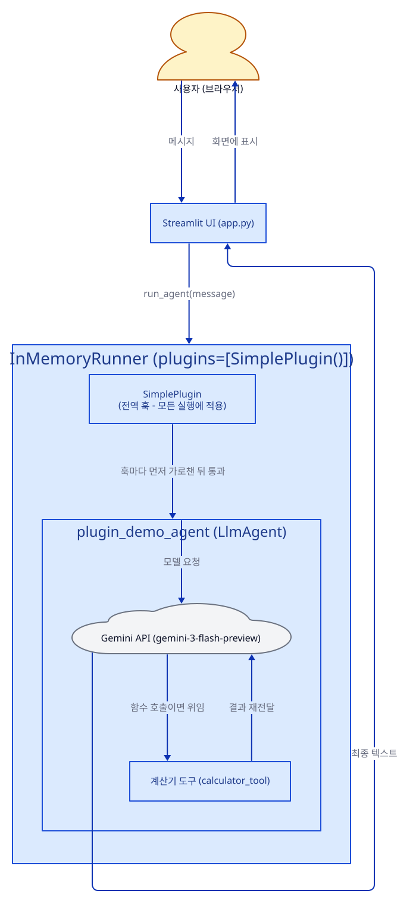
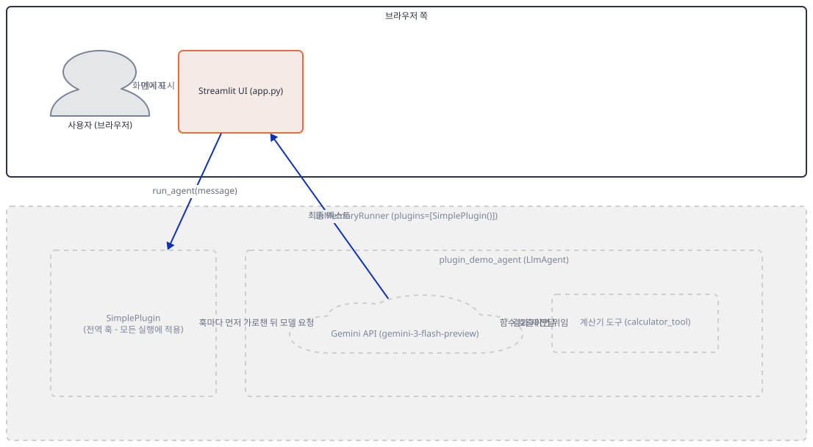
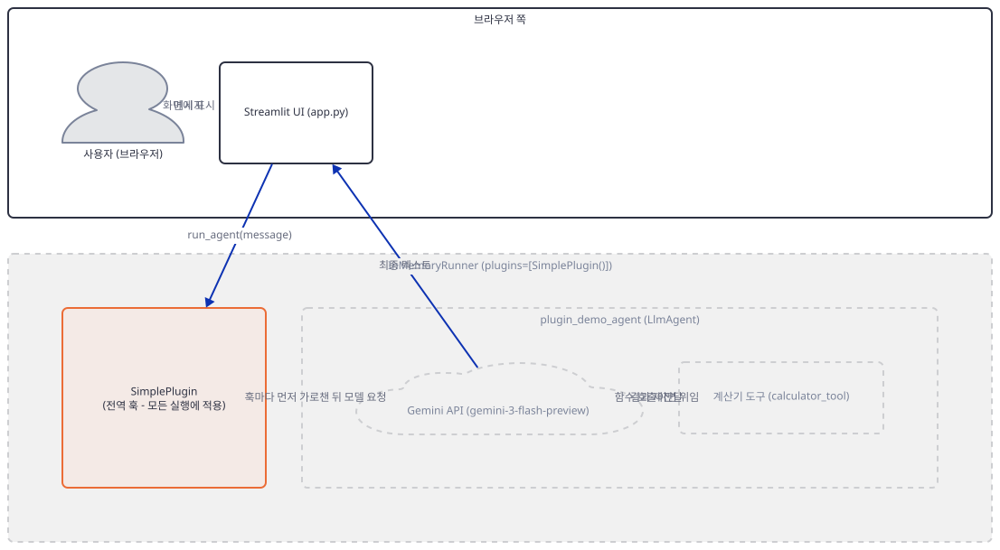
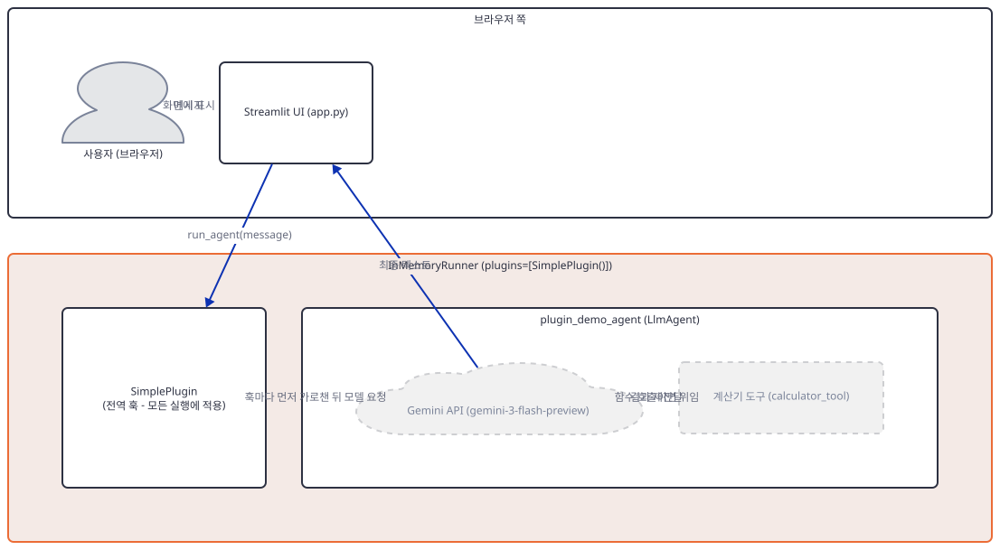
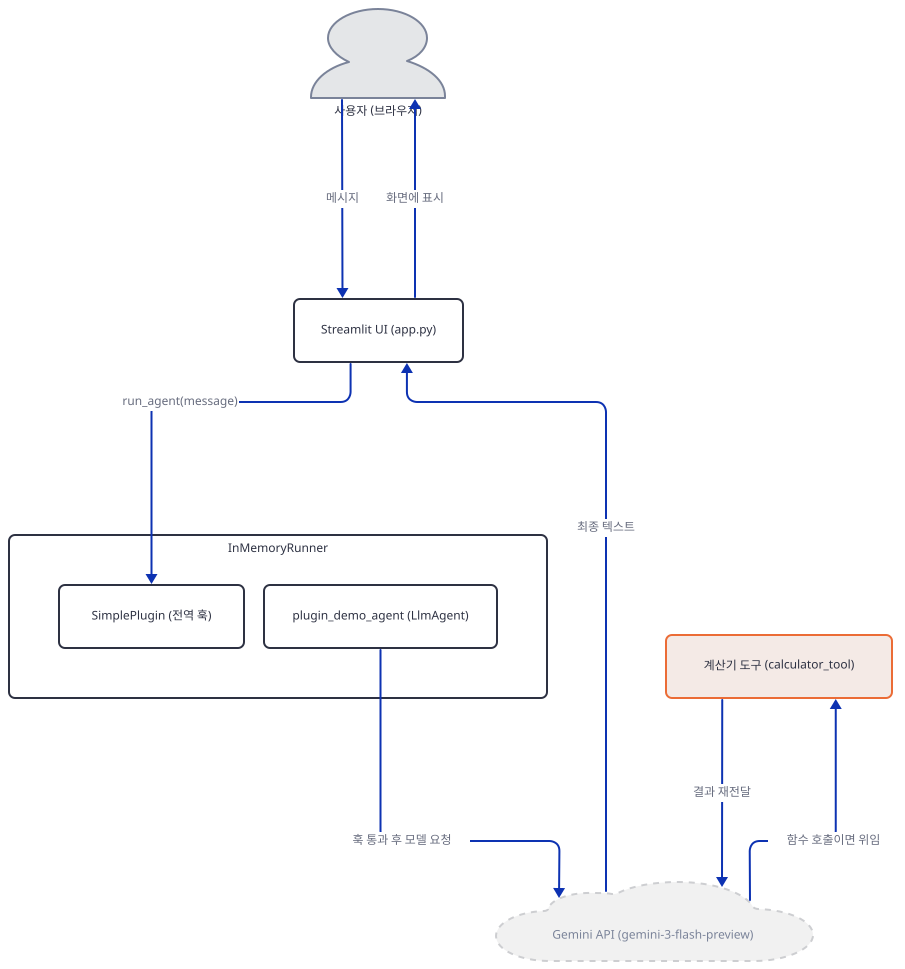
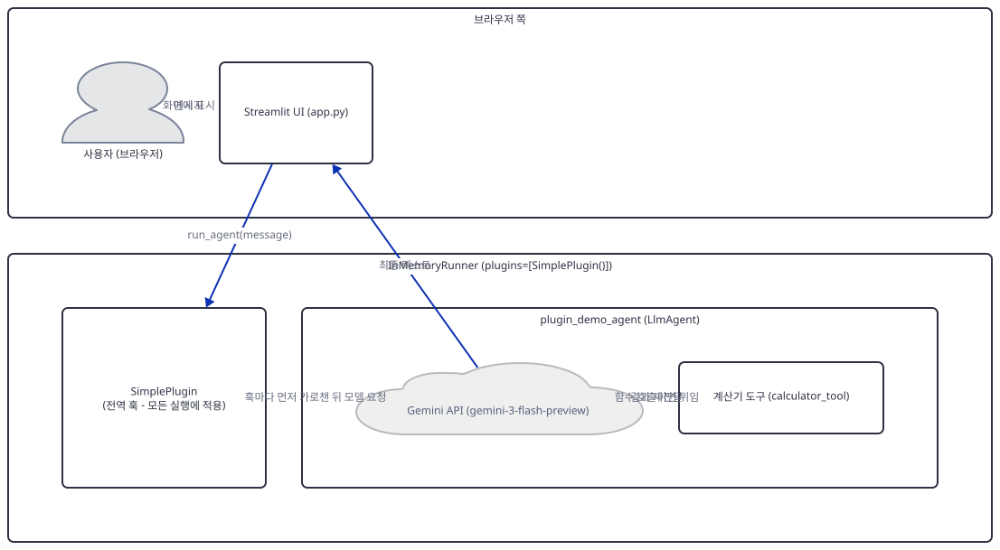
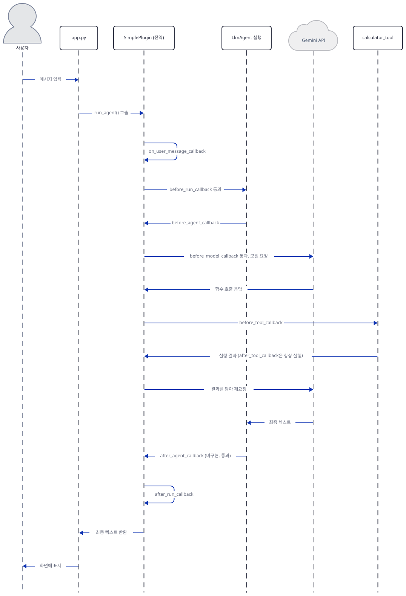

# Day 020 · Google ADK Crash Course · 7_plugins

> 볼륨 2 🧑‍🏫 Crash Courses · 난이도 ★★☆ · 예상 소요 85분(플러그인 고유의 15개 훅·우선순위·에러 억제 규칙을 모두 소스로 새로 확인하느라 단일 레슨치고 조금 깁니다) · API 비용 $0 (API 키 없이 진행 — 실제 모델 호출은 하지 않습니다) · 원본 앱: `ai_agent_framework_crash_course/google_adk_crash_course/7_plugins`

## 오늘 만들 것

Day 019는 `Runner`가 에이전트를 굴리는 동안 벌어지는 여섯 지점(에이전트·모델·도구 각각의 전/후)에 함수를 등록해 가로채는 법을 다뤘습니다. 오늘의 `7_plugins`는 그 여섯 지점을 다시 설명하지 않고, 등록 위치가 다른 두 번째 메커니즘을 더합니다. `SimplePlugin` 클래스가 개별 `LlmAgent`가 아니라 `InMemoryRunner(agent=agent, app_name=..., plugins=[SimplePlugin()])`의 `plugins=` 인자에 등록됩니다. Day 019의 콜백은 `LlmAgent` 인스턴스 하나에만 적용됐지만, 플러그인은 그 러너 아래 모든 에이전트·도구·모델 호출에 전역으로 적용됩니다 — 에이전트가 하나뿐인 오늘은 이 차이가 코드만으로 드러나지 않으므로, Step 5에서 플러그인을 하나 더 등록해야 "전역"의 실제 의미가 보입니다.

이 폴더는 Day 015~019처럼 하위 레슨으로 나뉘지 않은 단일 레슨입니다 — `agent.py` 105줄, `app.py` 64줄(둘 다 마지막 줄에 개행이 있어 `wc -l`과 실제 줄 수가 같습니다), 200줄짜리 레슨 README, `requirements.txt` 한 장. 이 README는 도움이 되는 만큼 틀린 곳도 있습니다 — Day 019가 레슨의 타입 힌트가 실제 요구 타입과 다르다는 것을 찾아낸 것처럼, 이 레슨의 README도 프로젝트 구조표에 리포 어디에도 없는 파일(`plugin_example.py`)을 나열하고 에러 콜백의 억제 능력을 뭉뚱그려 서술합니다(둘 다 소스로 확인). 이 문서는 그런 주장을 소스와 직접 실행으로 하나씩 확인합니다.

오늘의 질문은 "플러그인이 콜백과 무엇이 다르고, 언제 어느 쪽을 쓰는가"입니다. 등록 위치(에이전트 vs 러너)와 범위(하나 vs 전부)가 답의 절반이고, 나머지는 실행 순서·가로채기 규칙·에러 처리에서 나옵니다. 마지막으로 키 없이 실행했을 때 Day 018처럼 삼켜지는지 Day 019처럼 종료 코드 1로 죽는지도 확인합니다.



## 사전 준비

| 서비스/도구 | 용도 | 발급·설치 |
|---|---|---|
| Google AI Studio API 키 (`GOOGLE_API_KEY`) | `gemini-3-flash-preview` 호출 인증. 이 문서는 키를 발급하지 않고, 키 없이 플러그인 훅이 어디까지 실행되는지만 확인합니다 | https://aistudio.google.com/ 에서 발급 후 `.env`에 설정 (이 실습에서는 생략 가능) |
| uv | 가상환경 생성과 패키지 설치 | [공통 사전 준비](../README.md#공통-사전-준비-한-번만) 절 참고 |
| 인터넷 연결 | PyPI에서 `google-adk` 등 설치 | 별도 설치 없음 |

## 아키텍처 한눈에 보기

| 컴포넌트 | 역할 | 코드 위치 |
|---|---|---|
| 사용자 (브라우저) | 시나리오 3개 중 하나를 고르거나 메시지를 직접 입력 | 코드 없음 (외부 UI) |
| Streamlit UI (`app.py`) | 선택된 시나리오 또는 직접 입력을 `run_agent()`에 전달 | `ai_agent_framework_crash_course/google_adk_crash_course/7_plugins/app.py:14-44` |
| `SimplePlugin` (`BasePlugin` 상속) | `InMemoryRunner`에 전역 등록되어 사용자 메시지·에이전트 시작·도구 시작·실행 종료를 관찰·수정 | `ai_agent_framework_crash_course/google_adk_crash_course/7_plugins/agent.py:21-48` |
| `plugin_demo_agent` (`LlmAgent`) | 계산기 도구를 쓸 수 있는 단일 에이전트 | `ai_agent_framework_crash_course/google_adk_crash_course/7_plugins/agent.py:68-70` |
| 계산기 도구 (`calculator_tool`) | 사칙연산을 수행하고 0으로 나누면 예외를 던짐 | `ai_agent_framework_crash_course/google_adk_crash_course/7_plugins/agent.py:54-62` |
| `InMemoryRunner` | 에이전트와 플러그인을 함께 묶어 실행을 구동 | `ai_agent_framework_crash_course/google_adk_crash_course/7_plugins/agent.py:73` |
| `run_agent()` | 세션을 만들고 `runner.run_async`의 이벤트를 끝까지 소비해 응답 문자열을 만듦 | `ai_agent_framework_crash_course/google_adk_crash_course/7_plugins/agent.py:78-98` |
| Gemini API (`gemini-3-flash-preview`) | 실제 추론과 함수 호출 결정 수행 | 코드 없음 (외부 서비스) |

## 단계별 진행

### Step 1. 환경 만들기 — 의존성 한 줄이 실제로 바꾸는 것

**목적.** 의존성을 설치하고, Day 014~019에는 없던 `google-genai` 명시 줄이 실제 설치 결과를 바꾸는지, 이 폴더의 파일 줄 수가 맞는지 확인합니다.

**할 일.**

```bash
cd ai_agent_framework_crash_course/google_adk_crash_course/7_plugins
uv venv
uv pip install -r requirements.txt
```

(pip 대안: `python -m venv .venv && source .venv/bin/activate && pip install -r requirements.txt`. Windows PowerShell은 활성화만 `.venv\Scripts\Activate.ps1`로 바꿉니다.)

이 저장소는 루트에 `pyproject.toml`이 있어 `uv run`이 방금 만든 환경 대신 루트의 `.venv`를 쓰므로, 이후 `uv run` 명령에는 모두 `--no-project`를 붙입니다.

`ai_agent_framework_crash_course/google_adk_crash_course/7_plugins/requirements.txt:1-4`

```text
google-genai>=1.28.0
google-adk>=1.9.0
streamlit>=1.47.1
python-dotenv>=1.1.1
```

첫 줄이 Day 014~019에는 없던 `google-genai`를 명시적으로 올려 둡니다. 하지만 실제 설치 결과는 바뀌지 않습니다 — `google-adk` 2.9.2 자신의 의존성 하한이 이 줄보다 더 타이트하기 때문입니다(직접 확인).

```bash
uv run --no-project python -c "import importlib.metadata as md; print([r for r in md.metadata('google-adk').get_all('Requires-Dist') if 'genai' in r.lower()][0])"
```

```
google-genai>=2.19,<3
```

`>=2.19,<3`이 레슨의 `>=1.28.0`을 완전히 포함하므로, 첫 줄을 지우고 나머지 세 줄만 설치해도 설치 시점 기준 최신 2.x가 그대로 설치됩니다 — 첫 줄이 있든 없든 결과가 같다는 뜻입니다(직접 확인 — 별도 가상환경에 비교). 이 버전은 PyPI의 최신 릴리스를 따라가므로 이 문서를 처음 쓴 시점엔 2.24.0이었고, 2026-09-23 재확인 시점엔 2.25.0이었습니다(직접 확인) — 고정된 하한선(`>=2.19,<3`) 안에서 계속 올라갈 수 있는 값입니다.

마지막 줄에 개행이 없는 파일은 `wc -l`이 실제보다 하나 적게 셉니다.

```bash
wc -l agent.py app.py requirements.txt
tail -c 1 agent.py | xxd | tail -1
tail -c 1 app.py | xxd | tail -1
tail -c 1 requirements.txt | xxd | tail -1
```

```
 105 agent.py
  64 app.py
   3 requirements.txt
 172 total
00000000: 0a                                       .
00000000: 0a                                       .
00000000: 31                                       1
```

`agent.py`·`app.py`는 마지막 바이트가 개행(`0a`)이라 `wc -l`의 105·64가 편집기·GitHub 줄 수와 같습니다. `requirements.txt`만 마지막 바이트가 `1`(개행 없음)이라 `wc -l`은 3으로 세지만 실제로는 위에서 인용한 네 줄입니다.



**확인.**

```bash
uv run --no-project python -c "import google.adk, google.genai, importlib.metadata as md; print('google-adk', google.adk.__version__); print('google-genai', md.version('google-genai')); print('streamlit', md.version('streamlit')); print('python-dotenv', md.version('python-dotenv'))"
```

```powershell
uv run --no-project python -c "import google.adk, google.genai, importlib.metadata as md; print('google-adk', google.adk.__version__); print('google-genai', md.version('google-genai')); print('streamlit', md.version('streamlit')); print('python-dotenv', md.version('python-dotenv'))"
```

```
google-adk 2.9.2
google-genai 2.25.0
streamlit 1.64.0
python-dotenv 1.2.3
```

(2026-09-23 재확인 기준 출력입니다 — `google-genai`만 설치 시점의 PyPI 최신판을 따라가므로 이 문서를 처음 쓴 시점엔 2.24.0이었습니다. 나머지 세 값은 고정됩니다. Python 3.12.10으로 확인했습니다 — `uv venv --python 3.12`로 만든 throwaway 가상환경 기준이며, 시스템 기본 Python은 3.13.3이었습니다.)

### Step 2. `SimplePlugin` 정의 — `BasePlugin`이 실제로 제공하는 것

**목적.** `SimplePlugin`이 무엇을 구현하는지, 그것이 `BasePlugin` 전체 중 얼마나 되는지, 레슨 README가 폴더 구성과 어긋나는 지점을 확인합니다.

**할 일.**

`ai_agent_framework_crash_course/google_adk_crash_course/7_plugins/agent.py:21-26`

```python
class SimplePlugin(BasePlugin):
    def __init__(self) -> None:
        super().__init__(name="simple_plugin")
        # Track usage statistics across all executions
        self.agent_count = 0
        self.tool_count = 0
```

`BasePlugin.__init__`은 `name` 하나만 요구합니다 — Day 019의 어떤 콜백도 이런 자기 이름을 갖지 않았습니다. 이 이름은 같은 러너에 플러그인을 여러 개 등록할 때 구분하는 유일한 열쇠입니다(중복되면 등록 시점에 `ValueError`, 소스로 확인 — `google/adk/plugins/plugin_manager.py`의 `register_plugin`).

`SimplePlugin`은 네 개의 훅을 구현합니다.

`ai_agent_framework_crash_course/google_adk_crash_course/7_plugins/agent.py:29-34`

```python
    async def on_user_message_callback(self, *, invocation_context, user_message: types.Content) -> Optional[types.Content]:
        timestamp = datetime.now().strftime("%H:%M:%S")
        print(f"🔍 [Plugin] User message at {timestamp}")
        # Add timestamp to each message part for context
        modified_parts = [types.Part(text=f"[{timestamp}] {part.text}") for part in user_message.parts if hasattr(part, 'text')]
        return types.Content(role='user', parts=modified_parts)
```

`ai_agent_framework_crash_course/google_adk_crash_course/7_plugins/agent.py:37-39`

```python
    async def before_agent_callback(self, *, agent: BaseAgent, callback_context: CallbackContext) -> None:
        self.agent_count += 1
        print(f"🤖 [Plugin] Agent {agent.name} starting (count: {self.agent_count})")
```

`ai_agent_framework_crash_course/google_adk_crash_course/7_plugins/agent.py:42-44`

```python
    async def before_tool_callback(self, *, tool: BaseTool, tool_args: Dict[str, Any], tool_context: ToolContext) -> None:
        self.tool_count += 1
        print(f"🔧 [Plugin] Tool {tool.name} starting (count: {self.tool_count})")
```

`ai_agent_framework_crash_course/google_adk_crash_course/7_plugins/agent.py:47-48`

```python
    async def after_run_callback(self, *, invocation_context) -> None:
        print(f"📊 [Plugin] Final Report: {self.agent_count} agents, {self.tool_count} tools")
```

Day 019의 `before_agent_callback`·`before_tool_callback`과 이름은 같지만 시그니처는 다릅니다 — 플러그인 훅은 모두 키워드 전용(`*,`)이고, `before_agent_callback`은 `agent` 자체를 받습니다(어느 에이전트든 오므로 "누구인지" 알아야 합니다). `before_tool_callback`의 매개변수 이름도 에이전트 레벨의 `args`와 달리 `tool_args`입니다(소스로 확인) — 같은 개념이지만 이름까지 일치하진 않습니다.

`google-adk` 2.9.2의 `BasePlugin`이 실제로 정의하는 훅은 이 넷보다 훨씬 많습니다.

```bash
uv run --no-project python -c "
import inspect
from google.adk.plugins.base_plugin import BasePlugin
hooks = [n for n, m in vars(BasePlugin).items() if inspect.iscoroutinefunction(m)]
print(len(hooks), sorted(hooks))
"
```

```
15 ['after_agent_callback', 'after_model_callback', 'after_run_callback', 'after_tool_callback', 'before_agent_callback', 'before_model_callback', 'before_run_callback', 'before_tool_callback', 'close', 'on_agent_error_callback', 'on_event_callback', 'on_model_error_callback', 'on_run_error_callback', 'on_tool_error_callback', 'on_user_message_callback']
```

15개 중 `SimplePlugin`은 4개만 구현하고 나머지는 기본 구현(`pass`, 항상 `None` 또는 아무 일도 하지 않음)을 그대로 씁니다. 레슨 자신의 README도 여덟 줄에 열두 개를 나열하고 `close`·`on_agent_error_callback`·`on_run_error_callback`은 목록에서 빠뜨립니다(15−12=3, 직접 확인) — 뒤 두 개는 Step 6에서 다룹니다.

폴더 구성도 README와 어긋납니다.

`ai_agent_framework_crash_course/google_adk_crash_course/7_plugins/README.md:67-72`

```text
7_plugins/
├── README.md                           # This file - concept explanation
├── agent.py                            # Agent implementation with plugin
├── app.py                              # Streamlit interface
├── requirements.txt                    # Dependencies
└── plugin_example.py                   # Standalone plugin demonstration
```

`plugin_example.py`는 이 폴더는 물론 리포 전체 어디에도 없습니다(직접 확인).



**확인.**

```bash
test -e plugin_example.py && echo "있음" || echo "없음"
ls -A
```

```powershell
Test-Path plugin_example.py
Get-ChildItem -Force
```

```
없음
.env.example  agent.py  app.py  README.md  requirements.txt
```

(`find . -iname "plugin_example.py"; echo "exit=$?"`로도 확인해 봤지만, `find`는 못 찾아도 종료 코드 0을 돌려주므로 없음을 보여 주는 확인으로는 `test -e`가 더 명확합니다 — 직접 확인. `ls`는 점으로 시작하는 파일을 보여 주지 않아 `.env.example`이 빠지므로 `-A`를 붙였습니다. 실제 폴더에는 다섯 개 파일뿐입니다 — `plugin_example.py`는 없습니다.)

### Step 3. 등록과 범위 — `Runner(plugins=[...])`는 전역이다

**목적.** 플러그인이 `LlmAgent`가 아니라 `Runner`에 등록된다는 것과, 등록된 인스턴스가 어디에 보관되는지 코드로 확인합니다.

**할 일.**

`ai_agent_framework_crash_course/google_adk_crash_course/7_plugins/agent.py:68-73`

```python
agent = LlmAgent(name="plugin_demo_agent", model="gemini-3-flash-preview", 
                instruction="You are a helpful assistant that can perform calculations. Use the calculator_tool when needed.",
                tools=[calculator_tool])

# Create runner and register the plugin - this makes the plugin global
runner = InMemoryRunner(agent=agent, app_name="plugin_demo_app", plugins=[SimplePlugin()])
```

`agent = LlmAgent(...)` 줄 어디에도 `before_agent_callback=...` 같은 Day 019식 등록이 없습니다 — `SimplePlugin()`은 오직 `InMemoryRunner`의 `plugins=` 인자에만 나타납니다. `Runner`(`InMemoryRunner`도 상속)는 생성자에서 이 리스트로 `PluginManager`를 만들어 `self.plugin_manager`에 보관합니다(소스로 확인, `google/adk/runners.py`). 이 러너에 두 번째 `LlmAgent`를 물렸다면 `SimplePlugin`은 그 에이전트에도 똑같이 적용됩니다 — 이것이 "전역"의 실제 의미입니다.



**확인.**

```bash
uv run --no-project python -c "import agent; print(type(agent.runner).__name__); print([type(p).__name__ for p in agent.runner.plugin_manager.plugins]); print(agent.runner.plugin_manager.plugins[0].agent_count, agent.runner.plugin_manager.plugins[0].tool_count)"
```

```powershell
uv run --no-project python -c "import agent; print(type(agent.runner).__name__); print([type(p).__name__ for p in agent.runner.plugin_manager.plugins]); print(agent.runner.plugin_manager.plugins[0].agent_count, agent.runner.plugin_manager.plugins[0].tool_count)"
```

```
InMemoryRunner
['SimplePlugin']
0 0
```

(가져오기만 했을 뿐 아직 아무것도 실행하지 않았으므로 카운터는 둘 다 0입니다.)

### Step 4. 실행 순서 — 네 겹의 중첩

**목적.** 플러그인이 Day 019의 에이전트·모델·도구 중첩 바깥에 두 겹을 더 두른다는 것을 실제 `SimplePlugin`·`calculator_tool`로 확인합니다. 실제 Gemini 호출은 재현할 수 없으므로 Day 019 Step 6과 같은 방식(`before_model_callback`으로 도구 호출·최종 응답 흉내)을 씁니다 — 리포 파일은 고치지 않고 같은 모양의 코드를 별도로 구성합니다.

**할 일.** 두 번째 플러그인(`OrderTrackerPlugin`, 이 확인만을 위한 것으로 리포에는 없음)을 `SimplePlugin`과 함께 등록해 순서를 기록합니다.



**확인.** 아래 스크립트는 실제 `SimplePlugin`을 그대로 가져다 쓰므로 `on_user_message_callback`의 이모지 `print`도 함께 실행됩니다 — 표준출력이 파이프로 나가는 셸(Git Bash 등)에서는 `PYTHONIOENCODING=utf-8` 없이 실행하면 첫 훅에서 인코딩 오류가 나므로(자세한 원인은 Step 7 참고) 아래 명령에 이미 반영해 두었습니다.

```bash
PYTHONIOENCODING=utf-8 uv run --no-project python -c "
import asyncio
from typing import Optional
import agent as real
from google.adk.agents import LlmAgent
from google.adk.agents.callback_context import CallbackContext
from google.adk.plugins.base_plugin import BasePlugin
from google.adk.runners import InMemoryRunner
from google.adk.models.llm_response import LlmResponse
from google.genai import types

order = []
seen_text = []

class OrderTrackerPlugin(BasePlugin):
    def __init__(self):
        super().__init__(name='order_tracker')
    async def before_run_callback(self, *, invocation_context):
        order.append('before_run'); return None
    async def before_model_callback(self, *, callback_context, llm_request):
        for c in llm_request.contents:
            for p in c.parts:
                if getattr(p, 'text', None): seen_text.append(p.text)
        order.append('before_model'); return None
    async def after_tool_callback(self, *, tool, tool_args, tool_context, result):
        order.append(f'after_tool(saw={result!r})'); return None
    async def after_run_callback(self, *, invocation_context):
        order.append('after_run'); return None

calls = {'n': 0}
def fake_before_model(callback_context: CallbackContext, llm_request) -> Optional[LlmResponse]:
    calls['n'] += 1
    if calls['n'] == 1:
        part = types.Part(function_call=types.FunctionCall(name='calculator_tool', args={'operation': 'add', 'a': 2, 'b': 3}))
        return LlmResponse(content=types.Content(role='model', parts=[part]))
    return LlmResponse(content=types.Content(role='model', parts=[types.Part(text='Fake final answer')]))

real_plugin = real.SimplePlugin()
tracker = OrderTrackerPlugin()
test_agent = LlmAgent(name='plugin_demo_agent', model='gemini-3-flash-preview', instruction='unused', tools=[real.calculator_tool], before_model_callback=fake_before_model)
runner = InMemoryRunner(agent=test_agent, app_name='plugin_demo_app', plugins=[real_plugin, tracker])

async def main():
    await runner.session_service.create_session(app_name='plugin_demo_app', user_id='u', session_id='s')
    msg = types.Content(role='user', parts=[types.Part(text='add 2 and 3')])
    final = None
    async for event in runner.run_async(user_id='u', session_id='s', new_message=msg):
        if event.is_final_response() and event.content:
            final = event.content.parts[0].text
    print('ORDER:', order)
    print('FINAL:', repr(final))
    print('MODEL SAW USER TEXT AS:', seen_text[0])
    print('real_plugin.agent_count:', real_plugin.agent_count, '/ tool_count:', real_plugin.tool_count)

asyncio.run(main())
"; echo "exit=$?"
```

```powershell
$env:PYTHONIOENCODING="utf-8"; uv run --no-project python -c "<위와 같은 코드>"; echo "exit=$LASTEXITCODE"
```

```
🔍 [Plugin] User message at 20:50:03
🤖 [Plugin] Agent plugin_demo_agent starting (count: 1)
🔧 [Plugin] Tool calculator_tool starting (count: 1)
🔧 [Tool] Calculator: add(2, 3)
📊 [Plugin] Final Report: 1 agents, 1 tools
ORDER: ['before_run', 'before_model', "after_tool(saw={'operation': 'add', 'a': 2, 'b': 3, 'result': 5})", 'before_model', 'after_run']
FINAL: 'Fake final answer'
MODEL SAW USER TEXT AS: [20:50:03] add 2 and 3
real_plugin.agent_count: 1 / tool_count: 1
exit=0
```

(시각은 실행마다 다릅니다.) `ORDER`의 전체 순서는 `on_user_message_callback`(`order`에는 안 남지만 `MODEL SAW USER TEXT AS`가 증명) → `before_run` → (Day 019의 `before_agent → before_model → before_tool → after_tool → before_model → after_agent` 중첩) → `after_run`입니다. 타임스탬프(`[20:50:03] add 2 and 3`)가 실제로 (가짜) 모델에 전달됐고, `real_plugin.agent_count`·`tool_count`가 실행 전체에 걸쳐 누적됩니다 — Day 019의 콜백은 세션이나 클로저 없이는 이런 전역 카운터를 가질 수 없었습니다.

### Step 5. 가로채기와 우선순위

**목적.** 플러그인이 값을 반환하면 실제로 무엇을 건너뛰는지 — 등록순으로 뒤에 오는 다른 플러그인, 그리고 에이전트 자신의 콜백까지 — 를 확인하고, 플러그인 목록 안에서의 가로채기 판정 기준이 Day 019가 찾은 두 규칙(참값/`None` 아님) 중 무엇인지 소스로 밝힙니다.

**할 일.** `google/adk/plugins/plugin_manager.py`의 `_run_callbacks`를 보면(소스로 확인) 플러그인 리스트는 훅 이름과 무관하게 항상 "`None`이 아닌 값이 나올 때까지"만 봅니다 — Day 019가 에이전트·모델 레벨에서 찾은 `_stop_on_truthy`가 아니라 도구 레벨의 `_stop_on_non_none`과 같은 규칙입니다. 그런데 이 결과로 에이전트·도구 자신의 콜백을 마저 실행할지 정하는 "바깥 게이트"의 기준은 계층마다 다릅니다 — 에이전트 레벨(`google/adk/agents/base_agent.py`의 `_handle_before_agent_callback`, `if not before_agent_callback_content and callbacks:`)은 참값 기준이라 `Content`/`LlmResponse`가 사실상 항상 참이므로 잘 안 드러나지만, 도구 레벨(`google/adk/flows/llm_flows/_tool_caller.py`, `if function_response is None:`)은 `None` 기준입니다 — 아래 두 번째 확인의 `dict` 반환값(`{}`)이 실제로 보여 주는 것은 후자, 즉 도구 레벨의 `None` 게이트입니다.



**확인.** 등록순으로 앞에 놓은 플러그인이 `before_agent_callback`에서 값을 반환하면 무슨 일이 일어나는지입니다. 이 스크립트도 실제 `SimplePlugin`을 쓰므로 Step 4와 같은 이유로 `PYTHONIOENCODING=utf-8`이 필요합니다.

```bash
PYTHONIOENCODING=utf-8 uv run --no-project python -c "
import asyncio
import agent as real
from google.adk.agents import LlmAgent
from google.adk.agents.callback_context import CallbackContext
from google.adk.plugins.base_plugin import BasePlugin
from google.adk.runners import InMemoryRunner
from google.genai import types

class InterceptingPlugin(BasePlugin):
    def __init__(self):
        super().__init__(name='intercepting_plugin')
    async def before_agent_callback(self, *, agent, callback_context):
        print('[intercepting_plugin] before_agent_callback fired')
        return types.Content(role='model', parts=[types.Part(text='intercepted-by-plugin')])

def agent_before_agent(callback_context: CallbackContext):
    print('[agent-level] before_agent_callback fired')
    return None

real_plugin = real.SimplePlugin()
interceptor = InterceptingPlugin()
test_agent = LlmAgent(name='plugin_demo_agent', model='gemini-3-flash-preview', instruction='unused', tools=[real.calculator_tool], before_agent_callback=agent_before_agent)
runner = InMemoryRunner(agent=test_agent, app_name='plugin_demo_app', plugins=[interceptor, real_plugin])

async def main():
    await runner.session_service.create_session(app_name='plugin_demo_app', user_id='u', session_id='s')
    msg = types.Content(role='user', parts=[types.Part(text='add 2 and 3')])
    final = None
    async for event in runner.run_async(user_id='u', session_id='s', new_message=msg):
        if event.is_final_response() and event.content:
            final = event.content.parts[0].text
    print('FINAL:', repr(final))
    print('real_plugin.agent_count (등록순 뒤라서 실행 안 됨):', real_plugin.agent_count)

asyncio.run(main())
"
```

```powershell
$env:PYTHONIOENCODING="utf-8"; uv run --no-project python -c "<위와 같은 코드>"
```

```
🔍 [Plugin] User message at 20:39:19
[intercepting_plugin] before_agent_callback fired
📊 [Plugin] Final Report: 0 agents, 0 tools
FINAL: 'intercepted-by-plugin'
real_plugin.agent_count (등록순 뒤라서 실행 안 됨): 0
```

`[agent-level] before_agent_callback fired`도 `real_plugin`의 `🤖 [Plugin] Agent ... starting`도 찍히지 않습니다 — 등록순으로 앞선 `InterceptingPlugin`이 값을 반환하는 순간 뒤따르는 플러그인·에이전트 콜백·실제 실행이 모두 건너뛰어집니다(Day 019 Step 3의 `ctx.end_invocation`과 같은 메커니즘이지만, 이번엔 값을 낸 것이 에이전트가 아니라 플러그인입니다). 다만 `📊 [Plugin] Final Report`는 여전히 찍힙니다 — `after_run_callback`은 개별 에이전트가 아니라 러너 전체를 감싸는 더 바깥 경계라 이 단축과 무관하게 실행됩니다(소스로 확인, `google/adk/runners.py`의 `_exec_with_plugin`).

두 번째로, 도구 레벨에서 falsy이지만 `None`은 아닌 값(`{}`)을 반환하면 어떻게 되는지입니다.

```bash
uv run --no-project python -c "
import asyncio
from typing import Optional
import agent as real
from google.adk.agents import LlmAgent
from google.adk.agents.callback_context import CallbackContext
from google.adk.plugins.base_plugin import BasePlugin
from google.adk.runners import InMemoryRunner
from google.adk.models.llm_response import LlmResponse
from google.genai import types

class FalsyDictPlugin(BasePlugin):
    def __init__(self):
        super().__init__(name='falsy_dict_plugin')
    async def before_tool_callback(self, *, tool, tool_args, tool_context):
        print(f'[falsy_dict_plugin] before_tool_callback returning {{}} for {tool.name}')
        return {}

calls = {'n': 0}
def fake_before_model(callback_context: CallbackContext, llm_request) -> Optional[LlmResponse]:
    calls['n'] += 1
    if calls['n'] == 1:
        part = types.Part(function_call=types.FunctionCall(name='calculator_tool', args={'operation': 'add', 'a': 2, 'b': 3}))
        return LlmResponse(content=types.Content(role='model', parts=[part]))
    return LlmResponse(content=types.Content(role='model', parts=[types.Part(text='Fake final answer')]))

test_agent = LlmAgent(name='plugin_demo_agent', model='gemini-3-flash-preview', instruction='unused', tools=[real.calculator_tool], before_model_callback=fake_before_model)
runner = InMemoryRunner(agent=test_agent, app_name='plugin_demo_app', plugins=[FalsyDictPlugin()])

async def main():
    await runner.session_service.create_session(app_name='plugin_demo_app', user_id='u2', session_id='s2')
    msg = types.Content(role='user', parts=[types.Part(text='add 2 and 3')])
    async for event in runner.run_async(user_id='u2', session_id='s2', new_message=msg):
        pass
    print('done (real calculator_tool body did NOT print if the skip worked)')

asyncio.run(main())
"
```

```powershell
uv run --no-project python -c "<위와 같은 코드>"
```

```
[falsy_dict_plugin] before_tool_callback returning {} for calculator_tool
done (real calculator_tool body did NOT print if the skip worked)
```

실제 `calculator_tool` 본문의 `print`(`🔧 [Tool] Calculator: add(...)`)가 한 번도 찍히지 않습니다 — `{}`는 falsy이지만, 실제 도구 실행을 막은 것은 플러그인 매니저가 아니라 `google/adk/flows/llm_flows/_tool_caller.py`가 넘겨받은 `function_response`를 두고 판단하는 도구 레벨 게이트입니다: 이 게이트는 falsy 여부가 아니라 `None`인지만 보므로(`if function_response is None:`), `None`이 아닌 `{}`가 반환되는 순간 실제 도구 호출(`tool_runner()`)을 건너뜁니다. Day 019가 "더 해보기"로 남긴 질문(falsy·non-`None` 값도 건너뛰는가)에 대한 답이 플러그인 레벨에서도 "예"입니다.

### Step 6. 에러 콜백 — 억제할 수 있는 것과 없는 것

**목적.** 레슨 README의 "에러 콜백은 예외를 억제하고 대안을 줄 수 있다"는 뭉뚱그린 주장이 정확히 어디까지 맞는지, 실제 앱의 "Error Handling" 시나리오(0으로 나누기)가 정말 플러그인 덕분에 처리되는지 확인합니다.

**할 일.**

`ai_agent_framework_crash_course/google_adk_crash_course/7_plugins/app.py:22-29`

```python
if st.button("🚀 Run Test"):
    with st.spinner("Running..."):
        try:
            response = asyncio.run(run_agent(test_scenarios[selected_scenario]))
            st.success("**Agent Response:**")
            st.write(response)
        except Exception as e:
            st.error(f"Error: {str(e)}")
```

레슨 자신의 README는 다음과 같이 말합니다.

`ai_agent_framework_crash_course/google_adk_crash_course/7_plugins/README.md:166-169`

```text
- **Plugin Precedence**: Plugin callbacks run **before** agent-level callbacks
- **Global Scope**: Plugins affect **all** agents, tools, and models in the runner
- **Web Interface**: Plugins are **not supported** by the ADK web interface
- **Error Handling**: Plugin error callbacks can suppress exceptions and provide fallbacks
```

앞 두 줄은 소스와 일치합니다(`BasePlugin`의 클래스 독스트링이 "Plugins takes precedence over agent callbacks"라고 명시, 소스로 확인). 셋째 줄("Plugins are not supported by the ADK web interface")은 이 버전 기준으로 낡았습니다 — `adk web`에 `--extra_plugins` 옵션이 있고(직접 확인: `adk web --help`), 에이전트 로더는 `root_agent`보다 `App` 인스턴스인 `app`을 먼저 찾습니다(소스로 확인, `google/adk/cli/utils/agent_loader.py`의 `_load_from_module_or_package`, 128-133행) — `App`에 플러그인을 실어 `app`으로 내보내면 `adk web`도 플러그인을 쓸 수 있다는 뜻입니다. 마지막 줄은 15개 훅을 뭉뚱그립니다 — `on_model_error_callback`·`on_tool_error_callback`은 대안 값으로 예외를 억제할 수 있지만, `on_agent_error_callback`·`on_run_error_callback`은 독스트링이 "notification-only... Plugins should NOT suppress the exception"이라고 못 박은 대로 알리기만 하고 항상 다시 던져집니다(둘 다 소스로 확인). `SimplePlugin`은 이 넷 중 어느 것도 구현하지 않으므로, "Error Handling" 시나리오가 예외 없이 보이는 것은 플러그인이 아니라 위 `app.py`의 평범한 `try/except` 덕분입니다.


**확인.** 먼저 리포 그대로(억제하는 에러 콜백 없음)일 때와, 에러 콜백을 실제로 구현한 별도 플러그인을 붙였을 때를 나란히 봅니다. 시나리오 A가 실제 `SimplePlugin`을 쓰므로 이번에도 `PYTHONIOENCODING=utf-8`이 필요합니다.

```bash
PYTHONIOENCODING=utf-8 uv run --no-project python -c "
import asyncio
from typing import Optional
import agent as real
from google.adk.agents import LlmAgent
from google.adk.agents.callback_context import CallbackContext
from google.adk.plugins.base_plugin import BasePlugin
from google.adk.runners import InMemoryRunner
from google.adk.models.llm_response import LlmResponse
from google.genai import types

def fake_before_model_divide():
    state = {'n': 0}
    def _fn(callback_context: CallbackContext, llm_request) -> Optional[LlmResponse]:
        state['n'] += 1
        if state['n'] == 1:
            part = types.Part(function_call=types.FunctionCall(name='calculator_tool', args={'operation': 'divide', 'a': 10, 'b': 0}))
            return LlmResponse(content=types.Content(role='model', parts=[part]))
        return LlmResponse(content=types.Content(role='model', parts=[types.Part(text='unreachable')]))
    return _fn

async def scenario_a():
    print('=== A: SimplePlugin (repo) has no on_tool_error_callback ===')
    test_agent = LlmAgent(name='plugin_demo_agent', model='gemini-3-flash-preview', instruction='unused', tools=[real.calculator_tool], before_model_callback=fake_before_model_divide())
    runner = InMemoryRunner(agent=test_agent, app_name='plugin_demo_app', plugins=[real.SimplePlugin()])
    await runner.session_service.create_session(app_name='plugin_demo_app', user_id='u', session_id='s')
    msg = types.Content(role='user', parts=[types.Part(text='what is 10 divided by 0?')])
    try:
        async for event in runner.run_async(user_id='u', session_id='s', new_message=msg): pass
    except ValueError as e:
        print('PROPAGATED UNCAUGHT:', type(e).__name__, '-', e)

class ToolErrorSuppressingPlugin(BasePlugin):
    def __init__(self):
        super().__init__(name='tool_error_suppressor')
    async def on_tool_error_callback(self, *, tool, tool_args, tool_context, error):
        print(f'[tool_error_suppressor] caught {type(error).__name__}: {error}')
        return {'operation': tool_args.get('operation'), 'error': str(error), 'result': None}

async def scenario_b():
    print()
    print('=== B: a plugin that DOES implement on_tool_error_callback ===')
    test_agent = LlmAgent(name='plugin_demo_agent', model='gemini-3-flash-preview', instruction='unused', tools=[real.calculator_tool], before_model_callback=fake_before_model_divide())
    runner = InMemoryRunner(agent=test_agent, app_name='plugin_demo_app', plugins=[ToolErrorSuppressingPlugin()])
    await runner.session_service.create_session(app_name='plugin_demo_app', user_id='u2', session_id='s2')
    msg = types.Content(role='user', parts=[types.Part(text='what is 10 divided by 0?')])
    async for event in runner.run_async(user_id='u2', session_id='s2', new_message=msg): pass
    print('run completed without raising - on_tool_error_callback supplied a fallback')

asyncio.run(scenario_a())
asyncio.run(scenario_b())
"
```

```powershell
$env:PYTHONIOENCODING="utf-8"; uv run --no-project python -c "<위와 같은 코드>"
```

```
=== A: SimplePlugin (repo) has no on_tool_error_callback ===
🔍 [Plugin] User message at 20:40:23
🤖 [Plugin] Agent plugin_demo_agent starting (count: 1)
🔧 [Plugin] Tool calculator_tool starting (count: 1)
🔧 [Tool] Calculator: divide(10, 0)
PROPAGATED UNCAUGHT: ValueError - Division by zero is not allowed

=== B: a plugin that DOES implement on_tool_error_callback ===
🔧 [Tool] Calculator: divide(10, 0)
[tool_error_suppressor] caught ValueError: Division by zero is not allowed
run completed without raising - on_tool_error_callback supplied a fallback
```

(시나리오 A에서는 위 표준출력 블록 사이에 표준에러로 ADK가 남기는 `Node execution failed with exception` 트레이스백(`google.adk.workflow._errors.DynamicNodeFailError`로 끝남)이 수십 줄 함께 찍히지만, 스크립트 자신은 `except ValueError`로 잡아 정상 종료합니다 — 직접 확인. 시나리오 B는 예외가 `on_tool_error_callback`에서 이미 처리되므로 이 트레이스백이 없습니다.) 리포 그대로인 시나리오 A는 `ValueError`가 `runner.run_async` 밖으로 그대로 튀어나옵니다(직접 확인) — `app.py`의 `try/except`가 없었다면 화면까지 그대로 올라갔을 것입니다. `on_tool_error_callback`을 구현한 시나리오 B는 같은 예외가 대안 응답으로 바뀌어 정상 종료됩니다 — README의 억제 주장이 이 두 훅에는 맞습니다.

이제 알리기만 하는 두 훅입니다.

```bash
uv run --no-project python -c "
import asyncio
import agent as real
from google.adk.agents import LlmAgent
from google.adk.agents.callback_context import CallbackContext
from google.adk.plugins.base_plugin import BasePlugin
from google.adk.runners import InMemoryRunner
from google.genai import types

class NotifyOnlyPlugin(BasePlugin):
    def __init__(self):
        super().__init__(name='notify_only')
    async def on_agent_error_callback(self, *, agent, callback_context, error):
        print(f'[notify_only] on_agent_error_callback notified: {type(error).__name__}')
    async def on_run_error_callback(self, *, invocation_context, error):
        print(f'[notify_only] on_run_error_callback notified: {type(error).__name__}')

def crashing_before_model(callback_context: CallbackContext, llm_request):
    raise RuntimeError('deliberate crash inside a before_model_callback')

test_agent = LlmAgent(name='plugin_demo_agent', model='gemini-3-flash-preview', instruction='unused', tools=[real.calculator_tool], before_model_callback=crashing_before_model)
runner = InMemoryRunner(agent=test_agent, app_name='plugin_demo_app', plugins=[NotifyOnlyPlugin()])

async def main():
    await runner.session_service.create_session(app_name='plugin_demo_app', user_id='u3', session_id='s3')
    msg = types.Content(role='user', parts=[types.Part(text='hello')])
    try:
        async for event in runner.run_async(user_id='u3', session_id='s3', new_message=msg): pass
    except RuntimeError as e:
        print('STILL PROPAGATED:', type(e).__name__, '-', e)

asyncio.run(main())
"
```

```powershell
uv run --no-project python -c "<위와 같은 코드>"
```

```
[notify_only] on_agent_error_callback notified: RuntimeError
[notify_only] on_run_error_callback notified: RuntimeError
STILL PROPAGATED: RuntimeError - deliberate crash inside a before_model_callback
```

(이번에도 표준에러에 같은 `DynamicNodeFailError` 계열 트레이스백이 두 겹(에이전트 경계·러너 경계) 함께 찍히지만 스크립트는 `except RuntimeError`로 잡아 정상 종료합니다 — 직접 확인.) 두 훅 다 실제로 호출되지만(에이전트 경계·러너 경계 각각에서 한 번씩, 소스로 확인 — `google/adk/agents/base_agent.py`·`google/adk/runners.py`의 `except` 블록) `RuntimeError`는 억제되지 않고 그대로 다시 던져집니다 — README의 "억제 가능" 주장은 15개 훅 전체가 아니라 일부에만 해당합니다.

### Step 7. 키 없이 실제로 실행하면

**목적.** Day 018은 키 없음 예외가 삼켜져 종료 코드 0이 됐고, Day 019는 같은 계열의 세 레슨이 종료 코드 1로 죽었습니다. 오늘의 `agent.py`는 어느 쪽인지 가정 없이 확인합니다.

**할 일.** `ai_agent_framework_crash_course/google_adk_crash_course/7_plugins/agent.py:103-105`

```python
if __name__ == "__main__":
    # Test the plugin functionality
    asyncio.run(run_agent("what is 2 + 2?"))
```

`run_agent`(`ai_agent_framework_crash_course/google_adk_crash_course/7_plugins/agent.py:78-98`)의 마지막 루프는 `is_final_response()`에서 멈추는 `break` 없이 이벤트를 끝까지 소비합니다 — Day 019가 세 레슨 모두에서 확인한, 종료 코드 1로 이어지는 바로 그 모양입니다. `PYTHONIOENCODING` 없이 실행하면 Day 019와 같은 이유로 `UnicodeEncodeError`가 먼저 납니다(`cp949`가 이모지를 인코딩 못 함, Day 019 문제 해결 참고) — 다만 이번엔 `PluginManager._run_callbacks`가 훅에서 난 예외를 잡아 다시 포장해 내놓는다는 점이 다릅니다(소스로 확인).


**확인.** 먼저 인코딩 없이 실행하면 무엇이 나는지입니다.

```bash
uv run --no-project python agent.py; echo "exit=$?"
```

```powershell
uv run --no-project python agent.py; echo "exit=$LASTEXITCODE"
```

```
RuntimeError: Error in plugin 'simple_plugin' during 'on_user_message_callback' callback: 'cp949' codec can't encode character '\U0001f50d' in position 0: illegal multibyte sequence
exit=1
```

(Git Bash처럼 표준출력이 파이프로 나가는 터미널 기준입니다. 진짜 Windows 콘솔인 PowerShell/Windows Terminal에서는 Python이 콘솔 API로 유니코드를 직접 쓰므로(PEP 528) 이 인코딩 실패가 나지 않고 곧장 API 키 오류로 넘어갈 수 있습니다 — 이 세션에서 PowerShell을 실행할 수 없어 직접 확인하지 못했습니다.)

(직접 확인. 전체 트레이스백은 `google/adk/plugins/plugin_manager.py`의 `_run_callbacks`가 `raise RuntimeError(error_message) from e`로 끝납니다 — 마지막 줄만 발췌했습니다.) 이제 인코딩을 우회하고 진짜 경계까지 갑니다.

```bash
PYTHONIOENCODING=utf-8 uv run --no-project python agent.py; echo "exit=$?"
```

```powershell
$env:PYTHONIOENCODING="utf-8"; uv run --no-project python agent.py; echo "exit=$LASTEXITCODE"
```

```
🔍 [Plugin] User message at 20:34:20
🤖 [Plugin] Agent plugin_demo_agent starting (count: 1)
ValueError: No API key was provided. Please pass a valid API key. Learn how to create an API key at https://ai.google.dev/gemini-api/docs/api-key.
exit=1
```

(시각은 실행마다 다릅니다. `ValueError` 줄은 트레이스백의 마지막 줄만 발췌했습니다.) 표준출력에는 `on_user_message_callback`·`before_agent_callback` 로그만 찍히고 `📊 [Plugin] Final Report`(`after_run_callback`)는 찍히지 않습니다 — 실행 자체가 실패해 러너 경계의 성공 경로에 도달하지 못했기 때문입니다. Day 019와 같은 종료 코드 1이고, Day 018의 "삼켜짐"과는 다릅니다.

## 요청 한 건이 흐르는 과정



사용자가 시나리오를 고르거나 메시지를 입력하면 `app.py`는 `run_agent(message)`를 부르고, 그 안의 `runner.run_async(...)`가 실행을 시작합니다. 가장 바깥에서 `on_user_message_callback`이 메시지가 세션에 반영되기 전에 먼저 손을 대고(오늘은 타임스탬프를 붙임), `before_run_callback`(오늘은 미구현, 곧장 통과)이 러너 전체를 감쌉니다. 그 안에서 Day 019가 다룬 중첩 — `before_agent → before_model → (도구 호출이면) before_tool → after_tool → before_model → after_agent` — 이 한 번 실행되되, 이번엔 여섯 지점 모두에서 플러그인이 등록순으로 먼저 불리고 값을 반환하지 않을 때만 에이전트 자신의 콜백(오늘은 미등록)으로 넘어갑니다. 성공적으로 끝나면 `after_run_callback`이 러너 경계에서 최종 통계를 찍습니다. Step 5·6에서 확인했듯 플러그인이 `None`이 아닌 값을 반환하면 그 지점부터 안쪽이 통째로 잘려 나가고, 처리되지 않은 예외가 나면 `on_agent_error_callback`·`on_run_error_callback`이 알림만 남긴 채 그대로 다시 던집니다.

## 실행 체크리스트

- [ ] `requirements.txt`의 `google-genai` 줄이 실제 설치 버전을 바꾸지 않는다는 것을 확인했다
- [ ] `agent.py`/`app.py`는 `wc -l`과 실제 줄 수가 같고 `requirements.txt`만 한 줄 적게 세어진다는 것을 확인했다
- [ ] `SimplePlugin`이 `BasePlugin`의 15개 훅 중 4개만 구현한다는 것을 확인했다
- [ ] 레슨 README가 존재하지 않는 `plugin_example.py`를 나열한다는 것을 확인했다
- [ ] 플러그인이 `LlmAgent`가 아니라 `Runner(plugins=[...])`에 전역으로 등록된다는 것을 확인했다
- [ ] `on_user_message → before_run → (Day 019의 중첩) → after_run` 순서를 실제 플러그인·도구로 확인했다
- [ ] 플러그인이 `None`이 아닌 값을 반환하면 이후 플러그인과 에이전트 콜백까지 건너뛴다는 것을 확인했다
- [ ] `before_tool_callback`의 falsy·빈 `dict` 반환도 실제 도구 실행을 건너뛴다는 것을 확인했다
- [ ] `on_tool_error_callback`은 억제할 수 있지만 `on_agent_error_callback`/`on_run_error_callback`은 알리기만 한다는 것을 확인했다
- [ ] 키 없이 `agent.py`를 실행하면 Day 018처럼 삼켜지지 않고 Day 019처럼 종료 코드 1로 죽는다는 것을 확인했다

## 문제 해결

| 증상 | 원인 | 해결 |
|---|---|---|
| 키 없이 `uv run python agent.py`를 실행하면 `UnicodeEncodeError: 'cp949' codec can't encode character '\U0001f50d'...`가 `RuntimeError: Error in plugin 'simple_plugin' during 'on_user_message_callback' callback: ...`로 감싸져서 먼저 멈춤 | 표준출력이 파이프로 나가는 터미널(Git Bash 등)에서 `cp949`가 이모지를 인코딩하지 못하는 것은 Day 019와 같은 원인이지만, 플러그인 훅에서 난 예외는 `PluginManager._run_callbacks`가 다시 `RuntimeError`로 포장한다(직접 확인, 소스로 확인 `google/adk/plugins/plugin_manager.py`). 진짜 Windows 콘솔인 PowerShell/Windows Terminal은 PEP 528 덕에 유니코드를 콘솔 API로 직접 쓰므로 이 첫 실패가 나지 않을 수 있습니다(PowerShell을 실행할 수 없어 직접 확인은 못 했습니다 — Day 019도 같은 서술이라 함께 봐야 합니다) | `PYTHONIOENCODING=utf-8 uv run --no-project python agent.py`처럼 환경변수를 지정한다(PowerShell은 `$env:PYTHONIOENCODING="utf-8"`) |
| 인코딩을 우회한 뒤 실행하면 조용히 빈 응답이 오는 대신 종료 코드 1로 스크립트 전체가 죽음 | `run_agent()`의 소비 루프가 `is_final_response()`에서 멈추지 않고 이벤트를 끝까지 다 받는다 — Day 019가 찾은 것과 같은 조건(직접 확인) | 표준에러에서 실제 예외를 확인한다. 조용한 실패를 원하면 `run_agent()` 호출부를 `try/except`로 감싼다 |
| Streamlit 앱에서 "Error Handling" 시나리오(0으로 나누기)를 눌러도 화면이 깨지지 않고 `st.error(...)`로 안내됨 | 이것은 `SimplePlugin`의 에러 콜백 덕분이 아니다 — `SimplePlugin`은 `on_tool_error_callback`을 구현하지 않으므로 예외가 `run_agent()`까지 그대로 올라가고, `app.py`의 평범한 `try/except`가 잡을 뿐이다(직접 확인) | 플러그인이 정말로 에러를 처리하게 하려면 `on_tool_error_callback`을 직접 구현해야 한다(더 해보기 참고) |
| 레슨 폴더에서 `plugin_example.py`를 찾을 수 없음 | 레슨 자신의 README(`Project Structure` 절)가 실제 폴더 구성과 다르다(직접 확인) | 무시하고 실제로 있는 `agent.py`·`app.py`·`requirements.txt`·`.env.example`만 참고한다 |

## 더 해보기

- `SimplePlugin`(`ai_agent_framework_crash_course/google_adk_crash_course/7_plugins/agent.py:21-48`)에 `on_tool_error_callback`을 추가해, "Error Handling" 시나리오가 `app.py`의 `try/except`가 아니라 플러그인 자신의 대안 응답으로 끝나도록 바꿔보기
- `ai_agent_framework_crash_course/google_adk_crash_course/7_plugins/agent.py:73`의 `plugins=[SimplePlugin()]` 앞에 플러그인을 하나 더 등록하고 그 `on_user_message_callback`이 `None`을 반환하게 만들어, 등록 순서를 바꿨을 때 `SimplePlugin`의 타임스탬프 추가가 어떻게 달라지는지 실험해보기
- `BasePlugin`의 `close()`(Step 2의 15개 훅 중 이 레슨은 미구현)를 `SimplePlugin`에 구현하고 `runner.plugin_manager.close()`로 실제로 불리는지 확인해보기

## 다음 날 예고

[Day 021 · Google ADK Crash Course · 8_simple_multi_agent](../day021-adk-8-simple-multi-agent/README.md) — 코디네이터 에이전트가 하위 에이전트 둘(`summarizer_agent`, `critic_agent`)과 에이전트 도구 하나(`AgentTool`로 감싼 `research_agent`)를 서로 다른 실행 방식으로 부리는 가장 단순한 멀티 에이전트 구성을 다룹니다.
