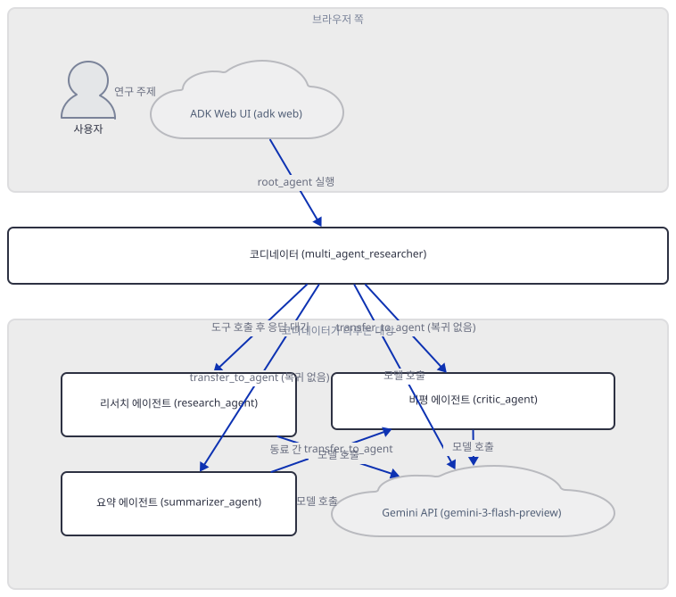
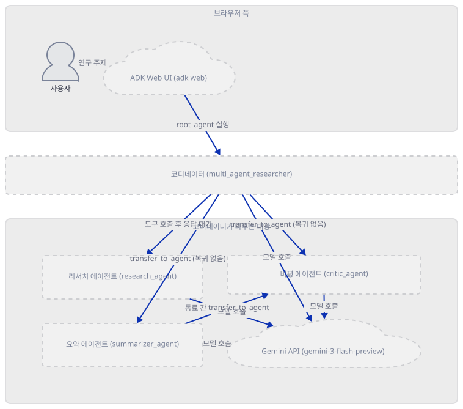
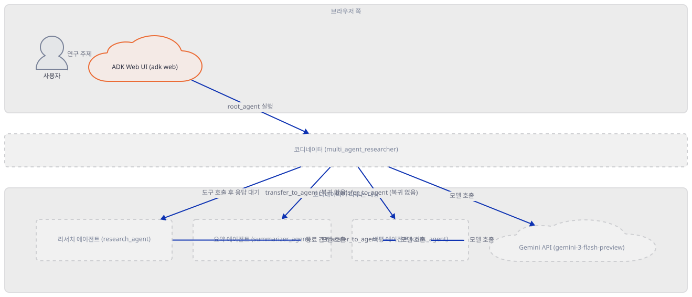
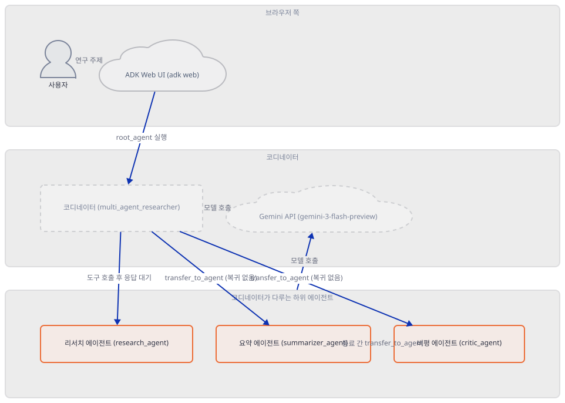
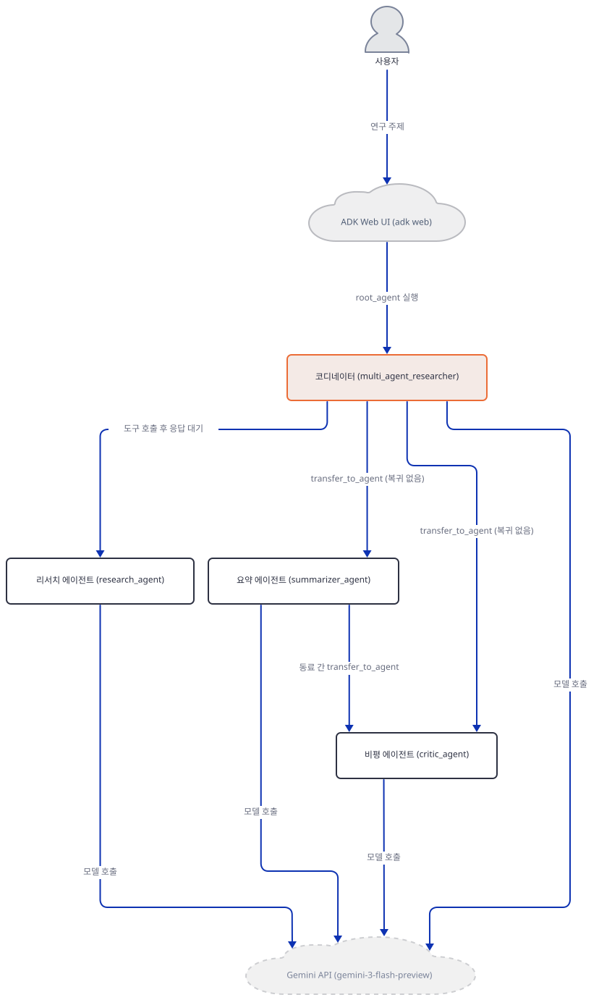
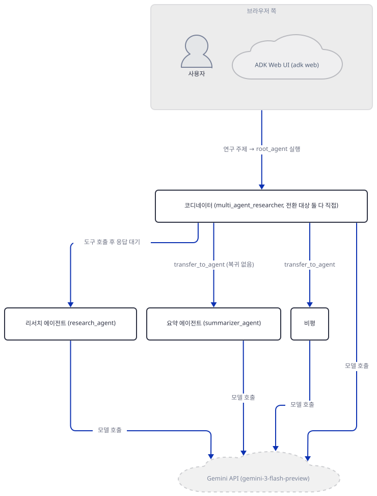
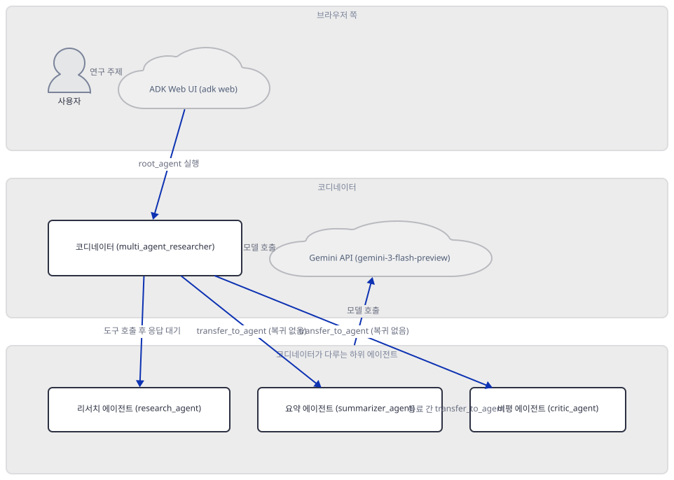
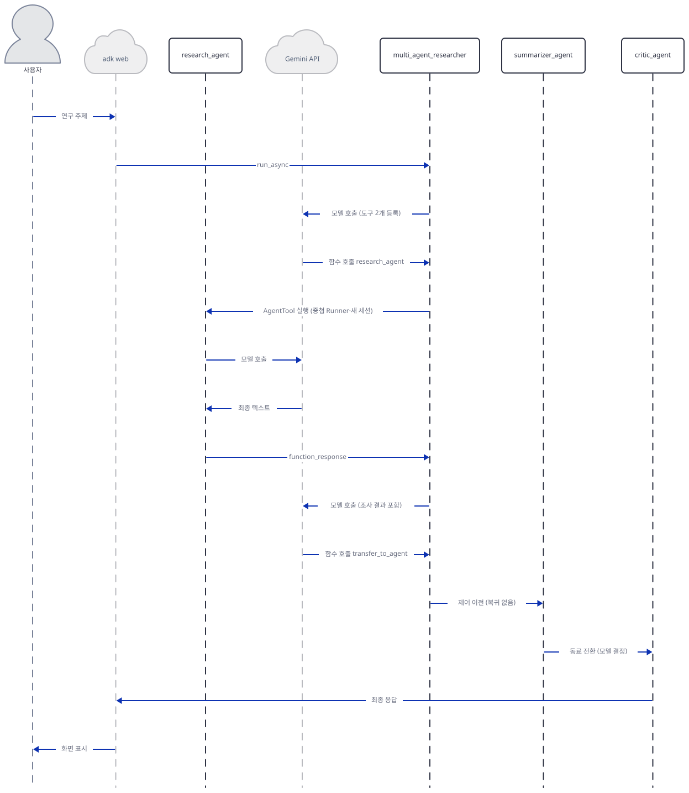

# Day 021 · Google ADK Crash Course · 8_simple_multi_agent

> 볼륨 2 🧑‍🏫 Crash Courses · 난이도 ★★☆ · 예상 소요 65분 · API 비용 $0 (API 키 없이 진행 — 실제 모델 호출은 하지 않습니다) · 원본 앱: `ai_agent_framework_crash_course/google_adk_crash_course/8_simple_multi_agent`

## 오늘 만들 것

Day 019는 `LlmAgent` 하나 안의 세 겹 콜백 중첩을, Day 020은 그 바깥을 두르는 플러그인 한 겹을 다뤘습니다 — 두 날 다 에이전트는 하나뿐이었습니다. 오늘의 `8_simple_multi_agent`는 처음으로 `LlmAgent`가 넷이고, 그 넷이 연결되는 방식이 균일하지 않다는 것이 주제입니다. `agent.py`는 `research_agent`·`summarizer_agent`·`critic_agent`를 정의한 뒤 코디네이터 `root_agent`(실제 이름은 `multi_agent_researcher`)에 두 가지 다른 방법으로 붙입니다 — `summarizer_agent`·`critic_agent`는 `sub_agents=[...]`에, `research_agent`는 `tools=[AgentTool(research_agent)]`에 들어갑니다. 소스를 따라가면 이 둘은 실행 메커니즘 자체가 다릅니다 — 하나는 "호출하고 결과를 돌려받는" 것이고, 다른 하나는 "제어권을 넘기고 돌아오지 않는" 것입니다. 이 문서는 그 차이를 소스와 실제 실행으로 증명하고, 코디네이터의 지시문이 약속하는 "리서치 → 요약 → 비평 → 통합" 순서가 이 구조 위에서 어디까지만 성립하는지 확인합니다. 이 폴더엔 Day 020까지 있던 `app.py`도 없습니다 — 그 자리를 무엇이 대신하는지도 함께 봅니다.



## 사전 준비

| 서비스/도구 | 용도 | 발급·설치 |
|---|---|---|
| Google AI Studio API 키 (`GOOGLE_API_KEY`) | 네 에이전트의 `gemini-3-flash-preview` 호출에 필요. 이 문서는 키 없이 구조와 실행 순서만 확인합니다 | https://aistudio.google.com/ 에서 발급 (이 실습에서는 생략 가능) |
| uv | 가상환경 생성과 패키지 설치 | [공통 사전 준비](../README.md#공통-사전-준비-한-번만) 절 참고 |
| 인터넷 연결 | PyPI에서 `google-adk` 설치 | 별도 설치 없음 |

## 아키텍처 한눈에 보기

| 컴포넌트 | 역할 | 코드 위치 |
|---|---|---|
| 사용자 (브라우저 또는 `curl`) | ADK 웹 UI로 연구 주제 입력 | 코드 없음 (외부 UI) |
| ADK Web UI (`adk web`) | `multi_agent_researcher`를 찾아 `root_agent`를 실행, 세션·이벤트를 HTTP로 중계 | 코드 없음 (google-adk 2.9.2 자체 CLI) |
| `research_agent` (`LlmAgent`) | `google_search`로 조사. 코디네이터의 **도구**로만 호출(호출→응답) | `ai_agent_framework_crash_course/google_adk_crash_course/8_simple_multi_agent/multi_agent_researcher/agent.py:6-21` |
| `summarizer_agent` (`LlmAgent`) | 요약. **하위 에이전트**(`transfer_to_agent`로 위임, 복귀 보장 없음) | `ai_agent_framework_crash_course/google_adk_crash_course/8_simple_multi_agent/multi_agent_researcher/agent.py:23-36` |
| `critic_agent` (`LlmAgent`) | 비평. 역시 하위 에이전트이며 `summarizer_agent`의 동료 | `ai_agent_framework_crash_course/google_adk_crash_course/8_simple_multi_agent/multi_agent_researcher/agent.py:38-51` |
| `root_agent` (`multi_agent_researcher`, `LlmAgent`) | 셋을 두 가지 다른 방식으로 오케스트레이션 | `ai_agent_framework_crash_course/google_adk_crash_course/8_simple_multi_agent/multi_agent_researcher/agent.py:54-85` |
| Gemini API (`gemini-3-flash-preview`) | 네 에이전트의 추론·함수 호출 결정 수행 | 코드 없음 (외부 서비스) |

## 단계별 진행

### Step 1. 환경 만들기 — 의존성 두 줄과 파일 규모

**목적.** 의존성을 설치하고, 이 폴더의 파일 다섯 개가 실제로 몇 줄인지 개행 유무까지 확인합니다.

**할 일.**

```bash
cd ai_agent_framework_crash_course/google_adk_crash_course/8_simple_multi_agent
uv venv
uv pip install -r requirements.txt
```

(pip 대안: `python -m venv .venv && source .venv/bin/activate && pip install -r requirements.txt`. Windows PowerShell은 활성화만 `.venv\Scripts\Activate.ps1`로 바꿉니다.)

이 저장소는 루트에 `pyproject.toml`이 있어 `uv run`이 기본으로 루트 `.venv`를 쓰므로, 이후 모든 `uv run`에 `--no-project`를 붙입니다.

`ai_agent_framework_crash_course/google_adk_crash_course/8_simple_multi_agent/requirements.txt:1-2`

```text
google-adk>=1.9.0
python-dotenv>=1.1.1
```

Day 014~020 중 가장 짧은 `requirements.txt`(두 줄)입니다. `wc -l`이 트레일링 개행 유무에 따라 어긋난다는 것은 Day 019·020에서 확인했으므로, 이 폴더 다섯 파일도 그대로 재봅니다.

```bash
wc -l multi_agent_researcher/agent.py multi_agent_researcher/__init__.py multi_agent_researcher/.env.example README.md requirements.txt
for f in multi_agent_researcher/agent.py multi_agent_researcher/__init__.py multi_agent_researcher/.env.example README.md requirements.txt; do
  tail -c 1 "$f" | xxd | tail -1
done
```

```powershell
Get-Content multi_agent_researcher/agent.py, multi_agent_researcher/__init__.py, multi_agent_researcher/.env.example, README.md, requirements.txt | Measure-Object -Line
```

```
  84 multi_agent_researcher/agent.py
   2 multi_agent_researcher/__init__.py
   2 multi_agent_researcher/.env.example
 128 README.md
   2 requirements.txt
00000000: 29                                       )
00000000: 5d                                       ]
00000000: 22                                       "
00000000: 0a                                       .
00000000: 0a                                       .
```

`agent.py`·`__init__.py`·`.env.example`은 마지막 바이트가 개행이 아니라(`)`·`]`·`"`) `wc -l`이 하나씩 적게 셉니다 — 실제로는 85·3·3줄입니다. `README.md`(128)·`requirements.txt`(2)는 마지막 바이트가 `0a`라 `wc -l` 그대로입니다.



**확인.**

```bash
uv run --no-project python -c "import google.adk, importlib.metadata as md; print('google-adk', google.adk.__version__); print('python-dotenv', md.version('python-dotenv'))"
```

```powershell
uv run --no-project python -c "import google.adk, importlib.metadata as md; print('google-adk', google.adk.__version__); print('python-dotenv', md.version('python-dotenv'))"
```

```
google-adk 2.9.2
python-dotenv 1.2.3
```

(Python 3.12.10 기준 — `uv venv --python 3.12`의 throwaway 가상환경이며, 시스템 기본은 3.13.3입니다. 버전은 Day 019·020과 같습니다.)

### Step 2. 진입점 확인 — `app.py`가 없다, `.env`도 조용히 무시된다

**목적.** `app.py`가 정말 없는지, `agent.py`를 그냥 실행하면 어떻게 되는지, 레슨 README가 안내하는 `.env`가 실제로 읽히는지 확인합니다.

**할 일.** 폴더 구성부터 봅니다.

```bash
ls
find . -iname "app.py"; echo "app.py exit=$?"
grep -n "__main__" multi_agent_researcher/agent.py; echo "__main__ exit=$?"
```

```powershell
Get-ChildItem
Get-ChildItem -Recurse -Filter "app.py"
Select-String -Path multi_agent_researcher/agent.py -Pattern "__main__"
```

```
.env.example  README.md  agent.py  requirements.txt
exit=1
exit=1
```

`app.py`는 어디에도 없고, `agent.py` 85줄에 `if __name__ == "__main__":`도 없습니다(직접 확인) — Day 018~020의 `agent.py`는 이 블록으로 스스로 실행됐지만, 오늘 파일은 `LlmAgent` 네 개를 선언만 합니다. `python agent.py`로 실행할 방법 자체가 없어, 유일한 진입점은 Day 014~017이 쓰던 `adk web`입니다.

`ai_agent_framework_crash_course/google_adk_crash_course/8_simple_multi_agent/multi_agent_researcher/__init__.py:1-3`

```python
from .agent import root_agent  

__all__ = ['root_agent']
```

`root_agent`를 재노출하는 이 파일은 Day 014가 확인했듯 `adk web`의 필수 조건은 아닙니다(암묵적 네임스페이스 패키지). `agent.py`엔 Day 017의 `DEMO_FOLDER` 같은 module-level 부작용이 없어(3줄의 `import`뿐) 리포 경로에서 바로 다룹니다. 레슨 README의 프로젝트 구조 트리는 실제와 다릅니다.

`ai_agent_framework_crash_course/google_adk_crash_course/8_simple_multi_agent/README.md:30-35`

```text
8_simple_multi_agent/
├── README.md                    # This file
├── requirements.txt             # Dependencies
├── multi_agent_researcher/      # Main implementation
│   ├── agent.py                # Multi-agent system (exports root_agent)
└── .env                        # Environment variables (create this)
```

실제 폴더에는 트리에 없는 `__init__.py`·`.env.example`이 있고, 트리의 `.env`는 만들기 전엔 없습니다(직접 확인) — Day 019·020과 같은 종류의 오류입니다. 더 중요한 건 `.env`를 만들어도 `agent.py`가 읽지 못한다는 점입니다: 다른 모든 `agent.py`(Day 018~020, 다음 날 `9_multi_agent_patterns`)는 맨 위에서 `load_dotenv()`를 호출하지만(`grep -rl load_dotenv`가 오늘 것만 빠뜨림, 직접 확인) 오늘 파일엔 그 두 줄이 없어, `.env` 로딩은 오직 `adk web`/`adk run`의 CLI에서만 일어납니다(소스로 확인, `google/adk/cli/utils/envs.py`의 `load_dotenv_for_agent`).



**확인.**

```bash
uv run --no-project python -c "import multi_agent_researcher; print(multi_agent_researcher.root_agent.name)"
```

```powershell
uv run --no-project python -c "import multi_agent_researcher; print(multi_agent_researcher.root_agent.name)"
```

```
multi_agent_researcher
```

(직접 확인 — 임포트만으로는 모델 호출이 없습니다. `root_agent.name`의 값 `"multi_agent_researcher"`는 Step 4·5의 "어디로 위임하는가"에 다시 나옵니다.)

### Step 3. 세 명의 전문가 — 아직은 서로를 모른다

**목적.** `research_agent`·`summarizer_agent`·`critic_agent`가 각각 무엇을 하는 평범한 `LlmAgent`인지 확인합니다. 이 시점에는 셋 다 서로를 참조하지 않습니다.

**할 일.**

`ai_agent_framework_crash_course/google_adk_crash_course/8_simple_multi_agent/multi_agent_researcher/agent.py:6-21`

```python
research_agent = LlmAgent(
    name="research_agent",
    model="gemini-3-flash-preview",
    description="Finds key information and outlines for a given topic.",
    instruction=(
        "You are a focused research specialist. Given a user topic or goal, "
        "conduct thorough research and produce:\n"
        "1. A comprehensive bullet list of key facts and findings\n"
        "2. Relevant sources and references (when available)\n"
        "3. A structured outline for approaching the topic\n"
        "4. Current trends or recent developments\n\n"
        "Keep your research factual, well-organized, and comprehensive. "
        "Use the google_search tool to find current information when needed."
    ),
    tools=[google_search]
)
```

`research_agent`만 `tools=[google_search]`를 갖습니다 — `google.adk.tools.google_search`는 Gemini가 서버 쪽에서 검색을 수행하게 하는 ADK 내장 도구(`GoogleSearchTool` 인스턴스, 직접 확인)입니다. `summarizer_agent`와 `critic_agent`는 도구가 전혀 없고 순수하게 텍스트를 다듬습니다.

`ai_agent_framework_crash_course/google_adk_crash_course/8_simple_multi_agent/multi_agent_researcher/agent.py:23-36`

```python
summarizer_agent = LlmAgent(
    name="summarizer_agent",
    model="gemini-3-flash-preview",
    description="Summarizes research findings clearly and concisely.",
    instruction=(
        "You are a skilled summarizer. Given research findings, create:\n"
        "1. A concise executive summary (2-3 sentences)\n"
        "2. 5-7 key bullet points highlighting the most important information\n"
        "3. A clear takeaway message\n"
        "4. Any critical insights or patterns you notice\n\n"
        "Focus on clarity, relevance, and actionable insights. "
        "Avoid repetition and maintain the logical flow of information."
    ),
)
```

`ai_agent_framework_crash_course/google_adk_crash_course/8_simple_multi_agent/multi_agent_researcher/agent.py:38-51`

```python
critic_agent = LlmAgent(
    name="critic_agent",
    model="gemini-3-flash-preview",
    description="Provides constructive critique and improvement suggestions.",
    instruction=(
        "You are a thoughtful analyst and critic. Given research and summaries, provide:\n"
        "1. **Gap Analysis**: Identify missing information or areas that need more research\n"
        "2. **Risk Assessment**: Highlight potential risks, limitations, or biases\n"
        "3. **Opportunity Identification**: Suggest areas for further exploration or improvement\n"
        "4. **Quality Score**: Rate the overall research quality (1-10) with justification\n"
        "5. **Actionable Recommendations**: Provide specific next steps or improvements\n\n"
        "Be constructive, thorough, and evidence-based in your analysis."
    ),
)
```

세 정의 모두 `name`·`model`·`description`·`instruction`뿐입니다 — `sub_agents`도 `tools`(검색 제외)도, 서로의 이름을 언급하는 문장도 없습니다. "누가 누구에게 무엇을 넘기는가"는 전적으로 다음 스텝, `root_agent`의 선언에서 결정됩니다.



**확인.**

```bash
uv run --no-project python -c "import multi_agent_researcher.agent as m; print([a.name for a in (m.research_agent, m.summarizer_agent, m.critic_agent)]); print('research tools:', [type(t).__name__ for t in m.research_agent.tools]); print('summarizer tools:', m.summarizer_agent.tools); print('critic tools:', m.critic_agent.tools)"
```

```powershell
uv run --no-project python -c "import multi_agent_researcher.agent as m; print([a.name for a in (m.research_agent, m.summarizer_agent, m.critic_agent)]); print('research tools:', [type(t).__name__ for t in m.research_agent.tools]); print('summarizer tools:', m.summarizer_agent.tools); print('critic tools:', m.critic_agent.tools)"
```

```
['research_agent', 'summarizer_agent', 'critic_agent']
research tools: ['GoogleSearchTool']
summarizer tools: []
critic tools: []
```

### Step 4. 코디네이터의 두 가지 위임 — `sub_agents`는 넘겨주고, `AgentTool`은 불러쓴다

**목적.** `root_agent`가 셋을 붙이는 두 줄을 읽고, 실제로 누가 누구에게 "전환(transfer)"할 수 있는지 소스와 실제 객체로 확인합니다.

**할 일.**

`ai_agent_framework_crash_course/google_adk_crash_course/8_simple_multi_agent/multi_agent_researcher/agent.py:83-85`

```python
    sub_agents=[summarizer_agent, critic_agent],
    tools=[AgentTool(research_agent)]
)
```

`summarizer_agent`·`critic_agent`는 `sub_agents=`에, `research_agent`는 `AgentTool(research_agent)`로 감싸여 `tools=`에 들어갑니다. 다음은 google-adk 2.9.2 소스로 확인한 내용입니다 — 이 둘은 실행 메커니즘 자체가 다릅니다.

- **`sub_agents=`**: 생성 시점에 `BaseAgent`(`__set_parent_agent_for_sub_agents`)가 `summarizer_agent.parent_agent`·`critic_agent.parent_agent`를 `root_agent`로 못박습니다. 부모-자식 관계가 있으면 `AutoFlow`(google-adk 기본 흐름, `llm_agent.py`의 `_llm_flow`)가 매 모델 호출 전에 `transfer_to_agent` 함수 도구를 자동으로 얹고(`agent_transfer.py`), 이 도구는 `tool_context.actions.transfer_to_agent = agent_name`을 적을 뿐입니다(`transfer_to_agent_tool.py`) — 그다음부터 **같은 세션 안에서** 지정된 에이전트가 이어받고, 원래 에이전트가 다시 불린다는 보장은 없습니다.
- **`tools=[AgentTool(research_agent)]`**: `research_agent.parent_agent`는 건드리지 않습니다. 호출될 때마다(`agent_tool.py`의 `run_async`) **새 `Runner`와 새 세션**으로 `research_agent`를 끝까지 돌리고, 마지막 텍스트만 함수 응답으로 돌려줍니다 — 코디네이터는 왕복 내내 "실행 중인 에이전트"로 남습니다.

이 차이는 우연이 아닙니다. `research_agent`가 가진 내장 도구 `google_search`에 대해 같은 파일의 `_get_incompatible_builtin_tool_error`는 "전환 대상이 있는 에이전트가 `GoogleSearchTool`도 가지면 Gemini API가 함수 호출(전환)과 함께 허용하지 않는다"고 못박습니다. `research_agent`가 걸리지 않는 건 애초에 전환 대상이 없어서고, `sub_agents`였다면 어땠을지도 별도 객체로(리포 파일은 그대로 두고) 확인합니다.



**확인.** 리포에 실제로 있는 네 에이전트의 부모 관계·전환 대상과, `research_agent`가 만약 `sub_agents`였다면 어땠을지(별도 객체, 리포 파일은 그대로)를 한 스크립트로 봅니다.

```bash
uv run --no-project python -c "
from google.adk.agents import LlmAgent
from google.adk.flows.llm_flows.agent_transfer import _get_transfer_targets, _get_incompatible_builtin_tool_error
from google.adk.tools import google_search
import multi_agent_researcher.agent as m

for a in [m.research_agent, m.summarizer_agent, m.critic_agent, m.root_agent]:
    print(a.name, '| parent:', a.parent_agent.name if a.parent_agent else None,
          '| transfer targets:', [t.name for t in _get_transfer_targets(a)])

alt_summarizer = LlmAgent(name='summarizer_agent', model='gemini-3-flash-preview', description='d', instruction='i')
alt_critic = LlmAgent(name='critic_agent', model='gemini-3-flash-preview', description='d', instruction='i')
alt_research = LlmAgent(name='research_agent', model='gemini-3-flash-preview', description='d', instruction='i', tools=[google_search])
alt_root = LlmAgent(name='alt_root', model='gemini-3-flash-preview', description='d', instruction='i',
                     sub_agents=[alt_research, alt_summarizer, alt_critic])
print('alt_research transfer targets:', [t.name for t in _get_transfer_targets(alt_research)])
print('incompatible tool error:', _get_incompatible_builtin_tool_error(alt_research))
"
```

```powershell
uv run --no-project python -c "<위와 같은 코드>"
```

```
research_agent | parent: None | transfer targets: []
summarizer_agent | parent: multi_agent_researcher | transfer targets: ['multi_agent_researcher', 'critic_agent']
critic_agent | parent: multi_agent_researcher | transfer targets: ['multi_agent_researcher', 'summarizer_agent']
multi_agent_researcher | parent: None | transfer targets: ['summarizer_agent', 'critic_agent']
alt_research transfer targets: ['alt_root', 'summarizer_agent', 'critic_agent']
incompatible tool error: Agent 'research_agent' has sub-agent transfer targets but is configured with GoogleSearchTool without bypass_multi_tools_limit=True. Gemini API does not allow built-in search tools to be combined with function calling (agent delegation). To enable both search and sub-agent delegation, set bypass_multi_tools_limit=True on GoogleSearchTool or VertexAiSearchTool.
```

`research_agent`는 부모도 전환 대상도 없어 — `transfer_to_agent`로는 아무도 옮겨갈 수 **없습니다**. `summarizer_agent`·`critic_agent`는 서로 동료, `multi_agent_researcher`가 부모인 대칭 구조입니다. `sub_agents`로 넣었다면(`alt_research`) 전환 대상은 생기지만 `google_search`와 충돌해, 같은 파일의 `_AgentTransferLlmRequestProcessor.run_async`를 보면 예외 없이 `transfer_to_agent` 도구가 조용히 빠집니다(자신의 `sub_agents`가 비어 있어서) — 들어가면 나갈 수 없는 막다른 골목이 됩니다. `AgentTool`로 감싸면 이 문제 자체가 없습니다.

### Step 5. 실행 순서 확인 — 호출-복귀와 전환을 실제로 돌려본다

**목적.** Gemini 호출은 재현할 수 없으므로 Day 019·020처럼 `before_model_callback`으로 모델 응답을 흉내 내, Step 4가 소스로 확인한 두 메커니즘이 실행에서 어떻게 다르게 나타나는지 봅니다. `agent.py`는 고치지 않고, 임포트한 실제 객체에 콜백만 메모리에서 얹습니다.

**할 일.** 코디네이터가 `research_agent`를 도구로 부른 뒤 `summarizer_agent`로, `summarizer_agent`가 다시 동료 `critic_agent`로 전환하도록 각 `before_model_callback`을 순서대로 흉내 냅니다.



**확인.** 시나리오 A(도구 호출 후 두 번 전환)와 B(전환 없이 바로 답함)를 한 스크립트로 비교합니다. `PYTHONUNBUFFERED=1`은 경고(표준에러)와 `print`(표준출력)가 뒤섞이지 않고 순서대로 나오게 합니다.

```bash
PYTHONUNBUFFERED=1 uv run --no-project python -c "
import asyncio
from typing import Optional
import multi_agent_researcher.agent as m
from google.adk.runners import InMemoryRunner
from google.adk.models.llm_response import LlmResponse
from google.genai import types

def fn_call(name, args):
    return types.Content(role='model', parts=[types.Part(function_call=types.FunctionCall(name=name, args=args))])
def text(t):
    return types.Content(role='model', parts=[types.Part(text=t)])

async def scenario_a():
    print('=== A: research_agent(tool) -> transfer summarizer_agent -> transfer critic_agent ===')
    n = {'root': 0}
    def root_cb(ctx, llm_request) -> Optional[LlmResponse]:
        n['root'] += 1
        print('root_agent before_model#%d tools=%s' % (n['root'], sorted(llm_request.tools_dict.keys())))
        if n['root'] == 1:
            return LlmResponse(content=fn_call('research_agent', {'request': 'find facts about quantum computing'}))
        return LlmResponse(content=fn_call('transfer_to_agent', {'agent_name': 'summarizer_agent'}))
    def research_cb(ctx, llm_request) -> Optional[LlmResponse]:
        print('research_agent before_model (nested Runner)')
        return LlmResponse(content=text('RESEARCH FINDINGS: quantum computing uses qubits.'))
    def summarizer_cb(ctx, llm_request) -> Optional[LlmResponse]:
        print('summarizer_agent before_model tools=%s' % sorted(llm_request.tools_dict.keys()))
        return LlmResponse(content=fn_call('transfer_to_agent', {'agent_name': 'critic_agent'}))
    def critic_cb(ctx, llm_request) -> Optional[LlmResponse]:
        print('critic_agent before_model')
        return LlmResponse(content=text('CRITIQUE: solid summary, add sources.'))
    m.root_agent.before_model_callback = root_cb
    m.research_agent.before_model_callback = research_cb
    m.summarizer_agent.before_model_callback = summarizer_cb
    m.critic_agent.before_model_callback = critic_cb
    runner = InMemoryRunner(agent=m.root_agent, app_name='probe_a')
    await runner.session_service.create_session(app_name='probe_a', user_id='u', session_id='s')
    msg = types.Content(role='user', parts=[types.Part(text='research quantum computing')])
    final_author, final_text = None, None
    async for event in runner.run_async(user_id='u', session_id='s', new_message=msg):
        if event.content and event.content.parts and getattr(event.content.parts[0], 'text', None):
            final_author, final_text = event.author, event.content.parts[0].text
    print('FINAL author:', final_author, '| text:', final_text)

async def scenario_b():
    print()
    print('=== B: summarizer_agent answers directly, never transfers onward ===')
    def root_cb(ctx, llm_request) -> Optional[LlmResponse]:
        return LlmResponse(content=fn_call('transfer_to_agent', {'agent_name': 'summarizer_agent'}))
    def summarizer_cb(ctx, llm_request) -> Optional[LlmResponse]:
        return LlmResponse(content=text('SUMMARY ONLY: done, no further transfer.'))
    def critic_cb(ctx, llm_request) -> Optional[LlmResponse]:
        return LlmResponse(content=text('CRITIQUE: should never be reached.'))
    m.root_agent.before_model_callback = root_cb
    m.summarizer_agent.before_model_callback = summarizer_cb
    m.critic_agent.before_model_callback = critic_cb
    runner = InMemoryRunner(agent=m.root_agent, app_name='probe_b')
    await runner.session_service.create_session(app_name='probe_b', user_id='u', session_id='s')
    msg = types.Content(role='user', parts=[types.Part(text='research quantum computing')])
    authors = []
    async for event in runner.run_async(user_id='u', session_id='s', new_message=msg):
        authors.append(event.author)
    print('authors:', authors)
    print('critic_agent ever ran:', 'critic_agent' in authors)

asyncio.run(scenario_a())
asyncio.run(scenario_b())
" 2>&1 | grep -v "UserWarning\|function_decl ="
```

```powershell
$env:PYTHONUNBUFFERED="1"; uv run --no-project python -c "<위와 같은 코드>"
```

```
=== A: research_agent(tool) -> transfer summarizer_agent -> transfer critic_agent ===
App "probe_a" can transfer between agents but has no context_cache_config. Every transfer swaps the system instruction and the tool set, so the request prefix changes and the whole prompt is re-sent uncached after each transfer. Set context_cache_config on the app to give each agent its own cache.
root_agent before_model#1 tools=['research_agent', 'transfer_to_agent']
research_agent before_model (nested Runner)
root_agent before_model#2 tools=['research_agent', 'transfer_to_agent']
summarizer_agent before_model tools=['transfer_to_agent']
critic_agent before_model
FINAL author: critic_agent | text: CRITIQUE: solid summary, add sources.

=== B: summarizer_agent answers directly, never transfers onward ===
App "probe_b" can transfer between agents but has no context_cache_config. Every transfer swaps the system instruction and the tool set, so the request prefix changes and the whole prompt is re-sent uncached after each transfer. Set context_cache_config on the app to give each agent its own cache.
authors: ['multi_agent_researcher', 'multi_agent_researcher', 'summarizer_agent']
critic_agent ever ran: False
```

A는 셋을 드러냅니다: `root_agent`의 도구 목록엔 매번 `research_agent`(우리 `AgentTool`)와 `transfer_to_agent`가 함께 있고, `research_agent` 호출 후에도 `root_agent before_model#2`가 다시 찍혀 코디네이터는 도구 호출 왕복 내내 "실행 중"이며, `summarizer_agent`의 도구 목록엔 `transfer_to_agent`만 있고 최종 응답의 작성자는 `root_agent`가 아니라 `critic_agent`입니다 — 코디네이터가 약속한 "통합된 최종 보고서 제시"를 마지막으로 전환받은 에이전트가 대신 끝맺은 것입니다. `context_cache_config` 경고는 전환마다 시스템 지시문·도구 목록이 바뀌어 프롬프트가 캐시 없이 매번 재전송된다는 뜻입니다(소스로 확인, `runners.py`의 `_warn_uncached_agent_transfer`) — 비용 함의는 문제 해결 참고. B는 `critic_agent`가 한 번도 실행되지 않고 `root_agent`도 다시 실행되지 않는다는 것을 보여줍니다 — `summarizer_agent`의 텍스트가 곧 최종 응답입니다. Step 4가 소스로 확인한 "전환에는 복귀 보장이 없다"가 실행으로도 그대로 나타난 것입니다: "리서치 → 요약 → 비평 → 통합"은 코드가 강제하는 순서가 아니라 각 에이전트의 지시문이 맞물려야만 성립하는 약속입니다.

### Step 6. `adk web`으로 실행하기 — Streamlit이 없는 자리

**목적.** Day 015~017 이후 다시 `adk web`을 띄워, `/list-apps`가 이 패키지를 찾는지, 키 없이 메시지를 보내면 무엇이 오는지 확인합니다.

**할 일.**

```bash
uv run --no-project adk telemetry disable
uv run --no-project adk web --port 8995 --no_use_local_storage .
```

```powershell
uv run --no-project adk telemetry disable
uv run --no-project adk web --port 8995 --no_use_local_storage .
```

이 폴더엔 Streamlit UI가 없으므로(Step 2) Day 019·020의 "브라우저 채팅창" 대신 ADK 자체 웹 UI(`http://127.0.0.1:8995`)나 `curl`로 접근합니다. `--no_use_local_storage`는 Day 014에서 확인했듯 세션·아티팩트를 파일로 남기지 않는 옵션입니다.



**확인.** 다른 터미널에서 앱 목록과 세션 생성, 그리고 키 없는 메시지 전송을 순서대로 해봅니다.

```bash
curl -s http://127.0.0.1:8995/list-apps
curl -s -X POST http://127.0.0.1:8995/apps/multi_agent_researcher/users/u1/sessions/s1 -H "Content-Type: application/json" -d "{}"
curl -s -o /dev/null -w "%{http_code}\n" -X POST http://127.0.0.1:8995/run -H "Content-Type: application/json" -d '{"appName":"multi_agent_researcher","userId":"u1","sessionId":"s1","newMessage":{"role":"user","parts":[{"text":"research quantum computing"}]}}'
curl -s -o /dev/null -w "list-apps 재확인: %{http_code}\n" http://127.0.0.1:8995/list-apps
```

```powershell
curl.exe -s http://127.0.0.1:8995/list-apps
curl.exe -s -X POST http://127.0.0.1:8995/apps/multi_agent_researcher/users/u1/sessions/s1 -H "Content-Type: application/json" -d "{}"
curl.exe -s -o NUL -w "%{http_code}`n" -X POST http://127.0.0.1:8995/run -H "Content-Type: application/json" -d '{"appName":"multi_agent_researcher","userId":"u1","sessionId":"s1","newMessage":{"role":"user","parts":[{"text":"research quantum computing"}]}}'
curl.exe -s -o NUL -w "list-apps 재확인: %{http_code}`n" http://127.0.0.1:8995/list-apps
```

```
["multi_agent_researcher"]
{"id":"s1","appName":"multi_agent_researcher","userId":"u1","state":{},"events":[],"lastUpdateTime":1789996072.6136792}
500
list-apps 재확인: 200
```

`/list-apps`는 `multi_agent_researcher`를 정확히 찾아냅니다. `/run`은 HTTP 500 "Internal Server Error"만 돌려주고 서버는 죽지 않습니다(직접 확인, `/list-apps` 재확인도 200) — Day 014가 단일 에이전트로 확인한 것과 같은 경계입니다(`google-genai`의 `Client` 생성자가 던진 `ValueError`를 ADK가 HTTP 500으로만 감쌈). 진짜 원인은 서버 터미널 로그에만 있습니다.

```
ValueError: No API key was provided. Please pass a valid API key. Learn how to create an API key at https://ai.google.dev/gemini-api/docs/api-key.
```

(전체 트레이스백은 `google/genai/_api_client.py`의 `BaseApiClient.__init__`에서 끝납니다 — 마지막 줄만 발췌했습니다.) 이 실패는 에이전트가 하나든 넷이든 같은 지점(클라이언트 생성)에서 납니다. 참고로 `Runner`를 직접 구동해(Day 019·020 방식, 이벤트를 끝까지 소비) 같은 상황을 재현하면 서버가 아니라 스크립트 자체가 종료 코드 1로 죽습니다(직접 확인) — `adk web`은 그 예외를 요청 단위로만 가두는 별도의 경계라는 뜻입니다.

## 요청 한 건이 흐르는 과정



사용자가 연구 주제를 보내면 `adk web`이 `root_agent`의 `run_async`를 시작합니다. 코디네이터의 첫 모델 호출엔 `research_agent`(도구)와 `transfer_to_agent`(전환)가 함께 실려 있습니다 — 모델이 `research_agent`를 부르면 `AgentTool`이 새 `Runner`로 조사를 끝까지 돌리고, 병합한 텍스트만 함수 응답으로 돌려줍니다. 코디네이터는 이 왕복 동안 같은 에이전트로 남아 다음 호출에선 `transfer_to_agent(agent_name="summarizer_agent")`를 선택합니다. 여기서부터는 왕복이 아니라 이관입니다 — 제어가 `summarizer_agent`로 넘어가고 코디네이터가 다시 불린다는 보장은 없습니다. `summarizer_agent`는 동료 `critic_agent`로 한 번 더 전환할 수 있고(부모 대신 동료를 고르는 것도 유효합니다), 마지막으로 응답한 에이전트의 텍스트가 그대로 사용자에게 갑니다. Step 5가 확인했듯, 이 사슬 중 하나라도 전환 없이 그냥 답하면 그 뒤는 전부 생략됩니다.

## 실행 체크리스트

- [ ] `requirements.txt` 두 줄, `google-adk`·`python-dotenv` 버전이 Day 019·020과 같음을 확인했다
- [ ] 다섯 파일의 실제 줄 수(85·3·3·128·2)가 `wc -l`과 다름을 개행 바이트로 확인했다
- [ ] `app.py`도 `__main__` 블록도 없어 `adk web`이 유일한 실행 경로임을 확인했다
- [ ] `agent.py`에 `load_dotenv()`가 없어 `.env`는 `adk web`을 거쳐야만 반영됨을 확인했다
- [ ] `research_agent`는 부모도 전환 대상도 없고, `summarizer_agent`·`critic_agent`는 서로 동료이자 코디네이터의 자식임을 `_get_transfer_targets`로 확인했다
- [ ] `AgentTool`은 새 `Runner`로 도구처럼 호출-복귀하지만 `transfer_to_agent`는 복귀를 보장하지 않음을 스텁 실행으로 확인했다
- [ ] 하위 에이전트가 전환 없이 바로 답하면 이후 에이전트가 전혀 실행되지 않음을 확인했다
- [ ] 키 없이 `/run`을 호출하면 HTTP 500이 오지만 서버는 죽지 않음을 확인했다

## 문제 해결

| 증상 | 원인 | 해결 |
|---|---|---|
| 레슨 README의 "Project Structure" 트리에 `__init__.py`·`.env.example`이 없고 없는 `.env`가 있음 | 레슨 자신의 README가 실제 폴더 구성과 다르다(직접 확인, Day 019·020과 같은 종류의 오류) | 실제 `ls`/`Get-ChildItem` 결과를 신뢰한다 |
| `.env`에 실제 키를 넣어도 `agent.py`를 직접 임포트해 `Runner`를 돌리면 키가 반영되지 않음 | `agent.py`에 `load_dotenv()`가 없다 — 이 크래시 코스에서 유일한 예외(직접 확인, Step 2) | `adk web`/`adk run`으로 실행한다(둘 다 자체적으로 `.env`를 읽음). 직접 구동하려면 `load_dotenv()`를 호출하거나 환경변수를 export |
| 키 없이 `/run`을 호출하면 응답 본문이 `Internal Server Error`뿐이고 원인이 안 보임 | `google-genai`의 `Client` 생성자가 던지는 `ValueError`를 `adk web`이 HTTP 500으로만 반환한다(Day 014와 같은 경계, 직접 확인) | 서버 터미널 로그에서 실제 예외를 확인하거나, `.env`에 유효한 키를 넣고 서버 재시작 |
| 직접 `Runner`를 구동하면 `"App ... has no context_cache_config"` 경고가 뜸 | 전환마다 프롬프트가 캐시 없이 재전송된다는 뜻(Step 5 참고, 소스로 확인 `runners.py`의 `_warn_uncached_agent_transfer`) | 학습 목적에서는 무시해도 되지만, 실제 배포라면 `context_cache_config` 설정을 고려 |

## 더 해보기

- `research_agent`를 `AgentTool` 대신 `root_agent`의 `sub_agents`에 직접 넣도록 사본을 고쳐(`ai_agent_framework_crash_course/google_adk_crash_course/8_simple_multi_agent/multi_agent_researcher/agent.py:83-84` 참고), Step 4가 별도 객체로만 확인한 "막다른 골목"이 실제 패키지에서도 나오는지, `GoogleSearchTool(bypass_multi_tools_limit=True)`로 바꾸면 사라지는지 확인해보기
- `critic_agent`의 지시문(`ai_agent_framework_crash_course/google_adk_crash_course/8_simple_multi_agent/multi_agent_researcher/agent.py:42-49`) 끝에 "다 끝나면 `transfer_to_agent`로 부모에게 돌아가라"는 문장을 사본에 추가해, Step 5의 "복귀 없음"이 프롬프트 한 줄로 바뀌는지 실험해보기

## 다음 날 예고

Day 022 · Google ADK Crash Course · 9_multi_agent_patterns — `SequentialAgent`·`LoopAgent`·`ParallelAgent`처럼 전환에 기대지 않고 실행 순서 자체를 구조로 강제하는 워크플로 에이전트를 다룹니다.
