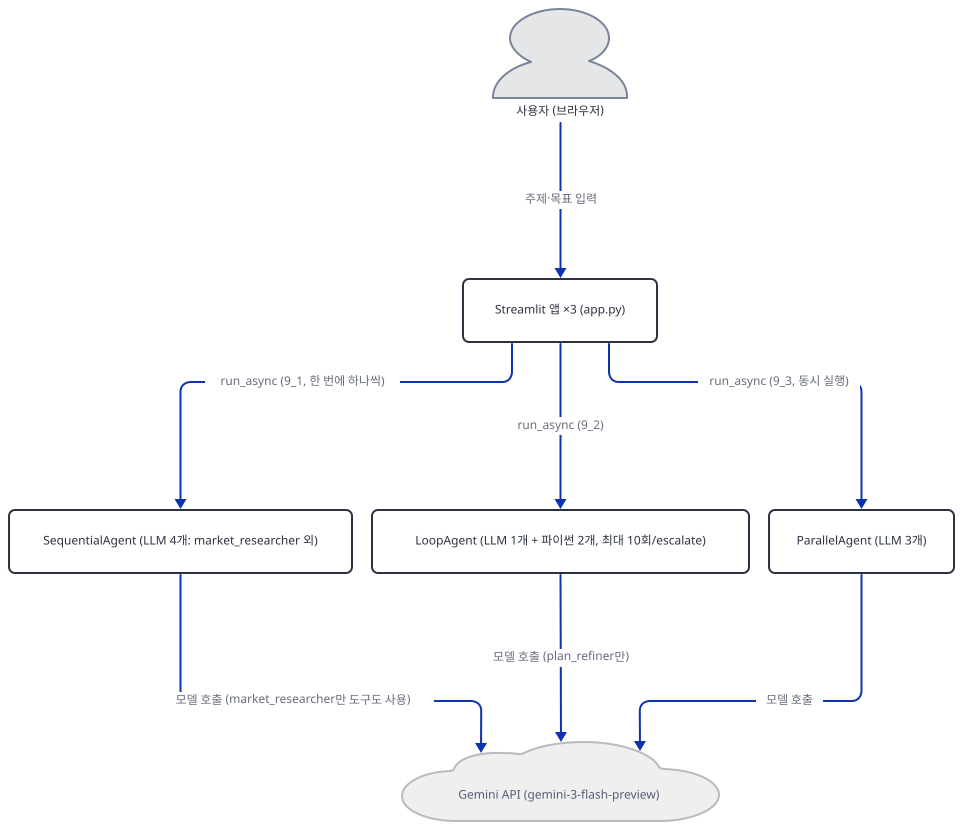
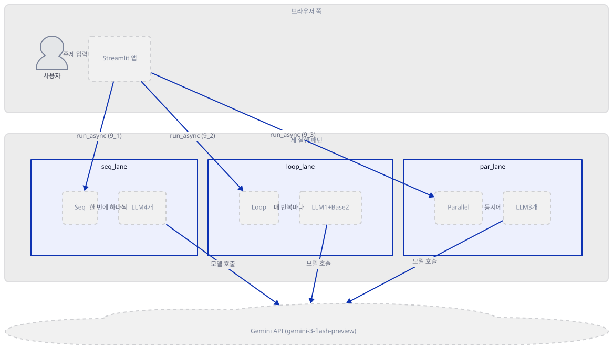
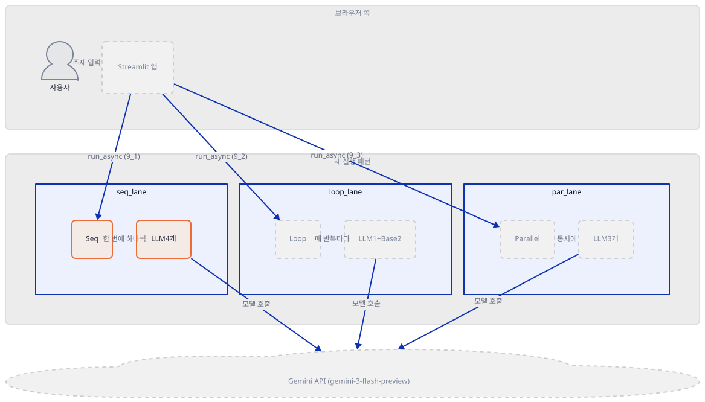
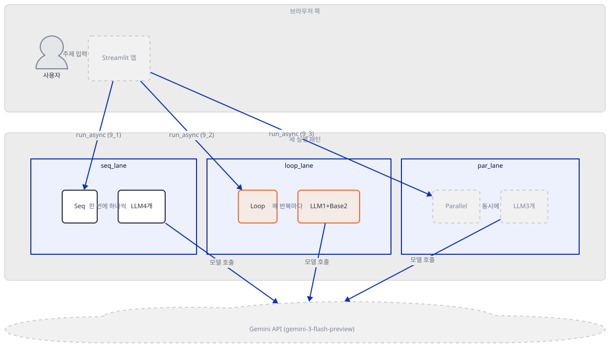
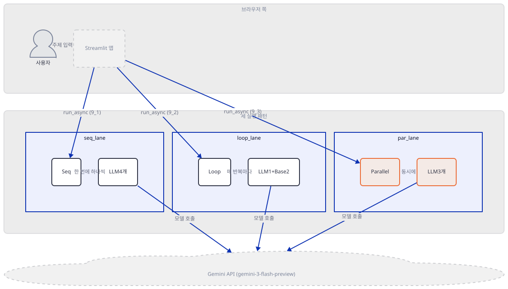
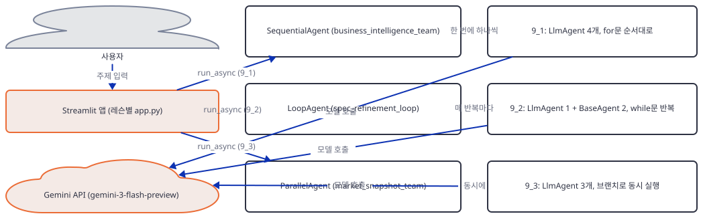
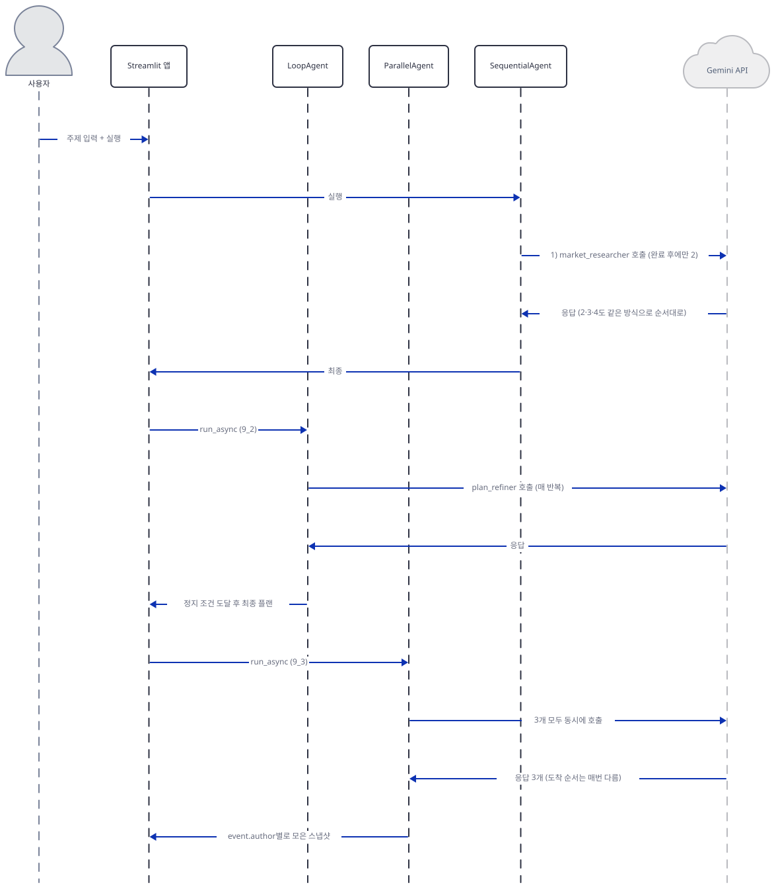

# Day 022 · Google ADK Crash Course · 9_multi_agent_patterns

> 볼륨 2 🧑‍🏫 Crash Courses · 난이도 ★★☆ ⚠ · 예상 소요 105분(하위 레슨 세 개 각각의 `agent.py`와, `SequentialAgent`·`LoopAgent`·`ParallelAgent` 세 클래스의 google-adk 소스까지 모두 추적해 다른 크래시 코스 날보다 깁니다) · API 비용 $0 (API 키 없이 진행 — 실제 모델 호출은 하지 않았습니다) · 원본 앱: `ai_agent_framework_crash_course/google_adk_crash_course/9_multi_agent_patterns`

## 오늘 만들 것

Day 021은 코디네이터 하나가 `sub_agents=`와 `AgentTool` 두 가지 방법으로 세 에이전트를 부리는 법을 다뤘습니다 — 하나는 `transfer_to_agent`로 넘기고 돌아오지 않는 이관이었고, 하나는 새 `Runner`로 호출하고 돌아오는 도구 호출이었습니다. 오늘의 `9_multi_agent_patterns`는 그 두 메커니즘을 아예 쓰지 않는 세 번째 방식 — 실행 순서 자체를 파이썬 제어 구조로 못박는 **워크플로 에이전트** `SequentialAgent`·`LoopAgent`·`ParallelAgent`를 다룹니다. 세 클래스는 서로 다른 서브폴더(`9_1_sequential_agent`·`9_2_loop_agent`·`9_3_parallel_agent`)에 하나씩 있고, 각자 `agent.py`(157·222·116줄)와 독자적인 Streamlit `app.py`를 갖춘 별개의 실행 가능한 앱입니다. 셋 다 `LlmAgent`가 아니라 `BaseAgent`를 직접 상속합니다 — 그래서 Day 021이 확인한 "부모가 있으면 `transfer_to_agent`가 자동으로 붙는다"는 `AutoFlow`의 규칙이 이 세 클래스의 자식들에게는 애초에 적용되지 않는다는 것을 이 문서가 실행으로 증명합니다. 대신 순서를 정하는 것은 `SequentialAgent`의 `for`문, `LoopAgent`의 `while`+`for`문, `ParallelAgent`의 `asyncio.TaskGroup` 기반 브랜치 분기입니다. 그리고 이 세 클래스는 이미 google-adk 2.9.2 안에서 `DeprecationWarning`을 내는 폐기 예고 상태입니다(직접 확인) — 후속 API `Workflow`로 대체될 예정이지만 이 버전에서는 정상 동작하므로 리포 코드는 고치지 않고 이 사실만 짚습니다. 세 앱 각각의 소스와 레슨 자신의 README·코드 주석이 실제로 하는 말이 늘 일치하지도 않습니다 — `9_2_loop_agent`엔 `requirements.txt`가 없고, `9_3_parallel_agent`의 코드 주석과 README는 있지도 않은 `output_key` 공유를 설명합니다. 이런 어긋남을 Step마다 소스와 실행으로 직접 확인합니다.



## 사전 준비

| 서비스/도구 | 용도 | 발급·설치 |
|---|---|---|
| Google AI Studio API 키 (`GOOGLE_API_KEY`) | 아홉 `LlmAgent` 전부의 `gemini-3-flash-preview` 호출에 필요. 이 문서는 키 없이 구조와 실행 순서만 확인합니다 | https://aistudio.google.com/ 에서 발급 (이 실습에서는 생략 가능) |
| uv | 가상환경 생성과 패키지 설치 | [공통 사전 준비](../README.md#공통-사전-준비-한-번만) 절 참고 |
| 인터넷 연결 | PyPI에서 `google-adk`·`streamlit` 설치 | 별도 설치 없음 |

## 아키텍처 한눈에 보기

| 컴포넌트 | 역할 | 코드 위치 |
|---|---|---|
| 사용자 (브라우저) | 레슨별 Streamlit 앱에 주제·목표 입력 | 코드 없음 (외부 UI) |
| Streamlit 앱 (`app.py` × 3) | 세 레슨을 각각 독립 실행하는 UI, 결과·반복 횟수 표시 | `ai_agent_framework_crash_course/google_adk_crash_course/9_multi_agent_patterns/9_1_sequential_agent/app.py`, `.../9_2_loop_agent/app.py`, `.../9_3_parallel_agent/app.py` |
| `business_intelligence_team` (`SequentialAgent`) | `LlmAgent` 4개를 선언 순서대로 하나씩 끝까지 실행 | `ai_agent_framework_crash_course/google_adk_crash_course/9_multi_agent_patterns/9_1_sequential_agent/agent.py:92-101` |
| `spec_refinement_loop` (`LoopAgent`) | `LlmAgent` 1개 + `BaseAgent` 2개를 한 바퀴로 묶어 반복 | `ai_agent_framework_crash_course/google_adk_crash_course/9_multi_agent_patterns/9_2_loop_agent/agent.py:100-112` |
| `market_snapshot_team` (`ParallelAgent`) | `LlmAgent` 3개를 별도 브랜치에서 동시에 실행 | `ai_agent_framework_crash_course/google_adk_crash_course/9_multi_agent_patterns/9_3_parallel_agent/agent.py:41-49` |
| Gemini API (`gemini-3-flash-preview`) | 아홉 `LlmAgent`의 추론 수행. `IncrementIteration`·`CheckCompletion`은 순수 파이썬이라 모델을 부르지 않음 | 코드 없음 (외부 서비스) |

## 단계별 진행

### Step 1. 환경 만들기 — 세 폴더, 하나의 구멍, 그리고 이미 폐기 예고인 세 클래스

**목적.** 세 하위 레슨의 의존성을 설치하고 파일 규모를 바이트 단위로 확인하며, `SequentialAgent`·`LoopAgent`·`ParallelAgent`가 설치된 google-adk 버전에서 실제로 어떤 상태인지 미리 확인합니다.

**할 일.**

```bash
cd ai_agent_framework_crash_course/google_adk_crash_course/9_multi_agent_patterns/9_1_sequential_agent
uv venv
uv pip install -r requirements.txt
```

(pip 대안: `python -m venv .venv && source .venv/bin/activate && pip install -r requirements.txt`. Windows PowerShell은 활성화만 `.venv\Scripts\Activate.ps1`로 바꿉니다.)

이 저장소는 루트에 `pyproject.toml`이 있어 `uv run`이 기본으로 루트 `.venv`를 쓰므로, 이후 모든 `uv run`에 `--no-project`를 붙입니다.

`ai_agent_framework_crash_course/google_adk_crash_course/9_multi_agent_patterns/9_1_sequential_agent/requirements.txt:1-4`

```text
google-adk>=1.9.0
streamlit>=1.28.0
python-dotenv>=1.1.1
pydantic>=2.0.0
```

`9_3_parallel_agent/requirements.txt`도 같은 네 줄의 의존성을 담고 있지만, 끝에 빈 줄이 하나 더 있어 `wc -l`은 5를 돌려줍니다(직접 확인). 그런데 `9_2_loop_agent`엔 `requirements.txt`가 아예 없습니다(직접 확인, `ls`로 대조) — 세 폴더 중 유일하게 의존성 목록이 빠진 폴더입니다. 레슨 자신의 README가 이 구멍을 알고 우회합니다.

`ai_agent_framework_crash_course/google_adk_crash_course/9_multi_agent_patterns/9_2_loop_agent/README.md:37-38`

```text
cd "9_2_loop agent"
pip install -r ../9_1_sequential_agent/requirements.txt
```

`9_2_loop_agent`의 실제 코드가 필요로 하는 것은 `9_1`과 완전히 같은 네 패키지(`google-adk`·`streamlit`·`python-dotenv`·`pydantic`, 소스로 확인 — `import` 구문이 겹칩니다)이므로 이 우회는 실제로 맞습니다. 이 문서도 같은 방식으로, `9_1`에서 만든 환경 하나를 세 폴더 모두에 재사용합니다(폴더 이름에 공백이 섞인 `"9_2_loop agent"`라는 README의 인용은 실제 폴더명 `9_2_loop_agent`와 다릅니다 — 밑줄입니다, 직접 확인).

이제 다섯 파일씩 세 벌, 총 열네 파일의 실제 줄 수를 봅니다. `wc -l`이 트레일링 개행 유무에 따라 어긋난다는 것은 Day 019~021에서 이미 확인했습니다.

```bash
cd ai_agent_framework_crash_course/google_adk_crash_course/9_multi_agent_patterns
wc -l 9_1_sequential_agent/agent.py 9_1_sequential_agent/app.py 9_1_sequential_agent/README.md 9_1_sequential_agent/requirements.txt 9_1_sequential_agent/.env.example
wc -l 9_2_loop_agent/agent.py 9_2_loop_agent/app.py 9_2_loop_agent/README.md 9_2_loop_agent/.env.example
wc -l 9_3_parallel_agent/agent.py 9_3_parallel_agent/app.py 9_3_parallel_agent/README.md 9_3_parallel_agent/requirements.txt 9_3_parallel_agent/.env.example
for f in 9_1_sequential_agent/.env.example 9_2_loop_agent/.env.example 9_3_parallel_agent/.env.example; do
  tail -c 1 "$f" | xxd | tail -1
done
```

```powershell
Get-Content 9_1_sequential_agent\agent.py, 9_1_sequential_agent\app.py, 9_1_sequential_agent\README.md, 9_1_sequential_agent\requirements.txt, 9_1_sequential_agent\.env.example | Measure-Object -Line
```

```
 157 9_1_sequential_agent/agent.py
 112 9_1_sequential_agent/app.py
 146 9_1_sequential_agent/README.md
   4 9_1_sequential_agent/requirements.txt
   2 9_1_sequential_agent/.env.example
 222 9_2_loop_agent/agent.py
  76 9_2_loop_agent/app.py
  87 9_2_loop_agent/README.md
   2 9_2_loop_agent/.env.example
 116 9_3_parallel_agent/agent.py
  62 9_3_parallel_agent/app.py
  75 9_3_parallel_agent/README.md
   5 9_3_parallel_agent/requirements.txt
   2 9_3_parallel_agent/.env.example
00000000: 22                                       "
00000000: 22                                       "
00000000: 22                                       "
```

Day 021의 다섯 파일은 `agent.py`·`__init__.py`·`.env.example`이 나란히 개행 없이 끝나 `wc -l`이 전부 어긋났지만, 오늘은 다릅니다: `agent.py`·`app.py`·`README.md`·`requirements.txt` 열한 개는 마지막 바이트가 전부 개행(`0a`)이라 `wc -l` 숫자가 그대로 맞습니다(직접 확인, 위 표의 네 파일 종류는 모두 정확). 어긋나는 것은 `.env.example` 세 개뿐입니다 — 마지막 바이트가 개행이 아니라 `"`(`22`)라서 실제로는 표시된 2줄이 아니라 3줄입니다(`GOOGLE_API_KEY="your-api-key"`로 끝나고 개행이 없습니다).

이 폴더는 `load_dotenv()` 호출 여부도 Day 021과 다릅니다. Day 021은 `8_simple_multi_agent`의 `agent.py`만 이 두 줄이 없는 이 크래시 코스의 유일한 예외라고 밝혔고, 오늘 폴더들은 다시 호출한다고 미리 적어 두었습니다 — 직접 확인해 보면 정확히 그렇습니다.

`ai_agent_framework_crash_course/google_adk_crash_course/9_multi_agent_patterns/9_1_sequential_agent/agent.py:1-13`

```python
import os
import asyncio
import inspect
from dotenv import load_dotenv
from google.adk.agents import LlmAgent, SequentialAgent
from google.adk.tools import google_search
from google.adk.tools.agent_tool import AgentTool
from google.adk.sessions import InMemorySessionService
from google.adk.runners import Runner
from google.genai import types

# Load environment variables
load_dotenv()
```

`9_2_loop_agent/agent.py`·`9_3_parallel_agent/agent.py`도 소스로 확인하면 최상단에 같은 `from dotenv import load_dotenv`와 `load_dotenv()`가 있습니다.



**확인.** 설치된 버전과, 오늘 다룰 세 클래스가 이 버전에서 정말 폐기 예고 상태인지를 한 번에 봅니다.

```bash
uv run --no-project python -c "
import google.adk, importlib.metadata as md
print('google-adk', google.adk.__version__)
print('python-dotenv', md.version('python-dotenv'))
print('streamlit', md.version('streamlit'))
print('pydantic', md.version('pydantic'))
"
uv run --no-project python -c "
import warnings
from google.adk.agents import SequentialAgent, LoopAgent, ParallelAgent
with warnings.catch_warnings(record=True) as w:
    warnings.simplefilter('always')
    SequentialAgent(name='x', sub_agents=[])
    LoopAgent(name='y', sub_agents=[])
    ParallelAgent(name='z', sub_agents=[])
    for warning in w:
        print(warning.category.__name__, ':', str(warning.message))
"
```

```powershell
uv run --no-project python -c "<위와 같은 코드>"
```

```
google-adk 2.9.2
python-dotenv 1.2.3
streamlit 1.64.0
pydantic 2.13.5
DeprecationWarning : SequentialAgent is deprecated in favor of Workflow and will be removed in a future version. Workflow cannot yet be used as an LlmAgent sub-agent.
DeprecationWarning : LoopAgent is deprecated in favor of Workflow and will be removed in a future version. Workflow cannot yet be used as an LlmAgent sub-agent.
DeprecationWarning : ParallelAgent is deprecated in favor of Workflow and will be removed in a future version. Workflow cannot yet be used as an LlmAgent sub-agent.
```

(직접 확인 — 버전은 Day 019~021과 같은 google-adk 2.9.2입니다. `warnings.simplefilter('always')`로 강제하지 않으면 파이썬 기본 필터가 `__main__` 바깥에서 발생한 `DeprecationWarning`을 조용히 삼키므로, 세 클래스를 그냥 임포트만 해서는 이 경고가 보이지 않습니다 — 세 `agent.py`를 평소처럼 실행하면 이 경고가 화면에 나타나지 않는 이유입니다.)

### Step 2. `SequentialAgent` — 순서를 강제하는 것은 대화가 아니라 `for`문

**목적.** `business_intelligence_team`이 4개 `LlmAgent`를 어떤 순서로, 무엇에 기대어 실행하는지 소스와 실행으로 확인합니다.

**할 일.**

`ai_agent_framework_crash_course/google_adk_crash_course/9_multi_agent_patterns/9_1_sequential_agent/agent.py:33-47`

```python
market_researcher = LlmAgent(
    name="market_researcher",
    model="gemini-3-flash-preview",
    description="Conducts market research and competitive analysis using search capabilities",
    instruction=(
        "You are a market research specialist. Given a business topic:\n"
        "1. Use the search_agent to gather current market information\n"
        "2. Identify key competitors and their market position\n"
        "3. Analyze current market trends and opportunities\n"
        "4. Provide industry insights and market size estimates\n"
        "5. Synthesize search results into comprehensive market analysis\n\n"
        "Provide a comprehensive analysis in clear, structured format based on current web research."
    ),
    tools=[AgentTool(search_agent)]
)
```

`market_researcher`가 `search_agent`를 `AgentTool`로 감싸 도구처럼 부르는 방식은 Day 021이 이미 소스와 실행으로 증명한 바로 그 메커니즘입니다 — 새 `Runner`로 끝까지 돌리고 마지막 텍스트만 돌려받는 호출-복귀이며, 오늘 다시 증명하지 않습니다. 오늘 새로운 것은 `market_researcher` 자신이 다른 세 `LlmAgent`(`swot_analyzer`·`strategy_formulator`·`implementation_planner`, 각각 도구도 `sub_agents`도 없는 평범한 `LlmAgent`)와 함께 어떻게 묶이는가입니다.

`ai_agent_framework_crash_course/google_adk_crash_course/9_multi_agent_patterns/9_1_sequential_agent/agent.py:92-101`

```python
business_intelligence_team = SequentialAgent(
    name="business_intelligence_team",
    description="Sequentially processes business intelligence through research, analysis, strategy, and planning",
    sub_agents=[
        market_researcher,      # Step 1: Market research (with search capabilities)
        swot_analyzer,          # Step 2: SWOT analysis
        strategy_formulator,    # Step 3: Strategy development
        implementation_planner  # Step 4: Implementation planning
    ]
)
```

`SequentialAgent`도 `sub_agents=`를 받지만, Day 021의 `multi_agent_researcher`(`LlmAgent`)가 받던 것과 같은 이름일 뿐 의미가 다릅니다. google-adk 2.9.2 소스로 확인하면(`google/adk/agents/sequential_agent.py`) `SequentialAgent._run_async_impl`은 `self.sub_agents`를 인덱스로 순회하는 평범한 파이썬 `for`문이며, 매 `i`마다 `sub_agent.run_async(ctx)`를 **완전히 끝까지** 소비한 뒤에야 `i+1`로 넘어갑니다. 넷 다 같은 `ctx`(같은 세션)를 공유하므로 뒤 에이전트는 앞 에이전트가 세션에 남긴 대화 기록을 그대로 봅니다 — 하지만 "본다"와 "이관받는다"는 다릅니다. `SequentialAgent`는 `LlmAgent`가 아니라 `BaseAgent`를 직접 상속하므로 `disallow_transfer_to_parent` 같은 필드 자체가 없고, Day 021이 확인한 `_get_transfer_targets`(`google/adk/flows/llm_flows/agent_transfer.py`)는 부모가 이 필드를 갖고 있을 때만 형제·부모를 전환 대상에 넣습니다 — `market_researcher`의 부모는 `SequentialAgent`이므로 이 조건이 애초에 성립하지 않습니다. 즉 네 자식 중 누구도 `transfer_to_agent`로 서로에게 건너뛸 수 없습니다: 순서를 어기는 것 자체가 메커니즘상 불가능합니다.



**확인.** 네 자식의 전환 대상과, 코디네이터 없이 진행되는 실행 순서를 Day 019~021과 같은 `before_model_callback` 스텁으로 확인합니다.

```bash
uv run --no-project python -c "
import asyncio
from typing import Optional
import agent as m
from google.adk.runners import InMemoryRunner
from google.adk.models.llm_response import LlmResponse
from google.adk.flows.llm_flows.agent_transfer import _get_transfer_targets
from google.genai import types

def text(t):
    return types.Content(role='model', parts=[types.Part(text=t)])

def make_cb(name):
    def cb(ctx, llm_request) -> Optional[LlmResponse]:
        print(name, 'before_model tools=', sorted(llm_request.tools_dict.keys()))
        return LlmResponse(content=text(f'[{name} OUTPUT]'))
    return cb

for a in [m.market_researcher, m.swot_analyzer, m.strategy_formulator, m.implementation_planner]:
    a.before_model_callback = make_cb(a.name)
    print(a.name, '| parent:', a.parent_agent.name, '| transfer targets:', [t.name for t in _get_transfer_targets(a)])

async def main():
    runner = InMemoryRunner(agent=m.business_intelligence_team, app_name='probe')
    await runner.session_service.create_session(app_name='probe', user_id='u', session_id='s')
    msg = types.Content(role='user', parts=[types.Part(text='analyze widget business')])
    authors = []
    async for event in runner.run_async(user_id='u', session_id='s', new_message=msg):
        if event.content and event.content.parts and getattr(event.content.parts[0], 'text', None):
            authors.append(event.author)
    print('event author order:', authors)

asyncio.run(main())
"
```

```powershell
uv run --no-project python -c "<위와 같은 코드>"
```

```
market_researcher | parent: business_intelligence_team | transfer targets: []
swot_analyzer | parent: business_intelligence_team | transfer targets: []
strategy_formulator | parent: business_intelligence_team | transfer targets: []
implementation_planner | parent: business_intelligence_team | transfer targets: []
market_researcher before_model tools= ['search_agent']
swot_analyzer before_model tools= []
strategy_formulator before_model tools= []
implementation_planner before_model tools= []
event author order: ['market_researcher', 'swot_analyzer', 'strategy_formulator', 'implementation_planner']
```

(직접 확인 — 네 전환 대상이 전부 빈 리스트이고, `market_researcher`를 뺀 나머지는 도구가 하나도 없어 `transfer_to_agent`가 실릴 자리 자체가 없습니다. 이벤트 작성자 순서도 선언 순서와 정확히 같습니다.)

### Step 3. `LoopAgent` — 반복은 `while`문, 정지는 두 겹

**목적.** `spec_refinement_loop`가 매 반복마다 무엇을 실행하는지, 그리고 무엇이 반복을 멈추는지 소스와 실행으로 확인합니다.

**할 일.**

`ai_agent_framework_crash_course/google_adk_crash_course/9_multi_agent_patterns/9_2_loop_agent/agent.py:43-57`

```python
class IncrementIteration(BaseAgent):
    async def _run_async_impl(self, ctx: InvocationContext) -> AsyncGenerator[Event, None]:
        current_iteration = int(ctx.session.state.get("iteration", 0)) + 1
        ctx.session.state["iteration"] = current_iteration
        yield Event(
            author=self.name,
            content=types.Content(
                role="model",
                parts=[
                    types.Part(
                        text=f"Iteration advanced to {current_iteration}"
                    )
                ],
            ),
        )
```

`ai_agent_framework_crash_course/google_adk_crash_course/9_multi_agent_patterns/9_2_loop_agent/agent.py:64-88`

```python
class CheckCompletion(BaseAgent):
    async def _run_async_impl(self, ctx: InvocationContext) -> AsyncGenerator[Event, None]:
        target_iterations = int(ctx.session.state.get("target_iterations", 3))
        current_iteration = int(ctx.session.state.get("iteration", 0))
        accepted = bool(ctx.session.state.get("accepted", False))

        reached_limit = current_iteration >= target_iterations
        should_stop = accepted or reached_limit

        yield Event(
            author=self.name,
            actions=EventActions(escalate=should_stop),
            content=types.Content(
                role="model",
                parts=[
                    types.Part(
                        text=(
                            "Stopping criteria met"
                            if should_stop
                            else "Continuing loop"
                        )
                    )
                ],
            ),
        )
```

`plan_refiner`(모델을 부르는 평범한 `LlmAgent`)·`increment_iteration`·`check_completion`(둘 다 순수 파이썬, 모델을 전혀 부르지 않는 `BaseAgent` 서브클래스) 셋을 이렇게 묶습니다.

`ai_agent_framework_crash_course/google_adk_crash_course/9_multi_agent_patterns/9_2_loop_agent/agent.py:100-112`

```python
spec_refinement_loop = LoopAgent(
    name="spec_refinement_loop",
    description=(
        "Iteratively refines a plan using LLM, tracks iterations, and stops when target iterations "
        "are reached or an 'accepted' flag is set in session state."
    ),
    max_iterations=10,
    sub_agents=[
        plan_refiner,
        increment_iteration,
        check_completion,
    ],
)
```

google-adk 2.9.2 소스로 확인하면(`google/adk/agents/loop_agent.py`) `LoopAgent._run_async_impl`은 `while (max_iterations is None or times_looped < max_iterations)` 바깥 고리 안에 `self.sub_agents`를 순회하는 `for`문을 품고 있습니다 — 안쪽 `for`문 한 바퀴가 "반복 1회"이고, `SequentialAgent`와 완전히 같은 방식(같은 `ctx`로 끝까지 소비 후 다음으로)으로 세 자식을 순서대로 부릅니다. 매 자식의 이벤트마다 `event.actions.escalate`를 검사해 하나라도 참이면 `should_exit = True`로 그 바퀴를 즉시 끝내고 바깥 `while`도 빠져나갑니다. 정지 조건은 이렇게 **두 겹**입니다: 파이썬 레벨에서 `max_iterations=10`이 하드 캡으로 못박혀 있고(생성자 인자, 세션 상태와 무관), 그 안에서 `check_completion`이 세션의 `target_iterations`(UI 기본값 3, 1~20 슬라이더)나 `accepted` 플래그를 보고 소프트하게 `escalate`를 올립니다. 둘 중 먼저 오는 쪽이 이깁니다.



**확인.** 세 가지 정지 시나리오(소프트 목표·즉시 수락·하드 캡)와, `increment_iteration`이 세션에 직접 대입한 값이 실제로 저장소에 남는지를 한 스크립트로 봅니다.

```bash
uv run --no-project python -c "
import asyncio
from typing import Optional
import agent as m
from google.adk.runners import InMemoryRunner
from google.adk.models.llm_response import LlmResponse
from google.genai import types

def text(t):
    return types.Content(role='model', parts=[types.Part(text=t)])

n = {'v': 0}
def refiner_cb(ctx, llm_request) -> Optional[LlmResponse]:
    n['v'] += 1
    return LlmResponse(content=text(f'Plan v{n[\"v\"]}'))
m.plan_refiner.before_model_callback = refiner_cb

async def run_once(label, app_name, state):
    n['v'] = 0
    runner = InMemoryRunner(agent=m.spec_refinement_loop, app_name=app_name)
    await runner.session_service.create_session(app_name=app_name, user_id='u', session_id='s', state=state)
    msg = types.Content(role='user', parts=[types.Part(text='Topic: widget launch plan')])
    authors = []
    async for event in runner.run_async(user_id='u', session_id='s', new_message=msg):
        authors.append(event.author)
    session = await runner.session_service.get_session(app_name=app_name, user_id='u', session_id='s')
    print(label, '| passes:', len(authors)//3, '| model calls:', n['v'], '| session.state:', dict(session.state))

asyncio.run(run_once('A target_iterations=3          ', 'app_a', {'topic':'t','iteration':0,'target_iterations':3,'accepted':False}))
asyncio.run(run_once('B accepted=True from the start ', 'app_b', {'topic':'t','iteration':0,'target_iterations':10,'accepted':True}))
asyncio.run(run_once('C target_iterations=15 (>max=10)', 'app_c', {'topic':'t','iteration':0,'target_iterations':15,'accepted':False}))

async def run_twice():
    n['v'] = 0
    runner = InMemoryRunner(agent=m.spec_refinement_loop, app_name='app_d')
    await runner.session_service.create_session(app_name='app_d', user_id='u', session_id='s', state={'topic':'t','iteration':0,'target_iterations':3,'accepted':False})
    msg = types.Content(role='user', parts=[types.Part(text='Topic: widget launch plan')])
    for call_no in (1, 2):
        authors = []
        async for event in runner.run_async(user_id='u', session_id='s', new_message=msg):
            authors.append(event.author)
        session = await runner.session_service.get_session(app_name='app_d', user_id='u', session_id='s')
        print('D run_async call #%d | passes: %d | session.state: %s' % (call_no, len(authors)//3, dict(session.state)))

asyncio.run(run_twice())
print('spec_refinement_loop.max_iterations =', m.spec_refinement_loop.max_iterations)
"
```

```powershell
uv run --no-project python -c "<위와 같은 코드>"
```

```
A target_iterations=3           | passes: 3 | model calls: 3 | session.state: {'topic': 't', 'iteration': 0, 'target_iterations': 3, 'accepted': False}
B accepted=True from the start  | passes: 1 | model calls: 1 | session.state: {'topic': 't', 'iteration': 0, 'target_iterations': 10, 'accepted': True}
C target_iterations=15 (>max=10)| passes: 10 | model calls: 10 | session.state: {'topic': 't', 'iteration': 0, 'target_iterations': 15, 'accepted': False}
D run_async call #1 | passes: 3 | session.state: {'topic': 't', 'iteration': 0, 'target_iterations': 3, 'accepted': False}
D run_async call #2 | passes: 3 | session.state: {'topic': 't', 'iteration': 0, 'target_iterations': 3, 'accepted': False}
spec_refinement_loop.max_iterations = 10
```

(직접 확인.) A는 소프트 목표(3)가 하드 캡(10)보다 먼저 걸려 3바퀴에서 멈춥니다. B는 `accepted=True`를 미리 심어 두면 목표가 10이어도 **1바퀴** 만에 멈춥니다 — 앱의 Streamlit UI(`ai_agent_framework_crash_course/google_adk_crash_course/9_multi_agent_patterns/9_2_loop_agent/app.py`)는 이 `accepted` 플래그를 켜는 버튼을 두지 않았지만, 세션 상태에 그 값이 있으면 `check_completion`은 실제로 반응합니다. C는 목표를 15로 올려도 하드 캡 10에서 멈춘다는 것을 보여줍니다 — `check_completion`의 `escalate`는 한 번도 참이 되지 못한 채 `LoopAgent` 자신의 `while` 조건이 먼저 끝을 냅니다. 그런데 A·B·C·D 넷 다 최종 `session.state['iteration']`이 실행 후 그대로 **0**입니다 — 심지어 D처럼 같은 세션으로 `run_async`를 두 번 불러도 두 번째 호출이 다시 3바퀴를 돕니다(직접 확인). `IncrementIteration`이 `ctx.session.state["iteration"] = current_iteration`으로 값을 바꾸는 것은 그 실행 안에서 뒤따르는 `check_completion`에게는 즉시 보입니다(같은 `ctx`를 공유하므로) — 하지만 이 대입에는 `EventActions(state_delta=...)`가 없고, google-adk의 세션 저장소는 이벤트의 `state_delta`가 실려 있을 때만 정식으로 반영합니다(소스로 확인, `google/adk/sessions/in_memory_session_service.py`의 `append_event`). 그래서 이 값은 한 번의 `run_async` 호출이 끝나는 순간 사라집니다 — 반복 안에서는 진짜 카운터지만, 호출 경계를 넘어서는 세션에 남지 않는 임시값입니다.

### Step 4. `ParallelAgent` — 브랜치는 갈라지고 상태는 합쳐진다(고 이 레슨은 주장한다)

**목적.** `market_snapshot_team`이 세 `LlmAgent`를 어떻게 동시에 돌리는지, 그리고 이 레슨 자신의 코드 주석·README가 말하는 "공유 상태" 협력이 실제로 일어나는지 확인합니다.

**할 일.** Day 005의 Mixture-of-Agents도 여러 모델에 같은 질문을 동시에 보냈지만, 그건 표준 라이브러리 `asyncio.gather`로 직접 짠 병렬 호출이었습니다. `ParallelAgent`는 같은 목적을 ADK 프레임워크 내부의 브랜치 분기로 달성합니다.

`ai_agent_framework_crash_course/google_adk_crash_course/9_multi_agent_patterns/9_3_parallel_agent/agent.py:11-20`

```python
# Child agents write to distinct keys in session.state for UI consumption
market_trends_agent = LlmAgent(
    name="market_trends_agent",
    model="gemini-3-flash-preview",
    description="Summarizes recent market trends for the topic",
    instruction=(
        "Summarize 3-5 recent market trends for the topic in session.state['topic'].\n"
        "Output a concise markdown list."
    ),
)
```

`ai_agent_framework_crash_course/google_adk_crash_course/9_multi_agent_patterns/9_3_parallel_agent/agent.py:41-49`

```python
market_snapshot_team = ParallelAgent(
    name="market_snapshot_team",
    description="Runs multiple research agents concurrently to produce a market snapshot",
    sub_agents=[
        market_trends_agent,
        competitor_intel_agent,
        funding_news_agent,
    ],
)
```

google-adk 2.9.2 소스로 확인하면(`google/adk/agents/parallel_agent.py`) `ParallelAgent._run_async_impl`은 자식마다 `invocation_context.model_copy()`로 **별도 브랜치**(`_BranchPath.create_sub_branch`)를 만들고, `asyncio.TaskGroup`(3.11 이상)으로 세 `run_async` 제너레이터를 동시에 스케줄링해 도착하는 이벤트를 큐에서 뽑아 그때그때 내보냅니다 — 리스트 순서가 아니라 응답이 먼저 온 순서입니다. 클래스 자신의 문서 문자열은 이렇게 밝힙니다: 대화 기록만 브랜치별로 갈리고(형제의 기록은 못 봄), `session.state`는 모든 브랜치가 공유하며 같은 키를 쓰면 마지막에 쓴 값만 남는다는 것입니다. 그런데 위 주석("Child agents write to distinct keys in session.state")과 레슨 README가 이 공유를 실제로 쓴다고 주장합니다.

`ai_agent_framework_crash_course/google_adk_crash_course/9_multi_agent_patterns/9_3_parallel_agent/README.md:59`

```text
- Each child uses web search and writes to a unique `output_key` in `session.state`.
```



**확인.** 세 자식의 `output_key`·`tools`가 실제로 무엇인지, 그리고 실행 후 `session.state`에 무엇이 남는지 봅니다.

```bash
uv run --no-project python -c "
import asyncio
from typing import Optional
import agent as m
from google.adk.runners import InMemoryRunner
from google.adk.models.llm_response import LlmResponse
from google.genai import types

def text(t):
    return types.Content(role='model', parts=[types.Part(text=t)])

def make_cb(name):
    def cb(ctx, llm_request) -> Optional[LlmResponse]:
        return LlmResponse(content=text(f'[{name} OUTPUT]'))
    return cb

for a in [m.market_trends_agent, m.competitor_intel_agent, m.funding_news_agent]:
    a.before_model_callback = make_cb(a.name)
    print(a.name, '| output_key=', repr(a.output_key), '| tools=', a.tools)

async def main():
    runner = InMemoryRunner(agent=m.market_snapshot_team, app_name='probe')
    await runner.session_service.create_session(app_name='probe', user_id='u', session_id='s', state={'topic': 'AI support platforms'})
    msg = types.Content(role='user', parts=[types.Part(text='Topic: AI support platforms')])
    authors = []
    async for event in runner.run_async(user_id='u', session_id='s', new_message=msg):
        if event.content and event.content.parts and getattr(event.content.parts[0], 'text', None):
            authors.append(event.author)
    session = await runner.session_service.get_session(app_name='probe', user_id='u', session_id='s')
    print('event authors (arrival order):', authors)
    print('final session.state:', dict(session.state))

asyncio.run(main())
"
```

```powershell
uv run --no-project python -c "<위와 같은 코드>"
```

```
market_trends_agent | output_key= None | tools= []
competitor_intel_agent | output_key= None | tools= []
funding_news_agent | output_key= None | tools= []
event authors (arrival order): ['market_trends_agent', 'competitor_intel_agent', 'funding_news_agent']
final session.state: {'topic': 'AI support platforms'}
```

(직접 확인.) 세 자식 다 `output_key`가 `None`이고 `tools`가 빈 리스트입니다 — 도구도, `session.state`에 결과를 적을 지정 키도 없습니다. 실행이 끝난 뒤 `session.state`엔 처음 심어 둔 `topic`만 남고, 주석과 README가 말하는 `market_trends`·`competitors`·`funding_news` 같은 키는 하나도 생기지 않습니다. 실제로 결과를 모으는 곳은 `session.state`가 아니라 `gather_market_snapshot` 함수 자신입니다.

`ai_agent_framework_crash_course/google_adk_crash_course/9_multi_agent_patterns/9_3_parallel_agent/agent.py:110-114`

```python
    return {
        "market_trends": last_text_by_agent.get(market_trends_agent.name, ""),
        "competitors": last_text_by_agent.get(competitor_intel_agent.name, ""),
        "funding_news": last_text_by_agent.get(funding_news_agent.name, ""),
    }
```

이 딕셔너리 키 이름(`market_trends` 등)은 세션에서 읽어 온 것이 아니라, 이 `return`문 자체가 파이썬 리터럴로 짓는 이름입니다 — 값은 이 함수가 병합 이벤트 스트림에서 `event.author`별로 직접 모은 `last_text_by_agent`에서 옵니다(Step 5의 `probe` 스크립트와 같은 방식). `ParallelAgent`가 실제로 제공하는 공유 채널(`session.state`)과, 이 앱이 실제로 쓰는 채널(`event.author` 버킷팅)은 이름만 비슷할 뿐 서로 다른 경로입니다.

### Step 5. 실행하기 — API 키 없이 어디서, 어떻게 막히는가

**목적.** 세 앱 각각의 Streamlit 서버가 실제로 뜨는지, `adk web`이 이 폴더들을 다룰 수 있는지, 키 없이 실제 파이프라인 함수를 부르면 무엇이 나는지 확인합니다.

**할 일.** 세 폴더 다 `app.py`가 있으므로(Day 021의 `8_simple_multi_agent`와 달리) 의도된 진입점은 Streamlit입니다.

```bash
cd ai_agent_framework_crash_course/google_adk_crash_course/9_multi_agent_patterns/9_1_sequential_agent
uv run --no-project streamlit run app.py --server.headless true --server.port 8998
```

다른 터미널에서:

```bash
curl -s -o /dev/null -w "%{http_code}\n" http://127.0.0.1:8998
```

```
200
```

(직접 확인 — 제목과 입력창만 뜨고 실제 분석은 아직 누르지 않은 상태입니다.) 그런데 `adk web`으로 이 폴더 상위(`9_multi_agent_patterns`)를 가리키면 세 폴더가 후보로는 뜨지만 실행은 되지 않습니다.

```bash
cd ai_agent_framework_crash_course/google_adk_crash_course/9_multi_agent_patterns
uv run --no-project adk telemetry disable
uv run --no-project adk web --port 8996 --no_use_local_storage .
```

다른 터미널에서:

```bash
curl -s http://127.0.0.1:8996/list-apps
curl -s -X POST http://127.0.0.1:8996/run -H "Content-Type: application/json" -d '{"appName":"9_1_sequential_agent","userId":"u1","sessionId":"s1","newMessage":{"role":"user","parts":[{"text":"hello"}]}}'
```

```powershell
curl.exe -s http://127.0.0.1:8996/list-apps
curl.exe -s -X POST http://127.0.0.1:8996/run -H "Content-Type: application/json" -d '{"appName":"9_1_sequential_agent","userId":"u1","sessionId":"s1","newMessage":{"role":"user","parts":[{"text":"hello"}]}}'
```

```
["9_1_sequential_agent","9_2_loop_agent","9_3_parallel_agent"]
{"detail":"Invalid agent name: '9_1_sequential_agent'. Agent names must be valid Python identifiers or paths separated by dots (letters, digits, underscores, and dots)."}
```

`/list-apps`는 폴더를 나열만 할 뿐 내용을 확인하지 않아 셋 다 뜨지만, `/run`은 HTTP 404로 막힙니다(직접 확인) — 폴더 이름이 숫자로 시작해 유효한 파이썬 식별자가 아니라는 것은 Day 015~017에서 이미 확인된 원인과 같습니다(재확인만 하고 원인 설명은 그쪽을 가리킵니다). 설령 폴더 이름을 고쳐 이 검사를 통과하더라도 한 겹이 더 있습니다: 세 `agent.py` 중 어느 것도 변수 이름을 `root_agent`로 쓰지 않습니다(`business_intelligence_team`·`spec_refinement_loop`·`market_snapshot_team`) — google-adk의 에이전트 로더는 정확히 `root_agent`(또는 `App` 인스턴스인 `app`)라는 이름만 찾으므로(소스로 확인, `google/adk/cli/utils/agent_loader.py`) 이름을 고쳐도 "No root_agent found" 오류가 이어집니다. 이 폴더들에 `app.py`가 딸려 있는 이유가 이걸로 설명됩니다 — `adk web`은 애초에 이 세 앱을 위한 진입점이 아닙니다.

키 없이 Streamlit 버튼을 누르는 것과 같은 효과를 내려면 각 `agent.py`가 내보내는 async 함수를 직접 불러봅니다.

```bash
cd ai_agent_framework_crash_course/google_adk_crash_course/9_multi_agent_patterns/9_1_sequential_agent
uv run --no-project python -c "
import asyncio, agent
asyncio.run(agent.analyze_business_intelligence('u', 'EV charging stations'))
"
echo "exit=$?"
```

```powershell
uv run --no-project python -c "<위와 같은 코드>"
echo "exit=$LASTEXITCODE"
```

```
Traceback (most recent call last):
  ...
  File "...\google\genai\_api_client.py", line 834, in __init__
    raise ValueError(
ValueError: No API key was provided. Please pass a valid API key. Learn how to create an API key at https://ai.google.dev/gemini-api/docs/api-key.
exit=1
```

(직접 확인 — 트레이스백 마지막 줄만 발췌했습니다. `google-genai`의 `Client` 생성자가 던지는 `ValueError`이고, 프로세스는 종료 코드 1로 죽습니다.) 이건 Day 019~021이 직접 `Runner`를 구동했을 때와 같은 경계·같은 예외이고, `adk web`이 예외를 요청 단위 HTTP 500으로 가두던 경계와도, Day 018이 찾은 "swallow" 동작과도 다릅니다 — 이 세 앱은 `adk web`을 거치지 않으므로 그 경계 자체가 없고, Streamlit도 버튼 콜백을 `try/except`로 감싸지만(`app.py`의 `except Exception as e: st.error(...)`) 이 문서처럼 함수를 직접 부르면 그 방어막 없이 그대로 위로 올라옵니다.



## 요청 한 건이 흐르는 과정



세 앱은 서로 다른 프로세스이므로 "요청 한 건"도 세 갈래입니다. `9_1`에서 사용자가 주제를 넣고 버튼을 누르면 `business_intelligence_team`이 `market_researcher`부터 시작해, 하나가 완전히 끝나야만 다음 인덱스로 넘어가는 `for`문을 네 바퀴 돕니다 — 마지막 `implementation_planner`의 텍스트가 곧 최종 응답입니다. `9_2`에서는 `spec_refinement_loop`가 `plan_refiner`(모델 호출) → `increment_iteration` → `check_completion`(둘 다 순수 파이썬) 세 단계를 한 바퀴로 묶어 반복하며, `check_completion`이 `escalate`를 올리거나 `max_iterations=10`에 닿을 때까지 계속됩니다. `9_3`에서는 `market_snapshot_team`이 세 `LlmAgent`를 각자의 브랜치에서 동시에 호출하고, 셋의 응답이 도착하는 순서는 그날그날 다르며, `gather_market_snapshot`이 `event.author`로 결과를 구분해 모읍니다. 세 갈래 모두 최종적으로 사용자에게 가는 것은 Gemini의 원문 그대로가 아니라, 각 워크플로 셸(`for`/`while`/`TaskGroup`)이 언제 멈추고 무엇을 마지막으로 쳤는지에 좌우되는 텍스트입니다.

## 실행 체크리스트

- [ ] 세 `requirements.txt`(9_1·9_3만 존재, 내용 동일 네 줄) 중 `9_2_loop_agent`엔 파일 자체가 없고, 레슨 README가 `9_1`의 것을 재사용하도록 안내한다는 것을 확인했다
- [ ] 열네 파일 중 `.env.example` 세 개만 트레일링 개행이 없어 실제 줄 수가 표시보다 하나 많다는 것을 바이트로 확인했다
- [ ] 세 `agent.py` 모두 `load_dotenv()`를 호출해(Day 021의 유일한 예외와 다름) `.env`를 만들면 직접 임포트로도 키가 반영된다는 것을 소스로 확인했다
- [ ] `SequentialAgent`·`LoopAgent`·`ParallelAgent` 셋 다 이 버전에서 `DeprecationWarning`을 낸다는 것을 직접 확인했다
- [ ] `SequentialAgent`의 네 자식이 전환 대상을 하나도 갖지 않아 순서를 어길 수 없다는 것을 `_get_transfer_targets`와 실행으로 확인했다
- [ ] `LoopAgent`의 정지가 하드 캡(`max_iterations`)과 소프트 조건(`escalate`) 두 겹이며, 둘 중 먼저 오는 쪽이 이긴다는 것을 세 시나리오로 확인했다
- [ ] `IncrementIteration`이 세션에 직접 대입한 값이 `state_delta` 없이는 호출 경계를 넘어 저장되지 않는다는 것을 같은 세션을 두 번 실행해 확인했다
- [ ] `ParallelAgent`의 세 자식이 `output_key`도 도구도 갖지 않아, 코드 주석·README가 말하는 `session.state` 공유가 실제로는 일어나지 않는다는 것을 확인했다
- [ ] `adk web`이 이 폴더들을 `/list-apps`엔 보여주지만 `/run`은 이름 검사(식별자)와 `root_agent` 부재 둘 다에 막힌다는 것을 확인했다
- [ ] 키 없이 파이프라인 함수를 직접 부르면 `ValueError`로 종료 코드 1이 난다는 것을 확인했다

## 문제 해결

| 증상 | 원인 | 해결 |
|---|---|---|
| `9_2_loop_agent`에서 `uv pip install -r requirements.txt`가 파일을 찾지 못함 | 이 폴더엔 `requirements.txt`가 없다(직접 확인, 세 폴더 중 유일) | `uv pip install -r ../9_1_sequential_agent/requirements.txt`(레슨 README와 같은 방식)로 설치하거나, `9_1`에서 만든 환경을 그대로 재사용한다 |
| `9_3_parallel_agent`를 실행해도 결과 화면에 기대한 것과 달리 `session.state`에서 값을 못 읽음 | 코드 주석과 README가 말하는 `output_key` 공유가 실제 코드엔 없다 — 세 자식 다 `output_key=None`, `tools=[]`(직접 확인) | `session.state`가 아니라 `gather_market_snapshot`이 반환하는 딕셔너리(`event.author` 기준으로 모음)를 읽는다 |
| `spec_refinement_loop`를 같은 세션으로 두 번 돌려도 `iteration`이 이어지지 않고 매번 처음부터 다시 셈 | `IncrementIteration`이 `ctx.session.state`에 직접 대입할 뿐 이벤트에 `state_delta`를 싣지 않아 저장소에 반영되지 않는다(직접 확인, 소스로 확인 `in_memory_session_service.py`의 `append_event`) | 반복 안에서만 정확하면 되는 용도면 무시해도 되지만, 호출 경계를 넘겨 이어가려면 `EventActions(state_delta={"iteration": current_iteration})`를 함께 실어야 한다 |
| `adk web .`로 이 폴더를 띄우면 `/list-apps`엔 세 이름이 다 뜨는데 `/run`이 전부 HTTP 404 | 폴더 이름이 숫자로 시작해 유효한 파이썬 식별자가 아니다(Day 015~017과 같은 원인). 이름을 고쳐도 `root_agent`라는 변수명을 쓰는 모듈이 하나도 없다(소스로 확인, `agent_loader.py`) | `adk web`을 쓰지 말고 각 폴더의 `streamlit run app.py`로 실행한다 |
| 세 클래스를 그냥 써도 아무 경고가 안 보임 | 파이썬 기본 경고 필터가 `__main__` 바깥에서 난 `DeprecationWarning`을 표시하지 않는다(직접 확인) | `python -W always::DeprecationWarning` 또는 `warnings.simplefilter('always')`로 강제해야 보인다. 이 버전(2.9.2)에서는 정상 동작하므로 당장 코드를 바꿀 필요는 없다 |

## 더 해보기

- `IncrementIteration`(`ai_agent_framework_crash_course/google_adk_crash_course/9_multi_agent_patterns/9_2_loop_agent/agent.py:47-57`)이 만드는 `Event`에 `actions=EventActions(state_delta={"iteration": current_iteration})`를 사본에 추가해, 같은 세션으로 두 번 실행했을 때 이번엔 `iteration`이 이어지는지 확인해보기
- `market_trends_agent`(`ai_agent_framework_crash_course/google_adk_crash_course/9_multi_agent_patterns/9_3_parallel_agent/agent.py:12-20`)에 실제로 `output_key="market_trends"`를 사본에 추가해, 그제서야 `session.state`에 그 키가 생기는지, 그리고 형제가 같은 키를 쓰면 마지막 값만 남는다는 클래스 문서 문자열의 주장이 실행으로도 성립하는지 확인해보기
- `spec_refinement_loop`(`ai_agent_framework_crash_course/google_adk_crash_course/9_multi_agent_patterns/9_2_loop_agent/agent.py:106`)의 `max_iterations=10`을 사본에서 2로 낮춰, `target_iterations`를 아무리 크게 줘도 하드 캡이 항상 먼저 이긴다는 Step 3의 결론이 반대 극단에서도 성립하는지 확인해보기

## 다음 날 예고

[Day 023 · Google ADK Crash Course · adk_yaml_examples](../day023-adk-10-adk-yaml-examples/README.md) — 에이전트를 파이썬 코드가 아니라 `root_agent.yaml` 같은 YAML 설정 파일로 선언하는 방식을 다룹니다.
