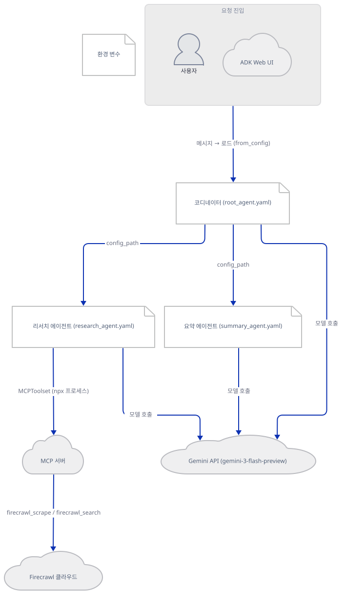
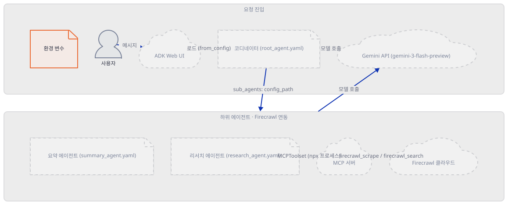
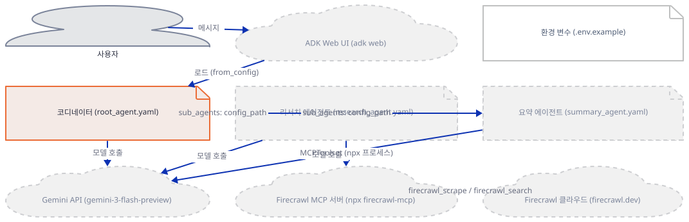
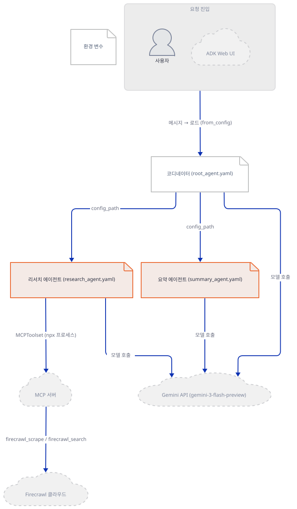
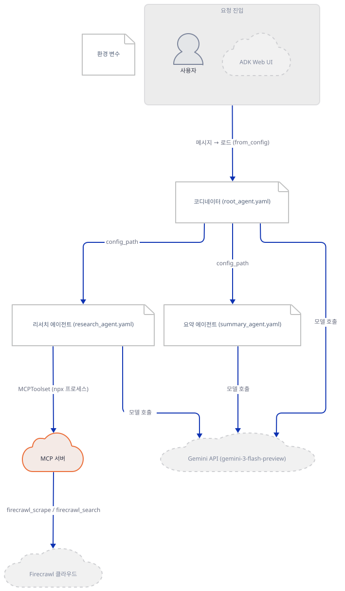
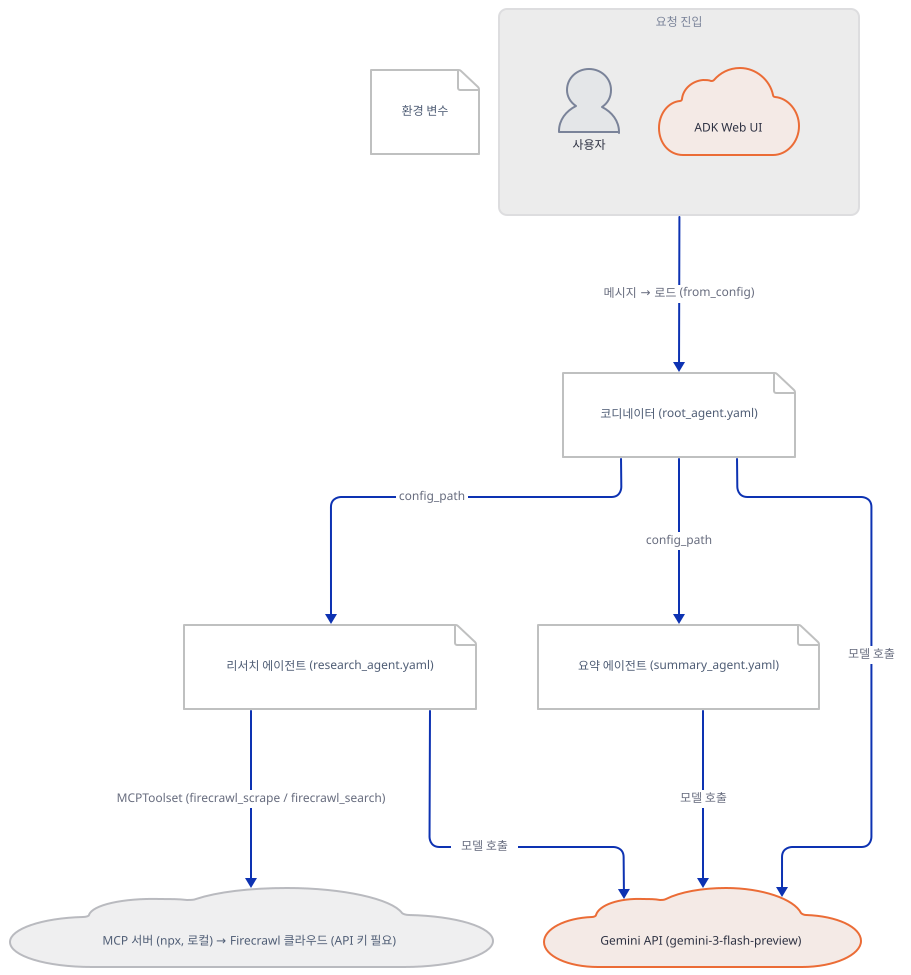
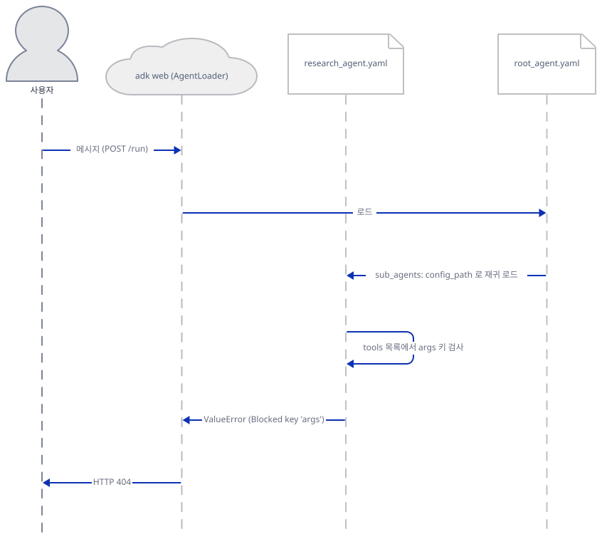

# Day 023 · Google ADK Crash Course · adk_yaml_examples

> 볼륨 2 🧑‍🏫 Crash Courses · 난이도 ★★☆ ⚠ · 예상 소요 75분(파이썬 코드는 한 줄도 없지만, 그 대신 프레임워크 자신의 YAML 로더·의존성·보안 가드 네 곳을 소스로 따라가는 데 시간을 씁니다 — 다른 크래시 코스 날보다는 짧습니다) · API 비용 $0 (API 키 없이 진행 — 실제 Gemini·Firecrawl 호출은 하지 않았습니다) · 원본 앱: `ai_agent_framework_crash_course/google_adk_crash_course/adk_yaml_examples`

## 오늘 만들 것

오늘로 Google ADK 크래시 코스가 끝납니다 — Day 024부터는 OpenAI Agents SDK로 넘어갑니다. Day 014~022의 아홉 레슨은 전부 `LlmAgent(...)`를 파이썬으로 호출했지만, 오늘의 `multi_agent_web_research_team`엔 `.py` 파일이 하나도 없습니다. 코디네이터·리서치·요약 세 에이전트가 `root_agent.yaml`·`research_agent.yaml`·`summary_agent.yaml`로만 선언되어 있고, 유일한 파이썬 파일인 `__init__.py`는 개행 한 바이트가 전부입니다(직접 확인). 이건 Day 014가 `adk web --help`에서 읽고 지나간 문장 — 에이전트 폴더는 `agent.py`·`__init__.py`·`root_agent.yaml` 중 하나만 있으면 된다 — 의 세 번째 갈래이자, 그 문서가 찾아보기로 남겨 둔 숙제입니다. 조합 방식은 Day 021의 `sub_agents=`와 같은 매커니즘이지만 파이썬 객체 대신 `config_path`라는 파일 참조로 이뤄집니다 — `root_agent.yaml`이 나머지 둘을 가리키기만 하면 google-adk가 재귀적으로 읽어 조립합니다. 리서치 에이전트는 Day 017의 `MCPToolset`으로 `npx firecrawl-mcp`를 셸아웃하는데, 이 도구 선언 하나가 오늘의 무게중심입니다: `mcp` 패키지가 `requirements.txt`에도 google-adk의 의존성에도 없고, google-adk 2.9.2는 YAML로 선언된 로컬 프로세스 실행을 기본 거부하며, 이 레슨이 권장하는 `adk web` 자신은 도구 설정의 표준 표기법인 `args:` 키를 통째로 차단합니다. 그래서 오늘은 두 질문을 가릅니다 — "YAML만으로 에이전트 셋을 엮는 조합이 되는가"(됩니다, Step 3)와 "이 레슨이 그 위에서 의도한 대로 실행까지 가는가"(가지 않습니다, Step 4~5). 이 YAML 로더 전체가 google-adk 소스에서 `@experimental`로 표시돼 있다는 것이 이 결과를 설명합니다.



## 사전 준비

| 서비스/도구 | 용도 | 발급·설치 |
|---|---|---|
| Google AI Studio API 키 (`GOOGLE_API_KEY`) | 세 `LlmAgent` 전부의 `gemini-3-flash-preview` 호출에 필요. 이 문서는 키 없이 로더의 동작만 확인하며, Step 5가 확인하듯 실제로 이 키까지 도달하지도 않습니다 | https://aistudio.google.com/ 에서 발급 (이 실습에서는 생략) |
| Firecrawl API 키 (`FIRECRAWL_API_KEY`) | `research_agent.yaml`의 MCP 도구가 참조. `npx`를 단독 실행하면 `firecrawl-mcp` 자신은 일부 도구를 키 없이도 서비스하지만(Step 4), 이 YAML 그대로는 `env`에 빈 문자열이 아니라 `${FIRECRAWL_API_KEY}`라는 문자 그대로가 들어가 keyless 모드에 닿지 않습니다(Step 4) | https://firecrawl.dev 에서 발급 (이 실습에서는 발급하지 않습니다) |
| Node.js / `npx` | `research_agent.yaml`이 `npx firecrawl-mcp`를 셸아웃. Day 017이 이미 다룬 요구사항을 그대로 물려받습니다 | https://nodejs.org/ 설치 후 `npx --version`으로 확인 |
| uv | 가상환경 생성과 패키지 설치 | [공통 사전 준비](../README.md#공통-사전-준비-한-번만) 참고 |

## 아키텍처 한눈에 보기

| 컴포넌트 | 역할 | 코드 위치 |
|---|---|---|
| 사용자 (브라우저) | ADK 웹 UI 또는 `curl`로 메시지 전송 | 코드 없음 (외부 UI) |
| `adk web` 서버 | 폴더를 스캔해 `root_agent.yaml`을 로드. `web=True`일 때만 YAML 키 차단 목록을 켬(Step 5) | 코드 없음 (google-adk 2.9.2 CLI — 소스로 확인) |
| 코디네이터 (`root_agent.yaml`) | `research_agent`·`summary_agent`를 `sub_agents`의 `config_path`로 참조 | `ai_agent_framework_crash_course/google_adk_crash_course/adk_yaml_examples/multi_agent_web_research_team/multi_agent_web_researcher/root_agent.yaml` |
| 리서치 에이전트 (`research_agent.yaml`) | `MCPToolset`으로 `npx firecrawl-mcp`에 연결하도록 선언 | `ai_agent_framework_crash_course/google_adk_crash_course/adk_yaml_examples/multi_agent_web_research_team/multi_agent_web_researcher/research_agent.yaml` |
| 요약 에이전트 (`summary_agent.yaml`) | 도구·서브에이전트 없이 순수 텍스트 정리만 지시 | `ai_agent_framework_crash_course/google_adk_crash_course/adk_yaml_examples/multi_agent_web_research_team/multi_agent_web_researcher/summary_agent.yaml` |
| Firecrawl MCP 서버 (`npx firecrawl-mcp`) | 로컬 프로세스로 떠 `firecrawl_scrape`·`firecrawl_search` 등을 stdio로 제공 | 코드 없음 (외부 프로세스, Day 017 참고) |
| Gemini API | 세 `LlmAgent`의 추론 수행. 이 문서에서는 도달하지 못합니다(Step 5) | 코드 없음 (외부 서비스) |

## 단계별 진행

### Step 1. 환경 만들기 — `requirements.txt`가 고정하지 않는 것, `.env.example`이 켜지 않는 것

**목적.** 의존성을 설치해 실제로 무엇이 깔리는지 확인하고, `.env.example`을 그대로 복사해도 어떤 키도 설정되지 않는다는 것을 확인합니다.

**할 일.**

```bash
cd ai_agent_framework_crash_course/google_adk_crash_course/adk_yaml_examples/multi_agent_web_research_team
uv venv
uv pip install -r requirements.txt
```

(pip 대안: `python -m venv .venv && source .venv/bin/activate && pip install -r requirements.txt`. Windows PowerShell은 활성화만 `.venv\Scripts\Activate.ps1`로 바꿉니다.)

이 저장소는 루트에 `pyproject.toml`이 있어 `uv run`이 기본으로 루트 `.venv`를 쓰므로, 이후 모든 `uv run`에 `--no-project`를 붙입니다.

`ai_agent_framework_crash_course/google_adk_crash_course/adk_yaml_examples/multi_agent_web_research_team/requirements.txt:1-2`

```text
google-adk
firecrawl-py
```

Day 014·021이 똑같이 쓰던 `google-adk>=1.5.0`류의 하한선도 없이, 이 두 줄은 버전을 아예 고정하지 않습니다 — 무엇이 깔리는지는 설치하는 날의 PyPI 최신판에 달려 있다는 뜻입니다.

**확인.** 실제로 깔린 버전과, google-adk 자신이 `mcp`를 의존성으로 요구하는지를 함께 봅니다(뒤에서 다시 쓰입니다).

```bash
uv run --no-project python -c "
import google.adk, importlib.metadata as md
print('google-adk', google.adk.__version__)
print('firecrawl-py', md.version('firecrawl-py'))
"
uv pip show google-adk | grep Requires
```

```powershell
uv run --no-project python -c "<위와 같은 코드>"
uv pip show google-adk | Select-String "Requires"
```

```
google-adk 2.9.2
firecrawl-py 4.44.0
Requires: aiosqlite, authlib, click, fastapi, google-auth, google-genai, graphviz, httpx, jsonschema, opentelemetry-api, opentelemetry-sdk, packaging, pydantic, python-dotenv, python-multipart, pyyaml, requests, starlette, tenacity, typing-extensions, uvicorn, watchdog, websockets
```

(직접 확인 — Python 3.12.10의 throwaway 가상환경 기준이며, 버전은 Day 019~022와 같은 google-adk 2.9.2입니다. `Requires:` 목록 어디에도 `mcp`가 없습니다 — Step 3~4에서 이 구멍이 실제로 무엇을 막는지 봅니다.)

이제 `.env.example`을 봅니다.

`ai_agent_framework_crash_course/google_adk_crash_course/adk_yaml_examples/multi_agent_web_research_team/multi_agent_web_researcher/.env.example:1-12`

```text
### Uncomment either of the two sections based on your prefrence.

## Using Google AI Studio
#GOOGLE_GENAI_USE_VERTEXAI=0
#GOOGLE_API_KEY=<your-google-gemini-api-key>
#FIRECRAWL_API_KEY=<your-firecrawl-api-key>

## Using Vertex AI
#GOOGLE_GENAI_USE_VERTEXAI=1
#GOOGLE_CLOUD_PROJECT=<your-gcp-project-id>
#GOOGLE_CLOUD_LOCATION=us-central1
#FIRECRAWL_API_KEY=<your-firecrawl-api-key>
```

Day 014가 확인한 AI Studio·Vertex AI 두 방식이 각각 한 블록씩 준비돼 있지만, 어느 쪽도 주석이 풀려 있지 않습니다. 그래서 다른 레슨처럼 `cp .env.example .env`를 그대로 실행하면 파일은 생기지만, `python-dotenv`가 읽을 대입문이 하나도 없습니다 — 에러도 안 나고 키도 안 들어오는, 조용히 아무 일도 일어나지 않는 결과입니다.



**확인.** 12줄 중 몇 줄이 실제로 `#`으로 시작하는지 셉니다.

```bash
cp multi_agent_web_researcher/.env.example multi_agent_web_researcher/.env
grep -c "^#" multi_agent_web_researcher/.env
grep -vc "^#" multi_agent_web_researcher/.env
```

```powershell
Copy-Item multi_agent_web_researcher\.env.example multi_agent_web_researcher\.env
(Select-String -Path multi_agent_web_researcher\.env -Pattern "^#").Count
(Get-Content multi_agent_web_researcher\.env | Where-Object { $_ -notmatch "^#" }).Count
```

```
10
2
```

(직접 확인 — 12줄 중 10줄이 `#`으로 시작하고, 나머지 2줄은 완전히 빈 줄이거나 공백 3칸뿐입니다. 대입문이 있는 줄은 0개입니다 — `.env`를 만든 채로 이 레슨을 계속 진행해도 실제로 설정되는 환경변수는 없습니다.)

### Step 2. 파이썬이 없는 패키지 — Day 014의 세 번째 갈래를 실제로 밟다

**목적.** `agent.py`가 없고 `__init__.py`가 사실상 빈 파일이라는 것을 확인하고, google-adk의 로더가 이 상황에서 정확히 어떤 순서로 무엇을 시도하는지 소스로 확인합니다.

**할 일.** 폴더 구성과 각 파일의 실제 줄 수부터 봅니다. 이 폴더는 다른 ADK 레슨보다 한 겹 더 깊습니다 — `multi_agent_web_research_team/`(README·`requirements.txt`) 아래에 실제 에이전트 패키지 `multi_agent_web_researcher/`가 있습니다.

```bash
find multi_agent_web_researcher -type f
wc -l multi_agent_web_researcher/root_agent.yaml multi_agent_web_researcher/research_agent.yaml multi_agent_web_researcher/summary_agent.yaml multi_agent_web_researcher/.env.example multi_agent_web_researcher/__init__.py
xxd multi_agent_web_researcher/__init__.py
```

```powershell
Get-ChildItem multi_agent_web_researcher -File | Select-Object Name
Get-Content multi_agent_web_researcher\root_agent.yaml, multi_agent_web_researcher\research_agent.yaml, multi_agent_web_researcher\summary_agent.yaml, multi_agent_web_researcher\.env.example | Measure-Object -Line
Format-Hex multi_agent_web_researcher\__init__.py
```

```
multi_agent_web_researcher/.env.example
multi_agent_web_researcher/__init__.py
multi_agent_web_researcher/research_agent.yaml
multi_agent_web_researcher/root_agent.yaml
multi_agent_web_researcher/summary_agent.yaml
  22 multi_agent_web_researcher/root_agent.yaml
  32 multi_agent_web_researcher/research_agent.yaml
  22 multi_agent_web_researcher/summary_agent.yaml
  12 multi_agent_web_researcher/.env.example
   1 multi_agent_web_researcher/__init__.py
00000000: 0a                                       .
```

(직접 확인 — `agent.py`가 어디에도 없습니다. `wc -l`은 트레일링 개행이 없는 `root_agent.yaml`·`research_agent.yaml`을 하나씩 적게 세는데, Day 019~022와 같은 종류의 어긋남입니다 — 실제 줄 수는 각각 23·33이고, 트레일링 개행이 있는 `.env.example`·`summary_agent.yaml`은 12·22 그대로 맞습니다. `__init__.py`는 `wc -l`이 1을 보고하지만 파일 전체가 개행 문자 한 바이트(`0a`)뿐입니다 — `from .agent import root_agent` 같은 재노출 코드가 원천적으로 없습니다.)

Day 014는 `adk web --help`의 "agent.py, __init__.py, or root_agent.yaml" 한 문장을 확인했지만, 그 문서가 실제로 밟은 것은 `agent.py` 갈래뿐이었습니다. google-adk 2.9.2 소스로 확인하면(`google/adk/cli/utils/agent_loader.py`) 이 "OR"는 순서가 있는 폴백 사슬입니다: ① `multi_agent_web_researcher`를 패키지로 임포트해 `root_agent` 속성이 있는지 보고, ② 없으면 `multi_agent_web_researcher.agent` 서브모듈을 임포트해 같은 것을 보고, ③ 그것도 없으면 `multi_agent_web_researcher/root_agent.yaml`을 `config_agent_utils.from_config`로 읽습니다. 이 폴더는 ①에서 패키지 임포트 자체는 성공하지만(1바이트짜리 `__init__.py`도 유효한 모듈입니다) `root_agent` 속성이 없어 통과하지 못하고, ②는 애초에 `agent.py`가 없어 실패하며, 결국 ③에서만 성공합니다. `from_config`를 감싼 이 YAML 갈래 전체엔 `@experimental` 데코레이터가 붙어 있습니다(소스로 확인, `google/adk/agents/config_agent_utils.py`) — Day 014가 찾아보기로 남겨 둔 세 번째 갈래는 이 버전에서도 여전히 실험적 기능입니다.



**확인.** 패키지를 직접 임포트해 ①이 정말 멈추는 지점과, `.agent` 서브모듈이 정말 없다는 것을 봅니다. `multi_agent_web_researcher`의 부모 폴더에서 실행해야 합니다.

```bash
uv run --no-project python -c "
import multi_agent_web_researcher as pkg
print('has root_agent:', hasattr(pkg, 'root_agent'))
try:
    import multi_agent_web_researcher.agent
    print('agent submodule: FOUND (unexpected)')
except ModuleNotFoundError as e:
    print('agent submodule error:', e)
"
```

```powershell
uv run --no-project python -c "<위와 같은 코드>"
```

```
has root_agent: False
agent submodule error: No module named 'multi_agent_web_researcher.agent'
```

(직접 확인 — `multi_agent_web_researcher`는 `__init__.py`가 있는 정식 패키지로 임포트되지만(네임스페이스 패키지가 아닙니다) `root_agent` 속성이 없고, `.agent` 서브모듈도 없습니다. 폴백 사슬의 ①·②가 실패해야만 ③의 YAML 로더가 실행된다는 것을 그대로 보여줍니다.)

### Step 3. YAML만으로 엮은 세 에이전트 — `config_path`와 첫 번째 벽

**목적.** `root_agent.yaml`이 `config_path`로 나머지 둘을 참조해 파이썬 없이 조합되는 방식을 소스로 확인하고, 그 조합이 실제로 동작한다는 것과 어디서부터 막히기 시작하는지를 함께 확인합니다.

**할 일.**

`ai_agent_framework_crash_course/google_adk_crash_course/adk_yaml_examples/multi_agent_web_research_team/multi_agent_web_researcher/root_agent.yaml:21-23`

```yaml
sub_agents:
  - config_path: research_agent.yaml
  - config_path: summary_agent.yaml
```

세 YAML 중 어느 것도 `agent_class:`를 적지 않았으므로 셋 다 기본값인 `LlmAgent`로 만들어집니다(소스로 확인, `google/adk/agents/config_agent_utils.py`의 `_resolve_agent_class`). `sub_agents:`의 각 항목은 `AgentRefConfig(config_path=...)`로 파싱된 뒤 `resolve_agent_reference`가 처리하는데, 이 함수는 절대경로를 거부하고 참조 대상이 반드시 `root_agent.yaml`이 있는 폴더 하위로만 벗어나지 않게 강제합니다(경로 순회 방어, 소스로 확인). 통과하면 `research_agent.yaml`·`summary_agent.yaml`에 대해 같은 `from_config`가 재귀적으로 다시 호출됩니다 — 즉 세 에이전트를 하나로 엮는 데 필요한 코드는 이 세 줄과 재귀적인 `from_config` 호출뿐이고, 그 사이 어디에도 파이썬 클래스 정의가 없습니다.



**확인.** 도구도 서브에이전트도 없는 `summary_agent.yaml`을 단독으로 로드해 이 조합 메커니즘 자체가 동작한다는 것을 먼저 본 뒤, `root_agent.yaml` 전체를 로드해 어디서 멈추는지 봅니다. `multi_agent_web_researcher` 폴더 안에서 실행합니다.

```bash
uv run --no-project python -c "
from google.adk.agents import config_agent_utils
agent = config_agent_utils.from_config('summary_agent.yaml')
print(agent.name, type(agent).__name__, agent.model, agent.tools, agent.sub_agents)
"
uv run --no-project python -c "
from google.adk.agents import config_agent_utils
try:
    config_agent_utils.from_config('root_agent.yaml')
except Exception as e:
    print(type(e).__name__, ':', e)
" 2>&1 | tail -1
```

```powershell
uv run --no-project python -c "<위 첫 번째 코드>"
uv run --no-project python -c "<위 두 번째 코드>"
```

```
summary_agent LlmAgent gemini-3-flash-preview [] []
ModuleNotFoundError : No module named 'mcp'
```

(직접 확인 — `summary_agent.yaml` 하나만 놓고 보면 YAML 조합은 키 없이도, `mcp` 없이도 완벽하게 동작합니다. 하지만 `root_agent.yaml` 전체를 로드하면 `research_agent.yaml`의 도구 선언을 처리하다가 `mcp` 패키지가 없어 멈춥니다 — Step 1에서 본 그 구멍입니다. 두 명령 모두 google-adk가 이 기능을 실험적이라고 표시하는 `UserWarning`을 표준에러에 함께 찍습니다.)

### Step 4. MCP 도구 한 줄, 세 가지 조건 — Node·Firecrawl·그리고 프레임워크 자신

**목적.** `research_agent.yaml`의 MCP 도구 선언을 읽고, 이 도구 하나가 실제로 무엇을 요구하는지 — Node·`mcp` 패키지·google-adk 자신의 옵트인 — 를 순서대로 확인합니다. Day 017이 다룬 MCP 프로세스 경계는 다시 설명하지 않습니다.

**할 일.**

`ai_agent_framework_crash_course/google_adk_crash_course/adk_yaml_examples/multi_agent_web_research_team/multi_agent_web_researcher/research_agent.yaml:24-33`

```yaml
tools:
  - name: MCPToolset
    args:
      stdio_server_params:
        command: "npx"
        args:
          - "-y"
          - "firecrawl-mcp"
        env:
          FIRECRAWL_API_KEY: "${FIRECRAWL_API_KEY}"
```

`name: MCPToolset`은 google-adk 2.9.2에서 `McpToolset`의 사용 중단 예정 별명입니다(소스로 확인, `google/adk/tools/mcp_tool/mcp_toolset.py` — 생성 시 `DeprecationWarning`). `stdio_server_params`는 실제 필드명이 맞지만(같은 파일의 `McpToolsetConfig`), 이 필드가 있으면 google-adk는 `from_config` 시점에 스스로 안전장치를 겁니다: YAML로 선언된 `command`는 에이전트가 뜰 때 로컬 프로세스로 그대로 실행되므로, 신뢰할 수 없는 설정이라면 임의 코드 실행이 된다는 이유로 기본적으로 거부합니다. 우회하려면 환경변수 `ADK_ALLOW_CONFIG_STDIO_MCP_SERVERS=1`을 직접 켜야 합니다(소스로 확인, 같은 파일). `requirements.txt`도 이 레슨의 README도 이 두 가지 — `mcp` 패키지, 그리고 이 옵트인 — 를 언급하지 않습니다.



**확인.** 먼저 `npx firecrawl-mcp` 자신이 키 없이 뜨는지를 Day 017과 같은 방식으로 직접 봅니다. 첫 실행은 패키지를 내려받느라 30초 이상 걸릴 수 있습니다.

```bash
npx -y firecrawl-mcp </dev/null
```

```powershell
npx -y firecrawl-mcp < NUL
```

```
No FIRECRAWL_API_KEY or FIRECRAWL_API_URL set — running in keyless mode. firecrawl_scrape and firecrawl_search are free (rate-limited per IP) against the Firecrawl cloud; other tools require an API key (get one free at https://firecrawl.dev).
```

(직접 확인 — 종료 코드 0. `research_agent.yaml`의 지시문이 실제로 쓰라고 하는 도구는 정확히 `firecrawl_scrape`·`firecrawl_search` 둘뿐인데, 이 레슨 자신의 README(`ai_agent_framework_crash_course/google_adk_crash_course/adk_yaml_examples/multi_agent_web_research_team/README.md:135-139`)는 `FIRECRAWL_API_KEY`를 "Required: Yes"라고 못박습니다 — `npx`를 이렇게 단독 실행할 때의 `firecrawl-mcp` 동작과는 다릅니다. 이 대비는 `npx` 단독 실행에만 성립합니다: 이 레슨의 YAML 그대로 붙이면 `env`에 빈 문자열이 아니라 `${FIRECRAWL_API_KEY}`라는 글자 그대로가 들어가므로(Step 4 두 번째 확인) keyless 모드 자체에 닿지 않습니다 — 플레이스홀더가 이미 "키가 있다"로 읽혀 "env" 인증 모드로 뜹니다. 이 확인은 `npx`를 리포 밖에서 단독 실행한 것이며, ADK의 `MCPToolset`을 통해 실제로 도구 목록을 조회하는 것은 Day 017과 같은 이유로 시도하지 않았습니다 — Firecrawl은 유료 서비스라 그 경로로도 실제 클라우드에 닿을 가능성을 배제할 수 없습니다.)

`requirements.txt`엔 없는 `mcp`를 추가로 설치하고 옵트인 변수를 켜면 어디까지 가는지도 확인했습니다(이 문서의 나머지 확인들과 달리, 레슨이 실제로 설치하라고 하는 범위를 넘습니다).

```bash
uv pip install mcp
ADK_ALLOW_CONFIG_STDIO_MCP_SERVERS=1 uv run --no-project python -c "
from google.adk.agents import config_agent_utils
agent = config_agent_utils.from_config('root_agent.yaml')
research = agent.sub_agents[0]
params = research.tools[0].connection_params
print(agent.name, '->', [a.name for a in agent.sub_agents])
print('env:', params.env)
" 2>&1 | tail -3
```

```powershell
uv pip install mcp
$env:ADK_ALLOW_CONFIG_STDIO_MCP_SERVERS="1"; uv run --no-project python -c "<위와 같은 코드>"
```

```
web_research_coordinator -> ['research_agent', 'summary_agent']
env: {'FIRECRAWL_API_KEY': '${FIRECRAWL_API_KEY}'}
```

(직접 확인 — `mcp`와 옵트인을 모두 갖추면 세 에이전트 전체가 오프라인으로, 키 없이 조립됩니다. 그런데 `env`에 실제로 들어간 값은 `${FIRECRAWL_API_KEY}`라는 글자 그대로입니다 — PyYAML의 `safe_load`도, google-adk의 설정 로더도, `mcp` SDK의 `stdio_client`도 이 문자열을 셸 변수처럼 치환하지 않습니다(소스로 확인, `mcp` 2.2.0의 `client/stdio` 모듈은 `os.environ`에서 고정된 이름 목록만 상속할 뿐입니다). 즉 `.env`에 진짜 키를 넣어도, 이 YAML을 고치지 않는 한 `npx` 프로세스가 실제로 받는 값은 이 플레이스홀더 문자열입니다. `mcp`를 설치한 뒤 옵트인 없이 이 명령을 돌리면 `ValueError: Stdio MCP servers are not allowed in agent configs: ...`가 대신 납니다(`mcp`가 아예 없으면 옵트인 여부와 무관하게 여전히 `ModuleNotFoundError`입니다, 직접 확인) — 문제 해결에 정리했습니다.)

### Step 5. `adk web`으로 실행하기 — 프레임워크가 자기 예제를 거절하는 지점

**목적.** 이 레슨의 README가 권장하는 방식 그대로(Step 1의 설치만 마친 상태로) `adk web`을 띄워, 실제로 어디서 어떻게 막히는지 확인합니다.

**할 일.** `multi_agent_web_researcher`의 부모 폴더에서 띄웁니다.

```bash
cd ai_agent_framework_crash_course/google_adk_crash_course/adk_yaml_examples/multi_agent_web_research_team
uv run --no-project adk telemetry disable
uv run --no-project adk web --port 8989 --no_use_local_storage .
```

```powershell
uv run --no-project adk telemetry disable
uv run --no-project adk web --port 8989 --no_use_local_storage .
```



**확인.** 다른 터미널에서 목록 조회, 세션 생성, 메시지 전송을 순서대로 해 봅니다.

```bash
curl -s http://127.0.0.1:8989/list-apps
curl -s -X POST http://127.0.0.1:8989/apps/multi_agent_web_researcher/users/u1/sessions/s1 -H "Content-Type: application/json" -d "{}"
curl -s -X POST http://127.0.0.1:8989/run -H "Content-Type: application/json" -d '{"appName":"multi_agent_web_researcher","userId":"u1","sessionId":"s1","newMessage":{"role":"user","parts":[{"text":"hello"}]}}'
```

```powershell
curl.exe -s http://127.0.0.1:8989/list-apps
curl.exe -s -X POST http://127.0.0.1:8989/apps/multi_agent_web_researcher/users/u1/sessions/s1 -H "Content-Type: application/json" -d "{}"
'{"appName":"multi_agent_web_researcher","userId":"u1","sessionId":"s1","newMessage":{"role":"user","parts":[{"text":"hello"}]}}' | Out-File -Encoding utf8 body.json
curl.exe -s -X POST http://127.0.0.1:8989/run -H "Content-Type: application/json" --data "@body.json"
```

(PowerShell 5.1의 네이티브 인자 전달은 작은따옴표 문자열 안의 큰따옴표를 지워서 넘기는 것으로 문서화돼 있어(about_Parsing, `$PSNativeCommandArgumentPassing`), 마지막 줄의 `-d '{"key":...}'` 형태를 그대로 쓰면 서버가 다른 본문을 받을 수 있습니다 — 본문을 파일로 적어 `--data "@body.json"`으로 넘기면 5.1과 7.3+ 모두에서 안전합니다. 이 세션에서는 PowerShell을 실행할 수 없어 직접 확인하지 못했습니다.)

```
["multi_agent_web_researcher"]
{"id":"s1","appName":"multi_agent_web_researcher","userId":"u1","state":{},"events":[],"lastUpdateTime":1790002140.18}
{"detail":"Fail to load '…\\root_agent.yaml' config. Blocked key 'args' found in '…\\\\research_agent.yaml'. The 'args' field is not allowed in agent configurations because it can execute arbitrary code."}
```

(직접 확인 — `curl`이 응답에 줄바꿈을 넣지 않아 세 응답이 원래 한 줄씩 붙어 나오지만 위는 읽기 쉽게 줄을 나눴습니다. `lastUpdateTime`은 실행마다 다른 타임스탬프입니다. `/list-apps`는 폴더 이름만 보고 내용을 확인하지 않으므로 통과하지만(Day 014~022와 같은 얕은 조회), `/run`은 HTTP 404이고 위 셋째 줄이 그 본문 그대로입니다(로컬 절대경로만 `…`로 줄였습니다 — 첫 경로는 한 번, `research_agent.yaml` 쪽 경로는 두 번 이스케이프된 백슬래시로 옵니다).)

이건 Day 014~022가 키 없이 실행할 때마다 봤던 "`ValueError: No API key was provided`"(HTTP 500)와 전혀 다른 실패입니다 — Gemini도, MCP 서버도, `mcp` 패키지의 유무조차도 등장하지 않습니다. google-adk 2.9.2 소스로 확인하면(`google/adk/cli/fast_api.py`) `adk web`은 서버를 만들 때 `web=True`이면 `config_agent_utils._set_enforce_yaml_key_denylist(True)`를 호출해, YAML 어디든 `args`라는 이름의 키가 있으면 통째로 거부하도록 켭니다. 그런데 `args:`는 `ToolConfig` 스키마 자신이 문서화한, 인자가 필요한 모든 도구의 표준 표기법입니다(소스로 확인, `google/adk/tools/tool_configs.py`의 독스트링 — `AgentTool`도 같은 방식으로 `args:`를 씁니다). 즉 `adk web`은 MCP 도구만이 아니라 **인자가 있는 어떤 YAML 도구 선언도** 서비스하지 못합니다. `mcp`를 설치하고 `ADK_ALLOW_CONFIG_STDIO_MCP_SERVERS=1`을 켜도 이 벽은 그대로입니다 — 이 옵트인엔 대응하는 CLI 플래그가 없어, 이 레슨을 `adk web`으로 실행하는 한 피해 갈 방법이 없습니다.

## 요청 한 건이 흐르는 과정



사용자가 메시지를 보내면 `adk web`은 `AgentLoader`로 `multi_agent_web_researcher`를 로드하려 합니다. Step 2의 폴백 사슬을 거쳐 `root_agent.yaml`에 도달한 `from_config`는 서브에이전트도 도구도 만들기 전에, YAML 트리 전체에서 차단된 키부터 찾습니다(Step 5). `sub_agents`를 따라 `research_agent.yaml`까지 내려간 순간 `tools:` 아래의 `args:`가 걸려 예외가 올라오고, `adk web`은 HTTP 404로 답합니다 — Gemini 요청도 조립되지 않고 `npx firecrawl-mcp`도 뜨지 않습니다. 이 차단만 없었다면 다음은 `mcp` 패키지 확인 → 옵트인 확인(Step 4) → `npx firecrawl-mcp` 기동 → 세 `LlmAgent`의 Gemini 호출 순이었을 것이고, 이 시퀀스는 실제로 일어난 차단 지점까지만 그립니다.

## 실행 체크리스트

- [ ] `requirements.txt`가 `google-adk`·`firecrawl-py` 두 줄을 버전 고정 없이 담고 있고, 실제로 google-adk 2.9.2·firecrawl-py 4.44.0이 깔린다는 것을 확인했다
- [ ] google-adk의 `Requires:` 목록에 `mcp`가 없다는 것을 확인했다
- [ ] `.env.example` 12줄 중 10줄이 `#`으로 시작하고 나머지 2줄도 대입문이 아니어서, 그대로 복사해도 설정되는 키가 0개라는 것을 확인했다
- [ ] `agent.py`가 없고 `__init__.py`가 개행 1바이트뿐이라는 것을 바이트로 확인했다
- [ ] google-adk의 로더가 패키지 임포트 → `.agent` 서브모듈 → `root_agent.yaml` 순으로 폴백하며, 이 폴더에서는 세 번째만 성공한다는 것을 소스와 실행으로 확인했다
- [ ] `summary_agent.yaml` 단독 로드가 성공해 YAML 조합 메커니즘 자체는 키 없이 동작한다는 것을 확인했다
- [ ] `root_agent.yaml` 전체 로드는 `mcp` 패키지가 없어 `ModuleNotFoundError`로 멈춘다는 것을 확인했다
- [ ] `npx firecrawl-mcp`를 단독 실행하면 키 없이도 `firecrawl_scrape`·`firecrawl_search`를 keyless 모드로 제공하지만, 이 레슨의 YAML 그대로는 `env`에 빈 문자열이 아닌 플레이스홀더가 들어가 keyless 모드에 닿지 않는다는 것을 확인했다
- [ ] google-adk가 YAML의 stdio MCP 서버 선언을 기본 차단하며, `ADK_ALLOW_CONFIG_STDIO_MCP_SERVERS=1`로만 우회된다는 것을 확인했다
- [ ] `research_agent.yaml`의 `${FIRECRAWL_API_KEY}`가 어떤 로더에서도 치환되지 않고 문자 그대로 남는다는 것을 확인했다
- [ ] `adk web`이 `args` 키를 가진 모든 도구 설정을 차단해 이 레슨을 `/run`에서 HTTP 404로 거부한다는 것을 직접 확인했다

## 문제 해결

| 증상 | 원인 | 해결 |
|---|---|---|
| `.env.example`을 `.env`로 복사해도 아무 것도 안 됨 | 12줄 중 10줄이 `#`으로 시작하고 나머지도 대입문이 아니다(직접 확인) | 두 옵션(AI Studio/Vertex AI) 중 하나를 골라 주석을 직접 풀어야 한다 |
| `from_config('root_agent.yaml')`이 `ModuleNotFoundError: No module named 'mcp'` | `requirements.txt`도 google-adk 자신의 의존성도 `mcp`를 포함하지 않는다(직접 확인) | `uv pip install mcp` 추가 설치. 다만 다음 벽이 바로 이어진다 |
| `mcp` 설치 후에도 `ValueError: Stdio MCP servers are not allowed in agent configs` | google-adk 2.9.2가 YAML로 선언된 로컬 프로세스 실행을 임의 코드 실행 위험으로 보고 기본 차단한다(소스로 확인) | 신뢰하는 설정에서만 `ADK_ALLOW_CONFIG_STDIO_MCP_SERVERS=1`을 켠다 |
| `mcp`와 옵트인을 모두 갖춰도 `adk web`의 `/run`이 HTTP 404 "Blocked key 'args'" | `adk web`이 `web=True`일 때 `args` 키를 가진 모든 YAML 도구 설정을 차단한다 — MCP 전용이 아니다(직접 확인) | 이 버전에서는 우회 수단이 없다. `adk run`처럼 `web=True`를 거치지 않는 실행 경로를 시도해볼 수 있다(더 해보기) |
| `npx -y firecrawl-mcp` 첫 실행이 30초 넘게 걸림 | 그 자리에서 패키지를 내려받는다(Day 017에서도 같은 현상을 봤다) | 완료될 때까지 기다리거나 `npx` 캐시를 미리 데운다 |

## 더 해보기

- `research_agent.yaml`의 `env: FIRECRAWL_API_KEY: "${FIRECRAWL_API_KEY}"`(`ai_agent_framework_crash_course/google_adk_crash_course/adk_yaml_examples/multi_agent_web_research_team/multi_agent_web_researcher/research_agent.yaml:33`)는 이미 빈 문자열이 아니므로 지금 이대로도 keyless 모드가 아닙니다 — 사본을 두 벌 만들어, ① 이 `env:` 줄 자체를 지운 것(→ 진짜 keyless 메시지가 뜨는지)과 ② 실제 Firecrawl 키 문자열을 넣은 것(→ 인증 모드로 뜨는지)을 `npx firecrawl-mcp`로 비교해보기
- `mcp` 설치와 `ADK_ALLOW_CONFIG_STDIO_MCP_SERVERS=1`을 갖춘 채로 `adk web` 대신 `adk run`(웹 UI를 거치지 않는 CLI 실행)으로 이 폴더를 띄워, `web=True`가 켜는 `args` 차단을 정말 피해 가는지, 그렇다면 다음엔 어디서 멈추는지 확인해보기
- `root_agent.yaml`의 `sub_agents`(`ai_agent_framework_crash_course/google_adk_crash_course/adk_yaml_examples/multi_agent_web_research_team/multi_agent_web_researcher/root_agent.yaml:22`)에 존재하지 않는 파일을 가리키는 `config_path`를 사본에 추가하거나, 상위 폴더로 나가는 `config_path: ../outside.yaml`을 넣어 Step 3의 경로 순회 방어가 정말로 막는지 확인해보기

## 다음 날 예고

[Day 024 · OpenAI Agents SDK Crash Course · 1_starter_agent](../day024-openai-sdk-1-starter-agent/README.md) — Google ADK 크래시 코스를 마치고, OpenAI Agents SDK의 가장 작은 단위부터 다시 시작합니다.
