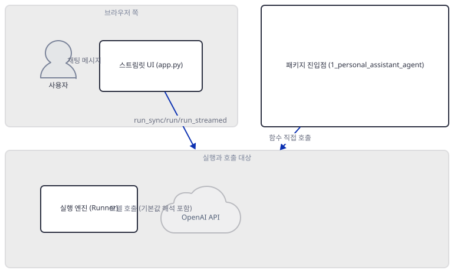
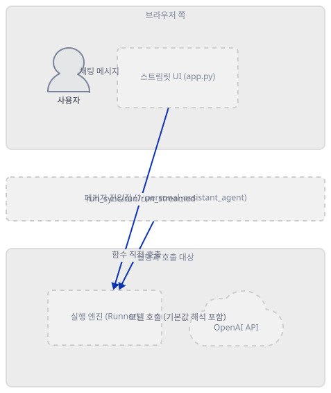
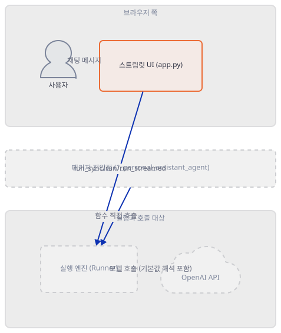
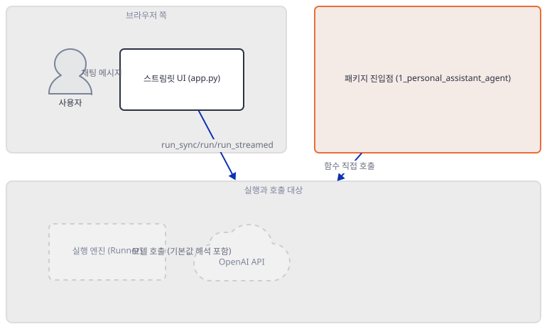
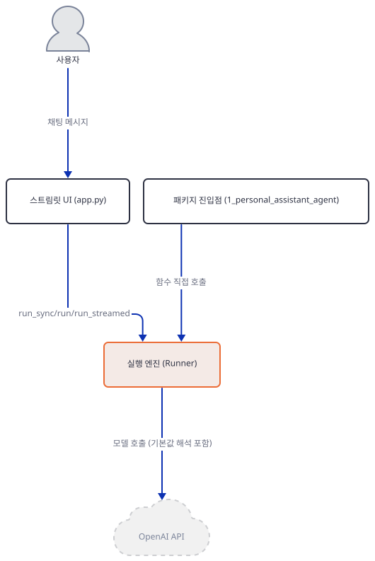
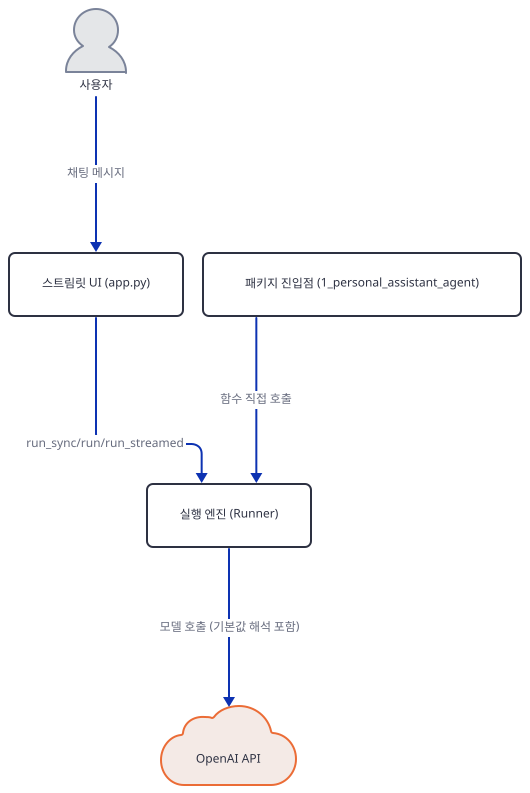
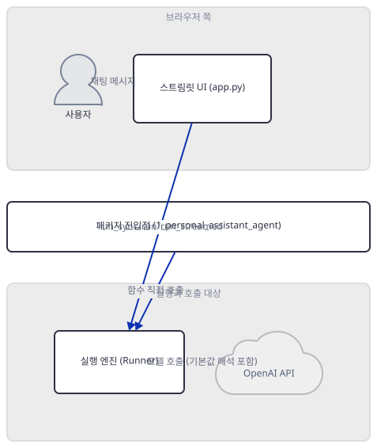
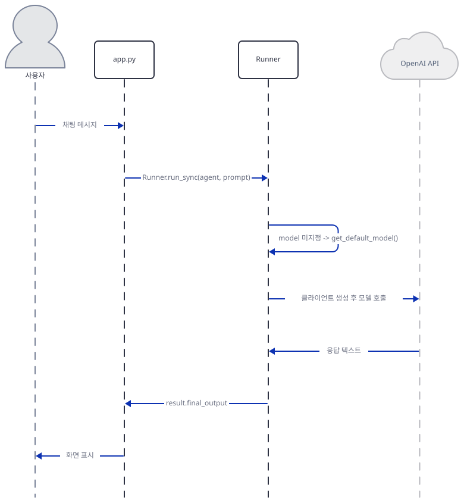

# Day 024 · OpenAI Agents SDK Crash Course · 1_starter_agent

> 볼륨 2 🧑‍🏫 Crash Courses · 난이도 ★☆☆ · 예상 소요 85분(두 진입점과 SDK 소스 여섯 파일을 오가며 확인하느라 다른 오프닝 날보다 깁니다) · API 비용 $0 (API 키 없이 진행 — 실제 OpenAI 모델 호출은 하지 않습니다) · 원본 앱: `ai_agent_framework_crash_course/openai_sdk_crash_course/1_starter_agent`

## 오늘 만들 것

Day 023로 Google ADK 크래시 코스가 끝났고, 오늘부터 열한 개 레슨으로 이어지는 OpenAI Agents SDK 크래시 코스가 시작됩니다. 프레임워크를 바꾸면서 가장 먼저 사라지는 것은 `adk web`입니다 — Day 014가 확인했듯 ADK는 폴더를 스캔해 `root_agent`를 찾아 자기 서버와 채팅 UI를 통째로 띄워 줬지만, OpenAI Agents SDK는 그런 CLI를 아예 제공하지 않습니다. 오늘 레슨의 서버는 다시 볼륨 1처럼 이 리포 자신이 짠 평범한 Streamlit 앱입니다. 설치할 패키지 이름은 `openai-agents`인데 실제로 코드에 적는 임포트는 `from agents import Agent, Runner`입니다 — 설치 이름과 임포트 이름이 다르다는 것을 이 볼륨의 문을 여는 오늘 한 번 정리해 둡니다(직접 확인). 이 폴더는 진입점을 두 개 가지고 있습니다: 사이드바에서 동기·비동기·스트리밍 세 실행 방식을 고르는 172줄짜리 `app.py`, 그리고 그 아래 `1_personal_assistant_agent/` 패키지에 같은 개념을 UI 없이 함수 셋(`sync_example`·`async_example`·`streaming_example`)으로 재현한 43줄짜리 `agent.py`입니다. 그런데 레슨 자신의 최상위 README가 그리는 폴더 구조(`personal_assistant_agent/`와 `execution_demo_agent/` 두 개)는 실제 디스크의 모습과 다릅니다(직접 확인, Step 2) — 실제로는 `1_personal_assistant_agent/` 하나뿐이고 `execution_demo_agent/`는 어디에도 없습니다. 레슨 문서가 실제 코드와 어긋나는 사례는 이번이 처음이 아닙니다 — Day 019는 콜백 API 문서가, Day 022는 `output_key` 관련 주석이, Day 023은 실행 안내 명령이 각각 실제 코드와 어긋난다는 것을 찾아냈고, 오늘도 그 목록에 두 건이 더 붙습니다. 두 진입점은 이름이 다른 `Agent`를 하나씩 독립적으로 정의하고 어느 쪽도 `model=`을 지정하지 않는데, 중첩 README는 이것이 "기본 GPT-4o 모델"이라고 단언합니다 — 이 문서는 그 주장을 그대로 믿는 대신 설치된 openai-agents 0.22.3의 소스를 직접 따라가, 실제로 해석되는 기본값이 무엇인지 Step 4에서 확인합니다. 그리고 두 진입점이 똑같이 복사해 쓰는 스트리밍 코드 한 줄이 API 키와 무관하게 그 자체로 깨진다는 것도 Step 5에서 키 없이 직접 재현합니다. 완성 아키텍처는 다음과 같습니다.



## 사전 준비

| 서비스/도구 | 용도 | 발급·설치 |
|---|---|---|
| OpenAI API 키 (`OPENAI_API_KEY`) | 두 진입점 모두가 결국 호출하는 `Runner`의 인증. 이 문서는 키를 발급하지 않고, 두 진입점이 각각 어디서 멈추는지만 Step 6에서 확인합니다 | https://platform.openai.com/api-keys 에서 발급 (이 실습에서는 생략) |
| uv | 가상환경 생성과 패키지 설치 | [공통 사전 준비](../README.md#공통-사전-준비-한-번만) 참고 |
| 인터넷 연결 | PyPI에서 `openai-agents` 설치 | 별도 설치 없음 |

## 아키텍처 한눈에 보기

| 컴포넌트 | 역할 | 코드 위치 |
|---|---|---|
| 사용자 (브라우저) | 스트림릿 채팅 UI에 메시지 입력 | 코드 없음 (외부 UI) |
| 스트림릿 UI (`app.py`) | 사이드바에서 고른 실행 방식으로 자체 정의한 에이전트를 호출 | `ai_agent_framework_crash_course/openai_sdk_crash_course/1_starter_agent/app.py:1-172` |
| 패키지 진입점 (`1_personal_assistant_agent/agent.py`) | 같은 개념을 UI 없이 함수 3개로 재현 (직접 실행해도 아무것도 출력하지 않음, Step 3) | `ai_agent_framework_crash_course/openai_sdk_crash_course/1_starter_agent/1_personal_assistant_agent/agent.py:1-43` |
| 실행 엔진 (`Runner`) | `Agent`와 입력 문자열을 받아 모델을 해석하고 실제 호출까지 진행 | 코드 없음 (openai-agents 0.22.3 — 소스로 확인) |
| OpenAI API | 실제 추론 수행 | 코드 없음 (외부 서비스) |

## 단계별 진행

### Step 1. 환경 만들기 — 설치 이름과 임포트 이름, 그리고 두 개의 env 템플릿

**목적.** 격리된 가상환경에 이 레슨의 의존성을 설치하고, 패키지 이름과 임포트 이름이 다르다는 것, 그리고 이 폴더 안에 env 템플릿이 두 곳(`.env.example`, `1_personal_assistant_agent/env.example`) 있고 그 내용도 미묘하게 다르다는 것을 확인합니다.

**할 일.**

```bash
cd ai_agent_framework_crash_course/openai_sdk_crash_course/1_starter_agent
uv venv
uv pip install -r requirements.txt
```

(pip 대안: `python -m venv .venv && source .venv/bin/activate && pip install -r requirements.txt`. Windows PowerShell은 활성화만 `.venv\Scripts\Activate.ps1`로 바꿉니다.)

이 저장소는 루트에 `pyproject.toml`이 있어 `uv run`이 방금 만든 환경 대신 루트의 `.venv`를 쓰므로, 이후 `uv run` 명령에는 모두 `--no-project`를 붙입니다.

`ai_agent_framework_crash_course/openai_sdk_crash_course/1_starter_agent/requirements.txt:1-3`

```text
openai-agents>=0.2.0
streamlit>=1.28.0
python-dotenv>=1.0.0
```

첫 줄의 `openai-agents`는 PyPI에 올라간 배포 이름이고, 코드가 실제로 쓰는 임포트는 `from agents import Agent, Runner`처럼 `agents`입니다 — 설치 이름과 임포트 이름이 다릅니다. 이 사실은 이번 볼륨 열한 레슨 전체에 적용되므로 오늘 한 번만 짚어 둡니다.

이 폴더에는 env 템플릿이 두 곳에 있습니다.

`ai_agent_framework_crash_course/openai_sdk_crash_course/1_starter_agent/.env.example:1-2`

```text
# OpenAI API Configuration
OPENAI_API_KEY=sk-your_openai_key_here
```

`ai_agent_framework_crash_course/openai_sdk_crash_course/1_starter_agent/1_personal_assistant_agent/env.example:1-2`

```text
# OpenAI API Configuration
OPENAI_API_KEY=your_openai_api_key_here
```

바깥쪽은 점으로 시작하는 `.env.example`이고, 두 폴더 아래 안쪽은 점 없는 `env.example`입니다. 이 볼륨 전체를 훑으면(grep으로 확인) 점 붙은 이름은 이 파일 하나뿐이고, 나머지 스물아홉 곳은 전부 점 없는 `env.example`입니다 — 이 문서의 `cp .env.example .env`를 뒷 레슨까지 그대로 들고 가면 파일을 못 찾습니다. 두 파일은 내용도 완전히 같지는 않습니다 — 플레이스홀더 값이 `sk-your_openai_key_here`와 `your_openai_api_key_here`로 다릅니다(직접 확인). 뒤 레슨의 env.example 중 일부(`2_structured_output_agent/2_1_support_ticket_agent/env.example`, `3_tool_using_agent/env.example` 등)는 `OPENAI_BASE_URL`·`OPENAI_ORG_ID`를 주석으로 얹어 두지만(grep으로 확인), 이 레슨의 두 템플릿 어느 쪽에도 그 두 줄은 없습니다.

이 레슨의 `requirements.txt`는 존재하지만, 뒤로 가면 `3_tool_using_agent`·`5_context_management`·`6_guardrails_validation` 세 레슨은 폴더 전체 어디에도 `requirements.txt`가 없습니다(grep으로 확인) — 오늘은 해당하지 않지만 이 볼륨에서 반복되는 패턴입니다.

Windows cp949 콘솔에서 한글이 섞인 파이썬 출력을 그대로 찍으면 API 경계 이전에 `UnicodeEncodeError`가 날 수 있다는 것은 Day 019가 이미 정리했으므로, 여기서는 그 결론만 가리킵니다.



**확인.**

```bash
uv run --no-project python -c "
import importlib.metadata as md
print('openai-agents', md.version('openai-agents'))
print('openai', md.version('openai'))
import agents
print('agents module file:', agents.__file__)
from agents import Agent, Runner
print('Agent, Runner imported OK')
"
```

```powershell
uv run --no-project python -c "<위와 같은 코드>"
```

```
openai-agents 0.22.3
openai 3.17.0
agents module file: ...\site-packages\agents\__init__.py
Agent, Runner imported OK
```

(직접 확인 — 가상환경 설치 위치에 따라 세 번째 줄의 경로는 달라집니다. 설치 이름 `openai-agents`와 임포트 모듈 이름 `agents`가 다르다는 것을 실제 값으로 확인했습니다.)

### Step 2. 첫 번째 진입점 — `app.py`와 레슨 README가 안 맞는 폴더 구조

**목적.** `app.py`가 실제로 무엇을 하는지 확인하고, 레슨 최상위 README가 문서화한 프로젝트 구조가 실제 파일 목록과 다르다는 것을 직접 비교합니다.

**할 일.** 먼저 최상위 README가 그리는 구조를 봅니다.

`ai_agent_framework_crash_course/openai_sdk_crash_course/1_starter_agent/README.md:57-67`

```text
1_starter_agent/
├── README.md                    # This file - concept explanation
├── requirements.txt             # Dependencies
├── personal_assistant_agent/    # Basic agent creation
│   ├── __init__.py
│   └── agent.py                # Simple agent definition (20 lines)
├── execution_demo_agent/        # Execution methods demonstration
│   ├── __init__.py
│   └── agent.py                # Sync, async, streaming examples
├── app.py                      # Streamlit web interface (optional)
└── env.example                 # Environment variables template
```

실제 파일을 나열하면 다릅니다.

```bash
find . -maxdepth 2 -type f | sort
```

```powershell
Get-ChildItem -Recurse -Depth 1 -File | Select-Object -ExpandProperty Name
```

```
./.env.example
./1_personal_assistant_agent/README.md
./1_personal_assistant_agent/__init__.py
./1_personal_assistant_agent/agent.py
./1_personal_assistant_agent/env.example
./README.md
./app.py
./requirements.txt
```

(직접 확인.) `personal_assistant_agent/`는 실제로 `1_personal_assistant_agent/`처럼 숫자 접두어가 붙어 있고, `execution_demo_agent/`는 어디에도 없습니다 — 그 폴더가 맡기로 되어 있던 "실행 방식 데모"는 실제로는 지금부터 볼 `app.py`의 사이드바 안으로 흡수되어 있습니다.

`app.py`의 앞부분은 키가 없으면 곧바로 멈춥니다.

`ai_agent_framework_crash_course/openai_sdk_crash_course/1_starter_agent/app.py:28-31`

```python
# Check API key
if not os.getenv("OPENAI_API_KEY"):
    st.error("❌ OPENAI_API_KEY not found. Please create a .env file with your OpenAI API key.")
    st.stop()
```

이 검사는 `Agent`를 만들기도 전에, 파일 맨 위에서 실행됩니다. 통과하면 캐시된 팩토리 함수가 에이전트를 만듭니다.

`ai_agent_framework_crash_course/openai_sdk_crash_course/1_starter_agent/app.py:34-55`

```python
@st.cache_resource
def create_agent():
    return Agent(
        name="Personal Assistant",
        instructions="""
        You are a helpful personal assistant.
        
        Your role is to:
        1. Answer questions clearly and concisely
        2. Provide helpful information and advice
        3. Be friendly and professional
        4. Offer practical solutions to problems
        
        When users ask questions:
        - Give accurate and helpful responses
        - Explain complex topics in simple terms
        - Offer follow-up suggestions when appropriate
        - Maintain a positive and supportive tone
        
        Keep responses concise but informative.
        """
    )
```

사이드바의 선택 상자(`ai_agent_framework_crash_course/openai_sdk_crash_course/1_starter_agent/app.py:61-64`)는 "Synchronous"·"Asynchronous"·"Streaming" 세 값 중 하나를 고르게 하고, 그 값에 따라 `Runner.run_sync`·`Runner.run`·`Runner.run_streamed`로 갈라집니다 — 세 실행 방식은 Step 5에서 하나씩 확인합니다.



**확인.**

```bash
uv run --no-project python -m py_compile app.py && echo compiled
```

```
compiled
```

(직접 확인.)

### Step 3. 두 번째 진입점 — 숫자로 시작하는 패키지 `1_personal_assistant_agent`

**목적.** 두 번째 진입점의 전체 코드를 읽어 `app.py`의 `Agent`와 이름만 다르고 나머지는 같다는 것을 확인하고, 이 폴더 이름이 숫자로 시작해 생기는 임포트 제약과 중첩 README 자신의 안내 명령이 실패한다는 것을 함께 확인합니다.

**할 일.** 43줄 중 정의 부분을 봅니다.

`ai_agent_framework_crash_course/openai_sdk_crash_course/1_starter_agent/1_personal_assistant_agent/agent.py:1-24`

```python
from agents import Agent, Runner
import asyncio

# Create an agent for demonstrating different execution methods
root_agent = Agent(
    name="Personal Assistant Agent",
    instructions="""
    You are a helpful personal assistant.
    
    Your role is to:
    1. Answer questions clearly and concisely
    2. Provide helpful information and advice
    3. Be friendly and professional
    4. Offer practical solutions to problems
    
    When users ask questions:
    - Give accurate and helpful responses
    - Explain complex topics in simple terms
    - Offer follow-up suggestions when appropriate
    - Maintain a positive and supportive tone
    
    Keep responses concise but informative.
    """
)
```

`instructions` 문자열은 `ai_agent_framework_crash_course/openai_sdk_crash_course/1_starter_agent/app.py:38-54`의 것과 한 글자도 다르지 않습니다(직접 확인, 두 파일을 나란히 비교). 다른 것은 `name`뿐입니다 — 여기서는 `"Personal Assistant Agent"`, `app.py`에서는 `"Personal Assistant"`. 두 파일은 서로를 임포트하지 않는 완전히 독립된 정의이고, 이 파일에도 `model=`은 없습니다(Step 4에서 이어집니다). 나머지 실행 함수 세 개는 Step 5에서 다룹니다.

이 폴더 이름 `1_personal_assistant_agent`는 숫자로 시작해 파이썬의 `import` 문법에 들어가지 못합니다 — Day 005가 하이픈 든 파일명(`mixture-of-agents.py`)에서 본 것과 같은 종류의 제약이 이번엔 폴더 이름에 걸립니다.

중첩 README는 이 폴더를 이렇게 쓰라고 안내합니다.

`ai_agent_framework_crash_course/openai_sdk_crash_course/1_starter_agent/1_personal_assistant_agent/README.md:20-21`

```text
   cp ../env.example .env
   # Edit .env and add your OpenAI API key
```

이 폴더 안에서 이 명령을 그대로 실행하면 실패합니다 — 부모 폴더(`1_starter_agent/`)에는 `env.example`(점 없음)이 아니라 `.env.example`(점 있음)이 있기 때문입니다(Step 1). 올바른 명령은 같은 폴더 안의 파일을 `../` 없이 복사하는 `cp env.example .env`입니다.

같은 README는 에이전트를 이렇게 불러 쓰라고도 안내합니다.

`ai_agent_framework_crash_course/openai_sdk_crash_course/1_starter_agent/1_personal_assistant_agent/README.md:26-30`

```text
   from agents import Runner
   from agent import root_agent
   
   result = Runner.run_sync(root_agent, "Hello, introduce yourself!")
   print(result.final_output)
```

이 스니펫의 `from agent import root_agent`는 패키지 임포트(`1_personal_assistant_agent.agent`)가 아니라, 이 폴더 **안에서** `agent.py`를 최상위 모듈처럼 임포트합니다 — 즉 이 코드는 `1_personal_assistant_agent/` 자체를 현재 디렉터리로 두고 실행해야 맞습니다.



**확인.** 먼저 부모 폴더(`1_starter_agent/`)에서 숫자로 시작하는 이름의 제약과 우회 방법을 봅니다.

```bash
uv run --no-project python -c "import 1_personal_assistant_agent"
```

```
  File "<string>", line 1
    import 1_personal_assistant_agent
            ^
SyntaxError: invalid decimal literal
```

```bash
uv run --no-project python -c "
import importlib
m = importlib.import_module('1_personal_assistant_agent.agent')
print('module imported OK:', m.__name__)
print('root_agent.name:', m.root_agent.name)
"
```

```powershell
uv run --no-project python -c "<위와 같은 코드>"
```

```
module imported OK: 1_personal_assistant_agent.agent
root_agent.name: Personal Assistant Agent
```

(직접 확인 — `import` 문에는 못 쓰지만 `importlib.import_module()`은 문자열을 받으므로 숫자로 시작해도 그대로 통과합니다. 패키지 자체는 멀쩡하다는 뜻입니다.) 이제 중첩 README가 실제로 안내하는 대로 이 폴더 **안에서** 실행해 봅니다.

```bash
cd 1_personal_assistant_agent
uv run --no-project python agent.py; echo "exit code: $?"
```

```powershell
cd 1_personal_assistant_agent
uv run --no-project python agent.py
```

```
exit code: 0
```

```bash
uv run --no-project python -c "
from agents import Runner
from agent import root_agent
print('root_agent.name:', root_agent.name)
print('root_agent.model:', root_agent.model)
"
```

```powershell
uv run --no-project python -c "<위와 같은 코드>"
```

```
root_agent.name: Personal Assistant Agent
root_agent.model: None
```

(직접 확인 — `python agent.py`는 종료 코드는 0이지만 화면에 아무것도 찍지 않습니다: 파일 안에 `if __name__ == "__main__":` 블록이 없어 세 함수 중 어느 것도 실제로 불리지 않기 때문입니다. 반면 중첩 README의 두 번째 스니펫은 이 폴더 안에서 실행하면 그대로 동작합니다 — `root_agent.model`이 `None`인 것도 여기서 다시 확인됩니다.)

### Step 4. 두 정의가 함께 기대는 것 — `Runner`와 진짜 기본 모델

**목적.** `app.py`와 `1_personal_assistant_agent/agent.py`가 결국 똑같이 호출하는 `Runner`가 무엇인지 확인하고, 둘 다 지정하지 않은 `model`이 실제로 무엇으로 풀리는지 설치된 SDK 소스를 직접 따라갑니다.

**할 일.** Step 2와 Step 3에서 본 두 `Agent(...)` 호출 어디에도 `model=` 인자가 없습니다. `Agent`는 `model` 필드를 `None` 기본값으로 두는 dataclass입니다(소스로 확인, openai-agents 0.22.3의 `agents/agent.py`) — 그 필드의 독스트링은 "By default, if not set, the agent will use the default model configured in `agents.models.get_default_model()`"이라고 적어 둡니다. 실제 해석은 호출 시점에 `OpenAIProvider.get_model(None)`이 맡는데(소스로 확인, `agents/models/openai_provider.py`), 이 함수는 `model_name`이 `None`이면 `get_default_model()`(`agents/models/default_models.py`)을 부릅니다. 그런데 같은 `openai_provider.py`에는 `DEFAULT_MODEL: str = "gpt-4o"`라는 모듈 상수도 있습니다 — 다만 주석이 "kept for backward compatibility but using get_default_model() method is recommended"라고 밝히듯, 이 상수는 실제 해석 경로 어디에서도 읽히지 않습니다(소스로 확인 — `get_model`은 `get_default_model()`만 부릅니다). `1_personal_assistant_agent/README.md`(`ai_agent_framework_crash_course/openai_sdk_crash_course/1_starter_agent/1_personal_assistant_agent/README.md:8`)가 말하는 "Using the default GPT-4o model"은 바로 이 안 쓰이는 상수 쪽 문자열과 같고, 실제로 호출되는 함수가 돌려주는 값과는 다릅니다.



**확인.** `OPENAI_DEFAULT_MODEL` 환경변수를 설정하지 않은 상태에서 두 값이 실제로 무엇인지 봅니다.

```bash
uv run --no-project python -c "
from agents import Agent
from agents.models.default_models import get_default_model
from agents.models.openai_provider import OpenAIProvider, DEFAULT_MODEL

a = Agent(name='x', instructions='y')
print('Agent().model:', repr(a.model))
print('get_default_model():', get_default_model())
print('legacy DEFAULT_MODEL (미사용):', DEFAULT_MODEL)

p = OpenAIProvider(api_key='sk-placeholder')
resolved = p.get_model(None)
print('실제 해석된 모델:', resolved.model)
"
```

```powershell
uv run --no-project python -c "<위와 같은 코드>"
```

```
Agent().model: None
get_default_model(): gpt-5.6-luna
legacy DEFAULT_MODEL (미사용): gpt-4o
실제 해석된 모델: gpt-5.6-luna
```

(직접 확인 — openai-agents 0.22.3, 2026-09-22 설치 기준입니다. `get_default_model()`은 `OPENAI_DEFAULT_MODEL` 환경변수가 없으면 이 값으로 떨어지는데, 함수 이름 자체가 이 값이 SDK 버전에 따라 달라질 수 있다는 뜻입니다 — 오늘 설치판의 실제 값이 이렇다는 것이지 이 문자열을 외울 필요는 없습니다. 중요한 것은 두 진입점 모두가 명시하지 않은 모델이 레슨 문서가 말하는 고정값이 아니라는 점입니다.)

### Step 5. 실행 세 방식과 스트리밍 코드의 버그

**목적.** `Runner.run_sync`·`Runner.run`·`Runner.run_streamed` 세 메서드의 실제 동기·비동기 성격을 확인하고, 두 진입점이 똑같이 베껴 쓴 스트리밍 코드가 API 키와 무관하게 그 자체로 깨진다는 것을 직접 재현합니다.

**할 일.** 세 실행 함수는 `1_personal_assistant_agent/agent.py`에 나란히 있습니다.

`ai_agent_framework_crash_course/openai_sdk_crash_course/1_starter_agent/1_personal_assistant_agent/agent.py:27-43`

```python
def sync_example():
    """Synchronous execution example"""
    result = Runner.run_sync(root_agent, "Hello, how does sync execution work?")
    return result.final_output

async def async_example():
    """Asynchronous execution example"""
    result = await Runner.run(root_agent, "Hello, how does async execution work?")
    return result.final_output

async def streaming_example():
    """Streaming execution example"""
    response_text = ""
    async for event in Runner.run_streamed(root_agent, "Tell me about streaming execution"):
        if hasattr(event, 'content') and event.content:
            response_text += event.content
    return response_text
```

소스로 확인하면(openai-agents 0.22.3) `Runner.run_sync`는 평범한 동기 함수이고, `Runner.run`은 진짜 코루틴 함수(`await` 필요)이며, `Runner.run_streamed`는 `run`과 달리 동기 함수이지만 내부에서 `asyncio.create_task`를 쓰기 때문에 이미 돌고 있는 이벤트 루프 밖에서 부르면 `RuntimeError: no running event loop`로 실패합니다(직접 확인) — 그래서 `streaming_example`도 `async def`로 감싸져 있습니다. 하지만 이 함수가 돌려주는 값은 `RunResultStreaming` 객체이지 비동기 이터레이터가 아닙니다(소스로 확인, `agents/result.py`) — `__aiter__`가 정의돼 있지 않고, 실제로 순회하려면 `result.stream_events()`가 돌려주는 별도의 비동기 제너레이터를 써야 합니다. 그런데 위 발췌의 `async for event in Runner.run_streamed(...)` 줄은 돌려받은 객체를 그 자리에서 바로 순회합니다 — `ai_agent_framework_crash_course/openai_sdk_crash_course/1_starter_agent/app.py:119`도 똑같은 모양입니다. 설령 `stream_events()`로 고쳐 써도 두 번째 문제가 남습니다: 바로 다음 줄의 `hasattr(event, 'content')`가 참이 되는 경우가 없습니다 — 실제로 나오는 세 종류의 이벤트(`RawResponsesStreamEvent`·`RunItemStreamEvent`·`AgentUpdatedStreamEvent`)는 필드가 각각 `data`/`type`, `name`/`item`/`type`, `new_agent`/`type`뿐이고 `content`는 어디에도 없습니다(소스로 확인, `agents/stream_events.py`) — 첫 번째 버그를 고쳐도 `response_text`는 항상 빈 문자열로 남습니다.



**확인.** 첫 번째 버그(`async for`가 바로 깨지는 것)는 키 없이도 재현됩니다 — 네트워크에 닿기 전에 파이썬이 프로토콜을 검사하다가 실패하기 때문입니다.

```bash
uv run --no-project python -c "
import asyncio
from agents import Agent, Runner

agent = Agent(name='x', instructions='y')

async def streaming_example():
    response_text = ''
    async for event in Runner.run_streamed(agent, 'Tell me about streaming execution'):
        if hasattr(event, 'content') and event.content:
            response_text += event.content
    return response_text

try:
    asyncio.run(streaming_example())
except Exception as e:
    print('EXCEPTION TYPE:', type(e).__name__)
    print('EXCEPTION TEXT:', str(e))
"
```

```powershell
uv run --no-project python -c "<위와 같은 코드>"
```

```
OPENAI_API_KEY is not set, skipping trace export
EXCEPTION TYPE: TypeError
EXCEPTION TEXT: 'async for' requires an object with __aiter__ method, got RunResultStreaming
```

(직접 확인 — 첫 줄은 `Runner.run_streamed`가 시작하자마자 SDK의 트레이싱 하위 시스템이 찍는 안내이고 실패가 아닙니다. 실제 실패는 `TypeError`이고, 이 함수 안 어디에도 `try/except`가 없으므로 `sync_example`·`async_example`과 달리 `streaming_example`은 유효한 키가 있어도 이 버그 때문에 항상 여기서 멈춥니다.)

### Step 6. 키 없이 실행 — 두 진입점이 서로 다른 지점에서 멈춘다

**목적.** 두 진입점을 실제로 키 없이 실행해, 정확히 어디서 어떤 예외로 멈추는지 직접 확인합니다.

**할 일.** 먼저 `app.py`를 스트림릿으로 띄웁니다.

```bash
uv run --no-project streamlit run app.py --server.headless true --server.port 8511
```

```powershell
uv run --no-project streamlit run app.py --server.headless true --server.port 8511
```



**확인.** 다른 터미널에서 서버가 실제로 떴는지 확인합니다.

```bash
curl.exe -s -o /dev/null -w "HTTP %{http_code}\n" http://localhost:8511
```

```powershell
curl.exe -s -o NUL -w "HTTP %{http_code}`n" http://localhost:8511
```

```
HTTP 200
```

(직접 확인 — 서버 배너에는 "Uvicorn server started on :::8511"이 찍혔습니다. 키가 없어도 서버 자체는 정상적으로 뜹니다 — Step 2에서 인용한 `ai_agent_framework_crash_course/openai_sdk_crash_course/1_starter_agent/app.py:29`의 검사는 요청이 들어와 스크립트가 실행될 때 평가되지, 서버 기동 자체를 막지는 않기 때문입니다. 이 검사가 그리는 `st.error()` 화면은 브라우저로만 보이므로 `curl`로는 확인하지 못했습니다 — `create_agent()`가 아예 호출되지 않는다는 것은 통제 흐름을 읽어 소스로 확인했습니다.)

이제 UI 없이 `1_personal_assistant_agent`의 `sync_example()`을 직접 불러 봅니다 — 이쪽에는 `ai_agent_framework_crash_course/openai_sdk_crash_course/1_starter_agent/app.py:29`와 같은 명시적 검사가 없습니다.

```bash
uv run --no-project python -c "
from agents import Agent, Runner

root_agent = Agent(name='Personal Assistant Agent', instructions='You are a helpful personal assistant.')

def sync_example():
    result = Runner.run_sync(root_agent, 'Hello, how does sync execution work?')
    return result.final_output

try:
    print(sync_example())
except Exception as e:
    print('EXCEPTION TYPE:', type(e).__name__)
    print('EXCEPTION MODULE:', type(e).__module__)
    print('EXCEPTION TEXT:', str(e))
"
```

```powershell
uv run --no-project python -c "<위와 같은 코드>"
```

```
OPENAI_API_KEY is not set, skipping trace export
EXCEPTION TYPE: OpenAIError
EXCEPTION MODULE: openai
EXCEPTION TEXT: Missing credentials. Please pass an `api_key`, `workload_identity`, `admin_api_key`, or set the `OPENAI_API_KEY` or `OPENAI_ADMIN_KEY` environment variable.
```

(직접 확인. `root_agent` 조회와 `Runner.run_sync` 진입까지는 성공하고, `OpenAIProvider`가 실제 `AsyncOpenAI` 클라이언트를 만드는 순간에만 `openai` 패키지의 `OpenAIError`가 납니다 — Day 014가 ADK에서 본 것과 같은 자리(모델을 실제로 부르기 직전)지만, 예외 종류와 메시지는 이 SDK 고유의 것입니다. 두 진입점을 나란히 놓으면: `app.py`는 `Runner`에 닿기도 전에 자기 코드의 명시적 검사로 멈추고, `1_personal_assistant_agent`는 그런 검사가 없어 `Runner` 내부까지 들어간 뒤에야 멈춥니다.)

## 요청 한 건이 흐르는 과정



이 시퀀스는 두 진입점이 `Runner`에 도달한 뒤 공유하는, 키가 있다고 가정한 전체 경로를 그립니다. 사용자가 채팅 메시지를 보내면 `app.py`는 `Runner.run_sync(agent, prompt)`를 부르고, `Runner`는 에이전트의 `model`이 `None`이면 곧바로 자기 내부에서 `get_default_model()`을 불러 실제 모델 이름을 정합니다(Step 4) — 이 단계는 아직 네트워크 밖으로 나가지 않는 순수한 인프로세스 조회입니다. 그다음에야 `OpenAIProvider`가 클라이언트를 만들어 OpenAI API를 실제로 부르고, 응답 텍스트가 `Runner`를 거쳐 `result.final_output`으로 `app.py`에, 다시 화면에 도착합니다. 이 문서처럼 키가 없는 환경에서는 두 진입점이 이 사슬의 서로 다른 지점에서 끊깁니다 — `app.py`는 `Runner.run_sync`를 부르기도 전에 자기 코드의 명시적 검사로 멈추고(Step 2·6), `1_personal_assistant_agent`의 직접 호출은 그림의 "클라이언트 생성 후 모델 호출" 화살표가 시작되는 바로 그 자리, `OpenAIProvider`가 `AsyncOpenAI` 클라이언트를 만드는 순간에 멈춥니다(Step 6). 이 시퀀스 전체가 유효한 키로 처음부터 끝까지 이어지는 것은 직접 보지 못했습니다.

## 실행 체크리스트

- [ ] `openai-agents`(설치 이름)와 `agents`(임포트 이름)가 다르다는 것을 실제 값으로 확인했다
- [ ] 이 폴더 안에 `.env.example`(점 있음)과 `1_personal_assistant_agent/env.example`(점 없음) 두 템플릿이 있고, 이 볼륨에서 점 붙은 이름은 이 파일 하나뿐이라는 것을 확인했다
- [ ] 두 env 템플릿의 플레이스홀더 값이 서로 다르다는 것을 확인했다
- [ ] 최상위 README가 그리는 프로젝트 구조(`personal_assistant_agent/`, `execution_demo_agent/`)가 실제 폴더 목록과 다르다는 것을 `find`로 확인했다
- [ ] `app.py`의 API 키 검사가 에이전트를 만들기도 전에 실행된다는 것을 소스로 확인했다
- [ ] `app.py`와 `1_personal_assistant_agent/agent.py`가 이름만 다르고 `instructions`는 완전히 같은, 서로 독립된 `Agent`를 정의한다는 것을 확인했다
- [ ] `1_personal_assistant_agent`가 숫자로 시작해 `import` 문에는 못 쓰지만 `importlib.import_module()`로는 임포트된다는 것을 직접 확인했다
- [ ] 중첩 README의 `cp ../env.example .env`가 실제로 실패한다는 것을 직접 확인했다
- [ ] 두 `Agent`가 `model=`을 지정하지 않고, 이 설치판의 실제 기본값이 중첩 README가 말하는 "GPT-4o"가 아니라는 것을 소스와 실행으로 확인했다
- [ ] `Runner.run_sync`는 동기, `Runner.run`은 코루틴, `Runner.run_streamed`는 실행 중인 이벤트 루프가 필요한 동기 함수라는 것을 확인했다
- [ ] 두 진입점이 똑같이 쓰는 스트리밍 코드가 `TypeError`로 즉시 깨진다는 것을 키 없이 직접 재현했다
- [ ] `app.py`를 스트림릿으로 띄워 키 없이도 서버 자체는 HTTP 200으로 뜬다는 것을 확인했다
- [ ] `1_personal_assistant_agent`의 `sync_example()`을 직접 호출해 `openai.OpenAIError`가 `Runner` 내부에서 난다는 것을 확인했다

## 문제 해결

| 증상 | 원인 | 해결 |
|---|---|---|
| 최상위 README의 프로젝트 구조 안내(`personal_assistant_agent/`, `execution_demo_agent/`)를 따라가면 폴더를 못 찾음 | 실제 폴더는 `1_personal_assistant_agent/` 하나뿐이고 `execution_demo_agent/`는 없다(직접 확인) — 실행 데모는 `app.py` 사이드바로 흡수됨 | 실제 `find` 결과(Step 2)를 기준으로 삼는다 |
| 최상위 README 안내대로 `python agent.py`를 실행하면 `No such file or directory` | `1_starter_agent/`엔 최상위 `agent.py`가 없다(직접 확인) | `1_personal_assistant_agent/agent.py`로 경로를 바꾼다 — 다만 그래도 화면엔 아무것도 안 찍힌다(다음 행) |
| `1_personal_assistant_agent/agent.py`를 그 폴더 안에서 직접 실행해도 아무 출력이 없음 | 파일에 `if __name__ == "__main__":` 블록이 없어 세 함수 중 어느 것도 불리지 않는다(직접 확인) | 함수를 직접 호출하거나(더 해보기), 중첩 README의 `from agent import root_agent` 스니펫처럼 대화형으로 불러 쓴다 |
| 중첩 README 안내대로 `cp ../env.example .env`를 실행하면 `No such file or directory` | 부모 폴더엔 `env.example`(점 없음)이 아니라 `.env.example`(점 있음)뿐이다(직접 확인) | 같은 폴더 안의 파일을 `../` 없이 복사한다: `cp env.example .env` |
| `async for event in Runner.run_streamed(...)`가 `TypeError: 'async for' requires an object with __aiter__ method, got RunResultStreaming` | `Runner.run_streamed`가 돌려주는 `RunResultStreaming`엔 `__aiter__`가 없다(소스로 확인) — 두 진입점 모두 같은 코드 | `result = Runner.run_streamed(...)`로 받은 뒤 `async for event in result.stream_events():`로 순회한다 |
| 스트리밍 코드를 고쳐도 응답 텍스트가 계속 빈 문자열 | 실제 이벤트 클래스 셋 다 `content` 필드가 없다(소스로 확인, `agents/stream_events.py`) | `event.data`(`RawResponsesStreamEvent`)나 `event.item`(`RunItemStreamEvent`)처럼 실제 필드를 보고 델타 텍스트를 꺼낸다 |

## 더 해보기

- `OPENAI_DEFAULT_MODEL` 환경변수를 임의 값으로 설정한 뒤 Step 4의 확인을 다시 실행해, `get_default_model()`이 정말 그 값을 우선하는지 확인해보기
- `ai_agent_framework_crash_course/openai_sdk_crash_course/1_starter_agent/app.py:117-127`의 스트리밍 분기를 `result.stream_events()`와 `event.data`를 쓰도록 고쳐, 유효한 키가 있을 때 실제로 텍스트가 쌓이는지 확인해보기
- `ai_agent_framework_crash_course/openai_sdk_crash_course/1_starter_agent/1_personal_assistant_agent/agent.py:27`의 `sync_example()`을 `if __name__ == "__main__":` 블록에서 직접 호출하도록 고쳐, `python agent.py`가 실제로 무언가를 출력하게 만들어보기

## 다음 날 예고

[Day 025 · OpenAI Agents SDK Crash Course · 2_structured_output_agent](../day025-openai-sdk-2-structured-output-agent/README.md) — Pydantic 스키마로 출력 형식을 강제하는 에이전트를 다룹니다.
