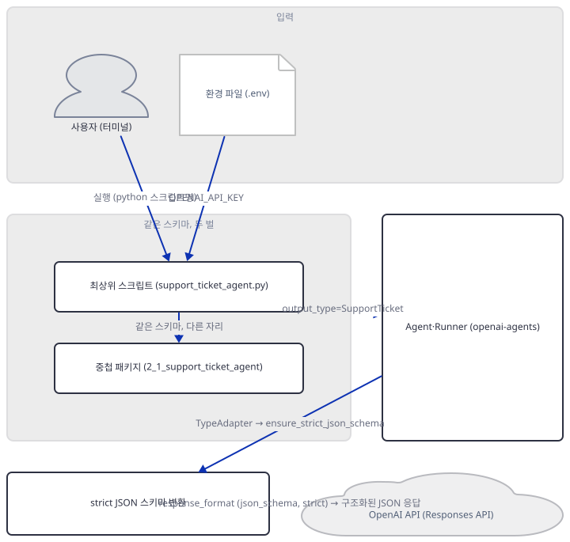
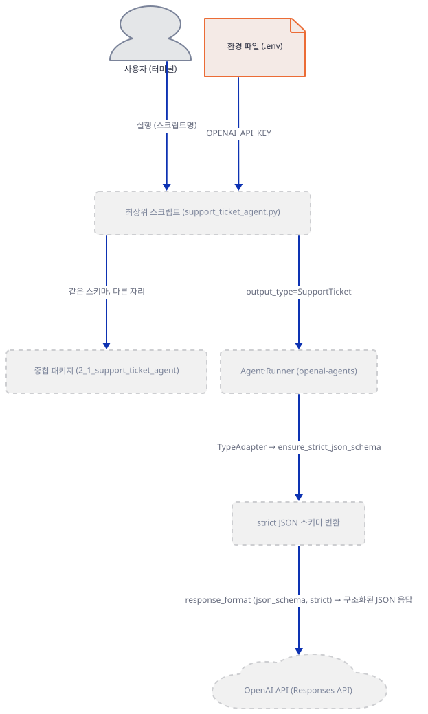
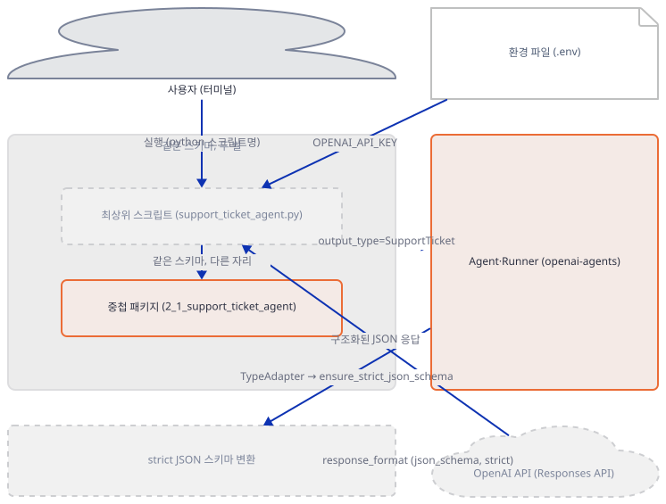
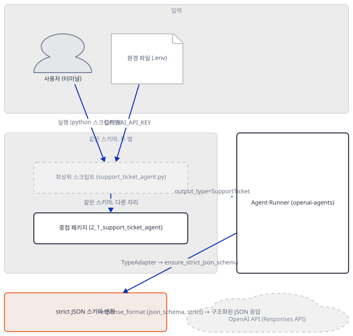
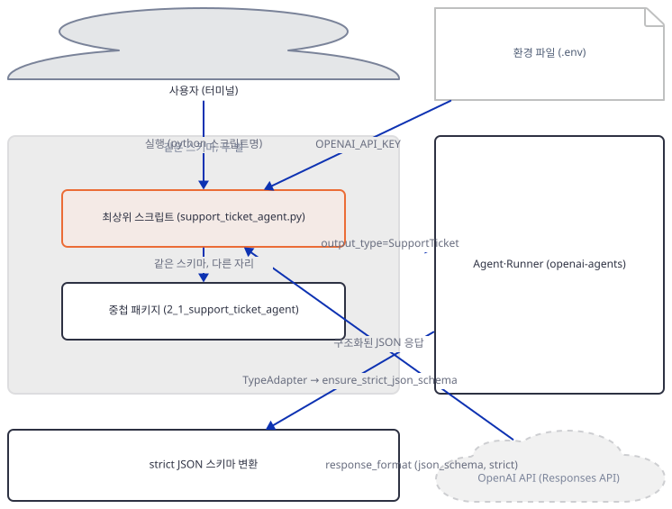
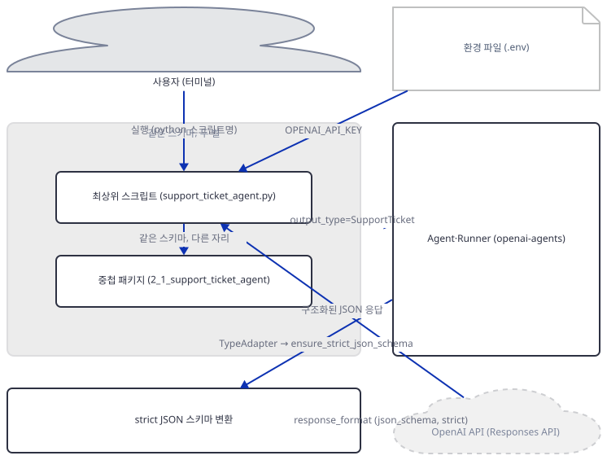
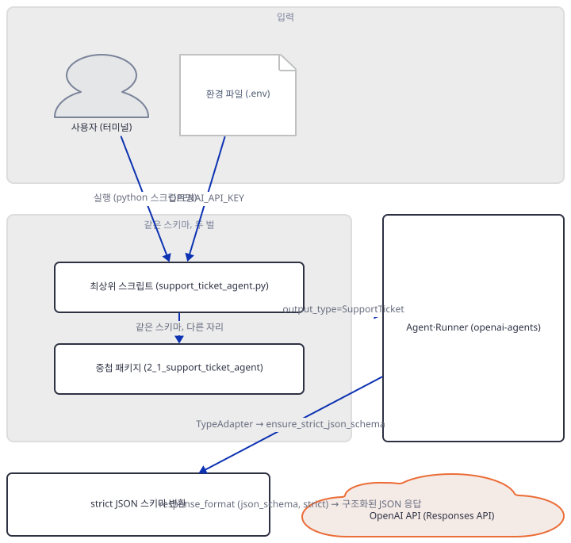
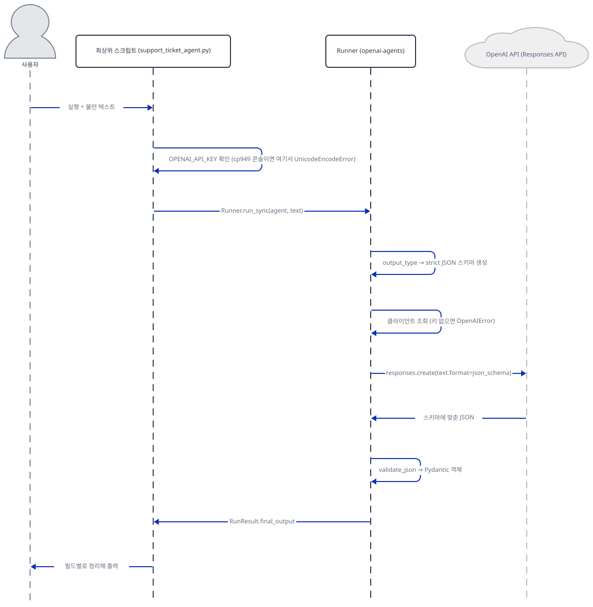

# Day 025 · OpenAI Agents SDK Crash Course · 2_structured_output_agent

> 볼륨 2 🧑‍🏫 Crash Courses · 난이도 ★★☆ · 예상 소요 70분(표준 분량보다 깁니다 — 같은 스키마의 구현이 두 벌이라 무엇을 실행할지부터 골라야 하고, 실패 지점도 두 군데를 각각 확인합니다) · API 비용 $0 (API 키 없이 진행 — 실제 모델 호출은 하지 않습니다) · 원본 앱: `ai_agent_framework_crash_course/openai_sdk_crash_course/2_structured_output_agent`

## 오늘 만들 것

Day 024는 `openai-agents` 패키지와 `from agents import Agent, Runner` 임포트, 단일 키 `OPENAI_API_KEY`를 이 볼륨의 공통 전제로 세웠습니다. 오늘의 `2_structured_output_agent`는 그 위에서 세 번째 축인 **형식 강제**를 다룹니다 — Day 016이 Google ADK의 `output_schema=`+`output_key=` 두 파라미터로 본 것과 같은 발상을, OpenAI Agents SDK는 `Agent(..., output_type=<Pydantic 모델>)` 파라미터 하나로 구현합니다(하나로 줄어든 이유와 그 대가는 Step 2·3에서 소스로 직접 확인합니다). 이 폴더의 진짜 문제는 스키마가 아니라 **중복**입니다 — 같은 두 아이디어(지원 티켓, 상품 리뷰)가 최상위에 각각 219·288줄짜리 독립 스크립트(`support_ticket_agent.py`, `product_review_agent.py`)로, 그리고 그 아래 42·46줄짜리 패키지(`2_1_support_ticket_agent/`, `2_2_product_review_agent/`)로 두 벌씩 있습니다. 이 문서는 둘을 나란히 문서화하는 대신 하나를 골라 실행합니다 — 레슨 자신의 "Getting Started"가 실제로 안내하는 것은 `python support_ticket_agent.py`·`python product_review_agent.py`뿐이고(중첩 패키지는 프로젝트 구조 표에만 등장), 중첩 패키지의 `root_agent`라는 이름은 Google ADK의 `adk web`이 스캔하던 바로 그 관례를 닮았지만 openai-agents 0.22.3에는 그 이름을 읽는 CLI가 아예 없습니다(Step 4에서 직접 확인) — 그래서 이 문서는 최상위 스크립트를 실행 대상으로 고르고, 중첩 패키지는 더 단순한 대안 구현으로 시야에 남겨 둡니다. `requirements.txt`에만 있고 Day 024엔 없던 `pydantic`이 이 레슨의 핵심이지만, 소스를 보면(Step 3) `output_type`이 실제로 만드는 것은 Gemini의 `response_schema`와는 다른 **strict JSON 스키마**이고, `Optional` 필드까지 전부 `required`에 강제로 들어가는 대가가 있습니다. 레슨 자신의 README는 존재하지 않는 `2_3_email_generator_agent/`와 `app.py`까지 프로젝트 구조에 나열하는데(Step 1에서 직접 확인), `requirements.txt`의 `streamlit`도 바로 그 없어진 `app.py`를 위한 것이었는지 이 폴더 어디에서도 import되지 않습니다. 완성 아키텍처는 다음과 같습니다.



## 사전 준비

| 서비스/도구 | 용도 | 발급·설치 |
|---|---|---|
| OpenAI API 키 (`OPENAI_API_KEY`) | 네 개 `Agent` 인스턴스(최상위 스크립트 2개 + 중첩 패키지 2개)가 공유하는 인증. 이 문서는 키를 발급하지 않고 키가 없을 때 정확히 어디서 멈추는지만 확인합니다 | https://platform.openai.com/api-keys 에서 발급 후 `.env`에 `OPENAI_API_KEY`로 설정 (이 실습에서는 생략 가능) |
| uv | 가상환경 생성과 패키지 설치 | [공통 사전 준비](../README.md#공통-사전-준비-한-번만) 절 참고 |
| 인터넷 연결 | PyPI에서 `openai-agents`·`pydantic` 등 설치 | 별도 설치 없음 |

## 아키텍처 한눈에 보기

| 컴포넌트 | 역할 | 코드 위치 |
|---|---|---|
| 사용자 (터미널) | 스크립트를 실행하고 불만·리뷰 텍스트를 입력 | 코드 없음 |
| 환경 파일 (`.env`) | `OPENAI_API_KEY` 보관 | `ai_agent_framework_crash_course/openai_sdk_crash_course/2_structured_output_agent/env.example:1-2` |
| 최상위 스크립트 (`support_ticket_agent.py`, `product_review_agent.py`) | 이 문서가 실행 대상으로 고른 진입점. 스키마 정의 + `Agent` 생성 + 데모/대화형 실행 | `ai_agent_framework_crash_course/openai_sdk_crash_course/2_structured_output_agent/support_ticket_agent.py:33-94` |
| 중첩 패키지 (`2_1_support_ticket_agent/`, `2_2_product_review_agent/`) | 같은 스키마의 더 단순한 대안 구현. 실행 대상으로 고르지 않음 | `ai_agent_framework_crash_course/openai_sdk_crash_course/2_structured_output_agent/2_1_support_ticket_agent/agent.py:1-42` |
| openai-agents SDK (`Agent`·`Runner`) | `output_type`을 접수하고 strict JSON 스키마를 만들어 `Runner`로 실행 | 코드 없음 (openai-agents 0.22.3 — 소스로 확인) |
| strict JSON 스키마 변환 (`ensure_strict_json_schema`) | Pydantic 스키마를 OpenAI Structured Outputs가 요구하는 형태로 변환 | 코드 없음 (openai-agents 0.22.3의 `agents/strict_schema.py` — 소스로 확인) |
| OpenAI API (Responses API) | 스키마에 맞춘 JSON 생성 | 코드 없음 (외부 서비스) |

## 단계별 진행

### Step 1. 환경 만들기와 의존성 확인

**목적.** 이 레슨의 실제 설치 대상(4줄짜리 `requirements.txt`)을 확인하고, 레슨 자신의 README가 프로젝트 구조에 나열하지만 실제로는 없는 파일들을 먼저 짚어 둡니다.

**할 일.**

```bash
cd ai_agent_framework_crash_course/openai_sdk_crash_course/2_structured_output_agent
uv venv
uv pip install -r requirements.txt
```

(pip 대안: `python -m venv .venv && source .venv/bin/activate && pip install -r requirements.txt`. Windows PowerShell은 활성화만 `.venv\Scripts\Activate.ps1`로 바꿉니다.)

이 저장소는 루트에 `pyproject.toml`이 있어 `uv run`이 방금 만든 환경 대신 루트의 `.venv`를 쓰므로, 이후 `uv run` 명령에는 모두 `--no-project`를 붙입니다.

`ai_agent_framework_crash_course/openai_sdk_crash_course/2_structured_output_agent/requirements.txt:1-4`

```text
openai-agents>=0.2.0
streamlit>=1.28.0
python-dotenv>=1.0.0
pydantic>=2.0.0
```

네 줄 중 `pydantic`은 openai-agents 0.22.3이 이미 `pydantic<3,>=2.12.2`를 전이 의존성으로 넣고 있어 설치만 놓고 보면 없어도 됩니다(직접 확인, `importlib.metadata.requires("openai-agents")`) — 그런데도 명시한 것은 이 폴더의 `agent.py`·`*_agent.py` 6개 파일이 전부 `from pydantic import BaseModel, Field`를 직접 쓰기 때문입니다. 반면 `streamlit`은 이 폴더의 어떤 `.py` 파일에서도 import되지 않습니다(직접 확인, `grep -rl streamlit *.py`는 아무것도 찾지 못함) — 아래에서 보듯 레슨 README가 약속하는 `app.py`(Streamlit 웹 UI)가 실제로는 없기 때문으로 보입니다.

레슨 자신의 `README.md`가 그리는 프로젝트 구조에는 이 폴더에 없는 두 가지가 나옵니다.

`ai_agent_framework_crash_course/openai_sdk_crash_course/2_structured_output_agent/README.md:72-75`

```text
├── 2_3_email_generator_agent/   # Simple structured output
│   ├── __init__.py
│   └── agent.py                # Email content generation (30 lines)
├── app.py                      # Streamlit web interface (optional)
```

`2_3_email_generator_agent/`도 `app.py`도 실제로는 없습니다(직접 확인, `find` 결과에 없음). 있는 것은 최상위 스크립트 2개(`support_ticket_agent.py`, `product_review_agent.py`)와 중첩 패키지 2개(`2_1_support_ticket_agent/`, `2_2_product_review_agent/`)뿐이며, 이 문서는 이 넷만 다룹니다.

환경 변수 틀도 두 군데입니다 — 최상위 `env.example`은 2줄인데 두 중첩 패키지 안의 `env.example`은 각각 8줄입니다.

`ai_agent_framework_crash_course/openai_sdk_crash_course/2_structured_output_agent/2_1_support_ticket_agent/env.example:1-8`

```text
# OpenAI API Configuration
OPENAI_API_KEY=your_openai_api_key_here

# Optional: Set a different base URL if using a different provider
# OPENAI_BASE_URL=https://api.openai.com/v1

# Optional: Organization ID if using OpenAI organization
# OPENAI_ORG_ID=your_organization_id_here
```

두 중첩 패키지의 `env.example`은 바이트 단위로 같습니다(직접 확인, `diff` 종료 코드 0). 늘어난 6줄은 전부 `#`으로 주석 처리된 선택 항목 둘(`OPENAI_BASE_URL`, `OPENAI_ORG_ID`)이고, 장식이 아니라 `openai` 패키지의 클라이언트 생성자가 실제로 읽는 환경변수입니다(소스로 확인, openai 3.17.0의 `openai/_client.py`) — 다만 주석 처리돼 있어 기본값으로는 아무 효과가 없습니다. 즉 어느 `env.example`을 쓰든 이 실습에 필요한 키는 `OPENAI_API_KEY` 하나뿐입니다.



**확인.**

```bash
uv run --no-project python -c "import agents, pydantic; print(agents.__version__, pydantic.VERSION)"
```

```
0.22.3 2.13.5
```

(Python 3.12.10으로 확인했습니다 — `uv venv --python 3.12`로 만든 throwaway 가상환경 기준입니다. 시스템 기본 Python은 3.13.12였습니다.)

### Step 2. 최소 스키마로 걷기 — output_type과, 없어진 output_key

**목적.** 가장 단순한 형태(중첩 패키지의 `SupportTicket`, 42줄)로 `output_type=`이 `Agent`에 실제로 어떻게 붙는지, ADK가 요구하던 `output_key`에 해당하는 것이 왜 없는지 확인합니다.

**할 일.** `2_1_support_ticket_agent/agent.py`의 스키마 부분입니다.

`ai_agent_framework_crash_course/openai_sdk_crash_course/2_structured_output_agent/2_1_support_ticket_agent/agent.py:6-23`

```python
class Priority(str, Enum):
    LOW = "low"
    MEDIUM = "medium"
    HIGH = "high"
    CRITICAL = "critical"

class SupportTicket(BaseModel):
    title: str = Field(description="A concise summary of the issue")
    description: str = Field(description="Detailed description of the problem")
    priority: Priority = Field(description="The ticket priority level")
    category: str = Field(description="The department this ticket belongs to")
    steps_to_reproduce: Optional[List[str]] = Field(
        description="Steps to reproduce the issue (for technical problems)",
        default=None
    )
    estimated_resolution_time: str = Field(
        description="Estimated time to resolve this issue"
    )
```

Day 016이 확인한 ADK의 `SupportTicket`과 필드까지 같습니다 — 달라지는 것은 이 스키마를 에이전트에 붙이는 자리뿐입니다.

`ai_agent_framework_crash_course/openai_sdk_crash_course/2_structured_output_agent/2_1_support_ticket_agent/agent.py:25-26`

```python
root_agent = Agent(
    name="Support Ticket Creator",
```

`ai_agent_framework_crash_course/openai_sdk_crash_course/2_structured_output_agent/2_1_support_ticket_agent/agent.py:41-42`

```python
    output_type=SupportTicket
)
```

ADK는 "무엇을 반환할지"(`output_schema=`)와 "어디에 둘지"(`output_key=`, 세션 상태의 키)를 파라미터 두 개로 나눴습니다. OpenAI Agents SDK는 이 둘을 하나로 합칩니다 — `Agent` 클래스에는 애초에 `output_key`에 해당하는 필드가 없고(아래에서 직접 확인), 소스를 보면(소스로 확인, openai-agents 0.22.3의 `agents/result.py`) 파싱된 객체는 그냥 `Runner.run()`/`run_sync()`가 돌려주는 `RunResult.final_output` 속성입니다 — "어디에 둘지"라는 질문 자체가 없고, 함수 호출의 반환값이 답입니다.



**확인.**

```bash
uv run --no-project python -c "
from agent import root_agent, SupportTicket
print(root_agent.output_type is SupportTicket)
print(hasattr(root_agent, 'output_key'))
"
```

```
True
False
```

(`2_1_support_ticket_agent` 폴더 안에서 실행해야 합니다 — 직접 확인.)

### Step 3. output_type이 실제로 만드는 요청 — strict 스키마와 Optional의 대가

**목적.** `output_type`이 내부에서 실제로 어떤 JSON 스키마로 바뀌는지, Day 016이 확인한 ADK/Gemini의 `t_schema()`와 무엇이 다른지 직접 계산으로 비교합니다.

**할 일.** 소스를 보면(소스로 확인, openai-agents 0.22.3의 `agents/agent_output.py`가 정의하는 `AgentOutputSchema.__init__`) `output_type`은 pydantic의 `TypeAdapter(output_type).json_schema()`로 JSON 스키마를 얻은 뒤, 기본값 `strict_json_schema=True`로 `agents/strict_schema.py`의 `ensure_strict_json_schema()`를 거칩니다. 이 함수의 핵심 한 줄은 다음입니다(소스로 확인).

```python
json_schema["required"] = list(properties.keys())
```

즉 **선언된 필드는 `Optional`이든 아니든 전부 `required`에 들어갑니다.** `steps_to_reproduce: Optional[List[str]] = Field(default=None)`도 예외가 아닙니다.



**확인.** 실제로 돌려보면 이렇게 나옵니다.

```bash
uv run --no-project python -c "
from agent import SupportTicket
from agents.agent_output import AgentOutputSchema
import json
schema = AgentOutputSchema(SupportTicket)
print(json.dumps(schema.json_schema(), indent=2))
"
```

```json
{
  "$defs": {
    "Priority": {
      "enum": ["low", "medium", "high", "critical"],
      "title": "Priority",
      "type": "string"
    }
  },
  "properties": {
    "title": {"description": "A concise summary of the issue", "title": "Title", "type": "string"},
    "description": {"description": "Detailed description of the problem", "title": "Description", "type": "string"},
    "priority": {"description": "The ticket priority level", "enum": ["low", "medium", "high", "critical"], "title": "Priority", "type": "string"},
    "category": {"description": "The department this ticket belongs to", "title": "Category", "type": "string"},
    "steps_to_reproduce": {
      "anyOf": [{"items": {"type": "string"}, "type": "array"}, {"type": "null"}],
      "description": "Steps to reproduce the issue (for technical problems)",
      "title": "Steps To Reproduce"
    },
    "estimated_resolution_time": {"description": "Estimated time to resolve this issue", "title": "Estimated Resolution Time", "type": "string"}
  },
  "required": ["title", "description", "priority", "category", "steps_to_reproduce", "estimated_resolution_time"],
  "title": "SupportTicket",
  "type": "object",
  "additionalProperties": false
}
```

(`2_1_support_ticket_agent` 폴더 안에서 실행 — 직접 확인. 출력의 한 줄짜리 딕셔너리는 지면상 접었을 뿐 값은 실제 출력 그대로입니다.) Day 016이 확인한 Gemini의 `t_schema()` 출력은 같은 필드 구성에서 `steps_to_reproduce`를 `required`에서 아예 뺐고(5개 필드만), 타입도 `anyOf` 없이 `nullable: true`가 붙은 `ARRAY` 하나였습니다. OpenAI 쪽은 6개 필드 전부가 `required`이고 `steps_to_reproduce`는 `anyOf`로 "배열 또는 null"을 표현합니다 — `Optional`은 "생략 가능"이 아니라 "항상 오지만 null일 수 있다"로 바뀝니다. 여기에 `additionalProperties: false`까지 모든 객체에 강제로 붙어, 스키마에 없는 필드는 아예 허용되지 않습니다.

### Step 4. 같은 스키마, 두 벌 — 무엇을 실행할지 고르기

**목적.** 최상위 스크립트와 중첩 패키지가 정말 같은 아이디어의 중복인지 diff와 스키마 비교로 확인하고, `root_agent`라는 이름이 실제로 무언가를 여는 열쇠인지 확인한 뒤 실행 대상을 정합니다.

**할 일.** 두 `Agent(...)` 생성자의 최상위 키워드 인자 이름만 뽑아 비교합니다.

```bash
cd ai_agent_framework_crash_course/openai_sdk_crash_course/2_structured_output_agent
diff <(grep -oE '^ {4}[a-z_]+=' 2_1_support_ticket_agent/agent.py) \
     <(grep -oE '^ {4}[a-z_]+=' 2_2_product_review_agent/agent.py)
echo "exit: $?"
```

```
exit: 0
```

두 파일 모두 `name=`·`instructions=`·`output_type=` 세 개를 같은 순서로 쓰고, 최상위 스크립트 두 개도 같은 방식으로 비교하면 마찬가지입니다(직접 확인) — "생성자 모양"은 스키마 복잡도와 무관하게 항상 같습니다. 하지만 스키마 자체는 다릅니다. 중첩 `SupportTicket`은 6개 필드(Step 2)인데, 최상위 `support_ticket_agent.py`의 `SupportTicket`은 8개 필드입니다.

`ai_agent_framework_crash_course/openai_sdk_crash_course/2_structured_output_agent/support_ticket_agent.py:33-53`

```python
class SupportTicket(BaseModel):
    """Structured support ticket model"""
    title: str = Field(description="A concise summary of the issue")
    description: str = Field(description="Detailed description of the problem")
    priority: Priority = Field(description="The ticket priority level")
    category: Category = Field(description="The department this ticket belongs to")
    customer_name: Optional[str] = Field(
        description="Customer name if mentioned",
        default=None
    )
    steps_to_reproduce: Optional[List[str]] = Field(
        description="Steps to reproduce the issue (for technical problems)",
        default=None
    )
    estimated_resolution_time: str = Field(
        description="Estimated time to resolve this issue"
    )
    urgency_keywords: List[str] = Field(
        description="Keywords that indicate urgency or importance",
        default=[]
    )
```

`category`가 평범한 `str`이 아니라 `Category` 5단계 `Enum`이고, `customer_name`·`urgency_keywords` 두 필드가 더 있습니다. 상품 리뷰 쪽 차이는 더 커서, 중첩 `2_2_product_review_agent/agent.py`의 `ProductReview`는 7개 필드가 나란한 평면 구조인데 최상위 `product_review_agent.py`는 하위 `BaseModel` 3개(`ProductInfo`·`ReviewMetrics`·`ReviewAspects`)를 필드로 물고 있습니다(다음 Step에서 이 중첩이 실제로 문제없이 변환되는지 확인합니다).

그렇다면 `root_agent`라는 이름과 숫자로 시작하는 폴더(`2_1_...`, `2_2_...`)는 무엇을 위한 것일까요 — Google ADK 크래시 코스(Day 014~023)에서 `adk web`이 정확히 이 관례(폴더 안 `root_agent`)를 스캔했던 것과 닮았습니다. 하지만 openai-agents 0.22.3에는 그런 CLI가 없습니다.

```bash
ls .venv/Scripts | grep -i agent
echo "exit: $?"
```

```
exit: 1
```

(`.venv`는 Step 1에서 이 폴더에 만든 그 가상환경입니다 — macOS·Linux는 `Scripts` 대신 `bin`. 종료 코드 1 = grep이 아무것도 못 찾음, 즉 콘솔 스크립트가 하나도 없다는 뜻입니다 — 직접 확인.) `2_1_support_ticket_agent/__init__.py`도 `root_agent`를 다시 내보내지 않습니다.

`ai_agent_framework_crash_course/openai_sdk_crash_course/2_structured_output_agent/2_1_support_ticket_agent/__init__.py:1`

```python
# Support Ticket Agent Package
```

게다가 폴더 이름 자체가 숫자로 시작해 유효한 파이썬 식별자가 아닙니다 — Day 005의 `mixture-of-agents.py`(하이픈)와 같은 종류의 문제입니다. 즉 `root_agent`·숫자 폴더 관례는 이 SDK에서 아무것도 열지 않는 장식이고, 레슨 자신의 README "Getting Started" 절이 실제로 안내하는 것은 `python support_ticket_agent.py`·`python product_review_agent.py`뿐입니다 — 중첩 패키지는 "Project Structure" 표에만 등장하고 실행 안내엔 없습니다. 이 문서는 그래서 **최상위 스크립트를 실행 대상으로 고릅니다**: 스키마가 더 풍부하고, `demonstrate_*()`(캔드 테스트 4건)와 `interactive_mode()`까지 갖춘 유일하게 완결된 진입점이기 때문입니다. 중첩 패키지는 Step 2·3에서 이미 본 것처럼 "같은 스키마의 더 단순한 버전"으로 시야에 남겨 둡니다.



**확인.** 폴더 이름으로 직접 import를 시도하면 재현됩니다.

```bash
uv run --no-project python -c "import 2_1_support_ticket_agent"
```

```
  File "<string>", line 1
    import 2_1_support_ticket_agent
              ^
SyntaxError: invalid decimal literal
```

### Step 5. 복잡한 스키마도 되는가 — 중첩 서브모델과 낡은 validator

**목적.** Step 4에서 시야에 남긴 최상위 `ProductReview`(서브모델 3개 중첩)가 strict 스키마 변환을 실제로 통과하는지, 이 파일이 쓰는 낡은 Pydantic v1 스타일 `@validator`가 문제를 일으키는지 확인합니다.

**할 일.** `product_review_agent.py`는 `ProductReview` 하나가 `ProductInfo`·`ReviewMetrics`·`ReviewAspects` 세 `BaseModel`을 필드로 문 구조입니다.

`ai_agent_framework_crash_course/openai_sdk_crash_course/2_structured_output_agent/product_review_agent.py:38-43`

```python
class ProductInfo(BaseModel):
    """Product information extracted from review"""
    name: Optional[str] = Field(description="Product name if mentioned", default=None)
    category: ProductCategory = Field(description="Inferred product category")
    brand: Optional[str] = Field(description="Brand name if mentioned", default=None)
    price_mentioned: Optional[str] = Field(description="Price if mentioned in review", default=None)
```

`ai_agent_framework_crash_course/openai_sdk_crash_course/2_structured_output_agent/product_review_agent.py:60-64`

```python
class ProductReview(BaseModel):
    """Complete structured product review analysis"""
    product_info: ProductInfo
    metrics: ReviewMetrics
    aspects: ReviewAspects
```

또 하나, `key_phrases` 필드에는 Pydantic v1 스타일 검증기가 붙어 있습니다.

`ai_agent_framework_crash_course/openai_sdk_crash_course/2_structured_output_agent/product_review_agent.py:75-78`

```python
    @validator('key_phrases')
    def limit_key_phrases(cls, v):
        """Limit key phrases to maximum of 5"""
        return v[:5] if len(v) > 5 else v
```

`from pydantic import validator`는 Pydantic 2.x에서 폐기 예정인 v1 API입니다.



**확인.**

```bash
uv run --no-project python -W default -c "
from product_review_agent import ProductReview
from agents.agent_output import AgentOutputSchema
schema = AgentOutputSchema(ProductReview)
print('is_strict:', schema.is_strict_json_schema())
print('required:', schema.json_schema()['required'])
"
```

```
product_review_agent.py:75: PydanticDeprecatedSince20: Pydantic V1 style `@validator` validators are deprecated. You should migrate to Pydantic V2 style `@field_validator` validators, see the migration guide for more details. Deprecated in Pydantic V2.0 to be removed in V3.0. See Pydantic V2 Migration Guide at https://errors.pydantic.dev/2.13/migration/
  @validator('key_phrases')
is_strict: True
required: ['product_info', 'metrics', 'aspects', 'main_positives', 'main_negatives', 'would_recommend', 'summary', 'key_phrases']
```

(경고만 뜨고 변환은 성공합니다 — 서브모델 3개는 `$defs`로 펼쳐져 `$ref`로 연결되고, `ProductReview` 자신의 8개 필드는 서브모델 3개를 포함해 전부 `required`에 들어갑니다. 이 경고는 기본 설정으로 모듈을 import만 할 때는 나타나지 않고 `-W default`로 강제하거나 `__main__`으로 직접 실행할 때만 보입니다 — 직접 확인.)

### Step 6. 키 없이 실행 — 콘솔 인코딩과 SDK 예외, 그리고 결과가 가는 곳

**목적.** Step 4에서 고른 최상위 스크립트를 키 없이 실제로 실행해 어디서 멈추는지 보고, 가드가 없는 중첩 패키지 경로는 어디서 멈추는지 대조합니다. 성공했다면 결과가 어디로 갔을지도 정리합니다.

**할 일.** `support_ticket_agent.py`는 `Runner`를 부르기 전에 자체 가드를 둡니다.

`ai_agent_framework_crash_course/openai_sdk_crash_course/2_structured_output_agent/support_ticket_agent.py:202-206`

```python
    # Check API key
    if not os.getenv("OPENAI_API_KEY"):
        print("❌ Error: OPENAI_API_KEY not found in environment variables")
        print("Please create a .env file with your OpenAI API key")
        return
```

Windows cp949 콘솔에서는 이 가드 자체가 실패합니다 — Day 019가 이미 문서화한 것과 같은 종류의 문제입니다: 이모지(❌, U+274C)를 cp949로 인코딩할 수 없어 `print()`가 `UnicodeEncodeError`를 던집니다. `Runner`를 부르기도 전에, 자기 자신의 안내 문구에서 멈춥니다.



**확인.**

```bash
uv run --no-project python support_ticket_agent.py
```

```
Traceback (most recent call last):
  File "...\support_ticket_agent.py", line 219, in <module>
    main()
  File "...\support_ticket_agent.py", line 204, in main
    print("\u274c Error: OPENAI_API_KEY not found in environment variables")
UnicodeEncodeError: 'cp949' codec can't encode character '\u274c' in position 0: illegal multibyte sequence
```

(`product_review_agent.py`도 같은 줄 구조·같은 예외로 멈춥니다 — 직접 확인. 파일 경로는 환경마다 달라 `...`로 줄였습니다.) 가드가 없는 중첩 패키지 쪽은 다른 지점에서 멈춥니다 — `Runner.run_sync`가 실제로 `openai` 클라이언트 조회까지 도달해, 거기서 깨끗한 예외를 던집니다.

```bash
uv run --no-project python -c "
from agent import root_agent
from agents import Runner
Runner.run_sync(root_agent, 'my app crashes on login')
"
```

```
OPENAI_API_KEY is not set, skipping trace export
Traceback (most recent call last):
  ...
openai.OpenAIError: Missing credentials. Please pass an `api_key`, `workload_identity`, `admin_api_key`, or set the `OPENAI_API_KEY` or `OPENAI_ADMIN_KEY` environment variable.
```

(`2_1_support_ticket_agent` 폴더 안에서 실행 — 직접 확인. 트레이스백 중간은 지면상 줄였습니다.) Day 016이 ADK에서 본 것과 같은 자리입니다 — 프레임워크가 아니라 그 아래 벤더 SDK(거기선 `google-genai`, 여기선 `openai`)가 키를 검증합니다. 다른 점은 예외 타입(`ValueError` 대 `openai.OpenAIError`)과, 이 SDK는 실패 직전에 트레이싱을 건너뛴다는 안내를 먼저 찍는다는 것입니다. 네트워크 요청은 두 경로 모두 한 번도 나가지 않습니다.

키가 있었다면 `Runner.run_sync`는 `output_type`으로 지정한 클래스의 인스턴스를 `RunResult.final_output`에 담아 돌려주고, 최상위 스크립트는 그 객체의 필드를 바로 읽어(`ticket.title`, `ticket.priority.value.title()`처럼) 출력합니다 — Step 2에서 확인했듯 이 사이 어디에도 ADK의 `output_key` 같은 세션 상태 키는 없습니다.

## 요청 한 건이 흐르는 과정



사용자가 `python support_ticket_agent.py`를 실행하면 스크립트는 먼저 자체 가드로 `OPENAI_API_KEY`를 확인합니다 — 이 문서의 cp949 콘솔에서는 안내 문구의 이모지가 `UnicodeEncodeError`를 던져 여기서 이미 끝납니다(Step 6). 가드를 통과했다면(또는 가드가 없는 중첩 패키지라면) `Runner.run_sync(agent, text)`가 호출되고, `Runner`는 `output_type`을 `AgentOutputSchema`로 감싸 `TypeAdapter.json_schema()` 후 `ensure_strict_json_schema()`를 거친 strict JSON 스키마를 만듭니다(Step 3) — 여기까지는 순수 인프로세스 계산입니다. 그다음 `Runner`는 `openai` 클라이언트를 조회하는데, 이 문서의 환경처럼 키가 없으면 클라이언트가 만들어지는 이 순간 `openai.OpenAIError`가 발생해 사슬이 끊깁니다(Step 6) — 네트워크 요청은 한 번도 나가지 않습니다. 키가 있었다면 클라이언트는 스키마가 담긴 `response_format`과 함께 OpenAI Responses API에 `responses.create(...)`를 보내고, 돌아온 JSON 텍스트를 `validate_json()`으로 다시 Pydantic 객체로 만들어 `RunResult.final_output`에 담아 스크립트로 돌려줍니다. ADK처럼 결과를 세션 상태의 특정 키에 저장하는 단계는 없습니다 — 스크립트는 그 객체를 함수 반환값으로 직접 받아 필드를 출력합니다.

## 실행 체크리스트

- [ ] `uv venv && uv pip install -r requirements.txt`로 4개 패키지를 설치했고, `streamlit`은 이 레슨에서 실제로 쓰이지 않는다는 것도 확인했다
- [ ] 레슨 자신의 README가 존재하지 않는 `2_3_email_generator_agent/`와 `app.py`를 나열한다는 것을 직접 확인했다
- [ ] 중첩 패키지의 최소 `SupportTicket`(6개 필드)으로 `output_type=`이 `Agent`에 어떻게 붙는지, `output_key`에 해당하는 것이 없다는 것을 확인했다
- [ ] `AgentOutputSchema`가 만드는 strict JSON 스키마에서 `Optional` 필드도 `required`에 전부 들어간다는 것을, Day 016의 Gemini 스키마와 비교해 확인했다
- [ ] 최상위 스크립트와 중첩 패키지의 `Agent(...)` 생성자 키워드가 diff로 같다는 것과, 스키마 자체(필드 수·`Enum`·중첩)는 다르다는 것을 확인했다
- [ ] `root_agent`라는 이름을 읽는 콘솔 스크립트가 openai-agents에 없다는 것과, 폴더 이름이 유효한 파이썬 식별자가 아니라는 것을 확인했다
- [ ] 서브모델 3개짜리 `ProductReview`도 strict 스키마 변환이 되는 것과, 낡은 `@validator` 경고를 확인했다
- [ ] 키 없이 두 실행 경로(최상위 스크립트의 자체 가드, 중첩 패키지의 SDK 예외)가 서로 다른 지점에서 멈춘다는 것을 직접 실행해 확인했다

## 문제 해결

| 증상 | 원인 | 해결 |
|---|---|---|
| 레슨 자신의 README가 나열하는 `2_3_email_generator_agent/`, `app.py`가 폴더에 없고, `requirements.txt`의 `streamlit`도 어디서도 import되지 않음 | README의 "Project Structure"가 계획된 세 번째 예제(이메일 생성 에이전트)와 Streamlit UI를 실제로는 채우지 못한 상태로 남음(직접 확인) | 실제로 있는 최상위 스크립트 2개와 중첩 패키지 2개만 사용 |
| `python support_ticket_agent.py`/`product_review_agent.py`를 키 없이 실행하면 의도한 안내 대신 `UnicodeEncodeError`로 죽음 | cp949 콘솔에서 안내 문구의 이모지(❌)를 인코딩하지 못함 — Day 019가 이미 문서화한 것과 같은 종류(직접 확인) | 콘솔 코드페이지를 UTF-8로 바꾸거나(`chcp 65001`), `.env`에 `OPENAI_API_KEY`를 설정해 가드를 통과시킴(리포 코드 자체는 고치지 않음) |
| 중첩 패키지(`2_1_...`, `2_2_...`)에서 직접 `Runner.run_sync`를 부르면 `openai.OpenAIError: Missing credentials...`로 실패 | 이 두 파일엔 최상위 스크립트와 달리 키 확인 가드가 없어 SDK까지 그대로 도달함(직접 확인) | `.env`에 `OPENAI_API_KEY`를 설정 |
| `import 2_1_support_ticket_agent`를 시도하면 `SyntaxError: invalid decimal literal` | 폴더 이름이 숫자로 시작해 유효한 파이썬 식별자가 아님(직접 확인) — Day 005의 `mixture-of-agents.py`(하이픈)와 같은 종류 | 폴더 안에서 `from agent import root_agent`처럼 상대 경로로 접근 |
| `product_review_agent.py`를 실행하거나 그 `ProductReview`로 스키마를 만들면 `PydanticDeprecatedSince20` 경고가 뜸 | `@validator`가 Pydantic 2.x에서 폐기 예정인 v1 스타일 API(직접 확인) | 경고일 뿐 동작은 정상. 없애려면 `@field_validator`로 바꿔야 함(리포 코드 자체는 고치지 않음) |
| `uv run`에서 `--no-project`를 빠뜨리면 `from agents import Agent`가 "모듈 없음"이 아니라 TensorFlow·Gym 경고를 잔뜩 찍은 뒤 `AttributeError: module 'tensorflow' has no attribute 'contrib'`로 죽음 | 이 저장소 루트의 `.venv`에 openai-agents와 무관한 **TensorFlow Agents 1.4.0**이 이미 같은 이름 `agents`로 설치돼 있어(직접 확인, `.venv/Lib/site-packages/agents/__init__.py`), `--no-project` 없이는 그 패키지를 대신 임포트함 — `Agent`가 없다는 오류조차 아니고, TF Agents 내부 임포트 체인이 요구하는 낡은 `tf.contrib`가 먼저 없어서 죽음. 다른 일차보다 이 볼륨에서 더 헷갈리는 함정입니다(Day 024에서도 같은 원인을 다룰 수 있습니다) | 이 문서의 모든 `uv run`처럼 항상 `--no-project`를 붙임 |

## 더 해보기

- `agents/agent_output.py`가 정의하는 `_WRAPPER_DICT_KEY = "response"` 근처를 읽고, `ai_agent_framework_crash_course/openai_sdk_crash_course/2_structured_output_agent/2_1_support_ticket_agent/agent.py:41`의 `output_type=SupportTicket`을 (별도 스크립트에서) `output_type=list[str]`처럼 `BaseModel`이 아닌 타입으로 바꿔 `AgentOutputSchema`가 실제로 `{"response": [...]}`로 감싸는지 확인해보기
- `ai_agent_framework_crash_course/openai_sdk_crash_course/2_structured_output_agent/product_review_agent.py:75-78`의 `@validator('key_phrases')`를 Pydantic v2 스타일 `@field_validator('key_phrases')`(`@classmethod` 필요)로 실제로 고쳐보고 `PydanticDeprecatedSince20` 경고가 사라지는지 확인해보기
- 실제 `OPENAI_API_KEY`를 발급받아 `support_ticket_agent.py`를 실행하고, `demonstrate_support_tickets()`의 4개 테스트 케이스가 돌려주는 JSON에서 `customer_name`이 언급되지 않은 사례의 `steps_to_reproduce`·`customer_name`이 정말 `null`로 채워져 오는지(Step 3에서 예측한 대로) 비교해보기

## 다음 날 예고

[Day 026 · OpenAI Agents SDK Crash Course · 3_tool_using_agent](../day026-openai-sdk-3-tool-using-agent/README.md) — 함수 도구(`calculator_agent.py`)와 OpenAI 내장 도구를 에이전트에 연결해 실제 동작을 호출하게 만드는 방법을 다룹니다.
