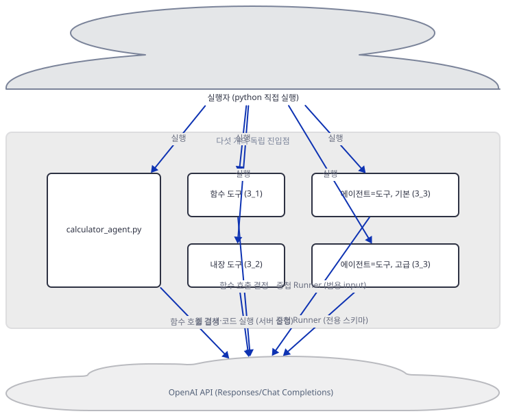
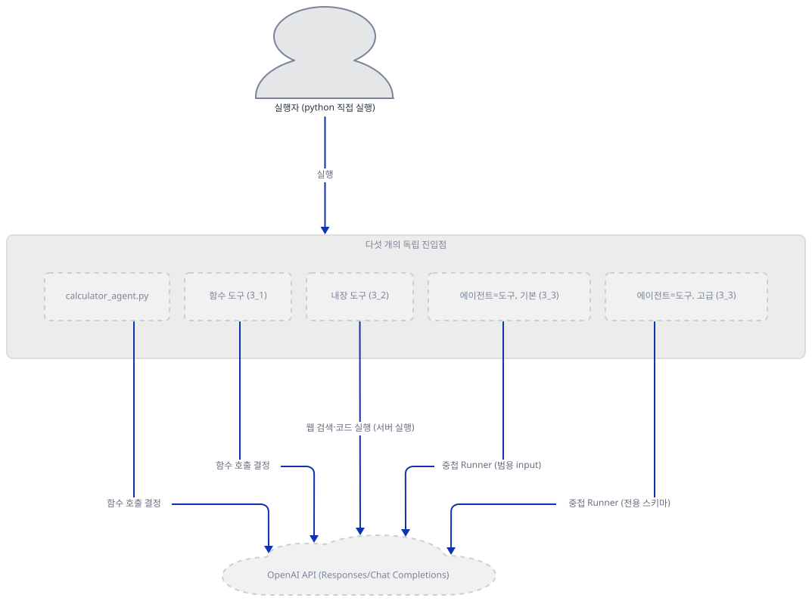
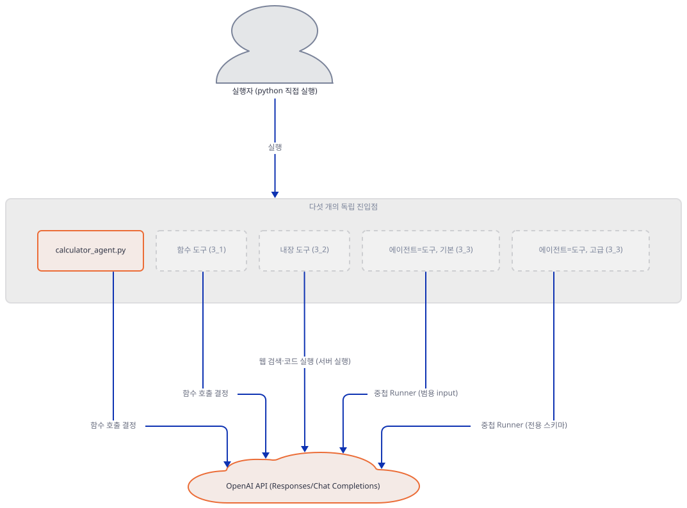
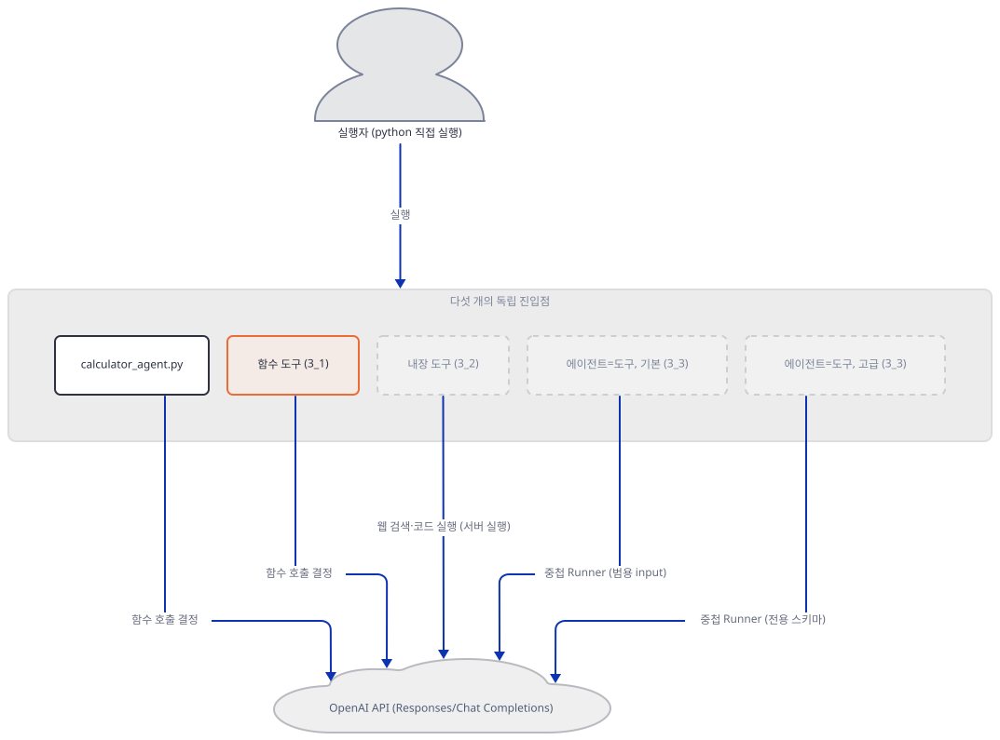
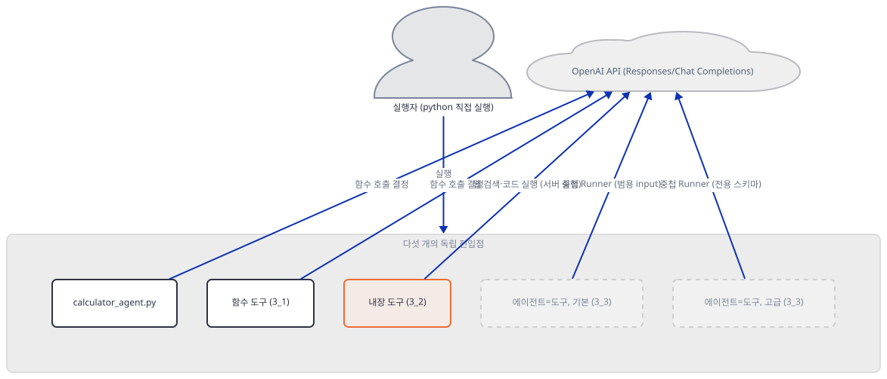
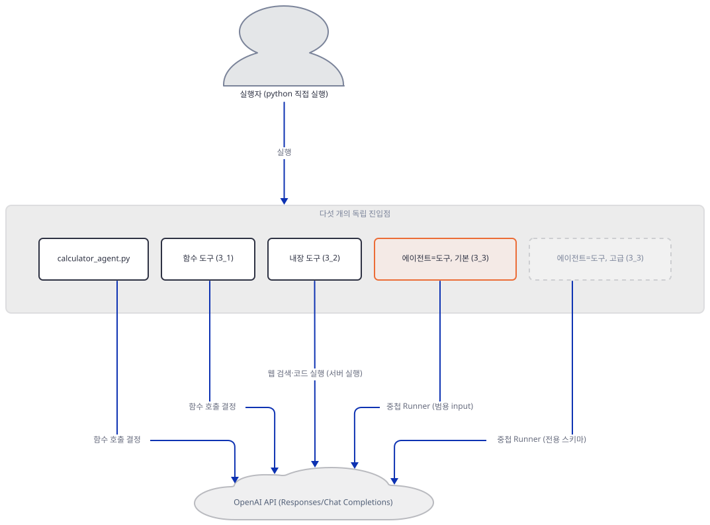
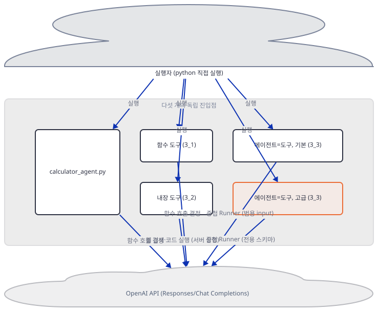
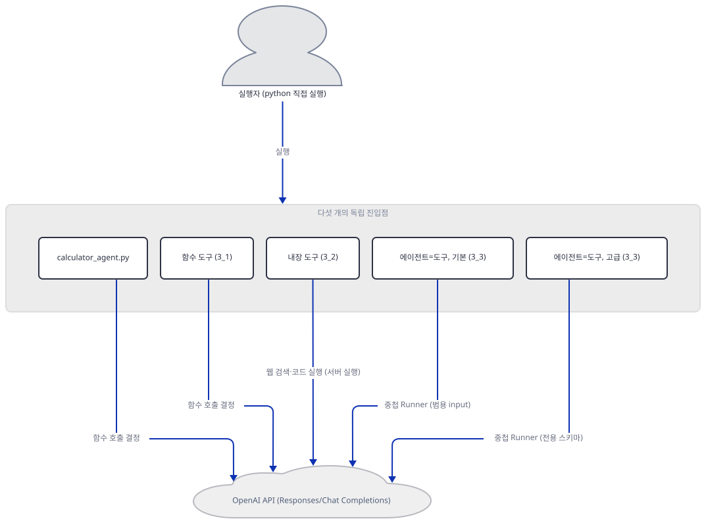
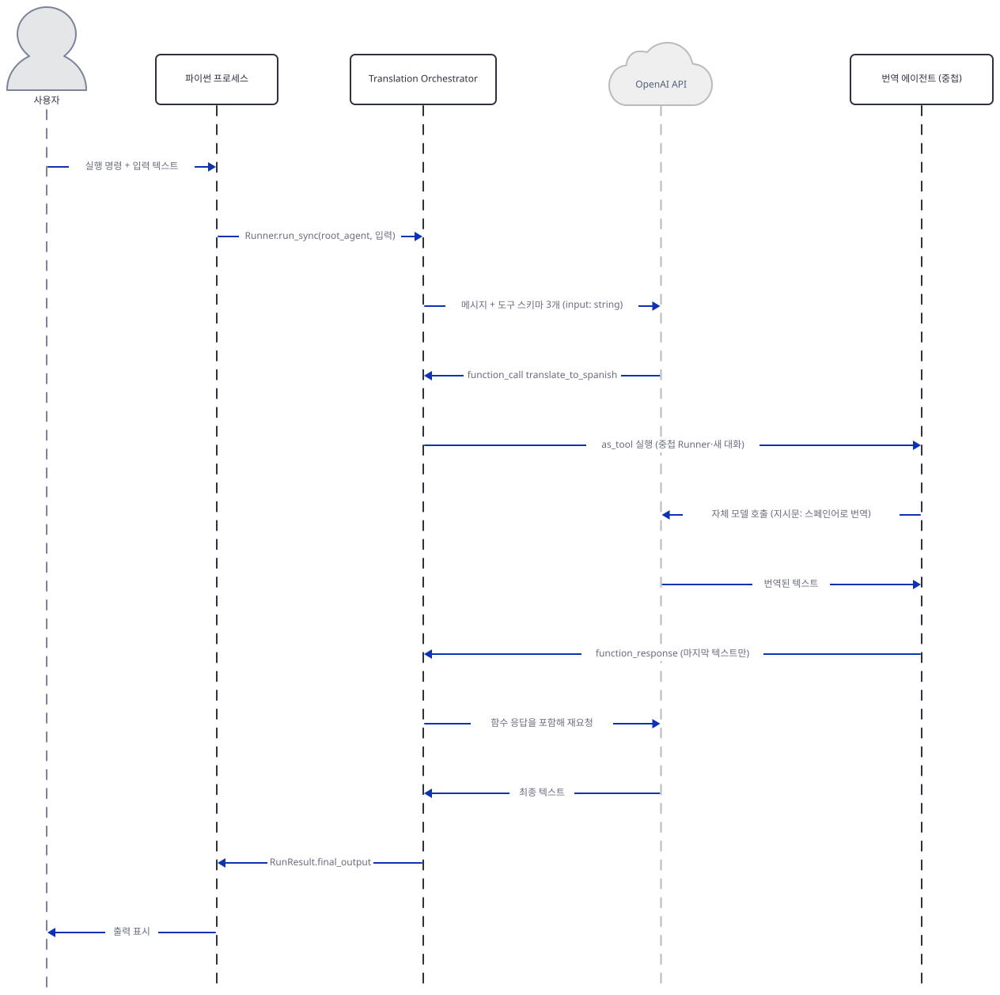

# Day 026 · OpenAI Agents SDK Crash Course · 3_tool_using_agent

> 볼륨 2 🧑‍🏫 Crash Courses · 난이도 ★★☆ · 예상 소요 100분(하위 레슨 세 개와 최상위 데모 파일 하나를 모두 다루고, 그 위에 SDK 소스·스키마까지 직접 확인해 다른 크래시 코스 날보다 깁니다) · API 비용 $0 (API 키 없이 진행 — 더미 값으로 OpenAI 서버의 401 응답까지는 확인했지만 유효한 키로 실제 모델을 호출하지는 않았습니다) · 원본 앱: `ai_agent_framework_crash_course/openai_sdk_crash_course/3_tool_using_agent`

## 오늘 만들 것

Day 024는 이 볼륨의 공통 축 — `openai-agents` 패키지, `from agents import Agent, Runner, function_tool`, 단일 키 `OPENAI_API_KEY`, `gpt-4o-mini`/`gpt-4o` 모델 — 을 세웠습니다. 오늘의 `3_tool_using_agent`는 그 위에 이 볼륨의 실질적인 주제 하나 — **에이전트에게 도구를 쥐어주는 서로 다른 방법** — 를 얹습니다. 같은 주제를 Day 017은 Google ADK로 네 갈래(내장·함수·서드파티·MCP)에 걸쳐 다뤘고, 오늘은 OpenAI Agents SDK로 세 갈래를 다룹니다 — 직접 쓴 파이썬 함수(`3_1_function_tools`, 도구를 별도 `tools.py`에 모아 둠), SDK가 이미 만들어 둔 호스팅 도구(`3_2_builtin_tools`), 그리고 다른 에이전트 자체를 도구로 쓰는 방법(`3_3_agents_as_tools`, 에이전트 파일 두 개). 이 폴더엔 세 하위 레슨 말고도 최상위에 `calculator_agent.py`라는 독립된 데모가 하나 더 있는데, 최상위 README의 파일 구조 설명은 이 파일의 존재도 세 하위 레슨 `agent.py`의 실제 줄 수도 맞히지 못합니다 — Step 2에서 실제 `ls` 결과와 대조합니다.

세 갈래가 모델에게 요구하는 것은 소스로 확인한 결과 서로 다릅니다. 함수 도구는 파이썬 함수의 시그니처와 독스트링에서 뽑은 JSON 스키마 하나를 모델에게 보여주고 실행은 우리 프로세스 안에서 일어납니다. 내장 도구는 이름 하나(`web_search`, `code_interpreter`)만 건네고 실행 자체를 OpenAI 서버에 떠맡깁니다(Responses API). 에이전트-도구는 감싼 에이전트가 무엇을 하든 상관없이 문자열 필드 하나(`input`)만 모델에게 보여주고, 그 뒤에서 완전히 새로운 `Runner`를 통째로 돌립니다 — 가장 싸 보이는 서술이 가장 비싼 실행을 감춥니다. 이 마지막 갈래는 Day 021이 ADK에서 확인한 경계(제어권을 넘기고 돌아오지 않는 하위 에이전트 대, 호출하면 반드시 돌아오는 도구로서의 에이전트)와 정확히 같은 자리에 있습니다 — OpenAI SDK의 `Agent` 생성자도 `tools=`와 별도로 `handoffs=`라는 자리를 두어 그 구분을 그대로 반영합니다(소스로 확인. `handoffs=`의 실제 사용법은 뒤에 나올 레슨의 몫이라 여기서는 존재만 확인합니다).

이 레슨엔 `requirements.txt`가 top 레벨에도 세 하위 폴더 어디에도 없습니다 — 이 볼륨에서 그런 폴더가 있는 셋 중 하나입니다. Step 1에서 여섯 개 파이썬 파일의 import를 직접 훑어 실제로 필요한 패키지 두 개를 정했습니다. API 키 없이 다섯 진입점(계산기 데모 + 세 하위 레슨 + 고급 오케스트레이터) 각각이 어디서, 어떻게 다르게 막히는지도 전부 직접 실행해 확인했고, 그중 두 하위 레슨은 자기 자신의 Quick Start조차 지금 설치되는 SDK 버전에서 그대로 실패합니다. 완성 구조는 다음과 같습니다.



## 사전 준비

| 서비스/도구 | 용도 | 발급·설치 |
|---|---|---|
| OpenAI API 키 (`OPENAI_API_KEY`) | 다섯 진입점 모두의 모델 호출에 필요. 이 문서는 키를 발급하지 않고, 키가 아예 없을 때와 더미 값일 때 각각 어디서 막히는지만 확인합니다 | https://platform.openai.com/api-keys 에서 발급 (이 실습에서는 생략) |
| uv | 가상환경 생성과 패키지 설치 | [공통 사전 준비](../README.md#공통-사전-준비-한-번만) 참고 |
| 인터넷 연결 | PyPI에서 `openai-agents`·`python-dotenv` 설치, 더미 키로 OpenAI 서버의 401 응답을 확인하는 데도 필요 | 별도 설치 없음 |

## 아키텍처 한눈에 보기

| 컴포넌트 | 역할 | 코드 위치 |
|---|---|---|
| 실행자 (터미널) | `python -c` 또는 `python 파일.py`로 다섯 진입점 중 하나를 직접 실행 | 코드 없음 (외부 터미널) |
| `calculator_agent.py` | 함수 도구 8개로 사칙연산·복리·도형 넓이·온도 변환을 수행하는 독립 데모, 유일하게 키 부재를 스스로 확인 | `ai_agent_framework_crash_course/openai_sdk_crash_course/3_tool_using_agent/calculator_agent.py:1-208` |
| 함수 도구 에이전트 (`3_1_function_tools`) | Function Tools Agent, 별도 `tools.py`의 함수 4개를 도구로 사용 | `ai_agent_framework_crash_course/openai_sdk_crash_course/3_tool_using_agent/3_1_function_tools/agent.py:1-24`, `ai_agent_framework_crash_course/openai_sdk_crash_course/3_tool_using_agent/3_1_function_tools/tools.py:1-28` |
| 내장 도구 에이전트 (`3_2_builtin_tools`) | Built-in Tools Agent, `WebSearchTool`·`CodeInterpreterTool` 사용(이 버전에서는 생성 자체가 실패) | `ai_agent_framework_crash_course/openai_sdk_crash_course/3_tool_using_agent/3_2_builtin_tools/agent.py:1-26` |
| 기본 오케스트레이터 (`3_3_agents_as_tools/agent.py`) | Translation Orchestrator, `Agent.as_tool()`로 번역 에이전트 3개를 도구화 | `ai_agent_framework_crash_course/openai_sdk_crash_course/3_tool_using_agent/3_3_agents_as_tools/agent.py:1-51` |
| 고급 오케스트레이터 (`3_3_agents_as_tools/advanced_agent.py`) | Content Creation Orchestrator, `@function_tool`로 `Runner.run()`을 손수 감싼 도구 2개 | `ai_agent_framework_crash_course/openai_sdk_crash_course/3_tool_using_agent/3_3_agents_as_tools/advanced_agent.py:1-65` |
| OpenAI API | 다섯 진입점 모두의 실제 추론, 그리고 내장 도구의 서버 쪽 실행 | 코드 없음 (외부 서비스) |

## 단계별 진행

### Step 1. 환경 준비 — 이 레슨엔 requirements.txt가 없다

**목적.** 이 폴더 어디에도 `requirements.txt`가 없다는 것을 직접 확인하고, 여섯 개 파이썬 파일의 import를 훑어 실제로 설치해야 할 패키지를 소스에서 뽑아냅니다.

**할 일.**

```bash
find ai_agent_framework_crash_course/openai_sdk_crash_course/3_tool_using_agent -iname "requirements.txt"; echo "exit=$?"
```

```powershell
Get-ChildItem -Recurse -Path ai_agent_framework_crash_course/openai_sdk_crash_course/3_tool_using_agent -Filter "requirements.txt"
```

```
exit=1
```

`find`가 아무것도 못 찾고 종료 코드 1을 돌려줍니다 — top 레벨에도, `3_1_function_tools`·`3_2_builtin_tools`·`3_3_agents_as_tools` 어디에도 `requirements.txt`가 없습니다(직접 확인). 대신 여섯 개 `.py` 파일이 실제로 무엇을 import하는지 표로 정리했습니다.

| 파일 | 서드파티 import | 비고 |
|---|---|---|
| `calculator_agent.py` | `dotenv`(`load_dotenv`), `agents` | 이 폴더에서 유일하게 `.env`를 실제로 읽는 파일 |
| `3_1_function_tools/agent.py`, `tools.py` | `agents` | `dotenv` 없음 |
| `3_2_builtin_tools/agent.py` | `agents`(그리고 존재하지 않는 `agents.tools` — Step 4) | `dotenv` 없음 |
| `3_3_agents_as_tools/agent.py`, `advanced_agent.py` | `agents` | `dotenv` 없음 |

즉 서드파티 패키지는 `agents`(PyPI 배포명 `openai-agents`)와 `dotenv`(PyPI 배포명 `python-dotenv`) 둘뿐입니다. `openai-agents`가 선언한 의존성 목록(`importlib.metadata.requires`로 직접 확인)에는 `python-dotenv`가 없습니다 — 즉 이 패키지는 `calculator_agent.py` 하나만을 위해 따로 설치해야 합니다.

```bash
cd ai_agent_framework_crash_course/openai_sdk_crash_course/3_tool_using_agent
uv venv --python 3.12
uv pip install openai-agents python-dotenv
```

```powershell
cd ai_agent_framework_crash_course/openai_sdk_crash_course/3_tool_using_agent
uv venv --python 3.12
uv pip install openai-agents python-dotenv
```

(pip 대안: `python -m venv .venv && source .venv/bin/activate && pip install openai-agents python-dotenv`.) 이 저장소는 루트에 `pyproject.toml`이 있어 `uv run`이 방금 만든 환경 대신 루트 `.venv`를 쓰므로, 이후 `uv run` 명령에는 모두 `--no-project`를 붙입니다. 이 볼륨은 그 결과가 유난히 날카롭습니다 — 저장소 루트 `.venv`에는 이미 `agents`라는 이름의 **다른** 패키지(TensorFlow Agents 1.4.0, 강화학습 라이브러리)가 설치되어 있어(직접 확인, `pip show agents` 대신 `.venv/Lib/site-packages/agents-1.4.0.dist-info`로 확인), `--no-project` 없이 이 볼륨 전체가 쓰는 `from agents import Agent, Runner, function_tool`을 그대로 실행하면 `Agent`를 못 찾는 흔한 `ImportError`조차 아니라 `AttributeError: module 'tensorflow' has no attribute 'contrib'`로 실패합니다(직접 확인, 문제 해결 참고) — 원인(패키지 이름 충돌)과 전혀 상관없어 보이는 곳에서 멈춥니다. 이 문서를 작성한 시스템의 기본 `python`은 3.13.12였고(작업 지시서에 적힌 3.13.3과는 다른 값입니다 — 같은 머신에 uv가 관리하는 3.13.3도 별도로 있었지만 PATH가 먼저 찾은 것은 3.13.12였습니다), 레슨 자체는 `uv venv --python 3.12`로 3.12.10을 받아 사용했습니다.

이 폴더의 파일 줄 수는 개행까지 확인해도 작업 지시서의 표와 정확히 같습니다 — 이례적으로 이 레슨의 파일 17개는 전부 마지막 바이트가 개행이라 `wc -l`이 그대로 맞습니다(직접 확인, Day 017·019·021처럼 `wc -l`이 어긋나는 파일이 하나도 없습니다).



**확인.**

```bash
uv run --no-project python -m py_compile calculator_agent.py 3_1_function_tools/agent.py 3_1_function_tools/tools.py 3_2_builtin_tools/agent.py 3_3_agents_as_tools/agent.py 3_3_agents_as_tools/advanced_agent.py && echo "py_compile OK for all 6 files"
```

```
py_compile OK for all 6 files
```

```bash
uv run --no-project python -c "
import agents, importlib.metadata as md
print('openai-agents', md.version('openai-agents'))
print('openai', md.version('openai'))
print('python-dotenv', md.version('python-dotenv'))
from agents import Agent, Runner, function_tool
print('imports ok')
"
```

```powershell
uv run --no-project python -c "<위와 같은 코드>"
```

```
openai-agents 0.22.3
openai 3.17.0
python-dotenv 1.2.3
imports ok
```

(`py_compile`은 문법만 확인합니다 — Step 3·4에서 보듯, 여섯 파일 모두 컴파일에는 성공해도 그중 둘은 실제 임포트 시점에 실패합니다.)

### Step 2. calculator_agent.py — 최상위 데모와 이 폴더의 진짜 모습

**목적.** 세 하위 레슨과 별개인 최상위 데모의 구조를 확인하고, 최상위 README의 "Project Structure"·"Getting Started" 절이 실제 폴더와 어디서 어긋나는지 `ls` 결과로 대조합니다. 이어서 키가 없을 때 이 파일이 정말 무엇을 하는지 실행으로 확인합니다.

**할 일.** 실제 폴더 구성부터 봅니다.

```bash
ls ai_agent_framework_crash_course/openai_sdk_crash_course/3_tool_using_agent
```

```powershell
Get-ChildItem ai_agent_framework_crash_course/openai_sdk_crash_course/3_tool_using_agent
```

```
3_1_function_tools  3_2_builtin_tools  3_3_agents_as_tools  README.md  calculator_agent.py  env.example
```

최상위 README의 트리는 이렇게 적고 있습니다.

`ai_agent_framework_crash_course/openai_sdk_crash_course/3_tool_using_agent/README.md:86-101`

```text
3_tool_using_agent/
├── README.md                    # This file - concept explanation
├── requirements.txt             # Dependencies
├── 3_1_function_tools/          # Custom function tools
│   ├── __init__.py
│   ├── tools.py                # Custom tool definitions
│   └── agent.py                # Agent with function tools (25 lines)
├── 3_2_builtin_tools/           # Built-in tools integration
│   ├── __init__.py
│   └── agent.py                # Agent with built-in tools (30 lines)
├── 3_3_agents_as_tools/         # Agents as tools pattern
│   ├── __init__.py
│   ├── agent.py                # Basic agent orchestration (40 lines)
│   └── advanced_agent.py       # Custom agent tools with Runner config
├── app.py                      # Streamlit web interface (optional)
└── env.example                 # Environment variables template
```

이 트리는 네 군데가 실제와 다릅니다(직접 확인): `requirements.txt`는 Step 1에서 봤듯 없고, Streamlit UI `app.py`도 없으며, 정작 있는 `calculator_agent.py`는 트리에 아예 빠져 있습니다. 게다가 트리가 적어 둔 세 `agent.py`의 줄 수(25·30·40)는 실제 줄 수(24·26·51, Step 1의 개행 확인 기준)와 셋 다 다릅니다 — 그중 `3_3`은 트리가 40이라 적었지만 실제로는 51줄로, 오히려 트리가 적게 적었습니다. "Getting Started" 절도 존재하지 않는 파일을 실행하라고 안내합니다.

`ai_agent_framework_crash_course/openai_sdk_crash_course/3_tool_using_agent/README.md:138-138`

```text
   python research_agent.py
```

이 폴더엔 `research_agent.py`도 `data_analysis_agent.py`도 없습니다(위 `ls` 결과 참고) — 유일하게 실행 가능한 최상위 파일은 `calculator_agent.py`입니다. `pip install -r requirements.txt`도 같은 절에서 안내되지만 그 파일 자체가 없다는 것은 Step 1에서 이미 확인했습니다.

`ai_agent_framework_crash_course/openai_sdk_crash_course/3_tool_using_agent/README.md:122-122`

```text
   pip install -r requirements.txt
```

`calculator_agent.py`는 함수 도구 8개(`add_numbers`부터 `convert_temperature`까지)를 정의하고 그대로 `tools=[...]`에 나열합니다.

`ai_agent_framework_crash_course/openai_sdk_crash_course/3_tool_using_agent/calculator_agent.py:37-39`

```python
@function_tool
def calculate_compound_interest(principal: float, rate: float, time: int, compounds_per_year: int = 1) -> str:
    """Calculate compound interest using the formula A = P(1 + r/n)^(nt)"""
```

`ai_agent_framework_crash_course/openai_sdk_crash_course/3_tool_using_agent/calculator_agent.py:122-131`

```python
    tools=[
        add_numbers,
        subtract_numbers, 
        multiply_numbers,
        divide_numbers,
        calculate_compound_interest,
        calculate_circle_area,
        calculate_triangle_area,
        convert_temperature
    ]
```

이 파일은 세 하위 레슨과 달리 `main()` 맨 앞에서 키를 스스로 확인합니다.

`ai_agent_framework_crash_course/openai_sdk_crash_course/3_tool_using_agent/calculator_agent.py:189-195`

```python
def main():
    """Main function"""
    # Check API key
    if not os.getenv("OPENAI_API_KEY"):
        print("❌ Error: OPENAI_API_KEY not found in environment variables")
        print("Please create a .env file with your OpenAI API key")
        return
```

이 파일을 키 없이 그대로 실행하면, 이 두 `print`의 이모지(`❌`)가 한국어 Windows 콘솔의 기본 코드페이지 `cp949`로 인코딩되지 못해 `UnicodeEncodeError`가 API 경계보다 먼저 납니다 — Day 019가 콜백의 이모지 출력에서 확인한 것과 정확히 같은 종류의 문제입니다.



**확인.** 먼저 키 없이 그대로 실행해 `UnicodeEncodeError`를 직접 봅니다.

```bash
uv run --no-project python -c "
import os
os.environ.pop('OPENAI_API_KEY', None)
import calculator_agent as m
m.main()
"
```

```powershell
uv run --no-project python -c "<위와 같은 코드>"
```

```
Traceback (most recent call last):
  File "<string>", line 6, in <module>
  File "...\calculator_agent.py", line 193, in main
    print("\u274c Error: OPENAI_API_KEY not found in environment variables")
UnicodeEncodeError: 'cp949' codec can't encode character '\u274c' in position 0: illegal multibyte sequence
```

Day 019가 안내한 대로 `PYTHONIOENCODING=utf-8`을 붙이면 이 파일이 실제로 의도한 동작 — 안내 두 줄을 찍고 조용히 반환 — 이 드러납니다.

```bash
PYTHONIOENCODING=utf-8 uv run --no-project python -c "
import os
os.environ.pop('OPENAI_API_KEY', None)
import calculator_agent as m
m.main()
print('main() returned without raising')
"
```

```powershell
$env:PYTHONIOENCODING="utf-8"; uv run --no-project python -c "<위와 같은 코드>"
```

```
❌ Error: OPENAI_API_KEY not found in environment variables
Please create a .env file with your OpenAI API key
main() returned without raising
```

(이 두 줄이 찍힌 뒤 `main()`이 195행의 `return`으로 즉시 빠져나와 `demonstrate_calculator()`·`interactive_mode()`는 호출조차 되지 않습니다 — 네트워크 호출이 전혀 없는 것도 이 때문입니다.)

### Step 3. 함수 도구가 모델에게 보이는 방식 — 3_1_function_tools

**목적.** `@function_tool`이 평범한 파이썬 함수를 무엇으로 바꾸는지, 모델에게 어떤 JSON 스키마로 보이는지 확인합니다. 이 하위 레슨 자신의 Quick Start와 README가 실제 코드와 어긋나는 두 지점도 함께 확인합니다.

**할 일.** `tools.py`의 실제 함수 이름부터 봅니다.

`ai_agent_framework_crash_course/openai_sdk_crash_course/3_tool_using_agent/3_1_function_tools/tools.py:1-16`

```python
from agents import function_tool

@function_tool
def add_numbers(a: float, b: float) -> float:
    """Add two numbers together"""
    return a + b

@function_tool
def multiply_numbers(a: float, b: float) -> float:
    """Multiply two numbers together"""
    return a * b

@function_tool
def get_weather(city: str) -> str:
    """Get weather information for a city (mock implementation)"""
    return f"The weather in {city} is sunny with 72°F"
```

그런데 이 하위 레슨 자신의 README는 다른 이름의 도구를 문서화합니다.

`ai_agent_framework_crash_course/openai_sdk_crash_course/3_tool_using_agent/3_1_function_tools/README.md:43-49`

```text
### `get_current_time(timezone: str = "UTC")`
- Returns current time in specified timezone
- Handles timezone validation and error cases

### `greet_user(name: str)`
- Simple greeting tool demonstrating basic tool usage
- Shows parameter passing from LLM to tool
```

`get_current_time`도 `greet_user`도 `tools.py`엔 없습니다(위 발췌가 전체 함수 4개 중 3개이고, 나머지 하나는 `convert_temperature`입니다) — README가 문서화한 도구와 실제 도구가 이름부터 다릅니다. `agent.py`는 실제 함수 4개를 그대로 가져다 씁니다.

`ai_agent_framework_crash_course/openai_sdk_crash_course/3_tool_using_agent/3_1_function_tools/agent.py:1-2`

```python
from agents import Agent
from .tools import add_numbers, multiply_numbers, get_weather, convert_temperature
```

이 하위 레슨 자신의 README는 Quick Start로 이 명령을 안내합니다(폴더 안에서 실행).

```python
from agents import Runner
from agent import root_agent

result = Runner.run_sync(root_agent, "What time is it in New York?")
print(result.final_output)
```

그대로 실행하면 실패합니다 — `agent.py`가 `from .tools import ...`라는 **상대 임포트**를 쓰는데, `from agent import root_agent`로 불러오면 `agent`가 패키지 없이 최상위 모듈로 취급되어 상대 임포트가 성립하지 않기 때문입니다.



**확인.** 먼저 README가 안내한 그대로 실행해 실패를 직접 봅니다.

```bash
cd ai_agent_framework_crash_course/openai_sdk_crash_course/3_tool_using_agent/3_1_function_tools
uv run --no-project python -c "from agent import root_agent"
```

```powershell
cd ai_agent_framework_crash_course/openai_sdk_crash_course/3_tool_using_agent/3_1_function_tools
uv run --no-project python -c "from agent import root_agent"
```

```
Traceback (most recent call last):
  File "<string>", line 1, in <module>
  File "...\3_1_function_tools\agent.py", line 2, in <module>
    from .tools import add_numbers, multiply_numbers, get_weather, convert_temperature
ImportError: attempted relative import with no known parent package
```

`3_1_function_tools`처럼 이름이 숫자로 시작하는 폴더는 `import 3_1_function_tools`라는 일반 `import`문 자체가 `SyntaxError: invalid decimal literal`이 됩니다(직접 확인) — Day 005의 하이픈 파일명, Day 017의 숫자 시작 폴더명과 같은 종류의 문제입니다. 하지만 `importlib.import_module()`은 이 문자열을 파이썬 구문이 아니라 그냥 문자열로 다루므로, 상위 폴더(`3_tool_using_agent`)에서 실행하면 패키지 맥락이 살아나 상대 임포트도, 숫자 시작 이름도 모두 우회됩니다.

```bash
cd ai_agent_framework_crash_course/openai_sdk_crash_course/3_tool_using_agent
uv run --no-project python -c "
import importlib
m = importlib.import_module('3_1_function_tools.agent')
print('name:', m.root_agent.name)
print('tools:', [t.name for t in m.root_agent.tools])
"
```

```powershell
cd ai_agent_framework_crash_course/openai_sdk_crash_course/3_tool_using_agent
uv run --no-project python -c "<위와 같은 코드>"
```

```
name: Function Tools Agent
tools: ['add_numbers', 'multiply_numbers', 'get_weather', 'convert_temperature']
```

실제 도구 이름이 README가 문서화한 `get_current_time`·`greet_user`가 아니라 `tools.py`의 진짜 함수 4개라는 것이 여기서도 확인됩니다. 이어서 `@function_tool`이 뽑는 스키마를 기본값 없는 함수(`add_numbers`)로 확인합니다.

```bash
cd ai_agent_framework_crash_course/openai_sdk_crash_course/3_tool_using_agent/3_1_function_tools
uv run --no-project python -c "
from tools import add_numbers
import json
print('name:', add_numbers.name)
print('schema:', json.dumps(add_numbers.params_json_schema))
"
```

```powershell
cd ai_agent_framework_crash_course/openai_sdk_crash_course/3_tool_using_agent/3_1_function_tools
uv run --no-project python -c "<위와 같은 코드>"
```

```
name: add_numbers
schema: {"properties": {"a": {"title": "A", "type": "number"}, "b": {"title": "B", "type": "number"}}, "required": ["a", "b"], "title": "add_numbers_args", "type": "object", "additionalProperties": false}
```

기본값 있는 파라미터가 이 스키마에서 어떻게 되는지는 `tools.py`에 그런 함수가 없어 여기서는 확인하지 못합니다 — Step 2의 `calculate_compound_interest`(`compounds_per_year: int = 1`)에서 이미 봤듯, `strict_json_schema: True`인 이 SDK는 기본값이 있어도 `required`에서 빼지 않습니다. ADK(Day 017)가 기본값 파라미터를 `required`에서 제외한 것과 정반대입니다 — 한 문장으로만 짚고 넘어갑니다.

### Step 4. 내장 도구 — 서버에서 실행되는 3_2_builtin_tools

**목적.** `WebSearchTool`·`CodeInterpreterTool`이 우리 프로세스가 아니라 OpenAI 서버에서 실행되는 "호스팅 도구"라는 것을 소스로 확인하고, 이 하위 레슨이 지금 설치되는 SDK 버전에서 두 군데가 동시에 깨져 있다는 것을 직접 확인합니다.

**할 일.**

`ai_agent_framework_crash_course/openai_sdk_crash_course/3_tool_using_agent/3_2_builtin_tools/agent.py:1-2`

```python
from agents import Agent
from agents.tools import WebSearchTool, CodeInterpreterTool
```

`agents.tools`(복수형)는 openai-agents 0.22.3에 없는 모듈입니다 — 두 클래스는 `agents.tool`(단수형)에 있고, 최상위 `agents` 패키지가 그것을 다시 내보냅니다(소스로 확인). 이 하위 레슨 자신의 Quick Start(`from agent import root_agent`)를 그대로 실행하면 이 지점에서 곧바로 막힙니다.

```bash
cd ai_agent_framework_crash_course/openai_sdk_crash_course/3_tool_using_agent/3_2_builtin_tools
uv run --no-project python -c "from agent import root_agent"
```

```powershell
cd ai_agent_framework_crash_course/openai_sdk_crash_course/3_tool_using_agent/3_2_builtin_tools
uv run --no-project python -c "from agent import root_agent"
```

```
Traceback (most recent call last):
  File "<string>", line 1, in <module>
  File "...\3_2_builtin_tools\agent.py", line 2, in <module>
    from agents.tools import WebSearchTool, CodeInterpreterTool
ModuleNotFoundError: No module named 'agents.tools'
```

임포트 경로를 고쳐도 끝이 아닙니다. `tools=[WebSearchTool(), CodeInterpreterTool()]`처럼 인자 없이 생성하는데, `CodeInterpreterTool`은 `tool_config`가 기본값 없는 필수 인자입니다(소스로 확인).

`ai_agent_framework_crash_course/openai_sdk_crash_course/3_tool_using_agent/3_2_builtin_tools/agent.py:25-25`

```python
    tools=[WebSearchTool(), CodeInterpreterTool()]
```

즉 이 파일은 임포트 경로와 생성자 인자, 두 군데가 동시에 이 SDK 버전과 어긋나 있습니다. 두 클래스의 독스트링을 보면 왜 이름 하나로 충분한지, 그리고 왜 실행이 우리 프로세스 밖에서 일어나는지 드러납니다 — `WebSearchTool`은 "호스팅 도구(hosted tool)"라고 스스로 밝히고 있어, ADK(Day 017)의 `google_search`가 Gemini 서버 쪽에서 실행되는 것과 같은 자리에 있습니다.



**확인.** 올바른 임포트 경로와 `CodeInterpreterTool`의 인자 문제를 함께 확인합니다(원본 `agent.py`는 고치지 않고, 별도 스크립트로 확인합니다).

```bash
cd ai_agent_framework_crash_course/openai_sdk_crash_course/3_tool_using_agent/3_2_builtin_tools
uv run --no-project python -c "
from agents import WebSearchTool, CodeInterpreterTool
print('import from agents (top-level) succeeds')
try:
    CodeInterpreterTool()
except TypeError as e:
    print('TypeError:', e)
t = CodeInterpreterTool(tool_config={'type': 'code_interpreter', 'container': {'type': 'auto'}})
print('with tool_config:', t)
print()
print('WebSearchTool:', WebSearchTool.__doc__.strip())
print('CodeInterpreterTool:', CodeInterpreterTool.__doc__.strip())
"
```

```powershell
cd ai_agent_framework_crash_course/openai_sdk_crash_course/3_tool_using_agent/3_2_builtin_tools
uv run --no-project python -c "<위와 같은 코드>"
```

```
import from agents (top-level) succeeds
TypeError: CodeInterpreterTool.__init__() missing 1 required positional argument: 'tool_config'
with tool_config: CodeInterpreterTool(tool_config={'type': 'code_interpreter', 'container': {'type': 'auto'}})

WebSearchTool: A hosted tool that lets the LLM search the web. Currently only supported with OpenAI models,
    using the Responses API.
CodeInterpreterTool: A tool that allows the LLM to execute code in a sandboxed environment.
```

### Step 5. 에이전트를 도구로, 기본형 — 3_3_agents_as_tools/agent.py

**목적.** `Agent.as_tool()`이 감싼 에이전트를 모델에게 어떤 스키마로 보여주는지 확인하고, Day 021이 ADK에서 확인한 핸드오프-대-도구 구분이 OpenAI SDK에도 그대로 있다는 것을 소스(독스트링)로 확인합니다.

**할 일.** 세 번역 에이전트를 `.as_tool()`로 감싸는 대목입니다.

`ai_agent_framework_crash_course/openai_sdk_crash_course/3_tool_using_agent/3_3_agents_as_tools/agent.py:4-7`

```python
spanish_agent = Agent(
    name="Spanish Agent",
    instructions="You translate the user's message to Spanish"
)
```

`ai_agent_framework_crash_course/openai_sdk_crash_course/3_tool_using_agent/3_3_agents_as_tools/agent.py:38-41`

```python
        spanish_agent.as_tool(
            tool_name="translate_to_spanish",
            tool_description="Translate the user's message to Spanish"
        ),
```

이 파일은 상대 임포트도, 존재하지 않는 모듈도 쓰지 않아 README의 Quick Start(`from agent import root_agent`)가 그대로 성공합니다(직접 확인 — 3_1·3_2와 달리 이 하위 레슨은 실행 자체는 깨져 있지 않습니다). `spanish_agent`는 이름·지시문뿐인 평범한 `Agent`인데, `.as_tool()`을 거치면 모델에게는 완전히 다른 모습으로 보입니다.



**확인.**

```bash
cd ai_agent_framework_crash_course/openai_sdk_crash_course/3_tool_using_agent/3_3_agents_as_tools
uv run --no-project python -c "
from agent import root_agent
import json
t = root_agent.tools[0]
print('tool name:', t.name)
print('tool description:', t.description)
print('schema:', json.dumps(t.params_json_schema))
"
```

```powershell
cd ai_agent_framework_crash_course/openai_sdk_crash_course/3_tool_using_agent/3_3_agents_as_tools
uv run --no-project python -c "<위와 같은 코드>"
```

```
tool name: translate_to_spanish
tool description: Translate the user's message to Spanish
schema: {"description": "Default input schema for agent-as-tool calls.", "properties": {"input": {"title": "Input", "type": "string"}}, "required": ["input"], "title": "AgentAsToolInput", "type": "object", "additionalProperties": false}
```

`spanish_agent`가 무슨 지시문을 가졌든, 모델이 보는 것은 문자열 필드 하나(`input`)뿐입니다 — Step 3의 `add_numbers`가 실제 파라미터 이름(`a`, `b`)을 그대로 스키마에 노출한 것과 대조적입니다. `Agent.as_tool()`의 독스트링은 이 설계가 핸드오프와 다른 이유를 스스로 설명합니다.

```bash
uv run --no-project python -c "
from agents import Agent
doc = Agent.as_tool.__doc__
idx = doc.index('This is different from handoffs')
end = doc.index('Args:')
print(doc[idx:end].strip())
"
```

```powershell
uv run --no-project python -c "<위와 같은 코드>"
```

```
This is different from handoffs in two ways:
        1. In handoffs, the new agent receives the conversation history. In this tool, the new agent
           receives generated input.
        2. In handoffs, the new agent takes over the conversation. In this tool, the new agent is
           called as a tool, and the conversation is continued by the original agent.
```

Day 021이 ADK의 `sub_agents=`(제어를 넘기고 돌아오지 않음)와 `tools=[AgentTool(...)]`(호출하면 반드시 돌아옴)로 확인한 것과 같은 경계선입니다. OpenAI SDK도 `Agent`의 `handoffs=` 매개변수(소스로 확인 — `tools=`와 별도 자리)로 앞쪽을, `.as_tool()`로 뒤쪽을 표현합니다. `handoffs=`를 실제로 쓰는 법은 이 볼륨의 다른 레슨이 다룰 내용이라 여기서는 존재만 확인합니다.

### Step 6. 에이전트를 도구로, 손으로 감싸기 — advanced_agent.py

**목적.** `@function_tool`로 `Runner.run()`을 직접 감싸는 대안이 `.as_tool()`과 실제로 무엇이 다른지 — 스키마의 모양과, 실제로 설정 가능한 것 — 을 확인합니다.

**할 일.**

`ai_agent_framework_crash_course/openai_sdk_crash_course/3_tool_using_agent/3_3_agents_as_tools/advanced_agent.py:21-31`

```python
@function_tool
async def run_research_agent(topic: str) -> str:
    """Research a topic using the specialized research agent with custom configuration"""
    
    result = await Runner.run(
        research_agent,
        input=f"Research this topic thoroughly: {topic}",
        max_turns=3  # Custom configuration
    )
    
    return str(result.final_output)
```

`run_research_agent`는 함수 도구입니다(Step 3과 같은 메커니즘) — 다만 함수 몸체가 직접 `Runner.run()`을 호출해 `research_agent`를 끝까지 돌립니다. 이 하위 레슨의 README는 이 패턴을 "커스텀 설정(`max_turns` 등)"이 필요할 때 쓴다고 소개하는데, 실제로 `max_turns`를 넘기는 자리가 정확히 이 함수 몸체 안입니다. `run_writing_agent`는 기본값 있는 파라미터를 하나 더 보여줍니다.

`ai_agent_framework_crash_course/openai_sdk_crash_course/3_tool_using_agent/3_3_agents_as_tools/advanced_agent.py:33-35`

```python
@function_tool  
async def run_writing_agent(content: str, style: str = "professional") -> str:
    """Transform content using the specialized writing agent with custom style"""
```



**확인.** 두 도구의 스키마를 먼저 봅니다.

```bash
cd ai_agent_framework_crash_course/openai_sdk_crash_course/3_tool_using_agent/3_3_agents_as_tools
uv run --no-project python -c "
from advanced_agent import advanced_orchestrator
import json
for t in advanced_orchestrator.tools:
    print(t.name, json.dumps(t.params_json_schema))
"
```

```powershell
cd ai_agent_framework_crash_course/openai_sdk_crash_course/3_tool_using_agent/3_3_agents_as_tools
uv run --no-project python -c "<위와 같은 코드>"
```

```
run_research_agent {"properties": {"topic": {"title": "Topic", "type": "string"}}, "required": ["topic"], "title": "run_research_agent_args", "type": "object", "additionalProperties": false}
run_writing_agent {"properties": {"content": {"title": "Content", "type": "string"}, "style": {"default": "professional", "title": "Style", "type": "string"}}, "required": ["content", "style"], "title": "run_writing_agent_args", "type": "object", "additionalProperties": false}
```

`.as_tool()`의 범용 `input: string` 한 필드와 달리, 여기서는 함수 자신의 파라미터 이름(`topic`, `content`, `style`)이 그대로 스키마에 남습니다 — `style`은 기본값이 있어도 Step 2·3에서 본 것과 같은 이유로 `required`에 그대로 남습니다. 다만 "커스텀 설정 때문에 손으로 감싸야 한다"는 이 하위 레슨의 전제 자체는 이 SDK 버전에서 이미 절반쯤 낡았습니다 — `Agent.as_tool()`의 시그니처를 직접 뽑아 보면 `max_turns`·`run_config`·`session`을 이미 직접 받습니다.

```bash
uv run --no-project python -c "
from agents import Agent
import inspect
params = inspect.signature(Agent.as_tool).parameters
for name in ['max_turns', 'run_config', 'session', 'parameters']:
    print(name, '->', params[name])
"
```

```powershell
uv run --no-project python -c "<위와 같은 코드>"
```

```
max_turns -> max_turns: 'int | None' = None
run_config -> run_config: 'RunConfig | dict[str, Any] | None' = None
session -> session: 'Session | None' = None
parameters -> parameters: 'type[Any] | None' = None
```

즉 openai-agents 0.22.3에서 `spanish_agent.as_tool(..., max_turns=1)`처럼 쓰는 것도 이미 가능합니다(소스로 확인, 실제 호출까지는 검증하지 않았습니다). 손으로 감싸는 패턴이 지금도 여전히 주는 것은 설정값이 아니라 **이름 있는 스키마**입니다 — `parameters=`(위 목록의 마지막 항목)를 쓰면 `.as_tool()`도 이름 있는 스키마를 가질 수 있어 보이지만, 이 레슨의 두 파일 중 누구도 그 인자는 쓰지 않습니다.

### Step 7. 다섯 갈래 모두에서: 키가 없을 때 어디서 걸리는가

**목적.** 다섯 진입점이 키 부재를 서로 다르게 만나는 지점을 정리하고, 세 하위 레슨 README가 공통으로 안내하는 "`cp env.example .env`"가 실제로는 아무 효과가 없다는 것을 확인합니다.

**할 일.** 세 하위 레슨의 `agent.py`는 Step 1의 import 표에서 봤듯 `dotenv`를 아예 쓰지 않고, `uv run`도 `--env-file`을 주지 않으면 `.env`를 스스로 읽지 않습니다(직접 확인, Step 아래 참고) — 즉 `env.example`을 그대로 복사해 두어도 세 하위 레슨에는 아무 영향이 없습니다. 이 상태에서 `Runner.run_sync`를 부르면 무슨 일이 일어나는지가 이 스텝의 핵심입니다. 키가 아예 없을 때는 네트워크까지 가지 않고 로컬에서 끊깁니다.



**확인.** 키를 완전히 지운 상태에서 3_1의 에이전트를 실행합니다.

```bash
cd ai_agent_framework_crash_course/openai_sdk_crash_course/3_tool_using_agent
uv run --no-project python -c "
import os
os.environ.pop('OPENAI_API_KEY', None)
import importlib
m = importlib.import_module('3_1_function_tools.agent')
from agents import Runner
try:
    result = Runner.run_sync(m.root_agent, 'add 2 and 3')
    print('RESULT:', result.final_output)
except Exception as e:
    print('EXCEPTION TYPE:', type(e).__name__)
    print('EXCEPTION TEXT:', str(e)[:300])
"
```

```powershell
cd ai_agent_framework_crash_course/openai_sdk_crash_course/3_tool_using_agent
uv run --no-project python -c "<위와 같은 코드>"
```

```
OPENAI_API_KEY is not set, skipping trace export
EXCEPTION TYPE: OpenAIError
EXCEPTION TEXT: Missing credentials. Please pass an `api_key`, `workload_identity`, `admin_api_key`, or set the `OPENAI_API_KEY` or `OPENAI_ADMIN_KEY` environment variable.
```

(경고 한 줄은 openai-agents의 트레이싱 처리기가 로그로 남기는 것으로, 실행을 막지는 않습니다 — 소스로 확인, `agents/tracing/processors.py`.) `openai.OpenAIError`는 실제 요청을 보내기 전에 클라이언트 쪽에서 끊깁니다 — Day 019·021이 ADK/google-genai에서 본 `ValueError: No API key was provided`와 같은 자리의, OpenAI SDK 쪽 이름입니다. 하지만 `env.example`을 그대로 `.env`로 복사만 하고 값을 채우지 않으면 상황이 달라집니다 — `OPENAI_API_KEY=your_openai_api_key_here`처럼 **비어 있지 않은 문자열**이 들어가므로, `calculator_agent.py`의 `if not os.getenv(...)` 같은 가드도 이 값은 통과시킵니다. 이 값 그대로 실행하면 로컬에서 끊기지 않고 실제로 OpenAI 서버까지 요청이 나갑니다.

```bash
cd ai_agent_framework_crash_course/openai_sdk_crash_course/3_tool_using_agent
uv run --no-project python -c "
import os
os.environ['OPENAI_API_KEY'] = 'your_openai_api_key_here'
import importlib
m = importlib.import_module('3_1_function_tools.agent')
from agents import Runner
try:
    result = Runner.run_sync(m.root_agent, 'add 2 and 3')
    print('RESULT:', result.final_output)
except Exception as e:
    print('EXCEPTION TYPE:', type(e).__name__)
    print('EXCEPTION TEXT:', str(e)[:300])
"
```

```powershell
cd ai_agent_framework_crash_course/openai_sdk_crash_course/3_tool_using_agent
uv run --no-project python -c "<위와 같은 코드>"
```

```
Error getting response
[non-fatal] Tracing client error 401. Response data is redacted.
EXCEPTION TYPE: AuthenticationError
EXCEPTION TEXT: Error code: 401 - {'error': {'message': 'Incorrect API key provided: your_ope************here. You can find your API key at https://platform.openai.com/account/api-keys.', 'type': 'invalid_request_error', 'param': None, 'code': 'invalid_api_key'}}
```

(실제로 네트워크를 타고 OpenAI 서버가 401을 돌려준 것입니다 — 트레이싱 쪽도 같은 더미 키로 별도 401을 만나지만 `[non-fatal]`로 표시되어 실행을 막지 않습니다. 이 응답의 요청 ID나 정확한 문구는 이후 재현 시 달라질 수 있습니다.) `env.example`을 `.env`로 복사만 하고 편집하지 않는 것이 흔한 실수인데, 세 하위 레슨에서는 애초에 `.env`가 읽히지도 않으니 이 401조차 나지 않고 Step의 첫 번째 확인(`OpenAIError`)만 반복됩니다. 실제로 `.env`가 읽히는지도 직접 비교합니다.

```bash
cd ai_agent_framework_crash_course/openai_sdk_crash_course/3_tool_using_agent/3_1_function_tools
echo "OPENAI_API_KEY=dummy_from_dotenv_file" > .env
uv run --no-project python -c "import os; print(repr(os.getenv('OPENAI_API_KEY')))"
uv run --no-project --env-file .env python -c "import os; print(repr(os.getenv('OPENAI_API_KEY')))"
rm .env
```

```powershell
cd ai_agent_framework_crash_course/openai_sdk_crash_course/3_tool_using_agent/3_1_function_tools
"OPENAI_API_KEY=dummy_from_dotenv_file" | Out-File -Encoding ascii .env
uv run --no-project python -c "import os; print(repr(os.getenv('OPENAI_API_KEY')))"
uv run --no-project --env-file .env python -c "import os; print(repr(os.getenv('OPENAI_API_KEY')))"
Remove-Item .env
```

```
None
'dummy_from_dotenv_file'
```

첫 번째 줄(`--env-file` 없이)은 `.env`가 있어도 보이지 않는다는 것을, 두 번째 줄은 `--env-file .env`를 직접 붙여야 비로소 값이 들어온다는 것을 보여줍니다 — `agent.py`가 `load_dotenv()`를 호출하지 않는 한(Step 1에서 확인) 세 하위 레슨의 "`cp env.example .env`" 안내는 이 플래그 없이는 아무 일도 하지 않습니다.

## 요청 한 건이 흐르는 과정



이 그림은 세 갈래 중 가장 새로운 메커니즘인 에이전트-도구(3_3 기본형)를 중심으로 그렸습니다. 사용자가 입력을 넣으면 파이썬 프로세스가 `Runner.run_sync(root_agent, 입력)`을 호출하고, 오케스트레이터는 OpenAI API에 메시지와 함께 도구 스키마 3개(`translate_to_spanish` 등, 각각 `input: string` 하나뿐)를 보냅니다. 모델이 `translate_to_spanish` 호출을 결정하면, `.as_tool()`이 만든 함수는 **새 `Runner`로 `spanish_agent`를 처음부터 끝까지 돌립니다** — 이 안에서 `spanish_agent`는 자신만의 모델 호출을 한 번 더 거칩니다. 결과는 마지막 텍스트 하나로 병합되어 오케스트레이터에게 함수 응답으로 돌아가고, 오케스트레이터는 이를 포함해 다시 요청해 최종 텍스트를 받습니다. 함수 도구(3_1)였다면 "중첩 Runner" 자리가 그냥 같은 프로세스 안 함수 호출 한 번으로 끝나고, 내장 도구(3_2)였다면 그 자리가 아예 우리 프로세스를 거치지 않고 OpenAI 서버 안에서 끝납니다 — 셋 다 오케스트레이터가 모델에 처음 요청을 보내는 지점까지는 완전히 같은 길을 걷습니다. Step 7에서 직접 확인했듯, 이 환경(키 없음)에서 실제로 관찰한 것은 오케스트레이터가 OpenAI API로 첫 메시지를 만드는 바로 그 지점까지입니다 — `Runner.run_sync`가 클라이언트를 준비하는 단계에서 `openai.OpenAIError`로 끊기기 때문에, 그림에서 그 이후 구간(모델의 함수 호출 결정부터 최종 텍스트까지)은 SDK 소스와 `Agent.as_tool()`의 독스트링에 근거해 그렸을 뿐 직접 실행해 보지는 못했습니다.

## 실행 체크리스트

- [ ] 이 레슨엔 `requirements.txt`가 top 레벨에도 세 하위 폴더 어디에도 없다는 것을 확인하고, 여섯 파일의 import에서 실제로 필요한 두 패키지(`openai-agents`, `python-dotenv`)를 뽑아 설치했다
- [ ] 최상위 README의 "Project Structure" 트리가 없는 파일(`requirements.txt`, `app.py`, `research_agent.py`)을 안내하고 있는 파일(`calculator_agent.py`)은 빠뜨렸으며, 세 `agent.py`의 줄 수도 셋 다 틀렸다는 것을 `ls`와 직접 센 줄 수로 확인했다
- [ ] 키 없이 `calculator_agent.py`를 그대로 실행하면 cp949 콘솔에서 API 경계보다 먼저 `UnicodeEncodeError`가 난다는 것과, `PYTHONIOENCODING=utf-8`을 붙이면 이 파일이 의도한 대로 안내 문구만 찍고 반환한다는 것을 확인했다
- [ ] `3_1_function_tools`의 실제 도구 이름이 자기 README가 문서화한 것과 다르다는 것과, `@function_tool`이 기본값 있는 파라미터도 `required`에 남기는 strict 스키마를 만든다는 것을 확인했다
- [ ] `3_1_function_tools`의 Quick Start(`from agent import root_agent`)가 상대 임포트 때문에 실패하고, `importlib.import_module("3_1_function_tools.agent")`로 상위 폴더에서 우회할 수 있다는 것을 확인했다
- [ ] `3_2_builtin_tools`의 Quick Start가 존재하지 않는 `agents.tools` 모듈 때문에 실패하고, 임포트를 고쳐도 `CodeInterpreterTool()`이 `tool_config` 없이는 생성되지 않는다는 것을 확인했다
- [ ] `WebSearchTool`·`CodeInterpreterTool`이 "호스팅 도구"로서 우리 프로세스가 아니라 OpenAI 서버(Responses API)에서 실행된다는 것을 독스트링으로 확인했다
- [ ] `.as_tool()`이 감싼 에이전트를 모델에게 문자열 하나(`input`)로만 보여준다는 것과, 이것이 Day 021의 핸드오프-대-도구 구분과 같은 자리에 있다는 것을 독스트링으로 확인했다
- [ ] `advanced_agent.py`의 수동 패턴이 이름 있는 스키마를 만든다는 것과, `.as_tool()`도 이미 `max_turns`·`run_config`를 직접 받는다는 것을 시그니처로 확인했다
- [ ] 키가 아예 없으면 로컬에서 `openai.OpenAIError`로, `env.example`을 편집 없이 복사한 더미 값이면 실제 네트워크 401(`AuthenticationError`)로 갈린다는 것을 확인했다
- [ ] 세 하위 레슨의 `agent.py`는 `load_dotenv()`가 없고 `uv run`도 `--env-file` 없이는 `.env`를 읽지 않아, "`cp env.example .env`" 안내가 그 자체로는 아무 효과가 없다는 것을 확인했다

## 문제 해결

| 증상 | 원인 | 해결 |
|---|---|---|
| `--no-project` 없이 `uv run python -c "from agents import Agent, Runner, function_tool"`을 실행하면 `Agent`를 못 찾는 `ImportError`가 아니라 `AttributeError: module 'tensorflow' has no attribute 'contrib'`로 실패 | 저장소 루트 `.venv`엔 openai-agents가 아니라 이름이 같은 다른 패키지 `agents`(TensorFlow Agents 1.4.0, 강화학습 라이브러리)가 설치되어 있다. `import agents`만으로 그 패키지의 `__init__.py`가 `scripts`·`train`·`configs`·`networks`를 연쇄적으로 불러오다 텐서플로 2.x에는 없는 `tf.contrib`를 건드려 멈춘다(직접 확인) | Step 1처럼 항상 `--no-project`를 붙여 방금 만든 레슨 전용 가상환경을 쓴다 |
| `calculator_agent.py`를 키 없이 실행하면 API 오류 대신 `UnicodeEncodeError: 'cp949' codec can't encode character '\u274c'`가 남 | `main()`의 안내 문구가 이모지를 그대로 `print`하는데, 한국어 Windows 콘솔의 기본 코드페이지 `cp949`는 이모지를 인코딩하지 못한다(직접 확인, Day 019와 같은 종류) | `PYTHONIOENCODING=utf-8 uv run --no-project python calculator_agent.py`처럼 환경변수를 지정(PowerShell은 `$env:PYTHONIOENCODING="utf-8"`), 또는 콘솔을 `chcp 65001`로 변경 |
| `3_1_function_tools`에서 README가 안내한 `from agent import root_agent`가 `ImportError: attempted relative import with no known parent package`로 실패 | `agent.py`가 `from .tools import ...`로 상대 임포트를 쓰는데, `agent`를 최상위 모듈로 임포트하면 패키지 맥락이 없다(직접 확인) | 상위 폴더(`3_tool_using_agent`)에서 `importlib.import_module("3_1_function_tools.agent")`로 불러온다 |
| `3_2_builtin_tools`에서 README가 안내한 `from agent import root_agent`가 `ModuleNotFoundError: No module named 'agents.tools'`로 실패 | openai-agents 0.22.3엔 `agents.tools`(복수형) 모듈이 없다 — `WebSearchTool`·`CodeInterpreterTool`은 `agents.tool`(단수형)에 있고 최상위 `agents`가 재노출한다(직접 확인) | `from agents import WebSearchTool, CodeInterpreterTool`로 바꾼 사본에서 실행 |
| 임포트를 고쳐도 `CodeInterpreterTool()`이 `TypeError: ... missing 1 required positional argument: 'tool_config'`로 실패 | 이 버전의 `CodeInterpreterTool`은 `tool_config`가 기본값 없는 필수 인자다(직접 확인) | `CodeInterpreterTool(tool_config={"type": "code_interpreter", "container": {"type": "auto"}})`처럼 명시적으로 넘긴다 |
| 세 하위 레슨 모두 README의 "`cp env.example .env`"를 그대로 따라도 `.env`의 값이 코드에 반영되지 않음 | 세 `agent.py` 어디에도 `load_dotenv()` 호출이 없고, `uv run`도 `--env-file` 없이는 `.env`를 자동으로 읽지 않는다(직접 확인) | `uv run --no-project --env-file .env python ...`을 쓰거나, 값을 직접 `export`(PowerShell은 `$env:OPENAI_API_KEY=...`)한다 |
| 키가 아예 없으면 `openai.OpenAIError: Missing credentials...`, `env.example`을 편집 없이 복사한 더미 값이면 `openai.AuthenticationError`(HTTP 401)로 서로 다르게 실패 | 빈 값은 SDK가 클라이언트 생성 단계에서 로컬로 거르지만, 비어 있지 않은 잘못된 값은 실제 네트워크 요청까지 나간 뒤 OpenAI 서버가 거절한다(직접 확인) | 두 예외 모두 유효한 키가 없다는 같은 사실을 가리킨다 — 메시지의 "Missing credentials"와 "Incorrect API key" 차이로 어느 상태인지 구분한다 |
| `import 3_1_function_tools.agent`처럼 일반 `import`문으로 이 레슨의 하위 폴더를 불러오면 `SyntaxError: invalid decimal literal` | 폴더 이름이 숫자로 시작해 유효한 파이썬 식별자가 아니다(직접 확인, Day 005의 하이픈 파일명·Day 017의 숫자 시작 폴더명과 같은 종류) | `importlib.import_module("3_1_function_tools.agent")`처럼 문자열을 받는 API를 쓴다 |

## 더 해보기

- `3_2_builtin_tools/agent.py`의 import(`ai_agent_framework_crash_course/openai_sdk_crash_course/3_tool_using_agent/3_2_builtin_tools/agent.py:1-2`)를 사본에서 `from agents import WebSearchTool, CodeInterpreterTool`로, 생성자를 `CodeInterpreterTool(tool_config={"type": "code_interpreter", "container": {"type": "auto"}})`로 고쳐 실제로 `root_agent`가 만들어지는지 끝까지 확인해보기(실제 키 필요)
- `spanish_agent.as_tool(tool_name="translate_to_spanish", tool_description="...", max_turns=1)`처럼 Step 6에서 본 매개변수를 직접 추가해 보고, `advanced_agent.py`의 수동 패턴 없이도 같은 제한이 걸리는지 스키마와 시그니처로 확인해보기
- `Agent.as_tool()`의 `parameters=` 인자(Step 6에서 확인한 시그니처에 있음)에 dataclass나 Pydantic 모델을 넘겨, 기본 `AgentAsToolInput` 대신 이름 있는 필드로 스키마를 바꿔보고 `advanced_agent.py`의 수동 패턴과 결과가 얼마나 가까워지는지 비교해보기

## 다음 날 예고

[Day 027 · OpenAI Agents SDK Crash Course · 4_running_agents](../day027-openai-sdk-4-running-agents/README.md) — 에이전트를 실제로 실행하는 세 가지 방법(`Runner.run`·`run_sync`·`run_streamed`)과, 그 밑에서 모델 호출·도구 실행·핸드오프를 반복하는 에이전트 루프를 다룹니다.
