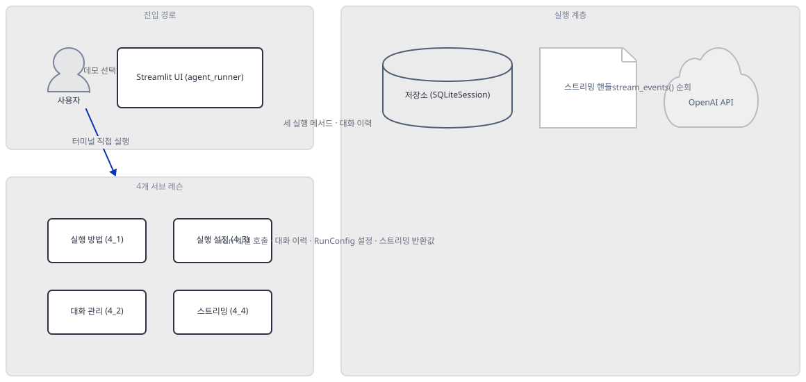
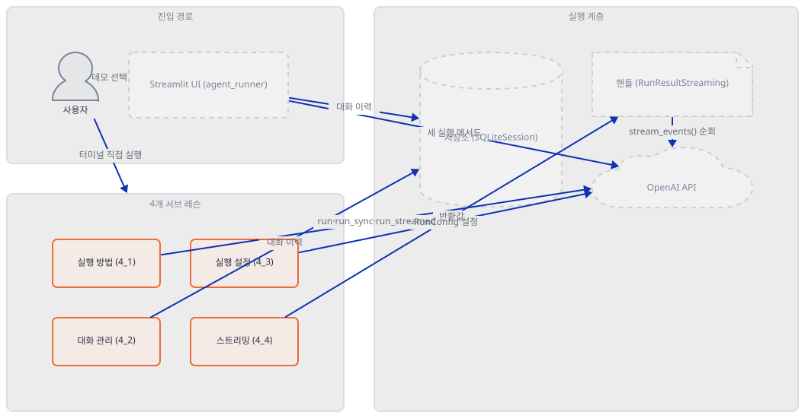
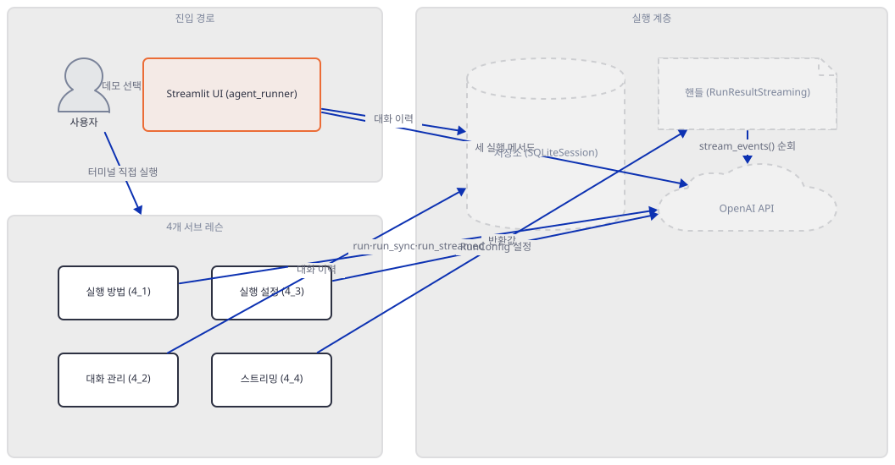
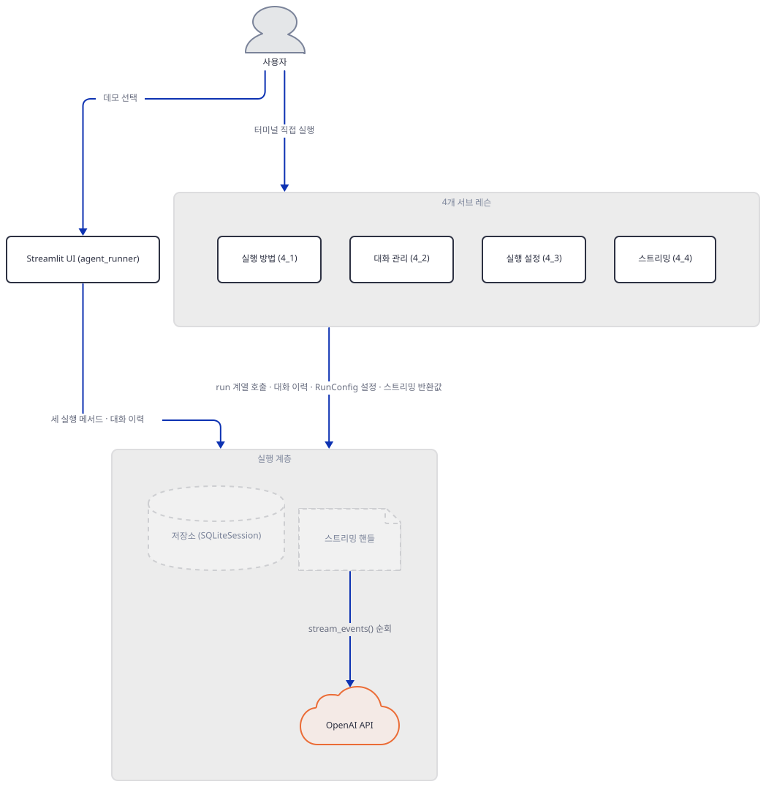
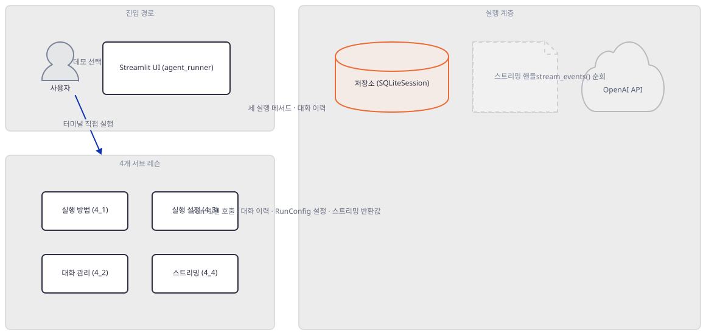
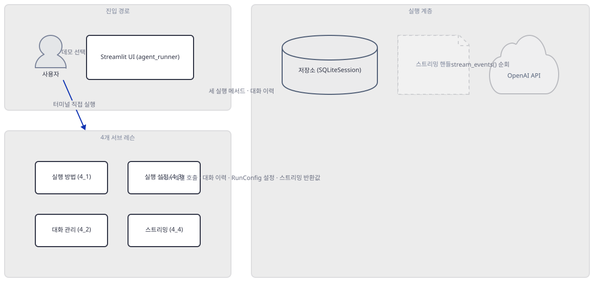
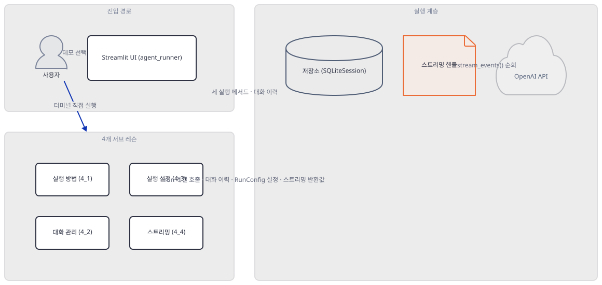
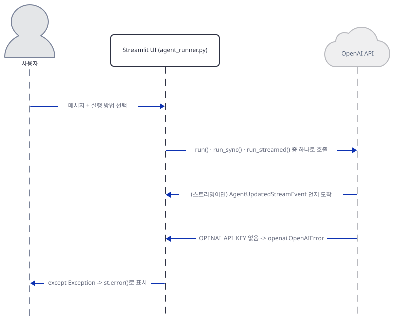

# Day 027 · OpenAI Agents SDK Crash Course · 4_running_agents

> 볼륨 2 🧑‍🏫 Crash Courses · 난이도 ★★☆ ⚠ · 예상 소요 130분(하위 레슨 4개 + 686줄짜리 이 볼륨 최대 파일 + 실제로 재현되는 스트리밍 버그까지 다루어 다른 크래시 코스 날보다 깁니다) · API 비용 $0 (API 키 없이 진행 — 실제 모델 호출은 하지 않습니다) · 원본 앱: `ai_agent_framework_crash_course/openai_sdk_crash_course/4_running_agents`

## 오늘 만들 것

`4_running_agents`는 이 볼륨에서 가장 큰 하루입니다 — 최상위 `agent_runner.py`만 686줄로, 이 시리즈가 지금까지 만난 단일 소스 파일 중 가장 큽니다. 폴더에는 이 파일 말고도 하위 레슨 네 개(`4_1_execution_methods`·`4_2_conversation_management`·`4_3_run_configuration`·`4_4_streaming_events`)가 나란히 있지만, 레슨 자신의 `README.md`는 다섯 번째 레슨 `4_5_exception_handling`까지 이야기합니다 — 그런 폴더는 디스크에 없습니다(직접 확인, Step 1). `agent_runner.py`가 이 네 개(혹은 다섯 개) 위에 무엇을 얹는지부터 코드로 확인합니다: 이 파일은 하위 레슨을 단 한 줄도 import하지 않고, `initialize_agents()` 안에 완전히 독자적인 `Agent` 4개를 직접 선언합니다(직접 확인, Step 2) — 즉 하위 레슨의 상위집합이 아니라 같은 개념을 Streamlit 드롭다운으로 다시 짠 다섯 번째 병렬 구현이고, README가 약속한 "5번째 레슨"의 유일한 실물도 이 파일 안에만 있습니다. 이 문서가 실제로 가르치는 것은 Day 024가 이미 소개한 `openai-agents`(`from agents import Agent, Runner, ...`)의 `Runner`가 에이전트를 돌리는 세 가지 방법 — `Runner.run()`(비동기) · `Runner.run_sync()`(동기) · `Runner.run_streamed()`(스트리밍) — 이 각각 무엇을 사고 언제 서로 바꿔 써도 되는지입니다(Step 3). 겉보기에 가장 화려한 것은 스트리밍 코드입니다 — `4_4_streaming_events/agent.py`가 200줄로 나머지 세 하위 레슨을 합친 것보다 크고, 실제로 이 레슨의 무게가 여기 실려 있습니다 — 하지만 설치된 openai-agents 0.22.3으로 그대로 실행하면 `agent_runner.py`·`4_1`·`4_4` 전체에 걸쳐 완전히 같은 이유로 곧바로 죽습니다(직접 확인, Step 6): `Runner.run_streamed()`는 코루틴이 아니라 `RunResultStreaming` 객체를 그 자리에서 반환하는데, 이 객체 자체는 순회할 수 없고 `.stream_events()`를 다시 불러야 하기 때문입니다. Windows cp949 콘솔에서는 그 버그에 닿기도 전에 이모지 출력이 먼저 죽습니다. 키가 없을 때 세 실행 방법 모두 예외를 어디로 돌려주는지도 확인합니다 — Day 018이 찾은 ADK `Runner`의 삼킴과 달리, 여기서는 예외가 그대로 호출자까지 올라옵니다(Step 3·7). 그리고 README도 `.env` 템플릿도 없는 `4_3`·`4_4` 두 폴더는, 이 문서의 Step 5·6이 그 자리를 대신 채웁니다.



## 사전 준비

| 서비스/도구 | 용도 | 발급·설치 |
|---|---|---|
| OpenAI API 키 (`OPENAI_API_KEY`) | Day 024가 이미 소개한 키. `gpt-4o-mini`·`gpt-4o` 호출에 필요하지만, 이 문서는 키 없이 실행 방법·설정·예외 경계만 확인합니다 | https://platform.openai.com/api-keys 에서 발급 (이 실습에서는 생략 가능) |
| uv | 가상환경 생성과 패키지 설치 | [공통 사전 준비](../README.md#공통-사전-준비-한-번만) 절 참고 |
| 인터넷 연결 | PyPI에서 `openai-agents`·`streamlit` 설치 | 별도 설치 없음 |

## 아키텍처 한눈에 보기

| 컴포넌트 | 역할 | 코드 위치 |
|---|---|---|
| 사용자 | 데모 선택, 메시지 입력, 또는 터미널에서 `agent.py` 직접 실행 | 코드 없음 |
| Streamlit UI (`agent_runner.py`) | 5개 데모를 드롭다운으로 전환하고, 하위 레슨과 무관한 독자적인 `Agent` 4개를 선언 | `ai_agent_framework_crash_course/openai_sdk_crash_course/4_running_agents/agent_runner.py:27-65` |
| 실행 방법 (`4_1_execution_methods/agent.py`) | `Runner.run`·`run_sync`·`run_streamed` 세 가지 최소 예제 | `ai_agent_framework_crash_course/openai_sdk_crash_course/4_running_agents/4_1_execution_methods/agent.py:1-43` |
| 대화 관리 (`4_2_conversation_management/agent.py`) | `to_input_list()` 수동 스레딩과 `SQLiteSession` 두 가지 대화 이어가기 | `ai_agent_framework_crash_course/openai_sdk_crash_course/4_running_agents/4_2_conversation_management/agent.py:1-39` |
| 실행 설정 (`4_3_run_configuration/agent.py`) | `RunConfig`로 모델·트레이싱 설정 (README·env.example 없음) | `ai_agent_framework_crash_course/openai_sdk_crash_course/4_running_agents/4_3_run_configuration/agent.py:1-50` |
| 스트리밍 이벤트 (`4_4_streaming_events/agent.py`) | `run_streamed()` 이벤트 처리 예제 4개 (README·env.example 없음, 전부 같은 버그) | `ai_agent_framework_crash_course/openai_sdk_crash_course/4_running_agents/4_4_streaming_events/agent.py:1-200` |
| 세션 저장소 (`SQLiteSession`) | 대화 이력 저장 — 이름과 달리 기본값은 메모리, `db_path` 지정 시만 파일 | 코드 없음 (openai-agents 0.22.3 소스로 확인) |
| 스트리밍 핸들 (`RunResultStreaming`) | `run_streamed()`의 반환값 자체. `.stream_events()`로만 순회 가능 | 코드 없음 (openai-agents 0.22.3 소스로 확인) |
| OpenAI API (`gpt-4o-mini` · `gpt-4o`) | 실제 추론 수행. 키가 없으면 클라이언트 생성 시점에 곧바로 예외 | 코드 없음 (외부 서비스) |

## 단계별 진행

### Step 1. 환경 만들기 — 버전 드리프트와 사라진 다섯 번째 레슨

**목적.** 의존성을 설치하고, `requirements.txt`가 못박은 버전과 실제 설치되는 버전의 차이를 확인하고, 최상위 README가 주장하는 파일 구성이 실제와 얼마나 다른지 확인합니다.

**할 일.**

```bash
cd ai_agent_framework_crash_course/openai_sdk_crash_course/4_running_agents
uv venv
uv pip install -r requirements.txt
```

(pip 대안: `python -m venv .venv && source .venv/bin/activate && pip install -r requirements.txt`. Windows PowerShell은 활성화만 `.venv\Scripts\Activate.ps1`로 바꿉니다. 이 저장소는 루트에 `pyproject.toml`이 있어 `uv run`이 기본으로 루트 `.venv`를 쓰므로, 이후 모든 `uv run`에 `--no-project`를 붙입니다 — Day 014 이후 계속된 규칙이지만, 이 볼륨에서는 대가가 다릅니다: 저장소 루트 `.venv`에는 이름이 똑같은 `agents`라는 패키지가 이미 설치되어 있는데, 이것은 OpenAI Agents SDK가 아니라 **TensorFlow Agents**(`agents==1.4.0`, "Efficient TensorFlow implementation of reinforcement learning algorithms")입니다(직접 확인, 아래 문제 해결 참고) — `--no-project`를 빠뜨리면 단순히 "모듈 없음"이 아니라 전혀 다른 패키지가 잡혀 알아보기 힘든 오류가 납니다.)

`ai_agent_framework_crash_course/openai_sdk_crash_course/4_running_agents/requirements.txt:1-3`

```text
openai-agents>=0.2.0
streamlit>=1.28.0
python-dotenv>=1.0.0
```

`>=0.2.0`은 사실상 버전을 고정하지 않은 것과 같습니다 — 이 문서를 작성하며 설치하면 **openai-agents 0.22.3**(내부적으로 **openai 3.17.0**을 씀), **streamlit 1.64.0**, **python-dotenv 1.2.3**이 받아집니다(직접 확인, Python 3.12.10 throwaway 가상환경 기준 — 시스템 기본은 3.13.12입니다). 0.2.0과 0.22.3 사이에는 마이너 버전 20단계가 있고, 이후 스텝에서 확인할 여러 사실(스트리밍 이벤트 구조, `SQLiteSession`의 위치)은 이 최신 버전 기준입니다.

최상위 `README.md`는 다섯 개의 하위 레슨이 있다고 말합니다.

`ai_agent_framework_crash_course/openai_sdk_crash_course/4_running_agents/README.md:76-95`

```text
4_running_agents/
├── README.md                           # This file - comprehensive guide
├── requirements.txt                    # Dependencies
├── 4_1_execution_methods/
│   ├── __init__.py
│   └── agent.py                       # Three execution methods (45 lines)
├── 4_2_conversation_management/
│   ├── __init__.py  
│   └── agent.py                       # Manual vs automatic threading (40 lines)
├── 4_3_run_configuration/
│   ├── __init__.py
│   └── agent.py                       # RunConfig examples (55 lines)
├── 4_4_streaming_events/
│   ├── __init__.py
│   └── agent.py                       # Detailed streaming handling (50 lines)
├── 4_5_exception_handling/
│   ├── __init__.py
│   └── agent.py                       # All exception types (60 lines)
├── agent_runner.py                    # Streamlit demo interface (recommended)
└── env.example                        # Environment variables
```

이 트리는 두 가지가 틀렸습니다. 첫째, `4_5_exception_handling/` 폴더는 실제로 존재하지 않습니다(직접 확인, `find . -maxdepth 1 -type d`). 둘째, 있는 네 폴더의 줄 수도 실제와 다릅니다 — 개행까지 바이트로 정확히 세면 `4_1`은 45가 아니라 43줄, `4_2`는 40이 아니라 39줄, `4_3`은 55가 아니라 50줄이고, 특히 `4_4`는 50줄이라고 적혀 있지만 실제로는 **200줄**입니다(직접 확인, `tail -c 1 | xxd`로 트레일링 개행까지 확인 — 네 파일 모두 마지막 바이트가 개행이라 `wc -l` 값이 실제 줄 수와 같습니다). `4_3`·`4_4`에는 이 트리가 그리는 `__init__.py`만 있고 `README.md`·`env.example`은 애초에 없습니다(직접 확인, `ls`) — `4_1`·`4_2`는 둘 다 있습니다. 폴더를 순서대로 따라가는 독자는 `4_3`에서 안내문이 뚝 끊깁니다: 이 문서의 Step 5·6이 그 자리를 대신합니다.



**확인.**

```bash
uv run --no-project python -c "
import importlib.metadata as md
for pkg in ['openai-agents', 'openai', 'streamlit', 'python-dotenv']:
    print(pkg, md.version(pkg))
"
find . -maxdepth 1 -type d | sort
ls 4_3_run_configuration 4_4_streaming_events
```

```powershell
uv run --no-project python -c "<위와 같은 코드>"
Get-ChildItem -Directory
Get-ChildItem 4_3_run_configuration, 4_4_streaming_events
```

```
openai-agents 0.22.3
openai 3.17.0
streamlit 1.64.0
python-dotenv 1.2.3
.
./.venv
./4_1_execution_methods
./4_2_conversation_management
./4_3_run_configuration
./4_4_streaming_events
4_3_run_configuration:
__init__.py
agent.py

4_4_streaming_events:
__init__.py
agent.py
```

(`.venv`는 이 Step 앞부분에서 만든 로컬 가상환경입니다. 4_5_exception_handling이 목록에 없고, 4_3·4_4 각각에는 __init__.py·agent.py 둘뿐입니다.)

### Step 2. `agent_runner.py`의 정체 — 하위 레슨 위의 앱이 아니라 나란히 선 다섯 번째 구현

**목적.** 686줄짜리 `agent_runner.py`가 4개(혹은 5개) 하위 레슨과 실제로 어떤 관계인지 — 그것들을 불러 쓰는 상위 앱인지, 완전히 독립된 재구현인지 — import 구조와 코드로 확정합니다.

**할 일.**

`ai_agent_framework_crash_course/openai_sdk_crash_course/4_running_agents/agent_runner.py:1-13`

```python
import streamlit as st
import asyncio
import time
import json
from datetime import datetime
from agents import Agent, Runner, RunConfig, SQLiteSession, ModelSettings
from agents.exceptions import (
    AgentsException,
    MaxTurnsExceeded,
    ModelBehaviorError,
    UserError
)
from dotenv import load_dotenv
```

이 import 목록 전체를 훑어도 `4_1_execution_methods`·`4_2_conversation_management`·`4_3_run_configuration`·`4_4_streaming_events` 중 어느 것도 없습니다 — `grep -n "4_1\|4_2\|4_3\|4_4"` 결과가 빈 문자열입니다(직접 확인). 대신 `agent_runner.py`는 자신만의 에이전트 4개를 새로 선언합니다.

`ai_agent_framework_crash_course/openai_sdk_crash_course/4_running_agents/agent_runner.py:27-65`

```python
@st.cache_resource
def initialize_agents():
    """Initialize agents for different demonstrations"""
    
    execution_agent = Agent(
        name="Execution Demo Agent",
        instructions="""
        You are a helpful assistant demonstrating different execution patterns.
        
        Provide clear, informative responses that help users understand:
        - Synchronous execution (blocking)
        - Asynchronous execution (non-blocking)
        - Streaming execution (real-time)
        
        Keep responses appropriate for the execution method being demonstrated.
        """
    )
    
    conversation_agent = Agent(
        name="Conversation Agent",
        instructions="You are a helpful assistant that remembers conversation context. Reply concisely but reference previous context when relevant."
    )
    
    config_agent = Agent(
        name="Configuration Demo Agent",
        instructions="You are a helpful assistant that demonstrates run configuration options. Be precise and informative."
    )
    
    streaming_agent = Agent(
        name="Streaming Demo Agent",
        instructions="""
        You are a helpful assistant that demonstrates streaming capabilities.
        
        When asked to write long content, be comprehensive and detailed.
        When asked technical questions, provide thorough explanations.
        """
    )
    
    return execution_agent, conversation_agent, config_agent, streaming_agent
```

네 에이전트의 `instructions`는 각 하위 레슨의 `root_agent`가 쓰는 문구와 거의 같지만(예: `execution_agent`의 지시문은 `4_1`의 `root_agent`와 문자 그대로 동일합니다), 별개의 객체입니다 — `@st.cache_resource`는 Streamlit이 이 함수의 반환값을 세션 간에 재사용하게 할 뿐, 하위 레슨과의 연결과는 무관합니다. `main()`은 `demo_type`(드롭다운)에 따라 `render_execution_methods`·`render_conversation_management`·`render_run_configuration`·`render_streaming_events`·`render_exception_handling` 다섯 함수 중 하나로 분기합니다(`ai_agent_framework_crash_course/openai_sdk_crash_course/4_running_agents/agent_runner.py:132-141`). 다섯 번째 `render_exception_handling`이 바로 Step 1이 디스크에서 찾지 못한 `4_5_exception_handling`에 대응하는 유일한 실제 구현입니다 — 최상위 README는 이것도 독립 폴더인 것처럼 적어 두었습니다.

`ai_agent_framework_crash_course/openai_sdk_crash_course/4_running_agents/README.md:68-71`

```text
### **5. Exception Handling** (`4_5_exception_handling/`)
- All SDK exceptions: `MaxTurnsExceeded`, `ModelBehaviorError`, etc.
- Proper error handling patterns
- Recovery and retry strategies
```

결론: `agent_runner.py`는 네 하위 레슨의 상위집합(import해서 감싼 것)이 아니라, 같은 개념을 Streamlit 드롭다운 하나로 다시 짠 **병렬 재구현**입니다 — 다섯 번째 항목(예외 처리)까지 포함해서요. 이 문서는 개념별 최소 예제는 `4_1`~`4_4`에서, "정체"와 "예외 처리" 두 지점만 `agent_runner.py`에서 가져옵니다.



**확인.**

```bash
grep -n "4_1\|4_2\|4_3\|4_4\|4_5" agent_runner.py; echo "exit=$?"
grep -n "^from\|^import" agent_runner.py
```

```powershell
Select-String -Path agent_runner.py -Pattern "4_1|4_2|4_3|4_4|4_5"; echo "exit=$LASTEXITCODE"
Select-String -Path agent_runner.py -Pattern "^from|^import"
```

```
exit=1
1:import streamlit as st
2:import asyncio
3:import time
4:import json
5:from datetime import datetime
6:from agents import Agent, Runner, RunConfig, SQLiteSession, ModelSettings
7:from agents.exceptions import (
13:from dotenv import load_dotenv
```

(첫 `grep`은 아무것도 찾지 못해 exit 1 — 하위 레슨 폴더 이름이 `agent_runner.py` 어디에도 없다는 뜻입니다.)

### Step 3. 세 가지 실행 방법 — `run()` · `run_sync()` · 그 경계

**목적.** `4_1_execution_methods`의 세 함수로 `Runner`의 세 실행 방법이 실제로 무엇을 사는지 확인하고, 레슨 README의 Quick Start가 실행되지 않는다는 것과, 키가 없을 때 세 방법 모두 예외가 어디로 가는지 확인합니다.

**할 일.**

`ai_agent_framework_crash_course/openai_sdk_crash_course/4_running_agents/4_1_execution_methods/agent.py:19-29`

```python
# Example 1: Synchronous execution
def sync_execution_example():
    """Demonstrates Runner.run_sync() - blocking execution"""
    result = Runner.run_sync(root_agent, "Explain synchronous execution in simple terms")
    return result.final_output

# Example 2: Asynchronous execution  
async def async_execution_example():
    """Demonstrates Runner.run() - non-blocking execution"""
    result = await Runner.run(root_agent, "Explain asynchronous execution benefits")
    return result.final_output
```

`Runner.run_sync()`는 함수 자신의 독스트링이 "이미 이벤트 루프가 있으면(비동기 함수 안, Jupyter, FastAPI 등) 동작하지 않는다"고 명시합니다(소스로 확인, openai-agents 0.22.3 `agents/run.py`) — 내부에서 스레드의 기본 이벤트 루프를 그대로 재사용하기 때문입니다. `agent_runner.py`의 Streamlit 콜백처럼 실행 중인 루프가 없는 평범한 동기 코드에서는 `run_sync()`를 직접 부르는 것과 `asyncio.run(Runner.run(...))`로 감싸는 것이 결과적으로 같습니다 — 실제로 `agent_runner.py`의 "Synchronous" 열(`run_sync` 직접 호출, `ai_agent_framework_crash_course/openai_sdk_crash_course/4_running_agents/agent_runner.py:163`)과 "Asynchronous" 열(`asyncio.run(Runner.run(...))`, `ai_agent_framework_crash_course/openai_sdk_crash_course/4_running_agents/agent_runner.py:186`)은 둘 다 Streamlit 스크립트를 끝까지 블로킹합니다. `run()`이 진짜 "논블로킹"이 되는 지점은 호출자가 이미 실행 중인 이벤트 루프 안에 있어서 `await Runner.run(...)`을 다른 코루틴과 나란히 `asyncio.gather`할 수 있을 때뿐입니다 — 그런 상황에서 `run_sync()`를 부르면 곧바로 실패합니다(아래 확인).

레슨 README의 Quick Start는 실제로 실행되지 않는 코드를 안내합니다.

`ai_agent_framework_crash_course/openai_sdk_crash_course/4_running_agents/4_1_execution_methods/README.md:27-32`

```text
   from agents import Runner
   from agent import root_agent
   
   # Test sync execution
   result = root_agent.sync_execution_example()
   print(result)
```

`sync_execution_example`은 모듈 최상위 함수이지 `Agent` 인스턴스의 메서드가 아니므로, `root_agent.sync_execution_example()`은 `AttributeError`로 즉시 실패합니다(아래 확인) — Day 023이 찾은 "실행 불가능한 안내 명령"과 같은 종류의 문제입니다.



**확인.** 먼저 README 스니펫이 실제로 실패하는지 봅니다.

```bash
cd 4_1_execution_methods
uv run --no-project python -c "
from agent import root_agent
result = root_agent.sync_execution_example()
"
cd ..
```

```powershell
cd 4_1_execution_methods
uv run --no-project python -c "<위와 같은 코드>"
cd ..
```

```
AttributeError: 'Agent' object has no attribute 'sync_execution_example'
```

(전체 트레이스백 중 마지막 줄만 발췌했습니다.)

키 없이 `run()`·`run_sync()`를 직접 불러 예외가 어디로 가는지 봅니다.

```bash
cd 4_1_execution_methods
uv run --no-project python -c "
import os
os.environ.pop('OPENAI_API_KEY', None)
import asyncio
from agent import root_agent
from agents import Runner
try:
    Runner.run_sync(root_agent, 'hi')
except Exception as e:
    print('run_sync ->', type(e).__name__, ':', str(e)[:80])
async def main():
    try:
        await Runner.run(root_agent, 'hi')
    except Exception as e:
        print('run ->', type(e).__name__, ':', str(e)[:80])
asyncio.run(main())
"
cd ..
```

```powershell
cd 4_1_execution_methods
uv run --no-project python -c "<위와 같은 코드>"
cd ..
```

```
OPENAI_API_KEY is not set, skipping trace export
run_sync -> OpenAIError : Missing credentials. Please pass an `api_key`, `workload_identity`, `admin_api_k
run -> OpenAIError : Missing credentials. Please pass an `api_key`, `workload_identity`, `admin_api_k
```

(첫 줄은 트레이싱 하위 시스템이 키를 확인할 때 남기는 안내이고, 실제 모델 호출과는 별개입니다.) 두 방법 모두 `openai` 패키지의 `OpenAIError`를 그대로 호출자에게 던집니다 — 어느 쪽도 삼키지 않습니다. 마지막으로 `run_sync()`를 이미 실행 중인 이벤트 루프 안에서 부르면 무슨 일이 나는지 봅니다.

```bash
uv run --no-project python -c "
import asyncio
from agents import Agent, Runner
agent = Agent(name='x', instructions='y')
async def main():
    try:
        Runner.run_sync(agent, 'hi')
    except RuntimeError as e:
        print(e)
asyncio.run(main())
"
```

```powershell
uv run --no-project python -c "<위와 같은 코드>"
```

```
AgentRunner.run_sync() cannot be called when an event loop is already running.
```

### Step 4. 대화 이어가기 — `to_input_list()` 대 `SQLiteSession`, 그리고 "SQLite인데 기본은 메모리"

**목적.** `4_2_conversation_management`의 두 대화 이어가기 방식을 확인하고, `SQLiteSession`이라는 이름과 달리 기본 설정으로는 디스크에 아무것도 남기지 않는다는 것을 직접 확인합니다.

**할 일.** 수동 스레딩은 이전 턴의 `RunResult`에서 `to_input_list()`로 대화 내역을 뽑아 다음 입력에 이어 붙입니다.

`ai_agent_framework_crash_course/openai_sdk_crash_course/4_running_agents/4_2_conversation_management/agent.py:17-19`

```python
    # Second turn - manually pass conversation history
    new_input = result.to_input_list() + [{"role": "user", "content": "What city do I live in?"}]
    result = await Runner.run(root_agent, new_input)
```

`SQLiteSession`은 이 내역 관리를 `Runner`가 대신하게 합니다.

`ai_agent_framework_crash_course/openai_sdk_crash_course/4_running_agents/4_2_conversation_management/agent.py:24-39`

```python
# Example 2: Automatic conversation management with Sessions
async def session_conversation_example():
    """Demonstrates automatic conversation management using SQLiteSession"""
    
    # Create session instance
    session = SQLiteSession("conversation_123")
    
    # First turn
    result = await Runner.run(root_agent, "I'm a software developer working on AI projects.", session=session)
    print(f"Session Turn 1: {result.final_output}")
    
    # Second turn - session automatically remembers context
    result = await Runner.run(root_agent, "What kind of work do I do?", session=session)
    print(f"Session Turn 2: {result.final_output}")
    
    return result
```

`SQLiteSession(session_id)`처럼 경로 없이 부르면 실제 생성자 기본값은 `db_path=":memory:"`입니다(소스로 확인, openai-agents 0.22.3 `agents/memory/sqlite_session.py`) — `agent_runner.py`의 "Session Management" 탭(`ai_agent_framework_crash_course/openai_sdk_crash_course/4_running_agents/agent_runner.py:296`)도 같은 방식으로 경로 없이 만듭니다. 이름이 "SQLite"라고 해서 파일이 남는다고 생각하기 쉽지만, 경로를 주지 않는 한 프로세스가 끝나면 Day 018의 `InMemorySessionService`처럼 전부 사라집니다. 모델 호출 없이 세션 객체의 `add_items`/`get_items`만으로 이 차이를 직접 확인할 수 있습니다.



**확인.**

```bash
uv run --no-project python -c "
import asyncio, os
from agents import SQLiteSession

async def main():
    s1 = SQLiteSession('s1')  # db_path 기본값 = ':memory:'
    await s1.add_items([{'role': 'user', 'content': 'My name is Alice'}])
    print('in-memory items:', await s1.get_items())
    print('.db file created?', [f for f in os.listdir('.') if f.endswith('.db')])

    s2 = SQLiteSession('s2', db_path='real_session.db')
    await s2.add_items([{'role': 'user', 'content': 'My name is Bob'}])
    print('.db file after db_path=:', [f for f in os.listdir('.') if f.endswith('.db')])

asyncio.run(main())
"
rm -f real_session.db
```

```powershell
uv run --no-project python -c "<위와 같은 코드>"
Remove-Item real_session.db
```

```
in-memory items: [{'role': 'user', 'content': 'My name is Alice'}]
.db file created? []
.db file after db_path=: ['real_session.db']
```

### Step 5. `RunConfig` 채우기 — 없는 README를 이 Step이 대신합니다

**목적.** `4_3_run_configuration`은 README도 `env.example`도 없이 `agent.py` 하나만 있습니다. 이 Step이 그 자리에서, `RunConfig`로 무엇을 설정할 수 있고 `max_turns`가 왜 여기 없는지를 소스와 대조해 채웁니다.

**할 일.**

`ai_agent_framework_crash_course/openai_sdk_crash_course/4_running_agents/4_3_run_configuration/agent.py:13-25`

```python
    run_config = RunConfig(
        model="gpt-4o",  # Override agent's default model
        model_settings=ModelSettings(temperature=0.1, top_p=0.9),
        workflow_name="demo_workflow",  # For tracing
        trace_metadata={"experiment": "config_demo"}
    )

    result = await Runner.run(
        root_agent,
        "Explain the weather in exactly 3 sentences.",
        run_config=run_config,
        max_turns=5,  # max_turns is a Runner.run() argument, not a RunConfig field
    )
```

이 주석은 실제로 정확합니다 — 이 레슨의 드문 "맞는 자기 주석" 사례입니다. `RunConfig`의 실제 필드 목록(dataclass 필드로 확인)에는 `model`·`model_settings`·`workflow_name`·`trace_metadata`·`tracing_disabled`·`group_id` 등 25개가 있지만 `max_turns`는 없습니다 — `max_turns`는 `Runner.run()`·`run_sync()`·`run_streamed()` 자신의 키워드 인자(기본값 10)입니다. `RunConfig`는 "이 실행을 어떤 모델로, 어떤 트레이싱 설정으로 부를까"를 담고, `max_turns`는 "이 대화를 몇 턴까지 허용할까"를 담아 — 이름은 둘 다 "실행 설정"처럼 보이지만 서로 다른 함수 시그니처에 삽니다. `agent_runner.py`의 "Tracing Configuration" 폼(`ai_agent_framework_crash_course/openai_sdk_crash_course/4_running_agents/agent_runner.py:389-413`)도 같은 `RunConfig`에 `group_id`·`trace_metadata`를 채워 넣는 예시를 보여줍니다.



**확인.**

```bash
uv run --no-project python -c "
import dataclasses
from agents import RunConfig
fields = [f.name for f in dataclasses.fields(RunConfig)]
print('max_turns' in fields)
print(len(fields), 'fields, e.g.', fields[:6])
"
```

```powershell
uv run --no-project python -c "<위와 같은 코드>"
```

```
False
25 fields, e.g. ['model', 'model_provider', 'model_settings', 'handoff_input_filter', 'nest_handoff_history', 'handoff_history_mapper']
```

### Step 6. 스트리밍의 진짜 무게 — 200줄, 그리고 네 번 반복된 같은 버그

**목적.** `4_4_streaming_events`가 왜 나머지 세 하위 레슨을 합친 것보다 큰지 확인하고, README도 없는 이 폴더의 예제 4개가 설치된 SDK에서 어떻게 실패하는지 — 그리고 올바른 패턴이 무엇인지 직접 실행으로 확인합니다.

**할 일.** `4_4_streaming_events/agent.py`는 `basic_streaming_example`·`advanced_streaming_example`·`custom_streaming_processing`·`streaming_with_error_handling` 네 함수로 이루어져 있고, 넷 다 같은 패턴을 씁니다.

`ai_agent_framework_crash_course/openai_sdk_crash_course/4_running_agents/4_4_streaming_events/agent.py:27-35`

```python
    async for event in Runner.run_streamed(
        root_agent, 
        "Write a comprehensive explanation of how machine learning works, including examples."
    ):
        # Process different types of streaming events
        if hasattr(event, 'content') and event.content:
            # This is a text content event
            full_response += event.content
            print(event.content, end='', flush=True)
```

openai-agents 0.22.3에서 `Runner.run_streamed()`는 코루틴이 아니라 `RunResultStreaming` 객체를 즉시 반환합니다(소스로 확인, `agents/result.py`) — 백그라운드 `asyncio` 태스크로 실제 실행을 붙여 두고, 이벤트는 그 객체의 `stream_events()` 메서드를 따로 호출해야 얻을 수 있습니다. `RunResultStreaming` 자신은 `__aiter__`가 없습니다(소스로 확인) — 그래서 `async for event in Runner.run_streamed(...)`처럼 반환값을 바로 순회하면 그 자리에서 `TypeError`가 납니다. 같은 실수가 `4_1_execution_methods/agent.py`의 `streaming_execution_example`(`ai_agent_framework_crash_course/openai_sdk_crash_course/4_running_agents/4_1_execution_methods/agent.py:32-43`), `agent_runner.py`의 세 스트리밍 호출부(`ai_agent_framework_crash_course/openai_sdk_crash_course/4_running_agents/agent_runner.py:217-525` 사이에 세 번), 그리고 `4_4`의 네 예제 전부에서 반복됩니다(`grep -n` 으로 확인) — 세 곳은 `async for event in Runner.run_streamed(...)`을 그대로 쓰고, `advanced_streaming_example`(`ai_agent_framework_crash_course/openai_sdk_crash_course/4_running_agents/4_4_streaming_events/agent.py:62-69`)만 `streaming_result = Runner.run_streamed(...)`로 변수에 받은 뒤 `async for event in streaming_result:`로 그 변수를 순회하지만, `streaming_result`가 가리키는 객체 자체가 `RunResultStreaming`이라 결과는 같습니다. 고쳐도 두 번째 문제가 남습니다 — 실제 스트림 이벤트 세 종류(`RawResponsesStreamEvent`·`RunItemStreamEvent`·`AgentUpdatedStreamEvent`) 중 어느 것도 `content` 필드가 없습니다(dataclass 필드로 확인) — `hasattr(event, 'content')`는 항상 거짓입니다. 실제 텍스트 조각은 `RawResponsesStreamEvent.data` 안, OpenAI Responses API 자신의 이벤트 객체 안에 있습니다.

`ai_agent_framework_crash_course/openai_sdk_crash_course/4_running_agents/4_4_streaming_events/agent.py:187-189`

```python
async def main():
    print("🚀 OpenAI Agents SDK - Streaming Events")
    print("=" * 60)
```

레슨 README의 안내대로 이 파일을 그냥 실행하면, 위 버그에 닿기도 전에 이 이모지 출력이 Windows 기본 콘솔 코드페이지(cp949)에서 먼저 죽습니다 — Day 019가 이미 문서화한 것과 같은 종류의 실패입니다.



**확인.** 먼저 README 그대로 실행합니다. `-m` 서브커맨드는 점(`.`)으로 이어진 모듈 경로를 쓰므로, 하위 폴더 안이 아니라 `4_running_agents`(Step 1에서 만든 로컬 가상환경이 있는 자리)에서 실행해야 `4_4_streaming_events` 패키지를 찾습니다.

```bash
uv run --no-project python -m 4_4_streaming_events.agent
```

```powershell
uv run --no-project python -m 4_4_streaming_events.agent
```

```
UnicodeEncodeError: 'cp949' codec can't encode character '\U0001f680' in position 0: illegal multibyte sequence
```

(전체 트레이스백 중 마지막 줄만 발췌했습니다.) UTF-8을 강제해 그 아래 진짜 버그를 봅니다(둘 다 키 없이, 네트워크 없이 재현됩니다).

```bash
PYTHONUTF8=1 uv run --no-project python -m 4_4_streaming_events.agent
```

```powershell
$env:PYTHONUTF8="1"; uv run --no-project python -m 4_4_streaming_events.agent
```

```
🚀 OpenAI Agents SDK - Streaming Events
============================================================
=== Basic Streaming Events ===
Requesting a detailed explanation...
TypeError: 'async for' requires an object with __aiter__ method, got RunResultStreaming
```

(표준출력 네 줄과 표준에러 트레이스백이 함께 나며, 터미널로 직접 실행하는지 파이프로 캡처하는지에 따라 두 스트림이 섞이는 순서가 달라질 수 있습니다 — 파이프로 캡처하면 버퍼링 때문에 트레이스백이 먼저 보이기도 합니다. 위는 실행 순서대로 정리한 것이고, 트레이스백은 마지막 줄만 발췌했습니다. `TypeError` 자체와 그 메시지는 순서와 무관하게 그대로 재현됩니다.) 올바른 패턴(`.stream_events()`로 순회)이 어디서부터 실제 API 호출에 닿는지도 봅니다.

```bash
uv run --no-project python -c "
import os, asyncio
os.environ.pop('OPENAI_API_KEY', None)
from agents import Agent, Runner
agent = Agent(name='x', instructions='y')
async def main():
    result = Runner.run_streamed(agent, 'hi')
    try:
        async for event in result.stream_events():
            print('event:', type(event).__name__)
    except Exception as e:
        print(type(e).__name__, ':', str(e)[:60])
asyncio.run(main())
"
```

```powershell
uv run --no-project python -c "<위와 같은 코드>"
```

```
OPENAI_API_KEY is not set, skipping trace export
event: AgentUpdatedStreamEvent
OpenAIError : Missing credentials. Please pass an `api_key`, `workload_ide
```

(고친 패턴은 실제로 순회가 시작되어 첫 이벤트 `AgentUpdatedStreamEvent`를 내보낸 뒤, 실제 모델 호출 단계에서야 같은 `OpenAIError`를 만납니다 — 버그를 고쳐도 이 문서의 환경(키 없음)에서는 결국 같은 경계에 닿습니다.)

### Step 7. 예외 처리 — 없는 폴더 하나, 그리고 키 없이도 재현되는 `MaxTurnsExceeded`

**목적.** `agent_runner.py`가 유일하게 구현한 "5번째 레슨"의 except 체인이 실제 예외 계층과 맞는지 확인하고, 키 없이도 `MaxTurnsExceeded` 자체를 재현합니다.

**할 일.**

`ai_agent_framework_crash_course/openai_sdk_crash_course/4_running_agents/agent_runner.py:622-646`

```python
                try:
                    with st.spinner("Processing with full exception handling..."):
                        result = asyncio.run(Runner.run(agent, exception_input))
                        st.success("✅ Successfully processed")
                        st.write(f"**Response:** {result.final_output}")
                        
                except MaxTurnsExceeded as e:
                    st.warning(f"⚠️ Hit maximum turns limit: {e}")
                    st.info("Consider increasing max_turns or simplifying the request.")
                    
                except ModelBehaviorError as e:
                    st.error(f"🤖 Model behavior error: {e}")
                    st.info("The model produced unexpected output. Try rephrasing your request.")
                    
                except UserError as e:
                    st.error(f"👤 User error: {e}")
                    st.info("There's an issue with the request. Please check your input.")
                    
                except AgentsException as e:
                    st.error(f"🔧 SDK error: {e}")
                    st.info("An error occurred within the Agents SDK.")
                    
                except Exception as e:
                    st.error(f"❌ Unexpected error: {e}")
                    st.info("An unexpected error occurred. Please try again.")
```

`MaxTurnsExceeded`·`ModelBehaviorError`·`UserError`는 모두 `AgentsException`의 직속 서브클래스입니다(mro로 확인) — 그래서 이 순서(구체적인 것부터, `AgentsException`을 거쳐 `Exception`으로) 자체는 파이썬 예외 처리 규칙에 맞습니다. 그런데 Step 3·6이 계속 마주친 `openai.OpenAIError`(키 없을 때 실제로 나는 예외)는 `agents.AgentsException`의 서브클래스가 아닙니다(mro로 확인) — 그래서 이 다섯 단계 중 어느 것도 못 잡고 항상 마지막 `except Exception`으로 떨어집니다. `agent_runner.py`가 나열하는 "Exception Handling Reference"(`ai_agent_framework_crash_course/openai_sdk_crash_course/4_running_agents/agent_runner.py:652-659`)도 `MaxTurnsExceeded`·`ModelBehaviorError`·`UserError`·`AgentsException`·두 가드레일 예외만 설명할 뿐, 이 레슨이 실행 내내 실제로 마주치는 `OpenAIError`는 언급하지 않습니다.

`MaxTurnsExceeded`는 키가 없어도 재현할 수 있습니다 — 턴 카운터가 모델을 부르기 **전에** 먼저 증가하고 상한과 비교되기 때문입니다(소스로 확인, `agents/run.py`의 루프는 `current_turn += 1` 다음 곧바로 `if current_turn > max_turns: raise MaxTurnsExceeded(...)`를 실행합니다). `max_turns=0`을 주면 이 비교가 첫 모델 호출보다 먼저 걸립니다.


**확인.**

```bash
uv run --no-project python -c "
from openai import OpenAIError
from agents import AgentsException
print('OpenAIError subclass of AgentsException?', issubclass(OpenAIError, AgentsException))
"
uv run --no-project python -c "
import os, asyncio
os.environ.pop('OPENAI_API_KEY', None)
from agents import Agent, Runner, MaxTurnsExceeded
agent = Agent(name='x', instructions='y')
async def main():
    try:
        await Runner.run(agent, 'hello', max_turns=0)
    except MaxTurnsExceeded as e:
        print('MaxTurnsExceeded (no key needed):', e)
asyncio.run(main())
"
```

```powershell
uv run --no-project python -c "<위와 같은 코드>"
uv run --no-project python -c "<위와 같은 코드>"
```

```
OpenAIError subclass of AgentsException? False
OPENAI_API_KEY is not set, skipping trace export
MaxTurnsExceeded (no key needed): Max turns (0) exceeded
```

## 요청 한 건이 흐르는 과정



사용자가 Streamlit 화면에서 실행 방법을 고르고 메시지를 보내면, `agent_runner.py`는 `Runner.run()`·`run_sync()`·`run_streamed()` 중 하나로 SDK를 부릅니다 — 세 방법 모두 결국 같은 내부 루프(모델 호출 → 출력 분석 → 필요하면 도구 실행·핸드오프 → 반복)에 닿습니다. 스트리밍 경로라면 첫 이벤트로 `AgentUpdatedStreamEvent`가 먼저 도착해 어떤 에이전트가 실행 중인지 알리지만, 이 문서의 환경(API 키 없음)에서는 그 직후 실제 모델 클라이언트를 만드는 시점에 `openai.OpenAIError`가 발생합니다. 이 예외는 `Runner` 내부 어디에서도 삼켜지지 않고 `run()`·`run_sync()`·`stream_events()` 순회 지점까지 그대로 올라옵니다(Step 3·6) — Day 018이 찾은 ADK `Runner`의 삼킴(표준에러 로그 + 빈 문자열)과 정반대입니다. `agent_runner.py`의 각 데모 함수는 이 지점을 개별 `try/except Exception`으로 감싸고 있어(예외 처리 데모의 SDK 전용 except 절은 이 예외를 못 잡으므로 결국 `except Exception`으로 떨어짐, Step 7), 화면에는 `st.error(...)`로 만든 빨간 오류 상자만 남고 사용자는 이것을 봅니다. 대화 이어가기(`to_input_list()`·`SQLiteSession`)나 `RunConfig`는 이 왕복이 성공했을 때 다음 턴에 무엇을 이어 붙일지, 어떤 모델·트레이싱 설정으로 부를지를 정할 뿐 — 이 예외 경계 자체를 바꾸지는 않습니다.

## 실행 체크리스트

- [ ] `requirements.txt`의 `openai-agents>=0.2.0`과 실제 설치된 0.22.3의 버전 차이를 직접 확인했다
- [ ] 저장소 루트 `.venv`에 이름이 같은 TensorFlow Agents(`agents==1.4.0`)가 이미 깔려 있어 `--no-project`를 빠뜨리면 완전히 다른 패키지가 잡힌다는 것을 직접 확인했다
- [ ] 최상위 README가 말하는 `4_5_exception_handling` 폴더가 디스크에 없고, 있는 네 폴더의 줄 수·README·env.example 유무도 README 트리와 다르다는 것을 확인했다
- [ ] `agent_runner.py`가 4개 하위 레슨을 import하지 않고 독자적인 `Agent` 4개를 선언한다는 것을 grep과 소스로 확인했다
- [ ] `4_1` README의 Quick Start(`root_agent.sync_execution_example()`)가 `AttributeError`로 실패한다는 것을 확인했다
- [ ] `run()`·`run_sync()`·`run_streamed()` 세 실행 방법의 차이와, `run_sync()`가 실행 중인 이벤트 루프 안에서는 쓸 수 없다는 것을 확인했다
- [ ] `to_input_list()` 수동 스레딩과 `SQLiteSession`의 기본값이 `:memory:`라는 것을 직접 확인했다
- [ ] `RunConfig`에 `max_turns` 필드가 없고 `Runner.run()`의 인자라는 것을 확인했다
- [ ] `Runner.run_streamed()`의 반환값을 직접 순회하면 `TypeError`가 나고, `.stream_events()`가 올바른 패턴이라는 것을 확인했다
- [ ] 키 없이 `run()`·`run_sync()`·`stream_events()` 모두 `openai.OpenAIError`를 그대로 전파한다는 것과, 이 예외가 `AgentsException`이 아니어서 SDK 전용 except 절에 잡히지 않는다는 것을 확인했다
- [ ] `max_turns=0`으로 키 없이도 `MaxTurnsExceeded`를 재현했다

## 문제 해결

| 증상 | 원인 | 해결 |
|---|---|---|
| `4_1_execution_methods/README.md`의 Quick Start대로 `root_agent.sync_execution_example()`을 부르면 `AttributeError: 'Agent' object has no attribute 'sync_execution_example'` | `sync_execution_example`은 모듈 최상위 함수이지 `Agent`의 메서드가 아니다(직접 확인) | `from agent import root_agent, sync_execution_example`처럼 함수를 직접 import해서 부른다 |
| `agent_runner.py`·`4_1`·`4_4`의 스트리밍 코드를 그대로 실행하면 `TypeError: 'async for' requires an object with __aiter__ method, got RunResultStreaming` | `Runner.run_streamed()`는 `RunResultStreaming` 핸들을 즉시 반환할 뿐 그 자체가 비동기 이터레이터가 아니다(직접 확인, openai-agents 0.22.3) | `result = Runner.run_streamed(...)`로 핸들을 받은 뒤 `async for event in result.stream_events():`로 순회한다 |
| `4_4_streaming_events/agent.py`를 README 지시대로 실행하면 스트리밍 오류보다 먼저 `UnicodeEncodeError: 'cp949' codec can't encode character '\U0001f680'` | Windows 기본 콘솔 코드페이지 cp949가 이모지를 인코딩하지 못한다(Day 019와 같은 종류, 직접 확인) | `PYTHONUTF8=1`(또는 `PYTHONIOENCODING=utf-8`) 설정 후 재실행 — 다만 위 TypeError는 그대로 남는다 |
| 최상위 `README.md`의 "Project Structure" 트리에는 `4_5_exception_handling/`이 있고 `4_4_streaming_events/agent.py`가 "50 lines"라고 적혀 있음 | `4_5_exception_handling` 폴더 자체가 없고(직접 확인), `4_4_streaming_events/agent.py`는 50줄이 아니라 200줄이다(직접 확인) — 레슨 자신의 문서가 폴더 구성과 파일 크기 둘 다 틀렸다 | 트리를 신뢰하지 말고 실제 `ls`/`Get-ChildItem`과 바이트 단위 줄 수 확인 결과를 따른다 |
| `SQLiteSession("id")`로 대화를 나눈 뒤 스크립트를 다시 실행해도 이전 대화가 전혀 남아있지 않음 | `SQLiteSession`의 `db_path` 기본값이 `:memory:`라 이름과 달리 디스크에 아무것도 쓰지 않는다(직접 확인) | `SQLiteSession(session_id, db_path="실제경로.db")`처럼 경로를 명시한다 |
| `agent_runner.py`의 "General Exception Handling"에서 `except MaxTurnsExceeded`부터 `except AgentsException`까지 있어도 키 없을 때의 실제 오류는 항상 마지막 `except Exception`에서 잡힘 | 키 누락이 던지는 `openai.OpenAIError`는 `agents.AgentsException`의 서브클래스가 아니다(mro로 확인) — SDK 전용 except 절은 애초에 이 예외를 잡을 수 없다 | 이 SDK를 쓸 때는 `agents.exceptions`뿐 아니라 `openai.OpenAIError`(또는 상위의 `Exception`)도 함께 잡아야 한다고 전제하고 코드를 읽는다 |
| 레슨 폴더에서 `--no-project` 없이 `uv run python -c "from agents import Agent"`를 실행하면 `ModuleNotFoundError`가 아니라 `AttributeError: module 'tensorflow' has no attribute 'contrib'`처럼 전혀 관계없어 보이는 오류가 남 | 저장소 루트 `.venv`에 이미 이름이 같은 `agents` 패키지가 설치되어 있다 — OpenAI Agents SDK가 아니라 **TensorFlow Agents**(`agents==1.4.0`, `Summary: Efficient TensorFlow implementation of reinforcement learning algorithms`)이고, 이 버전은 최신 TensorFlow에서 `tf.contrib`를 더 이상 찾지 못해 import 자체가 깨져 있다(직접 확인) | `uv run --no-project python -c "..."`처럼 항상 `--no-project`를 붙여 레슨 폴더의 로컬 가상환경을 쓴다 |

## 더 해보기

- `4_4_streaming_events/agent.py`의 `basic_streaming_example`(`ai_agent_framework_crash_course/openai_sdk_crash_course/4_running_agents/4_4_streaming_events/agent.py:27-35`)을 사본에서 `result = Runner.run_streamed(...)` 후 `async for event in result.stream_events():`로 고치고, `event.type == "raw_response_event"`일 때 `event.data`의 실제 타입을 출력해보며 텍스트 조각이 정확히 어디에 들어있는지 찾아보기
- `max_turns=0` 대신 `max_turns=1`로 같은 실험을 반복해, 이번에는 `MaxTurnsExceeded` 이전에 실제 모델 호출이 먼저 일어나 유효한 키가 있어야만 결과가 갈린다는 것을 확인해보기
- `4_2_conversation_management/agent.py`의 `session_conversation_example`(`ai_agent_framework_crash_course/openai_sdk_crash_course/4_running_agents/4_2_conversation_management/agent.py:29`)에서 `SQLiteSession("conversation_123")`을 `SQLiteSession("conversation_123", db_path="conversation_123.db")`로 고쳐, 그제서야 실행 디렉터리에 `.db` 파일이 생기는지 확인해보기

## 다음 날 예고

[Day 028 · OpenAI Agents SDK Crash Course · 5_context_management](../day028-openai-sdk-5-context-management/README.md) — 실행 중 상태를 에이전트와 도구 사이로 넘기는 컨텍스트 관리(`RunContextWrapper` 등)를 다룹니다.
