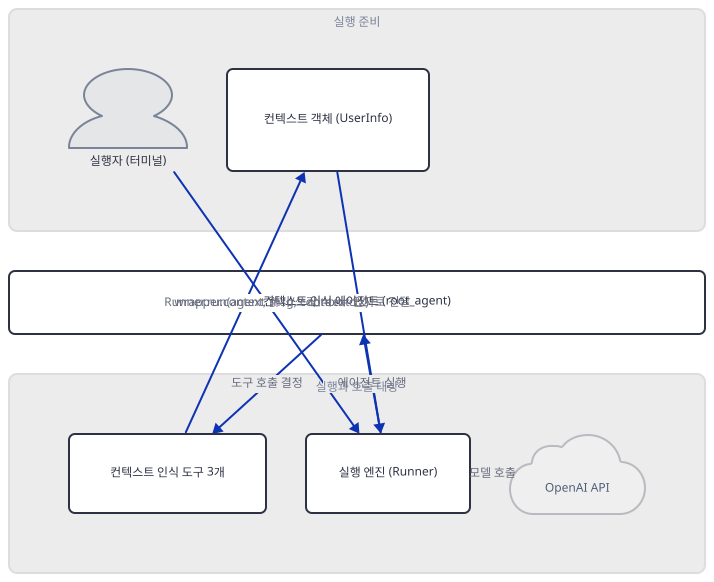
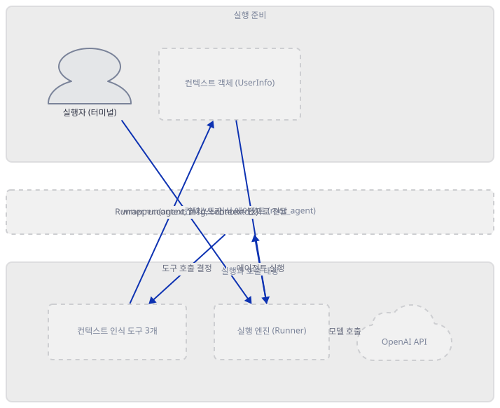
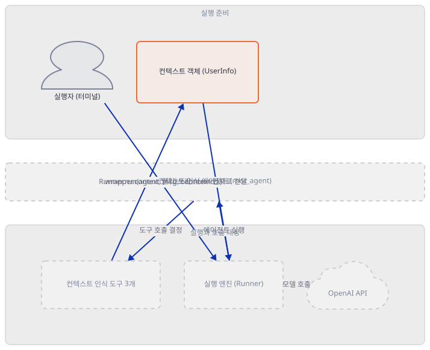
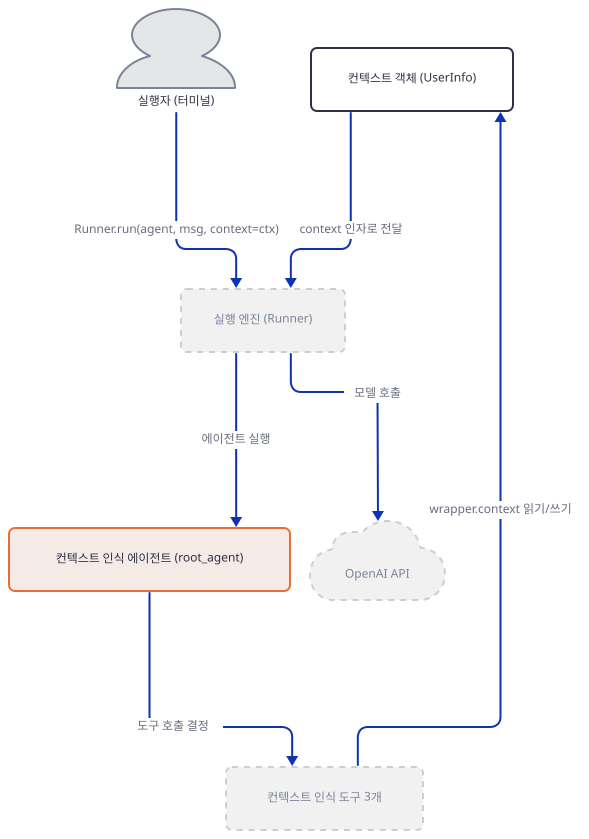
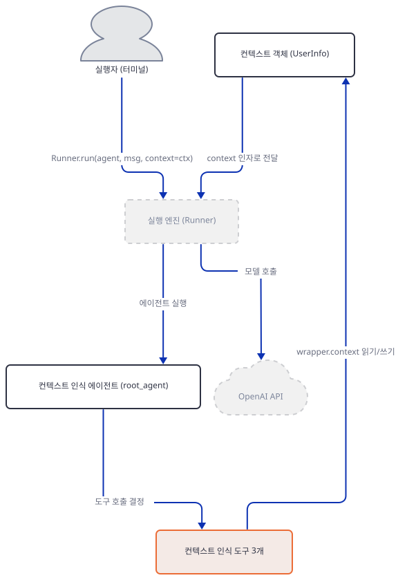
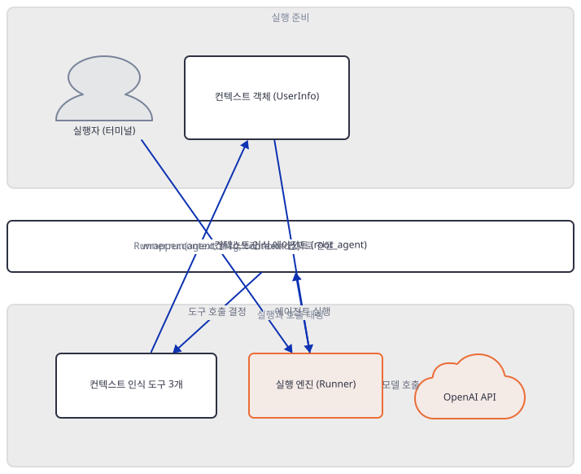
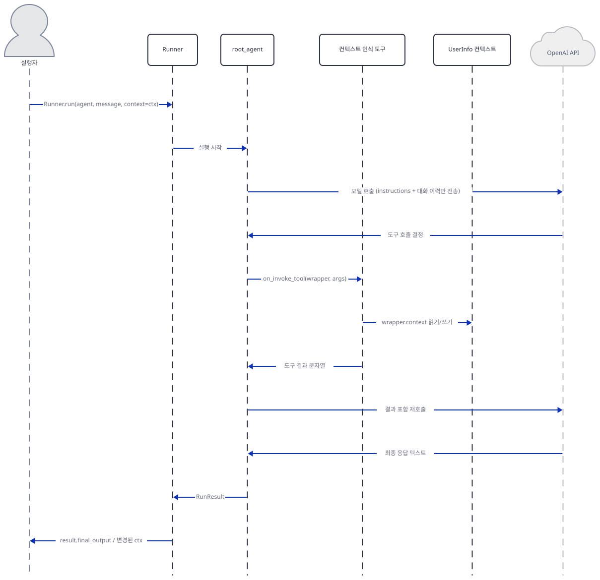

# Day 028 · OpenAI Agents SDK Crash Course · 5_context_management

> 볼륨 2 🧑‍🏫 Crash Courses · 난이도 ★☆☆ · 예상 소요 40분(파일 하나 83줄짜리 짧은 레슨입니다) · API 비용 $0 (API 키 없이 진행 — 실제 OpenAI 모델 호출은 하지 않습니다) · 원본 앱: `ai_agent_framework_crash_course/openai_sdk_crash_course/5_context_management`

## 오늘 만들 것

Day 024가 세운 `openai-agents` 패키지, `from agents import ...` 임포트, `OPENAI_API_KEY` 키라는 공통 축 위에(모델은 이 레슨이 지정하지 않아 SDK 기본값으로 풀립니다 — 그 기본값이 실제로 무엇인지는 Day 024가 확인해 두었습니다), 오늘은 "**컨텍스트**가 이 SDK에서 정확히 무엇을 가리키는가"를 다룹니다. 이 폴더는 `agent.py` 하나(83줄)뿐이고, 이 볼륨에서 `requirements.txt`가 없는 세 레슨 중 하나입니다(Day 024가 예고, Step 1에서 확인). `agent.py`는 `UserInfo` 데이터클래스 하나, 그것을 `wrapper.context`로 읽고 쓰는 함수 도구 3개(`fetch_user_profile`·`update_user_preference`·`get_personalized_greeting`), 이를 묶는 제네릭 에이전트 `Agent[UserInfo]` 하나로 이루어져 있습니다. Day 018의 ADK `SessionService`와 이름은 비슷해도 층이 다릅니다 — ADK 세션은 턴과 재시작을 넘어 남아 다음 모델 호출에 다시 실리는 저장소였지만, 이 SDK의 `RunContextWrapper`는 정반대입니다: 소스 독스트링이 명시하듯 컨텍스트는 LLM에 전달되지 않고(Step 5), `Runner.run()` 한 번이 끝나면 함께 사라지는 의존성 주입 그릇일 뿐입니다. 레슨 자신의 README는 이를 "Type-Safe Context"라 부르지만, `Agent[UserInfo]`가 런타임에 남기는 것은 `__orig_class__` 속성 하나뿐입니다(Step 3) — 타입 검사는 정적 도구의 몫입니다. 도구를 모델 없이 직접 불러 보면(Step 4) 이 버전은 `RunContextWrapper`가 아니라 그 하위 클래스 `ToolContext`를 요구한다는 것도 드러납니다. 완성 구조는 다음과 같습니다.



## 사전 준비

| 서비스/도구 | 용도 | 발급·설치 |
|---|---|---|
| OpenAI API 키 (`OPENAI_API_KEY`) | `Runner.run()`이 결국 만드는 OpenAI 클라이언트의 인증. 이 문서는 키를 발급하지 않고, 키 없이 어디서 멈추는지만 Step 5에서 확인합니다 | https://platform.openai.com/api-keys 에서 발급 (이 실습에서는 생략) |
| uv | 가상환경 생성과 패키지 설치 | [공통 사전 준비](../README.md#공통-사전-준비-한-번만) 참고 |
| 인터넷 연결 | PyPI에서 `openai-agents` 설치 | 별도 설치 없음 |

## 아키텍처 한눈에 보기

| 컴포넌트 | 역할 | 코드 위치 |
|---|---|---|
| 실행자 (터미널) | `UserInfo`를 만들고 `Runner.run`을 직접 호출 | 코드 없음 (외부 실행) |
| 컨텍스트 객체 (`UserInfo`) | 사용자 이름·ID·선호도를 담는 데이터클래스 | `ai_agent_framework_crash_course/openai_sdk_crash_course/5_context_management/agent.py:4-13` |
| 컨텍스트 인식 에이전트 (`root_agent`) | `Agent[UserInfo]`로 선언되고 세 도구를 쓰는 에이전트 | `ai_agent_framework_crash_course/openai_sdk_crash_course/5_context_management/agent.py:42-60` |
| 컨텍스트 인식 도구 3개 | `wrapper.context`로 `UserInfo`를 읽고 쓰는 함수 도구 | `ai_agent_framework_crash_course/openai_sdk_crash_course/5_context_management/agent.py:15-39` |
| 실행 엔진 (`Runner`) | 에이전트를 실행하고 컨텍스트를 `RunContextWrapper`로 감쌈 | 코드 없음 (openai-agents 0.22.3 — 소스로 확인) |
| OpenAI API | 실제 추론 수행 | 코드 없음 (외부 서비스) |

## 단계별 진행

### Step 1. 환경 만들기 — 없는 requirements.txt와 필요한 패키지 하나

**목적.** 이 레슨 폴더에 `requirements.txt`가 없다는 것을 직접 확인하고, `agent.py`의 import만으로 실제로 설치해야 할 패키지를 가려냅니다.

**할 일.**

```bash
find ai_agent_framework_crash_course/openai_sdk_crash_course/5_context_management -iname "requirements.txt"; echo "exit=$?"
```

```powershell
Get-ChildItem -Recurse -Path ai_agent_framework_crash_course/openai_sdk_crash_course/5_context_management -Filter "requirements.txt"
```

```
exit=0
```

(아무 것도 출력되지 않았습니다 — 매치가 없어도 `find` 자체는 정상 종료해 이 환경에서는 종료 코드가 0으로 나왔습니다.) 남은 파일은 `agent.py`·`env.example`·`README.md` 셋뿐이고, `agent.py`의 import는 두 줄입니다.

`ai_agent_framework_crash_course/openai_sdk_crash_course/5_context_management/agent.py:1-2`

```python
from dataclasses import dataclass
from agents import Agent, RunContextWrapper, Runner, function_tool
```

`dataclasses`는 표준 라이브러리이고, 서드파티는 `agents`(설치 이름 `openai-agents`) 하나뿐입니다. `openai-agents` 자신이 선언한 의존성(`importlib.metadata.requires`로 확인)에도 `python-dotenv`는 없고, `agent.py`는 `os`나 `dotenv`를 import하지 않습니다(직접 확인) — 같은 폴더의 `env.example`(`ai_agent_framework_crash_course/openai_sdk_crash_course/5_context_management/env.example:1`, 점 없음)은 어떤 코드에서도 읽히지 않는다는 뜻으로, Day 026이 이 볼륨의 다른 레슨들에서 이미 확인한 것과 같은 상황입니다(값을 쓰려면 `--env-file`이나 export가 필요, Day 026 Step 7).

이 저장소는 루트 `pyproject.toml` 때문에 `uv run`이 방금 만든 환경 대신 루트 `.venv`(이름이 같은 다른 `agents` 패키지가 있어 전혀 다른 오류로 이어짐, Day 024가 확인)를 쓰므로 `--no-project`를 계속 붙입니다. 시스템 기본 `python`은 3.13.12였고(Day 026이 이미 확인), 검증에는 `uv venv --python 3.12`로 받은 3.12.10을 썼습니다.

```bash
cd ai_agent_framework_crash_course/openai_sdk_crash_course/5_context_management
uv venv --python 3.12
uv pip install openai-agents
```

```powershell
cd ai_agent_framework_crash_course/openai_sdk_crash_course/5_context_management
uv venv --python 3.12
uv pip install openai-agents
```

(pip 대안: `python -m venv .venv && source .venv/bin/activate && pip install openai-agents`.)



**확인.**

```bash
uv run --no-project python -m py_compile agent.py && echo compiled
```

```
compiled
```

```bash
uv run --no-project python -c "
import importlib.metadata as md
print('openai-agents', md.version('openai-agents'))
print('openai', md.version('openai'))
from agents import Agent, RunContextWrapper, Runner, function_tool
print('imports ok')
"
```

```powershell
uv run --no-project python -c "<위와 같은 코드>"
```

```
openai-agents 0.22.3
openai 3.17.0
imports ok
```

```bash
uv run --no-project python agent.py; echo "exit code: $?"
```

```powershell
uv run --no-project python agent.py
```

```
exit code: 0
```

(직접 확인 — 출력이 없습니다. Day 024의 두 번째 진입점과 같은 이유로, `__main__` 블록이 없어 `context_example()`이 호출되지 않습니다.)

### Step 2. 컨텍스트 객체 — UserInfo와 mutable 기본값 문제

**목적.** `UserInfo` 데이터클래스의 구조를 확인하고, `preferences` 필드가 `dict = None` 뒤에 `__post_init__`을 따로 두는 이유를 실제 에러로 확인합니다.

**할 일.**

`ai_agent_framework_crash_course/openai_sdk_crash_course/5_context_management/agent.py:4-13`

```python
@dataclass
class UserInfo:
    """Context object containing user information and session data"""
    name: str
    uid: int
    preferences: dict = None
    
    def __post_init__(self):
        if self.preferences is None:
            self.preferences = {}
```

`preferences: dict = {}`처럼 리터럴 mutable 기본값은 파이썬이 클래스 정의 시점에 거부합니다 — 인스턴스들이 같은 dict를 공유하는 버그를 막기 위해서입니다. 그래서 기본값을 `None`으로 두고 `__post_init__`에서 인스턴스마다 새 dict를 만듭니다.



**확인.**

```bash
uv run --no-project python -c "
from dataclasses import dataclass

try:
    @dataclass
    class Bad:
        preferences: dict = {}
except ValueError as e:
    print('literal mutable default ->', type(e).__name__, str(e))

from agent import UserInfo
a = UserInfo(name='A', uid=1)
b = UserInfo(name='B', uid=2)
a.preferences['x'] = 1
print('a.preferences:', a.preferences)
print('b.preferences:', b.preferences)
print('same dict object:', a.preferences is b.preferences)
"
```

```powershell
uv run --no-project python -c "<위와 같은 코드>"
```

```
literal mutable default -> ValueError mutable default <class 'dict'> for field preferences is not allowed: use default_factory
a.preferences: {'x': 1}
b.preferences: {}
same dict object: False
```

(직접 확인 — 리터럴 기본값은 클래스 정의부터 실패하고, 실제 `UserInfo`는 두 인스턴스가 서로 다른 dict를 가집니다.)

### Step 3. 제네릭 에이전트 — Agent[UserInfo]가 런타임에 하는 일

**목적.** `root_agent = Agent[UserInfo]` 정의에 쓰인 제네릭 표기가 실제로 무엇을 만드는지 확인하고, 이것이 런타임 강제가 아니라 정적 타입 힌트일 뿐이라는 것을 확인합니다.

**할 일.**

`ai_agent_framework_crash_course/openai_sdk_crash_course/5_context_management/agent.py:42-43`

```python
root_agent = Agent[UserInfo](
    name="Context-Aware Assistant",
```

`Agent`는 `typing.Generic`을 상속합니다(소스로 확인, `agents/agent.py`). 제네릭 서브스크립트 `Agent[UserInfo]`는 `Agent`와 같은 클래스의 인스턴스를 만들고 `__orig_class__` 속성 하나만 덧붙일 뿐, 필드 검증이나 타입 강제는 하지 않습니다. 도구 쪽 `RunContextWrapper[UserInfo]`(`ai_agent_framework_crash_course/openai_sdk_crash_course/5_context_management/agent.py:16`)도 마찬가지로, 두 표기가 같은 `UserInfo`를 가리키는지는 SDK가 대조하는 게 아니라 작성자가 손으로 맞추는 관례입니다.



**확인.**

```bash
uv run --no-project python -c "
import typing
from agents import Agent
from agent import root_agent

plain = Agent(name='plain', instructions='hi')

print('Agent is Generic:', issubclass(Agent, typing.Generic))
print('type(root_agent):', type(root_agent).__name__)
print('root_agent.__orig_class__:', root_agent.__orig_class__)
print('plain has __orig_class__:', hasattr(plain, '__orig_class__'))
print('root_agent.model:', repr(root_agent.model))
print('type(plain) is type(root_agent):', type(plain) is type(root_agent))
"
```

```powershell
uv run --no-project python -c "<위와 같은 코드>"
```

```
Agent is Generic: True
type(root_agent): Agent
root_agent.__orig_class__: agents.agent.Agent[agent.UserInfo]
plain has __orig_class__: False
root_agent.model: None
type(plain) is type(root_agent): True
```

(직접 확인 — `plain`과 `root_agent`는 완전히 같은 클래스의 인스턴스입니다. `model`이 `None`인 것은 Day 024가 확인한 기본값 해석과 같습니다.)

### Step 4. 컨텍스트 인식 도구 3개 — 모델이 보는 것과 못 보는 것

**목적.** 세 도구가 `wrapper.context`로 `UserInfo`를 읽고 쓰는 방식을 확인하고, 모델에게 실제로 노출되는 JSON 스키마에는 그 컨텍스트 매개변수가 전혀 없다는 것을 확인합니다. 이어서 모델 없이 도구를 직접 호출해, 한 도구의 컨텍스트 변경이 같은 실행의 다른 호출에도 그대로 보이는지 확인합니다.

**할 일.**

`ai_agent_framework_crash_course/openai_sdk_crash_course/5_context_management/agent.py:15-19`

```python
@function_tool
async def fetch_user_profile(wrapper: RunContextWrapper[UserInfo]) -> str:
    """Fetch detailed user profile information from the context"""
    user = wrapper.context
    return f"User Profile: {user.name} (ID: {user.uid}), Preferences: {user.preferences}"
```

`ai_agent_framework_crash_course/openai_sdk_crash_course/5_context_management/agent.py:21-26`

```python
@function_tool
async def update_user_preference(wrapper: RunContextWrapper[UserInfo], key: str, value: str) -> str:
    """Update a user preference in the context"""
    user = wrapper.context
    user.preferences[key] = value
    return f"Updated {user.name}'s preference: {key} = {value}"
```

세 번째 도구 `get_personalized_greeting`(`ai_agent_framework_crash_course/openai_sdk_crash_course/5_context_management/agent.py:28-39`)은 `preferences.get('greeting_style', 'formal')` 값에 따라 문구 셋 중 하나를 돌려줍니다. 세 함수 모두 첫 매개변수 `wrapper`로 컨텍스트를 받지만, `@function_tool`이 모델에게 보여주는 스키마엔 이 매개변수가 나타나지 않습니다 — 확인에서 직접 봅니다. 이 스키마만으로 도구를 직접 부르려면 단순 `RunContextWrapper`로는 부족한데, 이유는 문제 해결에 있습니다.



**확인.** 먼저 모델에게 실제로 노출되는 스키마를 봅니다.

```bash
uv run --no-project python -c "
from agent import fetch_user_profile, update_user_preference, get_personalized_greeting
import json
print('type:', type(fetch_user_profile).__name__)
for t in (fetch_user_profile, update_user_preference, get_personalized_greeting):
    print(t.name, '->', json.dumps(t.params_json_schema))
"
```

```powershell
uv run --no-project python -c "<위와 같은 코드>"
```

```
type: FunctionTool
fetch_user_profile -> {"properties": {}, "title": "fetch_user_profile_args", "type": "object", "additionalProperties": false, "required": []}
update_user_preference -> {"properties": {"key": {"title": "Key", "type": "string"}, "value": {"title": "Value", "type": "string"}}, "required": ["key", "value"], "title": "update_user_preference_args", "type": "object", "additionalProperties": false}
get_personalized_greeting -> {"properties": {}, "title": "get_personalized_greeting_args", "type": "object", "additionalProperties": false, "required": []}
```

세 스키마 다 `wrapper`가 없습니다 — `update_user_preference`만 `key`·`value`를 받고 나머지 둘은 빈 객체 `{}`로 호출됩니다. 이제 `ToolContext`(`RunContextWrapper`의 하위 클래스, 문제 해결 참고)로 도구를 모델 없이 직접 실행해 컨텍스트 공유·변경을 봅니다.

```bash
uv run --no-project python -c "
import asyncio, json
from agent import UserInfo, fetch_user_profile, update_user_preference, get_personalized_greeting
from agents.tool_context import ToolContext

user = UserInfo(name='Alice Johnson', uid=12345, preferences={'greeting_style': 'formal'})

def ctx_for(tool_name, args_json):
    return ToolContext(context=user, tool_name=tool_name, tool_call_id='call_1', tool_arguments=args_json)

async def main():
    out1 = await fetch_user_profile.on_invoke_tool(ctx_for('fetch_user_profile', '{}'), '{}')
    print('fetch_user_profile ->', out1)

    out2 = await get_personalized_greeting.on_invoke_tool(ctx_for('get_personalized_greeting', '{}'), '{}')
    print('get_personalized_greeting (formal) ->', out2)

    args = json.dumps({'key': 'greeting_style', 'value': 'casual'})
    out3 = await update_user_preference.on_invoke_tool(ctx_for('update_user_preference', args), args)
    print('update_user_preference ->', out3)

    print('user.preferences now:', user.preferences)

    out4 = await get_personalized_greeting.on_invoke_tool(ctx_for('get_personalized_greeting', '{}'), '{}')
    print('get_personalized_greeting (after update) ->', out4)

asyncio.run(main())
"
```

```powershell
uv run --no-project python -c "<위와 같은 코드>"
```

```
fetch_user_profile -> User Profile: Alice Johnson (ID: 12345), Preferences: {'greeting_style': 'formal'}
get_personalized_greeting (formal) -> Good day, Alice Johnson. How may I assist you?
update_user_preference -> Updated Alice Johnson's preference: greeting_style = casual
user.preferences now: {'greeting_style': 'casual'}
get_personalized_greeting (after update) -> Hey Alice Johnson! What's up?
```

(직접 확인 — `update_user_preference` 이후 `get_personalized_greeting`도 바뀐 값을 봅니다. 세 도구가 같은 파이썬 객체를 참조로 공유할 뿐, 복사나 직렬화는 없습니다.)

### Step 5. Runner.run과 실행 경계 — 컨텍스트는 모델에 가지 않는다

**목적.** `RunContextWrapper` 자신의 독스트링으로 컨텍스트가 LLM에 전달되지 않는다는 것을 확인하고, 키 없이 실행하면 도구가 한 번도 호출되지 못한 채 어디서 멈추는지 확인합니다.

**할 일.** `Runner.run`은 `context`를 선택적 인자로 받습니다(소스로 확인, 기본값은 `None`) — 이 레슨은 이렇게 넘깁니다.

`ai_agent_framework_crash_course/openai_sdk_crash_course/5_context_management/agent.py:73-78`

```python
    # Run agent with context
    result = await Runner.run(
        root_agent,
        "Hello! I'd like to know about my profile and prefer casual greetings.",
        context=user_context
    )
```

`instructions`는 문자열 대신 `RunContextWrapper[TContext]`와 `Agent[TContext]`를 받는 콜러블일 수도 있습니다(소스로 확인 — 이 레슨은 문자열만 쓰고 콜러블은 실행해 보지 않았습니다). 그 경로를 쓰지 않는 한 `UserInfo` 객체는 프로세스 밖으로 나가지 않습니다.



**확인.** 먼저 `RunContextWrapper` 자신의 독스트링을 봅니다.

```bash
uv run --no-project python -c "
from agents import RunContextWrapper
print(RunContextWrapper.__doc__)
"
```

```powershell
uv run --no-project python -c "<위와 같은 코드>"
```

```
This wraps the context object that you passed to `Runner.run()`. It also contains
    information about the usage of the agent run so far.

    NOTE: Contexts are not passed to the LLM. They're a way to pass dependencies and data to code
    you implement, like tool functions, callbacks, hooks, etc.
```

(직접 확인.) 이제 키 없이 `context_example()`을 실제로 실행합니다.

```bash
uv run --no-project python -c "
import os
os.environ.pop('OPENAI_API_KEY', None)
import asyncio
from agent import context_example
try:
    asyncio.run(context_example())
except Exception as e:
    print('EXCEPTION TYPE:', type(e).__name__)
    print('EXCEPTION MODULE:', type(e).__module__)
    print('EXCEPTION TEXT:', str(e))
"
```

```powershell
uv run --no-project python -c "<위와 같은 코드>"
```

```
OPENAI_API_KEY is not set, skipping trace export
EXCEPTION TYPE: OpenAIError
EXCEPTION MODULE: openai
EXCEPTION TEXT: Missing credentials. Please pass an `api_key`, `workload_identity`, `admin_api_key`, or set the `OPENAI_API_KEY` or `OPENAI_ADMIN_KEY` environment variable.
```

(직접 확인 — Day 024·026과 같은 지점입니다: `Runner`가 클라이언트를 만드는 순간에 멈춰, 세 도구는 이번 실행에서 한 번도 불리지 않았습니다.)

## 요청 한 건이 흐르는 과정



이 시퀀스는 `context_example()`이 실제로 밟는 경로를 그립니다. 실행자가 `Runner.run(root_agent, message, context=user_context)`를 부르면 `Runner`는 넘겨받은 객체를 `RunContextWrapper`로 감싸 실행을 시작합니다(소스로 확인). 모델 호출에 실제로 실리는 것은 `instructions` 문자열과 대화 이력뿐이고, `UserInfo` 객체 자체는 직렬화되지 않습니다(Step 5) — 모델이 사용자 정보를 알게 되는 유일한 길은 도구가 돌려주는 문자열입니다. 모델이 도구 호출을 결정하면 에이전트는 `on_invoke_tool(wrapper, args)`을 부르고, 도구는 같은 `wrapper.context` 객체를 읽거나 씁니다 — Step 4에서 API 없이 재현한 것과 같은 메커니즘입니다. 유효한 키가 없어 도구 호출 결정부터 최종 응답까지는 SDK 소스에 근거해 그렸을 뿐이고, 직접 확인한 것은 `Runner.run`이 클라이언트를 만드는 지점까지(Step 5)와 도구 호출·컨텍스트 변경 구간(Step 4)입니다.

## 실행 체크리스트

- [ ] 이 레슨엔 `requirements.txt`가 없고, 실제로 설치해야 할 서드파티 패키지는 `openai-agents` 하나뿐이라는 것을 import 조사와 실행으로 확인했다
- [ ] `agent.py`를 그냥 실행하면 `__main__` 블록이 없어 아무 것도 출력되지 않는다는 것을 확인했다
- [ ] `UserInfo`가 mutable 기본값을 직접 쓰지 않고 `__post_init__`으로 `preferences`를 초기화하는 이유를 실제 에러로 확인했다
- [ ] `Agent[UserInfo]`가 런타임에는 평범한 `Agent` 인스턴스를 만들 뿐이고, 제네릭 표기는 `__orig_class__` 속성 하나만 남기는 정적 타입 힌트라는 것을 확인했다
- [ ] 세 컨텍스트 인식 도구의 실제 JSON 스키마에 `wrapper` 매개변수가 전혀 노출되지 않는다는 것을 확인했다
- [ ] `ToolContext`로 도구를 직접 호출해, 한 도구의 컨텍스트 변경이 같은 실행 안의 다른 호출에도 그대로 보인다는 것을 확인했다
- [ ] `RunContextWrapper` 자신의 독스트링으로 "컨텍스트는 LLM에 전달되지 않는다"는 것을 확인했다
- [ ] `Runner.run`의 `context` 인자가 기본값 `None`인 선택적 매개변수라는 것을 확인했다
- [ ] 키 없이 실행하면 도구가 한 번도 호출되지 않고 `Runner`가 클라이언트를 만드는 시점에 `OpenAIError`로 멈춘다는 것을 확인했다

## 문제 해결

| 증상 | 원인 | 해결 |
|---|---|---|
| `uv run --no-project python agent.py`를 실행해도 화면에 아무 것도 안 찍힘 | 파일에 `if __name__ == "__main__":` 블록이 없어 `context_example()`이 정의만 되고 호출되지 않는다(직접 확인) | 함수를 직접 호출하거나(더 해보기), 대화형으로 임포트해서 부른다 |
| 최상위 README의 `cp env.example .env` 안내를 따라도 실제로 아무 효과가 없음 | `agent.py`가 `os`나 `dotenv`를 전혀 import하지 않는다(직접 확인) — Day 026이 같은 볼륨의 다른 레슨들에서 이미 확인한 것과 같은 상황 | 값을 프로세스 환경에 직접 두거나(`export`/`$env:`), `uv run --no-project --env-file .env`를 쓴다 |
| `RunContextWrapper(context=user)`만 만들어 함수 도구의 `on_invoke_tool`을 직접 부르면 `AttributeError: 'RunContextWrapper' object has no attribute 'tool_name'` | 이 버전(openai-agents 0.22.3)의 함수 도구 호출부는 `RunContextWrapper`가 아니라 그 하위 클래스 `ToolContext`(`tool_name`·`tool_call_id` 등을 추가로 가짐)를 요구한다(소스로 확인, `agents/tool.py`의 `_on_invoke_tool_impl` 시그니처) | `agents.tool_context.ToolContext(context=user, tool_name=..., tool_call_id=..., tool_arguments=...)`로 감싸서 호출한다(Step 4) |
| 키 없이 `Runner.run(..., context=...)`를 실행하면 `openai.OpenAIError: Missing credentials...` | `Runner`가 실제 OpenAI 클라이언트를 만드는 순간에 멈춘다 — 도구가 호출되기 한참 전이다(직접 확인) | Day 024·026과 같은 경계다. 유효한 `OPENAI_API_KEY`가 있어야 이 지점을 넘어간다 |

## 더 해보기

- `ai_agent_framework_crash_course/openai_sdk_crash_course/5_context_management/agent.py:9`의 `preferences: dict = None`을 사본에서 `preferences: dict = {}`로 직접 바꿔, Step 2에서 본 것과 같은 `ValueError`가 이번엔 `agent.py` 자신을 임포트하는 순간 나는지 확인해보기
- `ai_agent_framework_crash_course/openai_sdk_crash_course/5_context_management/agent.py:42`의 `Agent[UserInfo]`를 `Agent[str]`로 바꾼 사본에서도 `Runner.run(root_agent, ..., context=UserInfo(...))` 호출 자체는 여전히 아무 타입 오류 없이 진행되는지 확인해보기(제네릭이 실행에 영향을 주지 않는다는 것의 반대쪽 증명)
- `ai_agent_framework_crash_course/openai_sdk_crash_course/5_context_management/agent.py:44`의 문자열 `instructions`를 `RunContextWrapper[UserInfo]`와 `Agent[UserInfo]`를 받아 `wrapper.context.name`을 담은 문자열을 돌려주는 콜러블로 바꿔, 유효한 키로 실행했을 때 실제로 그 값이 모델 응답에 반영되는지 확인해보기(API 키 필요)

## 다음 날 예고

[Day 029 · OpenAI Agents SDK Crash Course · 6_guardrails_validation](../day029-openai-sdk-6-guardrails-validation/README.md) — 입력·출력에 각각 거는 `@input_guardrail`·`@output_guardrail`로 에이전트의 요청과 응답을 검증하는 법을 다룹니다.
