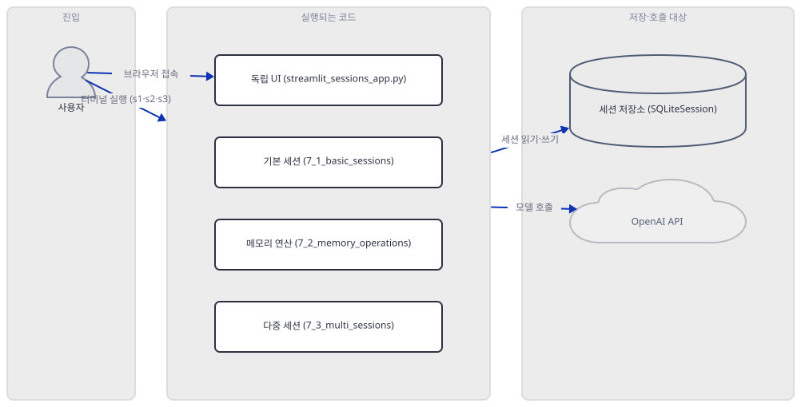
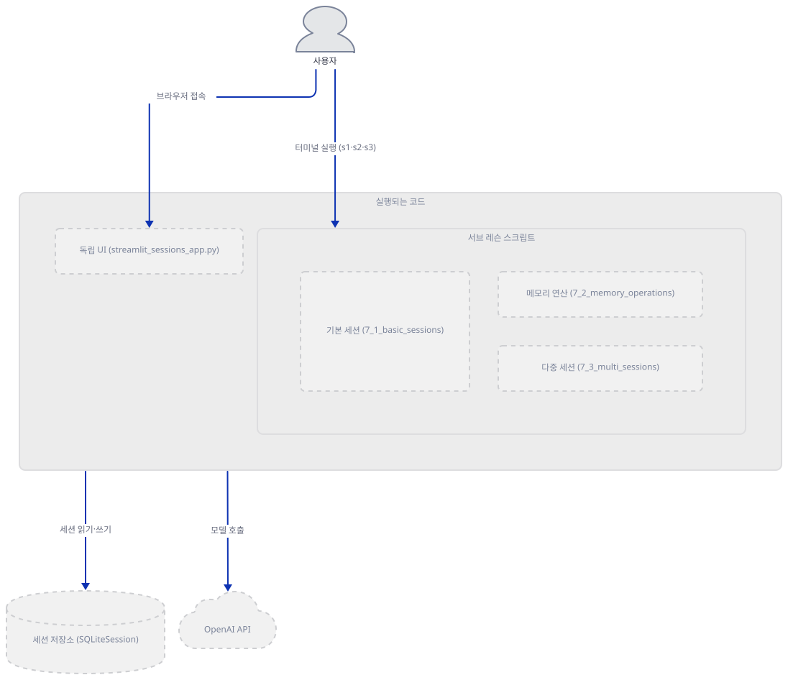
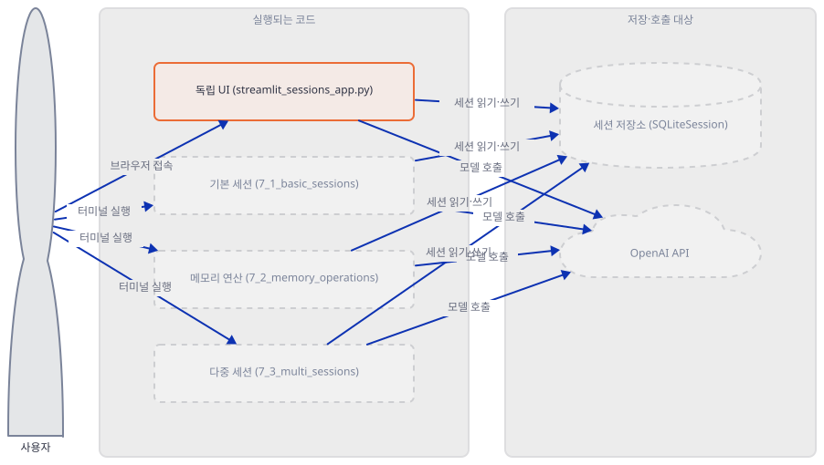
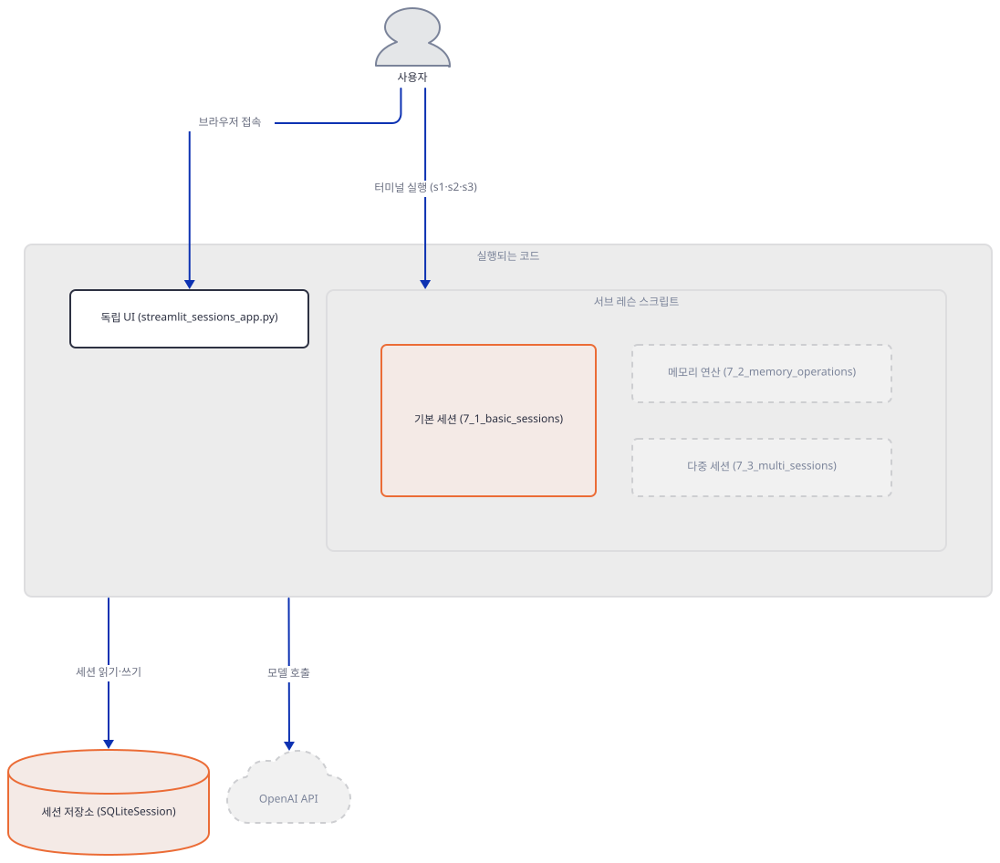
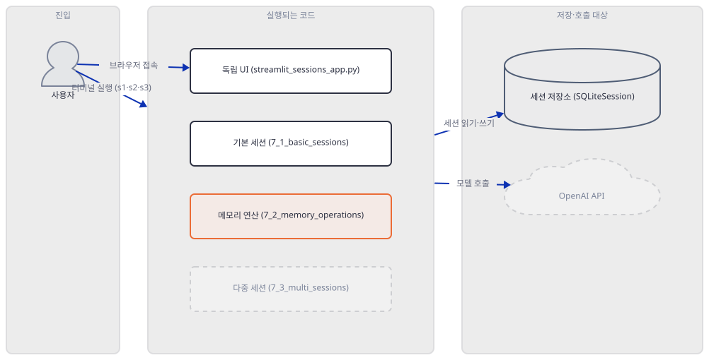
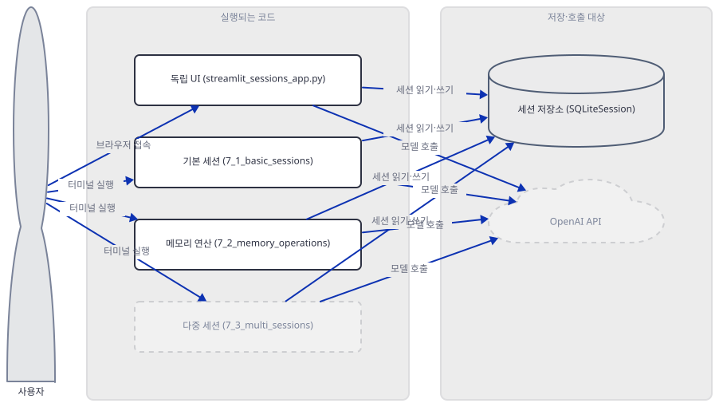
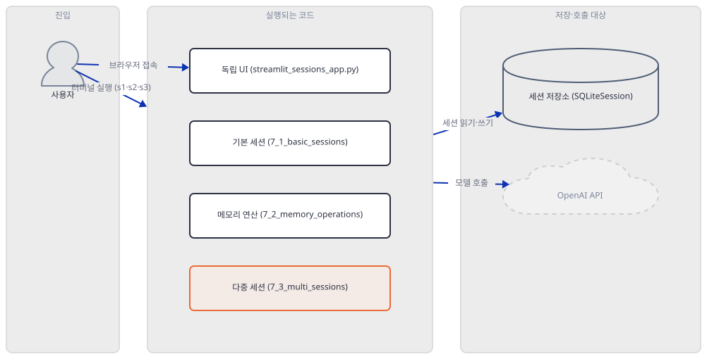
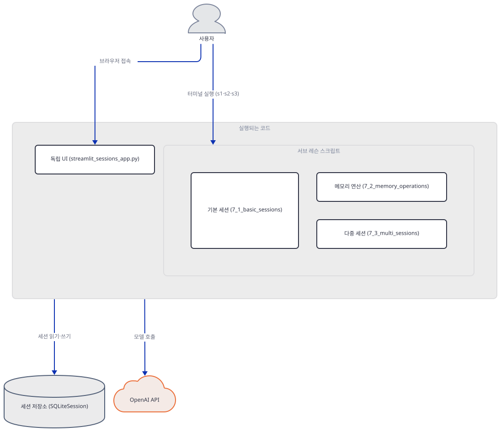
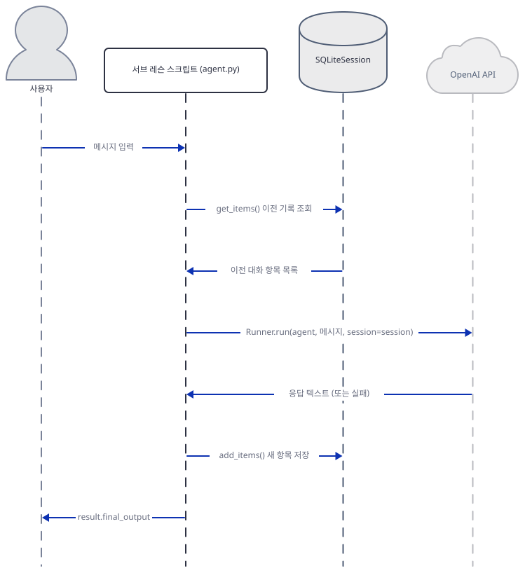

# Day 030 · OpenAI Agents SDK Crash Course · 7_sessions

> 볼륨 2 🧑‍🏫 Crash Courses · 난이도 ★★☆ · 예상 소요 110분(본문을 읽는 시간보다 손으로 직접 돌리는 시간이 큽니다 — 서브 레슨 셋과 독립 앱 하나를 오가며 가상환경을 만들고 명령을 열여섯 번 넘게 실행해 확인합니다) · API 비용 $0 (API 키 없이 진행 — `SQLiteSession`은 로컬 SQLite만 쓰므로 키 없이도 실제 동작을 검증합니다) · 원본 앱: `ai_agent_framework_crash_course/openai_sdk_crash_course/7_sessions`

## 오늘 만들 것

Day 024가 이 볼륨의 공통축 — 패키지 `openai-agents`, 임포트 `from agents import Agent, Runner, ...`, 키 `OPENAI_API_KEY`, 모델 `gpt-4o-mini`/`gpt-4o` — 을 세운 뒤, 오늘 `7_sessions`는 이 볼륨에서 처음으로 대화 기록을 다룹니다. 프레임워크는 다르지만 주제로 가장 가까운 친척은 Day018입니다 — Google ADK가 `InMemorySessionService`와 `DatabaseSessionService`라는 서로 다른 두 클래스로 나눴던 "메모리인가 영속인가"라는 질문을, OpenAI Agents SDK는 `SQLiteSession` 클래스 하나와 인자 하나(`db_path`)로 합칩니다 — 그 통합이 실제로 무엇을 의미하는지는 Step 3과 Step 7이 Day018과 나란히 확인합니다. 이 폴더에는 `7_1_basic_sessions`·`7_2_memory_operations`·`7_3_multi_sessions`라는 세 서브 레슨과, 그 위에 418줄짜리 독립 Streamlit 앱(`streamlit_sessions_app.py`)이 있습니다. 넷을 다 가르치는 대신 이 문서는 먼저 넷의 관계부터 규명합니다(Step 2) — 앱은 세 서브 레슨을 불러 쓰는 프런트엔드가 아니라, 자기만의 `SessionManager` 클래스와 에이전트 세 개를 새로 정의해 같은 세 개념을 UI 위에서 다시 구현한, 코드를 한 줄도 공유하지 않는 네 번째 물건입니다(직접 확인) — 그래서 이 문서는 세 서브 레슨의 `agent.py`로 가르치고 앱은 구조만 확인합니다.

`SQLiteSession`은 이 볼륨에서 키 없이도 진짜 동작을 검증할 수 있는 유일한 자리입니다 — 세션을 만들고, 쓰고, 다시 읽고, 프로세스를 새로 띄워도 남는지까지 전부 로컬 SQLite라 API 호출이 필요 없습니다(Step 3~6). 그리고 키 없이 `Runner.run()`을 세션과 함께 불러보면, ADK의 `Runner`가 예외를 삼키고 빈 문자열로 조용히 끝났던 Day018과 달리 이 SDK는 예외(`openai.OpenAIError`)를 그대로 호출자에게 던지면서도, 실패 직전에 사용자의 새 턴을 이미 세션에 써 버립니다 — 같은 실패를 재시도하면 세션에 같은 사용자 메시지가 두 번 쌓입니다(직접 확인, Step 7). 이 레슨의 최상위 README도 이 시리즈의 패턴에서 벗어나지 않습니다 — "Tutorial Overview" 절이 적은 파일 이름 셋(`basic_sessions.py` 등) 중 실제로 존재하는 것은 하나도 없습니다(Step 2) — Day019·022·023·026에 이어 다섯 번째 사례입니다. 완성 구조는 다음과 같습니다.



## 사전 준비

| 서비스/도구 | 용도 | 발급·설치 |
|---|---|---|
| OpenAI API 키 (`OPENAI_API_KEY`) | 세 서브 레슨과 앱이 공유하는 `Runner` 인증. 이 문서는 키를 발급하지 않고, `SQLiteSession`이 키 없이 어디까지 검증되는지와 키 없는 `Runner.run()`이 세션에 무엇을 남기는지만 확인합니다 | https://platform.openai.com/api-keys 에서 발급 (이 실습에서는 생략) |
| uv | 가상환경 생성과 패키지 설치 | [공통 사전 준비](../README.md#공통-사전-준비-한-번만) 참고 |
| 인터넷 연결 | PyPI에서 `openai-agents`·`streamlit`·`python-dotenv` 설치 | 별도 설치 없음 |

## 아키텍처 한눈에 보기

| 컴포넌트 | 역할 | 코드 위치 |
|---|---|---|
| 사용자 (터미널/브라우저) | 서브 레슨을 직접 실행하거나 앱에 접속 | 코드 없음 |
| 독립 UI (`streamlit_sessions_app.py`) | 세 개념을 자체 `SessionManager`로 다시 구현한 네 번째 예제. 세 서브 레슨과 코드 공유 없음 | `ai_agent_framework_crash_course/openai_sdk_crash_course/7_sessions/streamlit_sessions_app.py:1-418` |
| 기본 세션 (`7_1_basic_sessions/agent.py`) | `SQLiteSession` 기본값(`:memory:`)과 파일 기반의 차이를 보여줌 | `ai_agent_framework_crash_course/openai_sdk_crash_course/7_sessions/7_1_basic_sessions/agent.py:1-145` |
| 메모리 연산 (`7_2_memory_operations/agent.py`) | `get_items`·`add_items`·`pop_item`·`clear_session` 네 연산을 시연 | `ai_agent_framework_crash_course/openai_sdk_crash_course/7_sessions/7_2_memory_operations/agent.py:1-188` |
| 다중 세션 (`7_3_multi_sessions/agent.py`) | 같은 DB 파일, 다른 `session_id`로 여러 세션을 격리 | `ai_agent_framework_crash_course/openai_sdk_crash_course/7_sessions/7_3_multi_sessions/agent.py:1-150` |
| 세션 저장소 (`SQLiteSession`) | 대화 기록을 SQLite에 읽고 쓰는 세션 구현체 | 코드 없음 (openai-agents 0.22.3 — 소스로 확인) |
| OpenAI API | 실제 추론 수행 | 코드 없음 (외부 서비스) |

## 단계별 진행

### Step 1. 환경 만들기 — 의존성 설치와 `.venv`가 사라지면 벌어지는 일

**목적.** 이 레슨의 의존성을 격리된 가상환경에 설치하고, 이 볼륨의 함정(패키지/임포트 이름 분리, `env.example`, 저장소 루트의 TensorFlow Agents 충돌)을 이 폴더에서도 다시 확인합니다.

**할 일.**

```bash
cd ai_agent_framework_crash_course/openai_sdk_crash_course/7_sessions
uv venv --python 3.12
uv pip install -r requirements.txt
```

```powershell
cd ai_agent_framework_crash_course/openai_sdk_crash_course/7_sessions
uv venv --python 3.12
uv pip install -r requirements.txt
```

(pip 대안: `python -m venv .venv && source .venv/bin/activate && pip install -r requirements.txt`. Windows PowerShell은 활성화만 `.venv\Scripts\Activate.ps1`로 바꿉니다. 시스템 기본 `python`은 3.13.12이고(앞선 레슨들이 이미 정정한 값), 이 venv는 `--python 3.12`로 3.12.10을 받습니다, 직접 확인.)

`ai_agent_framework_crash_course/openai_sdk_crash_course/7_sessions/requirements.txt:1-3`

```text
openai-agents>=0.2.0
streamlit>=1.28.0
python-dotenv>=1.0.0
```

설치 이름 `openai-agents`와 임포트 이름 `agents`가 다르다는 것, 그리고 `env.example`이 이 볼륨 전체에서 점 없는 이름이라는 것은 Day 024가 이미 정리했으므로 여기서는 가리키기만 합니다 — 이 폴더도 최상위와 세 서브 레슨 전부 `env.example`(점 없음)이고 예외가 없습니다(직접 확인, `find . -name "*env.example*"`가 넷을 그대로 찾습니다).

이 저장소는 루트에 `pyproject.toml`이 있어 `uv run`이 방금 만든 환경 대신 루트의 `.venv`를 쓰므로, 이후 `uv run` 명령에는 모두 `--no-project`를 붙입니다. 이 방금 만든 `.venv`는 하위 폴더(`7_1_basic_sessions/` 등)에서 실행해도 `--no-project`가 상위 디렉터리로 검색해 그대로 찾아 씁니다(직접 확인) — 서브 레슨마다 새로 만들 필요는 없습니다. 반대로 이 `.venv`를 지운 채로 같은 명령을 실행하면 같은 상향 탐색이 결국 저장소 루트의 `.venv`까지 올라가 버립니다(직접 확인, 이 문서를 준비하며 직접 지웠다가 재현했습니다) — 그 안엔 이름이 같은 다른 패키지 TensorFlow Agents 1.4.0이 있어 `from agents import ...`가 `AttributeError: module 'tensorflow' has no attribute 'contrib'`로 깨진다는 것은 Day 025·026이 이미 문서화했으므로 다시 파지 않습니다(문제 해결 참고).



**확인.**

```bash
uv run --no-project python -c "
import importlib.metadata as md
print('openai-agents', md.version('openai-agents'))
print('openai', md.version('openai'))
print('streamlit', md.version('streamlit'))
print('python-dotenv', md.version('python-dotenv'))
from agents import Agent, Runner, SQLiteSession
print('imports ok')
"
```

```powershell
uv run --no-project python -c "<위와 같은 코드>"
```

```
openai-agents 0.22.3
openai 3.17.0
streamlit 1.64.0
python-dotenv 1.2.3
imports ok
```

(직접 확인. 버전은 설치 시점의 PyPI 상태에 따라 달라질 수 있습니다.)

### Step 2. 이 폴더의 진짜 모습 — 어긋난 파일 이름과 독립 UI의 정체

**목적.** 최상위 README의 "Tutorial Overview"가 적은 파일 이름을 실제 폴더 구조와 대조하고, `streamlit_sessions_app.py`가 세 서브 레슨과 실제로 어떤 관계인지 코드로 규명합니다.

**할 일.** 최상위 README는 세 패턴을 이렇게 소개합니다.

`ai_agent_framework_crash_course/openai_sdk_crash_course/7_sessions/README.md:52-65`

```text
### **1. Basic SQLite Sessions** (`basic_sessions.py`)
- In-memory and persistent session storage
- Automatic conversation history management
- Simple multi-turn conversations

### **2. Advanced Memory Operations** (`memory_operations.py`)
- Memory manipulation with `get_items()`, `add_items()`, `pop_item()`
- Conversation corrections and modifications
- Session management operations

### **3. Multiple Sessions** (`multi_sessions.py`)
- Managing different conversation contexts
- Session isolation and organization
- Custom session implementations
```

`basic_sessions.py`·`memory_operations.py`·`multi_sessions.py` 중 실제로 존재하는 파일은 하나도 없습니다 — 실제 코드는 숫자 접두 폴더 안의 `agent.py` 셋(`7_1_basic_sessions/agent.py` 등)입니다(직접 확인, 아래 `find` 결과). 같은 문서의 "Getting Started" 절도 번호를 정확히 매기지 못합니다 — 설치 다음 두 항목이 나란히 2번입니다. 반면 세 서브 레슨 자신의 중첩 README는 이런 어긋남이 없습니다 — Quick Start가 언급하는 함수 이름(`in_memory_session_example`·`basic_memory_operations`·`multi_user_sessions` 등)이 실제 `agent.py`에 그대로 있습니다(직접 확인, Step 3·4·6에서 하나씩 씁니다).

```bash
find . -maxdepth 1 -mindepth 1 | sort
```

```powershell
Get-ChildItem | Select-Object -ExpandProperty Name
```

```
./7_1_basic_sessions
./7_2_memory_operations
./7_3_multi_sessions
./env.example
./README.md
./requirements.txt
./streamlit_sessions_app.py
```

(직접 확인 — `.venv`는 Step 1에서 만든 것이라 목록에서 뺐습니다.) 이제 `streamlit_sessions_app.py`가 세 서브 레슨을 불러 쓰는지 확인합니다.

`ai_agent_framework_crash_course/openai_sdk_crash_course/7_sessions/streamlit_sessions_app.py:1-9`

```python
import streamlit as st
import asyncio
import os
from datetime import datetime
from agents import Agent, Runner, SQLiteSession
from dotenv import load_dotenv

# Load environment variables
load_dotenv()
```

`agents`·`streamlit`·`dotenv`뿐, `7_1_basic_sessions`·`7_2_memory_operations`·`7_3_multi_sessions` 어디도 import하지 않습니다(직접 확인, `grep`으로 재확인). 대신 자기만의 세션 래퍼를 새로 정의합니다.

`ai_agent_framework_crash_course/openai_sdk_crash_course/7_sessions/streamlit_sessions_app.py:48-56`

```python
class SessionManager:
    def __init__(self):
        self.sessions = {}
    
    def get_session(self, session_id: str, db_file: str = "demo_sessions.db"):
        """Get or create a session"""
        if session_id not in self.sessions:
            self.sessions[session_id] = SQLiteSession(session_id, db_file)
        return self.sessions[session_id]
```

이 클래스도, 위에서 부르는 에이전트 세 개(`main_agent`·`support_agent`·`sales_agent`)도 세 서브 레슨의 `root_agent`와는 별개로 새로 정의됩니다. 즉 이 앱은 세 서브 레슨의 프런트엔드가 아니라 같은 개념(기본 세션·메모리 연산·다중 세션)을 UI 하나 위에서 독자적으로 재구현한 네 번째 물건입니다 — 이 문서는 이후 세 서브 레슨의 `agent.py`로 가르치고, 이 앱은 여기서 구조만 확인하고 실제로 뜨는지만 봅니다.

```bash
uv run --no-project python -m py_compile streamlit_sessions_app.py 7_1_basic_sessions/agent.py 7_2_memory_operations/agent.py 7_3_multi_sessions/agent.py && echo "py_compile OK for all 4 files"
uv run --no-project streamlit run streamlit_sessions_app.py --server.headless true --server.port 8531
```

```powershell
uv run --no-project python -m py_compile streamlit_sessions_app.py 7_1_basic_sessions/agent.py 7_2_memory_operations/agent.py 7_3_multi_sessions/agent.py
uv run --no-project streamlit run streamlit_sessions_app.py --server.headless true --server.port 8531
```



**확인.** 다른 터미널에서 서버가 실제로 떴는지 봅니다.

```bash
curl.exe -s -o /dev/null -w "HTTP %{http_code}\n" http://localhost:8531
```

```powershell
curl.exe -s -o NUL -w "HTTP %{http_code}`n" http://localhost:8531
```

```
py_compile OK for all 4 files
```

```
Uvicorn server started on :::8531
```

```
HTTP 200
```

(직접 확인 — 네 파일 모두 컴파일에 성공하고, 앱은 키 없이도 서버 자체는 HTTP 200으로 뜹니다. 실제 채팅 화면은 브라우저 자바스크립트가 그리므로 이 환경에서 클릭까지는 확인하지 못했습니다.)

### Step 3. `SQLiteSession`의 기본값 — 메모리는 인스턴스마다 따로, 파일은 생성자에서 바로

**목적.** `7_1_basic_sessions`로 `SQLiteSession`의 두 예제(인메모리·영속)를 읽고, 기본값 `:memory:`가 실제로 무엇을 의미하는지와 파일 경로를 주면 스키마가 언제 생기는지를 직접 확인합니다. 여기서부터 Day018의 두 세션 서비스와 나란히 대조합니다.

**할 일.** 두 예제는 나란히 있습니다.

`ai_agent_framework_crash_course/openai_sdk_crash_course/7_sessions/7_1_basic_sessions/agent.py:14-19`

```python
# Example 1: In-memory session (temporary)
async def in_memory_session_example():
    """Demonstrates in-memory SQLite session that doesn't persist"""
    
    # In-memory session - lost when process ends
    session = SQLiteSession("temp_conversation")
```

`ai_agent_framework_crash_course/openai_sdk_crash_course/7_sessions/7_1_basic_sessions/agent.py:41-46`

```python
# Example 2: Persistent session (survives restarts)
async def persistent_session_example():
    """Demonstrates persistent SQLite session that saves to file"""
    
    # Persistent session - saves to database file
    session = SQLiteSession("user_123", "conversation_history.db")
```

두 번째 인자(`db_path`)의 유무가 차이의 전부입니다. 소스를 보면(소스로 확인, openai-agents 0.22.3의 `agents/memory/sqlite_session.py`) `db_path`의 기본값은 문자열 `":memory:"`이고, 생성자는 이 값이면 `sqlite3.connect(":memory:", check_same_thread=False)`로 **그 인스턴스 전용의** SQLite 연결을 엽니다 — Day018의 `InMemorySessionService`가 서비스 인스턴스 하나가 공유하는 파이썬 dict였던 것과 달리, 여기서는 같은 `session_id`를 줘도 `SQLiteSession` 객체를 새로 만들면 완전히 별개의 빈 데이터베이스가 열립니다. 파일 경로를 주면 생성자가 그 자리에서 바로 파일을 만들고 테이블까지 세웁니다(아래 확인) — Day018의 `DatabaseSessionService`가 `prepare_tables()`로 첫 DB 작업 때 지연 생성했던 것과 정반대입니다.



**확인.** 먼저 같은 `session_id`를 준 두 인메모리 `SQLiteSession`이 데이터를 공유하는지 봅니다.

```bash
uv run --no-project python -c "
import asyncio
from agents import SQLiteSession

async def main():
    s1 = SQLiteSession('shared_id')
    await s1.add_items([{'role': 'user', 'content': 'secret from s1'}])
    print('s1 sees:', await s1.get_items())

    s2 = SQLiteSession('shared_id')
    print('s2 sees:', await s2.get_items())

asyncio.run(main())
"
```

```powershell
uv run --no-project python -c "<위와 같은 코드>"
```

```
s1 sees: [{'role': 'user', 'content': 'secret from s1'}]
s2 sees: []
```

(직접 확인 — `session_id`가 같아도 인메모리 `SQLiteSession`은 인스턴스마다 완전히 독립입니다.) 이제 파일 경로를 주면 스키마가 언제 생기는지 봅니다(7_1_basic_sessions 폴더 안에서 실행).

```bash
uv run --no-project python -c "
import asyncio, os, sqlite3
from agents import SQLiteSession

async def main():
    print('before construction:', os.path.exists('step3_demo.db'))
    s = SQLiteSession('u1', 'step3_demo.db')
    print('right after constructor:', os.path.exists('step3_demo.db'))
    con = sqlite3.connect('step3_demo.db')
    cur = con.execute(\"SELECT name FROM sqlite_master WHERE type='table' ORDER BY name\")
    print('tables right after constructor:', [r[0] for r in cur.fetchall()])

asyncio.run(main())
"
```

```powershell
uv run --no-project python -c "<위와 같은 코드>"
```

```
before construction: False
right after constructor: True
tables right after constructor: ['agent_messages', 'agent_sessions', 'sqlite_sequence']
```

(직접 확인 — `get_items`나 `add_items`를 한 번도 부르지 않았는데도 생성자만으로 파일과 테이블 2개(`sqlite_sequence`는 SQLite가 `AUTOINCREMENT`용으로 자동으로 붙이는 것)가 이미 만들어져 있습니다. 이 확인이 만든 `step3_demo.db`는 삭제했습니다.)

### Step 4. Runner 없이 세션 두드리기 — `add_items`·`get_items`·`pop_item`·`clear_session`

**목적.** `7_2_memory_operations`가 시연하는 네 연산을 확인하되, 이 파일의 함수는 전부 첫 줄에서 `Runner.run()`부터 부르기 때문에 키 없이는 끝까지 못 간다는 것을 짚고, 같은 메서드를 `Runner` 없이 직접 두드려 완전히 검증합니다.

**할 일.** `conversation_corrections()`의 교정 대목입니다.

`ai_agent_framework_crash_course/openai_sdk_crash_course/7_sessions/7_2_memory_operations/agent.py:69-77`

```python
    # Remove assistant's response using pop_item()
    assistant_item = await session.pop_item()
    if assistant_item:
        print(f"   ↩️  Removed assistant response: {assistant_item['content'][:50]}...")
    
    # Remove user's original question using pop_item()
    user_item = await session.pop_item()
    if user_item:
        print(f"   ↩️  Removed user question: {user_item['content']}")
```

`session_management()`의 초기화 대목입니다.

`ai_agent_framework_crash_course/openai_sdk_crash_course/7_sessions/7_2_memory_operations/agent.py:109-114`

```python
    # Demonstrate clear_session() - removes all conversation history
    print(f"\n🧹 Clearing session with clear_session()...")
    await session.clear_session()
    
    items_after = await session.get_items()
    print(f"📊 Session contains {len(items_after)} items after clearing")
```

두 함수 다 이 대목에 이르기 전에 `Runner.run(root_agent, ...)`을 먼저 호출합니다(파일 첫머리, `basic_memory_operations`도 마찬가지) — 키가 없으면 Step 7에서 볼 예외로 그 자리에서 멈춰 `pop_item`·`clear_session` 줄에는 아예 도달하지 못합니다. 이 문서는 대신 `SQLiteSession`의 네 메서드를 `Runner` 없이 직접 불러 왕복을 완전히 확인합니다.



**확인.** (`7_2_memory_operations` 폴더 안에서 실행)

```bash
uv run --no-project python -c "
import asyncio
from agents import SQLiteSession

async def main():
    session = SQLiteSession('demo_user', 'step4_demo.db')
    await session.add_items([
        {'role': 'user', 'content': 'My name is Alice'},
        {'role': 'assistant', 'content': 'Nice to meet you, Alice!'},
    ])
    items = await session.get_items()
    print('after add_items:', items)

    popped = await session.pop_item()
    print('popped:', popped)
    print('after pop_item:', await session.get_items())

    await session.clear_session()
    print('after clear_session:', await session.get_items())

asyncio.run(main())
"
```

```powershell
uv run --no-project python -c "<위와 같은 코드>"
```

```
after add_items: [{'role': 'user', 'content': 'My name is Alice'}, {'role': 'assistant', 'content': 'Nice to meet you, Alice!'}]
popped: {'role': 'assistant', 'content': 'Nice to meet you, Alice!'}
after pop_item: [{'role': 'user', 'content': 'My name is Alice'}]
after clear_session: []
```

(직접 확인 — 모델을 한 번도 부르지 않고 네 연산 전부를 왕복 확인했습니다. `pop_item()`은 가장 최근 항목을 지우고 돌려주며, `clear_session()`은 그 세션의 모든 항목을 지웁니다. 이 확인이 만든 `step4_demo.db`는 삭제했습니다.)

### Step 5. 재시작을 버티는 것 — 프로세스 두 개와 SQL 원본으로 확인

**목적.** 파일 기반 `SQLiteSession`이 실제로 프로세스 재시작을 버티는지 두 개의 별도 `uv run` 호출로 증명하고, SDK를 거치지 않고 SQL 원본을 직접 읽어 데이터가 진짜로 디스크에 있는지 확인합니다.

**할 일.** `.db` 파일은 스크립트를 실행한 위치를 기준으로 상대 경로에 만들어집니다 — `7_1_basic_sessions/agent.py`를 그 폴더 안에서 실행하면 `conversation_history.db`도 `7_1_basic_sessions/` 안에 생깁니다. 첫 번째 프로세스가 세션을 만들고, 완전히 새로운 프로세스("재시작")가 같은 파일을 다시 엽니다.



**확인.** (`7_1_basic_sessions` 폴더 안에서 실행)

```bash
uv run --no-project python -c "
import asyncio
from agents import SQLiteSession
async def main():
    s = SQLiteSession('sess_u1', 'step5_demo.db')
    await s.add_items([{'role': 'user', 'content': 'remember: my name is Alice'}])
asyncio.run(main())
"
uv run --no-project python -c "
import asyncio
from agents import SQLiteSession
async def main():
    s = SQLiteSession('sess_u1', 'step5_demo.db')
    print('after restart ->', await s.get_items())
asyncio.run(main())
"
uv run --no-project python -c "
import sqlite3
con = sqlite3.connect('step5_demo.db')
cur = con.execute('SELECT session_id, message_data FROM agent_messages')
print(cur.fetchall())
"
```

```powershell
uv run --no-project python -c "<첫 번째 코드>"
uv run --no-project python -c "<두 번째 코드>"
uv run --no-project python -c "<세 번째 코드>"
```

```
after restart -> [{'role': 'user', 'content': 'remember: my name is Alice'}]
```

```
[('sess_u1', '{"role": "user", "content": "remember: my name is Alice"}')]
```

(직접 확인 — 두 번째 명령은 첫 번째와 완전히 다른 `uv run` 프로세스인데도 첫 번째가 쓴 항목을 그대로 읽습니다. 세 번째 명령은 `agents` 패키지를 아예 거치지 않고 표준 라이브러리 `sqlite3`만으로 같은 파일을 열어, 항목이 `message_data` 컬럼에 JSON 문자열로 실제 저장돼 있다는 것을 보여줍니다. 이 확인이 만든 `step5_demo.db`는 삭제했습니다 — 지우지 않았다면 같은 폴더에 계속 남아, 다음에 같은 `session_id`로 실행할 때도 이어졌을 것입니다.)

### Step 6. `7_3_multi_sessions` — 같은 파일, 다른 `session_id`로 격리

**목적.** 여러 `SQLiteSession` 인스턴스가 같은 DB 파일을 공유하면서도 `session_id`로 대화가 섞이지 않는다는 것을 직접 확인하고, 이 서브 레슨은 `root_agent`라는 이름을 아예 쓰지 않는다는 것도 짚습니다.

**할 일.** 이 파일은 `root_agent` 하나 대신 이름 있는 에이전트 둘을 정의합니다.

`ai_agent_framework_crash_course/openai_sdk_crash_course/7_sessions/7_3_multi_sessions/agent.py:1-12`

```python
from agents import Agent, Runner, SQLiteSession

# Create agents for multi-session demonstrations
support_agent = Agent(
    name="Support Agent",
    instructions="You are a customer support representative. Help with account and technical issues."
)

sales_agent = Agent(
    name="Sales Agent", 
    instructions="You are a sales representative. Help with product information and purchases."
)
```

`7_1`·`7_2`는 `root_agent`를 쓰지만 이 파일은 그렇지 않습니다 — `root_agent`라는 이름 자체가 openai-agents에서 아무것도 열어 주지 않는 장식이라는 것은 Day 025가 이미 확인했으므로, 이 서브 레슨이 그 관례조차 따르지 않는다는 사실만 짚고 넘어갑니다. Alice와 Bob의 세션은 같은 파일을 공유합니다.

`ai_agent_framework_crash_course/openai_sdk_crash_course/7_sessions/7_3_multi_sessions/agent.py:20-22`

```python
    # Create separate sessions for different users
    alice_session = SQLiteSession("user_alice", "multi_user.db")
    bob_session = SQLiteSession("user_bob", "multi_user.db")
```

`multi_user_sessions()`도 이 줄들 앞에서 `Runner.run()`을 부르지 않으므로(파일을 보면 이 두 줄 자체는 키와 무관하지만, 바로 다음 줄부터 `Runner.run`이 이어집니다) 세션 생성과 격리 자체는 키 없이 직접 확인할 수 있습니다.



**확인.** (`7_3_multi_sessions` 폴더 안에서 실행)

```bash
uv run --no-project python -c "
import asyncio
from agents import SQLiteSession

async def main():
    alice = SQLiteSession('user_alice', 'step6_demo.db')
    bob = SQLiteSession('user_bob', 'step6_demo.db')
    await alice.add_items([{'role': 'user', 'content': 'I forgot my password'}])
    await bob.add_items([{'role': 'user', 'content': 'My app keeps crashing'}])
    print('alice sees:', await alice.get_items())
    print('bob sees:', await bob.get_items())

asyncio.run(main())
"
uv run --no-project python -c "
import sqlite3
con = sqlite3.connect('step6_demo.db')
cur = con.execute('SELECT session_id, message_data FROM agent_messages ORDER BY id')
for row in cur.fetchall():
    print(row)
"
```

```powershell
uv run --no-project python -c "<첫 번째 코드>"
uv run --no-project python -c "<두 번째 코드>"
```

```
alice sees: [{'role': 'user', 'content': 'I forgot my password'}]
bob sees: [{'role': 'user', 'content': 'My app keeps crashing'}]
```

```
('user_alice', '{"role": "user", "content": "I forgot my password"}')
('user_bob', '{"role": "user", "content": "My app keeps crashing"}')
```

(직접 확인 — 두 번째 명령의 원본 SQL 조회가 보여주듯, 두 사람의 행은 물리적으로 같은 `agent_messages` 테이블 하나에 나란히 들어 있고, `SQLiteSession`은 조회할 때 `session_id`로만 걸러냅니다. 파일 하나를 여러 세션이 공유하되 행 단위로 격리된다는 뜻입니다. 이 확인이 만든 `step6_demo.db`는 삭제했습니다.)

### Step 7. 키 없이 `Runner.run()` — 예외는 올라오지만 세션엔 이미 쓰여 있다

**목적.** 세션이 딸린 `Runner.run()`을 키 없이 불러 정확히 무엇이 일어나는지 확인합니다. Day018의 ADK `Runner`는 이 지점의 예외를 삼키고 빈 문자열로 조용히 끝났는데, 이 SDK가 같은 자리에서 무엇을 하는지가 오늘의 핵심 대조입니다.

**할 일.** 세션 하나를 두고 키 없이 `Runner.run()`을 부르면 무슨 일이 있는지 직접 재현합니다. `openai.OpenAIError`가 `Runner` 내부에서 난다는 것 자체는 Day 024~029가 이미 여러 번 확인했으므로(키 부재 시 클라이언트 생성 단계에서 나는 예외), 여기서는 이 예외가 세션에 무엇을 남기고 가는지만 새로 확인합니다.



**확인.** (`7_1_basic_sessions` 폴더 안에서 실행, 키를 완전히 지운 상태)

```bash
uv run --no-project python -c "
import asyncio, os
os.environ.pop('OPENAI_API_KEY', None)
from agents import Agent, Runner, SQLiteSession

agent = Agent(name='x', instructions='y')

async def main():
    session = SQLiteSession('keyless_test', 'step7_demo.db')
    print('items before run:', await session.get_items())
    try:
        result = await Runner.run(agent, 'My name is Alice', session=session)
        print('RESULT:', result.final_output)
    except Exception as e:
        print('EXCEPTION TYPE:', type(e).__name__)
        print('EXCEPTION MODULE:', type(e).__module__)
    print('items after failed run:', await session.get_items())

asyncio.run(main())
"
```

```powershell
uv run --no-project python -c "<위와 같은 코드>"
```

```
OPENAI_API_KEY is not set, skipping trace export
items before run: []
EXCEPTION TYPE: OpenAIError
EXCEPTION MODULE: openai
items after failed run: [{'content': 'My name is Alice', 'role': 'user'}]
```

(직접 확인 — 예외는 `Runner.run()`을 호출한 코드까지 그대로 올라옵니다. ADK가 이 자리에서 예외를 삼키고 빈 문자열을 돌려줬던 것과 달리, 이 SDK는 예외를 숨기지 않습니다. 그런데 실패한 뒤에도 세션에는 사용자의 새 턴이 이미 들어가 있습니다 — 소스를 보면(소스로 확인, openai-agents 0.22.3의 `agents/run_internal/session_persistence.py`) `prepare_input_with_session()`은 "모델에 보낼 입력"과 "이번 턴에 세션에 저장할 항목"을 애초에 분리된 두 값으로 돌려주도록 문서화돼 있고, 직접 확인한 결과도 정확히 그렇게 움직입니다: 모델 호출이 실패해도 세션 쪽 저장은 이미 끝나 있었습니다.) 같은 실패를 반복하면 무슨 일이 있는지도 확인합니다.

```bash
uv run --no-project python -c "
import asyncio, os
os.environ.pop('OPENAI_API_KEY', None)
from agents import Agent, Runner, SQLiteSession

agent = Agent(name='x', instructions='y')

async def main():
    session = SQLiteSession('retry_test', 'step7_demo.db')
    for attempt in (1, 2):
        try:
            await Runner.run(agent, 'My name is Alice', session=session)
        except Exception as e:
            print(f'attempt {attempt} failed:', type(e).__name__)
    items = await session.get_items()
    print('final item count:', len(items))
    for it in items:
        print(' -', it)

asyncio.run(main())
"
```

```powershell
uv run --no-project python -c "<위와 같은 코드>"
```

```
attempt 1 failed: OpenAIError
attempt 2 failed: OpenAIError
final item count: 2
 - {'content': 'My name is Alice', 'role': 'user'}
 - {'content': 'My name is Alice', 'role': 'user'}
```

(직접 확인 — 실패한 호출을 그대로 재시도하면 같은 사용자 메시지가 세션에 두 번 쌓입니다. 키를 고친 뒤 이 상태로 재시도하면 모델은 중복된 사용자 턴을 그대로 받게 됩니다 — Step 4의 `pop_item()`이 정확히 이런 상황을 되돌리기 위한 도구입니다. 이 확인이 만든 `step7_demo.db`는 삭제했습니다.)

## 요청 한 건이 흐르는 과정



키가 있다고 가정한 전체 경로입니다. 사용자가 메시지를 보내면 서브 레슨 스크립트는 `session.get_items()`로 이전 대화 항목을 조회합니다(파일 기반이면 디스크에서, 인메모리면 그 인스턴스의 전용 SQLite 연결에서, Step 3) — 이 단계는 순수한 로컬 연산입니다. 그다음 `Runner.run(agent, 메시지, session=session)`이 호출되면, SDK는 조회한 이전 기록과 새 사용자 턴을 합쳐 모델에 보낼 입력을 준비하는 동시에 "이번 턴에 세션에 저장할 항목"을 따로 계산해 둡니다(Step 7) — 이 저장 몫은 모델 호출의 성패와 독립적으로 처리됩니다. 이어서 OpenAI API가 실제 추론을 수행하고, 성공하면 응답 텍스트가 스크립트로 돌아오는 동시에 사용자 턴과 응답 턴이 함께 `add_items()`로 세션에 반영됩니다. 이 문서처럼 키가 없는 환경에서는 이 사슬이 "모델 호출" 화살표에서 끊기지만(Step 7), 그 직전에 계산해 둔 사용자 턴 저장은 이미 끝나 있습니다 — 그래서 실패한 호출을 재시도하면 세션에 같은 사용자 메시지가 중복됩니다. 이 시퀀스가 유효한 키로 처음부터 끝까지 성공하는 것은 직접 보지 못했습니다.

## 실행 체크리스트

- [ ] 최상위 README의 "Tutorial Overview"가 적은 파일 이름(`basic_sessions.py` 등) 중 실제로 존재하는 것이 하나도 없다는 것을 `find`로 확인했다
- [ ] `streamlit_sessions_app.py`가 세 서브 레슨을 import하지 않고 자기만의 `SessionManager`와 에이전트를 새로 정의한, 코드 공유 없는 네 번째 예제라는 것을 소스로 확인했다
- [ ] 앱을 헤드리스로 띄워 키 없이도 HTTP 200이 뜬다는 것을 확인했다
- [ ] `SQLiteSession(session_id)`의 기본값 `:memory:`가 인스턴스마다 독립된 데이터베이스라는 것을, 같은 `session_id`를 준 두 인스턴스로 직접 확인했다
- [ ] 파일 경로를 주면 `get_items`/`add_items` 호출 전에 생성자에서 이미 파일과 테이블이 만들어진다는 것을 확인했다 — Day018의 `DatabaseSessionService`가 지연 생성했던 것과 반대다
- [ ] `add_items()`·`get_items()`·`pop_item()`·`clear_session()` 네 연산을 `Runner` 없이 직접 호출해 왕복까지 확인했다
- [ ] 파일 기반 세션이 완전히 다른 `uv run` 프로세스에서도 읽힌다는 것과, SDK 없이 순수 `sqlite3`로 같은 데이터를 읽어 실제 저장 형식(JSON 문자열)을 확인했다
- [ ] 여러 `SQLiteSession`이 한 DB 파일을 공유해도 `session_id`별로 행이 격리된다는 것을 원본 SQL 조회로 확인했다
- [ ] `7_3_multi_sessions`가 `root_agent` 대신 이름 있는 에이전트 둘을 쓴다는 것을 확인했다
- [ ] 키 없이 세션이 딸린 `Runner.run()`을 부르면 `openai.OpenAIError`가 호출자까지 그대로 올라온다는 것을 확인했다 — ADK의 `Runner`가 같은 상황에서 예외를 삼켰던 것과 다르다
- [ ] 그 실패 직전에 사용자 턴이 이미 세션에 저장돼, 재시도하면 같은 메시지가 중복된다는 것을 직접 확인했다
- [ ] 이 `.venv`가 하위 폴더 실행에서도 상향 탐색으로 재사용된다는 것과, 지우면 결국 저장소 루트의 TensorFlow Agents 충돌까지 올라간다는 것을 확인했다

## 문제 해결

| 증상 | 원인 | 해결 |
|---|---|---|
| 이 폴더의 `.venv`를 지운 채로(또는 만들지 않고) `--no-project`만 믿고 하위 폴더에서 실행하면 `AttributeError: module 'tensorflow' has no attribute 'contrib'` | `--no-project`는 상향 탐색 자체를 막지 않는다 — 가장 가까운 `.venv`가 없으면 결국 저장소 루트의 `.venv`(TensorFlow Agents 1.4.0이 이름이 같은 `agents`로 설치돼 있음)까지 올라가 그것을 쓴다(직접 확인) — 근본 원인 자체는 Day 025·026이 이미 문서화함 | Step 1에서 만든 `.venv`를 지우지 말고 유지한다 |
| 최상위 README의 "Tutorial Overview"를 따라 `basic_sessions.py` 등을 찾으면 없음, "Getting Started"의 번호도 2번이 두 번 나옴 | 최상위 README가 실제 폴더 구조(숫자 접두 하위 패키지 셋)로 갱신되지 않았다(직접 확인) — 세 서브 레슨 자신의 중첩 README는 이 문제가 없다 | 실제 파일은 `find`로, 실행 순서는 세 중첩 README의 Quick Start로 확인한다 |
| `7_1`·`7_2`·`7_3`의 `agent.py`를 `python 경로/agent.py`로 직접 실행하면 API 경계 전에 `UnicodeEncodeError: 'cp949' codec can't encode character` | `main()`이 이모지가 든 안내 문구를 그대로 `print`하는데, 한국어 Windows 콘솔의 기본 코드페이지 `cp949`는 이모지를 인코딩하지 못한다(직접 확인, Day019와 같은 종류) | `PYTHONIOENCODING=utf-8 uv run --no-project python 경로/agent.py`(PowerShell은 `$env:PYTHONIOENCODING="utf-8"`) |
| 키 없이 `Runner.run(agent, 입력, session=session)`이 실패한 뒤 같은 호출을 재시도하면 세션에 같은 사용자 메시지가 여러 번 쌓임 | `Runner`가 모델 호출과 별개로 "이번 턴 저장" 몫을 먼저 처리해 두기 때문에, 모델 호출이 실패해도 이미 세션에 쓰여 있다(직접 확인) | 재시도 전에 `session.pop_item()`으로 중복된 마지막 사용자 턴을 지우거나, `session.clear_session()`으로 초기화한다 |
| `7_2_memory_operations/agent.py`의 `conversation_corrections()` 등을 그대로 실행하면 `pop_item()`·`clear_session()` 줄까지 가지도 못하고 멈춤 | 각 함수가 맨 앞에서 `Runner.run()`을 먼저 호출하고, 키가 없으면 그 자리에서 `openai.OpenAIError`가 난다(직접 확인) | Step 4처럼 `SQLiteSession`의 메서드를 `Runner` 없이 직접 호출해 확인한다 |

## 더 해보기

- `ai_agent_framework_crash_course/openai_sdk_crash_course/7_sessions/7_2_memory_operations/agent.py:145`의 `get_items(limit=3)`을 Step 4의 방식대로 `Runner` 없이 직접 호출해, 문서가 말하는 "최신 N개를 시간순으로" 동작이 실제로 그런지 확인해보기
- `agents/memory/` 아래에 `SQLiteSession`과 별도로 `OpenAIConversationsSession`·`OpenAIResponsesCompactionSession` 같은 클래스가 더 있다(소스로 확인, openai-agents 0.22.3) — 무엇이 다른지, Step 7에서 본 "실패 시 중복 저장" 문제를 이 중 하나가 다르게 처리하는지 공식 문서나 소스로 비교해보기
- `ai_agent_framework_crash_course/openai_sdk_crash_course/7_sessions/streamlit_sessions_app.py:226`의 `item['content'][:100]`처럼 문자열로 가정한 슬라이싱이, 실제 `Runner.run()` 응답이 세션에 남기는 항목(Responses API의 메시지 아이템은 `content`가 문자열이 아니라 파츠 목록일 수 있음)에서도 안전한지 실제 키로 확인해보기

## 다음 날 예고

[Day 031 · OpenAI Agents SDK Crash Course · 8_handoffs_delegation](../day031-openai-sdk-8-handoffs-delegation/README.md) — 한 에이전트가 대화를 다른 에이전트에게 통째로 넘기는 핸드오프를 다룹니다.
