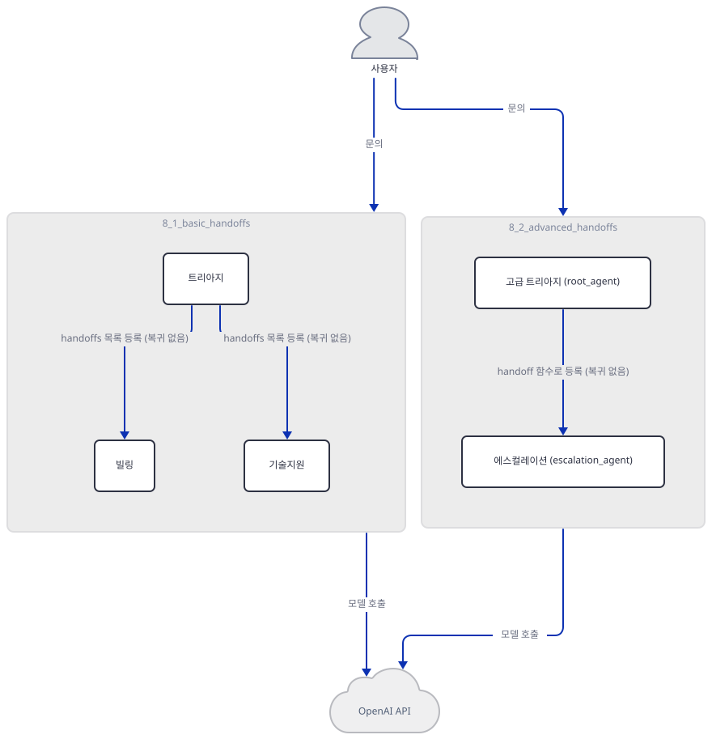
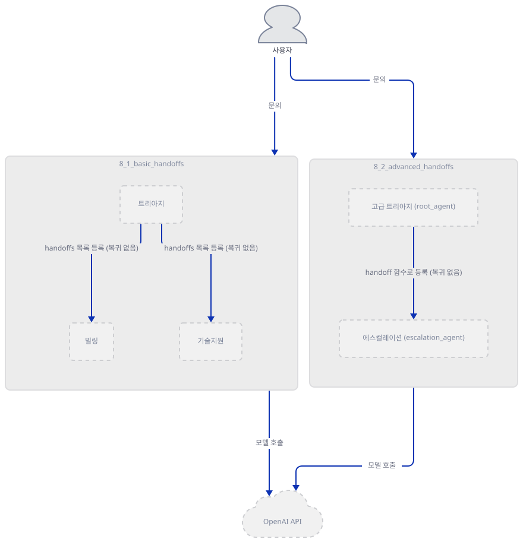
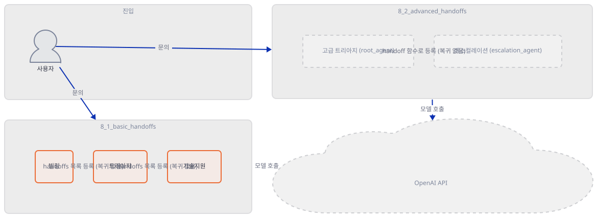
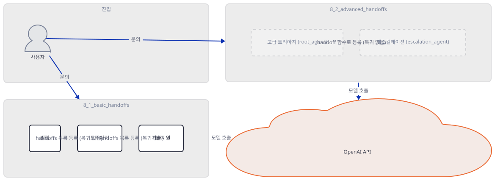
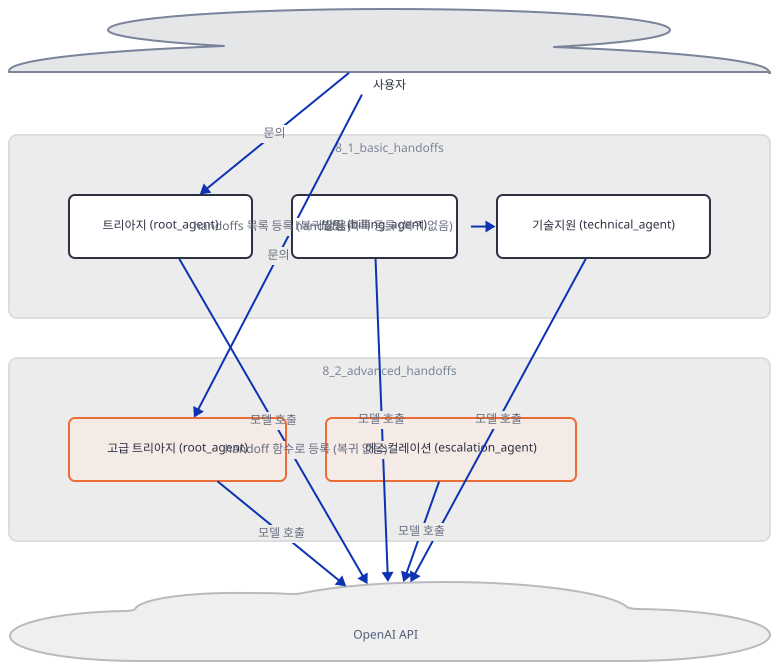
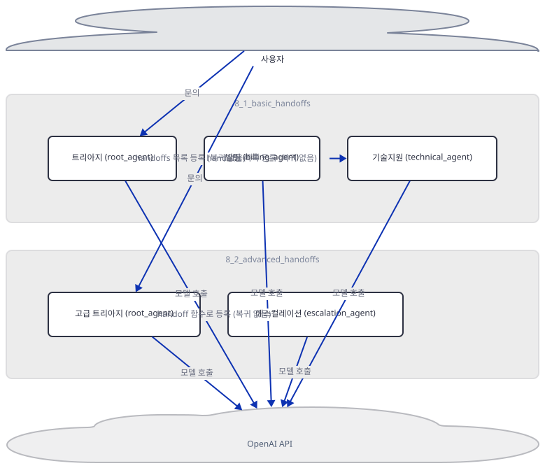
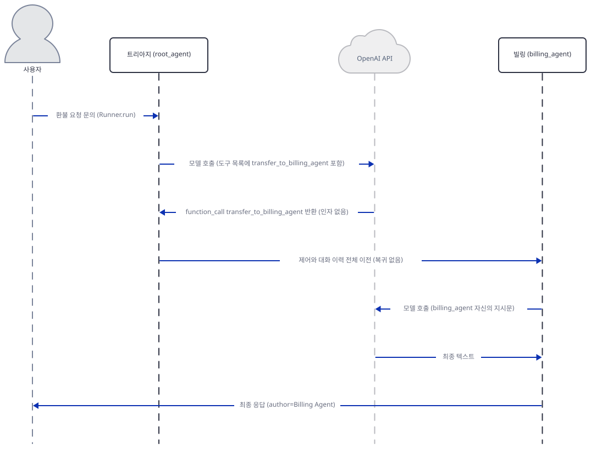

# Day 031 · OpenAI Agents SDK Crash Course · 8_handoffs_delegation

> 볼륨 2 🧑‍🏫 Crash Courses · 난이도 ★★☆ · 예상 소요 90분(하위 레슨 두 개에 더해 SDK 내부 소스와 오프라인 재현 실행까지 함께 확인하느라 다른 크래시 코스 날보다 깁니다) · API 비용 $0 (API 키를 발급하지 않았습니다 — 키 없이 막히는 지점과, SDK의 오프라인 테스트 더블로 재현한 실제 핸드오프 실행 양쪽을 이 문서에 담았습니다) · 원본 앱: `ai_agent_framework_crash_course/openai_sdk_crash_course/8_handoffs_delegation`

## 오늘 만들 것

Day 021은 Google ADK에서 `sub_agents=`(제어를 넘기고 돌아오지 않음)와 `tools=[AgentTool(...)]`(호출하면 반드시 돌아옴)이 실행 메커니즘 자체가 다르다는 것을 소스와 실제 실행으로 확인했고, Day 026은 이 SDK의 `Agent.as_tool()` 독스트링이 정확히 같은 경계선을 "핸드오프에서는 새 에이전트가 대화 기록을 받고 대화를 넘겨받지만, 도구로 부르면 생성된 입력만 받고 원래 에이전트가 대화를 이어간다"는 말로 스스로 그리고 있다는 것을 찾았습니다(원문은 Day 026 참고, 다시 인용하지 않습니다). 오늘의 `8_handoffs_delegation`은 그 경계선의 반대쪽 — `tools=`가 아니라 `handoffs=` 그 자체 — 를 다룹니다. 하위 레슨은 둘입니다. `8_1_basic_handoffs`는 트리아지 에이전트가 `handoffs=[billing_agent, technical_agent]`처럼 평범한 `Agent` 목록을 그대로 넘기는 가장 단순한 형태이고, `8_2_advanced_handoffs`는 `handoff()` 함수로 감싸 도구 이름·설명을 바꾸고, 구조화된 입력(`EscalationData`)과 콜백(`on_handoff`)을 붙이는 형태입니다.

이 문서가 답하려는 질문은 하나입니다 — 핸드오프가 일어나면 정확히 무엇이 새 에이전트에게 넘어가고, 무엇이 넘어가지 않으며, 대화의 주도권은 원래 에이전트로 돌아오는가. API 키 없이는 실제 모델 응답을 볼 수 없으므로, Day 029가 가드레일 재현에 쓴 것과 같은 SDK 공식 오프라인 테스트 더블 `agents.testing.ScriptedModel`을 그대로 가져와(재발명하지 않습니다) 트리아지 에이전트가 실제로 `transfer_to_billing_agent`를 호출하는 상황을 만들고, 그 순간 `billing_agent`가 무엇을 보는지, 그리고 `root_agent`가 다시 불리는지를 Step 4에서 직접 실행해 확인합니다. 이 폴더에는 하위 폴더 둘 외에 최상위에도 `basic_handoffs.py`·`advanced_handoffs.py`가 있는데, Step 2에서 보듯 이번엔 이 볼륨이 반복해 온 "최상위는 하위 레슨의 상위집합이 아니라 별도 재구현"이라는 패턴이 한 걸음 더 나아가 — 재구현조차 아니라 바이트 단위로 동일한 사본입니다. 이 문서는 하위 폴더 두 `agent.py`를 가르침의 기준으로 삼습니다. 완성 구조는 다음과 같습니다.



## 사전 준비

| 서비스/도구 | 용도 | 발급·설치 |
|---|---|---|
| OpenAI API 키 (`OPENAI_API_KEY`) | 다섯 에이전트(트리아지 둘 + 빌링·기술지원·에스컬레이션) 모두의 모델 호출에 필요. 이 문서는 키를 발급하지 않고, 키 없이 막히는 지점(Step 6)과 `agents.testing.ScriptedModel`로 재현한 실제 핸드오프 실행(Step 4·6)을 대신 확인합니다 | https://platform.openai.com/api-keys 에서 발급 (이 실습에서는 생략) |
| uv | 가상환경 생성과 패키지 설치 | [공통 사전 준비](../README.md#공통-사전-준비-한-번만) 참고 |
| 인터넷 연결 | PyPI에서 `openai-agents` 등 설치 | 별도 설치 없음 |

## 아키텍처 한눈에 보기

| 컴포넌트 | 역할 | 코드 위치 |
|---|---|---|
| 실행자 (터미널) | `Runner.run`으로 다섯 진입점 중 하나를 실행 | 코드 없음 (외부 실행자) |
| 트리아지 에이전트 (`8_1`, `root_agent`) | 문의를 분류해 `billing_agent`·`technical_agent`로 핸드오프하거나 직접 응답 | `ai_agent_framework_crash_course/openai_sdk_crash_course/8_handoffs_delegation/8_1_basic_handoffs/agent.py:33-51` |
| 빌링 에이전트 (`billing_agent`) | 결제·환불 문의를 넘겨받아 응답. 자신의 `handoffs`가 비어 있어 복귀 경로가 없음 | `ai_agent_framework_crash_course/openai_sdk_crash_course/8_handoffs_delegation/8_1_basic_handoffs/agent.py:6-17` |
| 기술지원 에이전트 (`technical_agent`) | 기술 문의를 넘겨받아 응답. 역시 `handoffs`가 비어 있음 | `ai_agent_framework_crash_course/openai_sdk_crash_course/8_handoffs_delegation/8_1_basic_handoffs/agent.py:19-30` |
| 고급 트리아지 에이전트 (`8_2`, `root_agent`) | 대부분 직접 처리하고, 격앙된 요청·고액 환불만 구조화 데이터와 함께 이관 | `ai_agent_framework_crash_course/openai_sdk_crash_course/8_handoffs_delegation/8_2_advanced_handoffs/agent.py:40-53` |
| 에스컬레이션 핸드오프 (`escalation_handoff`) | `handoff()`로 만든 래퍼 — 도구 이름·설명 오버라이드, 구조화 입력 스키마, 콜백을 붙임 | `ai_agent_framework_crash_course/openai_sdk_crash_course/8_handoffs_delegation/8_2_advanced_handoffs/agent.py:31-37` |
| 에스컬레이션 에이전트 (`escalation_agent`) | 이관받은 요청을 처리. 역시 `handoffs`가 비어 있어 복귀 불가 | `ai_agent_framework_crash_course/openai_sdk_crash_course/8_handoffs_delegation/8_2_advanced_handoffs/agent.py:14-20` |
| OpenAI API | 다섯 에이전트 모두의 실제 추론(이 문서는 대신 `ScriptedModel`로 재현) | 코드 없음 (외부 서비스) |

## 단계별 진행

### Step 1. 환경 만들기 — 의존성 네 줄, 실제로 쓰이는 것은 하나뿐

**목적.** `requirements.txt`를 설치하고, 이 폴더 13개 파일의 실제 줄 수를 개행까지 확인하며, 네 패키지 중 이 레슨이 실제로 무엇을 쓰는지 소스에서 직접 확인합니다.

**할 일.**

`ai_agent_framework_crash_course/openai_sdk_crash_course/8_handoffs_delegation/requirements.txt:1-4`

```text
openai-agents>=0.2.0
streamlit>=1.28.0
python-dotenv>=1.0.0
pydantic>=2.0.0
```

```bash
cd ai_agent_framework_crash_course/openai_sdk_crash_course/8_handoffs_delegation
uv venv --python 3.12
uv pip install -r requirements.txt
```

```powershell
cd ai_agent_framework_crash_course/openai_sdk_crash_course/8_handoffs_delegation
uv venv --python 3.12
uv pip install -r requirements.txt
```

(pip 대안: `python -m venv .venv && source .venv/bin/activate && pip install -r requirements.txt`.) 이 저장소는 루트에 `pyproject.toml`이 있어 `uv run`이 기본으로 루트 `.venv`를 쓰므로, 이후 모든 `uv run`에 `--no-project`를 붙입니다 — 이 볼륨의 루트 `.venv`에는 이름이 같은 다른 패키지(TensorFlow Agents)가 있어 이 플래그를 빠뜨리면 엉뚱한 자리에서 실패한다는 것은 Day 025·026이 이미 정리했습니다.

네 패키지 중 실제로 쓰이는 것이 몇 개인지 먼저 `grep`으로 확인합니다.

```bash
grep -rln "streamlit\|dotenv" *.py */*.py; echo "grep exit=$?"
```

```powershell
Select-String -Path *.py,*/*.py -Pattern "streamlit|dotenv"
```

```
grep exit=1
```

여섯 `.py` 파일(최상위 둘 + 하위 폴더 각 `agent.py`·`__init__.py`) 어디에도 `streamlit`·`dotenv`가 없습니다(직접 확인) — `app.py`가 아예 없다는 것은 Step 2에서 다시 확인하지만, `python-dotenv`도 `load_dotenv()`를 부르는 파일이 하나도 없어 설치해도 쓰이지 않습니다. `pydantic`도 직접 `import`하는 파일은 `8_2_advanced_handoffs/agent.py`(`EscalationData(BaseModel)`) 하나뿐인데, 아래 확인에서 보듯 이미 `openai-agents`의 필수 의존성입니다. 즉 이 `requirements.txt` 네 줄 중 실행에 실제로 필요한 것은 `openai-agents` 하나뿐입니다.

이 폴더 13개 파일의 줄 수도 개행까지 확인합니다.

```bash
wc -l README.md env.example requirements.txt basic_handoffs.py advanced_handoffs.py 8_1_basic_handoffs/README.md 8_1_basic_handoffs/agent.py 8_1_basic_handoffs/__init__.py 8_1_basic_handoffs/env.example 8_2_advanced_handoffs/README.md 8_2_advanced_handoffs/agent.py 8_2_advanced_handoffs/__init__.py 8_2_advanced_handoffs/env.example
```

```powershell
Get-ChildItem README.md, env.example, requirements.txt, basic_handoffs.py, advanced_handoffs.py, 8_1_basic_handoffs/README.md, 8_1_basic_handoffs/agent.py, 8_1_basic_handoffs/__init__.py, 8_1_basic_handoffs/env.example, 8_2_advanced_handoffs/README.md, 8_2_advanced_handoffs/agent.py, 8_2_advanced_handoffs/__init__.py, 8_2_advanced_handoffs/env.example | Measure-Object -Line
```

```
177 README.md
  1 env.example
  4 requirements.txt
 77 basic_handoffs.py
 73 advanced_handoffs.py
 75 8_1_basic_handoffs/README.md
 77 8_1_basic_handoffs/agent.py
  1 8_1_basic_handoffs/__init__.py
  1 8_1_basic_handoffs/env.example
 92 8_2_advanced_handoffs/README.md
 73 8_2_advanced_handoffs/agent.py
  1 8_2_advanced_handoffs/__init__.py
  1 8_2_advanced_handoffs/env.example
```

Day 019 이후 이 시리즈가 반복해 확인했듯 `wc -l`은 마지막 줄에 개행이 없으면 하나 적게 셉니다. 이번엔 이 레슨의 최상위 `README.md` 하나만 그렇습니다(마지막 바이트가 `0a`가 아니라 `s`) — 실제로는 178줄이고, 나머지 12개 파일은 전부 마지막 바이트가 개행이라 `wc -l` 그대로입니다(직접 확인, `tail -c 1 파일 | xxd`).



**확인.**

```bash
uv run --no-project python -c "
import importlib.metadata as md
print('openai-agents', md.version('openai-agents'))
print('openai', md.version('openai'))
print('pydantic', md.version('pydantic'))
print('streamlit', md.version('streamlit'))
print('python-dotenv', md.version('python-dotenv'))
print('pydantic requirement declared by openai-agents:', [r for r in md.requires('openai-agents') if r.startswith('pydantic')])
"
```

```powershell
uv run --no-project python -c "<위와 같은 코드>"
```

```
openai-agents 0.22.3
openai 3.17.0
pydantic 2.13.5
streamlit 1.64.0
python-dotenv 1.2.3
pydantic requirement declared by openai-agents: ['pydantic<3,>=2.12.2']
```

(직접 확인 — 마지막 줄이 핵심입니다. `openai-agents`는 `pydantic<3,>=2.12.2`를 조건 없이(다른 대부분의 선언과 달리 `; extra == '...'` 조건이 붙지 않은) 필수 의존성으로 선언하고 있어, `requirements.txt`의 `pydantic>=2.0.0`은 실행에 아무 차이를 만들지 않습니다 — Day 029가 형제 레슨에서 확인한 것과 같은 종류입니다.)

### Step 2. 폴더의 진짜 모습 — 최상위 스크립트는 바이트 단위 사본, `app.py`는 없다

**목적.** 최상위 README의 "Project Structure" 트리가 실제 폴더와 어디서 어긋나는지, 그리고 `basic_handoffs.py`·`advanced_handoffs.py`가 하위 폴더의 `agent.py`와 정확히 어떤 관계인지 확인합니다.

**할 일.** 실제 폴더 구성부터 봅니다.

```bash
ls ai_agent_framework_crash_course/openai_sdk_crash_course/8_handoffs_delegation
find ai_agent_framework_crash_course/openai_sdk_crash_course/8_handoffs_delegation -iname "app.py"; echo "app.py exit=$?"
```

```powershell
Get-ChildItem ai_agent_framework_crash_course/openai_sdk_crash_course/8_handoffs_delegation
Get-ChildItem -Recurse -Path ai_agent_framework_crash_course/openai_sdk_crash_course/8_handoffs_delegation -Filter "app.py"
```

```
8_1_basic_handoffs  8_2_advanced_handoffs  README.md  advanced_handoffs.py  basic_handoffs.py  env.example  requirements.txt
app.py exit=0
```

(`find`가 아무 줄도 출력하지 않고 끝납니다 — `app.py`는 이 폴더 어디에도 없습니다.) 최상위 README의 트리는 이렇게 적고 있습니다.

`ai_agent_framework_crash_course/openai_sdk_crash_course/8_handoffs_delegation/README.md:71-77`

```text
8_handoffs_delegation/
├── README.md                # This file - concept explanation
├── requirements.txt         # Dependencies
├── basic_handoffs.py        # Simple agent handoffs (40 lines)
├── advanced_handoffs.py     # Advanced handoff patterns (50 lines)
├── app.py                  # Streamlit handoff demo (optional)
└── env.example             # Environment variables template
```

이 트리는 세 군데가 실제와 다릅니다(직접 확인): 하위 폴더 `8_1_basic_handoffs`·`8_2_advanced_handoffs`가 트리에 아예 없고, 존재하지 않는 `app.py`가 "optional"로 적혀 있으며, `basic_handoffs.py`·`advanced_handoffs.py`의 줄 수(40·50)는 Step 1에서 개행까지 확인한 실제 줄 수(77·73)와 둘 다 다릅니다 — Day 019·021·026이 찾은 것과 같은 종류의 오류입니다.

더 눈에 띄는 것은 최상위 두 파일과 하위 폴더 `agent.py`의 관계입니다. 이 볼륨은 Day 025·027·030에서 "최상위 스크립트는 하위 레슨의 상위집합이 아니라, 하위 폴더를 임포트하지 않는 별도 재구현"이라는 패턴을 반복해 확인했습니다. 오늘은 그 패턴이 한 걸음 더 나아갑니다 — 재구현조차 아니라 바이트 단위로 동일한 사본입니다.

```bash
diff basic_handoffs.py 8_1_basic_handoffs/agent.py; echo "diff exit=$?"
diff advanced_handoffs.py 8_2_advanced_handoffs/agent.py; echo "diff exit=$?"
```

```powershell
Compare-Object (Get-Content basic_handoffs.py) (Get-Content 8_1_basic_handoffs/agent.py)
Compare-Object (Get-Content advanced_handoffs.py) (Get-Content 8_2_advanced_handoffs/agent.py)
```

```
diff exit=0
diff exit=0
```

(직접 확인 — `diff`가 아무 줄도 출력하지 않고 종료 코드 0으로 끝나, 두 쌍이 완전히 동일한 파일임을 보여줍니다. 유일한 차이는 하위 폴더에만 `__init__.py`가 있어 `8_1_basic_handoffs.agent`처럼 패키지로 임포트할 수 있다는 것뿐입니다.) 이 문서는 이후 하위 폴더의 두 `agent.py`를 가르침의 기준으로 인용합니다 — 최상위 두 파일은 이름만 다른 같은 내용이므로 별도로 인용하지 않습니다.


**확인.**

```bash
diff ai_agent_framework_crash_course/openai_sdk_crash_course/8_handoffs_delegation/basic_handoffs.py ai_agent_framework_crash_course/openai_sdk_crash_course/8_handoffs_delegation/8_1_basic_handoffs/agent.py && echo "IDENTICAL"
```

```powershell
if (-not (Compare-Object (Get-Content ai_agent_framework_crash_course/openai_sdk_crash_course/8_handoffs_delegation/basic_handoffs.py) (Get-Content ai_agent_framework_crash_course/openai_sdk_crash_course/8_handoffs_delegation/8_1_basic_handoffs/agent.py))) { "IDENTICAL" }
```

```
IDENTICAL
```

### Step 3. 트리아지의 `handoffs=` — 평범한 에이전트 목록이 되는 기본 변환

**목적.** `8_1_basic_handoffs/agent.py`가 세 에이전트를 어떻게 정의하고 묶는지 확인하고, `RECOMMENDED_PROMPT_PREFIX`가 무엇을 하는지, `handoffs=[...]`에 평범한 `Agent`를 그대로 넣으면 무엇이 되는지 확인합니다.

**할 일.** `billing_agent`·`technical_agent`는 이름·지시문뿐인 평범한 `Agent`입니다.

`ai_agent_framework_crash_course/openai_sdk_crash_course/8_handoffs_delegation/8_1_basic_handoffs/agent.py:6-17`

```python
billing_agent = Agent(
    name="Billing Agent",
    instructions=f"""{RECOMMENDED_PROMPT_PREFIX}
    You are a billing specialist. Help customers with:
    - Payment issues and billing questions
    - Subscription management and upgrades
    - Invoice and receipt requests
    - Refund processing
    
    Be helpful and provide specific billing assistance.
    """
)
```

세 에이전트의 지시문 모두 `f"""{RECOMMENDED_PROMPT_PREFIX} ..."""`로 시작합니다 — `agents.extensions.handoff_prompt`가 제공하는 이 상수는 모델에게 "너는 여러 에이전트로 이루어진 시스템의 일부이고, 핸드오프는 `transfer_to_<agent_name>`이라는 함수를 불러 이루어지며, 전환은 백그라운드에서 매끄럽게 처리되니 사용자에게 전환 사실을 언급하지 말라"고 설명하는 고정된 영어 문단입니다(직접 확인, 아래). 실행을 바꾸는 코드가 아니라 프롬프트 텍스트일 뿐이라, 이 문단을 안 넣어도 핸드오프 자체는 동작합니다 — 다만 모델이 전환 사실을 사용자에게 무심코 언급할 가능성이 커집니다.

트리아지는 이 둘을 `handoffs=`에 그대로 나열합니다.

`ai_agent_framework_crash_course/openai_sdk_crash_course/8_handoffs_delegation/8_1_basic_handoffs/agent.py:33-51`

```python
root_agent = Agent(
    name="Customer Service Triage Agent",
    instructions=f"""{RECOMMENDED_PROMPT_PREFIX}
    You are a customer service triage agent. Your job is to:
    
    1. Understand the customer's issue
    2. Determine which specialist can best help them
    3. Transfer them to the appropriate agent using handoff tools
    
    Available specialists:
    - Billing Agent: For payment, subscription, billing, and refund issues
    - Technical Support Agent: For app problems, technical issues, and troubleshooting
    
    If the issue is clearly billing-related, transfer to Billing Agent.
    If the issue is clearly technical, transfer to Technical Support Agent.
    If you can handle it yourself (general questions), do so.
    """,
    handoffs=[billing_agent, technical_agent]  # Creates handoff tools automatically
)
```

`Agent.handoffs`는 `list[Agent | Handoff]` 타입입니다(소스로 확인, openai-agents 0.22.3의 `agents/agent.py`) — 즉 `Handoff` 객체로 감쌀 수도, 지금처럼 평범한 `Agent`를 바로 넣을 수도 있습니다. 아래 확인에서 보듯 `root_agent.handoffs`는 실제로 `Agent` 인스턴스 두 개를 그대로 담고 있고, 이 목록은 실행 시점에 `handoff(agent)`와 같은 기본값으로 취급됩니다 — 기본 도구 이름은 `transfer_to_<agent.name을 소문자·밑줄로 변환>`입니다(소스로 확인, `agents/handoffs/__init__.py`의 `Handoff.default_tool_name`).



**확인.**

```bash
cd 8_1_basic_handoffs
uv run --no-project python -c "
from agent import root_agent, billing_agent, technical_agent
from agents import handoff
print('root_agent.handoffs item types:', [type(a).__name__ for a in root_agent.handoffs])
print('default tool name for billing_agent  :', handoff(billing_agent).tool_name)
print('default tool name for technical_agent:', handoff(technical_agent).tool_name)
"
```

```powershell
cd 8_1_basic_handoffs
uv run --no-project python -c "<위와 같은 코드>"
```

```
root_agent.handoffs item types: ['Agent', 'Agent']
default tool name for billing_agent  : transfer_to_billing_agent
default tool name for technical_agent: transfer_to_technical_support_agent
```

(직접 확인 — `root_agent.handoffs`에는 `Handoff`가 아니라 평범한 `Agent` 객체 두 개가 그대로 들어 있습니다. 도구 이름은 에이전트 `name`의 공백을 밑줄로 바꾸고 소문자로 내린 것입니다.)

### Step 4. 무엇이 진짜로 넘어가는가 — 스크립트 모델로 핸드오프를 실행한다

**목적.** API 키 없이, `agents.testing.ScriptedModel`(Day 029가 가드레일 재현에 쓴 것과 같은 SDK 공식 오프라인 테스트 더블)로 트리아지가 실제로 `transfer_to_billing_agent`를 호출하게 만들고, 그 순간 `billing_agent`가 무엇을 받는지, 대화의 주도권이 어디로 가는지, `root_agent`가 다시 불리는지를 직접 확인합니다.

**할 일.** `Handoff` 데이터클래스의 `input_filter` 필드 독스트링은(소스로 확인, `agents/handoffs/__init__.py`) 이렇게 밝히고 있습니다 — "기본적으로 새 에이전트는 전체 대화 기록을 봅니다(By default, the new agent sees the entire conversation history)." 실행 코드(소스로 확인, `agents/run_internal/run_loop.py`)를 보면 핸드오프가 선택된 턴에서 `current_agent = turn_result.next_step.new_agent`로 실행 루프 자신의 "현재 에이전트" 포인터를 통째로 바꿔치기합니다 — ADK의 `transfer_to_agent`가 `tool_context.actions.transfer_to_agent = agent_name`만 적어 두는 것(Day 021)과 같은 자리의, 이 SDK식 구현입니다. 핸드오프 도구 호출 자체의 "반환값"도 실제 내용이 아니라 `{"assistant": "<에이전트 이름>"}`라는 자리표시자일 뿐입니다(소스로 확인, `Handoff.get_transfer_message`).

세 가지를 한 스크립트로 직접 확인합니다: (1) 대화 기록 전체가 `billing_agent`에게 실제로 넘어가는가, (2) `billing_agent`가 쓰는 시스템 지시문이 자기 것인가 `root_agent`의 것인가, (3) `root_agent`가 이후 다시 불리는가.



**확인.**

```bash
cd ai_agent_framework_crash_course/openai_sdk_crash_course/8_handoffs_delegation
uv run --no-project python -c "
import asyncio, importlib
m = importlib.import_module('8_1_basic_handoffs.agent')
from agents import Runner
from agents.testing import ScriptedModel, function_call, assistant_message

print('billing_agent.handoffs:', m.billing_agent.handoffs)
print('technical_agent.handoffs:', m.technical_agent.handoffs)

scripted_billing = m.billing_agent.clone(
    model=ScriptedModel([[assistant_message('Refund of \$49 has been processed for your duplicate charge.')]])
)
scripted_root = m.root_agent.clone(
    model=ScriptedModel([[function_call('transfer_to_billing_agent', '{}', call_id='call_1')]]),
    handoffs=[scripted_billing, m.technical_agent],
)

async def main():
    result = await Runner.run(scripted_root, 'I was charged twice, please refund me.')
    print()
    print('final_output:', result.final_output)
    print('last_agent:', result.last_agent.name)
    print('root model calls (never revisited):', len(scripted_root.model.calls))
    print('billing model calls:', len(scripted_billing.model.calls))
    call = scripted_billing.model.calls[0]
    print('billing sees root instructions?', call.system_instructions == scripted_root.instructions)
    print('billing sees its own instructions?', call.system_instructions == scripted_billing.instructions)
    print('billing input[0] (original user msg):', call.input[0])
    print('billing input[-1] (handoff tool result):', call.input[-1])

asyncio.run(main())
"
```

```powershell
cd ai_agent_framework_crash_course/openai_sdk_crash_course/8_handoffs_delegation
uv run --no-project python -c "<위와 같은 코드>"
```

```
billing_agent.handoffs: []
technical_agent.handoffs: []

final_output: Refund of $49 has been processed for your duplicate charge.
last_agent: Billing Agent
root model calls (never revisited): 1
billing model calls: 1
billing sees root instructions? False
billing sees its own instructions? True
billing input[0] (original user msg): {'content': 'I was charged twice, please refund me.', 'role': 'user'}
billing input[-1] (handoff tool result): {'call_id': 'call_1', 'output': '{"assistant": "Billing Agent"}', 'type': 'function_call_output'}
```

(직접 확인 — 실제 OpenAI 호출 없이 재현했습니다. 결과를 한 줄씩 풀면: 최종 응답의 작성자는 `root_agent`가 아니라 `Billing Agent`이고, `root_agent`의 모델은 딱 한 번만 불려 다시 불리지 않았습니다(호출 왕복이 아니라 이관). `billing_agent`가 쓰는 시스템 지시문은 정확히 자기 자신의 것이지 `root_agent`의 것이 아니며, 그런데도 `billing_agent`가 받는 입력의 맨 앞엔 사용자의 원본 메시지가 그대로 들어 있습니다 — 지시문은 새 에이전트의 것으로 완전히 바뀌지만, 대화 기록(무엇을 물었는지)은 그대로 넘어갑니다. 마지막 줄의 `{"assistant": "Billing Agent"}`는 핸드오프 도구 호출의 "반환값"이 실제 데이터가 아니라 이 자리표시자뿐이라는 것을 보여줍니다. 그리고 `billing_agent.handoffs`·`technical_agent.handoffs`가 둘 다 빈 리스트라는 것은 이 예제에서 복귀가 "보장되지 않는" 정도가 아니라 애초에 **되돌아갈 핸드오프 자체가 없어 구조적으로 불가능**하다는 뜻입니다.)

### Step 5. `handoff()`로 감싸기 — 이름 오버라이드, 구조화 입력, 그리고 쓰이지 않는 필터

**목적.** `8_2_advanced_handoffs/agent.py`가 `handoff()` 함수로 무엇을 바꾸는지, 그리고 이 파일이 임포트만 하고 실제로는 쓰지 않는 것이 무엇인지 확인합니다.

**할 일.** 구조화 입력용 스키마와 콜백부터 봅니다.

`ai_agent_framework_crash_course/openai_sdk_crash_course/8_handoffs_delegation/8_2_advanced_handoffs/agent.py:8-11`

```python
class EscalationData(BaseModel):
    reason: str
    priority: str
    customer_id: str
```

`ai_agent_framework_crash_course/openai_sdk_crash_course/8_handoffs_delegation/8_2_advanced_handoffs/agent.py:23-28`

```python
async def on_escalation_handoff(ctx: RunContextWrapper[None], input_data: EscalationData):
    """Callback executed when escalation handoff is triggered"""
    print(f"🚨 ESCALATION ALERT:")
    print(f"   Reason: {input_data.reason}")
    print(f"   Priority: {input_data.priority}")
    print(f"   Customer ID: {input_data.customer_id}")
```

이 둘을 묶는 자리가 `handoff()` 호출입니다.

`ai_agent_framework_crash_course/openai_sdk_crash_course/8_handoffs_delegation/8_2_advanced_handoffs/agent.py:31-37`

```python
escalation_handoff = handoff(
    agent=escalation_agent,
    tool_name_override="escalate_to_manager",
    tool_description_override="Escalate complex issues that require manager intervention",
    on_handoff=on_escalation_handoff,
    input_type=EscalationData  # Structured input required
)
```

`tool_name_override`·`tool_description_override`는 Step 3의 기본값(`transfer_to_escalation_agent`류)을 대신합니다. `input_type=EscalationData`를 주면 모델이 만든 JSON 인자가 이 스키마로 검증된 뒤 `on_handoff` 콜백에 파싱된 객체로 전달됩니다 — 그런데 `handoff()`의 독스트링은(소스로 확인, `agents/handoffs/__init__.py`) `on_handoff`가 "목적지를 동적으로 정하는 용도가 아니라 부수효과·기록용"이라고 못박습니다: 콜백이 무엇을 하든 `handoff()`는 항상 자신이 감싼 `escalation_agent`로만 이관합니다. `input_type`이 바꾸는 것도 콜백이 받는 값뿐이고, 다음 에이전트의 주 입력(대화 기록)은 Step 4에서 확인한 것과 똑같이 그대로 넘어갑니다(소스로 확인, 같은 독스트링 — "이 설정은 핸드오프 도구 페이로드에만 영향을 주고, 다음 에이전트의 주 입력은 바꾸지 않는다").

이 파일의 import 줄에는 한 가지가 더 있습니다.

`ai_agent_framework_crash_course/openai_sdk_crash_course/8_handoffs_delegation/8_2_advanced_handoffs/agent.py:1-5`

```python
from agents import Agent, Runner, handoff, RunContextWrapper
from agents.extensions import handoff_filters
from agents.extensions.handoff_prompt import RECOMMENDED_PROMPT_PREFIX
from pydantic import BaseModel
import asyncio
```

`handoff_filters`(`agents.extensions.handoff_filters`, `remove_all_tools` 등 도구 호출·핸드오프 이력만 골라 걷어내는 필터 함수 모음, 소스로 확인)는 이 파일에서 임포트만 되고 `escalation_handoff = handoff(...)` 호출 어디에도 `input_filter=`가 없어 실제로는 한 번도 쓰이지 않습니다 — 아래 확인의 `input_filter: None`이 이를 직접 보여줍니다.



**확인.**

```bash
cd 8_2_advanced_handoffs
grep -n "handoff_filters" agent.py
uv run --no-project python -c "
from agent import escalation_handoff, escalation_agent, root_agent
import json
print('tool_name:', escalation_handoff.tool_name)
print('tool_description:', escalation_handoff.tool_description)
print('input_json_schema:', json.dumps(escalation_handoff.input_json_schema))
print('input_filter:', escalation_handoff.input_filter)
print('type(escalation_handoff):', type(escalation_handoff).__name__)
print('escalation_agent.handoffs:', escalation_agent.handoffs)
"
```

```powershell
cd 8_2_advanced_handoffs
Select-String -Path agent.py -Pattern "handoff_filters"
uv run --no-project python -c "<위와 같은 코드>"
```

```
2:from agents.extensions import handoff_filters
tool_name: escalate_to_manager
tool_description: Escalate complex issues that require manager intervention
input_json_schema: {"properties": {"reason": {"title": "Reason", "type": "string"}, "priority": {"title": "Priority", "type": "string"}, "customer_id": {"title": "Customer Id", "type": "string"}}, "required": ["reason", "priority", "customer_id"], "title": "EscalationData", "type": "object", "additionalProperties": false}
input_filter: None
escalation_agent.handoffs: []
```

(직접 확인 — `grep`은 2행의 import 한 줄만 찾습니다. `input_filter: None`이 이 임포트가 실제로는 아무 효과가 없다는 것을 확정합니다. `type(escalation_handoff)`는 `Handoff`입니다 — Step 3에서 본 `8_1`의 raw `Agent` 항목과 달리, `8_2`의 `root_agent.handoffs`에는 `handoff()`가 만든 `Handoff` 객체가 들어갑니다. `escalation_agent.handoffs`도 비어 있어, Step 4와 같은 이유로 여기서도 복귀는 구조적으로 불가능합니다.)

### Step 6. 콜백은 부수효과일 뿐 — 실행하고, 키 없이 네 진입점을 직접 돌려본다

**목적.** `on_handoff` 콜백이 실제로 실행되는지, 구조화 입력과 전체 대화 기록이 함께 넘어가는지 스크립트 모델로 확인하고, 이 폴더의 실제 진입점들을 키 없이 그대로 실행하면 어디서 막히는지 확인합니다.

**할 일.** Step 5의 `escalation_handoff`를 그대로 스크립트 모델에 태워 실행합니다. `on_escalation_handoff`의 첫 줄(`ai_agent_framework_crash_course/openai_sdk_crash_course/8_handoffs_delegation/8_2_advanced_handoffs/agent.py:25`)이 이모지를 그대로 찍기 때문에, 한국어 Windows 콘솔(cp949)에서는 `UnicodeEncodeError`가 먼저 납니다 — Day 019가 이미 정리한 것과 같은 종류의 문제입니다.



**확인.** 먼저 `PYTHONIOENCODING` 없이 그대로 실행해 실패를 봅니다.

```bash
cd ai_agent_framework_crash_course/openai_sdk_crash_course/8_handoffs_delegation
uv run --no-project python -c "
import asyncio, json, importlib
m = importlib.import_module('8_2_advanced_handoffs.agent')
from agents import Runner, handoff
from agents.testing import ScriptedModel, function_call, assistant_message

scripted_escalation = m.escalation_agent.clone(model=ScriptedModel([[assistant_message('A senior manager will call you within the hour.')]]))
scripted_handoff = handoff(agent=scripted_escalation, tool_name_override='escalate_to_manager',
    tool_description_override='Escalate complex issues.', on_handoff=m.on_escalation_handoff, input_type=m.EscalationData)
args = json.dumps({'reason': 'Service outage, refund plus compensation requested', 'priority': 'high', 'customer_id': 'CUST-789123'})
scripted_root = m.root_agent.clone(model=ScriptedModel([[function_call('escalate_to_manager', args, call_id='call_9')]]), handoffs=[scripted_handoff])
asyncio.run(Runner.run(scripted_root, 'I am furious, refund me. Customer CUST-789123.'))
"
```

```powershell
cd ai_agent_framework_crash_course/openai_sdk_crash_course/8_handoffs_delegation
uv run --no-project python -c "<위와 같은 코드>"
```

```
Traceback (most recent call last):
  ...
  File "...\8_2_advanced_handoffs\agent.py", line 25, in on_escalation_handoff
    print(f"🚨 ESCALATION ALERT:")
UnicodeEncodeError: 'cp949' codec can't encode character '\U0001f6a8' in position 0: illegal multibyte sequence
```

`PYTHONIOENCODING=utf-8`을 붙이면 콜백이 실제로 실행되는 것과 그 이후가 함께 드러납니다.

```bash
PYTHONIOENCODING=utf-8 uv run --no-project python -c "
import asyncio, json, importlib
m = importlib.import_module('8_2_advanced_handoffs.agent')
from agents import Runner, handoff
from agents.testing import ScriptedModel, function_call, assistant_message

scripted_escalation = m.escalation_agent.clone(model=ScriptedModel([[assistant_message('A senior manager will call you within the hour.')]]))
scripted_handoff = handoff(agent=scripted_escalation, tool_name_override='escalate_to_manager',
    tool_description_override='Escalate complex issues.', on_handoff=m.on_escalation_handoff, input_type=m.EscalationData)
args = json.dumps({'reason': 'Service outage, refund plus compensation requested', 'priority': 'high', 'customer_id': 'CUST-789123'})
scripted_root = m.root_agent.clone(model=ScriptedModel([[function_call('escalate_to_manager', args, call_id='call_9')]]), handoffs=[scripted_handoff])

async def main():
    result = await Runner.run(scripted_root, 'I am furious, refund me. Customer CUST-789123.')
    print('final_output:', result.final_output)
    print('last_agent:', result.last_agent.name)
    call = scripted_escalation.model.calls[0]
    print('escalation sees original user text:', 'furious' in call.input[0]['content'])
    print('escalation sees structured args too:', 'CUST-789123' in call.input[1]['arguments'])

asyncio.run(main())
"
```

```powershell
$env:PYTHONIOENCODING="utf-8"; uv run --no-project python -c "<위와 같은 코드>"
```

```
🚨 ESCALATION ALERT:
   Reason: Service outage, refund plus compensation requested
   Priority: high
   Customer ID: CUST-789123
final_output: A senior manager will call you within the hour.
last_agent: Escalation Agent
escalation sees original user text: True
escalation sees structured args too: True
```

(직접 확인 — 콜백이 실제로 실행되어 파싱된 `EscalationData` 필드를 찍었고, `escalation_agent`는 원본 사용자 메시지와 핸드오프 호출에 실렸던 구조화 인자 둘 다를 자기 입력에서 볼 수 있습니다 — `input_type`은 콜백에 데이터를 얹는 것이지, 다음 에이전트가 보는 내용을 그 데이터로 갈음하는 게 아닙니다.)

마지막으로, 실제로 있는 진입점을 키 없이 그대로 실행하면 무엇이 먼저 걸리는지 봅니다. `8_1_basic_handoffs/agent.py`의 `main()`은(`ai_agent_framework_crash_course/openai_sdk_crash_course/8_handoffs_delegation/8_1_basic_handoffs/agent.py:55`) `Runner.run`을 부르기도 전에 이모지가 든 `print`부터 실행합니다.

```bash
cd 8_1_basic_handoffs
uv run --no-project python -c "
import os
os.environ.pop('OPENAI_API_KEY', None)
from agent import main
import asyncio
asyncio.run(main())
"
```

```powershell
cd 8_1_basic_handoffs
uv run --no-project python -c "<위와 같은 코드>"
```

```
Traceback (most recent call last):
  ...
    print("\U0001f91d OpenAI Agents SDK - Basic Handoffs")
UnicodeEncodeError: 'cp949' codec can't encode character '\U0001f91d' in position 0: illegal multibyte sequence
```

```bash
PYTHONIOENCODING=utf-8 uv run --no-project python -c "
import os
os.environ.pop('OPENAI_API_KEY', None)
from agent import main
import asyncio
asyncio.run(main())
"
```

```powershell
$env:PYTHONIOENCODING="utf-8"; uv run --no-project python -c "<위와 같은 코드>"
```

```
🤝 OpenAI Agents SDK - Basic Handoffs
==================================================
=== Billing Handoff Example ===
openai.OpenAIError: Missing credentials. Please pass an `api_key`, `workload_identity`, `admin_api_key`, or set the `OPENAI_API_KEY` or `OPENAI_ADMIN_KEY` environment variable.
```

(직접 확인 — cp949 콘솔에서는 API 경계에 닿기도 전에 첫 `print`에서 멈춥니다. `PYTHONIOENCODING=utf-8`을 붙이면 Day 024·026·029와 같은 자리(`openai.OpenAIError: Missing credentials`)까지 도달합니다. 세 하위 폴더의 `env.example`을 `.env`로 복사해도 이 실패는 그대로입니다 — 여섯 `.py` 파일 어디에도 `load_dotenv()`가 없어 `.env`가 읽히지 않는다는 것은 Step 1에서 이미 확인했고, `uv run`도 `--env-file` 없이는 `.env`를 스스로 읽지 않는다는 것은 Day 026이 확인한 것과 같은 메커니즘입니다.)

## 요청 한 건이 흐르는 과정



이 그림은 Step 4에서 직접 실행한 기본 핸드오프(`8_1`) 경로를 그립니다. 사용자의 환불 문의가 트리아지에게 들어가면, 트리아지의 모델 호출엔 `transfer_to_billing_agent`가 도구로 실려 있습니다. 모델이 이 도구를 선택하면 그 결과는 함수 응답이 아니라 제어 이전입니다 — `billing_agent`가 전체 대화 이력(원본 사용자 메시지 포함)을 넘겨받아 자기 자신의 지시문으로 모델을 다시 부르고, 그 텍스트가 그대로 사용자에게 갑니다. 트리아지의 모델은 이 왕복에서 다시 불리지 않습니다 — Step 4가 `root model calls: 1`로 직접 확인한 그대로입니다. `8_2`의 구조화 입력·콜백 경로는 같은 골격 위에 핸드오프 도구 호출의 인자가 `EscalationData` 스키마로 검증되어 콜백에 한 번 더 전달되는 단계가 끼어드는 것뿐이라, 그림을 따로 그리지 않고 Step 6의 실행으로 대신합니다. 이 시퀀스 전체는 `agents.testing.ScriptedModel`로 재현한 것이며, 유효한 키로 실제 OpenAI를 호출하는 전체 왕복은 이 문서에서 실행해 보지 않았습니다.

## 실행 체크리스트

- [ ] `requirements.txt` 네 줄 중 `streamlit`·`python-dotenv`는 이 레슨의 어떤 파일도 쓰지 않고, `pydantic`은 `openai-agents`가 이미 필수 의존성으로 선언하고 있어 실질적으로 필요한 것은 `openai-agents` 하나뿐임을 확인했다
- [ ] 최상위 `README.md`(178줄, `wc -l`은 177로 어긋남)의 "Project Structure" 트리가 하위 폴더 둘을 빠뜨리고, 없는 `app.py`를 넣었으며, 두 최상위 스크립트의 줄 수도 틀렸다는 것을 확인했다
- [ ] `basic_handoffs.py`·`advanced_handoffs.py`가 하위 폴더의 `agent.py`와 `diff` 상으로 완전히 동일한 사본이라는 것을 확인했다
- [ ] `8_1_basic_handoffs`의 `billing_agent`·`technical_agent`가 평범한 `Agent`이고, `handoffs=[...]`에 그대로 들어가 `transfer_to_billing_agent`류의 기본 도구 이름을 얻는다는 것을 확인했다
- [ ] `ScriptedModel`로 실제 핸드오프를 실행해, 최종 응답의 작성자가 `billing_agent`로 바뀌고 `root_agent`의 모델은 다시 불리지 않는다는 것을 직접 확인했다
- [ ] `billing_agent`가 자기 자신의 시스템 지시문을 쓰면서도 사용자의 원본 메시지를 포함한 전체 대화 기록을 받는다는 것을, 그리고 핸드오프 도구 호출의 "반환값"은 `{"assistant": "..."}`라는 자리표시자뿐이라는 것을 직접 확인했다
- [ ] `billing_agent`·`technical_agent`·`escalation_agent` 모두 자신의 `handoffs`가 비어 있어, 복귀가 "보장되지 않는" 정도가 아니라 구조적으로 불가능하다는 것을 확인했다
- [ ] `8_2_advanced_handoffs`가 `handoff()`로 도구 이름·설명을 바꾸고 `input_type`으로 구조화 입력을 받는다는 것과, 임포트된 `handoff_filters`는 `input_filter=None`으로 실제로는 한 번도 쓰이지 않는다는 것을 확인했다
- [ ] `on_handoff` 콜백이 실제로 실행되고, `input_type`이 콜백에 주는 데이터가 다음 에이전트의 주 입력을 대체하지 않고 함께 실린다는 것을 확인했다
- [ ] 키 없이 `8_1_basic_handoffs/agent.py`의 `main()`을 실행하면 API 오류보다 먼저 cp949 콘솔에서 `UnicodeEncodeError`가 나고, `PYTHONIOENCODING=utf-8`을 붙이면 `openai.OpenAIError: Missing credentials`까지 도달한다는 것을 확인했다

## 문제 해결

| 증상 | 원인 | 해결 |
|---|---|---|
| `8_1_basic_handoffs/agent.py`를 키 없이 실행하면 API 오류 대신 `UnicodeEncodeError: 'cp949' codec can't encode character '\U0001f91d'...`가 `Runner.run`보다 먼저 남 | `main()`의 첫 줄이 이모지를 그대로 `print`하는데, 한국어 Windows 콘솔의 기본 코드페이지 `cp949`가 이를 인코딩하지 못한다(Day 019와 같은 종류, 직접 확인) | `PYTHONIOENCODING=utf-8 uv run --no-project python -c "..."`(PowerShell은 `$env:PYTHONIOENCODING="utf-8"`) |
| `on_escalation_handoff` 콜백이 실제로 트리거돼도 `UnicodeEncodeError: '...\U0001f6a8'...`로 죽어 콜백 내용을 볼 수 없음 | 콜백의 첫 `print`도 이모지(🚨)를 그대로 찍는다(직접 확인, Step 6) — 예외 처리부가 아니라 정상 실행 경로에서 나는 점이 Day 029의 가드레일 사례와 다르다 | 위와 동일 |
| 최상위 README의 "Project Structure" 트리에 `8_1_basic_handoffs`·`8_2_advanced_handoffs`가 없고, 없는 `app.py`가 있으며, `basic_handoffs.py`·`advanced_handoffs.py`의 줄 수(40·50)가 실제(77·73)와 다름 | 레슨 자신의 README가 실제 폴더 구성과 다르다(직접 확인, Day 019·021·026과 같은 종류) | 실제 `ls`/`Get-ChildItem`과 `wc -l`(개행 보정 포함) 결과를 신뢰한다 |
| `requirements.txt`대로 `streamlit`·`python-dotenv`까지 설치했는데 실행에 아무 영향이 없음 | 이 레슨의 어떤 파일도 `streamlit`을 임포트하지 않고 `load_dotenv()`를 부르지 않는다(직접 확인, Step 1) — `pydantic`도 `openai-agents`의 필수 의존성이라 별도 설치가 무의미하다 | `uv pip install openai-agents`만으로도 이 문서의 모든 확인이 재현된다 |
| `--no-project` 없이 `uv run python -c "from agents import Agent"`를 실행하면 `Agent`를 못 찾는 오류 대신 전혀 다른 곳에서 실패 | 저장소 루트 `.venv`엔 openai-agents가 아니라 이름이 같은 다른 패키지(TensorFlow Agents)가 있다(Day 025·026이 이미 확인) | 항상 `--no-project`를 붙여 이 폴더 전용 가상환경을 쓴다 |
| 세 `env.example`을 각각 `.env`로 복사해도 `OPENAI_API_KEY` 값이 코드에 반영되지 않음 | 여섯 `.py` 파일 어디에도 `load_dotenv()`가 없고, `uv run`도 `--env-file` 없이는 `.env`를 자동으로 읽지 않는다(직접 확인, Step 1·6, Day 026과 같은 메커니즘) | `uv run --no-project --env-file .env python ...`을 쓰거나 환경변수를 직접 설정한다 |

## 더 해보기

- `ai_agent_framework_crash_course/openai_sdk_crash_course/8_handoffs_delegation/8_2_advanced_handoffs/agent.py:31-37`의 `escalation_handoff = handoff(...)` 호출에 `input_filter=handoff_filters.remove_all_tools`를 사본에서 추가해, Step 6의 확인 스크립트를 다시 돌려 `escalation_agent`가 받는 `call.input`에서 핸드오프 호출·응답 항목이 실제로 사라지는지 확인해보기
- `ai_agent_framework_crash_course/openai_sdk_crash_course/8_handoffs_delegation/8_1_basic_handoffs/agent.py:6-17`의 `billing_agent` 정의를 사본에서 고쳐 `handoffs=[root_agent]`를 추가해보고(순환 참조를 피하려면 별도 객체로), Step 4의 시나리오에서 `billing_agent`가 다시 트리아지로 `transfer_to_customer_service_triage_agent`를 호출할 수 있게 되는지, 그리고 그때도 여전히 "복귀가 보장되지 않는" 것인지 확인해보기
- `ai_agent_framework_crash_course/openai_sdk_crash_course/8_handoffs_delegation/8_2_advanced_handoffs/agent.py:31-37`에 `is_enabled=lambda ctx, agent: False`를 추가한 사본을 만들어, `root_agent.get_all_tools(...)`나 도구 목록에서 `escalate_to_manager`가 실제로 사라지는지 확인해보기

## 다음 날 예고

[Day 032 · OpenAI Agents SDK Crash Course · 9_multi_agent_orchestration](../day032-openai-sdk-9-multi-agent-orchestration/README.md) — `asyncio.gather()`를 이용한 병렬 실행과 에이전트-도구 패턴을 결합해, 여러 에이전트를 동시에 조율하는 방법을 다룹니다.
