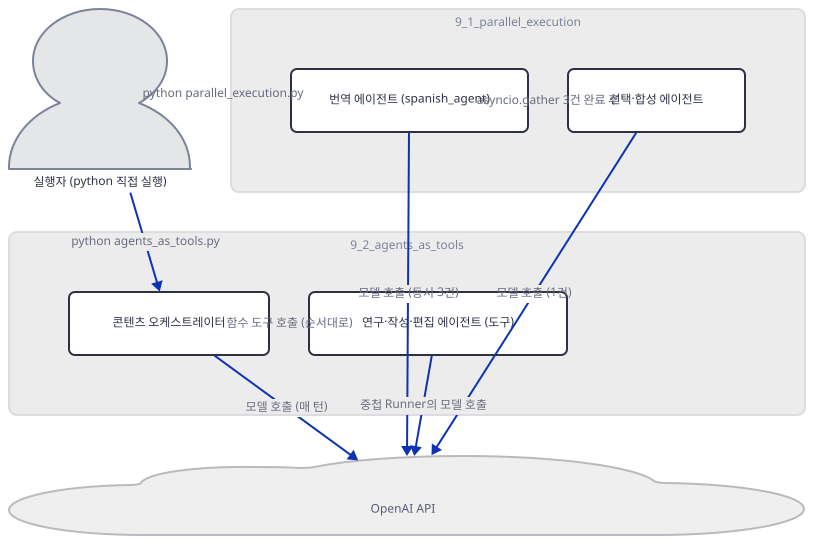
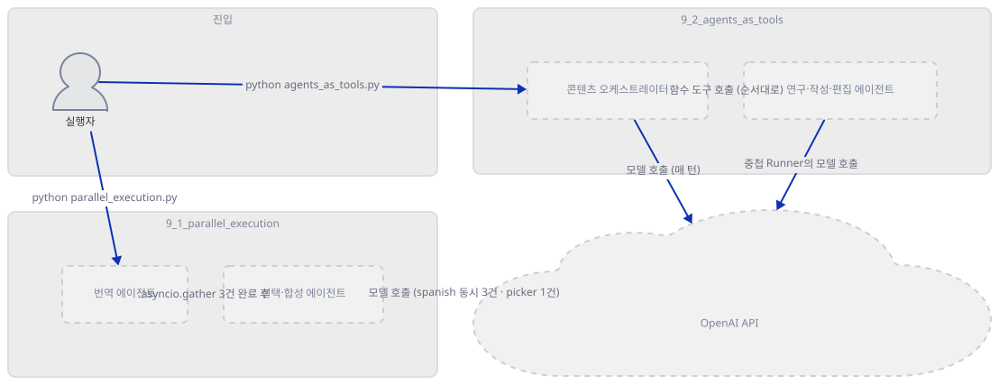
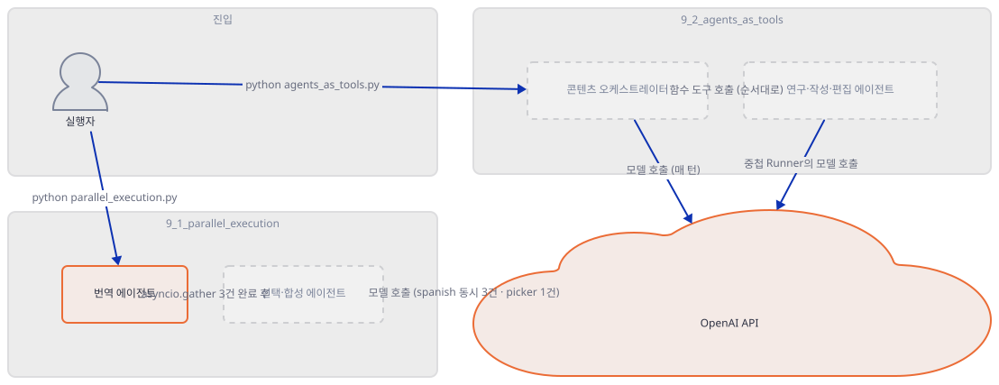
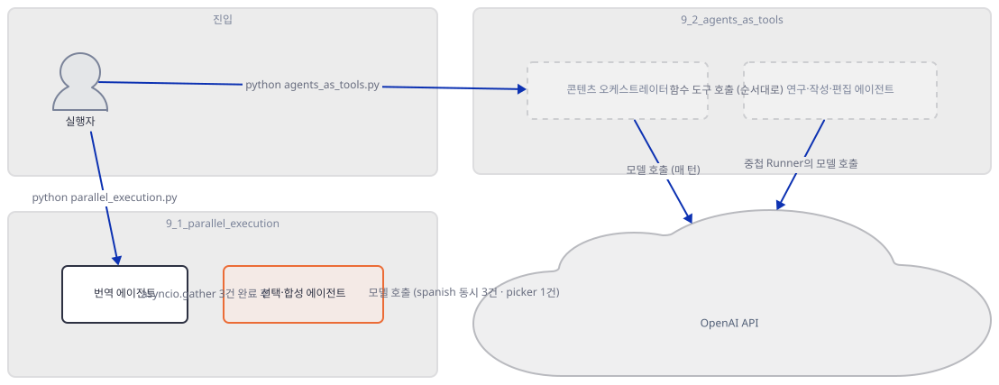
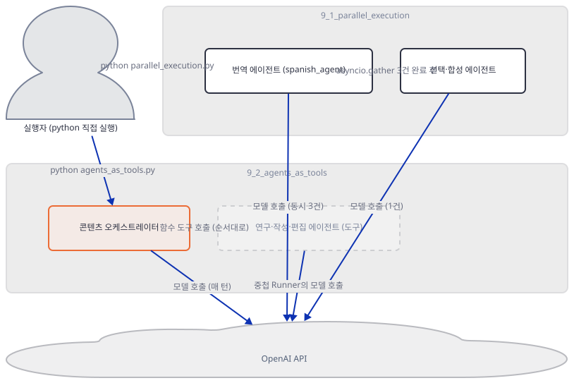
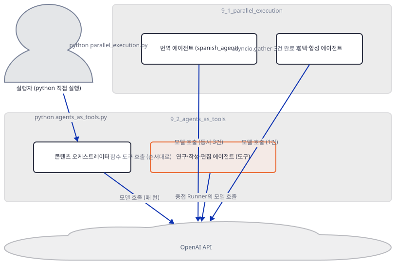
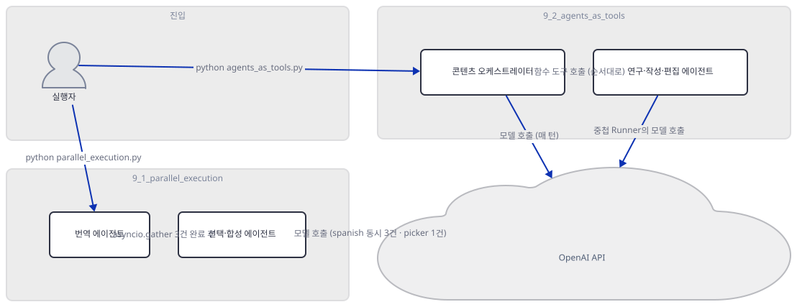
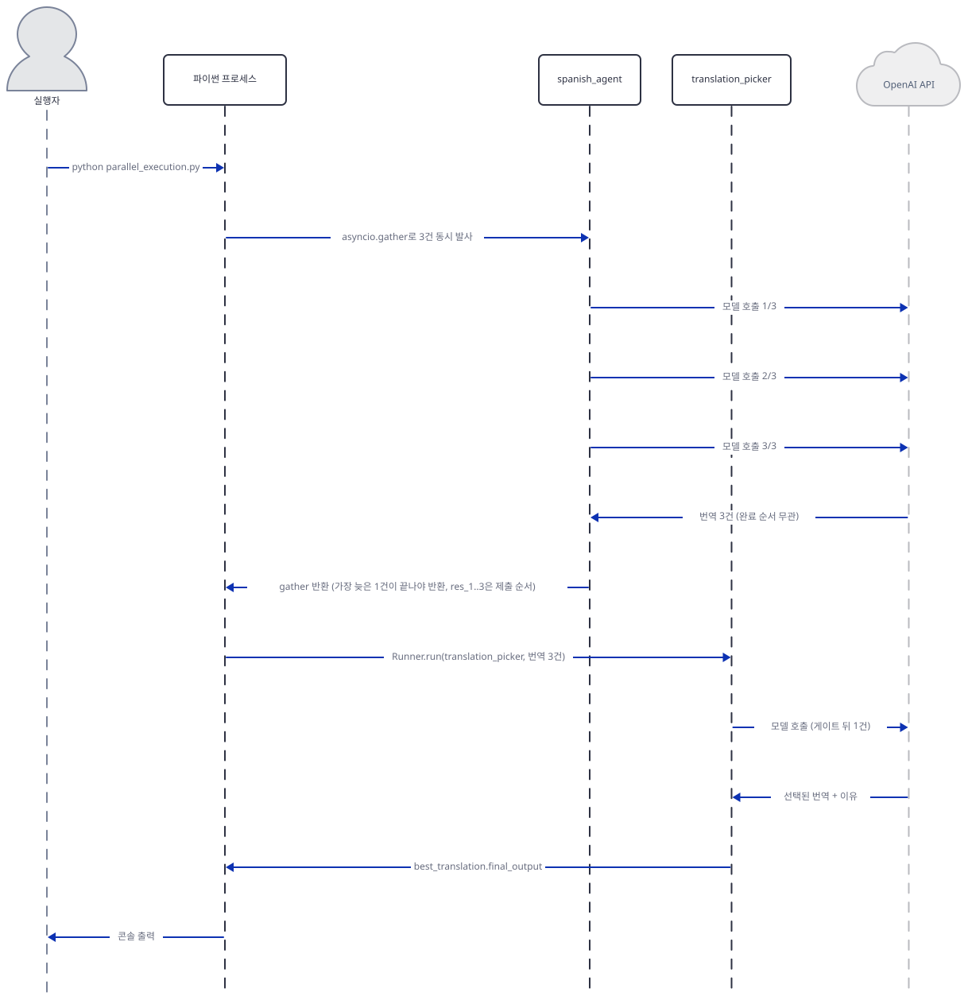

# Day 032 · OpenAI Agents SDK Crash Course · 9_multi_agent_orchestration

> 볼륨 2 🧑‍🏫 Crash Courses · 난이도 ★★☆ · 예상 소요 100분(두 패턴의 소스를 읽는 것 말고도, 무엇이 실제로 동시에 도는지를 `ScriptedModel`로 시간까지 재현하는 실험을 두 번 하느라 다른 크래시 코스 날보다 깁니다) · API 비용 $0 (API 키 없이 진행 — openai-agents의 공식 오프라인 테스트 더블 `agents.testing.ScriptedModel`로 재현했습니다) · 원본 앱: `ai_agent_framework_crash_course/openai_sdk_crash_course/9_multi_agent_orchestration`

## 오늘 만들 것

Day 024가 이 볼륨의 공통 축(`openai-agents` 패키지, `from agents import ...` 임포트, 단일 키 `OPENAI_API_KEY`)을 세웠고, 모델은 이 레슨이 지정하지 않아 SDK 기본값으로 풀립니다 — 그 기본값이 실제로 무엇인지는 Day 024가 확인해 두었습니다. 그리고, Day 026은 이미 이 SDK가 다른 에이전트를 도구로 쓰는 법 — `.as_tool()`이 감싼 에이전트가 모델에게 `input: string` 하나로만 보이는 것, 그 뒤에서 완전히 새로운 `Runner`가 통째로 도는 것 — 을 소스와 실행으로 확인했습니다. 오늘 `9_multi_agent_orchestration`은 그 위에 "여러 에이전트를 한 문제에 붙이고 답을 하나로 합친다"는 주제를 얹습니다. 이 폴더가 실제로 묶는 갈래는 두 개뿐입니다 — `asyncio.gather`로 여러 실행을 동시에 띄우는 병렬 실행(`9_1_parallel_execution`), 그리고 한 에이전트가 다른 에이전트들을 함수 도구로 불러 쓰는 오케스트레이션(`9_2_agents_as_tools`, Day 026의 "손으로 감싸기" 갈래와 같은 메커니즘). Day 022는 Google ADK가 이 자리에 `SequentialAgent`·`LoopAgent`·`ParallelAgent`라는 전용 클래스를 두고도 이미 폐기 예고 상태라는 것을 확인했는데, OpenAI Agents SDK엔 애초에 그런 클래스가 하나도 없습니다 — 병렬은 표준 라이브러리 `asyncio.gather`를 사용자가 직접 쓰는 것이고, 순차는 프레임워크가 강제하는 `for`문이 아니라 오케스트레이터 에이전트 자신의 지시문과 도구 사이의 데이터 의존성이 만드는 결과일 뿐입니다 — 이 문서가 Step마다 소스와 실행으로 증명합니다. 레슨 자신의 최상위 README는 세 번째 패턴(`complex_orchestration.py`, 70줄)과 선택적 `app.py`를 문서화하지만 디스크엔 둘 다 없고(직접 확인, Step 1), 실제로 있는 두 파일의 줄 수도 45·55줄이라 주장하지만 실제로는 208·233줄입니다 — Day 019·022·023·026·027이 이미 찾은 것과 같은 종류의, 레슨 문서와 실제 코드가 어긋나는 사례입니다. 이 최상위 두 파일은 `9_1_parallel_execution/agent.py`·`9_2_agents_as_tools/agent.py`와 바이트 단위로 완전히 같습니다(직접 확인, `diff`와 `md5sum`) — Day 025·027·030이 찾은 "겹치는 줄 수를 가진 독립 재구현"과 달리, 이번엔 정말 같은 파일이 두 경로에 있을 뿐입니다. 키 없이, Day 029가 가드레일 경합을 증명할 때 쓴 그 오프라인 테스트 더블로 실제로 무엇이 동시에 도는지, 무엇이 순서를 기다리는지, 답을 누가 합치는지를 시간까지 재현합니다. 완성 구조는 다음과 같습니다.



## 사전 준비

| 서비스/도구 | 용도 | 발급·설치 |
|---|---|---|
| OpenAI API 키 (`OPENAI_API_KEY`) | 두 패턴 모두가 결국 호출하는 `Runner`의 인증. 이 문서는 키를 발급하지 않고, `agents.testing.ScriptedModel`로 오프라인 재현만 합니다 | https://platform.openai.com/api-keys 에서 발급 (이 실습에서는 생략) |
| uv | 가상환경 생성과 패키지 설치 | [공통 사전 준비](../README.md#공통-사전-준비-한-번만) 참고 |
| 인터넷 연결 | PyPI에서 `openai-agents`·`streamlit`·`python-dotenv` 설치 | 별도 설치 없음 |

## 아키텍처 한눈에 보기

| 컴포넌트 | 역할 | 코드 위치 |
|---|---|---|
| 실행자 (터미널) | `python parallel_execution.py` 또는 `python agents_as_tools.py`를 직접 실행 (UI 없음) | 코드 없음 (외부 터미널) |
| 번역 에이전트 (`spanish_agent`) | 같은 `Agent` 인스턴스를 `asyncio.gather`로 3번 동시에 호출 | `ai_agent_framework_crash_course/openai_sdk_crash_course/9_multi_agent_orchestration/parallel_execution.py:5-8`, `34-38` |
| 선택·합성 에이전트 (`translation_picker` 등) | 3건이 모두 끝난 뒤 결과를 보고 하나를 고르거나 합성 | `ai_agent_framework_crash_course/openai_sdk_crash_course/9_multi_agent_orchestration/parallel_execution.py:11-18`, `51-55` |
| 콘텐츠 오케스트레이터 (`content_orchestrator`) | 함수 도구 3개를 매 턴 하나씩 호출하고, 최종 텍스트도 직접 작성 | `ai_agent_framework_crash_course/openai_sdk_crash_course/9_multi_agent_orchestration/agents_as_tools.py:76-95` |
| 연구·작성·편집 에이전트 (도구로 래핑) | `@function_tool`이 감싼 함수 안에서 `Runner.run()`으로 통째로 실행 | `ai_agent_framework_crash_course/openai_sdk_crash_course/9_multi_agent_orchestration/agents_as_tools.py:39-49`, `51-63`, `65-74` |
| OpenAI API | 모든 모델 호출의 실제 목적지 (이 문서에선 `ScriptedModel`로 대체) | 코드 없음 (외부 서비스) |

## 단계별 진행

### Step 1. 환경 만들기 — 파일 실체와 최상위 README의 어긋남

**목적.** 의존성을 설치하고, 이 레슨의 파일들이 실제로 무엇이고 몇 줄인지 확인하며, 최상위 README가 문서화하는 구조가 실제 디스크와 어디서 다른지, 그리고 최상위 두 스크립트가 서브 레슨 폴더의 것과 바이트 단위로 같은 파일인지 확인합니다.

**할 일.**

```bash
cd ai_agent_framework_crash_course/openai_sdk_crash_course/9_multi_agent_orchestration
uv venv
uv pip install -r requirements.txt
```

(pip 대안: `python -m venv .venv && source .venv/bin/activate && pip install -r requirements.txt`. Windows PowerShell은 활성화만 `.venv\Scripts\Activate.ps1`로 바꿉니다.)

이 저장소는 루트에 `pyproject.toml`이 있어 `uv run`이 방금 만든 환경 대신 루트의 `.venv`를 쓰므로, 이후 `uv run` 명령에는 모두 `--no-project`를 붙입니다. [공통 사전 준비](../README.md#공통-사전-준비-한-번만)가 이미 밝혔듯 `--no-project`는 "이 폴더를 프로젝트로 취급하지 말라"는 뜻일 뿐 가상환경을 찾는 일은 그대로 하므로 `uv venv`를 건너뛰면 안 됩니다 — 그 절은 이 OpenAI Agents SDK 볼륨(Day 24~34)을 이름까지 짚어, 저장소 루트 `.venv`에 이름이 같은 다른 패키지(TensorFlow Agents, Day 025·026이 확인)가 들어 있어 건너뛰면 원인과 한참 떨어진 오류가 난다고 경고합니다.

`ai_agent_framework_crash_course/openai_sdk_crash_course/9_multi_agent_orchestration/requirements.txt:1-3`

```text
openai-agents>=0.2.0
streamlit>=1.28.0
python-dotenv>=1.0.0
```

세 줄이지만 실제로 쓰이는 것은 사실상 둘뿐입니다 — 이 폴더의 파이썬 파일 넷(`parallel_execution.py`, `agents_as_tools.py`와 그 서브 레슨 사본) 중 어느 것도 `streamlit`을 import하지 않고(직접 확인, 아래), `app.py`도 이 폴더 어디에도 없습니다. `env.example`도 세 곳(최상위, `9_1_parallel_execution/`, `9_2_agents_as_tools/`) 모두 점 없는 이름과 같은 한 줄입니다.

`ai_agent_framework_crash_course/openai_sdk_crash_course/9_multi_agent_orchestration/env.example:1`

```text
OPENAI_API_KEY=your_openai_api_key_here
```

최상위 README의 "Project Structure"는 이렇게 적고 있습니다.

`ai_agent_framework_crash_course/openai_sdk_crash_course/9_multi_agent_orchestration/README.md:75-82`

```text
9_multi_agent_orchestration/
├── README.md                    # This file - concept explanation
├── requirements.txt             # Dependencies
├── parallel_execution.py        # Parallel agent patterns (45 lines)
├── agents_as_tools.py           # Agents as tools orchestration (55 lines)
├── complex_orchestration.py     # Advanced workflow patterns (70 lines)
├── app.py                      # Streamlit orchestration demo (optional)
└── env.example                 # Environment variables template
```

이 트리와 그 위 "Tutorial Overview" 절(`README.md:67-70`, "세 번째 패턴")이 함께 문서화하는 `complex_orchestration.py`는 디스크 어디에도 없고, `app.py`도 없습니다(아래 `find`로 확인) — "Getting Started"의 다섯 번째 단계(`README.md:122-125`)도 `python complex_orchestration.py`를 실행하라고 안내하지만 그 파일 자체가 없어 그대로 따르면 곧바로 막힙니다. 있는 두 파일의 줄 수 주장(45·55줄)도 틀렸습니다 — 실제로는 각각 208·233줄입니다. Day 019·022·023·026·027이 이미 찾은, 레슨 문서가 실제 코드와 어긋나는 사례의 목록에 오늘도 하나가 더 붙습니다.



**확인.** 먼저 실제 파일 목록과 각 파일의 줄 수를 봅니다.

```bash
find . -type f | sort
wc -l README.md env.example requirements.txt parallel_execution.py agents_as_tools.py \
      9_1_parallel_execution/README.md 9_1_parallel_execution/agent.py 9_1_parallel_execution/__init__.py 9_1_parallel_execution/env.example \
      9_2_agents_as_tools/README.md 9_2_agents_as_tools/agent.py 9_2_agents_as_tools/__init__.py 9_2_agents_as_tools/env.example
```

```powershell
Get-ChildItem -Recurse -File | Select-Object -ExpandProperty Name
Get-Content README.md, env.example, requirements.txt, parallel_execution.py, agents_as_tools.py | Measure-Object -Line
```

```
./9_1_parallel_execution/README.md
./9_1_parallel_execution/__init__.py
./9_1_parallel_execution/agent.py
./9_1_parallel_execution/env.example
./9_2_agents_as_tools/README.md
./9_2_agents_as_tools/__init__.py
./9_2_agents_as_tools/agent.py
./9_2_agents_as_tools/env.example
./README.md
./agents_as_tools.py
./env.example
./parallel_execution.py
./requirements.txt

 232 README.md
   1 env.example
   3 requirements.txt
 208 parallel_execution.py
 233 agents_as_tools.py
  88 9_1_parallel_execution/README.md
 208 9_1_parallel_execution/agent.py
   1 9_1_parallel_execution/__init__.py
   1 9_1_parallel_execution/env.example
  95 9_2_agents_as_tools/README.md
 233 9_2_agents_as_tools/agent.py
   1 9_2_agents_as_tools/__init__.py
   1 9_2_agents_as_tools/env.example
```

(직접 확인 — 이번엔 정정이 필요 없습니다. 열세 파일 모두 마지막 바이트가 개행이라 `wc -l`이 GitHub가 보여줄 줄 수와 그대로 같습니다(`tail -c 1 파일 | xxd`로 확인) — Day 022·027이 트레일링 개행 없는 파일 때문에 `wc -l`을 손으로 보정해야 했던 것과 다릅니다.) 이제 최상위 두 파일이 서브 레슨의 `agent.py`와 정말 같은 파일인지 봅니다.

```bash
diff parallel_execution.py 9_1_parallel_execution/agent.py && echo "parallel: 완전히 동일"
diff agents_as_tools.py 9_2_agents_as_tools/agent.py && echo "agents_as_tools: 완전히 동일"
md5sum parallel_execution.py 9_1_parallel_execution/agent.py agents_as_tools.py 9_2_agents_as_tools/agent.py
grep -l streamlit *.py 9_1_parallel_execution/*.py 9_2_agents_as_tools/*.py; echo "streamlit import한 파일 수=$?"
```

```powershell
git diff --no-index parallel_execution.py 9_1_parallel_execution/agent.py
git diff --no-index agents_as_tools.py 9_2_agents_as_tools/agent.py
Get-FileHash parallel_execution.py, 9_1_parallel_execution\agent.py, agents_as_tools.py, 9_2_agents_as_tools\agent.py -Algorithm MD5
```

```
parallel: 완전히 동일
agents_as_tools: 완전히 동일
98aafb6bb0464b2d21dec3b21806de1c *parallel_execution.py
98aafb6bb0464b2d21dec3b21806de1c *9_1_parallel_execution/agent.py
978cbd0a2f12a4ffcf61ffaff1ad52ba *agents_as_tools.py
978cbd0a2f12a4ffcf61ffaff1ad52ba *9_2_agents_as_tools/agent.py
streamlit import한 파일 수=1
```

(직접 확인 — `diff`가 출력 없이 종료 코드 0을 돌려주고, 두 쌍의 MD5가 각각 정확히 같습니다. 네 파일은 서로를 import하는 관계가 아니라 같은 내용이 두 경로에 그대로 복사되어 있는 것입니다. 이 문서는 이후 최상위 경로(`parallel_execution.py`, `agents_as_tools.py`)로 가르칩니다 — 최상위 README의 "Getting Started"가 실제로 그 경로를 실행하라고 안내하는 유일한 진입점이기 때문입니다. 마지막 줄의 `grep -l`은 아무 파일도 출력하지 못해 종료 코드 1을 돌려주므로 "파일 수=1"이 아니라 "매치 없음"을 뜻합니다 — 네 `.py` 파일 중 `streamlit`을 import하는 파일은 하나도 없습니다.)

### Step 2. 패턴 1의 모양 — `asyncio.gather` 뒤에 한 번 더 있는 순차 호출

**목적.** `parallel_execution.py`가 실제로 무엇을 동시에 부르고, 그 결과를 누가 어떻게 합치는지 소스로 확인합니다.

**할 일.** 파일은 예시 세 개(`parallel_translation_example`·`parallel_specialized_agents`·`parallel_content_generation`)를 담고 있고, 셋 다 같은 모양입니다 — 첫 번째 예시로 그 모양을 봅니다. 먼저 두 에이전트를 정의합니다.

`ai_agent_framework_crash_course/openai_sdk_crash_course/9_multi_agent_orchestration/parallel_execution.py:1-18`

```python
import asyncio
from agents import Agent, ItemHelpers, Runner, trace

# Create specialized translation agent
spanish_agent = Agent(
    name="Spanish Translator",
    instructions="You translate the user's message to Spanish. Provide natural, fluent translations."
)

# Create translation quality picker
translation_picker = Agent(
    name="Translation Quality Picker",
    instructions="""
    You are an expert in Spanish translations. 
    Given multiple Spanish translation options, pick the most natural, accurate, and fluent one.
    Explain briefly why you chose that translation.
    """
)
```

`spanish_agent`는 **한 번만** 만들어지고, 같은 인스턴스가 `asyncio.gather` 안에서 세 번 호출됩니다 — 서로 다른 세 에이전트가 아니라 같은 에이전트에 같은 메시지를 세 번 보내는 것입니다.

`ai_agent_framework_crash_course/openai_sdk_crash_course/9_multi_agent_orchestration/parallel_execution.py:29-38`

```python
    # Ensure the entire workflow is a single trace
    with trace("Parallel Translation Workflow") as workflow_trace:
        print("Running 3 parallel translation attempts...")
        
        # Run 3 parallel translations
        res_1, res_2, res_3 = await asyncio.gather(
            Runner.run(spanish_agent, msg),
            Runner.run(spanish_agent, msg), 
            Runner.run(spanish_agent, msg)
        )
```

`with trace(...)`는 openai-agents의 트레이싱 스팬을 하나로 묶는 컨텍스트 매니저일 뿐 실행 방식엔 관여하지 않습니다 — 키가 없으면 이전 모든 날처럼 "OPENAI_API_KEY is not set, skipping trace export"만 찍고 넘어가며, `trace_id`는 키 없이도 로컬에서 생성됩니다(직접 확인, 아래). 세 결과가 모이면 `asyncio.gather`가 끝나고, `ItemHelpers.text_message_outputs`로 각 결과에서 텍스트만 뽑습니다.

`ai_agent_framework_crash_course/openai_sdk_crash_course/9_multi_agent_orchestration/parallel_execution.py:51-55`

```python
        # Use picker agent to select best translation
        best_translation = await Runner.run(
            translation_picker,
            f"Original English: {msg}\n\nTranslations to choose from:\n{translations}"
        )
```

이 `Runner.run(translation_picker, ...)`은 `asyncio.gather` **밖**에서, 즉 세 번역이 모두 끝난 **뒤**에 단독으로 `await`됩니다. 두 번째 예시(`parallel_specialized_agents`, `parallel_execution.py:63-123`)도 같은 모양이고 같은 `translation_picker`로 "어느 스타일이 맞는지 추천"을 시킵니다. 세 번째 예시(`parallel_content_generation`, `parallel_execution.py:126-193`)는 고르는 대신 합성하는 전용 에이전트(`synthesis_agent`)를 따로 만듭니다 — 셋 다 코드가 직접 답을 합치는 로직은 문자열을 이어붙이는 것(`"\n\n".join(...)`)뿐이고, "어느 것이 낫나"·"어떻게 합치나"라는 실질적인 판단은 전부 그 다음 LLM 호출 한 번에 위임됩니다.



**확인.** `trace()`가 키 없이도 로컬 `trace_id`를 만든다는 것과, 두 에이전트 모두 `model=`을 지정하지 않는다는 것을 확인합니다(Day 024가 확인한 기본값 해석 경로가 여기도 그대로 적용됩니다 — 다시 유도하지 않습니다). Day 019가 문서화한 cp949 문제는 이모지만이 아닙니다 — `python -c "..."`에 한글 문자열을 직접 넣으면 이 콘솔에서는 명령줄 인자 자체가 깨져 들어가 `UnicodeEncodeError` 없이도 출력이 조용히 깨집니다(직접 확인). 이 문서의 나머지 `python -c` 확인 명령에는 모두 `PYTHONIOENCODING=utf-8`을 앞에 붙입니다.

```bash
PYTHONIOENCODING=utf-8 uv run --no-project python -c "
from agents import Agent, trace
a = Agent(name='x', instructions='y')
print('spanish_agent 대역 model:', repr(a.model))
with trace('probe') as t:
    print('trace_id (키 없이도 로컬 생성):', t.trace_id)
"
```

```powershell
$env:PYTHONIOENCODING="utf-8"; uv run --no-project python -c "<위와 같은 코드>"
```

```
spanish_agent 대역 model: None
trace_id (키 없이도 로컬 생성): trace_fe3e96d33eff4e88a1c89b68adc7a3d2
```

(직접 확인 — `trace_id`는 실행마다 무작위로 달라집니다. 두 에이전트 다 `model=`이 없다는 것만 확인했습니다.)

### Step 3. 진짜 동시에 도는가 — `ScriptedModel`로 시간까지 재현

**목적.** `asyncio.gather`로 묶인 세 `Runner.run` 호출이 실제로 겹쳐서 실행되는지, 그리고 완료 순서와 `res_1`·`res_2`·`res_3`의 대응이 같은지를 인위적 지연으로 직접 재현합니다.

**할 일.** `spanish_agent`를 openai-agents의 공식 오프라인 테스트 더블 `agents.testing.ScriptedModel`로 바꿔 치환합니다(Day 029가 가드레일 경합을 증명할 때 쓴 것과 같은 도구). 세 번째로 소비되는 스크립트 스텝(A)에 가장 긴 지연(0.5초)을, 첫 번째로 소비되는 스텝(B)에 가장 짧은 지연(0.2초)을 줘서 "먼저 시작한 것이 먼저 끝난다"는 순서를 일부러 깹니다. 첫 `Runner.run` 호출은 SDK 내부 초기화 때문에 그 자체로 몇백 밀리초가 더 걸린다는 것을 직접 확인했으므로(같은 스크립트, 응답을 즉시 반환하는 더미 에이전트로 1·2·3번째 호출 시간을 재면 0.31s·0.00s·0.00s처럼 첫 호출만 튑니다), 측정 전에 더미 호출 한 번으로 그 비용을 미리 치릅니다.



**확인.**

```bash
PYTHONIOENCODING=utf-8 uv run --no-project python -c "
import asyncio, time
from agents import Agent, Runner, ItemHelpers
from agents.testing import ScriptedModel, ModelStep, assistant_message

async def warmup_responder(call):
    return [assistant_message('warmup')]
warmup = Agent(name='warmup', instructions='x').clone(model=ScriptedModel([ModelStep.respond(warmup_responder)]))

spanish_agent = Agent(name='Spanish Translator', instructions='translate')
picker = Agent(name='Translation Quality Picker', instructions='pick best')
DELAYS = {'A': 0.5, 'B': 0.2, 'C': 0.3}  # 스크립트에 먼저 든 순서: A, B, C

def responder(label, t0):
    async def run(call):
        start = round(time.monotonic() - t0, 2)
        await asyncio.sleep(DELAYS[label])
        end = round(time.monotonic() - t0, 2)
        print(f'  {label}: start={start}s end={end}s (delay={DELAYS[label]}s)')
        return [assistant_message(f'[{label}]')]
    return run

async def main():
    await Runner.run(warmup, 'hi')  # 1회성 초기화 비용을 여기서 미리 치름

    t0 = time.monotonic()
    sa = spanish_agent.clone(model=ScriptedModel([
        ModelStep.respond(responder('A', t0)), ModelStep.respond(responder('B', t0)), ModelStep.respond(responder('C', t0)),
    ]))
    pk = picker.clone(model=ScriptedModel([[assistant_message('picked B')]]))

    gather_t0 = time.monotonic()
    r1, r2, r3 = await asyncio.gather(
        Runner.run(sa, 'hi'), Runner.run(sa, 'hi'), Runner.run(sa, 'hi'),
    )
    gather_elapsed = round(time.monotonic() - gather_t0, 2)
    outs = [ItemHelpers.text_message_outputs(r.new_items) for r in (r1, r2, r3)]
    print('res_1..3 (제출 순서):', outs)
    print(f'gather 경과={gather_elapsed}s | 지연 합={sum(DELAYS.values())}s | 지연 최댓값={max(DELAYS.values())}s')
    picker_t0 = round(time.monotonic() - t0, 2)
    await Runner.run(pk, 'pick from: ' + str(outs))
    print(f'선택 에이전트 호출 시작 t={picker_t0}s (gather가 반환된 뒤)')

asyncio.run(main())
"
```

```powershell
$env:PYTHONIOENCODING="utf-8"; uv run --no-project python -c "<위와 같은 코드>"
```

```
  B: start=0.0s end=0.2s (delay=0.2s)
  C: start=0.0s end=0.3s (delay=0.3s)
  A: start=0.0s end=0.53s (delay=0.5s)
res_1..3 (제출 순서): ['[A]', '[B]', '[C]']
gather 경과=0.53s | 지연 합=1.0s | 지연 최댓값=0.5s
선택 에이전트 호출 시작 t=0.53s (gather가 반환된 뒤)
```

(직접 확인 — 절대 시각은 실행 환경에 따라 조금씩 달라질 수 있지만(특히 웜업 없이 측정하면 첫 호출에 수백 밀리초가 더 붙습니다), 세 값의 관계는 안정적으로 재현됩니다. 세 호출이 **정확히 같은 시각(0.0초)**에 시작합니다 — 순차 호출이었다면 B가 끝난 0.2초에야 C가 시작했을 것입니다. `gather` 전체 경과(0.53초)는 지연의 **합**(1.0초)이 아니라 **최댓값**(0.5초)에 근접합니다 — 가장 느린 A가 게이트입니다. `res_1`은 가장 늦게 끝난 A의 결과입니다 — `asyncio.gather`는 완료 순서가 아니라 **제출한 순서**로 결과를 배정합니다. 선택 에이전트 호출은 `gather`가 반환된 바로 그 시각에야 시작합니다 — 세 번역과 동시에 진행되는 부분이 전혀 없습니다.)

### Step 4. 패턴 2의 모양 — Day 026이 이미 가르친 그 갈래

**목적.** `agents_as_tools.py`가 어떤 메커니즘으로 세 에이전트를 도구로 쓰는지 확인하고, 이것이 Day 026이 이미 다룬 두 갈래(`.as_tool()`과 손으로 감싸기) 중 정확히 어느 쪽인지 `diff`로 확정합니다.

**할 일.** 세 도구용 에이전트 중 하나입니다.

`ai_agent_framework_crash_course/openai_sdk_crash_course/9_multi_agent_orchestration/agents_as_tools.py:1-12`

```python
from agents import Agent, Runner, function_tool
import asyncio

# Define specialized research agent
research_agent = Agent(
    name="Research Specialist",
    instructions="""
    You are a research specialist. Provide detailed, well-researched information
    on any topic with proper analysis and insights. Focus on factual accuracy
    and comprehensive coverage.
    """
)
```

`@function_tool`로 감싼 함수가 그 에이전트를 `Runner.run()`으로 직접 돌립니다.

`ai_agent_framework_crash_course/openai_sdk_crash_course/9_multi_agent_orchestration/agents_as_tools.py:39-49`

```python
@function_tool
async def research_tool(topic: str) -> str:
    """Research a topic using the specialized research agent with custom configuration"""
    
    result = await Runner.run(
        research_agent,
        input=f"Research this topic thoroughly and provide key insights: {topic}",
        max_turns=3  # Allow deeper research
    )
    
    return str(result.final_output)
```

이 모양은 `.as_tool()`이 아닙니다 — Day 026의 `ai_agent_framework_crash_course/openai_sdk_crash_course/3_tool_using_agent/3_3_agents_as_tools/advanced_agent.py:21-31`의 `run_research_agent`가 이미 가르친 것과 같은 갈래(`@function_tool`로 `Runner.run()`을 손수 감싸는 패턴)입니다. 실제로 이 파일 전체에 `.as_tool(`은 한 번도 나오지 않고(`grep`으로 확인, 아래), `handoffs=`도 쓰지 않습니다 — Day 026이 확인한 두 자리(`tools=`로 부르면 반드시 돌아오는 도구, `handoffs=`로 넘기면 돌아오지 않는 이관) 중 이 파일은 전자만, 그것도 한 갈래만 씁니다. 오케스트레이터는 이 세 도구를 등록합니다.

`ai_agent_framework_crash_course/openai_sdk_crash_course/9_multi_agent_orchestration/agents_as_tools.py:76-95`

```python
# Create orchestrator agent that uses other agents as tools
content_orchestrator = Agent(
    name="Content Creation Orchestrator",
    instructions="""
    You are a content creation orchestrator that coordinates research, writing, and editing.
    
    You have access to:
    - research_tool: For in-depth topic research and insights
    - writing_tool: For professional content creation (specify style: professional, casual, academic, etc.)
    - editing_tool: For content review and improvement
    
    When users request content:
    1. First use research_tool to gather comprehensive information
    2. Then use writing_tool to create well-structured content
    3. Finally use editing_tool to polish and improve the final piece
    
    Coordinate all three tools to create high-quality, well-researched content.
    """,
    tools=[research_tool, writing_tool, editing_tool]
)
```

순서("1. First... 2. Then... 3. Finally...")는 파이썬 제어 구조가 아니라 **지시문 문자열**입니다 — Day 022가 ADK의 `SequentialAgent`에서 본 것(자식이 `transfer_to_agent` 대상 자체를 갖지 못해 순서를 어길 수 있는 메커니즘이 아예 없음)과 정반대입니다. 여기서 순서를 지키게 만드는 것은 프레임워크가 아니라 데이터 의존성입니다 — `writing_tool`의 `content` 인자는 `research_tool`의 반환값이 있어야 채울 수 있고, `editing_tool`의 `content`도 `writing_tool`의 결과가 있어야 자연스럽습니다. `writing_tool`의 `style` 매개변수는 기본값(`"professional"`)이 있어도 스키마의 `required`에 그대로 남습니다 — Day 026이 `strict_json_schema: True`로 이미 확인한 것과 같은 동작입니다(다시 유도하지 않습니다).



**확인.**

```bash
grep -c "as_tool(" agents_as_tools.py; echo "exit=$?"
grep -c "handoffs=" agents_as_tools.py; echo "exit=$?"
uv run --no-project python -c "
import importlib, json
m = importlib.import_module('9_2_agents_as_tools.agent')
print('content_orchestrator.handoffs:', m.content_orchestrator.handoffs)
for t in m.content_orchestrator.tools:
    print(t.name, json.dumps(t.params_json_schema))
"
```

```powershell
Select-String -Path agents_as_tools.py -Pattern "as_tool\(" | Measure-Object
uv run --no-project python -c "<위와 같은 코드>"
```

```
0
exit=1
0
exit=1
content_orchestrator.handoffs: []
research_tool {"properties": {"topic": {"title": "Topic", "type": "string"}}, "required": ["topic"], "title": "research_tool_args", "type": "object", "additionalProperties": false}
writing_tool {"properties": {"content": {"title": "Content", "type": "string"}, "style": {"default": "professional", "title": "Style", "type": "string"}}, "required": ["content", "style"], "title": "writing_tool_args", "type": "object", "additionalProperties": false}
editing_tool {"properties": {"content": {"title": "Content", "type": "string"}}, "required": ["content"], "title": "editing_tool_args", "type": "object", "additionalProperties": false}
```

(직접 확인 — `grep -c`가 0을 세고도 매치가 없어 종료 코드 1을 돌려줍니다. 세 도구 다 실제 파라미터 이름이 스키마에 그대로 남습니다 — Day 026의 `.as_tool()`이 만드는 범용 `input: string` 하나짜리 스키마와 다릅니다.)

### Step 5. 도구 호출은 왜 순차인가 — 그리고 SDK가 동시에 할 수 있다는 증거

**목적.** `content_orchestrator`의 세 도구 호출이 실제로 한 턴에 하나씩만 일어나는지 시간으로 확인하고, 그 이유가 SDK의 한계가 아니라 이 레슨의 지시문·데이터 의존성 설계 때문이라는 것을 소스와 재현으로 증명합니다.

**할 일.** openai-agents 0.22.3 소스로 확인하면(`agents/run_internal/tool_execution.py`) 모델이 **한 턴에 도구 호출을 여러 개** 요청하면 `_FunctionToolBatchExecutor`가 각 호출마다 `asyncio.create_task`로 별도 태스크를 만들어 **동시에** 실행합니다 — 동시 실행 개수 상한(`RunConfig.tool_execution.max_function_tool_concurrency`)은 기본값이 `None`(무제한)입니다. 즉 SDK 자체는 여러 도구를 동시에 돌릴 수 있습니다. 그런데 `content_orchestrator`가 실제로 그렇게 하는 일은 없습니다 — `writing_tool`을 부르려면 `research_tool`의 반환 문자열이 있어야 하고, `editing_tool`을 부르려면 `writing_tool`의 반환 문자열이 있어야 하기 때문에, 모델은 한 턴에 하나씩만 요청할 수밖에 없습니다. 아래 확인에서 이 두 가지 — "이 레슨은 순차", "SDK는 동시 가능" — 를 각각 재현합니다.



**확인.** 먼저 `research_agent`·`writing_agent`·`editing_agent`와 `content_orchestrator` 자신의 모델을 모두 `ScriptedModel`로 바꿔, 오케스트레이터가 실제로 몇 번 모델을 부르고 그때마다 무엇을 보는지 봅니다.

```bash
PYTHONIOENCODING=utf-8 uv run --no-project python -c "
import asyncio, time, importlib
from agents import Agent, Runner
from agents.testing import ScriptedModel, ModelStep, assistant_message, function_call

m = importlib.import_module('9_2_agents_as_tools.agent')

async def warmup_responder(call):
    return [assistant_message('warmup')]
warmup = Agent(name='warmup', instructions='x').clone(model=ScriptedModel([ModelStep.respond(warmup_responder)]))

def nested(label, t0, delay):
    async def run(call):
        start = round(time.monotonic() - t0, 2)
        await asyncio.sleep(delay)
        print(f'  {label}: start={start}s end={round(time.monotonic() - t0, 2)}s')
        return [assistant_message(label)]
    return run

def orch_turn(n, output, t0):
    def run(call):
        print(f'  오케스트레이터 턴 {n}: t={round(time.monotonic() - t0, 2)}s, 입력 항목 {len(call.input)}개')
        return output
    return run

async def main():
    await Runner.run(warmup, 'hi')  # 1회성 초기화 비용을 여기서 미리 치름

    t0 = time.monotonic()
    m.research_agent = m.research_agent.clone(model=ScriptedModel([ModelStep.respond(nested('research_agent', t0, 0.3))]))
    m.writing_agent = m.writing_agent.clone(model=ScriptedModel([ModelStep.respond(nested('writing_agent', t0, 0.3))]))
    m.editing_agent = m.editing_agent.clone(model=ScriptedModel([ModelStep.respond(nested('editing_agent', t0, 0.3))]))
    steps = [
        ModelStep.respond(orch_turn(1, [function_call('research_tool', {'topic': 'renewable energy'}, call_id='c1')], t0)),
        ModelStep.respond(orch_turn(2, [function_call('writing_tool', {'content': 'R', 'style': 'professional'}, call_id='c2')], t0)),
        ModelStep.respond(orch_turn(3, [function_call('editing_tool', {'content': 'W'}, call_id='c3')], t0)),
        ModelStep.respond(orch_turn(4, [assistant_message('FINAL')], t0)),
    ]
    m.content_orchestrator = m.content_orchestrator.clone(model=ScriptedModel(steps))
    result = await Runner.run(m.content_orchestrator, 'Write about renewable energy')
    print(f'final_output={result.final_output!r}, 총 경과={time.monotonic() - t0:.2f}s')
    print(f'오케스트레이터 모델 호출={len(m.content_orchestrator.model.calls)}회, 중첩 호출=3회(도구마다 1회)')

asyncio.run(main())
"
```

```powershell
$env:PYTHONIOENCODING="utf-8"; uv run --no-project python -c "<위와 같은 코드>"
```

```
  오케스트레이터 턴 1: t=0.0s, 입력 항목 1개
  research_agent: start=0.0s end=0.31s
  오케스트레이터 턴 2: t=0.31s, 입력 항목 3개
  writing_agent: start=0.31s end=0.62s
  오케스트레이터 턴 3: t=0.62s, 입력 항목 5개
  editing_agent: start=0.62s end=0.95s
  오케스트레이터 턴 4: t=0.95s, 입력 항목 7개
final_output='FINAL', 총 경과=0.95s
오케스트레이터 모델 호출=4회, 중첩 호출=3회(도구마다 1회)
```

(직접 확인 — 절대 시각은 실행마다 달라질 수 있지만, 각 단계가 **겹치지 않고** 정확히 이전 단계가 끝난 시각에 시작한다는 관계는 안정적으로 재현됩니다. Step 3의 "세 호출이 같은 시각에 시작"과 정반대입니다. 오케스트레이터가 보는 입력 항목 수도 턴마다 1→3→5→7로 늘어납니다 — 매번 이전 도구 호출·응답까지 포함한 전체 대화를 다시 봅니다. 총 경과(0.95초)는 세 중첩 호출 지연의 **합**(0.3+0.3+0.3=0.9초)에 근접합니다 — Step 3의 "최댓값에 근접"과 다릅니다.) 이제 SDK가 **한 턴에 두 개**를 요청받으면 실제로 동시에 도는지, 이 레슨의 실제 도구 두 개(`research_tool`·`editing_tool`)로 직접 확인합니다 — 실제 지시문은 이렇게 시키지 않지만, 시킨다면 무슨 일이 일어나는지 봅니다.

```bash
PYTHONIOENCODING=utf-8 uv run --no-project python -c "
import asyncio, time, importlib
from agents import Agent, Runner
from agents.testing import ScriptedModel, ModelStep, assistant_message, function_call

m = importlib.import_module('9_2_agents_as_tools.agent')

async def warmup_responder(call):
    return [assistant_message('warmup')]
warmup = Agent(name='warmup', instructions='x').clone(model=ScriptedModel([ModelStep.respond(warmup_responder)]))

def nested(label, t0):
    async def run(call):
        start = round(time.monotonic() - t0, 2)
        await asyncio.sleep(0.3)
        print(f'  {label}: start={start}s end={round(time.monotonic() - t0, 2)}s')
        return [assistant_message(label)]
    return run

async def main():
    await Runner.run(warmup, 'hi')  # 1회성 초기화 비용을 여기서 미리 치름

    t0 = time.monotonic()
    m.research_agent = m.research_agent.clone(model=ScriptedModel([ModelStep.respond(nested('research_agent', t0))]))
    m.editing_agent = m.editing_agent.clone(model=ScriptedModel([ModelStep.respond(nested('editing_agent', t0))]))
    m.content_orchestrator = m.content_orchestrator.clone(model=ScriptedModel([
        ModelStep(output=[
            function_call('research_tool', {'topic': 'x'}, call_id='c1'),
            function_call('editing_tool', {'content': 'placeholder'}, call_id='c2'),
        ]),
        ModelStep(output=[assistant_message('FINAL')]),
    ]))
    await Runner.run(m.content_orchestrator, 'go')
    print(f'총 경과={time.monotonic() - t0:.2f}s (순차였다면 약 0.6s)')

asyncio.run(main())
"
```

```powershell
$env:PYTHONIOENCODING="utf-8"; uv run --no-project python -c "<위와 같은 코드>"
```

```
  research_agent: start=0.0s end=0.31s
  editing_agent: start=0.0s end=0.31s
총 경과=0.31s (순차였다면 약 0.6s)
```

(직접 확인 — 한 턴에 두 호출을 강제로 실어 보내자 두 중첩 에이전트가 **같은 시각에** 시작해 **같은 시각에** 끝났습니다. `content_orchestrator`의 실제 지시문은 이 상황을 절대 만들지 않지만, 만든다면 SDK는 실제로 동시에 처리합니다 — 순차 실행은 이 레슨이 짠 프롬프트의 결과이지 SDK의 한계가 아닙니다.)

### Step 6. 실패하면 무엇이 남는가 — 부분 실패와 키 없는 두 진입점

**목적.** `asyncio.gather`에서 하나가 실패하면 나머지는 어떻게 되는지 확인하고, 두 최상위 스크립트를 실제로 키 없이 실행해 어디서 멈추는지 봅니다.

**할 일.** `parallel_execution.py`·`agents_as_tools.py` 어디에도 `try`/`except`가 없습니다(`grep`으로 확인, 아래) — 하나라도 실패하면 그대로 위로 올라옵니다. 문제는 `asyncio.gather`가 예외를 즉시 전파하면서도 **아직 끝나지 않은 나머지 태스크를 취소하지 않는다**는 점입니다(파이썬 표준 라이브러리 동작, `return_exceptions=True`를 주지 않는 한). 즉 번역 하나가 실패해도 나머지 둘은 아무도 결과를 안 쓰는 채로 백그라운드에서 끝까지 돕니다 — 시간과 비용만 쓰고 버려집니다.



**확인.** 하나는 즉시 실패하고 다른 하나는 0.5초 뒤 성공하는 두 에이전트를 `gather`로 묶습니다.

```bash
grep -c "try:" parallel_execution.py agents_as_tools.py
PYTHONIOENCODING=utf-8 uv run --no-project python -c "
import asyncio
from agents import Agent, Runner
from agents.testing import ScriptedModel, ModelStep, assistant_message

async def warmup_responder(call):
    return [assistant_message('warmup')]
warmup = Agent(name='warmup', instructions='x').clone(model=ScriptedModel([ModelStep.respond(warmup_responder)]))

async def failing(call):
    raise RuntimeError('simulated failure in translator #1')

state = {'completed': False}
async def slow_ok(call):
    await asyncio.sleep(0.5)
    state['completed'] = True
    return [assistant_message('finished anyway')]

agent_fail = Agent(name='A', instructions='x').clone(model=ScriptedModel([ModelStep.respond(failing)]))
agent_slow = Agent(name='B', instructions='x').clone(model=ScriptedModel([ModelStep.respond(slow_ok)]))

async def main():
    import time
    await Runner.run(warmup, 'hi')  # 1회성 초기화 비용을 여기서 미리 치름
    t0 = time.monotonic()
    try:
        await asyncio.gather(Runner.run(agent_fail, 'hi'), Runner.run(agent_slow, 'hi'))
    except RuntimeError as e:
        print(f'gather가 t={time.monotonic()-t0:.2f}s에 예외를 던짐: {e}')
    print('예외 시점에 B가 이미 끝났는가?', state['completed'])
    await asyncio.sleep(0.6)
    print('0.6s 더 기다린 뒤 B가 끝났는가?', state['completed'], '(아무도 안 쓰는 채로 배경에서 계속 실행됨)')

asyncio.run(main())
"
```

```powershell
Select-String -Path parallel_execution.py, agents_as_tools.py -Pattern "try:" | Measure-Object
$env:PYTHONIOENCODING="utf-8"; uv run --no-project python -c "<위와 같은 코드>"
```

```
parallel_execution.py:0
agents_as_tools.py:0
gather가 t=0.02s에 예외를 던짐: simulated failure in translator #1
예외 시점에 B가 이미 끝났는가? False
0.6s 더 기다린 뒤 B가 끝났는가? True (아무도 안 쓰는 채로 배경에서 계속 실행됨)
```

(직접 확인 — 예외는 거의 즉시(0.02초) 올라왔지만, 그 순간 B는 아직 끝나지 않았습니다(`False`). 0.6초를 더 기다리자 B는 결국 끝까지 실행되었습니다(`True`) — 하지만 그 결과를 받아 줄 코드는 이미 예외로 빠져나간 뒤라 아무도 그 값을 보지 않습니다.) 이제 두 최상위 스크립트를 실제로 키 없이 실행해 어디서 멈추는지 봅니다. 두 파일 다 `main()` 맨 앞에서 이모지를 `print`하는데, cp949 콘솔은 API 경계보다 먼저 여기서 멈춥니다 — Day 019가 이미 정리한 것과 같은 문제입니다.

```bash
uv run --no-project python parallel_execution.py; echo "exit=$?"
```

```powershell
uv run --no-project python parallel_execution.py; echo "exit=$LASTEXITCODE"
```

```
Traceback (most recent call last):
  ...
    print("\U0001f3bc OpenAI Agents SDK - Parallel Multi-Agent Execution")
UnicodeEncodeError: 'cp949' codec can't encode character '\U0001f3bc' in position 0: illegal multibyte sequence
exit=1
```

`PYTHONIOENCODING=utf-8`을 붙이면 그 다음 지점 — 실제 `Runner`가 클라이언트를 만드는 자리 — 까지 갑니다.

```bash
PYTHONIOENCODING=utf-8 uv run --no-project python parallel_execution.py; echo "exit=$?"
PYTHONIOENCODING=utf-8 uv run --no-project python agents_as_tools.py; echo "exit=$?"
```

```powershell
$env:PYTHONIOENCODING="utf-8"; uv run --no-project python parallel_execution.py
$env:PYTHONIOENCODING="utf-8"; uv run --no-project python agents_as_tools.py
```

```
🎼 OpenAI Agents SDK - Parallel Multi-Agent Execution
============================================================
=== Parallel Translation with Quality Selection ===
Original message: Hello, how are you today? I hope you're having a wonderful time!
Running 3 parallel translation attempts...
openai.OpenAIError: Missing credentials. Please pass an `api_key`, `workload_identity`, `admin_api_key`, or set the `OPENAI_API_KEY` or `OPENAI_ADMIN_KEY` environment variable.
exit=1

🔧 OpenAI Agents SDK - Agents as Tools Orchestration
============================================================
=== Basic Content Creation Workflow ===
openai.OpenAIError: Missing credentials. Please pass an `api_key`, `workload_identity`, `admin_api_key`, or set the `OPENAI_API_KEY` or `OPENAI_ADMIN_KEY` environment variable.
exit=1
```

(직접 확인 — 트레이스백은 가운데를 생략했습니다. 두 패턴 모두 결국 Day 024·026·029가 이미 본 것과 같은 `openai.OpenAIError`에서 멈춥니다 — 다만 도달하는 방식이 다릅니다. `parallel_execution.py`는 "Running 3 parallel translation attempts..."까지 찍은 뒤 `asyncio.gather` 안 **세 호출 중 하나**가 이 예외를 던지며 나머지는 Step 6 위 실험처럼 배경에서 계속 시도되다 같은 이유로 실패합니다. `agents_as_tools.py`는 도구를 하나도 부르지 못한 채 `content_orchestrator` 자신의 **첫 모델 호출**에서 멈춥니다 — 무엇을 할지 결정하는 것 자체가 모델 호출이기 때문입니다.) 동급 작업(연구·작성·편집에 해당하는 하위 호출 3개) 기준으로 두 패턴의 비용을 나란히 놓으면: 패턴 1(병렬 3 + 선택 1)은 모델 호출 4회에 벽시계 시간이 가장 느린 한 건에 근접하고, 패턴 2(중첩 3 + 오케스트레이터 턴 4)는 모델 호출 7회에 벽시계 시간이 세 지연의 합에 근접합니다 — `asyncio.gather`는 호출 **횟수**를 줄이지 않고 **기다리는 시간**만 줄이며, 에이전트-도구 체인은 적응성(모델이 상황에 따라 건너뛰거나 다시 부를 수 있음)을 얻는 대신 매 결정마다 오케스트레이터 턴이라는 추가 호출을 지불합니다.

## 요청 한 건이 흐르는 과정



이 시퀀스는 패턴 1(`parallel_execution.py`의 첫 번째 예시)을 중심으로 그렸습니다. 사용자가 스크립트를 실행하면 `asyncio.gather`가 같은 `spanish_agent`에 대한 `Runner.run` 세 개를 동시에 발사합니다 — 그림의 "모델 호출 1/3·2/3·3/3"은 D2 시퀀스 다이어그램이 진짜 동시성을 표현할 수 없어 순서대로 그렸을 뿐, Step 3이 시간으로 증명했듯 실제로는 세 호출이 정확히 같은 순간에 시작합니다. 셋 중 가장 느린 것이 끝나야 `gather`가 반환되고, 그제서야 `translation_picker`에 대한 네 번째 호출이 단독으로 시작됩니다 — 병렬 구간과 겹치는 부분이 전혀 없습니다. 답을 합치는 주체는 코드가 아니라 이 네 번째 호출의 모델 자신입니다: 세 번역을 문자열로 이어붙이는 것(`"\n\n".join(...)`)까지는 코드가 하지만, "어느 것이 자연스러운가"라는 실질적 판단은 `translation_picker`에게 통째로 넘어갑니다. 패턴 2(`agents_as_tools.py`)였다면 이 그림은 전혀 다른 모양이 됩니다 — 별도의 "선택 에이전트"가 없고, 세 도구를 순서대로 부른 바로 그 `content_orchestrator`가 마지막 턴에서 자기 자신의 누적된 대화 기록(Step 5에서 본 1→3→5→7행 입력)을 보고 최종 텍스트를 직접 씁니다. 두 패턴은 "누가 답을 합치는가"에서 갈립니다 — 패턴 1은 합치는 일을 **별도의 다운스트림 에이전트**에게, 패턴 2는 **도구를 부른 바로 그 에이전트 자신**에게 맡깁니다.

## 실행 체크리스트

- [ ] 최상위 두 스크립트(`parallel_execution.py`, `agents_as_tools.py`)가 서브 레슨 폴더의 `agent.py`와 바이트 단위로 완전히 같다는 것을 `diff`·`md5sum`으로 확인했다
- [ ] 최상위 README가 문서화하는 `complex_orchestration.py`·`app.py`가 실제로는 디스크에 없고, 있는 두 파일의 줄 수 주장(45·55줄)도 실제(208·233줄)와 다르다는 것을 확인했다
- [ ] `requirements.txt`의 `streamlit`을 이 레슨의 어떤 파일도 import하지 않는다는 것을 확인했다
- [ ] `asyncio.gather`로 묶인 3개의 `Runner.run(spanish_agent, msg)` 호출이 실제로 같은 시각에 시작해 서로 다른 시각에 끝난다는 것을 `ScriptedModel`의 인위적 지연으로 재현했다
- [ ] `asyncio.gather`의 반환이 완료 순서가 아니라 제출 순서로 `res_1`·`res_2`·`res_3`에 배정된다는 것을 확인했다
- [ ] 선택·합성 에이전트(`translation_picker` 등) 호출이 `gather`가 완전히 끝난 뒤에야 시작된다는 것을 시간으로 확인했다
- [ ] `agents_as_tools.py`가 Day 026의 `.as_tool()`이 아니라 `@function_tool`로 `Runner.run()`을 손수 감싸는, Day 026이 이미 가르친 갈래만 쓴다는 것을 `grep`으로 확인했다
- [ ] `content_orchestrator`의 세 도구 호출이 매 턴 하나씩 순차로 일어나고, 그 이유가 프레임워크의 강제가 아니라 도구 간 데이터 의존성이라는 것을 확인했다
- [ ] 같은 SDK가 한 턴에 요청된 도구 호출 두 개는 실제로 동시에 실행한다는 것을 소스(`agents/run_internal/tool_execution.py`)와 재현 양쪽으로 확인했다
- [ ] `asyncio.gather`에서 하나가 실패하면 예외가 즉시 올라오고, 아직 끝나지 않은 나머지는 취소되지 않은 채 배경에서 계속 실행된다는 것을 확인했다
- [ ] 두 최상위 스크립트 모두 cp949 콘솔에서 API 경계보다 먼저 이모지 때문에 `UnicodeEncodeError`가 나고, 그다음 도달하는 지점이 결국 같은 `openai.OpenAIError`라는 것을 확인했다
- [ ] 동급 작업 기준으로 두 패턴의 모델 호출 수(4 대 7)와 벽시계 시간의 성격(최댓값 대 합)이 다르다는 것을 수치로 비교했다

## 문제 해결

| 증상 | 원인 | 해결 |
|---|---|---|
| `python parallel_execution.py`·`python agents_as_tools.py`가 API 오류 대신 `UnicodeEncodeError: 'cp949' codec can't encode character '\U0001f3bc'`(또는 `\U0001f527`)로 실패 | `main()`이 맨 앞에서 이모지를 `print`하는데, 한국어 Windows 콘솔의 기본 코드페이지 `cp949`가 이를 인코딩하지 못한다(직접 확인, Day 019와 같은 종류) | `PYTHONIOENCODING=utf-8 uv run --no-project python 파일.py`(PowerShell은 `$env:PYTHONIOENCODING="utf-8"`) |
| 최상위 README의 "Getting Started" 5번을 따라 `python complex_orchestration.py`를 실행하면 파일을 못 찾음 | 그 파일은 디스크에 없다(직접 확인, Step 1) — "Project Structure"·"Tutorial Overview"가 문서화하는 세 번째 패턴은 애초에 구현되지 않았다 | `parallel_execution.py`·`agents_as_tools.py` 두 개만 실제로 존재한다는 것을 `find`(Step 1)로 확인하고 그 둘만 실행한다 |
| `asyncio.gather`로 묶은 번역 중 하나가 실패하면 나머지도 멈추고 정리될 거라 기대했지만, 예외만 즉시 올라오고 나머지는 계속 돎 | `asyncio.gather`는 `return_exceptions=True`가 아닌 한 첫 예외를 즉시 전파할 뿐 형제 태스크를 취소하지 않는다(표준 라이브러리 동작, 직접 확인) | 부분 실패를 다뤄야 하면 `return_exceptions=True`를 주고 결과 리스트에서 `Exception` 인스턴스를 걸러내거나, 실패 시 나머지를 직접 `cancel()`한다 |
| `content_orchestrator`가 도구 3개를 동시에 부를 거라 기대했지만 실제로는 매 턴 하나씩만 부름 | `writing_tool`·`editing_tool`의 입력이 이전 도구의 출력이라 모델이 한 턴에 여러 개를 요청할 데이터가 없다(직접 확인, Step 5) — SDK 자체는 한 턴에 여러 도구가 오면 동시에 실행한다(소스로 확인, `agents/run_internal/tool_execution.py`) | 독립적인 하위 작업이라면 한 턴에 여러 도구를 요청하도록 지시문을 바꿔 SDK의 동시 실행을 실제로 끌어낸다(더 해보기) |
| `9_1_parallel_execution`·`9_2_agents_as_tools` 폴더 안에서 `uv pip install -r requirements.txt`가 파일을 못 찾음 | 두 서브 폴더 다 자기만의 `requirements.txt`가 없다(직접 확인, Step 1의 `find` 결과) | 상위 폴더(`9_multi_agent_orchestration/requirements.txt`)를 대신 쓴다 — Step 1처럼 상위에서 설치한 환경을 그대로 재사용해도 된다 |
| `--no-project` 없이 `uv run python -c "from agents import Agent"`을 실행하면 `Agent`를 못 찾는 `ImportError`가 아니라 텐서플로 관련 `AttributeError`로 실패 | 저장소 루트 `.venv`엔 openai-agents가 아니라 이름이 같은 다른 패키지(TensorFlow Agents)가 설치되어 있다(Day 025·026이 확인) | Step 1처럼 항상 `--no-project`를 붙여 방금 만든 레슨 전용 환경을 쓴다 |

## 더 해보기

- `parallel_execution.py:34-38`의 `asyncio.gather`를 `asyncio.gather(..., return_exceptions=True)`로 바꾼 사본을 만들어, 한쪽이 실패해도 나머지 두 결과를 잃지 않고 받을 수 있는지 확인해보기
- `agents_as_tools.py:79-90`의 `content_orchestrator` 지시문을 고쳐 `research_tool`과 `editing_tool`을 서로 독립된 입력으로 동시에 요청하도록 유도하고, Step 5의 두 번째 실험처럼 실제로 동시에 도는지 재현해보기
- `RunConfig(tool_execution=ToolExecutionConfig(max_function_tool_concurrency=1))`을 오케스트레이터 실행에 넘겨, 한 턴에 도구 호출 두 개가 와도 강제로 하나씩만 돌게 만든 뒤 Step 5 두 번째 실험의 동시 실행이 정말 사라지는지 확인해보기

## 다음 날 예고

[Day 033 · OpenAI Agents SDK Crash Course · 10_tracing_observability](../day033-openai-sdk-10-tracing-observability/README.md) — 지금까지 키 없이 우회해 온 트레이싱 내보내기를 직접 다룹니다.
