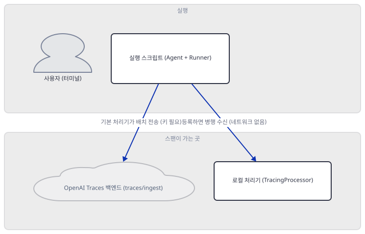
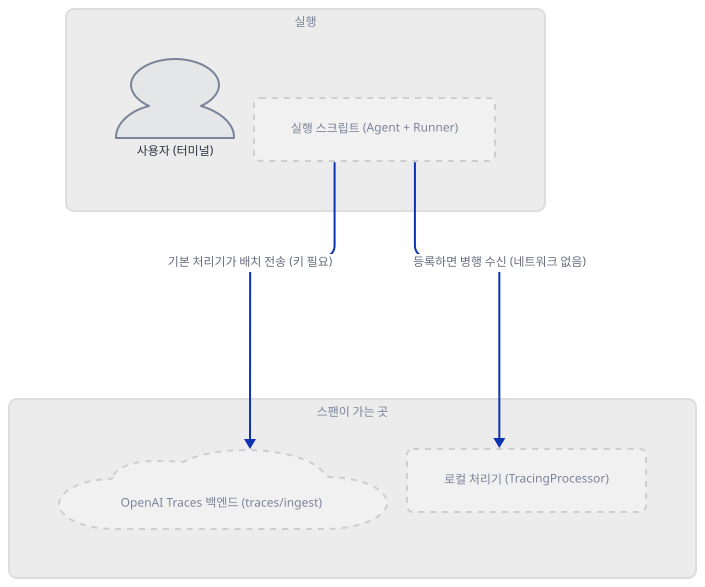
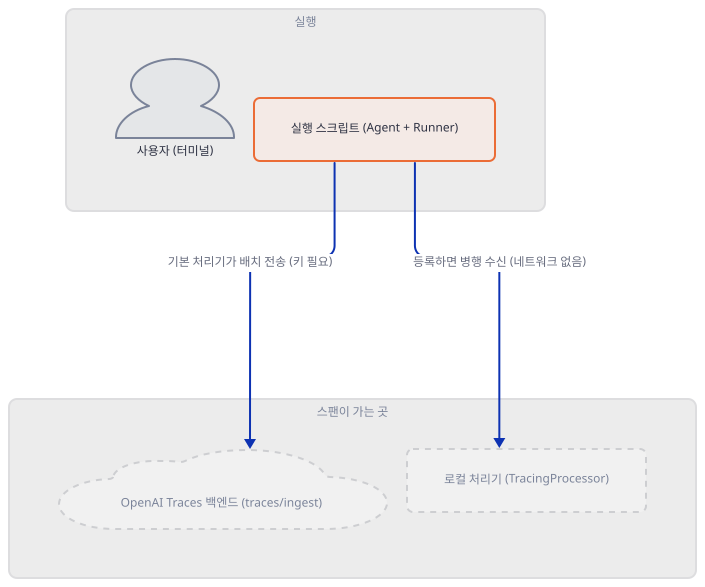
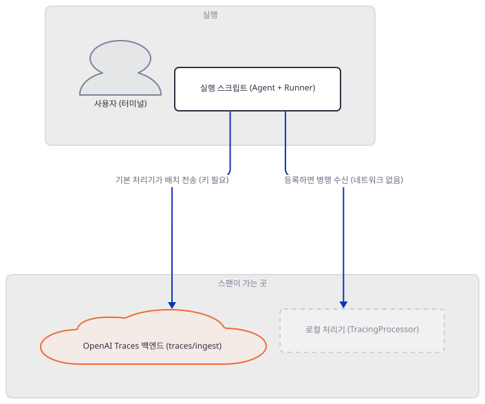
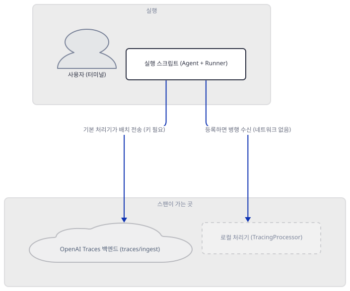
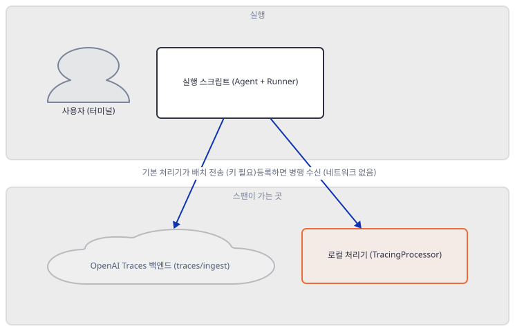
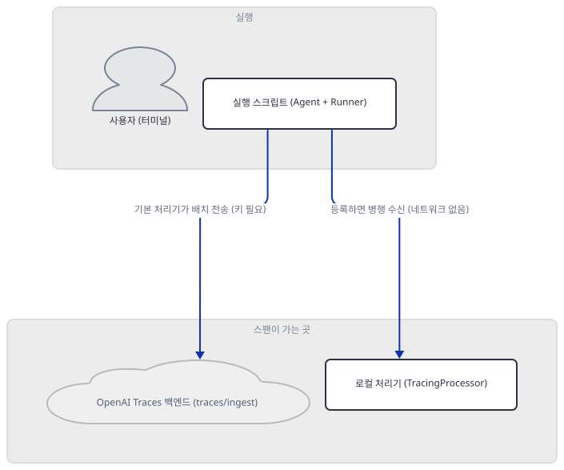
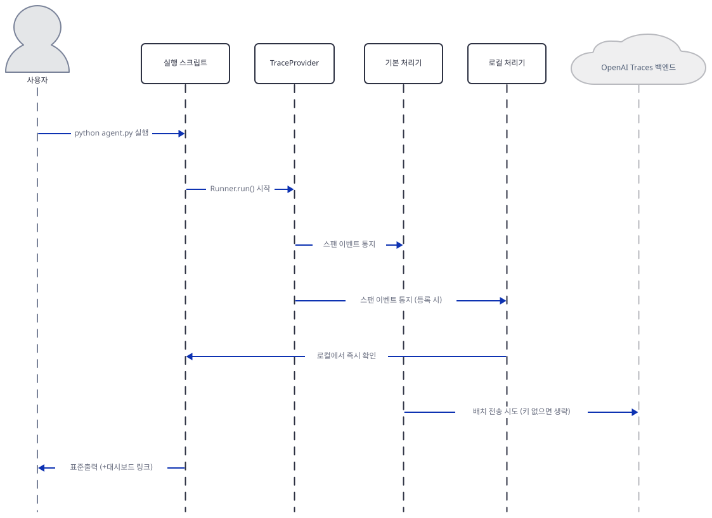

# Day 033 · OpenAI Agents SDK Crash Course · 10_tracing_observability

> 볼륨 2 🧑‍🏫 Crash Courses · 난이도 ★★☆ · 예상 소요 100분(실제 스팬 트리를 로컬 처리기로 캡처하고, 레슨이 쓰는 API 두 개가 실재하지 않는다는 것까지 소스와 직접 실행으로 확인하느라 다른 크래시 코스 날보다 깁니다) · API 비용 $0 (API 키 없이 진행 — 실제 OpenAI 모델 호출은 하지 않고, 트레이스도 어디로도 전송하지 않습니다) · 원본 앱: `ai_agent_framework_crash_course/openai_sdk_crash_course/10_tracing_observability`

## 오늘 만들 것

Day 032가 여러 에이전트를 오케스트레이션하는 법을 다뤘다면, 오늘의 `10_tracing_observability`는 그 실행을 "들여다보는" 법을 다룹니다 — `Runner.run()` 한 번이 내부적으로 무엇을 했는지 굳이 `print`를 넣지 않아도 SDK가 스스로 기록해 둔다는 뜻의 **트레이싱**입니다. 같은 필요를 이 시리즈는 이미 두 번 풀어 봤습니다. Day 019의 콜백은 `before_agent_callback`처럼 개별 `LlmAgent` 하나에 등록하는 여섯 개의 후크였고, Day 020의 플러그인은 `Runner(plugins=[...])`에 한 번만 등록해 그 아래 모든 에이전트·도구·모델 호출에 전역으로 적용되는, 15개 후크를 가진 더 넓은 메커니즘이었습니다. 오늘의 트레이싱은 그 계보의 세 번째 답이지만 앞의 둘과 결정적으로 다릅니다 — **등록할 것이 아예 없습니다.** `Agent`를 만들고 `Runner.run()`을 부르는 순간, 콜백도 플러그인도 심지 않았는데 trace 하나와 그 안의 span들이 이미 만들어져 있습니다. 콜백·플러그인이 "훅을 심어야 관찰된다"는 옵트인이라면, 트레이싱은 "심지 않아도 이미 관찰되고 있다"는 옵트아웃입니다 — 그리고 그 관찰 결과는 기본적으로 이 컴퓨터를 떠나 OpenAI의 서버로 전송됩니다.

이 레슨은 `default_tracing.py`(132줄)·`custom_tracing.py`(188줄) 두 최상위 스크립트와, 같은 개념을 가르치는 `10_1_default_tracing/`·`10_2_custom_tracing/` 두 하위 레슨으로 구성됩니다. Day 025·027·030이 각각 찾은 "최상위 스크립트는 하위 레슨의 상위집합이 아니라 병렬 재구현"이라는 패턴이 이번에도 반복되는지 `diff`로 확인해 보면, 이번엔 그보다 더 단순합니다 — 재구현조차 아니고 바이트 단위로 완전히 같은 복제본입니다(Step 1). 레슨 자신의 최상위 README도 이번에 다시 실제와 어긋나는 곳이 있습니다(Day 019·022·023·026·027에 이어) — 존재하지 않는 파일 두 개를 프로젝트 구조에 나열하고, 자기 폴더 번호와 다른 번호로 스스로를 소개합니다. 이 문서는 그런 주장들과, 레슨 코드가 실제로 쓰는 두 API(`result.run_id`, `span.add_event()`)가 설치된 SDK에 정말 있는지를 소스와 직접 실행으로 하나씩 확인합니다. 키 없이 시도할 수 있는 것이 거의 없었던 앞선 레슨들과 달리, 트레이싱은 이 볼륨에서 유일하게 API 키 없이도 SDK 내부를 "진짜로" 들여다볼 수 있는 주제입니다 — 커스텀 트레이스 처리기를 등록하면 스팬이 로컬로 그대로 들어오기 때문입니다. 완성 아키텍처는 다음과 같습니다.



## 사전 준비

| 서비스/도구 | 용도 | 발급·설치 |
|---|---|---|
| OpenAI API 키 (`OPENAI_API_KEY`) | 두 스크립트 모두 결국 `Runner.run()`으로 모델을 호출하려 시도하고, 기본 트레이스 전송기도 같은 키를 씀. 이 문서는 키를 발급하지 않고, 키가 없을 때 전송이 어디서 멈추는지만 확인합니다 | https://platform.openai.com/api-keys 에서 발급 (이 실습에서는 생략) |
| uv | 가상환경 생성과 패키지 설치 | [공통 사전 준비](../README.md#공통-사전-준비-한-번만) 참고 |
| 인터넷 연결 | PyPI에서 `openai-agents` 설치. 트레이스를 실제로 전송하는 시도는 이 문서 어디에서도 하지 않습니다 | 별도 설치 없음 |

## 아키텍처 한눈에 보기

| 컴포넌트 | 역할 | 코드 위치 |
|---|---|---|
| 사용자 (터미널) | 스크립트를 직접 실행 | 코드 없음 (외부) |
| 실행 스크립트 (Agent + Runner) | 에이전트를 정의하고 `Runner.run()`으로 실행 — 이 호출 자체가 trace·span을 자동으로 만듦 | `ai_agent_framework_crash_course/openai_sdk_crash_course/10_tracing_observability/10_1_default_tracing/agent.py:1-12` |
| OpenAI Traces 백엔드 (traces/ingest) | 기본 처리기(`BatchTraceProcessor`)가 배치로 보내는 목적지. 키가 없으면 전송을 건너뜀 | 코드 없음 (외부 서비스 — openai-agents 0.22.3의 `agents/tracing/processors.py`, 소스로 확인) |
| 로컬 처리기 (TracingProcessor) | 이 문서가 Step 5·6에서 직접 구성해 등록하는, 네트워크 없이 스팬을 그대로 받는 처리기 | 코드 없음 (리포에는 없음 — Step 5의 확인 스크립트에서 직접 구성) |

## 단계별 진행

### Step 1. 환경 만들기 — 의존성, 복제본, 그리고 레슨 자신의 문서 오류

**목적.** 이 레슨의 유일한 의존성 파일을 설치하고, 두 최상위 스크립트가 정말 하위 레슨의 `agent.py`와 바이트 단위로 같은 복제본인지, 레슨 자신의 최상위 README가 그리는 파일 구성과 번호가 실제와 맞는지 확인합니다.

**할 일.**

```bash
cd ai_agent_framework_crash_course/openai_sdk_crash_course/10_tracing_observability
uv venv
uv pip install -r requirements.txt
```

(pip 대안: `python -m venv .venv && source .venv/bin/activate && pip install -r requirements.txt`. Windows PowerShell은 활성화만 `.venv\Scripts\Activate.ps1`로 바꿉니다.)

이 저장소는 루트에 `pyproject.toml`이 있어 `uv run`이 방금 만든 환경 대신 루트의 `.venv`를 쓰고, 그 루트 환경에는 `openai-agents`와 무관한 **TensorFlow Agents**가 같은 이름 `agents`로 이미 설치돼 있어 엉뚱한 오류로 이어집니다(Day 025·026에서 확인) — 그래서 이후 `uv run` 명령에는 모두 `--no-project`를 붙입니다. [공통 사전 준비](../README.md#공통-사전-준비-한-번만)가 정리했듯 `--no-project`만으로는 충분하지 않습니다 — 이 플래그는 "이 폴더를 프로젝트로 취급하지 말라"는 뜻일 뿐이라 이 폴더에 `.venv`가 없으면 uv는 상위로 올라가 결국 루트 환경을 집습니다. 위 `uv venv`를 건너뛰지 않는 것 자체가 이 함정을 피하는 방법입니다.

`ai_agent_framework_crash_course/openai_sdk_crash_course/10_tracing_observability/requirements.txt:1-3`

```text
openai-agents>=0.2.0
streamlit>=1.28.0
python-dotenv>=1.0.0
```

패키지 이름 `openai-agents`와 실제 임포트 이름 `agents`가 다르다는 것, 키는 `OPENAI_API_KEY`, 모델은 `gpt-4o-mini`/`gpt-4o`라는 것은 Day 024가 이미 정리했으므로 여기서는 되풀이하지 않습니다. 이 레슨의 `env.example`(점 없음)은 세 곳(최상위, `10_1_default_tracing/`, `10_2_custom_tracing/`) 모두 바이트 단위로 같습니다(직접 확인, `diff` 세 쌍 모두 종료 코드 0) — Day 024가 본 두 템플릿의 플레이스홀더 불일치가 이 레슨에는 없습니다.

`ai_agent_framework_crash_course/openai_sdk_crash_course/10_tracing_observability/env.example:1`

```text
OPENAI_API_KEY=your_openai_api_key_here
```

이 레슨은 최상위에 `default_tracing.py`·`custom_tracing.py` 두 스크립트를 두고, 같은 개념을 `10_1_default_tracing/agent.py`·`10_2_custom_tracing/agent.py`로도 나란히 둡니다. Day 025·027·030은 이런 쌍마다 "최상위가 하위 레슨의 상위집합이 아니라 병렬 재구현"이라는 패턴을 찾았는데, 이번엔 재구현조차 아닙니다 — 네 파일을 `diff`로 맞대 보면 두 쌍 모두 종료 코드 0, 즉 바이트 단위로 완전히 같은 복제본입니다(아래 확인). 이 문서는 하위 레슨 쪽(`10_1_default_tracing/agent.py`, `10_2_custom_tracing/agent.py`)을 인용 대상으로 삼습니다 — 각자 짝이 되는 레슨 README가 있어서입니다.

레슨 자신의 최상위 README도 점검할 값이 있습니다. 프로젝트 구조는 이렇게 적혀 있습니다.

`ai_agent_framework_crash_course/openai_sdk_crash_course/10_tracing_observability/README.md:73-80`

```text
8_tracing_observability/
├── README.md                    # This file - concept explanation
├── requirements.txt             # Dependencies  
├── default_tracing.py           # Built-in tracing basics (35 lines)
├── custom_tracing.py            # Custom traces and spans (45 lines)
├── advanced_observability.py    # Production tracing patterns (40 lines)
├── app.py                      # Streamlit tracing dashboard (optional)
└── env.example                 # Environment variables template
```

`advanced_observability.py`와 `app.py`는 이 폴더는 물론 리포 전체 어디에도 없습니다(아래 확인, `find` 결과 0건) — Day 020이 찾은 존재하지 않는 `plugin_example.py`와 같은 종류의 오류입니다. 나열된 줄 수(`default_tracing.py` 35줄, `custom_tracing.py` 45줄)도 실제 132줄·188줄과 다릅니다. 최상위 폴더 이름 자체도 `8_tracing_observability/`라고 적혀 있지만 실제 폴더는 `10_tracing_observability`입니다 — 레슨 자신의 제목도 `Tutorial 8: Tracing & Observability`로 시작해 같은 번호를 자기소개에 씁니다. 이 어긋남은 "다음 단계" 안내(`ai_agent_framework_crash_course/openai_sdk_crash_course/10_tracing_observability/README.md:191-194`)에도 이어집니다 — `Tutorial 9: Handoffs & Delegation`이라는 이름으로 `8_handoffs_delegation/README.md`를, `Tutorial 10: Multi-Agent Orchestration`이라는 이름으로 `9_multi_agent_orchestration/README.md`를, `Tutorial 11: Production Patterns`라는 이름으로 `11_voice/README.md`를 가리킵니다. 링크 대상 폴더 자체는 실제로 존재하지만, 이 볼륨의 실제 순서(Day 031·032가 이미 다룬 `8_handoffs_delegation`·`9_multi_agent_orchestration`, 그다음이 오늘의 `10_tracing_observability`)를 기준으로 보면 이 두 레슨은 "다음"이 아니라 이미 지나온 레슨입니다. `11_voice`의 설명("Production Patterns")도 그 폴더의 실제 제목("🎙️ Tutorial 11: Voice Agents")과 다릅니다(직접 확인). 자기 번호 하나를 잘못 매기면서 앞뒤 레슨과의 관계 전체가 함께 틀어진 경우입니다.



**확인.**

```bash
uv run --no-project python -c "
import importlib.metadata as md
print('openai-agents', md.version('openai-agents'))
print('streamlit', md.version('streamlit'))
print('python-dotenv', md.version('python-dotenv'))
"
```

```powershell
uv run --no-project python -c "<위와 같은 코드>"
```

```
openai-agents 0.22.3
streamlit 1.64.0
python-dotenv 1.2.3
```

(직접 확인 — `uv venv --python 3.12`로 만든 throwaway 가상환경 기준 Python 3.12.10이며, 시스템 기본 Python은 3.13.12였습니다. 설치 자체는 `Resolved 59 packages` · `Installed 59 packages`였습니다 — 정확한 소요 시간은 실행마다 다릅니다.)

```bash
diff default_tracing.py 10_1_default_tracing/agent.py; echo "exit=$?"
diff custom_tracing.py 10_2_custom_tracing/agent.py; echo "exit=$?"
```

```powershell
Compare-Object (Get-Content default_tracing.py) (Get-Content 10_1_default_tracing/agent.py)
Compare-Object (Get-Content custom_tracing.py) (Get-Content 10_2_custom_tracing/agent.py)
```

```
exit=0
exit=0
```

(직접 확인 — `diff`가 아무것도 출력하지 않고 종료 코드 0을 돌려주면 두 파일이 완전히 같다는 뜻입니다. PowerShell의 `Compare-Object`도 차이가 없으면 아무것도 출력하지 않습니다 — 같은 규칙입니다.)

```bash
find . -iname "advanced_observability.py" -o -iname "app.py" | wc -l
```

```powershell
(Get-ChildItem -Recurse -Include advanced_observability.py,app.py).Count
```

```
0
```

(직접 확인.)

### Step 2. 기본 동작 — 아무 설정 없이도 트레이싱은 이미 켜져 있다

**목적.** `Agent`를 만들고 `Runner.run()`을 부르기 전에, `trace()`·`custom_span()`을 그냥 호출하면 실제로 무엇이 만들어지는지 — 로그를 남기는 진짜 객체인지, 아무 일도 하지 않는 객체인지 — 를 직접 확인합니다.

**할 일.** 하위 레슨의 에이전트 정의는 평범합니다.

`ai_agent_framework_crash_course/openai_sdk_crash_course/10_tracing_observability/10_1_default_tracing/agent.py:1-12`

```python
from agents import Agent, Runner
import asyncio

# Create agent for tracing demonstrations
root_agent = Agent(
    name="Tracing Demo Agent",
    instructions="""
    You are a helpful assistant demonstrating tracing capabilities.
    
    Respond concisely but perform actions that generate interesting trace data.
    """
)
```

`model=`을 지정하지 않는다는 것은 Day 024가 이미 정리한 대로입니다. 레슨 최상위 README의 "Important Notes"는 이렇게 주장합니다.

`ai_agent_framework_crash_course/openai_sdk_crash_course/10_tracing_observability/README.md:184-187`

```text
- **Enabled by Default**: Tracing is automatically enabled
- **Zero Data Retention**: Tracing unavailable for ZDR policy organizations
- **Free Dashboard**: View traces at OpenAI Traces dashboard
- **Disable if Needed**: Set `OPENAI_AGENTS_DISABLE_TRACING=1` to disable
```

앞서 본 프로젝트 구조·번호 오류와 달리 이 네 줄은 소스로 확인하면 맞습니다(ZDR 조직에서의 동작은 그런 조직 계정이 없어 이 문서가 독립적으로 확인하지는 못했습니다). openai-agents 0.22.3의 `agents/tracing/provider.py`가 정의하는 `DefaultTraceProvider`를 보면(소스로 확인) 트레이싱이 켜져 있는지는 전역 상태 하나로 결정되고, 아무것도 설정하지 않으면 `trace()`는 실제로 기록하는 `TraceImpl`을, `custom_span()`은 실제로 기록하는 `SpanImpl`을 돌려줍니다 — 끄면(Step 4) 같은 호출이 아무 일도 하지 않는 `NoOpTrace`/`NoOpSpan`으로 바뀝니다.



**확인.**

```bash
uv run --no-project python -c "
from agents import trace, custom_span
with trace('t') as t:
    with custom_span('probe') as s:
        print('trace class:', type(t).__name__, '/ span class:', type(s).__name__)
"
```

```powershell
uv run --no-project python -c "<위와 같은 코드>"
```

```
trace class: TraceImpl / span class: SpanImpl
```

(직접 확인 — 새로 시작한 프로세스 기준입니다. Step 4에서 같은 확인을 끈 상태로 반복합니다.)

### Step 3. 기본 전송 대상과 그 안에 담기는 것 — 프라이버시에 관계된 기본값

**목적.** 기본 처리기가 스팬을 실제로 어디로 보내는지, 그 안에 무엇이 들어가는지, 키가 없으면 무슨 일이 일어나는지를 소스와 직접 실행으로 확인합니다.

**할 일.** openai-agents 0.22.3의 `agents/tracing/processors.py`가 정의하는 `BackendSpanExporter`를 보면(소스로 확인) 목적지는 상수 하나로 고정돼 있습니다 — `https://api.openai.com/v1/traces/ingest`. 이 전송기는 `BatchTraceProcessor`에 감싸여 5초 간격(또는 큐가 일정 비율 찰 때)으로 백그라운드 스레드에서 배치 전송을 시도합니다. 보내는 내용은 `trace.export()`/`span.export()`가 만드는 JSON 전체이고, `GenerationSpanData.export()`를 보면(소스로 확인, `agents/tracing/span_data.py`) `input`·`output`·`model`·`usage`가 그대로 포함됩니다.

이걸 실을지 뺄지를 가르는 플래그가 `RunConfig.trace_include_sensitive_data`(`agents/run_config.py`, 소스로 확인)이고, 기본값은 환경변수 `OPENAI_AGENTS_TRACE_INCLUDE_SENSITIVE_DATA`가 없으면 `True`입니다 — **기본값은 "다 보낸다"**입니다. 프롬프트 전문과 모델 응답 전문, 도구 호출의 인자와 결과가 모두 이 기본값 아래 트레이스에 실립니다. 이 플래그는 SDK 전역에서 스팬을 만들 때마다 확인됩니다(소스로 확인 — `agents/run_internal/`, `agents/tool.py`, `agents/voice/` 등 스무 곳 넘게). 참고로 `OPENAI_AGENTS_DONT_LOG_MODEL_DATA`/`OPENAI_AGENTS_DONT_LOG_TOOL_DATA`라는 별개의 환경변수도 있는데(`agents/_debug.py`, 소스로 확인) 이건 트레이스 전송이 아니라 파이썬 `logging` 콘솔 출력만 가리는 스위치이고 기본값은 "가린다"입니다 — 콘솔에 안 보인다고 트레이스에도 안 실렸다는 뜻은 아닙니다.

키가 없으면 무슨 일이 일어나는지는 같은 파일의 `_export_with_deadline`이 답합니다(소스로 확인) — API 키가 끝내 없으면 HTTP 요청 자체를 만들지 않고 `logger.warning("OPENAI_API_KEY is not set, skipping trace export")`만 남긴 채 조용히 건너뜁니다.



**확인.** 먼저 목적지와 기본값 자체입니다.

```bash
uv run --no-project python -c "
from agents.tracing.processors import BackendSpanExporter
from agents.run_config import _default_trace_include_sensitive_data
print('endpoint:', BackendSpanExporter._OPENAI_TRACING_INGEST_ENDPOINT)
print('trace_include_sensitive_data default:', _default_trace_include_sensitive_data())
"
```

```powershell
uv run --no-project python -c "<위와 같은 코드>"
```

```
endpoint: https://api.openai.com/v1/traces/ingest
trace_include_sensitive_data default: True
```

(직접 확인.) 다음은 키 없이 실제로 트레이스를 하나 만들어 강제로 내보내 본 것입니다 — `flush_traces()`는 큐를 기다리지 않고 그 자리에서 동기적으로 전송을 시도합니다.

```bash
uv run --no-project python -c "
from agents import trace, flush_traces
with trace('isolated probe'):
    pass
flush_traces()
"
```

```powershell
uv run --no-project python -c "<위와 같은 코드>"
```

```
OPENAI_API_KEY is not set, skipping trace export
```

(직접 확인 — 이 경고 한 줄 말고는 아무것도 출력되지 않고, HTTP 요청은 시도조차 되지 않습니다. Day 029가 같은 문구를 다른 확인에서 봤을 때는 표준출력과 뒤섞여 순서가 실행마다 달랐지만, 여기서는 이 문장이 유일한 출력이라 순서 문제가 없습니다.)

### Step 4. 끄는 세 가지 방법 — 범위가 서로 다르다

**목적.** 트레이싱을 끄는 세 가지 방법 — 환경변수, 전역 함수, 실행 단위 옵션 — 이 서로 다른 범위를 가진다는 것을 직접 확인합니다.

**할 일.** 레슨 자신의 코드도 그중 하나를 씁니다.

`ai_agent_framework_crash_course/openai_sdk_crash_course/10_tracing_observability/10_1_default_tracing/agent.py:88-116`

```python
# Example 4: Tracing configuration options
async def tracing_configuration():
    """Shows how to configure tracing behavior"""
    
    print("\n=== Tracing Configuration ===")
    
    # Example of disabling tracing for specific run
    from agents.run import RunConfig
    
    print("Running with tracing disabled...")
    result_no_trace = await Runner.run(
        root_agent,
        "This run won't be traced.",
        run_config=RunConfig(tracing_disabled=True)
    )
    
    print(f"Run completed without tracing: {result_no_trace.run_id}")
    print("(This run won't appear in traces dashboard)")
    
    print("\nRunning with normal tracing...")
    result_with_trace = await Runner.run(
        root_agent,
        "This run will be traced normally."
    )
    
    print(f"Run completed with tracing: {result_with_trace.run_id}")
    print("(This run will appear in traces dashboard)")
    
    return result_no_trace, result_with_trace
```

`from agents.run import RunConfig`와 `RunConfig(tracing_disabled=True)`는 실제로 맞는 API입니다(소스로 확인, `agents/run_config.py`가 정의하는 `RunConfig.tracing_disabled` 필드 — `agents/run.py`가 이 클래스를 그대로 재수출합니다) — 이 함수가 겪는 진짜 문제는 다른 데 있습니다(Step 5). 이 `RunConfig` 옵션은 **그 실행 한 번만** 트레이싱을 끕니다. 이보다 넓은 범위 둘이 더 있습니다 — 환경변수 `OPENAI_AGENTS_DISABLE_TRACING=1`(레슨 README도 맞게 언급한 값, Step 2에서 인용)은 **프로세스 전체**를, 함수 `set_tracing_disabled(True)`(`from agents import set_tracing_disabled`)도 **프로세스 전체**를 끕니다. 세 방법 모두 같은 결과(`NoOpTrace`/`NoOpSpan`)로 이어지지만 범위가 다릅니다.



**확인.** 환경변수는 프로세스가 이미 시작된 뒤에는 소용없으므로(값은 첫 트레이스 생성 시점에 한 번만 읽혀 캐시됩니다, 소스로 확인 — `agents/tracing/provider.py`의 `_refresh_disabled_flag`) 새 프로세스로 확인합니다.

```bash
OPENAI_AGENTS_DISABLE_TRACING=1 uv run --no-project python -c "
from agents import trace, custom_span
with trace('t') as t:
    with custom_span('probe') as s:
        print('trace class:', type(t).__name__, '/ span class:', type(s).__name__)
"
```

```powershell
$env:OPENAI_AGENTS_DISABLE_TRACING="1"; uv run --no-project python -c "<위와 같은 코드>"
```

```
trace class: NoOpTrace / span class: NoOpSpan
```

(직접 확인 — Step 2와 똑같은 코드인데 결과만 바뀌었습니다.) 이제 전역 함수와 실행 단위 옵션의 범위 차이를 한 프로세스 안에서 봅니다. 실제 모델 호출 없이 확인하기 위해 Day 029가 쓴 SDK 공식 오프라인 테스트 더블 `agents.testing.ScriptedModel`을 다시 씁니다.

```bash
uv run --no-project python -c "
import asyncio
from agents import Agent, Runner, trace, set_tracing_disabled, set_trace_processors
from agents.run import RunConfig
from agents.tracing import TracingProcessor
from agents.testing import ScriptedModel, assistant_message

class Counter(TracingProcessor):
    def __init__(self):
        self.starts = 0
    def on_trace_start(self, tr):
        self.starts += 1
    def on_trace_end(self, tr):
        pass
    def on_span_start(self, sp):
        pass
    def on_span_end(self, sp):
        pass
    def shutdown(self):
        pass
    def force_flush(self):
        pass

counter = Counter()
set_trace_processors([counter])

with trace('probe') as t:
    print('default trace() type:', type(t).__name__, '/ on_trace_start so far:', counter.starts)

set_tracing_disabled(True)
with trace('probe') as t:
    print('after set_tracing_disabled(True):', type(t).__name__, '/ on_trace_start so far:', counter.starts)
set_tracing_disabled(False)

agent = Agent(name='x', instructions='y').clone(model=ScriptedModel([[assistant_message('hi')]], emit_traces=True))

async def main():
    await Runner.run(agent, 'hello', run_config=RunConfig(tracing_disabled=True))

asyncio.run(main())
print('after RunConfig(tracing_disabled=True) run: on_trace_start so far:', counter.starts)
"
```

```powershell
uv run --no-project python -c "<위와 같은 코드>"
```

```
default trace() type: TraceImpl / on_trace_start so far: 1
after set_tracing_disabled(True): NoOpTrace / on_trace_start so far: 1
after RunConfig(tracing_disabled=True) run: on_trace_start so far: 1
```

(직접 확인 — `set_trace_processors([counter])`로 기본 전송기를 완전히 교체했으므로 이 확인은 네트워크를 전혀 쓰지 않습니다. `on_trace_start` 누적 횟수가 끝까지 1에서 멈춘다는 것이 핵심입니다 — 맨 처음의 평범한 `with trace(...)` 한 번만 진짜로 기록됐고, 전역으로 끈 뒤의 `trace()`도, 실행 단위로 끈 `Runner.run()`도 카운터를 늘리지 못했습니다.)

### Step 5. 로컬 처리기로 실제 스팬 구조 들여다보기 — 그리고 `run_id`는 없다

**목적.** 커스텀 `TracingProcessor`를 등록해 스팬을 네트워크 없이 로컬에서 그대로 받아 보고, 레슨이 여섯 번 반복해서 쓰는 `result.run_id`가 설치된 SDK에 실재하는지 확인합니다.

**할 일.** `basic_automatic_tracing()`은 이렇게 되어 있습니다.

`ai_agent_framework_crash_course/openai_sdk_crash_course/10_tracing_observability/10_1_default_tracing/agent.py:14-32`

```python
# Example 1: Basic automatic tracing
async def basic_automatic_tracing():
    """Demonstrates default tracing that happens automatically"""
    
    print("=== Basic Automatic Tracing ===")
    print("Tracing is enabled by default - no setup required!")
    print("View traces at: https://platform.openai.com/traces")
    
    # Single agent run - creates one trace automatically
    result = await Runner.run(
        root_agent,
        "Explain what tracing means in software development."
    )
    
    print(f"Response: {result.final_output}")
    print(f"Trace ID: {result.run_id}")  # Each run gets a unique ID
    print("Check the OpenAI Traces dashboard to see this execution!")
    
    return result
```

`result.run_id`는 이 파일 안에서만 여섯 번(14~32행, 34~57행, 59~86행, 88~116행에 걸쳐) 나옵니다. openai-agents 0.22.3의 `agents/result.py`가 정의하는 `RunResultBase`/`RunResult`를 보면(소스로 확인) `input`·`new_items`·`raw_responses`·`final_output`·`context_wrapper`·`last_response_id` 같은 필드는 있어도 `run_id`는 어디에도 없습니다. 트레이스 ID를 얻는 문서화된 방법은 `10_2_custom_tracing/agent.py`가 쓰는 쪽입니다 — 실행을 `with trace(...) as t:`로 직접 감싸고 그 `t.trace_id`를 읽는 것입니다.

`ai_agent_framework_crash_course/openai_sdk_crash_course/10_tracing_observability/10_2_custom_tracing/agent.py:15-49`

```python
# Example 1: Custom trace for multi-step workflow
async def multi_step_workflow_trace():
    """Demonstrates grouping multiple agent runs in a single trace"""
    
    print("=== Multi-Step Workflow Trace ===")
    
    # Create custom trace that groups multiple operations
    with trace("Research and Analysis Workflow") as workflow_trace:
        print("Starting research phase...")
        
        # Step 1: Research
        research_result = await Runner.run(
            research_agent,
            "What are the key benefits of artificial intelligence in healthcare?"
        )
        print(f"Research complete: {len(research_result.final_output)} characters")
        
        # Step 2: Analysis  
        analysis_result = await Runner.run(
            analysis_agent,
            f"Analyze this research and identify the top 3 benefits: {research_result.final_output}"
        )
        print(f"Analysis complete: {len(analysis_result.final_output)} characters")
        
        # Step 3: Summary
        summary_result = await Runner.run(
            analysis_agent,
            f"Create a brief executive summary of these findings: {analysis_result.final_output}"
        )
        print(f"Summary complete: {len(summary_result.final_output)} characters")
    
    print(f"Workflow trace created: {workflow_trace.trace_id}")
    print("All three agent runs are grouped in a single trace!")
    
    return research_result, analysis_result, summary_result
```

`workflow_trace.trace_id`(46행)는 실재하는 속성입니다 — `10_1`이 틀린 자리에서 `10_2`는 맞습니다. 아래 확인은 이 사실과 함께, 트레이스 하나 안의 스팬들이 실제로 어떻게 중첩되는지까지 리포의 진짜 `root_agent`로 직접 봅니다. `ScriptedModel`을 `emit_traces=True`로 만들면 실제 네트워크 호출 없이도 진짜 `generation` 스팬까지 만들어집니다(소스로 확인, `agents/testing/model.py`) — `set_trace_processors`로 기본 전송기를 우리 처리기로 완전히 교체했으므로 이 실행도 네트워크를 전혀 쓰지 않습니다.



**확인.** `10_1_default_tracing` 폴더 안에서, 그 폴더의 실제 `root_agent`를 그대로 가져와 모델만 `ScriptedModel`로 바꿔 낍니다 — 리포의 파일은 고치지 않습니다.

```bash
cd 10_1_default_tracing
uv run --no-project python -c "
import asyncio
import agent as m
from agents import Runner, trace, set_trace_processors
from agents.tracing import TracingProcessor
from agents.testing import ScriptedModel, assistant_message

class LocalCapture(TracingProcessor):
    def __init__(self):
        self.label = {}
        self.n = 0
        self.log = []
    def _id(self, span_id):
        if span_id not in self.label:
            self.n += 1
            self.label[span_id] = f'span#{self.n}'
        return self.label[span_id]
    def on_trace_start(self, tr):
        self.log.append(f'trace_start {tr.trace_id}')
    def on_trace_end(self, tr):
        self.log.append(f'trace_end   {tr.trace_id}')
    def on_span_start(self, sp):
        parent = self._id(sp.parent_id) if sp.parent_id else 'trace(root)'
        self.log.append(f'span_start  {self._id(sp.span_id)}  parent={parent}  type={sp.span_data.type}')
    def on_span_end(self, sp):
        self.log.append(f'span_end    {self._id(sp.span_id)}  type={sp.span_data.type}')
    def shutdown(self):
        pass
    def force_flush(self):
        pass

capture = LocalCapture()
set_trace_processors([capture])  # 기본 전송기를 교체 -- 이 실행은 네트워크를 전혀 쓰지 않음

scripted_root_agent = m.root_agent.clone(
    model=ScriptedModel(
        [[assistant_message('Tracing turns invisible execution into inspectable spans.')]],
        emit_traces=True,
    )
)

async def main():
    with trace('Tracing Probe Workflow') as workflow_trace:
        result = await Runner.run(scripted_root_agent, 'Explain what tracing means.')
    return result, workflow_trace

result, workflow_trace = asyncio.run(main())

print('final_output:', result.final_output)
try:
    print('result.run_id:', result.run_id)
except AttributeError as e:
    print('AttributeError:', e)
print('workflow_trace.trace_id:', workflow_trace.trace_id)
print('--- captured locally by our own processor, zero network calls ---')
for line in capture.log:
    print(line)
"
```

```powershell
cd 10_1_default_tracing
uv run --no-project python -c "<위와 같은 코드>"
```

```
final_output: Tracing turns invisible execution into inspectable spans.
AttributeError: 'RunResult' object has no attribute 'run_id'
workflow_trace.trace_id: trace_1f01350528e4479cae1b5d29edb06d8b
--- captured locally by our own processor, zero network calls ---
trace_start trace_1f01350528e4479cae1b5d29edb06d8b
span_start  span#1  parent=trace(root)  type=task
span_start  span#2  parent=span#1  type=agent
span_start  span#3  parent=span#2  type=turn
span_start  span#4  parent=span#3  type=generation
span_end    span#4  type=generation
span_end    span#3  type=turn
span_end    span#2  type=agent
span_end    span#1  type=task
trace_end   trace_1f01350528e4479cae1b5d29edb06d8b
```

(직접 확인 — `trace_...` 값은 실행마다 다릅니다. 진짜 `root_agent`를 가져와 모델만 바꿨을 뿐이라 `AttributeError`도, 스팬 중첩도 리포 코드가 실제로 만드는 그대로입니다. 이 레슨 최상위 README의 ASCII 다이어그램은 트레이스 하나 아래 LLM 호출·도구 호출·핸드오프 스팬이 나란히 걸리는 평평한 그림을 그리지만, 실제로는 `task → agent → turn → generation`으로 네 겹 중첩됩니다 — `turn`은 한 번의 모델 왕복을, `task`는 `Runner.run()` 호출 전체를 감싸는 가장 바깥 단위입니다.)

### Step 6. 커스텀 트레이스 API를 실제로 써보면 — `add_event`는 없다

**목적.** `custom_tracing.py`(및 `10_2_custom_tracing/agent.py`)가 반복해서 쓰는 `span.add_event()`/`trace.add_event()`가 설치된 SDK에 실재하는지 확인하고, 실재하는 방법으로 고쳐 봅니다.

**할 일.**

`ai_agent_framework_crash_course/openai_sdk_crash_course/10_tracing_observability/10_2_custom_tracing/agent.py:57-65`

```python
    with trace("Document Processing Workflow") as doc_trace:
        
        # Custom span for data preparation
        with custom_span("Data Preparation") as prep_span:
            print("Preparing data...")
            # Simulate data processing
            await asyncio.sleep(0.1)
            prep_span.add_event("Data loaded", {"records": 100})
            prep_span.add_event("Data validated", {"errors": 0})
```

openai-agents 0.22.3의 `agents/tracing/spans.py`·`agents/tracing/traces.py`가 정의하는 `Span`·`Trace`를 보면(소스로 확인) 두 클래스 모두 `start`·`finish`·`set_error`·`export` 같은 메서드는 있어도 `add_event`는 없습니다 — `SpanImpl`·`TraceImpl`·`NoOpSpan`·`NoOpTrace` 네 구현 전부 마찬가지입니다. `custom_spans_demo()`(위 발췌를 포함하는 함수)뿐 아니라 `hierarchical_spans()`·`trace_metadata_demo()`도 같은 메서드를 씁니다 — `main()`이 이 네 함수를 차례로 호출하며 중간에 `try/except`가 없으므로(직접 확인, 전체 파일 검토), 키가 있어 첫 함수(`multi_step_workflow_trace()`, `add_event`를 쓰지 않음)가 성공해도 두 번째 함수에서 전체가 멈춥니다.

이 버그는 실제 모델 호출을 하기도 전에 일어납니다 — `prep_span.add_event(...)`는 `Runner.run()`을 부르기 전에 이미 실행되는 줄입니다. 그래서 리포의 실제 함수를 고치지 않고 그대로 불러도 키 없이 재현됩니다.



**확인.** `10_2_custom_tracing` 폴더 안에서, 실제 모듈의 실제 함수를 그대로 호출합니다.

```bash
cd 10_2_custom_tracing
uv run --no-project python -c "
import asyncio
import agent as m
try:
    asyncio.run(m.custom_spans_demo())
except AttributeError as e:
    print('AttributeError:', e)
"
```

```powershell
cd 10_2_custom_tracing
uv run --no-project python -c "<위와 같은 코드>"
```

```
=== Custom Spans Demo ===
Preparing data...
AttributeError: 'SpanImpl' object has no attribute 'add_event'
```

(직접 확인 — `OPENAI_API_KEY is not set, skipping trace export` 경고도 함께 찍히지만 표준출력·표준에러 버퍼링 순서에 따라 위치가 실행마다 달라(Day 029에서 같은 현상 확인) 발췌에서 뺐습니다. 중요한 것은 `Preparing data...` 다음 줄에서 바로 죽는다는 것 — `Runner.run()`이 한 번도 불리기 전입니다.)

올바른 방법은 `Span` 클래스 자신의 독스트링이 보여 줍니다(소스로 확인, `agents/tracing/spans.py`) — 이벤트를 누적하는 것이 아니라, 만들 때 `data=`로 값을 넘기거나 `span.span_data.data`를 직접 갱신합니다.

```bash
uv run --no-project python -c "
from agents import trace, custom_span
with trace('probe'):
    with custom_span('Data Preparation', data={'records': 100}) as prep_span:
        print('created with data=:', prep_span.span_data.data)
        prep_span.span_data.data['validated'] = True
        print('mutated afterward:  ', prep_span.span_data.data)
"
```

```powershell
uv run --no-project python -c "<위와 같은 코드>"
```

```
created with data=: {'records': 100}
mutated afterward:   {'records': 100, 'validated': True}
```

(직접 확인 — 예외 없이 끝까지 실행됩니다. 참고로 `custom_span()`을 활성 `trace()` 바깥에서 부르면 예외 없이 조용히 `NoOpSpan`이 됩니다 — Step 2의 확인을 `with trace(...)` 없이 다시 돌려 보면 `span class: NoOpSpan`이 나옵니다. 아무 에러도 안 나서 쉽게 놓치는 지점이라 문제 해결에 따로 적어 둡니다.)

## 요청 한 건이 흐르는 과정



사용자가 `python agent.py`(또는 이 문서의 확인 스크립트)를 실행하면, 그 안에서 `Runner.run()`이 시작되는 순간 `TraceProvider`가 trace 하나와 그 안의 span들을 만듭니다 — Step 2가 확인했듯 이 시점에 특별히 설정할 것은 없습니다. `TraceProvider`는 각 span이 시작·종료될 때마다 등록된 처리기 전부에 `on_span_start`/`on_span_end`를 통지합니다(Step 5의 로컬 처리기가 기본 전송기를 대신하거나 나란히 등록될 수 있습니다). 로컬 처리기가 있다면 그 자리에서 곧바로, 아무 네트워크 지연 없이 받아 볼 수 있습니다. 기본 처리기(`BatchTraceProcessor`)는 대신 큐에 쌓았다가 배치로 OpenAI Traces 백엔드에 전송을 시도하는데, `OPENAI_API_KEY`가 없으면 이 시도 자체가 Step 3에서 본 경고 한 줄로 끝나고 아무 것도 이 컴퓨터를 떠나지 않습니다. 스크립트가 끝나면 표준출력에 결과가 찍히고(키가 있었다면 대시보드에서 볼 수 있다는 안내도 함께), 이 문서가 반복해서 확인했듯 그 결과 객체에서 트레이스 ID를 직접 읽는 문서화된 방법은 `result.run_id`가 아니라 실행을 감쌌던 `with trace(...) as t:`의 `t.trace_id`입니다.

## 실행 체크리스트

- [ ] 두 최상위 스크립트가 각각의 하위 레슨 `agent.py`와 바이트 단위로 같은 복제본임을 `diff`로 확인했다
- [ ] 레슨 최상위 README가 나열하는 `advanced_observability.py`·`app.py`가 실제로는 없고, 자기 번호(`Tutorial 8`)도 실제 폴더(`10_`)와 다르다는 것을 확인했다
- [ ] 아무 설정도 하지 않은 채 `trace()`/`custom_span()`을 만들면 기본적으로 진짜 기록 객체(`TraceImpl`/`SpanImpl`)가 만들어진다는 것을 확인했다
- [ ] 기본 처리기가 스팬을 보내는 목적지(`https://api.openai.com/v1/traces/ingest`)와, 키가 없으면 조용히 건너뛴다는 것을 소스와 직접 실행으로 확인했다
- [ ] `trace_include_sensitive_data`의 기본값이 `True`라서 프롬프트·응답 전문이 기본적으로 트레이스에 실린다는 것을 확인했다
- [ ] 환경변수·`set_tracing_disabled()`·`RunConfig(tracing_disabled=True)` 세 가지가 서로 다른 범위로 트레이싱을 끈다는 것을 한 스크립트 안에서 직접 확인했다
- [ ] 커스텀 `TracingProcessor`를 등록해 실제 스팬 트리(`task → agent → turn → generation`)를 네트워크 없이 로컬에서 확인했다
- [ ] `RunResult`에 `run_id` 속성이 없다는 것과, 대신 `with trace(...) as t: t.trace_id`가 문서화된 방법이라는 것을 확인했다
- [ ] `10_2_custom_tracing`의 실제 `custom_spans_demo()`를 그대로 호출해 `add_event`가 없어서 `Runner.run()`이 불리기도 전에 크래시한다는 것을 재현했다
- [ ] `custom_span(name, data={...})`가 `add_event` 없이도 같은 목적을 이루는 실재하는 방법이라는 것을 직접 확인했다

## 문제 해결

| 증상 | 원인 | 해결 |
|---|---|---|
| 키 없이 `10_1`·`10_2`의 `agent.py`를 그대로 실행하면 API 키 예외보다 `UnicodeEncodeError: 'cp949' codec can't encode character '\U0001f50d'...`가 먼저 남 | 두 파일의 `print`가 이모지를 그대로 찍는데, 한국어 Windows 콘솔의 기본 코드페이지 `cp949`는 이모지를 인코딩하지 못한다(Day 019에서 확인한 것과 같은 원인) | `PYTHONIOENCODING=utf-8 uv run --no-project python agent.py`처럼 환경변수를 지정하거나(PowerShell은 `$env:PYTHONIOENCODING="utf-8"`), 콘솔을 `chcp 65001`로 바꾼다 |
| `--no-project`를 붙였는데도, 또는 Step 1의 `uv venv`를 건너뛰고 뒤쪽 명령부터 실행하면 `from agents import Agent, Runner`가 `AttributeError: module 'tensorflow' has no attribute 'contrib'`로 실패 | 이 폴더에 `.venv`가 없으면 uv는 상위로 올라가 저장소 루트의 `.venv`를 쓰는데, 그 환경에는 openai-agents와 무관한 TensorFlow Agents가 같은 이름 `agents`로 이미 설치돼 있다(Day 025·026에서 확인, [공통 사전 준비](../README.md#공통-사전-준비-한-번만) 참고) | 이 폴더에서 `uv venv`를 먼저 실행해 전용 가상환경을 만든 뒤 `--no-project`를 쓴다 |
| `span.add_event(...)`/`trace.add_event(...)`를 부르면 `AttributeError: '...Impl' object has no attribute 'add_event'` | `Span`·`Trace` 어느 구현에도 `add_event` 메서드가 없다(소스로 확인, `agents/tracing/spans.py`·`agents/tracing/traces.py`) — `custom_tracing.py`·`10_2_custom_tracing/agent.py`의 네 예제 함수 중 셋이 이 메서드를 쓴다 | `custom_span(name, data={...})`로 만들 때 값을 넘기거나, 만든 뒤 `span.span_data.data[...] = ...`로 직접 갱신한다 |
| `result.run_id`에 접근하면 `AttributeError: 'RunResult' object has no attribute 'run_id'` | `RunResultBase`/`RunResult`(`agents/result.py`, 소스로 확인) 어디에도 `run_id` 필드가 없다 — `default_tracing.py`·`10_1_default_tracing/agent.py`가 여섯 번 이 속성을 가정한다 | 실행을 `with trace(...) as t:`로 감싸고 `t.trace_id`를 읽는다(`10_2_custom_tracing/agent.py`가 실제로 이렇게 한다) |
| `custom_span(...)`을 만들어 썼는데 예외도 없이 아무 것도 기록되지 않음 | 활성화된 `trace()` 컨텍스트 밖에서 `custom_span()`을 부르면 조용히 `NoOpSpan`을 돌려준다(소스로 확인, `agents/tracing/provider.py`의 `create_span`) — 에러가 나지 않아 알아채기 어렵다 | `with trace("워크플로 이름"):` 블록 안에서 `custom_span()`을 부른다 |
| 레슨 최상위 README의 안내(`advanced_observability.py`, "다음 단계"의 세 링크)를 따라가면 없는 파일을 찾거나 이미 지나온 레슨을 "다음"이라고 읽게 됨 | 이 README가 존재하지 않는 파일을 프로젝트 구조에 나열하고, 자기 자신을 실제 폴더 번호(`10_`)가 아니라 `Tutorial 8`로 소개한다(직접 확인) | 실제 폴더 목록(Step 1)과 이 시리즈의 로드맵을 기준으로 삼는다 |

## 더 해보기

- `10_2_custom_tracing/agent.py`의 `custom_spans_demo()`(`ai_agent_framework_crash_course/openai_sdk_crash_course/10_tracing_observability/10_2_custom_tracing/agent.py:52`)에 있는 다섯 번의 `add_event` 호출을 전부 `data=`/`span_data.data` 방식으로 고치고, 같은 파일의 `hierarchical_spans()`·`trace_metadata_demo()`에 남은 여덟 번까지 마저 고쳐 `main()`이 끝까지 도는지 확인해보기
- Step 5의 확인 스크립트에서 `ScriptedModel(..., emit_traces=True)`의 `emit_traces=False`(기본값)로 바꿔 다시 실행해, `generation` 스팬이 이번엔 캡처되지 않는지(또는 `NoOpSpan`으로 남는지) 비교해보기 — `emit_traces`가 정확히 무엇을 바꾸는지 몸소 확인하는 셈입니다
- 실제 `OPENAI_API_KEY`를 발급받아 `RunConfig(trace_include_sensitive_data=False)`로 실행한 뒤, OpenAI Traces 대시보드에서 해당 실행의 `generation` 스팬에 정말 입력·출력 텍스트가 비어 있는지 — 그리고 `True`(기본값)일 때와 실제로 어떻게 다른지 — 비교해보기

## 다음 날 예고

[Day 034 · OpenAI Agents SDK Crash Course · 11_voice](../day034-openai-sdk-11-voice/README.md) — 음성 입력(STT)과 음성 출력(TTS)까지 갖춘 에이전트를 다룹니다.
