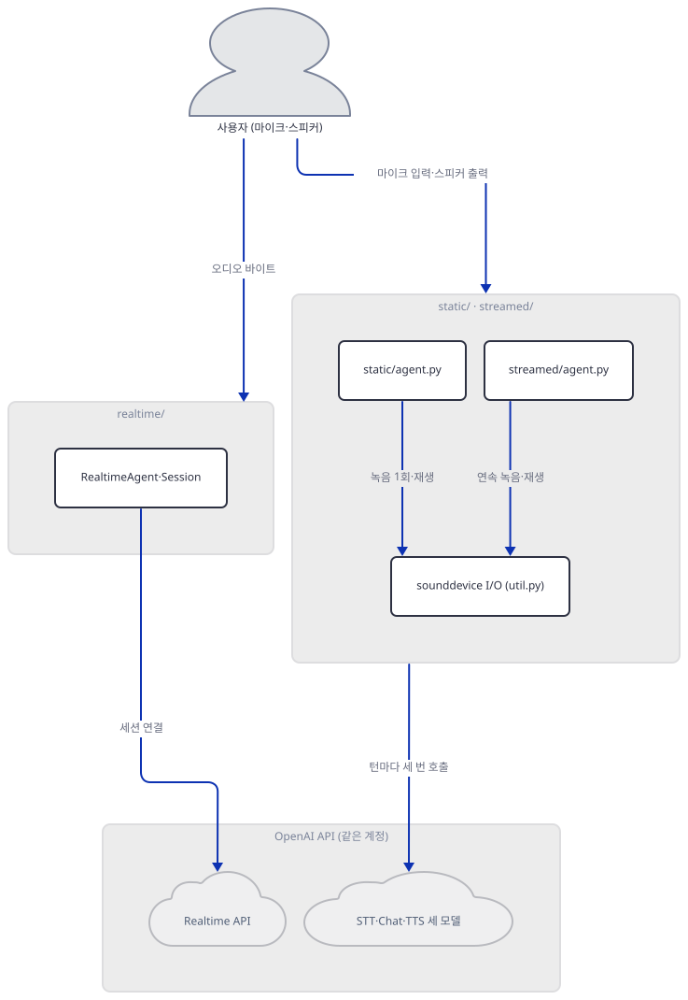
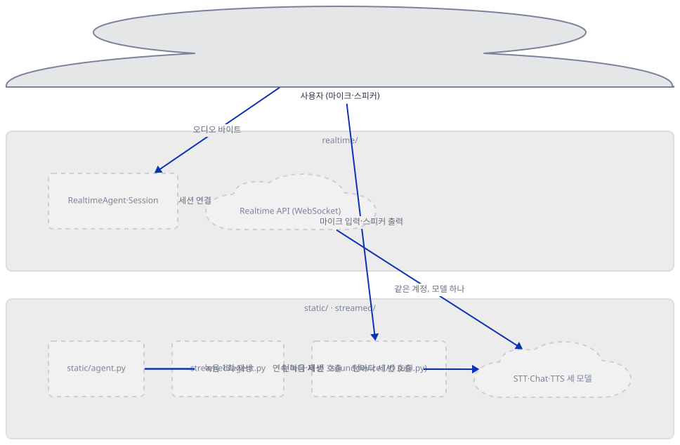
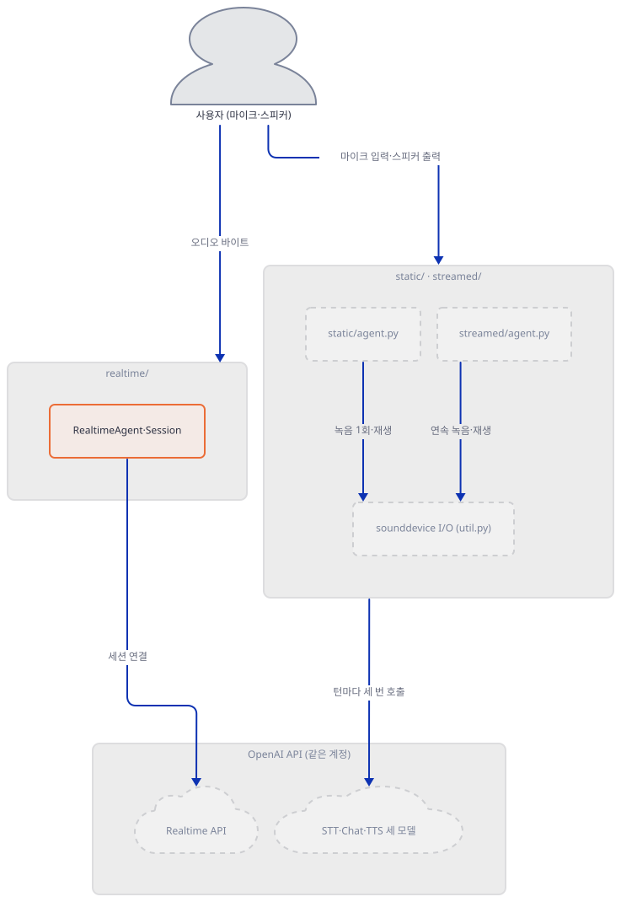
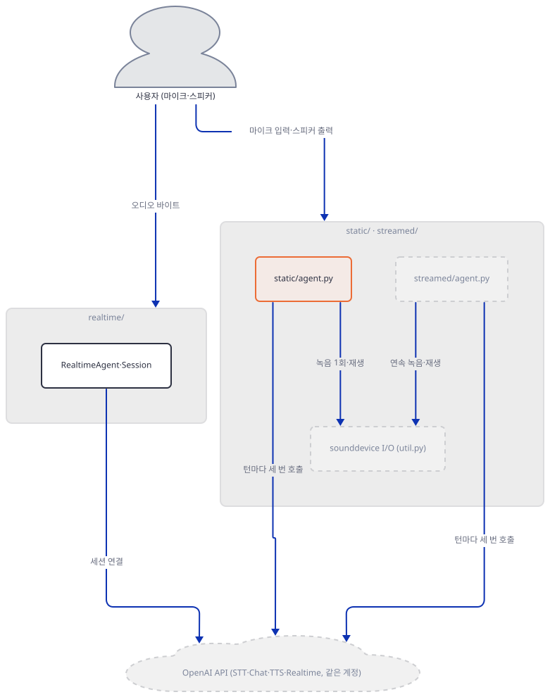
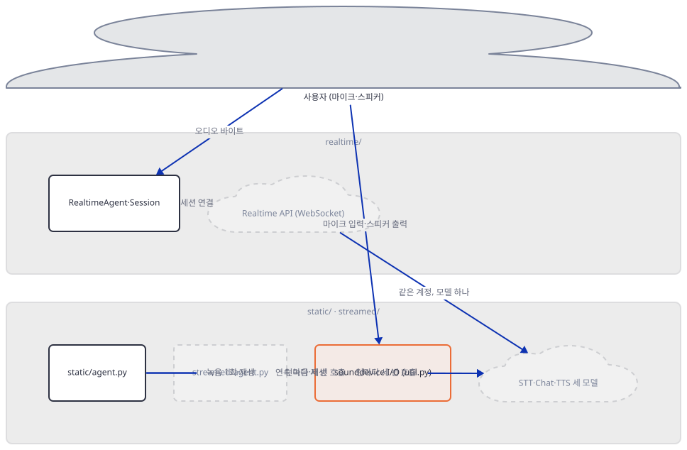
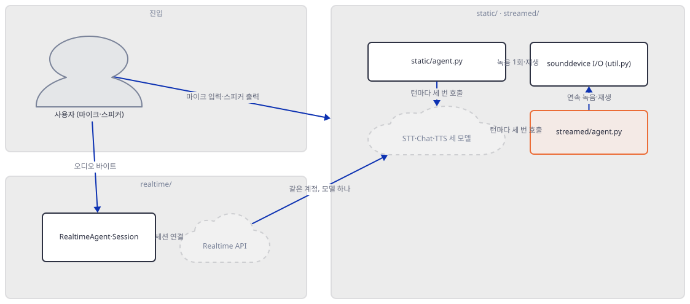
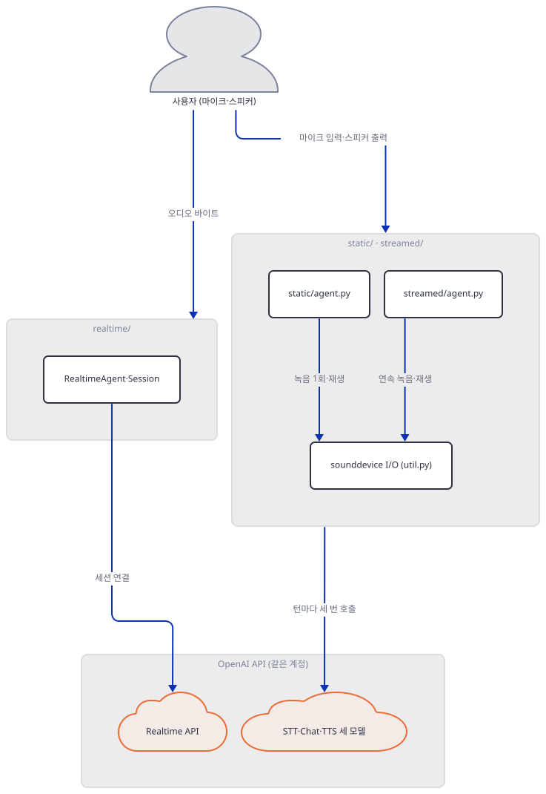
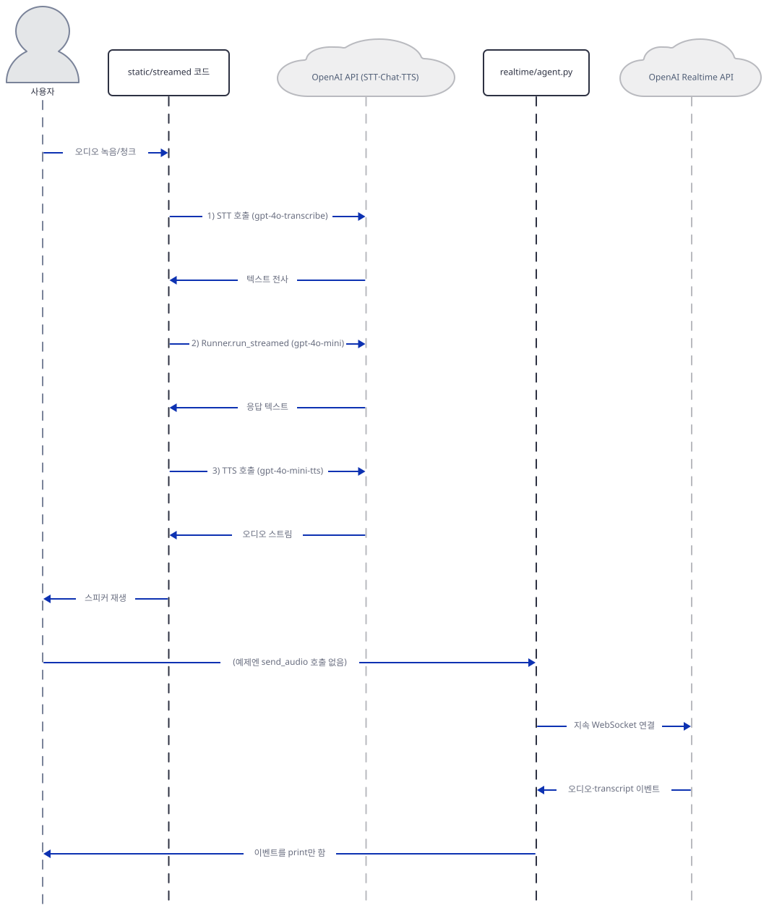

# Day 034 · OpenAI Agents SDK Crash Course · 11_voice

> 볼륨 2 🧑‍🏫 Crash Courses · 난이도 ★★☆ · 예상 소요 120분(서브 레슨 셋을 각자 다른 가상환경에 설치하고, SDK 소스 일곱 파일과 README 넉 장을 오가며 확인하느라 이 볼륨에서 가장 깁니다 — 손으로 돌리는 시간이 읽는 시간보다 큽니다) · API 비용 $0 (API 키 없이 진행 — 마이크도 쓰지 않습니다) · 원본 앱: `ai_agent_framework_crash_course/openai_sdk_crash_course/11_voice`

## 오늘 만들 것

Day 024가 세운 이 볼륨의 공통축 — 패키지 `openai-agents`, 임포트 `from agents import ...`, 키 `OPENAI_API_KEY` — 위에서, 오늘 `11_voice`는 Day 014부터 이어진 크래시 코스 볼륨(Day 014~034)의 **마지막 레슨이자 가장 큰 레슨**입니다: 서브 레슨 셋(`realtime`·`static`·`streamed`), 파이썬 코드 653줄, 그리고 그 코드를 설명한다는 README 넉 장(최상위 1 + 서브 레슨 3) 848줄. 세 서브 레슨은 같은 질문 — 사람의 말을 어떻게 에이전트 안으로 들이고, 에이전트의 답을 어떻게 다시 말로 돌려주는가 — 에 서로 다르게 답합니다. `static`과 `streamed`는 `openai-agents[voice]`가 주는 `VoicePipeline`을 씁니다 — 소스를 따라가면(Step 3) 이 파이프라인은 실제로 STT(`gpt-4o-transcribe`) → 에이전트(`Runner`, `gpt-4o-mini`) → TTS(`gpt-4o-mini-tts`), 독립된 모델 호출 세 번을 순서대로 거치고, 두 서브 레슨은 이 파이프라인에 넘기는 오디오 입력 타입(`AudioInput` 대 `StreamedAudioInput`)만 다를 뿐 나머지는 문자 그대로 같은 클래스를 씁니다. `realtime`은 이 파이프라인을 아예 쓰지 않습니다 — 105줄로 다른 두 서브 레슨(218·330줄)보다 훨씬 짧은 이유가 이것입니다: `RealtimeSession` 하나가 지속 WebSocket 연결 위에서 STT·추론·TTS를 서버 쪽에서 통째로 처리하므로 파이프라인 오케스트레이션 코드 자체가 필요 없습니다. 그런데 그렇게 짧아진 대가로, 이 크래시 코스가 준비한 `realtime` 예제는 마이크 입력을 세션에 실제로 넣는 코드가 한 줄도 없습니다(직접 확인, Step 2) — 이벤트만 듣고 있을 뿐입니다. 이 시리즈에서 레슨 README가 실제 코드와 어긋나는 사례는 Day 019·022·023·026·027에 이어 오늘도 있습니다 — `realtime` 레슨 자신의 README가 적은 최소 버전과 실제 `requirements.txt`·설치판이 다르고, 최상위 README의 설치 안내는 `realtime`에는 필요 없는 무거운 오디오 패키지 넷을 세 옵션 모두에 똑같이 설치하라고 말합니다(둘 다 Step 1). API 키도 마이크도 없이 진행하지만, 이 문서는 키 없이 갈 수 있는 가장 먼 지점이 세 접근마다 서로 다른 예외로 나타난다는 것을 Step 6에서 직접 확인합니다. 완성 구조는 다음과 같습니다.



## 사전 준비

| 서비스/도구 | 용도 | 발급·설치 |
|---|---|---|
| OpenAI API 키 (`OPENAI_API_KEY`) | 세 서브 레슨 모두가 결국 호출하는 모델의 인증. 이 문서는 키를 발급하지 않고, 키 없이 세 접근이 각각 어디서 멈추는지만 Step 6에서 확인합니다 | https://platform.openai.com/api-keys 에서 발급 (이 실습에서는 생략) |
| 오디오 장치 (마이크·스피커) | `static`·`streamed`가 실제로 소리를 녹음·재생할 때만 필요. 이 문서는 장치를 쓰지 않고, 장치가 없을 때 코드가 실제로 어떻게 반응하는지를 가짜 오디오와 실패 시뮬레이션으로 Step 4에서 확인합니다 | 없어도 이 문서의 모든 확인을 따라갈 수 있습니다 |
| uv | 서브 레슨마다 독립된 가상환경 생성과 패키지 설치 | [공통 사전 준비](../README.md#공통-사전-준비-한-번만) 참고 |
| 인터넷 연결 | PyPI에서 `openai-agents`·`sounddevice`·`librosa` 등 설치 | 별도 설치 없음. `librosa`는 수치 계산 의존성이 많아 설치에 1~2분 걸릴 수 있습니다 |

## 아키텍처 한눈에 보기

| 컴포넌트 | 역할 | 코드 위치 |
|---|---|---|
| 사용자 (마이크·스피커) | 말로 묻고 답을 들음 | 코드 없음 |
| `realtime/agent.py` | `RealtimeAgent`·`RealtimeRunner`·`RealtimeSession`으로 지속 연결 하나를 열고 이벤트를 처리 (오디오를 직접 보내는 코드는 없음, Step 2) | `ai_agent_framework_crash_course/openai_sdk_crash_course/11_voice/realtime/agent.py:1-105` |
| `static/agent.py` + `util.py` | 5초를 녹음해 `VoicePipeline`에 한 번 통과시키고 응답을 재생 | `ai_agent_framework_crash_course/openai_sdk_crash_course/11_voice/static/agent.py:1-218`, `ai_agent_framework_crash_course/openai_sdk_crash_course/11_voice/static/util.py:1-170` |
| `streamed/agent.py` + `util.py` | 같은 `VoicePipeline`에 연속 오디오 청크를 밀어 넣어 여러 턴을 처리 | `ai_agent_framework_crash_course/openai_sdk_crash_course/11_voice/streamed/agent.py:1-330`, `ai_agent_framework_crash_course/openai_sdk_crash_course/11_voice/streamed/util.py:1-229` |
| `VoicePipeline` (openai-agents[voice]) | STT → 에이전트(`Runner`) → TTS 세 단계를 오케스트레이션 | 코드 없음 (openai-agents 0.22.3 — 소스로 확인) |
| `RealtimeSession` (openai-agents) | 단일 WebSocket으로 오디오 바이트를 주고받는 지속 세션 | 코드 없음 (openai-agents 0.22.3 — 소스로 확인) |
| OpenAI API | STT·Chat·TTS·Realtime 네 가지 역할의 실제 추론 | 코드 없음 (외부 서비스) |

## 단계별 진행

### Step 1. 환경 만들기 — 서브 레슨마다 다른 의존성, 그리고 `[voice]`·`[realtime]`이 실제로 보태는 것

**목적.** 이 폴더에 최상위 `requirements.txt`가 없다는 것, 세 서브 레슨의 의존성이 서로 다르다는 것을 확인하고, `openai-agents[voice]`와 `[realtime]` extra가 패키지 메타데이터 수준에서 실제로 무엇을 추가하는지 — 그리고 `static`·`streamed`의 `sounddevice`·`soundfile`·`librosa`가 왜 그 extra에 속하지 않는지 — 를 직접 확인합니다.

**할 일.** 먼저 최상위에 의존성 파일이 없다는 것부터 봅니다.

```bash
cd ai_agent_framework_crash_course/openai_sdk_crash_course/11_voice
find . -maxdepth 1 -iname "requirements*.txt"
find . -mindepth 2 -maxdepth 2 -iname "requirements.txt" | sort
```

```powershell
cd ai_agent_framework_crash_course/openai_sdk_crash_course/11_voice
Get-ChildItem -Filter "requirements*.txt" | Select-Object -ExpandProperty Name
Get-ChildItem -Recurse -Depth 1 -Filter "requirements.txt" | Select-Object -ExpandProperty FullName
```

```
(첫 명령은 출력 없음 — 최상위엔 없습니다)
```

```
./realtime/requirements.txt
./static/requirements.txt
./streamed/requirements.txt
```

(직접 확인.) 세 파일의 내용은 이렇게 다릅니다.

`ai_agent_framework_crash_course/openai_sdk_crash_course/11_voice/realtime/requirements.txt:1-2`

```text
openai-agents>=0.2.0
python-dotenv>=1.0.0
```

`ai_agent_framework_crash_course/openai_sdk_crash_course/11_voice/static/requirements.txt:1-6`

```text
openai-agents[voice]>=0.2.0
sounddevice>=0.4.0
numpy>=1.21.0
soundfile>=0.12.0
librosa>=0.10.0
python-dotenv>=1.0.0
```

`streamed/requirements.txt`도 위와 글자 그대로 같습니다(직접 확인). `realtime`은 `[voice]` extra조차 쓰지 않는 맨 `openai-agents`이고, `static`·`streamed`만 오디오 패키지 넷을 추가로 요구합니다. 각자 격리된 가상환경에 설치합니다 — 이 저장소는 루트에 `pyproject.toml`이 있어 `uv run`이 방금 만든 환경 대신 루트의 `.venv`를 쓰므로 이후 `uv run` 명령에는 모두 `--no-project`를 붙이고, 그 루트 `.venv`엔 이름이 같은 다른 패키지 TensorFlow Agents가 있어 이 플래그 없이는 `AttributeError: module 'tensorflow' has no attribute 'contrib'`로 깨진다는 것은 Day 025·026이 이미 문서화했으므로 다시 파지 않습니다(문제 해결 참고). `--no-project`가 상향 탐색 자체를 막지는 않으므로(Day 030) 각 서브 레슨 폴더 안에 실제로 `.venv`를 만들어 두는 것이 안전합니다.

```bash
cd realtime && uv venv --python 3.12 && uv pip install -r requirements.txt && cd ..
cd static && uv venv --python 3.12 && uv pip install -r requirements.txt && cd ..
cd streamed && uv venv --python 3.12 && uv pip install -r requirements.txt && cd ..
```

```powershell
cd realtime; uv venv --python 3.12; uv pip install -r requirements.txt; cd ..
cd static; uv venv --python 3.12; uv pip install -r requirements.txt; cd ..
cd streamed; uv venv --python 3.12; uv pip install -r requirements.txt; cd ..
```

(pip 대안: 각 폴더에서 `python -m venv .venv && source .venv/bin/activate && pip install -r requirements.txt`. `static`·`streamed`의 설치는 `librosa`의 수치 계산 의존성(`numba`·`scipy`·`scikit-learn` 등) 때문에 1~2분 걸립니다 — 이 문서를 작성하며 설치했을 때는 59개 패키지에 약 2분이 걸렸고, Python 3.12용 휠이 전부 있어 따로 컴파일하지는 않았습니다, 직접 확인. 시스템 기본 `python`은 3.13.12이고 세 `.venv` 모두 `--python 3.12`로 3.12.10을 받습니다.)

`static`의 가상환경 안에서 `openai-agents`의 `voice`·`realtime` extra가 선언적으로 무엇을 추가하는지 봅니다.

**확인.**

```bash
uv run --no-project python -c "
import importlib.metadata as md
reqs = md.metadata('openai-agents').get_all('Requires-Dist')
print('extras:', md.metadata('openai-agents').get_all('Provides-Extra'))
print()
for r in reqs:
    if r.startswith('websockets') or r.startswith('numpy'):
        print(r)
"
```

```powershell
uv run --no-project python -c "<위와 같은 코드>"
```

```
extras: ['any-llm', 'blaxel', 'cloudflare', 'dapr', 'daytona', 'docker', 'e2b', 'encrypt', 'litellm', 'modal', 'mongodb', 'realtime', 'redis', 'runloop', 's3', 'sqlalchemy', 'temporal', 'vercel', 'viz', 'voice']

websockets<17,>=15.0
websockets<17,>=15.0; extra == 'realtime'
numpy<3,>=2.2.0; (python_version >= '3.10') and extra == 'voice'
websockets<17,>=15.0; extra == 'voice'
```

(직접 확인 — openai-agents 0.22.3 기준입니다. `websockets`는 extra 표시 없는 줄로 **이미 기본 의존성**입니다 — `[voice]`도 `[realtime]`도 같은 `websockets` 제약을 다시 선언할 뿐 새로 추가하지 않습니다. `[voice]` extra가 실제로 새로 보태는 것은 `numpy` 하나뿐입니다. `sounddevice`·`soundfile`·`librosa`는 openai-agents의 어떤 extra에도 없습니다 — `static`·`streamed`의 `util.py`가 마이크·스피커를 직접 다루려고 두 서브 레슨의 `requirements.txt`에 따로 넣은 것이지, SDK가 오디오 장치 자체를 요구하는 것이 아닙니다. `realtime`이 `[realtime]` extra조차 쓰지 않는 이유도 이걸로 설명됩니다 — 맨 `openai-agents`에 이미 필요한 것(`websockets`)이 다 있습니다.)

이제 다섯 파일이 각자의 환경에서 문법적으로 문제없는지, 버전은 무엇이 설치됐는지 봅니다.

```bash
uv run --no-project python -m py_compile realtime/agent.py static/agent.py static/util.py streamed/agent.py streamed/util.py && echo "py_compile OK for all 5 files"
```

```powershell
uv run --no-project python -m py_compile realtime/agent.py static/agent.py static/util.py streamed/agent.py streamed/util.py
```

```
py_compile OK for all 5 files
```

```
openai-agents 0.22.3
openai 3.17.0
numpy 2.5.3
sounddevice 0.5.6
soundfile 0.14.0
librosa 1.0.0
python-dotenv 1.2.3
voice imports ok
```

(직접 확인. `realtime`의 가벼운 환경에서는 `numpy`·`sounddevice` 없이 `openai-agents 0.22.3`·`openai 3.17.0`·`python-dotenv 1.2.3`만 설치되고 `from agents.realtime import RealtimeAgent, RealtimeRunner, realtime_handoff`가 성공합니다 — 버전은 설치 시점의 PyPI 상태에 따라 달라질 수 있습니다.)



### Step 2. `realtime/` — `RealtimeAgent` 셋과, 오디오를 한 번도 보내지 않는 예제

**목적.** `realtime/agent.py`가 정의하는 세 컴포넌트(`RealtimeAgent`·`RealtimeRunner`·`RealtimeSession`)를 읽고, 이 105줄짜리 예제가 실제로 마이크 입력을 세션에 넣는 코드를 갖고 있는지 소스로 확인합니다.

**할 일.** 에이전트 정의는 `model=`이 없습니다 — 모델은 대신 러너 설정에 있습니다.

`ai_agent_framework_crash_course/openai_sdk_crash_course/11_voice/realtime/agent.py:38-46`

```python
# Main realtime agent
agent = RealtimeAgent(
    name="Assistant",
    instructions="You are a helpful voice assistant. Keep responses brief and conversational.",
    tools=[get_weather, book_appointment],
    handoffs=[
        realtime_handoff(billing_agent, tool_description="Transfer to billing support")
    ]
)
```

`ai_agent_framework_crash_course/openai_sdk_crash_course/11_voice/realtime/agent.py:55-72`

```python
    runner = RealtimeRunner(
        starting_agent=agent,
        config={
            "model_settings": {
                "model_name": "gpt-4o-realtime-preview",
                "voice": "alloy",
                "modalities": ["text", "audio"],
                "input_audio_transcription": {
                    "model": "whisper-1"
                },
                "turn_detection": {
                    "type": "server_vad",
                    "threshold": 0.5,
                    "silence_duration_ms": 200
                }
            }
        }
    )
```

일반 `Agent`(Day 024)는 모델을 자기 필드에 갖지만, `RealtimeAgent`는 모델·음성·오디오 포맷을 전부 `RealtimeRunner`의 `config`로 받습니다 — 음성 하나로 대화 전체를 처리하는 아키텍처라 에이전트별로 다른 모델을 쓰는 개념 자체가 없습니다. 이벤트 처리 루프는 이렇습니다.

`ai_agent_framework_crash_course/openai_sdk_crash_course/11_voice/realtime/agent.py:84-99`

```python
    async with session:
        try:
            async for event in session:
                # Handle key event types
                if event.type == "response.audio_transcript.done":
                    print(f"🤖 Assistant: {event.transcript}")
                    
                elif event.type == "conversation.item.input_audio_transcription.completed":
                    print(f"👤 User: {event.transcript}")
                    
                elif event.type == "response.function_call_arguments.done":
                    print(f"🔧 Tool called: {event.name}")
                    
                elif event.type == "error":
                    print(f"❌ Error: {event.error}")
                    break
```

이 파일 전체(105줄)에서 오디오를 세션에 실제로 넣는 코드를 찾아봅니다.

**확인.**

```bash
grep -n "send_audio\|sounddevice\|InputStream" realtime/agent.py; echo "grep exit code: $?"
```

```powershell
Select-String -Path realtime/agent.py -Pattern "send_audio|sounddevice|InputStream"
```

```
grep exit code: 1
```

(직접 확인 — 아무 줄도 걸리지 않습니다. 소스로 확인하면(openai-agents 0.22.3의 `agents/realtime/session.py`) `RealtimeSession`은 `async def send_audio(self, audio: bytes, *, commit: bool = False)`라는 메서드로 원시 오디오 바이트를 받게 설계돼 있지만, 이 예제 어디에서도 그 메서드가 호출되지 않습니다 — `session`을 `async for`로 순회하며 이벤트만 듣습니다. 최상위 README와 이 서브 레슨 README 둘 다 "Start talking"이라고 안내하지만(Quick Start), 이 파일을 그대로 실행하면 실제로 말할 방법이 없습니다 — 마이크를 여는 코드가 아예 없기 때문입니다. `VoicePipeline`이 오디오 버퍼를 `numpy` 배열로 주고받는 것과 달리, `RealtimeSession.send_audio`는 순수 `bytes`를 받는다는 점도 다릅니다 — 그래서 `realtime`의 의존성엔 `numpy`가 없습니다, Step 1.) 키 없이 이 세션에 실제로 들어가려 하면 무슨 일이 있는지도 확인합니다.

```bash
uv run --no-project python -c "
import asyncio, os
os.environ.pop('OPENAI_API_KEY', None)
from agents.realtime import RealtimeAgent, RealtimeRunner

agent = RealtimeAgent(name='x', instructions='y')
runner = RealtimeRunner(starting_agent=agent, config={'model_settings': {'model_name': 'gpt-4o-realtime-preview'}})

async def main():
    session = await runner.run()
    print('runner.run() ->', type(session).__name__, '(no error yet)')
    try:
        async with asyncio.timeout(10):
            async with session:
                print('connected (unexpected without key)')
    except Exception as e:
        print('EXCEPTION TYPE:', type(e).__name__)
        print('EXCEPTION MODULE:', type(e).__module__)
        print('EXCEPTION TEXT:', str(e))

asyncio.run(main())
"
```

```powershell
uv run --no-project python -c "<위와 같은 코드>"
```

```
runner.run() -> RealtimeSession (no error yet)
EXCEPTION TYPE: UserError
EXCEPTION MODULE: agents.exceptions
EXCEPTION TEXT: API key is required but was not provided.
```

(직접 확인 — `asyncio.timeout(10)`으로 감싸 네트워크가 실제로 걸리더라도 걸리지 않게 했습니다. `RealtimeRunner(...).run()`은 세션 객체만 만들 뿐 아무 I/O도 하지 않아 키 없이도 성공합니다. 실제 연결 시도는 `async with session:`에서 일어나는데, 소스로 확인하면(`agents/realtime/openai_realtime.py`) 이 시점에 API 키를 먼저 검사해 없으면 `UserError`를 던지고, 그 검사가 웹소켓을 실제로 열기 **전에** 일어나므로 네트워크 왕복 없이 로컬에서 즉시 실패합니다. Day 024·030에서 본 일반 `Runner`의 실패는 `openai.OpenAIError`였는데, 여기서는 `agents.exceptions.UserError`로 예외 종류 자체가 다릅니다 — Step 6에서 세 번째 갈래와 함께 비교합니다.)



### Step 3. `static/` — `VoicePipeline` 세 단계와 실제 첫 실패 지점

**목적.** `static/agent.py`가 `VoicePipeline`을 어떻게 구성하는지 확인하고, 이 파이프라인이 소스 수준에서 정말 STT→에이전트→TTS 세 번의 독립된 모델 호출인지, 그리고 키가 없을 때 그 순서 중 **어디가 먼저** 멈추는지를 직접 확인합니다.

**할 일.** 세 에이전트(영어·스페인어·프랑스어) 모두 모델을 명시적으로 고정합니다.

`ai_agent_framework_crash_course/openai_sdk_crash_course/11_voice/static/agent.py:62-71`

```python
spanish_agent = Agent(
    name="Spanish",
    handoff_description="A spanish speaking agent.",
    instructions=prompt_with_handoff_instructions(
        "You're speaking to a human, so be polite and concise. Speak in Spanish only. "
        "Help with weather, time, and calculations as needed."
    ),
    model="gpt-4o-mini",
    tools=[get_weather, get_time, calculate_tip]
)
```

`model="gpt-4o-mini"`를 세 에이전트 모두 직접 지정하므로, Day 024가 찾은 "지정하지 않은 모델이 실제로 무엇으로 풀리는가" 문제는 이 레슨에서 일어나지 않습니다(점만 가리킵니다). 파이프라인은 이렇게 만들어집니다.

`ai_agent_framework_crash_course/openai_sdk_crash_course/11_voice/static/agent.py:130-152`

```python
    # Create the voice pipeline with our agent and callbacks
    pipeline = VoicePipeline(
        workflow=SingleAgentVoiceWorkflow(agent, callbacks=WorkflowCallbacks())
    )
    
    print("This demo will:")
    print("1. 🎤 Record your voice for a few seconds")
    print("2. 🔄 Transcribe your speech to text")
    print("3. 🤖 Process with AI agent")
    print("4. 🔊 Convert response back to speech")
    print()
    
    # Record audio input
    try:
        audio_buffer = record_audio(duration=5.0)
        print(f"📊 Recorded {len(audio_buffer)} audio samples")
        
        # Create audio input for the pipeline
        audio_input = AudioInput(buffer=audio_buffer)
        
        # Run the voice pipeline
        print("\n🔄 Processing with voice pipeline...")
        result = await pipeline.run(audio_input)
```

주석의 "1→2→3→4" 순서(녹음→전사→처리→합성)는 `openai-agents` 0.22.3 소스(`agents/voice/pipeline.py`)와 대조하면 **모델 호출 순서**로는 맞지만 **코드가 무엇을 먼저 만드는가**로는 다릅니다 — `VoicePipeline.run()`이 내부에서 부르는 `_run_single_turn()`은 STT를 실행하기 전에 먼저 `StreamedAudioResult(self._get_tts_model(), ...)`를 동기적으로 구성하는데, 이 한 줄이 TTS용 `AsyncOpenAI` 클라이언트를 그 자리에서 생성합니다(소스로 확인) — 전사(STT)는 그다음에 백그라운드 태스크로 스케줄링됩니다. 즉 키가 없으면 STT를 시도해 보기도 전에 TTS 클라이언트 생성에서 먼저 멈춥니다. 기본 모델도 확인합니다: 소스로 확인하면(`agents/voice/models/openai_model_provider.py`) STT 기본값은 `DEFAULT_STT_MODEL = "gpt-4o-transcribe"`, TTS 기본값은 `DEFAULT_TTS_MODEL = "gpt-4o-mini-tts"`이고, `static/agent.py`·`streamed/agent.py` 둘 다 이 값을 덮어쓰지 않습니다(직접 확인, 두 파일 어디에도 `stt_model=`/`tts_model=` 인자가 없음).

**확인.** 실제 마이크 대신 무음 배열을 직접 만들어, 하드웨어 없이도 이 실패 지점을 재현합니다.

```bash
uv run --no-project python -c "
import asyncio, os
os.environ.pop('OPENAI_API_KEY', None)
import numpy as np
from agents.voice import AudioInput, SingleAgentVoiceWorkflow, VoicePipeline
from agents import Agent

agent = Agent(name='x', instructions='y', model='gpt-4o-mini')
pipeline = VoicePipeline(workflow=SingleAgentVoiceWorkflow(agent))
silent_buffer = np.zeros(24000 * 1, dtype=np.int16)
audio_input = AudioInput(buffer=silent_buffer)

async def main():
    try:
        result = await pipeline.run(audio_input)
        print('pipeline.run() returned:', type(result).__name__)
    except Exception as e:
        print('EXCEPTION TYPE:', type(e).__name__)
        print('EXCEPTION MODULE:', type(e).__module__)
        print('EXCEPTION TEXT:', str(e))

asyncio.run(main())
"
```

```powershell
uv run --no-project python -c "<위와 같은 코드>"
```

```
EXCEPTION TYPE: OpenAIError
EXCEPTION MODULE: openai
EXCEPTION TEXT: Missing credentials. Please pass an `api_key`, `workload_identity`, `admin_api_key`, or set the `OPENAI_API_KEY` or `OPENAI_ADMIN_KEY` environment variable.
```

(직접 확인 — `np.zeros`로 만든 1초짜리 무음 버퍼라 마이크도, 실제 녹음도 필요 없습니다. `pipeline.run(audio_input)`을 부르자마자, 아직 그 무음조차 전사를 시도하기 전에 `openai.OpenAIError`가 납니다 — Day 024·030에서 본 것과 같은 예외 종류지만, 이번엔 `Runner`가 아니라 `VoicePipeline`의 TTS 클라이언트 생성 지점에서 납니다.)



### Step 4. 녹음·재생과 하드웨어 — `util.py`가 장치 없는 환경을 만나면

**목적.** `static/util.py`가 정의하는 `AudioPlayer`·`record_audio`가 실제로 `sounddevice`를 어떻게 감싸는지 확인하고, 오디오 장치가 없을 때(또는 이 문서처럼 장치를 쓰지 않기로 했을 때) 이 함수가 무엇을 돌려주는지 실제 하드웨어 없이 확인합니다. `streamed/util.py`의 같은 이름 클래스와 무엇이 다른지도 비교합니다.

**할 일.** `record_audio`는 실패를 자기 안에서 처리하도록 짜여 있습니다.

`ai_agent_framework_crash_course/openai_sdk_crash_course/11_voice/static/util.py:89-100`

```python
    except KeyboardInterrupt:
        print("\n⏹️ Recording stopped by user.")
        sd.stop()
        if 'recording' in locals():
            return recording[:int(time.time() * sample_rate)].astype(dtype)
        else:
            # Return empty array if no recording was captured
            return np.zeros(sample_rate, dtype=dtype)
    
    except Exception as e:
        print(f"❌ Recording failed: {e}")
        return np.zeros(sample_rate, dtype=dtype)
```

`streamed/util.py`도 이 `record_audio` 함수를 (지금은 쓰지 않지만) 글자 그대로 같게 갖고 있습니다(직접 확인). 반면 연속 녹음을 담당하는 `StreamedAudioRecorder`는 장치 열기를 감싸는 보호 장치가 없습니다.

`ai_agent_framework_crash_course/openai_sdk_crash_course/11_voice/streamed/util.py:61-71`

```python
    def __enter__(self):
        """Context manager entry - start the audio stream."""
        self.stream = sd.InputStream(
            samplerate=self.sample_rate,
            channels=self.channels,
            dtype=self.dtype,
            blocksize=self.chunk_size,
            callback=self._audio_callback
        )
        self.stream.start()
        return self
```

`sd.InputStream(...)` 생성과 `AudioPlayer.__enter__`의 `sd.OutputStream(...)` 생성(두 `util.py` 모두 동일) 모두 `try/except`가 없습니다 — 장치가 없으면 이 자리에서 난 예외가 그대로 위로 튀어 오르고, `streamed/agent.py`에서는 `main()`의 바깥쪽 `try/except Exception`(`ai_agent_framework_crash_course/openai_sdk_crash_course/11_voice/streamed/agent.py:274-292`)에서만 잡힙니다. `record_audio`만 자기 함수 안에서 무음으로 대체합니다.

**확인.** 실제 장치를 만지지 않고, 장치가 없을 때와 같은 예외를 강제로 일으켜 두 함수의 반응을 비교합니다.

```bash
uv run --no-project python -c "
import util

def boom(*a, **k):
    raise RuntimeError('Error querying device -1')

util.sd.rec = boom
buf = util.record_audio(duration=1.0)
print('record_audio ->', type(buf).__name__, buf.shape, buf.dtype)
print('all zero:', bool((buf == 0).all()))
"
```

```powershell
uv run --no-project python -c "<위와 같은 코드, static 폴더에서>"
```

```
❌ Recording failed: Error querying device -1
record_audio -> ndarray (24000,) int16
all zero: True
```

(위 명령은 `static` 폴더에서 실행. 직접 확인 — `sd.rec`를 실패하도록 바꿔치기했을 뿐 실제 오디오 장치는 전혀 건드리지 않았습니다. `record_audio`는 예외를 삼키고 같은 모양의 무음 배열을 돌려줍니다 — 호출자는 장치가 없었다는 것을 반환값만으로는 알 수 없고, 콘솔에 찍힌 `❌ Recording failed` 줄로만 압니다.)

```bash
uv run --no-project python -c "
import util

def boom(*a, **k):
    raise RuntimeError('Error querying device -1')

util.sd.InputStream = boom
try:
    with util.StreamedAudioRecorder() as rec:
        print('entered recorder (unexpected)')
except Exception as e:
    print('EXCEPTION TYPE:', type(e).__name__)
    print('EXCEPTION TEXT:', str(e))
"
```

```powershell
uv run --no-project python -c "<위와 같은 코드, streamed 폴더에서>"
```

```
EXCEPTION TYPE: RuntimeError
EXCEPTION TEXT: Error querying device -1
```

(위 명령은 `streamed` 폴더에서 실행. 직접 확인 — 같은 방식으로 `sd.InputStream`을 실패하게 만들었더니, `StreamedAudioRecorder`는 무음으로 대체하지 않고 예외를 그대로 내보냅니다. 장치가 없는 환경에서 `static`은 "녹음 실패, 무음으로 계속"이라고 말하며 진행하지만 `streamed`는 세션 전체가 시작하다 멈춘다는 뜻입니다.)



### Step 5. `streamed/` — 같은 파이프라인, 연속 입력과 턴 사이 기억

**목적.** `streamed/agent.py`가 `static`과 정확히 어디를 공유하고 어디를 바꾸는지 확인합니다 — 입력을 `AudioInput` 대신 `StreamedAudioInput`으로 바꾸는 것뿐이라는 것, 그리고 그 한 끗 차이가 SDK 내부에서 활동 감지와 턴 사이 기억으로 이어진다는 것을 소스로 확인합니다.

**할 일.** 세션 루프는 입력과 출력을 별도 태스크로 동시에 돌립니다.

`ai_agent_framework_crash_course/openai_sdk_crash_course/11_voice/streamed/agent.py:192-206`

```python
    async def _run_streaming_session(self):
        """Run the main streaming session loop."""
        with StreamedAudioRecorder() as recorder:
            with AudioPlayer() as player:
                self.audio_player = player
                
                # Create streamed audio input
                streamed_input = StreamedAudioInput()
                
                # Start the pipeline processing
                result = await self.pipeline.run(streamed_input)
                
                # Create tasks for audio input and output processing
                input_task = asyncio.create_task(self._process_audio_input(recorder, streamed_input))
                output_task = asyncio.create_task(self._process_audio_output(result))
```

`self.pipeline`은 `VoiceSessionManager.start_session()`(`ai_agent_framework_crash_course/openai_sdk_crash_course/11_voice/streamed/agent.py:177-179`)에서 `static`과 똑같은 `VoicePipeline(workflow=SingleAgentVoiceWorkflow(agent, callbacks=...))`로 만들어집니다 — 클래스도 구성 방식도 같습니다. 소스로 확인하면(`agents/voice/pipeline.py`) `VoicePipeline.run()`은 넘겨받은 인자 타입만 보고 갈립니다: `AudioInput`이면 `_run_single_turn()`(Step 3), `StreamedAudioInput`이면 `_run_multi_turn()`입니다. 후자는 `self._get_stt_model().create_session(...)`으로 세션형 전사를 열고 `transcription_session.transcribe_turns()`가 턴을 하나씩 내놓을 때마다 같은 `SingleAgentVoiceWorkflow` 인스턴스의 `run()`을 다시 호출합니다 — 이 워크플로 객체는 매 턴 `_input_history`에 대화를 쌓고 `_current_agent`를 갱신하므로(`agents/voice/workflow.py`), 언어 핸드오프가 일어나면 다음 턴도 그 에이전트로 이어집니다. `static`은 `pipeline.run()`을 딱 한 번만 부르므로 이 기억 메커니즘 자체가 발동할 기회가 없습니다 — 턴이 하나뿐이기 때문입니다. "활동 감지"의 정체도 소스에 있습니다(`agents/voice/models/openai_stt.py`): 이 스트리밍 전사 세션은 `DEFAULT_TURN_DETECTION = {"type": "semantic_vad"}`로 OpenAI 쪽 세션 기반 음성 활동 감지를 쓰지, `streamed/util.py`가 직접 침묵 길이를 재는 것이 아닙니다.

이 흐름을 실제로 끝까지 돌리려면 `Ctrl+C`로 끝낼 때까지 마이크를 계속 여는 무한 루프(`ai_agent_framework_crash_course/openai_sdk_crash_course/11_voice/streamed/agent.py:218-232`)를 타야 합니다 — 이 문서는 마이크를 쓰지 않기로 했으므로 이 전체 루프를 직접 실행하지는 못했습니다. Step 1의 `py_compile`·임포트 확인과, 위 소스 대조가 이 서브 레슨에 대해 실행한 전부입니다.

**확인.** 두 파이프라인 구성 코드가 클래스 수준에서 같다는 것만 다시 봅니다.

```bash
grep -n "VoicePipeline(workflow=SingleAgentVoiceWorkflow" static/agent.py streamed/agent.py
```

```powershell
Select-String -Path static/agent.py,streamed/agent.py -Pattern "VoicePipeline\(workflow=SingleAgentVoiceWorkflow"
```

```
static/agent.py:    pipeline = VoicePipeline(
streamed/agent.py:        self.pipeline = VoicePipeline(
```

(직접 확인 — 두 파일 다 `VoicePipeline(workflow=SingleAgentVoiceWorkflow(...))` 한 줄로 시작하고, 변수 이름만 다릅니다. 이 grep은 11_voice 폴더에서 실행합니다.)



### Step 6. 키 없이 세 갈래 — 서로 다른 예외 세 가지

**목적.** Step 2·3에서 각각 확인한 실패 지점을 한자리에 모으고, 일반 `Runner`(Day 024·030)까지 포함해 이 볼륨에서 "키 없이 실행"이 만드는 예외가 접근마다 다르다는 것을 정리합니다.

**할 일.** 세 갈래를 표로 정리하면 이렇습니다.

| 접근 | 키 없이 멈추는 자리 | 예외 |
|---|---|---|
| 일반 `Runner.run()` (Day 024·030) | `OpenAIProvider`가 `AsyncOpenAI` 클라이언트를 만드는 순간 | `openai.OpenAIError` |
| `static`·`streamed`의 `VoicePipeline.run()` | STT를 시도하기도 전, TTS 클라이언트를 만드는 순간(Step 3) | `openai.OpenAIError` (같은 종류, 다른 호출 지점) |
| `realtime`의 `RealtimeSession` | 웹소켓을 열기 전, `async with session:`의 키 검사(Step 2) | `agents.exceptions.UserError` |

셋 다 "키가 없으면 멈춘다"는 결과는 같지만, 멈추는 코드 경로와 예외의 모듈이 다릅니다 — `try/except`로 이 실패를 구분해서 다루려는 독자는 `openai.OpenAIError`뿐 아니라 `agents.exceptions.UserError`도 잡아야 한다는 뜻입니다. `realtime`만 유일하게 **네트워크를 아예 열기 전에** 로컬에서 멈춘다는 점도 다릅니다 — 나머지 둘은 클라이언트 객체 생성 시점에 멈추는데, 이 지점 자체가 이미 OpenAI SDK 내부에서 환경변수를 읽어 검사하는 동기 코드입니다.

**확인.** 세 예외 타입과 모듈을 한 표로 모아 다시 확인합니다 — Step 2·3에서 이미 직접 실행한 두 스크립트의 결과이므로 여기서는 재실행 없이 값만 대조합니다.

```
openai.OpenAIError   (Step 3, VoicePipeline)
agents.exceptions.UserError   (Step 2, RealtimeSession)
```

```
(직접 확인 — 두 값 모두 Step 2·3에서 실제로 실행해 얻은 출력을 그대로 옮긴 것입니다. 일반 Runner.run()의 openai.OpenAIError는 Day 024 Step 6·Day 030 Step 7이 이미 직접 확인했으므로 여기서는 재실행하지 않고 표에만 반영합니다.)
```



## 요청 한 건이 흐르는 과정



키가 있다고 가정하면, `static`·`streamed`의 경로는 세 번의 독립된 API 왕복입니다. 사용자의 오디오가 `VoicePipeline`에 들어가면 먼저 STT 모델(`gpt-4o-transcribe`)이 전체(또는 한 턴)를 텍스트로 바꾸고, 그 텍스트가 `SingleAgentVoiceWorkflow`를 거쳐 `Runner.run_streamed(agent, history)`로 넘어가 Day 024부터 이 볼륨 전체가 써 온 것과 같은 `Runner`가 도구 호출·핸드오프를 포함한 추론을 수행하며, 마지막으로 그 응답 텍스트가 TTS 모델(`gpt-4o-mini-tts`)을 거쳐 오디오로 합성돼 스피커로 나갑니다. 세 단계는 순서대로 일어나므로 지연 시간은 세 API 왕복의 합이고, 그 대신 중간 산물(전사된 텍스트, 에이전트의 답 텍스트)이 둘 다 파이썬 값으로 손에 잡혀 로깅하거나 가드레일을 걸 지점이 명확합니다(`static/agent.py`의 `WorkflowCallbacks.on_run(self, workflow, transcription)`이 그 전사 텍스트를 인자로 받는 지점입니다, 소스로 확인). `realtime`의 경로는 이것과 근본적으로 다릅니다 — 오디오 바이트가 지속 WebSocket 하나로 들어가면 단일 모델이 서버 쪽에서 STT·추론·TTS를 이어 처리해, 클라이언트는 오디오 델타와 전사 이벤트를 스트림으로 받을 뿐 "지금 텍스트가 무엇인가"를 왕복마다 가로챌 지점이 없습니다 — `realtime/README.md`가 말하는 지연 시간 500ms 미만(소스로 검증하지 않고 문서 그대로 인용)이 `static`·`streamed`의 세 번짜리 왕복과 대비되는 이유입니다. 다만 이 문서에서 실제로 오디오가 끝까지 흐르는 것은 어느 쪽도 직접 보지 못했습니다 — `static`·`streamed`는 키가 없어 Step 3에서 본 자리에서 멈추고, `realtime`은 키가 있어도 Step 2에서 확인했듯 이 예제 코드 자체가 오디오를 세션에 보내는 줄을 갖고 있지 않습니다.

## 실행 체크리스트

- [ ] 최상위에 `requirements.txt`가 없고, 세 서브 레슨의 `requirements.txt`가 서로 다르다는 것을 `find`로 확인했다
- [ ] `openai-agents[voice]`가 실제로 추가하는 것은 `numpy` 하나뿐이고, `websockets`는 세 extra 어디에도 상관없이 이미 기본 의존성이라는 것을 패키지 메타데이터로 확인했다
- [ ] `sounddevice`·`soundfile`·`librosa`가 openai-agents의 어떤 extra에도 속하지 않는다는 것을 확인했다 — 두 서브 레슨의 `util.py`가 직접 요구하는 것이다
- [ ] `realtime/agent.py`에 마이크 입력을 세션에 넣는 코드(`send_audio` 호출)가 없다는 것을 grep으로 확인했다
- [ ] 키 없이 `RealtimeRunner(...).run()`은 성공하지만 `async with session:`에서 `agents.exceptions.UserError`가 난다는 것을 직접 확인했다
- [ ] `VoicePipeline.run()`이 STT보다 TTS 클라이언트를 먼저 구성한다는 것을 소스와 무음 버퍼 실행으로 확인했다
- [ ] `static`의 `record_audio()`는 장치 실패를 삼키고 무음 배열을 돌려주지만, `streamed`의 `StreamedAudioRecorder`는 그렇지 않다는 것을 두 몽키패치 실행으로 확인했다
- [ ] `static`과 `streamed`가 같은 `VoicePipeline`·`SingleAgentVoiceWorkflow`를 쓰고, 넘기는 오디오 입력 타입(`AudioInput`/`StreamedAudioInput`)만 다르다는 것을 소스로 확인했다
- [ ] `streamed`의 연속 녹음이 SDK 안에서 세션형 `semantic_vad`로 처리된다는 것을 소스로 확인했다
- [ ] 일반 `Runner`·`VoicePipeline`·`RealtimeSession` 세 갈래가 키 없이 서로 다른 예외(`openai.OpenAIError` 두 번, `agents.exceptions.UserError` 한 번)로 멈춘다는 것을 정리했다

## 문제 해결

| 증상 | 원인 | 해결 |
|---|---|---|
| 세 `agent.py` 중 아무거나 실행하면 API 키 예외보다 먼저 `UnicodeEncodeError: 'cp949' codec can't encode character '\U0001f680'...`로 멈춤 | `main()` 진입 전 배너 출력이 이모지를 그대로 `print`하는데, 한국어 Windows 콘솔의 기본 코드페이지 `cp949`는 이모지를 인코딩하지 못한다(직접 확인, Day 019와 같은 종류 — `python -m ai_agent_framework_crash_course.openai_sdk_crash_course.11_voice.static.agent`로 실행해도 같은 자리에서 멈춘다) | `PYTHONIOENCODING=utf-8 uv run --no-project python agent.py`(PowerShell은 `$env:PYTHONIOENCODING="utf-8"`) |
| 이 폴더의 `.venv`를 지운 채로 하위 폴더에서 `uv run --no-project`를 실행하면 `AttributeError: module 'tensorflow' has no attribute 'contrib'` | `--no-project`는 상향 탐색 자체를 막지 않는다 — 가장 가까운 `.venv`가 없으면 저장소 루트의 `.venv`(TensorFlow Agents가 이름이 같은 `agents`로 설치돼 있음)까지 올라가 그것을 쓴다 — 근본 원인은 Day 025·026이 이미 문서화함 | Step 1에서 각 서브 레슨 폴더에 만든 `.venv`를 지우지 않는다 |
| `realtime/README.md`의 "Core Dependencies"가 `openai-agents>=1.0.0`을 요구한다고 적음 | 같은 폴더의 `requirements.txt`는 `openai-agents>=0.2.0`이고(직접 확인), 이 시리즈 전체가 실제로 설치해 온 버전은 0.22.3이다 — README와 requirements.txt, 그리고 설치판 세 값이 서로 다르다 | `requirements.txt`를 기준으로 삼는다. `openai-agents>=1.0.0`이라는 문구는 무시한다 |
| 최상위 README의 "Prerequisites"를 그대로 따르면 `realtime/`을 쓸 때도 `openai-agents[voice]`·`sounddevice`·`numpy`·`soundfile`·`librosa`를 설치하게 됨 | 최상위 README는 세 옵션 모두에 같은 설치 안내를 준다(직접 확인, `README.md:114-122`) — 그러나 `realtime/requirements.txt`엔 이 다섯 패키지 중 무엇도 없다(Step 1) | `realtime/`만 쓸 계획이면 `realtime/requirements.txt`만 설치한다 |
| 최상위 README의 3단계(`cp static/env.example static/.env`, `cp streamed/env.example streamed/.env`)를 따라가면 `realtime/.env`는 만들어지지 않음 | 그 안내는 `realtime/env.example`을 언급하지 않는다(직접 확인, `README.md:124-129`) | `realtime/`을 쓸 때는 `cp realtime/env.example realtime/.env`를 따로 실행한다 |
| `streamed/agent.py`를 실행하다 오디오 장치가 없으면 세션 전체가 처리되지 않은 예외로 멈춤 | `StreamedAudioRecorder.__enter__`/`AudioPlayer.__enter__`엔 `try/except`가 없다(직접 확인, Step 4) — `static`의 `record_audio()`처럼 무음으로 대체하는 보호 장치가 없다 | `streamed/agent.py`의 `main()` 바깥쪽 `try/except Exception`이 이미 잡아 트레이스백을 보여준다 — 장치를 연결하거나, `record_audio()`처럼 감싸도록 코드를 고친다 |

## 더 해보기

- `ai_agent_framework_crash_course/openai_sdk_crash_course/11_voice/static/agent.py:115-121`의 `on_tool_call`·`on_handoff` 콜백을, Step 4처럼 몽키패치로 가짜 이벤트를 직접 호출해 실제로 무엇이 찍히는지 확인해보기
- 유효한 키가 있다면 `static`으로 "Hola, como estas?"를 시도해, Step 5가 소스로만 확인한 `_current_agent` 전환(영어→스페인어 에이전트)이 다음 턴에도 이어지는지 `streamed`로 실제 재현해보기
- `agents/realtime/session.py`의 `send_audio(audio: bytes, *, commit: bool = False)`를 참고해, `realtime/agent.py`에 파일에서 읽은 PCM16 바이트를 실제로 밀어 넣는 코드를 추가해보기 — Step 2가 확인했듯 지금 예제엔 그 코드가 없다

## 다음 날 예고

Day 035부터는 이 크래시 코스 볼륨(Day 014~034)이 끝나고 새 볼륨이 시작됩니다 — [Day 035 · 📊 AI Data Visualization Agent](../day035-ai-data-visualisation-agent/README.md), 레슨 형식이 아니라 각자 독립된 Streamlit 앱을 하루에 하나씩 다루는 볼륨입니다.
