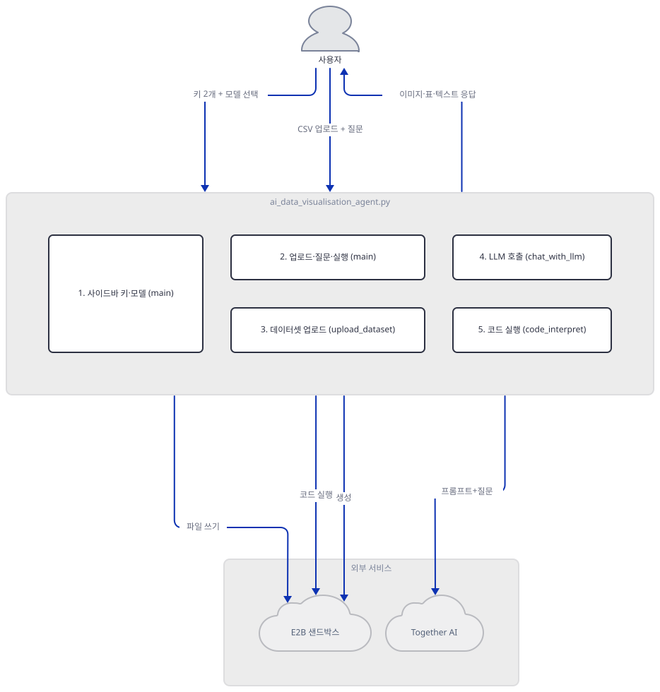
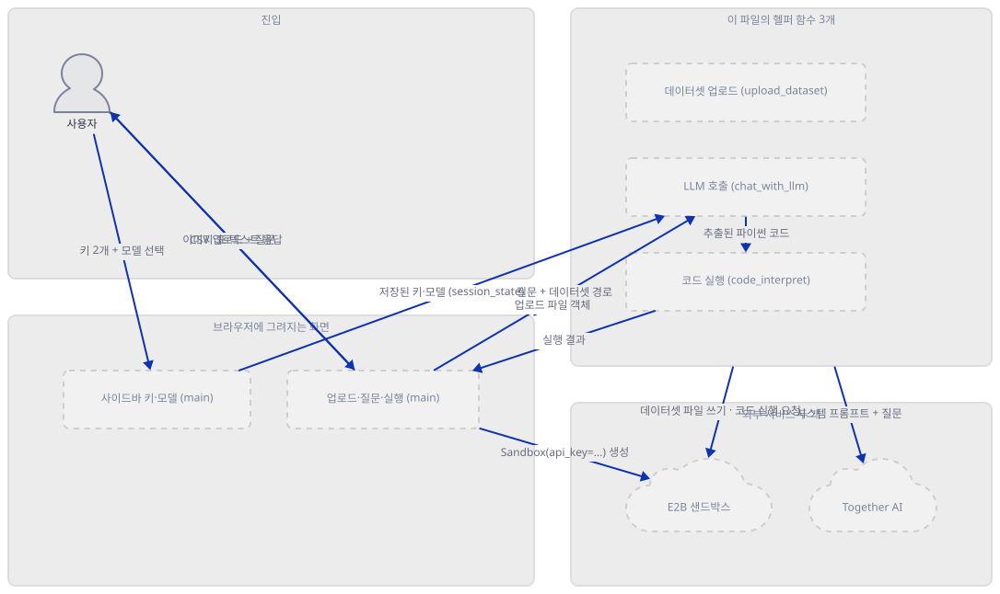
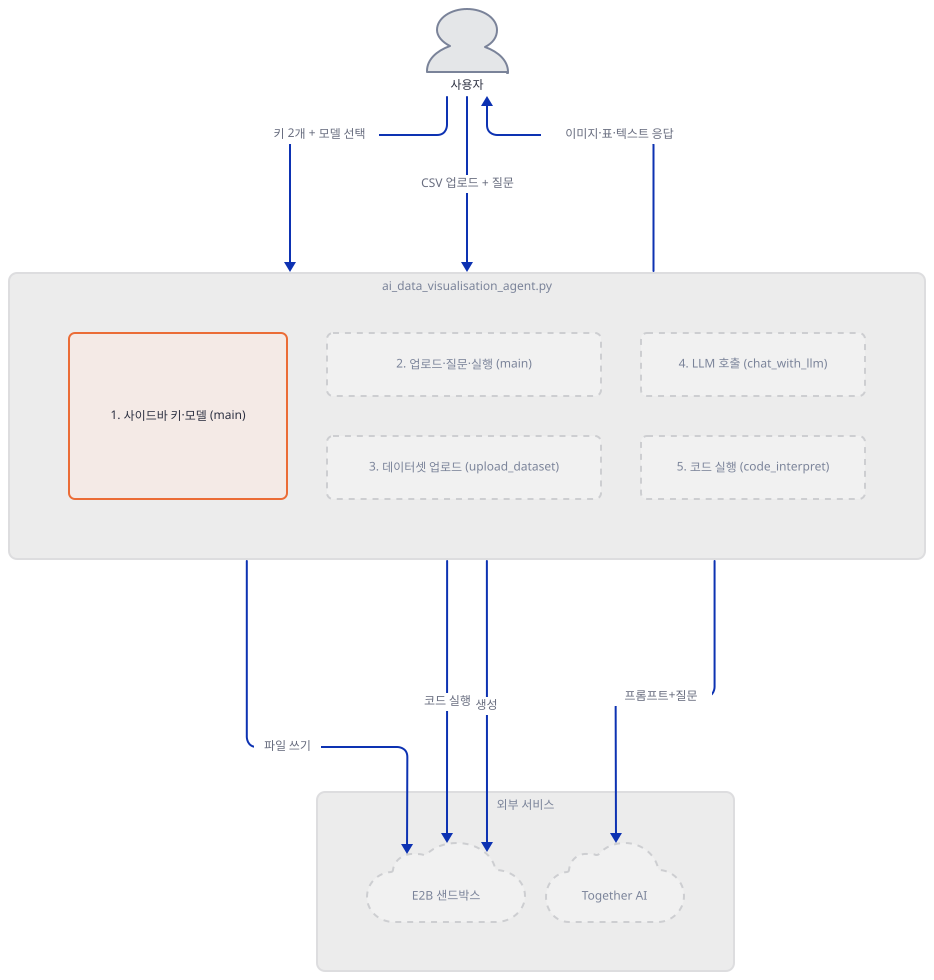
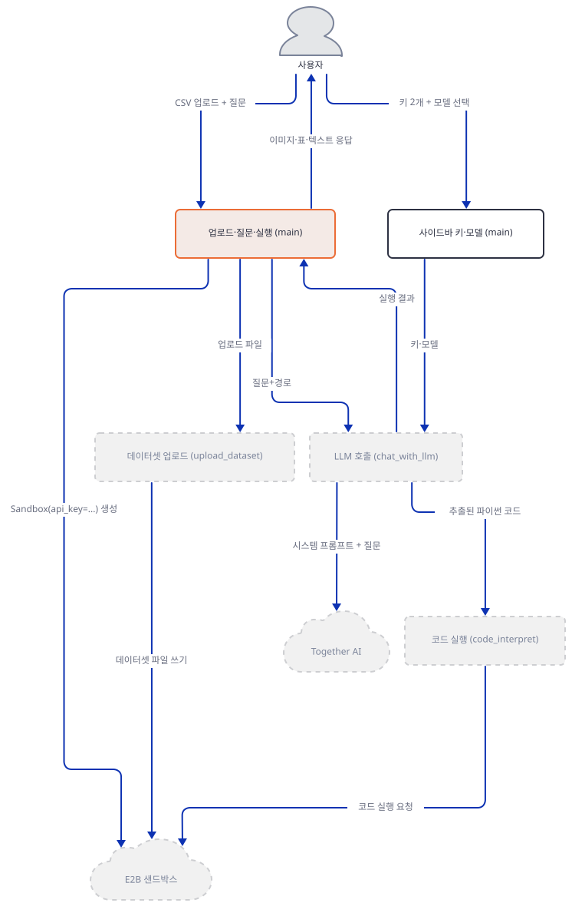
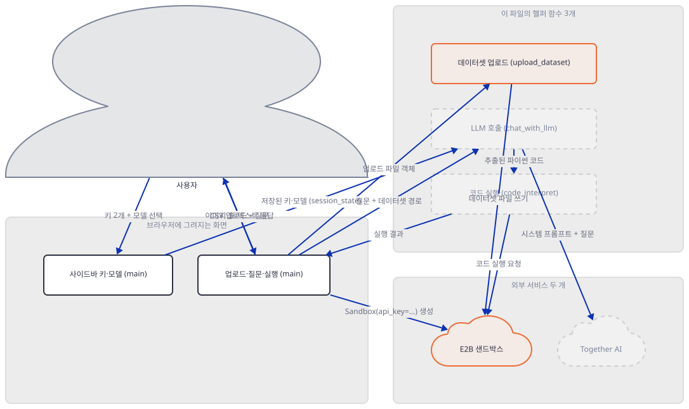
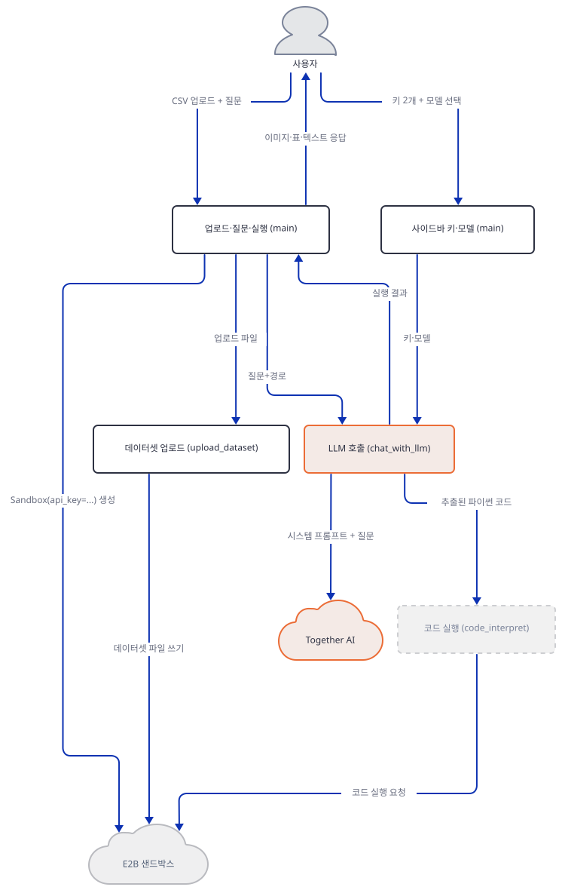
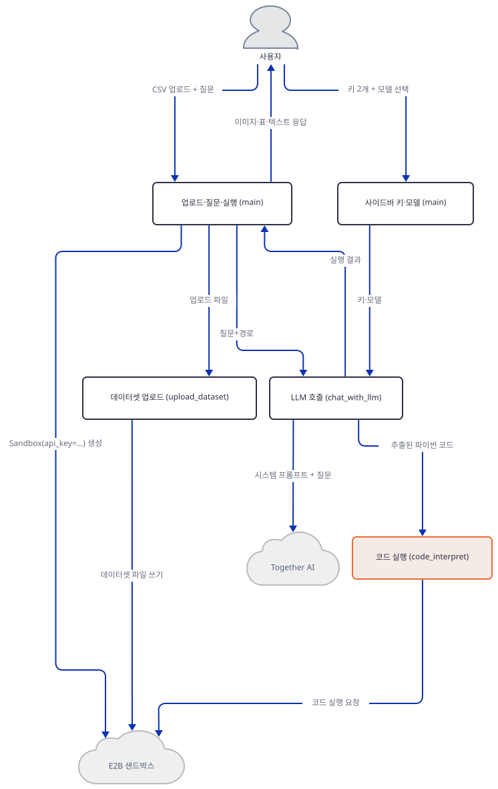
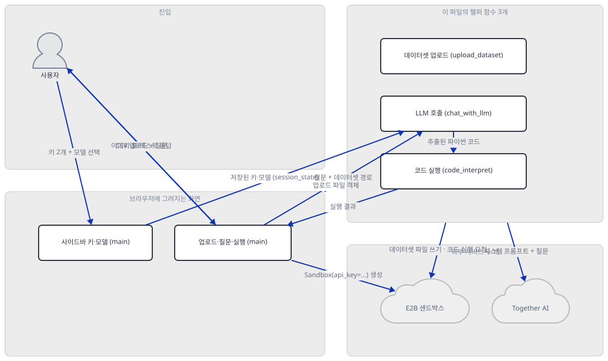
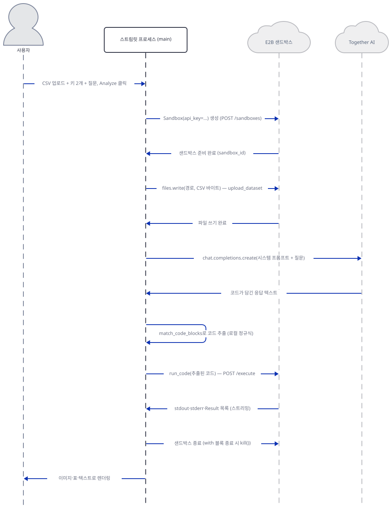

# Day 035 · 📊 AI Data Visualization Agent

> 볼륨 3 🌱 Starter AI Agents (추가분) · 난이도 ★★☆ · 예상 소요 88분(코드는 182줄로 짧지만, E2B·Together 두 패키지의 실제 소스를 직접 열어 무엇이 어디서 실행되는지 확인하느라 코드 줄 수보다 설명이 깁니다) · API 비용 대략 분석 1건에 Together AI 모델 호출 1회(요금표 기준 수십~수백 원 수준)에 더해 E2B 샌드박스 가동 시간만큼 별도 과금, 둘 다 대략치 (키가 없어 실제 과금은 확인 못함) · 원본 앱: `starter_ai_agents/ai_data_visualisation_agent`

## 오늘 만들 것

Day 014부터 Day 034까지 21일은 Google ADK와 OpenAI Agents SDK 두 프레임워크를 레슨 단위로 뜯어보는 크래시 코스였습니다. 오늘부터 그 볼륨이 끝나고, Day 001~013과 같은 모양 — 프레임워크 강의가 아니라 각자 독립된 Streamlit 앱을 하루에 하나씩 — 으로 돌아옵니다(볼륨 3, 🌱 Starter AI Agents 추가분, Day 035~038). 오늘 다루는 앱은 CSV를 업로드하고 자연어로 질문하면, LLM이 그 질문에 답할 파이썬 코드를 직접 작성하고, 그 코드를 실행해 나온 표·그래프·텍스트를 화면에 보여주는 "데이터 시각화 에이전트"입니다. 가장 가까운 이전 사례인 Day 006(AI Data Analysis Agent)과 비교하면 차이가 뚜렷합니다 — Day 006은 agno `Agent`가 DuckDB·Pandas 도구를 호출했고, 그 실행은 전부 로컬 프로세스 메모리 안에서 끝났습니다. 오늘 앱은 에이전트 프레임워크를 전혀 쓰지 않습니다(직접 확인: 소스 어디에도 `agno`·`langchain` 임포트가 없음) — Together AI를 REST 호출로 직접 두드리고, 응답에서 정규식으로 파이썬 코드를 뽑아낸 뒤, 그 코드를 **E2B라는 별도의 호스팅 클라우드 서비스로 보내 실행**합니다. 이 앱을 쓴다는 것은 업로드한 CSV와 LLM이 방금 작성한 코드가 둘 다 이 리포지토리가 전혀 통제하지 않는 제3자의 가상머신에서 처리된다는 뜻입니다 — Step 4·6에서 소스를 직접 열어 그 가상머신이 어디에 있고 무엇을 할 수 있는지 확인합니다. 두 열쇠(Together AI, E2B) 모두 코드 어디에도 상수나 `os.environ` 읽기가 없고(직접 확인), 사이드바의 비밀번호 입력창에 매 실행마다 직접 붙여넣게 되어 있습니다. 완성 아키텍처는 다음과 같습니다.



## 사전 준비

| 서비스/도구 | 용도 | 발급·설치 |
|---|---|---|
| Together AI API 키 | 4개 모델 중 사이드바에서 고른 하나를 호출하는 인증키. 사이드바 입력창에 직접 붙여넣는다(환경변수 아님) | https://api.together.ai/signin 가입 후 발급 |
| E2B API 키 | LLM이 작성한 코드를 실제로 실행할 클라우드 샌드박스 인증키. 마찬가지로 사이드바에 직접 붙여넣는다(환경변수 아님) | https://e2b.dev 가입 후 발급 |
| uv | 가상환경 생성과 패키지 설치 | [공통 사전 준비](../README.md#공통-사전-준비-한-번만) 절 참고 |
| 분석할 CSV 파일 | 업로드해 자연어로 질의할 원본 데이터 | 직접 준비하거나, Step 3 확인에서 쓰는 것과 같은 몇 줄짜리 CSV로도 충분 |
| 인터넷 연결 | Together AI·E2B 두 서비스 접속 | 별도 설치 없음. 사내망이면 두 도메인(`api.together.ai`, `api.e2b.dev`) 접속 허용이 각각 필요 |

## 아키텍처 한눈에 보기

| 컴포넌트 | 역할 | 코드 위치 |
|---|---|---|
| 사용자 | 두 API 키·모델 선택·CSV 업로드·질문 입력 | 코드 없음 (브라우저) |
| Streamlit UI — 키·모델 (`main`) | 사이드바에 Together·E2B 키 입력창과 모델 선택 드롭다운을 그림 | `starter_ai_agents/ai_data_visualisation_agent/ai_data_visualisation_agent.py:99-128` |
| Streamlit UI — 업로드·질문·실행 (`main`) | CSV 미리보기와 질문 입력을 받고, "Analyze" 클릭 시 샌드박스를 열어 나머지 함수를 호출한 뒤 결과를 렌더링 | `starter_ai_agents/ai_data_visualisation_agent/ai_data_visualisation_agent.py:130-179` |
| 데이터셋 업로드 (`upload_dataset`) | 업로드된 CSV를 되감아 E2B 샌드박스 파일시스템에 씀 | `starter_ai_agents/ai_data_visualisation_agent/ai_data_visualisation_agent.py:79-91` |
| LLM 호출 (`chat_with_llm`) | 데이터셋 경로를 박아 넣은 시스템 프롬프트로 Together를 호출하고, 응답에서 파이썬 코드를 정규식으로 추출 | `starter_ai_agents/ai_data_visualisation_agent/ai_data_visualisation_agent.py:51-77` |
| 코드 실행 (`code_interpret`) | 추출된 코드를 E2B 샌드박스에서 실행하고 표준출력·에러·결과 목록을 수집 | `starter_ai_agents/ai_data_visualisation_agent/ai_data_visualisation_agent.py:21-42` |
| Together AI | 4개 모델 중 선택된 하나로 분석 코드를 생성하는 외부 LLM 제공자 | 코드 없음 (외부 서비스) |
| E2B 샌드박스 | 생성된 코드를 실제로 실행하는 호스팅 클라우드 가상머신 | 코드 없음 (외부 서비스) |

## 단계별 진행

### Step 1. 환경 만들기 — 두 서비스와 엇갈린 버전 고정

**목적.** 격리된 가상환경에 의존성을 설치하고, `requirements.txt` 7줄 중 몇 줄이 버전을 고정하는지, 이 앱이 서로 다른 역할을 가진 두 외부 서비스(모델 제공자 Together AI, 코드 실행 샌드박스 E2B)의 키를 요구한다는 것을 미리 확인해 둡니다.

**할 일.**

```bash
cd starter_ai_agents/ai_data_visualisation_agent
uv venv
uv pip install -r requirements.txt
```

(pip을 쓴다면 `python -m venv .venv && source .venv/bin/activate && pip install -r requirements.txt`.)

이 저장소는 루트에 `pyproject.toml`이 있어 `uv run`이 방금 만든 환경 대신 루트의 `.venv`를 쓰므로, 이후 `uv run` 명령에는 모두 `--no-project`를 붙입니다.

`starter_ai_agents/ai_data_visualisation_agent/requirements.txt:1-7`

```text
together==1.3.10
e2b-code-interpreter==1.0.3
e2b==1.0.5
Pillow==10.4.0
streamlit
pandas
matplotlib
```

7줄 중 4줄(`together`, `e2b-code-interpreter`, `e2b`, `Pillow`)은 `==`로 정확히 고정되어 있고, 나머지 3줄(`streamlit`, `pandas`, `matplotlib`)은 아무 버전 범위도 없습니다. 이 문서를 쓰며 설치했을 때(2026-09-22) 고정된 4개는 적힌 값 그대로, 고정되지 않은 3개는 그 시점 PyPI 최신판이 설치됐습니다(직접 확인, 아래) — 오늘 설치하면 뒤의 세 값은 달라질 수 있습니다. 두 서비스가 패키지 이름에서부터 나뉘어 있다는 것도 미리 짚어 둡니다: `together`는 4개 LLM 중 선택된 모델을 호출해 분석 코드를 "쓰는" 역할이고, `e2b`/`e2b-code-interpreter`는 그 코드를 실제로 "실행하는" 역할입니다 — 이름도 다르고 요구하는 키도 다릅니다(Step 5·6에서 각각 확인).



**확인.**

```bash
uv run --no-project python -m py_compile ai_data_visualisation_agent.py && echo compiled
```

```powershell
uv run --no-project python -m py_compile ai_data_visualisation_agent.py
```

```
compiled
```

```bash
uv run --no-project python -c "
import importlib.metadata as md
for pkg in ['together','e2b','e2b-code-interpreter','pillow','streamlit','pandas','matplotlib']:
    print(pkg, md.version(pkg))
"
```

```powershell
uv run --no-project python -c "<위와 같은 코드>"
```

```
together 1.3.10
e2b 1.0.5
e2b-code-interpreter 1.0.3
pillow 10.4.0
streamlit 1.64.0
pandas 3.0.6
matplotlib 3.11.2
```

(직접 확인 — 뒤 세 줄(streamlit·pandas·matplotlib)의 버전은 설치 시점 PyPI 최신판이라 실행마다 달라질 수 있습니다. 앞 네 줄은 `requirements.txt`가 고정한 값과 항상 같습니다.)

### Step 2. Streamlit 뼈대 — 사이드바 키 2개와 모델 선택

**목적.** `main()`이 세션 상태를 어떻게 초기화하는지, 사이드바에 두 개의 키 입력창과 모델 선택 드롭다운이 어떻게 그려지는지 확인하고, 두 키 모두 환경변수가 아니라 `session_state`에만 머문다는 것을 코드로 확인합니다.

**할 일.**

`starter_ai_agents/ai_data_visualisation_agent/ai_data_visualisation_agent.py:94-105`

```python
def main():
    """Main Streamlit application."""
    st.title("📊 AI Data Visualization Agent")
    st.write("Upload your dataset and ask questions about it!")

    # Initialize session state variables
    if 'together_api_key' not in st.session_state:
        st.session_state.together_api_key = ''
    if 'e2b_api_key' not in st.session_state:
        st.session_state.e2b_api_key = ''
    if 'model_name' not in st.session_state:
        st.session_state.model_name = ''
```

`starter_ai_agents/ai_data_visualisation_agent/ai_data_visualisation_agent.py:107-114`

```python
    with st.sidebar:
        st.header("API Keys and Model Configuration")
        st.session_state.together_api_key = st.sidebar.text_input("Together AI API Key", type="password")
        st.sidebar.info("💡 Everyone gets a free $1 credit by Together AI - AI Acceleration Cloud platform")
        st.sidebar.markdown("[Get Together AI API Key](https://api.together.ai/signin)")

        st.session_state.e2b_api_key = st.sidebar.text_input("Enter E2B API Key", type="password")
        st.sidebar.markdown("[Get E2B API Key](https://e2b.dev/docs/legacy/getting-started/api-key)")
```

두 키 모두 `type="password"`로 가려진 `st.sidebar.text_input`이 돌려준 값을 그대로 `st.session_state`에 담습니다 — 상수도, `os.environ`도, `.env` 읽기도 이 파일 어디에도 없습니다(직접 확인, 아래). 이미 `with st.sidebar:` 블록 안인데도 `st.header`(108행)만 짧게 쓰고 109~114행은 다시 `st.sidebar.text_input`/`st.sidebar.info`/`st.sidebar.markdown`처럼 `sidebar.`를 반복합니다 — 중복이지만 둘 다 사이드바에 그려지는 결과는 같습니다. 모델 선택도 같은 사이드바 블록 끝에 있습니다.

`starter_ai_agents/ai_data_visualisation_agent/ai_data_visualisation_agent.py:116-128`

```python
        # Add model selection dropdown
        model_options = {
            "Meta-Llama 3.1 405B": "meta-llama/Meta-Llama-3.1-405B-Instruct-Turbo",
            "DeepSeek V3": "deepseek-ai/DeepSeek-V3",
            "Qwen 2.5 7B": "Qwen/Qwen2.5-7B-Instruct-Turbo",
            "Meta-Llama 3.3 70B": "meta-llama/Llama-3.3-70B-Instruct-Turbo"
        }
        st.session_state.model_name = st.selectbox(
            "Select Model",
            options=list(model_options.keys()),
            index=0  # Default to first option
        )
        st.session_state.model_name = model_options[st.session_state.model_name]
```

드롭다운은 사람이 읽는 이름("Meta-Llama 3.1 405B")을 보여 주고, 고른 즉시 같은 줄(128행)에서 실제 Together 모델 슬러그로 덮어씁니다 — 그다음부터 `st.session_state.model_name`은 항상 슬러그입니다. 기본값(`index=0`)은 4개 중 가장 큰 모델인 `meta-llama/Meta-Llama-3.1-405B-Instruct-Turbo`입니다.



**확인.**

```bash
grep -n "os.environ\|getenv" ai_data_visualisation_agent.py; echo "grep exit code: $?"
```

```powershell
Select-String -Path ai_data_visualisation_agent.py -Pattern "os\.environ|getenv"
```

```
grep exit code: 1
```

(직접 확인 — 아무 줄도 걸리지 않습니다. PowerShell도 출력 없음이 같은 결과입니다.)

```bash
uv run --no-project streamlit run ai_data_visualisation_agent.py --server.headless true
```

```powershell
uv run --no-project streamlit run ai_data_visualisation_agent.py --server.headless true
```

다른 터미널에서:

```bash
curl -s -o /dev/null -w "%{http_code}\n" http://localhost:8501
```

```powershell
(Invoke-WebRequest http://localhost:8501 -UseBasicParsing).StatusCode
```

```
200
```

(직접 확인.)

### Step 3. CSV 업로드와 질문 입력

**목적.** 파일이 들어온 뒤에만 열리는 블록에서 미리보기가 어떻게 그려지는지, 기본 질문 문구와 "Analyze" 버튼의 키 가드가 무엇을 확인하는지 봅니다.

**할 일.**

`starter_ai_agents/ai_data_visualisation_agent/ai_data_visualisation_agent.py:130-141`

```python
    uploaded_file = st.file_uploader("Choose a CSV file", type="csv")
    
    if uploaded_file is not None:
        # Display dataset with toggle
        df = pd.read_csv(uploaded_file)
        st.write("Dataset:")
        show_full = st.checkbox("Show full dataset")
        if show_full:
            st.dataframe(df)
        else:
            st.write("Preview (first 5 rows):")
            st.dataframe(df.head())
```

CSV가 올라오는 즉시 판다스가 로컬에서(샌드박스가 아니라 이 화면을 그리는 프로세스 자신이) 한 번 읽어 미리보기를 만듭니다 — 이 `df`는 미리보기 전용이고, 나중에 샌드박스로 올라가는 것은 이 `df`가 아니라 `uploaded_file` 객체 자체입니다(Step 4). 질문과 실행 버튼은 같은 블록 끝에 있습니다.

`starter_ai_agents/ai_data_visualisation_agent/ai_data_visualisation_agent.py:142-148`

```python
        # Query input
        query = st.text_area("What would you like to know about your data?",
                            "Can you compare the average cost for two people between different categories?")
        
        if st.button("Analyze"):
            if not st.session_state.together_api_key or not st.session_state.e2b_api_key:
                st.error("Please enter both API keys in the sidebar.")
```

`st.text_area`의 두 번째 인자는 자리표시자가 아니라 기본값입니다 — 아무것도 지우지 않고 바로 "Analyze"를 누르면 이 문장 그대로가 질문이 됩니다. 버튼을 눌러도 두 키 중 하나라도 비어 있으면(`not ... or not ...`) 곧바로 `st.error`만 뜨고 Step 4의 샌드박스는 아예 열리지 않습니다.



**확인.** 앱이 업로드 시점에 실행하는 것과 같은 호출(`pd.read_csv` → `.head()`)을 작은 CSV로 직접 실행합니다.

```bash
uv run --no-project python -c "
import pandas as pd, io
buf = io.BytesIO(b'category,cost_for_two\nItalian,45.5\nSushi,62.0\nBBQ,38.0\n')
df = pd.read_csv(buf)
print(df.head())
print('columns:', list(df.columns))
"
```

```powershell
uv run --no-project python -c "<위와 같은 코드>"
```

```
  category  cost_for_two
0  Italian          45.5
1    Sushi          62.0
2      BBQ          38.0
columns: ['category', 'cost_for_two']
```

(직접 확인 — 130행·141행이 호출하는 것과 같은 `pd.read_csv` + `.head()` 조합입니다.)

### Step 4. E2B 샌드박스 열기와 데이터셋 올리기

**목적.** "Analyze"를 눌렀을 때 실제로 무엇이 만들어지는지 — `Sandbox(...)`가 단순한 객체가 아니라 생성되는 순간 진짜 클라우드 가상머신을 띄우는 네트워크 호출이라는 것 — 을 E2B 패키지 소스로 확인하고, `upload_dataset`이 파일을 그 안에 어떻게 쓰는지, 왜 되감기가 필요한지 직접 확인합니다.

**할 일.**

`starter_ai_agents/ai_data_visualisation_agent/ai_data_visualisation_agent.py:149-152`

```python
            else:
                with Sandbox(api_key=st.session_state.e2b_api_key) as code_interpreter:
                    # Upload the dataset
                    dataset_path = upload_dataset(code_interpreter, uploaded_file)
```

`e2b-code-interpreter` 1.0.3 소스로 확인하면(`e2b/sandbox_sync/main.py`의 `Sandbox.__init__`), `Sandbox(api_key=...)`는 지연 없이 생성자 안에서 곧바로 `SandboxApi._create_sandbox(...)`를 호출합니다 — 이 `with` 문에 진입하는 순간 E2B 컨트롤 플레인에 `POST /sandboxes` 요청이 나가 실제 리눅스 가상머신 하나가 뜹니다. 그 가상머신이 어디 있는지도 소스에 있습니다(`e2b/connection_config.py`): 도메인은 환경변수 `E2B_DOMAIN`이 없으면 `e2b.dev`로 고정되고, 실제 API 주소는 `https://api.{도메인}` — 기본값 `https://api.e2b.dev`입니다. `e2b_code_interpreter.Sandbox` 클래스의 문서(소스로 확인)는 이 가상머신을 "E2B cloud sandbox is a secure and isolated cloud environment"라고 설명하며 "Access the internet"을 능력 중 하나로 명시합니다 — 즉 이 안에서 실행되는 코드는 그 자신도 인터넷에 나갈 수 있는 완전한 리눅스 환경입니다. `with` 블록을 벗어나면 `__exit__`가 `self.kill()`을 불러(소스로 확인) 이 가상머신을 종료합니다.

`starter_ai_agents/ai_data_visualisation_agent/ai_data_visualisation_agent.py:79-91`

```python
def upload_dataset(code_interpreter: Sandbox, uploaded_file) -> str:
    dataset_path = f"./{uploaded_file.name}"
    
    try:
        # The Streamlit upload was already read to EOF by pd.read_csv earlier in
        # the run, so rewind before uploading — otherwise a 0-byte file reaches the
        # sandbox and every analysis reads an empty dataset.
        uploaded_file.seek(0)
        code_interpreter.files.write(dataset_path, uploaded_file)
        return dataset_path
    except Exception as error:
        st.error(f"Error during file upload: {error}")
        raise error
```

주석이 스스로 설명하듯, Step 3의 `pd.read_csv(uploaded_file)`가 이미 파일 포인터를 끝까지 읽어 버렸기 때문에 되감지(`seek(0)`) 않으면 `code_interpreter.files.write`는 빈 바이트만 보내게 됩니다. `files.write`도 소스로 확인하면(`e2b/sandbox_sync/filesystem/filesystem.py`) 실제로는 `POST` 멀티파트 업로드(`files={"file": data}`)로 CSV 바이트를 그 가상머신의 파일 API에 그대로 전송합니다 — 이 시점에 사용자의 CSV 내용 전체가 E2B의 서버로 나갑니다.



**확인.** 실제 샌드박스에 연결하지 않고, `upload_dataset`이 되감기를 정말로 하는지만 가짜 객체로 직접 확인합니다.

```bash
uv run --no-project python -c "
import io
from ai_data_visualisation_agent import upload_dataset

class FakeFiles:
    def write(self, path, fileobj):
        print('files.write called with path=', path, 'fileobj.read()=', fileobj.read())

class FakeSandbox:
    files = FakeFiles()

buf = io.BytesIO(b'a,b\n1,2\n')
buf.name = 'sample.csv'
buf.read()  # Step 3의 pd.read_csv가 이미 끝까지 읽은 상태를 흉내
print('position before upload_dataset:', buf.tell())
path = upload_dataset(FakeSandbox(), buf)
print('returned dataset_path:', path)
"
```

```powershell
uv run --no-project python -c "<위와 같은 코드>"
```

```
position before upload_dataset: 8
files.write called with path= ./sample.csv fileobj.read()= b'a,b\n1,2\n'
returned dataset_path: ./sample.csv
```

(직접 확인 — `FakeSandbox`는 실제 E2B에 전혀 연결하지 않는 로컬 객체입니다. 되감기 전 위치가 8(파일 끝)이었는데도 `files.write`가 8바이트 전체를 온전히 받아, `seek(0)`이 실제로 동작함을 확인했습니다.)

### Step 5. Together AI 호출과 코드 추출

**목적.** 데이터셋 경로를 박아 넣은 시스템 프롬프트가 어떻게 구성되는지, Together 호출이 실제로 무엇을 보내는지, 응답에서 파이썬 코드만 골라내는 정규식이 정확히 무엇과 매치하는지 확인합니다.

**할 일.**

`starter_ai_agents/ai_data_visualisation_agent/ai_data_visualisation_agent.py:51-60`

```python
def chat_with_llm(e2b_code_interpreter: Sandbox, user_message: str, dataset_path: str) -> Tuple[Optional[List[Any]], str]:
    # Update system prompt to include dataset path information
    system_prompt = f"""You're a Python data scientist and data visualization expert. You are given a dataset at path '{dataset_path}' and also the user's query.
You need to analyze the dataset and answer the user's query with a response and you run Python code to solve them.
IMPORTANT: Always use the dataset path variable '{dataset_path}' in your code when reading the CSV file."""

    messages = [
        {"role": "system", "content": system_prompt},
        {"role": "user", "content": user_message},
    ]
```

시스템 프롬프트는 Step 4에서 정한 `dataset_path`(`./원본파일명`)를 두 번 박아 넣어, 모델이 임의의 경로를 지어내지 않고 실제로 샌드박스에 올라간 경로를 쓰도록 강제합니다. 코드를 뽑아내는 정규식은 파일 맨 위에 미리 컴파일되어 있습니다.

`starter_ai_agents/ai_data_visualisation_agent/ai_data_visualisation_agent.py:19-19`

```python
pattern = re.compile(r"```python\n(.*?)\n```", re.DOTALL)
```

응답 안에 파이썬 코드 펜스가 정확히 이 모양으로 없으면(언어 태그가 다르거나 펜스가 아예 없으면) 아래 `match_code_blocks`는 빈 문자열을 돌려줍니다.

`starter_ai_agents/ai_data_visualisation_agent/ai_data_visualisation_agent.py:44-49`

```python
def match_code_blocks(llm_response: str) -> str:
    match = pattern.search(llm_response)
    if match:
        code = match.group(1)
        return code
    return ""
```

실제 호출과 그 뒤 분기는 이렇습니다.

`starter_ai_agents/ai_data_visualisation_agent/ai_data_visualisation_agent.py:62-77`

```python
    with st.spinner('Getting response from Together AI LLM model...'):
        client = Together(api_key=st.session_state.together_api_key)
        response = client.chat.completions.create(
            model=st.session_state.model_name,
            messages=messages,
        )

        response_message = response.choices[0].message
        python_code = match_code_blocks(response_message.content)
        
        if python_code:
            code_interpreter_results = code_interpret(e2b_code_interpreter, python_code)
            return code_interpreter_results, response_message.content
        else:
            st.warning(f"Failed to match any Python code in model's response")
            return None, response_message.content
```

`Together(api_key=...)` 생성자는 이 시점에는 키를 검증하지 않습니다(Day 005·006과 같은 패턴, 아래에서 실제 호출로 확인). 코드를 찾으면 그제서야 Step 6의 `code_interpret`를 부르고, 못 찾으면 샌드박스를 아예 건드리지 않고 경고만 띄웁니다 — 모델이 코드 없이 말로만 답하면 이 앱은 아무것도 실행하지 않습니다.



**확인.** 먼저 정규식이 실제로 무엇을 추출하는지 봅니다.

```bash
uv run --no-project python -c "
from ai_data_visualisation_agent import match_code_blocks
resp = 'Here is the analysis.\n\`\`\`python\nimport pandas as pd\ndf = pd.read_csv(\"x.csv\")\nprint(df.head())\n\`\`\`\nDone.'
print(repr(match_code_blocks(resp)))
print(repr(match_code_blocks('no code here at all')))
"
```

```powershell
uv run --no-project python -c "<위와 같은 코드>"
```

```
'import pandas as pd\ndf = pd.read_csv("x.csv")\nprint(df.head())'
''
```

(직접 확인 — 코드 펜스 안쪽만 정확히 뽑히고, 펜스가 없으면 빈 문자열입니다.)

다음으로 유효하지 않은 키로 실제 Together 호출까지 해서, 키가 검증되는 시점을 확인합니다.

```bash
uv run --no-project python -c "
from together import Together
client = Together(api_key='test-invalid-key-not-real')
print('client created:', type(client).__name__)
try:
    resp = client.chat.completions.create(
        model='meta-llama/Meta-Llama-3.1-405B-Instruct-Turbo',
        messages=[{'role': 'user', 'content': 'hello'}],
    )
except Exception as e:
    print('EXCEPTION TYPE:', type(e).__name__)
    print('EXCEPTION MODULE:', type(e).__module__)
    print('EXCEPTION TEXT:', str(e)[:250])
"
```

```powershell
uv run --no-project python -c "<위와 같은 코드>"
```

```
client created: Together
EXCEPTION TYPE: AuthenticationError
EXCEPTION MODULE: together.error
EXCEPTION TEXT: Error code: 401 - {"message": "Invalid API key provided. You can find your API key at https://api.together.ai/settings/api-keys.", "type_": "invalid_request_error", "code": "invalid_api_key"}
```

(직접 확인 — 클라이언트 생성은 성공하고, 실제 검증은 `chat.completions.create()` 호출 시점에 Together 서버가 응답할 때 일어납니다. 오류 메시지의 정확한 문구는 Together 쪽 사정으로 달라질 수 있습니다.)

### Step 6. 샌드박스에서 코드 실행

**목적.** `code_interpret`가 표준출력·표준에러를 어떻게 가로채는지, 실제 실행은 어떤 네트워크 요청으로 이루어지는지 소스로 확인하고, 성공·실패 두 경우에 이 함수가 정확히 무엇을 돌려주는지 로컬 가짜 샌드박스로 직접 확인합니다.

**할 일.**

`starter_ai_agents/ai_data_visualisation_agent/ai_data_visualisation_agent.py:21-42`

```python
def code_interpret(e2b_code_interpreter: Sandbox, code: str) -> Optional[List[Any]]:
    with st.spinner('Executing code in E2B sandbox...'):
        stdout_capture = io.StringIO()
        stderr_capture = io.StringIO()

        with contextlib.redirect_stdout(stdout_capture), contextlib.redirect_stderr(stderr_capture):
            with warnings.catch_warnings():
                warnings.simplefilter("ignore")
                exec = e2b_code_interpreter.run_code(code)

        if stderr_capture.getvalue():
            print("[Code Interpreter Warnings/Errors]", file=sys.stderr)
            print(stderr_capture.getvalue(), file=sys.stderr)

        if stdout_capture.getvalue():
            print("[Code Interpreter Output]", file=sys.stdout)
            print(stdout_capture.getvalue(), file=sys.stdout)

        if exec.error:
            print(f"[Code Interpreter ERROR] {exec.error}", file=sys.stderr)
            return None
        return exec.results
```

`contextlib.redirect_stdout`/`redirect_stderr`가 가로채는 것은 이 파이썬 프로세스 자신의 표준출력이지, 샌드박스 안의 출력이 아닙니다 — 그런데 그 안쪽에서 실제로 하는 일은 `e2b_code_interpreter.run_code(code)` 한 번뿐이라, 이 캡처 블록은 사실상 비어 있는 것과 같습니다. `run_code`가 진짜로 하는 일은 `e2b-code-interpreter` 1.0.3 소스로 확인됩니다(`e2b_code_interpreter/code_interpreter_sync.py`): 코드를 JSON으로 담아 그 샌드박스 고유 호스트의 `POST {jupyter_url}/execute`로 스트리밍 요청을 보내고, 응답을 줄 단위로 읽어 `Execution` 객체(표준출력·표준에러·에러·결과 목록)를 채웁니다. 기본 타임아웃은 300초(`e2b_code_interpreter/constants.py`의 `DEFAULT_TIMEOUT`)입니다. `exec.error`가 있으면(실행한 코드 자체가 예외를 던진 경우) `None`을, 없으면 `exec.results`(결과 목록)를 그대로 돌려줍니다 — 이 `None`이 Step 5의 `chat_with_llm`을 거쳐 `main()`까지 그대로 전달된다는 것은 Step 7에서 다시 짚습니다.



**확인.** 실제 샌드박스 대신 `.run_code()`만 흉내 내는 가짜 객체로, 성공·실패 두 경우에 `code_interpret`가 정확히 무엇을 돌려주는지 직접 확인합니다.

```bash
uv run --no-project python -c "
from ai_data_visualisation_agent import code_interpret

class FakeExec:
    def __init__(self, error=None, results=None):
        self.error = error
        self.results = results if results is not None else []

class FakeSandboxOK:
    def run_code(self, code):
        return FakeExec(error=None, results=['RESULT_PLACEHOLDER'])

r = code_interpret(FakeSandboxOK(), \"print('hi')\")
print('returned:', r)
"
```

```powershell
uv run --no-project python -c "<위와 같은 코드>"
```

```
returned: ['RESULT_PLACEHOLDER']
```

```bash
uv run --no-project python -c "
from ai_data_visualisation_agent import code_interpret

class FakeExec:
    def __init__(self, error=None, results=None):
        self.error = error
        self.results = results if results is not None else []

class FakeSandboxErr:
    def run_code(self, code):
        return FakeExec(error='NameError: name a is not defined', results=[])

r2 = code_interpret(FakeSandboxErr(), 'undefined_var')
print('returned:', r2)
"
```

```powershell
uv run --no-project python -c "<위와 같은 코드>"
```

```
returned: None
```

(직접 확인 — 두 `Fake*` 클래스 모두 실제 E2B에 연결하지 않는 로컬 객체입니다. 실패 케이스는 표준에러에 `[Code Interpreter ERROR] NameError: name a is not defined` 줄도 함께 찍히는데, 표준출력·표준에러가 별도 스트림이라 여기서는 표준출력만 옮겼습니다. 실제 E2B의 에러 객체는 문자열이 아니라 `name`·`value`·`traceback` 세 필드를 가진 `ExecutionError`이지만, `if exec.error:`의 참·거짓 판단에는 차이가 없습니다.)

### Step 7. 결과 렌더링

**목적.** `code_results`가 화면에 어떻게 그려지는지, 그리고 그 분기 5개 중 실제로 도달할 수 있는 것이 몇 개뿐인지 `Result` 클래스 자체로 직접 확인합니다.

**할 일.** 텍스트 응답을 먼저 보여준 뒤,

`starter_ai_agents/ai_data_visualisation_agent/ai_data_visualisation_agent.py:157-159`

```python
                    # Display LLM's text response
                    st.write("AI Response:")
                    st.write(llm_response)
```

결과 목록을 순회하며 종류별로 나눠 그립니다.

`starter_ai_agents/ai_data_visualisation_agent/ai_data_visualisation_agent.py:161-179`

```python
                    # Display results/visualizations
                    if code_results:
                        for result in code_results:
                            if hasattr(result, 'png') and result.png:  # Check if PNG data is available
                                # Decode the base64-encoded PNG data
                                png_data = base64.b64decode(result.png)
                                
                                # Convert PNG data to an image and display it
                                image = Image.open(BytesIO(png_data))
                                st.image(image, caption="Generated Visualization", use_container_width=False)
                            elif hasattr(result, 'figure'):  # For matplotlib figures
                                fig = result.figure  # Extract the matplotlib figure
                                st.pyplot(fig)  # Display using st.pyplot
                            elif hasattr(result, 'show'):  # For plotly figures
                                st.plotly_chart(result)
                            elif isinstance(result, (pd.DataFrame, pd.Series)):
                                st.dataframe(result)
                            else:
                                st.write(result)
```

다섯 갈래처럼 보이지만, `result`는 언제나 `e2b_code_interpreter.models.Result` 인스턴스입니다(Step 6) — 그 클래스가 선언한 필드는 `text`·`html`·`markdown`·`svg`·`png`·`jpeg`·`pdf`·`latex`·`json`·`javascript`·`data`·`chart`·`is_main_result`·`extra` 14개뿐이고, `figure`도 `show`도 없습니다(소스로 확인, 아래에서 직접 확인). 즉 두 번째·세 번째 분기(`elif hasattr(result, 'figure')`, `elif hasattr(result, 'show')`)는 이 앱이 실제로 만드는 `result` 값으로는 절대 참이 될 수 없는 죽은 코드이고, 네 번째 분기(`isinstance(result, (pd.DataFrame, pd.Series))`)도 마찬가지입니다 — `Result`는 HTTP 응답을 역직렬화한 데이터클래스일 뿐, 살아있는 판다스·matplotlib·plotly 객체가 네트워크 경계를 건너올 수는 없습니다. matplotlib으로 그린 그래프도 이 앱에서는 항상 `png` 필드로 도착하고, 실제로 갈리는 것은 `result.png`가 있으면 `st.image`, 없으면 맨 아래 `else: st.write(result)`뿐입니다. `if __name__ == "__main__": main()`(181~182행)은 다른 날들과 같은 표준 진입점입니다.



**확인.** `Result`를 직접 만들어 다섯 조건을 그대로 평가해 봅니다.

```bash
uv run --no-project python -c "
from e2b_code_interpreter.models import Result
import pandas as pd
r = Result(text='hello', png='fakebase64data')
print('hasattr png:', hasattr(r, 'png'), '-> value:', r.png)
print('hasattr figure:', hasattr(r, 'figure'))
print('hasattr show:', hasattr(r, 'show'))
print('isinstance DataFrame/Series:', isinstance(r, (pd.DataFrame, pd.Series)))
"
```

```powershell
uv run --no-project python -c "<위와 같은 코드>"
```

```
hasattr png: True -> value: fakebase64data
hasattr figure: False
hasattr show: False
isinstance DataFrame/Series: False
```

(직접 확인 — `e2b-code-interpreter` 1.0.3의 실제 `Result` 클래스입니다. `figure`·`show`는 애초에 이 클래스에 없는 속성이라 `hasattr`가 항상 `False`이고, `Result`는 판다스 타입도 아닙니다.)

## 요청 한 건이 흐르는 과정



사용자가 사이드바에 두 키를 넣고 CSV를 올린 뒤 질문을 쓰고 "Analyze"를 누르면, `main()`은 먼저 `Sandbox(api_key=...)`를 생성합니다 — 이 한 줄이 이미 E2B 컨트롤 플레인에 `POST /sandboxes` 요청을 보내 진짜 가상머신을 띄우는 네트워크 호출입니다(Step 4). 샌드박스가 준비되면 `upload_dataset`이 업로드된 CSV를 되감아 그 가상머신의 파일시스템에 씁니다(`POST` 멀티파트, Step 4). 그다음에야 `chat_with_llm`이 Together AI를 호출해 시스템 프롬프트와 질문을 보내고, 돌아온 응답 텍스트에서 `match_code_blocks`가 파이썬 코드만 정규식으로 뽑아냅니다 — 이 추출은 네트워크를 타지 않는 로컬 연산입니다(Step 5). 코드를 찾으면 `code_interpret`가 그 코드를 같은 샌드박스로 다시 보내 `POST {jupyter_url}/execute`로 실행시키고, 표준출력·표준에러·결과 목록을 스트리밍으로 돌려받습니다(Step 6). `with Sandbox(...) as code_interpreter:` 블록을 벗어나는 순간 `__exit__`가 그 가상머신을 종료합니다(소스로 확인). 이 요청 하나가 성공하려면 Together AI 왕복 1회와 E2B 왕복 최소 3회(생성·업로드·실행) — 총 네 번의 네트워크 홉을 거쳐야 하고, 그중 어느 하나라도 키가 잘못되면 그 자리에서 멈춥니다. 이 문서는 키가 없어 이 흐름을 처음부터 끝까지 한 번에 실행해 보지는 못했습니다 — 각 구간은 Step 1~7에서 소스와 로컬 가짜 객체로 개별적으로 확인한 것입니다.

## 실행 체크리스트

- [ ] Together AI API 키와 E2B API 키를 각각 발급받아 두었다
- [ ] `uv venv && uv pip install -r requirements.txt`로 의존성을 설치했다 (4줄은 고정 버전, 3줄은 최신판)
- [ ] `os.environ`·`getenv`가 이 파일에 없다는 것을 grep으로 확인했다 — 두 키는 항상 사이드바에 직접 입력한다
- [ ] `uv run streamlit run ai_data_visualisation_agent.py`로 서버를 띄우고 `http://localhost:8501`에서 화면을 확인했다
- [ ] CSV를 업로드하고 미리보기(처음 5행)를 확인했다
- [ ] `Sandbox(api_key=...)` 생성이 실제로는 E2B 클라우드에 새 가상머신을 만드는 네트워크 호출이라는 것을 소스로 확인했다
- [ ] `upload_dataset`의 `seek(0)`이 없으면 빈 파일이 올라간다는 것을 가짜 객체로 확인했다
- [ ] Together 클라이언트 생성은 키를 검증하지 않고, 실제 검증은 `chat.completions.create()` 호출 시점에 일어난다는 것을 확인했다
- [ ] `code_interpret`가 성공 시 `exec.results`를, 실패 시 `None`을 돌려준다는 것을 가짜 샌드박스로 확인했다
- [ ] 결과 렌더링의 `figure`/`show`/`isinstance(DataFrame/Series)` 세 분기가 실제로는 도달 불가능한 코드라는 것을 `Result` 클래스로 직접 확인했다

## 문제 해결

| 증상 | 원인 | 해결 |
|---|---|---|
| matplotlib으로 그래프를 그려도 `st.pyplot` 경로를 탄 흔적이 없고 항상 `st.image`이거나 `st.write`로만 보임 | 결과 판별 분기 중 `elif hasattr(result, 'figure')`·`elif hasattr(result, 'show')`·`elif isinstance(result, (pd.DataFrame, pd.Series))` 세 개는 `e2b_code_interpreter.models.Result`에 없는 속성·타입만 검사해 항상 거짓이다(Step 7, `Result` 클래스로 직접 확인) | 정상 동작이다 — `result.png`가 있으면 `st.image`, 없으면 `st.write(result)`로만 갈린다는 것을 알고 읽으면 된다. 고치려면 `Result`의 `svg`/`html` 필드도 분기에 추가 |
| 사이드바의 E2B 키 발급 링크가 `e2b.dev/docs/legacy/getting-started/api-key`처럼 "legacy" 경로를 가리켜 오래된 문서처럼 보임 | 소스에 그 URL이 그대로 박혀 있다(직접 확인, 114행) | 그 링크 문구는 무시하고 https://e2b.dev 대시보드에서 키를 발급받아도 무방하다. 이 경로가 실제로 살아있는지는 키가 없어 이 문서에서 열어보지 못했다 |
| 사내망·방화벽 환경에서 "Analyze"를 눌러도 한참 응답이 없다가 실패함 | 이 앱은 서로 다른 도메인 둘(`api.together.ai`, `api.e2b.dev`)에 각각 접속해야 하는데(Step 4·5), 프록시가 그중 하나만 허용하고 있을 수 있다 | 두 도메인 모두 아웃바운드 접속이 허용되는지 따로 확인 |

## 더 해보기

- 실행 전에 https://api.together.ai/models 카탈로그에서 `model_options`(`starter_ai_agents/ai_data_visualisation_agent/ai_data_visualisation_agent.py:117-122`)의 모델 슬러그 4개가 아직 서비스되는지 확인해보기 — Together는 종종 모델 슬러그를 폐지·교체하는데, 유효한 키가 없어 이 문서를 쓰는 시점에는 확인하지 못했다
- Step 7이 찾아낸 죽은 분기를 살려, `Result`의 `svg`/`html` 필드가 있을 때도 `st.image`/`st.markdown`으로 보여 주도록 `starter_ai_agents/ai_data_visualisation_agent/ai_data_visualisation_agent.py:161-179`를 고쳐보기
- `chat_with_llm`(`starter_ai_agents/ai_data_visualisation_agent/ai_data_visualisation_agent.py:51-77`)의 `messages`에 이전 턴의 질문·코드를 함께 담아, "아까 그 그래프를 막대그래프로 바꿔줘" 같은 후속 질문이 이어지도록 대화 기록을 추가해보기

## 다음 날 예고

[Day 036 · 🛡️ Life Insurance Coverage Advisor Agent](../day036-ai-life-insurance-advisor-agent/README.md) — Agno 프레임워크와 OpenAI GPT-5, Firecrawl 웹 검색을 묶어 생명보험 보장 필요액을 계산하는 에이전트를 다룹니다. 오늘 쓴 E2B 샌드박스가 이번에는 결정론적 계산을 검증하는 도구로 다시 등장합니다.
