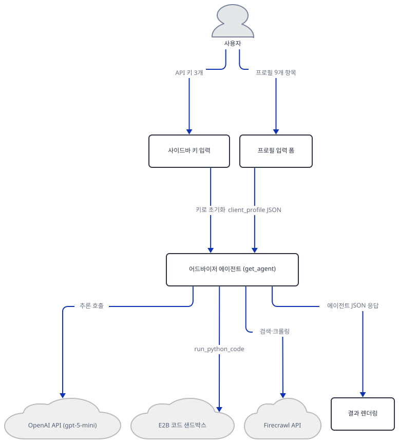
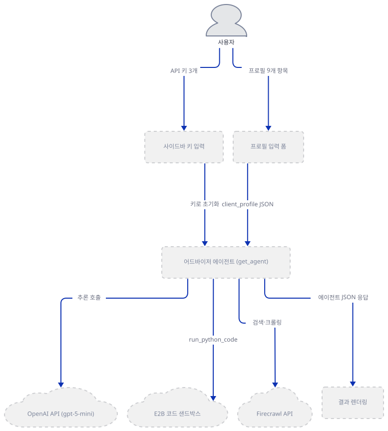
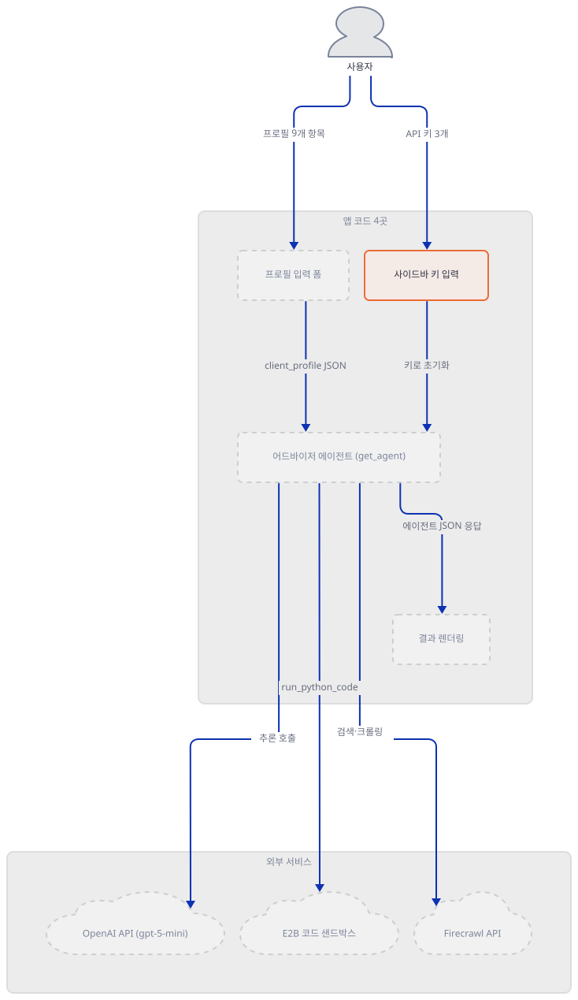
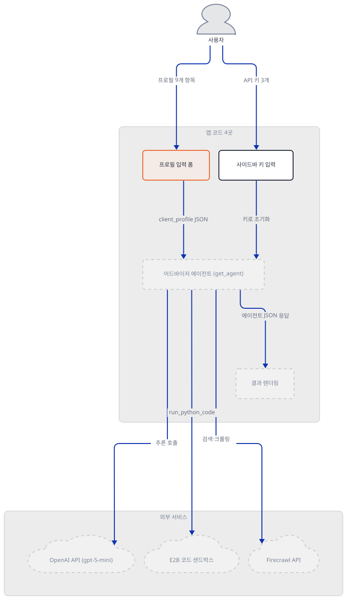
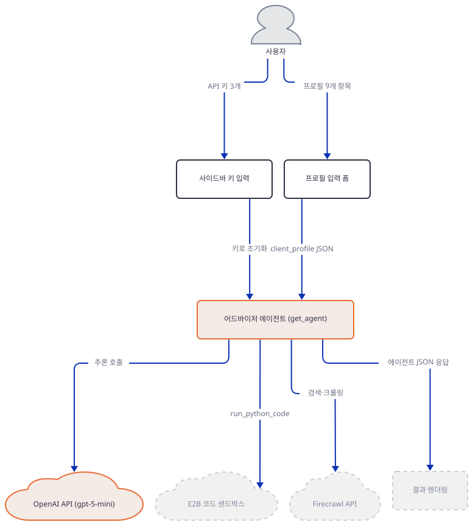
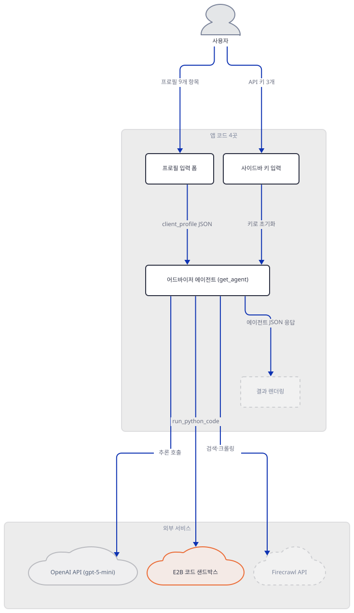
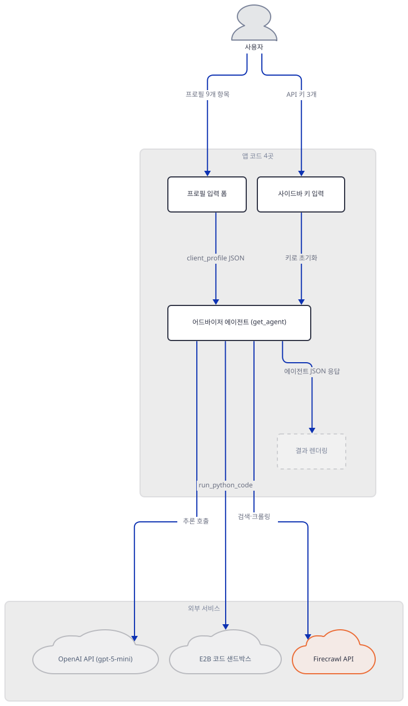
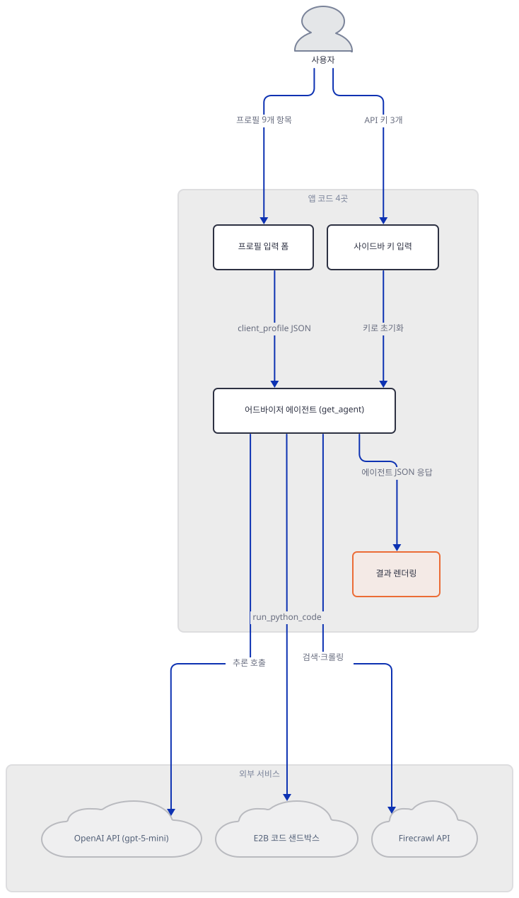
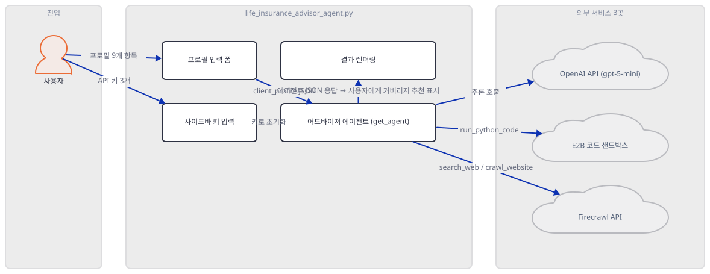
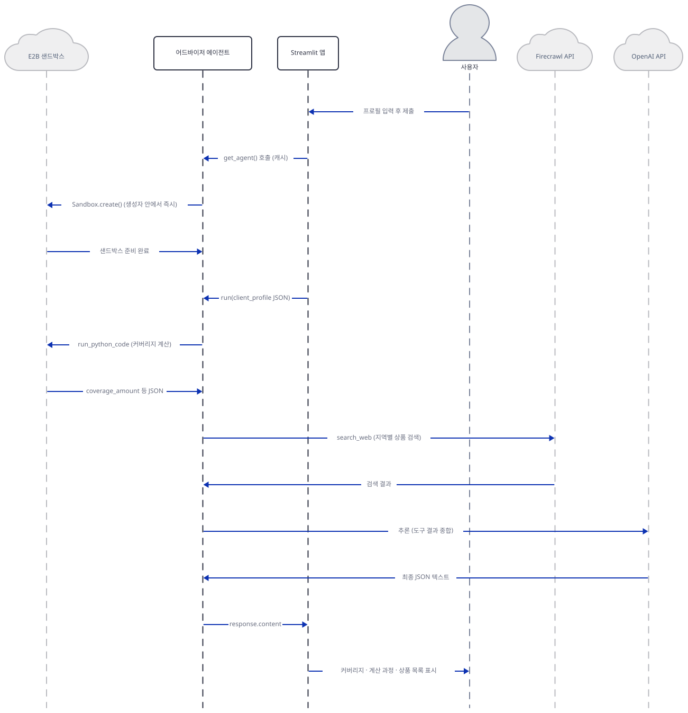

# Day 036 · 🛡️ Life Insurance Coverage Advisor Agent

> 볼륨 3 🌱 Starter AI Agents (추가분) · 난이도 ★★☆ · 예상 소요 75분 · API 비용 대략 질문 1건에 OpenAI gpt-5-mini 호출 1회 + Firecrawl 검색·크롤 소량 + E2B 샌드박스 실행 1회, 업체별 요금표 기준 대략 $0.1 이하 (대략치, 키가 없어 실제 과금은 확인 못함) · 원본 앱: `starter_ai_agents/ai_life_insurance_advisor_agent`

## 오늘 만들 것

오늘은 보험 상담을 흉내 내는 프로토타입 하나를 만듭니다. 나이·소득·부양가족·부채 같은 아홉 개 항목을 입력하면, 에이전트가 세 외부 서비스를 오가며 "권장 보장금액"과 상품 후보 최대 3개를 JSON으로 만들어 화면에 표로 보여줍니다. 이 볼륨에서 지금까지 본 어떤 앱보다도 파일 하나(414줄)가 부르는 외부 서비스가 많습니다 — OpenAI `gpt-5-mini-2025-08-07`이 최종 판단과 응답 글을 쓰고, E2B가 그 계산을 파이썬 코드로 격리된 샌드박스에서 실제로 실행하고, Firecrawl이 사용자가 적은 지역에 맞는 term life 상품을 검색·크롤합니다. 세 키 중 하나라도 비면 버튼을 눌러도 바로 멈추는 구조이고(사이드바 입력창 3개), 이 문서는 그 셋이 각각 정확히 무엇을 하는지 — 특히 E2B가 코드를 어디서 실행하는지, Firecrawl이 무엇을 긁어오는지 — 소스로 확인하며 따라갑니다. 앱 자체도 같은 계산을 두 번 합니다. `compute_local_breakdown`이라는 순수 파이썬 함수가 에이전트에게 시킨 것과 같은 현재가치 공식을 로컬에서 다시 돌려, 화면에 "Formula estimate"와 "Agent recommendation" 두 줄을 나란히 보여줍니다(직접 확인 — Step 7에서 같은 계산을 재현합니다). 분명히 해 둘 것이 하나 있습니다. 이 앱이 실제로 만들어 내는 것은 자격을 갖춘 설계사의 조언이 아니라 GPT-5-mini가 지시문을 따라 작성한 텍스트이고, 코드 하단 고지문도 정확히 그렇게 말합니다 — 이 문서도 같은 선을 지키며, 무엇을 믿을지는 읽는 사람의 몫으로 남깁니다. 완성하면 로컬에서 프로필을 입력해 이 파이프라인 전체가 어떻게 얽히는지 코드 수준에서 이해하게 됩니다. 아래는 완성된 아키텍처입니다.



## 사전 준비

| 서비스/도구 | 용도 | 발급·설치 |
|---|---|---|
| OpenAI API 키 | `gpt-5-mini-2025-08-07` 호출, 최종 커버리지 판단과 JSON 응답 작성 | https://platform.openai.com/api-keys 발급 후 사이드바 입력창에 붙여넣기 |
| Firecrawl API 키 | 지역별 term life 상품 검색(`search_web`)·크롤(`crawl_website`) | https://www.firecrawl.dev/app/api-keys 발급 후 사이드바 입력창에 붙여넣기 |
| E2B API 키 | 커버리지 계산 파이썬 코드를 격리된 샌드박스에서 실행 | https://e2b.dev 가입 후 발급, 사이드바 입력창에 붙여넣기 |
| uv | 가상환경 생성과 패키지 설치 | [공통 사전 준비](../README.md#공통-사전-준비-한-번만) 절 참고 |
| 인터넷 연결 | 세 서비스 모두 접속 필요(이 문서는 키가 없어 실제로 접속하지 않음) | 별도 설치 없음 |

## 아키텍처 한눈에 보기

| 컴포넌트 | 역할 | 코드 위치 |
|---|---|---|
| 사용자 | 사이드바에 키 3개, 폼에 프로필 9개 입력 | 코드 없음 (브라우저) |
| 사이드바 키 입력 | OpenAI·Firecrawl·E2B 키를 `text_input` 3개로 받음 | `starter_ai_agents/ai_life_insurance_advisor_agent/life_insurance_advisor_agent.py:26-50` |
| 프로필 입력 폼 | 나이·소득 등 9개 항목을 받아 `client_profile` 구성 | `starter_ai_agents/ai_life_insurance_advisor_agent/life_insurance_advisor_agent.py:209-278` |
| 어드바이저 에이전트 (`get_agent`) | 모델·두 도구·지시문을 묶어 캐시된 `Agent`를 만듦 | `starter_ai_agents/ai_life_insurance_advisor_agent/life_insurance_advisor_agent.py:156-201` |
| OpenAI API | `gpt-5-mini-2025-08-07`로 추론과 최종 JSON 작성 | 코드 없음 (외부 서비스) |
| E2B 코드 샌드박스 | 커버리지 계산 코드를 격리 환경에서 실행 | 코드 없음 (외부 서비스) |
| Firecrawl API | 지역별 상품 검색·크롤 | 코드 없음 (외부 서비스) |
| 로컬 재계산 (`compute_local_breakdown`) | 에이전트에게 시킨 것과 같은 현재가치 공식을 순수 파이썬으로 재계산 | `starter_ai_agents/ai_life_insurance_advisor_agent/life_insurance_advisor_agent.py:126-153` |
| 결과 렌더링 (`render_recommendations`) | 에이전트 JSON을 표·지표·상품 목록으로 표시하고 로컬 재계산과 나란히 비교 | `starter_ai_agents/ai_life_insurance_advisor_agent/life_insurance_advisor_agent.py:281-378` |

## 단계별 진행

### Step 1. 환경 만들기

**목적.** 격리된 가상환경에 의존성을 설치하고, `requirements.txt`가 적은 하한 버전과 실제로 설치되는 버전이 얼마나 차이 나는지 먼저 확인합니다. 엔트리 파일이 문법적으로 문제없이 컴파일되는지도 봅니다.

**할 일.**

```bash
cd starter_ai_agents/ai_life_insurance_advisor_agent
uv venv
uv pip install -r requirements.txt
```

(pip을 쓴다면 `python -m venv .venv && source .venv/bin/activate && pip install -r requirements.txt`.)

이 저장소는 루트에 `pyproject.toml`이 있어 `uv run`이 방금 만든 환경 대신 루트의 `.venv`를 쓰므로, 이후 `uv run` 명령에는 모두 `--no-project`를 붙입니다.

`starter_ai_agents/ai_life_insurance_advisor_agent/requirements.txt:1-5`

```text
streamlit>=1.32,<2.0
agno>=1.1.7
firecrawl-py>=1.9.0
e2b-code-interpreter>=1.0.3
openai>=1.30.0
```

다섯 줄 모두 하한만 있고 상한이 없습니다. 직접 설치해 보면(Python 3.12) **agno 3.0.10**, **openai 3.17.0**, **streamlit 1.64.0**, **firecrawl-py 4.44.0**, **e2b-code-interpreter 2.10.0**이 받아졌습니다 — `agno`는 하한(1.1.7)보다 메이저 버전이 두 단계, `openai`도 하한(1.30.0)보다 두 메이저 버전 위입니다. Day 001이 `agno>=2.2.10`에서 겪은 것과 같은 패턴입니다. 이 버전 차이에도 아래 확인은 모두 그대로 통과했습니다(직접 확인).



**확인.**

```bash
uv run --no-project python -m py_compile life_insurance_advisor_agent.py && echo compiled
```

```
compiled
```

```bash
uv run --no-project python -c "import streamlit as st; from agno.agent import Agent; from agno.models.openai import OpenAIChat; from agno.tools.e2b import E2BTools; from agno.tools.firecrawl import FirecrawlTools; print('ok')"
```

```
ok
```

```bash
uv run --no-project python -c "import agno, openai, streamlit, firecrawl; print('agno', agno.__version__); print('openai', openai.__version__); print('streamlit', streamlit.__version__); print('firecrawl-py', firecrawl.__version__)"
```

```
agno 3.0.10
openai 3.17.0
streamlit 1.64.0
firecrawl-py 4.44.0
```

```bash
uv pip show e2b-code-interpreter
```

직접 확인한 출력(발췌):

```
Name: e2b-code-interpreter
Version: 2.10.0
```

(`e2b-code-interpreter`는 `__version__` 속성이 없어 `uv pip show`로 확인했습니다.)

### Step 2. 화면 골격과 사이드바: API 키 3개 입력

**목적.** 페이지 제목·설명과, 세 서비스 키를 받는 사이드바를 봅니다. 키가 어디로 들어가는지 — 환경변수가 아니라 화면 입력창이라는 것 — 를 정확히 확인합니다.

**할 일.**

`starter_ai_agents/ai_life_insurance_advisor_agent/life_insurance_advisor_agent.py:12-21`

```python
st.set_page_config(
    page_title="Life Insurance Coverage Advisor",
    page_icon="🛡️",
    layout="centered",
)

st.title("🛡️ Life Insurance Coverage Advisor")
st.caption(
    "Prototype Streamlit app powered by Agno Agents, OpenAI GPT-5, E2B sandboxed code execution, and Firecrawl search."
)
```

`starter_ai_agents/ai_life_insurance_advisor_agent/life_insurance_advisor_agent.py:26-50`

```python
with st.sidebar:
    st.header("API Keys")
    st.write("All keys stay local in your browser session.")
    openai_api_key = st.text_input(
        "OpenAI API Key",
        type="password",
        key="openai_api_key",
        help="Create one at https://platform.openai.com/api-keys",
    )
    firecrawl_api_key = st.text_input(
        "Firecrawl API Key",
        type="password",
        key="firecrawl_api_key",
        help="Create one at https://www.firecrawl.dev/app/api-keys",
    )
    e2b_api_key = st.text_input(
        "E2B API Key",
        type="password",
        key="e2b_api_key",
        help="Create one at https://e2b.dev",
    )
    st.markdown("---")
    st.caption(
        "The agent uses E2B for deterministic coverage math and Firecrawl for fresh term-life product research."
    )
```

세 키는 환경변수를 읽는 게 아니라 `st.text_input(type="password")` 세 개로 화면에서 직접 받습니다. 사이드바 문구는 "All keys stay local in your browser session"이라고 말하지만, 이 말은 절반만 맞습니다 — Step 4에서 보듯 `get_agent`는 이 값을 받자마자 서버 프로세스의 `os.environ`에도 복사합니다. 즉 키는 브라우저를 벗어나지 않는 게 아니라, 벗어나서 이 앱을 서비스하는 파이썬 프로세스 전역 환경변수가 됩니다 — 로컬 1인 실행에서는 차이가 없지만, 여러 사용자가 같은 서버를 공유한다면 뒤에 입력한 키가 앞사람의 `os.environ` 값을 덮어씁니다.



**확인.** 실제 화면은 키가 없어 열지 않았습니다. 대신 모듈을 그대로 임포트해 위젯들이 기본값으로 무엇을 돌려주는지 직접 확인합니다 — 파일명에 하이픈이 없어 평범한 `import`로 됩니다.

```bash
uv run --no-project python -c "
import logging
logging.disable(logging.WARNING)
import life_insurance_advisor_agent as m
print(repr(m.openai_api_key), repr(m.firecrawl_api_key), repr(m.e2b_api_key))
"
```

직접 확인한 출력:

```
'' '' ''
```

(키 입력창 세 개 모두 기본값이 빈 문자열입니다. `import`가 사이드바·폼 블록까지 모듈 최상단에서 그대로 실행하지만 예외 없이 끝난다는 것도 이 호출이 성공했다는 사실로 확인됩니다.)

### Step 3. 프로필 입력 폼과 클라이언트 JSON

**목적.** 사용자가 채우는 9개 입력 항목과, 그 값을 하나의 JSON으로 묶는 `build_client_profile`을 봅니다.

**할 일.**

`starter_ai_agents/ai_life_insurance_advisor_agent/life_insurance_advisor_agent.py:209-263`

```python
with st.form("coverage_form"):
    col1, col2 = st.columns(2)
    with col1:
        age = st.number_input("Age", min_value=18, max_value=85, value=35)
        annual_income = st.number_input(
            "Annual Income",
            min_value=0.0,
            value=85000.0,
            step=1000.0,
        )
        dependents = st.number_input(
            "Dependents",
            min_value=0,
            max_value=10,
            value=2,
            step=1,
        )
        location = st.text_input(
            "Country / State",
            value="United States",
            help="Used to localize recommended insurers.",
        )
    with col2:
        total_debt = st.number_input(
            "Total Outstanding Debt (incl. mortgage)",
            min_value=0.0,
            value=200000.0,
            step=5000.0,
        )
        savings = st.number_input(
            "Savings & Investments available to dependents",
            min_value=0.0,
            value=50000.0,
            step=5000.0,
        )
        existing_cover = st.number_input(
            "Existing Life Insurance",
            min_value=0.0,
            value=100000.0,
            step=5000.0,
        )
        currency = st.selectbox(
            "Currency",
            options=["USD", "CAD", "EUR", "GBP", "AUD", "INR"],
            index=0,
        )

    income_replacement_years = st.selectbox(
        "Income Replacement Horizon",
        options=[5, 10, 15],
        index=1,
        help="Number of years your income should be replaced for dependents.",
    )

    submitted = st.form_submit_button("Generate Coverage & Options")
```

`starter_ai_agents/ai_life_insurance_advisor_agent/life_insurance_advisor_agent.py:266-278`

```python
def build_client_profile() -> Dict[str, Any]:
    return {
        "age": age,
        "annual_income": annual_income,
        "dependents": dependents,
        "location": location,
        "total_debt": total_debt,
        "available_savings": savings,
        "existing_life_insurance": existing_cover,
        "income_replacement_years": income_replacement_years,
        "currency": currency,
        "request_timestamp": datetime.utcnow().isoformat(),
    }
```

`income_replacement_years`는 5·10·15년 중 하나만 고를 수 있는 `selectbox`입니다 — 자유 입력이 아닙니다. `build_client_profile`은 폼 위젯들이 남긴 모듈 전역 변수를 그대로 읽어 JSON 하나로 묶을 뿐, 별도 유효성 검사는 하지 않습니다.



**확인.**

```bash
uv run --no-project python -c "
import logging
logging.disable(logging.WARNING)
import life_insurance_advisor_agent as m
print(m.build_client_profile())
"
```

직접 확인한 출력(타임스탬프는 실행마다 달라집니다):

```
{'age': 35, 'annual_income': 85000.0, 'dependents': 2, 'location': 'United States', 'total_debt': 200000.0, 'available_savings': 50000.0, 'existing_life_insurance': 100000.0, 'income_replacement_years': 10, 'currency': 'USD', 'request_timestamp': '2026-09-22T11:44:54.834986'}
```

기본값(나이 35, 소득 85000 등)이 폼 위젯의 `value=` 인자와 정확히 일치합니다.

### Step 4. 모델 연결: OpenAIChat

**목적.** `get_agent`가 어떻게 캐시되는지, 세 키가 정확히 어디서 `os.environ`으로 복사되는지, 그리고 모델이 무엇으로 지정되는지 봅니다.

**할 일.**

`starter_ai_agents/ai_life_insurance_advisor_agent/life_insurance_advisor_agent.py:156-170`

```python
@st.cache_resource(show_spinner=False)
def get_agent(openai_key: str, firecrawl_key: str, e2b_key: str) -> Optional[Agent]:
    if not (openai_key and firecrawl_key and e2b_key):
        return None

    os.environ["OPENAI_API_KEY"] = openai_key
    os.environ["FIRECRAWL_API_KEY"] = firecrawl_key
    os.environ["E2B_API_KEY"] = e2b_key

    return Agent(
        name="Life Insurance Advisor",
        model=OpenAIChat(
            id="gpt-5-mini-2025-08-07",
            api_key=openai_key,
        ),
```

`@st.cache_resource`는 `(openai_key, firecrawl_key, e2b_key)` 조합별로 `Agent` 인스턴스를 캐시합니다 — 같은 키 세 개로 다시 호출하면 새로 만들지 않고 이전 것을 돌려줍니다. 키가 하나라도 비어 있으면 `Agent`를 만들지 않고 즉시 `None`을 반환합니다(159행) — Step 8에서 이 경로를 직접 확인합니다. Step 2에서 예고한 `os.environ` 복사(161-163행)가 바로 여기이고, 이 세 줄이 실행된 뒤에야 `Agent`가 만들어집니다. 모델은 `OpenAIChat(id="gpt-5-mini-2025-08-07", api_key=openai_key)`로, 앱 README와 사이드바 캡션이 "GPT-5"라고 부르는 모델의 정확한 스냅샷 ID입니다.



**확인.** 실제 키가 없어 `get_agent` 전체는 호출하지 않습니다(이유는 Step 5에서 바로 이어집니다). 모델 객체만 따로 안전하게 만들어 ID를 확인합니다.

```bash
uv run --no-project python -c "
from agno.models.openai import OpenAIChat
m = OpenAIChat(id='gpt-5-mini-2025-08-07', api_key='fake-key-not-real')
print(m.id, m.provider)
"
```

```
gpt-5-mini-2025-08-07 OpenAI
```

(Day 001의 `xAI(...)`와 마찬가지로 `OpenAIChat(...)` 생성자는 이 시점에 실제 인증을 하지 않습니다 — 가짜 키로도 객체가 만들어집니다.)

### Step 5. E2B 도구 연결: 코드는 여기서 실행됩니다

**목적.** `E2BTools`가 무엇을 하는 도구인지, 특히 샌드박스가 언제 만들어지는지를 정확히 봅니다. 이 앱에서 "코드가 실행되는 곳"은 오직 여기 하나입니다.

**할 일.**

`starter_ai_agents/ai_life_insurance_advisor_agent/life_insurance_advisor_agent.py:171-172`

```python
        tools=[
            E2BTools(timeout=180),
```

인자는 `timeout=180`(3분) 하나뿐입니다. 설치된 agno 3.0.10 패키지의 `agno/tools/e2b.py` 소스로 확인하면, `E2BTools.__init__`은 `E2B_API_KEY`가 없으면 즉시 `ValueError`를 내고, 있으면 그 자리에서 바로 `Sandbox.create(api_key=..., timeout=180)`를 호출해 생성자 안에서 샌드박스를 만듭니다(기본 `timeout`은 300초지만 이 앱은 180초로 줄여 부릅니다). 즉 `get_agent`가 성공적으로 끝나는 순간 — 사용자가 아직 아무 질문도 하지 않았어도 — 이미 살아 있는 E2B 샌드박스 하나가 만들어져 있습니다. 같은 소스로 확인한 목록으로, 이렇게 만들어진 도구는 `run_python_code` 하나가 아니라 파일 업로드·다운로드, 임의 셸 명령 실행(`run_command`), 백그라운드 서버 기동과 공개 URL 발급(`run_server`, `get_public_url`), 샌드박스 종료까지 19개 함수를 한꺼번에 LLM에 노출합니다. 이 앱의 지시문(Step 6)은 그중 `run_python_code` 하나만 쓰라고 못박지만, 그 제약은 프롬프트 문장일 뿐 도구 목록 자체를 좁히는 코드는 없습니다.



**확인.** E2B 키가 없고, `E2BTools()`를 실제로 생성하면 곧바로 샌드박스를 만들려는 네트워크 호출이 나가므로(위에서 확인한 대로) 이 문서는 그 생성 자체를 실행하지 않습니다. 대신 생성자 시그니처만 안전하게 들여다봅니다.

```bash
uv run --no-project python -c "
from agno.tools.e2b import E2BTools
import inspect
print(inspect.signature(E2BTools.__init__))
"
```

```
(self, api_key: Optional[str] = None, timeout: int = 300, sandbox_options: Optional[Dict[str, Any]] = None, **kwargs)
```

(`inspect.signature`는 함수를 호출하지 않고 정의만 읽으므로 안전합니다 — 직접 확인. 19개 함수 목록과 생성자 안의 `Sandbox.create()` 호출 자체는 소스를 읽어 확인했을 뿐 실행하지 않았습니다.)

### Step 6. Firecrawl 도구와 지시문: 무엇을 긁어오는가

**목적.** `FirecrawlTools`가 실제로 등록하는 함수가 몇 개인지, 그리고 지시문이 그 함수들에게 정확히 무슨 순서로 무엇을 하라고 시키는지 봅니다. 여기서 지시문과 실제 도구 목록 사이의 불일치 하나를 직접 확인합니다.

**할 일.**

`starter_ai_agents/ai_life_insurance_advisor_agent/life_insurance_advisor_agent.py:173-190`

```python
            FirecrawlTools(
                api_key=firecrawl_key,
                enable_search=True,
                enable_crawl=True,
                enable_scrape=False,
                search_params={"limit": 5, "lang": "en"},
            ),
        ],
        instructions=[
            "You provide conservative life insurance guidance. Your workflow is strictly:",
            "1. ALWAYS call `run_python_code` from the E2B tools to compute the coverage recommendation using the provided client JSON.",
            "   - Treat missing numeric values as 0.",
            "   - Use a default real discount rate of 2% when discounting income replacement cash flows.",
            "   - Compute: discounted_income = annual_income * ((1 - (1 + r)**(-income_replacement_years)) / r).",
            "   - Recommended coverage = max(0, discounted_income + total_debt - savings - existing_life_insurance).",
            "   - Print a JSON with keys: coverage_amount, coverage_currency, breakdown, assumptions.",
            "2. Use Firecrawl `search` followed by optional `scrape_website` calls to gather up-to-date term life insurance options for the client's region.",
            "3. Respond ONLY with JSON containing the following top-level keys: coverage_amount, coverage_currency, breakdown, assumptions, recommendations, research_notes, timestamp.",
```

`enable_search=True, enable_crawl=True, enable_scrape=False`이므로, agno 소스(`agno/tools/firecrawl.py`)의 등록 로직상 이 도구가 실제로 LLM에 노출하는 함수는 `search_web`(검색)과 `crawl_website`(여러 페이지 크롤)뿐입니다 — `enable_scrape=False`라서 단일 URL을 긁는 `scrape_website`는 등록되지 않습니다. 그런데 바로 위 지시문 2번째 줄은 "Use Firecrawl `search` followed by optional `scrape_website` calls"라고, 등록되지도 않은 `scrape_website`를 쓰라고 말합니다. 검색 조건은 `search_params={"limit": 5, "lang": "en"}`로 최대 5건·영어로 고정되어 있고(사용자가 다른 언어권 지역을 입력해도 그대로입니다), 지시문 1번째 줄은 E2B의 `run_python_code`에게 커버리지 계산을 시키는 문장(위 인용 3번째 줄)입니다. 이어지는 3번째 줄부터(인용에는 없음, 191-199행)는 최종 응답이 갖춰야 할 JSON 최상위 키 7개(`coverage_amount`, `coverage_currency`, `breakdown`, `assumptions`, `recommendations`, `research_notes`, `timestamp`)를 하나씩 못박습니다.



**확인.** `FirecrawlApp` 생성자는 설정만 저장할 뿐 네트워크를 부르지 않으므로(agno·firecrawl-py 소스로 확인), 가짜 키로 안전하게 실제 등록 목록을 직접 뽑아 봅니다.

```bash
uv run --no-project python -c "
from agno.tools.firecrawl import FirecrawlTools
t = FirecrawlTools(api_key='fake-key-not-real', enable_search=True, enable_crawl=True, enable_scrape=False, search_params={'limit': 5, 'lang': 'en'})
print(sorted(t.functions))
"
```

직접 확인한 출력:

```
['crawl_website', 'search_web']
```

(`scrape_website`가 목록에 없다는 것을 코드로 직접 확인했습니다 — 지시문이 요구하는 이름과 실제 도구 목록이 어긋나는 지점입니다.)

### Step 7. 결과 렌더링: 같은 공식을 두 번 계산해 나란히 보여주기

**목적.** 에이전트가 돌려준 JSON을 화면에 표시하기 전에, 앱이 왜 같은 계산을 로컬에서 다시 하는지 봅니다. `compute_local_breakdown`은 Step 6의 지시문 1번이 E2B 샌드박스에게 시킨 것과 같은 현재가치 공식을 순수 파이썬으로 재현합니다.

**할 일.**

`starter_ai_agents/ai_life_insurance_advisor_agent/life_insurance_advisor_agent.py:126-153`

```python
def compute_local_breakdown(profile: Dict[str, Any], real_rate: float) -> Dict[str, float]:
    """Replicate the coverage math locally so we can show it to the user."""
    income = safe_number(profile.get("annual_income"))
    years = max(0, int(profile.get("income_replacement_years", 0) or 0))
    total_debt = safe_number(profile.get("total_debt"))
    savings = safe_number(profile.get("available_savings"))
    existing_cover = safe_number(profile.get("existing_life_insurance"))

    if real_rate <= 0:
        discounted_income = income * years
        annuity_factor = years
    else:
        annuity_factor = (1 - (1 + real_rate) ** (-years)) / real_rate if years else 0
        discounted_income = income * annuity_factor

    assets_offset = savings + existing_cover
    recommended = max(0.0, discounted_income + total_debt - assets_offset)

    return {
        "income": income,
        "years": years,
        "real_rate": real_rate,
        "annuity_factor": annuity_factor,
        "discounted_income": discounted_income,
        "debt": total_debt,
        "assets_offset": -assets_offset,
        "recommended": recommended,
    }
```

`starter_ai_agents/ai_life_insurance_advisor_agent/life_insurance_advisor_agent.py:317-327`

```python
    st.subheader("Step-by-step Coverage Math")
    step_rows = [
        ("Annuity factor", f"{local_breakdown['annuity_factor']:.3f}"),
        ("Discounted income replacement", format_currency(local_breakdown["discounted_income"], coverage_currency)),
        ("+ Outstanding debt", format_currency(local_breakdown["debt"], coverage_currency)),
        ("- Assets & existing cover", format_currency(local_breakdown["assets_offset"], coverage_currency)),
        ("= Formula estimate", format_currency(local_breakdown["recommended"], coverage_currency)),
    ]
    step_rows.append(("= Agent recommendation", format_currency(coverage_amount, coverage_currency)))

    st.table({"Step": [s for s, _ in step_rows], "Amount": [a for _, a in step_rows]})
```

`render_recommendations`는 에이전트가 만든 `coverage_amount`를 그대로 믿고 보여주는 대신, 같은 프로필로 `compute_local_breakdown`을 로컬에서 한 번 더 돌려 "Formula estimate"(로컬 계산)와 "Agent recommendation"(에이전트 값)을 같은 표의 마지막 두 줄에 나란히 놓습니다. 지시문이 E2B에게 같은 공식을 쓰라고 시켰다고 해서 두 값이 항상 같으리라는 보장은 없습니다 — LLM이 그 지시를 그대로 따랐는지 확인할 방법은 이 두 번째 줄뿐입니다.



**확인.** 예시 프로필(기본값)로 로컬 계산만 직접 실행합니다 — 에이전트도 E2B도 부르지 않습니다.

```bash
uv run --no-project python -c "
import logging
logging.disable(logging.WARNING)
import life_insurance_advisor_agent as m
profile = m.build_client_profile()
print(m.compute_local_breakdown(profile, 0.02))
"
```

직접 확인한 출력(프로필 기본값이 고정돼 있어 타임스탬프 외 나머지 값은 실행마다 같습니다):

```
{'income': 85000.0, 'years': 10, 'real_rate': 0.02, 'annuity_factor': 8.982585006242244, 'discounted_income': 763519.7255305907, 'debt': 200000.0, 'assets_offset': -150000.0, 'recommended': 813519.7255305907}
```

기본 프로필(소득 85,000 · 10년 · 부채 200,000 · 저축 50,000 · 기존 보장 100,000, 실질 할인율 2%)의 "Formula estimate"는 약 813,520입니다 — 화면의 "Agent recommendation" 줄과 다르면, 그 차이가 바로 LLM이 지시문의 공식을 얼마나 정확히 따랐는지를 보여줍니다.

### Step 8. 실행, 안전장치, 그리고 고지문

**목적.** "Generate Coverage & Options"를 눌렀을 때 실제로 무슨 일이 일어나는지 끝까지 보고, 키가 없을 때 이 코드가 정말 안전하게 멈추는지 직접 확인합니다. 그리고 이 앱의 출력을 어떻게 읽어야 하는지 정리합니다.

**할 일.**

`starter_ai_agents/ai_life_insurance_advisor_agent/life_insurance_advisor_agent.py:381-408`

```python
if submitted:
    if not all([openai_api_key, firecrawl_api_key, e2b_api_key]):
        st.error("Please configure OpenAI, Firecrawl, and E2B API keys in the sidebar.")
        st.stop()

    advisor_agent = get_agent(openai_api_key, firecrawl_api_key, e2b_api_key)
    if not advisor_agent:
        st.error("Unable to initialize the advisor. Double-check API keys.")
        st.stop()

    client_profile = build_client_profile()
    user_prompt = (
        "You will receive a JSON object describing the client's profile. Follow your workflow instructions to calculate coverage and surface suitable products.\n"
        f"Client profile JSON: {json.dumps(client_profile)}"
    )

    with st.spinner("Consulting advisor agent..."):
        response = advisor_agent.run(user_prompt, stream=False)

    parsed = extract_json(response.content if response else "")
    if not parsed:
        st.error("The agent returned an unexpected response. Enable debug below to inspect raw output.")
        with st.expander("Raw agent output"):
            st.write(response.content if response else "<empty>")
    else:
        render_recommendations(parsed, client_profile)
        with st.expander("Agent debug"):
            st.write(response.content)
```

키 세 개 중 하나라도 비면 `st.error` 후 `st.stop()`으로 멈추고, `get_agent`가 `None`을 돌려줘도(키가 여전히 없거나 잘못됐을 때) 같은 방식으로 멈춥니다. 통과하면 `build_client_profile()`로 만든 JSON을 프롬프트에 박아 `advisor_agent.run(...)`을 호출하고, 돌아온 텍스트를 `extract_json`으로 파싱합니다 — 실패하면 원문을 펼침 상자에 그대로 보여주고, 성공하면 `render_recommendations`(Step 7)로 넘깁니다.

**agno 텔레메트리.** 성공한 `advisor_agent.run(...)` 호출마다 agno 3.0.10이 os-api.agno.com으로 agent_id·모델 provider 등을 담은 익명 사용 통계를 백그라운드로 보냅니다 — 끄는 법과 자세한 동작은 Day 047 Step 5 참고(`AGNO_TELEMETRY=false`). 위 확인 명령은 키가 없어 이 지점까지 가지 않지만, 실제 키로 성공시키면 매번 전송됩니다. 이 앱은 `AgentOS`를 띄우지 않으므로 서버 기동 시의 `POST /telemetry/os`는 해당하지 않습니다.

`starter_ai_agents/ai_life_insurance_advisor_agent/life_insurance_advisor_agent.py:410-414`

```python
st.divider()
st.caption(
    "This prototype is for educational use only and does not provide licensed financial advice. "
    "Verify all recommendations with a qualified professional and the insurers listed."
)
```

화면 맨 아래(그리고 앱 자체 README의 Disclaimer)에 있는 이 문장이 이 앱의 출력을 규정합니다 — 화면에 뜨는 숫자와 상품명은 GPT-5-mini가 지시문을 따라 생성한 텍스트이지, 자격을 갖춘 보험 설계사의 권고가 아닙니다. Step 7의 "Formula estimate" 대비표도 그 텍스트를 검산하는 보조 장치일 뿐, 조언의 신뢰도를 보증하지 않습니다. 이 문서도 여기서 더 나아가 특정 보장금액이나 상품을 권하지 않습니다.



**확인.** 키 없이 폼을 제출한 것처럼 `st.form_submit_button`만 `True`를 돌려주도록 바꿔치기하고(키 입력창은 그대로 빈 문자열입니다), 정말 안전하게 멈추는지 직접 확인합니다.

```bash
uv run --no-project python -c "
import logging
logging.disable(logging.WARNING)
import streamlit as st
st.form_submit_button = lambda *a, **k: True
errors = []
st.error = lambda msg, *a, **k: errors.append(msg)
try:
    import life_insurance_advisor_agent as m
except AttributeError as e:
    print('AttributeError:', e)
print('errors shown:', errors)
"
```

직접 확인한 출력:

```
AttributeError: 'NoneType' object has no attribute 'run'
errors shown: ['Please configure OpenAI, Firecrawl, and E2B API keys in the sidebar.', 'Unable to initialize the advisor. Double-check API keys.']
```

두 `st.error` 메시지가 소스 그대로 순서대로 찍힙니다. 다만 `AttributeError`가 뜬 것에는 사연이 있습니다 — 이 버전(streamlit 1.64.0)의 `st.stop()`은 실제 스크립트 실행 컨텍스트가 없으면 아무 일도 하지 않고 조용히 다음 줄로 넘어갑니다(직접 확인). 그래서 첫 `st.stop()`을 지나 `get_agent("", "", "")`가 호출되는데, 159행의 가드(Step 4) 덕분에 `E2BTools`나 `Agent`를 만들지 않고 즉시 `None`을 돌려주므로 네트워크 호출은 전혀 일어나지 않습니다. 그다음 두 번째 `st.stop()`도 다시 없는 셈 치고 넘어가면서 `advisor_agent.run(...)`을 호출하려다 `None`에는 `run`이 없어 이 예외가 난 것입니다 — 이 예외는 이 확인 스크립트가 잡은 것이지 앱 코드가 잡은 게 아니며, 실제 `streamlit run`에서는 `st.stop()`이 정상적으로 멈춥니다.

마지막으로, 이 앱 실행 경로 어디에도 콘솔에 이모지를 찍는 `print`는 없어 Day 019가 짚은 `cp949` 콘솔 오류는 여기서는 나지 않습니다(소스로 확인) — 대신 `datetime.utcnow()`가 Python 3.12+에서 경고를 냅니다.

```bash
uv run --no-project python -c "
import logging, warnings
logging.disable(logging.WARNING)
import life_insurance_advisor_agent as m
with warnings.catch_warnings(record=True) as w:
    warnings.simplefilter('always')
    m.build_client_profile()
    print(w[0].category.__name__ + ':', w[0].message)
"
```

직접 확인한 출력:

```
DeprecationWarning: datetime.datetime.utcnow() is deprecated and scheduled for removal in a future version. Use timezone-aware objects to represent datetimes in UTC: datetime.datetime.now(datetime.UTC).
```

## 요청 한 건이 흐르는 과정



폼을 제출하면 `get_agent()`가 캐시를 확인하고, 없으면 새로 만듭니다 — 이 생성 과정 안에서 `E2BTools`의 생성자가 곧바로 `Sandbox.create()`를 호출해 샌드박스를 먼저 마련합니다(Step 5에서 소스로 확인, 실행하지 않음). 에이전트가 준비되면 `run(client_profile JSON)`이 호출되고, 지시문 1번에 따라 먼저 E2B 샌드박스에서 `run_python_code`로 커버리지를 계산합니다(Step 6·7에서 다룬 것과 같은 공식). 그다음 지시문 2번에 따라 Firecrawl의 `search_web`으로 지역 상품을 검색하고(크롤 도구 `crawl_website`도 등록돼 있어 모델이 필요하면 추가로 부를 수 있습니다), 두 도구의 결과를 모아 OpenAI에 마지막으로 보내 최종 JSON 텍스트를 받습니다. 이 텍스트는 `response.content`로 돌아와 `extract_json`이 파싱하고, 성공하면 Step 7의 렌더링(로컬 재계산과 나란히 비교)을 거쳐 화면에 표시됩니다. 이 시퀀스 중 실제로 실행해 확인한 부분은 로컬 재계산(Step 7)과 안전장치 경로(Step 8)뿐이고, 샌드박스 생성과 세 서비스 호출 자체는 이 문서가 키 없이 실행할 수 없어 소스와 지시문 텍스트로만 재구성했습니다 — 키가 있으면 이 자리에서 실제 커버리지 숫자와 상품 목록이 옵니다.

## 실행 체크리스트

- [ ] OpenAI·Firecrawl·E2B 키 3개를 각각 발급받아 두었다
- [ ] `uv venv && uv pip install -r requirements.txt`로 의존성을 설치하고, 실제 설치된 버전이 `requirements.txt`의 하한보다 최신이라는 것을 확인했다
- [ ] `uv run streamlit run life_insurance_advisor_agent.py`로 서버를 띄우고 사이드바 키 입력창 3개와 프로필 입력 폼을 확인했다
- [ ] `FirecrawlTools`가 실제로 등록하는 함수가 `search_web`·`crawl_website` 둘뿐이고, 지시문이 말하는 `scrape_website`는 등록되지 않는다는 것을 코드로 확인했다
- [ ] `compute_local_breakdown`을 직접 호출해 기본 프로필의 "Formula estimate"(약 813,520)를 계산해봤다
- [ ] `E2BTools`의 생성자가 만들어지는 즉시 샌드박스를 만든다는 것과, 이 앱이 왜 19개 함수 중 `run_python_code` 하나만 쓰라고 지시문으로 제한하는지 이해했다
- [ ] 화면 하단과 사이드바의 고지문을 읽고, 이 앱의 출력이 자격을 갖춘 전문가의 조언이 아니라 LLM이 지시문에 따라 작성한 텍스트라는 것을 확인했다

## 문제 해결

| 증상 | 원인 | 해결 |
|---|---|---|
| `requirements.txt`를 그대로 설치했는데 `agno`·`openai`가 하한 버전보다 메이저 버전이 두 단계나 높게 깔림 | 다섯 줄 모두 하한만 있고 상한이 없다(직접 확인: agno 1.1.7→3.0.10, openai 1.30.0→3.17.0, firecrawl-py 1.9.0→4.44.0, e2b-code-interpreter 1.0.3→2.10.0) | Day 001과 같은 패턴. import·`py_compile`이 모두 통과하면 그대로 진행. 정확히 재현하려면 이 문서가 확인한 버전으로 직접 고정 설치 |
| `FirecrawlTools`에게 시킨 지시문대로 모델이 `scrape_website`를 부르려 해도 그런 도구가 없음 | 생성자가 `enable_scrape=False`로 호출돼(`starter_ai_agents/ai_life_insurance_advisor_agent/life_insurance_advisor_agent.py:173-179`) `scrape_website`가 애초에 등록되지 않는다(직접 확인, Step 6) | 코드 결함이자 알려진 문제로 기록. `enable_scrape=True`로 바꾸면 등록됨(더 해보기에서 검증) |
| 안전하게 테스트하려고 `st.form_submit_button`을 `True`로 바꿔치기했는데 `st.error` 이후에도 실행이 멈추지 않고 다음 줄로 넘어가 결국 `AttributeError`가 남 | 실제 `ScriptRunContext`가 없는 환경에서 `st.stop()`이 아무 일도 하지 않는다(streamlit 1.64.0, 직접 확인) | 앱의 결함이 아니라 이런 방식의 오프라인 테스트가 갖는 특성. 실제 `streamlit run`에서는 정상적으로 멈춤 |
| `build_client_profile()`을 호출하면 `DeprecationWarning: datetime.datetime.utcnow() is deprecated ...`가 뜸 | Python 3.12부터 `datetime.utcnow()`가 폐기 예정으로 표시된다(직접 확인, `starter_ai_agents/ai_life_insurance_advisor_agent/life_insurance_advisor_agent.py:277`) | 아직 제거되지는 않아 동작에는 지장 없음. 경고를 없애려면 `datetime.now(timezone.utc)`로 교체 |
| `E2BTools()`를 직접 만들어 함수 목록을 확인해보려 하면 실제 E2B 서비스에 연결을 시도함 | 생성자가 그 자리에서 `Sandbox.create()`를 호출한다(agno 3.0.10 소스로 확인, Step 5) — 생성 자체가 네트워크 호출이라는 점에서 `FirecrawlTools()`와 다름 | 유효한 키 없이는 생성하지 말 것. 함수 목록이 궁금하면 이 문서처럼 소스를 읽거나 `inspect.signature`로 생성자만 본다 |

## 더 해보기

- `FirecrawlTools`의 `enable_scrape=False`를 `True`로 바꿔(`starter_ai_agents/ai_life_insurance_advisor_agent/life_insurance_advisor_agent.py:173-179`) Step 6과 같은 방식으로 `sorted(t.functions)`를 다시 뽑아보고, `scrape_website`가 실제로 등록되는지, 그러면 지시문(`starter_ai_agents/ai_life_insurance_advisor_agent/life_insurance_advisor_agent.py:189`)과 도구 목록이 맞아떨어지는지 확인해보기
- `compute_local_breakdown`(`starter_ai_agents/ai_life_insurance_advisor_agent/life_insurance_advisor_agent.py:126-153`)을 `real_rate=0.04`로 호출해 기본 프로필의 "Formula estimate"가 2%일 때(약 813,520)보다 얼마나 낮아지는지 계산해보기
- `income_replacement_years`의 `options`(`starter_ai_agents/ai_life_insurance_advisor_agent/life_insurance_advisor_agent.py:256-261`)에 `25`나 `40`을 추가해 `compute_local_breakdown`에 직접 넘겨보고, `annuity_factor`가 연 수가 커질수록 `1/real_rate`(=50)에 어떻게 가까워지는지 관찰해보기

## 다음 날 예고

[Day 037 · AI Reasoning Agent](../day037-ai-reasoning-agent/README.md) — 화면 없이 콘솔에서, 같은 질문("supercalifragilisticexpialidocious"의 r 개수)에 일반 에이전트와 `reasoning=True` 에이전트가 어떻게 다르게 답하는지 나란히 비교하는 아주 짧은 앱을 다룹니다.
