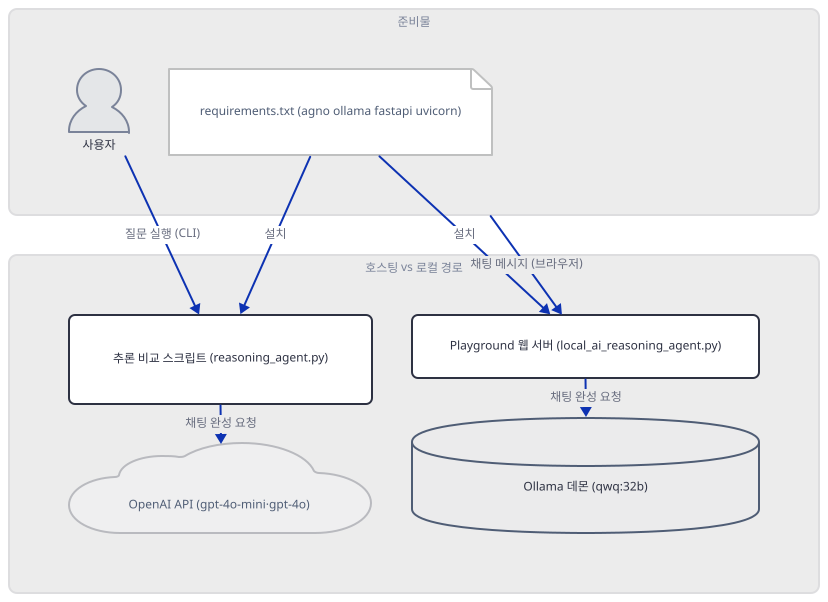
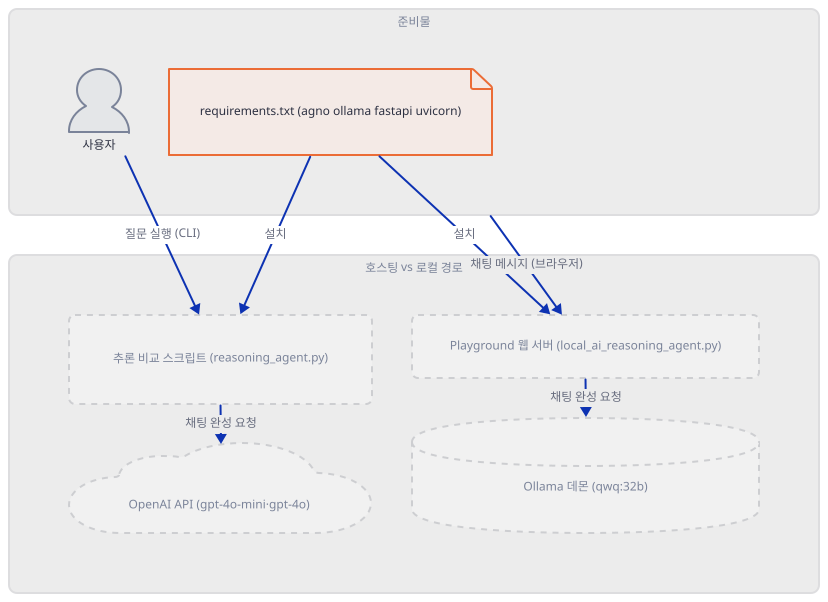
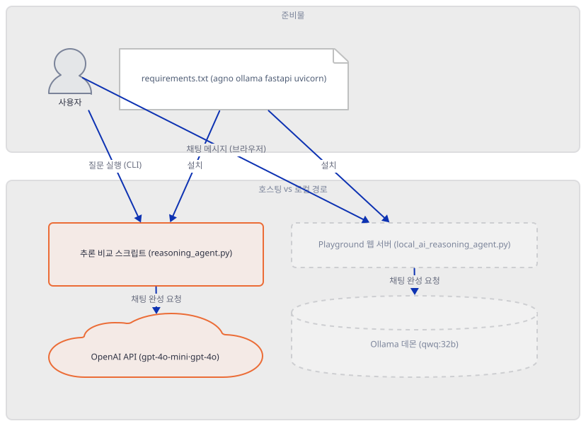
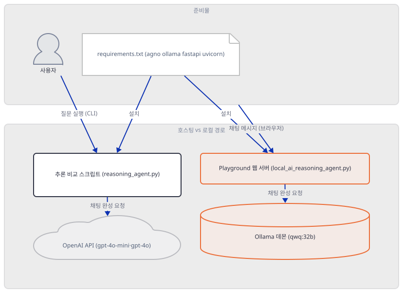
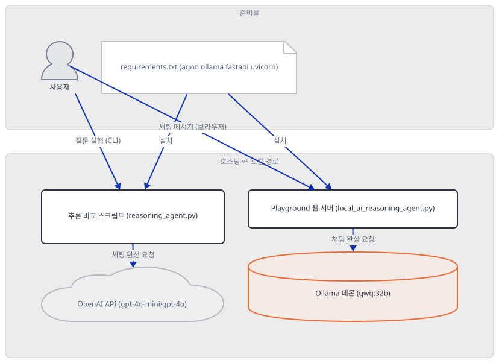
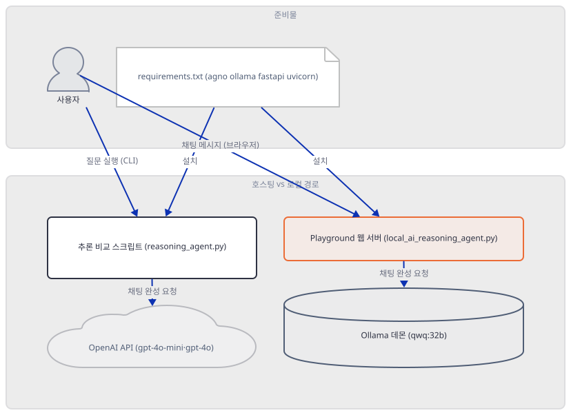
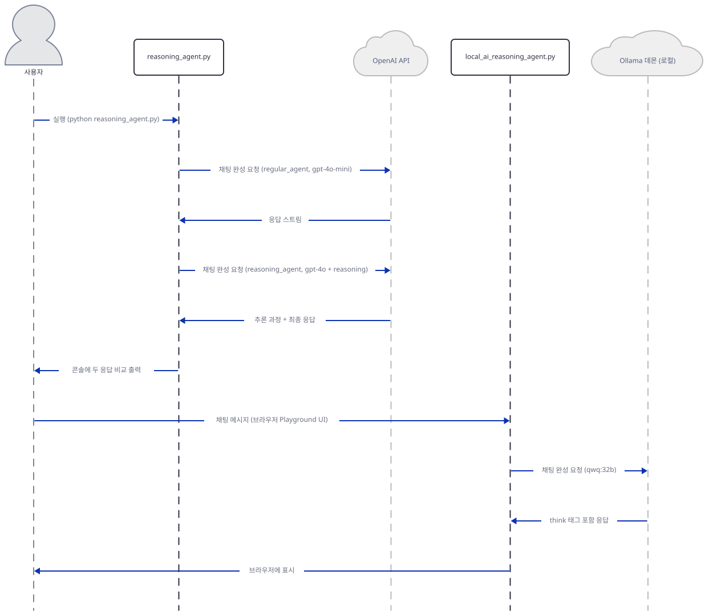

# Day 037 · AI Reasoning Agent

> 볼륨 3 🌱 Starter AI Agents (추가분) · 난이도 ★★☆ · 예상 소요 60분 · API 비용 대략 무료 — 호스팅 경로(`reasoning_agent.py`)는 키가 없어 실제 호출까지 가지 못하고, 로컬 경로(`local_ai_reasoning_agent.py`)는 Ollama 자체가 무료입니다(다만 `qwq:32b`를 실제로 받으면 디스크 약 20GB, Step 4) · 원본 앱: `starter_ai_agents/ai_reasoning_agent`

## 오늘 만들 것

이 폴더는 이 시리즈에서 가장 작습니다 — 파이썬 코드가 두 파일에 걸쳐 31줄뿐입니다(`reasoning_agent.py` 19줄, `local_ai_reasoning_agent.py` 12줄. 편집기·GitHub 기준 개행 보정 값이고, 두 파일 다 마지막 줄에 개행이 없어 `wc -l`은 각각 하나씩 적게 셉니다 — 직접 확인). 두 파일은 사실 같은 아이디어입니다: `agno`의 `Agent`에 채팅 모델 하나를 물려 실행하는 것. 다른 것은 그 모델이 어디서 도는가뿐입니다. `reasoning_agent.py`는 OpenAI의 호스팅 모델(`gpt-4o-mini` 일반 에이전트와 `gpt-4o` + 추론 옵션 에이전트)을 나란히 비교하고, `local_ai_reasoning_agent.py`는 API 키 없이 **독자 자신의 기계**에서 도는 Ollama의 `qwq:32b`를 씁니다. `requirements.txt`는 단 네 줄(`agno`, `ollama`, `fastapi`, `uvicorn`)인데, 31줄짜리 코드 어디에도 `fastapi`나 `uvicorn`을 직접 import하는 줄은 없습니다(Step 5에서 grep으로 확인) — 죽은 의존성처럼 보이지만 그렇지 않습니다. 그리고 이 문서를 준비하며 실제로 설치해 실행해 보니, 두 파일 다 지금 받아지는 agno(무버전고정 기준 3.0.10)에서는 그대로 동작하지 않았습니다: `reasoning_agent.py`는 `Agent(..., reasoning=True, ...)`가 `TypeError`로 즉시 멈추고(그 불리언 플래그가 사라졌습니다), `local_ai_reasoning_agent.py`는 `from agno.playground import ...`부터 `ModuleNotFoundError`가 납니다(그 모듈 자체가 없어졌습니다). 51줄짜리 원본 README가 코드 31줄보다 긴 이유를 그대로 믿는 대신, 이 문서는 그 코드가 지금도 설명대로 동작하는지부터 확인합니다 — 두 경로가 정확히 어디서 멈추는지, 무엇으로 바뀌었는지, 그리고 로컬 모델을 실제로 받으면 디스크와 메모리에 무엇이 드는지까지가 오늘의 범위입니다.



## 사전 준비

| 서비스/도구 | 용도 | 발급·설치 |
|---|---|---|
| OpenAI API 키 (`OPENAI_API_KEY`, 선택) | `reasoning_agent.py`의 두 에이전트가 실제로 응답을 받으려면 필요. 이 문서는 키를 발급하지 않고, 없을 때 정확히 어디서 멈추는지만 확인 | https://platform.openai.com/api-keys 발급 후 환경변수로 설정 (이 실습에서는 생략 가능) |
| Ollama (선택, 로컬 경로) | `local_ai_reasoning_agent.py`가 실제로 응답하려면 Ollama 데몬과 `qwq:32b` 모델이 필요. 이 환경에는 Ollama 0.34.2가 이미 설치돼 있었지만(직접 확인) `qwq:32b`는 받지 않았습니다 | https://ollama.com/download 에서 설치. 모델을 받기 전에 Step 4의 디스크·메모리 비용부터 확인 |
| uv | 가상환경 생성과 패키지 설치 | [공통 사전 준비](../README.md#공통-사전-준비-한-번만) 절 참고 |
| 인터넷 연결 | PyPI에서 패키지 설치, (로컬 경로를 실제로 쓰려면) Ollama 데몬 접속 | 별도 설치 없음 |

## 아키텍처 한눈에 보기

| 컴포넌트 | 역할 | 코드 위치 |
|---|---|---|
| 사용자 | CLI로 `reasoning_agent.py` 실행, 또는 브라우저로 로컬 웹 UI 접속 | 코드 없음 |
| `requirements.txt` | agno·ollama·fastapi·uvicorn 네 줄 — 실제로는 이것만으로 모자람(Step 1) | `starter_ai_agents/ai_reasoning_agent/requirements.txt:1-4` |
| 추론 비교 스크립트 (`reasoning_agent.py`) | 일반 에이전트(`gpt-4o-mini`)와 추론 에이전트(`gpt-4o`)의 응답을 나란히 비교 | `starter_ai_agents/ai_reasoning_agent/reasoning_agent.py:1-19` |
| OpenAI API | `gpt-4o-mini`·`gpt-4o` 채팅 완성 수행 | 코드 없음 (외부 서비스) |
| Playground 웹 서버 (`local_ai_reasoning_agent.py`) | 로컬 Ollama 에이전트를 감싸 브라우저로 서빙 — 이 이름 자체가 agno 3.0.10에서는 사라짐(Step 3) | `starter_ai_agents/ai_reasoning_agent/local_ai_reasoning_agent.py:1-12` |
| Ollama 데몬 | `qwq:32b`를 읽어와 로컬에서 추론 수행, 기본 포트 11434 | 코드 없음 (로컬 서비스, 이 리포 밖) |

## 단계별 진행

### Step 1. 환경 만들기 — `requirements.txt` 네 줄로는 모자란다

**목적.** 격리된 가상환경에 이 앱의 의존성을 설치하고, 두 스크립트가 실제로 무엇을 더 요구하는지 직접 확인합니다.

**할 일.**

```bash
cd starter_ai_agents/ai_reasoning_agent
uv venv
uv pip install -r requirements.txt
```

(pip 대안: `python -m venv .venv && source .venv/bin/activate && pip install -r requirements.txt`. Windows PowerShell은 활성화만 `.venv\Scripts\Activate.ps1`로 바꿉니다.)

이 저장소는 루트에 `pyproject.toml`이 있어 `uv run`이 방금 만든 환경 대신 루트의 `.venv`를 쓰므로, 이후 `uv run` 명령에는 모두 `--no-project`를 붙입니다.

`starter_ai_agents/ai_reasoning_agent/requirements.txt:1-4`

```text
agno
ollama
fastapi
uvicorn
```

(4줄, 마지막 줄에 개행이 없어 `wc -l`은 3으로 셉니다.) 이 문서를 작성하며 설치했을 때는 **agno 3.0.10**, **ollama(파이썬 클라이언트) 0.6.2**, **fastapi 0.141.1**, **uvicorn 0.53.0**이 받아졌습니다(직접 확인 — 넷 다 버전 고정이 없어 2026-09-22 기준 최신입니다). `py_compile`은 둘 다 통과합니다.

```bash
uv run --no-project python -m py_compile reasoning_agent.py local_ai_reasoning_agent.py && echo compiled
```

```
compiled
```

그런데 실제 import는 **둘 다** 막힙니다 — `reasoning_agent.py` 쪽은 물론이고, OpenAI를 전혀 언급하지 않는 `local_ai_reasoning_agent.py` 쪽도 마찬가지입니다.

```bash
uv run --no-project python -c "from agno.agent import Agent; from agno.models.openai import OpenAIChat"
```

```
ImportError: `openai` not installed. Please install using `pip install openai`
```

```bash
uv run --no-project python -c "from agno.agent import Agent; from agno.models.ollama import Ollama"
```

```
ImportError: `openai` not installed. Please install using `pip install openai`
```

같은 오류입니다. agno 3.0.10의 `agno.models.ollama` 패키지는 `Ollama` 클래스만이 아니라 `OllamaResponses`(Ollama의 OpenAI 호환 `/v1/responses` 엔드포인트용 클래스)도 함께 import하는데, 이 클래스가 `agno.models.openai.open_responses`를 거쳐 결국 `openai` 패키지를 요구합니다(소스로 확인, agno 3.0.10의 `agno/models/ollama/__init__.py`와 `agno/models/ollama/responses.py`) — `local_ai_reasoning_agent.py`는 `Ollama`만 쓰고 `OllamaResponses`는 쓰지 않는데도, 패키지 초기화 자체가 이를 강제합니다. `requirements.txt` 네 줄에는 `openai`가 없고, agno 자신도 `openai`를 필수가 아니라 선택 extra로만 선언해 두어(직접 확인 아래) 자동으로 딸려오지 않습니다.

```bash
uv run --no-project python -c "
import importlib.metadata as m
print([x for x in m.requires('agno') if 'fastapi' in x or 'uvicorn' in x or x.startswith('openai')])
"
```

```
['fastapi; extra == "dev"', 'uvicorn; extra == "dev"', 'fastapi; extra == "os"', 'uvicorn; extra == "os"', 'openai>=1.106.0; extra == "openai"', 'fastapi; extra == "demo"', 'uvicorn; extra == "demo"', 'openai; extra == "demo"']
```

`extra ==` 조건이 없는 무조건 의존성은 하나도 없습니다 — `fastapi`·`uvicorn`·`openai` 모두 `pip install agno`만으로는 따라오지 않습니다. 그래서 한 줄을 더 설치합니다.

```bash
uv pip install openai
```

**그림.**



**확인.** 이제 두 경로 모두 import는 통과합니다(실행 결과는 Step 2·3에서 갈립니다).

```bash
uv run --no-project python -c "from agno.agent import Agent; from agno.models.openai import OpenAIChat; from rich.console import Console; print('ok')"
uv run --no-project python -c "from agno.agent import Agent; from agno.models.ollama import Ollama; print('ok')"
```

```
ok
ok
```

### Step 2. 호스팅 경로(`reasoning_agent.py`) — 사라진 `reasoning=True`

**목적.** `gpt-4o-mini` 일반 에이전트와 `gpt-4o` 추론 에이전트를 나란히 비교하는 구조를 읽고, 이 파일을 그대로 실행하면 실제로 어디서 멈추는지 확인합니다.

**할 일.**

`starter_ai_agents/ai_reasoning_agent/reasoning_agent.py:1-12`

```python
from agno.agent import Agent
from agno.models.openai import OpenAIChat
from rich.console import Console

regular_agent = Agent(model=OpenAIChat(id="gpt-4o-mini"), markdown=True)
console = Console()
reasoning_agent = Agent(
    model=OpenAIChat(id="gpt-4o"),
    reasoning=True,
    markdown=True,
    structured_outputs=True,
)
```

`regular_agent`는 평범한 `gpt-4o-mini` 채팅 에이전트입니다. `reasoning_agent`는 같은 `Agent` 클래스에 `gpt-4o`(추론 전용 모델이 아닌 일반 채팅 모델)를 물리고 `reasoning=True`를 얹어 "추론을 하게" 만들려는 의도입니다. 그런데 이 스크립트를 그대로 실행하면 두 에이전트 중 어느 쪽 응답도 보지 못합니다 — `regular_agent.print_response(...)`가 호출되기도 전에, `reasoning_agent` 생성 자체가 실패합니다.

```bash
uv run --no-project python reasoning_agent.py
```

```
Traceback (most recent call last):
  File "reasoning_agent.py", line 7, in <module>
    reasoning_agent = Agent(
                      ^^^^^^
TypeError: Agent.__init__() got an unexpected keyword argument 'reasoning'
```

agno 3.0.10의 `Agent`에는 이제 `reasoning`이라는 불리언 매개변수가 없습니다. 대신 "네이티브 추론 모델(`reasoning_model`)을 직접 건네주는" 방식으로 바뀌었습니다(소스로 확인, agno 3.0.10의 `agno/agent/agent.py` — `reasoning_model: Optional[Union[Model, str]] = None` 필드에 "네이티브 추론 모델이어야 한다"는 주석이 달려 있습니다). `structured_outputs=True`는 죽지 않았습니다 — `reasoning=True`만 빼고 나머지 그대로 `Agent(model=OpenAIChat(id="gpt-4o"), markdown=True, structured_outputs=True)`를 만들면 정상 생성됩니다(직접 확인). 즉 이 19줄 중 지금 버전과 맞지 않는 것은 정확히 `reasoning=True` 한 줄입니다.

`starter_ai_agents/ai_reasoning_agent/reasoning_agent.py:14-19`

```python
task = "How many 'r' are in the word 'supercalifragilisticexpialidocious'?"

console.rule("[bold green]Regular Agent[/bold green]")
regular_agent.print_response(task, stream=True)
console.rule("[bold yellow]Reasoning Agent[/bold yellow]")
reasoning_agent.print_response(task, stream=True, show_full_reasoning=True)
```

`show_full_reasoning=True`는 여전히 유효한 `print_response` 인자입니다(소스로 확인, `agno/agent/agent.py`의 `show_reasoning`/`show_full_reasoning` 매개변수). 문제 있는 한 줄만 걷어내고 `regular_agent`만 따로 실행하면, 이번엔 OpenAI 키 문제로 멈춥니다 — `Agent(...)` 생성 자체는 키가 없어도 성공하고, 실제 호출 시점에야 걸립니다.

```bash
uv run --no-project python -c "
from agno.agent import Agent
from agno.models.openai import OpenAIChat
regular_agent = Agent(model=OpenAIChat(id='gpt-4o-mini'), markdown=True)
regular_agent.print_response('hi', stream=False)
"
```

```
ERROR   Model authentication error from OpenAI API: OPENAI_API_KEY not set. Please set the OPENAI_API_KEY environment variable.
ERROR   Error in Agent run: OPENAI_API_KEY not set. Please set the OPENAI_API_KEY environment variable.
```

(예외가 콘솔로 튀어나오는 대신 Rich 패널의 "Response"로 조용히 표시됩니다 — 실제로 키를 넣으면 이 자리에 두 에이전트의 답이 스트리밍됩니다.)

**그림.**



**확인.** 위 `uv run --no-project python reasoning_agent.py` 명령이 `TypeError`로 끝난다는 것 자체가 이 Step의 확인입니다(출력은 위와 동일).

### Step 3. 로컬 경로(`local_ai_reasoning_agent.py`) — 사라진 `agno.playground`

**목적.** 로컬 Ollama 모델을 감싸 웹으로 서빙하는 12줄을 읽고, agno 3.0.10에서 이 파일이 import 시점부터 막히는 이유를 확인합니다. 키 없이 로컬 데몬까지는 실제로 도달한다는 것도 안전하게(모델을 받지 않고) 확인합니다.

**할 일.**

`starter_ai_agents/ai_reasoning_agent/local_ai_reasoning_agent.py:1-5`

```python
from agno.agent import Agent
from agno.models.ollama import Ollama
from agno.playground import Playground, serve_playground_app

reasoning_agent = Agent(name="Reasoning Agent", model=Ollama(id="qwq:32b"), markdown=True)
```

`Ollama(id="qwq:32b")`는 `host`도 `api_key`도 넘기지 않습니다. agno의 `Ollama` 래퍼는 `api_key`를 기본값으로 `OLLAMA_API_KEY` 환경변수에서 읽고, 그 값이 있을 때만 `host`를 Ollama의 **호스팅 클라우드**(`https://ollama.com`)로 돌립니다(소스로 확인, `agno/models/ollama/chat.py`의 `_get_client_params`). 이 환경변수가 없으면(이 실습처럼) `host`는 그대로 비어 있다가 파이썬 `ollama` 클라이언트 자신의 기본값으로 넘어가는데, 그 기본값은 `127.0.0.1:11434` — 즉 **독자 자신의 기계**입니다(소스로 확인, `ollama` 0.6.2 패키지의 `_client.py`). 키를 안 주면 로컬로 간다는 이 앱의 전제가 실제로 맞습니다.

`starter_ai_agents/ai_reasoning_agent/local_ai_reasoning_agent.py:7-12`

```python
# UI for Reasoning agent
app = Playground(agents=[reasoning_agent]).get_app()

# Run the Playground app
if __name__ == "__main__":
    serve_playground_app("local_ai_reasoning_agent:app", reload=True)
```

여기서부터 막힙니다. `agno.playground`는 agno 3.0.10에 아예 없습니다.

```bash
uv run --no-project python -c "from agno.playground import Playground, serve_playground_app"
```

```
ModuleNotFoundError: No module named 'agno.playground'
```

설치된 agno 패키지 전체를 뒤져도 "playground"라는 문자열이 하나도 없습니다(직접 확인, 재귀 grep) — 리네임이 아니라 완전한 제거입니다. 같은 역할은 이제 `agno.os.AgentOS`가 맡습니다(소스로 확인, `agno/os/__init__.py`가 `AgentOS`를 내보내고, 그 생성자는 옛 `Playground(agents=[...])`와 똑같이 `agents=[...]`를 받습니다).

이 앱을 실제로 리포 코드 그대로 띄울 수는 없지만, 같은 `Ollama(id="qwq:32b")` 설정이 로컬 데몬에 실제로 닿는지는 `qwq:32b`를 받지 않고도 안전하게 확인할 수 있습니다 — 존재하지 않는 모델 이름으로 바꿔서 같은 경로를 태우면, 내려받기 시도 없이 깨끗한 404가 돌아옵니다.

```bash
uv run --no-project python -c "
from agno.agent import Agent
from agno.models.ollama import Ollama
agent = Agent(name='Reasoning Agent', model=Ollama(id='not-a-real-model:latest'), markdown=True)
agent.print_response('hi', stream=False)
"
```

```
ERROR   Error in Agent run: model 'not-a-real-model:latest' not found (status code: 404)
```

응답이 0.4초 만에 왔습니다(직접 확인) — 로컬에 떠 있는 진짜 Ollama 데몬(이 환경은 0.34.2)이 실제로 응답했다는 뜻이고, 모델이 없을 때 자동으로 내려받기를 시작하지 않고 그냥 오류를 돌려준다는 뜻이기도 합니다.

**그림.**



**확인.** 위 404 응답이 이 Step의 확인입니다 — 정확한 초 단위는 기기와 Ollama 데몬 상태에 따라 달라질 수 있는 비결정적 값입니다.

### Step 4. `qwq:32b`를 내려받으면 실제로 드는 비용

**목적.** `qwq:32b`를 받지 않고도, 실제로 받으면 디스크와 메모리에 무엇이 드는지 정확한 수치로 확인합니다.

**할 일.** 이 환경에 이미 받아둔 모델 목록부터 봅니다(`qwq`는 없습니다).

```bash
ollama list
```

```
NAME                     ID              SIZE      MODIFIED
gemma4:26b               08ae7ec1744b    18 GB     3 weeks ago
gemma3:12b               f4031aab637d    8.1 GB    8 months ago
qwen3:4b                 359d7dd4bcda    2.5 GB    9 months ago
qwen3-vl:4b              1343d82ebee3    3.3 GB    9 months ago
llama3.2:latest          a80c4f17acd5    2.0 GB    10 months ago
embeddinggemma:latest    85462619ee72    621 MB    10 months ago
gpt-oss:20b              17052f91a42e    13 GB     10 months ago
deepseek-r1:8b           6995872bfe4c    5.2 GB    14 months ago
gemma3:4b                a2af6cc3eb7f    3.3 GB    17 months ago
```

(목록 자체는 이 환경 고유의 값이라 독자의 기기에서는 다르게 나옵니다 — 다만 여기 없는 `qwq`가 아직 받아지지 않았다는 사실만은 이 문서 전체에서 그대로입니다.) 크기가 비슷한 모델 둘(`gemma4:26b` 25.2B 파라미터가 18GB, `gpt-oss:20b` 20.9B 파라미터가 13GB — 둘 다 `ollama show`로 직접 확인)로 검산하면 대략 파라미터 10억 개당 0.6~0.7GB 수준입니다. `qwq:32b`는 32.5B 파라미터, Ollama 라이브러리 페이지가 명시하는 기본 태그 다운로드 크기는 **20GB**입니다(소스로 확인, https://ollama.com/library/qwq — 받지 않고 페이지만 확인). 저장 위치는 이 환경에서 직접 확인한 값이 `C:\Users\<사용자명>\.ollama\models`이고, Ollama 공식 문서가 명시하는 값과 일치합니다(소스로 확인, https://docs.ollama.com/faq — macOS `~/.ollama/models`, Linux `/usr/share/ollama/.ollama/models`, Windows `C:\Users\%username%\.ollama\models`, `OLLAMA_MODELS` 환경변수로 재지정 가능).

메모리는 Ollama 공식 quickstart 문서의 오래된 경험칙이 아직 그대로 있습니다: "7B 모델은 최소 8GB RAM, 13B는 16GB, 33B는 32GB가 있어야 한다"(소스로 확인, https://ollama.readthedocs.io/en/quickstart/ — 원문 그대로 인용). `qwq:32b`는 이 33B 구간에 해당하므로 실질적으로 **32GB 이상의 RAM(또는 그만큼의 VRAM)** 없이는 버겁습니다. 디스크 20GB에 그만큼의 메모리까지 — 이 실습에 쓰인 것 같은 노트북급 환경이라면 받기 전에 한 번 더 생각해 볼 값입니다.

**그림.**



**확인.**

```bash
ollama list | grep -c qwq
```

```
0
```

(이 환경과 이 문서 모두 `qwq`를 내려받지 않았다는 뜻입니다. `grep`이 매치를 못 찾으면 종료 코드가 1이 되므로, 위 명령을 `; echo $?`로 이어 붙이면 `0`이 아니라 `1`이 함께 찍힙니다.)

### Step 5. `fastapi`·`uvicorn`, 죽은 의존성이 아니라 숨은 의존성

**목적.** 두 스크립트 어디에도 `fastapi`·`uvicorn`을 직접 import하는 줄이 없다는 것을 확인하고, 그런데도 `requirements.txt`에 남아 있는 진짜 이유를 찾습니다.

**할 일.** 먼저 정말 안 쓰는지 grep으로 확인합니다.

```bash
grep -in "fastapi\|uvicorn" reasoning_agent.py local_ai_reasoning_agent.py; echo "exit:$?"
```

```
exit:1
```

(`grep`이 매치를 하나도 못 찾으면 종료 코드 1을 돌려줍니다 — 두 파일 31줄 어디에도 `fastapi`나 `uvicorn` 문자열이 없다는 뜻입니다.) Step 1에서 이미 봤듯 agno 자신도 이 둘을 필수로 선언하지 않습니다 — `extra == "os"`(그리고 `"dev"`, `"demo"`)에만 들어 있어 `pip install agno` 단독으로는 따라오지 않습니다. 그래서 `requirements.txt`가 이 둘을 **명시적으로** 적어 둔 것 자체는 정당합니다. 다만 이 12줄·19줄짜리 스크립트가 직접 쓰지는 않고, 사라진 `Playground`(그리고 그 자리를 이은 `agno.os.AgentOS`)가 뜰 때 대신 씁니다 — `AgentOS`가 빌드하는 웹 서버 소스에는 `fastapi` 관련 줄이 52곳, 서빙에 쓰는 `import uvicorn`이 한 곳 있습니다(소스로 확인, agno 3.0.10의 `agno/os/app.py`).

```bash
uv run --no-project python -c "
import importlib.metadata as m
print([x for x in m.requires('agno') if 'fastapi' in x or 'uvicorn' in x])
"
```

```
['fastapi; extra == "dev"', 'uvicorn; extra == "dev"', 'fastapi; extra == "os"', 'uvicorn; extra == "os"', 'fastapi; extra == "demo"', 'uvicorn; extra == "demo"']
```

정리하면: `fastapi`·`uvicorn`은 이 31줄 코드 안에서는 죽은 줄이지만, `requirements.txt` 안에서는 죽은 줄이 아닙니다 — Playground/AgentOS가 실제로 켜졌다면 그 순간 `fastapi`가 라우트를 만들고 `uvicorn`이 그것을 서빙했을 것이기 때문입니다. "쓰지 않는 의존성"이 아니라 "코드에는 안 보이지만 없으면 못 뜨는 의존성"입니다.

**그림.**



**확인.** 위 두 명령(`grep` 종료 코드 `1`, `importlib.metadata` 결과)이 이 Step의 확인입니다.

## 요청 한 건이 흐르는 과정



이 그림은 두 경로가 **설계상** 어떻게 흐르는지를 보여줍니다 — 사용자가 `reasoning_agent.py`를 실행하면 일반 에이전트가 먼저 `gpt-4o-mini`를, 이어서 추론 에이전트가 `gpt-4o`를 호출해 콘솔에 두 응답을 나란히 비교 출력하고, 사용자가 로컬 웹 UI에서 메시지를 보내면 Playground 웹 서버가 로컬 Ollama 데몬의 `qwq:32b`를 호출해 `think` 태그가 섞인 응답을 브라우저에 표시합니다. 다만 Step 2·3에서 이미 직접 확인했듯, 지금 받아지는 agno 3.0.10에서는 두 흐름 다 이 그림의 두 번째 화살표까지 가지 못합니다 — 위쪽은 `reasoning_agent` 생성이 `TypeError`로 막히고, 아래쪽은 `agno.playground` import 자체가 `ModuleNotFoundError`로 막힙니다. 이 그림은 코드가 "의도한" 순서이지, 이 문서가 끝까지 관찰한 순서가 아닙니다.

## 실행 체크리스트

- [ ] `uv venv && uv pip install -r requirements.txt`만으로는 두 스크립트 모두 import가 실패하고, `uv pip install openai`가 추가로 필요하다는 것을 직접 확인했다
- [ ] `python reasoning_agent.py`가 `reasoning=True` 때문에 `TypeError`로 즉시 멈춘다는 것과, agno 3.0.10이 이를 `reasoning_model`로 대체했다는 것을 확인했다
- [ ] `structured_outputs=True`는 여전히 유효하고, 문제는 `reasoning=True` 한 줄뿐이라는 것을 격리해서 확인했다
- [ ] `agno.playground`가 agno 3.0.10에서 완전히 사라지고 `agno.os.AgentOS`로 바뀌었다는 것을 확인했다
- [ ] `Ollama(id=...)`가 `OLLAMA_API_KEY` 없이는 로컬 데몬(`127.0.0.1:11434`)으로 가고, 없는 모델 이름은 내려받기 없이 404를 돌려준다는 것을 안전하게 확인했다
- [ ] `qwq:32b`를 내려받지 않고도 예상 다운로드 크기(20GB)와 권장 메모리(32GB 이상)를 확인했다
- [ ] `fastapi`·`uvicorn`이 두 스크립트에는 직접 안 보이지만 agno의 웹 서빙 계층이 실제로 쓴다는 것을 grep과 소스 확인으로 정리했다

## 문제 해결

| 증상 | 원인 | 해결 |
|---|---|---|
| `uv run python reasoning_agent.py`가 `TypeError: Agent.__init__() got an unexpected keyword argument 'reasoning'` | agno 3.0.10에서 `Agent`의 `reasoning` 불리언 플래그가 제거되고 네이티브 추론 모델을 받는 `reasoning_model`로 대체됨(소스로 확인) | 지금 버전으로 재현하려면 `reasoning=True` 대신 `reasoning_model=`에 추론 전용 모델을 넘겨야 함(이 문서는 리포 코드를 고치지 않음) |
| `from agno.playground import Playground, serve_playground_app`가 `ModuleNotFoundError: No module named 'agno.playground'` | agno 3.0.10에서 `Playground`가 모듈째 삭제되고 `agno.os.AgentOS`로 이름과 구조가 바뀜(직접 확인 — 설치된 패키지 전체에 "playground" 문자열이 하나도 없음) | 최신 agno로 이 앱을 실제로 띄우려면 `agno.os.AgentOS`로 다시 써야 함 |
| `requirements.txt`만 설치하면 `from agno.models.openai import OpenAIChat`뿐 아니라 `from agno.models.ollama import Ollama`도 `ImportError: openai not installed` | `openai`가 `requirements.txt`에 없고, agno 3.0.10은 `openai`를 extra로만 선언해 자동 설치되지 않음. `agno.models.ollama`가 초기화 시점에 OpenAI 호환 `OllamaResponses`까지 함께 import해서 Ollama 전용 경로도 같은 오류를 만남(직접 확인) | `uv pip install openai` 추가 설치 |
| `qwq:32b`로 로컬 확인을 해보고 싶은데 아직 받지 않았다 | 정상 상태 — 이 문서도 20GB짜리 모델을 받지 않았음 | Step 4의 디스크(20GB)·메모리(32GB 이상) 비용을 먼저 확인하고, 흐름만 보려면 Step 3처럼 존재하지 않는 모델 이름으로 안전하게 테스트 |

## 더 해보기

- `OPENAI_API_KEY`를 실제로 넣고, `reasoning=True` 대신 agno 3.0.10이 요구하는 `reasoning_model=`에 네이티브 추론 모델을 넘겨 `reasoning_agent.py`를 다시 동작시켜 보기
- Ollama가 설치돼 있다면 `qwq:32b`보다 훨씬 작은, 이미 받아져 있는 추론형 로컬 모델(`deepseek-r1:8b` 등)로 `id`를 바꿔 실제 `think` 태그 응답을 받아 보기
- 리포 밖 사본에서 `Playground(agents=[...])` 대신 `agno.os.AgentOS(agents=[...])`로 고쳐 써서, 실제로 로컬 웹 서버가 뜨는지 확인해 보기

## 다음 날 예고

[Day 038 · 📈 AI Startup Trend Analysis Agent](../day038-ai-startup-trend-analysis-agent/README.md) — 스타트업 트렌드를 분석해 시장 공백과 성장 기회를 찾아내는 에이전트를 다룹니다.
