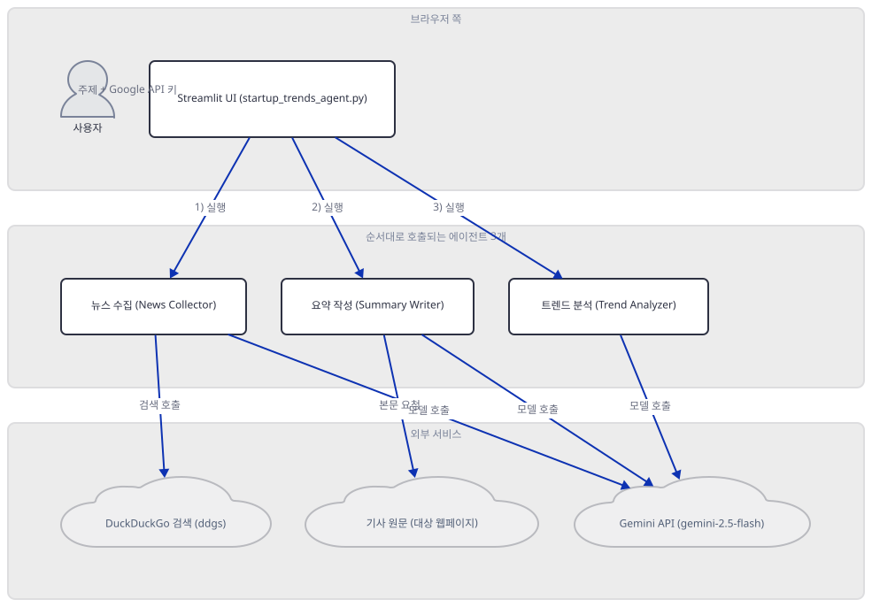
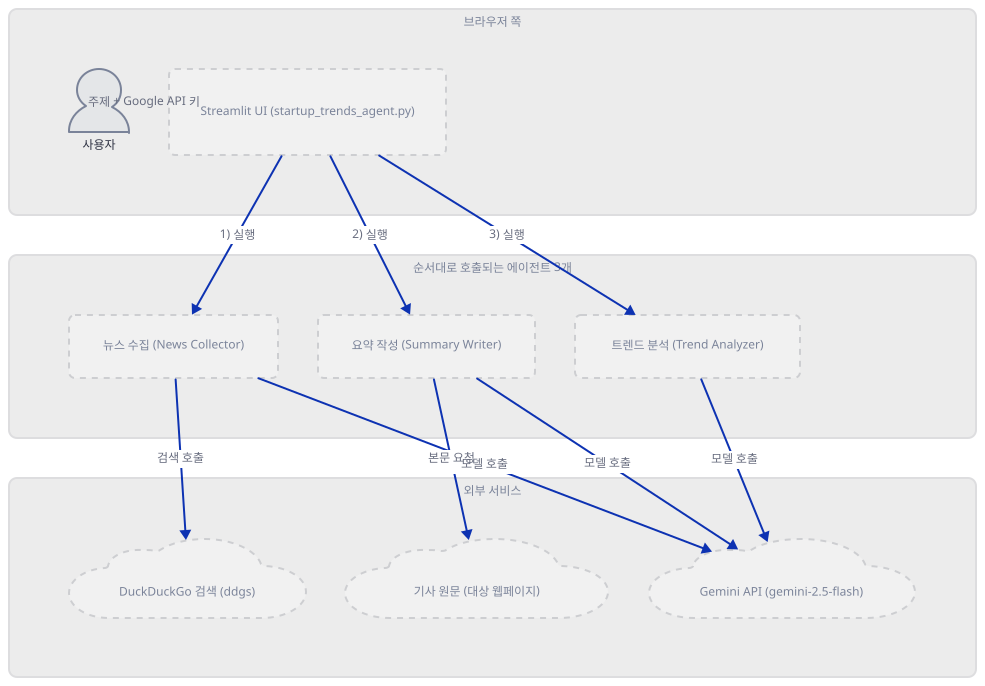
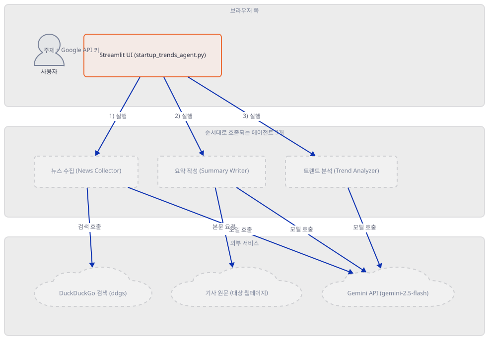
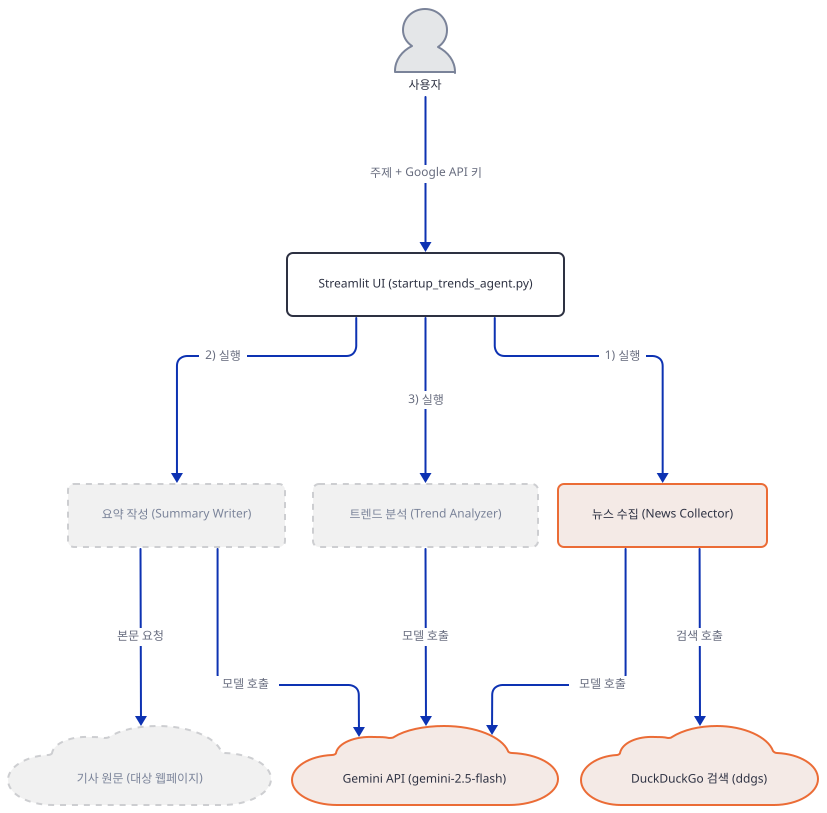
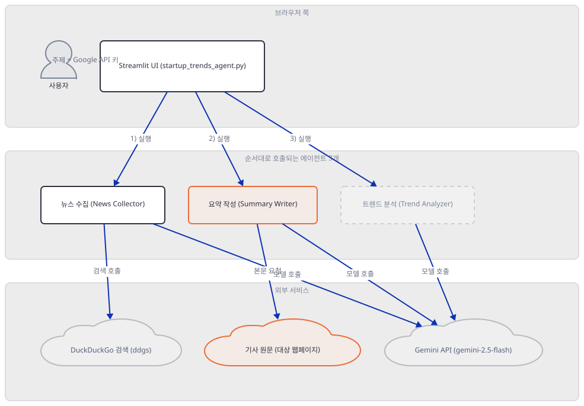
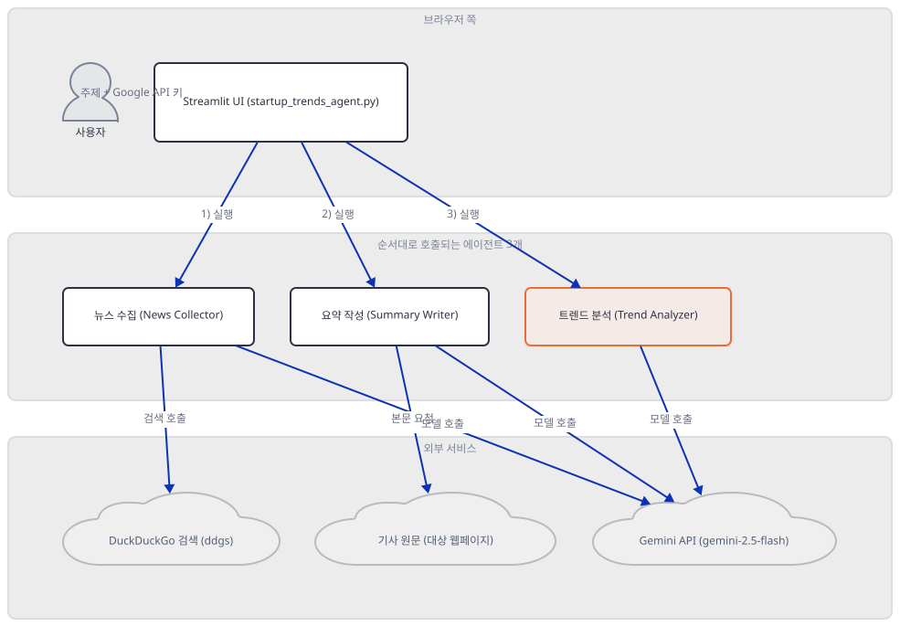
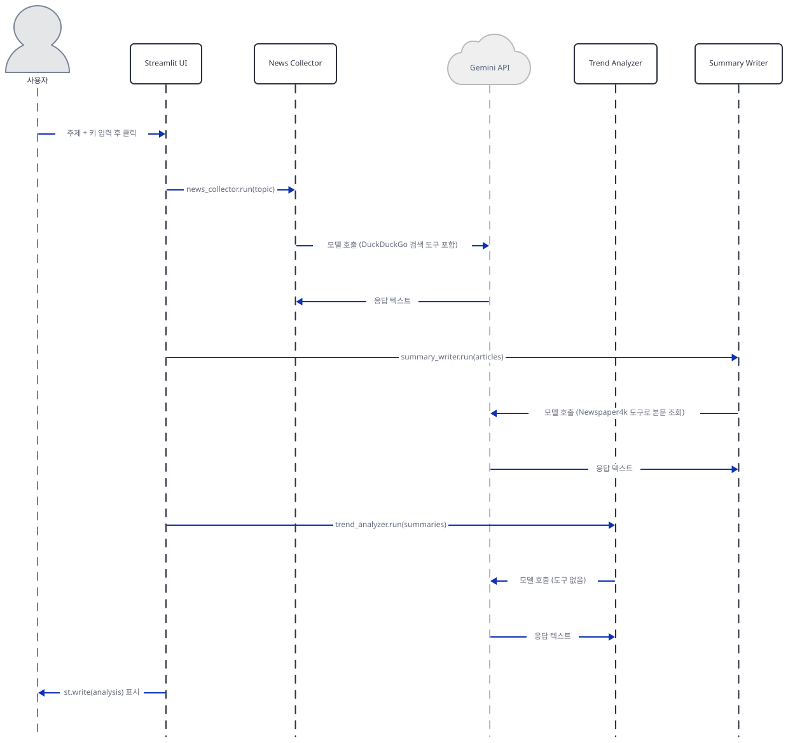

# Day 038 · 📈 AI Startup Trend Analysis Agent

> 볼륨 3 🌱 Starter AI Agents (추가분) · 난이도 ★☆☆ · 예상 소요 70분 · API 비용 대략 요청 1건에 `gemini-2.5-flash` 호출 3회(수집·요약·분석 각 1회), 요금표 기준 대략 $0.01 이하 (대략치 — 키가 없어 실제 과금은 확인 못함) · 원본 앱: `starter_ai_agents/ai_startup_trend_analysis_agent`

## 오늘 만들 것

이번 튜토리얼은 에이전트 세 개가 역할을 한 줄씩 이어받는 **순차 파이프라인**을 다룹니다. agno의 `Agent` 세 개 — News Collector, Summary Writer, Trend Analyzer — 가 모두 같은 `Gemini(id="gemini-2.5-flash", ...)` 인스턴스 하나를 공유하면서, 앞 에이전트가 반환한 텍스트를 다음 에이전트 호출의 프롬프트 문자열에 그대로 끼워 넣는 식으로 이어집니다: News Collector가 DuckDuckGoTools로 주제 관련 기사를 검색해 오면, Summary Writer가 Newspaper4kTools로 그 기사들의 본문을 가져와 Gemini에게 요약을 맡기고, Trend Analyzer는 도구 없이 그 요약들만 보고 트렌드와 기회를 종합합니다. Day 002의 SmartScraperGraph가 고정된 3노드 그래프로 이런 파이프라인을 짰다면, 이 앱은 그 이어붙이기를 전부 평범한 파이썬 변수(`articles`, `summaries`, `analysis`)로 손수 합니다 — 에이전트끼리 서로를 호출하는 위임이 아니라, Streamlit 스크립트가 `.run()` 세 번을 순서대로 부르는 구조입니다. `requirements.txt` 다섯 줄 중 넷은 정확히 버전을 고정했지만, 오늘 실제로 설치해 보면 그 고정된 버전들은 전부 멀쩡히 설치되는데도 앱은 임포트 단계에서부터 막힙니다 — 유일하게 버전을 고정하지 않은 `agno` 한 줄이 오늘 끌어오는 최신 버전이, 이 목록에는 없는 패키지 두 개를 새로 요구하기 때문입니다. 그리고 키가 틀렸을 때 이 앱이 보이는 반응은 지금까지의 어떤 날과도 다릅니다 — 화면이 멈추거나 빨간 에러가 뜨는 대신, 세 에이전트 모두 "성공"한 것처럼 끝까지 실행되고, 최종 화면에는 트렌드 분석인 척하는 API 에러 메시지가 그대로 표시됩니다. 완성하면 관심 있는 스타트업 분야나 기술을 입력해 최신 동향 분석을 받는 화면을 로컬에서 띄우게 됩니다. 아래는 완성된 아키텍처입니다.



## 사전 준비

| 서비스/도구 | 용도 | 발급·설치 |
|---|---|---|
| Google AI Studio API 키 | 세 에이전트가 공유하는 `gemini-2.5-flash` 모델 호출 인증. 사이드바 입력창에 직접 붙여넣는다(환경변수 아님) | https://aistudio.google.com/apikey 가입 후 발급 |
| uv | 가상환경 생성과 패키지 설치 | [공통 사전 준비](../README.md#공통-사전-준비-한-번만) 절 참고 |
| 인터넷 연결 | DuckDuckGo 검색, 기사 원문 페이지 접속, Gemini API 접속 | 별도 설치 없음. 사내망이면 도메인 접속 허용 필요 |

## 아키텍처 한눈에 보기

| 컴포넌트 | 역할 | 코드 위치 |
|---|---|---|
| 사용자 | 주제와 Google API 키 입력 | 코드 없음 (브라우저) |
| Streamlit UI | 입력을 받고 버튼 클릭 시 세 에이전트를 순서대로 실행, 결과 표시 | `starter_ai_agents/ai_startup_trend_analysis_agent/startup_trends_agent.py:9-13`, `starter_ai_agents/ai_startup_trend_analysis_agent/startup_trends_agent.py:72-73` |
| 뉴스 수집 (News Collector) | DuckDuckGoTools로 주제 관련 기사·뉴스를 검색 | `starter_ai_agents/ai_startup_trend_analysis_agent/startup_trends_agent.py:24-33` |
| 요약 작성 (Summary Writer) | Newspaper4kTools로 기사 본문을 가져오고 Gemini가 요약 | `starter_ai_agents/ai_startup_trend_analysis_agent/startup_trends_agent.py:35-44` |
| 트렌드 분석 (Trend Analyzer) | 도구 없이 요약들만 보고 트렌드·기회를 종합 | `starter_ai_agents/ai_startup_trend_analysis_agent/startup_trends_agent.py:46-53` |
| DuckDuckGo 검색 (ddgs) | 웹·뉴스 검색 결과 제공 | 코드 없음 (외부 서비스) |
| 기사 원문 (대상 웹페이지) | newspaper4k가 내려받아 파싱할 실제 기사 페이지 | 코드 없음 (외부 사이트) |
| Gemini API (gemini-2.5-flash) | 세 에이전트가 공유하는 모델 호출 | `starter_ai_agents/ai_startup_trend_analysis_agent/startup_trends_agent.py:22` |

## 단계별 진행

### Step 1. 환경 만들기

**목적.** 이 앱의 의존성을 격리된 가상환경에 설치하고, 고정된 버전들이 오늘 실제로 어떻게 설치되는지 확인합니다. `requirements.txt`만으로는 앱이 뜨지 않는다는 것도 여기서 먼저 밝혀 둡니다.

**할 일.**

```bash
cd starter_ai_agents/ai_startup_trend_analysis_agent
uv venv
uv pip install -r requirements.txt
```

(pip을 쓴다면 `python -m venv .venv && source .venv/bin/activate && pip install -r requirements.txt`.)

`starter_ai_agents/ai_startup_trend_analysis_agent/requirements.txt:1-5`

```text
agno>=2.2.10
streamlit==1.40.2
duckduckgo_search==6.3.7
newspaper4k==0.9.3.1
lxml_html_clean==0.4.1
```

다섯 줄 중 넷(`streamlit`, `duckduckgo_search`, `newspaper4k`, `lxml_html_clean`)은 정확한 버전 고정이고, 이 문서를 작성하며 설치했을 때 넷 다 고정한 그대로 받아졌고 어떤 충돌도 없었습니다(직접 확인). 유일하게 고정하지 않은 `agno>=2.2.10`만 오늘 **agno 3.0.10**을 끌어왔습니다(부수적으로 `agnoctl 0.2.1`도 함께 설치됩니다, 직접 확인). 문제는 여기서 시작됩니다 — agno 3.x는 `DuckDuckGoTools`와 `Gemini`를 각각 별도 익스트라 패키지 뒤로 옮겼는데(`agno[ddg]`는 `ddgs`, `agno[google]`은 `google-genai`를 요구합니다 — agno 3.0.10 패키지 메타데이터로 확인), `requirements.txt`는 이 사실을 반영하기 이전 버전 기준이라 둘 다 목록에 없습니다. 그 결과 임포트 단계에서부터 막힙니다.

```bash
uv run --no-project python -c "from agno.tools.duckduckgo import DuckDuckGoTools"
```

직접 확인한 출력(발췌):

```
ModuleNotFoundError: No module named 'ddgs'
...
ImportError: `ddgs` not installed. Please install using `pip install ddgs`
```

`duckduckgo_search==6.3.7`은 설치는 정상적으로 되지만(직접 확인: 그 패키지 자신의 `duckduckgo_search.py` 모듈이 실제로 존재함), agno 3.0.10의 `agno.tools.duckduckgo`는 이제 이 패키지를 전혀 import하지 않습니다 — 순전히 죽은 무게입니다. 필요한 두 패키지를 추가로 설치해야 다섯 개 임포트가 모두 성공합니다.

```bash
uv pip install ddgs google-genai
```

(`agno` 자체를 다시 설치하지 않고 익스트라만 채우려면 `uv pip install "agno[ddg,google]"`도 같은 효과입니다.)

이 저장소는 루트에 `pyproject.toml`이 있어 `uv run`이 방금 만든 환경 대신 루트의 `.venv`를 쓰므로, 이후 `uv run` 명령에는 모두 `--no-project`를 붙입니다.



**확인.**

```bash
uv run --no-project python -m py_compile startup_trends_agent.py && echo compiled
```

```
compiled
```

```bash
uv run --no-project python -c "
import streamlit as st
from agno.agent import Agent
from agno.run.agent import RunOutput
from agno.tools.duckduckgo import DuckDuckGoTools
from agno.models.google import Gemini
from agno.tools.newspaper4k import Newspaper4kTools
print('ALL IMPORTS OK')
"
```

```
ALL IMPORTS OK
```

### Step 2. Streamlit 뼈대와 키 입력

**목적.** 제목·설명과 두 입력창(주제, Google API 키)이 어떻게 배치되는지 봅니다. 이 앱은 Day 002·005와 달리 입력창 자체를 키로 가드하지 않는다는 점이 다릅니다.

**할 일.**

`starter_ai_agents/ai_startup_trend_analysis_agent/startup_trends_agent.py:9-13`

```python
st.title("AI Startup Trend Analysis Agent 📈")
st.caption("Get the latest trend analysis and startup opportunities based on your topic of interest in a click!.")

topic = st.text_input("Enter the area of interest for your Startup:")
google_api_key = st.sidebar.text_input("Enter Google API Key", type="password")
```

`starter_ai_agents/ai_startup_trend_analysis_agent/startup_trends_agent.py:77-78`

```python
else:
    st.info("Enter the topic and API keys, then click 'Generate Analysis' to start.")
```

`topic`(본문)과 `google_api_key`(사이드바, `type="password"`로 마스킹)는 둘 다 무조건 즉시 렌더링됩니다 — Day 002·005처럼 `if api_key:`로 화면 자체를 가드하지 않습니다. 대신 가드는 한 단계 뒤, 버튼을 눌렀을 때에만 걸립니다(Step 6에서 다룹니다). 버튼을 누르기 전에는 `starter_ai_agents/ai_startup_trend_analysis_agent/startup_trends_agent.py:77-78`의 안내 문구만 보입니다.



**확인.** 앱 폴더에서 서버를 headless로 띄웁니다.

```bash
uv run --no-project streamlit run startup_trends_agent.py --server.headless true
```

다른 터미널에서:

```bash
curl -s -o /dev/null -w "%{http_code}\n" http://localhost:8501
```

```
200
```

(HTTP 200은 직접 확인. 이 정적 셸 응답은 Streamlit이 스크립트를 실제로 한 번 실행했다는 뜻은 아닙니다 — 본문 실행은 브라우저가 여는 웹소켓 위에서 일어나므로, 제목·입력창이 실제로 보이는지는 화면을 직접 열어야 확인됩니다. 여기서는 서버가 응답한다는 것만 직접 확인했습니다.)

### Step 3. Gemini 모델과 News Collector 에이전트

**목적.** 사이드바에서 받은 키가 어떻게 Gemini 모델 객체로 이어지는지, News Collector에 검색 도구가 어떻게 붙는지, 그리고 이 도구가 실제로 무엇을 검색할 수 있는지 봅니다.

**할 일.**

`starter_ai_agents/ai_startup_trend_analysis_agent/startup_trends_agent.py:21-22`

```python
                # Initialize Gemini model
                gemini_model = Gemini(id="gemini-2.5-flash", api_key=google_api_key)
```

`starter_ai_agents/ai_startup_trend_analysis_agent/startup_trends_agent.py:24-33`

```python
                # Define News Collector Agent - Duckduckgo_search tool enables an Agent to search the web for information.
                search_tool = DuckDuckGoTools()
                news_collector = Agent(
                    name="News Collector",
                    role="Collects recent news articles on the given topic",
                    tools=[search_tool],
                    model=gemini_model,
                    instructions=["Gather latest articles on the topic"],
                    markdown=True,
                )
```

`google_api_key`는 사이드바 입력창(Step 2)에서 나와 여기서 `Gemini(id=..., api_key=...)`의 인자로만 쓰입니다 — 다른 어디에도 환경변수로 복사되지 않습니다(직접 확인: 소스 전체에 `os.environ` 참조 없음). 생성 시점에는 키를 검증하지 않습니다(직접 확인, 아래). agno 3.0.10에서 `Gemini`의 기본 `id`는 `"gemini-3.7-flash"`인데(직접 확인: 인자 없이 생성하면 이 값), 이 앱은 그보다 이전 세대인 `gemini-2.5-flash`를 명시적으로 못박습니다.

`DuckDuckGoTools()`는 인자 없이 만들면 `enable_search=True`와 `enable_news=True`가 기본값이라, News Collector에게는 `web_search`와 `search_news` 두 함수가 **모두** 등록됩니다(직접 확인, 아래) — role 설명은 "뉴스"만 말하지만 실제로는 일반 웹 검색도 고를 수 있습니다. 두 함수 다 기본 `max_results=5`이고, 반환값은 `ddgs` 라이브러리가 만드는 JSON 문자열입니다: 웹 검색 결과는 `title`/`href`/`body`, 뉴스 검색 결과는 `date`/`title`/`body`/`url`/`source` 필드를 가진 딕셔너리 목록입니다(ddgs 9.16.0 소스로 확인).



**확인.** 실제 검색은 수행하지 않고, 키 없이도 되는 부분만 확인합니다.

```bash
uv run --no-project python -c "
from agno.models.google import Gemini
g = Gemini(id='gemini-2.5-flash', api_key='fake-key')
print('gemini id:', g.id)
from agno.tools.duckduckgo import DuckDuckGoTools
t = DuckDuckGoTools()
print('functions:', list(t.functions.keys()))
"
```

직접 확인한 출력:

```
gemini id: gemini-2.5-flash
functions: ['web_search', 'search_news']
```

### Step 4. Summary Writer 에이전트와 Newspaper4k 도구

**목적.** 기사 본문이 어떻게 가져와지고, 모델에게 실제로 얼마나 전달되는지 — 그리고 `include_summary=True`가 이 경로에서 실제로는 아무 일도 하지 않는다는 것을 확인합니다.

**할 일.**

`starter_ai_agents/ai_startup_trend_analysis_agent/startup_trends_agent.py:35-44`

```python
                # Define Summary Writer Agent
                news_tool = Newspaper4kTools(enable_read_article=True, include_summary=True)
                summary_writer = Agent(
                    name="Summary Writer",
                    role="Summarizes collected news articles",
                    tools=[news_tool],
                    model=gemini_model,
                    instructions=["Provide concise summaries of the articles"],
                    markdown=True,
                )
```

`Newspaper4kTools`는 `read_article(url)` 함수 하나만 등록합니다(직접 확인, 아래). 이 함수는 내부적으로 `newspaper.article(url)`을 부르는데, 이 편의 함수는 `.download()`와 `.parse()`만 실행하고 **`.nlp()`는 절대 호출하지 않습니다**(newspaper4k 0.9.3.1 소스로 확인). 그런데 `article.summary`는 `Article.__init__`에서 빈 문자열로 시작해 오직 `.nlp()` 안에서만 채워집니다(같은 소스로 확인) — 즉 이 앱의 실행 경로에서 `article.summary`는 항상 빈 문자열이고, `get_article_data()`의 `if self.include_summary and article.summary:` 조건은 늘 거짓이 됩니다. 앱이 넘긴 `include_summary=True`는 실제로는 아무 효과가 없습니다.

잘려나가는 것도 없습니다. `read_article()`은 `self.article_length`가 있을 때만 텍스트를 자르는데(`if self.article_length and "text" in article_data:`), 이 앱은 `article_length`를 넘기지 않아 기본값 `None`으로 남습니다(직접 확인, 아래). 그 결과 **기사 원문 전체**가 JSON으로 감싸져 Summary Writer의 Gemini 호출로 들어가고, 실제 "요약"은 전적으로 그 호출에서 Gemini 자신이 만들어냅니다 — newspaper4k는 원문을 자르거나 미리 요약하지 않는, 순수한 fetch-and-parse 단계일 뿐입니다.



**확인.** 실제 URL을 읽지는 않고, 이 앱이 넘긴 설정값이 그대로 반영되는지만 확인합니다.

```bash
uv run --no-project python -c "
from agno.tools.newspaper4k import Newspaper4kTools
n = Newspaper4kTools(enable_read_article=True, include_summary=True)
print('functions:', list(n.functions.keys()))
print('include_summary:', n.include_summary)
print('article_length:', n.article_length)
"
```

직접 확인한 출력:

```
functions: ['read_article']
include_summary: True
article_length: None
```

### Step 5. Trend Analyzer 에이전트

**목적.** 마지막 에이전트에는 도구가 전혀 없다는 것, 그리고 앞 두 에이전트의 결과가 텍스트로만 전달된다는 것을 확인합니다.

**할 일.**

`starter_ai_agents/ai_startup_trend_analysis_agent/startup_trends_agent.py:46-53`

```python
                # Define Trend Analyzer Agent
                trend_analyzer = Agent(
                    name="Trend Analyzer",
                    role="Analyzes trends from summaries",
                    model=gemini_model,
                    instructions=["Identify emerging trends and startup opportunities"],
                    markdown=True,
                )
```

`tools` 인자 자체가 없습니다 — News Collector·Summary Writer와 달리 이 에이전트는 검색도 읽기도 하지 못하고, 오직 프롬프트에 실려 들어온 요약 텍스트만 보고 Gemini에게 트렌드 종합을 맡깁니다. 세 에이전트 모두 같은 `gemini_model` 인스턴스를 공유한다는 것도 여기서 다시 드러납니다 — 새 모델 클라이언트를 만들지 않습니다.



**확인.**

```bash
uv run --no-project python -c "
from agno.agent import Agent
from agno.models.google import Gemini
g = Gemini(id='gemini-2.5-flash', api_key='fake-key')
trend_analyzer = Agent(name='Trend Analyzer', role='Analyzes trends from summaries', model=g,
    instructions=['Identify emerging trends and startup opportunities'], markdown=True)
print('tools:', trend_analyzer.tools)
"
```

직접 확인한 출력:

```
tools: []
```

### Step 6. 세 에이전트 실행과 결과 표시

**목적.** 버튼을 눌렀을 때 세 `.run()`이 어떻게 이어지는지, 그리고 이 앱에는 `try/except`가 있는데도 왜 키가 틀렸을 때 에러 화면 대신 "분석 결과"처럼 보이는 텍스트가 뜨는지 직접 확인합니다.

**할 일.**

`starter_ai_agents/ai_startup_trend_analysis_agent/startup_trends_agent.py:55-66`

```python
                # Executing the workflow
                # Step 1: Collect news
                news_response: RunOutput = news_collector.run(f"Collect recent news on {topic}")
                articles = news_response.content

                # Step 2: Summarize articles
                summary_response: RunOutput = summary_writer.run(f"Summarize the following articles:\n{articles}")
                summaries = summary_response.content

                # Step 3: Analyze trends
                trend_response: RunOutput = trend_analyzer.run(f"Analyze trends from the following summaries:\n{summaries}")
                analysis = trend_response.content
```

`starter_ai_agents/ai_startup_trend_analysis_agent/startup_trends_agent.py:72-76`

```python
                st.subheader("Trend Analysis and Potential Startup Opportunities")
                st.write(analysis)

            except Exception as e:
                st.error(f"An error occurred: {e}")
```

세 줄 다 같은 모양입니다 — `.run()` 결과에서 `.content`만 꺼내 다음 호출의 프롬프트 문자열에 그대로 끼워 넣습니다. `.status`는 어디서도 확인하지 않습니다. agno 3.0.10에서 `Agent.run()`은 모델 호출이 실패해도 예외를 던지지 않고, `status=RunStatus.error`와 원본 에러를 담은 `RunOutput`을 **정상적으로 반환**합니다(직접 확인, 아래) — Day 005의 Together AI(`AuthenticationError`를 그대로 던짐)나 Day 002의 OpenAI 경로와는 다른 실패 방식입니다. 그 결과 `starter_ai_agents/ai_startup_trend_analysis_agent/startup_trends_agent.py:75-76`의 `except Exception`은 예외가 애초에 발생하지 않으므로 전혀 관여하지 못하고, 잘못된 키의 에러 메시지가 "기사"로, 다시 "요약"으로 취급되며 세 단계를 그대로 통과해 마지막 `st.write(analysis)`까지 도달합니다.


**확인.** 키가 없어 실제 결과는 재현하지 못했습니다. 대신 세 에이전트를 유효하지 않은 키로 순서대로 직접 호출해, `.status`와 최종 `analysis`를 확인합니다.

```bash
uv run --no-project python -c "
from agno.agent import Agent
from agno.tools.duckduckgo import DuckDuckGoTools
from agno.models.google import Gemini
from agno.tools.newspaper4k import Newspaper4kTools

gemini_model = Gemini(id='gemini-2.5-flash', api_key='invalid-test-key-123')
news_collector = Agent(name='News Collector', role='Collects recent news articles on the given topic',
    tools=[DuckDuckGoTools()], model=gemini_model, instructions=['Gather latest articles on the topic'], markdown=True)
summary_writer = Agent(name='Summary Writer', role='Summarizes collected news articles',
    tools=[Newspaper4kTools(enable_read_article=True, include_summary=True)], model=gemini_model,
    instructions=['Provide concise summaries of the articles'], markdown=True)
trend_analyzer = Agent(name='Trend Analyzer', role='Analyzes trends from summaries', model=gemini_model,
    instructions=['Identify emerging trends and startup opportunities'], markdown=True)

news_response = news_collector.run('Collect recent news on test topic')
articles = news_response.content
summary_response = summary_writer.run(f'Summarize the following articles:\n{articles}')
summaries = summary_response.content
trend_response = trend_analyzer.run(f'Analyze trends from the following summaries:\n{summaries}')
analysis = trend_response.content

print('STEP1 status:', news_response.status)
print('STEP3 status:', trend_response.status)
print('final analysis (앞 120자):', analysis[:120])
"
```

직접 확인한 출력:

```
STEP1 status: RunStatus.error
STEP3 status: RunStatus.error
final analysis (앞 120자): {
  "error": {
    "code": 400,
    "message": "API key not valid. Please pass a valid API key.",
    "status": "INVALID_ARGUM
```

세 단계 모두 `RunStatus.error`이고, 세 번째 단계가 화면에 최종적으로 보여줄 `analysis`는 첫 번째 실패의 에러 JSON과 글자 그대로 같습니다 — 잘못된 키 하나의 에러 메시지가 "기사"와 "요약"을 거쳐 그대로 살아남은 것입니다. 세 호출 모두 파이썬 예외 없이 정상 반환됐으므로(`try/except`는 이 상황에서 한 번도 발동하지 않습니다), Streamlit 화면에는 빨간 에러 대신 "Trend Analysis and Potential Startup Opportunities"라는 제목 아래 이 JSON 조각이 표시됩니다.

## 요청 한 건이 흐르는 과정



사용자가 주제와 Google API 키를 입력하고 "Generate Analysis"를 누르면, Streamlit UI는 세 에이전트를 **순서대로**, 앞 결과를 기다렸다가 부릅니다(asyncio 없이 완전히 동기적입니다 — Day 005의 병렬 `asyncio.gather`와 대비됩니다). 먼저 News Collector가 호출되어 내부적으로 Gemini에게 요청하고, Gemini가 DuckDuckGo 검색 도구를 부를지 판단해 결과를 받아온 뒤 최종 텍스트를 돌려줍니다 — 그 텍스트가 `RunOutput.content`로 UI에 반환됩니다. UI는 이 텍스트를 그대로 다음 프롬프트에 끼워 Summary Writer를 호출하고, Summary Writer는 다시 Gemini를 통해 Newspaper4k 도구로 기사 원문 전체를 조회한 뒤 요약 텍스트를 돌려받습니다. 마지막으로 Trend Analyzer는 도구 없이 그 요약 텍스트만 보고 Gemini에게 트렌드 종합을 요청합니다. 세 단계 모두 반환값은 `.content` 하나뿐이고, 이 값이 `RunStatus.error`를 담고 있어도 파이프라인은 멈추지 않고 그대로 다음 단계로 흘러간다는 것을 Step 6에서 직접 확인했습니다. 이 시퀀스는 키가 없어 유효한 키로 처음부터 끝까지 이어지는 것을 보지는 못했고, 각 구간을 유효하지 않은 키로 개별적으로 확인한 것입니다.

## 실행 체크리스트

- [ ] `uv venv && uv pip install -r requirements.txt`로 기본 의존성을 설치했다
- [ ] `uv pip install ddgs google-genai`로 requirements.txt에 빠진 익스트라 두 개를 추가 설치했다
- [ ] 다섯 개 임포트가 모두 성공하는 것을 확인했다 (`ALL IMPORTS OK`)
- [ ] https://aistudio.google.com/apikey 에서 Google API 키를 발급받아 두었다
- [ ] `uv run --no-project streamlit run startup_trends_agent.py`로 서버를 띄우고 `http://localhost:8501`에서 화면을 확인했다
- [ ] `DuckDuckGoTools()`에 `web_search`와 `search_news` 두 함수가 모두 등록된다는 것을 코드로 확인했다
- [ ] `Newspaper4kTools`의 `include_summary=True`가 이 앱의 실제 경로에서는 효과가 없다는 것과, 잘리지 않은 기사 전체가 모델에 전달된다는 것을 이해했다
- [ ] 잘못된 키로 실행하면 `RunOutput.status`가 `RunStatus.error`여도 예외가 발생하지 않아 화면에 "분석 결과"처럼 보이는 JSON 에러가 뜬다는 것을 이해했다

## 문제 해결

| 증상 | 원인 | 해결 |
|---|---|---|
| `from agno.tools.duckduckgo import DuckDuckGoTools`에서 `ModuleNotFoundError: No module named 'ddgs'` | agno 3.0.10의 `agno.tools.duckduckgo`가 내부적으로 `agno.tools.websearch.WebSearchTools`를 상속하는데, 이 모듈이 실제로 import하는 검색 라이브러리는 `ddgs`이지 `requirements.txt`가 고정한 `duckduckgo_search`가 아니다(agno 3.0.10 소스로 확인). `duckduckgo_search==6.3.7`은 설치는 되지만 이제 어디서도 import되지 않는다(직접 확인) | `uv pip install ddgs` (또는 `uv pip install "agno[ddg]"`) 실행 후 재시도 |
| 위를 고쳐도 `from agno.models.google import Gemini`에서 `ModuleNotFoundError: No module named 'google.genai'` | agno의 Gemini 래퍼가 `google-genai` 패키지를 요구하는데, 이는 agno의 핵심 의존성이 아니라 `agno[google]` 익스트라로만 설치된다(agno 3.0.10 패키지 메타데이터로 확인) — `requirements.txt`는 이 패키지를 전혀 적지 않았다 | `uv pip install google-genai` (또는 `uv pip install "agno[google]"`) |
| 유효하지 않거나 빈 Google API 키로 실행해도 빨간 에러 대신 "Trend Analysis and Potential Startup Opportunities" 아래 `{"error": {"code": 400, ...`처럼 보이는 JSON 텍스트가 뜸 | agno 3.0.10의 `Agent.run()`은 모델 호출이 실패해도 예외를 던지지 않고 `status=RunStatus.error`인 `RunOutput`을 정상 반환한다(직접 확인, Step 6). 이 앱은 `.content`만 꺼내 쓰고 `.status`는 어디서도 확인하지 않으므로(`starter_ai_agents/ai_startup_trend_analysis_agent/startup_trends_agent.py:57-58`), 예외가 발생하지 않아 맨 아래의 `except Exception`도 전혀 관여하지 못한다 | 화면에 `"error"`, `400`, `INVALID_ARGUMENT` 같은 JSON 조각이 보이면 분석 결과가 아니라 키 문제로 의심하고 키를 다시 확인할 것 |
| `Newspaper4kTools(..., include_summary=True)`를 켜도 요약이 더 짧아지거나 달라지지 않음 | `get_article_data()`가 부르는 `newspaper.article(url)`은 download와 parse만 하고 `.nlp()`는 호출하지 않는데, 요약은 `.nlp()`가 채우는 `article.summary`에서만 나온다(newspaper4k 0.9.3.1 소스로 확인). `article.summary`가 항상 빈 문자열로 남아 이 플래그는 이 앱의 실행 경로에서 실질적으로 아무 효과가 없다 | 리포 코드를 고치지 않는 것이 이 시리즈의 방침이므로 그대로 두되, 실제 "요약"은 Summary Writer의 Gemini 호출이 잘리지 않은 기사 전체를 보고 만들어낸다는 점만 알아두면 됨 |

## 더 해보기

- `news_response.status`(그리고 나머지 두 응답)가 `RunStatus.error`인지 검사해서 그럴 때만 `st.error()`로 멈추도록, `starter_ai_agents/ai_startup_trend_analysis_agent/startup_trends_agent.py:57-58`부터 `starter_ai_agents/ai_startup_trend_analysis_agent/startup_trends_agent.py:65-66`까지의 흐름을 고쳐보기 — 문제 해결의 세 번째 항목을 직접 막는 방법입니다.
- `Newspaper4kTools(enable_read_article=True, include_summary=True)`(`starter_ai_agents/ai_startup_trend_analysis_agent/startup_trends_agent.py:36`)에 `article_length=2000`처럼 길이를 직접 넘겨, 잘린 본문이 요약 품질을 얼마나 떨어뜨리는지 비교해보기.
- `DuckDuckGoTools()`(`starter_ai_agents/ai_startup_trend_analysis_agent/startup_trends_agent.py:25`)에 `region="kr-kr"`나 `timelimit="w"` 같은 인자를 추가해 검색 범위를 좁혀보고, News Collector가 `web_search`와 `search_news` 중 어느 쪽을 더 즐겨 쓰는지 관찰해보기.

## 다음 날 예고

[Day 039 · 📝 Chat with Substack](../day039-chat-with-substack/README.md) — 볼륨이 바뀝니다. 오늘로 🌱 Starter AI Agents 볼륨이 끝나고, 내일부터는 💬 Chat with X 볼륨이 시작됩니다. 첫 앱은 Substack 블로그 글을 읽어와 대화하는 챗봇입니다.
