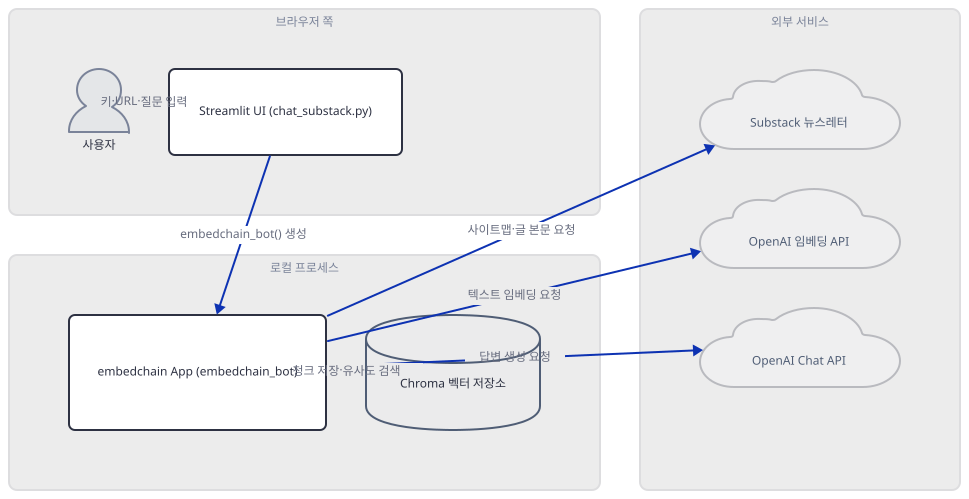
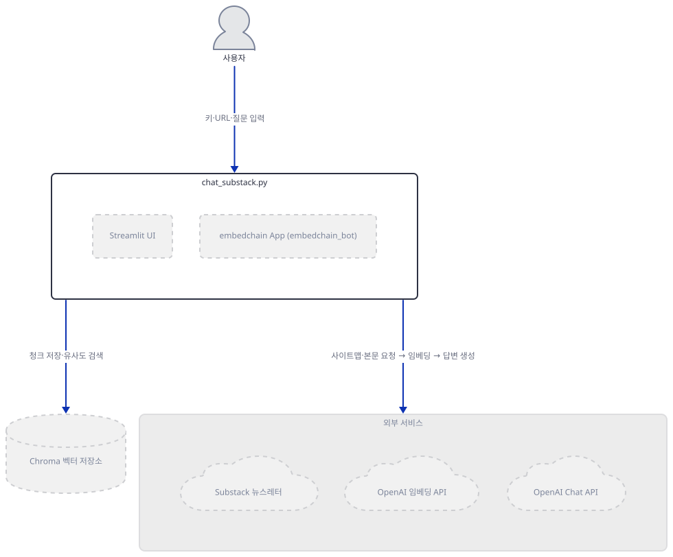
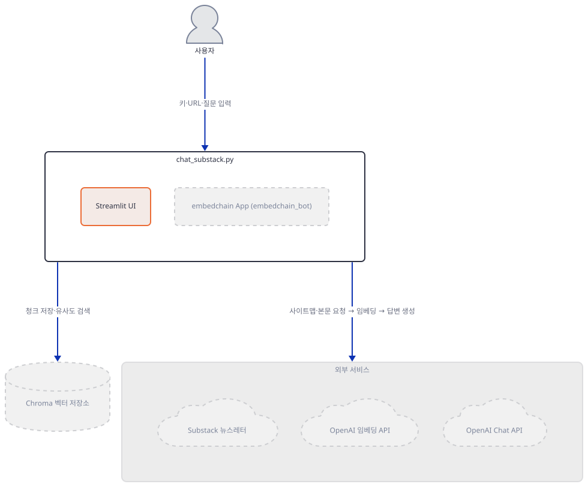
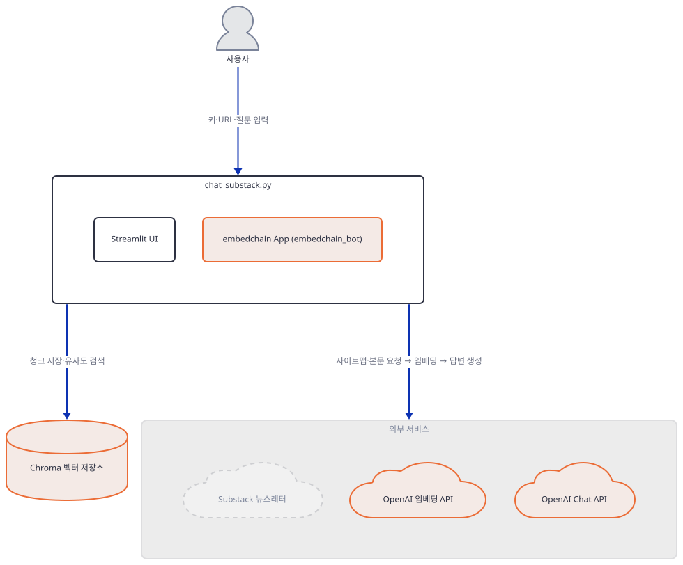
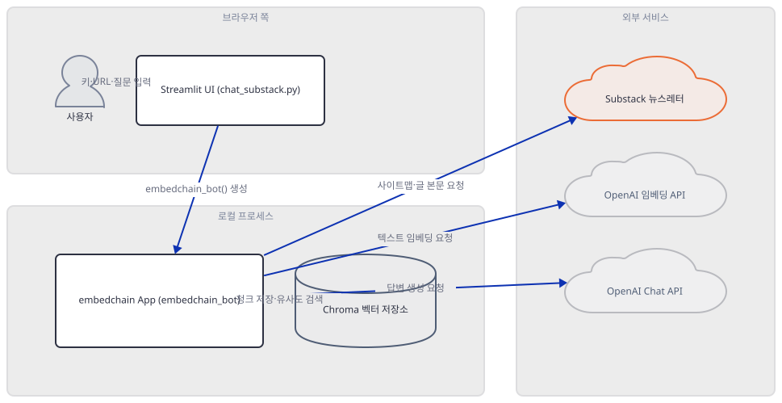
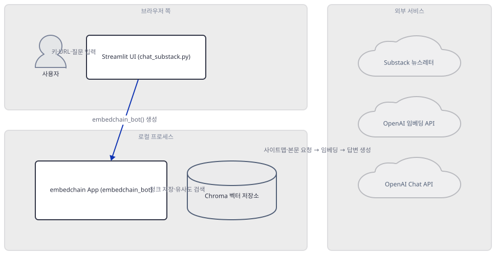
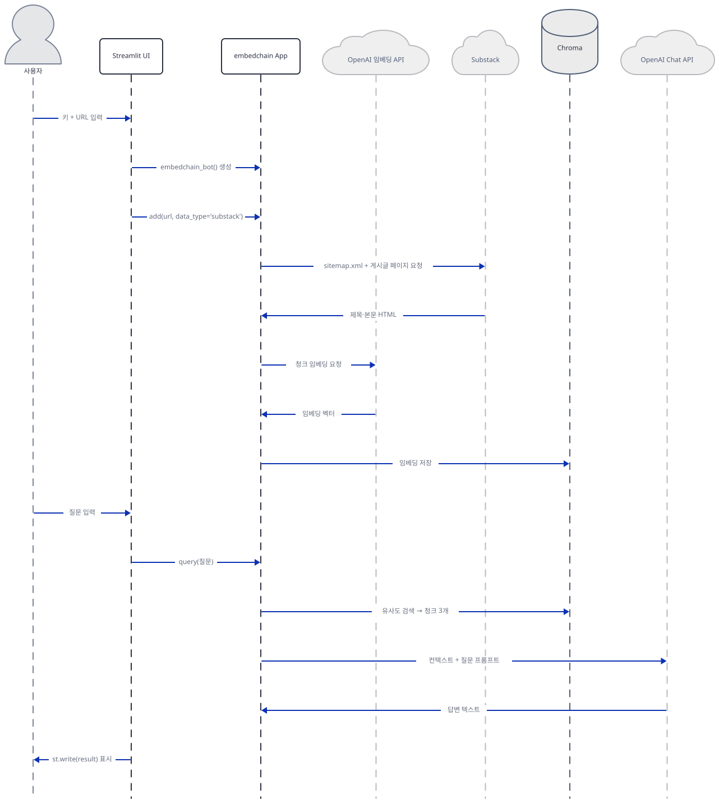

# Day 039 · 📝 Chat with Substack

> 볼륨 4 💬 Chat with X · 난이도 ★☆☆ · 예상 소요 60분 · API 비용 대략 질문 1건당 `gpt-4-turbo` 호출 1회(약 $0.01, $5/$15 per 1M 토큰) + 뉴스레터 재임베딩(`text-embedding-ada-002` $0.10/1M 토큰, 게시글 10개 기준 $0.001 미만이지만 질문마다 반복됨 — Step 6) · 대략치, 키가 없어 실제 과금은 확인 못함 · 원본 앱: `advanced_llm_apps/chat_with_X_tutorials/chat_with_substack`

## 오늘 만들 것

이번 튜토리얼은 지금까지의 어떤 날보다 짧은 파일(41줄)로 RAG 챗봇 하나를 통째로 완성합니다. 임베딩을 직접 만들거나 벡터 DB를 초기화하는 코드는 한 줄도 없습니다 — `embedchain`이라는 라이브러리 하나가 URL을 받아 사이트맵을 읽고, 게시글을 긁어오고, 청크로 쪼개고, 임베딩을 만들고, 검색하고, 답을 만드는 전 과정을 `App.from_config()` 한 번과 `.add()`/`.query()` 두 번의 호출 뒤에 숨깁니다. 이 앱은 OpenAI의 `gpt-4-turbo`로 답을 만들고 `text-embedding-ada-002`로 문서를 임베딩하며(둘 다 직접 확인), 벡터는 Chroma에 로컬 디스크로 저장됩니다 — 그런데 그 디스크 경로가 `tempfile.mkdtemp()`로 매번 새로 뽑히고 세션 상태나 캐시 어디에도 붙잡히지 않기 때문에, Streamlit이 재실행될 때마다(질문을 하나 더 던질 때마다) 완전히 새 벡터 저장소가 만들어지고 뉴스레터 전체가 처음부터 다시 수집·임베딩됩니다(직접 확인) — "재시작하면 사라지는" 정도가 아니라 "질문마다 사라지는" 저장소입니다. 의존성 쪽 벽도 만만치 않습니다: 버전 하한도 없는 `requirements.txt` 두 줄(`streamlit`, `embedchain`)이 150개 패키지를 끌어오는데, 그중 `chromadb`가 요구하는 `chroma-hnswlib==0.7.6`은 Windows용 사전 빌드 wheel을 Python 3.11까지만 배포하고 있어(PyPI로 직접 확인) 이 컴퓨터가 기본으로 고르는 Python 3.13에서는 컴파일러 없이 설치 자체가 실패합니다. 완성하면 Substack 뉴스레터 URL 하나를 넣고 그 안의 글에 대해 자유롭게 묻고 답하는 화면을 로컬에서 띄우게 됩니다. 아래는 완성된 아키텍처입니다.



## 사전 준비

| 서비스/도구 | 용도 | 발급·설치 |
|---|---|---|
| OpenAI API 키 | `gpt-4-turbo`(답변)와 `text-embedding-ada-002`(임베딩) 호출 인증. 화면 입력창에 직접 붙여넣는다(환경변수 아님 — 코드에 `os.environ` 참조가 전혀 없음, 직접 확인) | https://platform.openai.com/api-keys 가입 후 발급 |
| uv | 가상환경 생성과 패키지 설치 | [공통 사전 준비](../README.md#공통-사전-준비-한-번만) 절 참고 |
| Python 3.11 이하 (Windows) | `chroma-hnswlib` 0.7.6의 Windows용 사전 빌드 wheel이 cp311까지만 배포됨 — Step 1에서 직접 확인 | `uv venv --python 3.11`로 지정 (uv가 자동으로 내려받음) |
| 인터넷 연결 | Substack 사이트맵·게시글 페이지, OpenAI API 접속 | 별도 설치 없음. 사내망이면 도메인 접속 허용 필요 |

## 아키텍처 한눈에 보기

| 컴포넌트 | 역할 | 코드 위치 |
|---|---|---|
| 사용자 | OpenAI 키·Substack URL·질문 입력 | 코드 없음 (브라우저) |
| Streamlit UI | 입력을 순서대로 받고 embedchain App을 호출, 결과 표시 | `advanced_llm_apps/chat_with_X_tutorials/chat_with_substack/chat_substack.py:15-19`, `advanced_llm_apps/chat_with_X_tutorials/chat_with_substack/chat_substack.py:39-41` |
| embedchain App (`embedchain_bot`) | LLM·임베더·벡터DB 설정 3가지를 하나의 config로 묶어 App 인스턴스 생성 | `advanced_llm_apps/chat_with_X_tutorials/chat_with_substack/chat_substack.py:6-13` |
| Chroma 벡터 저장소 | 청크 임베딩을 로컬 디스크(임시 폴더)에 저장하고 유사도 검색으로 상위 3개 청크를 반환 | `advanced_llm_apps/chat_with_X_tutorials/chat_with_substack/chat_substack.py:10` |
| Substack 뉴스레터 | sitemap.xml과 게시글 HTML을 제공하는 외부 사이트 | 코드 없음 (외부 서비스) |
| OpenAI 임베딩 API | 청크 텍스트를 벡터로 변환 (`text-embedding-ada-002`) | `advanced_llm_apps/chat_with_X_tutorials/chat_with_substack/chat_substack.py:11` |
| OpenAI Chat API | 검색된 청크를 근거로 최종 답변 생성 (`gpt-4-turbo`) | `advanced_llm_apps/chat_with_X_tutorials/chat_with_substack/chat_substack.py:9` |

## 단계별 진행

### Step 1. 환경 만들기

**목적.** 의존성 두 줄을 설치하고, 이 컴퓨터가 오늘 실제로 어떤 벽에 부딪히는지 먼저 확인합니다.

**할 일.**

```bash
cd advanced_llm_apps/chat_with_X_tutorials/chat_with_substack
uv venv
uv pip install -r requirements.txt
```

`advanced_llm_apps/chat_with_X_tutorials/chat_with_substack/requirements.txt:1-2`

```text
streamlit
embedchain
```

버전 하한조차 없는 두 줄입니다. 이 컴퓨터에서 `uv venv`는 인자를 주지 않으면 Python **3.13.3**을 고릅니다(직접 확인). 이 상태로 설치하면 150개 패키지 해석 직후 빌드 단계에서 멈춥니다.

직접 확인한 출력(발췌):

```
Resolved 150 packages in 1.20s
   Building chroma-hnswlib==0.7.6
  × Failed to build `chroma-hnswlib==0.7.6`
  ├─▶ The build backend returned an error
  ╰─▶ Call to `setuptools.build_meta.build_wheel` failed (exit code: 1)
      [stderr]
      error: Unable to find a compatible Visual Studio installation.
  help: `chroma-hnswlib` (v0.7.6) was included because `embedchain` (v0.1.128)
        depends on `chromadb` (v0.5.23) which depends on `chroma-hnswlib`
```

원인을 PyPI 파일 목록에서 직접 확인했습니다: `chroma-hnswlib` 0.7.6 정식 릴리스는 Windows용 사전 빌드 wheel을 `cp37`부터 `cp311`까지만 올려두었고 `cp312`·`cp313`은 하나도 없습니다(바로 앞 선판 `0.7.6a1`~`a9`에는 Windows용 `cp312` wheel이 있었지만 정식 `0.7.6`에서는 그것만 빠졌습니다 — macOS·Linux용 `cp312` wheel은 정식 릴리스에도 있습니다). `chromadb==0.5.23`은 이 버전을 범위가 아니라 `chroma-hnswlib==0.7.6`으로 정확히 못박아서(직접 확인: `chroma-hnswlib==0.7.5`를 강제 지정하면 uv가 "unsatisfiable"라며 거부합니다) 다른 버전으로 비켜갈 수도 없습니다. 결국 Python 3.12 이상인 Windows에서 이 두 줄을 설치하려면 Visual Studio C++ 빌드 도구로 소스를 직접 컴파일해야 하는데, 이 컴퓨터에는 그것이 없습니다.

Python 3.11로 다시 만들면 사전 빌드 wheel이 있어 그대로 설치됩니다.

```bash
uv venv --python 3.11
uv pip install -r requirements.txt
```

직접 확인한 출력:

```
Resolved 150 packages in 7.68s
Installed 150 packages in 16.58s
```

(pip을 쓴다면 `python -m venv .venv && source .venv/bin/activate && pip install -r requirements.txt` — 단 `chroma-hnswlib` wheel 문제는 pip을 써도 그대로입니다.)

핵심 버전(직접 확인): `streamlit 1.64.0`, `embedchain 0.1.128`, `chromadb 0.5.23`, `chroma-hnswlib 0.7.6`, `openai 1.109.1`, `langchain 0.3.28`, `beautifulsoup4 4.15.0`. 두 줄이 150개를 끌어오는 이유도 살펴볼 만합니다 — 이 앱이 쓰지 않는 `mem0ai`(메모리), `cohere`·`qdrant-client`(다른 LLM/벡터DB 제공자), `kubernetes`, `onnxruntime`, OpenTelemetry 계열까지 함께 설치됩니다(직접 확인: 설치 로그). `embedchain`은 `App.from_config()`에 지정한 provider만 실제로 쓰지만, 설치 자체는 지원하는 provider 전부의 의존성을 갖고 옵니다.

이 저장소는 루트에 `pyproject.toml`이 있어 `uv run`이 방금 만든 환경 대신 루트의 `.venv`를 쓰므로, 이후 `uv run` 명령에는 모두 `--no-project`를 붙입니다.



**확인.**

```bash
uv run --no-project python -m py_compile chat_substack.py && echo compiled
```

```
compiled
```

```bash
uv run --no-project python -c "import streamlit as st; from embedchain import App; import tempfile; print('ALL IMPORTS OK')"
```

```
ALL IMPORTS OK
```

### Step 2. Streamlit 뼈대: 제목과 키 입력

**목적.** 화면 제목과 OpenAI 키 입력창이 이후 거의 모든 로직의 게이트가 된다는 것을 확인합니다.

**할 일.**

`advanced_llm_apps/chat_with_X_tutorials/chat_with_substack/chat_substack.py:15-19`

```python
st.title("Chat with Substack Newsletter 📝")
st.caption("This app allows you to chat with Substack newsletter using OpenAI API")

# Get OpenAI API key from user
openai_access_token = st.text_input("OpenAI API Key", type="password")
```

제목과 캡션, 키 입력창(`type="password"`로 마스킹)은 무조건 그려집니다. 이후 `advanced_llm_apps/chat_with_X_tutorials/chat_with_substack/chat_substack.py:21`의 `if openai_access_token:`부터 41번 줄까지 — URL 입력창, 지식베이스 추가, 질문 입력창, 답변 표시까지 — 전부 이 블록 안에 있습니다. 키가 비어 있으면 화면엔 제목·캡션·입력창만 보입니다. 이 키는 Day005의 Together 키와 달리 환경변수로도 복사되지 않습니다 — 파일 전체에 `os.environ`·`os.getenv` 참조가 하나도 없습니다(직접 확인: grep 결과 없음). `openai_access_token`은 뒤에서 `embedchain_bot()`의 인자로만 전달됩니다.



**확인.** 앱 폴더에서 서버를 headless로 띄웁니다.

```bash
uv run --no-project streamlit run chat_substack.py --server.headless true
```

다른 터미널에서:

```bash
curl -s -o /dev/null -w "%{http_code}\n" http://localhost:8501
```

```
200
```

(HTTP 200은 직접 확인 — 이 컴퓨터에서는 서버가 요청을 받기까지 약 27초 걸렸습니다. `embedchain`이 임포트하는 의존성 트리가 커서 Day005·038보다 기동이 뚜렷하게 느립니다. 이 시간은 디스크·CPU 상태에 따라 실행마다 달라질 수 있습니다. 제목·키 입력창만 보이고 나머지 입력창은 아직 없으리라는 것은 `if` 가드 구조로 추론한 것이며, 화면을 직접 열어 확인하지는 못했습니다.)

### Step 3. `embedchain_bot`: LLM·임베더·벡터DB를 하나의 config로

**목적.** 8줄짜리 함수 하나가 답변 모델, 임베딩 모델, 벡터 저장소 경로를 동시에 정의한다는 것과, config에 적지 않은 값이 실제로 무엇으로 채워지는지 확인합니다.

**할 일.**

`advanced_llm_apps/chat_with_X_tutorials/chat_with_substack/chat_substack.py:6-13`

```python
def embedchain_bot(db_path, api_key):
    return App.from_config(
        config={
            "llm": {"provider": "openai", "config": {"model": "gpt-4-turbo", "temperature": 0.5, "api_key": api_key}},
            "vectordb": {"provider": "chroma", "config": {"dir": db_path}},
            "embedder": {"provider": "openai", "config": {"api_key": api_key}},
        }
    )
```

`llm`은 모델명(`gpt-4-turbo`)과 온도(0.5)를 명시하지만, `embedder`는 `api_key`만 주고 모델명을 적지 않았습니다. `vectordb`도 `dir` 하나만 줍니다. embedchain 0.1.128의 `embedchain/embedder/openai.py`(소스로 확인)는 `config.model`이 비어 있으면 `text-embedding-ada-002`로 채웁니다.

이 세 provider가 실제로 무엇으로 굳어지는지, 가짜 키로 App을 만들어 직접 확인합니다 — `App.from_config()`는 모델 API를 부르지 않습니다. 다만 "네트워크를 전혀 건드리지 않는다"고 하면 사실이 아닙니다 — embedchain은 App을 만들 때 익명 사용 통계를 PostHog로 보냅니다(`embedchain/telemetry/posthog.py`의 `AnonymousTelemetry`, 기본값 `enabled=True`). 이 전송은 posthog 로거를 일부러 꺼 두어 화면에 아무 흔적도 남기지 않습니다. 끄려면 `EC_TELEMETRY=false`를 환경변수로 두고 실행합니다.



**확인.**

```bash
uv run --no-project python -c "
from embedchain import App
import tempfile, os, shutil
db_path = tempfile.mkdtemp()
app = App.from_config(config={
    'llm': {'provider': 'openai', 'config': {'model': 'gpt-4-turbo', 'temperature': 0.5, 'api_key': 'sk-fake-test-key'}},
    'vectordb': {'provider': 'chroma', 'config': {'dir': db_path}},
    'embedder': {'provider': 'openai', 'config': {'api_key': 'sk-fake-test-key'}},
})
print('files in db_path:', os.listdir(db_path))
print('embedder model:', app.embedding_model.config.model)
print('llm model/temp:', app.llm.config.model, app.llm.config.temperature)
print('top_k (number_documents):', app.llm.config.number_documents)
print('collection name:', app.db.config.collection_name)
shutil.rmtree(db_path, ignore_errors=True)
"
```

직접 확인한 출력(stderr의 alembic·pydantic 지원종료 경고 2줄은 생략):

```
files in db_path: ['chroma.sqlite3']
embedder model: text-embedding-ada-002
llm model/temp: gpt-4-turbo 0.5
top_k (number_documents): 3
collection name: embedchain_store
```

`sk-fake-test-key`라는 가짜 키로도 `App.from_config()`는 그대로 성공합니다 — 지금까지의 다른 날들과 같은 패턴으로, 생성 시점에는 키를 검증하지 않습니다. `db_path` 안에 `chroma.sqlite3` 파일이 이미 만들어져 있다는 것도 확인했습니다 — Chroma는 진짜 디스크 기반 저장소입니다(Step 6에서 이 사실이 왜 중요한지 다룹니다). `number_documents`(질문마다 검색해 올 청크 수)와 `collection_name`은 앱이 지정하지 않은 embedchain 기본값입니다.

### Step 4. Substack 지식베이스에 추가하기 (`app.add`)

**목적.** `add(url, data_type='substack')` 한 줄 뒤에서 실제로 어떤 요청이 몇 번 나가고, 텍스트가 어떻게 쪼개지는지 라이브러리 소스로 확인합니다. (이 시리즈 방침상 실제 Substack 사이트로는 네트워크 요청을 보내지 않습니다 — 아래 내용은 모두 소스로 확인한 것입니다.)

**할 일.**

`advanced_llm_apps/chat_with_X_tutorials/chat_with_substack/chat_substack.py:30-33`

```python
    if substack_url:
        # Add the Substack blog to the knowledge base
        app.add(substack_url, data_type='substack')
        st.success(f"Added {substack_url} to knowledge base!")
```

embedchain 0.1.128의 `embedchain/loaders/substack.py`(소스로 확인)는 이 한 줄 뒤에서 이렇게 합니다: URL이 `sitemap.xml`로 끝나지 않으면 뒤에 붙이고, 그 사이트맵을 `requests.get`으로 받아 XML을 파싱해 `/p/`가 들어간 게시글 링크만 골라냅니다. 그다음 게시글마다 **순서대로, 하나씩** `requests.get`을 보내 HTML을 받고 `BeautifulSoup`로 제목(`h1` 태그 중 **두 번째** 것)·메타 설명·`class="available-content"`인 div의 본문·좋아요 수를 딕셔너리로 뽑아 문자열로 저장합니다. 게시글 사이에는 "rate limiting을 피하려고" 1초씩 `time.sleep`이 들어갑니다 — 게시글이 30개면 사이트맵 요청과 별개로 최소 30초가 걸립니다. 동시 요청은 전혀 없습니다.

이렇게 모인 텍스트는 `embedchain/chunkers/substack.py`(소스로 확인)의 `SubstackChunker`가 LangChain의 `RecursiveCharacterTextSplitter`로 쪼갭니다 — 기본값은 1,000자 단위, **겹침 0**입니다. 청크 사이에 문맥을 잇는 여유가 전혀 없다는 뜻입니다.



**확인.** 네트워크 요청 없이, 청크 분할 기본값만 직접 확인합니다.

```bash
uv run --no-project python -c "
from embedchain.chunkers.substack import SubstackChunker
c = SubstackChunker()
print('chunk_size:', c.text_splitter._chunk_size)
print('chunk_overlap:', c.text_splitter._chunk_overlap)
"
```

```
chunk_size: 1000
chunk_overlap: 0
```

### Step 5. 질문과 답변 (`app.query`)

**목적.** 질문 한 건이 몇 개의 청크를 근거로, 어떤 프롬프트로 어떤 모델에 전달되는지 확인합니다.

**할 일.**

`advanced_llm_apps/chat_with_X_tutorials/chat_with_substack/chat_substack.py:35-41`

```python
        # Ask a question about the Substack blog
        query = st.text_input("Ask any question about the substack newsletter!")

        # Query the Substack blog
        if query:
            result = app.query(query)
            st.write(result)
```

`app.query(query)`는 먼저 Chroma에서 질문과 가장 비슷한 청크를 유사도 검색으로 가져옵니다 — Step 3에서 확인한 `number_documents=3`이 기본값이므로 상위 3개입니다. 이 청크들과 질문은 embedchain의 기본 프롬프트 템플릿(`embedchain/config/llm/base.py`, 소스로 확인)에 채워져 `gpt-4-turbo`(temperature 0.5)로 전달됩니다. 이 앱은 `stream` 옵션을 config에 넣지 않으므로(Step 3 출력에 없음, 직접 확인) 스트리밍 없이 완성된 답이 한 번에 `st.write(result)`로 표시됩니다 — Day005의 집계자 응답과 달리 실시간으로 이어지지 않습니다.



**확인.** 네트워크 없이 프롬프트 템플릿만 직접 출력합니다.

```bash
uv run --no-project python -c "from embedchain.config.llm.base import DEFAULT_PROMPT; print(DEFAULT_PROMPT)"
```

직접 확인한 출력:

```
You are a Q&A expert system. Your responses must always be rooted in the context provided for each query. Here are some guidelines to follow:

1. Refrain from explicitly mentioning the context provided in your response.
2. The context should silently guide your answers without being directly acknowledged.
3. Do not use phrases such as 'According to the context provided', 'Based on the context, ...' etc.

Context information:
----------------------
$context
----------------------

Query: $query
Answer:
```

이 템플릿은 "컨텍스트를 봤다는 티를 내지 말라"고 명시적으로 지시합니다 — `$context`와 `$query` 두 자리만 채워 넣는 단순한 구조입니다.

### Step 6. 재실행마다 새로 만들어지는 벡터 저장소

**목적.** "이 벡터 저장소는 재시작해도 남아있는가?"라는 질문에 직접 실험으로 답합니다.

**할 일.**

`advanced_llm_apps/chat_with_X_tutorials/chat_with_substack/chat_substack.py:21-25`

```python
if openai_access_token:
    # Create a temporary directory to store the database
    db_path = tempfile.mkdtemp()
    # Create an instance of Embedchain App
    app = embedchain_bot(db_path, openai_access_token)
```

`db_path = tempfile.mkdtemp()`는 `@st.cache_resource`도 `st.session_state`도 거치지 않고 `if openai_access_token:` 블록 맨 앞에 그대로 있습니다. Streamlit은 위젯 값이 바뀔 때마다(URL을 입력해도, 질문을 입력해도) 스크립트 전체를 처음부터 다시 실행하므로, 키가 입력된 이후의 모든 재실행마다 이 줄이 다시 실행되어 매번 새 임시 폴더와 새 App 인스턴스가 만들어집니다. 즉 사용자가 URL을 넣고 질문을 던지는 두 번째 재실행에서, 코드는 (1) 완전히 새 빈 Chroma 저장소를 만들고 (2) `substack_url`이 여전히 채워져 있으므로 `app.add()`를 다시 실행해 뉴스레터를 처음부터 다시 수집·재임베딩한 다음에야 (3) 그 질문에 답합니다. Step 3에서 확인했듯 Chroma 자체는 디스크에 저장되는 진짜 영속 저장소이지만, 이 앱은 그 디스크 경로를 한 번도 재사용하지 않습니다 — 옛 임시 폴더를 지우는 코드도 없어 OS 임시 디렉터리에 빈 Chroma 폴더가 계속 쌓입니다.

네트워크나 키 없이 이 재실행 구조만 직접 재현해 확인합니다: `App.from_config`을 가짜로 바꿔치기하고 `st.text_input`이 두 번의 재실행을 흉내 내도록 만든 뒤, 실제 `chat_substack.py`를 두 번 실행합니다.


**확인.**

```bash
uv run --no-project python -c "
import runpy
import embedchain
import streamlit as st

dirs = []
adds = []

class FakeApp:
    def __init__(self, d):
        self.d = d
    def add(self, url, data_type=None):
        adds.append((self.d, url))
    def query(self, q):
        return 'FAKE'

def fake_from_config(cls, config):
    d = config['vectordb']['config']['dir']
    dirs.append(d)
    return FakeApp(d)

embedchain.App.from_config = classmethod(fake_from_config)
st.success = st.write = st.title = st.caption = lambda *a, **k: None

for query_value in ['', 'summarize the newsletter']:
    answers = iter(['fake-key', 'https://example.substack.com', query_value])
    st.text_input = lambda *a, **k: next(answers)
    runpy.run_path('chat_substack.py', run_name='rerun')

print('db_path x2:', dirs)
print('add() calls:', len(adds))
"
```

직접 확인한 출력:

```
db_path x2: ['C:\\Users\\zihun\\AppData\\Local\\Temp\\tmpu8012jad', 'C:\\Users\\zihun\\AppData\\Local\\Temp\\tmp4se57kup']
add() calls: 2
```

(경로는 실행마다 무작위로 달라집니다.) 두 번의 "재실행"이 서로 다른 임시 폴더를 만들었고, URL이 바뀌지 않았는데도 `add()`가 두 번 다 호출됐습니다 — 질문을 한 번 더 던지는 것만으로 뉴스레터 전체가 다시 수집·재임베딩된다는 뜻입니다.

## 요청 한 건이 흐르는 과정



사용자가 OpenAI 키와 Substack URL을 입력하면 `embedchain_bot()`이 새 App을 만들고 `add(url, data_type='substack')`가 실행됩니다 — 사이트맵을 읽어 게시글 링크를 모으고, 게시글마다 순서대로(1초 간격) HTML을 받아와 청크로 쪼갠 뒤 OpenAI 임베딩 API로 벡터를 얻어 Chroma에 저장합니다. 이어서 질문을 입력하면 `query()`가 호출되어 Chroma에서 가장 비슷한 청크 3개를 찾고, 그 청크들과 질문을 프롬프트에 담아 `gpt-4-turbo`에 보낸 뒤 돌아온 답을 화면에 그대로 표시합니다. 그림은 이 흐름을 한 번의 성공 경로로만 그렸습니다 — Step 6에서 확인했듯 실제로는 질문을 입력하는 것 자체가 Streamlit 재실행을 일으켜, 앞의 수집·임베딩 구간(사이트맵 요청부터 Chroma 저장까지)이 매 질문마다 처음부터 반복됩니다. 이 시퀀스는 키가 없어 실제 응답을 재현하지 못했고, 각 구간을 소스 코드와 안전한 모의 호출로 개별 확인한 것입니다.

## 실행 체크리스트

- [ ] OpenAI API 키를 발급받아 두었다
- [ ] `uv venv --python 3.11`로 만든 가상환경에 `uv pip install -r requirements.txt`로 의존성 150개를 설치했다 (기본 `uv venv`가 고르는 Python 3.12/3.13에서는 `chroma-hnswlib` 빌드가 실패한다는 것을 확인했다)
- [ ] `uv run --no-project streamlit run chat_substack.py`로 서버를 띄우고 `http://localhost:8501`에서 화면을 확인했다
- [ ] `embedchain_bot`이 만드는 App의 기본 임베딩 모델(`text-embedding-ada-002`)과 검색 청크 수(3개)를 코드로 확인했다
- [ ] `app.add(url, data_type='substack')`가 사이트맵을 먼저 읽고 게시글마다 1초 간격으로 순차 요청한다는 것을 소스로 이해했다
- [ ] Streamlit이 재실행마다 `tempfile.mkdtemp()`를 다시 호출해 벡터 저장소가 매번 새로 만들어진다는 것을 직접 실험으로 확인했다
- [ ] 질문마다 뉴스레터 전체가 다시 임베딩되는 비용·시간상의 함의를 이해했다

## 문제 해결

| 증상 | 원인 | 해결 |
|---|---|---|
| `uv pip install -r requirements.txt`가 `chroma-hnswlib==0.7.6` 빌드 단계에서 `error: Unable to find a compatible Visual Studio installation.`로 실패 | `chroma-hnswlib` 0.7.6 정식 릴리스는 Windows용 사전 빌드 wheel을 cp311까지만 배포하고(PyPI 파일 목록으로 확인), `chromadb==0.5.23`이 이 버전을 정확히 못박아 다른 버전으로 바꿀 수도 없다(직접 확인) | `uv venv --python 3.11`로 다시 만들거나 Visual Studio C++ 빌드 도구를 설치 |
| 질문을 두 개 연달아 던지면 두 번째 질문이 유난히 오래 걸리고 OpenAI 대시보드의 임베딩 호출 수가 게시글 수만큼 계속 늘어남 | `db_path = tempfile.mkdtemp()`가 캐시나 세션 상태 없이 재실행마다 실행돼(`advanced_llm_apps/chat_with_X_tutorials/chat_with_substack/chat_substack.py:22-23`) 질문마다 새 Chroma 저장소를 만들고 뉴스레터를 처음부터 재수집·재임베딩한다(직접 확인, Step 6) | 리포 코드는 고치지 않는 것이 이 시리즈의 방침이지만, 직접 고친다면 `embedchain_bot`을 `@st.cache_resource`로 감싸 같은 URL에는 같은 App을 재사용하도록 바꾸는 것을 고려 |
| 앱 자체 `README.md`의 클론 안내가 `cd awesome-llm-apps/chat_with_X_tutorials/chat_with_substack`로 되어 있어 그대로 따라가면 디렉터리를 찾지 못함 | 이 리포에서 실제 경로는 `advanced_llm_apps/chat_with_X_tutorials/chat_with_substack`이다(직접 확인: 디렉터리 비교) — 앱 README가 상위 폴더 이름을 빠뜨렸다 | `advanced_llm_apps/`를 포함한 전체 경로로 이동 |

## 더 해보기

- `embedchain_bot`(`advanced_llm_apps/chat_with_X_tutorials/chat_with_substack/chat_substack.py:6-13`)을 `@st.cache_resource`로 감싸 같은 URL에 대해 App과 임시 디렉터리를 재사용하도록 고쳐보고, 두 번째 질문의 응답 속도가 어떻게 달라지는지 비교해보기
- `app.query(query, citations=True)`로 바꿔 답변이 어느 청크에서 나왔는지 출처까지 함께 받아보기(embedchain 소스로 확인: `query()`가 `citations` 인자를 지원함)
- 실제 발급받은 키로 짧은 Substack 뉴스레터에 대해 처음부터 끝까지 실행해보고, 로더가 제목을 **두 번째** `h1` 태그에서 가져온다는 점(Step 4) 때문에 `h1`이 하나뿐인 게시글에서 무슨 일이 벌어지는지 관찰해보기

## 다음 날 예고

[Day 040 · 📚 Chat with Research Papers (ArXiv) (GPT & Llama3)](../day040-chat-with-research-papers/README.md) — 같은 "Chat with X" 패턴을 이번엔 논문(ArXiv)에 적용하고, GPT와 Llama3 두 모델을 비교합니다.
