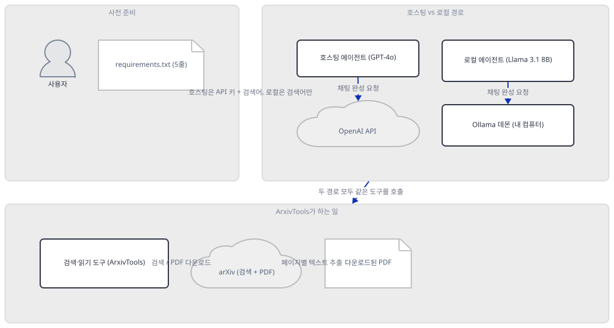
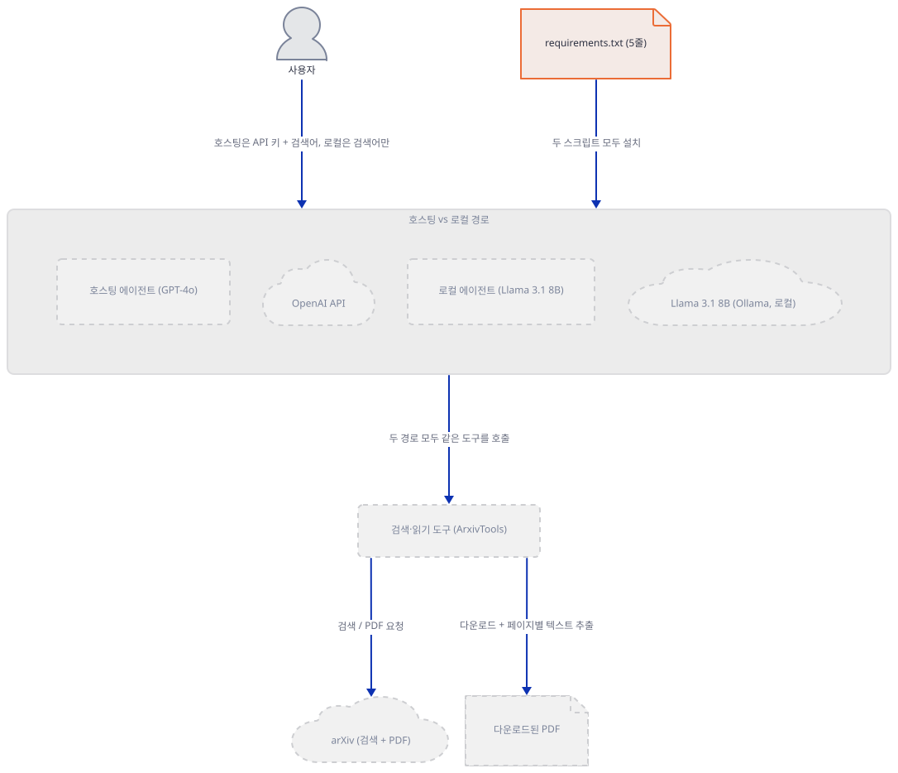
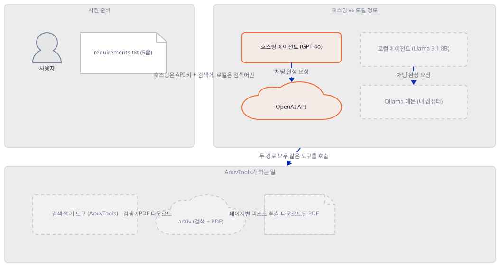
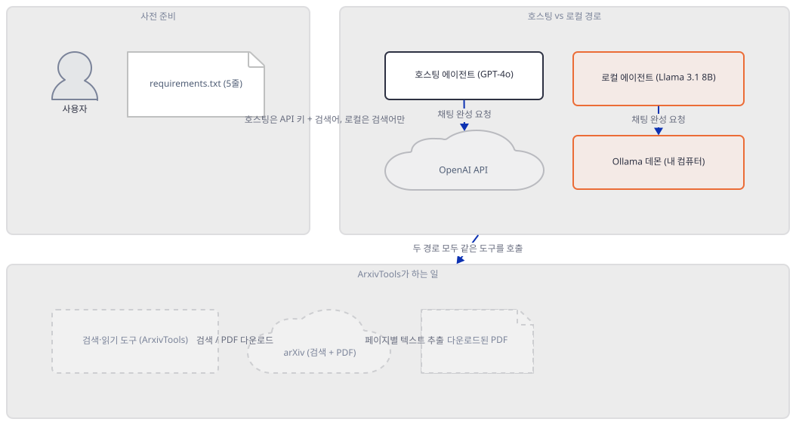
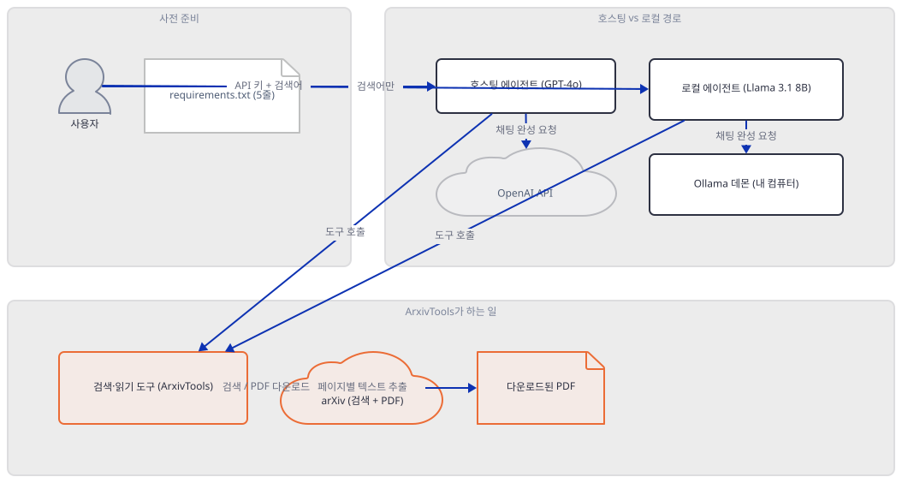
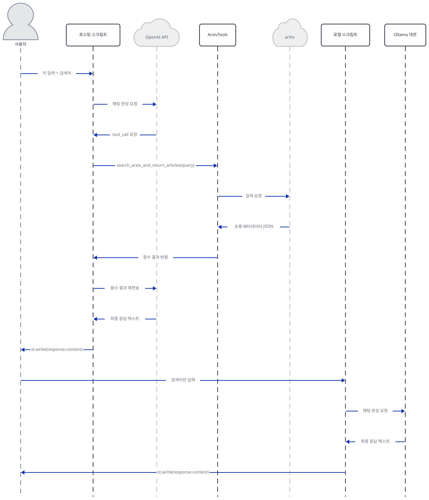

# Day 040 · 📚 Chat with Research Papers (ArXiv) (GPT & Llama3)

> 볼륨 4 💬 Chat with X · 난이도 ★★☆ · 예상 소요 55분 · API 비용 대략 무료 — 호스팅 경로(`chat_arxiv.py`)는 키가 없어 실제 호출까지 가지 못했고, 로컬 경로(`chat_arxiv_llama3.py`)는 Ollama 자체가 무료입니다(다만 `llama3.1:8b`를 실제로 받으면 디스크 약 4.9GB, Step 3) · 원본 앱: `advanced_llm_apps/chat_with_X_tutorials/chat_with_research_papers`

## 오늘 만들 것

이 폴더는 두 파일에 걸쳐 54줄뿐입니다(`chat_arxiv.py` 31줄, `chat_arxiv_llama3.py` 23줄 — 편집기·GitHub 기준 개행 보정 값, 직접 확인). Day 037처럼 같은 아이디어를 두 번 배선한 모양이지만 — agno의 `Agent`에 채팅 모델 하나와 `tools=[ArxivTools()]`를 물려 실행하는 것 — 차이는 모델 문자열 하나가 아닙니다: `chat_arxiv.py`는 OpenAI 키 입력창이 채워져야만 에이전트 생성부터 검색창까지 전부 나타나고 `max_tokens=1024`·`temperature=0.9`를 명시하는 반면, `chat_arxiv_llama3.py`는 그런 게이트도 생성 파라미터도 없이 즉시 `Ollama(id="llama3.1:8b")` 에이전트를 만듭니다(직접 확인, Step 2·3). 이 앱의 진짜 핵심은 두 스크립트가 공유하는 `ArxivTools`입니다 — 검색 함수는 arXiv API에서 초록과 메타데이터만 가져오고, 읽기 함수는 호출되면 실제로 PDF를 내려받아 `pypdf`로 페이지마다 텍스트를 뽑아 그대로 모델에게 돌려줍니다. 임베딩도, 벡터 저장소도, 어디에도 없습니다(소스로 확인, agno 3.0.10 `agno/tools/arxiv.py`) — 앱 자체 README가 스스로를 "RAG application"이라 부르지만(직접 확인, 앱 README 2행) 실제로는 검색-후-필요하면-원문통째로 방식입니다. 오늘 실제로 설치해 보니 `requirements.txt` 다섯 줄(`streamlit`, `agno`, `arxiv`, `openai`, `pypdf`) 중 넷은 호스팅 경로와 `ArxivTools` 임포트까지 그대로 충분했지만, 로컬 경로의 `from agno.models.ollama import Ollama`만 별도 패키지 하나가 빠져 막혔습니다 — Day 037·038만큼 광범위하지는 않지만 같은 종류의 버전 드리프트입니다. 그리고 두 스크립트 다 `try/except`도 `instructions`도 없어서, 키나 모델이 틀리면 화면이 멈추는 대신 agno 3.0.10의 `Agent.run()`이 조용히 반환하는 에러 문자열이 "답변"인 척 그대로 표시된다는 것도 양쪽 모델 백엔드에서 각각 직접 확인했습니다. 완성하면 검색어 하나를 넣어 arXiv 논문을 찾고 읽게 하는 화면을 로컬에서 띄우게 됩니다. 아래는 완성된 아키텍처입니다.



## 사전 준비

| 서비스/도구 | 용도 | 발급·설치 |
|---|---|---|
| OpenAI API 키 (선택, 호스팅 경로) | `chat_arxiv.py`가 실제로 응답하려면 필요. 사이드바가 아니라 본문 `st.text_input(type="password")`에 직접 붙여넣는다(환경변수 아님) | https://platform.openai.com/api-keys 발급 (이 실습에서는 생략 가능) |
| Ollama (선택, 로컬 경로) | `chat_arxiv_llama3.py`가 실제로 응답하려면 Ollama 데몬과 `llama3.1:8b` 모델이 필요. 이 환경에는 Ollama가 이미 설치돼 실행 중이었지만 `llama3.1:8b`는 받지 않았습니다(직접 확인) | https://ollama.com/download 설치. 받기 전에 Step 3의 디스크(4.9GB)·메모리(8GB 이상) 비용부터 확인 |
| uv | 가상환경 생성과 패키지 설치 | [공통 사전 준비](../README.md#공통-사전-준비-한-번만) 절 참고 |
| 인터넷 연결 | PyPI 설치, (실제로 실행할 경우) arXiv 검색·PDF 접속과 Ollama 데몬 접속 | 별도 설치 없음 |

## 아키텍처 한눈에 보기

| 컴포넌트 | 역할 | 코드 위치 |
|---|---|---|
| 사용자 | 키(선택) + 검색어 입력 | 코드 없음 (브라우저) |
| 호스팅 스크립트 | 키 입력을 게이트로 GPT-4o 에이전트를 만들어 실행 | `advanced_llm_apps/chat_with_X_tutorials/chat_with_research_papers/chat_arxiv.py:11-31` |
| 로컬 스크립트 | 게이트 없이 Llama 3.1 8B 에이전트를 즉시 만들어 실행 | `advanced_llm_apps/chat_with_X_tutorials/chat_with_research_papers/chat_arxiv_llama3.py:11-23` |
| 검색·읽기 도구 (ArxivTools) | 초록 검색과, PDF 다운로드+페이지별 텍스트 추출 두 함수를 에이전트에 등록 | 코드 없음 (agno 3.0.10 패키지, `agno/tools/arxiv.py`) |
| OpenAI API (`gpt-4o`) | 호스팅 경로의 모델 호출 | 코드 없음 (외부 서비스) |
| Ollama 데몬 (`llama3.1:8b`) | 로컬 경로의 모델 호출, 기본 포트 11434 | 코드 없음 (로컬 서비스, 이 리포 밖) |
| arXiv | 검색 결과와 논문 PDF 원문 제공 | 코드 없음 (외부 서비스) |

## 단계별 진행

### Step 1. 환경 만들기

**목적.** 이 앱의 의존성을 격리된 가상환경에 설치하고, 다섯 줄짜리 `requirements.txt`가 두 스크립트 모두를 실제로 띄우기에 충분한지 직접 확인합니다.

**할 일.**

```bash
cd advanced_llm_apps/chat_with_X_tutorials/chat_with_research_papers
uv venv
uv pip install -r requirements.txt
```

(pip 대안: `python -m venv .venv && source .venv/bin/activate && pip install -r requirements.txt`.)

이 저장소는 루트에 `pyproject.toml`이 있어 `uv run`이 방금 만든 환경 대신 루트의 `.venv`를 쓰므로, 이후 `uv run` 명령에는 모두 `--no-project`를 붙입니다.

`advanced_llm_apps/chat_with_X_tutorials/chat_with_research_papers/requirements.txt:1-5`

```text
streamlit
agno
arxiv
openai
pypdf
```

이 문서를 작성하며 설치했을 때는 **agno 3.0.10**, **arxiv 4.0.1**, **pypdf 6.19.0**, **openai 3.17.0**, **streamlit 1.64.0**이 받아졌습니다(직접 확인 — 다섯 줄 다 버전 고정이 없어 2026-09-22 기준 최신입니다. agno 버전은 Day 037·038과 같습니다). `py_compile`은 둘 다 통과합니다.

```bash
uv run --no-project python -m py_compile chat_arxiv.py chat_arxiv_llama3.py && echo compiled
```

```
compiled
```

실제 import는 갈립니다. 호스팅 경로와 `ArxivTools`는 이 다섯 줄만으로 이미 충분합니다.

```bash
uv run --no-project python -c "from agno.agent import Agent; from agno.models.openai import OpenAIChat; from agno.tools.arxiv import ArxivTools; print('ok hosted imports')"
```

```
ok hosted imports
```

로컬 경로만 막힙니다 — `agno.models.ollama`가 내부적으로 파이썬 `ollama` 클라이언트 패키지를 직접 import하는데, 이 패키지가 `requirements.txt` 다섯 줄 어디에도 없습니다(소스로 확인, agno 3.0.10 `agno/models/ollama/chat.py`).

```bash
uv run --no-project python -c "from agno.models.ollama import Ollama"
```

직접 확인한 출력(발췌):

```
ModuleNotFoundError: No module named 'ollama'
...
ImportError: `ollama` not installed. Please install using `pip install ollama`
```

```bash
uv pip install ollama
uv run --no-project python -c "from agno.models.ollama import Ollama; print('ok local import')"
```

```
ok local import
```

**그림.**



**확인.** 위 세 `python -c` 명령이 이 Step의 확인입니다 — 첫 번째와 세 번째는 `ok hosted imports`·`ok local import`를 출력해야 하고, 두 번째는 `ImportError`로 시작하는 줄과 함께 실패해야 합니다.

### Step 2. 호스팅 경로(`chat_arxiv.py`) — 키가 있어야 시작되는 GPT-4o 에이전트

**목적.** 키 입력이 어떻게 이 앱 전체를 게이트하는지, 그리고 `OpenAIChat`에 어떤 생성 파라미터가 명시되는지 확인합니다.

**할 일.**

`advanced_llm_apps/chat_with_X_tutorials/chat_with_research_papers/chat_arxiv.py:15-23`

```python
if openai_access_token:
    # Create an instance of the Assistant
    assistant = Agent(
    model=OpenAIChat(
        id="gpt-4o",
        max_tokens=1024,
        temperature=0.9,
        api_key=openai_access_token) , tools=[ArxivTools()]
    )
```

`openai_access_token`(`advanced_llm_apps/chat_with_X_tutorials/chat_with_research_papers/chat_arxiv.py:12`)이 빈 문자열이면 이 블록 전체 — 에이전트 생성부터 검색창(Step 5)까지 — 가 아예 실행되지 않습니다. `max_tokens=1024`·`temperature=0.9`는 agno의 기본값이 아닙니다 — 인자 없이 `OpenAIChat(id="gpt-4o")`만 만들면 둘 다 `None`으로 남습니다(직접 확인). `OpenAIChat(...)` 생성 자체는 가짜 키로도 성공합니다(직접 확인, 아래) — 키 검증은 실제 호출 시점(Step 5)에야 일어납니다.

**그림.**



**확인.**

```bash
uv run --no-project python -c "
from agno.agent import Agent
from agno.models.openai import OpenAIChat
from agno.tools.arxiv import ArxivTools
a = Agent(model=OpenAIChat(id='gpt-4o', max_tokens=1024, temperature=0.9, api_key='fake-key-123'), tools=[ArxivTools()])
print('model id:', a.model.id)
print('tools:', a.tools)
"
```

직접 확인한 출력:

```
model id: gpt-4o
tools: [<ArxivTools id=arxiv-tools name=arxiv_tools functions=['search_arxiv_and_return_articles', 'read_arxiv_papers']>]
```

### Step 3. 로컬 경로(`chat_arxiv_llama3.py`) — 게이트 없이 내 컴퓨터로 가는 Llama 3.1

**목적.** 이 스크립트에는 키 게이트가 전혀 없다는 것과, 키를 주지 않은 `Ollama(id=...)`가 실제로 어디로 가는지 확인합니다. `llama3.1:8b`를 받으면 드는 실제 비용도 받지 않고 확인합니다.

**할 일.**

`advanced_llm_apps/chat_with_X_tutorials/chat_with_research_papers/chat_arxiv_llama3.py:11-15`

```python
# Create an instance of the Assistant
assistant = Agent(
model=Ollama(
    id="llama3.1:8b") , tools=[ArxivTools()]
)
```

`advanced_llm_apps/chat_with_X_tutorials/chat_with_research_papers/chat_arxiv.py:15`의 `if openai_access_token:` 같은 가드가 없습니다 — 이 다섯 줄은 스크립트가 로드되는 즉시, 모듈 최상위 들여쓰기(0칸)에서 바로 실행됩니다. 캡션(`advanced_llm_apps/chat_with_X_tutorials/chat_with_research_papers/chat_arxiv_llama3.py:9`)은 "Llama-3 running locally"라고 말하지만 실제 `id`는 `llama3.1:8b`입니다 — Llama 3(1세대)가 아니라 Llama 3.1입니다(직접 확인). `Ollama(id=...)`는 `host`도 `api_key`도 받지 않습니다. agno의 `Ollama`는 `api_key`를 기본값으로 `OLLAMA_API_KEY` 환경변수에서 읽고, 그 값이 있을 때만 `host`를 Ollama 클라우드(`https://ollama.com`)로 돌립니다(소스로 확인, agno 3.0.10 `agno/models/ollama/chat.py`의 `_get_client_params`). 이 환경변수가 없으면 `host`는 `None`으로 남아 파이썬 `ollama` 클라이언트 자신의 기본값으로 넘어가는데, 그 기본값은 `127.0.0.1:11434` — 독자 자신의 기계입니다(소스로 확인, `ollama` 0.6.2 패키지의 `_client.py`).

이 환경에는 Ollama가 이미 떠 있었지만 `llama3.1:8b`는 받지 않았습니다.

```bash
ollama list | grep -c "llama3.1"
```

```
0
```

(`grep`이 매치를 못 찾으면 종료 코드가 1입니다 — 목록 자체는 환경마다 달라도, `llama3.1:8b`가 없다는 사실은 이 문서 전체에서 그대로입니다.) 받으면 드는 비용은 Day 037의 `qwq:32b`(디스크 20GB·RAM 32GB)보다 훨씬 가볍습니다: 기본 태그 다운로드 크기 **4.9GB**, 파라미터 8B(소스로 확인, https://ollama.com/library/llama3.1 — 받지 않고 페이지만 확인). 메모리는 Ollama 공식 quickstart 문서의 경험칙을 그대로 적용하면 7B 구간에 해당해 **최소 8GB RAM**이면 됩니다(소스로 확인, https://ollama.readthedocs.io/en/quickstart/ — "7B 모델은 최소 8GB RAM, 13B는 16GB, 33B는 32GB").

**그림.**



**확인.** 모델을 받지 않고, 없는 모델 이름으로 같은 경로를 안전하게 태워 로컬 데몬이 실제로 응답하는지만 확인합니다.

```bash
uv run --no-project python -c "
from agno.agent import Agent
from agno.models.ollama import Ollama
from agno.tools.arxiv import ArxivTools
agent = Agent(model=Ollama(id='not-a-real-model:latest'), tools=[ArxivTools()])
resp = agent.run('hello', stream=False)
print('status:', resp.status)
print('content:', resp.content[:80])
"
```

직접 확인한 출력:

```
ERROR   Error in Agent run: model 'not-a-real-model:latest' not found (status code: 404)
status: RunStatus.error
content: model 'not-a-real-model:latest' not found (status code: 404)
```

(0.4초 만에 응답 — 로컬 데몬이 실제로 답했다는 뜻입니다. 정확한 시간은 기기와 데몬 상태에 따라 달라지는 비결정적 값입니다.)

### Step 4. `ArxivTools`가 실제로 하는 일 — 검색은 초록만, 읽기는 PDF 통째로

**목적.** 두 스크립트가 공유하는 `ArxivTools()`에 등록된 함수 두 개가 각각 무엇을 하는지, 그리고 벡터 저장소나 인덱스가 어디에도 없다는 것을 확인합니다.

**할 일.** 두 스크립트 어디에도 `arxiv`나 `pypdf`를 직접 import하는 줄은 없습니다 — 둘 다 `agno.tools.arxiv.ArxivTools` 안에서만 쓰입니다(소스로 확인, agno 3.0.10 `agno/tools/arxiv.py`). 검색 함수는 arXiv API를 호출해 초록과 메타데이터만 돌려줍니다.

```python
# agno 3.0.10, agno/tools/arxiv.py 일부 (소스로 확인)
def search_arxiv_and_return_articles(self, query: str, num_articles: int = 10) -> str:
    for result in self.client.results(
        search=arxiv.Search(query=query, max_results=num_articles, ...)
    ):
        article = {"title": result.title, ..., "summary": result.summary, ...}
    return json.dumps(articles, indent=4)
```

읽기 함수는 다릅니다 — 호출되면 그 자리에서 실제 PDF를 내려받고, `pypdf`로 페이지마다 텍스트를 뽑습니다.

```python
# agno 3.0.10, agno/tools/arxiv.py 일부 (소스로 확인)
def read_arxiv_papers(self, id_list: List[str], pages_to_read: Optional[int] = None) -> str:
    download_dir.mkdir(parents=True, exist_ok=True)
    for result in self.client.results(search=arxiv.Search(id_list=id_list)):
        pdf_path = result.download_pdf(dirpath=str(download_dir))
        pdf_reader = PdfReader(pdf_path)
        for page_number, page in enumerate(pdf_reader.pages, start=1):
            content = {"page": page_number, "text": page.extract_text()}
```

`read_arxiv_papers`의 독스트링은 "논문을 지식베이스에 추가한다(add to the knowledge base)"고 말하지만, 실제로는 어떤 지식베이스에도 추가하지 않습니다 — 페이지별 텍스트를 JSON으로 묶어 그 호출 하나의 반환값으로 돌려줄 뿐입니다(소스로 확인). 임베딩도, 청크 분할도, 벡터 저장소도 없습니다. 유일하게 남는 것은 내려받은 PDF 파일 자체이고, 그 위치(`download_dir`)는 기본값이 **설치된 `agno` 패키지 폴더 안**(`.../site-packages/agno/tools/arxiv_pdfs`)입니다 — 프로젝트 폴더도, 독자가 고른 위치도 아닙니다(직접 확인, 아래). 실제 파일이라 앱을 재시작해도 그대로 남지만, 가상환경을 새로 만들거나 `agno`를 재설치하면 함께 사라집니다.

**그림.**



**확인.** 실제 검색·다운로드는 하지 않고, 등록된 함수 이름과 기본 다운로드 위치만 안전하게 확인합니다.

```bash
uv run --no-project python -c "
from agno.tools.arxiv import ArxivTools
t = ArxivTools()
print('functions:', list(t.functions.keys()))
print('download_dir ends with:', str(t.download_dir).replace(chr(92), '/').split('site-packages/')[-1])
"
```

직접 확인한 출력:

```
functions: ['search_arxiv_and_return_articles', 'read_arxiv_papers']
download_dir ends with: agno/tools/arxiv_pdfs
```

### Step 5. 실행과 결과 표시 — 지시문도 세션도 없는 단발 질문

**목적.** 검색창을 채우고 나면 무슨 일이 벌어지는지, 그리고 두 에이전트 다 `instructions`도 `try/except`도 없어서 키나 모델이 틀려도 화면이 멈추지 않고 에러 문자열이 "답변"처럼 뜬다는 것을 직접 확인합니다.

**할 일.**

`advanced_llm_apps/chat_with_X_tutorials/chat_with_research_papers/chat_arxiv.py:26-31`

```python
    query= st.text_input("Enter the Search Query", type="default")

    if query:
        # Search the web using the AI Assistant
        response = assistant.run(query, stream=False)
        st.write(response.content)
```

`advanced_llm_apps/chat_with_X_tutorials/chat_with_research_papers/chat_arxiv_llama3.py:17-23`도 들여쓰기만 다를 뿐 같은 세 줄(입력 → `if query:` → `run` → `write`)입니다. 두 `Agent(...)` 호출(`advanced_llm_apps/chat_with_X_tutorials/chat_with_research_papers/chat_arxiv.py:17-23`, `advanced_llm_apps/chat_with_X_tutorials/chat_with_research_papers/chat_arxiv_llama3.py:12-15`) 어디에도 `instructions`가 없습니다 — 검색만 할지 원문까지 읽을지는 두 함수의 시그니처와 독스트링만 보고 모델이 스스로 정합니다. `st.session_state`도, 대화 기록도 없습니다 — 스트림릿이 재실행될 때마다 검색어 하나로 끝나는 단발 질문입니다(직접 확인: 두 파일 54줄 어디에도 `instructions`·`session_state`·`try`가 없습니다). agno 3.0.10의 `Agent.run()`은 모델 호출이 실패해도 예외를 던지지 않고 `status=RunStatus.error`인 결과를 그대로 반환합니다 — Day 038이 Gemini에서 확인한 것과 같은 동작을, 이번에는 OpenAIChat과 Ollama 양쪽에서 각각 직접 확인했습니다.

**그림.**


**확인.** 가짜 키로 호스팅 경로를 직접 호출합니다(Step 3에서는 로컬 경로의 같은 동작을 이미 확인했습니다).

```bash
uv run --no-project python -c "
from agno.agent import Agent
from agno.models.openai import OpenAIChat
from agno.tools.arxiv import ArxivTools
agent = Agent(model=OpenAIChat(id='gpt-4o', max_tokens=1024, temperature=0.9, api_key='fake-key-123'), tools=[ArxivTools()])
resp = agent.run('what is attention is all you need about', stream=False)
print('status:', resp.status)
print('content:', resp.content[:120])
"
```

직접 확인한 출력(발췌):

```
ERROR   API status error from OpenAI API: Error code: 401 - {'error': {'message': 'Incorrect API key provided: fake-key-123. ...
status: RunStatus.error
content: Incorrect API key provided: fake-key-123. You can find your API key at https://platform.openai.com/account/api-keys.
```

## 요청 한 건이 흐르는 과정



두 스크립트는 별도 실행이라 이 그림은 둘을 이어 그린 것입니다 — 실제로는 둘 중 하나만 뜹니다. 사용자가 `chat_arxiv.py`에 키와 검색어를 넣으면, 에이전트는 질문과 두 도구의 스키마를 얹어 OpenAI에 채팅 완성을 요청합니다. 모델이 검색이 필요하다고 판단하면 `tool_call`로 돌아오고, 에이전트는 로컬에서 `search_arxiv_and_return_articles(query)`를 실행해 `arxiv.Client().results(...)`로 arXiv를 조회한 뒤 초록·메타데이터 JSON을 함수 결과로 다시 OpenAI에 보내고, 그 결과를 근거로 만든 최종 응답이 `st.write(response.content)`로 표시됩니다. 사용자가 대신 `chat_arxiv_llama3.py`에 검색어만 넣으면(키 없음), 같은 `ArxivTools`를 든 에이전트가 127.0.0.1:11434의 Ollama 데몬에 채팅 완성을 요청하고, 최종 응답이 같은 방식으로 표시됩니다. 이 그림은 키가 없어 처음부터 끝까지 이어지는 것을 보지는 못했고, Step 1~5에서 각 구간을 개별적으로 확인한 것을 이어붙인 것입니다 — 특히 `read_arxiv_papers`가 실제로 PDF를 내려받는 두 번째 도구 호출 왕복은, 모델이 특정 논문 원문을 요청할 때만 일어나므로 여기 그리지 않았습니다.

## 실행 체크리스트

- [ ] `uv venv && uv pip install -r requirements.txt`로 기본 의존성을 설치했다
- [ ] `from agno.models.ollama import Ollama`가 `ModuleNotFoundError`로 실패하고 `uv pip install ollama`로 해결된다는 것을 확인했다
- [ ] `chat_arxiv.py`는 키가 있어야 전체 로직이 시작되고, `chat_arxiv_llama3.py`는 게이트가 아예 없다는 차이를 코드로 확인했다
- [ ] `ArxivTools`에 `search_arxiv_and_return_articles`(초록만)와 `read_arxiv_papers`(PDF 다운로드+`pypdf` 텍스트 추출) 두 함수가 등록된다는 것을 확인했다
- [ ] 다운로드된 PDF가 벡터 저장소가 아니라 설치된 `agno` 패키지 폴더 안의 평범한 파일로 남는다는 것을 이해했다
- [ ] 잘못된 키·모델로 실행하면 예외 없이 `RunStatus.error`의 에러 문자열이 그대로 "응답"으로 표시된다는 것을 OpenAIChat과 Ollama 양쪽에서 직접 확인했다
- [ ] `llama3.1:8b`를 받지 않고도 예상 다운로드 크기(4.9GB)와 권장 메모리(8GB 이상)를 확인했다

## 문제 해결

| 증상 | 원인 | 해결 |
|---|---|---|
| `from agno.models.ollama import Ollama`에서 `ModuleNotFoundError: No module named 'ollama'` | `requirements.txt` 다섯 줄에 파이썬 `ollama` 클라이언트가 없는데, agno의 `Ollama` 래퍼가 이를 직접 import한다(소스로 확인, Step 1) | `uv pip install ollama` |
| 잘못되거나 빈 키로 실행해도 빨간 에러 화면 대신 "Incorrect API key provided..." 같은 문장이 검색 결과처럼 표시됨 | agno 3.0.10의 `Agent.run()`이 인증 실패에도 예외를 던지지 않고 `status=RunStatus.error`인 결과를 정상 반환하는데, 두 스크립트 다 `try/except`도 `.status` 확인도 없어 `.content`가 그대로 표시된다(직접 확인, Step 5) | 화면에 `API key`·`not found`·`error` 같은 문구가 보이면 답변이 아니라 키/모델 문제로 의심 |
| `chat_arxiv_llama3.py`를 그대로 켜면 Ollama 데몬이 없거나 `llama3.1:8b`가 없을 때도 같은 방식으로 에러 문자열이 "응답"으로 뜸 | 위와 동일한 이유(예외 대신 `RunStatus.error`) | `ollama list`로 데몬과 모델 존재를 먼저 확인 |
| 앱 자체 `README.md`가 "RAG application"이라 부르고, clone 경로를 `awesome-llm-apps/chat_with_X_tutorials/...`로 안내하며, `chat_arxiv_llama3.py`는 한 줄도 언급하지 않음 | 이 리포가 `advanced_llm_apps/` 아래로 재편되기 전 문서로 보이고, 실제 코드에는 벡터 인덱스나 임베딩이 전혀 없다(소스로 확인, Step 4) | 실제 경로(`advanced_llm_apps/chat_with_X_tutorials/chat_with_research_papers`)를 쓰고, 로컬 경로는 `chat_arxiv_llama3.py`를 직접 실행 |

## 더 해보기

- 두 `Agent(...)` 호출(`advanced_llm_apps/chat_with_X_tutorials/chat_with_research_papers/chat_arxiv.py:17-23`, `advanced_llm_apps/chat_with_X_tutorials/chat_with_research_papers/chat_arxiv_llama3.py:12-15`)에 `instructions=["먼저 search_arxiv_and_return_articles로 후보를 찾고, 사용자가 특정 논문을 지목하면 read_arxiv_papers로 원문을 읽어라"]`를 추가해, 두 함수가 실제로 의도한 순서로 호출되는지 관찰해보기
- `ArxivTools(download_dir=Path("./my_papers"))`처럼 다운로드 위치를 지정해, PDF가 `agno` 패키지 폴더 대신 원하는 곳에 쌓이도록 고쳐보기
- `advanced_llm_apps/chat_with_X_tutorials/chat_with_research_papers/chat_arxiv.py:30-31`에서 `response.status`가 `RunStatus.error`인지 먼저 검사해서 그럴 때만 `st.error()`로 알리도록 고쳐보기 — 문제 해결의 두 번째 항목을 직접 막는 방법입니다

## 다음 날 예고

[Day 041 · 💬 Chat with GitHub (GPT & Llama3)](../day041-chat-with-github/README.md) — 같은 GPT-호스팅/로컬-Llama3 이중 구성으로, 이번에는 arXiv 대신 GitHub 저장소와 대화합니다.
