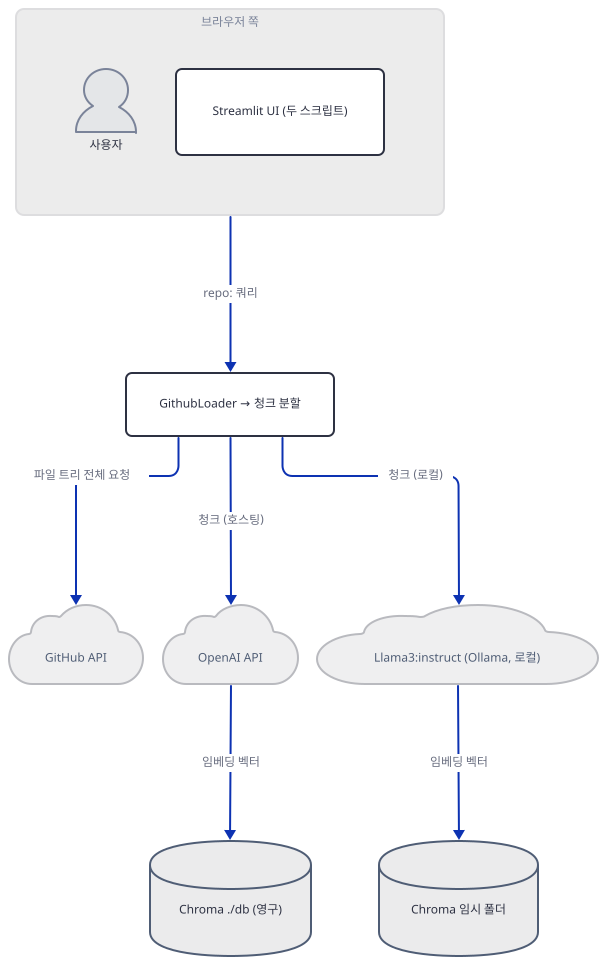
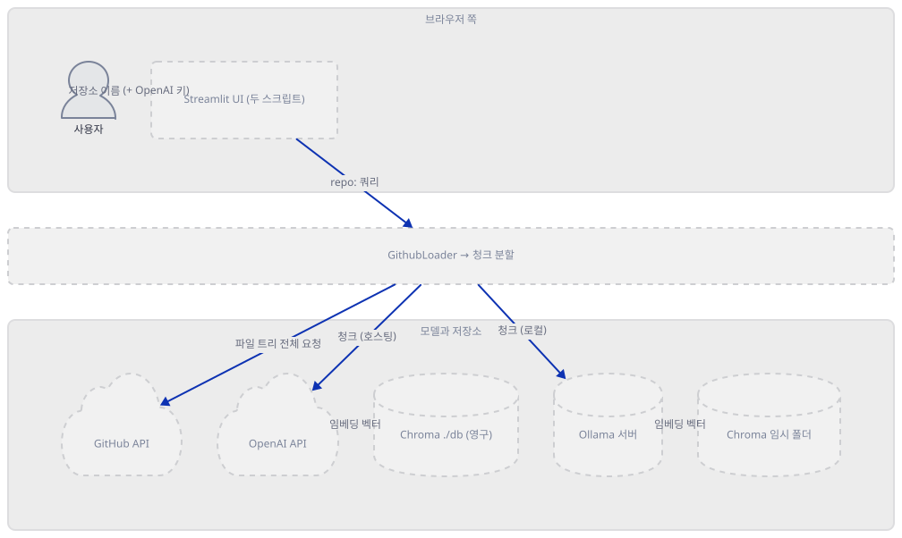
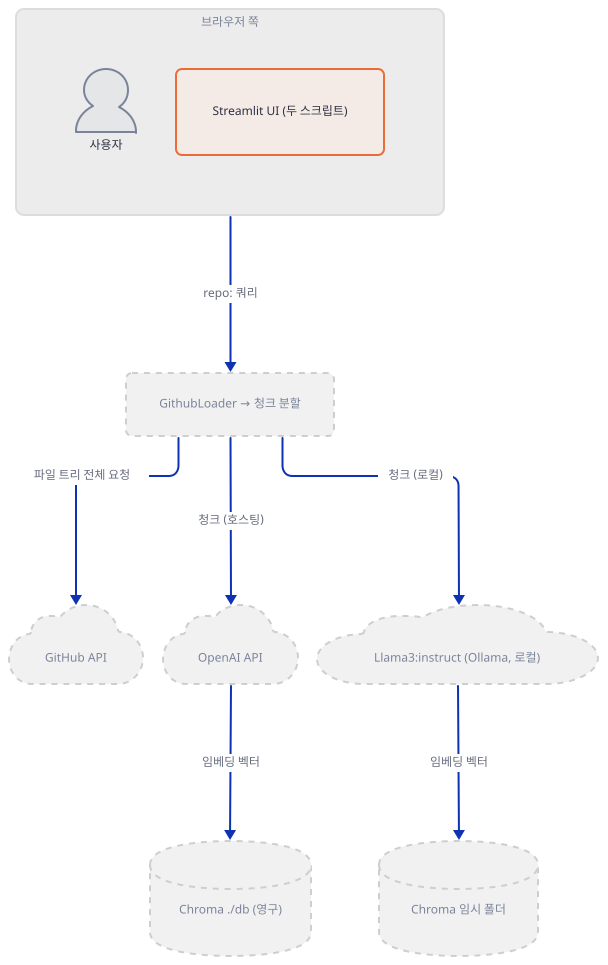
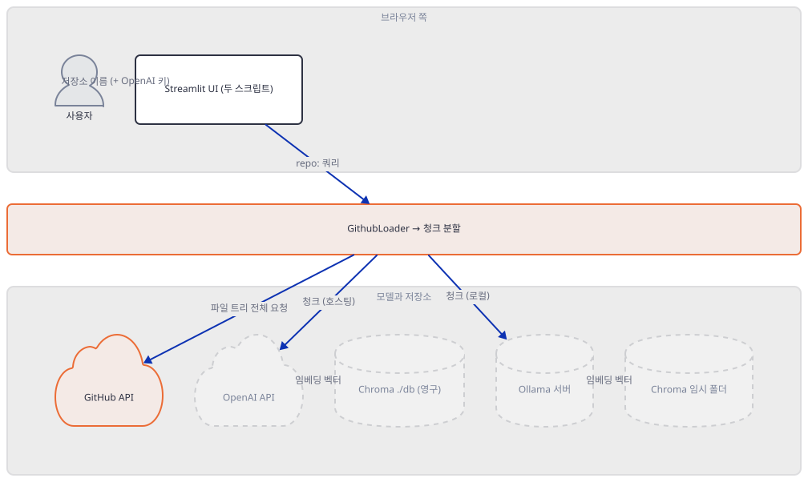
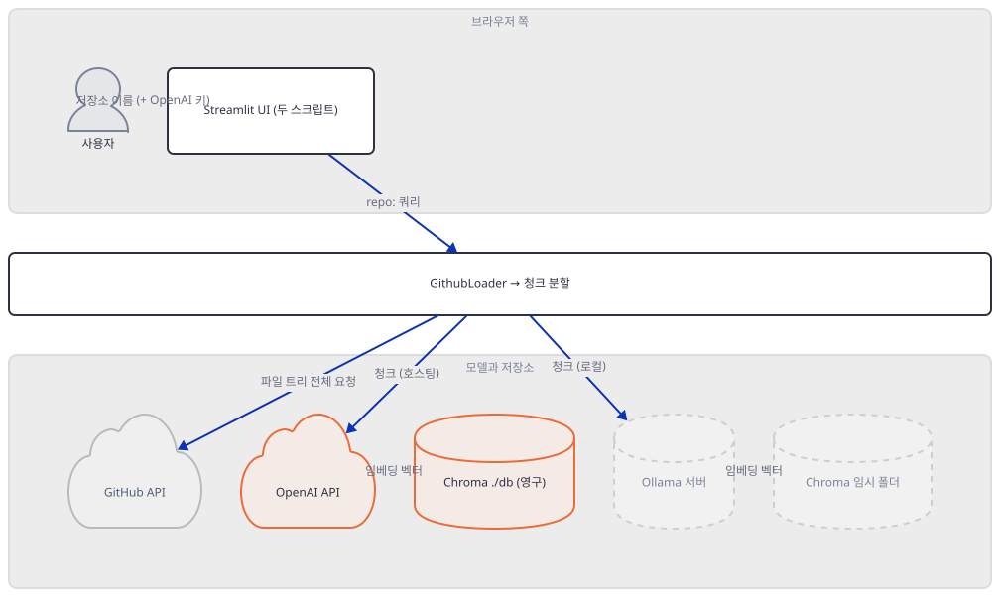
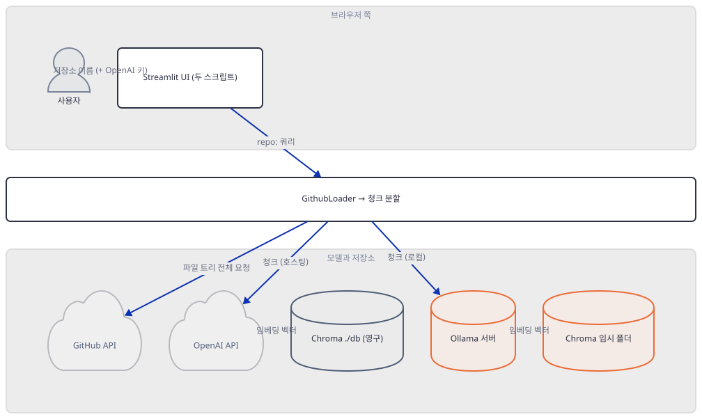
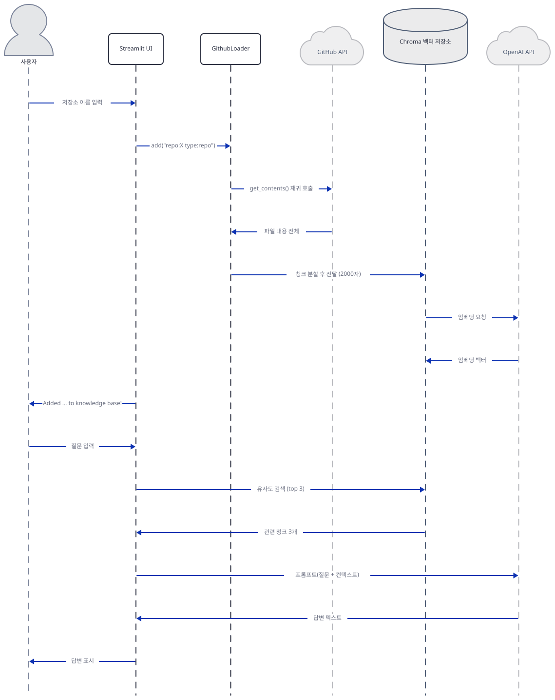

# Day 041 · 💬 Chat with GitHub (GPT & Llama3)

> 볼륨 4 💬 Chat with X · 난이도 ★★☆ · 예상 소요 115분(가상환경을 두 번 만들고 패키지를 여러 차례 설치·검증하는 손 시간이 커서 읽는 시간보다 깁니다) · API 비용 대략 확인 못함(키 없이 진행) — 앱이 저장소 크기에 상한을 두지 않아(Step 3) 실제로는 넣는 저장소 크기에 비례해서 커짐 · 원본 앱: `advanced_llm_apps/chat_with_X_tutorials/chat_with_github`

## 오늘 만들 것

이번 튜토리얼은 GitHub 저장소 하나를 통째로 벡터 데이터베이스에 넣고 그 내용에 대해 대화하는 RAG 앱을 다룹니다. `embedchain`이라는 프레임워크가 로더·청커·임베더·벡터저장소·LLM을 전부 `App` 객체 뒤로 감춰주기 때문에 리포 코드 자체는 짧습니다 — 호스팅 버전(`chat_github.py`, 36줄)은 OpenAI 키 하나만 받아 `App()`을 인자 없이 그대로 씁니다. 그 "인자 없이"가 실제로 무엇을 고르는지 — 임베딩 모델, 응답 모델, 벡터를 저장할 위치 — 는 이 리포 어디에도 적혀 있지 않고 embedchain 소스를 직접 실행해봐야 나옵니다(Step 3·4에서 직접 확인). 로컬 버전(`chat_github_llama3.py`, 72줄)은 그 기본값 전부를 Ollama용으로 손수 다시 적습니다. 이것이 코드가 정확히 두 배인 이유입니다 — 하나는 프레임워크의 기본값에 올라타고, 다른 하나는 그 기본값을 전부 손으로 다시 씁니다.

그런데 이 문서를 준비하며 실제로 설치하고 실행해 보니 두 파일 다 겉보기와 다르게 움직입니다. 먼저 `requirements.txt`가 못박은 `embedchain[github]`이라는 익스트라는 지금 PyPI 최신 embedchain(0.1.128)에는 존재하지 않습니다(직접 확인) — 저장소를 읽는 데 필요한 PyGithub가 설치되지 않은 채로 조용히 넘어갑니다. 그리고 Windows + 최신 Python 조합에서는 그 이전에 다른 벽이 먼저 나옵니다: embedchain이 요구하는 벡터 DB 라이브러리 하나가 Python 3.12용 Windows 바이너리를 아예 내지 않아 컴파일러 없이는 설치조차 안 됩니다(Step 1에서 직접 확인). 여기까지 넘어도 진짜 문제가 남습니다 — 두 스크립트 모두 GitHub 토큰을 얻는 코드 자체가 깨져 있습니다. 호스팅 버전은 토큰 자리에 `"Your GitHub Token"`이라는 안내 문구를 글자 그대로 박아 놓았고, 로컬 버전은 그 문구를 진짜 환경변수 이름인 것처럼 `os.getenv()`에 넘겨 항상 빈 값을 받습니다 — 그리고 그 빈 값 때문에 화면이 뜨기도 전에 멈춥니다(Step 2·5에서 직접 확인). 이 문서는 리포 코드가 "이렇게 동작한다"고 말하는 것과, embedchain·PyPI·Windows가 지금 실제로 응답하는 것을 나란히 놓고 그 틈을 하나씩 메웁니다.



## 사전 준비

| 서비스/도구 | 용도 | 발급·설치 |
|---|---|---|
| GitHub 개인 액세스 토큰 (classic) | `GithubLoader`가 저장소 파일을 읽을 때 필요 — 다만 두 스크립트 모두 이 토큰을 실제로 받는 코드가 깨져 있음(Step 2·5) | `GithubLoader`가 스스로의 에러 메시지에서 안내하는 발급 링크: `https://docs.github.com/en/authentication/keeping-your-account-and-data-secure/managing-your-personal-access-tokens#creating-a-personal-access-token-classic`. 공개 저장소만 읽을 계획이면 `public_repo` 스코프로 충분하고, 비공개 저장소를 읽으려면 계정이 접근 가능한 모든 비공개 저장소에 대한 읽기·쓰기 권한인 `repo` 스코프 전체가 필요함 |
| OpenAI API 키 | `chat_github.py` 실행 화면의 입력창에 직접 붙여넣음(환경변수 아님) | `https://platform.openai.com/` 가입 후 발급 |
| Python 3.11 이하로 가상환경 생성 | Windows에서 `embedchain[github]`이 끌어오는 `chroma-hnswlib 0.7.6`이 Python 3.12·3.13용 Windows wheel을 내지 않음(Step 1에서 직접 확인) | 가상환경을 3.12나 시스템 기본(3.13)이 아니라 3.11로 생성 |
| (선택) Ollama | `chat_github_llama3.py`가 실제로 응답하려면 로컬 데몬과 `llama3:instruct` 모델(다운로드 4.7GB)이 필요 | `https://ollama.com/download`. 모델을 받기 전에 Step 5의 크기부터 확인 |
| uv | 가상환경 생성과 패키지 설치 | [공통 사전 준비](../README.md#공통-사전-준비-한-번만) 절 참고 |
| 인터넷 연결 | PyPI에서 패키지 설치, (실제 사용 시) GitHub API·OpenAI API·Ollama 접속 | 별도 설치 없음. 사내망이면 도메인 접속 허용 필요 |

## 아키텍처 한눈에 보기

| 컴포넌트 | 역할 | 코드 위치 |
|---|---|---|
| 사용자 | 저장소 이름과 (호스팅 경로만) OpenAI 키 입력 | 코드 없음 (브라우저) |
| 호스팅 UI (`chat_github.py`) | zero-config `App()`에 전체 로직을 위임 | `advanced_llm_apps/chat_with_X_tutorials/chat_with_github/chat_github.py:1-36` |
| 로컬 UI (`chat_github_llama3.py`) | provider 3개(llm·embedder·vectordb)를 명시적으로 설정하고 session_state로 캐싱 | `advanced_llm_apps/chat_with_X_tutorials/chat_with_github/chat_github_llama3.py:1-72` |
| GithubLoader | `repo:`/`type:` 쿼리를 파싱해 저장소 파일 트리 전체를 재귀적으로 읽음 | embedchain 0.1.128 (저장소 밖, 소스로 확인) — 호출부는 `chat_github.py:7-11`, `chat_github_llama3.py:10-16` |
| GitHub API | 저장소 파일 내용 제공 | 코드 없음 (외부 서비스) |
| CommonChunker | 2000자 단위, 겹침 없이 텍스트 분할 | embedchain 0.1.128 (저장소 밖, 소스로 확인) |
| OpenAIEmbedder / OpenAILlm | 기본 임베딩(`text-embedding-ada-002`)과 기본 응답(`gpt-4o-mini`) 모델 | embedchain 0.1.128 (저장소 밖, 소스로 확인) — 호출부는 `chat_github.py:24` |
| Chroma (호스팅 경로) | 실행 위치의 `./db`에 영구 저장 | embedchain 0.1.128 (저장소 밖, 소스로 확인) |
| Ollama 서버 (로컬 경로) | `llama3:instruct` 하나로 임베딩과 응답을 모두 수행 | `chat_github_llama3.py:24-31` |
| Chroma (로컬 경로) | `tempfile.mkdtemp()`로 실행마다 새 폴더 | `chat_github_llama3.py:41-42` |

## 단계별 진행

### Step 1. 환경 만들기 — Windows에서 첫 벽

**목적.** 이 앱의 의존성을 격리된 가상환경에 설치하면서, Windows와 최신 Python 조합에서 실제로 무엇이 막히는지부터 확인합니다.

**할 일.**

```bash
cd advanced_llm_apps/chat_with_X_tutorials/chat_with_github
uv venv --python 3.12
uv pip install -r requirements.txt
```

`advanced_llm_apps/chat_with_X_tutorials/chat_with_github/requirements.txt:1-2`

```text
streamlit
embedchain[github]
```

두 줄 다 버전 고정이 전혀 없습니다. 그런데 이 명령은 Python 3.12 가상환경에서 끝까지 가지 못합니다(직접 확인, 발췌):

```
Resolved 150 packages in 3.00s
   Building chroma-hnswlib==0.7.6
  × Failed to build `chroma-hnswlib==0.7.6`
  ├─▶ The build backend returned an error
  ╰─▶ Call to `setuptools.build_meta.build_wheel` failed (exit code: 1)
      [stderr]
      error: Unable to find a compatible Visual Studio installation.
  help: `chroma-hnswlib` (v0.7.6) was included because `embedchain` (v0.1.128)
        depends on `chromadb` (v0.5.23) which depends on `chroma-hnswlib`
```

PyPI의 실제 파일 목록을 직접 받아 확인해보면, `chroma-hnswlib` 0.7.6(이 패키지의 최신 버전이자 `chromadb` 0.5.23이 정확히 못박은 버전)은 Python 3.7부터 3.11까지는 Windows용 `win_amd64` wheel을 내지만 **3.12·3.13용 Windows wheel은 아예 없습니다**(직접 확인 — PyPI simple 인덱스를 내려받아 `cp312`/`cp313` + `win_amd64` 조합을 찾아봄, 3.7~3.11에는 있고 3.12·3.13에는 없음). 그래서 uv는 소스 빌드로 넘어가고, 이 컴파일에는 Visual Studio C++ 빌드 도구가 필요합니다. `chroma-hnswlib`에 이후 버전이 없으므로(0.7.6이 최신), 이 gap은 Build Tools를 설치하거나 Python을 낮추기 전에는 사라지지 않습니다. 가장 빠른 우회는 Python 3.11로 가상환경을 다시 만드는 것입니다.

```bash
uv venv --python 3.11
uv pip install -r requirements.txt
```

```
Resolved 150 packages in 77ms
Installed 150 packages
 ...
 + embedchain==0.1.128
 ...
 + streamlit==1.64.0
 ...
warning: The package `embedchain==0.1.128` does not have an extra named `github`
```

(직접 확인, 두 명령 모두 — 설치된 150줄 중 이 절이 짚는 둘만 남기고 `...`로 줄였고, 걸리는 시간은 실행마다 다릅니다. 앞서 3.12에서 받아 둔 것이 캐시에 남아 있어도 3.11용 wheel은 다시 받으므로 150개가 그대로 설치됩니다.) 이번엔 설치가 끝나지만 마지막 줄이 문제입니다 — **`github` 익스트라가 이 버전에는 없습니다.** PyPI에 올라온 과거 배포본들의 메타데이터를 직접 비교해보면 `embedchain[github]`은 0.1.60부터 0.1.116까지는 `PyGithub<2.0.0,>=1.59.1`과 `gitpython<4.0.0,>=3.1.38`을 끌어왔지만, 0.1.117(2024년 중순)부터는 이 익스트라 자체가 메타데이터에서 완전히 사라졌습니다(직접 확인, PyPI JSON API로 0.1.110~0.1.128 사이 버전들의 `requires_dist`를 비교). uv·pip는 존재하지 않는 익스트라 이름을 만나면 경고만 내고 나머지를 설치하므로, `embedchain`은 깔리지만 GitHub 접근에 필요한 `PyGithub`는 빠집니다. `GithubLoader`를 실제로 만들어보면 이 사실이 바로 드러납니다(직접 확인):

```bash
uv run --no-project python -c "
from embedchain.loaders.github import GithubLoader
GithubLoader(config={'token': 'fake-token-123'})
"
```

```
ValueError: GithubLoader requires extra dependencies.                   Install with `pip install gitpython==3.1.38 PyGithub==1.59.1`
```

패키징 메타데이터에서는 사라졌지만, 로더 자신의 에러 메시지는 여전히 정확한 설치 명령을 알고 있습니다. 이 문서는 로컬 버전(`chat_github_llama3.py`)의 Ollama 경로도 다루므로, 거기서 필요한 `ollama` 패키지도 여기서 함께 채웁니다(이유는 Step 5에서 다룸) — `requirements.txt`에는 이 패키지도 없습니다.

```bash
uv pip install "PyGithub==1.59.1" "gitpython==3.1.38" ollama
```

```powershell
# Windows PowerShell — 명령 자체는 bash와 동일
uv pip install "PyGithub==1.59.1" "gitpython==3.1.38" ollama
```



**확인.** `py_compile`과 세 모듈의 import가 모두 성공하는지, 그리고 두 파일의 실제 줄 수가 `wc -l`보다 하나씩 많다는 것(마지막 줄에 개행이 없음)을 확인합니다.

```bash
uv run --no-project python -m py_compile chat_github.py chat_github_llama3.py && echo compiled
uv run --no-project python -c "
from embedchain.pipeline import Pipeline as App
from embedchain import App
from embedchain.loaders.github import GithubLoader
print('ALL IMPORTS OK')
"
wc -l chat_github.py chat_github_llama3.py
```

```
compiled
ALL IMPORTS OK
  35 chat_github.py
  71 chat_github_llama3.py
```

(`wc -l`이 35·71로 하나씩 적게 세는 것은 두 파일 다 마지막 줄에 개행이 없기 때문입니다 — 직접 확인, `tail -c 1`로 마지막 바이트가 `)`임을 확인. 편집기·GitHub에서 보이는 줄 수는 36·72입니다.)

### Step 2. 호스팅 뼈대와 존재하지 않는 토큰 (`chat_github.py`)

**목적.** 호스팅 스크립트의 입력창 흐름을 보고, 이 파일 어디에도 GitHub 토큰을 받는 코드가 없다는 것을 확인합니다.

**할 일.**

`advanced_llm_apps/chat_with_X_tutorials/chat_with_github/chat_github.py:1-11`

```python
# Import the required libraries
from embedchain.pipeline import Pipeline as App
from embedchain.loaders.github import GithubLoader
import streamlit as st
import os

loader = GithubLoader(
    config={
        "token":"Your GitHub Token",
        }
    )
```

`Pipeline`은 `App`의 이름만 바꾼 하위 클래스입니다(`class Pipeline(App): """This is deprecated. Use App instead."""`, embedchain 0.1.128 소스로 확인) — 동작은 완전히 같습니다. 문제는 그 아래입니다: `GithubLoader`에 넘기는 토큰이 변수가 아니라 **`"Your GitHub Token"`이라는 안내 문구 그 자체**입니다. 이 파일 전체에서 `text_input`은 세 번 나오는데(직접 확인, 아래) 셋 다 GitHub 토큰용이 아닙니다 — OpenAI 키, 저장소 이름, 질문뿐입니다.

```bash
grep -n "text_input" chat_github.py
```

```
18:openai_access_token = st.text_input("OpenAI API Key", type="password")
26:    git_repo = st.text_input("Enter the GitHub Repo", type="default")
32:        prompt = st.text_input("Ask any question about the GitHub Repo")
```

`advanced_llm_apps/chat_with_X_tutorials/chat_with_github/chat_github.py:13-36`

```python
# Create Streamlit app
st.title("Chat with GitHub Repository 💬")
st.caption("This app allows you to chat with a GitHub Repo using OpenAI API")

# Get OpenAI API key from user
openai_access_token = st.text_input("OpenAI API Key", type="password")

# If OpenAI API key is provided, create an instance of App
if openai_access_token:
    os.environ["OPENAI_API_KEY"] = openai_access_token
    # Create an instance of Embedchain App
    app = App()
    # Get the GitHub repo from the user
    git_repo = st.text_input("Enter the GitHub Repo", type="default")
    if git_repo:
        # Add the repo to the knowledge base
        app.add("repo:" + git_repo + " " + "type:repo", data_type="github", loader=loader)
        st.success(f"Added {git_repo} to knowledge base!")
        # Ask a question about the Github Repo
        prompt = st.text_input("Ask any question about the GitHub Repo")
        # Chat with the GitHub Repo
        if prompt:
            answer = app.chat(prompt)
            st.write(answer)
```

`GithubLoader(config={"token": "Your GitHub Token", ...})`는 생성 시점에는 실패하지 않습니다 — PyGithub의 `Github(token)` 생성자는 토큰 형식을 검증하지 않고 그대로 저장만 합니다(직접 확인, 아래). 실패는 `app.add()`가 실제로 `client.get_repo(...)`를 호출하는 순간에야, 진짜 GitHub API가 이 문자열을 유효하지 않은 자격 증명으로 거절하면서 일어납니다 — 이 환경에서는 GitHub에 접속하지 않는 것이 방침이라 그 401 응답 자체는 재현하지 않았습니다(추론, 소스로 확인). 즉 이 스크립트는 실행 자체는 되고 OpenAI 키만 있으면 화면도 뜨지만, 저장소를 추가하는 순간 항상 인증 오류로 막히도록 되어 있습니다 — 코드를 고치지 않는 한 진짜 토큰을 넣을 자리가 없습니다.

```bash
uv run --no-project python -c "
from embedchain.loaders.github import GithubLoader
loader = GithubLoader(config={'token': 'Your GitHub Token'})
print('client type:', type(loader.client).__name__)
print('constructed without validating the token')
"
```

```
client type: Github
constructed without validating the token
```



**확인.**

```bash
uv run --no-project streamlit run chat_github.py --server.headless true --server.port 8503
```

다른 터미널에서:

```bash
curl -s -o /dev/null -w "%{http_code}\n" http://localhost:8503
```

```
200
```

(HTTP 200은 직접 확인. `App()`은 `if openai_access_token:` 블록 안에 있어 키를 입력하기 전까지는 생성되지 않고, 이 헤드리스 확인만으로는 그 블록 내부까지 실행되지 않습니다 — 서버가 응답한다는 것만 직접 확인했습니다.)

### Step 3. GithubLoader — 쿼리 문법부터 청크 분할까지

**목적.** `repo:X type:repo` 쿼리가 실제로 무엇을 읽어오는지, 얼마나 많이 읽어오는지, 그리고 `data_type="github"`가 embedchain에 실제로는 인식되지 않는 값이라는 것을 확인합니다.

**할 일.** 두 스크립트 모두 정확히 같은 모양으로 `add()`를 호출합니다.

`advanced_llm_apps/chat_with_X_tutorials/chat_with_github/chat_github_llama3.py:33-38`

```python
def load_repo(git_repo):
    global app
    # Add the repo to the knowledge base
    print(f"Adding {git_repo} to knowledge base!")
    app.add("repo:" + git_repo + " " + "type:repo", data_type="github", loader=loader)
    st.success(f"Added {git_repo} to knowledge base!")
```

`GithubLoader`는 이 문자열에서 `type:` 뒤의 값들과 `repo:` 뒤의 저장소 이름을 분리합니다. 두 스크립트 다 `type:repo` 하나만 보내므로, `code`·`issue`·`pr`·`branch`·`file`·`discussion` 같은 다른 검색 유형은 이 앱에서는 절대 쓰이지 않는 죽은 경로입니다(embedchain 0.1.128 소스로 확인). `repo` 유형은 저장소 이름 하나만 받아 `client.get_repo(repo_name).get_contents("")`로 루트를 읽은 뒤, 디렉터리를 만나면 그 안을 다시 `get_contents()`로 펼치는 식으로 **기본 브랜치의 파일 트리 전체**를 재귀적으로 끝까지 읽습니다(소스로 확인) — 확장자나 크기로 거르지 않고, README든 설정 파일이든 소스 코드든 전부 텍스트로 수집합니다. `load_data(self, search_query, max_results=1000)`는 매개변수 이름만 보면 상한이 있어 보이지만, 함수 본문 어디에서도 `max_results`를 참조하지 않습니다(embedchain 0.1.128 소스 전체를 확인 — 죽은 매개변수). 실제로 하나의 저장소에서 읽어오는 파일 개수와 임베딩 호출 횟수에는 이 앱 코드 수준의 상한이 없습니다.

`_get_valid_github_query`가 실제로 문자열을 어떻게 쪼개는지는 안전하게 직접 실행해 확인할 수 있습니다(GitHub에 접속하지 않는 순수 문자열 파싱입니다):

```bash
uv run --no-project python -c "
from embedchain.loaders.github import GithubLoader
loader = GithubLoader(config={'token': 'fake-token-not-real'})
types, query = loader._get_valid_github_query('repo:Shubhamsaboo/awesome-llm-apps type:repo')
print('parsed types:', types)
print('parsed query:', query)
"
```

```
parsed types: {'repo'}
parsed query: repo:Shubhamsaboo/awesome-llm-apps
```

여기서 `GithubLoader(config={'token': 'fake-token-not-real'})`도 조용히 성공합니다 — PyGithub의 `Github()` 생성자는 토큰이 진짜인지 검증하지 않습니다.

이제 `data_type="github"`쪽입니다. embedchain의 `DataType` enum을 직접 나열해보면 30개 값 중 `GITHUB`는 없습니다(직접 확인). `app.add()`는 문자열을 `DataType(data_type)`으로 바꾸려 시도하고 실패하면 `logger.info`로 조용히 넘어가 `DataType.CUSTOM`으로 대체합니다(embedchain 0.1.128 소스로 확인) — 이 로그는 `App()`의 기본 로그 레벨(`logging.WARN`)보다 낮아 화면에 보이지 않습니다. `DataFormatter`가 청커를 고를 때 `DataType.CUSTOM`은 `CommonChunker`로 연결되고, 로더는 어차피 `loader=loader` 인자가 있으므로(`data_type == DataType.CUSTOM or loader is not None` 조건) `data_type` 값과 무관하게 항상 전달한 `GithubLoader` 인스턴스가 그대로 쓰입니다. 즉 `data_type="github"`라는 인자는 로더 선택에는 아무 영향이 없고, 청커 선택만 (의도치 않게) `CommonChunker`로 귀결시킵니다 — 그리고 공교롭게도 이것이 바로 이 앱에 맞는 선택이기도 합니다.

```bash
uv run --no-project python -c "
from embedchain.data_formatter.data_formatter import DataFormatter
from embedchain.config import AddConfig
from embedchain.models.data_type import DataType
from embedchain.loaders.github import GithubLoader
loader = GithubLoader(config={'token': 'fake'})
fmt = DataFormatter(DataType.CUSTOM, AddConfig(), loader=loader, chunker=None)
print('chunker class:', type(fmt.chunker).__name__)
print('chunk_size:', fmt.chunker.text_splitter._chunk_size)
print('chunk_overlap:', fmt.chunker.text_splitter._chunk_overlap)
print('loader is same instance:', fmt.loader is loader)
"
```

```
chunker class: CommonChunker
chunk_size: 2000
chunk_overlap: 0
loader is same instance: True
```



**확인.** 위 두 코드 블록이 이 Step의 확인입니다 — GitHub·OpenAI 어디에도 접속하지 않는 순수 파이썬 실행입니다.

### Step 4. 임베딩과 벡터 저장소의 기본값

**목적.** 호스팅 경로가 쓰는 `App()`의 "인자 없음"이 실제로 어떤 임베딩 모델, 어떤 응답 모델, 어떤 저장 위치로 풀리는지 직접 확인합니다.

**할 일.** `embedchain/app.py`의 `App.__init__`은 다음 세 줄로 기본값을 정합니다(embedchain 0.1.128 소스로 확인): `self.embedding_model = embedding_model or OpenAIEmbedder()`, `self.db = db or ChromaDB()`, `self.llm = llm or OpenAILlm()`. `OpenAIEmbedder`는 `self.config.model`이 비어 있으면 `"text-embedding-ada-002"`로, `OpenAILlm`은 실제 호출 시점에 `config.model or "gpt-4o-mini"`로 채웁니다(소스로 확인). `ChromaDB`는 `config.dir`이 없으면 `"db"`라는 상대 경로를 쓰고 `is_persistent = True`로 클라이언트를 엽니다(소스로 확인) — 이 저장 위치는 앱을 실행한 위치 기준 상대 경로이므로, `chat_github.py`가 있는 폴더에서 `streamlit run`을 실행하면 그 폴더 바로 아래에 `db/`가 생깁니다.

이 세 가지를 실제로 `App()`을 만들어 직접 확인했습니다(가짜 키로, OpenAI에는 접속하지 않음 — 클라이언트 생성만 실행):

```bash
uv run --no-project python -c "
import os
os.environ['OPENAI_API_KEY'] = 'sk-fake-not-real'
from embedchain import App
app = App()
print('LLM model (config 값):', app.llm.config.model)
print('LLM top-k (number_documents):', app.llm.config.number_documents)
print('Embedder model:', app.embedding_model.config.model)
print('VectorDB dir:', app.db.config.dir)
print('VectorDB is_persistent:', app.db.settings.is_persistent)
"
```

```
LLM model (config 값): None
LLM top-k (number_documents): 3
Embedder model: text-embedding-ada-002
VectorDB dir: db
VectorDB is_persistent: True
```

이 명령을 실행한 디렉터리에 실제로 `db/` 폴더가 그 자리에서 생겼습니다(직접 확인, `ls` 결과) — Chroma의 영구 클라이언트는 `add()`를 부르기도 전에, `App()`을 만드는 시점에 이미 디스크에 디렉터리를 엽니다. `chat_github.py`처럼 매번 `App()`을 새로 만드는 코드라도 같은 위치에서 실행하는 한 같은 `db/`를 다시 열기 때문에, 이전에 추가한 임베딩은 프로세스를 껐다 켜도 그대로 남습니다 — **호스팅 경로는 재시작에도 살아남습니다.**

추가로, `App()`을 만드는 것만으로 홈 디렉터리에도 파일이 생깁니다 — `~/.embedchain/config.json`(익명 사용자 ID, PostHog로 원격 측정을 보내는 데 씀)과 `~/.embedchain/embedchain.db`(추가한 소스의 해시·타입을 적어두는 SQLite)입니다(직접 확인, 아래). 이 원격 측정은 `EC_TELEMETRY=false` 환경변수로 끌 수 있습니다(embedchain 0.1.128 소스로 확인).

```bash
uv run --no-project python -c "
import os
print(os.path.exists(os.path.expanduser('~/.embedchain/config.json')))
print(os.path.exists(os.path.expanduser('~/.embedchain/embedchain.db')))
"
```

```
True
True
```

`app.chat()`이 매번 벡터 검색으로 가져오는 청크 수(`number_documents`)도 기본값 3이라는 것이 위에서 함께 확인됐습니다 — 이 값은 Step 6에서 다시 씁니다.



**확인.** 위 두 코드 블록의 실제 출력이 이 Step의 확인입니다.

### Step 5. 로컬 버전이 두 배인 이유 (`chat_github_llama3.py`)

**목적.** `chat_github_llama3.py`가 72줄인 이유 — Step 4에서 본 기본값 전부를 손으로 다시 쓰고, 거기에 세션 상태 관리까지 더한다는 것 — 를 확인하고, 이 파일에 남은 두 번째 토큰 버그를 직접 재현합니다.

**할 일.** 호스팅 버전이 `App()` 한 줄로 끝내는 자리에, 이 파일은 provider 세 개를 명시적으로 채웁니다.

`advanced_llm_apps/chat_with_X_tutorials/chat_with_github/chat_github_llama3.py:23-31`

```python
# Define the embedchain_bot function
def embedchain_bot(db_path):
    return App.from_config(
        config={
            "llm": {"provider": "ollama", "config": {"model": "llama3:instruct", "max_tokens": 250, "temperature": 0.5, "stream": True, "base_url": 'http://localhost:11434'}},
            "vectordb": {"provider": "chroma", "config": {"dir": db_path}},
            "embedder": {"provider": "ollama", "config": {"model": "llama3:instruct", "base_url": 'http://localhost:11434'}},
        }
    )
```

같은 모델(`llama3:instruct`)이 응답과 임베딩 양쪽에 다 쓰입니다 — Ollama가 하나의 모델에서 채팅과 임베딩 엔드포인트를 모두 제공하기 때문에 가능한 선택입니다. `db_path`는 고정 문자열이 아니라 매번 새로 만든 임시 폴더입니다.

`advanced_llm_apps/chat_with_X_tutorials/chat_with_github/chat_github_llama3.py:41-42`

```python
def make_db_path():
    ret = tempfile.mkdtemp(suffix="chroma")
```

(43행이 이 값을 출력하고 44행이 반환합니다.) `tempfile.mkdtemp()`는 호출할 때마다 OS 임시 폴더 아래 새 디렉터리를 만듭니다 — Step 4에서 확인한 호스팅 경로의 고정 상대 경로 `"db"`와 정반대입니다. `make_db_path()`는 `if "app" not in st.session_state:`(46-54행) 블록 안에서 **세션당 한 번만** 호출되므로, 같은 브라우저 세션에서 다시 실행하는 동안은 같은 Chroma 폴더를 계속 씁니다. 하지만 Streamlit 프로세스 자체를 껐다 켜면 세션 상태가 통째로 사라지고 `make_db_path()`가 다시 불려 **완전히 새 빈 폴더**를 엽니다 — 이전 임시 폴더는 지워지지 않고 OS 임시 디렉터리에 그대로 버려집니다. **로컬 경로는 재시작에서 살아남지 못합니다.**

이 파일은 또한 매 Streamlit 재실행마다 같은 저장소를 다시 추가하지 않도록 스스로 방어합니다 — 호스팅 버전에는 이런 방어가 없습니다.

`advanced_llm_apps/chat_with_X_tutorials/chat_with_github/chat_github_llama3.py:56-64`

```python
# Get the GitHub repo from the user
git_repo = st.text_input("Enter the GitHub Repo", type="default")

if git_repo and ("repos" not in st.session_state or git_repo not in st.session_state.repos):
    if "repos" not in st.session_state:
        st.session_state["repos"] = [git_repo]
    else:
        st.session_state.repos.append(git_repo)
    load_repo(git_repo)
```

`App`·`GithubLoader` 인스턴스를 `st.session_state`에 캐싱하는 것(18-21, 51-52행), 이미 추가한 저장소 이름을 `st.session_state["repos"]`에 기록해 중복 `add()` 호출을 막는 것, 세 provider를 명시적으로 조립하는 것 — 이 세 가지가 합쳐져 파일 크기를 두 배로 만듭니다. 호스팅 버전은 이 중 어느 것도 하지 않습니다: `App()`은 매 재실행마다 새로 만들어지고(세션 캐싱 없음), 같은 저장소도 입력이 바뀔 때마다 다시 `add()`됩니다(중복 방지 없음) — 다만 Step 4에서 본 것처럼 벡터가 같은 `./db`에 쌓이므로 완전히 새로 임베딩하는 대신 중복이 누적될 뿐입니다.

이제 두 번째 토큰 버그입니다.

`advanced_llm_apps/chat_with_X_tutorials/chat_with_github/chat_github_llama3.py:1-8`

```python
# Import the required libraries
import tempfile
from embedchain import App
from embedchain.loaders.github import GithubLoader
import streamlit as st
import os

GITHUB_TOKEN = os.getenv("Your GitHub Token")
```

`os.getenv(name)`의 인자는 조회할 환경변수의 **이름**입니다. 이 코드는 토큰 값이 들어갈 자리에 안내 문구 `"Your GitHub Token"`을 통째로 넘겨, `Your GitHub Token`이라는 (공백까지 포함한) 이름의 환경변수를 찾습니다 — 그런 환경변수는 사실상 존재하지 않으므로 `GITHUB_TOKEN`은 항상 `None`입니다.

`advanced_llm_apps/chat_with_X_tutorials/chat_with_github/chat_github_llama3.py:10-21`

```python
def get_loader():
    loader = GithubLoader(
        config={
            "token": GITHUB_TOKEN
        }
    )
    return loader

if "loader" not in st.session_state:
    st.session_state['loader'] = get_loader()

loader = st.session_state.loader
```

`get_loader()`는 파일 맨 위, `st.title()`(47행)보다도 먼저, 조건 없이 실행됩니다. `GithubLoader.__init__`은 `token`이 없으면(`None`은 falsy) 바로 `ValueError`를 던지므로, 이 스크립트는 **화면이 그려지기도 전에** 멈춥니다. 직접 재현했습니다:

```bash
uv run --no-project python -c "
import os
GITHUB_TOKEN = os.getenv('Your GitHub Token')
print('GITHUB_TOKEN:', repr(GITHUB_TOKEN))
from embedchain.loaders.github import GithubLoader
GithubLoader(config={'token': GITHUB_TOKEN})
"
```

```
GITHUB_TOKEN: None
ValueError: GithubLoader requires a personal access token to use github api. Check - `https://docs.github.com/en/authentication/keeping-your-account-and-data-secure/managing-your-personal-access-tokens#creating-a-personal-access-token-classic`
```

실제로 `streamlit run`으로 띄워도 서버 프로세스 자체는 죽지 않습니다 — Streamlit이 스크립트 실행 중 예외를 잡아 페이지 안의 에러 박스로 보여주기 때문입니다. 헤드리스로 띄워 HTTP 상태만 직접 확인했습니다(브라우저 화면 자체는 이 환경에서 확인하지 않았습니다):

```bash
uv run --no-project streamlit run chat_github_llama3.py --server.headless true --server.port 8502
```

```bash
curl -s -o /dev/null -w "%{http_code}\n" http://localhost:8502
```

```
200
```

(HTTP 200은 서버 셸이 응답한다는 것만 보여줍니다 — 위의 격리된 재현이 실제로 어디서 멈추는지를 직접 증명합니다.) 마지막으로, `ollama` 파이썬 패키지가 없으면(Step 1에서 설치) 이 스크립트는 토큰 버그를 넘기더라도 `embedchain_bot()` 호출에서 또 막힙니다 — `embedchain.llm.ollama`가 최상단에서 `from ollama import Client`를 시도하고 실패하면 바로 `ImportError`를 던지기 때문입니다(직접 확인):

```bash
uv run --no-project python -c "from embedchain.llm.ollama import OllamaLlm"
```

```
ImportError: Ollama requires extra dependencies. Install with `pip install ollama`
```

`llama3:instruct`를 실제로 받으면 드는 비용도 받지 않고 확인했습니다. 이 환경에는 Ollama 데몬이 이미 떠 있었고(포트 11434 응답, 직접 확인) 다른 모델 9개(총 54GB, `~/.ollama/models` 아래, 직접 확인)가 있었지만 `llama3:instruct`는 없었습니다. Ollama 라이브러리 페이지가 명시하는 이 태그의 다운로드 크기는 **4.7GB**, 파라미터는 8.03B, 기본 양자화는 Q4_0입니다(소스로 확인, `https://ollama.com/library/llama3:instruct` — 받지 않고 페이지만 확인). Ollama 공식 quickstart 문서의 경험칙은 "7B 모델은 최소 8GB RAM"이므로(소스로 확인, `https://ollama.readthedocs.io/en/quickstart/` 원문 인용) 8B급인 이 모델도 같은 구간입니다 — Day 037의 32B 모델(20GB, 32GB RAM 권장)보다는 훨씬 가볍습니다.

```bash
ollama list | grep -c "llama3:instruct"
```

```
0
```



**확인.** 위의 재현 스크립트와 `ollama list` 결과가 이 Step의 확인입니다. 목록 자체는 이 환경 고유의 값이라 독자의 기기에서는 다르게 나옵니다.

### Step 6. 질문에 답하기 — `chat()`과 검색

**목적.** 저장소가 (버그 없이) 이미 추가됐다고 가정하고, 질문 하나가 `chat()` 안에서 어떻게 답으로 바뀌는지 확인합니다.

**할 일.** 두 스크립트 모두 마지막은 똑같은 모양입니다.

`advanced_llm_apps/chat_with_X_tutorials/chat_with_github/chat_github_llama3.py:67-72`

```python
# Ask a question about the Github Repo
prompt = st.text_input("Ask any question about the GitHub Repo")
# Chat with the GitHub Repo
if prompt:
    answer = st.session_state.app.chat(prompt)
    st.write(answer)
```

`app.chat(prompt)`는 Step 4에서 확인한 `number_documents=3` 설정대로 Chroma에서 가장 유사한 청크 3개를 꺼내(embedchain 0.1.128 소스로 확인), 내장 프롬프트 템플릿의 `$context` 자리에 그 3개를, `$query` 자리에 질문을 채운 뒤 LLM을 호출합니다. 템플릿은 "컨텍스트를 직접 언급하지 말고, 그것에 뿌리를 둔 답만 하라"고 지시합니다(embedchain 0.1.128 소스로 확인). `chat()`은 `query()`와 달리 같은 세션 안에서 이전 대화 기록도 함께 프롬프트에 넣습니다(소스로 확인) — 두 스크립트 다 `chat()`을 쓰므로 같은 세션에서 이어지는 질문은 앞선 질문·답을 어느 정도 기억합니다. 호스팅 경로는 이 LLM 호출이 `gpt-4o-mini`(Step 4)로, 로컬 경로는 `llama3:instruct`(Step 5)로 갑니다 — 검색·프롬프트 조립 로직 자체는 완전히 동일한 embedchain 코드를 공유합니다.


**확인.** 키가 없어 실제 응답은 재현하지 못했습니다. `number_documents`가 정말 3이라는 것은 Step 4에서 이미 직접 확인했고, 여기서는 그 값이 `chat()` 호출에도 그대로 쓰인다는 것을 소스로 확인했습니다 — `retrieve_from_database`가 `n_results=query_config.number_documents`를 그대로 넘깁니다(embedchain 0.1.128 소스로 확인).

## 요청 한 건이 흐르는 과정



이 그림은 호스팅 경로(`chat_github.py`) 기준입니다. 사용자가 저장소 이름을 입력하면 UI가 `GithubLoader`에 `add()`를 호출하고, 로더는 `get_contents()`를 재귀적으로 불러 저장소의 파일 내용 전체를 가져옵니다(Step 3). 이 텍스트는 2000자 단위로 쪼개져 Chroma 컬렉션에 전달되고, Chroma는 이미 붙어 있는 임베딩 함수를 통해 OpenAI에 임베딩을 요청한 뒤 벡터와 함께 저장합니다(Step 4) — UI에는 "Added ... to knowledge base!"가 뜹니다. 사용자가 질문을 입력하면 이번엔 UI가 먼저 Chroma에 유사도 검색을 걸어 관련 청크 3개를 받고(Step 6), 그 청크와 질문을 프롬프트로 묶어 OpenAI에 응답을 요청한 뒤 결과를 그대로 화면에 씁니다. 로컬 경로(`chat_github_llama3.py`)도 같은 모양이지만 OpenAI 자리에 Ollama가, `./db` 자리에 매번 새로 만들어지는 임시 폴더가 들어갑니다(Step 5) — 그리고 실제로는 Step 2·5에서 확인한 토큰 문제 때문에 두 경로 다 첫 화살표(저장소 추가) 이전에 이미 막혀 있습니다. 이 시퀀스는 각 구간을 키 없이 개별적으로 확인한 것을 이어붙인 것이며, 유효한 키로 처음부터 끝까지 이어지는 것을 직접 보지는 못했습니다.

## 실행 체크리스트

- [ ] Python 3.11로 가상환경을 만들어야 `chroma-hnswlib` 빌드 실패를 피할 수 있다는 것을 확인했다 (3.12·3.13은 Windows wheel이 없음)
- [ ] `uv pip install -r requirements.txt`만으로는 `embedchain[github]`의 `github` 익스트라가 무시된다는 경고를 직접 봤다
- [ ] `PyGithub==1.59.1 gitpython==3.1.38 ollama`를 추가로 설치했다
- [ ] `chat_github.py`에는 GitHub 토큰을 받는 입력창이 아예 없고, 대신 안내 문구 `"Your GitHub Token"`이 토큰 값으로 하드코딩돼 있다는 것을 확인했다
- [ ] `chat_github_llama3.py`의 `os.getenv("Your GitHub Token")`이 항상 `None`을 반환해 화면이 뜨기 전에 `ValueError`로 멈춘다는 것을 직접 재현했다
- [ ] `data_type="github"`가 embedchain의 `DataType`에 없는 값이라 조용히 `CUSTOM`으로 바뀌고, 그래도 `loader=loader` 덕분에 `GithubLoader`가 그대로 쓰인다는 것을 직접 확인했다
- [ ] `App()`의 기본값 3종(임베딩 `text-embedding-ada-002`, 응답 `gpt-4o-mini`, 벡터 저장소 `./db` 영구)을 직접 확인했다
- [ ] 호스팅 경로의 벡터 저장소는 재시작에도 남고, 로컬 경로는 매 프로세스 시작마다 새 임시 폴더로 초기화된다는 차이를 이해했다

## 문제 해결

| 증상 | 원인 | 해결 |
|---|---|---|
| Python 3.12/3.13 가상환경에서 `uv pip install -r requirements.txt`가 `chroma-hnswlib`에서 `error: Unable to find a compatible Visual Studio installation`로 실패 | `chroma-hnswlib` 0.7.6(chromadb 0.5.23이 정확히 못박은 유일한 버전)이 Python 3.12·3.13용 Windows wheel을 내지 않아 소스 빌드로 넘어감(PyPI 인덱스로 직접 확인) | `uv venv --python 3.11`로 가상환경을 다시 만들거나, Visual Studio C++ Build Tools 설치 |
| `embedchain[github]` 설치 후 `GithubLoader` 생성 시 `ValueError: GithubLoader requires extra dependencies` | `github` 익스트라가 embedchain 0.1.117(0.1.116 다음 배포본)부터 패키지 메타데이터에서 사라져 `PyGithub`·`gitpython`이 설치되지 않음(PyPI 메타데이터로 직접 확인) | `uv pip install "PyGithub==1.59.1" "gitpython==3.1.38"` 수동 설치 |
| `chat_github_llama3.py`를 실행하면 화면이 뜨기 전에 `ValueError: GithubLoader requires a personal access token`으로 멈춤 | 8행 `os.getenv("Your GitHub Token")`이 토큰 값이 아니라 그 문자열 자체를 환경변수 **이름**으로 조회해 항상 `None`을 반환하고, 이 값이 조건 없이 `get_loader()`에 쓰임(직접 확인) | 리포 코드를 고치지 않는 방침이므로 그대로 두되, 실제로 쓰려면 8행을 `os.getenv("GITHUB_TOKEN")`처럼 진짜 환경변수 이름으로 바꾸고 그 이름으로 토큰을 설정해야 함 |
| `chat_github_llama3.py` 실행 시 `ollama` 패키지가 없으면 `ImportError: Ollama requires extra dependencies. Install with pip install ollama` | `requirements.txt`에 `ollama` 패키지가 아예 없음(직접 확인) | `uv pip install ollama` 추가 설치 |
| `chat_github.py`에서 저장소를 추가해도 지식베이스에 아무것도 안 들어가거나 인증 오류가 예상됨(이 환경에서는 GitHub에 접속하지 않아 직접 재현하지 못함) | `GithubLoader`의 토큰이 실제 토큰이 아니라 안내 문구 `"Your GitHub Token"` 그 자체로 하드코딩돼 있고, 이 스크립트에는 토큰을 입력할 UI가 없음(소스로 확인) | 코드를 고치지 않는 방침이므로, 실행 전에 이 사실을 알고 있는 것 자체가 이 문서의 목적. 실제로 쓰려면 `GithubLoader(config={"token": st.text_input(...)})`처럼 입력창을 추가해야 함 |

## 더 해보기

- `advanced_llm_apps/chat_with_X_tutorials/chat_with_github/chat_github_llama3.py:8`을 `GITHUB_TOKEN = os.getenv("GITHUB_TOKEN")`으로 고치고, bash에서는 `export GITHUB_TOKEN="여러분의-토큰"`, PowerShell에서는 `$env:GITHUB_TOKEN="여러분의-토큰"`으로 진짜 환경변수를 넣어 화면이 정상적으로 뜨는지 확인해보기. (Ollama로 실제 응답까지 보려면 `ollama pull llama3:instruct`로 4.7GB를 추가로 받아야 합니다 — Step 5.)
- `chat_github.py`에 `st.text_input("GitHub Token", type="password")`을 추가해 `GithubLoader`가 실제 토큰을 받도록 고치고, 공개 저장소 하나로 추가부터 질문까지 전체 흐름을 끝까지 테스트해보기.
- `GithubLoader.load_data()`의 `max_results` 매개변수가 실제로 아무 것도 제한하지 않는다는 것(Step 3)을 염두에 두고, 큰 저장소를 넣었을 때 청크 수와 임베딩 호출 비용이 어떻게 불어나는지 어림해보기 — 파일 수 × (파일당 글자 수 / 2000)이 대략적인 청크 수입니다.

## 다음 날 예고

[Day 042 · 📄 Chat with PDF (GPT & Llama3)](../day042-chat-with-pdf/README.md) — 저장소 대신 업로드한 PDF 파일을 embedchain으로 읽어 대화하는 앱을 다룹니다.
