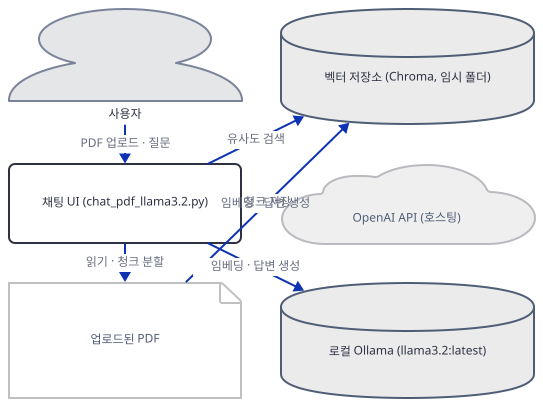
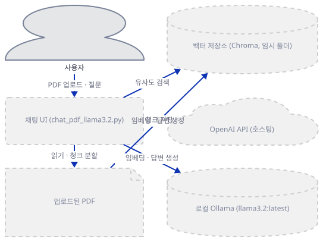
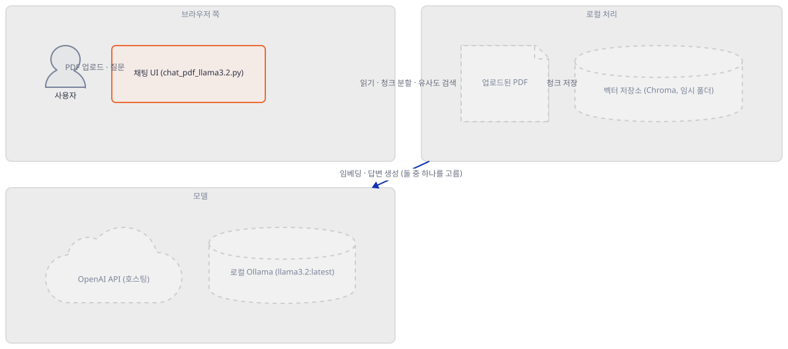
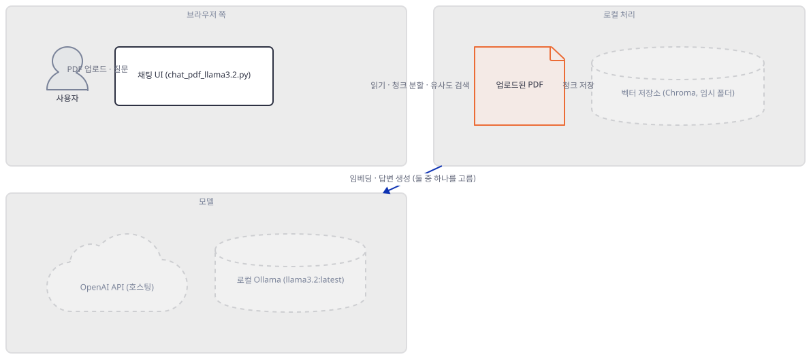
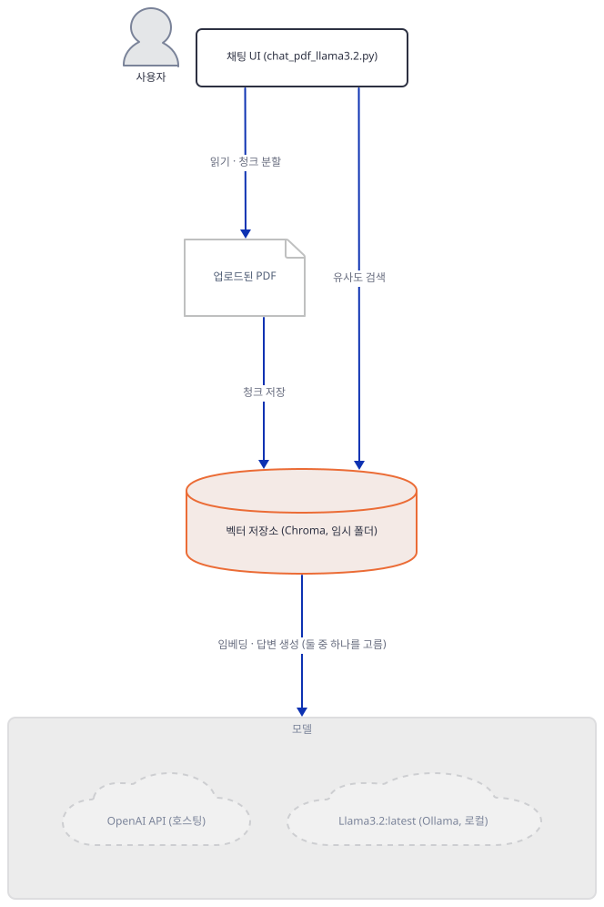
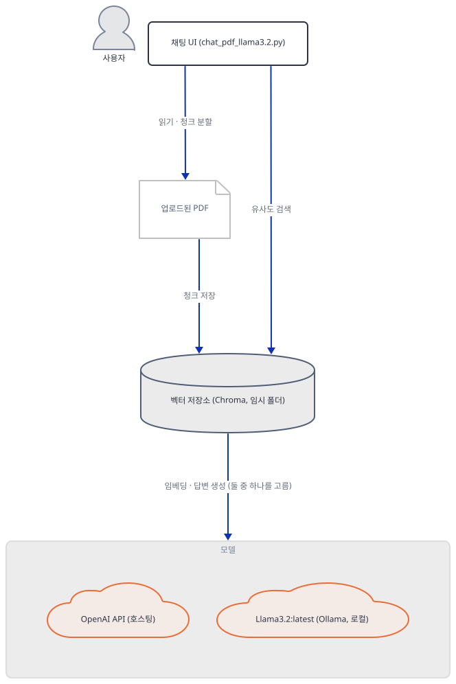
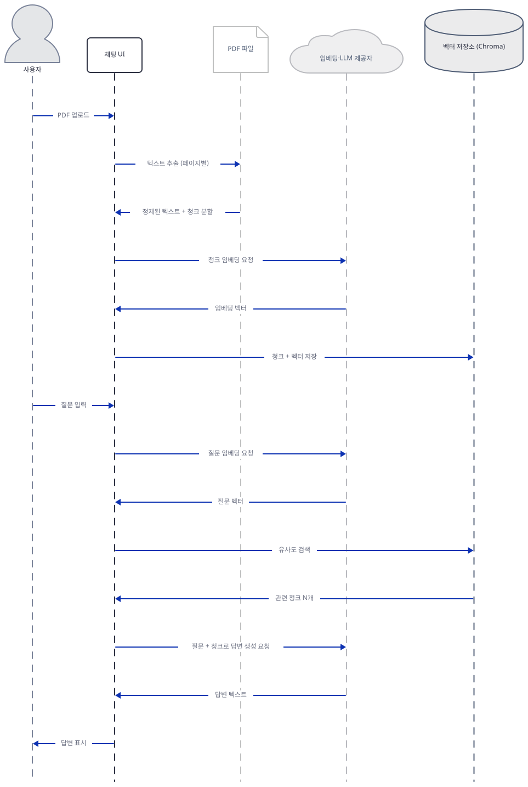

# Day 042 · 📄 Chat with PDF (GPT & Llama3)

> 볼륨 4 💬 Chat with X · 난이도 ★★☆ · 예상 소요 95분 · API 비용 대략 OpenAI 경로는 짧은 대화 기준 $0.1 이하(대략치 — 키가 없어 실제 과금은 확인 못함) · Ollama 경로는 무료(로컬, 모델 내려받기에 2~4.7GB 디스크 필요) · 원본 앱: `advanced_llm_apps/chat_with_X_tutorials/chat_with_pdf`

## 오늘 만들 것

이 폴더에는 완전히 같은 목적("PDF를 올리고 그 내용에 대해 대화하기")을 가진 파일 셋이 들어 있습니다 — `chat_pdf.py`(38줄, OpenAI 호스팅), `chat_pdf_llama3.py`(41줄, 로컬 Ollama), `chat_pdf_llama3.2.py`(69줄, 로컬 Ollama) — 그리고 세 파일 모두 겉모습과 무관하게 정확히 같은 라이브러리 하나, `embedchain`에 PDF를 읽고 쪼개고 임베딩하고 저장하고 검색하는 일을 통째로 맡깁니다. 오늘은 이 세 파일을 나란히 베끼는 대신 **무엇이 진짜로 갈리는지**를 봅니다: 두 로컬 변형은 41줄 대 69줄, 28줄 차이인데 그 차이는 RAG 로직이 아니라 전부 `st.session_state`와 채팅 UI입니다(직접 확인, Step 7). 세 파일이 지정하는 모델도 소스를 읽어야만 정확히 알 수 있습니다 — `chat_pdf.py`는 모델 이름을 아예 적지 않아 embedchain의 기본값(LLM `gpt-4o-mini`, 임베딩 `text-embedding-ada-002`)으로 풀리고(소스로 확인), 두 로컬 변형은 채팅과 임베딩에 **같은** 모델을 각각 `llama3:instruct`(8.03B, 4.7GB)와 `llama3.2:latest`(3.21B, 2.0GB)로 명시합니다(ollama.com 라이브러리 페이지로 확인). `requirements.txt` 세 줄 중 버전 고정은 하나도 없고, 이 문서를 쓰며 설치해 보니 그 대가가 뚜렷했습니다: Python 3.12/3.13에서는 `chromadb`가 요구하는 `chroma-hnswlib==0.7.6`에 해당 조합용 미리 빌드된 휠이 없어 설치 자체가 막히고(직접 확인), 두 로컬 변형은 `requirements.txt`에 없는 `ollama` 패키지가 있어야 임포트조차 되며(직접 확인), 그 `ollama` 패키지 최신판은 embedchain의 "이 모델이 이미 있나?" 점검을 항상 거짓으로 만들어 버립니다(직접 확인) — 있는 모델도 없다고 판단해 매번 다시 받으려 듭니다. 가장 놀라운 발견은 업로드 성공 메시지 쪽입니다: 임베딩 API 호출이 실패해도 embedchain은 그 예외를 삼키고 로그 한 줄만 남긴 채 정상 종료해서(소스로 확인 + 가짜 키로 직접 재현), 화면에는 지식베이스가 텅 빈 채로 "지식베이스에 추가되었습니다!"가 뜹니다 — 거짓말이 들통나는 건 그다음 질문에서 진짜 예외가 터질 때뿐입니다(직접 확인). 오늘은 로컬 경로인 `chat_pdf_llama3.2.py`를 기준으로 만듭니다 — API 키가 필요 없고, 세 파일 중 유일하게 `streamlit-chat`을 실제로 쓰며, 원본 앱 자체 README가 가리키는 튜토리얼도 이 버전을 다룹니다. 완성 아키텍처는 아래와 같습니다.



## 사전 준비

| 서비스/도구 | 용도 | 발급·설치 |
|---|---|---|
| Ollama | `chat_pdf_llama3.py`/`chat_pdf_llama3.2.py`가 붙는 로컬 LLM·임베딩 데몬(`http://localhost:11434`) | https://ollama.com 에서 설치, 백그라운드 데몬으로 상시 실행됨 |
| `llama3.2:latest` 모델 | 오늘 기준으로 삼는 버전이 쓰는 모델 — 3.21B 파라미터, 다운로드 2.0GB, RAM 권장 최소 8GB 미만이면 충분(ollama.com·ollama 공식 문서로 확인) | `ollama pull llama3.2:latest` (이 문서는 받지 않고 크기만 확인) |
| (선택) OpenAI API 키 | `chat_pdf.py`(호스팅 경로)를 시험해 볼 때만 필요. 화면 입력창에 직접 붙여넣는다(환경변수 아님) | https://platform.openai.com 가입 후 발급 |
| uv | 가상환경 생성과 패키지 설치 | [공통 사전 준비](../README.md#공통-사전-준비-한-번만) 절 참고. **Python 3.11 이하로 가상환경을 만들 것** — 이유는 Step 1 |

## 아키텍처 한눈에 보기

| 컴포넌트 | 역할 | 코드 위치 |
|---|---|---|
| 사용자 | PDF 업로드, 질문 입력 | 코드 없음 (브라우저) |
| 채팅 UI (`chat_pdf_llama3.2.py`) | 화면 구성, `session_state`로 앱 인스턴스와 대화 기록 유지 | `advanced_llm_apps/chat_with_X_tutorials/chat_with_pdf/chat_pdf_llama3.2.py:25-69` |
| PDF 로더 (`PyPDFLoader`) | 업로드된 PDF를 페이지 단위로 읽어 텍스트로 추출 | `embedchain/loaders/pdf_file.py` (embedchain 0.1.128, 소스로 확인) |
| 청커 (`RecursiveCharacterTextSplitter`) | 추출된 텍스트를 1000자 단위 청크로 분할(중첩 0) | `embedchain/chunkers/pdf_file.py` (embedchain 0.1.128, 소스로 확인) |
| 벡터 저장소 (Chroma) | 청크·임베딩 벡터를 디스크에 영구 저장 — 단, 매 실행마다 새 임시 폴더 | `embedchain/vectordb/chroma.py` (embedchain 0.1.128, 소스로 확인) |
| 임베딩·LLM 제공자 | 청크·질문 임베딩 계산과 최종 답변 생성 | 코드 없음 (OpenAI API 또는 로컬 Ollama 프로세스) |

## 단계별 진행

### Step 1. 환경 만들기 — 숨은 버전 문제 둘

**목적.** `requirements.txt` 세 줄을 설치하고, 오늘 실제로 무엇이 받아지는지 확인합니다. 버전 고정이 전혀 없는 대가로 이 앱은 오늘 두 가지 벽에 부딪힙니다 — 하나는 설치 자체를 막고, 하나는 로컬 변형의 임포트를 막습니다.

**할 일.**

```bash
cd advanced_llm_apps/chat_with_X_tutorials/chat_with_pdf
uv venv --python 3.12
uv pip install -r requirements.txt
```

`advanced_llm_apps/chat_with_X_tutorials/chat_with_pdf/requirements.txt:1-3`

```text
streamlit
embedchain
streamlit-chat
```

이 셋을 Python 3.12(또는 이 리포 시스템의 3.13.12)에 설치하면 `embedchain`(→ `chromadb==0.5.23` → `chroma-hnswlib==0.7.6`)까지는 의존성 해석이 끝나지만 빌드에서 막힙니다(직접 확인, 발췌):

```
error: Unable to find a compatible Visual Studio installation.
help: `chroma-hnswlib` (v0.7.6) was included because `embedchain` (v0.1.128)
      depends on `chromadb` (v0.5.23) which depends on `chroma-hnswlib`
```

원인은 agno의 익스트라 누락(Day 038)과는 다른 종류입니다 — PyPI가 실제로 올려 둔 `chroma-hnswlib` 0.7.6의 휠 목록(직접 확인, PyPI JSON API)에 `cp312-win_amd64`가 아예 없고 `cp313`은 어떤 OS용으로도 없습니다(`cp37`~`cp311`의 win_amd64는 모두 있음). 그래서 pip/uv가 소스 빌드로 넘어가고, 이 컴퓨터에는 그 C++ 확장을 컴파일할 Visual Studio 빌드 도구가 없어 실패합니다. 세 번째 줄인 `streamlit-chat`은 이 문제와 무관합니다 — PyPI 메타데이터로 확인하면 `streamlit>=0.63`만 요구하는 순수 파이썬 패키지라 네이티브 빌드가 전혀 없고, 막히는 지점은 오직 `embedchain → chromadb → chroma-hnswlib`입니다. 해결은 가상환경을 3.11 이하로 만드는 것입니다.

```bash
rm -rf .venv
uv venv --python 3.11
uv pip install -r requirements.txt
```

이번엔 152개 패키지가 설치됩니다(직접 확인) — `streamlit` 세 글자짜리 요구가 `langchain` 계열 전체(`langchain`, `langchain-community`, `langchain-openai`, `langchain-text-splitters` 등), `chromadb`, `mem0ai`, `qdrant-client`, `kubernetes`, `onnxruntime`, `pypdf`, `openai`, `tiktoken`을 한꺼번에 끌어옵니다. 여기까지는 `chat_pdf.py`(OpenAI 경로)를 임포트하는 데 충분합니다. 로컬 두 변형은 하나가 더 필요합니다 — `embedchain/llm/ollama.py`와 `embedchain/embedder/ollama.py`가 각각 `from ollama import Client`를 시도하는데, 이 패키지는 `requirements.txt`에 없고 다른 152개 중 누구도 끌어오지 않습니다(직접 확인). 설치 없이 로컬 변형을 임포트하면:

```bash
uv run --no-project python -c "
from embedchain import App
App.from_config(config={'llm': {'provider': 'ollama', 'config': {'model': 'llama3.2:latest'}}, 'vectordb': {'provider': 'chroma', 'config': {'dir': 'x'}}, 'embedder': {'provider': 'ollama', 'config': {'model': 'llama3.2:latest'}}})
"
```

```
ImportError: Ollama requires extra dependencies. Install with `pip install ollama`
```

(직접 확인. `ollama` PyPI 패키지 이름이 embedchain 패키지 이름과 같아 헷갈리기 쉽지만 서로 다른 배포물입니다.)

```bash
uv pip install ollama
```

이 한 줄로 153개가 됩니다(직접 확인, `ollama==0.6.2` 추가). 이 패키지가 로컬 변형에 실제로 어떤 함정을 남기는지는 Step 5에서 다룹니다.



**확인.**

```bash
uv run --no-project python -m py_compile chat_pdf.py chat_pdf_llama3.py chat_pdf_llama3.2.py && echo compiled
```

```
compiled
```

```bash
uv run --no-project python -c "import streamlit, embedchain, streamlit_chat, ollama; print('ok')"
```

```
ok
```

### Step 2. 세 변형 한눈에 보기 — 같은 골격, 다른 제공자

**목적.** 세 `embedchain_bot()`을 나란히 놓고 무엇이 다른지, 그리고 명시되지 않은 모델이 실제로 무엇으로 풀리는지 확인합니다.

**할 일.**

`advanced_llm_apps/chat_with_X_tutorials/chat_with_pdf/chat_pdf.py:6-13`

```python
def embedchain_bot(db_path, api_key):
    return App.from_config(
        config={
            "llm": {"provider": "openai", "config": {"api_key": api_key}},
            "vectordb": {"provider": "chroma", "config": {"dir": db_path}},
            "embedder": {"provider": "openai", "config": {"api_key": api_key}},
        }
    )
```

`advanced_llm_apps/chat_with_X_tutorials/chat_with_pdf/chat_pdf_llama3.2.py:10-17`

```python
def embedchain_bot(db_path):
    return App.from_config(
        config={
            "llm": {"provider": "ollama", "config": {"model": "llama3.2:latest", "max_tokens": 250, "temperature": 0.5, "stream": True, "base_url": 'http://localhost:11434'}},
            "vectordb": {"provider": "chroma", "config": {"dir": db_path}},
            "embedder": {"provider": "ollama", "config": {"model": "llama3.2:latest", "base_url": 'http://localhost:11434'}},
        }
    )
```

`chat_pdf_llama3.py:8-15`의 `embedchain_bot`은 이것과 글자 하나 다른데, `"llama3.2:latest"` 자리가 전부 `"llama3:instruct"`입니다. 셋 다 `vectordb`는 `{"provider": "chroma", "config": {"dir": db_path}}`로 동일합니다 — 저장소 선택은 이 앱에서 갈리지 않습니다. `chat_pdf.py`는 `llm`/`embedder` 어느 쪽에도 `"model"` 키가 없습니다. embedchain 소스를 직접 읽으면:

```bash
uv run --no-project python -c "
import inspect
from embedchain.llm.openai import OpenAILlm
print([l.strip() for l in inspect.getsource(OpenAILlm._get_answer).splitlines() if '\"model\"' in l][0])
from embedchain.embedder.openai import OpenAIEmbedder
print([l.strip() for l in inspect.getsource(OpenAIEmbedder.__init__).splitlines() if 'ada' in l][0])
"
```

```
"model": config.model or "gpt-4o-mini",
self.config.model = "text-embedding-ada-002"
```

즉 `chat_pdf.py`는 채팅에 `gpt-4o-mini`, 임베딩에 구세대 `text-embedding-ada-002`를 씁니다(둘 다 embedchain의 기본값이지 이 앱이 고른 것이 아닙니다). 두 로컬 변형은 반대로 **채팅과 임베딩에 같은 모델**을 씁니다 — `llama3.2:latest`가 답변도 만들고 청크의 임베딩 벡터도 직접 계산합니다. 이 리포지토리의 로컬 모델은 `ext`(클라우드)가 아니라 `store`로 그립니다 — Day 037이 확립한 규칙대로, 디스크에 받아 둔 가중치를 이 기계 자신이 서빙하는 로컬 리소스이기 때문입니다.



**확인.**

```bash
grep -n "streamlit_chat\|session_state" chat_pdf.py chat_pdf_llama3.py chat_pdf_llama3.2.py
```

```
chat_pdf_llama3.2.py:7:from streamlit_chat import message
chat_pdf_llama3.2.py:32:if 'app' not in st.session_state:
(이하 chat_pdf_llama3.2.py만 매치, 나머지 두 파일은 0건)
```

(직접 확인 — `streamlit-chat`은 `requirements.txt`에 있지만 실제로 쓰는 파일은 셋 중 하나뿐입니다.)

### Step 3. PDF 읽기 — 로더

**목적.** 업로드된 PDF가 실제로 어떤 라이브러리를 거쳐 텍스트가 되는지 확인합니다.

**할 일.** `embedchain`은 `data_type="pdf_file"`을 받으면 `PdfFileLoader`(embedchain 0.1.128 소스로 확인)를 쓰는데, 이 클래스는 자체 PDF 파싱 코드가 없습니다 — `langchain_community.document_loaders.PyPDFLoader(url).load_and_split()`을 그대로 호출할 뿐이고, `PyPDFLoader` 자신은 `pypdf`(오늘 설치된 버전 5.9.0) 위의 얇은 래퍼입니다. 반환되는 페이지마다 `clean_string()`으로 공백을 정리하고, 전체 페이지 텍스트를 이어붙인 sha256 해시를 `doc_id`로 붙입니다. 이 경로는 어느 제공자를 쓰든 완전히 같습니다 — 임베딩·LLM 선택과 무관한, 세 파일 공통의 첫 단계입니다.



**확인.** 키도 Ollama도 필요 없는, 손으로 만든 최소 PDF로 직접 확인합니다.

```bash
uv run --no-project python -c "
text = 'The launch code for Project Marigold is 4471-Delta.'
objs = [b'<</Type/Catalog/Pages 2 0 R>>', b'<</Type/Pages/Kids[3 0 R]/Count 1>>',
        b'<</Type/Page/Parent 2 0 R/Resources<</Font<</F1 4 0 R>>>>/MediaBox[0 0 300 144]/Contents 5 0 R>>',
        b'<</Type/Font/Subtype/Type1/BaseFont/Helvetica>>']
stream = ('BT /F1 14 Tf 20 100 Td (' + text + ') Tj ET').encode('latin-1')
objs.append(b'<</Length ' + str(len(stream)).encode() + b'>>\nstream\n' + stream + b'\nendstream')
out = bytearray(b'%PDF-1.4\n'); offs=[]
for i, b in enumerate(objs, 1):
    offs.append(len(out)); out += f'{i} 0 obj'.encode() + b + b'endobj\n'
xref = len(out); n = len(objs) + 1
out += f'xref\n0 {n}\n'.encode() + b'0000000000 65535 f \n'
for o in offs: out += f'{o:010d} 00000 n \n'.encode()
out += b'trailer<</Size ' + str(n).encode() + b'/Root 1 0 R>>\nstartxref\n' + str(xref).encode() + b'\n%%EOF'
open('day042-test.pdf', 'wb').write(out)
from langchain_community.document_loaders import PyPDFLoader
pages = PyPDFLoader('day042-test.pdf').load_and_split()
print('페이지 수:', len(pages))
print('추출된 텍스트:', repr(pages[0].page_content))
"
```

```
페이지 수: 1
추출된 텍스트: 'The launch code for Project Marigold is 4471-Delta.'
```

(직접 확인. 이 PDF는 진짜 유효한 PDF 파일이지만 압축·이미지가 없는 최소 형태이며, 이 세션 안에서 만들고 로컬에서만 읽었습니다 — 어디에도 올리지 않았습니다.)

### Step 4. 청크로 나누기 — 청커

**목적.** 추출된 텍스트가 어떤 크기로, 어떤 메타데이터와 함께 쪼개지는지 확인합니다.

**할 일.** `PdfFileChunker`(embedchain 0.1.128 소스로 확인)는 앱이 별도 설정을 주지 않으면 `RecursiveCharacterTextSplitter(chunk_size=1000, chunk_overlap=0)`를 씁니다 — 세 파일 모두 청커 설정을 넘기지 않으므로 이 기본값 그대로입니다. 각 청크에는 페이지 번호(`page`, `page_label`), 원본 경로(`source`), 문서 전체의 `doc_id`, 소스 경로의 md5 해시(`hash`)가 메타데이터로 붙습니다. `embedchain.App.add(..., dry_run=True)`는 이 청킹 단계까지만 실행하고 네트워크를 전혀 타지 않으므로, 키 없이도 실제 앱과 같은 경로로 청크 개수를 확인할 수 있습니다.



**확인.** Step 3의 `day042-test.pdf`를 그대로 씁니다.

```bash
uv run --no-project python -c "
from embedchain import App
app = App.from_config(config={
    'llm': {'provider': 'openai', 'config': {'api_key': 'sk-dry-run-only'}},
    'vectordb': {'provider': 'chroma', 'config': {'dir': 'dryrun-db'}},
    'embedder': {'provider': 'openai', 'config': {'api_key': 'sk-dry-run-only'}},
})
info = app.add('day042-test.pdf', data_type='pdf_file', dry_run=True)
print('청크 수:', info['count'])
print('메타데이터:', info['metadata'][0])
" 2>/dev/null
```

```
청크 수: 1
메타데이터: {'producer': 'PyPDF', 'creator': 'PyPDF', 'creationdate': '', 'source': 'day042-test.pdf', 'total_pages': 1, 'page': 0, 'page_label': '1', 'url': 'day042-test.pdf', 'data_type': 'pdf_file', 'doc_id': 'default-app-id--...', 'app_id': 'default-app-id', 'hash': '...'}
```

(직접 확인. `dry_run=True`는 App 생성에 가짜 OpenAI 키를 요구하지만 — 생성자는 키를 검증하지 않습니다(다른 날들과 동일 패턴) — 이 청킹 단계 자체는 네트워크를 전혀 쓰지 않습니다. 텍스트 한 문장짜리 PDF라 청크가 1개뿐입니다.)

### Step 5. 임베딩과 벡터 저장 — Chroma

**목적.** 청크가 실제로 어떻게 벡터가 되어 저장되는지, 그리고 이 경로에서 이 문서를 쓰며 찾은 가장 중요한 두 가지 문제 — 실패해도 성공한 척하는 업로드, 그리고 항상 거짓을 내놓는 로컬 모델 존재 확인 — 을 직접 확인합니다.

**할 일.** `ChromaDB.__init__`(embedchain 0.1.128 소스로 확인)은 `Settings(persist_directory=dir, is_persistent=True)`로 `chromadb.Client`를 만듭니다 — 진짜 디스크 영속 저장소입니다. `collection.add(documents, metadatas, ids)`를 호출하는 순간 Chroma가 그 컬렉션에 등록된 임베딩 함수(OpenAI면 `text-embedding-ada-002` API 호출, Ollama면 `OllamaEmbeddings`를 통한 로컬 호출)를 실제로 실행해 벡터를 계산합니다. 그런데 이 호출을 감싸는 코드에 문제가 있습니다(embedchain 0.1.128 소스로 확인, `embedchain/embedchain.py`의 `_load_and_embed`):

```python
for batch_docs, batch_meta, batch_ids in zip(document_batches, metadata_batches, id_batches):
    try:
        if batch_docs:
            self.db.add(documents=batch_docs, metadatas=batch_meta, ids=batch_ids, **kwargs)
    except Exception as e:
        logger.info(f"Failed to add batch due to a bad request: {e}")
        pass
```

`except Exception`으로 **모든** 실패를 삼키고 `logger.info`(기본 설정에서는 화면에 안 보임) 한 줄만 남긴 뒤 그냥 지나갑니다. 가짜 OpenAI 키로 직접 재현하면:

```bash
uv run --no-project python -c "
import tempfile
from embedchain import App
db_path = tempfile.mkdtemp()
app = App.from_config(config={
    'llm': {'provider': 'openai', 'config': {'api_key': 'sk-fake-test-key-not-real'}},
    'vectordb': {'provider': 'chroma', 'config': {'dir': db_path}},
    'embedder': {'provider': 'openai', 'config': {'api_key': 'sk-fake-test-key-not-real'}},
})
result = app.add('day042-test.pdf', data_type='pdf_file')
print('add() 반환값:', result)
print('실제 저장된 청크 수:', app.db.collection.count())
" 2>/dev/null
```

```
add() 반환값: 56caa94f8c1235dbf7419ad557299166
실제 저장된 청크 수: 0
```

(직접 확인. 디버그 로그를 보면 `POST https://api.openai.com/v1/embeddings`가 실제로 나가고 진짜 `401 Unauthorized`가 돌아오지만, 그 처리 과정에서 `APIStatusError.__init__() missing 2 required keyword-only arguments: 'response' and 'body'`라는 별개의 `TypeError`가 발생하고 — 정확히 어느 라이브러리의 어느 줄이 이 재구성을 하는지까지는 추적하지 못했지만 두 번 실행 모두 글자 그대로 재현됩니다 — 위 `except Exception`이 이것도 그냥 삼킵니다.) `chat_pdf.py`의 `st.success(f"Added {pdf_file.name} to knowledge base!")`는 `add()`의 반환값을 확인하지 않으므로, 청크가 0개 저장돼도 이 성공 메시지가 그대로 뜹니다.

로컬 두 변형에는 또 다른 문제가 있습니다. `OllamaEmbedder`/`OllamaLlm` 생성자(embedchain 0.1.128 소스로 확인)는 만들어질 때마다 `client.list()["models"]`에서 `model.get("name") == self.config.model`인 항목이 있는지 찾고, 없으면 `client.pull(...)`을 호출합니다. 오늘 설치된 `ollama` 패키지(0.6.2)는 이 `list()`가 더 이상 딕셔너리가 아니라 `.model` 속성을 가진 객체를 돌려줍니다 — `.get("name")`은 있는 필드가 아니라서 항상 `None`입니다:

```bash
uv run --no-project python -c "
from ollama import Client
c = Client(host='http://localhost:11434')
local_models = c.list()['models']
target = 'llama3.2:latest'
print('embedchain 방식 (.get(\"name\")):', any(m.get('name') == target for m in local_models))
print('실제 설치 여부 (.model 속성):', any(m.model == target for m in local_models))
"
```

```
embedchain 방식 (.get("name")): False
실제 설치 여부 (.model 속성): True
```

(직접 확인, 이 컴퓨터에 `llama3.2:latest`가 실제로 설치돼 있는데도 embedchain은 없다고 판단합니다. `ollama==0.3.3`으로 내려서 같은 코드를 실행하면 `.get("name")`이 실제 이름을 돌려줍니다 — 이 컴퓨터에서 직접 확인 — 즉 embedchain 코드가 아니라 `ollama` 클라이언트가 버전 사이에 응답 형태를 바꾼 것이 원인입니다.) 이 판정이 항상 거짓이 되므로 `App.from_config()`을 실제로 호출하면 이미 있는 모델도 매번 다시 받으려 시도합니다 — 이 문서는 실제 `client.pull()` 호출은 실행하지 않았습니다.



**확인.** 위 두 블록이 확인입니다 — `실제 저장된 청크 수: 0`과 `False`/`True` 쌍이 기대 출력입니다. (요청 ID·타임스탬프 등은 실행마다 달라지지만 이 두 결과는 결정적입니다.)

### Step 6. 질문에 답하기 — 검색과 생성

**목적.** 저장 단계와 달리 질문·답변 단계는 실패를 어떻게 다루는지 — 그리고 왜 다르게 다루는지 — 확인합니다.

**할 일.** `App.query()`(embedchain 0.1.128 소스로 확인, `chat()`은 대화 기록을 더해 이를 감싼 얇은 래퍼)는 먼저 `_retrieve_from_database()`로 Chroma에서 질문과 유사한 청크 n개를 가져온 뒤, 그 청크들을 컨텍스트로 붙여 LLM을 호출합니다. Step 5의 저장 경로와 달리 이 호출 전체를 감싸는 `try/except`가 코드 어디에도 없습니다(소스로 확인) — 실패하면 예외가 그대로 위로 올라갑니다. 같은 가짜 키로 이어서 실행하면:

```bash
uv run --no-project python -c "
import tempfile
from embedchain import App
db_path = tempfile.mkdtemp()
app = App.from_config(config={
    'llm': {'provider': 'openai', 'config': {'api_key': 'sk-fake-test-key-not-real'}},
    'vectordb': {'provider': 'chroma', 'config': {'dir': db_path}},
    'embedder': {'provider': 'openai', 'config': {'api_key': 'sk-fake-test-key-not-real'}},
})
app.add('day042-test.pdf', data_type='pdf_file')
try:
    app.chat('What is the launch code for Project Marigold?')
except Exception as e:
    print('chat() 실패:', type(e).__name__, '-', str(e)[:80])
" 2>/dev/null
```

```
chat() 실패: TypeError - APIStatusError.__init__() missing 2 required keyword-only arguments: 'response' and 'body'
```

(직접 확인 — Step 5와 정확히 같은 예외입니다. 업로드 단계는 이것을 조용히 삼켰지만 질문 단계는 그대로 터뜨립니다: 거짓 성공이 들통나는 것은 다음 요청에서일 뿐입니다.) 검색된 청크가 실제로 몇 개인지, 어떤 순서로 프롬프트에 들어가는지는 `citations=True`를 주면 확인할 수 있지만, 이는 벡터가 정상적으로 저장된 뒤에만 의미가 있어 이 문서에서는 재현하지 않았습니다.


**확인.** 위 블록의 `chat() 실패: TypeError - ...` 줄이 기대 출력입니다.

### Step 7. UI가 실제로 다른 점 — 세션 상태와 재실행

**목적.** 28줄 차이의 정체 — `session_state`가 있고 없고 — 가 실제로 무엇을 바꾸는지, 그리고 "벡터 저장소가 재시작에도 살아남는가"라는 오늘의 질문에 답합니다.

**할 일.** 세 파일 모두 `db_path = tempfile.mkdtemp()`로 매번 새 임시 폴더를 만듭니다(`chat_pdf.py:20`, `chat_pdf_llama3.py:21`, `chat_pdf_llama3.2.py:29`) — 고정 경로를 쓰거나 이전 경로를 다시 읽어 들이는 코드는 어디에도 없습니다. Streamlit은 위젯 상호작용마다 스크립트 전체를 처음부터 다시 실행하는데, `chat_pdf.py`/`chat_pdf_llama3.py`는 이 `db_path`와 `app = embedchain_bot(db_path)`를 `session_state`로 감싸지 않은 채 최상위(또는 키 입력 가드 안)에 그대로 둡니다(`chat_pdf_llama3.py:20-23`). `st.file_uploader`가 돌려주는 값은 재실행 사이에도 유지되므로, `if pdf_file:`(`chat_pdf_llama3.py:29`)은 질문을 할 때마다 다시 참이 되어 매번 새 빈 저장소에 PDF를 처음부터 다시 읽고 쪼개고 다시 임베딩합니다. `streamlit`/`embedchain.App`을 가짜로 바꿔치기해 재실행 두 번을 그대로 재현하면:

```bash
uv run --no-project python -c "
import types, runpy
import streamlit as st
calls = {'add': 0}
class FakeFile:
    name = 'fake.pdf'
    def getvalue(self): return b'%PDF-fake'
st.title = st.text_input = lambda *a, **k: 'fake'
st.file_uploader = lambda *a, **k: FakeFile()
st.success = st.write = lambda *a, **k: None
import embedchain
class FakeApp:
    def add(self, *a, **k): calls['add'] += 1
    def chat(self, *a, **k): return 'x'
embedchain.App = types.SimpleNamespace(from_config=lambda config: FakeApp())
paths = [runpy.run_path('chat_pdf_llama3.py')['db_path'] for _ in range(2)]
print('서로 다른 디렉터리:', paths[0] != paths[1])
print('add() 호출 횟수 (재실행 2회):', calls['add'])
" 2>/dev/null
```

```
서로 다른 디렉터리: True
add() 호출 횟수 (재실행 2회): 2
```

(직접 확인. `chat_pdf.py`는 `chat_pdf_llama3.py`와 정확히 같은 구조 — 키 입력 가드 안에 `mkdtemp()`와 세션 상태 없는 앱 생성 — 라서 소스로만 확인하고 이 재현은 한 파일로 대표했습니다.) `chat_pdf_llama3.2.py:32-33`은 `if 'app' not in st.session_state: st.session_state.app = embedchain_bot(db_path)`로 이를 막습니다. 같은 방식으로 `session_state`를 재실행 사이에 실제로 유지되는 객체로 흉내 내면:

```bash
uv run --no-project python -c "
import types, runpy, contextlib
import streamlit as st
calls = {'bot': 0}
class FakeFile:
    name = 'fake.pdf'
    def getvalue(self): return b'%PDF-fake'
    def read(self): return b'%PDF-fake'
class State(dict):
    __getattr__ = dict.get
    __setattr__ = dict.__setitem__
st.session_state = State()
st.title = st.caption = st.header = st.subheader = st.markdown = lambda *a, **k: None
st.file_uploader = lambda *a, **k: FakeFile()
st.button = lambda *a, **k: False
st.chat_input = lambda *a, **k: None
st.sidebar = contextlib.nullcontext()
import embedchain
class FakeApp:
    def __init__(self): calls['bot'] += 1
embedchain.App = types.SimpleNamespace(from_config=lambda config: FakeApp())
paths = [runpy.run_path('chat_pdf_llama3.2.py')['db_path'] for _ in range(2)]
print('서로 다른 디렉터리:', paths[0] != paths[1])
print('embedchain_bot() 호출 횟수 (재실행 2회):', calls['bot'])
" 2>/dev/null
```

```
서로 다른 디렉터리: True
embedchain_bot() 호출 횟수 (재실행 2회): 1
```

(직접 확인. `db_path`는 여전히 재실행마다 새로 계산되지만 — 매번 버려지는 빈 폴더 하나가 남는 셈입니다 — `App`은 세션당 딱 한 번만 만들어집니다. `chat_pdf_llama3.2.py`는 업로드 직후 자동으로 추가하지 않고 `if st.button("Add to Knowledge Base"):`(`chat_pdf_llama3.2.py:46`)로 사용자가 직접 눌러야만 재임베딩이 일어난다는 점도 다릅니다.) 세 파일 모두에게 답은 같습니다 — Chroma의 영속 저장 자체는 진짜입니다(같은 디렉터리를 다시 가리키면 데이터가 그대로 있습니다, Step 5의 `persist_directory` 설정으로 확인), 하지만 어느 파일도 이전 실행의 경로를 기억해 두지 않으므로 **프로세스를 재시작하면 세 변형 모두 빈 지식베이스에서 다시 시작**합니다. 프로세스가 살아있는 동안의 재실행에서는 `chat_pdf_llama3.2.py`만 `session_state` 덕분에 지식베이스를 유지합니다.


**확인.** 위 두 블록의 `호출 횟수` 줄이 기대 출력입니다 — 첫 블록은 2, 둘째 블록은 1이어야 `session_state`의 효과가 확인된 것입니다.

## 요청 한 건이 흐르는 과정



PDF를 올리면 UI는 `PyPDFLoader`로 페이지별 텍스트를 뽑고 청크로 나눈 뒤, 각 청크를 제공자(OpenAI 또는 Ollama)에 보내 임베딩 벡터를 받아 Chroma에 청크와 함께 저장합니다. 질문을 입력하면 UI는 같은 제공자에게 **질문 자체**의 임베딩을 다시 요청하고, 그 벡터로 Chroma에서 유사도 검색을 해 관련 청크 몇 개를 돌려받습니다. 마지막으로 그 청크들을 질문과 함께 제공자에게 다시 보내 최종 답변을 생성시키고, UI가 이를 화면에 표시합니다. 임베딩(2회, 저장 시점과 질문 시점)과 답변 생성(1회)은 겉보기엔 한 번의 "채팅"처럼 보이지만 실제로는 제공자를 최소 세 번 호출한다는 점이 이 순서도의 핵심입니다 — Step 5·6에서 직접 확인했듯 저장 쪽 실패는 조용히 삼켜지고 생성 쪽 실패만 화면에 드러나므로, 겉으로 보이는 오류의 위치가 실제 실패 지점과 다를 수 있습니다.

## 실행 체크리스트

- [ ] `uv venv --python 3.11`로(3.12/3.13이 아니라) 가상환경을 만들고 `uv pip install -r requirements.txt`로 152개 패키지를 설치했다
- [ ] 로컬 변형을 쓸 것이라면 `uv pip install ollama`를 추가로 설치했다
- [ ] `chat_pdf.py`/`chat_pdf_llama3.py`/`chat_pdf_llama3.2.py`의 `embedchain_bot()`이 각각 무엇을 다르게 설정하는지 코드로 비교했다
- [ ] 손으로 만든 PDF로 로더·청커가 실제로 청크 1개를 만들어낸다는 것을 `dry_run=True`로 확인했다
- [ ] 가짜 키로 `add()`를 실행해 청크가 0개 저장되고도 성공값이 반환된다는 것을 확인했다
- [ ] 같은 가짜 키로 `chat()`을 실행해 `add()`와 같은 예외가 이번에는 그대로 터진다는 것을 확인했다
- [ ] `session_state`가 없는 파일은 재실행마다 앱을 새로 만들고, 있는 파일은 세션당 한 번만 만든다는 것을 재현했다
- [ ] Ollama가 설치돼 있다면 `ollama list`로 `llama3.2:latest`가 실제로 있는지, embedchain의 점검이 그것을 놓치는지 확인했다

## 문제 해결

| 증상 | 원인 | 해결 |
|---|---|---|
| `uv pip install -r requirements.txt`가 ``error: Unable to find a compatible Visual Studio installation`` 로 실패 | `chromadb==0.5.23`이 `chroma-hnswlib==0.7.6`을 정확히 고정하는데, 이 버전은 `cp312-win_amd64` 휠이 없고 `cp313` 휠은 아예 없다(PyPI로 직접 확인) — 소스 빌드로 넘어가 C++ 컴파일러를 찾다 실패한다 | `uv venv --python 3.11`(또는 그 이하)로 가상환경을 다시 만들 것 |
| `chat_pdf_llama3.py`/`chat_pdf_llama3.2.py` 임포트 시 ``ImportError: Ollama requires extra dependencies. Install with `pip install ollama` `` | `embedchain`의 Ollama LLM·임베더가 내부적으로 `ollama` PyPI 패키지를 필요로 하는데 `requirements.txt`에는 없다(직접 확인) | `uv pip install ollama` 실행 |
| Ollama에 모델이 이미 있는데도(`ollama list`로 확인됨) 앱이 계속 다시 받으려 함 | `ollama` 0.6.2의 `Client.list()`가 돌려주는 객체는 `.model` 속성을 쓰는데 embedchain 0.1.128은 `.get("name")`으로 확인해 항상 `None`을 받는다(직접 확인) — 존재 판정이 구조적으로 항상 거짓 | `ollama==0.3.3`처럼 옛 버전으로 내리면 이 점검이 다시 정확해진다(직접 확인). 최신 `ollama`를 쓰려면 매번 재확인 시도가 있다는 것만 알아두고 넘어가도 무방 |
| 잘못된(또는 없는) API 키로 PDF를 올려도 "지식베이스에 추가되었습니다!"가 그대로 뜸 | `embedchain.embedchain._load_and_embed`가 배치 추가 실패를 `except Exception: ... pass`로 삼키고 저장된 청크 수를 호출부에 돌려주지 않는다(소스로 확인 + 직접 재현) | 성공 메시지를 믿지 말고 곧바로 질문을 던져 답이 실제로 PDF 내용을 반영하는지 확인할 것 |

## 더 해보기

- `embedchain/embedchain.py`의 `_load_and_embed`가 돌려주는 `count_new_chunks`를 `chat_pdf.py`가 받아 `st.success` 대신 실패 시 `st.error`를 띄우도록 고쳐, Step 5의 거짓 성공을 직접 막아보기.
- Step 5·6에서 만든 임시 디렉터리 경로를 적어 두었다가, 새 `App.from_config()`을 **같은** `dir` 값으로 만들어 `db_path = tempfile.mkdtemp()` 대신 고정 경로를 쓰면 재시작 후에도 지식베이스가 살아남는지 직접 실험해보기.
- `chat_pdf_llama3.2.py`의 임베더 설정(`chat_pdf_llama3.2.py:15`)을 `llama3.2:latest` 대신 이 컴퓨터에 이미 있는 전용 임베딩 모델(`embeddinggemma:latest`)로 바꿔, 채팅 모델과 임베딩 모델을 분리하면 무엇이 달라지는지 비교해보기.

## 다음 날 예고

[Day 043 · 📽️ Chat with YouTube Videos](../day043-chat-with-youtube-videos/README.md) — 같은 embedchain 패턴이 이번엔 PDF 대신 유튜브 자막(`youtube_transcript_api`)을 읽어 들입니다. `chat_pdf.py`와 달리 LLM 모델을 `"gpt-4"`로 명시한다는 차이도 있습니다.
