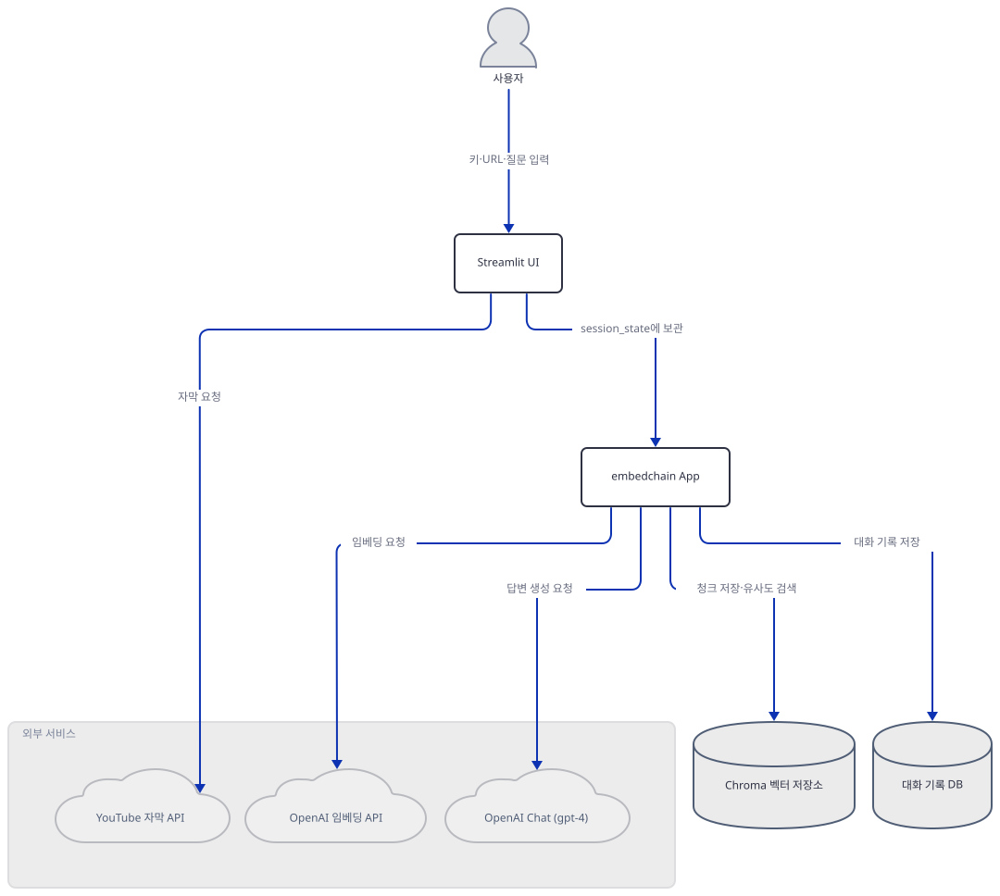
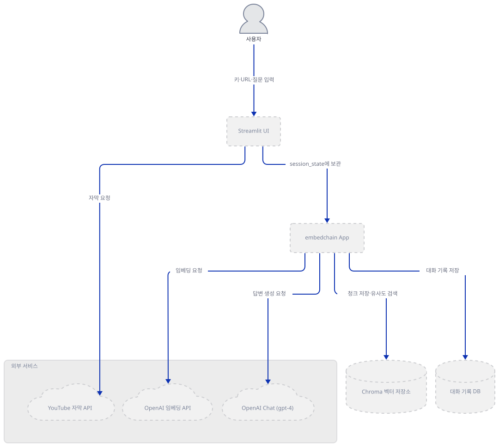
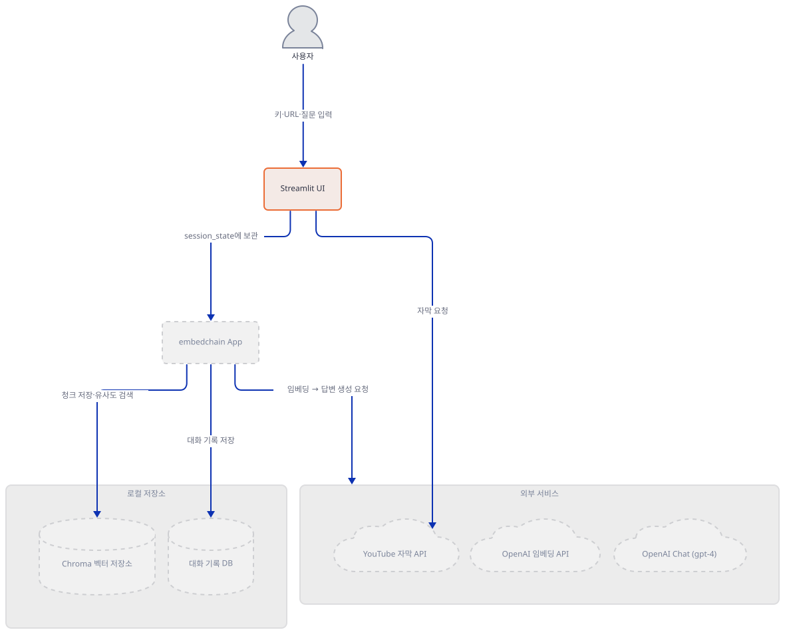
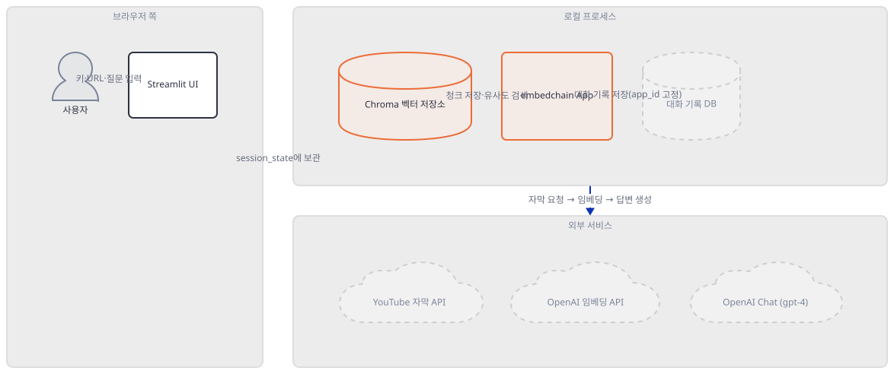
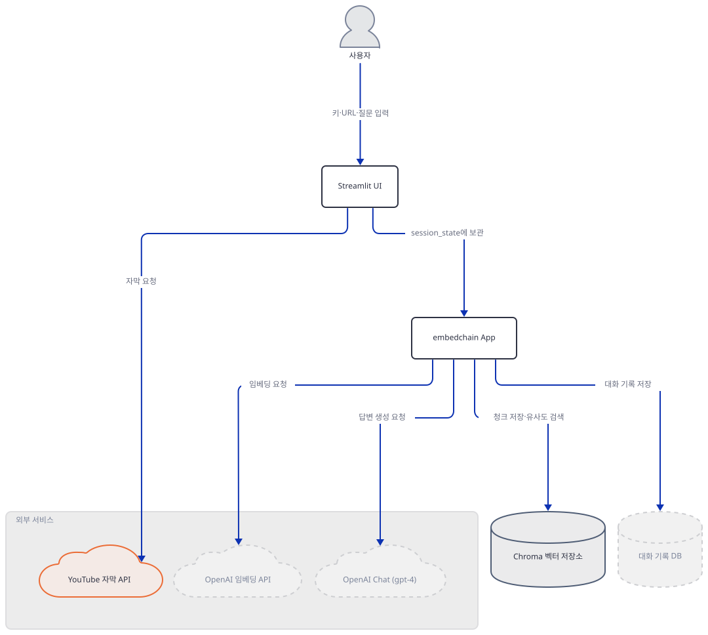
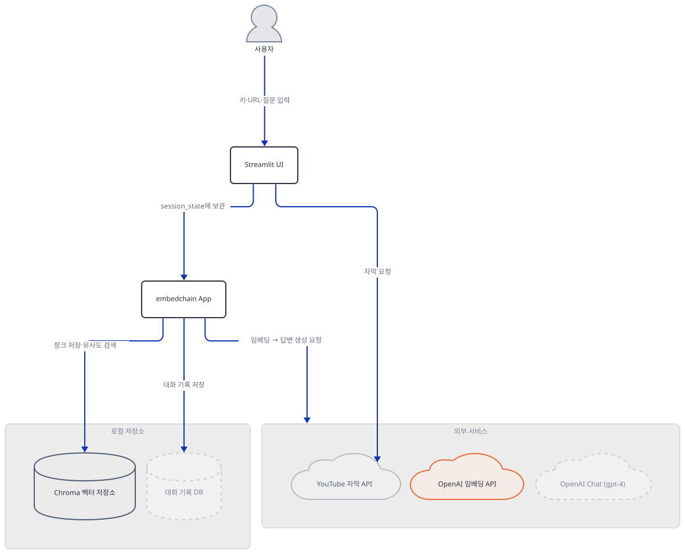
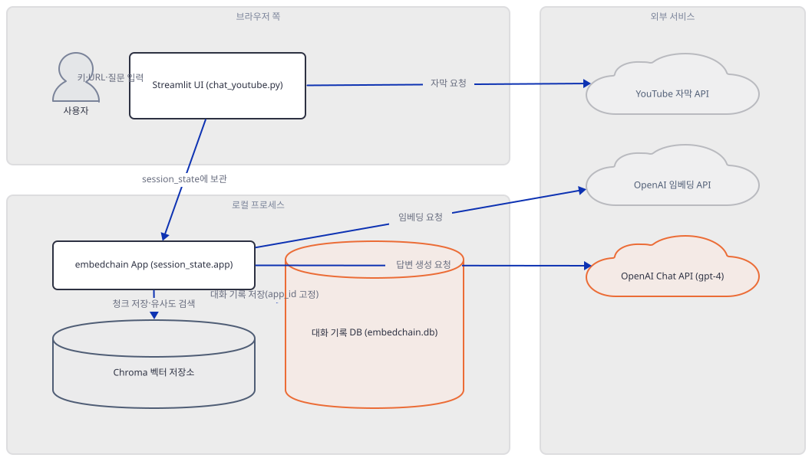
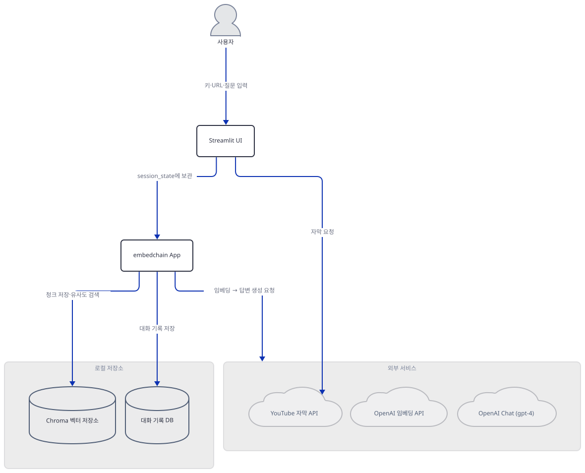
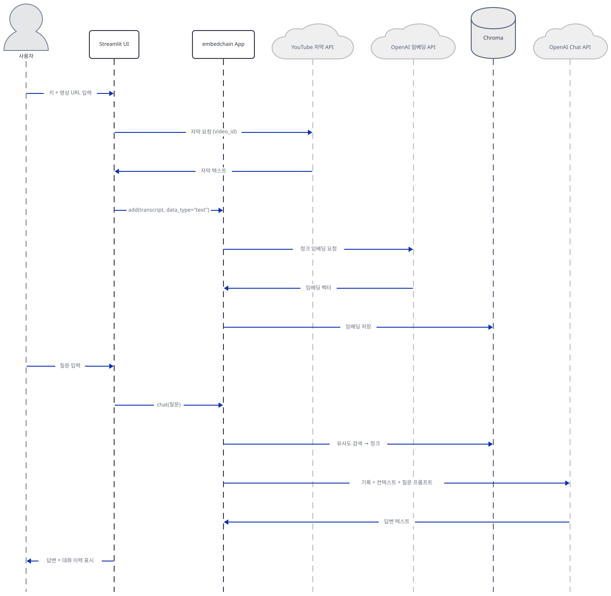

# Day 043 · 📽️ Chat with YouTube Videos

> 볼륨 4 💬 Chat with X · 난이도 ★★☆ · 예상 소요 90분(다른 날보다 깁니다 — 같은 파일 안에서 되풀이가 아니라 서로 다른 결함 네 가지를 직접 확인하기 때문입니다) · API 비용 대략 질문 1건당 `gpt-4` 호출 1회(약 $30/$60, 100만 토큰당 입력/출력 — `gpt-4-turbo`·`gpt-4o`보다 훨씬 비싼 구형 모델) + 영상당 자막 임베딩 1회(`text-embedding-ada-002`, $0.10/1M 토큰 미만이지만 영상을 바꿀 때마다 반복) · 대략치, 키가 없어 실제 과금은 확인 못함 · 원본 앱: `advanced_llm_apps/chat_with_X_tutorials/chat_with_youtube_videos`

## 오늘 만들 것

이번 튜토리얼은 이 볼륨에서 이질적인 하루입니다. 나머지 "Chat with X" 진입 파일은 23~139줄인데 이 앱의 `chat_youtube.py`는 243줄이고, 폴더에는 다른 어떤 날에도 없는 파일이 두 개 더 있습니다 — `FIX_SUMMARY.md`(109줄)와 `test_session_state.py`(111줄, 둘 다 개행 보정 줄 수로 직접 확인)입니다. 이 두 파일은 누군가 이 앱에서 실제로 문제를 발견하고 고친 다음 그 결과를 적어 남겼다는 흔적이고, 그 문제는 바로 앞날 Day039가 Substack 앱에서 찾아낸 것과 정확히 같은 종류입니다 — `tempfile.mkdtemp()`로 만든 벡터 저장소 경로가 세션 상태에 붙잡히지 않아 Streamlit이 재실행될 때마다(질문을 한 번 더 던질 때마다) 통째로 다시 만들어지는 문제입니다. 이 앱은 그 경로를 `st.session_state.app`에 저장하고 `if st.session_state.app is None:`으로 가둬, 같은 영상에 대해서는 질문을 몇 번 던지든 재수집이 일어나지 않습니다 — Day039와 반대로 이번엔 실제로 고쳐져 있었습니다(직접 확인, Step 5). 그런데 `FIX_SUMMARY.md`가 스스로 적어 둔 다른 주장 하나는 소스와 어긋납니다: 이 문서는 "`requirements.txt`를 `youtube-transcript-api>=1.2.0`을 쓰도록 갱신했다"고 적지만(직접 확인, Step 4), 실제 `requirements.txt`는 지금도 `youtube-transcript-api==0.6.3`을 정확히 못박고 있고(직접 확인), 그 버전의 `YouTubeTranscriptApi`에는 `chat_youtube.py`가 실제로 호출하는 `.list()`·`.fetch()` 메서드가 아예 없습니다(직접 확인) — `requirements.txt` 그대로 설치하면 유효한 키가 있어도 영상 자막을 가져오는 첫 걸음에서 곧바로 예외가 납니다. 앱 자체 `README.md`가 "OpenAI's gpt-4o"를 쓴다고 소개하는 것도 실제 코드와 다릅니다 — `embedchain_bot`은 정확히 `"model": "gpt-4"`를 지정합니다(직접 확인, Step 3) — 8K 컨텍스트의 구형 모델로 `gpt-4-turbo`나 `gpt-4o`보다 토큰당 훨씬 비쌉니다. 그리고 이 앱은 Day039의 `app.query()` 대신 `app.chat()`을 쓰는데, 이 메서드는 대화 기록을 embedchain 내부 SQLite에 자동으로 남깁니다 — 그 기록의 키가 되는 `app_id`가 이 앱이 만드는 모든 App 인스턴스에서 똑같이 `'default-app-id'`로 고정되어 있어(소스로 확인 + 직접 확인, Step 6), 영상을 바꿔도 이전 영상과 나눈 대화가 새 영상의 답변 문맥에 섞여 들어갑니다 — 재수집 문제는 고쳐졌지만 그 옆의 다른 누수는 아무도 건드리지 않은 채 남아 있는 셈입니다. 완성하면 유튜브 영상 URL 하나를 넣고 자막을 근거로 자유롭게 묻고 답하는 화면을 로컬에서 띄우게 됩니다. 아래는 완성된 아키텍처입니다.



## 사전 준비

| 서비스/도구 | 용도 | 발급·설치 |
|---|---|---|
| OpenAI API 키 | `gpt-4`(답변)와 `text-embedding-ada-002`(임베딩) 호출 인증. 화면 입력창에 직접 붙여넣는다(환경변수 아님 — 코드 전체에 `os.environ` 참조가 없음, 직접 확인) | https://platform.openai.com/api-keys 가입 후 발급 |
| uv | 가상환경 생성과 패키지 설치 | [공통 사전 준비](../README.md#공통-사전-준비-한-번만) 절 참고 |
| Python 3.11 이하 (Windows) | `chroma-hnswlib` 0.7.6의 Windows용 사전 빌드 wheel이 cp311까지만 배포됨 — Step 1에서 직접 확인 | `uv venv --python 3.11`로 지정 |
| 자막이 있는 유튜브 영상 URL | 수동 또는 자동 생성 자막이 없으면 이 앱은 처리하지 못함(소스로 확인: `fetch_video_data`) | 실행할 때 준비만 하면 됨 — 이 시리즈 방침상 실제 영상으로는 요청을 보내지 않음 |
| 인터넷 연결 | YouTube 자막 API, OpenAI API 접속 | 별도 설치 없음. 사내망이면 도메인 접속 허용 필요 |

## 아키텍처 한눈에 보기

| 컴포넌트 | 역할 | 코드 위치 |
|---|---|---|
| 사용자 | OpenAI 키·영상 URL·질문 입력 | 코드 없음 (브라우저) |
| Streamlit UI | 입력을 받고 세션 상태를 초기화, 진행 상황과 답변을 표시 | `advanced_llm_apps/chat_with_X_tutorials/chat_with_youtube_videos/chat_youtube.py:97-99`, `advanced_llm_apps/chat_with_X_tutorials/chat_with_youtube_videos/chat_youtube.py:134-149` |
| embedchain App (`session_state.app`) | LLM·임베더·벡터DB 설정을 하나의 config로 묶어 App 인스턴스를 만들고 세션 상태에 보관 | `advanced_llm_apps/chat_with_X_tutorials/chat_with_youtube_videos/chat_youtube.py:7-14`, `advanced_llm_apps/chat_with_X_tutorials/chat_with_youtube_videos/chat_youtube.py:152-158` |
| Chroma 벡터 저장소 | 자막 청크 임베딩을 로컬 디스크(임시 폴더)에 저장하고 유사도 검색 | `advanced_llm_apps/chat_with_X_tutorials/chat_with_youtube_videos/chat_youtube.py:11` |
| 대화 기록 DB (embedchain 내부) | `app.chat()` 호출마다 질문·답변을 SQLite에 쌓고 다음 호출에 프롬프트로 되돌려줌 | 코드 없음 (embedchain 0.1.128 `embedchain/llm/base.py`·`embedchain/memory/base.py`, 소스로 확인) |
| YouTube 자막 API | 영상 자막(수동/자동 생성)을 언어별로 제공하는 외부 서비스 | `advanced_llm_apps/chat_with_X_tutorials/chat_with_youtube_videos/chat_youtube.py:16-22`, `advanced_llm_apps/chat_with_X_tutorials/chat_with_youtube_videos/chat_youtube.py:24-95` |
| OpenAI 임베딩 API | 자막 청크를 벡터로 변환 (`text-embedding-ada-002`) | `advanced_llm_apps/chat_with_X_tutorials/chat_with_youtube_videos/chat_youtube.py:12` |
| OpenAI Chat API | 검색된 청크와 대화 기록을 근거로 답변 생성 (`gpt-4`) | `advanced_llm_apps/chat_with_X_tutorials/chat_with_youtube_videos/chat_youtube.py:10`, `advanced_llm_apps/chat_with_X_tutorials/chat_with_youtube_videos/chat_youtube.py:229` |

## 단계별 진행

### Step 1. 환경 만들기

**목적.** 의존성 세 줄을 설치하고, `embedchain[youtube]`라는 확장이 실제로 무엇을 하는지, 이 컴퓨터가 어떤 벽에 부딪히는지 먼저 확인합니다.

**할 일.**

```bash
cd advanced_llm_apps/chat_with_X_tutorials/chat_with_youtube_videos
uv venv
uv pip install -r requirements.txt
```

`advanced_llm_apps/chat_with_X_tutorials/chat_with_youtube_videos/requirements.txt:1-3`

```text
streamlit
embedchain[youtube]
youtube-transcript-api==0.6.3
```

Day039의 `embedchain`과 같은 이유로 이 컴퓨터가 기본으로 고르는 Python(직접 확인: 3.13.3)에서는 152개 패키지 해석 직후 빌드 단계에서 멈춥니다.

직접 확인한 출력(발췌):

```
Resolved 152 packages in 9.51s
   Building chroma-hnswlib==0.7.6
  × Failed to build `chroma-hnswlib==0.7.6`
  ├─▶ The build backend returned an error
  ╰─▶ Call to `setuptools.build_meta.build_wheel` failed (exit code: 1)
      [stderr]
      error: Unable to find a compatible Visual Studio installation.
```

Python 3.11로 다시 만들면 그대로 설치되고, 설치 로그에 이 세 줄의 진짜 흥미로운 부분이 나타납니다.

```bash
uv venv --python 3.11
uv pip install -r requirements.txt
```

직접 확인한 출력(설치 시간은 실행마다 달라집니다):

```
Resolved 152 packages in 2.13s
Installed 152 packages in 6.33s
warning: The package `embedchain==0.1.128` does not have an extra named `youtube`
```

`embedchain[youtube]`는 존재하지 않는 확장입니다 — `embedchain-0.1.128.dist-info/METADATA`의 `Provides-Extra` 목록(직접 확인)에는 `aws`부터 `weaviate`까지 17개가 있지만 `youtube`는 없습니다. uv는 이 잘못된 이름을 경고만 하고 무시한 채 평범한 `embedchain`을 설치하므로, `yt_dlp`나 `pytube` 같은 패키지는 설치되지 않습니다(직접 확인: 설치된 152개 목록에 없음). embedchain 0.1.128은 실제로 자체 유튜브 로더(`embedchain/loaders/youtube_video.py`의 `YoutubeVideoLoader`, 소스로 확인)를 갖고 있지만, 이 로더가 요구하는 것은 특정 pip 확장이 아니라 그냥 `youtube_transcript_api`가 import 가능하면 됩니다(소스로 확인: import에 실패하면 `ImportError("YouTube video requires extra dependencies. Install with pip install youtube-transcript-api")`를 던짐) — 그리고 이 앱은 그 로더조차 쓰지 않고 `youtube_transcript_api`를 직접 호출합니다(Step 4). 즉 세 번째 줄 `youtube-transcript-api==0.6.3`이 진짜 일을 하는 유일한 줄이고, 그 버전이 정확히 무엇을 깨뜨리는지는 Step 4에서 확인합니다.

이 저장소는 루트에 `pyproject.toml`이 있어 `uv run`이 방금 만든 환경 대신 루트의 `.venv`를 쓰므로, 이후 `uv run` 명령에는 모두 `--no-project`를 붙입니다.



**확인.**

```bash
uv run --no-project python -m py_compile chat_youtube.py && echo compiled
```

```
compiled
```

```bash
uv run --no-project python -c "import streamlit as st; from embedchain import App; from youtube_transcript_api import YouTubeTranscriptApi; import tempfile; print('ALL IMPORTS OK')"
```

```
ALL IMPORTS OK
```

### Step 2. Streamlit 뼈대와 세션 상태 초기화

**목적.** 화면 제목과 두 안내 상자가 무조건 그려진다는 것, 그리고 이후 모든 로직이 기대는 여섯 개 세션 상태 변수가 무엇인지 확인합니다.

**할 일.**

`advanced_llm_apps/chat_with_X_tutorials/chat_with_youtube_videos/chat_youtube.py:97-99`

```python
# Create Streamlit app
st.title("Chat with YouTube Video 📺")
st.caption("This app allows you to chat with a YouTube video using OpenAI API")
```

이 뒤로 "How to use this app"와 "Try these working example videos" 두 `st.expander`(`chat_youtube.py:102-130`)가 이어지는데, 후자는 이 앱을 고친 사람이 실제로 자막이 붙어 있다고 확인해 둔 영상 URL 세 개를 `st.code`로 보여줍니다 — 이 시리즈 방침상 그 URL로 직접 요청을 보내지는 않습니다.

`advanced_llm_apps/chat_with_X_tutorials/chat_with_youtube_videos/chat_youtube.py:134-149`

```python
# Initialize session state variables
if 'app' not in st.session_state:
    st.session_state.app = None
if 'current_video_url' not in st.session_state:
    st.session_state.current_video_url = None
if 'transcript_loaded' not in st.session_state:
    st.session_state.transcript_loaded = False
if 'transcript_text' not in st.session_state:
    st.session_state.transcript_text = None
if 'word_count' not in st.session_state:
    st.session_state.word_count = 0
if 'chat_history' not in st.session_state:
    st.session_state.chat_history = []

# Get OpenAI API key from user
openai_access_token = st.text_input("OpenAI API Key", type="password")
```

`st.session_state`는 `in`으로도(`'app' not in st.session_state`) `.app`처럼 속성으로도 다룰 수 있는 객체입니다. 이 여섯 변수는 매 재실행마다 이 블록을 지나가지만 `if 'x' not in st.session_state:`가 이미 있는 값은 덮어쓰지 않으므로 실질적으로 한 번만 초기화됩니다 — Day039의 `db_path = tempfile.mkdtemp()`처럼 가드 없이 매번 실행되는 줄과 정확히 대비되는 지점이고, 이 대비가 Step 5의 핵심입니다. 키 입력창부터 파일 끝(`chat_youtube.py:243`)까지 거의 모든 로직은 `if openai_access_token:`(`chat_youtube.py:152`) 안에 있습니다.



**확인.** 앱 폴더에서 서버를 headless로 띄웁니다.

```bash
uv run --no-project streamlit run chat_youtube.py --server.headless true
```

다른 터미널에서:

```bash
curl -s -o /dev/null -w "%{http_code}\n" http://localhost:8501
```

```
200
```

(HTTP 200은 직접 확인. 이 컴퓨터에서는 서버가 요청을 받기까지 약 12초 걸렸습니다 — 이 시간은 디스크·CPU 상태에 따라 실행마다 달라질 수 있습니다. 제목·안내 상자·키 입력창만 보이고 나머지 입력창은 아직 없으리라는 것은 `if` 가드 구조로 추론한 것이며, 화면을 직접 열어 확인하지는 못했습니다.)

### Step 3. `embedchain_bot`: 모델 설정과 앱 README의 잘못된 주장

**목적.** 8줄짜리 함수가 실제로 어떤 모델을 쓰는지 확인하고, 그 값이 이 앱 자체의 `README.md`가 소개하는 내용과 다르다는 것을 코드로 확인합니다.

**할 일.**

`advanced_llm_apps/chat_with_X_tutorials/chat_with_youtube_videos/README.md:6`

```text
LLM app with RAG to chat with YouTube Videos with OpenAI's gpt-4o, mem0/embedchain as memory and the youtube-transcript-api. The app uses Retrieval Augmented Generation (RAG) to provide accurate answers to questions based on the content of the uploaded video.
```

`advanced_llm_apps/chat_with_X_tutorials/chat_with_youtube_videos/chat_youtube.py:7-14`

```python
def embedchain_bot(db_path: str, api_key: str) -> App:
    return App.from_config(
        config={
            "llm": {"provider": "openai", "config": {"model": "gpt-4", "temperature": 0.5, "api_key": api_key}},
            "vectordb": {"provider": "chroma", "config": {"dir": db_path}},
            "embedder": {"provider": "openai", "config": {"api_key": api_key}},
        }
    )
```

앱 README는 "gpt-4o"라고 소개하지만 코드는 정확히 `"gpt-4"`를 지정합니다 — 접미사도, 버전 날짜도 없는 8K 컨텍스트의 원조 GPT-4입니다(직접 확인). `mem0`도 README가 "메모리로 쓴다"고 적지만 이 파일에는 `import mem0`도, `mem0_memory`를 켜는 `memory_config`도 없습니다(직접 확인: grep 결과 없음) — Step 6에서 실제로 대화 기록을 쌓는 것은 mem0가 아니라 embedchain 자체의 `chat()`입니다. `embedder`는 Day039와 같은 모양으로 `api_key`만 주고 모델명을 비워 두었습니다.



**확인.** 가짜 키로 App을 만들어 실제 설정값을 직접 확인합니다 — `App.from_config()`는 모델 API를 부르지 않습니다. 다만 "네트워크를 전혀 건드리지 않는다"고 하면 사실이 아닙니다 — embedchain은 App을 만들 때 익명 사용 통계를 PostHog로 보냅니다(`embedchain/telemetry/posthog.py`의 `AnonymousTelemetry`, 기본값 `enabled=True`). 이 전송은 posthog 로거를 일부러 꺼 두어 화면에 아무 흔적도 남기지 않습니다. 끄려면 `EC_TELEMETRY=false`를 환경변수로 두고 실행합니다.

```bash
uv run --no-project python -c "
from embedchain import App
import tempfile, os, shutil
db_path = tempfile.mkdtemp()
app = App.from_config(config={
    'llm': {'provider': 'openai', 'config': {'model': 'gpt-4', 'temperature': 0.5, 'api_key': 'sk-fake-test-key'}},
    'vectordb': {'provider': 'chroma', 'config': {'dir': db_path}},
    'embedder': {'provider': 'openai', 'config': {'api_key': 'sk-fake-test-key'}},
})
print('embedder model:', app.embedding_model.config.model)
print('llm model/temp:', app.llm.config.model, app.llm.config.temperature)
print('top_k (number_documents):', app.llm.config.number_documents)
print('collection name:', app.db.config.collection_name)
shutil.rmtree(db_path, ignore_errors=True)
"
```

직접 확인한 출력(경고 줄 생략):

```
embedder model: text-embedding-ada-002
llm model/temp: gpt-4 0.5
top_k (number_documents): 3
collection name: embedchain_store
```

`text-embedding-ada-002`·`number_documents=3`·`embedchain_store`는 모델명을 적지 않았을 때 embedchain이 채우는 기본값으로, Day039의 Substack 앱과 정확히 같습니다 — 다른 것은 `llm.model`뿐이고, 그 자리에 `gpt-4o`가 아니라 `gpt-4`가 들어 있다는 것이 이번 확인의 핵심입니다.

### Step 4. 자막 가져오기(`fetch_video_data`)와 버전이 맞지 않는 의존성

**목적.** URL에서 영상 ID를 뽑는 방법과, 자막을 가져오는 코드가 실제로 어떤 `youtube-transcript-api` 버전을 요구하는지 확인합니다.

**할 일.**

`advanced_llm_apps/chat_with_X_tutorials/chat_with_youtube_videos/chat_youtube.py:16-22`

```python
def extract_video_id(video_url: str) -> str:
    if "youtube.com/watch?v=" in video_url:
        return video_url.split("v=")[-1].split("&")[0]
    elif "youtube.com/shorts/" in video_url:
        return video_url.split("/shorts/")[-1].split("?")[0]
    else:
        raise ValueError("Invalid YouTube URL")
```

`youtu.be/…` 단축 링크는 두 조건 중 어느 것도 만족하지 않아 `ValueError`로 떨어집니다(소스로 확인) — 흔히 쓰는 공유 링크 형식인데도 처리되지 않습니다.

`advanced_llm_apps/chat_with_X_tutorials/chat_with_youtube_videos/chat_youtube.py:24-38`

```python
def fetch_video_data(video_url: str) -> Tuple[str, str]:
    try:
        video_id = extract_video_id(video_url)
        
        # Create API instance (required for new version)
        api = YouTubeTranscriptApi()
        
        # First, check if transcripts are available
        try:
            transcript_list = api.list(video_id)
            available_languages = [t.language_code for t in transcript_list]
            st.info(f"Available transcripts: {available_languages}")
        except Exception as list_error:
            st.error(f"Cannot retrieve transcript list: {list_error}")
            return "Unknown", "No transcript available for this video."
```

이 코드는 `youtube_transcript_api`를 인스턴스로 만들고(`YouTubeTranscriptApi()`) `.list()`·`.fetch()`(`chat_youtube.py:47`)를 부릅니다 — `FIX_SUMMARY.md`가 "new API (v1.2.3+)"라고 부르는 방식입니다. 그런데 Step 1에서 실제로 설치된 버전은 `requirements.txt`가 못박은 `0.6.3`이고, `FIX_SUMMARY.md:60-62`의 주장과 달리 그 파일은 지금도 그 버전 그대로입니다.

`advanced_llm_apps/chat_with_X_tutorials/chat_with_youtube_videos/FIX_SUMMARY.md:60-62`

```text
### 4. **Updated Dependencies**
- ✅ Updated `requirements.txt` to use `youtube-transcript-api>=1.2.0`
- ✅ Ensured all dependencies are compatible
```



**확인.** 실제로 설치되는 `0.6.3`에 `.list()`·`.fetch()`가 있는지 직접 확인합니다. 네트워크 호출 전, 속성을 찾는 시점에서 바로 실패합니다.

```bash
uv run --no-project python -c "
from youtube_transcript_api import YouTubeTranscriptApi
api = YouTubeTranscriptApi()
try:
    api.list('dQw4w9WgXcQ')
except AttributeError as e:
    print('AttributeError:', e)
"
```

직접 확인한 출력:

```
AttributeError: 'YouTubeTranscriptApi' object has no attribute 'list'
```

`youtube-transcript-api`를 `>=1.2.0`으로 풀어 다시 설치하면(직접 확인: `1.2.4`로 해석됨) `.list()`·`.fetch()`가 나타나고 옛 방식의 `get_transcript`는 아예 사라집니다(직접 확인) — 두 API는 같은 클래스 이름 안에서 서로 호환되지 않는 두 세대입니다. `requirements.txt` 그대로는 이 앱의 자막 수집 경로가 유효한 키로도 성립할 수 없다는 뜻입니다.

### Step 5. 지식베이스에 추가하기: 세션 상태가 재수집을 막는 방법

**목적.** Day039가 겪은 "질문마다 벡터 저장소가 새로 만들어지는" 문제가 이 앱에도 있는지 실제로 실행해 확인합니다.

**할 일.**

`advanced_llm_apps/chat_with_X_tutorials/chat_with_youtube_videos/chat_youtube.py:152-158`

```python
if openai_access_token:
    # Create/update the embedchain app only if needed
    if st.session_state.app is None:
        # Create a temporary directory to store the database
        db_path = tempfile.mkdtemp()
        # Create an instance of Embedchain App
        st.session_state.app = embedchain_bot(db_path, openai_access_token)
```

`advanced_llm_apps/chat_with_X_tutorials/chat_with_youtube_videos/chat_youtube.py:161-164`

```python
    video_url = st.text_input("Enter YouTube Video URL", type="default")
    
    # Check if we have a new video URL or no transcript loaded yet
    if video_url and (video_url != st.session_state.current_video_url or not st.session_state.transcript_loaded):
```

`advanced_llm_apps/chat_with_X_tutorials/chat_with_youtube_videos/chat_youtube.py:167-178`

```python
                title, transcript = fetch_video_data(video_url)
                if transcript != "No transcript available for this video." and transcript != "Invalid YouTube URL provided.":
                    with st.spinner("🧠 Adding to knowledge base..."):
                        # Clear previous video data if it exists
                        if st.session_state.transcript_loaded:
                            # Create a new app instance for the new video
                            db_path = tempfile.mkdtemp()
                            st.session_state.app = embedchain_bot(db_path, openai_access_token)
                            # Clear chat history for new video
                            st.session_state.chat_history = []
                        
                        st.session_state.app.add(transcript, data_type="text", metadata={"title": title, "url": video_url})
```

Day039의 `db_path = tempfile.mkdtemp()`는 가드 없이 `if openai_access_token:` 블록 맨 앞에 있어 재실행마다 실행됐습니다. 이 앱은 같은 줄을 `if st.session_state.app is None:` 뒤에 두어 App은 세션마다 한 번만 만들고, `app.add()`도 `video_url != current_video_url or not transcript_loaded` 조건 뒤에 두어 **영상 URL이 실제로 바뀌었을 때만** 실행됩니다 — 질문 입력은 이 조건에 전혀 영향을 주지 않습니다. `data_type="text"`이므로 embedchain의 일반 텍스트 청커가 쓰이는데, 이 청커의 기본값은 **300자/겹침 0**으로(소스로 확인, `embedchain/chunkers/text.py`), Substack 전용 청커(1,000자/겹침 0)의 3분의 1입니다 — 같은 길이의 자막이 3배 많은 청크로 쪼개지고, 질문 한 번에 실려 가는 문맥 조각도 그만큼 잘게 나뉩니다.



**확인.** 실제 `chat_youtube.py`를 `runpy`로 세 번 재실행합니다 — 첫 번째는 영상 로드, 두 번째와 세 번째는 같은 영상에 대한 질문입니다. `App.from_config`와 `YouTubeTranscriptApi`를 안전한 가짜로 바꿔치기해 네트워크 없이 실제 파일의 로직만 그대로 실행합니다.

```bash
uv run --no-project python -c "
import contextlib, runpy
from types import SimpleNamespace
import embedchain, streamlit as st, youtube_transcript_api

class FakeSessionState(dict):
    def __getattr__(self, k):
        try: return self[k]
        except KeyError: raise AttributeError(k)
    def __setattr__(self, k, v): self[k] = v

st.session_state = FakeSessionState()
noop = lambda *a, **k: None
st.title = st.caption = st.markdown = st.code = st.info = st.divider = noop
st.success = st.warning = st.error = st.write = st.rerun = noop
st.expander = lambda *a, **k: contextlib.nullcontext()
st.spinner = lambda *a, **k: contextlib.nullcontext()
st.columns = lambda *a, **k: (contextlib.nullcontext(), contextlib.nullcontext())
st.button = lambda *a, **k: False

VIDEO_URL = 'https://www.youtube.com/watch?v=FAKEVIDEOID1'
current_prompt = {'value': ''}
def fake_text_input(label, *a, **k):
    if 'OpenAI API Key' in label: return 'sk-fake-test-key'
    if 'YouTube Video URL' in label: return VIDEO_URL
    if 'Ask any question' in label: return current_prompt['value']
    return ''
st.text_input = fake_text_input

class FakeYTApi:
    def list(self, video_id): return [SimpleNamespace(language_code='en')]
    def fetch(self, video_id, languages=None): return [SimpleNamespace(text='fake '), SimpleNamespace(text='transcript')]
youtube_transcript_api.YouTubeTranscriptApi = FakeYTApi

app_instances, add_calls, chat_calls = [], [], []
class FakeApp:
    def __init__(self, db_path): self.db_path = db_path
    def add(self, text, data_type=None, metadata=None): add_calls.append(self.db_path)
    def chat(self, prompt): chat_calls.append(prompt); return 'FAKE ANSWER'
def fake_from_config(cls, config):
    d = config['vectordb']['config']['dir']; app_instances.append(d); return FakeApp(d)
embedchain.App.from_config = classmethod(fake_from_config)

for p in ['', 'question 1', 'question 2']:
    current_prompt['value'] = p
    runpy.run_path('chat_youtube.py', run_name='rerun')

print('app instances created:', len(app_instances))
print('app.add() calls:', len(add_calls))
print('app.chat() calls:', len(chat_calls))
"
```

직접 확인한 출력:

```
app instances created: 1
app.add() calls: 1
app.chat() calls: 2
```

세 번의 재실행(영상 로드 + 질문 2개)에서 App은 한 번만 만들어지고 `add()`도 한 번만 호출됐습니다 — Day039와 달리, 질문을 아무리 던져도 자막을 다시 수집·재임베딩하지 않습니다. `FIX_SUMMARY.md`가 "Transcript loads only once per video URL"이라고 주장하는 부분은 이 지점에서 소스와 실행 결과가 일치합니다.

### Step 6. 질문과 답변(`app.chat`)과 새는 대화 기록

**목적.** Day039의 `app.query()`와 달리 `app.chat()`은 대화 기록을 자동으로 관리한다는 것, 그리고 그 기록이 영상이 바뀌어도 비워지지 않는다는 것을 확인합니다.

**할 일.**

`advanced_llm_apps/chat_with_X_tutorials/chat_with_youtube_videos/chat_youtube.py:222-229`

```python
    prompt = st.text_input("Ask any question about the YouTube Video")
    
    # Chat with the video
    if prompt:
        if st.session_state.transcript_loaded and st.session_state.app:
            try:
                with st.spinner("🤔 Thinking..."):
                    answer = st.session_state.app.chat(prompt)
```

embedchain 0.1.128의 `embedchain/embedchain.py`(소스로 확인)에서 `chat()`은 매 호출 끝에 `self.llm.add_history(self.config.id, input_query, answer, session_id=session_id)`를 실행해 질문·답을 SQLite(`~/.embedchain/embedchain.db`)에 쌓고, 다음 호출 시작에서 `update_history(app_id=self.config.id)`로 최근 10라운드를 되불러와 프롬프트에 섞습니다 — `session_id`는 기본값 `"default"`로 고정입니다. 문제는 `app_id`입니다: `embedchain/app.py`(소스로 확인)는 `config.id`를 명시하지 않은 모든 App에 똑같이 `"default-app-id"`를 부여합니다. 이 앱은 새 영상을 열 때마다 새 `App`(`chat_youtube.py:173-174`)을 만들지만 `id`를 지정하지 않으므로, 모든 영상의 App이 같은 `app_id`를 공유합니다 — 화면에 보이는 `st.session_state.chat_history`는 새 영상마다 비워지지만(`chat_youtube.py:176`), embedchain 내부의 진짜 대화 기록은 App 인스턴스가 아니라 이 고정된 `app_id`에 묶여 있어 비워지지 않습니다.



**확인.** 두 개의 서로 다른 "영상"용 App을 실제로 만들어, 뒤에 만든 쪽이 앞선 영상의 대화를 이미 "기억"하는지 직접 확인합니다. `.chat()`이 거치는 것과 같은 `add_history`/`update_history`를 그대로 호출하며, LLM 네트워크 호출은 일어나지 않습니다.

```bash
uv run --no-project python -c "
from embedchain import App
import tempfile

def make_app():
    db_path = tempfile.mkdtemp()
    return App.from_config(config={
        'llm': {'provider': 'openai', 'config': {'model': 'gpt-4', 'temperature': 0.5, 'api_key': 'sk-fake-test-key'}},
        'vectordb': {'provider': 'chroma', 'config': {'dir': db_path}},
        'embedder': {'provider': 'openai', 'config': {'api_key': 'sk-fake-test-key'}},
    })

app_video_a = make_app()
app_video_a.llm.add_history(app_video_a.config.id, 'video A 질문', 'video A 답변')

app_video_b = make_app()
print('같은 app_id?', app_video_a.config.id == app_video_b.config.id)
app_video_b.llm.update_history(app_id=app_video_b.config.id)
print('video B의 history:', app_video_b.llm.history)
"
```

직접 확인한 출력:

```
같은 app_id? True
video B의 history: ['human: video A 질문\nai: video A 답변']
```

방금 만든, 아직 아무것도 묻지 않은 `app_video_b`가 `app_video_a`의 대화를 이미 들고 있습니다 — 벡터 저장소(Step 5)는 영상마다 분리되지만, 대화 기록은 분리되지 않습니다. 재수집 문제를 고친 것과 같은 세션 교체 지점(`chat_youtube.py:170-177`)에 있는, 고쳐지지 않은 다른 문제입니다.

### Step 7. `test_session_state.py`가 실제로 검증하는 것

**목적.** `FIX_SUMMARY.md`가 내세우는 테스트 커버리지를 직접 실행해 보고, 그 테스트가 정확히 무엇을 검증하는지 확인합니다.

**할 일.**

`advanced_llm_apps/chat_with_X_tutorials/chat_with_youtube_videos/test_session_state.py:1-9`

```python
#!/usr/bin/env python3
"""
Test script to verify the session state improvements work correctly
"""

# Simulate the key functions from the updated app
import tempfile
from typing import Tuple

```

이 파일이 import하는 것은 표준 라이브러리 `tempfile`과 `typing.Tuple`뿐입니다(직접 확인) — `chat_youtube.py`도, `streamlit`도, `embedchain`도, `youtube_transcript_api`도 import하지 않습니다. 6번째 줄의 주석이 스스로 밝히듯 이 파일은 앱의 함수를 부르는 대신 `MockSessionState`라는 자체 클래스와, `chat_youtube.py:164`의 조건문을 손으로 옮겨 쓴 `if video_url_1 != session_state.current_video_url or not session_state.transcript_loaded:` 같은 코드로 같은 로직을 다시 구현해 스스로 검증합니다. 즉 "테스트가 통과한다"는 사실은 이 재구현이 의도대로 동작한다는 것을 보증하지, `chat_youtube.py`가 그렇게 동작한다는 것을 보증하지는 않습니다 — Step 5에서 실제 파일을 `runpy`로 직접 실행해 같은 결론에 이른 것과는 성격이 다른 확인입니다.



**확인.** 표준 라이브러리만 쓰므로 이 앱의 의존성 없이 시스템 Python으로 그대로 실행됩니다.

```bash
PYTHONIOENCODING=utf-8 python test_session_state.py
```

직접 확인한 출력(발췌):

```
🧪 Testing Session State Logic
========================================
✓ Initial state - transcript_loaded: False
...
🎉 Session State Logic Test Complete!
✅ Final state:
   - Current video: https://www.youtube.com/watch?v=UF8uR6Z6KLc
   - Transcript loaded: True
   - Word count: 7
   - Chat history: 0 entries
```

exit code는 0입니다(직접 확인) — 테스트 자체는 통과합니다. 다만 이 테스트가 실행한 것은 앱 로직의 파이썬 재진술이지 `chat_youtube.py` 자신이 아니라는 점이, `FIX_SUMMARY.md`의 "Test Coverage: ✅"를 읽을 때 새겨 둘 차이입니다.

## 요청 한 건이 흐르는 과정



사용자가 키와 영상 URL을 입력하면 `chat_youtube.py`가 직접 `youtube_transcript_api`를 불러 자막을 가져옵니다 — Substack 앱과 달리 embedchain의 로더를 거치지 않는 이 앱만의 경로입니다(Step 4). 자막 텍스트는 `app.add(transcript, data_type="text", ...)`로 전달되어 OpenAI 임베딩 API를 거쳐 Chroma에 저장됩니다(Step 5). 이어서 질문을 입력하면 `app.chat()`이 호출되어 Chroma에서 유사한 청크를 찾고, 여기에 embedchain이 내부적으로 관리하는 대화 기록(Step 6)까지 더해 `gpt-4`에 보낸 뒤 돌아온 답을 화면과 `session_state.chat_history`에 함께 남깁니다. 그림은 한 영상·한 질문의 성공 경로만 그렸습니다 — 실제로는 같은 영상에 대한 두 번째 이후 질문에서는 왼쪽의 자막 수집·임베딩 구간 전체가 생략되고(Step 5에서 직접 확인) 곧바로 `app.chat()`부터 시작되며, 그림에는 없는 대화 기록 DB와의 왕복이 매 질문마다 추가로 일어납니다(Step 6). 이 시퀀스는 키가 없어 실제 응답을 재현하지 못했고, 각 구간을 소스 코드와 안전한 모의 호출로 개별 확인한 것입니다.

## 실행 체크리스트

- [ ] OpenAI API 키를 발급받아 두었다
- [ ] `uv venv --python 3.11`로 의존성을 설치했고, `embedchain[youtube]` 경고가 무해하다는 것과 실제로는 `youtube-transcript-api` 한 줄만 일을 한다는 것을 확인했다
- [ ] 서버를 headless로 띄우고 HTTP 200을 확인했다
- [ ] `embedchain_bot`의 실제 모델(`gpt-4`)이 앱 자체 `README.md`의 "gpt-4o" 소개와 다르다는 것을 코드로 확인했다
- [ ] `fetch_video_data`가 부르는 `.list()`/`.fetch()`가 `requirements.txt`가 고정한 `0.6.3`에는 없어 `AttributeError`가 난다는 것을 직접 확인했다
- [ ] `session_state.app`과 재로드 조건 덕분에 같은 영상에 대한 질문마다 재수집이 일어나지 않는다는 것을 `runpy`로 직접 확인했다
- [ ] `app.chat()`의 대화 기록이 고정된 `app_id` 때문에 영상이 바뀌어도 비워지지 않는다는 것을 직접 확인했다
- [ ] `test_session_state.py`를 실행해 통과를 확인하고, 그것이 검증하는 대상이 무엇인지 이해했다

## 문제 해결

| 증상 | 원인 | 해결 |
|---|---|---|
| `uv pip install -r requirements.txt`가 `chroma-hnswlib==0.7.6` 빌드 단계에서 `error: Unable to find a compatible Visual Studio installation.`로 실패 | `chroma-hnswlib` 0.7.6 정식 릴리스는 Windows용 사전 빌드 wheel을 cp311까지만 배포하고, `chromadb==0.5.23`이 이 버전을 정확히 못박는다(Day039와 동일 원인, 직접 확인) | `uv venv --python 3.11`로 다시 만들거나 Visual Studio C++ 빌드 도구를 설치 |
| 설치 중 uv가 `embedchain==0.1.128`에 `youtube`라는 확장이 없다는 `does not have an extra named` 경고를 출력함 | `embedchain[youtube]`라는 확장은 이 버전에 존재하지 않는다(직접 확인: METADATA의 `Provides-Extra` 목록) | 무시해도 된다 — uv가 평범한 `embedchain`으로 대체 설치하며 나머지 두 줄에는 영향이 없다 |
| 유효한 키로 영상 URL을 넣어도 자막 로딩 단계에서 `AttributeError: 'YouTubeTranscriptApi' object has no attribute 'list'` | `requirements.txt`가 고정한 `youtube-transcript-api==0.6.3`에는 `chat_youtube.py`가 쓰는 `.list()`/`.fetch()`가 없다 — `FIX_SUMMARY.md`는 `>=1.2.0`으로 갱신했다고 적지만 실제 파일은 그렇지 않다(직접 확인) | 리포 코드는 고치지 않는 것이 이 시리즈의 방침이지만, 직접 고친다면 `uv pip install "youtube-transcript-api>=1.2.0"`로 재설치 |
| 영상을 바꿔 질문했는데 답변에 이전 영상 이야기가 섞여 나옴 | `app.chat()`의 대화 기록이 App 인스턴스가 아니라 고정된 `app_id="default-app-id"`에 묶여 있어 새 영상의 새 App도 이전 기록을 그대로 이어받는다(직접 확인, Step 6) | 코드를 고친다면 `AppConfig(id=hashlib.sha256(video_url.encode()).hexdigest())`처럼 영상마다 다른 `id`를 `App.from_config`에 넘기도록 바꾸는 것을 고려 |
| 앱 자체 `README.md`의 클론 안내가 `cd awesome-llm-apps/chat_with_X_tutorials/chat_with_youtube_videos`로 되어 있어 그대로 따라가면 디렉터리를 찾지 못함 | 이 리포에서 실제 경로는 `advanced_llm_apps/chat_with_X_tutorials/chat_with_youtube_videos`이다(직접 확인) — Day039와 같은 종류의 실수 | `advanced_llm_apps/`를 포함한 전체 경로로 이동 |

## 더 해보기

- `requirements.txt`(`advanced_llm_apps/chat_with_X_tutorials/chat_with_youtube_videos/requirements.txt:3`)의 `youtube-transcript-api==0.6.3`을 `>=1.2.0`으로 바꾸고, 실제 키와 자막이 있는 영상으로 처음부터 끝까지 실행해 `FIX_SUMMARY.md`의 나머지 주장(에러 메시지 종류별 안내 등)이 맞는지 확인해보기
- `embedchain_bot`(`advanced_llm_apps/chat_with_X_tutorials/chat_with_youtube_videos/chat_youtube.py:7-14`)의 config에 `"id": hashlib.sha256(video_url.encode()).hexdigest()`처럼 영상별 `id`를 추가해, Step 6에서 확인한 대화 기록 누수가 사라지는지 다시 검증해보기
- `app.add(transcript, data_type="text", ...)`(`advanced_llm_apps/chat_with_X_tutorials/chat_with_youtube_videos/chat_youtube.py:178`) 대신 embedchain의 자체 로더로 `app.add(video_url, data_type="youtube_video")`를 써 보고, 이 앱이 직접 짠 `fetch_video_data`(`chat_youtube.py:24-95`)와 청크 수·메타데이터가 어떻게 달라지는지 비교해보기

## 다음 날 예고

[Day 044 · 📨 Chat with Gmail](../day044-chat-with-gmail/README.md) — 같은 "Chat with X" 패턴을 이번엔 Gmail 받은편지함에 적용합니다.
