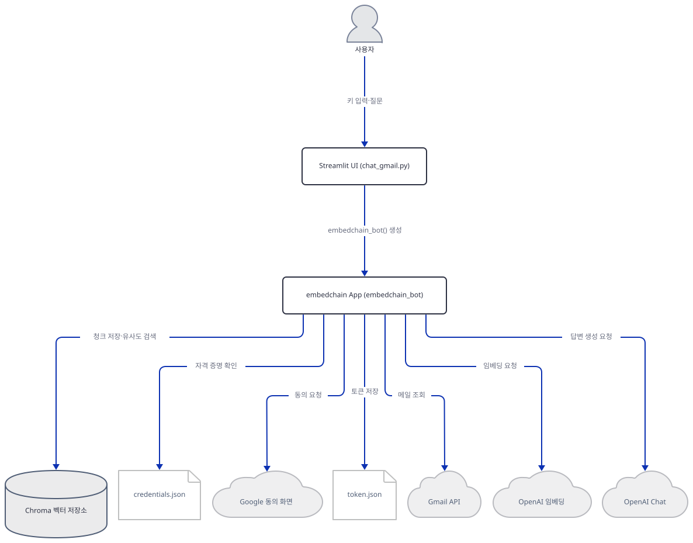
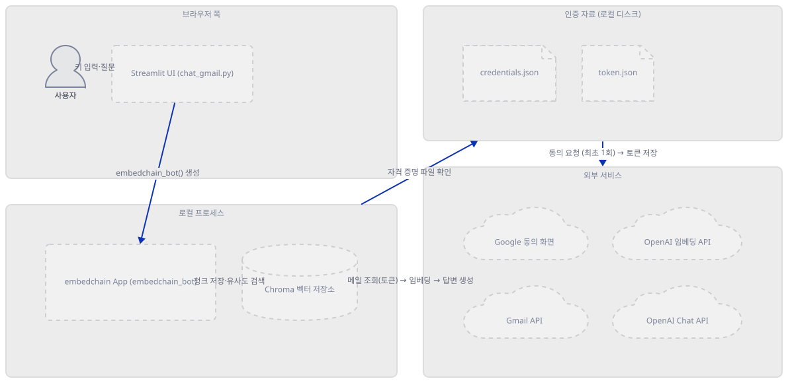
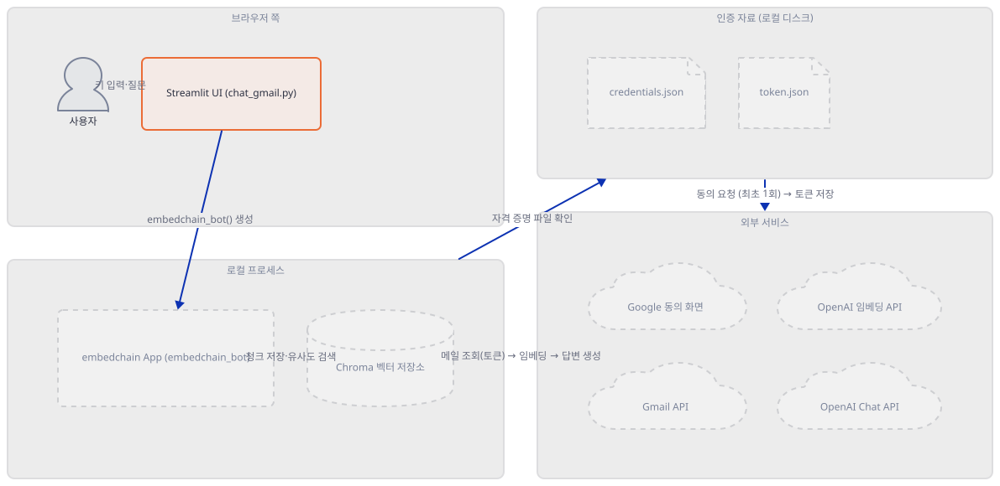
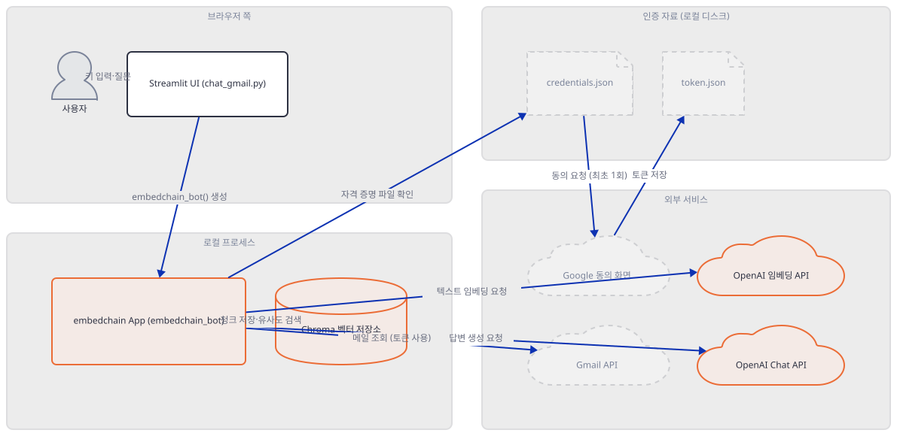
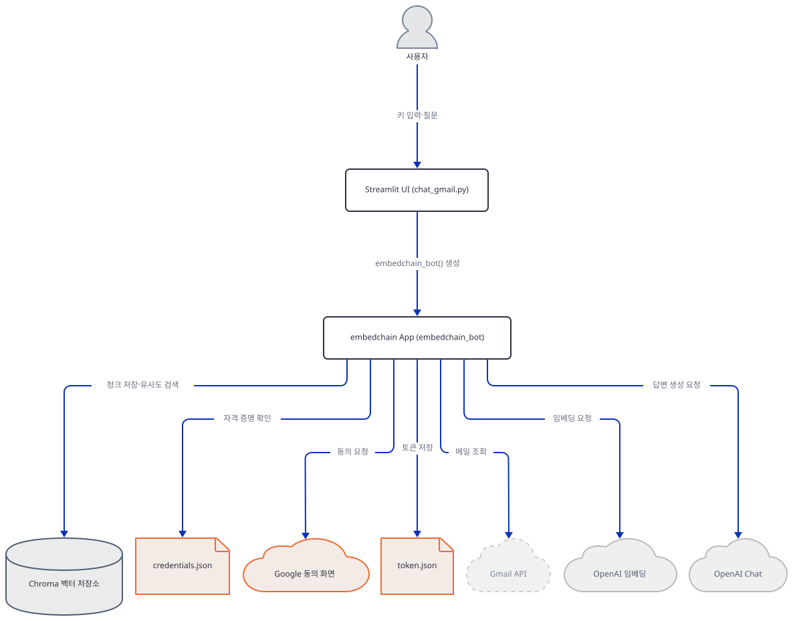
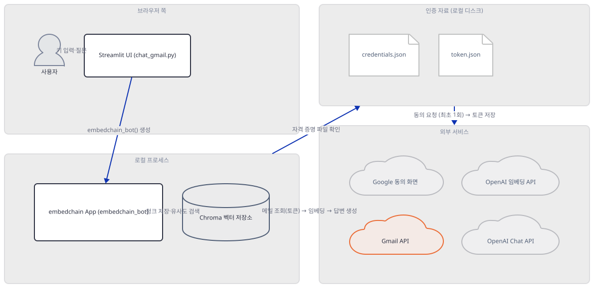
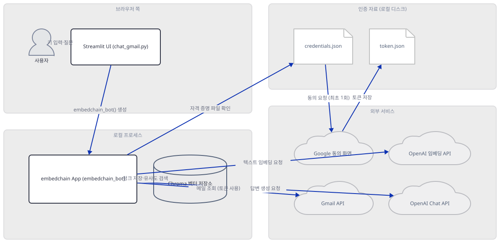
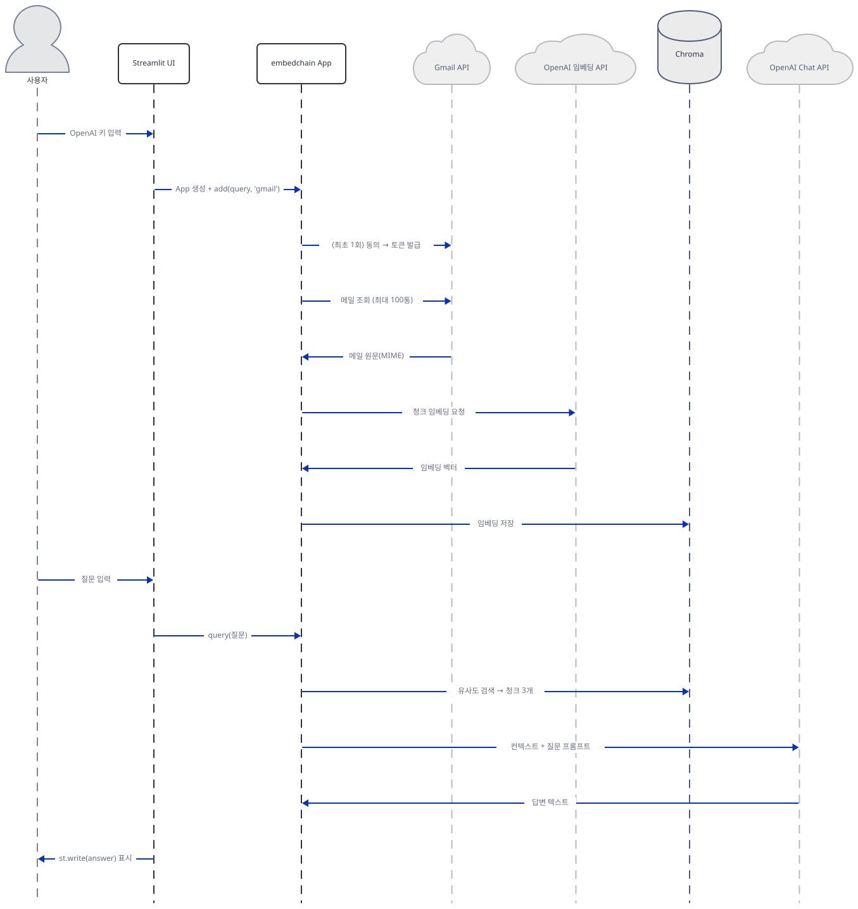

# Day 044 · 📨 Chat with Gmail

> 볼륨 4 💬 Chat with X · 난이도 ★★☆ · 예상 소요 85분(Google Cloud OAuth 설정·동의 절차까지 함께 다뤄 이 볼륨의 다른 날보다 깁니다) · API 비용 대략 질문 1건당 `gpt-4-turbo` 호출 1회(약 $0.01, $5/$15 per 1M 토큰) + 메일 재임베딩(`text-embedding-ada-002`, $0.10/1M 토큰; 메일 최대 100통 기준이지만 질문마다 반복됨 — Step 7) · 대략치, 키가 없어 실제 과금은 확인 못함 · 원본 앱: `advanced_llm_apps/chat_with_X_tutorials/chat_with_gmail`

## 오늘 만들 것

이번 튜토리얼도 40줄짜리 파일 하나로 RAG 챗봇을 완성하지만, 이번에 `.add()`가 읽어 오는 대상은 뉴스레터나 논문이 아니라 **독자 자신의 Gmail 받은편지함**입니다. 코드 구조는 Day 039(Substack)와 거의 같습니다 — `embedchain`의 `App.from_config()` 한 번과 `.add()`/`.query()` 두 번의 호출 뒤에 벡터 저장·검색·프롬프트 조립이 전부 숨어 있고, 답은 OpenAI의 `gpt-4-turbo`(temperature 0.5)가 만들며 임베딩은 모델명을 적지 않았는데도 `text-embedding-ada-002`로 채워집니다 — 둘 다 Day 039의 결과를 그대로 옮기지 않고 이 앱의 `embedchain_bot()`을 직접 호출해 다시 확인했습니다(Step 3). 하지만 이 앱만의 진짜 주제는 코드 자체보다 **무엇에 동의하게 되는가**입니다. `requirements.txt`의 두 번째 줄은 `embedchain`이 아니라 `embedchain[gmail]`이고, 이 extra가 정의하는 접근 범위는 정확히 `https://www.googleapis.com/auth/gmail.readonly` 하나뿐입니다(`GmailReader.SCOPES`, 소스로 확인) — Google 문서에 따르면 이 범위는 읽기 전용이며 메일을 보내거나 지우거나 라벨을 바꾸는 동작은 전혀 허용하지 않습니다(정확한 원문은 Step 4에서 확인합니다). 인증에 쓸 `credentials.json`은 독자가 직접 Google Cloud 프로젝트를 만들고 OAuth 클라이언트를 발급받아 내려받아야 하는 파일이고, 동의가 끝나면 그 결과인 토큰이 앱을 실행한 작업 디렉터리에 평문 JSON 파일 `token.json`으로 새로 쓰입니다(둘 다 소스로 확인, Step 4). 조회 대상도 전체 메일함이 아니라 코드에 고정된 Gmail 검색어 `"to: me label:inbox"`(`gmail_filter`)로 제한되고, 그나마도 `GmailReader.load_emails()`가 `maxResults`도 페이지네이션도 쓰지 않아 실질적으로 Gmail API 기본 페이지 크기인 최대 100통까지만 읽힙니다 — 생성자에 있는 `results_per_page=10`이라는 인자는 이름과 달리 어디에서도 쓰이지 않는 죽은 매개변수라는 것도 직접 확인합니다(Step 5). 메일 한 통에서는 제목·보낸사람·받는사람·날짜와 본문 텍스트 하나만 뽑히고 — 원본 MIME에 첨부파일이 들어 있어도 본문 추출 함수는 `text/plain`·`text/html` 파트만 보므로 첨부파일 내용은 임베딩에도, OpenAI로 나가는 요청에도 포함되지 않습니다(소스로 확인) — 이렇게 뽑힌 텍스트만 청크로 쪼개져 OpenAI 임베딩 API로, 검색된 청크는 다시 OpenAI Chat API로 나갑니다. 그리고 Day 039와 똑같이 벡터 저장소 경로가 `tempfile.mkdtemp()`로 캐시 없이 매번 새로 뽑히기 때문에, 질문을 하나 더 던질 때마다 메일함 조회부터 재임베딩까지 전체가 반복됩니다 — 다만 동의 자체는 `token.json`이 남아 있는 한 한 번으로 끝나고, 되풀이되는 것은 Gmail API 조회와 OpenAI 임베딩 호출이라는 것을 실험으로 구분합니다(Step 7). 완성하면 이 모든 과정을 거쳐 자신의 받은편지함에 대해 자유롭게 묻고 답하는 화면을 로컬에서 띄우게 됩니다. 아래는 완성된 아키텍처입니다.



## 사전 준비

| 서비스/도구 | 용도 | 발급·설치 |
|---|---|---|
| OpenAI API 키 | `gpt-4-turbo`(답변)와 `text-embedding-ada-002`(임베딩) 호출 인증. 화면 입력창에 직접 붙여넣는다(환경변수 아님 — 코드에 `os.environ`·`os.getenv` 참조가 전혀 없음, 직접 확인) | https://platform.openai.com/api-keys 가입 후 발급 |
| Google Cloud 프로젝트 + OAuth 클라이언트(데스크톱 앱) | Gmail을 읽기 전용으로 조회하는 동의 화면을 만들고, 그 클라이언트의 비밀정보를 `credentials.json`으로 내려받는다 | https://console.cloud.google.com/ 에서 프로젝트 생성 → "Gmail API" 사용 설정 → OAuth 동의 화면 구성 → OAuth 클라이언트 ID(데스크톱 앱) 생성 → JSON 다운로드 후 앱 작업 폴더에 `credentials.json`으로 저장 |
| 접근을 허용할 Gmail 계정 | 실제로 조회되는 진짜 받은편지함. 시험 삼아 돌려볼 목적이라면 본계정 대신 별도 테스트 계정 사용을 권장 | 기존 Google 계정 또는 새로 만든 테스트 계정 |
| uv | 가상환경 생성과 패키지 설치 | [공통 사전 준비](../README.md#공통-사전-준비-한-번만) 절 참고 |
| Python 3.11 (Windows) | `chroma-hnswlib` 0.7.6의 Windows용 사전 빌드 wheel이 cp311까지만 배포됨 — Step 1에서 직접 확인 | `uv venv --python 3.11`로 지정 |
| 인터넷 연결 | Gmail API·Google OAuth 서버·OpenAI API 접속 | 별도 설치 없음. 사내망이면 도메인 접속 허용 필요 |

## 아키텍처 한눈에 보기

| 컴포넌트 | 역할 | 코드 위치 |
|---|---|---|
| 사용자 | OpenAI 키 입력, Google 동의 화면에서 접근 승인(최초 1회), 질문 입력 | 코드 없음 (브라우저) |
| Streamlit UI | 입력을 순서대로 받고 embedchain App을 호출, 결과 표시 | `advanced_llm_apps/chat_with_X_tutorials/chat_with_gmail/chat_gmail.py:15-20`, `advanced_llm_apps/chat_with_X_tutorials/chat_with_gmail/chat_gmail.py:34-40` |
| embedchain App (`embedchain_bot`) | LLM·임베더·벡터DB 설정 3가지를 하나의 config로 묶어 App 인스턴스 생성 | `advanced_llm_apps/chat_with_X_tutorials/chat_with_gmail/chat_gmail.py:6-13` |
| GmailReader / GmailLoader | OAuth 동의·토큰 관리, Gmail API로 메일 조회, 헤더·본문 추출 | 소스로 확인: `embedchain/loaders/gmail.py` (embedchain 0.1.128, 저장소 밖) |
| `credentials.json` | Google OAuth 클라이언트의 비밀정보. 작업 디렉터리에서 읽음 | 코드 없음 (로컬 파일) |
| `token.json` | 동의 후 발급된 OAuth 토큰. 작업 디렉터리에 평문 JSON으로 새로 쓰임 | 코드 없음 (로컬 파일) |
| Chroma 벡터 저장소 | 메일 청크 임베딩을 로컬 디스크(임시 폴더)에 저장하고 유사도 검색으로 상위 3개 청크를 반환 | `advanced_llm_apps/chat_with_X_tutorials/chat_with_gmail/chat_gmail.py:10` |
| Google 동의 화면 / Gmail API | 사용자 인증(최초 1회)과 메일함 조회(최대 100통) | 코드 없음 (외부 서비스) |
| OpenAI 임베딩 API | 메일 청크를 벡터로 변환 (`text-embedding-ada-002`) | `advanced_llm_apps/chat_with_X_tutorials/chat_with_gmail/chat_gmail.py:11` |
| OpenAI Chat API | 검색된 청크를 근거로 최종 답변 생성 (`gpt-4-turbo`) | `advanced_llm_apps/chat_with_X_tutorials/chat_with_gmail/chat_gmail.py:9` |

## 단계별 진행

### Step 1. 환경 만들기와 Python 버전 확인

**목적.** 의존성 두 줄을 설치하고, `embedchain[gmail]`이 일반 `embedchain`보다 무엇을 더 끌어오는지, 이 컴퓨터가 어떤 벽에 부딪히는지 먼저 확인합니다.

**할 일.**

```bash
cd advanced_llm_apps/chat_with_X_tutorials/chat_with_gmail
uv venv
uv pip install -r requirements.txt
```

`advanced_llm_apps/chat_with_X_tutorials/chat_with_gmail/requirements.txt:1-2`

```text
streamlit
embedchain[gmail]
```

Day 039의 `embedchain`(버전 하한 없음)과 달리 두 번째 줄이 `embedchain[gmail]`입니다. 이 컴퓨터에서 `uv venv`는 인자 없이 Python **3.13.3**을 고르고(직접 확인), 이 상태로 설치하면 Day 039와 같은 지점에서 멈춥니다 — `chromadb==0.5.23`이 못박은 `chroma-hnswlib==0.7.6`이 Windows용 사전 빌드 wheel을 cp311까지만 배포하기 때문입니다.

직접 확인한 출력(발췌):

```
Resolved 164 packages in 1.71s
   Building chroma-hnswlib==0.7.6
  × Failed to build `chroma-hnswlib==0.7.6`
  ├─▶ The build backend returned an error
  ╰─▶ Call to `setuptools.build_meta.build_wheel` failed (exit code: 1)
      [stderr]
      error: Unable to find a compatible Visual Studio installation.
  help: `chroma-hnswlib` (v0.7.6) was included because `embedchain` (v0.1.128)
        depends on `chromadb` (v0.5.23) which depends on `chroma-hnswlib`
```

`embedchain`만 쓰는 Day 039는 150개 패키지를 끌어왔지만 `[gmail]` extra가 붙은 이 앱은 **164개**를 끌어옵니다(직접 확인). 차이는 `google-api-python-client`, `google-auth`, `google-auth-httplib2`, `google-auth-oauthlib`, `google-api-core`, `googleapis-common-protos`, `oauthlib`, `requests-oauthlib`, `pywin32` 등 Google OAuth·API 클라이언트 스택입니다(직접 확인: 설치된 패키지 목록 대조 — Substack 앱에는 이 중 어느 것도 필요하지 않습니다).

Python 3.11로 다시 만들면 그대로 설치됩니다.

```bash
uv venv --python 3.11
uv pip install -r requirements.txt
```

직접 확인한 출력:

```
Resolved 164 packages in 7.36s
```

(pip을 쓴다면 `python -m venv .venv && source .venv/bin/activate && pip install -r requirements.txt` — `chroma-hnswlib` wheel 문제는 pip을 써도 동일합니다.)

핵심 버전(직접 확인): `streamlit 1.64.0`, `embedchain 0.1.128`, `chromadb 0.5.23`, `chroma-hnswlib 0.7.6`, `openai 1.109.1`, `google-auth-oauthlib 1.4.1`, `google-api-python-client 2.200.0`, `beautifulsoup4 4.15.0`.

이 저장소는 루트에 `pyproject.toml`이 있어 `uv run`이 방금 만든 환경 대신 루트의 `.venv`를 쓰므로, 이후 `uv run` 명령에는 모두 `--no-project`를 붙입니다.



**확인.**

```bash
uv run --no-project python -m py_compile chat_gmail.py
```

성공하면 출력 없이 종료합니다(직접 확인).

```bash
uv run --no-project python -c "import streamlit as st; from embedchain import App; from embedchain.loaders.gmail import GmailReader; import tempfile; print('ALL IMPORTS OK')"
```

직접 확인한 출력:

```
ALL IMPORTS OK
```

(이 컴퓨터에서는 `embedchain`과 `embedchain.loaders.gmail`을 함께 임포트하는 데만 1분을 넘기기도 했습니다 — 의존성 트리가 무거워 실행 시간이 환경과 디스크 상태에 따라 크게 달라질 수 있습니다.)

### Step 2. Streamlit 뼈대: 제목과 키 입력

**목적.** 화면 제목과 OpenAI 키 입력창이 이후 거의 모든 로직의 게이트라는 것을 확인합니다 — Day 039와 같은 구조입니다.

**할 일.**

`advanced_llm_apps/chat_with_X_tutorials/chat_with_gmail/chat_gmail.py:15-20`

```python
# Create Streamlit app
st.title("Chat with your Gmail Inbox 📧")
st.caption("This app allows you to chat with your Gmail inbox using OpenAI API")

# Get the OpenAI API key from the user
openai_access_token = st.text_input("Enter your OpenAI API Key", type="password")
```

제목과 캡션, 키 입력창(`type="password"`로 마스킹)은 무조건 그려집니다. `advanced_llm_apps/chat_with_X_tutorials/chat_with_gmail/chat_gmail.py:26`의 `if openai_access_token:`부터 40번 줄까지 — Gmail 인증, 지식베이스 추가, 질문 입력, 답변 표시까지 — 전부 이 블록 안에 있습니다. 이 키는 Day 039와 마찬가지로 환경변수로 복사되지 않습니다 — 파일 전체에 `os.environ`·`os.getenv` 참조가 하나도 없습니다(직접 확인: grep 결과 없음). Gmail 쪽 인증은 이 키와 무관한 별도 경로(다음 Step)로 이루어집니다.



**확인.** 앱 폴더에서 서버를 headless로 띄웁니다.

```bash
uv run --no-project streamlit run chat_gmail.py --server.headless true
```

다른 터미널에서:

```bash
curl -s -o /dev/null -w "%{http_code}\n" http://localhost:8501
```

직접 확인한 출력:

```
200
```

(HTTP 200은 직접 확인했습니다. 제목·키 입력창만 보이고 나머지는 아직 없으리라는 것은 `if` 가드 구조로 추론한 것이며, 화면을 직접 열어 확인하지는 못했습니다.)

### Step 3. `embedchain_bot`: LLM·임베더·벡터DB를 하나의 config로

**목적.** 8줄짜리 함수 하나가 답변 모델, 임베딩 모델, 벡터 저장소 경로를 동시에 정의한다는 것을, Day 039의 결과를 옮기지 않고 이 앱 자체로 다시 확인합니다.

**할 일.**

`advanced_llm_apps/chat_with_X_tutorials/chat_with_gmail/chat_gmail.py:6-13`

```python
def embedchain_bot(db_path, api_key):
    return App.from_config(
        config={
            "llm": {"provider": "openai", "config": {"model": "gpt-4-turbo", "temperature": 0.5, "api_key": api_key}},
            "vectordb": {"provider": "chroma", "config": {"dir": db_path}},
            "embedder": {"provider": "openai", "config": {"api_key": api_key}},
        }
    )
```

`llm`은 모델명(`gpt-4-turbo`)과 온도(0.5)를 명시하지만 `embedder`는 `api_key`만 주고 모델명을 적지 않았습니다. 이 함수를 파일에서 직접 꺼내(`runpy.run_path`) 가짜 키로 호출해 무엇으로 채워지는지 확인합니다 — `App.from_config()`는 로컬에서 Chroma 클라이언트를 여는 것뿐이라 네트워크 호출이 없습니다.



**확인.**

```bash
uv run --no-project python -c "
import streamlit as st
st.text_input = lambda *a, **k: ''
st.title = st.caption = lambda *a, **k: None
import runpy
ns = runpy.run_path('chat_gmail.py')
import tempfile, shutil
db_path = tempfile.mkdtemp()
app = ns['embedchain_bot'](db_path, 'sk-fake-test-key')
print('embedder model:', app.embedding_model.config.model)
print('llm model/temp:', app.llm.config.model, app.llm.config.temperature)
print('top_k (number_documents):', app.llm.config.number_documents)
print('stream:', app.llm.config.stream)
shutil.rmtree(db_path, ignore_errors=True)
"
```

직접 확인한 출력(stderr의 alembic·pydantic 지원종료 경고 2줄은 생략):

```
embedder model: text-embedding-ada-002
llm model/temp: gpt-4-turbo 0.5
top_k (number_documents): 3
stream: False
```

`sk-fake-test-key`라는 가짜 키로도 `App.from_config()`는 그대로 성공합니다 — 키를 생성 시점에는 검증하지 않는, 지금까지의 다른 날들과 같은 패턴입니다. 임베딩 모델은 명시하지 않았는데도 `text-embedding-ada-002`로 채워지고(embedchain 0.1.128의 `embedchain/embedder/openai.py`, 소스로 확인: `config.model`이 `None`이면 이 문자열을 대입), 검색 시 가져올 청크 수(`number_documents`)는 3, 스트리밍(`stream`)은 꺼져 있는 것이 기본값입니다 — 이 앱은 이 값들을 하나도 바꾸지 않았습니다.

### Step 4. Gmail 인증과 동의: `credentials.json` → `token.json`

**목적.** `app.add()`가 처음 호출되는 순간 실제로 무엇에 동의를 요청하는지, 그 결과가 어디에 어떻게 저장되는지 라이브러리 소스로 정확히 확인합니다. (이 시리즈의 방침과 이번 일차의 별도 제약상 실제로 동의 화면을 띄우거나 Gmail 계정에 접속하지는 않습니다 — 아래는 소스로 확인한 사실과, 자격 증명 파일 없이도 네트워크 없이 안전하게 실행되는 확인 명령의 결과입니다.)

**할 일.**

`advanced_llm_apps/chat_with_X_tutorials/chat_with_gmail/chat_gmail.py:26-31`

```python
if openai_access_token:
    # Create a temporary directory to store the database
    db_path = tempfile.mkdtemp()
    # Create an instance of Embedchain App
    app = embedchain_bot(db_path, openai_access_token)
    app.add(gmail_filter, data_type="gmail")
```

`app.add(gmail_filter, data_type="gmail")`이 호출되면 embedchain은 `data_type`을 `GmailLoader`로 매핑하고(embedchain 0.1.128의 `embedchain/data_formatter/data_formatter.py`, 소스로 확인: `DataType.GMAIL: "embedchain.loaders.gmail.GmailLoader"`), `GmailLoader.load_data()`는 `GmailReader(query=query)`를 생성합니다. 이 생성자가 곧바로 `_initialize_service()` → `_get_credentials()`를 호출합니다(`embedchain/loaders/gmail.py`, 소스로 확인) — 즉 **`app.add()`를 부르는 순간이 곧 Google 동의를 요청하는 순간**입니다.

이 클래스가 요청하는 범위는 정확히 하나입니다.

```python
class GmailReader:
    SCOPES = ["https://www.googleapis.com/auth/gmail.readonly"]
```

Google의 Gmail API 범위 문서는 이 범위를 "Read all resources and their metadata—no write operations."라고 정의하고, 동의 화면에 표시되는 설명은 "View your email messages and settings."입니다(Gmail API 문서로 확인, 2026-09-22). 이 범위만으로는 메일을 보내지도(`gmail.send`), 수정하지도(`gmail.modify`), 라벨을 바꾸지도(`gmail.labels`), 완전히 삭제하지도(`https://mail.google.com/`) 못합니다 — 읽기만 가능합니다.

인증 절차는 다음과 같습니다(`_get_credentials()`, 소스로 확인). 먼저 작업 디렉터리에 `credentials.json`이 있는지 확인하고, 없으면 즉시 예외를 던집니다 — 아래 **확인**에서 이 예외를 직접 재현합니다. 이 파일은 독자가 https://console.cloud.google.com/ 에서 프로젝트를 만들고 "Gmail API"를 사용 설정한 뒤, OAuth 동의 화면을 구성하고 OAuth 클라이언트 ID(데스크톱 앱)를 발급받아 JSON으로 내려받아야 얻을 수 있습니다(앱 자체 `README.md`가 이 절차를 안내합니다). `credentials.json`이 있으면 같은 디렉터리의 `token.json`을 읽어 유효한지 확인하고, 없거나 만료됐으면 `InstalledAppFlow.from_client_secrets_file("credentials.json", SCOPES).run_local_server(port=8080)`을 실행합니다 — 로컬에 임시 HTTP 서버를 열고 기본 브라우저로 Google 동의 화면을 띄워, 승인 후 `localhost:8080`으로 돌아오는 인가 코드를 받습니다. 승인이 끝나면 발급된 토큰을 `creds.to_json()`으로 직렬화해 **작업 디렉터리에 `token.json`이라는 평문 JSON 파일로 새로 씁니다**(`open("token.json", "w")`, 소스로 확인). 이후 재실행에서는 이 파일이 있고 유효하면(또는 `refresh_token`으로 조용히 갱신되면) 브라우저 동의 없이 재사용됩니다 — 동의 자체는 보통 한 번만 일어나지만, 실제 메일 조회(Step 5)는 그렇지 않다는 것을 Step 7에서 실험으로 확인합니다.



**확인.** `credentials.json` 없이 이 함수를 직접 호출해, 실제로 어떤 예외가 나는지 네트워크 없이 확인합니다.

```bash
uv run --no-project python -c "
from embedchain.loaders.gmail import GmailReader
print('SCOPES:', GmailReader.SCOPES)
try:
    GmailReader._get_credentials()
except Exception as e:
    print(type(e).__name__ + ':', e)
"
```

직접 확인한 출력:

```
SCOPES: ['https://www.googleapis.com/auth/gmail.readonly']
FileNotFoundError: Missing 'credentials.json'. Download it from your Google Developer account.
```

이 호출은 `os.path.exists("credentials.json")`만 확인하고 바로 예외를 던지므로 브라우저도 네트워크도 전혀 거치지 않습니다(소스로 확인) — `chat_gmail.py`에는 `try/except`가 전혀 없으므로(직접 확인: 파일 전체에 `try`·`except` 문자열 없음) 이 예외는 `app.add()`를 거쳐 화면 전체를 멈추는 미처리 예외로 그대로 올라갑니다.

이 튜토리얼만 시험해 볼 목적이었다면, 다 쓴 뒤 로컬의 `token.json`을 지우고 https://myaccount.google.com/permissions 에서 방금 만든 OAuth 클라이언트의 접근 권한을 제거해 두는 것을 권합니다 — `token.json`은 발급 당시의 클라이언트 정보를 자체적으로 담고 있어, `credentials.json`만 지우는 것으로는 이미 발급된 토큰이 계속 유효한 상태를 막지 못합니다.

### Step 5. Gmail 지식베이스에 추가하기: 무엇이 얼마나 읽히는가

**목적.** 동의가 끝난 뒤 실제로 어떤 메일이 몇 통까지, 어떤 형태로 읽혀 벡터 저장소로 들어가는지 소스로 확인합니다.

**할 일.**

`advanced_llm_apps/chat_with_X_tutorials/chat_with_gmail/chat_gmail.py:22-23`

```python
# Set the Gmail filter statically
gmail_filter = "to: me label:inbox"
```

이 앱은 Day 039의 URL 입력창과 달리 조회 대상을 고를 수 있는 입력창이 없습니다 — 검색어가 코드에 고정돼 있고 화면 어디에도 이를 바꿀 방법이 없습니다. `"to: me label:inbox"`는 Gmail 검색창에 그대로 쳐도 되는 문법으로, 받은편지함 라벨이 있고 수신자에 내가 포함된 메일만 남깁니다 — 보낸 메일함, 보관 처리돼 라벨이 없는 메일, 참조(cc)로만 받은 메일은 제외됩니다.

이 문자열은 `GmailReader(query=query).load_emails()`(`embedchain/loaders/gmail.py`, 소스로 확인)로 전달되어 `self.service.users().messages().list(userId="me", q=self.query).execute()`가 한 번만 호출됩니다. 이 호출에 `maxResults`가 없고, 응답의 `nextPageToken`을 읽어 다음 페이지를 더 가져오는 코드도 없습니다(소스로 확인) — Gmail API 문서는 `maxResults`를 지정하지 않으면 기본값이 100이라고 밝히고 있으므로(Gmail API 문서로 확인, 2026-09-22), 검색어에 맞는 메일이 아무리 많아도 실제로 읽히는 것은 **최대 100통**입니다. `GmailReader.__init__`은 `results_per_page: int = 10`이라는 인자를 받아 `self.results_per_page`에 저장하지만, `load_emails()` 본문 어디에서도 이 속성을 참조하지 않습니다(아래 확인) — 이름과 달리 실제 상한을 정하지 못하는 죽은 매개변수입니다.

메일 한 통마다 `_get_email()`이 `format="raw"`로 원본 MIME 전체를 내려받고, `_get_body()`가 그 안에서 `text/plain`(첨부 아님) 파트 하나, 없으면 `text/html` 파트 하나만 골라 반환합니다(소스로 확인) — 이미지나 문서 같은 첨부파일 파트는 이 함수가 건드리지 않으므로, 첨부파일 내용은 벡터 저장소에도 OpenAI로 나가는 요청에도 포함되지 않습니다. `GmailLoader._process_email()`은 이 본문을 `BeautifulSoup`로 HTML을 벗겨낸 뒤 제목·보낸사람·받는사람·날짜와 합쳐 하나의 텍스트로 만듭니다 — **OpenAI 임베딩 API로 나가는 것은 이 합쳐진 텍스트뿐**입니다. `GmailChunker`는 Day 039의 `SubstackChunker`와 똑같이 1,000자 단위, 겹침 0으로 이 텍스트를 쪼갭니다(소스로 확인).



**확인.** 네트워크 없이, `results_per_page`가 정말 쓰이지 않는지와 청크 분할 기본값을 직접 확인합니다.

```bash
uv run --no-project python -c "
import inspect
from embedchain.loaders.gmail import GmailReader
from embedchain.chunkers.gmail import GmailChunker
print('results_per_page used in load_emails:', 'results_per_page' in inspect.getsource(GmailReader.load_emails))
c = GmailChunker()
print('chunk_size:', c.text_splitter._chunk_size)
print('chunk_overlap:', c.text_splitter._chunk_overlap)
"
```

직접 확인한 출력:

```
results_per_page used in load_emails: False
chunk_size: 1000
chunk_overlap: 0
```

### Step 6. 질문과 답변 (`app.query`)

**목적.** 질문 한 건이 몇 개의 청크를 근거로 어떤 프롬프트로 `gpt-4-turbo`에 전달되는지 확인합니다.

**할 일.**

`advanced_llm_apps/chat_with_X_tutorials/chat_with_gmail/chat_gmail.py:34-40`

```python
    # Ask a question about the emails
    prompt = st.text_input("Ask any question about your emails")

    # Chat with the emails
    if prompt:
        answer = app.query(prompt)
        st.write(answer)
```

`app.query(prompt)`는 Chroma에서 질문과 가장 비슷한 청크를 유사도 검색으로 가져옵니다 — Step 3에서 확인한 `number_documents=3`이 기본값이므로 상위 3개입니다. 이 청크들과 질문은 embedchain의 기본 프롬프트 템플릿에 채워져 `gpt-4-turbo`(temperature 0.5)로 전달됩니다. Step 3에서 확인했듯 `stream`이 꺼져 있으므로 답은 스트리밍 없이 한 번에 `st.write(answer)`로 표시됩니다.



**확인.** 네트워크 없이 프롬프트 템플릿만 직접 출력합니다.

```bash
uv run --no-project python -c "from embedchain.config.llm.base import DEFAULT_PROMPT; print(DEFAULT_PROMPT)"
```

직접 확인한 출력:

```
You are a Q&A expert system. Your responses must always be rooted in the context provided for each query. Here are some guidelines to follow:

1. Refrain from explicitly mentioning the context provided in your response.
2. The context should silently guide your answers without being directly acknowledged.
3. Do not use phrases such as 'According to the context provided', 'Based on the context, ...' etc.

Context information:
----------------------
$context
----------------------

Query: $query
Answer:
```

이 템플릿은 메일 청크가 컨텍스트로 들어간다는 사실을 답변에서 티 내지 말라고 명시적으로 지시합니다 — `$context`(검색된 메일 청크)와 `$query`(질문) 두 자리만 채우는 단순한 구조입니다.

### Step 7. 재실행마다 다시 수집되는 메일함

**목적.** "질문을 하나 더 던지면 메일함을 다시 읽는가?"를 직접 실험으로 답합니다 — Day 039가 Substack에서 확인한 구조가 Gmail에도 그대로 있는지 이 앱 자체로 검증합니다.

**할 일.** Step 4에서 인용한 `advanced_llm_apps/chat_with_X_tutorials/chat_with_gmail/chat_gmail.py:26-31`이 `db_path = tempfile.mkdtemp()`를 `@st.cache_resource`도 `st.session_state`도 없이 `if openai_access_token:` 블록 맨 앞에 그대로 두고 있습니다. Streamlit은 위젯 값이 바뀔 때마다(질문을 입력해도) 스크립트 전체를 처음부터 다시 실행하므로, 키가 입력된 이후의 모든 재실행마다 이 줄이 다시 실행되어 매번 새 임시 폴더와 새 App 인스턴스가 만들어집니다. `embedchain.App.from_config`을 가짜로 바꿔치기하고 `st.text_input`이 두 번의 재실행(키만 입력 → 키+질문 입력)을 흉내 내도록 만든 뒤, 실제 `chat_gmail.py`를 두 번 실행해 확인합니다.


**확인.**

```bash
uv run --no-project python -c "
import runpy
import embedchain
import streamlit as st

dirs = []
adds = []

class FakeApp:
    def __init__(self, d):
        self.d = d
    def add(self, query, data_type=None):
        adds.append((self.d, query, data_type))
    def query(self, q):
        return 'FAKE'

def fake_from_config(cls, config):
    d = config['vectordb']['config']['dir']
    dirs.append(d)
    return FakeApp(d)

embedchain.App.from_config = classmethod(fake_from_config)
st.success = st.write = st.title = st.caption = lambda *a, **k: None

for prompt_value in ['', 'summarize my inbox']:
    answers = iter(['fake-openai-key', prompt_value])
    st.text_input = lambda *a, **k: next(answers)
    runpy.run_path('chat_gmail.py', run_name='rerun')

print('db_path x2:', dirs)
print('add() calls:', adds)
"
```

직접 확인한 출력:

```
db_path x2: ['C:\\Users\\zihun\\AppData\\Local\\Temp\\tmpo7hhcr0c', 'C:\\Users\\zihun\\AppData\\Local\\Temp\\tmpae7je34p']
add() calls: [('C:\\Users\\zihun\\AppData\\Local\\Temp\\tmpo7hhcr0c', 'to: me label:inbox', 'gmail'), ('C:\\Users\\zihun\\AppData\\Local\\Temp\\tmpae7je34p', 'to: me label:inbox', 'gmail')]
```

(임시 폴더 경로는 실행마다 무작위로 달라집니다.) 두 번의 "재실행"이 서로 다른 임시 폴더를 만들었고, 검색어가 바뀌지 않았는데도 `add()`가 두 번 다 같은 쿼리로 호출됐습니다 — 질문을 한 번 더 던지는 것만으로 Step 5에서 확인한 조회(최대 100통)·본문 추출·청크 분할·OpenAI 임베딩이 처음부터 반복된다는 뜻입니다. 다만 동의 자체는 반복되지 않습니다 — `token.json`이 유효한 한 `GmailReader._get_credentials()`는 파일에서 조용히 읽어 재사용하므로(Step 4), 매 재실행마다 다시 열리는 것은 브라우저 동의 화면이 아니라 Gmail API 조회와 OpenAI 임베딩 호출입니다.

## 요청 한 건이 흐르는 과정



사용자가 OpenAI 키를 입력하면 `embedchain_bot()`이 새 App을 만들고 `add(gmail_filter, data_type='gmail')`이 실행됩니다. 이 시점에 유효한 `token.json`이 없으면 로컬 서버로 Google 동의 화면이 뜨고 승인 후 토큰이 발급·저장됩니다(최초 1회) — 그림에서는 이 동의 왕복을 화살표 하나로 단순화했습니다. 동의(또는 캐시된 토큰) 이후 Gmail API에서 검색어에 맞는 메일을 최대 100통까지 원문으로 받아와 제목·본문 텍스트를 뽑고 청크로 쪼갠 뒤 OpenAI 임베딩 API로 벡터를 얻어 Chroma에 저장합니다. 이어서 질문을 입력하면 `query()`가 호출되어 Chroma에서 가장 비슷한 청크 3개를 찾고, 그 청크들과 질문을 프롬프트에 담아 `gpt-4-turbo`에 보낸 뒤 돌아온 답을 화면에 그대로 표시합니다. 그림은 이 흐름을 최초 1회 동의를 포함한 한 번의 성공 경로로 그렸습니다 — Step 7에서 확인했듯 질문을 한 번 더 던지면 동의 화살표만 빠진 채(토큰이 남아 있으므로) 메일 조회부터 임베딩까지 나머지 전부가 처음부터 반복됩니다. 이 시퀀스는 키와 자격 증명이 없어 실제 응답을 재현하지 못했고, 각 구간을 소스 코드와 안전한 모의 호출로 개별 확인한 것입니다.

## 실행 체크리스트

- [ ] OpenAI API 키를 발급받아 두었다
- [ ] Google Cloud 프로젝트에서 Gmail API를 사용 설정하고 OAuth 클라이언트(데스크톱 앱)를 만들어 `credentials.json`으로 받아 두었다
- [ ] `uv venv --python 3.11`로 만든 가상환경에 `uv pip install -r requirements.txt`로 의존성 164개를 설치했다 (기본 Python 3.13에서는 `chroma-hnswlib` 빌드가 실패한다는 것을 확인했다)
- [ ] `embedchain_bot`이 만드는 App의 기본 임베딩 모델(`text-embedding-ada-002`)과 LLM(`gpt-4-turbo`, temperature 0.5)을 이 앱 코드로 직접 확인했다
- [ ] `GmailReader.SCOPES`가 읽기 전용 범위(`gmail.readonly`) 하나뿐이라는 것과, `credentials.json`이 없을 때 나는 예외를 직접 확인했다
- [ ] `gmail_filter`가 코드에 고정돼 있고 결과가 Gmail API 기본 페이지 크기(최대 100통)로 제한되며 첨부파일은 읽히지 않는다는 것을 소스로 이해했다
- [ ] Streamlit이 재실행마다 벡터 저장소를 새로 만들어 질문마다 메일함을 다시 조회·재임베딩한다는 것을 직접 실험으로 확인했다
- [ ] 튜토리얼만 시험해 본 경우, `token.json`을 지우고 Google 계정에서 앱의 접근 권한을 해제했다

## 문제 해결

| 증상 | 원인 | 해결 |
|---|---|---|
| `uv pip install -r requirements.txt`가 `chroma-hnswlib==0.7.6` 빌드 단계에서 `error: Unable to find a compatible Visual Studio installation.`로 실패 | `chroma-hnswlib` 0.7.6 정식 릴리스는 Windows용 사전 빌드 wheel을 cp311까지만 배포하고, `chromadb==0.5.23`이 이 버전을 정확히 못박아 다른 버전으로 바꿀 수도 없다(직접 확인) | `uv venv --python 3.11`로 다시 만들거나 Visual Studio C++ 빌드 도구를 설치 |
| `app.add()` 호출 시 `FileNotFoundError: Missing 'credentials.json'. Download it from your Google Developer account.` | 작업 디렉터리에 `credentials.json`이 없다(`GmailReader._get_credentials()`, 직접 확인) | Google Cloud 콘솔에서 OAuth 클라이언트(데스크톱 앱)를 만들어 JSON을 내려받고, `chat_gmail.py`를 실행하는 디렉터리에 `credentials.json`으로 저장 |
| 동의 화면이 뜨려다 실패하거나 브라우저가 연결을 거부함 | `InstalledAppFlow.run_local_server(port=8080)`이 포트 8080을 코드에 고정해서 쓴다(`embedchain/loaders/gmail.py`, 소스로 확인) — 이미 8080을 쓰는 프로세스가 있으면 실패한다 | 기존 프로세스 종료 후 재시도 (Windows: `netstat -ano | findstr :8080`으로 PID 확인 후 `taskkill /F /PID <PID>` — PowerShell에서도 같은 명령을 그대로 쓸 수 있음) |
| 질문을 두 개 연달아 던지면 두 번째 질문이 유난히 오래 걸리고 OpenAI 대시보드의 임베딩 호출 수가 계속 늘어남 | `db_path = tempfile.mkdtemp()`가 캐시나 세션 상태 없이 재실행마다 실행돼(`advanced_llm_apps/chat_with_X_tutorials/chat_with_gmail/chat_gmail.py:26-31`) 질문마다 새 Chroma 저장소를 만들고 메일함을 처음부터 재조회·재임베딩한다(직접 확인, Step 7) | 리포 코드는 고치지 않는 것이 이 시리즈의 방침이지만, 직접 고친다면 `embedchain_bot`을 `@st.cache_resource`로 감싸 재사용하도록 바꾸는 것을 고려 |

## 더 해보기

- `app.query(prompt, citations=True)`로 바꿔 답변이 어느 메일에서 나왔는지 출처까지 함께 받아보기(embedchain 소스로 확인: `query()`가 `citations` 인자를 지원함)
- `embedchain_bot`(`advanced_llm_apps/chat_with_X_tutorials/chat_with_gmail/chat_gmail.py:6-13`)을 `@st.cache_resource`로 감싸 재실행마다 재조회되지 않도록 고쳐보고, 두 번째 질문의 응답 속도가 어떻게 달라지는지 비교해보기
- 별도로 만든 테스트 Gmail 계정으로 `gmail_filter`(`advanced_llm_apps/chat_with_X_tutorials/chat_with_gmail/chat_gmail.py:23`)를 `"newer_than:7d"`처럼 더 좁은 검색어로 바꿔 실제로 실행해보고, 다 써본 뒤 `token.json` 삭제와 접근 권한 해제까지 직접 해보기

## 다음 날 예고

[Day 045 · Streaming AI Chatbot](../day045-streaming-ai-chatbot/README.md) — TypeScript 기반 Motia 프레임워크로 OpenAI 스트리밍 응답과 대화 상태 관리를 다루는, 지금까지와는 다른 스택의 챗봇입니다.
