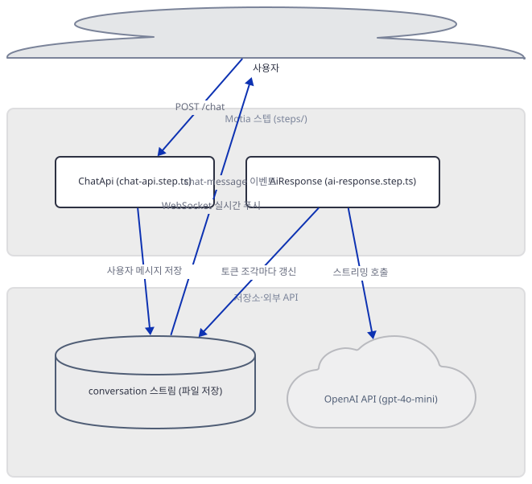
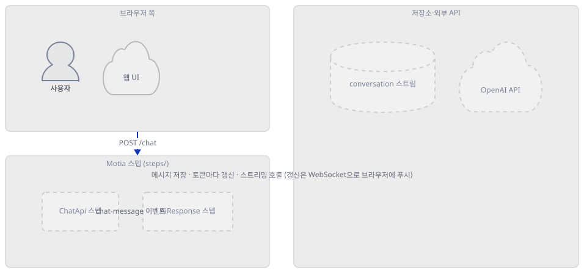
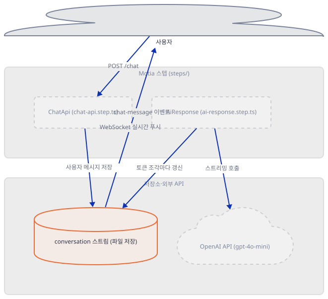
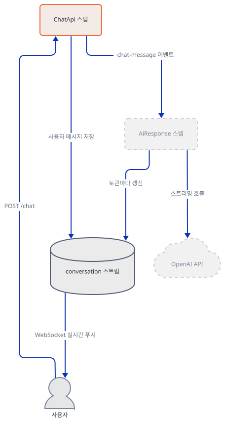
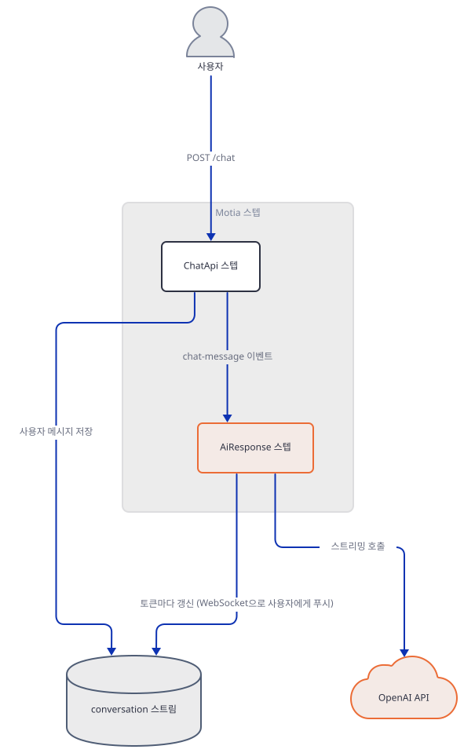
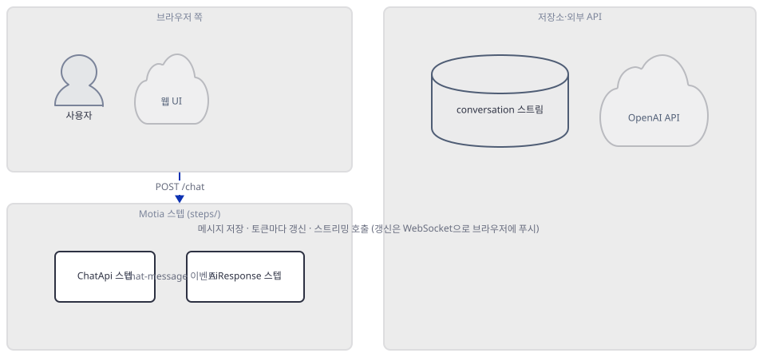
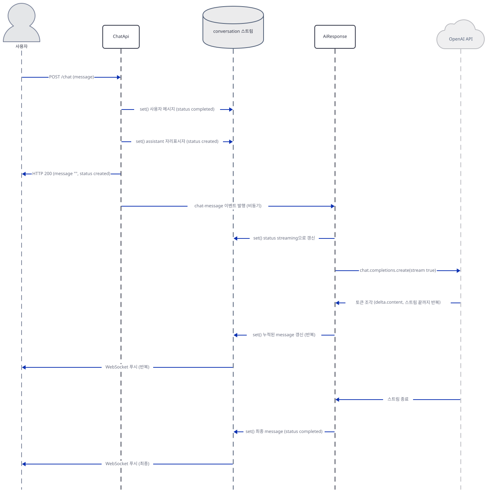

# Day 045 · Streaming AI Chatbot

> 볼륨 4 💬 Chat with X · 난이도 ★★☆ · 예상 소요 100분 · API 비용 대략 gpt-4o-mini 짧은 대화 1건에 $0.001 미만으로 추정(발표 당시 요금표 $0.15/$0.60 per 1M 토큰 기준) · 대략치, 키가 없어 실제 과금 확인 못함 · 원본 앱: `advanced_llm_apps/chat_with_X_tutorials/streaming_ai_chatbot`

## 오늘 만들 것

**이 날은 지금까지의 44일과 패턴이 다릅니다.** Day 1부터 Day 44까지는 전부 파이썬이었고 `uv venv` → `uv pip install -r requirements.txt` → `uv run --no-project`로 진행됐습니다. 오늘 앱에는 `requirements.txt`도, 가상환경도, 파이썬 자체가 없습니다 — `package.json` 하나로 의존성을 선언하고 Node.js 위에서 도는 TypeScript 프로젝트이고, **Motia**라는 백엔드 프레임워크로 짜여 있습니다. 그래서 `uv`는 오늘 아예 등장하지 않고, 다른 모든 날이 경고하는 "저장소 루트 가상환경 함정"(앱 폴더에 `.venv`를 안 만들면 `uv run`이 조용히 루트 환경을 대신 쓰는 문제)도 오늘은 성립하지 않습니다 — 그 함정은 uv가 프로젝트를 인식하는 방식(`pyproject.toml`)에서 나오는데, 이 저장소 루트에는 `package.json`이 없어 npm이 여기를 별도 프로젝트로 취급할 일 자체가 없기 때문입니다(직접 확인). 앱은 파일 3개(`steps/chat-api.step.ts` 66줄, `steps/ai-response.step.ts` 100줄, `steps/conversation.stream.ts` 15줄)가 전부이고, 각각 "API 경로 하나를 선언", "OpenAI 응답을 만들어 스트림에 반영", "대화 상태의 zod 스키마 정의"를 맡습니다. 오늘의 진짜 주제는 OpenAI의 `stream: true` 자체가 아니라 **Motia가 그 주위에 무엇을 더하는가**입니다 — 스텝이 어떻게 선언되고, 부분 답변이 서버에서 브라우저까지 실제로 무엇을 타고 가는지, 대화 상태가 어디에 살아남는지, 그리고 평범한 Streamlit 앱이라면 손으로 짜야 할 이벤트 버스·실시간 푸시·타입 생성을 프레임워크가 무엇으로 대신하는지입니다. 이걸 알아내려고 `package.json`이 정확히 고정한 `motia@0.2.2`를 저장소 밖 임시 폴더에 실제로 설치해 내부 소스를 읽었고(직접 확인, Step 1), 그 결과 이 핀이 오늘도 설치는 되지만 이미 15개월 가까이 지난 버전이라는 것, 그리고 이 버전에는 **Windows에서만 재현되는 진짜 버그**가 있어 대화 스트림이 아예 연결되지 않고 `/chat`을 호출하면 500 에러가 난다는 것을 직접 재현하고 원인까지 특정했습니다(Step 6). 앱 자체 README와 저장소에 커밋된 `types.d.ts`도 지금 소스가 실제로 반환하는 값과 다른 예전 모습을 그대로 담고 있다는 것도 직접 확인했습니다(Step 3, 5). 완성 아키텍처는 아래와 같습니다.



## 사전 준비

| 서비스/도구 | 용도 | 발급·설치 |
|---|---|---|
| Node.js 20 이상 | 이 앱이 도는 런타임 — 다른 날의 uv·Python에 해당하는 자리. `package.json`에 `engines` 제약은 없지만 devDependencies의 `@types/node`가 `^20.0.0`을 기준으로 함 | https://nodejs.org 에서 LTS 설치. 이 문서는 v24.12.0으로 직접 확인 |
| npm | 패키지 설치 — 다른 날의 `uv pip install`/`pip install`에 해당하는 자리 | Node.js에 기본 포함. 이 문서는 11.6.2로 직접 확인 |
| OpenAI API 키 | `ai-response.step.ts`가 `gpt-4o-mini`를 스트리밍으로 호출하는 데 필요 | https://platform.openai.com 가입 후 발급. `.env` 파일에 저장(다른 여러 날의 UI 입력창과 달리 이 앱은 환경변수만 읽음) |

## 아키텍처 한눈에 보기

| 컴포넌트 | 역할 | 코드 위치 |
|---|---|---|
| 사용자 | 메시지 입력, WebSocket으로 실시간 상태 수신 | 코드 없음 (브라우저·워크벤치) |
| ChatApi 스텝 | `POST /chat` 처리 — 사용자 메시지와 assistant 자리표시자를 스트림에 쓰고 이벤트 발행 | `advanced_llm_apps/chat_with_X_tutorials/streaming_ai_chatbot/steps/chat-api.step.ts:1-66` |
| conversation 스트림 | 대화 상태의 zod 스키마와 저장 방식(파일 기반 영속) 정의 | `advanced_llm_apps/chat_with_X_tutorials/streaming_ai_chatbot/steps/conversation.stream.ts:1-15` |
| AiResponse 스텝 | `chat-message` 이벤트를 구독해 OpenAI를 스트리밍 호출하고 토큰 조각마다 스트림을 갱신 | `advanced_llm_apps/chat_with_X_tutorials/streaming_ai_chatbot/steps/ai-response.step.ts:1-100` |
| OpenAI API | `gpt-4o-mini` 모델로 응답 텍스트 생성 | 코드 없음 (외부 서비스) |

## 단계별 진행

### Step 1. 환경 만들기 — 43일의 Python 패턴이 여기서 끊긴다

**목적.** Node·npm이 준비됐는지 확인하고, `package.json`이 정확히 고정한 `motia@0.2.2`가 오늘도 설치되는지, 무엇이 함께 딸려 오는지 직접 봅니다.

**할 일.**

`advanced_llm_apps/chat_with_X_tutorials/streaming_ai_chatbot/package.json:1-29`

```json
{
  "name": "streaming-ai-chatbot",
  "description": "Minimal streaming AI chatbot demonstrating real-time responses and state management",
  "scripts": {
    "dev": "motia dev --verbose",
    "dev:debug": "motia dev --debug",
    "generate-types": "motia generate-types",
    "build": "motia build",
    "clean": "rm -rf dist node_modules python_modules .motia .mermaid"
  },
  "keywords": [
    "motia",
    "streaming",
    "ai",
    "chatbot",
    "openai"
  ],
  "dependencies": {
    "motia": "0.2.2",
    "openai": "^4.102.0",
    "zod": "^3.25.20"
  },
  "devDependencies": {
    "@types/node": "^20.0.0",
    "@types/react": "^19.0.12",
    "ts-node": "^10.9.2",
    "typescript": "^5.8.2"
  }
}
```

`motia`만 버전이 정확히 고정(`0.2.2`, 캐럿 없음)돼 있고 `openai`·`zod`는 뜹니다. `dev`가 실제로 띄우는 서버(뒤에서 나올 워크벤치 UI 포함)이고, `generate-types`·`build`·`clean`은 각각 Step 5·문제 해결·정리용입니다.

```bash
cd advanced_llm_apps/chat_with_X_tutorials/streaming_ai_chatbot
npm install
```

이 문서는 저장소 폴더 안에 `node_modules`를 남기지 않으려고 실제로는 저장소 밖 임시 폴더에 파일을 복사해 설치했습니다(직접 확인) — 여러분은 위 명령을 앱 폴더 안에서 그대로 실행하면 됩니다. 그 설치에서 **520개 패키지가 5분 만에** 받아졌고(발췌):

```
npm warn deprecated node-domexception@1.0.0: Use your platform's native DOMException instead
npm warn deprecated uuid@8.3.2: uuid@10 and below is no longer supported...
npm warn deprecated glob@11.1.0: Old versions of glob are not supported...
npm warn deprecated glob@10.5.0: Old versions of glob are not supported...

added 520 packages, and audited 521 packages in 5m

4 moderate severity vulnerabilities
```

(정확한 패키지 수·취약점 수·소요 시간은 실행 시점의 npm 레지스트리 상태에 따라 달라질 수 있는 값입니다.) `motia`는 `@motiadev/core@0.2.2`·`@motiadev/workbench@0.2.2`를 정확히 같은 버전으로 끌어오고, 뜨는 float 의존성은 이 문서 기준 **openai 4.104.0, zod 3.25.76, typescript 5.9.3, ts-node 10.9.2, @types/node 20.19.43, @types/react 19.3.0**이었습니다(직접 확인). npm 레지스트리를 직접 조회하면 `motia@0.2.2`는 2025-06-11에 나온 버전이고, 오늘 이 패키지의 `latest` 태그는 **1.0.4-rc.1**(2026-03-15)입니다(직접 확인, `npm view motia time`) — 핀은 여전히 설치되지만 메이저 버전이 두 번 이상 바뀐 뒤의, 15개월 가까이 지난 스냅숏입니다. 이 사실이 실제로 무엇을 망가뜨리는지는 Step 6에서 재현합니다.

이 저장소 루트에는 `pyproject.toml`은 있어도 `package.json`은 없습니다(직접 확인) — 그래서 다른 날들이 경고하는, 앱 폴더에 가상환경을 안 만들면 상위 폴더의 환경을 조용히 집어 쓰는 함정이 npm에는 애초에 성립하지 않습니다. `npm install`은 항상 실행한 폴더 기준으로 `node_modules`를 만듭니다.



**확인.**

```bash
node --version
npm --version
```

```
v24.12.0
11.6.2
```

(버전은 환경마다 다를 수 있습니다 — Node 20 이상이면 충분합니다.)

```bash
npx tsc --noEmit && echo "type check ok"
```

```
type check ok
```

(TypeScript 5.9.3로 직접 확인. 세 스텝 파일이 오류 없이 컴파일된다는 뜻이며, 아무 출력도 없이 `type check ok`만 뜨는 것이 정상입니다.)

### Step 2. 대화 상태를 정의하는 스트림 — conversation.stream.ts

**목적.** Motia의 "스트림"이 무엇을 선언하는 자리인지, 그리고 이 파일의 설정이 앱 자체 README가 보여주는 예시와 실제로 다르다는 것을 확인합니다.

**할 일.**

`advanced_llm_apps/chat_with_X_tutorials/streaming_ai_chatbot/steps/conversation.stream.ts:1-15`

```typescript
import { StreamConfig } from 'motia'
import { z } from 'zod'

export const conversationSchema = z.object({
  message: z.string(),
  from: z.enum(['user', 'assistant']),
  status: z.enum(['created', 'streaming', 'completed']),
  timestamp: z.string(),
})

export const config: StreamConfig = {
  name: 'conversation',
  schema: conversationSchema,
  baseConfig: { storageType: 'default' },
}
```

`conversationSchema`는 메시지 하나의 모양을 정의합니다 — 누가 보냈는지(`from`), 지금 어느 단계인지(`status`, 이 세 값이 전부이고 "실패"를 가리키는 값은 없습니다), 그리고 텍스트 자체(`message`)입니다. `baseConfig.storageType`은 `@motiadev/core` 0.2.2 소스로 확인한 타입 선언상 `'default'` 아니면 `'custom'`(그리고 `factory` 함수) 두 가지 모양만 허용됩니다 — 이 둘 말고 다른 문자열은 애초에 성립하지 않는 값입니다. `'default'`를 고르면 파일 기반 어댑터가 붙어 `<프로젝트 폴더>/.motia/streams/conversation.stream.json`에 실제로 디스크 파일로 저장됩니다(소스로 확인, `file-stream-adapter.js`) — 이 앱의 "대화 상태"는 메모리가 아니라 이 JSON 파일에 삽니다.

그런데 이 앱 자체의 최상위 `README.md`(원본 앱 README, 이 튜토리얼 문서가 아님)는 같은 설정을 소개하며 다른 값을 씁니다. 나란히 비교하면:



**확인.**

```bash
grep -n "storageType" README.md steps/conversation.stream.ts
```

```powershell
Select-String -Path README.md, steps\conversation.stream.ts -Pattern "storageType"
```

```
README.md:117:  baseConfig: { storageType: 'state' },
steps/conversation.stream.ts:14:  baseConfig: { storageType: 'default' },
```

(직접 확인. 앱 자체 README의 "Key Concepts" 절이 보여주는 예시 코드는 `'state'`라는, 지금 버전에서 애초에 유효하지 않은 값을 쓰고 있고, 실제 소스는 `'default'`입니다 — README 예시가 실제 코드를 그대로 옮긴 것이 아니라는 뜻입니다.)

### Step 3. 메시지를 받는 API 스텝 — chat-api.step.ts

**목적.** `ApiRouteConfig`가 API 경로를 어떻게 선언하는지, 그리고 이 핸들러가 실제로 무엇을 돌려주는지 — 앱 자체 README의 응답 예시와 얼마나 다른지 — 확인합니다.

**할 일.**

`advanced_llm_apps/chat_with_X_tutorials/streaming_ai_chatbot/steps/chat-api.step.ts:1-22`

```typescript
import { ApiRouteConfig, Handlers } from 'motia'
import { z } from 'zod'
import { conversationSchema } from './conversation.stream'

const inputSchema = z.object({
  message: z.string().min(1, 'Message is required'),
  conversationId: z.string().optional(),
})

export const config: ApiRouteConfig = {
  type: 'api',
  name: 'ChatApi',
  description: 'Send a message to the AI chatbot',
  path: '/chat',
  method: 'POST',
  emits: ['chat-message'],
  bodySchema: inputSchema,
  responseSchema: {
    200: conversationSchema
  },
  flows: ['chat'],
}
```

한 스텝 파일이 두 가지를 함께 선언합니다 — `type: 'api'`가 실제 HTTP 경로(`path`, `method`)이고, `emits: ['chat-message']`가 이 스텝이 발행할 수 있는 이벤트 이름입니다. `bodySchema`·`responseSchema`는 zod 스키마이지만, `@motiadev/core` 0.2.2 소스를 따라가 보면 실제 요청을 처리하는 라우트 핸들러(`server.js`)는 `req.body`를 검증 없이 그대로 핸들러에 넘깁니다(소스로 확인) — 이 스키마들은 `zod-to-json-schema`를 거쳐 워크벤치 화면과 `motia generate-types`에만 쓰이고, 이 버전에서 HTTP 계층 자체가 강제하지는 않습니다. `inputSchema`가 선언하는 "메시지는 1자 이상"이라는 규칙은 zod 스키마 자체로는 유효하지만, 실제로 그 규칙을 실행하는 코드는 이 파일 어디에도 없습니다.

`advanced_llm_apps/chat_with_X_tutorials/streaming_ai_chatbot/steps/chat-api.step.ts:24-46`

```typescript
export const handler: Handlers['ChatApi'] = async (req, { logger, emit, streams }) => {
  const conversationId = req.body.conversationId || crypto.randomUUID()
  const userMessageId = crypto.randomUUID()
  const assistantMessageId = crypto.randomUUID()

  logger.info('New chat message received', { 
    conversationId,
    message: req.body.message 
  })

  await streams.conversation.set(conversationId, userMessageId, {
    message: req.body.message,
    from: 'user',
    status: 'completed',
    timestamp: new Date().toISOString(),
  })

  const aiResponse = await streams.conversation.set(conversationId, assistantMessageId, {
    message: '',
    from: 'assistant',
    status: 'created',
    timestamp: new Date().toISOString(),
  })
```

`streams.conversation.set(그룹ID, 항목ID, 값)`이 이 스텝의 핵심 동작입니다 — 첫 인자가 대화(`conversationId`), 둘째가 그 대화 안의 메시지 하나(`userMessageId`/`assistantMessageId`)입니다. 사용자 메시지는 바로 `status: 'completed'`로 저장되고, assistant 자리는 아직 텍스트가 없는 채로 `status: 'created'`로만 먼저 만들어집니다 — 그리고 이 두 번째 `set()`의 반환값을 `aiResponse`라는 이름으로 잡아 둡니다.

`advanced_llm_apps/chat_with_X_tutorials/streaming_ai_chatbot/steps/chat-api.step.ts:48-66`

```typescript
  await emit({
    topic: 'chat-message',
    data: {
      message: req.body.message,
      conversationId,
      assistantMessageId,
    },
  })

  logger.info('Returning chat response', { 
    conversationId,
    messageId: assistantMessageId,
  })

  return {
    status: 200,
    body: aiResponse,
  }
}
```

`emit()`으로 `chat-message` 이벤트를 발행한 뒤, HTTP 응답으로 돌려주는 `body`는 **`aiResponse`, 즉 방금 막 만든 빈 자리표시자**입니다 — AI가 실제로 답하기를 기다리지 않고 바로 반환합니다. `MotiaStream.set()`의 반환 타입은 `TData & { id: string }`(`@motiadev/core` 0.2.2 소스로 확인, `types-stream.d.ts`)이므로 응답에는 `id` 필드가 섞여 들어가지만 `groupId`(=conversationId)는 들어가지 않습니다. 그런데 앱 자체 README는 이 응답이 `{"conversationId": "uuid-v4", "message": "Message received, AI is responding...", "status": "streaming"}` 모양이라고 보여줍니다(`advanced_llm_apps/chat_with_X_tutorials/streaming_ai_chatbot/README.md:65-71`) — 실제 반환값(빈 `message`, `status: "created"`, 최상위에 `conversationId` 없음)과 세 가지 모두 다릅니다. 이 차이를 실제로 뜬 서버로 확인하는 것은 Step 6입니다.



**확인.** 서버 없이, zod 스키마 자체의 동작만 따로 확인합니다.

```bash
node -e "const { z } = require('zod'); const s = z.object({ message: z.string().min(1) }); console.log('빈 메시지 통과:', s.safeParse({}).success); console.log('정상 메시지 통과:', s.safeParse({message:'hi'}).success);"
```

```
빈 메시지 통과: false
정상 메시지 통과: true
```

(직접 확인. `npm install` 뒤 앱 폴더에서 실행합니다. 이 결과는 zod 스키마 자체가 정확하다는 것을 보여줄 뿐, 위에서 확인했듯 이 버전의 Motia가 HTTP 요청에 실제로 이 검증을 적용하는지는 별개입니다.)

### Step 4. 이벤트 스텝과 OpenAI 스트리밍 — ai-response.step.ts

**목적.** `chat-message` 이벤트를 구독하는 스텝이 OpenAI를 어떻게 부르는지, 그리고 토큰 조각이 도착할 때마다 정확히 무엇을 하는지 확인합니다. 이 파일이 이 앱에서 "스트리밍"이라는 말이 실제로 가리키는 코드입니다.

**할 일.**

`advanced_llm_apps/chat_with_X_tutorials/streaming_ai_chatbot/steps/ai-response.step.ts:1-18`

```typescript
import { EventConfig, Handlers } from 'motia'
import { OpenAI } from 'openai'
import { z } from 'zod'
// import { AzureOpenAI } from 'openai'

export const config: EventConfig = {
  type: 'event',
  name: 'AiResponse',
  description: 'Generate streaming AI response',
  subscribes: ['chat-message'],
  emits: [],
  input: z.object({
    message: z.string(),
    conversationId: z.string(),
    assistantMessageId: z.string(),
  }),
  flows: ['chat'],
}
```

`type: 'event'`가 Step 3의 `type: 'api'`와 다른 종류의 스텝입니다 — HTTP 경로가 아니라 `subscribes: ['chat-message']`로 이벤트 이름을 구독합니다. `emits: []`는 이 스텝이 더 이상 다른 이벤트를 발행하지 않는, 이 플로우의 끝이라는 뜻입니다.

`advanced_llm_apps/chat_with_X_tutorials/streaming_ai_chatbot/steps/ai-response.step.ts:20-37`

```typescript
export const handler: Handlers['AiResponse'] = async (input, context) => {
  const { logger, streams } = context
  const { message, conversationId, assistantMessageId } = input

  logger.info('Generating AI response', { conversationId })

  // For Azure OpenAI
  // const openai = new AzureOpenAI({
  //   endpoint: process.env.AZURE_OPENAI_ENDPOINT || 'demo-key',
  //   apiKey: process.env.AZURE_OPENAI_API_KEY || 'demo-key',
  //   deployment: 'gpt-4o-mini',
  //   apiVersion: '2024-12-01-preview'
  // })

  const openai = new OpenAI({ 
    apiKey: process.env.OPENAI_API_KEY,
    baseURL: process.env.OPENAI_BASE_URL || 'https://api.openai.com/v1'
  })
```

모델은 소스에 그대로 적혀 있습니다 — 뒤에 나올 실제 호출부에서 `model: 'gpt-4o-mini'`로 하드코딩돼 있고, `.env.example`도 OpenAI 키만 요구합니다(`OPENAI_API_KEY`). Azure OpenAI로 바꾸는 코드는 통째로 주석 처리돼 있어(4번째 줄, 27-32번째 줄) 그대로는 실행되지 않고, `OPENAI_BASE_URL`은 `.env.example`에 아예 없는 환경변수입니다.

`advanced_llm_apps/chat_with_X_tutorials/streaming_ai_chatbot/steps/ai-response.step.ts:39-60`

```typescript
  try {
    await streams.conversation.set(conversationId, assistantMessageId, {
      message: '',
      from: 'assistant',
      status: 'streaming',
      timestamp: new Date().toISOString(),
    })

    const stream = await openai.chat.completions.create({
      model: 'gpt-4o-mini',
      messages: [
        {
          role: 'system',
          content: 'You are a helpful AI assistant. Keep responses concise and friendly.'
        },
        {
          role: 'user',
          content: message
        }
      ],
      stream: true,
    })
```

`status`가 여기서 `'created'`(Step 3에서 만든 값)에서 `'streaming'`으로 바뀝니다. `openai.chat.completions.create({..., stream: true})`는 OpenAI Node SDK v4의 표준 스트리밍 호출이고, `for await`로 순회할 수 있는 비동기 이터러블을 돌려줍니다.

`advanced_llm_apps/chat_with_X_tutorials/streaming_ai_chatbot/steps/ai-response.step.ts:62-83`

```typescript
    let fullResponse = ''

    for await (const chunk of stream) {
      const content = chunk.choices[0]?.delta?.content || ''
      if (content) {
        fullResponse += content
        
        await streams.conversation.set(conversationId, assistantMessageId, {
          message: fullResponse,
          from: 'assistant',
          status: 'streaming',
          timestamp: new Date().toISOString(),
        })
      }
    }

    await streams.conversation.set(conversationId, assistantMessageId, {
      message: fullResponse,
      from: 'assistant',
      status: 'completed',
      timestamp: new Date().toISOString(),
    })
```

여기가 이 날의 핵심입니다. 토큰 조각이 도착할 때마다 `fullResponse`에 **이어 붙이고**, 그 조각만 보내는 게 아니라 **누적된 전체 텍스트**를 매번 `streams.conversation.set()`으로 다시 씁니다. 즉 OpenAI가 주는 델타(조각)를 그대로 클라이언트에 중계하는 게 아니라, 서버가 매번 "지금까지의 전체 답변"이라는 스냅숏을 상태 저장소에 덮어쓰는 방식입니다. `@motiadev/core` 0.2.2는 `ws` 패키지에 의존하고(소스로 확인, `package.json`), 실제로 이 `set()` 호출마다 내부 WebSocket 서버(`socket-server.js`)가 그 변경을 `conversation:group-id:<대화ID>` 방(room)을 구독 중인 모든 소켓에 즉시 브로드캐스트합니다 — **부분 응답이 서버에서 브라우저로 가는 통로는 OpenAI의 스트림이 아니라 이 WebSocket 푸시**입니다. 브라우저 쪽에서는 `@motiadev/workbench`가 의존하는 `@motiadev/stream-client-react`가 이 방을 구독해 화면을 갱신합니다.

`advanced_llm_apps/chat_with_X_tutorials/streaming_ai_chatbot/steps/ai-response.step.ts:90-99`

```typescript
  } catch (error) {
    logger.error('Error generating AI response', { error, conversationId })
    
    await streams.conversation.set(conversationId, assistantMessageId, {
      message: 'Sorry, I encountered an error. Please try again.',
      from: 'assistant',
      status: 'completed',
      timestamp: new Date().toISOString(),
    })
  }
```

호출이 실패해도(키가 틀렸거나 네트워크 오류거나) `status`는 `'error'`가 아니라 그대로 `'completed'`로 끝납니다 — Step 2에서 봤듯 애초에 zod enum에 "실패" 상태가 없기 때문입니다. 클라이언트는 상태값만으로는 성공과 실패를 구분할 수 없고, 메시지 텍스트가 이 고정 문구인지로 구분해야 합니다.



**확인.** 실제 키 없이, OpenAI Node SDK가 잘못된 키를 어떻게 다루는지만 따로 확인합니다(네트워크 요청은 실제로 나가고 OpenAI 서버가 거부하는 것이며, 과금되지 않습니다).

```bash
node -e "
const { OpenAI } = require('openai');
const openai = new OpenAI({ apiKey: 'sk-test-not-a-real-key' });
(async () => {
  try {
    await openai.chat.completions.create({ model: 'gpt-4o-mini', messages: [{ role: 'user', content: 'hi' }], stream: true });
  } catch (e) {
    console.log('ERROR TYPE:', e.constructor.name);
    console.log('status:', e.status);
  }
})();
"
```

```
ERROR TYPE: AuthenticationError
status: 401
```

(직접 확인. `ai-response.step.ts`의 `catch` 블록이 감싸는 것이 정확히 이런 종류의 예외입니다.)

### Step 5. 타입 생성과 엔드투엔드 타입 안전성 — types.d.ts

**목적.** `motia generate-types`가 세 스텝 파일에서 무엇을 읽어 무엇을 만들어 내는지, 그리고 저장소에 커밋된 `types.d.ts`가 **지금 이 소스**에서 다시 만든 것과 실제로 같은지 직접 비교합니다.

**할 일.**

`advanced_llm_apps/chat_with_X_tutorials/streaming_ai_chatbot/types.d.ts:1-18`

```typescript
/**
 * Automatically generated types for motia
 * Do NOT edit this file manually.
 * 
 * Consider adding this file to .prettierignore and eslint ignore.
 */
import { EventHandler, ApiRouteHandler, ApiResponse, IStateStream } from 'motia'

declare module 'motia' {
  interface FlowContextStateStreams {
    'conversation': IStateStream<{ message: string; from: string; status: string; timestamp: string }>
  }

  type Handlers = {
    'ChatApi': ApiRouteHandler<{ message: string; conversationId?: string }, ApiResponse<200, { conversationId: string; message: string; status?: string }>, { topic: 'chat-message'; data: { message: string; conversationId: string; assistantMessageId: string } }>
    'AiResponse': EventHandler<{ message: string; conversationId: string; assistantMessageId: string }, never>
  }
}
```

파일 맨 위 주석이 스스로 "손으로 고치지 말 것"이라 적어 둔 대로, 이 파일은 `motia generate-types`가 `steps/` 아래 세 파일의 `config`를 읽어 만든 산출물입니다. `Handlers['ChatApi']`의 두 번째 타입 인자(`ApiResponse<200, {...}>`)를 보면 — 흥미롭게도 여기 적힌 응답 모양(`conversationId`, `message`, `status?`)이 Step 3에서 본 앱 자체 README의 예시와 닮아 있고, 실제 코드가 반환하는 `aiResponse`(스트림 항목 그대로, `id` 포함, `conversationId` 없음)와는 다릅니다.

이 파일이 지금 소스와 실제로 맞는지는 다시 만들어 보면 바로 드러납니다.



**확인.**

```bash
npm run generate-types
git diff -- types.d.ts
```

(`npm run generate-types`가 파일을 그 자리에서 덮어쓰므로 `git diff`가 "커밋된 버전 vs 방금 다시 만든 버전"을 그대로 보여줍니다. 이 문서는 저장소 밖 사본에 같은 세 파일만 복사해 `npm run generate-types`를 돌린 뒤 `diff`로 커밋된 `types.d.ts`와 직접 비교했습니다(직접 확인) — 내용은 같고 명령만 `git diff` 대신 일반 `diff`를 썼습니다.) 실제로 나온 차이(`diff` 형식으로 정리):

```
7c7
< import { EventHandler, ApiRouteHandler, ApiResponse, IStateStream } from 'motia'
---
> import { EventHandler, ApiRouteHandler, ApiResponse, MotiaStream } from 'motia'
11c11
<     'conversation': IStateStream<{ message: string; from: string; status: string; timestamp: string }>
---
>     'conversation': MotiaStream<{ message: string; from: 'user' | 'assistant'; status: 'created' | 'streaming' | 'completed'; timestamp: string }>
15c15
<     'ChatApi': ApiRouteHandler<{ message: string; conversationId?: string }, ApiResponse<200, { conversationId: string; message: string; status?: string }>, { topic: 'chat-message'; data: { message: string; conversationId: string; assistantMessageId: string } }>
---
>     'ChatApi': ApiRouteHandler<{ message: string; conversationId?: string }, ApiResponse<200, { message: string; from: 'user' | 'assistant'; status: 'created' | 'streaming' | 'completed'; timestamp: string }>, { topic: 'chat-message'; data: { message: string; conversationId: string; assistantMessageId: string } }>
```

세 줄 모두 다릅니다 — 커밋된 파일은 `IStateStream`이라는, 지금 버전(0.2.2)의 `@motiadev/core` 타입 선언에는 없는 이름(지금은 `MotiaStream`)을 쓰고, `from`/`status`를 넓은 `string`으로 뭉뚱그리며, `ChatApi` 응답 타입도 실제 반환값과 다른 모양입니다. 지금 설치된 `motia@0.2.2`로 다시 만든 타입(`MotiaStream`, 리터럴 유니언)이 더 정확합니다 — 즉 이 저장소의 `types.d.ts`는 지금 소스나 지금 설치되는 버전 중 어느 쪽과도 다시 만들어 보기 전에는 완전히 신뢰할 수 없습니다.

### Step 6. 개발 서버 실행 — 워크벤치와 Windows에서 실제로 벌어진 일

**목적.** `motia dev`가 실제로 무엇을 띄우는지, 그리고 Step 1에서 예고한 "15개월 지난 핀"이 이 컴퓨터(Windows 11)에서 정확히 무엇을 망가뜨리는지 직접 봅니다.

**할 일.** `npm run dev`는 `motia dev --verbose`를 실행합니다. `@motiadev/core` 0.2.2는 `express`로 HTTP 서버를, `ws`로 같은 서버에 붙는 WebSocket 서버를 엽니다(소스로 확인). 뜨는 화면(`http://localhost:3000`)은 이 앱이 만든 것이 아니라 `@motiadev/workbench` 패키지가 통째로 제공하는, React·Vite·`@xyflow/react`로 만들어진 시각화 도구입니다 — `motia-workbench.json`(`advanced_llm_apps/chat_with_X_tutorials/streaming_ai_chatbot/motia-workbench.json:1-12`)은 이 화면에서 두 스텝 박스를 어디에 놓았는지(x, y 좌표)만 기억하는 레이아웃 파일입니다.

**직접 확인한 사실 — 이 컴퓨터(Windows 11)에서 `npm run dev` 후 `/chat`을 호출하면 500 에러가 납니다.** 원인을 서버 로그에서 그대로 볼 수 있었습니다:

```
Error running TypeScript module: TypeError: Cannot read properties of undefined (reading 'set')
    at Object.handler (...\steps\chat-api.step.ts:34:30)
```

34번째 줄은 정확히 Step 3에서 본 `await streams.conversation.set(conversationId, userMessageId, {` 줄입니다 — `streams.conversation` 자체가 `undefined`라는 뜻입니다. 원인을 `motia` 0.2.2 소스(`generate-locked-data.js`)까지 따라가 특정했습니다: 이 파일이 스트림 파일을 찾는 부분이 프로젝트 경로를 Node의 `path.join()`으로 만든 뒤 그 결과를 그대로 `glob` 패턴 문자열에 넣는데, Windows에서 `path.join()`은 백슬래시(`\`)를 구분자로 쓰고 `glob`은 백슬래시를 이스케이프 문자로 해석합니다 — 그 결과 패턴이 깨져 아무 파일도 찾지 못합니다. 같은 코드를 떼어내 직접 실행해 재현했습니다(직접 확인):

```bash
node -e "
const path = require('path');
const { globSync } = require('glob');
const pattern = path.join(process.cwd(), '{steps,streams}/**/*.stream.{ts,js,py}');
console.log('버그가 있는 패턴으로 찾은 파일 수:', globSync(pattern).length);
console.log('슬래시로 정규화하면:', globSync(pattern.split(path.sep).join('/')).length);
"
```

```
버그가 있는 패턴으로 찾은 파일 수: 0
슬래시로 정규화하면: 1
```

`conversation.stream.ts`를 찾는 이 검색만 이렇게 깨지고, 두 `.step.ts` 파일을 찾는 검색(`getStepFiles`)은 애초에 `path.join()`을 쓰지 않고 `{ cwd: ... }` 옵션으로 기준 폴더를 넘기는 다른 방식이라 영향이 없습니다 — 실제로 서버 시작 로그에도 두 스텝은 "created"로 뜨지만 스트림은 뜨지 않았습니다. 흥미롭게도 `motia generate-types`(Step 5)는 스트림을 찾을 때 처음부터 이 안전한 `{ cwd }` 방식을 썼기 때문에 이 버그의 영향을 받지 않습니다 — 그래서 타입은 정확히 만들어지는데 정작 `npm run dev`로 띄운 서버는 그 타입이 약속하는 `streams.conversation`을 실제로는 주지 못하는, 엇갈린 상황이 됩니다. npm 레지스트리에서 최신 `motia`(1.0.4-rc.1) 패키지를 내려받아 같은 부분을 확인해 보면 이제는 스트림 검색도 `{ cwd, absolute: true }` 방식으로 바뀌어 있어(소스로 확인, 실행 재현은 안 함) 이 문제가 없어 보입니다 — 이 버그는 정확히 지금 핀에 있는, 그리고 Windows에만 있는 결함으로 보입니다.

이 버그를 우회해(설치된 패키지 파일 한 줄만 슬래시로 정규화 — 저장소 코드가 아니라 진단용으로만 임시로 고친 사본입니다) 같은 요청을 다시 보내면, 정말로 어떤 값이 오는지도 볼 수 있었습니다(직접 확인):

```json
{"message":"","from":"assistant","status":"created","timestamp":"2026-09-22T14:51:23.385Z","id":"8e5f3015-5e73-4a5a-a4a5-f53073e5b24d","__motia":{"type":"state-stream","streamName":"conversation","groupId":"7169df4e-eb8e-45e9-bf17-87717b5bbd64","id":"8e5f3015-5e73-4a5a-a4a5-f53073e5b24d"}}
```

Step 3에서 소스로 예상한 그대로입니다 — `message`는 빈 문자열, `status`는 `"created"`, 최상위에 `conversationId`가 없습니다. 진짜 conversationId는 `__motia.groupId`에 있습니다. 몇 초 뒤 디스크의 `.motia/streams/conversation.stream.json`을 다시 읽어 보면(가짜 키를 그대로 둔 채) assistant 메시지가 `"Sorry, I encountered an error. Please try again."`, `status: "completed"`로 바뀌어 있었습니다 — Step 4에서 읽은 `catch` 블록 그대로입니다.


**확인.** 서버를 띄우고, 다른 터미널(또는 PowerShell 창)에서 호출합니다. 아래 결과는 이 컴퓨터(Windows 11, `motia@0.2.2` 그대로)에서 직접 확인한 것이며, macOS·Linux에서는 원인 분석대로라면 재현되지 않을 것으로 예상되지만 이 문서에서 직접 확인하지는 못했습니다.

```bash
npm run dev
```

```bash
curl -s -w "\nHTTP %{http_code}\n" -X POST http://localhost:3000/chat -H "Content-Type: application/json" -d "{\"message\":\"Hello there\"}"
```

```powershell
Invoke-RestMethod -Uri http://localhost:3000/chat -Method Post -ContentType "application/json" -Body '{"message":"Hello there"}'
```

```
{"error":"Internal server error"}
HTTP 500
```

확인이 끝나면 `Ctrl+C`로 서버를 반드시 멈추세요.

## 요청 한 건이 흐르는 과정



사용자가 메시지를 보내면(`POST /chat`) ChatApi 스텝은 사용자 메시지를 완료 상태로 저장하고, 아직 텍스트가 없는 assistant 자리표시자를 만든 뒤 **그 빈 자리표시자를 곧바로 HTTP 200으로 돌려줍니다** — 이 시점에는 AI가 아직 아무것도 생성하지 않았습니다. 응답을 보낸 뒤에야 `chat-message` 이벤트를 발행해 AiResponse 스텝을 비동기로 깨웁니다. AiResponse는 상태를 `streaming`으로 바꾸고 OpenAI를 스트리밍으로 호출하는데, 토큰 조각이 도착할 때마다 그 조각만 내보내는 게 아니라 **지금까지 누적된 전체 텍스트**로 상태 저장소를 다시 씁니다. 이 그림에서 가장 중요한 화살표는 conversation 스트림에서 사용자로 가는 WebSocket 푸시입니다 — Motia의 상태 저장소가 값이 바뀔 때마다 그 변경을 구독 중인 브라우저에 직접 밀어 보내는 것이 바로 이 앱에서 "부분 응답이 서버에서 브라우저로 가는" 유일한 통로이고, HTTP 응답 자체에는 최종 답변이 전혀 담기지 않습니다. 마지막 조각까지 받으면 상태가 `completed`로 한 번 더 바뀌어 마지막 푸시가 나갑니다. Step 6에서 직접 확인했듯, 이 컴퓨터(Windows)에서는 이 흐름 전체가 첫 `set()` 호출에서부터 막혀 있어 실제로 여기까지 이어지는 것은 재현하지 못했고, 각 구간은 소스와 패치한 사본으로 개별적으로 확인했습니다.

## 실행 체크리스트

- [ ] Node.js 20 이상과 npm이 설치돼 있다(이 문서는 v24.12.0 / 11.6.2로 확인)
- [ ] 앱 폴더에서 `npm install`로 `motia@0.2.2`를 포함한 의존성을 설치했고, `npx tsc --noEmit`이 조용히 통과한다
- [ ] `conversation.stream.ts`의 `storageType`이 앱 자체 README 예시와 다르며, 유효한 값은 `'default'`/`'custom'`뿐이라는 것을 확인했다
- [ ] `chat-api.step.ts`의 handler가 반환하는 값이 스트림 항목(빈 message, status `created`)이지 앱 README의 예시가 아니라는 것을 소스로 확인했다
- [ ] 가짜 키로 OpenAI 스트리밍 호출이 `AuthenticationError`(401)로 실패하는 것을 확인했다
- [ ] `npm run generate-types`로 다시 만든 `types.d.ts`가 커밋된 파일과 세 줄 다르다는 것을 diff로 확인했다
- [ ] `npm run dev`를 띄우고 `/chat`을 호출해, 이 컴퓨터에서 실제로 200이 오는지 500이 오는지 확인하고 서버를 멈췄다

## 문제 해결

| 증상 | 원인 | 해결 |
|---|---|---|
| `npm run dev`를 띄우고 `/chat`에 무엇을 보내도 즉시 `{"error":"Internal server error"}`(HTTP 500) | `motia@0.2.2`가 스트림 파일을 찾을 때 프로젝트 경로를 `path.join()`으로 만들어 `glob` 패턴에 그대로 넣는데, Windows의 `path.join()`은 백슬래시를 쓰고 `glob`은 이를 이스케이프 문자로 읽어 패턴이 깨진다 — `conversation.stream.ts`가 검색되지 않아 `streams.conversation`이 `undefined`로 남는다(직접 확인, Step 6) | 저장소 코드가 아니라 설치된 패키지 자체의 결함이라 고칠 수 없다. 최신 `motia`(1.0.4-rc.1)는 같은 검색을 `{ cwd }` 옵션 방식으로 바꿔 두어 이 문제가 없어 보인다(소스로 확인). Windows에서 실제로 동작을 보려면 WSL이나 별도 Linux·macOS 환경을 쓰는 것이 가장 확실하다 |
| `npm run generate-types`로 다시 만든 `types.d.ts`가 저장소에 커밋된 파일과 다름 | 커밋된 파일은 지금 버전(0.2.2)의 `@motiadev/core`에는 없는 `IStateStream`이라는 이름과 넓은 `string` 타입을 쓰고 있어, 다른(아마 더 이전) 버전으로 만들어진 뒤 소스가 바뀌어도 다시 생성되지 않은 것으로 보인다(직접 확인, Step 5) | 커밋된 `types.d.ts`를 무조건 믿지 말고, 필요하면 `npm run generate-types`로 직접 다시 만들어 비교할 것 |
| 앱 자체 README의 `/chat` 응답 예시(`conversationId`, `"Message received, AI is responding..."`, `status: "streaming"`)가 실제로 오는 응답과 다름 | `chat-api.step.ts`가 실제로 반환하는 값은 막 만든 스트림 자리표시자 그대로라 `message`가 빈 문자열이고 `status`는 `"created"`이며, 최상위에 `conversationId` 필드 자체가 없다(패치한 사본으로 직접 확인, Step 6) | 진짜 conversationId가 필요하면 응답의 `__motia.groupId`를 읽을 것 — README가 아니라 실제로 온 JSON을 기준으로 클라이언트를 짜야 한다 |

## 더 해보기

- 저장소 밖에서 `npx motia@latest create`(정확한 옵션은 `npx motia@latest --help`로 확인)로 새 프로젝트를 만들고 이 세 파일을 그대로 옮겨, Windows 스트림 검색 버그가 최신 버전(1.0.x)에서 정말 사라졌는지 직접 확인해보기
- `advanced_llm_apps/chat_with_X_tutorials/streaming_ai_chatbot/steps/conversation.stream.ts:7`의 zod enum에 `'error'`를 추가하고 `advanced_llm_apps/chat_with_X_tutorials/streaming_ai_chatbot/steps/ai-response.step.ts:93-98`의 `catch` 블록에서 status를 `'error'`로 바꿔, 실패와 성공이 상태값만으로 구분되게 고쳐보기(`advanced_llm_apps/chat_with_X_tutorials/streaming_ai_chatbot/steps/chat-api.step.ts:18-20`의 `responseSchema`도 함께 고쳐야 타입이 맞는다는 것까지 확인해보기)
- `advanced_llm_apps/chat_with_X_tutorials/streaming_ai_chatbot/steps/chat-api.step.ts:62-65`가 돌려주는 `aiResponse.__motia.groupId`를 실제 conversationId로 쓰는 최소 HTML/JS 클라이언트를 만들어, 앱 자체 README의 예시가 아니라 실제 응답 모양대로 동작하는지 확인해보기

## 다음 날 예고

[Day 046 · ✨ The Magician IA Reader: AI-Powered NLP & Tarot Insights ✨](../day046-chat-with-tarots/README.md) — 타로 카드 리딩에 자연어 처리를 결합해 질문에 답하는, 볼륨 4의 마지막 앱을 다룹니다.
