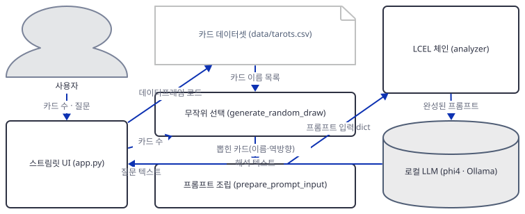
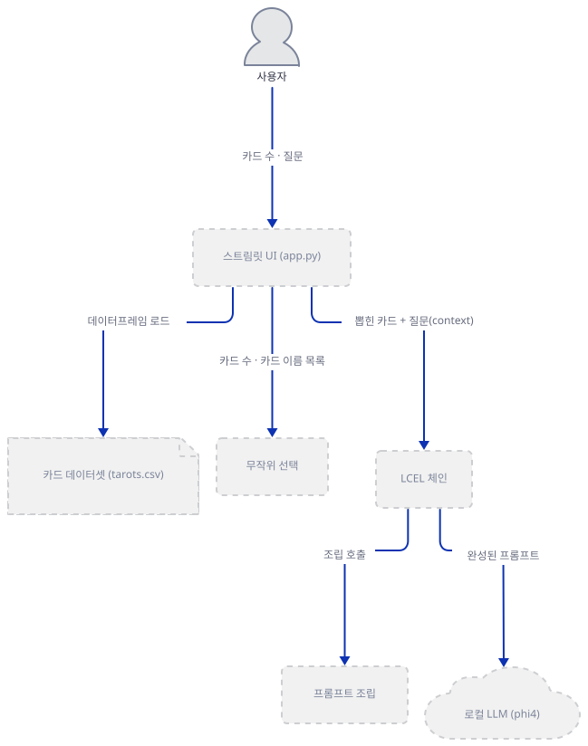
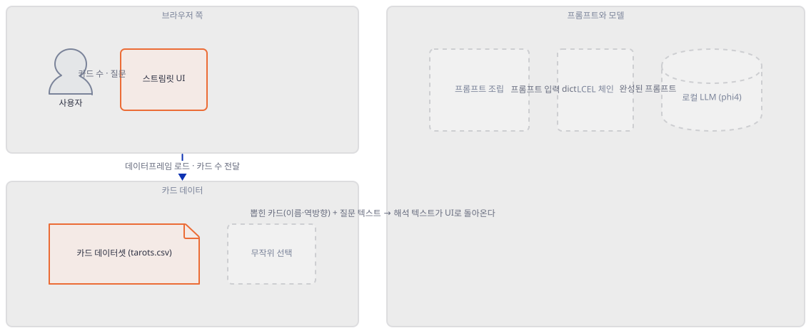
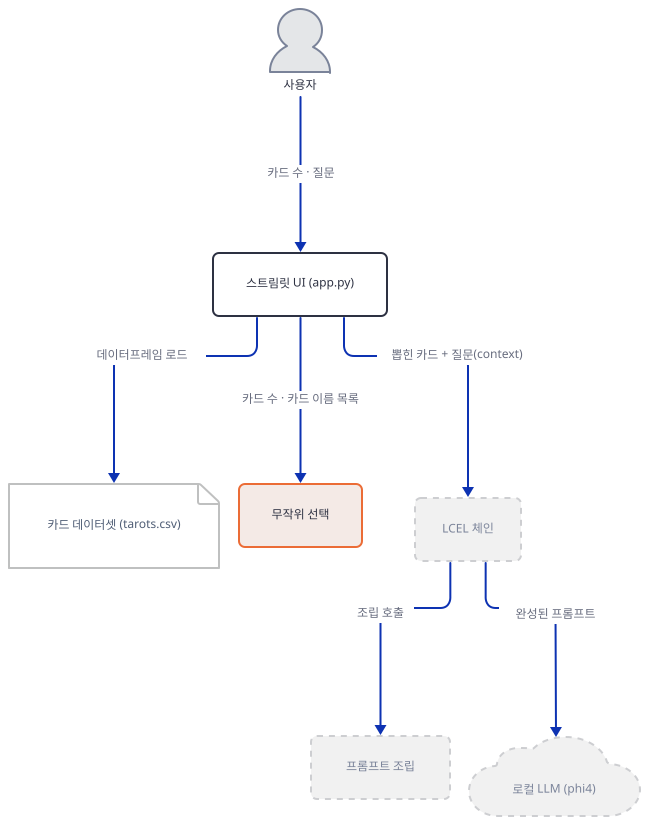
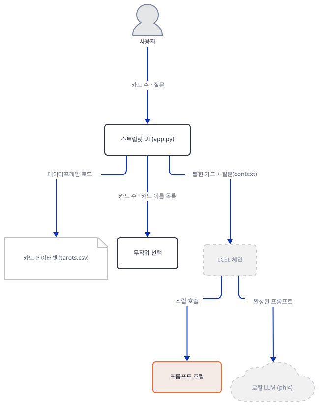
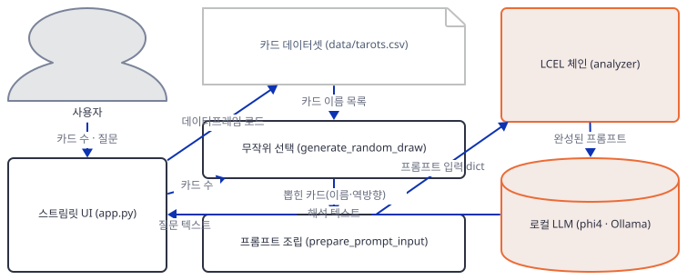
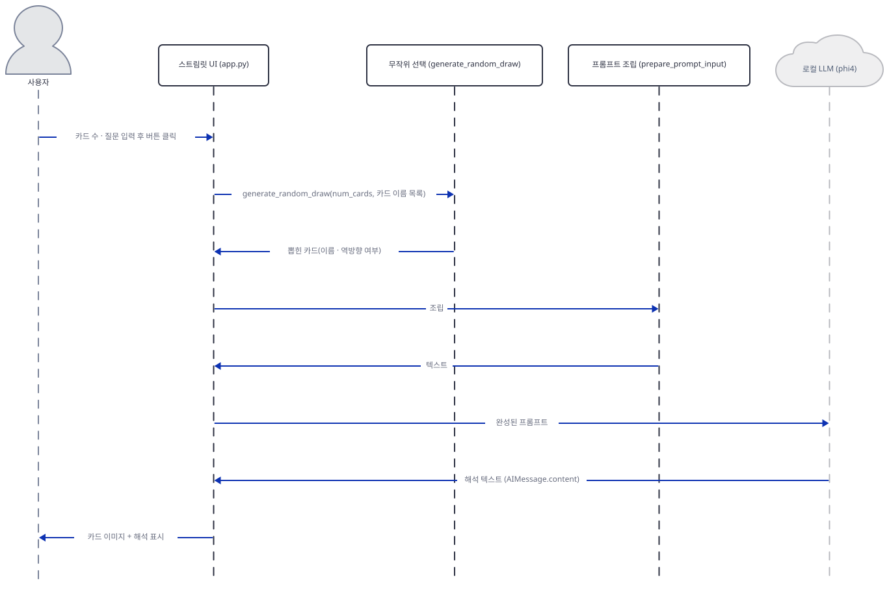

# Day 046 · ✨ The Magician IA Reader: AI-Powered NLP & Tarot Insights ✨

> 볼륨 4 💬 Chat with X · 난이도 ★☆☆ · 예상 소요 75분 · API 비용 무료(로컬 Ollama, `phi4` 모델 다운로드에 9.1GB 디스크 필요 — 이 문서는 받지 않음) · 원본 앱: `advanced_llm_apps/chat-with-tarots`

## 오늘 만들 것

"💬 Chat with X" 볼륨의 마지막 날이자, 이 볼륨에서 세 가지가 동시에 다른 앱입니다. 첫째, 폴더 위치부터 다릅니다 — 다른 일곱 날이 모두 사는 `chat_with_X_tutorials/` 밑이 아니라 `advanced_llm_apps/chat-with-tarots`에 홀로 있습니다. 둘째, 지금까지 이 볼륨을 다섯 번 지배한 `embedchain`이 코드 어디에도 없습니다(`requirements.txt` 직접 확인) — 대신 `langchain`과 `langchain-ollama`로 파이프라인을 직접 손으로 조립합니다. 셋째, 웹에서 아무것도 긁어오지 않습니다 — 타로 카드 78장(메이저 아르카나 22장 + 마이너 아르카나 56장)의 이름·정방향/역방향 의미·상징 설명을 담은 `data/tarots.csv`를 리포에 그대로 들고 다닙니다. 이 세 가지가 이 앱을 Day 039~045가 부딪힌 문제들로부터 자유롭게 해주는지, 아니면 다른 문제로 바꿔치기하는지를 오늘 직접 확인합니다 — 결론부터 말하면 `chroma-hnswlib` 네이티브 휠 문제는 애초에 발생하지 않지만(embedchain·chromadb 의존성이 없으므로), `requirements.txt`에 버전 하한이 전혀 없다는 같은 원인이 이번에는 다른 벽 — 오늘 기준 최신 `langchain`(1.4.2)에서 `langchain.prompts` 서브모듈 자체가 사라져 앱이 임포트 단계에서 바로 죽는 문제 — 를 만듭니다(직접 확인, Step 1). 그리고 질문마다 벡터스토어를 통째로 재구축하던 Day 039의 재수집 함정도 없습니다 — 애초에 임베딩도, 벡터 검색도 없기 때문입니다. 이 앱이 "지식베이스"라고 부르는 것은 CSV 78행 전체를 딕셔너리로 옮겨 둔 것이 전부이고, 질문이 들어오면 `generate_random_draw()`가 그 딕셔너리의 카드 이름 중 `num_cards`장을 **`random.sample`로 순수하게 무작위 선택**합니다 — 이 함수는 애초에 질문 텍스트를 인자로 받지도 않습니다(직접 확인, Step 3). 뽑힌 카드의 정방향/역방향 의미와 상징 설명 텍스트만 그대로 프롬프트에 붙여넣어(`prepare_prompt_input()`) 로컬 Ollama가 서빙하는 `phi4`(마이크로소프트의 14B 파라미터 모델, 다운로드 9.1GB — ollama.com 라이브러리 페이지로 확인)에게 해석을 요청합니다. 즉 여기엔 임베딩도 유사도 검색도 없습니다 — 질문과 무관하게 뽑힌 카드 몇 장의 사전 정의된 텍스트를 모델에게 던지고 그럴듯한 산문으로 엮어 달라고 시키는 작은 로컬 파이프라인입니다. 카드가 "무엇을 예언한다"는 틀은 이 문서에서 다루지 않습니다 — 오늘의 관심사는 질문과 답 사이에서 정확히 무엇이 선택되고, 무엇이 프롬프트에 실리고, 로컬 모델이 거기에 무엇을 더하는지, 그 기계적인 경로뿐입니다. 완성하면 카드 수(3·5·7)를 고르고 자유 텍스트로 맥락을 적어 "Draw and Analyze"를 누르면, 무작위로 뽑힌 카드 이미지와 `phi4`가 생성한 해석이 함께 표시되는 화면을 로컬에서 띄우게 됩니다. 아래는 완성된 아키텍처입니다.



## 사전 준비

| 서비스/도구 | 용도 | 발급·설치 |
|---|---|---|
| Ollama | 로컬에서 `phi4`를 서빙하는 데몬(`http://localhost:11434`) | https://ollama.com 에서 설치, 백그라운드 데몬으로 상시 실행됨 |
| `phi4` 모델 | 이 앱이 유일하게 쓰는 채팅 모델 — 14B 파라미터, 다운로드 9.1GB(ollama.com 라이브러리 페이지로 확인, 이 문서는 받지 않음) | `ollama pull phi4` (앱 자체 README도 이 명령을 정확히 안내함, 직접 확인) |
| langchain 버전 고정 | `requirements.txt`에 버전 하한이 없어 기본 설치는 오늘 기준 langchain 1.4.2로 풀리고 `langchain.prompts` 임포트가 깨짐(Step 1에서 직접 확인) | `uv pip install "langchain<1.0"`로 재설치 |
| uv | 가상환경 생성과 패키지 설치 | [공통 사전 준비](../README.md#공통-사전-준비-한-번만) 절 참고 |

## 아키텍처 한눈에 보기

| 컴포넌트 | 역할 | 코드 위치 |
|---|---|---|
| 사용자 | 카드 수·질문 입력, 버튼 클릭 | 코드 없음 (브라우저) |
| 스트림릿 UI (`app.py`) | 화면 구성, CSV 적재, 버튼 클릭 시 파이프라인 전체를 호출 | `advanced_llm_apps/chat-with-tarots/app.py:98-107` |
| 카드 데이터셋 (`data/tarots.csv`) | 78장 전체의 카드명·정방향/역방향 의미·상징 설명을 담은 번들 파일 | `advanced_llm_apps/chat-with-tarots/data/tarots.csv` |
| 무작위 선택 (`generate_random_draw`) | 질문과 무관하게 `num_cards`장을 무작위로 뽑고 카드마다 절반 확률로 역방향 표시 | `advanced_llm_apps/chat-with-tarots/helpers/help_func.py:6-30` |
| 프롬프트 조립 (`prepare_prompt_input`) | 뽑힌 카드의 의미·상징 텍스트를 모아 프롬프트 입력 3종(`card_details`·`context`·`symbolism`)으로 정리 | `advanced_llm_apps/chat-with-tarots/helpers/help_func.py:52-66` |
| LCEL 체인 (`analyzer`) | `RunnableParallel` → 프롬프트 조립 → `PromptTemplate` → `phi4`로 이어지는 파이프라인 | `advanced_llm_apps/chat-with-tarots/app.py:76-84` |
| 로컬 LLM (`phi4` · Ollama) | 완성된 프롬프트를 받아 해석 텍스트(`AIMessage`)를 생성 | `advanced_llm_apps/chat-with-tarots/helpers/help_func.py:69-73` |

## 단계별 진행

### Step 1. 환경 만들기 — 의존성과 임포트가 깨지는 지점

**목적.** `requirements.txt` 6줄(주석 제외)을 설치하고, 이 볼륨을 다섯 번 막았던 `chroma-hnswlib` 네이티브 휠 문제가 정말 없는지, 그리고 대신 무엇이 오늘의 벽인지 확인합니다.

**할 일.**

```bash
cd advanced_llm_apps/chat-with-tarots
uv venv
uv pip install -r requirements.txt
```

`advanced_llm_apps/chat-with-tarots/requirements.txt:1-7`

```text
# Core dependencies
streamlit
pandas
langchain
langchain-core
langchain-ollama
ollama
```

여섯 줄 모두 버전 하한이 없습니다. `embedchain`도 `chromadb`도 요구하지 않으므로(목록에 없음, 직접 확인) 이 볼륨의 다른 날들을 막았던 `chroma-hnswlib` 사전 빌드 wheel 문제는 애초에 발생하지 않습니다 — 이 컴퓨터의 기본 `uv venv`(Python 3.13.3, 직접 확인 — Day 039·043·044와 같은 버전)로 그대로 68개 패키지가 설치됩니다.

직접 확인한 출력(발췌):

```
Resolved 68 packages in 15.14s
Prepared 7 packages in 5.65s
Installed 68 packages in 33.14s
```

핵심 버전(직접 확인): `streamlit 1.64.0`, `pandas 3.0.6`, `langchain 1.4.2`, `langchain-core 1.6.4`, `langchain-ollama 1.1.0`, `ollama 0.6.2`. 그런데 설치가 끝난 뒤 `app.py`의 첫 임포트 줄부터 막힙니다.

`advanced_llm_apps/chat-with-tarots/app.py:1-7`

```python
from langchain.prompts import PromptTemplate
import pandas as pd
from langchain_core.runnables import RunnableParallel, RunnableLambda # Import necessary for LCEL
import random
import streamlit as st
import helpers.help_func as hf
from PIL import Image
```

직접 확인한 출력:

```
Traceback (most recent call last):
  File "<string>", line 1, in <module>
    from langchain.prompts import PromptTemplate; print('langchain.prompts OK')
    ^^^^^^^^^^^^^^^^^^^^^^^^^^^^^^^^^^^^^^^^^^^^
ModuleNotFoundError: No module named 'langchain.prompts'
```

원인을 설치된 패키지 자체에서 직접 확인했습니다: `langchain 1.4.2`의 최상위 패키지에는 `agents`·`chat_models`·`embeddings`·`mcp`·`messages`·`rate_limiters`·`tools`만 남아 있고 `prompts`가 없습니다 — `import langchain`을 하고 `dir(langchain)`을 찍어도 공개 이름이 하나도 없습니다(직접 확인). `PromptTemplate` 클래스 자체는 사라지지 않았습니다 — `from langchain_core.prompts import PromptTemplate`는 그대로 성공합니다(직접 확인). 즉 클래스는 `langchain_core`에 그대로 있는데, `langchain` 1.x가 0.x 시절의 재수출 경로(`langchain.prompts`)를 더 이상 제공하지 않는 것입니다. 깨지는 지점은 정확히 이 한 줄뿐입니다 — `helpers/help_func.py`는 `langchain_ollama`와 표준 라이브러리만 쓰므로 이 문제와 무관하게 그대로 임포트됩니다(직접 확인).

고치는 방법은 Day 039의 "Python 3.11로 다시 만들기"처럼 환경을 예전 조합으로 고정하는 것입니다 — 이번엔 Python 버전이 아니라 `langchain` 자체를 0.x로 내립니다.

```bash
uv pip install "langchain<1.0"
```

직접 확인한 출력:

```
Resolved 65 packages in 300ms
Prepared 3 packages in 36.57s
Uninstalled 4 packages in 5.17s
Installed 7 packages in 33.20s
 + greenlet==3.5.6
 - langchain==1.4.2
 + langchain==0.3.30
 - langchain-core==1.6.4
 + langchain-core==0.3.86
 - langchain-ollama==1.1.0
 + langchain-ollama==0.3.10
 + langchain-text-splitters==0.3.11
 - packaging==26.3
 + packaging==25.0
 + sqlalchemy==2.0.54
```

`langchain`·`langchain-core`·`langchain-ollama` 세 패키지가 한꺼번에 0.3.x대로 내려가면서 `langchain-text-splitters`·`greenlet`·`sqlalchemy`가 새로 따라 들어옵니다. 이 상태에서 `python -m py_compile`은 처음부터 끝까지 문제없이 통과한다는 점도 짚어 둘 만합니다 — `py_compile`은 문법만 검사할 뿐 `import`문을 실행하지 않으므로, 이런 런타임 임포트 실패는 문법 검사로는 절대 잡히지 않습니다.



**확인.**

```bash
uv run --no-project python -m py_compile app.py helpers/help_func.py && echo compiled
```

```
compiled
```

```bash
uv run --no-project python -c "import streamlit, pandas; from langchain.prompts import PromptTemplate; from langchain_core.runnables import RunnableParallel, RunnableLambda; from langchain_ollama import ChatOllama; import ollama; from PIL import Image; print('ALL IMPORTS OK')"
```

```
ALL IMPORTS OK
```

### Step 2. CSV 적재 — 78장 전체를 카드 사전으로

**목적.** "지식베이스"라 불리는 것의 정체 — 78장 전체를 걸러내지 않고 통째로 옮겨 둔 딕셔너리 — 를 확인하고, 이 앱에는 애초에 재수집·재임베딩 비용이 존재하지 않는다는 것을 시간으로 확인합니다.

**할 일.**

`advanced_llm_apps/chat-with-tarots/app.py:12-16`

```python
csv_file_path = 'data/tarots.csv'
try:
    # Read CSV file
    df = pd.read_csv(csv_file_path, sep=';', encoding='latin1')
    print(f"CSV dataset loaded successfully: {csv_file_path}. Number of rows: {len(df)}")
```

`data/tarots.csv`는 세미콜론으로 구분된 79행(헤더 1 + 데이터 78)이고, `card` 열 값은 사람이 읽는 카드 이름이 아니라 이미지 파일명입니다 — `00-thefool.jpg`부터 `77-kingofpentacles.jpg`까지, 메이저 아르카나 22장과 마이너 아르카나 4수트 × 14장(에이스~10, 페이지·나이트·퀸·킹) 56장을 합친 표준 78장 그대로입니다(직접 확인: 78행 전체 나열). `encoding='latin1'`로 읽지만 이 파일에는 비-ASCII 바이트가 한 바이트도 없어(직접 확인) `utf-8`로 읽어도 결과는 같습니다 — latin1을 고른 이유는 코드에 남아 있지 않습니다. 이어서 78행 전체가 예외 없이 딕셔너리로 옮겨집니다.

`advanced_llm_apps/chat-with-tarots/app.py:39-47`

```python
    # Create card meanings dictionary with cleaned data
    card_meanings = {}
    for _, row in df.iterrows():
        card_name = row['card'].strip()
        card_meanings[card_name] = {
            'upright': str(row['upright']).strip() if pd.notna(row['upright']) else '',
            'reversed': str(row['reversed']).strip() if pd.notna(row['reversed']) else '',
            'symbolism': str(row['symbolism']).strip() if pd.notna(row['symbolism']) else ''
        }
```

필터링도, 임베딩도, 벡터 저장도 없습니다 — `card_meanings`는 78개 카드 전부의 의미·상징 텍스트를 담은 평범한 파이썬 딕셔너리입니다. 이 블록은 `@st.cache_data` 같은 캐시 데코레이터 없이 `app.py` 최상위에 있으므로(직접 확인: 파일 전체에 `@st.cache` 계열 데코레이터가 하나도 없음), Streamlit이 위젯 상호작용마다 스크립트를 처음부터 다시 실행할 때 이 78행 파싱도 매번 다시 일어납니다. Day 039의 재임베딩 함정과 표면적으로 닮았지만 비용이 전혀 다릅니다 — 여기엔 네트워크 호출도, 임베딩 API도 없기 때문입니다. 실제로 걸리는 시간을 재보면:

```
CSV parse + dict build x20: 913.7 ms total, 45.69 ms/run
```

재실행 한 번에 약 46ms — Day 039가 질문마다 뉴스레터 전체를 재수집·재임베딩하는 데 걸리던 시간과는 자릿수가 다릅니다. 이 앱엔 애초에 "다시 채워야 할 벡터스토어"가 없으므로 재수집 함정도 성립하지 않습니다.



**확인.**

```bash
uv run --no-project python -c "
import pandas as pd
df = pd.read_csv('data/tarots.csv', sep=';', encoding='latin1')
print('rows:', len(df))
print('columns:', list(df.columns))
print('first card:', df.iloc[0]['card'], '/ last card:', df.iloc[-1]['card'])
"
```

```
rows: 78
columns: ['card', 'upright', 'reversed', 'symbolism']
first card: 00-thefool.jpg / last card: 77-kingofpentacles.jpg
```

### Step 3. 무작위 선택(`generate_random_draw`) — 질문과 무관한 선택

**목적.** "질문에 맞는 카드를 고른다"는 인상과 달리, 선택 함수가 질문 텍스트를 아예 인자로 받지 않는다는 것을 시그니처로 확인합니다.

**할 일.**

`advanced_llm_apps/chat-with-tarots/helpers/help_func.py:6-30`

```python
def generate_random_draw(num_cards, card_names_dataset):
    """
    Generates a list of dictionaries representing a random draw of cards.

    Args:
        num_cards (int): The number of cards to include in the draw (3, 5, or 7).
        card_names_dataset (list): A list of strings containing the names of the available cards in the dataset.

    Returns:
        list: A list of dictionaries, where each dictionary has the key "name" (the name of the drawn card)
              and an optional "is_reversed" key (True if the card is reversed, otherwise absent).
    """
    if num_cards not in [3, 5, 7]:
        raise ValueError("The number of cards must be 3, 5, or 7.")

    drawn_cards = []
    drawn_cards_sample = random.sample(card_names_dataset, num_cards)

    for card_name in drawn_cards_sample:
        card = {"name": card_name}
        if random.choice([True, False]):
            card["is_reversed"] = True
        drawn_cards.append(card)

    return drawn_cards
```

인자는 `num_cards`와 `card_names_dataset` 둘뿐입니다 — 질문(`context_question`)은 이 함수 안 어디에도 들어오지 않습니다. 선택은 표준 라이브러리 `random.sample`로 전체 78장 중 `num_cards`장을 비복원 추출하고, 카드마다 독립적으로 `random.choice([True, False])`를 던져 역방향 여부를 절반 확률로 얹는 것이 전부입니다. `app.py`가 이 함수를 호출하는 자리도 그렇습니다.

`advanced_llm_apps/chat-with-tarots/app.py:101-107`

```python
if st.button("✨ Light your path: Draw and Analyze the Cards."):
    if not context_question:
        st.warning("For a more precise reading, please enter your context or question.")
    else:
        try:
            card_names_in_dataset = df['card'].unique().tolist()
            drawn_cards_list = hf.generate_random_draw(num_cards, card_names_in_dataset)
```

`context_question`은 "비어 있는지"만 검사될 뿐, `generate_random_draw`로는 전달되지 않습니다. 카드 선택은 사용자가 무엇을 물었는지와 완전히 독립입니다.



**확인.**

```bash
uv run --no-project python -c "
import inspect, random
import pandas as pd
import helpers.help_func as hf
print('signature:', inspect.signature(hf.generate_random_draw))
df = pd.read_csv('data/tarots.csv', sep=';', encoding='latin1')
names = df['card'].unique().tolist()
random.seed(7)
print('draw:', hf.generate_random_draw(3, names))
"
```

직접 확인한 출력:

```
signature: (num_cards, card_names_dataset)
draw: [{'name': '41-sixofcups.jpg', 'is_reversed': True}, {'name': '19-thesun.jpg', 'is_reversed': True}, {'name': '50-aceofswords.jpg', 'is_reversed': True}]
```

(시드를 고정했으므로 이 결과는 재현됩니다. 시드를 빼면 실행마다 다른 카드가 나옵니다 — 함수 시그니처에 질문 자리가 없다는 사실 자체는 시드와 무관하게 항상 참입니다.)

### Step 4. 프롬프트 조립(`prepare_prompt_input`) — 모델에 실제로 들어가는 텍스트

**목적.** 뽑힌 카드가 어떤 문자열로 바뀌어 프롬프트에 꽂히는지 — 검색도 재순위화도 없이 그대로 붙여넣기라는 것을 정확한 텍스트로 확인합니다.

**할 일.**

`advanced_llm_apps/chat-with-tarots/helpers/help_func.py:52-66`

```python
def prepare_prompt_input(input_dict, meanings_dict):
    """Prepares the input for the prompt by retrieving card details."""
    card_list = input_dict['cards']
    context = input_dict['context']
    formatted_details = format_card_details_for_prompt(card_list, meanings_dict)
    # Extract and concatenate the symbolism of each card
    symbolisms = []
    for card_info in card_list:
        card_name = card_info['name']
        if card_name in meanings_dict:
            symbolism = meanings_dict[card_name].get('symbolism', '')
            if symbolism:
                symbolisms.append(f"{card_name}: {symbolism}")
    symbolism_str = "\n".join(symbolisms)
    return {"card_details": formatted_details, "context": context, "symbolism": symbolism_str}
```

`format_card_details_for_prompt`(같은 파일)는 카드마다 `card_meanings` 딕셔너리에서 역방향이면 `reversed`, 아니면 `upright` 문자열을 그대로 꺼내 `"Card: {이름} ({방향}) - Meaning: {의미}"` 한 줄로 만듭니다 — 요약도 재작성도 없이 CSV의 원문 그대로입니다. `prepare_prompt_input`은 이렇게 만든 `card_details`, 사용자가 입력한 `context`(가공 없이 그대로), 그리고 카드별 상징 설명을 이어붙인 `symbolism` 세 문자열을 반환하고, 이 셋이 그대로 프롬프트 템플릿의 세 자리를 채웁니다.

`advanced_llm_apps/chat-with-tarots/app.py:63-72`

```python
# --- Define the Prompt Template ---
prompt_analysis = PromptTemplate.from_template("""
Analyze the following tarot cards, based on the meanings provided (also considering if they are reversed):
{card_details}
Pay attention to these aspects:
- Provide a detailed analysis of the meaning of each card (upright or reversed).
- Then offer a general interpretation of the answer based on the cards, linking it to the context: {context}.
- Be mystical and provide information on the interpretation related to the symbolism of the cards, based on the specific column: {symbolism}.
- At the end of the reading, always offer advice to improve or address the situation. Also, base it on your knowledge of psychology.
""")
```

검색이나 유사도 비교가 들어갈 자리는 어디에도 없습니다 — `{card_details}`·`{context}`·`{symbolism}`은 문자열 치환일 뿐입니다.



**확인.** Step 3과 같은 시드로 뽑은 카드 3장을 그대로 프롬프트 입력으로 바꿔 봅니다.

```bash
uv run --no-project python -c "
import random
import pandas as pd
import helpers.help_func as hf
df = pd.read_csv('data/tarots.csv', sep=';', encoding='latin1')
df.columns = df.columns.str.strip().str.lower()
card_meanings = {}
for _, row in df.iterrows():
    card_meanings[row['card'].strip()] = {'upright': row['upright'], 'reversed': row['reversed'], 'symbolism': row['symbolism']}
random.seed(7)
drawn = hf.generate_random_draw(3, df['card'].unique().tolist())
result = hf.prepare_prompt_input({'cards': drawn, 'context': 'Will my career change soon?'}, card_meanings)
print(result['card_details'])
print('keys:', list(result.keys()))
"
```

직접 확인한 출력:

```
Card: 41-sixofcups.jpg (reversed) - Meaning: Living in the past, forgiveness, lacking playfulness, stuck in the past, moving forward.
Card: 19-thesun.jpg (reversed) - Meaning: Inner child, feeling down, overly optimistic, sadness, depression, lack of success, pessimism.
Card: 50-aceofswords.jpg (reversed) - Meaning: Inner clarity, re-thinking an idea, confusion, lack of clarity, misinformation, clouded judgment.
keys: ['card_details', 'context', 'symbolism']
```

CSV의 `reversed` 열 문자열이 그대로, 재작성 없이 나타난다는 것을 확인할 수 있습니다.

### Step 5. 로컬 모델 연결 — LCEL 체인과 `phi4`

**목적.** 조립된 프롬프트가 어떤 파이프라인을 거쳐 어떤 모델로 가는지, 그리고 이 모델을 구성하는 것만으로 다운로드가 시작되지 않는지 확인합니다.

**할 일.**

`advanced_llm_apps/chat-with-tarots/app.py:76-84`

```python
analyzer = (
    RunnableParallel(
        cards=lambda x: x['cards'],
        context=lambda x: x['context']
    )
    | (lambda x: hf.prepare_prompt_input(x, card_meanings))
    | prompt_analysis
    | hf.llm
)
```

`RunnableParallel` 단계는 `analyzer.invoke({"cards": ..., "context": ...})`로 들어오는 입력을 같은 두 키로 그대로 재투영할 뿐 — 실질적으로 아무것도 바꾸지 않는 통과 단계입니다. 임포트해 둔 `RunnableLambda`는 이름 그대로는 코드 어디에서도 호출되지 않습니다(직접 확인: `app.py` 전체에서 `RunnableLambda`는 1번 줄 임포트에만 등장) — 파이프(`|`) 안의 일반 람다를 LCEL이 알아서 `RunnableLambda`로 감싸기 때문에, 있으나 없으나 동작은 같습니다. 체인의 마지막 조각 `hf.llm`이 실제 모델입니다.

`advanced_llm_apps/chat-with-tarots/helpers/help_func.py:68-74`

```python
# --- Configure the LLM model ---
llm = ChatOllama(
    base_url ="http://localhost:11434",
    model = "phi4",
    temperature = 0.8,
)
print(f"\nLLM model '{llm.model}' configured.")
```

모델명은 소스에만 있습니다 — 화면에는 모델 선택 UI가 없고, `phi4` 하나로 고정되어 있습니다. `phi4`는 마이크로소프트의 14B 파라미터 모델로, ollama.com의 `phi4` 라이브러리 페이지(직접 확인)에 따르면 `phi4:latest`/`phi4:14b` 태그 모두 다운로드 9.1GB, 컨텍스트 창 16K입니다. 이 페이지는 최소 RAM을 명시하지 않습니다. Day 040·041이 인용한 것과 같은 출처 — Ollama quickstart 문서의 경험칙(7B→8GB, 13B→16GB, 33B→32GB, 소스로 확인, https://ollama.readthedocs.io/en/quickstart/ ) — 를 적용하면 14B인 `phi4`는 13B 구간에 가장 가까워 16GB가 기준이 됩니다. 문서가 14B를 직접 말하지는 않으므로 이는 외삽입니다(미확인). 이 문서는 `phi4`를 내려받지 않았습니다 — 이 컴퓨터의 `ollama list`로 확인한 로컬 모델 목록에도 없습니다(직접 확인, 아래).

`ChatOllama(...)`를 만드는 것 자체는 데몬과 통신하지 않는다는 것도 소스로 확인했습니다: `langchain-ollama`(1.1.0과, Step 1에서 내려간 0.3.10 양쪽 모두)의 `ChatOllama`는 `validate_model_on_init` 옵션이 있는데 기본값이 `False`입니다 — 즉 이 앱처럼 그 옵션을 켜지 않으면 생성 시점에 Ollama에 어떤 모델이 있는지 묻지도, 없는 모델을 내려받으려 시도하지도 않습니다. 실제로 만들어 봐도 즉시 성공합니다.



**확인.**

```bash
uv run --no-project python -c "
from langchain_ollama import ChatOllama
llm = ChatOllama(base_url='http://localhost:11434', model='phi4', temperature=0.8)
print('validate_model_on_init:', llm.validate_model_on_init)
print('model:', llm.model, '/ temperature:', llm.temperature)
"
```

직접 확인한 출력:

```
validate_model_on_init: False
model: phi4 / temperature: 0.8
```

```bash
ollama list
```

직접 확인한 출력(발췌, `phi4`가 없다는 것이 핵심):

```
NAME                     ID              SIZE      MODIFIED
gemma4:26b               08ae7ec1744b    18 GB     3 weeks ago
llama3.2:latest          a80c4f17acd5    2.0 GB    10 months ago
embeddinggemma:latest    85462619ee72    621 MB    10 months ago
gpt-oss:20b              17052f91a42e    13 GB     10 months ago
```

### Step 6. 화면 표시 — 카드 이미지와 파일명 불일치

**목적.** 뽑힌 카드가 실제로 화면에 어떻게 그려지는지 확인하고, 번들 데이터 자체에 있는 결함 하나를 재현합니다.

**할 일.**

`advanced_llm_apps/chat-with-tarots/app.py:98-99`

```python
num_cards = st.selectbox("🃏 Select the number of cards for your spread (3 for a more focused answer, 7 for a more general overview).)", [3, 5, 7])
context_question = st.text_area("✍️ Please enter your context or your question here. You can speak in natural language.", height=100)
```

`advanced_llm_apps/chat-with-tarots/app.py:111-126`

```python
            cols = st.columns(len(drawn_cards_list))
            for i, card_info in enumerate(drawn_cards_list):
                with cols[i]:
                    # The card_info['name'] from data/tarots.csv is now the direct image filename e.g., "00-thefool.jpg"
                    image_filename = card_info['name']
                    image_path = f"images/{image_filename}"
                    reversed_label = "(R)" if 'is_reversed' in card_info else ""
                    caption = f"{card_info['name']} {reversed_label}"

                    try:
                        img = Image.open(image_path)
                        if card_info.get('is_reversed', False):
                            img = img.rotate(180)
                        st.image(img, caption=caption, width=150)
                    except FileNotFoundError:
                        st.info(f"Symbol: {card_info['name']} {reversed_label} (Image not found at {image_path})")
```

CSV의 `card` 값을 그대로 `images/` 밑 파일명으로 씁니다. `images/` 폴더에는 78개 파일이 있고 그중 77개는 CSV 값과 정확히 일치하지만, 딱 하나가 어긋납니다 — CSV는 `08-strength.jpg`라고 적어 두었는데 실제 파일명은 `08-thestrength.jpg`입니다(직접 확인: 78개 이름을 전부 대조). Strength 카드가 뽑히면 `Image.open`이 `FileNotFoundError`를 던지고, 위 `except` 블록이 이를 잡아 이미지 대신 안내 문구만 보여줍니다 — 죽지는 않지만 78장 중 이 한 장만 그림 없이 나옵니다.


**확인.**

```bash
uv run --no-project python -c "
import os
from PIL import Image
print('images/08-strength.jpg exists:', os.path.exists('images/08-strength.jpg'))
print('images/08-thestrength.jpg exists:', os.path.exists('images/08-thestrength.jpg'))
try:
    Image.open('images/08-strength.jpg')
except FileNotFoundError as e:
    print('FileNotFoundError:', e)
"
```

```
images/08-strength.jpg exists: False
images/08-thestrength.jpg exists: True
FileNotFoundError: [Errno 2] No such file or directory: 'images/08-strength.jpg'
```

화면 자체도 헤드리스로 띄워 확인합니다 — 카드 수·질문 입력창까지는 버튼을 누르지 않아도 그려집니다.

```bash
uv run --no-project streamlit run app.py --server.headless true
```

다른 터미널에서:

```bash
curl -s -o /dev/null -w "%{http_code}\n" http://localhost:8501
```

```
200
```

(HTTP 200은 직접 확인. 이 앱은 API 키 입력 게이트가 없어 화면 전체가 처음부터 그려집니다 — 다만 "Draw and Analyze" 버튼을 실제로 누르는 것까지는 이 문서에서 재현하지 않았습니다, `phi4`를 내려받지 않았기 때문입니다.)

### Step 7. 실행과 예외 처리

**목적.** 버튼을 누른 뒤의 전체 흐름과, 모델 호출이 실패하면 화면에 정확히 무엇이 뜨는지 확인합니다.

**할 일.**

`advanced_llm_apps/chat-with-tarots/app.py:128-136`

```python
            st.markdown("---")
            with st.spinner("🔮 Unveiling the meanings..."):
                analysis_result = analyzer.invoke({"cards": drawn_cards_list, "context": context_question})
                st.subheader("📜 The Interpretation:")
                st.write(analysis_result.content)

        except Exception as e:
            st.error(f"An error has occurred: {e}")
            st.error(f"Error details: {e}")
```

`analyzer.invoke(...)`부터 카드 표시까지가 하나의 `try` 블록 안에 있고(101번 줄부터), Day 005의 `asyncio.gather`나 Day 039·042의 `add`/`chat` 호출과 달리 이 앱은 예외를 잡습니다 — 다만 잡은 뒤 `st.error(f"...{e}")`를 두 번 연달아 호출하는데, 두 메시지 모두 같은 `{e}`를 담습니다. 문구만 다를 뿐("An error has occurred" / "Error details") 실제 내용은 동일한 오류가 화면에 두 번 나타난다는 뜻입니다. `phi4`를 내려받지 않았으므로 실제 실패는 재현하지 않고, 대신 존재하지 않는 포트로 향하는 `ChatOllama`를 만들어 같은 `Exception` 처리 경로를 안전하게 재현합니다 — 진짜 데몬이나 모델은 전혀 필요 없습니다.


**확인.**

```bash
uv run --no-project python -c "
from langchain_ollama import ChatOllama
llm = ChatOllama(base_url='http://localhost:1', model='phi4', temperature=0.8)
try:
    llm.invoke('hello')
except Exception as e:
    print('EXCEPTION TYPE:', type(e).__name__)
    print('EXCEPTION TEXT:', str(e)[:200])
"
```

직접 확인한 출력:

```
EXCEPTION TYPE: ConnectError
EXCEPTION TEXT: [WinError 10061] 대상 컴퓨터에서 연결을 거부했으므로 연결하지 못했습니다
```

(이 컴퓨터에서 연결 실패로 판정 나기까지 2분 가까이 걸렸습니다 — httpx 내부 재시도 때문으로 보이며 실행마다 달라질 수 있습니다. 이 `str(e)` 값이 그대로 `st.error()`에 두 번 표시될 문구입니다.)

## 요청 한 건이 흐르는 과정



사용자가 카드 수와 질문을 입력하고 버튼을 누르면, UI는 먼저 `generate_random_draw(num_cards, 카드 이름 목록)`으로 질문과 무관하게 카드를 뽑습니다. 뽑힌 카드(이름과 역방향 여부)는 `prepare_prompt_input`으로 넘어가 CSV에 있던 의미·상징 텍스트 그대로 `card_details`·`symbolism` 문자열이 되고, 사용자의 질문은 가공 없이 `context`로 얹힙니다. 이 세 문자열이 `PromptTemplate`을 채우면 LCEL 체인이 완성된 프롬프트를 `phi4`에 보내고, 돌아온 해석 텍스트(`AIMessage.content`)를 UI가 카드 이미지와 함께 화면에 표시합니다. 이 그림은 한 번의 성공 경로만 그렸습니다 — 실제로는 `data/tarots.csv` 적재(Step 2)가 버튼 클릭 여부와 무관하게 스크립트 재실행마다 먼저 일어나고, `phi4`를 내려받지 않아 이 시퀀스 전체를 처음부터 끝까지 실제로 재현하지는 못했습니다. 각 구간은 Step 1~7에서 소스 코드와 안전한 직접 호출로 개별 확인한 것입니다.

## 실행 체크리스트

- [ ] `uv venv`로 만든 환경에 `requirements.txt`를 설치했고, 기본 설치는 `langchain.prompts` 임포트가 깨진다는 것과 `uv pip install "langchain<1.0"`로 고쳐진다는 것을 확인했다
- [ ] 이 앱은 `embedchain`·`chromadb`를 쓰지 않아 이 볼륨의 네이티브 휠 문제가 애초에 없다는 것을 이해했다
- [ ] `data/tarots.csv` 78행이 표준 타로 78장(메이저 22 + 마이너 56) 전체라는 것을 확인했다
- [ ] `generate_random_draw`의 시그니처에 질문 인자가 없다는 것 — 카드 선택이 질문과 무관한 순수 난수라는 것 — 을 직접 확인했다
- [ ] `prepare_prompt_input`이 만드는 `card_details`·`context`·`symbolism`이 그대로 프롬프트에 꽂힌다는 것을 확인했다
- [ ] `phi4`가 14B·9.1GB 모델이며 이 컴퓨터에는 받아 있지 않다는 것을 `ollama list`로 확인했다
- [ ] `ChatOllama` 생성이 `validate_model_on_init=False` 기본값 덕분에 데몬과 통신하지 않는다는 것을 확인했다
- [ ] 헤드리스로 서버를 띄우고 `http://localhost:8501`에서 200을 확인했다
- [ ] `08-strength.jpg` 파일명 불일치로 Strength 카드가 뽑히면 이미지 대신 안내 문구가 뜬다는 것을 재현했다
- [ ] 모델 호출이 실패하면 같은 오류 메시지가 `st.error`로 두 번 표시된다는 것을 소스와 안전한 재현으로 확인했다

## 문제 해결

| 증상 | 원인 | 해결 |
|---|---|---|
| `python -c "from langchain.prompts import PromptTemplate"`가 `ModuleNotFoundError: No module named 'langchain.prompts'`로 실패 | `requirements.txt`에 버전 하한이 없어 기본 설치가 `langchain 1.4.2`로 풀리는데, 이 버전의 최상위 패키지가 `prompts` 서브모듈을 더 이상 재수출하지 않는다(직접 확인: 설치된 패키지 내용) | `uv pip install "langchain<1.0"`로 재설치(`langchain 0.3.30`대로 하향, 직접 확인) |
| Strength 카드가 뽑히면 이미지 대신 "Symbol: 08-strength.jpg ... (Image not found ...)" 안내만 뜸 | `data/tarots.csv`의 카드명은 `08-strength.jpg`인데 실제 이미지 파일명은 `08-thestrength.jpg`다(직접 확인, 78개 중 유일한 불일치) | 이 시리즈 방침상 리포의 코드·데이터는 고치지 않는다. 직접 고친다면 이미지 파일명을 `08-strength.jpg`로 바꾸거나 CSV 값을 `08-thestrength.jpg`로 맞추면 된다 |
| Ollama가 꺼져 있거나 `phi4`가 없을 때 버튼을 누르면 같은 오류 문구가 화면에 두 번 뜸 | `except Exception as e:` 블록이 `st.error(f"...{e}")`를 두 번 호출하는데 둘 다 같은 `{e}`를 담는다(소스로 확인, `app.py:134-136`) | 오류 자체는 `ollama serve`를 실행하고 `ollama pull phi4`로 모델을 받아야 해결된다 — 중복 표시는 이 앱의 특징일 뿐 조치가 필요한 오류는 아니다 |

## 더 해보기

- 이 앱에는 `@st.cache_data`/`@st.cache_resource`/`session_state`가 전혀 없습니다(직접 확인) — `card_meanings`와 `analyzer` 체인을 세션당 한 번만 만들도록 캐싱을 추가해 보고, 재실행마다 46ms씩 반복되던 CSV 파싱이 사라지는지 확인해보기
- `advanced_llm_apps/chat-with-tarots/helpers/help_func.py:68-74`의 `ChatOllama` 설정에 `format="json"`을 추가해, 자유 산문 대신 카드별 필드(이름·의미·조언)로 구조화된 응답을 받아보기
- `images/08-strength.jpg` 파일명 불일치를 실제로 고쳐보고(`08-thestrength.jpg`를 리네임하거나 CSV 값을 수정), Strength 카드가 뽑혔을 때 이미지가 정상적으로 뜨는지 확인해보기

## 다음 날 예고

[Day 047 · 🦙 Local RAG Agent](../day047-local-rag-agent/README.md) — 오늘로 "💬 Chat with X" 볼륨이 끝납니다. 내일부터 시작하는 "📀 RAG" 볼륨은 오늘과 정반대로, 실제 임베딩과 벡터 유사도 검색을 갖춘 로컬 RAG 파이프라인부터 다룹니다.
