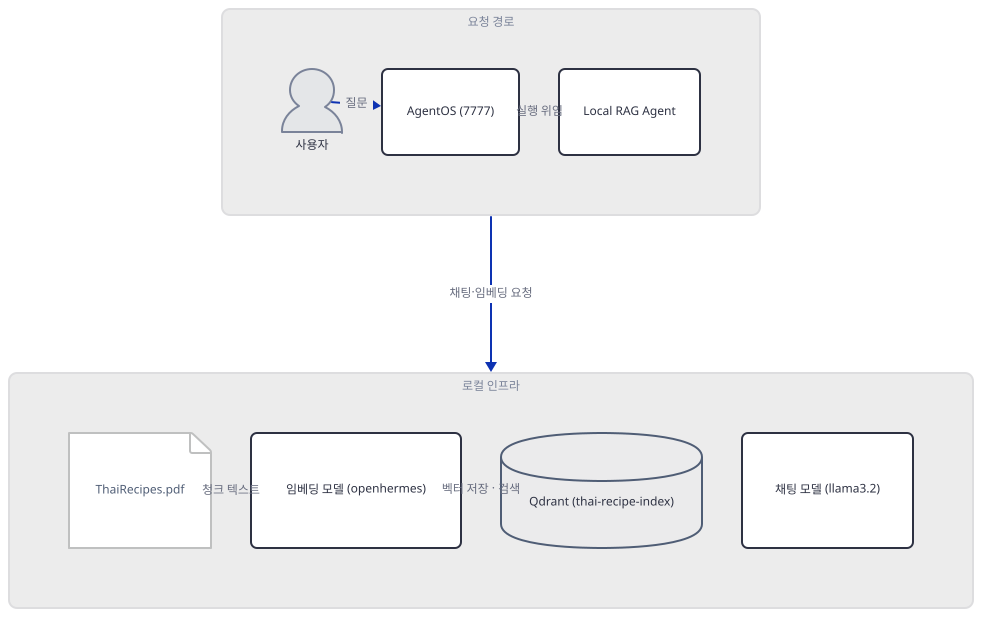
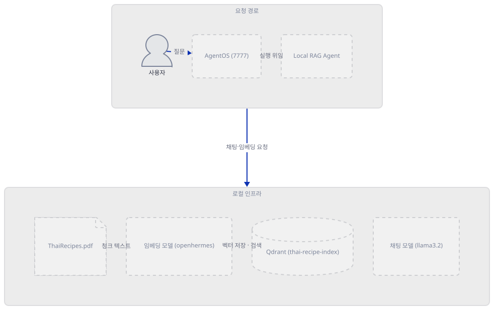
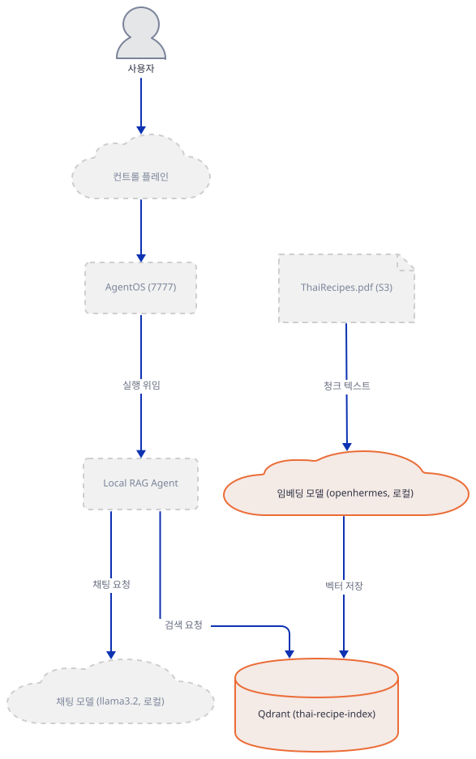
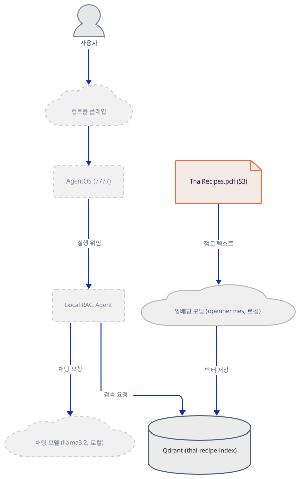
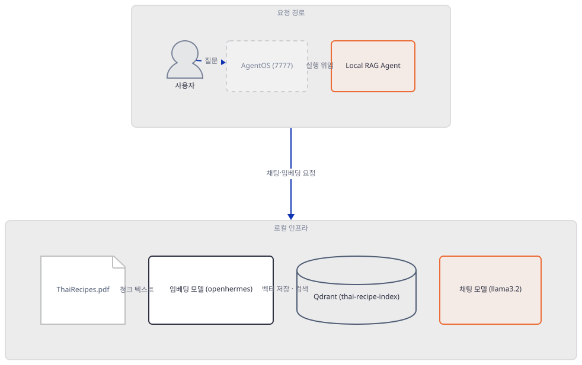
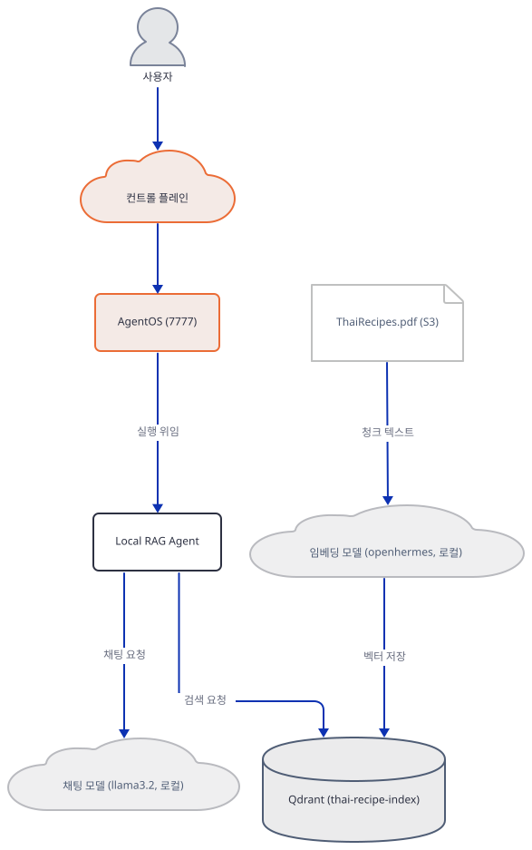
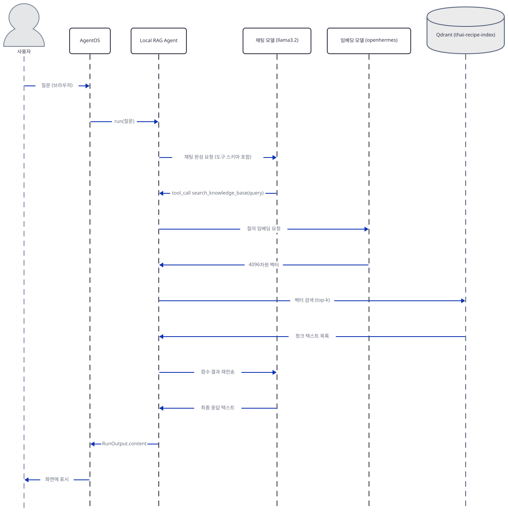

# Day 047 · 🦙 Local RAG Agent

> 볼륨 5 📀 RAG · 난이도 ★★☆ · 예상 소요 75분 · API 비용 무료(완전 로컬 — Qdrant는 Docker, Ollama는 데몬 자체가 무료. 다만 임베딩 모델 openhermes를 실제로 받으면 디스크 4.1GB 필요, Step 2에서 다룹니다) · 원본 앱: `rag_tutorials/local_rag_agent`

## 오늘 만들 것

오늘부터 24일간 이어지는 "📀 RAG" 볼륨을 엽니다. 지난 볼륨에서 Day 040의 `chat_arxiv.py`는 앱 자체 README가 스스로를 "RAG application"이라 불렀지만 실제로는 검색-후-원문통째로-전달이었고, Day 046의 타로 앱은 임베딩도 유사도 검색도 없이 질문과 무관한 무작위 카드 선택이었습니다 — 둘 다 임베딩과 벡터 유사도 검색을 하지 않았습니다(각 날짜의 README로 확인). 오늘의 42줄은 다릅니다. 여기서 "검색"은 문자 그대로의 뜻으로 쓰입니다: `ThaiRecipes.pdf`가 pypdf로 텍스트가 되고, agno의 기본 청크 전략(5000자, 겹침 없음)으로 조각나고, 각 조각이 Ollama의 `openhermes` 모델을 거쳐 4096차원 벡터가 되어 Qdrant라는 별도 벡터 데이터베이스 서버에 원문 텍스트와 함께 저장됩니다. 질문이 들어오면 같은 임베딩 모델이 질문도 벡터로 바꾸고, Qdrant가 코사인 유사도로 가장 가까운 조각들을 찾아 돌려주며, 그 텍스트가 `llama3.2` 모델이 답을 만들 때 쓸 문맥이 됩니다. `requirements.txt` 단 4줄(`agno>=2.2.10`, `qdrant-client`, `ollama`, `pypdf`)이 이 볼륨 24일 내내 되풀이될 네 가지 역할 — 에이전트 프레임워크, 벡터 데이터베이스, 로컬 모델 실행기, 문서 리더 — 을 그대로 보여줍니다. Day 038이 똑같은 `agno>=2.2.10` 하한에서 겪은 일이 오늘도 반복됩니다: 실제로 설치하면 agno 3.0.10이 풀리고(직접 확인), `Ollama` 모델 클래스의 import 사슬이 여전히 `openai` 패키지를 요구하며(Day 037과 같은 원인), 웹 서빙 계층 전체가 `agno[os]` extra 뒤로 옮겨져 있습니다. 게다가 이 코드가 부르는 `knowledge_base.add_content(url=...)`라는 메서드 자체가 오늘의 agno에는 없습니다 — `insert`로 이름이 바뀌었습니다(직접 확인). Qdrant는 인프로세스 라이브러리가 아니라 `http://localhost:6333/`으로 접속하는 별도 서버 프로세스이고(소스로 확인 — `":memory:"`나 `path=` 같은 인프로세스 옵션이 있지만 이 코드는 쓰지 않습니다), 이 문서는 그 서버를 띄우지 않으므로 `Knowledge(vector_db=vector_db)`를 만드는 순간부터 연결 거부 오류로 멈춥니다(직접 확인) — 서버가 떠 있었더라도 바로 다음 줄의 이름-바뀐 메서드에서 다시 멈췄을 것입니다. 반대로 채팅 모델 `llama3.2`는 이미 이 컴퓨터에 받아져 있어(2.0GB) 실제로 호출해 "2 + 2 = 4."라는 답을 받았습니다(직접 확인) — 임베딩 모델 `openhermes`(7B, 4.1GB)는 받지 않았습니다. 완성하면 AgentOS가 띄우는 웹 UI에서 Thai 레시피에 대해 물어보는 화면을 보게 됩니다. 아래는 완성된 아키텍처입니다.



## 사전 준비

| 서비스/도구 | 용도 | 발급·설치 |
|---|---|---|
| Qdrant (Docker) | 벡터 저장소 서버, REST로 `http://localhost:6333/` 접속 | `docker pull qdrant/qdrant && docker run -p 6333:6333 qdrant/qdrant` (이 문서는 띄우지 않음) |
| Ollama | `llama3.2`(채팅)·`openhermes`(임베딩) 두 로컬 모델을 서빙하는 데몬 | https://ollama.com/download 설치 후 `ollama pull llama3.2`(이미 있으면 생략)·`ollama pull openhermes`(이 문서는 받지 않음, 4.1GB) |
| uv | 가상환경 생성과 패키지 설치 | [공통 사전 준비](../README.md#공통-사전-준비-한-번만) 절 참고 |
| 인터넷 연결 | PyPI 설치, ThaiRecipes.pdf 다운로드(공개 S3) | 별도 설치 없음 |

## 아키텍처 한눈에 보기

| 컴포넌트 | 역할 | 코드 위치 |
|---|---|---|
| 사용자 | 브라우저로 AgentOS 웹 UI(포트 7777)에 접속해 질문 | 코드 없음 (브라우저) |
| AgentOS 웹 서버 | agent를 FastAPI 앱으로 감싸 웹으로 서빙 | `rag_tutorials/local_rag_agent/local_rag_agent.py:37-38`, `rag_tutorials/local_rag_agent/local_rag_agent.py:41-42` |
| Local RAG Agent | `llama3.2` 모델과 지식 베이스를 묶은 agno `Agent`, 검색 도구 호출 여부를 스스로 판단 | `rag_tutorials/local_rag_agent/local_rag_agent.py:30-34` |
| 채팅 모델 (llama3.2, Ollama) | 최종 답변 생성 | `rag_tutorials/local_rag_agent/local_rag_agent.py:32` |
| 임베딩 모델 (openhermes, Ollama) | 청크·질의 텍스트를 4096차원 벡터로 변환 | `rag_tutorials/local_rag_agent/local_rag_agent.py:16` (기본 모델 id는 소스로 확인) |
| ThaiRecipes.pdf | 지식 베이스에 적재되는 원본 문서(공개 S3 URL) | `rag_tutorials/local_rag_agent/local_rag_agent.py:25-27` |
| Qdrant (thai-recipe-index) | 청크 벡터와 원문 텍스트를 저장·검색하는 벡터 저장소 서버 | `rag_tutorials/local_rag_agent/local_rag_agent.py:13-17` |

## 단계별 진행

### Step 1. 환경 만들기 — agno 버전 드리프트 두 가지

**목적.** 격리된 가상환경에 4줄짜리 `requirements.txt`를 설치하고, 오늘 실제로 풀리는 agno 버전에서 이 42줄이 곧바로 동작하는지 확인합니다.

**할 일.**

```bash
cd rag_tutorials/local_rag_agent
uv venv
uv pip install -r requirements.txt
```

(pip 대안: `python -m venv .venv && source .venv/bin/activate && pip install -r requirements.txt`. Windows PowerShell은 활성화만 `.venv\Scripts\Activate.ps1`로 바꿉니다.)

이 저장소는 루트에 `pyproject.toml`이 있어 `uv run`이 방금 만든 환경 대신 루트의 `.venv`를 쓰므로, 이후 `uv run` 명령에는 모두 `--no-project`를 붙입니다. `uv venv`는 이 환경의 기본값인 Python 3.13.3을 그대로 골랐고(직접 확인), 4개 의존성 모두 이 버전에 맞는 wheel이 있어 별도로 3.11을 강제할 필요가 없었습니다.

`rag_tutorials/local_rag_agent/requirements.txt:1-4`

```text
agno>=2.2.10
qdrant-client
ollama
pypdf
```

(4줄, 마지막 줄에 개행이 없어 `wc -l`은 3으로 셉니다.) 이 문서를 작성하며 설치했을 때는 **agno 3.0.10**, **qdrant-client 1.19.1**, **ollama(파이썬 클라이언트) 0.6.2**, **pypdf 6.19.0**이 받아졌고, 부수적으로 `agnoctl 0.2.1`을 포함해 총 41개 패키지가 설치됐습니다(직접 확인 — 넷 다 버전 고정이 느슨해 2026-09-23 기준 최신입니다. agno 버전은 Day 037·038·040과 같습니다). `py_compile`은 통과합니다.

```bash
uv run --no-project python -m py_compile local_rag_agent.py && echo compiled
```

```
compiled
```

그런데 파일을 그대로 실행하면 두 번째 import 줄(3번째 줄)에서 막힙니다.

```bash
uv run --no-project python local_rag_agent.py
```

직접 확인한 출력(발췌):

```
  File "...\local_rag_agent\local_rag_agent.py", line 3, in <module>
    from agno.models.ollama import Ollama
  ...
  File "...\agno\models\openai\chat.py", line 31, in <module>
    raise ImportError("`openai` not installed. Please install using `pip install openai`")
ImportError: `openai` not installed. Please install using `pip install openai`
```

agno 3.0.10의 `agno.models.ollama` 패키지는 `Ollama` 클래스만이 아니라 OpenAI 호환 `OllamaResponses`도 함께 import하는데, 이 클래스가 `agno.models.openai`를 거쳐 결국 `openai` 패키지를 요구합니다 — Day 037이 같은 앱 구조에서 이미 확인한 것과 같은 원인입니다. 이 하나를 설치해도 이 파일의 마지막 import 줄(7번째 줄, `agno.os`)에서 또 막힙니다.

```bash
uv pip install openai
uv run --no-project python local_rag_agent.py
```

```
ModuleNotFoundError: No module named 'fastapi'
```

agno 3.0.10부터 `AgentOS`가 쓰는 웹 서빙 계층(`fastapi`·`uvicorn`·`python-multipart`·`websockets`·`sqlalchemy` 등)이 `agno[os]` extra 뒤로 옮겨졌습니다(소스로 확인 — `importlib.metadata.requires('agno')`로 본 `extra == "os"` 목록). 두 문제를 한 번에 해결하는 설치는 다음과 같습니다.

```bash
uv pip install openai "agno[os]"
```

**그림.**



**확인.** 위 설치까지 마치면 이 파일이 쓰는 6개 import가 모두 성공합니다(실행 자체가 끝까지 가는지는 Step 6에서 다룹니다).

```bash
uv run --no-project python -c "from agno.agent import Agent; from agno.models.ollama import Ollama; from agno.knowledge.knowledge import Knowledge; from agno.vectordb.qdrant import Qdrant; from agno.knowledge.embedder.ollama import OllamaEmbedder; from agno.os import AgentOS; print('ALL IMPORTS OK')"
```

```
ALL IMPORTS OK
```

### Step 2. 벡터 저장소와 임베더 — Qdrant는 서버, 인프로세스가 아니다

**목적.** `Qdrant(...)`가 실제로 어디에 접속하는지, 그리고 `OllamaEmbedder()`의 기본 모델과 차원이 무엇인지 확인합니다.

**할 일.**

`rag_tutorials/local_rag_agent/local_rag_agent.py:9-17`

```python
# Define the collection name for the vector database
collection_name = "thai-recipe-index"

# Set up Qdrant as the vector database with the embedder
vector_db = Qdrant(
    collection=collection_name,
    url="http://localhost:6333/",
    embedder=OllamaEmbedder()
)
```

`url="http://localhost:6333/"`는 REST API로 접속하는 별도 서버를 가리킵니다. agno의 `Qdrant` 래퍼는 인프로세스 옵션도 지원합니다 — `location=":memory:"`(메모리 내 인스턴스)나 `path=`(로컬 디스크 파일 기반)를 쓸 수 있다고 생성자 문서가 밝히지만(소스로 확인, `agno/vectordb/qdrant/qdrant.py`), 이 42줄은 그중 무엇도 쓰지 않고 `url=`만 넘깁니다 — 즉 앱 자체 README가 안내하는 `docker run -p 6333:6333 qdrant/qdrant`처럼 독자가 직접 띄워야 하는 진짜 서버 프로세스입니다. `embedder=OllamaEmbedder()`는 인자 없이 만들어졌는데, 이 클래스의 기본값은 `id: str = "openhermes"`, `dimensions: int = 4096`입니다(소스로 확인, `agno/knowledge/embedder/ollama.py`) — 앱 자체 README의 "`ollama pull openhermes`" 안내와 정확히 일치합니다.

**그림.**



**확인.** Qdrant를 띄우지 않은 채(이 문서는 띄우지 않습니다) 다음 줄까지 실제로 실행하면, 임베더 기본값이 그대로인 것과 함께 연결 거부 오류를 직접 봅니다 — `Knowledge`는 생성 시점에 곧바로 `vector_db.exists()`를 호출해 컬렉션 존재 여부를 확인하기 때문입니다(소스로 확인, `agno/knowledge/knowledge.py`의 `__post_init__`).

```bash
uv run --no-project python -c "
from agno.knowledge.knowledge import Knowledge
from agno.vectordb.qdrant import Qdrant
from agno.knowledge.embedder.ollama import OllamaEmbedder
embedder = OllamaEmbedder()
print('embedder id:', embedder.id, '/ dimensions:', embedder.dimensions)
vector_db = Qdrant(collection='thai-recipe-index', url='http://localhost:6333/', embedder=embedder)
knowledge_base = Knowledge(vector_db=vector_db)
"
```

직접 확인한 출력(발췌, 뒷부분):

```
embedder id: openhermes / dimensions: 4096
...
qdrant_client.http.exceptions.ResponseHandlingException: [WinError 10061] 대상 컴퓨터에서 연결을 거부했으므로 연결하지 못했습니다
```

(마지막 줄은 한국어 Windows의 오류 메시지입니다 — 다른 운영체제/언어 설정에서는 문구가 다르고, 리눅스라면 보통 `Connection refused`입니다. 임베더 값은 먼저 출력되고, 그 다음 줄인 `Knowledge(...)`에서 비로소 오류가 납니다.)

### Step 3. 지식 베이스와 문서 적재 — `add_content`가 사라졌다

**목적.** `Knowledge(vector_db=...)`와 `add_content(url=...)`가 오늘의 agno에서 실제로 동작하는지, 그리고 PDF가 실제로 몇 조각으로 쪼개지는지 확인합니다.

**할 일.**

`rag_tutorials/local_rag_agent/local_rag_agent.py:19-27`

```python
# Define the knowledge base
knowledge_base = Knowledge(
    vector_db=vector_db,
)

# Add content to the knowledge base, comment out after the first run to avoid reloading
knowledge_base.add_content(
    url="https://phi-public.s3.amazonaws.com/recipes/ThaiRecipes.pdf"
)
```

agno 3.0.10의 `Knowledge` 클래스에는 `add_content`라는 메서드가 없습니다 — 같은 역할을 `insert(url=..., ...)`가 맡습니다(직접 확인, 아래). `insert`도 `url=` 키워드 인자를 그대로 받으므로 호출 형태 자체는 거의 바뀌지 않았지만, 메서드 이름이 다르면 지금 버전에서는 `AttributeError`로 멈춥니다. 이 줄이 실제로 실행됐다면 무슨 일이 있었을지도 안전하게 확인할 수 있습니다 — pypdf 리더와 기본 청크 전략(`DocumentChunking`, `chunk_size=5000`, `overlap=0`, 소스로 확인 `agno/knowledge/reader/pdf_reader.py`)을 공개 URL의 실제 PDF에 그대로 돌려 보는 것입니다. 모델 호출도 Qdrant 접속도 필요 없는, 순수한 다운로드+파싱입니다.

**그림.**



**확인.** 먼저 메서드 이름이 정말 바뀌었는지, Qdrant 접속 없이 확인합니다(`Qdrant.exists`를 임시로 덮어써 Step 2의 연결 거부를 우회합니다 — 실제 서버에 접속하지 않습니다).

```bash
uv run --no-project python -c "
from agno.knowledge.knowledge import Knowledge
from agno.vectordb.qdrant import Qdrant
from agno.knowledge.embedder.ollama import OllamaEmbedder
Qdrant.exists = lambda self: True
vector_db = Qdrant(collection='thai-recipe-index', url='http://localhost:6333/', embedder=OllamaEmbedder())
kb = Knowledge(vector_db=vector_db)
print('has add_content:', hasattr(kb, 'add_content'))
print('has insert:', hasattr(kb, 'insert'))
kb.add_content(url='https://phi-public.s3.amazonaws.com/recipes/ThaiRecipes.pdf')
"
```

직접 확인한 출력:

```
has add_content: False
has insert: True
AttributeError: 'Knowledge' object has no attribute 'add_content'
```

이어서 같은 공개 PDF를 실제로 내려받아, agno의 실제 리더·청크 클래스로 몇 조각이 되는지 확인합니다.

```bash
uv run --no-project python -c "
import httpx
r = httpx.get('https://phi-public.s3.amazonaws.com/recipes/ThaiRecipes.pdf', timeout=30, follow_redirects=True)
open('ThaiRecipes.pdf', 'wb').write(r.content)
print('bytes:', len(r.content))
from agno.knowledge.reader.pdf_reader import PDFReader
reader = PDFReader()
docs = reader.read('ThaiRecipes.pdf')
print('chunk_size:', reader.chunking_strategy.chunk_size, '/ overlap:', reader.chunking_strategy.overlap)
print('chunks:', len(docs))
print('total chars:', sum(len(d.content) for d in docs))
"
```

직접 확인한 출력:

```
bytes: 653471
chunk_size: 5000 / overlap: 0
chunks: 14
total chars: 17443
```

(이 PDF는 pypdf 기준 정확히 14페이지이고, 어느 페이지도 5000자를 넘지 않아 페이지 1개가 그대로 청크 1개가 됐습니다 — 우연히 1:1이 된 것이지, 청크가 항상 페이지 단위인 것은 아닙니다.)

### Step 4. 로컬 모델과 Agentic RAG — 강제 삽입이 아니라 도구 호출

**목적.** `Agent(...)`가 채팅 모델(`llama3.2`)과 지식 베이스를 어떻게 묶는지, 그리고 `knowledge=`가 매 프롬프트에 문맥을 강제로 끼워넣는 대신 모델이 스스로 판단해 호출하는 도구라는 것을 확인합니다.

**할 일.**

`rag_tutorials/local_rag_agent/local_rag_agent.py:29-34`

```python
# Create the Agent using Ollama's llama3.2 model and the knowledge base
agent = Agent(
    name="Local RAG Agent",
    model=Ollama(id="llama3.2"),
    knowledge=knowledge_base,
)
```

`Ollama(id="llama3.2")`는 `host`도 `api_key`도 넘기지 않습니다. `OLLAMA_API_KEY` 환경변수가 없으면 파이썬 `ollama` 클라이언트의 기본값인 `127.0.0.1:11434`, 즉 독자 자신의 기계로 갑니다(소스로 확인, `agno/models/ollama/chat.py`) — Day 037·040이 같은 클래스에서 이미 확인한 동작입니다. `knowledge=knowledge_base`를 준다고 해서 매 호출마다 검색 결과가 프롬프트에 강제로 끼워지는 것은 아닙니다. `Agent`의 `search_knowledge` 필드가 기본값 `True`일 때, agno는 `search_knowledge_base(query)`라는 함수를 모델이 호출할 수 있는 도구로 등록할 뿐입니다(소스로 확인, `agno/agent/_default_tools.py`) — 모델이 이 도구를 부를지 말지는 스스로 판단합니다. 이 함수가 실행되면 내부적으로 지식 베이스를 검색해(질의 텍스트 → `OllamaEmbedder`로 벡터화 → Qdrant 코사인 유사도 검색 → 상위 결과, 기본 10개) 그 청크들의 원문 텍스트를 문자열로 묶어 도구 결과로 돌려줍니다.

**그림.**



**확인.** `llama3.2`는 이 컴퓨터에 이미 받아져 있어(2.0GB, `ollama list`로 직접 확인 — 이 문서가 받은 것이 아닙니다) 실제로 호출할 수 있습니다.

```bash
uv run --no-project python -c "
from agno.agent import Agent
from agno.models.ollama import Ollama
agent = Agent(name='Local RAG Agent', model=Ollama(id='llama3.2'))
resp = agent.run('What is 2+2? Answer in one short sentence.', stream=False)
print('status:', resp.status)
print('content:', resp.content)
"
```

직접 확인한 출력:

```
status: RunStatus.completed
content: 2 + 2 = 4.
```

(이 호출은 약 30초가 걸렸습니다 — 모델을 처음 메모리에 올리는 시간이 대부분이며, 기기와 Ollama 상태에 따라 달라지는 비결정적 값입니다.) `search_knowledge` 기본값도 지식 베이스를 실제로 연결한 채로 확인합니다(Step 3처럼 `Qdrant.exists`를 우회).

```bash
uv run --no-project python -c "
from agno.agent import Agent
from agno.models.ollama import Ollama
from agno.knowledge.knowledge import Knowledge
from agno.vectordb.qdrant import Qdrant
from agno.knowledge.embedder.ollama import OllamaEmbedder
Qdrant.exists = lambda self: True
vector_db = Qdrant(collection='thai-recipe-index', url='http://localhost:6333/', embedder=OllamaEmbedder())
knowledge_base = Knowledge(vector_db=vector_db)
agent = Agent(name='Local RAG Agent', model=Ollama(id='llama3.2'), knowledge=knowledge_base)
print('search_knowledge:', agent.search_knowledge)
"
```

```
search_knowledge: True
```

### Step 5. AgentOS로 감싸 웹으로 서빙

**목적.** `AgentOS(agents=[agent]).get_app()`이 실제로 무엇을 만드는지, 그리고 Step 1에서 미리 깐 `agno[os]` extra가 정확히 이 자리에서 쓰인다는 것을 확인합니다.

**할 일.**

`rag_tutorials/local_rag_agent/local_rag_agent.py:36-38`

```python
# UI for RAG agent
agent_os = AgentOS(agents=[agent])
app = agent_os.get_app()
```

`AgentOS`는 agent를 FastAPI 앱으로 감쌉니다. `get_app()`은 Step 1에서 따로 설치한 `agno[os]`의 `fastapi`·`python-multipart`가 없으면 `RuntimeError: Form data requires "python-multipart" to be installed`로 실패합니다(직접 확인) — 앱 자체 README가 안내하는 `http://localhost:7777`이라는 기본 포트도 `AgentOS.serve()`의 시그니처에 `port: int = 7777`로 그대로 박혀 있습니다(소스로 확인, `agno/os/app.py`).

**그림.**



**확인.** Step 4처럼 Qdrant 접속을 우회한 채, `get_app()`이 실제로 FastAPI 인스턴스를 반환하는지 확인합니다.

```bash
uv run --no-project python -c "
from agno.agent import Agent
from agno.models.ollama import Ollama
from agno.knowledge.knowledge import Knowledge
from agno.vectordb.qdrant import Qdrant
from agno.knowledge.embedder.ollama import OllamaEmbedder
from agno.os import AgentOS
Qdrant.exists = lambda self: True
vector_db = Qdrant(collection='thai-recipe-index', url='http://localhost:6333/', embedder=OllamaEmbedder())
knowledge_base = Knowledge(vector_db=vector_db)
agent = Agent(name='Local RAG Agent', model=Ollama(id='llama3.2'), knowledge=knowledge_base)
agent_os = AgentOS(agents=[agent])
app = agent_os.get_app()
print('type:', type(app).__name__)
"
```

```
type: FastAPI
```

### Step 6. 실행 — 지금 이대로는 어디서 멈추는가

**목적.** `python local_rag_agent.py`를 그대로 실행하면 정확히 어느 줄에서, 무슨 이유로 멈추는지 처음부터 끝까지 확인합니다.

**할 일.**

`rag_tutorials/local_rag_agent/local_rag_agent.py:40-42`

```python
# Run the AgentOS app
if __name__ == "__main__":
    agent_os.serve(app="local_rag_agent:app", reload=True)
```

Step 1의 설치를 모두 마친 뒤(즉 import는 전부 성공하는 상태) 파일을 그대로 실행하면, `agent_os.serve(...)`가 있는 41~42번째 줄까지 가지도 못합니다. Qdrant를 띄우지 않았으므로 20번째 줄의 `Knowledge(vector_db=vector_db)`가 Step 2에서 이미 확인한 것과 같은 연결 거부 오류로 실행 전체를 멈춥니다. Qdrant를 띄웠더라도 바로 다음 블록인 `add_content(...)`가 Step 3에서 확인한 `AttributeError`로 다시 멈췄을 것입니다 — 이 42줄은 지금 받아지는 agno로는 어느 쪽으로도 끝까지 갈 수 없습니다.

**그림.**


**확인.**

```bash
uv run --no-project python local_rag_agent.py
```

직접 확인한 출력(마지막 줄):

```
qdrant_client.http.exceptions.ResponseHandlingException: [WinError 10061] 대상 컴퓨터에서 연결을 거부했으므로 연결하지 못했습니다
```

## 요청 한 건이 흐르는 과정



사용자가 브라우저로 AgentOS 웹 UI에 질문을 보내면, AgentOS는 그 요청을 Local RAG Agent에 위임합니다. Agent는 먼저 도구 스키마(그중 하나가 `search_knowledge_base`)를 포함해 채팅 모델(`llama3.2`)에 완성을 요청하고, 모델이 검색이 필요하다고 판단하면 도구 호출 요청으로 응답합니다. 이 지점에서 Agent는 로컬에서 두 단계를 밟습니다 — 질문 텍스트를 임베딩 모델(`openhermes`)에 보내 4096차원 벡터를 받고, 그 벡터로 Qdrant의 `thai-recipe-index` 컬렉션을 검색해 가장 가까운 청크들의 원문 텍스트를 돌려받습니다. 이 텍스트가 함수 결과로 채팅 모델에 다시 전달되면, 모델은 그 문맥을 근거로 최종 답변을 만들고, Agent와 AgentOS를 거쳐 사용자 화면에 표시됩니다. 이 그림은 모델이 검색 도구를 실제로 호출하기로 판단한 경우를 그린 것입니다 — `search_knowledge=True`는 도구를 등록할 뿐 호출을 강제하지 않으므로, 질문에 따라 모델이 도구 호출 없이 곧바로 답할 수도 있습니다(소스로 확인, Step 4). 이 시퀀스 전체는 Qdrant를 띄우지 않아 처음부터 끝까지 한 번에 재현하지는 못했고, 각 구간(임베딩 호출, 채팅 호출)을 Step 2·4에서 개별적으로 확인한 것을 이어붙인 것입니다.

## 실행 체크리스트

- [ ] `uv venv && uv pip install -r requirements.txt`만으로는 import가 실패하고, `uv pip install openai "agno[os]"` 추가 설치가 필요하다는 것을 확인했다
- [ ] Qdrant가 `url="http://localhost:6333/"`로 접속하는 별도 서버 프로세스이지 인프로세스 저장소가 아니라는 것을 연결 거부 오류로 확인했다
- [ ] `OllamaEmbedder()`의 기본 모델이 `openhermes`(4096차원)라는 것을 직접 확인했다
- [ ] `add_content`가 agno 3.0.10에서 `insert`로 이름이 바뀌었다는 것을 `AttributeError`로 확인했다
- [ ] 실제 ThaiRecipes.pdf(14페이지)를 내려받아 agno의 기본 청크 전략이 청크 14개(총 17,443자)를 만든다는 것을 확인했다
- [ ] 이미 받아져 있는 `llama3.2`로 실제 채팅 완성을 호출해 "2 + 2 = 4."를 받았다
- [ ] `Agent(knowledge=...)`가 매 프롬프트에 문맥을 강제로 끼워넣는 대신, 모델이 스스로 `search_knowledge_base` 도구 호출 여부를 판단하는 Agentic RAG 방식이라는 것을 이해했다
- [ ] `python local_rag_agent.py`를 그대로 실행하면 Qdrant 연결 단계에서 멈추고, Qdrant가 떠 있어도 그 다음 줄에서 다시 멈춘다는 것을 확인했다

## 문제 해결

| 증상 | 원인 | 해결 |
|---|---|---|
| `python local_rag_agent.py`가 `ImportError: openai not installed`로 실패 | agno 3.0.10의 `agno.models.ollama`가 OpenAI 호환 `OllamaResponses`를 함께 import해 `openai` 패키지를 요구함(Day 037과 같은 원인, 직접 확인) | `uv pip install openai` |
| 위를 고쳐도 `from agno.os import AgentOS`에서 `ModuleNotFoundError: No module named 'fastapi'` | agno 3.0.10부터 웹 서빙 계층이 `agno[os]` extra로 분리됨(소스로 확인) | `uv pip install "agno[os]"`(또는 `openai`와 한 번에 `uv pip install openai "agno[os]"`) |
| `knowledge_base.add_content(url=...)`가 `AttributeError: 'Knowledge' object has no attribute 'add_content'` | agno 3.0.10에서 메서드 이름이 `insert`로 바뀜(`url=` 인자는 그대로, 직접 확인) | 리포 코드는 고치지 않는 것이 이 시리즈의 방침 — 직접 재현하려면 `add_content(...)`를 `insert(...)`로 바꿔 호출 |
| `python local_rag_agent.py`를 그대로 실행하면 `qdrant_client.http.exceptions.ResponseHandlingException`(연결 거부)으로 멈춤 | `Knowledge(vector_db=...)` 생성 시점에 곧바로 `vector_db.exists()`로 Qdrant 연결을 확인하는데(소스로 확인) Qdrant 서버가 떠 있지 않음 | `docker run -p 6333:6333 qdrant/qdrant`로 먼저 띄우기(이 문서는 띄우지 않음) — 띄운 뒤에도 위 `add_content`/`insert` 문제는 남는다 |

## 더 해보기

- `knowledge_base.add_content(url=...)`(`rag_tutorials/local_rag_agent/local_rag_agent.py:25-27`)를 `insert(url=...)`로 바꾸고, Qdrant를 실제로 띄운 뒤(사전 준비의 Docker 명령) 지식 베이스가 정말 채워지는지, `agent.print_response("Thai 레시피 하나 추천해줘")`가 실제로 검색 도구를 호출하는지 확인해보기
- `OllamaEmbedder()`(`rag_tutorials/local_rag_agent/local_rag_agent.py:16`)에 이미 받아져 있는 `embeddinggemma` 같은 더 가벼운 임베딩 모델을 `id=`로 지정해보고, `dimensions`도 함께 맞춰야 검색이 정상 작동한다는 것을 실험해보기
- `Agent(...)`(`rag_tutorials/local_rag_agent/local_rag_agent.py:30-34`)에 `instructions=["항상 지식 베이스를 먼저 검색하라"]`를 추가해, 모델이 검색 도구를 부르는 빈도가 달라지는지 관찰해보기

## 다음 날 예고

[Day 048 · 🔄 Llama 3.1 Local RAG](../day048-llama3.1-local-rag/README.md) — 벡터 저장소를 Qdrant에서 Chroma로, 문서 소스를 PDF에서 웹페이지로 바꾸고, 채팅과 임베딩에 같은 `llama3.1` 모델 하나를 함께 쓰는 로컬 RAG를 다룹니다.
