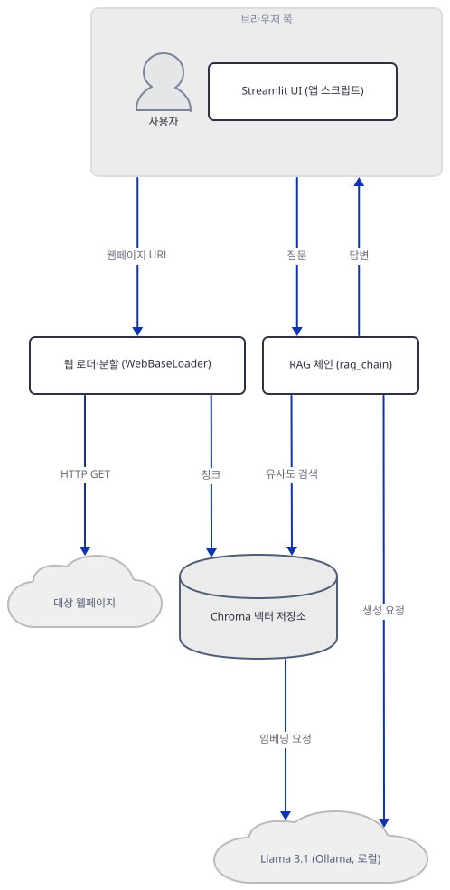
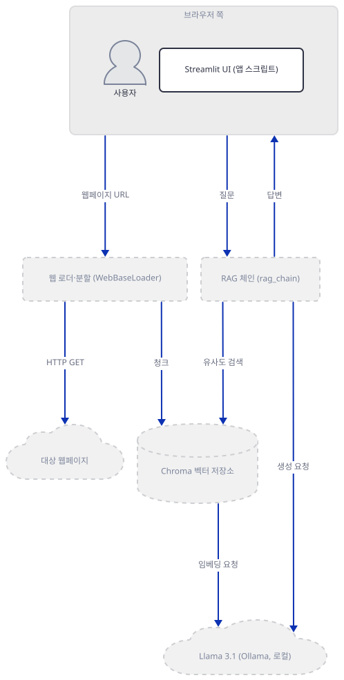
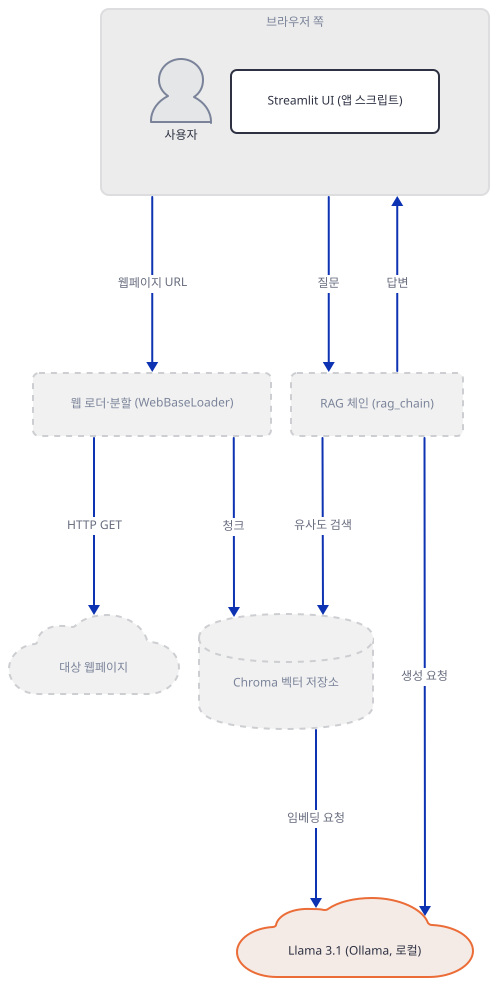
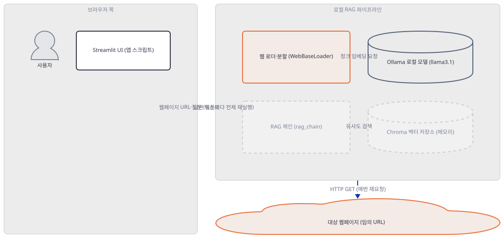
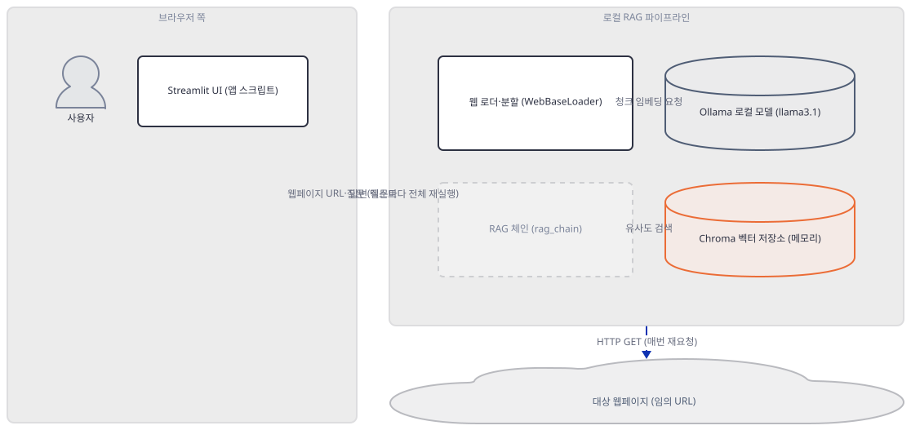
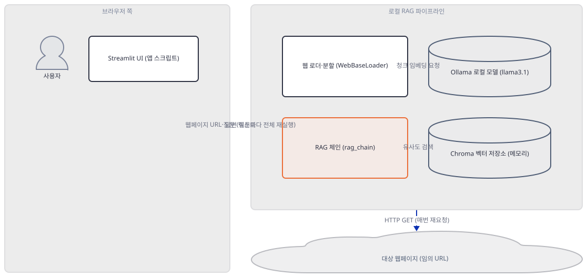
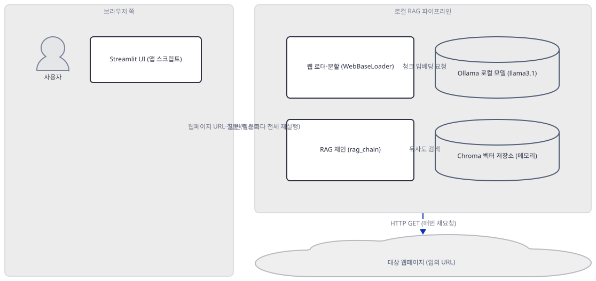
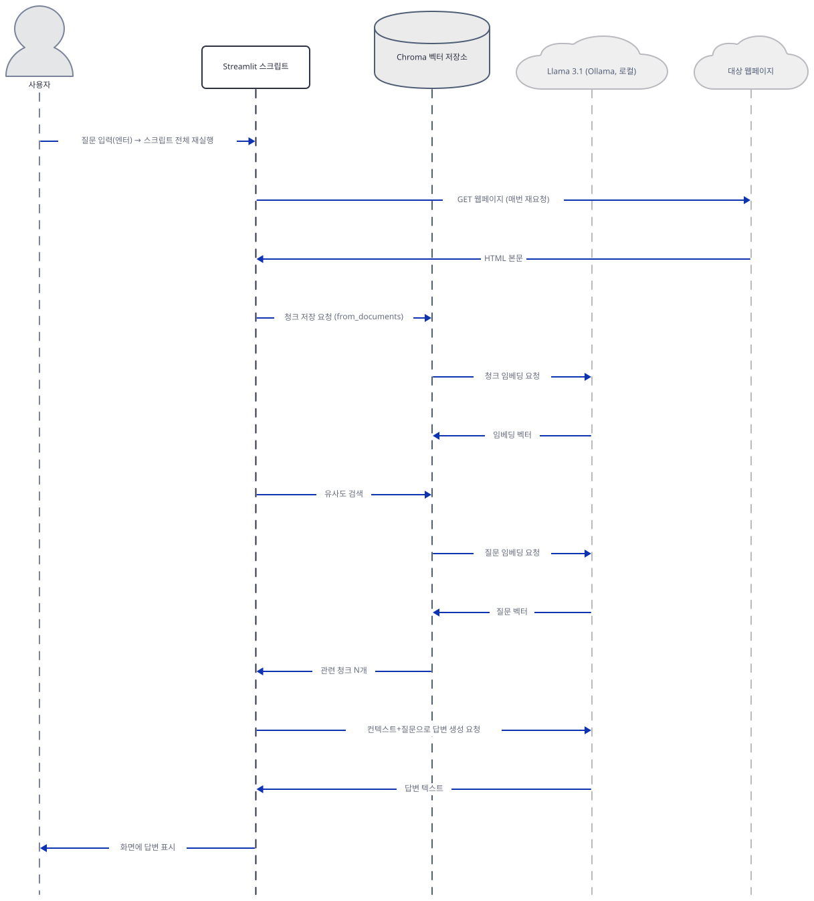

# Day 048 · 🔄 Llama 3.1 Local RAG

> 볼륨 5 📀 RAG · 난이도 ★☆☆ · 예상 소요 70분 · API 비용 대략 무료(로컬) — `llama3.1` 모델 다운로드에 4.9GB 디스크 필요(이 문서는 받지 않고 크기만 확인) · 원본 앱: `rag_tutorials/llama3.1_local_rag`

## 오늘 만들 것

오늘은 웹페이지 URL 하나를 입력받아 그 내용에 대해 대화하는 Streamlit 앱을 만듭니다. 로컬 Ollama로 RAG를 만드는 것 자체는 Day 047에서 이미 다뤘지만, 이 앱은 채팅과 임베딩 모두를 정확히 같은 모델 하나 — `llama3.1`(태그를 생략하면 `:latest`로 풀리고, ollama.com 라이브러리 페이지 확인 결과 사실상 8B 파라미터·4.9GB) — 이 겸임하고, `embedchain` 같은 중간 라이브러리 없이 `langchain`을 직접 불러 로더·분할·벡터 저장·검색·생성을 80줄에 전부 손으로 짠다는 점이 다릅니다. API 키가 없고 모델 추론 자체는 이 컴퓨터 안에서 끝나 사용량 과금도 없지만, "완전 오프라인"은 아닙니다 — `WebBaseLoader`는 대상 웹페이지를 여전히 매번 인터넷에서 가져오고(원본 앱 README는 인터넷 연결이 필요 없다고 적지만, 소스는 그렇지 않다는 것을 보여줍니다), 게다가 `requirements.txt` 다섯 줄로 설치해도 실행에 필요한 패키지 두 개가 정작 빠져 있고 첫 import부터 지금 버전 `langchain`에서 사라진 경로를 씁니다. 완성하면 URL과 질문을 넣어 로컬 모델의 답을 보는 화면을 띄우게 되지만, 그 답이 매 질문마다 처음부터 다시 만들어지는 벡터 저장소에서 나오고 그 저장소가 비워지지 않은 채 조용히 쌓인다는 것까지 직접 확인합니다. 아래는 완성된 아키텍처입니다.



## 사전 준비

| 서비스/도구 | 용도 | 발급·설치 |
|---|---|---|
| Ollama | `http://127.0.0.1:11434` 데몬으로 채팅과 임베딩을 모두 처리 | https://ollama.com 에서 설치, 백그라운드 데몬으로 상시 실행 |
| `llama3.1` 모델 | 이 앱이 쓰는 유일한 모델(채팅·임베딩 겸용), 8B 파라미터, 다운로드 4.9GB(ollama.com 라이브러리 페이지로 확인, 2026-09-23 기준) | `ollama pull llama3.1` — 이 컴퓨터에는 미설치이고 이 문서는 받지 않았다(`ollama list`로 확인) |
| 인터넷 연결 | 모델 자체는 로컬이지만 `WebBaseLoader`가 대상 웹페이지를 질문마다 매번 가져온다 | 별도 설치 없음. 사내망이면 대상 URL 접속 허용 필요 |
| uv | 가상환경 생성과 패키지 설치 | [공통 사전 준비](../README.md#공통-사전-준비-한-번만) 절 참고 |

## 아키텍처 한눈에 보기

| 컴포넌트 | 역할 | 코드 위치 |
|---|---|---|
| 사용자 | 웹페이지 URL과 질문 입력 | 코드 없음 (브라우저) |
| Streamlit UI | URL·질문 입력창과 결과 표시. 캐싱이 전혀 없어 위젯 입력마다 전체 재실행 | `rag_tutorials/llama3.1_local_rag/llama3.1_local_rag.py:8-16`, `rag_tutorials/llama3.1_local_rag/llama3.1_local_rag.py:72-80` |
| 웹 로더·분할 | 웹페이지 텍스트 추출과 500자 청크 분할(중첩 10자) | `rag_tutorials/llama3.1_local_rag/llama3.1_local_rag.py:19-23` |
| Ollama 로컬 모델 (`llama3.1`) | 청크·질문 임베딩 계산과 최종 답변 생성 — 두 역할 모두 같은 모델이 맡음 | `rag_tutorials/llama3.1_local_rag/llama3.1_local_rag.py:13-16`, `rag_tutorials/llama3.1_local_rag/llama3.1_local_rag.py:26` |
| Chroma 벡터 저장소 | 청크와 임베딩 벡터를 프로세스 메모리에 저장, 유사도 검색 | `rag_tutorials/llama3.1_local_rag/llama3.1_local_rag.py:27`, `rag_tutorials/llama3.1_local_rag/llama3.1_local_rag.py:47` |
| RAG 체인 (`rag_chain`) | 검색 → 컨텍스트 결합 → 답변 생성 순서로 호출 | `rag_tutorials/llama3.1_local_rag/llama3.1_local_rag.py:60-70` |

## 단계별 진행

### Step 1. 환경 만들기 — 설치는 되는데 첫 import부터 막힌다

**목적.** `requirements.txt` 다섯 줄을 그대로 설치하고, 정확히 무엇이 설치되는지, 그리고 임포트·실행에 필요한데 빠진 것이 무엇인지 확인합니다.

**할 일.**

```bash
cd rag_tutorials/llama3.1_local_rag
uv venv
uv pip install -r requirements.txt
```

(pip을 쓴다면 `python -m venv .venv && source .venv/bin/activate && pip install -r requirements.txt`.)

`rag_tutorials/llama3.1_local_rag/requirements.txt:1-5`

```text
streamlit
ollama
langchain
langchain_community
langchain_ollama
```

이 저장소는 루트에 `pyproject.toml`이 있어 `uv run`이 앱 폴더의 환경 대신 루트 `.venv`를 쓰므로, 이후 `uv run` 명령에는 모두 `--no-project`를 붙입니다. 이 문서를 쓰며 설치했을 때는 85개 패키지가 받아졌고(직접 확인), 그중 이 날의 이야기와 관련된 것만 추리면 **streamlit 1.64.0**, **langchain 1.4.2**, **langchain-community 0.4.2**, **langchain-ollama 1.1.0**, **langchain-text-splitters 1.1.2**, **langchain-classic 1.0.8**, **ollama 0.6.2**입니다. `requirements.txt`의 `ollama` 줄은 사실 중복입니다 — `uv pip show langchain-ollama`로 확인하면 `Requires: langchain-core, ollama`라서 `langchain_ollama`만 설치해도 `ollama`는 전이 의존성으로 어차피 따라옵니다(직접 확인, 무해한 중복).

`rag_tutorials/llama3.1_local_rag/llama3.1_local_rag.py:1-6`

```python
import streamlit as st
from langchain.text_splitter import RecursiveCharacterTextSplitter
from langchain_community.document_loaders import WebBaseLoader
from langchain_community.vectorstores import Chroma
from langchain_ollama import OllamaEmbeddings
from langchain_ollama import ChatOllama
```

이 여섯 줄 중 두 번째 줄이 지금 버전의 `langchain`에서 실패합니다 — `langchain==1.4.2`는 `agents`, `chat_models`, `embeddings`, `mcp`, `messages`, `rate_limiters`, `tools` 일곱 개 서브모듈만 노출하는 얇은 패키지로 바뀌었고(직접 확인, `pkgutil.iter_modules`) `text_splitter`는 그 목록에 없습니다. Day 046이 `langchain.prompts`에서 겪은 것과 같은 종류의 드리프트가 이번엔 파일의 두 번째 줄, 즉 가장 먼저 실행되는 import에서 터집니다. 나머지 네 줄(`langchain_community`, `langchain_ollama` 관련)은 각각 성공하지만, `langchain_community` 계열을 import하면 매번 사용 중단 경고가 함께 뜹니다(직접 확인, 아래 그대로).

```
DeprecationWarning: `langchain-community` is being sunset and is no longer actively maintained. See https://github.com/langchain-ai/langchain-community/issues/674 for details and migration guidance toward standalone integration packages.
```

또한 `requirements.txt`에는 없지만 실행에는 필요한 패키지가 둘 더 있습니다 — `beautifulsoup4`(Step 3)와 `chromadb`(Step 4)입니다. 둘 다 import 시점이 아니라 실제로 호출하는 시점에야 없다는 것이 드러납니다(뒤 스텝에서 직접 재현).



**확인.**

```bash
uv run --no-project python -c "from langchain.text_splitter import RecursiveCharacterTextSplitter"
```

```
ModuleNotFoundError: No module named 'langchain.text_splitter'
```

```bash
uv run --no-project python -c "from langchain_text_splitters import RecursiveCharacterTextSplitter; print('ok')"
```

```
ok
```

### Step 2. 로컬 모델 정의 — 채팅과 임베딩, 한 모델 두 역할

**목적.** Ollama 엔드포인트와 모델 이름이 어떻게 정의되고, `ChatOllama` 생성자가 실제로 네트워크를 타는지, 그리고 이 모델이 이 컴퓨터에 있는지 확인합니다.

**할 일.**

`rag_tutorials/llama3.1_local_rag/llama3.1_local_rag.py:11-16`

```python
# Get the webpage URL from the user
webpage_url = st.text_input("Enter Webpage URL", type="default")
# Connect to Ollama
ollama_endpoint = "http://127.0.0.1:11434"
ollama_model = "llama3.1"
ollama = ChatOllama(model=ollama_model, base_url=ollama_endpoint)
```

`ollama_model = "llama3.1"` 하나가 이 파일 전체에서 채팅(`ChatOllama`, 16행)과 임베딩(`OllamaEmbeddings`, Step 4) 양쪽에 그대로 재사용됩니다 — Day 042의 두 로컬 변형처럼 "채팅과 임베딩에 같은 모델"이지만, 여기서는 변수 하나를 공유해 그 사실이 코드에 그대로 드러납니다. `ChatOllama`와 `OllamaEmbeddings` 클래스에는 `validate_environment`가 없고 클래스 본문 어디에도 `pull`이나 서버 쪽 모델 목록을 조회하는 코드가 없습니다(소스로 확인, `langchain-ollama` 1.1.0) — 즉 이 생성자는 모델이 실제로 있는지 확인하지 않고, 다운로드를 시도하지도 않습니다. 이 컴퓨터의 `ollama list`에는 `llama3.2:latest`, `embeddinggemma:latest` 등은 있지만 `llama3.1`은 없습니다 — 그래서 이 문서는 `ollama pull`도, 임베딩·채팅 호출(`.invoke()`)도 실행하지 않고 생성자 호출까지만 확인합니다. ollama.com 라이브러리 페이지는 `llama3.1:latest`와 `llama3.1:8b`를 똑같이 "4.9GB"로 표시합니다(2026-09-23 확인) — 즉 태그를 생략해도 사실상 8B 모델입니다. RAM 요구량은 그 페이지에도 Ollama 공식 GitHub README에도 적힌 수치가 없었습니다(둘 다 직접 확인) — 4.9GB는 4비트로 양자화된 가중치 자체의 크기이므로, 그 가중치를 올리는 데만도 최소 그 정도의 여유 메모리가 필요하고 컨텍스트·KV 캐시까지 얹으면 실제로는 이보다 더 듭니다.



**확인.**

```bash
ollama list
```

```
NAME                     ID              SIZE      MODIFIED
gemma4:26b               08ae7ec1744b    18 GB     3 weeks ago
llama3.2:latest          a80c4f17acd5    2.0 GB    10 months ago
embeddinggemma:latest    85462619ee72    621 MB    10 months ago
(이하 생략 — llama3.1은 목록에 없음)
```

```bash
uv run --no-project python -c "
from langchain_ollama import ChatOllama, OllamaEmbeddings
c = ChatOllama(model='llama3.1', base_url='http://127.0.0.1:11434')
e = OllamaEmbeddings(model='llama3.1', base_url='http://127.0.0.1:11434')
print('생성자만 호출, 네트워크 요청 없음:', type(c).__name__, type(e).__name__)
"
```

```
생성자만 호출, 네트워크 요청 없음: ChatOllama OllamaEmbeddings
```

### Step 3. 웹페이지 읽기와 청크 분할

**목적.** `WebBaseLoader`가 실제로 무엇을 요구하는지, 그리고 원본 앱 README의 "인터넷 연결 필요 없음" 주장이 사실인지 확인합니다.

**할 일.**

`rag_tutorials/llama3.1_local_rag/llama3.1_local_rag.py:19-23`

```python
    # 1. Load the data
    loader = WebBaseLoader(webpage_url)
    docs = loader.load()
    text_splitter = RecursiveCharacterTextSplitter(chunk_size=500, chunk_overlap=10)
    splits = text_splitter.split_documents(docs)
```

`WebBaseLoader(webpage_url).load()`는 내부적으로 `bs4`(BeautifulSoup)로 HTML을 파싱하는데, `bs4`는 import 시점이 아니라 `.load()`를 실제로 호출하는 시점에야 필요해집니다(직접 확인, 아래) — `requirements.txt`에는 없는 패키지입니다. 원본 앱 README(`rag_tutorials/llama3.1_local_rag/README.md:2`)는 "100% free and without the need for an internet connection"이라고 적지만, 이 두 줄은 `webpage_url`이 가리키는 임의의 서버로 실제 HTTP GET을 보냅니다 — 모델 추론은 로컬이어도 이 단계는 인터넷(또는 최소한 도달 가능한 서버)이 필요합니다. 이 사실을 외부 사이트 없이 확인하려고, 로컬에 문장 하나짜리 HTML을 만들어 `python -m http.server`로 127.0.0.1에 띄우고 그 주소를 `webpage_url`에 넣어 확인했습니다.



**확인.** 별도 터미널에서 로컬 서버를 하나 띄워 둡니다.

```bash
mkdir -p /tmp/day048-web
printf '<html><head><title>Test Page</title></head><body><p>The secret phrase for Day 048 is Falcon-Nine-Delta.</p></body></html>' > /tmp/day048-web/test.html
cd /tmp/day048-web && python -m http.server 8748 --bind 127.0.0.1
```

```bash
uv pip install beautifulsoup4
uv run --no-project python -c "
from langchain_community.document_loaders import WebBaseLoader
docs = WebBaseLoader('http://127.0.0.1:8748/test.html').load()
print('page_content:', repr(docs[0].page_content.strip()))
print('metadata:', docs[0].metadata)
"
```

```
page_content: 'Test PageThe secret phrase for Day 048 is Falcon-Nine-Delta.'
metadata: {'source': 'http://127.0.0.1:8748/test.html', 'title': 'Test Page', 'language': 'No language found.'}
```

(`bs4` 설치 전에 같은 명령을 실행하면 `ModuleNotFoundError: No module named 'bs4'`가 납니다 — 직접 확인.)

### Step 4. 임베딩과 벡터 저장 — 지워지지 않고 쌓인다

**목적.** `Chroma.from_documents()`에 `persist_directory`가 없다는 것이 실제로 무엇을 뜻하는지 — 디스크가 아니라는 것, 그리고 "새로 만든다"는 것이 "비운다"는 뜻이 아니라는 것을 직접 확인합니다.

**할 일.**

`rag_tutorials/llama3.1_local_rag/llama3.1_local_rag.py:25-27`

```python
    # 2. Create Ollama embeddings and vector store
    embeddings = OllamaEmbeddings(model=ollama_model, base_url=ollama_endpoint)
    vectorstore = Chroma.from_documents(documents=splits, embedding=embeddings)
```

`Chroma.from_documents()`에는 `persist_directory`도, `client`도, `client_settings`도 없습니다. `Chroma.__init__` 소스(langchain-community 0.4.2)를 읽으면 이 경우 `chromadb.config.Settings()`(기본값)로 `chromadb.Client()`를 만드는 분기를 탑니다 — 그리고 `chromadb.config.Settings().is_persistent`의 기본값은 `False`입니다(직접 확인, chromadb 1.5.9). 즉 디스크에는 아무것도 쓰이지 않는, 프로세스 메모리만의 저장소입니다. 여기다 `langchain_community.vectorstores.Chroma` 자체가 LangChain 0.2.9부터 사용 중단(deprecated)돼 있고 `langchain_chroma` 패키지로 옮겨가라는 경고가 생성 시점에 뜹니다(직접 확인, 아래 그대로).

```
LangChainDeprecationWarning: The class `Chroma` was deprecated in LangChain 0.2.9 and will be removed in 1.0. An updated version of the class exists in the `langchain-chroma package and should be used instead. To use it run `pip install -U `langchain-chroma` and import as `from `langchain_chroma import Chroma``.
```

더 중요한 것은 반복 호출의 결과입니다. `chromadb.Client(Settings())`는 기본 설정이 같으면 프로세스 안에서 시스템을 공유합니다 — 그래서 `Chroma.from_documents()`를 세 번 부르면 매번 "새 저장소"가 아니라 **같은 이름의 컬렉션(`langchain`, `_LANGCHAIN_DEFAULT_COLLECTION_NAME`)에 계속 쌓입니다.** 앱 코드 입장에서는 매 질문마다 `vectorstore`라는 새 변수를 만드는 것처럼 보이지만, 실제 chromadb 컬렉션은 비워지지 않고 누적됩니다. 실제 Ollama 임베딩 대신 가짜 임베딩 함수로 이를 확인했습니다(네트워크·모델 다운로드 없음).



**확인.**

```bash
uv pip install chromadb
uv run --no-project python -c "
import os
from langchain_core.documents import Document
from langchain_community.vectorstores import Chroma

class FakeEmbeddings:
    def embed_documents(self, texts): return [[0.1, 0.2, 0.3] for _ in texts]
    def embed_query(self, text): return [0.1, 0.2, 0.3]

docs = [Document(page_content='Falcon-Nine-Delta is the secret phrase.')]
before = set(os.listdir('.'))
for i in range(3):
    vs = Chroma.from_documents(documents=docs, embedding=FakeEmbeddings())
    print(f'{i+1}번째 build() 후 컬렉션 누적 개수:', vs._collection.count())
print('컬렉션 이름:', vs._collection.name)
print('vs._persist_directory 값:', vs._persist_directory)
print('실제로 새로 생긴 파일/폴더:', set(os.listdir('.')) - before)
" 2>/dev/null
```

```
1번째 build() 후 컬렉션 누적 개수: 1
2번째 build() 후 컬렉션 누적 개수: 2
3번째 build() 후 컬렉션 누적 개수: 3
컬렉션 이름: langchain
vs._persist_directory 값: ./chroma
실제로 새로 생긴 파일/폴더: set()
```

(`vs._persist_directory`가 `'./chroma'`라는 문자열을 갖고 있어도 `is_persistent=False`이므로 실제로는 아무 파일도 생기지 않습니다 — 마지막 줄이 그것을 보여줍니다.)

### Step 5. RAG 체인 정의 — 검색·결합·생성

**목적.** 검색된 청크가 어떻게 프롬프트로 합쳐지고, 최종 답변이 어떻게 생성되는지 정확한 호출 순서를 확인합니다.

**할 일.**

`rag_tutorials/llama3.1_local_rag/llama3.1_local_rag.py:42-44`

```python
        formatted_prompt = f"Question: {question}\n\nContext: {context}"
        response = ollama.invoke([('human', formatted_prompt)])
        return response.content.strip()
```

이 세 줄이 `ollama_llm(question, context)`의 본문입니다 — 질문과 검색된 컨텍스트를 하나의 문자열로 합쳐 `ollama.invoke()`(Step 2의 그 `ChatOllama` 인스턴스)에 `('human', ...)` 튜플 하나로 보냅니다. 검색기는 `retriever = vectorstore.as_retriever()`(`rag_tutorials/llama3.1_local_rag/llama3.1_local_rag.py:47`) 한 줄로 만들어지고, 검색된 문서들은 `combine_docs()`가 `"\n\n".join(doc.page_content for doc in docs)`(`rag_tutorials/llama3.1_local_rag/llama3.1_local_rag.py:58`)로 두 줄바꿈을 사이에 두고 이어붙입니다. 이 둘을 묶는 함수가 `rag_chain`입니다.

`rag_tutorials/llama3.1_local_rag/llama3.1_local_rag.py:68-70`

```python
        retrieved_docs = retriever.invoke(question)
        formatted_context = combine_docs(retrieved_docs)
        return ollama_llm(question, formatted_context)
```

호출 순서는 검색(`retriever.invoke`) → 결합(`combine_docs`) → 생성(`ollama_llm`)이고, 이 셋 중 어디에도 `try/except`가 없습니다(소스로 확인) — 벡터 저장소가 비어 있거나 Ollama 호출이 실패하면 예외가 그대로 위로 올라갑니다.



**확인.**

```bash
uv run --no-project python -m py_compile llama3.1_local_rag.py && echo compiled
```

```
compiled
```

### Step 6. 실행 — 질문마다 처음부터 다시

**목적.** "질문하기" 버튼이 따로 없는 이 앱에서 실제로 무엇이 재실행을 일으키는지, 그리고 Step 1·4에서 확인한 사실들이 실제 앱 파일을 통해서도 그대로 재현되는지 확인합니다.

**할 일.**

`rag_tutorials/llama3.1_local_rag/llama3.1_local_rag.py:72-80`

```python
    st.success(f"Loaded {webpage_url} successfully!")

    # Ask a question about the webpage
    prompt = st.text_input("Ask any question about the webpage")

    # Chat with the webpage
    if prompt:
        result = rag_chain(prompt)
        st.write(result)
```

이 파일에는 `session_state`도 `st.cache_resource`/`st.cache_data`도 전혀 없습니다(직접 확인, `grep -n "session_state|st.cache" llama3.1_local_rag.py`가 0건). Day 042의 `chat_pdf_llama3.py`/`chat_pdf.py`처럼 캐싱이 없는 정도가 아니라, 이 파일에는 캐싱 후보 자체(임시 디렉터리 경로 등)도 없습니다 — `webpage_url`이 있는 한 `if webpage_url:` 블록(18행) 전체가 매 재실행마다 처음부터 다시 실행됩니다. 두 번째 `st.text_input`(75행, 질문 입력창)에 값을 입력하고 엔터를 치는 것 자체가 Streamlit 스크립트 전체의 재실행을 일으키므로, 질문을 새로 할 때마다 Step 3의 웹 가져오기·분할과 Step 4의 임베딩·벡터 저장이 처음부터 다시 돌고, 그 결과는 Step 4에서 확인했듯 비워지지 않고 쌓입니다. 이를 실제 엔트리 파일로 재현하려고 Ollama·네트워크 호출만 가짜로 바꿔치기하고(Step 1의 import 문제도 같은 방식으로 우회) 파일 자체를 세 번 재실행했습니다.



**확인.**

```bash
uv run --no-project python -c "
import sys, types, runpy, itertools
import langchain_text_splitters as lts
shim = types.ModuleType('langchain.text_splitter')
shim.RecursiveCharacterTextSplitter = lts.RecursiveCharacterTextSplitter
sys.modules['langchain.text_splitter'] = shim

calls = {'load': 0, 'chat_invoke': 0}
import langchain_community.document_loaders as dl
from langchain_core.documents import Document
class FakeLoader:
    def __init__(self, url): self.url = url
    def load(self):
        calls['load'] += 1
        return [Document(page_content=f'chunk from {self.url} #{calls[\"load\"]}')]
dl.WebBaseLoader = FakeLoader

import langchain_ollama as lo
class FakeEmbeddings:
    def __init__(self, **kw): pass
    def embed_documents(self, texts): return [[0.1, 0.2, 0.3] for _ in texts]
    def embed_query(self, text): return [0.1, 0.2, 0.3]
class FakeChatOllama:
    def __init__(self, **kw): pass
    def invoke(self, messages):
        calls['chat_invoke'] += 1
        class R: content = f'answer #{calls[\"chat_invoke\"]}'
        return R()
lo.OllamaEmbeddings = FakeEmbeddings
lo.ChatOllama = FakeChatOllama

import streamlit as st
answers = itertools.cycle(['http://127.0.0.1:8748/test.html', 'What is the secret phrase?'])
st.text_input = lambda *a, **k: next(answers)

counts = []
for i in range(3):
    runpy.run_path('llama3.1_local_rag.py', run_name='__main__')
    counts.append((calls['load'], calls['chat_invoke']))
print('재실행 1,2,3회차 후 (웹 요청 누적, 답변 생성 누적):', counts)
" 2>/dev/null
```

```
재실행 1,2,3회차 후 (웹 요청 누적, 답변 생성 누적): [(1, 1), (2, 2), (3, 3)]
```

(웹페이지 로더와 Ollama 채팅 호출 모두 재실행마다 정확히 1씩 늘어납니다 — 세 번째 재실행 뒤 웹 요청 3회·답변 생성 3회. 세 번 다 같은 URL과 같은 질문 문자열을 주었는데도 매번 완전히 새로 실행된다는 뜻입니다. 실제 임베딩·채팅 호출 대상은 Ollama가 아니라 가짜 객체이므로 이 컴퓨터의 Ollama 데몬에는 아무 요청도 가지 않았습니다.)

## 요청 한 건이 흐르는 과정



질문을 입력하고 엔터를 치면 Streamlit은 스크립트 전체를 처음부터 다시 실행합니다. 그러면 `webpage_url`이 채워져 있는 한 `WebBaseLoader`가 대상 웹페이지를 **다시** GET으로 가져오고(Step 3), `RecursiveCharacterTextSplitter`로 청크를 나눈 뒤 그 청크 전부를 `llama3.1`에 임베딩 요청으로 보냅니다. 돌아온 벡터는 Chroma에 추가되는데, Step 4에서 확인했듯 이 컬렉션은 새로 비워지는 것이 아니라 이전 재실행에서 쌓인 것 위에 그대로 더해집니다. 그다음에야 비로소 이번 질문 자체가 같은 `llama3.1`에 임베딩되어 Chroma에서 유사도 검색을 하고, 관련 청크 몇 개를 돌려받습니다. 마지막으로 그 청크들과 질문을 합쳐 다시 `llama3.1`에 답변 생성을 요청하고, 돌아온 텍스트를 화면에 표시합니다. 그림에서는 순서대로 그려져 있지만 실제로 눈여겨볼 것은 순서가 아니라 반복입니다 — 이 열두 번의 오가는 화살표 중 앞쪽 절반(웹 가져오기~청크 저장)은 질문 내용과 무관하게 매번 통째로 되풀이됩니다.

## 실행 체크리스트

- [ ] `uv venv && uv pip install -r requirements.txt`로 85개 패키지를 설치했다(추가로 `beautifulsoup4`, `chromadb` 필요)
- [ ] `langchain.text_splitter`가 `ModuleNotFoundError`를 내고 `langchain_text_splitters`로 대체된다는 것을 확인했다
- [ ] `ollama list`로 이 컴퓨터에 `llama3.1`이 없다는 것과, ollama.com 라이브러리 페이지의 4.9GB 크기를 확인했다
- [ ] `ChatOllama`/`OllamaEmbeddings` 생성자가 네트워크 요청 없이 성공한다는 것을 확인했다
- [ ] 로컬 HTTP 서버로 `WebBaseLoader`가 실제로 텍스트를 추출하는 것을 확인했다
- [ ] 가짜 임베딩으로 `Chroma.from_documents()`를 세 번 호출해 컬렉션이 1·2·3으로 누적되고 디스크에는 아무것도 안 남는다는 것을 확인했다
- [ ] 실제 앱 파일을 세 번 재실행해 웹 요청과 답변 생성이 매번 다시 일어난다는 것을 확인했다

## 문제 해결

| 증상 | 원인 | 해결 |
|---|---|---|
| `from langchain.text_splitter import RecursiveCharacterTextSplitter`가 `ModuleNotFoundError: No module named 'langchain.text_splitter'`로 실패 | `langchain==1.4.2`는 `agents`/`chat_models`/`embeddings`/`mcp`/`messages`/`rate_limiters`/`tools`만 노출하는 얇은 패키지로 바뀌었고 `text_splitter`가 빠졌다(직접 확인) | `from langchain_text_splitters import RecursiveCharacterTextSplitter`로 바꾸기(또는 `langchain_classic.text_splitter`) |
| `Chroma.from_documents(...)` 호출 시 ``ImportError: Could not import chromadb python package. Please install it with `pip install chromadb`.`` | `chromadb`가 `requirements.txt`에 없고 `langchain`/`langchain_community`/`langchain_ollama` 어느 쪽의 전이 의존성으로도 설치되지 않는다(직접 확인) | `uv pip install chromadb` 실행 |
| `WebBaseLoader(...).load()` 호출 시 `ModuleNotFoundError: No module named 'bs4'` | `beautifulsoup4`가 `requirements.txt`에 없다(직접 확인) | `uv pip install beautifulsoup4` 실행 |
| 질문을 여러 번 반복하면 갈수록 느려지거나, 이미 떠난 웹페이지의 내용이 답변에 섞여 나옴 | `session_state`/`st.cache`가 전혀 없어 재실행마다 웹 재수집·재임베딩이 일어나고, `persist_directory` 없는 `Chroma`는 프로세스 안에서 설정이 같으면 컬렉션을 공유해 새로 만드는 게 아니라 계속 더해진다(직접 확인, Step 4·6) | 코드를 고친다면 `st.session_state`로 `vectorstore`를 캐싱하고, URL이 바뀔 때만 `vectorstore.delete_collection()` 후 다시 만들기 |

## 더 해보기

- `langchain_community.vectorstores.Chroma`(사용 중단 경고 대상, Step 4)를 `langchain_chroma.Chroma`로 바꿔 설치해보고, `rag_tutorials/llama3.1_local_rag/llama3.1_local_rag.py:27`의 동작이 그대로인지 비교해보기.
- `rag_tutorials/llama3.1_local_rag/llama3.1_local_rag.py:26`의 임베딩 모델을 `llama3.1` 대신 이 컴퓨터에 이미 있는 전용 임베딩 모델(`embeddinggemma:latest`)로 바꾸고, `rag_tutorials/llama3.1_local_rag/llama3.1_local_rag.py:16`의 채팅 모델은 그대로 두어 두 역할을 분리해보기.
- Day 042가 실험했던 것처럼 `Chroma.from_documents(...)`(`rag_tutorials/llama3.1_local_rag/llama3.1_local_rag.py:27`)에 고정된 `persist_directory`를 주고, `st.session_state`로 한 번만 만들도록 고쳐 재실행마다 쌓이는 문제가 사라지는지 직접 실험해보기.

## 다음 날 예고

[Day 049 · 🔍 Autonomous RAG](../day049-autonomous-rag/README.md) — 오늘과 반대로 GPT-4o와 PgVector(Postgres, Docker로 실행)를 쓰는 호스팅 RAG로 돌아갑니다. PDF 업로드와 DuckDuckGo 웹 검색 결과를 같은 지식베이스에 결합하는 구조입니다.
