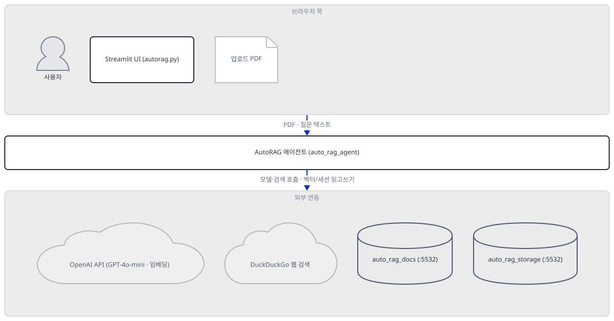
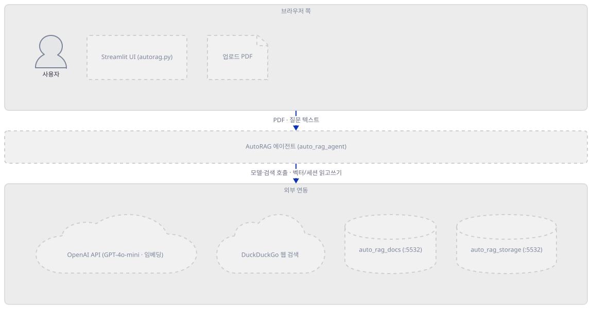
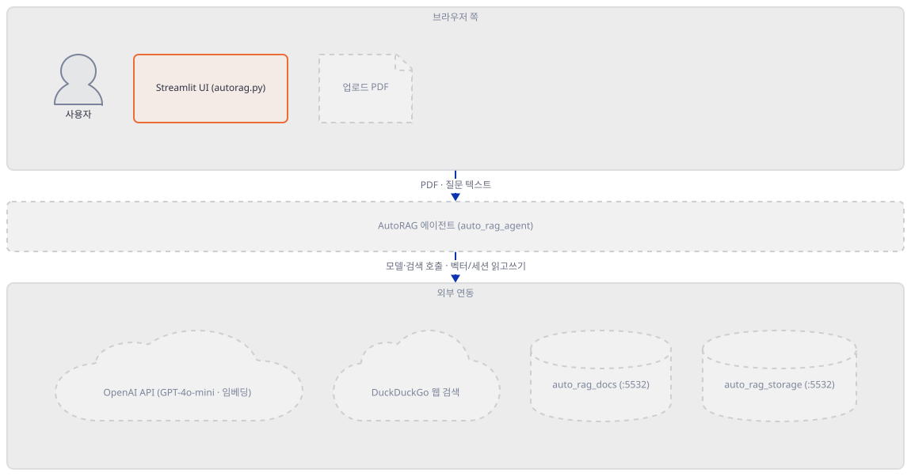
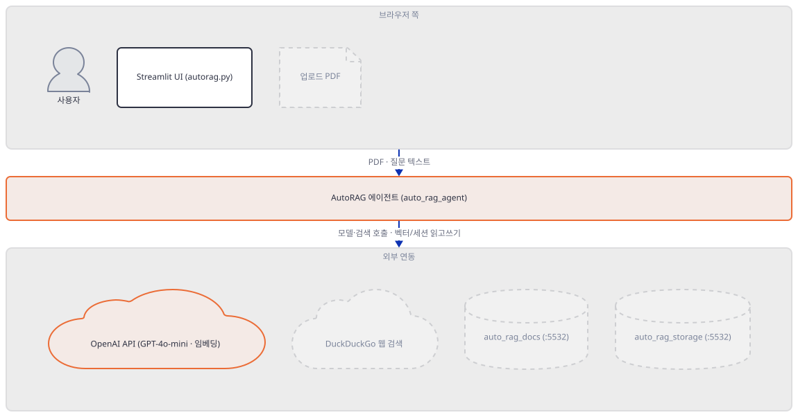
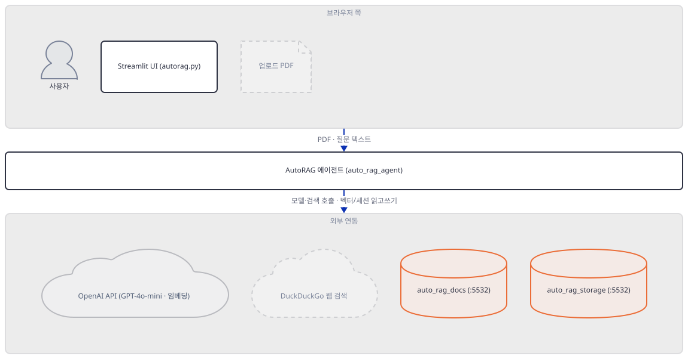
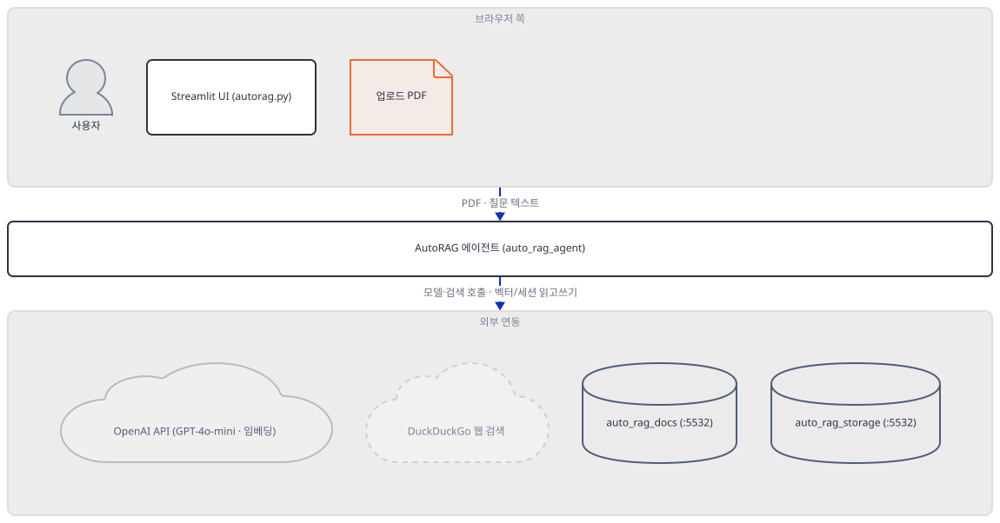
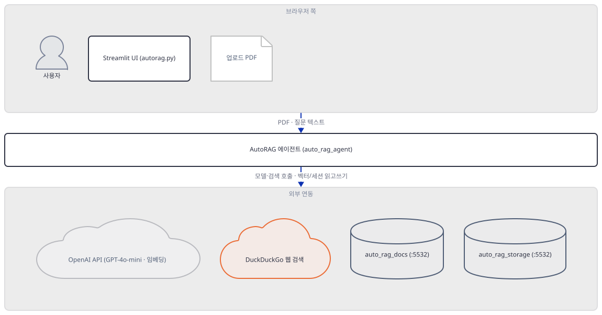
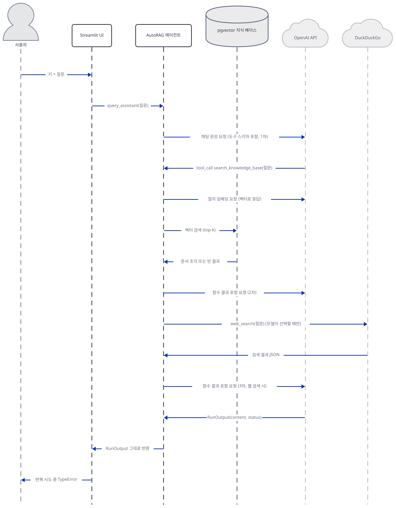

# Day 049 · 🔍 Autonomous RAG

> 볼륨 5 📀 RAG · 난이도 ★★★ ⚠ · 예상 소요 100분(agno 임포트 경로 5갈래를 하나하나 직접 실행해 확인하고, 뜨지 않은 DB에 실제로 접속을 시도해 타임아웃이 날 때까지 기다리는 데 손이 갑니다) · API 비용 대략 요청 1건에 GPT-4o-mini 채팅과 text-embedding-ada-002 임베딩 호출, 요금표 기준 $0.01 이하 (대략치 — 키가 없어 실제 과금은 확인 못했고, 오늘 코드는 임포트 단계에서부터 막혀 이 호출 자체에 이르지 못합니다) · 원본 앱: `rag_tutorials/autonomous_rag`

## 오늘 만들 것

이번 튜토리얼은 지금까지와 완전히 다른 무게의 인프라를 요구합니다 — Day 047에서 다룬 벡터 저장소와 달리, 오늘 앱은 애플리케이션이 대신 띄워 주지 않는 별도의 PostgreSQL 서버(그것도 pgvector 확장이 설치된)가 정확히 `localhost:5532`에 이미 떠 있다고 가정합니다. agno의 `Agent` 하나가 GPT-4o-mini로 답하면서, 업로드된 PDF를 PgVector에 임베딩해 둔 지식 베이스와 DuckDuckGo 웹 검색 중 무엇을 쓸지 스스로 고르도록 설계되어 있고 — "자율(autonomous)"이라는 이름은 정확히 이 선택을 가리킵니다. 그런데 그 선택을 강제하는 코드는 어디에도 없습니다: `instructions` 목록에 적힌 세 문장짜리 평범한 영어 지시문과, agno가 지식 베이스를 붙였을 때 자동으로 추가하는 도구 함수 하나가 전부이고, 모델이 그 순서를 어기거나 아예 둘 다 건너뛰어도 이를 잡아내는 코드는 없습니다. Day 038에서 이미 `agno`를 버전 고정 없이 쓰면 오늘 3.x대가 설치되면서 가져오는 경로가 깨진다는 것을 확인했는데, 오늘 앱은 그보다 훨씬 더 심하게 걸립니다 — 이 파일이 쓰는 agno 관련 import 8줄 중 3줄만 그대로 성공합니다. 나머지 5줄 중 1줄(`DuckDuckGoTools`)은 Day 038처럼 익스트라 패키지 하나를 더 설치하면 풀리지만, 나머지 4줄(`PDFReader`·`PDFUrlKnowledgeBase`·`OpenAIEmbedder`·`PostgresAgentStorage`)은 익스트라로 고칠 수 있는 문제가 아니라 그 모듈 자체가 패키지에서 통째로 없어졌습니다. 이 임포트 문제를 전부 우회해도, 질문에 답하는 마지막 함수 `query_assistant`는 `agent.run()`이 스트리밍 없이 돌려주는 `RunOutput` 객체를 반복 가능한 값처럼 다루다가 — 키가 맞든 틀리든 상관없이 — `TypeError`로 곧장 멈춥니다. Day 038의 "틀린 키가 답인 척하는 에러 메시지"보다 한 단계 더 근본적인 고장입니다. 완성하면(그리고 PostgreSQL을 실제로 띄우면) PDF를 업로드해 지식 베이스에 더하고 질문을 던지면, 에이전트가 그 문서와 웹 검색 중 하나를 골라 답하는 화면을 로컬에서 띄우게 됩니다. 아래는 완성된 아키텍처입니다.



## 사전 준비

| 서비스/도구 | 용도 | 발급·설치 |
|---|---|---|
| OpenAI API 키 | GPT-4o-mini 채팅과 text-embedding-ada-002 임베딩 호출 인증. 사이드바 입력창에 직접 붙여넣는다(환경변수 아님) | https://platform.openai.com/api-keys 가입 후 발급 |
| PostgreSQL + pgvector 확장 | 업로드 PDF의 벡터와 에이전트 세션을 저장할 데이터베이스. 앱이 자동으로 띄워주지 않고, 코드에 `localhost:5532`가 그대로 박혀 있다(자세한 내용은 Step 1) | 앱 자신의 README가 안내하는 Docker 이미지 등으로 직접 준비 — 이 문서는 실행하지 않았다 |
| uv | 가상환경 생성과 패키지 설치 | [공통 사전 준비](../README.md#공통-사전-준비-한-번만) 절 참고 |
| 인터넷 연결 | OpenAI API, DuckDuckGo 검색 접속 | 별도 설치 없음. 사내망이면 도메인 접속 허용 필요 |

## 아키텍처 한눈에 보기

| 컴포넌트 | 역할 | 코드 위치 |
|---|---|---|
| 사용자 | 키 입력, PDF 업로드, 질문 입력 | 코드 없음 (브라우저) |
| Streamlit UI (autorag.py) | 키를 받고 PDF 업로드·질문 UI를 그리며 응답을 표시 | `rag_tutorials/autonomous_rag/autorag.py:112-140` |
| AutoRAG 에이전트 (auto_rag_agent) | LLM 호출, 지식 베이스 검색, 웹 검색, 저장을 한데 묶어 조율 | `rag_tutorials/autonomous_rag/autorag.py:37-59` |
| OpenAI API (GPT-4o-mini · text-embedding-ada-002) | 채팅 응답 생성과 문서·질문의 임베딩 계산 | 코드 없음 (외부 서비스) |
| DuckDuckGo 웹 검색 | 지식 베이스에 없을 때 모델이 스스로 선택하는 웹 검색 | 코드 없음 (외부 서비스) |
| PostgreSQL — auto_rag_docs (pgvector) | 업로드 PDF의 벡터 임베딩 저장과 유사도 검색 | `rag_tutorials/autonomous_rag/autorag.py:41-48` |
| PostgreSQL — auto_rag_storage | 에이전트 세션·대화 기록 저장(의도된 설계) | `rag_tutorials/autonomous_rag/autorag.py:40` |
| 업로드 PDF | 지식 베이스에 추가할 문서 | `rag_tutorials/autonomous_rag/autorag.py:62-79` |

## 단계별 진행

### Step 1. 환경 만들기와 데이터베이스 요구사항

**목적.** 의존성을 설치하고, 이 앱이 실제로 무엇에 접속하려 하는지(`DB_URL`)와 그것을 준비하는 비용을 먼저 확정합니다. 파일이 오늘 자 agno로 컴파일은 되어도 임포트는 안 된다는 것까지 이 단계에서 밝혀 둡니다.

**할 일.**

```bash
cd rag_tutorials/autonomous_rag
uv venv
uv pip install -r requirements.txt
```

(pip을 쓴다면 `python -m venv .venv && source .venv/bin/activate && pip install -r requirements.txt`.)

이 저장소는 루트에 `pyproject.toml`이 있어 `uv run`이 방금 만든 환경 대신 루트의 `.venv`를 쓰므로, 이후 `uv run` 명령에는 모두 `--no-project`를 붙입니다.

`rag_tutorials/autonomous_rag/requirements.txt:1-10`은 열 줄 모두 버전 고정이 없습니다. 이 문서를 작성하며 설치했을 때는 **streamlit 1.64.0**, **agno 3.0.10**, **openai 3.18.0**, **psycopg-binary 3.3.6**, **pgvector 0.5.0**, **sqlalchemy 2.0.54**, **pypdf 6.19.0**, **duckduckgo-search 8.1.1**, **nest-asyncio 1.6.0**이 받아졌습니다(직접 확인). `agno`는 Day 038이 이미 만났던 것과 같은 버전(3.0.10)입니다 — 오늘도 같은 최신판이 잡힙니다.

`requirements.txt`의 `pgvector`는 Postgres 확장이 아니라 그 확장을 파이썬에서 다루는 **클라이언트 패키지**입니다. 실제 확장(서버 쪽 `CREATE EXTENSION vector`)은 데이터베이스 이미지 쪽 몫입니다 — 두 "pgvector"를 혼동하지 않아야 합니다.

```bash
uv run --no-project python -m py_compile autorag.py && echo compiled
```

```
compiled
```

컴파일은 문법만 보므로 통과하지만, 실제로 임포트하면 다섯 번째 줄에서 바로 멈춥니다.

```bash
uv run --no-project python -c "import autorag"
```

직접 확인한 출력(발췌, 앞부분 경로는 클론 위치에 따라 달라짐):

```
  File "autorag.py", line 5, in <module>
    from agno.document.reader.pdf_reader import PDFReader
ModuleNotFoundError: No module named 'agno.document'
```

`rag_tutorials/autonomous_rag/autorag.py:17`

```python
DB_URL = "postgresql+psycopg://ai:ai@localhost:5532/ai"
```

SQLAlchemy 접두어 `postgresql+psycopg`는 psycopg **3**(v2가 아님) 드라이버를 가리킵니다. `requirements.txt`의 `psycopg-binary`만 설치하면 이 드라이버가 잡힐 것 같지만, 실제로는 컴파일된 확장 모듈 `psycopg_binary`만 깔릴 뿐 SQLAlchemy가 실제로 `import`하는 `psycopg` 패키지 자체는 별도입니다(직접 확인, 아래). `SearchType`을 포함해 `agno.vectordb.pgvector`의 임포트 자체는 성공하므로(Step 4에서 다시 확인) 이 드라이버 이름을 SQLAlchemy가 찾아내는 것 자체는 문제가 없습니다.

```bash
uv run --no-project python -c "import psycopg"
```

```
ModuleNotFoundError: No module named 'psycopg'
```

```bash
uv pip install psycopg
uv run --no-project python -c "import psycopg; print('psycopg', psycopg.__version__)"
```

```
psycopg 3.3.6
```

앱 자신의 README가 안내하는 준비 절차도 소스로 확인해 둡니다.

`rag_tutorials/autonomous_rag/README.md:35-43`

```bash
docker run -d \
  -e POSTGRES_DB=ai \
  -e POSTGRES_USER=ai \
  -e POSTGRES_PASSWORD=ai \
  -e PGDATA=/var/lib/postgresql/data/pgdata \
  -v pgvolume:/var/lib/postgresql/data \
  -p 5532:5432 \
  --name pgvector \
  phidata/pgvector:16
```

포트(5532)·DB명·사용자·비밀번호(모두 `ai`) 네 값 모두 `DB_URL`과 정확히 맞습니다. 다만 이 문서는 Docker를 실행하지 않았으므로, 이 이미지 태그가 오늘도 그대로 받아지는지는 확인하지 못했습니다. 이 서버가 없을 때 실제로 무엇이 나는지는 Step 4에서 직접 확인합니다.



**확인.**

```bash
uv run --no-project python -c "import streamlit, nest_asyncio, sqlalchemy, pypdf, requests; print('base imports ok')"
```

```
base imports ok
```

### Step 2. Streamlit 뼈대와 키 입력

**목적.** `main()`의 골격 — 페이지 설정, 제목, 사이드바 키 입력과 그 가드 — 을 보고, 서버가 정적으로는 응답해도 스크립트 실행 자체는 별개라는 것을 다시 확인합니다.

**할 일.**

`rag_tutorials/autonomous_rag/autorag.py:112-119`

```python
    st.set_page_config(page_title="AutoRAG", layout="wide")
    st.title("🤖 Auto-RAG: Autonomous RAG with GPT-4o")

    api_key = st.sidebar.text_input("Enter your OpenAI API Key 🔑", type="password")
    
    if not api_key:
        st.sidebar.warning("Enter your OpenAI API Key to proceed.")
        st.stop()
```

키가 비어 있으면 `st.stop()`으로 스크립트가 그 자리에서 곧장 멈춥니다. 문제는 이 가드를 통과한 다음입니다: Step 1에서 확인했듯 이 파일은 5번째 import에서부터 이미 실패하므로, 키를 아무리 정확히 넣어도 `main()`은 결코 이 지점까지 오지 못합니다.



**확인.** 앱 폴더에서 서버를 headless로 띄웁니다.

```bash
uv run --no-project streamlit run autorag.py --server.headless true
```

다른 터미널에서:

```bash
curl -s -o /dev/null -w "%{http_code}\n" http://localhost:8501
```

```
200
```

(HTTP 200은 직접 확인. Streamlit의 정적 셸은 스크립트를 아직 한 번도 실행하지 않은 상태에서도 응답합니다 — 실제 실행은 브라우저가 여는 세션에서 일어나므로, Step 1에서 확인한 5번째 import 실패는 이 curl로는 드러나지 않고 브라우저로 페이지를 열어야 Streamlit의 예외 화면으로 보일 것입니다. 이 부분은 브라우저를 직접 열어 보지는 못했습니다.)

### Step 3. 에이전트와 언어 모델: 옮겨간 임포트들

**목적.** `setup_assistant`가 만드는 `Agent`의 뼈대(모델, `id`)를 보고, `storage=`·`knowledge_base=` 같은 옛 생성자 인자 이름이 오늘의 agno에서 더 이상 통하지 않는다는 것을 직접 확인합니다.

**할 일.**

`rag_tutorials/autonomous_rag/autorag.py:35`

```python
    llm = OpenAIChat(id="gpt-4o-mini", api_key=api_key)
```

`rag_tutorials/autonomous_rag/autorag.py:37-40`

```python
    return Agent(
        id="auto_rag_agent",  # Name of the Assistant
        model=llm,  # Language model to be used
        storage=PostgresAgentStorage(table_name="auto_rag_storage", db_url=DB_URL),  
```

`agno.agent.Agent`와 `agno.models.openai.OpenAIChat`의 임포트, 그리고 `id=` 생성자 인자는 오늘도 그대로 통합니다(직접 확인, 아래) — 이 파일에서 몇 안 되는 멀쩡한 부분입니다. 문제는 `storage=`입니다: 오늘의 `Agent.__init__`은 이 이름을 모릅니다(같은 자리를 대신하는 이름은 `db=`입니다).

```bash
uv run --no-project python -c "
from agno.agent import Agent
from agno.models.openai import OpenAIChat
a = Agent(id='auto_rag_agent', model=OpenAIChat(id='gpt-4o-mini', api_key='fake'))
print('id attr:', a.id)
"
```

```
id attr: auto_rag_agent
```

```bash
uv run --no-project python -c "
from agno.agent import Agent
from agno.models.openai import OpenAIChat
a = Agent(id='x', model=OpenAIChat(id='gpt-4o-mini', api_key='fake'), storage='placeholder', knowledge_base='placeholder')
"
```

```
TypeError: Agent.__init__() got an unexpected keyword argument 'storage'
```

`agno.storage.agent.postgres.PostgresAgentStorage`(11번째 줄이 가져오려는 클래스) 자체도 임포트되지 않습니다 — `agno.storage` 패키지가 3.0.10에는 아예 없습니다(직접 확인, 아래). 그 자리를 대신하는 것은 `agno.db.postgres.postgres.PostgresDb`입니다(agno 3.0.10 소스로 확인).

```bash
uv run --no-project python -c "from agno.storage.agent.postgres import PostgresAgentStorage"
```

```
ModuleNotFoundError: No module named 'agno.storage'
```



**확인.**

```bash
uv run --no-project python -c "
from agno.agent import Agent
from agno.models.openai import OpenAIChat
print('Agent, OpenAIChat import ok')
"
```

```
Agent, OpenAIChat import ok
```

### Step 4. 지식 베이스와 세션 저장소: PgVector와 사라진 storage

**목적.** PDF 벡터를 담는 지식 베이스 정의를 보고, `PgVector`는 임포트되지만 이 파일이 쓰는 인자 이름(`collection=`)은 이미 바뀌었다는 것, 그리고 `PDFUrlKnowledgeBase`·`OpenAIEmbedder`는 임포트 자체가 안 된다는 것을 확인합니다. DB가 실제로 없을 때 무엇이 나는지도 여기서 확인합니다.

**할 일.**

`rag_tutorials/autonomous_rag/autorag.py:41-48`

```python
        knowledge_base=PDFUrlKnowledgeBase(
            vector_db=PgVector(
                db_url=DB_URL,  
                collection="auto_rag_docs",  
                embedder=OpenAIEmbedder(id="text-embedding-ada-002", dimensions=1536, api_key=api_key),  
            ),
            num_documents=3,  
        ),
```

`agno.vectordb.pgvector`의 `PgVector`·`SearchType`은 임포트가 성공합니다(직접 확인, 아래). 하지만 그 생성자는 더 이상 `collection=`을 모릅니다 — 오늘은 위치 인자 `table_name=`을 요구합니다(agno 3.0.10 소스로 확인).

```bash
uv run --no-project python -c "from agno.vectordb.pgvector import PgVector, SearchType; print('PgVector import ok')"
```

```
PgVector import ok
```

```bash
uv run --no-project python -c "
from agno.vectordb.pgvector import PgVector
pv = PgVector(db_url='postgresql+psycopg://ai:ai@localhost:5532/ai', collection='auto_rag_docs')
"
```

```
TypeError: PgVector.__init__() got an unexpected keyword argument 'collection'
```

`agno.knowledge.pdf_url.PDFUrlKnowledgeBase`와 `agno.embedder.openai.OpenAIEmbedder`는 모듈 자체가 없습니다 — `PDFUrlKnowledgeBase`를 대신하는 것은 통합된 `agno.knowledge.knowledge.Knowledge` 클래스이고, `OpenAIEmbedder`는 `agno.knowledge.embedder.openai`로 옮겨갔습니다(모두 agno 3.0.10 소스로 확인).

```bash
uv run --no-project python -c "from agno.knowledge.pdf_url import PDFUrlKnowledgeBase"
```

```
ModuleNotFoundError: No module named 'agno.knowledge.pdf_url'
```

```bash
uv run --no-project python -c "from agno.embedder.openai import OpenAIEmbedder"
```

```
ModuleNotFoundError: No module named 'agno.embedder'
```

`PgVector`를 (오늘 이름으로) 그냥 만들기만 하면 네트워크에 곧바로 손대지 않습니다 — `db_engine`과 `Session`을 지연 생성할 뿐입니다(직접 확인, 아래). DB가 실제로 필요해지는 시점은 `.create()`나 검색처럼 실제로 연결을 여는 메서드를 호출할 때입니다. 그 연결이 어떻게 실패하는지는 SQLAlchemy 엔진으로 직접 확인했습니다 — Postgres를 띄우지 않은 이 환경에서, `localhost:5532`에는 응답하는 것이 아무것도 없습니다.

```bash
uv run --no-project python -c "
from agno.vectordb.pgvector import PgVector
pv = PgVector(db_url='postgresql+psycopg://ai:ai@localhost:5532/ai', table_name='auto_rag_docs')
print('constructed, no eager connection')
"
```

```
constructed, no eager connection
```

```bash
uv run --no-project python -c "
from sqlalchemy import create_engine
engine = create_engine('postgresql+psycopg://ai:ai@localhost:5532/ai')
engine.connect()
"
```

직접 확인한 출력(발췌, 곧바로 실패하지 않고 수십 초를 기다린 뒤 끝났습니다 — 정확한 대기 시간과 IPv6/IPv4 시도 여부는 환경마다 다를 수 있습니다):

```
sqlalchemy.exc.OperationalError: (psycopg.errors.ConnectionTimeout) connection timeout expired
Multiple connection attempts failed. All failures were:
- host: 'localhost', port: 5532, hostaddr: '::1': connection timeout expired
- host: 'localhost', port: 5532, hostaddr: '127.0.0.1': connection timeout expired
```

즉 이 앱이 오늘 자 agno로 임포트까지 전부 통과하도록 손을 본다 해도, `setup_assistant`가 실제로 문서를 검색하거나 저장하려는 순간 PostgreSQL이 응답하지 않으면 여기서 막힙니다 — Step 1의 사전 준비가 왜 필요한지를 보여주는 지점입니다.



**확인.**

```bash
uv run --no-project python -c "
from agno.vectordb.pgvector import PgVector, SearchType
print('vectordb import ok')
"
```

```
vectordb import ok
```

### Step 5. PDF를 지식 베이스에 추가하기

**목적.** 업로드된 PDF가 어떻게 읽히는지, 그리고 `add_document`가 접근하는 속성 이름(`agent.knowledge_base`)이 오늘의 `Agent`에는 없다는 것을 확인합니다.

**할 일.**

`rag_tutorials/autonomous_rag/autorag.py:73-76`

```python
    reader = PDFReader()
    docs = reader.read(file)
    if docs:
        agent.knowledge_base.load_documents(docs, upsert=True)
```

`PDFReader`를 실제로 담고 있는 모듈은 `agno.knowledge.reader.pdf_reader`이지, 이 파일이 5번째 줄에서 가져오려는 `agno.document.reader.pdf_reader`가 아닙니다(agno 3.0.10 소스로 확인 — Step 1에서 확인한 첫 임포트 실패가 바로 이 클래스입니다). 설령 이 임포트를 오늘 경로로 바꿔서 우회한다 해도, 76번째 줄의 `agent.knowledge_base`는 여전히 걸립니다 — 오늘의 `Agent`는 지식 베이스를 `.knowledge` 속성에 저장하지, `.knowledge_base`에 저장하지 않습니다(직접 확인, 아래).

```bash
uv run --no-project python -c "
from agno.agent import Agent
from agno.models.openai import OpenAIChat
a = Agent(id='x', model=OpenAIChat(id='gpt-4o-mini', api_key='fake'), knowledge=None)
print('has knowledge:', hasattr(a, 'knowledge'))
a.knowledge_base
"
```

```
has knowledge: True
AttributeError: 'Agent' object has no attribute 'knowledge_base'
```

지식 베이스를 다루는 코드 전체를 모아 보면 최소 세 겹의 어긋남이 겹쳐 있습니다 — 5번째 줄의 임포트 경로, `setup_assistant`의 `knowledge_base=` 생성자 인자 이름(Step 3), 그리고 여기 `add_document`의 `.knowledge_base` 속성 이름입니다.



**확인.**

```bash
uv run --no-project python -c "
from agno.knowledge.reader.pdf_reader import PDFReader
print('functions on', PDFReader)
"
```

```
functions on <class 'agno.knowledge.reader.pdf_reader.PDFReader'>
```

### Step 6. 웹 검색 도구와 "자율" 판단의 실체

**목적.** "자율"이라는 이름이 가리키는 선택 — 지식 베이스를 먼저 볼지, 웹을 검색할지 — 을 실제로 무엇이 결정하는지 확인합니다. 결론부터 말하면 하드코딩된 분기가 아니라 순전히 프롬프트입니다.

**할 일.**

`rag_tutorials/autonomous_rag/autorag.py:49-54`

```python
        tools=[DuckDuckGoTools()],  # Additional tool for web search via DuckDuckGo
        instructions=[
            "Search your knowledge base first.",  
            "If not found, search the internet.",  
            "Provide clear and concise answers.",  
        ],
```

`DuckDuckGoTools`의 임포트도 Day 038과 같은 이유로 막힙니다 — `agno.tools.duckduckgo`가 상속하는 `agno.tools.websearch`가 `requirements.txt`의 `duckduckgo-search`가 아니라 `ddgs` 패키지를 가져오기 때문입니다(agno 3.0.10 소스로 확인). 이번엔 익스트라 하나만 더 설치하면 풀립니다.

```bash
uv run --no-project python -c "from agno.tools.duckduckgo import DuckDuckGoTools"
```

```
ModuleNotFoundError: No module named 'ddgs'
```

```bash
uv pip install ddgs
uv run --no-project python -c "
from agno.tools.duckduckgo import DuckDuckGoTools
t = DuckDuckGoTools()
print('functions:', list(t.functions.keys()))
"
```

```
functions: ['web_search', 'search_news']
```

이제 "자율"의 실체입니다. `setup_assistant`가 만드는 `Agent`에는 `tools=[DuckDuckGoTools()]`로 웹 검색 함수 2개가 등록되고, `search_knowledge=True`(`rag_tutorials/autonomous_rag/autorag.py:56`)를 켜면 agno가 지식 베이스 검색용 `search_knowledge_base` 함수를 하나 더 자동으로 추가합니다(agno 3.0.10의 `agno/agent/_default_tools.py` 소스로 확인). 즉 모델이 실제로 손에 쥐는 도구는 `search_knowledge_base`·`web_search`·`search_news` 셋이고, "지식 베이스를 먼저 보라"는 순서를 강제하는 것은 이 도구들의 정의가 아니라 위 `instructions` 세 문장짜리 평문 텍스트와, `search_knowledge=True`일 때 agno가 시스템 프롬프트에 자동으로 덧붙이는 안내문뿐입니다(같은 소스의 `add_search_knowledge_instructions` 기본값이 `True`). 이 순서를 검사하거나 강제하는 코드는 이 파일에도, agno에도 없습니다 — 모델이 지식 베이스를 건너뛰고 곧장 웹을 검색하거나, 둘 다 부르지 않고 답을 지어내도 이를 잡아내는 로직이 없다는 뜻입니다. "자율"은 여러 도구 중 하나를 코드가 대신 고르지 않는다는 뜻이지, 그 선택이 검증된다는 뜻이 아닙니다.



**확인.** 실제 검색은 수행하지 않고, 도구 목록만 확인합니다(웹 검색 결과 자체는 실행할 때마다 달라지는 값이라 재현 대상이 아닙니다).

```bash
uv run --no-project python -c "
from agno.tools.duckduckgo import DuckDuckGoTools
print(sorted(DuckDuckGoTools().functions.keys()))
"
```

```
['search_news', 'web_search']
```

### Step 7. 질문 실행과 응답 처리

**목적.** "Get Answer"를 눌렀을 때 벌어지는 일 전체를 보고, 틀린 키가 Day 038처럼 "에러가 답인 척"하는 대신 더 이른 단계에서 그냥 멈춘다는 것을 직접 확인합니다.

**할 일.**

`rag_tutorials/autonomous_rag/autorag.py:91`

```python
    return "".join([delta for delta in agent.run(question)])
```

`rag_tutorials/autonomous_rag/autorag.py:131-140`

```python
    if st.button("🔍 Get Answer"):
        # Ensure the question is not empty
        if question.strip():
            with st.spinner("🤔 Thinking..."):
                # Query the assistant and display the response
                answer = query_assistant(assistant, question)
                st.write("📝 **Response:**", answer.content)
        else:
            # Show an error if the question input is empty
            st.error("Please enter a question.")
```

먼저 Day 038이 확인한 것과 같은 부분부터 봅니다 — agno 3.0.10의 `Agent.run()`은 `stream=True` 없이 호출해도 모델 호출이 실패하면 예외를 던지지 않고, `status=RunStatus.error`와 원본 에러 메시지를 담은 `RunOutput`을 정상 반환합니다(직접 확인, 아래). 여기까지는 Day 038과 같은 모양입니다.

```bash
uv run --no-project python -c "
from agno.agent import Agent
from agno.models.openai import OpenAIChat
a = Agent(model=OpenAIChat(id='gpt-4o-mini', api_key='sk-invalid-test-key-123'))
r = a.run('hello')
print('status:', r.status)
print('content:', r.content)
"
```

직접 확인한 출력(앞에 agno 자체 ERROR 로그 3줄이 stderr로 더 찍히지만, 실제 반환값은 아래 두 줄입니다):

```
status: RunStatus.error
content: Incorrect API key provided: sk-inval***********-123. You can find your API key at https://platform.openai.com/account/api-keys.
```

하지만 91번째 줄의 `query_assistant`는 이 `RunOutput`을 `.status`나 `.content`로 들여다보기 전에, `for delta in agent.run(question)`으로 **반복부터** 시도합니다. `RunOutput`은 반복 가능한 객체가 아니므로(직접 확인, 아래) 이 시도는 키가 맞든 틀리든 상관없이 곧장 `TypeError`로 끝납니다 — Day 038의 "틀린 키의 에러가 트렌드 분석 결과인 척 화면에 뜨는" 것과 달리, 이 앱은 유효한 키로도 질문마다 예외 없이 성공한 적이 없다는 뜻입니다.

```bash
uv run --no-project python -c "
from agno.agent import Agent
from agno.models.openai import OpenAIChat
a = Agent(model=OpenAIChat(id='gpt-4o-mini', api_key='sk-invalid-test-key-123'))
result = ''.join([delta for delta in a.run('hello')])
"
```

직접 확인한 출력(마지막 줄):

```
TypeError: 'RunOutput' object is not iterable
```

이 예외는 `try/except`로 감싸여 있지 않으므로 — 137번째 줄의 `answer.content`(참고로 `query_assistant`가 정말 문자열을 돌려준다면 이 줄도 `str`에 없는 `.content`를 찾다가 별도로 실패했을 자리입니다) 근처는 오지도 못한 채 — Streamlit의 미처리 예외 화면으로 그대로 올라갑니다.


**확인.**

```bash
uv run --no-project python -c "
from agno.agent import Agent
from agno.models.openai import OpenAIChat
a = Agent(model=OpenAIChat(id='gpt-4o-mini', api_key='fake'))
r = a.run('x')
print('iterable:', hasattr(r, '__iter__'))
"
```

```
iterable: False
```

## 요청 한 건이 흐르는 과정



사용자가 키와 질문을 넣고 "Get Answer"를 누르면 `query_assistant`가 `agent.run(question)`을 호출합니다. 이 그림은 오늘 자 agno로는 임포트조차 안 되는 부분(Step 1·3·4·5)을 걷어내고, 소스가 **의도한** 설계를 그린 것입니다 — 지식 베이스 검색 도구(`search_knowledge_base`)를 먼저 부르고, 거기서 못 찾으면 DuckDuckGo(`web_search`)를 부른 뒤, 그 결과를 모아 OpenAI에 최종 응답을 요청하는 순서입니다. 다만 Step 6에서 확인했듯 이 순서를 강제하는 코드는 없으므로, 실행할 때마다 모델이 지식 베이스만 보고 끝낼 수도, 웹만 볼 수도, 둘 다 건너뛸 수도 있습니다 — 그림의 이 구간은 매 실행마다 달라질 수 있는 모델의 선택이지 고정된 경로가 아닙니다. 마지막 화살표는 실제로 벌어지는 일입니다: `agent.run()`이 돌려주는 `RunOutput`을 `query_assistant`가 반복하려다 `TypeError`로 멈추는 것으로, Step 7에서 유효하지 않은 키로 직접 확인했습니다. 이 시퀀스는 처음부터 끝까지 유효한 키로 한 번에 이어지는 것을 보지는 못했고, DB에 접속하는 구간을 포함해 각 구간을 개별적으로 확인한 것입니다.

## 실행 체크리스트

- [ ] `uv venv && uv pip install -r requirements.txt`로 기본 의존성을 설치했다
- [ ] `psycopg-binary`만으로는 `import psycopg`가 안 되어 `uv pip install psycopg`를 추가했다
- [ ] `uv pip install ddgs`로 `DuckDuckGoTools` 임포트를 고쳤다
- [ ] 나머지 4개 임포트(`PDFReader`·`PDFUrlKnowledgeBase`·`OpenAIEmbedder`·`PostgresAgentStorage`)는 익스트라 설치로 고쳐지지 않고 모듈 자체가 옮겨갔다는 것을 확인했다
- [ ] `DB_URL`이 `localhost:5532`의 `ai/ai/ai` PostgreSQL을 가정한다는 것과, 그 서버가 없으면 `ConnectionTimeout`이 난다는 것을 코드로 확인했다
- [ ] `search_knowledge=True`와 `instructions` 세 문장이 "지식 베이스 우선"을 강제가 아니라 프롬프트로만 유도한다는 것을 이해했다
- [ ] `agent.run()`이 스트리밍 없이도 예외 대신 `RunStatus.error` `RunOutput`을 돌려준다는 것과, `query_assistant`가 그것을 반복하려다 `TypeError`로 멈춘다는 것을 직접 확인했다

## 문제 해결

| 증상 | 원인 | 해결 |
|---|---|---|
| `from agno.document.reader.pdf_reader import PDFReader`, `from agno.knowledge.pdf_url import PDFUrlKnowledgeBase`, `from agno.embedder.openai import OpenAIEmbedder`, `from agno.storage.agent.postgres import PostgresAgentStorage`가 각각 `ModuleNotFoundError`로 실패 | agno 3.0.10에서 `agno.document`·`agno.embedder`·`agno.storage` 패키지가 통째로 없어지고 `agno.knowledge.pdf_url`도 사라졌다(직접 확인). 익스트라 설치로 고쳐지는 문제가 아니다 | 리포 코드를 고치지 않는 것이 이 시리즈의 방침이므로 그대로 둔다. 대응 클래스는 각각 `agno.knowledge.reader.pdf_reader.PDFReader`, `agno.knowledge.knowledge.Knowledge`, `agno.knowledge.embedder.openai.OpenAIEmbedder`, `agno.db.postgres.postgres.PostgresDb`다(agno 3.0.10 소스로 확인) |
| `from agno.tools.duckduckgo import DuckDuckGoTools`에서 `ModuleNotFoundError: No module named 'ddgs'` | `agno.tools.duckduckgo`가 상속하는 `agno.tools.websearch`가 `requirements.txt`의 `duckduckgo-search`가 아니라 `ddgs`를 가져온다(agno 3.0.10 소스로 확인, Day 038과 동일한 원인) | `uv pip install ddgs` |
| `import psycopg`가 `requirements.txt`의 `psycopg-binary` 설치만으로는 `ModuleNotFoundError`로 실패 | `psycopg-binary`는 컴파일된 확장 모듈 `psycopg_binary`만 제공하고, SQLAlchemy가 실제로 가져오는 `psycopg` 패키지 자신은 별도다(직접 확인) | `uv pip install psycopg` 추가 설치 |
| `Agent(..., storage=..., knowledge_base=...)`가 `TypeError: unexpected keyword argument 'storage'`로 실패 | 오늘의 `Agent.__init__`은 `storage=`·`knowledge_base=`를 모른다 — 각각 `db=`·`knowledge=`로 이름이 바뀌었다(직접 확인) | 리포 코드는 고치지 않는다. 이름이 바뀐 것을 알고 넘어가면 됨 |
| `PgVector(..., collection="auto_rag_docs")`가 `TypeError: unexpected keyword argument 'collection'`로 실패 | 오늘의 `PgVector.__init__`은 `collection=` 대신 필수 인자 `table_name=`을 받는다(직접 확인) | 리포 코드는 고치지 않는다 |
| 위 문제들을 모두 우회해 `Agent`를 만들어도, `agent.knowledge_base.load_documents(...)`가 `AttributeError: 'Agent' object has no attribute 'knowledge_base'`로 실패 | 오늘의 `Agent`는 지식 베이스를 `.knowledge` 속성에 저장한다(직접 확인) | 리포 코드는 고치지 않는다 |
| PostgreSQL 없이 지식 베이스나 저장소를 실제로 쓰려는 순간 `sqlalchemy.exc.OperationalError: (psycopg.errors.ConnectionTimeout) connection timeout expired` | `DB_URL`이 가리키는 `localhost:5532`에 아무 서버도 없다(직접 확인) | 앱 README의 Docker 명령 등으로 PostgreSQL + pgvector를 먼저 띄운다(이 문서는 실행하지 않았다) |
| 유효한 키로 질문해도 "Get Answer"를 누르면 화면 전체가 처리되지 않은 예외로 멈춤(`TypeError: 'RunOutput' object is not iterable`) | `query_assistant`(`rag_tutorials/autonomous_rag/autorag.py:91`)가 스트리밍이 아닌 `agent.run()`의 반환값을 `for` 문으로 반복하려 하는데, `RunOutput`은 반복 가능한 객체가 아니다(직접 확인) — 키의 유효성과 무관하게 매번 발생한다 | 리포 코드는 고치지 않는다. 고친다면 `agent.run(question, stream=True)`로 바꾸거나, `.content`를 직접 읽도록 `query_assistant`를 다시 쓰는 것을 고려 |

## 더 해보기

- PostgreSQL + pgvector를 실제로 띄운 뒤(`rag_tutorials/autonomous_rag/README.md:35-43`의 Docker 명령 참고), `agno.knowledge.knowledge.Knowledge`·`agno.knowledge.embedder.openai.OpenAIEmbedder`·`agno.db.postgres.postgres.PostgresDb`(모두 오늘 이름)로 `setup_assistant`(`rag_tutorials/autonomous_rag/autorag.py:20-59`)를 다시 써서, 유효한 키로 지식 베이스 검색과 웹 검색 중 실제로 어느 쪽이 더 자주 선택되는지 관찰해보기
- `query_assistant`(`rag_tutorials/autonomous_rag/autorag.py:82-91`)를 `agent.run(question, stream=True)`로 바꾸고 반복 결과를 이어붙이도록 고쳐, 지금의 `TypeError`가 사라지는지 확인해보기
- `instructions`(`rag_tutorials/autonomous_rag/autorag.py:50-54`)에 "지식 베이스에서 찾았으면 그 사실을 답변 앞에 명시하라" 같은 문장을 추가해, 모델이 실제로 어느 도구를 썼는지를 답변 자체에서 드러내도록 유도해보기

## 다음 날 예고

[Day 050 · 🔥 Agentic RAG with Embedding Gemma](../day050-agentic-rag-embedding-gemma/README.md) — 오늘의 PostgreSQL + OpenAI 조합과 달리, Ollama 위에서 완전히 로컬로 도는 임베딩·LLM 조합(EmbeddingGemma·Llama 3.2)과 LanceDB를 다룹니다.
