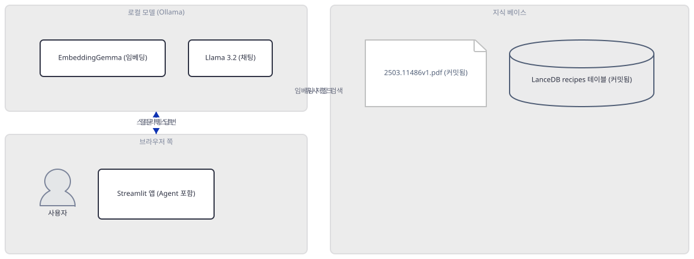
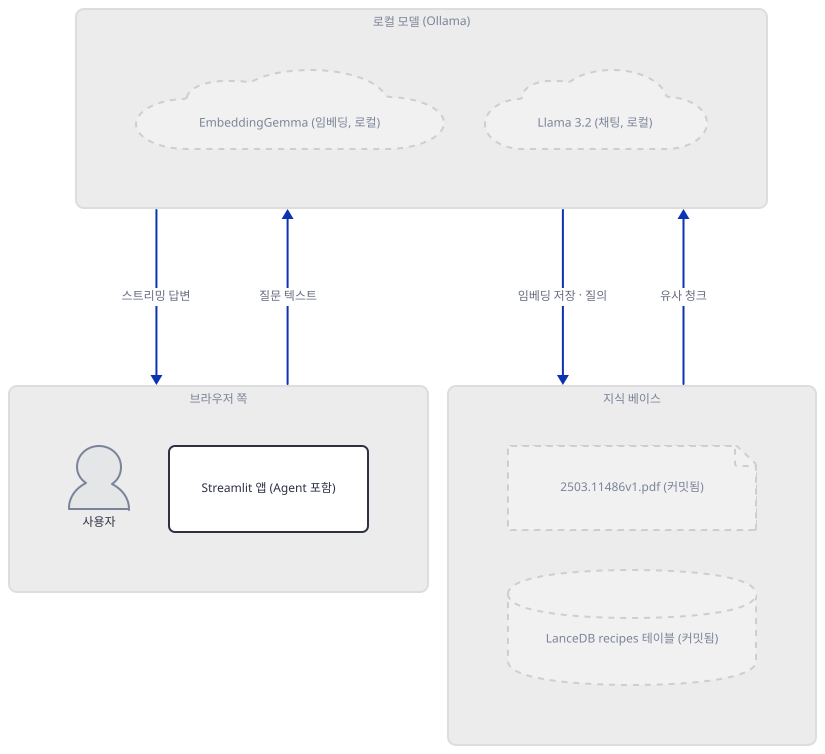
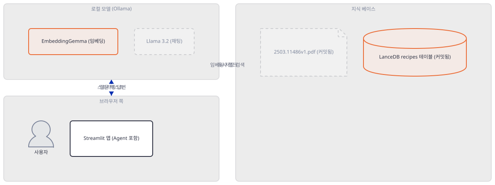
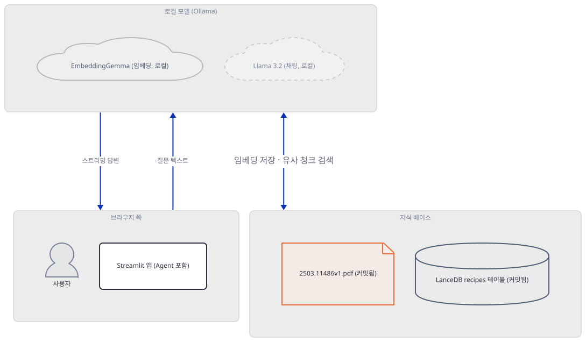
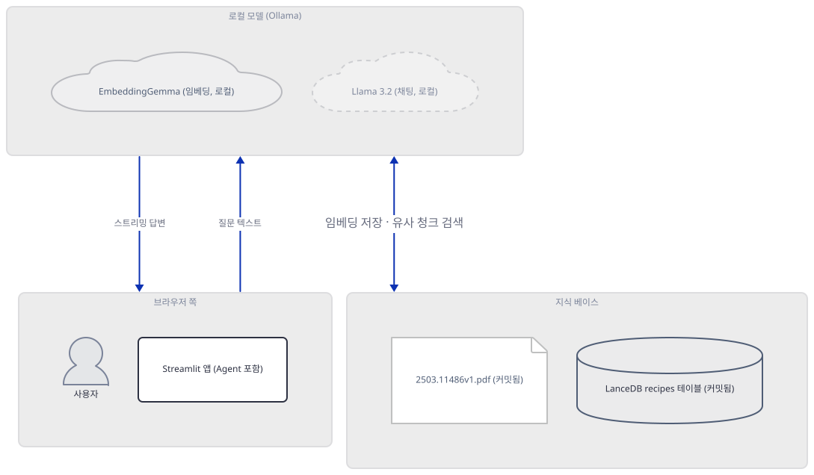
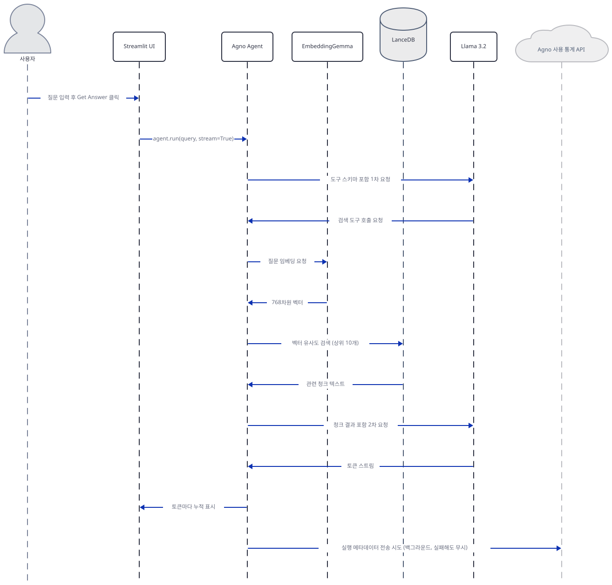

# Day 050 · 🔥 Agentic RAG with Embedding Gemma

> 볼륨 5 📀 RAG · 난이도 ★★☆ · 예상 소요 85분 · API 비용 대략 무료(모델 추론은 로컬 — EmbeddingGemma·Llama 3.2 모두 이미 설치됨, 각각 622MB·2.0GB, 이 문서는 받지 않음. 다만 agno·Streamlit 사용 통계가 나갑니다 — Step 5) · 원본 앱: `rag_tutorials/agentic_rag_embedding_gemma`

## 오늘 만들 것

오늘은 PDF URL을 사이드바에 추가하면 그 내용에 대해 대화할 수 있는 로컬 Streamlit RAG 앱을 만듭니다. Day 047처럼(048과는 달리 — 048은 채팅과 임베딩에 `llama3.1` 한 모델을 함께 씁니다) 임베딩과 채팅을 각각 다른 로컬 모델에 맡기는데, 이번엔 그 분리가 코드에 뚜렷합니다 — 임베딩은 구글의 EmbeddingGemma(`embeddinggemma:latest`, agno의 `OllamaEmbedder`)가, 답변 생성은 메타의 Llama 3.2(`llama3.2:latest`, agno의 `Ollama`)가 맡고, 벡터는 agno의 `Knowledge`가 감싼 LanceDB에 저장됩니다. 이 151줄에서 가장 눈여겨볼 것은 코드 자체보다 저장소입니다 — 앱 폴더에는 실제 논문 PDF(`2503.11486v1.pdf`, DeepSeek 모델들의 기법을 리뷰하는 11쪽짜리 arXiv 논문)와 함께, 이미 벡터 11개가 채워진 LanceDB 테이블(`tmp/lancedb/recipes.lance/`)이 통째로 커밋되어 있습니다. 테이블 이름은 `recipes`지만 안에는 요리 이야기가 한 줄도 없습니다 — 확인해 보면 그 11개 벡터 전부가 바로 이 논문의 조각이고, `table_name="recipes"`·`uri="tmp/lancedb"`라는 조합 자체가 Agno 공식 문서의 LanceDB 예제(Thai 레시피 PDF를 싣는 바로 그 예제)를 그대로 가져온 흔적이라는 것도 드러납니다. 이 문서는 커밋된 테이블이 그대로 열린다는 것(Step 3)과 그 벡터로 실제 검색이 된다는 것(Step 6, 다만 앱 자체가 아니라 `Knowledge`·`Agent`를 직접 만든 별도 스크립트로 확인합니다 — 지금 그대로의 앱은 43행에서 `AttributeError`로 멈춰 질문창에 이르지 못합니다, Step 4·6)까지 직접 실행으로 확인합니다. 여기에 더해 `agno>=2.2.10`이 Day 037·038·047과 같은 이유로 오늘도 3.0.10으로 풀리면서 임포트 하나와 메서드 이름 하나가 깨져 있다는 것(간단히만 다루고 Day 047을 가리킵니다), `agent.run()`을 부를 때마다 Agno 자체 API로 익명 사용 통계 전송이 시도된다는 것, 그리고 Day 048과 정반대로 이 앱은 캐싱 덕분에 질문을 반복해도 지식 베이스를 다시 만들지 않는다는 것까지 함께 확인합니다. 완성하면 논문 내용에 대해 질문하고 스트리밍으로 답을 받는 화면을 보게 됩니다. 아래는 완성된 아키텍처입니다.



## 사전 준비

| 서비스/도구 | 용도 | 발급·설치 |
|---|---|---|
| Ollama | `embeddinggemma:latest`(임베딩)·`llama3.2:latest`(채팅) 두 로컬 모델을 서빙하는 데몬 | https://ollama.com 설치, 데몬 상시 실행. 이 컴퓨터에는 둘 다 이미 있음(`ollama list`로 확인, 이 문서는 받지 않음) — ollama.com 라이브러리 페이지 기준 각각 622MB·2.0GB(2026-09-23 확인) |
| uv | 가상환경 생성과 패키지 설치 | [공통 사전 준비](../README.md#공통-사전-준비-한-번만) 절 참고 |
| 인터넷 연결 (선택) | 모델 추론 자체엔 필요 없지만, PyPI 설치와 사이드바로 새 PDF URL을 추가할 때 필요. `agent.run()`마다 Agno가 익명 사용 통계를 자체 API(`os-api.agno.com`)로 전송을 시도하는 것도 별개로 있음(실패해도 무시됨, Step 5에서 소스로 확인) | 별도 설치 없음 |

## 아키텍처 한눈에 보기

| 컴포넌트 | 역할 | 코드 위치 |
|---|---|---|
| 사용자 | 질문 입력, 사이드바에 PDF URL 추가 | 코드 없음 (브라우저) |
| Streamlit UI | 사이드바·질문 입력창·답변 표시, 세션 상태 관리 | `rag_tutorials/agentic_rag_embedding_gemma/agentic_rag_embeddinggemma.py:31-37`, `rag_tutorials/agentic_rag_embedding_gemma/agentic_rag_embeddinggemma.py:65-98` |
| 지식 베이스 (Knowledge) | LanceDB·임베더를 묶어 검색 인터페이스 제공, 프로세스당 한 번만 생성 | `rag_tutorials/agentic_rag_embedding_gemma/agentic_rag_embeddinggemma.py:19-29` |
| EmbeddingGemma (Ollama) | 청크·질의 텍스트를 768차원 벡터로 변환 | `rag_tutorials/agentic_rag_embedding_gemma/agentic_rag_embeddinggemma.py:26` |
| LanceDB recipes 테이블 | 벡터·원문 저장, 커밋된 채로 11행 보유 | `rag_tutorials/agentic_rag_embedding_gemma/agentic_rag_embeddinggemma.py:22-25` |
| 2503.11486v1.pdf | 앱 시작 시 자동 적재를 시도하는 커밋된 원본 논문 | `rag_tutorials/agentic_rag_embedding_gemma/agentic_rag_embeddinggemma.py:9-10`, `rag_tutorials/agentic_rag_embedding_gemma/agentic_rag_embeddinggemma.py:42-44` |
| Agno Agent | 검색 도구 등록, Llama 3.2로 최종 답변 생성, 실행마다 통계 전송 시도 | `rag_tutorials/agentic_rag_embedding_gemma/agentic_rag_embeddinggemma.py:52-63` |
| Llama 3.2 (Ollama) | 최종 답변 생성 | `rag_tutorials/agentic_rag_embedding_gemma/agentic_rag_embeddinggemma.py:53` |

## 단계별 진행

### Step 1. 환경 만들기 — agno 3.0.10과 openai 임포트

**목적.** `requirements.txt` 5줄을 설치하고, 오늘 실제로 풀리는 agno 버전에서 이 앱이 쓰는 6개 import가 모두 성공하는지 확인합니다.

**할 일.**

```bash
cd rag_tutorials/agentic_rag_embedding_gemma
uv venv
uv pip install -r requirements.txt
```

(pip 대안: `python -m venv .venv && source .venv/bin/activate && pip install -r requirements.txt`. Windows PowerShell은 활성화만 `.venv\Scripts\Activate.ps1`로 바꿉니다.)

이 저장소는 루트에 `pyproject.toml`이 있어 `uv run`이 방금 만든 환경 대신 루트의 `.venv`를 쓰므로, 이후 `uv run` 명령에는 모두 `--no-project`를 붙입니다. `uv venv`는 이 환경의 기본값인 Python 3.13.3을 그대로 골랐습니다(직접 확인) — 이 컴퓨터의 시스템 Python(3.13.12)과는 다른, uv 자체 관리 버전입니다.

`rag_tutorials/agentic_rag_embedding_gemma/requirements.txt:1-5`

```text
streamlit
agno>=2.2.10
lancedb
ollama
pypdf
```

(5줄입니다 — 마지막 줄에 개행이 없어 `wc -l`은 4로 셉니다.) 이 문서를 작성하며 설치했을 때는 **streamlit 1.64.0**, **agno 3.0.10**, **lancedb 0.39.0**, **ollama(파이썬 클라이언트) 0.6.2**, **pypdf 6.19.0**을 포함해 총 70개 패키지가 받아졌습니다(직접 확인). `agno>=2.2.10`이 3.0.10으로 풀리는 것은 Day 037·038·047이 같은 하한에서 이미 겪은 것과 같은 드리프트입니다 — 이 버전의 `agno.models.ollama` 패키지는 이 앱이 쓰는 `Ollama` 클래스만이 아니라 쓰지도 않는 `OllamaResponses`까지 함께 import하는데, 그 경로가 결국 `openai` 패키지를 요구합니다(Day 047이 같은 원인을 이미 확인했습니다). 이 하나만 설치하면 이 앱이 쓰는 6개 import는 전부 성공합니다 — Day 047의 앱과 달리 이 앱은 AgentOS(웹 서빙 계층)를 쓰지 않으므로 `agno[os]` extra는 필요 없습니다.

```bash
uv run --no-project python -c "from agno.models.ollama import Ollama"
```

직접 확인한 출력(마지막 줄 — `agno.models.openai.chat`이 `except ImportError:`로 받아 다시 던지는 바깥쪽 예외입니다. Day 047 Step 1과 같은 사슬입니다):

```
ImportError: `openai` not installed. Please install using `pip install openai`
```

```bash
uv pip install openai
```

**그림.**



**확인.**

```bash
uv run --no-project python -c "
import streamlit as st
from agno.agent import Agent
from agno.knowledge.embedder.ollama import OllamaEmbedder
from agno.knowledge.knowledge import Knowledge
from agno.models.ollama import Ollama
from agno.vectordb.lancedb import LanceDb, SearchType
print('6개 import 전부 성공')
"
```

```
6개 import 전부 성공
```

### Step 2. 지식 베이스 정의 — EmbeddingGemma와 LanceDB

**목적.** `load_knowledge_base()`가 실제로 무엇을 만드는지 — 벡터가 어디로 가는지, 임베딩 모델이 무엇이고 그 차원이 실제 모델과 맞는지 확인합니다.

**할 일.**

`rag_tutorials/agentic_rag_embedding_gemma/agentic_rag_embeddinggemma.py:19-29`

```python
@st.cache_resource
def load_knowledge_base():
    knowledge_base = Knowledge(
        vector_db=LanceDb(
            table_name="recipes",
            uri="tmp/lancedb",
            search_type=SearchType.vector,
            embedder=OllamaEmbedder(id="embeddinggemma:latest", dimensions=768),
        ),
    )
    return knowledge_base
```

`LanceDb`는 별도 서버가 아니라 파일 기반의 인프로세스 벡터 저장소입니다 — Day 047의 Qdrant(REST 서버)나 Day 048의 Chroma(프로세스 메모리, 디스크에는 안 남음)와 달리 `uri="tmp/lancedb"` 아래에 실제 파일(매니페스트·트랜잭션 로그·데이터 파일)이 그대로 남습니다. `search_type=SearchType.vector`는 agno가 지원하는 `vector`·`keyword`·`hybrid` 세 값 중 순수 벡터 유사도 검색만 쓴다는 뜻입니다(소스로 확인, agno 3.0.10의 `agno/vectordb/search.py`). 임베딩은 `OllamaEmbedder(id="embeddinggemma:latest", dimensions=768)` — 이 컴퓨터의 `ollama show embeddinggemma:latest`가 보고하는 실제 임베딩 길이(768)와 정확히 일치합니다(직접 확인, 아래). `load_knowledge_base()`가 `@st.cache_resource`로 감싸져 있다는 것도 눈여겨봐야 합니다 — 이 함수는 Streamlit 서버 프로세스당 딱 한 번만 실행되고, 이후 모든 재실행·모든 세션이 같은 `Knowledge` 객체를 돌려받습니다. Day 048은 이런 캐싱이 전혀 없어 질문마다 벡터 저장소를 처음부터 다시 만들었는데, 그 차이는 Step 6에서 직접 확인합니다.

**그림.**



**확인.** `embeddinggemma:latest`는 이미 이 컴퓨터에 있으므로(받지 않음) 실제 값을 바로 확인할 수 있습니다.

```bash
ollama show embeddinggemma:latest
```

```
  Model
    architecture        gemma3
    parameters          307.58M
    context length      2048
    embedding length    768
    quantization        BF16
```

```bash
cd rag_tutorials/agentic_rag_embedding_gemma
uv run --no-project python -c "
from agno.knowledge.embedder.ollama import OllamaEmbedder
from agno.knowledge.knowledge import Knowledge
from agno.vectordb.lancedb import LanceDb, SearchType
kb = Knowledge(
    vector_db=LanceDb(
        table_name='recipes',
        uri='tmp/lancedb',
        search_type=SearchType.vector,
        embedder=OllamaEmbedder(id='embeddinggemma:latest', dimensions=768),
    ),
)
print('vector_db.exists():', kb.vector_db.exists())
print('table row count:', kb.vector_db.table.count_rows())
"
```

(이 명령을 앱 폴더 안에서 실행하면 `uri='tmp/lancedb'`가 커밋된 실제 테이블을 가리킵니다 — 여는 것과 세는 것뿐이라 안전합니다. row count 값은 Step 3에서 다시 씁니다.)

```
vector_db.exists(): True
table row count: 11
```

### Step 3. 커밋된 PDF와 테이블의 실체 — 이름은 recipes, 내용은 DeepSeek

**목적.** 커밋된 `2503.11486v1.pdf`가 실제로 무엇이고, 이미 채워진 11개 벡터가 그 논문과 어떤 관계인지, 그리고 테이블 이름이 왜 `recipes`인지 확인합니다.

**할 일.**

`rag_tutorials/agentic_rag_embedding_gemma/agentic_rag_embeddinggemma.py:9-10`

```python
# Local PDF file path
LOCAL_PDF_PATH = os.path.join(os.path.dirname(__file__), "2503.11486v1.pdf")
```

pypdf로 직접 열어보면 이 PDF는 11쪽, 제목은 "A Review of DeepSeek Models' Key Innovative Techniques"(arXiv 2503.11486, 2025년 3월)입니다 — Multi-Head Latent Attention·Mixture of Experts·GRPO 같은 DeepSeek의 기법을 정리한 리뷰 논문이고 요리·레시피와는 아무 관계가 없습니다(직접 확인, 아래). 그런데 Step 2에서 이미 본 대로 커밋된 LanceDB 테이블에는 벡터가 11개 있습니다 — 그 내용을 들여다보면 11개 전부가 바로 이 논문의 조각입니다.

```bash
uv run --no-project python -c "
import lancedb
db = lancedb.connect('tmp/lancedb')
df = db.open_table('recipes').to_pandas()
print('row count:', len(df))
print('payload[0][:60]:', df['payload'].iloc[0][:60])
"
```

```
row count: 11
payload[0][:60]: {"name": "2503.11486v1.pdf", "meta_data": {"page": 1}, "cont
```

(11개 행의 `payload` 전부가 `"name": "2503.11486v1.pdf"`를 담고 있습니다 — 직접 확인.) 그렇다면 왜 테이블 이름이 `recipes`일까요. Agno 공식 문서(docs.agno.com/knowledge/vector-stores/lancedb/overview)의 LanceDB 예제가 정확히 이 조합 — `LanceDb(table_name="recipes", uri="tmp/lancedb")` — 을 그대로 쓰고, 그 예제가 싣는 파일도 실제 Thai 레시피 PDF(`agno-public.s3.amazonaws.com/recipes/ThaiRecipes.pdf`)입니다. Day 047의 원본 앱도 같은 계열의 Thai 레시피 PDF를 씁니다. 이 앱은 그 공식 예제 코드를 그대로 가져오면서 PDF만 이 DeepSeek 논문으로 바꾸고 테이블 이름은 고치지 않은 것으로 보입니다 — `recipes`는 이 앱의 실제 내용과 무관한, 예제 코드의 흔적입니다.

더 중요한 질문은 이 테이블이 실제로 재사용되는가입니다. `uri="tmp/lancedb"`(24행)는 `os.path.dirname(__file__)`로 고정된 `LOCAL_PDF_PATH`(10행)와 달리 순수한 상대 경로 문자열이라서, 실행 시점의 현재 작업 디렉터리에 따라 다른 곳을 가리킵니다 — 앱 자체 README가 안내하는 대로 `cd rag_tutorials/agentic_rag_embedding_gemma` 후 `streamlit run agentic_rag_embeddinggemma.py`를 실행하면 정확히 이 커밋된 테이블을 가리키지만, 저장소 루트에서 경로를 지정해 실행하면 완전히 새 빈 테이블이 만들어집니다. 안내대로 실행했을 때 실제로 재사용되는지는 이 테이블을 절대 건드리지 않도록 통째로 임시 디렉터리에 복사한 뒤 그 복사본에서 확인했습니다(이 문서를 쓰며 그렇게 했습니다, 커밋된 원본은 건드리지 않았습니다) — `Knowledge(vector_db=LanceDb(...))`를 만들기 전후로 행 개수가 11로 그대로였고 `vector_db.exists()`는 `True`였습니다. 즉 이 앱은 매번 새 테이블을 만드는 것이 아니라 커밋된 테이블을 찾아 그대로 엽니다.

**그림.**



**확인.**

```bash
uv run --no-project python -c "
import pypdf
r = pypdf.PdfReader('2503.11486v1.pdf')
print('pages:', len(r.pages))
print(r.pages[0].extract_text()[:60])
"
```

직접 확인한 출력(글자 그대로 — 굽은 따옴표이고, `[:60]`이 줄바꿈까지 넘어가 둘째 줄 저자명 앞부분이 함께 잘립니다):

```
pages: 11
A Review of DeepSeek Models’ Key Innovative Techniques
Cheng
```

### Step 4. 지식 적재 — add_content가 사라졌다

**목적.** 앱 시작 시 이 PDF를 자동으로 넣으려는 코드가 오늘의 agno에서 실제로 어떻게 되는지, 그리고 사이드바로 URL을 추가하는 경로도 같은 문제를 겪는지 확인합니다.

**할 일.**

`rag_tutorials/agentic_rag_embedding_gemma/agentic_rag_embeddinggemma.py:41-50`

```python
# Auto-load local PDF file if it exists
if not st.session_state.local_pdf_loaded and os.path.exists(LOCAL_PDF_PATH):
    kb.add_content(path=LOCAL_PDF_PATH)
    st.session_state.local_pdf_loaded = True

# Load initial URLs if any (only load once per URL)
for url in st.session_state.urls:
    if url not in st.session_state.urls_loaded:
        kb.add_content(url=url)
        st.session_state.urls_loaded.add(url)
```

`LOCAL_PDF_PATH`는 커밋된 파일이라 항상 존재하므로 이 블록은 앱을 처음 여는 모든 세션에서 실행을 시도합니다. 그런데 `kb.add_content(...)`라는 메서드 자체가 오늘 설치되는 agno 3.0.10의 `Knowledge`에는 없습니다 — Day 047이 같은 구조에서 이미 확인한 것과 같은 드리프트입니다(`insert(...)`로 이름이 바뀌었고 `path=`/`url=` 인자는 그대로입니다). 이 앱이 실제로 선언하는 하한인 `agno==2.2.10`을 별도로 설치해 보면 그 버전의 `Knowledge`에는 `add_content`가 실제로 있습니다(직접 확인) — 이 코드는 그 버전을 겨냥해 쓰였고 오늘 풀리는 버전에서만 깨진다는 뜻입니다. 사이드바의 "➕ Add URL" 버튼(`rag_tutorials/agentic_rag_embedding_gemma/agentic_rag_embeddinggemma.py:80`)이 부르는 것도 같은 `kb.add_content(url=new_url)`(`rag_tutorials/agentic_rag_embedding_gemma/agentic_rag_embeddinggemma.py:85`)이라서, URL 추가도 같은 자리에서 같은 이유로 멈춥니다.

**그림.**



**확인.** 실제 파일을 건드리지 않도록 존재하지 않는 더미 경로로 호출합니다 — 속성 조회가 파일 접근보다 먼저 실패하므로 안전합니다.

```bash
uv run --no-project python -c "
from agno.knowledge.embedder.ollama import OllamaEmbedder
from agno.knowledge.knowledge import Knowledge
from agno.vectordb.lancedb import LanceDb, SearchType
kb = Knowledge(vector_db=LanceDb(table_name='recipes', uri='tmp/lancedb', search_type=SearchType.vector, embedder=OllamaEmbedder(id='embeddinggemma:latest', dimensions=768)))
print('has add_content:', hasattr(kb, 'add_content'))
print('has insert:', hasattr(kb, 'insert'))
kb.add_content(path='no-such-file.pdf')
"
```

```
has add_content: False
has insert: True
AttributeError: 'Knowledge' object has no attribute 'add_content'. Did you mean: 'aget_content'?
```

### Step 5. 채팅 모델·Agent 구성과 조용한 텔레메트리

**목적.** `Agent(...)`가 채팅 모델과 지식 베이스를 어떻게 묶는지, 그리고 이 생성자와 `agent.run()`이 실제로 어떤 네트워크를 타는지 확인합니다.

**할 일.**

`rag_tutorials/agentic_rag_embedding_gemma/agentic_rag_embeddinggemma.py:52-63`

```python
agent = Agent(
    model=Ollama(id="llama3.2:latest"),
    knowledge=kb,
    instructions=[
        "Search the knowledge base for relevant information and base your answers on it.",
        "Be clear, and generate well-structured answers.",
        "Use clear headings, bullet points, or numbered lists where appropriate.",
    ],
    search_knowledge=True,
    debug_mode=False,
    markdown=True,
)
```

`search_knowledge=True`는 Day 047이 이미 확인한 대로 매 프롬프트에 검색 결과를 강제로 끼워넣는 것이 아니라, 모델이 스스로 호출 여부를 판단하는 도구(`search_knowledge_base`)를 등록할 뿐입니다 — 같은 메커니즘이라 여기서는 되풀이하지 않습니다. `Ollama(id="llama3.2:latest")`도 `OllamaEmbedder`처럼 생성 시점에는 네트워크를 타지 않습니다 — 존재하지 않는 포트(`127.0.0.1:1`)로 `host`를 지정해도 `Agent(...)` 생성 전체가 그대로 성공한다는 것으로 직접 확인했습니다(아래).

그런데 `agent.run()`은 다릅니다. Day 047 Step 5가 로컬 수신기(`AGNO_API_RUNTIME=dev` + `localhost:7070`)로 이미 직접 확인한 그대로, agno 3.0.10은 `run()`이 **성공적으로** 끝날 때마다(스트리밍 여부와 무관, 실패한 실행은 보내지 않습니다) 에이전트 id·모델 provider/이름·지식 베이스나 도구 사용 여부 같은 익명 메타데이터를 Agno 자체 API로 전송을 시도합니다 — 백그라운드 큐+데몬 스레드라 `run()` 자체는 느려지지 않고, 실패해도 조용히 무시됩니다. 이 앱은 047과 달리 `AgentOS`를 쓰지 않으므로 그 시작 이벤트(`POST /telemetry/os`, 047에서는 `AGNO_TELEMETRY=false`만으로 안 꺼지던 바로 그것)는 애초에 없습니다 — 여기서는 `Agent(telemetry=False)`나 환경변수 `AGNO_TELEMETRY=false` 어느 쪽으로도 이 실행 이벤트 하나를 끌 수 있습니다(소스로 확인, `agno/agent/_telemetry.py`·`agno/agent/_init.py`). 이 앱 화면의 "100% local"이라는 문구(`rag_tutorials/agentic_rag_embedding_gemma/agentic_rag_embeddinggemma.py:101`)는 이 사실과 모순됩니다 — "Get Answer"를 누를 때마다 Agno 쪽으로 나가는 요청이 하나 있습니다.

**그림.**


**확인.**

```bash
uv run --no-project python -c "
from agno.agent import Agent
from agno.models.ollama import Ollama
BAD = 'http://127.0.0.1:1'
agent = Agent(model=Ollama(id='llama3.2:latest', host=BAD))
print('생성자 성공, 이 시점까지 네트워크 요청 없음')
"
```

```
생성자 성공, 이 시점까지 네트워크 요청 없음
```

### Step 6. 사이드바·질문 처리·캐싱, 그리고 실행 증명

**목적.** URL 추가와 질문 처리 두 UI 흐름을 확인하고, 재실행마다 무엇이 실제로 다시 도는지 — Day 048과 정반대라는 것을 — 직접 실행으로 증명합니다.

**할 일.**

`rag_tutorials/agentic_rag_embedding_gemma/agentic_rag_embeddinggemma.py:116-133`

```python
if st.button("🚀 Get Answer", type="primary"):
    if not query:
        st.error("Please enter a question")
    else:
        st.markdown("### 💡 Answer")
        
        with st.spinner("🔍 Searching knowledge and generating answer..."):
            try:
                response = ""
                resp_container = st.empty()
                gen = agent.run(query, stream=True)
                for resp_chunk in gen:
                    # Display response
                    if resp_chunk.content is not None:
                        response += resp_chunk.content
                        resp_container.markdown(response)
            except Exception as e:
                st.error(f"Error: {e}")
```

Day 048·Day 005의 앱과 달리 이 블록에는 실제로 `try/except`가 있습니다 — 생성 도중 예외가 나도 화면 전체가 처리되지 않은 예외로 멈추는 대신 `st.error(...)`로 표시됩니다. `load_knowledge_base()`가 `@st.cache_resource`로 감싸져 있고(Step 2) 로컬 PDF 적재는 `st.session_state.local_pdf_loaded`로 한 세션에 한 번만 시도되므로(`rag_tutorials/agentic_rag_embedding_gemma/agentic_rag_embeddinggemma.py:42`, 소스로 확인), 질문을 두 번째·세 번째로 물어볼 때 다시 실행되는 코드는 사실상 이 블록뿐입니다 — `agent` 객체 자체는 매 재실행마다 새로 만들어지지만(`rag_tutorials/agentic_rag_embedding_gemma/agentic_rag_embeddinggemma.py:52`) 그 안의 `knowledge=kb`는 캐시된 같은 객체를 계속 참조하므로, 벡터 저장소는 처음부터 다시 만들어지지 않습니다. `st.cache_resource`가 정말 프로세스당 한 번만 함수를 실행한다는 것은 앱 전체를 재실행하지 않고도 그 데코레이터 자체로 직접 확인할 수 있습니다(아래).

마지막으로, 이 문서의 핵심 주장 — 아무 콘텐츠도 추가하지 않은 채로 커밋된 벡터에서 답이 나온다는 것 — 을 실제로 실행해 확인합니다. 다음 명령은 삽입 없이 검색만 하므로 커밋된 테이블을 안전하게 그대로 씁니다.

**그림.**


**확인.**

```bash
uv run --no-project python -c "
import streamlit as st
calls = {'n': 0}
@st.cache_resource
def build():
    calls['n'] += 1
    return object()
a, b, c = build(), build(), build()
print('build() 호출 횟수:', calls['n'])
print('세 결과가 같은 객체:', a is b is c)
"
```

```
build() 호출 횟수: 1
세 결과가 같은 객체: True
```

```bash
cd rag_tutorials/agentic_rag_embedding_gemma
uv run --no-project python -c "
from agno.agent import Agent
from agno.knowledge.embedder.ollama import OllamaEmbedder
from agno.knowledge.knowledge import Knowledge
from agno.models.ollama import Ollama
from agno.vectordb.lancedb import LanceDb, SearchType

kb = Knowledge(vector_db=LanceDb(table_name='recipes', uri='tmp/lancedb', search_type=SearchType.vector, embedder=OllamaEmbedder(id='embeddinggemma:latest', dimensions=768)))
before = kb.vector_db.table.count_rows()
agent = Agent(model=Ollama(id='llama3.2:latest'), knowledge=kb, search_knowledge=True, markdown=True)
answer = ''
for chunk in agent.run('What optimization algorithm did DeepSeek use for post-training?', stream=True):
    if chunk.content is not None:
        answer += chunk.content
after = kb.vector_db.table.count_rows()
print('행 개수 (전/후):', before, after)
print('답변 앞부분:', answer[:150])
"
```

직접 확인한 출력(발췌 — 답변 문구는 실행마다 달라지는 비결정적 값입니다):

```
행 개수 (전/후): 11 11
답변 앞부분: This appears to be a PDF document containing a research paper or a list of references related to the topic of DeepSeek and its variants.
```

(제 실행에서는 이 출력 전에 `INFO    Found 10 documents`라는 agno 자체 로그도 함께 떴습니다 — 11개 중 10개를 검색해 왔다는 뜻입니다. 이 호출은 도구 호출 여부를 판단하는 1차 요청과 최종 답변을 만드는 2차 요청, 총 두 번의 `llama3.2` 생성이 필요해서 수 분이 걸렸습니다 — 기기 성능에 따라 크게 달라지는 값입니다. 답변 자체는 논문의 세부 내용을 정확히 요약하지는 못했지만, 행 개수가 실행 전후로 그대로라는 것과 "Found 10 documents" 로그는 이 앱을 아무 콘텐츠도 추가하지 않고 그대로 실행해도 커밋된 벡터에서 실제로 검색이 일어난다는 것을 보여줍니다.)

## 요청 한 건이 흐르는 과정



질문을 입력하고 "Get Answer"를 누르면 `agent.run(query, stream=True)`가 호출됩니다. Agent는 먼저 도구 스키마(그중 하나가 `search_knowledge_base`)를 포함해 `llama3.2`에 1차 요청을 보내고, 모델이 검색이 필요하다고 판단하면 도구 호출 요청으로 응답합니다 — 이 판단 메커니즘 자체는 Day 047이 이미 소스로 확인한 것과 같으므로 여기서는 되풀이하지 않습니다. 도구가 실행되면 질문 텍스트가 `EmbeddingGemma`를 거쳐 768차원 벡터가 되고, 그 벡터로 LanceDB의 `recipes` 테이블을 유사도 검색해 관련 청크 텍스트를 돌려받습니다. 이 텍스트가 다시 `llama3.2`로 가는 2차 요청에 담기면 모델이 토큰을 스트리밍으로 생성하고, 화면은 도착하는 조각마다 같은 자리에 이어붙여 표시합니다. 마지막으로 `agent.run()`이 끝나면 Agno가 실행 메타데이터를 자체 API로 전송을 시도합니다 — 성공하든 실패하든 화면에는 드러나지 않는 백그라운드 동작입니다(Step 5). 이 전체 흐름은 실제로 한 번에 실행해 최종 답과 "Found 10 documents" 로그, 그리고 검색 전후로 테이블 행 개수가 그대로라는 것까지 직접 확인했습니다(Step 6) — 다만 1차 요청과 도구 호출 요청 사이의 정확한 경계, 그리고 텔레메트리 전송 자체는 개별 네트워크 호출 단위로 다시 가로채 보지는 않았고 agno 소스를 근거로 그렸습니다.

## 실행 체크리스트

- [ ] `uv venv && uv pip install -r requirements.txt`로 70개 패키지를 설치하고, `openai`를 추가로 설치해야 6개 import가 전부 성공한다는 것을 확인했다
- [ ] `embeddinggemma:latest`의 실제 임베딩 길이(768)가 코드의 `dimensions=768`과 일치한다는 것을 `ollama show`로 확인했다
- [ ] 커밋된 `tmp/lancedb/recipes.lance/` 테이블에 이미 벡터 11개가 있고, 그 전부가 커밋된 `2503.11486v1.pdf`(레시피가 아니라 DeepSeek 리뷰 논문)의 조각이라는 것을 확인했다
- [ ] `Knowledge(vector_db=LanceDb(...))`를 만들어도 이 테이블의 행 개수가 그대로라는 것 — 새로 만드는 게 아니라 재사용한다는 것 — 을 확인했다
- [ ] `kb.add_content(...)`가 오늘의 agno에서 `AttributeError`로 실패하고 `insert`로 이름이 바뀌었다는 것을 확인했다
- [ ] `Agent(...)` 생성자는 네트워크를 타지 않지만 `agent.run()`은 성공할 때마다 Agno 자체 API로 통계 전송을 시도한다는 것을 Day 047의 직접 확인으로 안다
- [ ] `st.cache_resource`가 감싼 함수는 프로세스당 한 번만 실행되고 이후 호출은 같은 객체를 돌려받는다는 것을 직접 확인했다
- [ ] 앱 자체는 지금 그대로 43행에서 멈춰 질문창에 이르지 못한다는 것과, `Knowledge`·`Agent`를 직접 만든 별도 스크립트로는 아무 콘텐츠도 추가하지 않은 채 커밋된 벡터에서 실제로 검색되어 답이 만들어진다는 것을 확인했다

## 문제 해결

| 증상 | 원인 | 해결 |
|---|---|---|
| `from agno.models.ollama import Ollama`가 ``ImportError: `openai` not installed…``로 실패(안쪽 원인은 `ModuleNotFoundError: No module named 'openai'`, 직접 확인) | agno 3.0.10의 `agno.models.ollama`가 쓰지 않는 `OllamaResponses`까지 함께 import해 `openai`를 요구함(Day 047과 같은 원인, 직접 확인) | `uv pip install openai` |
| `kb.add_content(path=...)`/`kb.add_content(url=...)`가 `AttributeError: 'Knowledge' object has no attribute 'add_content'. Did you mean: 'aget_content'?` | agno 3.0.10에서 메서드 이름이 `insert`로 바뀜(Day 047과 같은 원인, `path=`/`url=` 인자는 그대로, 직접 확인) | 리포 코드는 고치지 않는 것이 이 시리즈의 방침 — 직접 재현하려면 `add_content(...)`를 `insert(...)`로 바꿔 호출 |
| 저장소 루트 등 다른 위치에서 실행하면 지금 그대로는 43행에서 `AttributeError: 'Knowledge' object has no attribute 'add_content'`로 멈추고(질문창은 렌더되지 않음), 작업 디렉터리에 빈 `tmp/lancedb/recipes.lance`가 새로 생김. `add_content`→`insert`로 고친 뒤라면 69행 `st.image("google.png")`에서 `MediaFileStorageError: Error opening 'google.png'`로 멈춤(둘 다 직접 확인, Streamlit `AppTest`로 작업 디렉터리를 바꿔 재현) | `uri="tmp/lancedb"`(`rag_tutorials/agentic_rag_embedding_gemma/agentic_rag_embeddinggemma.py:24`)가 `__file__` 기준이 아닌 상대 경로라 작업 디렉터리에 따라 커밋된 테이블 대신 새 빈 테이블을 가리킴(직접 확인, Step 3). `google.png` 등 이미지 경로도 마찬가지로 상대 경로다 | 앱 자체 README대로 `cd rag_tutorials/agentic_rag_embedding_gemma` 후 실행 |
| agno 사용 통계 전송 자체를 끄고 싶음 | `agent.run()`이 성공할 때마다 나가는 요청이 있음(Step 5) — 전송은 백그라운드라 답이 느려지지는 않는다 | `Agent(telemetry=False)` 또는 환경변수 `AGNO_TELEMETRY=false`(PowerShell은 `$env:AGNO_TELEMETRY="false"`) |

## 더 해보기

- `kb.add_content(...)`가 나오는 세 곳(`rag_tutorials/agentic_rag_embedding_gemma/agentic_rag_embeddinggemma.py:43`, `rag_tutorials/agentic_rag_embedding_gemma/agentic_rag_embeddinggemma.py:49`, `rag_tutorials/agentic_rag_embedding_gemma/agentic_rag_embeddinggemma.py:85`)를 모두 `insert(...)`로 바꿔 실행해보기. `insert`의 기본값 `upsert=True`가 경로 기준 content_hash로 중복을 걸러내므로, 커밋된 PDF만 다시 도는 첫 실행은 행 11개를 지우고 11개를 다시 넣어 **행 개수는 11 그대로**입니다(직접 확인 — 다만 `tmp/lancedb/recipes.lance/`에는 새 트랜잭션·매니페스트·삭제 마커 파일이 여러 개 생깁니다, 커밋하지 않도록 주의). 행 개수가 실제로 늘어나는 것은 사이드바에서 **새 PDF URL**을 추가할 때입니다 — 그때 `recipes` 테이블이 몇 행 늘어나는지 관찰해보기
- `model=Ollama(id="llama3.2:latest")`(`rag_tutorials/agentic_rag_embedding_gemma/agentic_rag_embeddinggemma.py:53`)를 이미 받아져 있는 더 큰 모델(`gemma3:12b` 등)로 바꿔, 같은 검색 결과에서 Step 6과 같은 질문에 대한 답변 품질이 어떻게 달라지는지 비교해보기
- `Agent(...)`(`rag_tutorials/agentic_rag_embedding_gemma/agentic_rag_embeddinggemma.py:52-63`)에 `telemetry=False`를 추가해, Step 5에서 확인한 통계 전송 시도가 사라지는지 확인해보기

## 다음 날 예고

[Day 051 · 🧩 RAG-as-a-Service](../day051-rag-as-a-service/README.md) — 로컬 모델과 커밋된 벡터 저장소 대신, Claude Sonnet 4.5와 Ragie.ai라는 매니지드 서비스에 문서 처리와 검색을 통째로 맡기는 RAG를 다룹니다.
